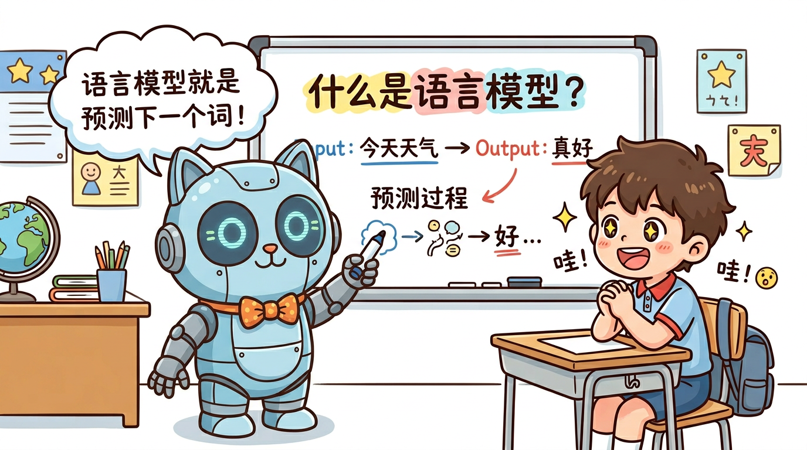
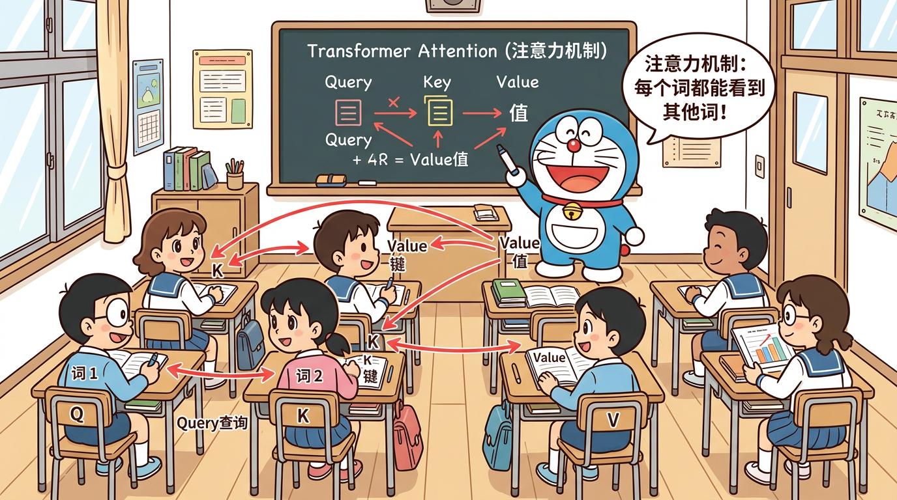

# 🎯 CS336 面试导向学习指南

> **Stanford CS336: Language Modeling from Scratch** — 面向小白的面试导向完整学习项目

本项目基于斯坦福大学 CS336 课程（Language Modeling from Scratch），专为准备 AI/大模型岗位面试的同学打造。从零开始，手把手带你理解、实现并掌握大语言模型的全链路知识。

**范围与版本**：主要参考 [CS336 Spring 2025](https://cs336.stanford.edu/spring2025/)，整理为课程总览与 20 篇学习笔记；这不是官方课次划分或完整作业答案。LoRA、DPO、推理部署等包含拓展学习。`code/` 是教学实现，不代表已完成全部官方测试、真实 GPU 性能实验或生产部署。

---

## 📚 项目结构

```
learn-cs336/
├── docs/           # 课程总览 + 20节课程文档（面试导向）
├── interview/      # 面试专区（八股文、STAR面试稿、简历模板）
├── comics/         # 哆啦A梦风格漫画插图
├── code/           # 核心教学实现与练习脚本
├── tests/          # CPU 正确性与导出回归测试
├── generate_output.py  # HTML / 合并 Markdown 导出
├── requirements.txt    # Python 依赖
└── output/         # 生成的 HTML / 合并 Markdown
```

---

## 🗺️ 学习路线图

### 第一部分：基础篇（对应 Assignment 1）

| 课程 | 主题 | 核心面试考点 |
|------|------|-------------|
| [Lesson 01](docs/01-环境搭建与Python基础.md) | 环境搭建与项目总览 | PyTorch基础、张量操作 |
| [Lesson 02](docs/02-BPE分词器原理与实现.md) | BPE分词器原理与实现 | BPE训练/推理流程、字节级BPE |
| [Lesson 03](docs/03-Transformer架构详解.md) | Transformer架构详解 | Encoder/Decoder/Decoder-only对比 |
| [Lesson 04](docs/04-多头注意力与RoPE.md) | 多头注意力与RoPE | Self-Attention计算、位置编码对比 |
| [Lesson 05](docs/05-RMSNorm-SwiGLU-GQA.md) | RMSNorm/SwiGLU/GQA | 现代LLM"四件套"详解 |
| [Lesson 06](docs/06-AdamW优化器实现.md) | AdamW优化器实现 | 优化器原理、学习率调度 |
| [Lesson 07](docs/07-训练循环与损失函数.md) | 训练循环与损失函数 | 交叉熵、Top-p采样、困惑度 |
| [Lesson 08](docs/08-Assignment1实战指南.md) | Assignment 1 实战 | 完整代码走读与调试 |

### 第二部分：系统篇（对应 Assignment 2）

| 课程 | 主题 | 核心面试考点 |
|------|------|-------------|
| [Lesson 09](docs/09-GPU架构与内存层级.md) | GPU架构与内存层级 | SRAM/HBM/DRAM层级、算力瓶颈 |
| [Lesson 10](docs/10-FlashAttention原理与Triton.md) | FlashAttention与Triton | 分块计算、IO感知算法 |
| [Lesson 11](docs/11-DDP分布式训练.md) | DDP分布式训练 | AllReduce、梯度同步、通信开销 |
| [Lesson 12](docs/12-Assignment2系统优化实战.md) | Assignment 2 实战 | 性能分析与优化 |

### 第三部分：缩放与数据篇（对应 Assignment 3-4）

| 课程 | 主题 | 核心面试考点 |
|------|------|-------------|
| [Lesson 13](docs/13-Scaling-Laws缩放定律.md) | Scaling Laws缩放定律 | 幂律关系、Chinchilla配比 |
| [Lesson 14](docs/14-数据工程-CommonCrawl处理.md) | 数据工程 | Common Crawl处理流程 |
| [Lesson 15](docs/15-数据过滤与去重.md) | 数据过滤与去重 | MinHash、质量过滤策略 |
| [Lesson 16](docs/16-Assignment3-4实战指南.md) | Assignment 3-4 实战 | 缩放实验与数据管道 |

### 第四部分：对齐与部署篇（Assignment 5 与拓展学习）

| 课程 | 主题 | 核心面试考点 |
|------|------|-------------|
| [Lesson 17](docs/17-SFT有监督微调.md) | SFT有监督微调 | 指令数据构建、灾难性遗忘 |
| [Lesson 18](docs/18-RLHF-DPO-GRPO对齐技术.md) | RLHF/DPO/GRPO对齐技术 | 奖励模型、偏好优化 |
| [Lesson 19](docs/19-Assignment5对齐实战.md) | Assignment 5 实战 | 数学推理RL训练 |
| [Lesson 20](docs/20-推理优化与模型部署.md) | 推理优化与模型部署 | KV Cache、量化、vLLM |

---

## 🎤 面试专区

| 文档 | 内容 |
|------|------|
| [面试八股文大全](interview/01-面试八股文大全.md) | 100+道面试题与详细答案 |
| [岗位需求分析](interview/02-岗位需求分析.md) | AI/大模型岗位能力参考，非薪资统计 |
| [项目简历模板](interview/03-项目简历模板.md) | CS336项目简历STAR写法（3种版本） |
| [STAR面试稿](interview/04-STAR面试稿.md) | 10个核心STAR回答脚本 |
| [面试问题全集](interview/05-面试问题全集.md) | 面试话题清单与 STAR 回答模板 |
| [面经汇总](interview/06-面经汇总.md) | 复习题单与面经来源说明 |

---

## 🎨 漫画图解

每2节课配1张哆啦A梦风格漫画，用生动的比喻帮助理解复杂概念：

| 漫画 | 主题 | 比喻 |
|------|------|------|
|  | 语言模型 | 大雄写作文，哆啦A梦掏出道具 |
|  | BPE分词器 | 把文字切成小块拼图 |
|  | Transformer | 大雄上课走神vs认真听讲 |
| ... | ... | ... |

---

## 💻 核心代码

- [`code/tokenizer/`](code/tokenizer/) — 字节级 BPE 教学实现，非完整 GPT-2 tokenizer 接口
- [`code/model/`](code/model/) — Transformer语言模型
- [`code/training/`](code/training/) — 训练循环与优化器
- [`code/systems/`](code/systems/) — PyTorch 分块在线注意力与 DDP 教学实现，不是 Triton/FlashAttention-2 高性能内核
- [`code/alignment/`](code/alignment/) — SFT与GRPO对齐

GRPO 示例按原始 softmax 策略采样，保存原始生成 token 与旧策略 log-prob，再做 token 级裁剪更新；不要把任意 temperature/top-p 采样后重新编码的文本当作等价 rollout。SFT/GRPO 运行需准备模型权重与配套 tokenizer；单元测试使用本地小模型，不下载权重。简历和 STAR 中的指标必须替换为自己的实测数据。

---

## 🚀 安装与验证

推荐 Python 3.11+，在项目根目录运行：

```bash
python3 -m venv .venv
source .venv/bin/activate
python -m pip install --upgrade pip
python -m pip install -r requirements.txt
python -m unittest discover -s tests -v
python code/basic_study/post_install_check.py
```

macOS/CPU 可运行基础模块与单元测试；`triton` 依赖仅在 Linux x86_64 安装。GPU 内核、NCCL 多卡与性能结论仍需在匹配的 Linux/CUDA 硬件上验证；安装 PyTorch 时应按 [官方安装说明](https://pytorch.org/get-started/locally/) 选择设备版本。

---

## 📖 参考资源

- [Stanford CS336 官方课程](https://stanford-cs336.github.io/spring2025/)
- [官方Assignment代码](https://github.com/stanford-cs336)
- [参考实现 - Melody-Zhou](https://github.com/Melody-Zhou/stanford-cs336-spring2025-assignments)
- [课程评价 - Pinlin Xu](https://www.pinlinxu.com/posts/cs336_review.html)
- [课程评价 - Andy Timm](https://andytimm.github.io/posts/cs336/cs336_review.html)
- [中文笔记 - Munger Yang](https://mungeryang.github.io/2025/07/14/cs336-study-note/)

---

## 📄 文档导出与预览

```bash
python generate_output.py
python -m http.server 8767 --bind 127.0.0.1
```

打开 [HTML 预览](http://127.0.0.1:8767/output/index.html)。本地输出包括 [HTML 文件](output/index.html) 和 [合并 Markdown](output/cs336-guide-combined.md)；源文件修改后需重新生成。也可使用 `python generate_output.py --output-dir <目录>` 指定输出位置。

公式使用固定版本的 KaTeX CDN，需联网加载；页面提示“公式已渲染”后，可用浏览器打印并保存 PDF。本仓库不提供预生成 PDF，直接用 WeasyPrint 转换不会执行公式 JavaScript。HTML 的图片与代码链接依赖原仓库文件，移动输出时需要同时保留这些资源。

---

## License

本项目仅供学习参考。课程讲义与引用的第三方资料、图片应分别核对原来源的许可；仓库目前没有独立 `LICENSE` 文件，不能把“学习用途”当作所有内容均可商用的授权。
