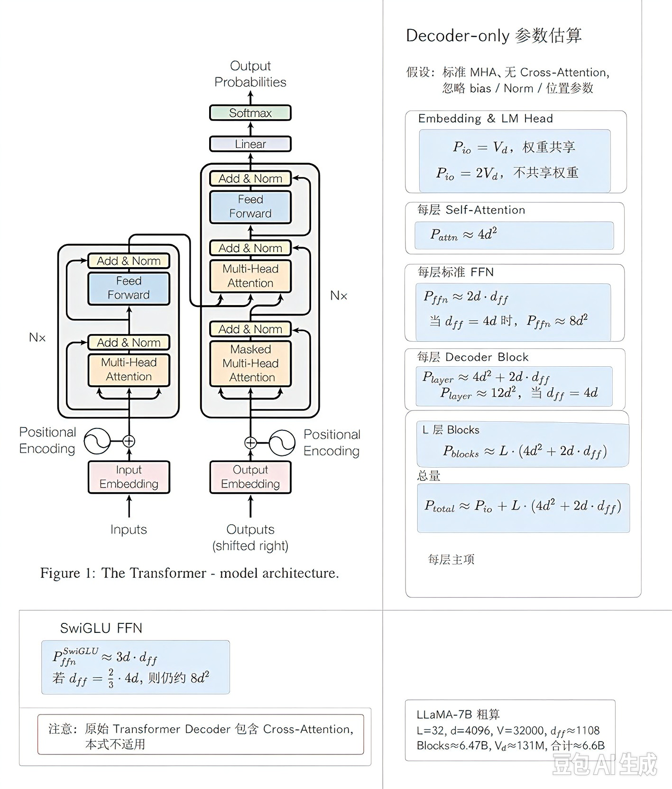
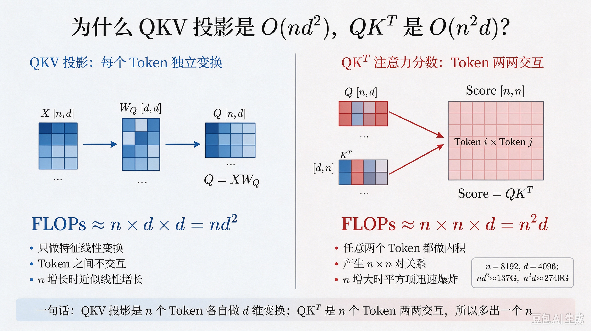
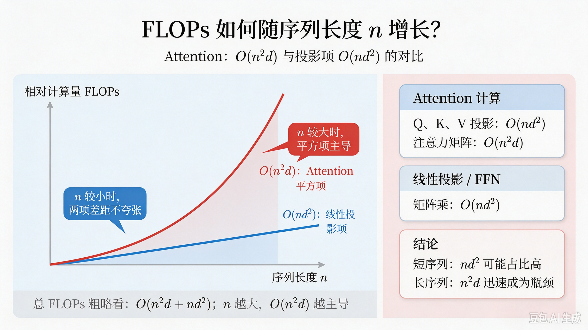

# 第03课：Transformer 架构详解

> **课程系列**：CS336（Stanford *Language Modeling from Scratch*）面试导向学习指南  
> **本课定位**：从 RNN/LSTM 的历史脉络到「Attention Is All You Need」，系统掌握 Transformer 的数据流、三种范式（Encoder-only / Decoder-only / Encoder–Decoder）、核心子层与参数量估算，并能手写最小 PyTorch 块级实现。  
> **面试热度**：★★★★★ —— 大模型岗位必考；本课是后续多头细节、RoPE、RMSNorm/SwiGLU 的**总纲**。

---

## 1. 标题与概述

### 1.1 本课要解决的问题

语言模型需要把**离散 token 序列**变成**可训练的连续表示**，并在不同位置之间传递信息。在 Transformer 出现之前，主流是 **RNN/LSTM** 的逐步递归；2017 年后，**Self-Attention** 成为主流。**本课回答**：

- Transformer 相对 RNN 的根本变化是什么？为什么能并行？
- Encoder-only、Decoder-only、Encoder–Decoder 各解决什么任务？为何现代通用 LLM 多是 Decoder-only？
- 从 Embedding 到 Softmax，**张量形状如何变化**？因果掩码、残差、LayerNorm 各起什么作用？
- 面试常问的 **参数量公式**（含标准 FFN 与 SwiGLU）、**复杂度**如何快速推导？

### 1.2 学完本课你应该能回答

- 「Attention Is All You Need」相对 RNN 的核心主张是什么？
- Self-Attention 中 Q、K、V 如何一步步算出输出？为什么要除以 $\sqrt{d_k}$？
- 多头注意力与 FFN 分工是什么？Pre-Norm 与残差如何配合？
- 因果掩码如何实现？与自回归训练、推理的关系？
- 如何估算 $L$ 层、维度 $d$、词表 $V$ 下的参数量级？

### 1.3 预备知识

- Lesson 02（BPE）：token ID 序列如何进入模型；
- 线性代数基础：矩阵乘法、Softmax；
- PyTorch 基础：`nn.Linear`、`nn.LayerNorm`、`tensor` 形状。

### 1.4 本课在 CS336 中的位置

```
BPE 分词 ──→ 【本课：Transformer 块级架构】──→ 多头细节与 RoPE（第04课）
                    ↓
            Assignment 1：从零拼出可训练 LM
```

---

## 2. 概念详解（面向小白）

### 2.1 历史：从 RNN/LSTM 到 Transformer

**序列建模的早期范式**

- **RNN**：第 $t$ 步隐藏状态 $h_t$ 依赖 $h_{t-1}$ 与当前输入 $x_t$，形成**时间上的递归**。信息沿时间步传递，**长距离依赖**需经过很多步，易出现**梯度消失/爆炸**。
- **LSTM/GRU**：通过门控与记忆单元**缓解**长依赖与梯度问题，但本质仍是**逐步计算**，**时间步之间难以完全并行**（训练时虽有 Truncated BPTT 等技巧，但并行度仍受限）。

**CNN 作为序列模型的补充**

- 一维卷积可并行，但**局部感受野**需堆叠多层才能覆盖长距离，且对「任意两个位置」的直接关联不如注意力直观。

**Transformer 的转折点（2017）**

Vaswani 等人在 **「Attention Is All You Need」**（NeurIPS 2017）中提出 **Transformer**：**不再用循环层作为编码器/解码器的主干**，而用 **Self-Attention** 与 **前馈网络（FFN）** 堆叠，配合**位置编码**与**残差、LayerNorm**。

**一句话历史意义**：把「建模依赖」的主要机制从**沿时间递归**改为**基于内容相似度的加权聚合（注意力）**，从而在**固定深度**内连接任意位置，并释放**序列长度维上的并行**（实现上受显存限制）。

---

### 2.2 Transformer 架构总览与 ASCII 示意图

**宏观数据流（Decoder-only，与 GPT/LLaMA 类生成模型最贴近）**

```
                    ┌─────────────────────────────────────┐
                    │  Input Token IDs  [B, n]             │
                    └──────────────────┬────────────────────┘
                                       │
                    ┌──────────────────▼────────────────────┐
                    │  Token Embedding + Positional Info    │
                    │  → X  [B, n, d]                        │
                    └──────────────────┬────────────────────┘
                                       │
          ┌────────────────────────────┼────────────────────────────┐
          │                     重复 L 次                          │
          │  ┌───────────────────────▼───────────────────────┐     │
          │  │  ┌─────────────────────────────────────────┐  │     │
          │  │  │ Pre-Norm: LayerNorm                     │  │     │
          │  │  └───────────────────┬─────────────────────┘  │     │
          │  │                    ▼                         │     │
          │  │  ┌─────────────────────────────────────────┐  │     │
          │  │  │ Multi-Head Causal Self-Attention       │  │     │
          │  │  │  Q,K,V → scores → softmax → mix V      │  │     │
          │  │  └───────────────────┬─────────────────────┘  │     │
          │  │                    │                         │     │
          │  │            ┌─────────▼─────────┐               │     │
          │  │            │  Residual Add     │◄── 输入 x     │     │
          │  │            └─────────┬─────────┘               │     │
          │  │                      │                         │     │
          │  │  ┌───────────────────▼───────────────────┐  │     │
          │  │  │ Pre-Norm: LayerNorm                     │  │     │
          │  │  └───────────────────┬───────────────────┘  │     │
          │  │                      ▼                      │     │
          │  │  ┌─────────────────────────────────────┐  │     │
          │  │  │ FFN: Linear(d→d_ff) → act → Linear   │  │     │
          │  │  └───────────────────┬─────────────────┘  │     │
          │  │                      │                    │     │
          │  │            ┌─────────▼─────────┐           │     │
          │  │            │  Residual Add     │           │     │
          │  │            └─────────┬─────────┘           │     │
          │  └────────────────────┼──────────────────────┘     │
          └────────────────────────┘
                                       │
                    ┌──────────────────▼────────────────────┐
                    │  Final LayerNorm（依具体实现可选）      │
                    └──────────────────┬────────────────────┘
                                       │
                    ┌──────────────────▼────────────────────┐
                    │  Output Linear: d → V（词表大小）      │
                    │  → logits [B, n, V]                   │
                    └──────────────────┬────────────────────┘
                                       │
                    ┌──────────────────▼────────────────────┐
                    │  Softmax → 下一 token 分布（训练/采样）│
                    └───────────────────────────────────────┘
```

**原论文中的 Encoder–Decoder 结构（概念）**

- **Encoder**：多层 **双向 Self-Attention + FFN**，对源序列编码。
- **Decoder**：**因果 Self-Attention** + **Cross-Attention**（Q 来自 Decoder，K/V 来自 Encoder 输出）+ FFN。

**Encoder–Decoder 数据流（ASCII，与翻译等 seq2seq 对齐）**

```
  源序列 token IDs
        │
        ▼
  ┌─────────────────────────────────────────┐
  │ Encoder：Emb + Pos                       │
  │   → [Encoder Layer × L_enc]              │
  │      每层：双向 Self-Attn → 残差/LN → FFN  │
  │   → 输出 Memory H（供 Cross-Attn 作 K/V） │
  └──────────────────┬──────────────────────┘
                     │ H
  目标序列（右移）    │
        │            │
        ▼            ▼
  ┌─────────────────────────────────────────┐
  │ Decoder：Emb + Pos                       │
  │   → [Decoder Layer × L_dec]              │
  │      Masked Self-Attn（因果）             │
  │           ↓                             │
  │      Cross-Attention（Q: Dec, K/V: H）   │
  │           ↓                             │
  │      FFN → 残差/LN                       │
  │   → Linear + Softmax → 目标 token 分布    │
  └─────────────────────────────────────────┘
```

---

### 2.3 三种变体：Encoder-only、Decoder-only、Encoder–Decoder

| 类型 | 注意力形态 | 代表模型 | 强项 | 典型弱项/备注 |
|------|------------|----------|------|----------------|
| **Encoder-only** | **双向**（可见全句，受任务 mask 约束） | BERT、RoBERTa | 分类、检索、句向量、理解类任务 | 不原生做自回归长文本生成 |
| **Decoder-only** | **因果**（只看过去 token） | GPT、**LLaMA**、Qwen | 通用生成、对话、代码；与 **NTP** 训练目标一致 | 单轮「纯双向理解」需 prompt/技巧或额外结构 |
| **Encoder–Decoder** | Encoder 双向 + Decoder 因果 + **Cross-Attn** | **T5**、BART | 翻译、摘要等 **seq2seq** | 结构更重；「单塔通用 LM」不如 Decoder-only 直接 |

**为何现代通用 LLM 多为 Decoder-only？**

1. **预训练目标统一**：大规模预训练主流是 **Next-Token Prediction (NTP)**，与 Decoder 的**因果自注意力**形式一致，**训练–推理同构**。
2. **工程简单**：单塔、无 Cross-Attention，分布式与内核优化路径清晰；**KV Cache** 与自回归解码天然匹配。
3. **规模与数据**：同一套目标易做超大规模扩展；理解类任务可通过 **SFT、RLHF、工具调用、长上下文** 补足。

> 并非「Encoder 理论上更差」，而是**通用文本智能 + 可扩展预训练 + 推理形态**的综合选择。

---

### 2.4 核心组件详解

#### （1）Input Embedding 与位置信息

- **Token Embedding**：查表矩阵 $E \in \mathbb{R}^{V \times d}$，第 $i$ 个 token 得到 $d$ 维向量。输出形状 `[B, n, d]`。
- **为何需要位置编码**：无位置编码、也无固定因果掩码的 Self-Attention 对输入置换**等变**，不能仅凭内容区分顺序；置换后输出随之置换，而非原地不变。通常用绝对正弦、可学习位置或 **RoPE** 注入位置；因果掩码本身也提供顺序约束。
- **常见做法**：$X = \text{TokEmb} + \text{PosEmb}$（或 RoPE 作用于 Q/K）。

#### （2）Self-Attention 逐步推导（Q、K、V）

忽略 batch，输入隐藏维度为 $d$，头数为 $H$，以下推导多头注意力中的第 $h$ 个头。采用常见的 $d_k = d_v = d/H$ 设置；真正的单头情形对应 $H=1$、$d_k=d$。下文统一采用行向量/右乘权重的记法。

1. **线性投影**：对输入 $X \in \mathbb{R}^{n \times d}$，
   $Q_h = X W_{Q,h},\quad K_h = X W_{K,h},\quad V_h = X W_{V,h}$，
   其中 $W_{Q,h}, W_{K,h}, W_{V,h} \in \mathbb{R}^{d \times d_k}$，所以 $Q_h, K_h, V_h \in \mathbb{R}^{n \times d_k}$。工程上通常把各头投影合并为三个 $d \times d$ 矩阵，先投影到 $d$ 再拆头。
2. **注意力分数**：$S_h = Q_h K_h^\top \in \mathbb{R}^{n \times n}$，第 $i$ 行表示位置 $i$ 对每个位置 $j$ 的相似度。
3. **缩放**：$\widetilde{S}_h = S_h / \sqrt{d_k}$。
4. **掩码（Decoder）**：使用加性掩码 $M$，允许位置取 $M_{ij}=0$，未来位置（$j>i$）取 $M_{ij}=-\infty$。Softmax 前加到缩放后的分数上，未来位置概率为 0。无掩码的 Encoder 注意力可取 $M=0$。
5. **Softmax（按行）**：$A_h = \operatorname{softmax}(\widetilde{S}_h + M)$，$A_h \in \mathbb{R}^{n \times n}$；对每个查询位置，沿键位置维归一化。
6. **聚合**：每头输出 $O_h = A_h V_h \in \mathbb{R}^{n \times d_k}$。
7. **拼接与输出投影**：$O = \operatorname{Concat}(O_1,\ldots,O_H) \in \mathbb{R}^{n \times d}$，再计算 $O' = O W_O$，其中 $W_O \in \mathbb{R}^{d \times d}$。

**每头的完整公式**：

$$
O_h = \operatorname{softmax}\left(\frac{Q_h K_h^\top}{\sqrt{d_k}} + M\right)V_h
$$

公式与投影维度可对照 [Attention Is All You Need，§3.2](https://arxiv.org/html/1706.03762v7#S3.SS2)。

**直觉**：每个位置用**查询 Q** 去和**键 K** 匹配，得到权重，再对**值 V** 加权求和——即「按内容相关性」从全序列收集信息。

#### （3）为什么要除以 $\sqrt{d_k}$？与 Softmax 饱和

- **方差稳定**：在 $q, k$ 的各分量相互独立、零均值、方差为 1 的简化假设下，$\operatorname{Var}(q^\top k)=d_k$，而 $\operatorname{Var}(q^\top k/\sqrt{d_k})=1$。除以 $\sqrt{d_k}$ 使点积尺度**不随维度爆炸**，降低 Softmax 过早进入**极端饱和区**的风险。
- **与梯度的关系**：Softmax 对所有 logits 加同一个常数并不敏感；真正导致饱和的是 **logits 的相对差距过大**，使概率几乎 one-hot、梯度接近 0。缩放有助于控制这种差距，**优化更稳定**，但不保证任何输入下都不会饱和。

#### （4）Multi-Head Attention

将 $d$ 拆成 $H$ 个头，每头独立一组 $Q_h, K_h, V_h$（维度 $d_k = d/H$），并行计算 $H$ 个注意力，再 **concat** 并经 $W_O$ 融合。

**直觉**：多头 = **多个子空间**上并行做「谁该看谁」，有的头偏句法、有的头偏共指等（具体模式由训练涌现）。

#### （5）Feed-Forward Network (FFN)

每层通常对每个位置**独立**做两层 MLP：

$$
\operatorname{FFN}(x) = \sigma(x W_1 + b_1) W_2 + b_2
$$

这里 $x \in \mathbb{R}^{1 \times d}$，$W_1 \in \mathbb{R}^{d \times d_{\text{ff}}}$，$W_2 \in \mathbb{R}^{d_{\text{ff}} \times d}$，偏置按输出维广播。中间维度 $d_{\text{ff}}$ 常取 **$4d$**。$\sigma$ 常用 GELU/ReLU。

**分工**：Attention **混合位置间信息**；FFN **在每个位置做强非线性变换**，常被视为**容量与记忆**的重要部分（教学类比，非严格证明）。

#### （6）残差连接与 Layer Normalization

- **残差**：基本形式为 $x_{\text{out}} = x + \operatorname{Sublayer}(x)$；Pre-Norm 写作 $x_{\text{out}} = x + \operatorname{Sublayer}(\operatorname{LN}(x))$，Post-Norm 写作 $x_{\text{out}} = \operatorname{LN}(x + \operatorname{Sublayer}(x))$。残差提供**恒等路径**，利于梯度回传与**深层堆叠**。
- **LayerNorm**：在**特征维**上归一化（Transformer 序列任务中通常对每个 token 向量归一），稳定激活分布。

#### （7）输出投影与 Softmax

最后一层隐藏状态按行向量记为 $h \in \mathbb{R}^{1 \times d}$。沿用 PyTorch 的权重存储形状，**LM Head** 的 $W_{\text{lm}} \in \mathbb{R}^{V \times d}$，无偏置时 $\text{logits} = h W_{\text{lm}}^\top \in \mathbb{R}^{1 \times V}$，再 Softmax 得词表上的概率分布。训练时常对**下一 token** 位置做交叉熵。

**形状主线（一次前向，便于记忆与自检）**：

$$
B\times T \;\to\; B\times T\times d \;\to\; B\times h\times T\times T \;\to\; B\times T\times d \;\to\; B\times T\times V
$$

- token id 进来是 $B\times T$；Embedding 查表后为 $B\times T\times d$。
- 注意力内部先拆头，分数矩阵为 $B\times h\times T\times T$（这就是长序列 $O(T^2)$ 的来源），加权求和后合头回到 $B\times T\times d$。
- 残差与 LayerNorm **不改变形状**；最后 LM Head 输出 $B\times T\times V$ 的词表分布。

顺着这条主线数一遍矩阵，参数量（每层 $4d^2+2dd_{\text{ff}}$）与复杂度（$O(T^2d+Td^2)$）都能自己推出来，不必死记——详见 [2.7 参数量估算](#27-模型参数量估算公式) 与 [4.2 复杂度](#42-self-attention-的计算复杂度是多少)。

---

### 2.5 Decoder-only 特有问题：因果掩码与自回归

**因果掩码（Causal / Lower-Triangular Mask）**

- 位置 $i$ 只能 attend $j \le i$。在 $n \times n$ 注意力矩阵中，**禁止** $j > i$ 的位置。
- 实现：将 **上三角（不含对角）** 的 logits 置为 $-\infty$，Softmax 后这些位置权重为 0。

**自回归生成（Autoregressive）**

- 生成第 $t+1$ 个 token 时，仅依赖已生成的 $1\ldots t$。训练时**并行 teacher forcing** 在同一前向中计算所有位置，但每个位置的标签仍是「预测下一个 token」，与推理一致。

---

### 2.6 对比表：GPT vs BERT vs LLaMA vs T5

下表便于面试快速对比（具体版本有差异，抓**范式**即可）。

| 维度 | GPT（Decoder-only 代表） | BERT（Encoder-only） | LLaMA（现代 Decoder-only） | T5（Encoder–Decoder） |
|------|--------------------------|----------------------|-----------------------------|------------------------|
| **注意力** | 因果自注意力 | 双向自注意力 | 因果；常用 GQA、RoPE 等 | Encoder 双向 + Decoder 因果 + Cross-Attn |
| **典型预训练目标** | Next-Token / 自回归 | MLM、NSP 等 | NTP（自回归） | Span Corruption 等 seq2seq |
| **强项** | 生成、对话、通用 LM | 分类、检索、句向量 | 开源生态、推理优化多 | 翻译、摘要、文本到文本 |
| **位置编码** | 可学习 / RoPE | 可学习绝对位置（另有 segment embedding） | **RoPE**（常见） | 相对位置等（依版本） |
| **Norm/FFN** | 依代际不同 | LayerNorm + 标准 FFN | 常见 **RMSNorm + SwiGLU**（Lesson 05） | Pre-LN 等 |

---

### 2.7 模型参数量估算公式

**记号**：$V$ 词表，$d$ 模型宽度，$L$ 层数，$d_{\text{ff}}$ FFN 中间维，注意力头数影响 $d_k$ 但不改变 $d\times d$ 投影的主项阶（标准 MHA 下）。

**适用假设**：以下估算针对 Decoder-only、标准 MHA、标准两矩阵 FFN，忽略 bias、Norm 和位置参数；不直接适用于含 Cross-Attention 的 Decoder 层或 GQA/MQA。若使用可学习绝对位置嵌入，还需另加 $n_{\max}d$ 个位置参数。

**Embedding**

$$
P_{\text{emb}} \approx V \cdot d
$$

（若与 output **权重共享 weight tying**，则不计第二次 $Vd$。）

**每层 Self-Attention（四个 $d\times d$ 投影 $W_Q, W_K, W_V, W_O$）**

$$
P_{\text{attn}} \approx 4 d^2
$$

**每层标准 FFN（两层：$d \to d_{\text{ff}} \to d$）**

$$
P_{\text{ffn}} \approx 2 \cdot d \cdot d_{\text{ff}}
$$

当 $d_{\text{ff}} = 4d$ 时，$P_{\text{ffn}} \approx 8d^2$。

**每层合计（标准假设）**

$$
P_{\text{layer}} \approx 4d^2 + 2 d d_{\text{ff}} \approx 12 d^2 \quad (\text{当 } d_{\text{ff}}=4d)
$$

**$L$ 层 Transformer Block**

$$
P_{\text{blocks}} \approx L \cdot (4d^2 + 2 d d_{\text{ff}})
$$

**总参数量（粗算，忽略 bias、Norm 小项）**

$$
P_{\text{total}} \approx P_{\text{io}} + L(4d^2 + 2 d d_{\text{ff}})
$$

其中输入 Embedding 与 LM Head 合计为：

$$
P_{\text{io}} =
\begin{cases}
Vd, & \text{共享权重} \\
2Vd, & \text{不共享权重}
\end{cases}
$$

**SwiGLU FFN（LLaMA 等常用）**

SwiGLU 可看作门控：中间有三个投影（up、gate、down），维度常取 **$\frac{2}{3} \cdot 4d$** 等以保持 FLOPs 近似。参数量常按三矩阵估算，例如中间宽 $d_{\text{ff}}$ 时：

$$
P_{\text{ffn}}^{\text{SwiGLU}} \approx 3 \cdot d \cdot d_{\text{ff}}
$$

若目标总 FLOPs 与「$d_{\text{ff}}=4d$ 的两层 MLP」对齐，常取 $d_{\text{ff}} = \frac{2}{3} \cdot 4d$，则：

$$
P_{\text{ffn}}^{\text{SwiGLU}} \approx 3 d \cdot \frac{8}{3}d = 8d^2
$$

与标准 $8d^2$ **同量级**（具体系数依实现与是否含 bias 略有出入）。面试说明**假设**即可。

**另一种常见记法（与「把 hidden 设为 $\frac{2}{3} \times 4d$ 以保持算力」对齐）**

若将「标准 FFN 的中间维」记为 $4d$，SwiGLU 为保持主要矩阵乘的前向 FLOPs 近似不变，常取 **中间瓶颈维** $d_{\text{ff}}^{\text{SwiGLU}} \approx \frac{2}{3} \times 4d$。up、gate 两个矩阵形状为 $d \times d_{\text{ff}}^{\text{SwiGLU}}$，down 矩阵形状为 $d_{\text{ff}}^{\text{SwiGLU}} \times d$，三者参数量相同，总量可记为：

$$
P_{\text{ffn}}^{\text{SwiGLU}} \approx 3 \cdot d \cdot d_{\text{ff}}^{\text{SwiGLU}}
= 3 \cdot d \cdot \frac{2}{3} \cdot 4d = 8d^2
$$

即与「两层标准 FFN、$d_{\text{ff}}=4d$」在 **$8d^2$** 上**同阶**。面试时写清「**三矩阵 × 中间维**」比死记系数更重要。

实际实现通常把中间维取整到便于硬件计算的倍数，上述 $8d^2$ 是未取整时的估算；“FLOPs 对齐”主要比较矩阵乘，不表示激活、门控逐元素运算也完全相同。三矩阵与中间维缩减的依据见 [GLU Variants Improve Transformer，§2](https://arxiv.org/html/2002.05202v1#S2)。

---

## 3. 代码示例与实现

以下为 **教学用** Pre-Norm **Decoder Block** + 极简 LM，强调**形状与因果掩码**；生产环境会换 FlashAttention、RoPE、RMSNorm、SwiGLU 等。

```python
import math
import torch
import torch.nn as nn


class TransformerBlock(nn.Module):
    """
    单塔 Decoder Block（Pre-Norm）。

    数据流：
        x -> LN -> MHA(causal) -> 残差 -> LN -> FFN -> 残差

    说明：
        1. 使用 Pre-Norm，即先 LayerNorm 再进入子层。
        2. 注意力使用因果掩码，防止看到未来 token。
        3. 每个子层后都有残差连接。
    """

    def __init__(
        self,
        d_model: int,
        n_heads: int,
        d_ff: int,
        dropout: float = 0.0,
    ) -> None:
        """
        初始化 Transformer Decoder Block。

        参数：
            d_model: 模型隐藏维度，即每个 token 的向量长度。
            n_heads: 多头注意力头数。
            d_ff: 前馈网络中间层维度。
            dropout: dropout 概率，默认 0.0。
        """
        # 调用 nn.Module 初始化，注册子模块与参数
        super().__init__()

        # 保证 d_model 可以被 n_heads 整除
        assert d_model % n_heads == 0

        # 保存模型隐藏维度
        self.d_model = d_model

        # 保存注意力头数
        self.n_heads = n_heads

        # 计算每个注意力头的维度
        self.d_head = d_model // n_heads

        # 第一个 LayerNorm，用于注意力子层前的 Pre-Norm
        self.ln1 = nn.LayerNorm(d_model)

        # 第二个 LayerNorm，用于 FFN 子层前的 Pre-Norm
        self.ln2 = nn.LayerNorm(d_model)

        # 一次性生成 Q、K、V 的线性投影，输出维度为 3 * d_model
        self.qkv = nn.Linear(d_model, 3 * d_model, bias=True)

        # 多头注意力输出后的线性投影，把拼接后的多头结果映射回 d_model
        self.out_proj = nn.Linear(d_model, d_model, bias=True)

        # 前馈网络 FFN
        self.ffn = nn.Sequential(
            # 第一层线性变换：d_model -> d_ff
            nn.Linear(d_model, d_ff),

            # GELU 激活函数，引入非线性
            nn.GELU(),

            # 第二层线性变换：d_ff -> d_model
            nn.Linear(d_ff, d_model),
        )

        # dropout 层，用于注意力权重、注意力输出和 FFN 输出
        self.drop = nn.Dropout(dropout)

    def _causal_mask(self, n: int, device: torch.device) -> torch.Tensor:
        """
        生成因果掩码（causal mask）。

        作用：
            防止当前位置看到未来位置的信息。

        返回：
            形状为 [n, n] 的布尔矩阵。
            上三角部分（不含对角线）为 True，表示这些位置需要被 mask 掉。
        """
        # 创建 n x n 的全 1 矩阵，并取上三角（不含对角线）为 True
        return torch.triu(torch.ones(n, n, device=device, dtype=torch.bool), diagonal=1)

    def forward(self, x: torch.Tensor) -> torch.Tensor:
        """
        Transformer Block 前向传播。

        输入：
            x: 形状为 [batch, seq, d_model] 的张量。

        输出：
            形状为 [batch, seq, d_model] 的张量。

        流程：
            1. Pre-Norm + 多头因果自注意力 + 残差连接
            2. Pre-Norm + FFN + 残差连接
        """
        # 获取 batch 大小、序列长度、隐藏维度
        b, n, d = x.shape

        # 检查输入最后一维是否等于模型维度
        assert d == self.d_model

        # ============================================================
        # 第一部分：Pre-Norm + 多头因果自注意力 + 残差连接
        # ============================================================

        # 先做 LayerNorm，得到注意力子层的输入
        h = self.ln1(x)

        # 通过线性层生成 QKV，并在最后一维切成 3 份
        qkv = self.qkv(h).chunk(3, dim=-1)

        # 分别得到 Query、Key、Value
        q, k, v = qkv

        def split_heads(t: torch.Tensor) -> torch.Tensor:
            """
            将张量按注意力头拆分。

            输入：
                t: 形状为 [batch, seq, d_model] 的张量。

            输出：
                形状为 [batch, n_heads, seq, d_head] 的张量。

            作用：
                把最后一维 d_model 拆成 n_heads * d_head，
                然后把 n_heads 维度移到前面，方便做批量矩阵乘法。
            """
            # 变形为 [batch, seq, n_heads, d_head]，再交换维度得到 [batch, n_heads, seq, d_head]
            return t.view(b, n, self.n_heads, self.d_head).transpose(1, 2)

        # 对 Q、K、V 都执行多头拆分
        q, k, v = map(split_heads, (q, k, v))

        # 计算注意力分数：QK^T / sqrt(d_head)
        scores = torch.matmul(q, k.transpose(-2, -1)) / math.sqrt(self.d_head)

        # 生成因果掩码，形状为 [n, n]
        mask = self._causal_mask(n, x.device)

        # 将未来位置对应的分数置为负无穷，softmax 后概率为 0
        scores = scores.masked_fill(mask, float("-inf"))

        # 在最后一维做 softmax，得到注意力权重
        attn = torch.softmax(scores, dim=-1)

        # 对注意力权重做 dropout
        attn = self.drop(attn)

        # 用注意力权重对 Value 加权求和，得到注意力输出
        y = torch.matmul(attn, v)

        # 把头维度换回来并拼接成 [batch, seq, d_model]
        y = y.transpose(1, 2).contiguous().view(b, n, d)

        # 对多头拼接结果做输出线性投影
        y = self.out_proj(y)

        # 对投影结果做 dropout
        y = self.drop(y)

        # 残差连接：原始输入 + 注意力输出
        x = x + y

        # ============================================================
        # 第二部分：Pre-Norm + FFN + 残差连接
        # ============================================================

        # 对残差后的结果做 LayerNorm，作为 FFN 输入
        h2 = self.ln2(x)

        # 经过 FFN，再 dropout
        z = self.drop(self.ffn(h2))

        # 残差连接：FFN 前输入 + FFN 输出
        x = x + z

        # 返回该 Transformer Block 的输出
        return x


class TinyDecoderLM(nn.Module):
    """
    一个微型 Decoder-only 语言模型。

    结构：
        Token Embedding + Position Embedding
        -> 多个 TransformerBlock
        -> Final LayerNorm
        -> LM Head

    用途：
        输入 token id，输出每个位置对词表中每个 token 的预测 logits。
    """

    def __init__(
        self,
        vocab_size: int,
        d_model: int,
        n_layers: int,
        n_heads: int,
        d_ff: int,
        max_pos: int = 2048,
    ):
        """
        初始化 TinyDecoderLM。

        参数：
            vocab_size: 词表大小。
            d_model: 模型隐藏维度。
            n_layers: Transformer Block 层数。
            n_heads: 多头注意力头数。
            d_ff: FFN 中间层维度。
            max_pos: 最大位置长度，默认 2048。
        """
        # 调用 nn.Module 初始化
        super().__init__()

        # token 嵌入层：把 token id 映射成 d_model 维向量
        self.tok_emb = nn.Embedding(vocab_size, d_model)

        # 位置嵌入层：把位置 id 映射成 d_model 维向量
        self.pos_emb = nn.Embedding(max_pos, d_model)

        # 用 ModuleList 保存多层 TransformerBlock
        self.blocks = nn.ModuleList(
            # 创建 n_layers 个 TransformerBlock
            TransformerBlock(d_model, n_heads, d_ff) for _ in range(n_layers)
        )

        # 最后一层 LayerNorm
        self.ln_f = nn.LayerNorm(d_model)

        # 语言模型输出头：d_model -> vocab_size，无 bias
        self.lm_head = nn.Linear(d_model, vocab_size, bias=False)

    def forward(self, token_ids: torch.Tensor) -> torch.Tensor:
        """
        前向传播。

        输入：
            token_ids: 形状为 [batch, seq] 的 token id 张量。

        输出：
            形状为 [batch, seq, vocab_size] 的 logits 张量。

        流程：
            1. 生成 token embedding 和 position embedding，并相加。
            2. 依次通过所有 TransformerBlock。
            3. 经过最终 LayerNorm。
            4. 通过 LM Head 得到每个位置对词表中每个 token 的预测分数。
        """
        # 获取 batch 大小和序列长度
        b, n = token_ids.shape

        # 生成位置 id：[0, 1, ..., n-1]，并扩展到 [batch, seq]
        pos = torch.arange(n, device=token_ids.device).unsqueeze(0).expand(b, n)

        # token 嵌入 + 位置嵌入，得到输入表示
        x = self.tok_emb(token_ids) + self.pos_emb(pos)

        # 依次遍历每一层 TransformerBlock
        for blk in self.blocks:
            # 通过当前 TransformerBlock
            x = blk(x)

        # 所有 Block 结束后做最终 LayerNorm
        x = self.ln_f(x)

        # 通过 LM Head 输出 logits，形状为 [batch, seq, vocab_size]
        return self.lm_head(x)
```

**自查清单**：因果掩码是否作用在 **scores** 上？残差是否在 Attention 与 FFN **各一次**？$\sqrt{d_k}$ 是否用 **每头维度** 而非 $d_{\text{model}}$？

---

## 4. 面试考点（面试高频题详解）

### 4.1 Transformer 的核心创新是什么？

**答**：在序列建模中，用 **Scaled Dot-Product Self-Attention** 作为主要信息混合机制，**替代 RNN/LSTM 的递归**，在固定层数内让任意位置直接交互；配合 **多头、FFN、残差、LayerNorm** 与**位置编码**，实现**高并行**与**可扩展的深度堆叠**。论文标题 **「Attention Is All You Need」** 强调：**不必依赖循环层**也能取得极强表现（在足够数据与算力下）。

---

### 4.2 Self-Attention 的计算复杂度是多少？

**答**：对序列长度 $n$、模型维度 $d$（单头维度 $d_k = d/H$）：

- 计算 $Q, K, V$ 与输出投影：**$O(n d^2)$**（主导项为矩阵乘）。
- 注意力矩阵 $Q_hK_h^\top$ 与加权：**单头为 $O(n^2 d_k)$**；全部 $H$ 个头合计为 **$O(H n^2 d_k) = O(n^2 d)$**，因为 $H d_k=d$。

**总时间复杂度**：**$O(n^2 d + n d^2)$**。当 $n$ 相对 $d$ 足够大时，**$n^2 d$** 项会主导计算；朴素实现中，显式存储各头注意力矩阵需要 **$O(Hn^2)$** 的空间（忽略 batch），不要将这一空间复杂度与时间复杂度混淆。[FlashAttention](https://arxiv.org/abs/2205.14135) 通过分块避免完整物化注意力矩阵、降低显存占用与访存开销，但不改变精确稠密注意力的二次计算主项。**与 RNN 每步 $O(d^2)$、总长 $O(n d^2)$** 相比，Attention 在长序列上**平方项**是主要瓶颈。

---

### 4.3 为什么要除以 $\sqrt{d_k}$？

**答**：点积 $q^\top k$ 若各维独立零均值、方差 1，则方差约为 $d_k$，随维度增大 logits **尺度变大**，Softmax 趋近 one-hot，**梯度饱和**。除以 $\sqrt{d_k}$ 使点积方差**与 $d_k$ 无关**，Softmax 更平滑、**训练稳定**。面试可补充：这是**缩放**而非任意常数，与维度匹配。

---

### 4.4 Encoder-only vs Decoder-only vs Encoder–Decoder 各自适用场景？

**答**：

- **Encoder-only（如 BERT）**：**双向上下文**，适合 **分类、NER、语义相似度、检索向量** 等理解任务；不原生适合长文本自回归生成。
- **Decoder-only（如 GPT、LLaMA）**：**因果注意力**，适合 **语言建模、生成、对话、代码**；与 NTP 训练一致，工程生态最大。
- **Encoder–Decoder（如 T5）**：**输入编码 + 解码生成**，适合 **翻译、摘要、文本到文本** 等明确 seq2seq；结构更重，通用「只训一个超大规模 LM」时常不如 Decoder-only 直接。

---

### 4.5 残差连接的作用是什么？

**答**：提供 **$x \mapsto x$** 的近似恒等通路，使梯度更易回传，**缓解深层网络梯度消失/退化**，让 **几十层** 堆叠可训练；与 **LayerNorm**、合适初始化与学习率共同构成稳定训练的基础。

---

### 4.6 LayerNorm vs BatchNorm：Transformer 中为何选 LayerNorm？

**答**：

- **BatchNorm** 依赖 batch 统计，对 **序列长度变化、小 batch、NLP 变长序列** 不友好；推理时 running stats 与训练分布差异也可能带来问题。
- **LayerNorm** 在 **特征维**上归一化，**与 batch、序列位置无关**，适合 **Transformer 的 token 级计算** 与 **自注意力** 的稳定化。

---

### 4.7 Transformer 参数量如何计算？

**答**：分项估算后求和：

1. **Embedding**：约 $Vd$（是否 **weight tying** 决定是否再加 $Vd$）。
2. **每层 Attention**：四个 $d \times d$ 矩阵，约 **$4d^2$**。
3. **每层 FFN**：约 **$2 d d_{\text{ff}}$**；若 $d_{\text{ff}}=4d$，约 **$8d^2$**。
4. **SwiGLU**：约 **$3 d d_{\text{ff}}$**，按 $d_{\text{ff}}$ 取值与标准 FFN 对齐 FLOPs 时常与 **$8d^2$** 同量级。
5. **LayerNorm、bias** 相对 $d^2$ 常可忽略（除非问细节）。

**主项**：$P \approx Vd + L(4d^2 + 2dd_{\text{ff}})$（Decoder-only、标准 MHA/FFN、输入 Embedding 与 LM Head 共享；不共享时再加 $Vd$，其余假设见 2.7）。

---

### 4.8 因果掩码（causal mask）是如何实现的？

**答**：对长度 $n$，构造 **$n \times n$** 掩码：**位置 $i$ 仅允许 $j \le i$**。在 **Softmax 之前**，将 **$j > i$** 的 logits 设为 **$-\infty$**，Softmax 后这些位置概率为 0。实现上常用 **`torch.triu(..., diagonal=1)`** 得到上三角 True，再 `masked_fill`。广播到 **batch 与 head** 维。

---

### 4.9 Transformer 相比 RNN 的优势？

**答**：

1. **并行**：单层内对长度维并行度高；RNN 时间步串行度高。
2. **长依赖**：注意力提供直接路径；RNN 长链反向传播难。
3. **可扩展与生态**：大模型训练/推理（FlashAttention、KV Cache 等）围绕 Transformer 成熟。

补充：RNN 在**极小算力或强在线约束**场景仍有讨论，但通用 LLM 主战场是 Transformer。

---

### 4.10 Decoder-only 为什么成为主流？

**答**：**Next-Token 预训练目标**与因果结构一致；**单塔**实现与扩展简单；**自回归推理**与训练同构，**KV Cache** 等优化自然；数据与算力规模下 **通用能力强**、**生态最大**。理解任务可通过微调与工具补足。

---

### 4.11 补充：FFN 在块内扮演什么角色？

**答**：Attention 负责**路由与聚合**跨位置信息；FFN 在每个位置做**非线性变换**，提供**大容量**；二者互补。可提及 Pre-Norm 下子层更稳定等（与 Lesson 05 的 SwiGLU 衔接）。

---

### 4.12 多头注意力（Multi-Head）解决什么问题？

**答**：单头注意力在**一个**子空间里学习「谁看谁」，表达能力有限。**多头**将 $d$ 拆成 $H$ 份，在 **$H$ 个并行子空间**里各自学习不同的相关模式（如句法、共指、局部短语），再经 $W_O$ **融合**。效果上类似**多视角投票**，降低单头需同时拟合多种关系的压力，是 Transformer **表达力**的关键之一。

---

## 5. 练习题

1. **手推形状**：设 $B=2, n=128, d=768, H=12$，写出 $Q,K,V$ 在拆头前后的形状，以及 $A = \text{softmax}(QK^\top/\sqrt{d_k})$ 的形状。
2. **掩码**：$n=4$ 时，列出位置 $i=2$ 在因果注意力中可见的 $j$ 集合（位置从 1 开始编号）。
3. **参数量**：$d=4096, L=32, d_{\text{ff}}=16384, V=32000$，在 **embedding 与 lm_head 共享** 时，估算 **$12Ld^2$ 量级** 与 **$Vd$** 谁更大？
4. **复杂度**：解释为何上下文从 $2K$ 增到 $32K$ 时，**注意力**部分近似按 **$n^2$** 放大。
5. **架构选择**：各举一个「更适合 T5 而非纯 GPT」与「更适合 BERT 而非 GPT」的任务。
6. **对比**：用不超过五句话说明 LLaMA 相对「原版 GPT-2 风格」在常见实现上的两点差异（提示：RoPE、Norm、FFN）。
7. **缩放因子**：若错误地使用 $\sqrt{d}$（模型宽度）而非 $\sqrt{d_k}$（每头维度）做缩放，当 $H>1$ 时会对训练产生什么影响？
8. **Post-Norm 与 Pre-Norm**：各用一句话写出 Post-Norm 与 Pre-Norm 下「Attention 子层 + 残差 + LayerNorm」的典型顺序差异。
9. **Cross-Attention**：在 T5 中，Cross-Attention 的 Q、K、V 分别来自哪里？若 K/V 维与 Decoder 隐状态维不一致，通常如何处理？
10. **权重绑定**：什么是 input embedding 与 LM head 的 weight tying？它如何改变参数量估算中的 $Vd$ 项？

**提示**：题 3 需代入数量级比较；题 6 可查阅 Lesson 05 的 RMSNorm/SwiGLU；题 7 答「缩放过强/过弱导致 softmax 与梯度行为异常」；题 9 答「Q 来自 Decoder，K/V 来自 Encoder；投影矩阵对齐维度」。

---

## 6. 下一课链接

| 上一课 | 本课 | 下一课 |
|--------|------|--------|
| [第02课 - BPE 分词器原理与实现](02-BPE分词器原理与实现.md) | **第03课 - Transformer 架构详解** | [第04课 - 多头注意力与 RoPE](04-多头注意力与RoPE.md) |

**返回**：[课程总览与学习路线](00-课程总览与学习路线.md)

---

## 附录：速查

| 概念 | 一句话 |
|------|--------|
| 缩放点积注意力 | $\text{softmax}(QK^\top/\sqrt{d_k})V$ |
| 因果掩码 | $j > i$ 处 logits 为 $-\infty$ |
| 残差 | 恒等路径，利于深层优化 |
| 参数量主项（$d_{\text{ff}}=4d$） | 每层约 $12d^2$，共 $L$ 层 |
| 长序列瓶颈 | Attention $O(n^2 d)$ |

---

*掌握本课 + 能画图 + 能估算参数量与复杂度，你在「Transformer 架构」类面试中会明显更稳。*

---

## 补充 A：面试追问与简答

### Q：Transformer 的核心创新是什么？
**答**：以 **Scaled Dot-Product Self-Attention** 替代序列递归结构，使全局依赖可并行计算；配合多头、残差与归一化形成可扩展深度架构。

### Q：为什么 Transformer 能并行而 RNN 不能？
**答**：RNN 时间步存在链式依赖；Transformer 主要计算为 **大块矩阵乘**，在 GPU 上对长度与特征维并行度高（Decoder 仍有因果掩码约束可见性，但算子并行）。

### Q：Causal Mask 是什么？为什么需要？
**答**：禁止位置 $i$ attend 到 $j>i$；保证训练与自回归推理一致，避免「偷看未来」。

### Q：Embedding 参数量？
**答**：$V \times d$；若与 LM head( **Language Modeling** 的缩写，也就是“语言建模”) **权重共享**则不计两次。

### Q：FFN 隐层通常多少？为什么？
**答**：经典 **$4d$**；容量与算力折中；现代 SwiGLU 会调整有效宽度（Lesson 05）。

### Q：Transformer 中 dropout 常见位置？
**答**：Transformer 中 dropout 常见位置，按数据流大致有这几处：

**Embedding 后**：token embedding 加位置编码之后，常加一次 dropout。

**注意力内部**：一是 softmax 后的注意力权重上，二是加权求和后的注意力输出上。有些实现只加输出，有些两处都加。

**残差相加后**：每个子层做完 $X = X + \text{Sublayer}(X)$ 后，常再 drop 一次。

**FFN 内部**：中间激活之后常加，有的在 FFN 输出后再加一次。

**输出层前**：部分模型在最后一层 LayerNorm 之后、LM head 之前也会加。

面试里可以概括为：**主要加在 Embedding 后、注意力输出、残差后和 FFN 内部，具体依实现而定。**

训练时生效，推理时必须关闭，PyTorch 里用 `model.eval()` 切换。现代 LLM 预训练时 dropout 往往用得很轻，注意力权重上的 dropout 常被去掉。

### Q：如何理解信息流？
**答**：Embedding→各层 **Attention 混合上下文**→**FFN 逐点非线性**→残差与 Norm 稳定与传递。

### Q：LLaMA 相对原始 Transformer 改进？
**答**：**RMSNorm**、**RoPE**、**SwiGLU**、**GQA** 等（Lesson 04–05）。

LLaMA 相对原始 Transformer 的改进，主要在归一化、位置编码、激活函数和注意力结构这几块。

**RMSNorm 替代 LayerNorm**：原始 Transformer 用 LayerNorm，做均值中心化再除以标准差。LLaMA 用 RMSNorm，只做缩放、不做均值中心化，即 $\text{RMSNorm}(x) = \frac{x}{\sqrt{\text{mean}(x^2) + \epsilon}} \cdot \gamma$。计算更简单，效果接近，训练更稳。

**RoPE 替代绝对位置编码**：原始 Transformer 用可学习或正弦绝对位置编码，直接加到 embedding 上。LLaMA 用旋转位置编码 RoPE，把位置信息通过旋转矩阵注入到 Q、K 里，让注意力分数天然带相对位置信息，外推性更好。

**SwiGLU 替代 ReLU FFN**：原始 FFN 是 $W_2 \cdot \text{ReLU}(W_1 x)$，两层线性。LLaMA 用 SwiGLU，结构是 $W_2 \cdot (\text{Swish}(W_1 x) \otimes W_3 x)$，三个线性层，通常取 $d_{\text{ff}} = \frac{8}{3} d$ 来对齐标准 FFN 的参数量。

**GQA 替代多头注意力**：原始 Transformer 是标准多头注意力，每个头有独立的 K、V。LLaMA 2 70B 和 LLaMA 3 用 GQA（Grouped Query Attention），把 Query 分组，每组共享一份 K、V，减少 KV Cache 显存和推理开销，同时效果接近 MHA。

**其他细节**：Pre-Norm 结构、去掉 bias、注意力权重不加 dropout 等。

面试里概括为：**RMSNorm、RoPE、SwiGLU、GQA** 这四项是核心。

### Q：参数量如何算？
**答**：共享 Embedding/LM Head 时计 $Vd$，不共享时计 $2Vd$；再加 $L$ 层的 Attention 与 FFN 参数，即 $L(4d^2+2d\cdot d_{\text{ff}})$ + 小项。标准 MHA 且 $d_{\text{ff}}=4d$ 时，Block 主项为 $12Ld^2$。



### Q：FLOPs 如何算？
**答**：投影 $O(n d^2)$ 与Attention $O(n^2 d)$ 组合；随 $n$ 增大平方项主导。






---

## 补充 B：完整前向伪代码（Decoder-only）

```python
# 仅结构示意：Embedding + L × (RMSNorm + Attn + RMSNorm + SwiGLU) + Norm + LM head
def forward(ids):  # ids: (B,T)
    x = tok_emb(ids)  # 本例采用 RoPE，不额外相加位置向量
    positions = torch.arange(ids.shape[1], device=ids.device)
    for block in blocks:
        x = x + block.attn(block.norm1(x), positions=positions)  # 内部旋转 Q/K
        x = x + block.ffn(block.norm2(x))
    return lm_head(norm(x))
```

---
