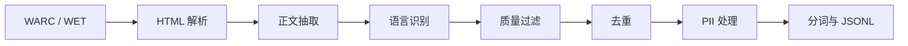

# Lesson 14：数据工程 — Common Crawl 处理

> **定位**：面向 CS336（大语言模型）学习与面试的「数据工程」专题，聚焦 Web 规模语料（以 Common Crawl 为代表）从原始抓取到可训练格式的完整链路。

---

## 一、核心概念（Concepts）

### 1.1 为什么数据至关重要：「垃圾进，垃圾出」（Garbage In, Garbage Out）

大语言模型（LLM）的预训练本质上是在海量文本上拟合下一个 token 的分布。**模型能力的天花板在很大程度上由训练数据的覆盖面、质量与多样性决定**，而非仅由参数量或算力决定。

- **分布匹配**：模型会复现训练语料中的语言风格、事实错误、偏见与噪声；低质或有毒内容会被放大。
- **长尾与能力**：代码、数学、多语言等能力需要对应域数据；缺数据则表现为该能力薄弱。
- **可扩展定律的隐含前提**：Scaling Laws 描述的是「在**合理数据管线**下」损失随规模的变化；若数据脏、重复极高或域配比失衡，边际收益会迅速变差。

因此，工业界与学术界的预训练工程往往把 **50% 以上精力**放在数据采集、清洗、去重、过滤与配比上，而非仅堆模型层数。

### 1.2 预训练常见数据来源

| 来源 | 特点 | 典型用途 |
|------|------|----------|
| **Common Crawl** | Web 抓取，规模大、噪声高、覆盖广 | 通用知识与多语言基础语料 |
| **Wikipedia** | 结构清晰、较干净、百科事实 | 事实性与可读性较好的段落 |
| **Books** | 长文、叙事与论证 | 长上下文与连贯性 |
| **Code（GitHub / StackOverflow 等）** | 语法严格、可执行逻辑 | 代码生成与推理 |
| **ArXiv** | 学术论文、公式与证明 | STEM 与学术写作 |

实际系统通常 **混合多源**，并对各源设不同采样权重（见后文「数据混合与配比」）。

### 1.3 Common Crawl 概览

**是什么**：Common Crawl 是一个**按月进行**的互联网网页抓取项目，累积数据量达 **PB 级**，是构建大规模预训练语料最常用的开放 Web 源之一。

**为何重要**：它提供了难以自建的海量、多语言、多领域文本，是 RedPajama、FineWeb、DCLM 等众多开放数据集的基底之一。

**三种主要衍生格式**（常用于 NLP 管线）：

| 格式 | 含义 | 典型内容 |
|------|------|----------|
| **WARC**（Web ARChive） | 抓取归档标准格式 | **原始 HTTP 响应**（含 HTML、头信息等），体积最大，信息最全 |
| **WET**（WARC Extracted Text） | 从 HTML 中抽取的纯文本 | 已做基础正文提取，处理成本低于全量 WARC |
| **WAT**（WARC Annotations） | 元数据与解析结果 | 链接、元标注等，用于分析与过滤，不一定直接当训练文本 |

**获取与下载**：

- 官方网站与索引：`https://commoncrawl.org/`（路径与月份分区会更新，以官网为准）。
- 数据通常按 **crawl 批次（如 CC-MAIN-YYYY-MM）** 组织在 **AWS S3** 等对象存储上，可用 **AWS CLI**、**HTTP 索引清单** 或 **Spark / Ray** 等分布式框架批量拉取。
- 实践建议：不要盲下全量；先根据 **WARC/WET 路径清单** 抽样若干 shard，跑通本地管线再扩容。

### 1.4 数据处理流水线（七步）

以下为从 Common Crawl 到「可喂给 tokenizer 的干净文本」的常见步骤，顺序在工程上可有微调，但逻辑依赖关系清晰。

#### Step 1：从 WARC 解析原始 HTML

- 输入：WARC 记录流（可能 gzip 压缩）。
- 任务：按 WARC 规范切分 record，取出 `response` 中的 **HTML 字节流**，并保留 URL、时间戳等元数据供后续过滤与审计。
- 要点：需处理 **编码**（UTF-8 / 声明与猜测）、**截断与畸形 HTML**、以及 **超大页面** 的内存保护。

#### Step 2：正文提取（Text Extraction）

HTML 中含导航、广告、页脚、脚本等噪声。常用工具：

- **trafilatura**：现代、偏新闻/博客类页面效果较好，可配置输出与元信息。
- **jusText**：经典启发式，速度尚可，适合批量。
- **readability**（及同类）：偏「读者视图」抽取，对文章页友好。

工程上常 **多策略回退**：主 extractor 失败或输出过短时换备用方案或丢弃。

#### Step 3：语言识别（Language ID）

- 目标：为每条文本打 **语言标签**，便于按语言过滤、分层或配比。
- 常用：**fastText** 的 **lid**（language identification）监督模型，输出 top-k 语言与置信度。
- 实践：对低置信度样本可 **丢弃** 或 **降级**到「未知语言」桶；多语言模型需仔细设定各语种子采样率。

#### Step 4：质量过滤（Quality Filtering）

两类常见手段：

1. **启发式规则**：文档长度、行长度分布、符号比例、停用词比例、重复行比例、脏词表等。
2. **分类器**：用「高质量 vs 低质量」数据训练二元（或多类）分类器，对网页文本打分；可参考 **Wikipedia / Book** 等作为正样本构造训练集。

目标是在 **召回率与精度** 间折中：过严丢域覆盖，过松则噪声损害损失与下游行为。

#### Step 5：去重（Deduplication）

- **精确去重**：对规范化后的全文或段落做哈希（如 SHA），去除完全重复文档。
- **模糊 / 近重复**：SimHash、MinHash + LSH、或基于子串/n-gram 的近似匹配，缓解镜像站与模板页。
- 大规模场景常用 **分布式 MinHash** 或 **后缀数组 / 后缀树** 类方法的分片实现。

去重直接影响 **有效 token 数** 与 **记忆泄漏**（重复背诵同一页面）。

#### Step 6：PII 移除（个人可识别信息）

- 动机：**隐私合规**、降低模型记忆身份证号/电话等敏感串的风险。
- 手段：正则与规则（电话、邮箱、证件号模式）、NER、专用脱敏流水线；与业务法务策略一致。

#### Step 7：分词与格式化（Tokenization & Formatting）

- 使用目标 tokenizer（如 **BPE / Unigram** 与具体词表）将文本转为 token id。
- 统一 **特殊符号**、**文档边界**（如 `<|endoftext|>`）、多文档拼接策略，与训练脚本一致。

### 1.5 CS336 Assignment 4 与管线对应关系（概念层）

CS336 作业通常要求学生将 **原始 Common Crawl 类 dump** 转为可用于预训练的格式，并**实现若干过滤器与去重模块**。这与上文七步一一对应：从解析 → 抽取 → 语言 → 质量 → 去重 →（可选 PII）→ 分词。实现时应注重 **可复现性**（固定随机种子、记录过滤原因统计）与 **单元测试**（对小样本 WARC 片段断言行为）。

**Assignment 4 典型任务拆解**（具体以当年课程说明为准）：

1. **输入适配**：读取课程提供的 WARC 子集或等价格式；处理流式 gzip、单条记录过大时的截断策略。
2. **HTML → 文本**：实现或调用正文抽取；对空结果、过短结果打标签并计入统计。
3. **过滤器**：至少实现若干可配置规则（如最小字符数、重复行比例、黑名单域名可选）；鼓励实现 **可组合**的 `Filter` 接口，便于消融实验。
4. **去重**：在 shard 内或跨 shard 的精确去重（课程常缩小范围以降低分布式复杂度）；理解 **为何 Bloom filter 可作为近似成员查询** 的面试加分项。
5. **输出**：与课程 tokenizer 约定一致的 **JSONL / 二进制列式** 格式；每条记录含 `text` 或 `token_ids` 及元数据 id。
6. **报告**：汇报 **保留率曲线**、各过滤器的贡献、去重前后 token 估算；与「不做某一步」的对比思考。

**调试建议**：先用 **单文件 WARC**（几十 MB）跑通，再并行；用 `pytest` 对边界 HTML（仅脚本、仅表格、全中文、全英文混合）做快照测试。

### 1.6 数据混合与配比（Data Mixing）

- **多源混合**：按目标能力设定各源比例，例如 Web : Books : Code : Wiki。
- **课程学习（Curriculum）**：早期更多「简单/干净」数据，后期增加难例或长尾域（实现上可通过 **数据调度器** 或 **阶段性重采样**）。
- **域加权策略**：静态比例、按 token 损失动态调权、或基于下游验证集反馈的 **自适应混合**（研究向较多）。

**从易到难（easy → hard）的常见做法**：

- **时间维度**：先维基/书籍等噪声较低源，再提高 Web 比例（若担心早期不稳定）。
- **难度维度**：短句 → 长文；或先用高置信度语言识别样本，再混入边界样本。
- **任务维度**：纯语言建模预训练较少显式 curriculum；多在 **多阶段训练**（如先通用再代码增强）中体现。

**域加权实操要点**：

- 各源 **token 计数**需统一口径（BPE 后计数，而非原始字节）。
- Web 往往占绝对多数；**过度下调 Web** 可能损害世界知识与多语言覆盖。
- **代码比例** 提高通常改善 HumanEval 类指标，但可能对「纯文学」风格有影响——属于产品目标权衡。

### 1.7 著名开放数据集（便于面试串联）

| 名称 | 简述 |
|------|------|
| **The Pile** | 22 个子源混合的英文语料集合，常用于基线与复现。 |
| **RedPajama** | 对齐 LLaMA 训练数据分布的开放复现努力，含 Common Crawl 等处理流程。 |
| **FineWeb** | 强调高质量 Web 过滤与规模，常作 Web 子集参考。 |
| **DCLM** | 强调数据管线与过滤对模型能力的影响（DataComp 系列思路延续）。 |
| **Dolma** | Allen AI 等发布的开放预训练语料，文档较全，利于对照实验。 |

**稍展开的面试一句话**：

- **The Pile**：体现「多源拼盘」思路，子源可单独消融；适合讲 **数据卡片** 与 **子源版权差异**。
- **RedPajama**：强调 **复现某闭源模型的数据配方**，面试可联系「分布匹配 vs 真实闭源数据不可得」。
- **FineWeb**：适合讨论 **Web 子集上的激进过滤** 与 **质量–规模折中**。
- **DCLM / DataComp**：适合讲 **固定训练预算下比较数据管线**，突出 **数据工程即竞争力**。
- **Dolma**：强调 **透明文档 + 可复现管线**，适合答「如何向审稿人证明数据处理严谨」类问题。

### 1.8 数据质量指标与评估

- **内部启发式统计**：保留率、平均长度、语言分布、重复率、异常字符比例。
- **训练信号**：验证集 loss、各域 held-out perplexity。
- **下游探测**：常识、推理、代码、多语言小任务；**毒性/偏见**探测集。
- **记忆与隐私**：Canary 插入与记忆率、PII 再生率（合规向）。

**可操作的指标清单（面试可举例）**：

| 指标类型 | 示例 | 说明 |
|----------|------|------|
| 覆盖率 | 唯一 URL 数、唯一 n-gram 比例 | 过低可能重复严重 |
| 洁净度 | 乱码比例、HTML 标签残留率 | 抽取失败信号 |
| 多样性 | 语言熵、域熵（按顶级域） | 单域过高可能偏科 |
| 毒性/NSFW | 分类器分数分布 | 需定义阈值与抽样人工审计 |
| 训练对齐 | 每步有效 token、padding 比例 | 影响真实吞吐与收敛 |

**注意**：单一指标 **优化过度** 会伤害其他维度（例如过严过滤导致长尾知识缺失），需 **帕累托式**权衡。

### 1.9 伦理与合规

- **偏见**：Web 数据放大社会偏见与刻板印象，需过滤、平衡与红队评估。
- **版权**：抓取文本可能受版权保护；商业产品需法务策略（许可数据、Robots、地域法规）。
- **隐私**：PII 与敏感信息脱敏，最小化收集与保留日志。

**面试可深聊三点**：

1. **偏见**：不仅是「有毒词」，还包括 **代表性不足**（某些方言、地区、职业在语料中稀缺），会导致 **服务能力不均**。
2. **版权**：开放研究常用 Common Crawl；**商用**需区分「模型学习是否构成合理使用」的地域差异，此处只强调 **合规流程必不可少**，具体以法务为准。
3. **隐私**：即使脱敏，模型仍可能 **记忆**训练中的长串；故 **去重、Canary 测试、发布前红队** 与数据环节联动。

---

## 二、代码示例（Code）

以下示例为 **教学级伪代码 / 片段**，侧重展示「模块边界」与常见库用法；生产环境需加分布式、错误恢复与资源限制。

### 2.1 读取 WARC 并遍历记录（Python + warcio）

```python
# pip install warcio
from warcio.archiveiterator import ArchiveIterator

def iter_html_from_warc(warc_path: str):
    with open(warc_path, "rb") as stream:
        for record in ArchiveIterator(stream):
            if record.rec_type != "response":
                continue
            uri = record.rec_headers.get_header("WARC-Target-URI")
            content_type = record.http_headers.get_header("Content-Type") if record.http_headers else ""
            if "html" not in (content_type or "").lower():
                continue
            payload = record.content_stream().read()
            yield uri, payload.decode("utf-8", errors="ignore")
```

### 2.2 使用 trafilatura 抽取正文

```python
# pip install trafilatura
import trafilatura

def html_to_text(html: str) -> str | None:
    text = trafilatura.extract(
        html,
        include_comments=False,
        include_tables=False,
        no_fallback=False,
    )
    return text.strip() if text else None
```

### 2.3 fastText 语言识别（示意）

```python
# 需下载官方 lid 模型文件，如 lid.176.bin
# pip install fasttext
import fasttext

model = fasttext.load_model("lid.176.bin")

def predict_lang(text: str, k: int = 1):
    text = text.replace("\n", " ")
    labels, scores = model.predict(text, k=k)
    # labels 形如 ['__label__zh']
    return labels[0].replace("__label__", ""), float(scores[0])
```

### 2.4 简单启发式质量过滤

```python
import re

def is_plausible_document(text: str, min_chars: int = 200, max_line_len: int = 500) -> bool:
    if len(text) < min_chars:
        return False
    lines = text.splitlines()
    if not lines:
        return False
    long_lines = sum(1 for ln in lines if len(ln) > max_line_len)
    if long_lines / max(len(lines), 1) > 0.3:
        return False
    alpha = len(re.findall(r"[A-Za-z\u4e00-\u9fff]", text))
    if alpha / max(len(text), 1) < 0.2:
        return False
    return True
```

### 2.5 精确去重（规范化 + 哈希）

```python
import hashlib
import re

def normalize_for_dedup(text: str) -> str:
    text = text.lower()
    text = re.sub(r"\s+", " ", text).strip()
    return text

def doc_hash(text: str) -> str:
    return hashlib.sha256(normalize_for_dedup(text).encode("utf-8")).hexdigest()
```

### 2.6 分词与 JSONL 输出（概念）

```python
# 假设已有 transformers tokenizer
# from transformers import AutoTokenizer
# tok = AutoTokenizer.from_pretrained("...")
# ids = tok(text, add_special_tokens=False)["input_ids"]

def write_jsonl_line(f, doc_id: str, text: str, token_ids: list[int]):
    import json
    row = {"id": doc_id, "text": text, "ids": token_ids}
    f.write(json.dumps(row, ensure_ascii=False) + "\n")
```

---

## 三、面试要点（Interview Points）

1. **能说清 GIGO**：数据决定分布，噪声/偏见/重复会转化为模型行为与损失曲线问题。
2. **Common Crawl 三宝**：WARC / WET / WAT 区别与何时用 WARC（可控抽取）vs WET（省算力）。
3. **七步流水线**：解析 → 正文 → 语言 → 质量 → 去重 → PII → 分词；能解释每步输入输出。
4. **正文抽取**：至少提一个库（trafilatura / jusText / readability）及失败回退策略。
5. **语言识别**：fastText lid + 置信度阈值；多语言项目的分层采样。
6. **过滤**：启发式 vs 分类器；高质量正样本构造（Wiki/Book）思路。
7. **去重**：精确哈希 vs MinHash/SimHash；为何去重影响有效 token 与记忆。
8. **数据混合**：静态比例、课程学习、动态调权（概念即可）。
9. **开放数据集**：The Pile、RedPajama、FineWeb、DCLM、Dolma 能各说一句定位。
10. **伦理**：偏见、版权、隐私三线；与 PII、过滤、评估的关系。

---

## 四、面试高频题详解（10+）

### Q1：大模型预训练数据从哪里来？

**答**：预训练数据通常来自 **多源混合**，没有单一答案。常见包括：（1）**Common Crawl** 等 Web 抓取，提供规模与覆盖；（2）**Wikipedia**、**书籍** 等较干净长文；（3）**GitHub、StackOverflow** 等代码与问答；（4）**ArXiv** 等论文；（5）部分闭源系统还会使用 **授权用户数据、付费语料、合成数据** 等。工程上会用 **数据卡片** 记录各源比例与处理版本。面试可强调：**数据来源决定能力边界**，且需配合过滤、去重与合规流程。

### Q2：Common Crawl 是什么？如何使用？

**答**：Common Crawl 是 **按月抓取**的互联网网页数据集，体量为 **PB 级**，是开放 Web 语料的重要来源。**使用方式**一般为：（1）在官网或 S3 清单上选定 **crawl 批次**；（2）下载 **WARC**（原始）或 **WET**（预抽取文本）分片；（3）用 **warcio、Spark** 等流式解析；（4）走正文抽取、语言识别、过滤、去重后写入 **JSONL / MDS / Arrow** 等训练格式。注意：**不要试图单机下载全量**，应先抽样验证管线。

### Q3：数据处理的完整流程是什么？

**答**：可概括为七步：（1）**WARC 解析**出 HTML 与元数据；（2）**正文抽取**，去导航/广告；（3）**语言识别**，过滤目标语或分层；（4）**质量过滤**，规则 + 可选分类器；（5）**去重**，精确 + 近似；（6）**PII 脱敏**（按合规要求）；（7）**分词与格式化**，与训练代码对齐。另需贯穿 **监控指标**（保留率、语言分布、重复率）与 **可复现配置**。

### Q4：如何从 HTML 中提取高质量文本？

**答**：核心问题是去除模板化噪声、保留主体内容。常用做法：（1）使用 **trafilatura / jusText / readability** 等库；（2）设置 **最短长度、最大行长度、链接密度** 等启发式；（3）主方案失败时用 **备用抽取器** 或丢弃；（4）对论坛、列表页等 **站型敏感** 的规则。高质量抽取能显著降低「菜单栏被当正文」导致的噪声。

### Q5：语言识别怎么做？

**答**：工业界常用 **fastText 的 lid 模型**：将文本截断到合理长度，预测 top-k 语言标签与置信度。策略包括：低于阈值丢弃、按语言分桶采样、或训练 **多语言模型** 时对各语种子设 **目标比例**。对中文还可结合 **字符范围** 辅助规则，但主要仍以监督 lid 为主。

### Q6：数据配比（data mixing）策略有哪些？

**答**：（1）**静态比例**：按 token 预算预先定 Web/Wiki/Code 等比例；（2）**课程学习**：前期多干净数据，后期增难例或长尾；（3）**动态调权**：根据验证损失或下游任务反馈调整采样；（4）**分层采样**：语言、域、难度分层后分别抽样。关键是 **目标能力对齐**：代码模型提高 code 比例，对话模型可能增指令与对话数据（通常在微调阶段更多）。

### Q7：预训练数据的规模通常多大？

**答**：前沿闭源模型常达 **万亿 token 量级**或更高；开放复现与学术实验常见 **数百亿到数千亿 token**。规模需与 **算力、模型大小、数据质量** 联合考虑：**重复数据上的「伪 scaling」** 收益有限。面试可补一句：更关键的是 **有效唯一 token 量** 与 **域覆盖**，而非原始压缩包大小。

### Q8：如何评估预训练数据的质量？

**答**：分三层：（1）**数据层指标**：保留率、重复率、语言分布、异常字符、平均长度；（2）**训练层指标**：held-out perplexity、各域 loss；（3）**下游层**：MMLU、代码、多语言、安全性与偏见基准。还可做 **记忆与毒性**探测。质量是 **多维**的，不能单看一个数。

### Q9：常见的开源预训练数据集有哪些？

**答**：至少能列举：**The Pile**（多源英文混合）、**RedPajama**（对齐某分布的开放复现）、**FineWeb**（强调 Web 过滤）、**DCLM / DataComp** 系列（强调管线与过滤实验）、**Dolma**（文档齐全的大规模开放语料）。各自侧重点不同，可结合论文与数据卡片记忆。

### Q10：数据偏见如何影响模型？

**答**：训练语料中的 **刻板印象、地域与性别偏见、毒性言论** 会被模型学习并体现在 **生成内容、检索排序、下游决策** 中。缓解方向包括：**过滤与重采样**、**对抗性数据**、**RLHF/安全微调**、**红队与评估集**。需说明：**偏见无法仅靠「更大模型」自动消失**，数据与对齐环节必须介入。

### Q11：WARC、WET、WAT 有什么区别？

**答**：**WARC** 含完整抓取响应，适合自建抽取管线；**WET** 是预抽取纯文本，省时但自定义空间小；**WAT** 偏元数据与解析注解，多用于分析与特征，不常直接作为唯一训练文本。选型权衡 **灵活性 vs 计算成本**。

### Q12：为什么要做近似去重而不只做精确去重？

**答**：Web 上存在大量 **换皮重复**（同一文章镜像、模板页微调）。精确去重只能去 **完全一致**；近似去重可去掉 **高度相似**文档，提高 **有效信息密度**，减轻记忆与浪费算力。代价是实现与计算更复杂，需要调 **相似度阈值**。

---

## 五、自测练习（Practice）

1. **概念题**：用你自己的话解释 GIGO，并举一个 Web 语料导致模型输出问题的例子。
2. **流程题**：画出从 WARC 到 JSONL 的框图，标注每步可能丢弃样本的原因。
3. **对比题**：比较 trafilatura 与 jusText 的适用场景与取舍。
4. **实现题**：给定一段乱码很多的 HTML，设计三层过滤规则（长度、行分布、字符类比例）。
5. **开放题**：若目标是以中文为主的多语言模型，如何设计语言桶与采样率？
6. **伦理题**：列举三项可能违反隐私的数据使用行为及对应缓解措施。
7. **Scaling 题**：解释为何「重复爬取同一站点」可能让 scaling 曲线变差。
8. **数据集题**：任选 FineWeb 或 Dolma，阅读其数据卡片，总结三条处理决策。
9. **系统设计题**：若给你 100 台机器一天内处理一个 CC 批次的一个子集，如何划分任务（按 WARC 分片）、如何做去重状态共享、如何容错？
10. **对比题**：精确去重与 MinHash 去重在延迟、内存与误判类型上有何差异？

---

## 六、导航（Navigation）

| 项目 | 链接 |
|------|------|
| **上一课** | [13-Scaling-Laws缩放定律.md](./13-Scaling-Laws缩放定律.md) |
| **下一课** | [15-数据过滤与去重.md](./15-数据过滤与去重.md) |

---

## 附录：流水线示意图（Mermaid）



---

*本讲义仅供 CS336 学习与面试复习使用；Common Crawl 访问路径与许可以官方文档为准。*

**延伸阅读**：可检索关键词 `CCNet`、`massiveweb`、`datacomp` 了解业界经典 Web 过滤与数据竞赛管线；阅读时对照本课七步标注对应模块。
