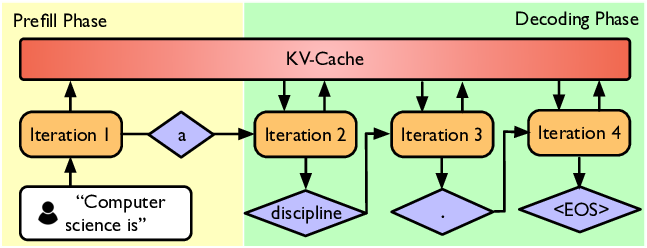

# 第 01 讲：课程概览与分词

> Stanford CS336: Language Modeling from Scratch，**Spring 2026**，3 月 30 日，Percy Liang。目录名里的 `Fall` 沿用项目约定，不代表课程学期。本篇依照 2026 年 `lecture_01.py` 的执行顺序复习；视频入口见文末。

## 这一讲要回答什么

第一，为什么要从零构建语言模型？因为只会调用高层接口，很难理解模型质量、训练效率与系统限制从何而来。第二，在给定数据与硬件预算下，怎样做出尽可能好的模型？课程把这个问题贯穿分词、架构、训练、系统、数据和对齐。第三，模型接收的是整数 token，而人写的是字符串，二者怎样可靠且高效地转换？本讲最后通过四类分词器，落到字节对编码（Byte Pair Encoding，BPE）的训练与编码。

读完应能解释课程五次作业的关系，写出 `encode/decode` 的往返条件，手算 BPE 合并，区分“词表大”“序列短”“模型实际更好”三件不同的事。

## 课程为什么存在：通过构建理解模型

讲义以研究工作抽象层次的变化开场：从自己实现并训练模型，到下载预训练模型微调，再到调用模型应用程序编程接口（Application Programming Interface，API）。抽象提高生产力，但语言模型的抽象层会泄漏：数据处理、架构、优化器、并行和推理系统的选择仍影响结果。课程主张通过亲手搭建这些部件获得基础研究所需的理解。

不过，课堂上的小模型不能直接代表前沿大模型。规模会改变注意力与多层感知机（Multi-Layer Perceptron，MLP）的计算占比，也可能改变行为。因此讲义把可迁移知识分为三类：**机制**（部件如何运作）、**思维方式**（认真计算资源、榨出硬件效率）和**经验直觉**（哪种数据或设计会提高质量）。前两者更适合在课堂传授；第三者需要警惕跨规模外推。

讲义对“苦涩的教训”的用法值得记住：重点不是“算法无用”，而是**能随资源增长持续扩展的算法**。它用“accuracy = efficiency × resources”作为概念框架，不是可直接代入的精确性能公式。资源既包括数据，也包括计算、内存和通信带宽；在固定预算下提高效率，能换来更多训练或更好的模型。

## 语言模型脉络与 2026 年的课程视角

讲义用一条历史线串起后续章节：早期熵估计与 n-gram；神经网络语言模型、LSTM、seq2seq、注意力和 Transformer；ELMo/BERT/T5 的预训练范式；GPT-2/GPT-3、缩放定律和 Chinchilla；再到开放权重与更开放的数据、代码、训练过程。这里的目的不是背模型名单，而是理解研究对象如何从“可微调的模型”变成“可提示、可对话、可执行任务的系统”。截至讲义的 2026 视角，长上下文和推理效率更关键，但注意力、算子、优化等基本问题仍在。

讲义本身是 *executable lecture*：讲课内容写成可执行程序，`main()` 调用各主题函数，关键变量旁有 `@inspect` 标记，可以跟着代码观察中间值。复习时可按函数跳转，比仅看截图更容易验证分词的每一步。

## 五个单元与五次作业

| 单元 | 核心问题 | 作业中的代表任务 |
| --- | --- | --- |
| 基础 | 如何训练一个基本语言模型？ | BPE、Transformer、交叉熵、AdamW、训练循环、资源核算 |
| 系统 | 如何用好图形处理器（Graphics Processing Unit，GPU）及多卡？ | Triton 核函数（kernel）、性能分析、分布式数据并行、优化器状态分片 |
| 缩放定律 | 怎样用较小试验预测大规模选择？ | 查询训练 API、拟合损失、外推超参数 |
| 数据 | 什么数据值得消耗训练预算？ | HTML 转文本、过滤、去重、数据混合 |
| 对齐 | 如何用较弱的评价信号改进模型？ | 数学推理的监督微调与强化学习；直接偏好优化（Direct Preference Optimization，DPO）是作业的可选安全对齐部分 |

这个顺序也解释了为什么第一讲先讲分词：它决定模型处理的“原子”。后续注意力代价按 token 序列长度增长，因此分词不是一个与模型性能无关的文本预处理细节。讲义指出固定资源下要同时考虑**表达能力、训练稳定性、效率**。例如全字节建模形式简洁，但在当下主流架构上序列过长；数据过滤则避免把算力花在劣质样本上。

系统部分的课堂预告给出几个以后会展开的抓手：参数从高带宽显存（High Bandwidth Memory，HBM）搬到计算单元、用 roofline 判断受算力还是带宽限制、用算子融合和分块减少数据搬运、跨卡分片参数/梯度/优化器状态。推理又分为并行处理已知输入的预填充（prefill）和逐 token 生成的解码（decode）；两者资源瓶颈可能不同。这些是后续讲次的路线图，不要求在第一讲掌握实现。



*图：已知提示词可一起预填充，生成阶段按 token 逐步解码。原图由 [Stanford CS336 Spring 2026 第 01 讲讲义](https://github.com/stanford-cs336/lectures/blob/main/lecture_01.py)引用，图像文件见[官方仓库](https://github.com/stanford-cs336/lectures/blob/main/images/prefill-decode.png)。*

缩放定律部分的预告用训练计算近似式 $C\approx 6ND$（$N$ 为参数数、$D$ 为训练 token 数）说明固定算力下要权衡模型大小与数据量。讲义给出的 $D\approx20N$ 是特定计算最优分析中的粗略经验值，不能无条件当成所有模型或部署场景的定律：推理成本与超参数迁移也会改变选择。

数据单元先区分内部评测（指导模型开发）与外部评测（贴近真实使用），然后处理采集、正文抽取、过滤、去重、混合与合成数据。对齐单元给出“生成回答 → 人/验证器/模型评分 → 更新模型偏好”的模板，并预告 PPO、DPO、GRPO 与推理系统之间的联系。

## 分词的接口与衡量方法

讲义的抽象接口只有两个方法：

```python
class Tokenizer:
    def encode(self, string: str) -> list[int]: ...
    def decode(self, indices: list[int]) -> str: ...
```

文本是 Unicode 字符串，模型通常在整数 ID 序列上定义概率分布。正确性首先要求对可接受输入满足 $\operatorname{decode}(\operatorname{encode}(s))=s$。这叫**往返还原**；只数 token 而不检查还原，很容易漏掉空格、标点或多字节字符。

课堂把压缩比定义为

$$r(s)=\frac{|\operatorname{UTF8}(s)|}{|\operatorname{encode}(s)|},$$

单位是“每 token 的 UTF-8 字节数”。同一字符串下，$r$ 越大通常意味着 token 序列越短。标准稠密自注意力的注意力矩阵随序列长度 $T$ 呈 $O(T^2)$ 增长，因此缩短序列有价值。但压缩比不是独立的模型质量指标：扩大词表能缩短序列，却增大嵌入/输出矩阵，并让稀有 token 更难学好。

讲义用 `tiktoken` 的 `o200k_base` 做观察：有些 token 连同**前导空格**，所以句首和句中同一个词可能得到不同 ID；数字也可能每几位分一次。不要假设一个英文单词恰好等于一个 token。`"Hello, 🌍! 你好!"` 是代码里的往返测试文本；讲义前面列出的 `[15496, 11, 995, 0]` 是说明 token 序列形态的示意，不应当当作这段多语文本的真实编码结果。

## 字符、字节、词：三种朴素选择

| 方法 | 基本单元 | 好处 | 本讲指出的缺点 |
| --- | --- | --- | --- |
| 字符 | Unicode 码点，如 `ord("🌍")` | 能逐字符还原 | 可能需要覆盖很大的码点空间，大量字符罕见，压缩比低 |
| 字节 | UTF-8 的 0–255 字节值 | 初始词表只有 256，任意可编码文本都能表示 | 每字节一个 token，压缩比恒为 1，序列很长 |
| 词 | 正则等规则切出的词与符号 | 单元贴近人类词汇，序列较短 | 词表难定界、罕见词难学、新词常需未知词标记（unknown token，`UNK`） |

注意**字符不等于字节**：`"a"` 的 UTF-8 是一个字节，`"🌍"` 是 `f0 9f 8c 8d` 四个字节。`CharacterTokenizer` 使用 `ord/chr`；`ByteTokenizer` 使用 `encode("utf-8")` 和 `bytes(indices).decode("utf-8")`。后者的 256 是基础字节词表大小，并不表示任何中文字符都只花一个 token。

讲义中的词级玩具示例用 `regex.findall(r"\w+|.", string)` 切分，再设想把片段映射到 ID。它只用于说明取舍，不是课程推荐的正式分词器。词级未知词若统一映射 `UNK`，通常无法还原原文，还会影响困惑度的解释。

## 字节级 BPE：从频率学习可变长度片段

BPE 原先是压缩算法，后来用于自然语言处理（Natural Language Processing，NLP）。讲义的版本从 256 个单字节 token 开始，每轮在**当前 token 序列**中统计相邻对，取频率最高的一对，创建一个新 ID 并合并其出现位置。高频字节片段逐渐成为单个 token，低频片段仍由多个 token 表示。这给出有限词表与序列长度之间的实用折中。

记第 $k$ 轮的序列为 $x^{(k)}$，相邻对频次为

$$f_k(a,b)=\sum_{i=1}^{|x^{(k)}|-1}\mathbf{1}[x_i^{(k)}=a\land x_{i+1}^{(k)}=b].$$

选 $p_k\in\arg\max_{(a,b)} f_k(a,b)$，给它新 ID $256+k$，再从左到右将该对**非重叠地**替换。这里的公式是对讲义代码 `count_adjacent_pairs` 的归纳；并列最大时，教学实现由 Python 字典插入顺序决定，不能据此推断正式作业的 tie-break 规则。每轮重数频次，因为合并会改变邻接关系。

讲义的数据结构是 `vocab: id -> bytes` 与按训练顺序保存的 `merges: (id1,id2) -> new_id`。新 token 的字节内容是父 token 字节串的拼接：`vocab[new_id] = vocab[left] + vocab[right]`。编码先把输入转 UTF-8 字节 ID，再按 `merges` 的插入顺序逐轮应用 `merge()`；解码则查每个 ID 的字节串，拼接后统一 UTF-8 解码。不要对单个 BPE token 分别 UTF-8 解码，因为它可能只含某个字符的部分字节。

`merge()` 的核心可写成：

```python
i = 0
out = []
while i < len(ids):
    if i + 1 < len(ids) and (ids[i], ids[i + 1]) == pair:
        out.append(new_id)
        i += 2
    else:
        out.append(ids[i])
        i += 1
```

例如 `"aaaa"` 初始是 `[97, 97, 97, 97]`，相邻对 `(97,97)` 计数为 3，但一次非重叠替换后只得到 `[256,256]`，不是“三个 256”。这一区别是写训练代码时最容易错的地方。

讲义调用 `train_bpe("the cat in the hat", num_merges=3)`，再用所得参数编码并还原 `"the quick brown fox"`。核心检查是新文本仍可往返还原，因为任何没合成大 token 的内容都可以退回基础字节。教学版的 `encode` 每次遍历**全部**合并规则，简单但慢；真实实现要只处理有关的候选合并。

## 从课堂玩具版走向 Assignment 1

讲义明确留下三项工程任务：更高效地找出当前字符串相关的合并；识别并保留 `<|endoftext|>` 等特殊 token；加入与训练一致的预分词（例如 GPT-2 正则），并优化速度。预分词会限制哪些位置允许跨越合并边界，因此训练与编码必须遵循同一套规则。特殊 token 是语义/控制标记，不能简单当普通文本的字符序列处理。词表规模、合并次数和特殊 token ID 如何计入，也要以当年的 Assignment 1 规范为准。

课堂末尾提出更长期的方向：未来可以直接在字节上端到端建模，但模型仍需要高效处理可变长度的“块”，把计算能力分配到内容复杂的地方。这个方向在讲义中是研究展望，不意味着当前作业跳过 BPE。

## 动手练习与自测

1. 手算 `"aaab"`：初始 `[97,97,97,98]`，相邻 `(97,97)` 的计数是多少？合并一次后序列是什么？再数一遍邻接对。答案：计数 2；非重叠合并后 `[256,97,98]`；之后 `(256,97)` 与 `(97,98)` 各 1。
2. 对 `"a🌍"` 分别写出字符 ID 数与 UTF-8 字节 ID 数，再计算两种分词器的 $r$。答案：字符 2 个，字节 5 个；总 UTF-8 字节数 5，因此字符版 $r=2.5$，字节版 $r=1$。字符 ID 空间仍然很大。
3. 为什么 BPE 的 `decode` 应先拼字节串再解 UTF-8？因为一个 token 可能不是完整 UTF-8 字符，单独解码会失败或丢信息。
4. 若增加合并次数使序列变短，模型一定更好吗？不一定；更大的词表增加参数和稀有 token 问题，还要考虑不同语言、数据分布与训练预算。
5. 说出讲义教学版与正式作业至少三处差别。答案可包括高效编码、特殊 token、预分词与性能优化。
6. 用自己的话解释为什么第一讲反复讲“效率”。答案应同时涉及固定数据/计算预算、分词后的序列长度，以及后续数据搬运、并行和数据质量。

## 来源、版本与视频核对

- 课程身份与课次：[Stanford CS336 Spring 2026 官方课表](https://cs336.stanford.edu/)，第 1 讲为 “Overview, tokenization”。
- 主要内容与代码：[2026 官方可执行讲义 `lecture_01.py`](https://github.com/stanford-cs336/lectures/blob/main/lecture_01.py)，主要对应 `main`、`course_syllabus`、`tokenization`、`train_bpe` 等函数。文中的手算公式和练习是基于其代码写出的复习推导。
- 观看入口：课程网站所列[官方 YouTube 录像列表](https://www.youtube.com/playlist?list=PLoROMvodv4rMqXOcazWaTUHhq-yembLCV)及[B 站合集 P1](https://www.bilibili.com/video/BV11LEA6eEuj/?p=1)。目前未取得可用的逐句字幕，无法保证教师口述内容逐句覆盖；本篇按官方 2026 讲义核对主题与顺序，也不把其他平台录像的时间戳当作 B 站时间戳。
- [Assignment 1: Basics](https://github.com/stanford-cs336/assignment1-basics) 用于继续做正式实现；此处的 BPE 代码描述是讲义教学版，不替代作业的完整规范。
