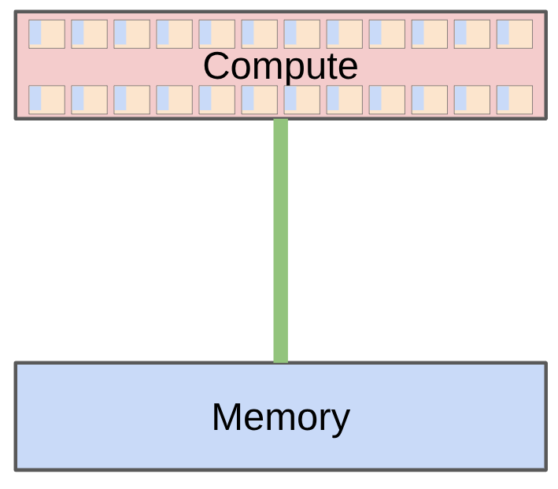
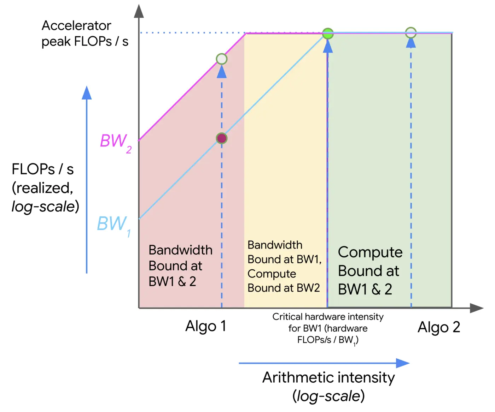

# 第 02 讲：PyTorch 与资源核算

> Stanford CS336, Spring 2026，4 月 1 日，Percy Liang。官方课表标题为 “PyTorch (einops), resource accounting (FLOPs, memory, arithmetic intensity)”。本篇沿用目录中的“2026_Fall”名称，实际对应春季课程。

**承接第 01 讲的预测：** 课堂开头约 00:09–00:43 报告，Marin 的 $10^{23}$ FLOPs 训练已经完成，实测 loss 与事先登记的预测相差不超过 0.05。这给“先预测、后检验”补上结果，但只是该次实验，不能据此说更远规模外推都成立。

## 本讲要解决什么问题

给定计算量和显存预算，能训练多大的模型、要花多久？本讲建立一套可手算、可用代码验证的资源账本：张量占多少字节，一次运算做多少浮点操作（floating-point operations，FLOPs），图形处理器（Graphics Processing Unit，GPU）算力与显存带宽各能支撑多少吞吐，训练时参数、梯度、优化器状态和激活分别占多少空间。讲义的核心提醒是：遇到模型和系统选择，先做数量级估算。

先看讲义开头两个问题。若用近似训练成本 `6ND`，70B 参数、15T token 约需 `6 × 70×10^9 × 15×10^12 = 6.3×10^24` FLOPs。按讲义假设：1024 张 H100、每卡稠密 bfloat16（BF16）峰值 `1979/2 ≈ 989.5` TFLOP/s、模型 FLOPs 利用率（Model FLOPs Utilization，MFU）为 0.5，得到约 **144 天**。这是理想化算力估算，未单独计入通信、故障、数据管线和非矩阵算子。另一问中，8 张 80 GB H100 总容量 640 GB；若 BF16 参数 2 B、梯度 2 B、Adam 的两个 float32（FP32）状态合计 8 B，每参数 12 B，约能装 `640/12 ≈ 53.3B` 参数。它只是忽略激活、碎片和其他缓冲区的容量上界，还默认这些状态可跨卡分摊；普通数据并行的完整副本不能这样相加。

**面试速述：** 资源核算先分别估张量字节、训练 FLOPs、硬件吞吐与显存容量，再判断预算是否可行。`6ND` 与有效吞吐只能粗估训练时间；每参数约 12 B 和总显存只给出忽略激活、临时张量的模型容量上界。实际耗时还受通信与设备利用率影响，可容纳规模还受激活和临时副本影响。

## 张量：所有资源账本的基本单位

**面试速述：** 张量的形状、元素数和 dtype 决定模型数据的逻辑字节数，这是核算参数、梯度、状态和激活的起点。实际峰值显存还受视图共享、临时缓冲和分配器影响，不能只把各张量的 `numel × element_size` 相加。

### 形状、秩、元素数

数据、模型参数、梯度、优化器状态和中间激活都以张量存储。张量的 `rank` 是轴的个数，不是元素总数。例如 `torch.zeros(4, 8, 2)` 的 rank 为 3，元素数为 64。多头注意力常见形状为 `[batch, sequence, heads, head_dim]`；讲义举例 `[32, 16, 16, 64]`，元素数是 `32×16×16×64 = 524288`。

最基本的逻辑存储量公式是

`张量字节数 = numel() × element_size()`。

`torch.zeros(4, 8)` 默认 FP32，每元素 4 B，所以是 `4×8×4 = 128 B`。这计算的是张量元素本身的字节数，不是进程或 GPU 分配器看到的全部占用；视图可能共享底层存储，实际分配还有对齐、缓存及框架开销。

**面试速述：** rank 是轴数，元素数是各轴长度的乘积，逻辑存储量等于元素数乘每元素字节数。这个公式适合先算数量级；遇到转置视图、缓存或对齐时还要测运行时实际分配。

### 精度与动态范围

| 类型 | 每元素 | 本讲关心的取舍 |
| --- | ---: | --- |
| FP32 | 4 B | 精度与范围较稳，显存成本高 |
| float16（FP16） | 2 B | 省显存，但极小数容易下溢；讲义中的 `1e-8` 变成 0 |
| BF16 | 2 B | 指数范围接近 FP32，尾数更短；讲义中的 `1e-8` 非零 |
| 8 位浮点（FP8） | 1 B | H100 支持 E4M3、E5M2 两种格式；范围与精度取舍不同 |
| NVIDIA 4 位浮点格式（NVFP4） | 基础值 4 bit | 讲义提到块级缩放；完整存储成本还含 scale 等元数据 |

字节数很快会成为架构约束：讲义把 GPT-3 一个前馈层权重矩阵写为 `[12288×4, 12288]`，只按 FP32 元素存储就是 `12288×4×12288×4 = 2,415,919,104` B，约 **2.25 GiB**；这还只是其中一块矩阵，未计梯度与优化器。计算大型模型的可容纳规模时，应先逐张列出形状与 dtype，再汇总，不能把“模型有多少 B 参数”直接当作显存 GB。（官方讲义 `tensors_memory()`；GiB 是按源码数值换算的复习解释）

讲义还给出 FP8 的具体取舍：H100 的 E4M3 例示范围约 `[-448, 448]`，E5M2 约 `[-57344, 57344]`，后者用更多指数位换范围、减少尾数精度。NVFP4 的基础可表示值只有少数离散点（如 0、±0.5、±1、±1.5、±2、±3、±4、±6），靠每个数据块独立的 scale 扩大有效范围；同一块内的值不能各自任意缩放。这解释了为什么从 BF16 继续降位宽要同时设计缩放、累加和误差控制。（官方讲义 `tensors_memory()`；范围是该讲义的格式示例）

因此“半精度”不能只理解为内存减半：FP16 的范围问题可能使训练不稳定，BF16 扩大了指数范围却牺牲有效数字。讲义给出的混合精度账本是 BF16 参数、激活与梯度，优化器累计状态用 FP32；真实框架配置也可能保留 FP32 主权重或产生临时拷贝，必须以实际配置核算。`torch.amp.autocast("cuda", dtype=torch.bfloat16)` 按算子规则选择运算精度，并不等于把上下文里所有新建张量永久转为 BF16，例如未指定 `dtype` 的 `torch.zeros` 仍可保持默认 FP32。

张量默认在 CPU；要在 GPU 上计算，可用 `x.to("cuda")`，也可创建时指定 `device="cuda"`。跨设备复制本身有代价，应与 GPU 内部算子耗时区分。

**面试速述：** FP16、BF16 等低精度减少字节并可能提高矩阵吞吐，但 FP16 更易下溢，BF16 则以较短尾数换取接近 FP32 的指数范围。混合精度是否省下预期显存，要连同 FP32 优化器状态、主权重及跨设备复制一起按真实配置核算。

## 用 einops 把维度写进算式

`einops` 的 `einsum`、`reduce`、`rearrange` 分别表达带命名轴的求和乘积、归约和形状重排。优势是阅读时能直接看出哪个轴被保留、求和或拆合，减少 `transpose(-2, -1)` 一类位置索引错误。

```python
from einops import einsum, rearrange, reduce
import torch

x = torch.ones(2, 3, 4)  # batch seq1 hidden
y = torch.ones(2, 5, 4)  # batch seq2 hidden
scores = einsum(x, y, "batch seq1 hidden, batch seq2 hidden -> batch seq1 seq2")
# scores.shape == (2, 3, 5); hidden 被求和

mean_hidden = reduce(x, "batch seq1 hidden -> batch seq1", "mean")
heads = rearrange(torch.ones(3, 8), "seq (heads dim) -> seq heads dim", heads=2)
# heads.shape == (3, 2, 4)
```

讲义先用 `x @ y.transpose(-2, -1)` 展示批量两两内积，再用具名轴表达同一件事；`...` 可代表任意前置维度。`rearrange` 只负责形状和顺序，语义正确的前提是轴拆分长度相乘相符；它本身不承担线性变换。讲义的例子先把长度 8 拆成 2 个 head × 4 维，再对每个 head 应用同一个 4×4 权重，最后合并 head。

**面试速述：** `einops` 用轴名写清哪些维度相乘求和、规约或重排，便于验证注意力等张量表达式的形状。`rearrange` 只改变维度组织，不会替代权重投影；拆轴时必须满足长度乘积约束。

## 从 FLOPs 到 MFU

**面试速述：** FLOPs 衡量工作总量，FLOP/s 衡量执行速度，MFU 则把实测模型吞吐与对应精度的硬件峰值比较。仅有理论计算量无法推断耗时，还要用算术强度和 Roofline 判断搬运字节是否限制吞吐。

### 计算量与吞吐不是一个量

FLOP 是一次浮点操作；FLOPs 在本讲用来表示操作总数，FLOP/s 是每秒操作数。对 `[B,D] @ [D,K]`，每个输出是长度 D 的点积，精确按乘法与加法计为 `D + (D-1) = 2D-1`，所以总量是 `BK(2D-1)`；大矩阵常写成 `2BDK`。若 `B=1024,D=256,K=64`，近似为 `33,554,432` FLOPs。

实测吞吐为 `操作 FLOPs / 耗时秒数`。GPU 运算是异步的，讲义的 `benchmark()` 在计时前后调用 `torch.cuda.synchronize()`；否则只量到 CPU 发起任务的时间。峰值 FLOP/s 还要按 GPU 型号、数据类型以及稀疏/稠密口径选择：讲义用于 H100 的 BF16 稠密峰值是稀疏宣传值 `1979 TFLOP/s` 的一半，不能拿 FP32 实测去除以 BF16 峰值。

讲义将 MFU 写为“实际 FLOP/s ÷ 对应峰值 FLOP/s”，并以达到 0.5 作为不错的量级。实际测量要说明分子如何计数：单个 matmul 的实测利用率、整模型按理论 FLOPs 和训练吞吐估算的 MFU，不完全是同一指标；启动开销、通信、算子组合与访存都会压低整步结果。

**面试速述：** 矩阵乘 `[B,D]@[D,K]` 约做 `2BDK` 次操作，除以同步后的耗时才得到实测 FLOP/s；再除以匹配 dtype 和稠密口径的峰值可估利用率。CUDA 异步执行和不同的 FLOPs 计数口径都会让未经说明的 MFU 数字失去可比性。

### 算术强度与 Roofline

一次运算要从显存读输入、在加速器上计算、再写输出。设峰值算力 `P`（FLOP/s）、带宽 `W`（B/s），算术强度 `I = FLOPs / 搬运字节数`（FLOP/B），硬件的临界强度是 `P/W`。讲义以 H100 BF16 稠密 `P≈989.5×10^12`、`W≈3.35×10^12` 为例，拐点约 `295 FLOP/B`。理想 Roofline 给出 `有效吞吐 ≤ min(P, I×W)`，相应计算时间与搬运时间的下界为 `max(FLOPs/P, bytes/W)`。真实内核还受缓存、调度、占用率、指令实现等限制，不能把上界当实测值。



*图：参数由内存搬到计算单元；下方 Roofline 账本中的字节数应针对所分析的内存层计算。原图由 [Stanford CS336 Spring 2026 第 02 讲讲义](https://github.com/stanford-cs336/lectures/blob/main/lecture_02.py)引用，图像文件见[官方仓库](https://github.com/stanford-cs336/lectures/blob/main/images/compute-memory.png)。*



*图：第 02 讲约 55:51–57:07 展示的 [Roofline 原图](https://jax-ml.github.io/scaling-book/assets/img/roofline-improved-1400.webp)。横轴是算术强度，纵轴是可实现 FLOP/s（均为对数示意）；斜线由带宽决定，水平线由峰值算力决定。相同 Algo 1 在低带宽 BW1 下受访存限制，在较高带宽 BW2 下可能转为计算受限；Algo 2 在两种带宽下都处于计算受限区。彩色区域是理想模型的界限，不是实际测得的 kernel 吞吐。*

对 BF16 数据，讲义的几个独立运算可这样心算：

| 运算 | 近似 FLOPs | 最低读写字节 | 强度与判断 |
| --- | ---: | ---: | --- |
| ReLU，N 个元素 | `N` 次比较的示意计数 | `4N` | 约 0.25，访存受限 |
| GELU，N 个元素 | 讲义粗估 `20N` | `4N` | 约 5，仍低于拐点 |
| 向量点积，长度 N | `2N-1` | 约 `4N` | 约 0.5，访存受限 |
| N×N 矩阵乘向量 | 约 `2N²` | 约 `2N²+4N` | 约 1，访存受限 |
| N×N 矩阵相乘 | 约 `2N³` | 约 `6N²` | 约 `N/3`；N=1024 时约 341，理想模型中越过拐点 |

ReLU 的比较并非严格浮点加乘 FLOP，此处遵循讲义的示意计数；GELU 的真实操作数依近似实现变化。矩阵乘强度高的关键是同一输入元素可在大量乘加中复用。大批量训练常出现大矩阵乘；低 batch 的推理更接近矩阵向量乘，容易受读权重带宽约束。这是工作负载直觉，不代表所有训练算子都计算受限或所有推理都访存受限。

一个容易答反的课堂判断是：**孤立运行**的 ReLU 虽然比 GELU 少做许多算术，却不必然更快，因为两者都要按元素读写，按上表在 H100 示例中都远低于约 295 FLOP/B 的临界强度。若与邻近算子融合、命中缓存或使用不同近似实现，结论还需重新测量。（官方讲义 `arithmetic_intensity_relu()`、`arithmetic_intensity_gelu()`；“孤立运行”的条件来自讲义）

讲义把 Roofline 理想上界的归一化写作 `min(1, 算术强度/硬件临界强度)`。它表达的是**只看算力与带宽时**最多可达到的峰值比例，不能直接当作测得的整模型 MFU。

**面试速述：** 算术强度是每搬运一字节做多少 FLOPs，低于硬件 `峰值算力/带宽` 拐点时更可能受带宽限制，高于它才有机会受计算限制。Roofline 给的是理想上界；缓存、启动、占用率和通信仍需通过实测辨别。

## 反向传播：为什么常见估算是 6ND

讲义先用 `loss = 0.5 × (x·w - 5)²` 检查 autograd。取 `x=[1,2,3]`、`w=[1,1,1]`，预测为 6，残差为 1，因此 `∂loss/∂w = (6-5)x = [1,2,3]`。`requires_grad=True` 让 PyTorch 建图，`loss.backward()` 把结果累积到 `w.grad`，不是覆盖先前梯度。

再看一层 `Y=XW`，`X:[B,D]`、`W:[D,K]`、上游梯度 `G=∂L/∂Y:[B,K]`：

- 前向 `Y=XW`：约 `2BDK` FLOPs。
- 输入梯度 `∂L/∂X=GWᵀ`：约 `2BDK` FLOPs。
- 权重梯度 `∂L/∂W=XᵀG`：约 `2BDK` FLOPs。

所以只看这层的大型矩阵乘，反向约为前向的 2 倍，总计约 `6BDK`。若网络参数量为 `N`、每步处理 `D_data` 个训练位置，常用 `6N D_data` 作整段训练成本的一阶估计。本讲脚本总结也写 `6 × 数据点数 × 参数数`。但这里的 `D_data` 不是张量隐藏维度 D；对语言模型通常以 token 数代入。长上下文注意力、词表投影、归一化、重计算与优化器更新等会让实际 FLOPs 偏离这个近似。

讲义的 `DeepNetwork` 由 L 个 `D×D` 参数矩阵构成，参数量 `LD²`；每层线性之后接 ReLU，形状始终 `[B,D]`。前向需要保存反向所需激活，所以显存随 B、D、L 增大。

**面试速述：** 线性层前向一次矩阵乘，反向分别算输入与权重梯度两次同量级矩阵乘，因此训练常以每参数每 token 约 6 FLOPs 估算。`6ND` 忽略注意力、词表投影、重算等成本，只适合作为大矩阵乘占主导时的数量级账本。

## 优化器、训练循环与显存组成

讲义用 AdaGrad 演示“优化器状态也是张量”：对每个参数积累平方梯度 `g2 ← g2 + g²`，再按 `w ← w - lr × g / sqrt(g2 + ε)` 更新。动量方法跟踪一阶梯度统计，AdaGrad 跟踪累计平方梯度，RMSProp 用指数平均跟踪平方梯度，Adam 同时有一阶、二阶状态。这里关注状态占用，不把这些简述当完整算法定义。

假设参数和梯度 BF16、状态 FP32，参数数为 N，则基础项是参数 `2N` B、梯度 `2N` B、AdaGrad 状态 `4N` B 或 Adam 两组状态 `8N` B。Adam 基础合计 `12N` B，仍未含激活、临时张量、主权重、框架缓冲及碎片。讲义简化网络每层一个 `[B,D]` 激活，BF16 估算 `2BDL` B；实际 autograd 保存哪些张量依算子而异，峰值显存应用 profiler/运行时测量验证。

训练循环的顺序是取 batch、前向算 loss、`backward()`、`optimizer.step()`、`optimizer.zero_grad(set_to_none=True)`。`set_to_none=True` 可释放梯度张量引用，下一次反向再创建。讲义 `train_loop()` 中 `pred_y = model(x).mean()` 为标量、目标 `y` 是长度 B 的向量，`mse_loss` 会广播；它是展示流程的简化例子，真正逐样本监督应使预测与目标形状匹配。

**面试速述：** 训练显存不只放权重，还要放梯度、Adam 的两组状态和反向所需激活；在文中的 BF16/FP32 假设下基础状态约为每参数 12 B。训练循环按前向、反向、更新、清梯度执行，实际峰值还须测临时张量和框架开销。

## 用计算换显存：梯度累积与激活检查点

**面试速述：** 梯度累积用多个 microbatch 模拟一次较大有效 batch，降低单次活跃激活；检查点则在反向时重算前向片段以少存激活。两者都不消除参数和优化器状态，且会改变运行时间或数值细节。

### 梯度累积

大 batch 的激活占用随 batch 近似线性增长。讲义把全局 batch 64 切为 4 个 microbatch，每个 16：每次只需保留一个 microbatch 的活跃计算图，讲义简化激活项从 `2×64×D×L` 降为 `2×16×D×L`，但参数、梯度和优化器状态并不随之减少。

```python
optimizer.zero_grad(set_to_none=True)
for x, y in microbatches:  # 本例为 4 个等大小 microbatch
    loss = criterion(model(x), y) / 4
    loss.backward()          # 四次反向的梯度相加
optimizer.step()             # 只更新一次
```

除以 4 才使四个等大小 microbatch 的平均梯度与一个大 batch 的平均梯度一致；不等大小时应按样本或 token 数加权。不要在每个 microbatch 后 `zero_grad()` 或 `step()`，否则不是同一次有效 batch 的累积。随机层、按 batch 计算的统计量以及数值舍入也可能造成与真正大 batch 的细微差异。

**面试速述：** 梯度累积把有效 batch 拆开逐次前向和反向，期间只累加梯度、最后更新一次；等大小分块要按分块数缩放 loss。它主要降低单次激活峰值，不降低权重或 Adam 状态，也未必与整批计算逐位相同。

### 激活检查点

训练反向要用前向激活；检查点只存一部分中间结果，在反向时从最近保存点重新计算缺失激活。它降低激活显存，但增加前向计算。讲义使用 `torch.utils.checkpoint.checkpoint(layer, x)` 展示逐层重算；激活节省多少要按网络结构和检查点粒度测量。

对深度 L 的简化顺序网络，讲义给出三种直觉：每层都存，激活空间 `O(L)`、无重算；若完全不留中间层、每次都从开头重算，空间 `O(1)`、累计计算可达 `O(L²)`；每隔约 `√L` 层保留一个检查点，边界与段内临时激活合计 `O(√L)`，额外重算可保持 `O(L)` 量级。这里是按层数计的渐近量，不能直接当字节数。梯度累积减少单次 microbatch 的激活，检查点减少单个 microbatch 所保留的激活，二者可组合。

**面试速述：** 激活检查点只保留少量前向边界，反向需要时重新计算段内激活，以额外 FLOPs 换显存。检查点间距决定重算和保留量的平衡；渐近复杂度不能直接当实际字节数或加速结论。

## 复习自测

1. `[32,16,16,64]` BF16 张量的逻辑元素存储量是多少？答：`524288×2 = 1,048,576 B = 1 MiB`。
2. 为什么 `1024×1024` BF16 矩阵乘可能跨过 H100 本讲的 Roofline 拐点，而同规模矩阵向量乘通常不能？答：前者约 `N/3≈341 FLOP/B`，后者约 1 FLOP/B；本讲临界值约 295 FLOP/B。
3. 若一层 `X:[B,D]`、`W:[D,K]`，写出反向所需两次矩阵乘及 FLOPs。答：`GWᵀ`、`XᵀG`，各约 `2BDK`。
4. 10B 参数在本讲 BF16 参数/梯度、FP32 Adam 状态账本下，基础状态需要多少字节？答：`10B×12 = 120 GB`，尚未计算激活与缓冲。
5. 四个等大的 microbatch 为何要在每个 loss 上乘 1/4？答：梯度默认累加；这样得到的是 4 份 loss 的平均梯度，而非求和。
6. 激活检查点改变了哪些资源？答：少保存激活，以反向重算增加计算；参数和优化器状态不会因此消失。

**本节小结：** 自测将元素字节数、Roofline 拐点、反向矩阵乘和显存交换策略串成一套手算账本，可用来核查数量级与公式适用条件。

## 来源与视频核对状态

本篇以 [Stanford Spring 2026 官方课表](https://cs336.stanford.edu/)所列第 02 讲及其 [lecture_02.py 官方讲义](https://cs336.stanford.edu/lectures/?trace=lecture_02) 为内容基线；官方页面还列出 [recording version](https://cs336.stanford.edu/lectures/?trace=lecture_02_recording)，不同版本细节以所观看录像为准。观看入口还有课程网站所列[官方 YouTube 录像列表](https://www.youtube.com/playlist?list=PLoROMvodv4rMqXOcazWaTUHhq-yembLCV)及[B 站合集 P2](https://www.bilibili.com/video/BV11LEA6eEuj/?p=2)。另用经校验的第三方归档副本、英文字幕和抽取画面核对开头实验结果及 Roofline 等关键段落；**没有人工逐帧观看或逐句核对完整口述**，也不标 B 站时间戳。文中关于 MFU 口径、实际显存、广播示例和累积 loss 权重的提醒属于为准确复习补充的解释。

**本节小结：** 本篇以官方 2026 讲义为内容基线，资源估算和实际 PyTorch 行为的补充说明用于复习核算；视频口述不在逐句核对范围内。
