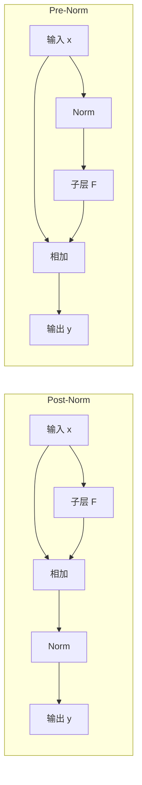

# 第 03 讲：模型架构与超参数

> CS336 Spring 2026，Lecture 3，Tatsu Hashimoto。课堂主线是比较真实大模型的选择：哪些结构已经相当一致，哪些超参数只是经验起点，哪些技巧主要服务于训练稳定性或推理成本。本文依照 67 页[官方讲义](https://github.com/stanford-cs336/lectures/blob/main/lecture_03.pdf)的页序整理；[B 站合集 P3](https://www.bilibili.com/video/BV11LEA6eEuj/?p=3)供配合观看。没有取得该视频可直接核对的字幕，因此页码指讲义页，不代表视频时间戳，也不能保证覆盖教师的每句口述。

## 1. 先问：我们到底在选择什么（讲义 1–9 页）

本讲以原版 Transformer 和作业中实现的简化现代 Transformer 对照开场。原版使用正弦位置编码、ReLU 前馈网络（Feed-Forward Network，FFN）、残差相加后的层归一化（Post-LayerNorm）；作业版把归一化放到子层之前，使用旋转位置编码（Rotary Position Embedding，RoPE）和 Swish 门控线性单元（Swish-Gated Linear Unit，SwiGLU），并省去线性层与归一化中的偏置。这里的目的不是给出一份「永远最佳」配置，而是借大量稠密模型的公开设计判断每种选择的收益、代价与证据强弱。

观察现代语言模型，可以先把问题分为四组：归一化与 FFN 等块内结构；位置如何进入注意力；宽度、深度、头数、词表等超参数；训练稳定性与推理时的注意力成本。讲义 9 页强调 LLaMA 风格结构的主导地位，同时指出查询／键归一化（Query-Key Normalization，QK-Norm）、混合注意力等后续趋势。

**面试速述：** 架构选择要同时解释训练是否稳定、固定预算下的质量和推理成本；现代 Transformer 的常见配置是经验起点而非唯一最优解。比较模型时应先统一参数、数据与服务约束，再评估归一化、FFN、位置编码和注意力变体各自解决的问题。

### 读模型配置时的最小词汇表

设残差流宽度为 $d=d_{\mathrm{model}}$，层数为 $L$，FFN 中间宽度为 $d_{\mathrm{ff}}$，查询头数为 $h_q$，每头宽度为 $d_h$，词表大小为 $V$。这些量互相关联，但没有一个单独决定质量；同参数量下还要考虑训练稳定性、吞吐、推理延迟和键／值缓存（Key-Value Cache，KV Cache）。

**面试速述：** 读配置至少要分清残差宽度、层数、FFN 宽度、查询头数、头维和词表大小；它们共同决定参数、计算和 KV 缓存。单看某个比例或总参数量无法判断质量与推理延迟。

## 2. 归一化：残差主路要保持通畅（讲义 10–19 页）

**面试速述：** 归一化既影响深层残差网络的梯度传播，也有实际访存和计算成本；Pre-Norm 保留直接恒等主路，RMSNorm 则省去均值中心化。选型要看稳定性与实测运行时间，不能把少量 FLOPs 差直接等同于吞吐收益。

### Pre-Norm、Post-Norm 与双重归一化

用 $F$ 表示注意力或 FFN 子层，经典 **Post-Norm** 写作 $y=\mathrm{Norm}(x+F(x))$；常见 **Pre-Norm** 写作 $y=x+F(\mathrm{Norm}(x))$。后者让残差主路存在一条直接的恒等路径，梯度跨层传播更平稳。讲义引用 Xiong 等关于梯度衰减、Salazar 与 Nguyen 关于梯度尖峰的解释：早期强调可以减少学习率 warmup，今天更看重深层大模型的稳定性和较大学习率。BERT 采用 Post-Norm，而讲义所比较的大多数现代语言模型（Language Model，LM）使用 Pre-Norm；不要把「大多数」理解为数学上的绝对规则。（10–12 页）

*图：根据 [Stanford CS336 Spring 2026 第 03 讲 PDF 第 10 页](https://github.com/stanford-cs336/lectures/blob/main/lecture_03.pdf#page=10)公式自绘。Post-Norm 的残差主路经过 Norm；Pre-Norm 的主路直通。本图仅保留与这两个公式直接对应的路径。*

所谓 **double norm** 是在分支上再加一次 Norm，例如 $y=x+\mathrm{Norm}_{\mathrm{post}}(F(\mathrm{Norm}_{\mathrm{pre}}(x)))$。关键是额外的 Post-Norm 位于变换分支、加法之前，残差主路仍可直通；它与 $\mathrm{Norm}(x+F(x))$ 不同。讲义举 Grok、Gemma 2 为双 Norm 例子，OLMo 2 则仅采用非残差路径上的 Post-Norm。（13 页）

**面试速述：** Pre-Norm 写作 `x+F(Norm(x))`，残差主路直通，通常有利于深层训练稳定；Post-Norm 的主路经过加法后的 Norm。双重归一化可以在分支再加 Norm，但只要它位于残差相加之前，就不能把它误称为经典 Post-Norm。

### LayerNorm 与 RMSNorm

对单个 token 的 $d$ 维向量，LayerNorm 先减均值再按方差缩放：

$$\mu=\frac1d\sum_i x_i,\quad \sigma^2=\frac1d\sum_i(x_i-\mu)^2,\quad y_i=\gamma_i\frac{x_i-\mu}{\sqrt{\sigma^2+\epsilon}}+\beta_i.$$

RMSNorm 不减均值、通常也没有加性偏置：

$$\operatorname{RMS}(x)=\sqrt{\frac1d\sum_i x_i^2+\epsilon},\qquad y_i=\gamma_i\frac{x_i}{\operatorname{RMS}(x)}.$$

讲义列 GPT 早期系列、OPT、BLOOM 等为 LayerNorm 例子，LLaMA、PaLM、T5 等为 RMSNorm 例子。RMSNorm 少一次均值计算、少搬运偏置参数；论文和实测曾报告运行时间与效果上的收益。但「少一些 FLOPs」本身不足以推断墙钟时间：大矩阵乘法主导运算量，而 Norm 的数据搬运也可能成为瓶颈。讲义特别借此提醒 **FLOPs 不等于运行时间**。（14–17 页）

同一思路延伸到线性层：许多现代 Transformer 直接取消 bias。一个非门控、无偏置的 FFN 可写成 $\sigma(xW_1)W_2$。小偏置的参数量不多，但在优化稳定性与访存权衡下常常不划算；也不要误以为「所有模型都无 bias」。（18–19 页）

**面试速述：** LayerNorm 先减均值再按方差缩放，RMSNorm 只按均方根缩放，因此实现更简洁，也常与无偏置线性层搭配。它的优势要在具体 kernel 与模型上测量；Norm 的 FLOPs 下降不保证整步训练同幅提速。

## 3. FFN：激活、门控与串并行（讲义 20–29 页）

**面试速述：** FFN 的核心选择是非线性函数、是否引入逐元素门控，以及注意力与 FFN 在块内串行还是并行。比较结构效果时要固定参数或激活计算预算，因为门控多一组投影，并行结构也会改变信息依赖。

### 从 ReLU、GeLU 到 GLU

普通两层 FFN 是 $\operatorname{FFN}(x)=\phi(xW_1)W_2$。原版 Transformer 使用 $\phi(t)=\max(0,t)$ 的 ReLU；GPT 早期模型常用 GeLU，定义为 $t\Phi(t)$，其中 $\Phi$ 是标准正态累积分布函数。（20–21 页）

GLU 家族在中间层增加一条按元素相乘的分支：

$$\operatorname{GLU}_{\phi}(x)=\bigl[\phi(xW_g)\odot(xW_u)\bigr]W_d.$$

其中 $\phi=\mathrm{ReLU}$ 称 ReGLU，$\phi=\mathrm{GeLU}$ 称 GeGLU，$\phi=\mathrm{SiLU}$ 称 SwiGLU；$\mathrm{SiLU}(t)=t\,\mathrm{sigmoid}(t)$，也叫 Swish。门控分支并非二值开关，而是逐元素调节信息量。讲义引用 Shazeer 与 Narang 等实验：GLU 变体相对普通 FFN 有较一致的收益，但 GPT-3 说明它并非训练出可用模型的必要条件。（22–26 页）

**参数量案例。** 不计 bias，普通 FFN 约有 $2dd_{\mathrm{ff}}$ 个参数；若取 $d_{\mathrm{ff}}=4d$，约 $8d^2$。门控 FFN 有三块投影，约 $3dd_{\mathrm{ff}}$；为了保持近似相同参数量，取 $d_{\mathrm{ff}}\approx(8/3)d$，仍约 $8d^2$。因此比较「SwiGLU 与 ReLU 哪个好」时，必须说清楚是固定中间宽度还是固定参数预算。（23、37–38 页）

**面试速述：** GLU 类 FFN 用激活后的门控分支逐元素调节另一分支，SwiGLU 是其中使用 SiLU 的版本。它有三块投影，同参数预算下中间宽度通常从普通 FFN 的 `4d` 降到约 `8d/3`；若不控制预算，性能比较会混入参数量差异。

### 串行层与并行层

常见块内计算是串行的：$a=x+\operatorname{Attn}(\operatorname{Norm}_1(x))$，再做 $y=a+\operatorname{FFN}(\operatorname{Norm}_2(a))$。并行变体让两条分支都读取同一个 $x$，形如 $y=x+\operatorname{Attn}(\operatorname{Norm}(x))+\operatorname{FFN}(\operatorname{Norm}(x))$。后者可共享 Norm、合并部分矩阵乘法，利于某些实现的速度，但不等价于串行块，因为 FFN 读不到当前层注意力的输出。讲义举 GPT-J、PaLM、GPT-NeoX 以及较新的 Command A、Falcon 2、Command R+ 为并行例子；多数模型仍采用串行层。（27–29 页）

**面试速述：** 串行块让 FFN 处理本层注意力更新后的表示；并行块让两条分支读同一输入，可共享部分运算并提高某些实现的速度。两者计算图不同，所以不能只把并行视为无损的执行重排。

## 4. 位置编码：为何 RoPE 适合相对位置（讲义 30–35 页）

讲义依次比较：把固定正弦/余弦向量加到 token embedding；把可训练绝对位置向量加到 embedding；在注意力计算中加入相对位置项；对查询和键使用旋转位置编码 RoPE。前两类的输入都是「内容向量 + 位置向量」，展开内积后会有内容和位置的交叉项，不能仅依赖两位置之差。显式相对位置项可以表达相对距离，但形式不再只是原始 Q、K 的内积。（30–31 页）

RoPE 的目标是让注意力内积满足 $\langle f(q,i),f(k,j)\rangle=g(q,k,i-j)$。把每相邻两维当作二维平面，位置 $m$ 的旋转为

$$R(m\theta)=\begin{bmatrix}\cos(m\theta)&-\sin(m\theta)\\ \sin(m\theta)&\cos(m\theta)\end{bmatrix},\qquad q'_m=R_mq_m,\quad k'_n=R_nk_n.$$

由于旋转矩阵正交，$\langle R_mq,R_nk\rangle=q^\top R_m^\top R_n k=q^\top R_{n-m}k$；多组二维坐标使用不同频率 $\theta_r$。这就是「绝对位置分别旋转，内积自然体现相对位移」的核心。与加法式正弦编码相比，RoPE 直接作用于每次注意力的 Q/K，不作用于 V，且不是把位置向量加到 token embedding 上。讲义 33 页还展示了只旋转部分维度的替代设计，说明实现细节并非唯一。（32–35 页）

**小例子。** 若 $q=k=(1,0)$，令两位置的角度分别为 $0$ 和 $\pi/3$，旋转后的点积为 $\cos(\pi/3)=1/2$；两位置同时向后平移相同距离，差值不变，点积仍为 $1/2$。真实模型的 Q/K 向量和频率更复杂，但不变性相同。

**面试速述：** RoPE 按位置旋转 Q/K 的二维坐标，使两者内积中的旋转只依赖位置差，从而把相对位置信息直接放进注意力分数。它不旋转 V，也不是给 embedding 加绝对位置向量；频率与旋转维度仍有具体实现差别。

## 5. 尺寸与正则化：经验范围及例外（讲义 36–51 页）

**面试速述：** FFN 宽度、头维、深宽比、词表和正则化都可从公开模型配置得到经验起点，但这些比例存在明显例外。要先固定训练 token、参数和部署约束，再用同预算实验选择，而不能照搬某个模型的数字。

### FFN 宽度、注意力头数

非门控 FFN 的常见经验起点是 $d_{\mathrm{ff}}=4d$；门控版本在相近参数预算下常取约 $8d/3$。这只是预算规则，不是硬性约束。讲义表中 PaLM、Mistral、LLaMA 2 等门控模型的比例可达约 3.5–4，而 T5 11B 用过 $65{,}536/1{,}024=64$ 的极端比例；后续 T5 v1.1 回到 GeGLU 的约 2.5 倍。Kaplan 等的实验在较宽的比例区间呈现损失较平坦的「盆地」，所以不必把某个数看成唯一最优。（37–41 页）

若有 $h_q$ 个查询头、每头宽度 $d_h$，标准常见选择是 $h_qd_h=d$，但 Q/K/V 投影维度可以由矩阵决定，并非必须等于残差宽度。讲义表中 GPT-3 与 LLaMA 2 是比例 1 的例子，T5 早期版本与 LaMDA 有明显偏离。经验上多数模型接近 1；这个规则的实验验证比 FFN 倍数更弱。另需区分查询头数 $h_q$ 与后面 GQA 中 KV 头数 $h_{kv}$。（42–43 页）

**面试速述：** 普通 FFN 的 `4d`、同参数门控 FFN 的约 `8d/3`，以及查询总头宽约等于残差宽度，都是配置起点而非结构定律。尤其要分清查询头与 KV 头，且比较不同 FFN 倍数时说明预算口径。

### 深度与宽度

用 $d/L$ 粗看模型的形状。讲义列 GPT-3、OPT、Mistral、Qwen 约为 128，LLaMA 系列约 102，另有更宽或更深的例外。很多模型落在约 100–200，但不是理论边界。极深的模型存在逐层串行依赖，增加推理延迟，也更难跨设备并行；因此要结合部署系统来选深宽，而非只比较参数量。（44–46 页）

**面试速述：** 同参数量可用不同深宽组合，深度增加会拉长逐层串行路径并影响推理延迟与并行方式。公开模型的 `d/L` 范围只能提供候选形状，最终应按训练吞吐和服务延迟验证。

### 词表大小

讲义列出单语模型常见约 3 万–5 万 token，多语言或产品化系统约 10 万–25 万。词表越大，单个 token 可以覆盖更多词片段、减少序列长度；但 embedding 和输出层随 $Vd$ 增大，分类 softmax 的开销也增大，稀有 token 的学习机会还会分散。这里的权衡是由语言覆盖、分词规则、数据和系统共同决定的，不能只看 $V$。例如讲义列 LLaMA 为 32,000，GPT-2/3 为 50,257，mT5 为 250,000。（47 页）

**面试速述：** 扩大词表可缩短 token 序列，却会增加 embedding、输出层和稀有 token 的学习成本。词表大小要结合语言覆盖、数据分布与推理预算选择，不能只追求压缩率。

### Dropout 与 weight decay

预训练语料往往有数万亿 token，模型通常只看一遍，因此传统「训练集太小而过拟合」并非唯一出发点。讲义表显示原版 Transformer、GPT-2/3 等较早模型常有 dropout 0.1；较新的 LLaMA 等模型倾向于训练时不用 dropout，仍使用 weight decay（例如表中 LLaMA 为 0 与 0.1）。Qwen 14B 在讲义表中是新模型继续用 dropout 的反例。论文没写 dropout 不等于能断定闭源模型一定没用。weight decay 的影响也不只是防过拟合，它与学习率日程和优化动力学相互作用。（48–51 页）

**复习时的判断顺序：** 先确定参数预算、训练 token 与服务约束，再以 $4d$ 或 $8d/3$、$h_qd_h\approx d$ 作为起点；最后用固定预算的实验比较候选。讲义提供的是经验分布，不是让人无条件照抄某个模型配置。

**面试速述：** 大规模单轮预训练中不少现代模型不用 dropout，但仍可使用 weight decay 调节优化过程；两者作用和取舍不能混为一谈。是否使用要以数据量、训练日程与受控实验判断，不能从论文未提及就推断配置。

## 6. 稳定性：小心两个 softmax（讲义 52–56 页）

Softmax 对 logit 的指数敏感。本讲分开看输出词表 softmax 与注意力分数 softmax；训练「不发散」不等于数值已经最优。

**面试速述：** 输出词表和注意力各有一次 softmax，极端 logit 会影响数值与训练稳定性；z-loss 管输出归一化尺度，QK-Norm 或 soft-cap 管注意力分数。稳定技巧可能改变表达能力，不能只凭不发散就认定质量更好。

### 输出端的 z-loss

设输出 logits 为 $z_1,\ldots,z_V$，$Z=\sum_j e^{z_j}$，$\log p_y=z_y-\log Z$。z-loss 在交叉熵上加一项 $\alpha(\log Z)^2$，鼓励归一化常数的对数接近 0，抑制输出 logit 的共同正向漂移；它不直接约束各 logit 之间的差值。讲义引 PaLM 的示例系数 $10^{-4}$，也列 Baichuan 2、DCLM、OLMo 2/3 使用此类技巧。实现 $\log Z$ 应用稳定的 `logsumexp`，而不是先直接指数再求和。注意这是辅助损失，不能等同于修改推理时的 softmax。（53–54 页）

**面试速述：** z-loss 在训练损失中惩罚输出 logits 的 `logsumexp` 偏离零，以抑制共同漂移并改善数值尺度。它不是推理时的 softmax 改写，也不直接限制类间 logit 差值。

### 注意力端的 QK-Norm 与 soft-cap

QK-Norm 在 Q、K 进入点积和 softmax 之前做 LayerNorm 或 RMSNorm，以约束注意力分数的尺度；它不等于对 V 也归一化，也不代替块外的 Pre-Norm。讲义列 DCLM、OLMo 2/3、Gemma 2、Qwen 3 等例子。（55 页）

另一办法是 soft-cap：把原 logit $u$ 变成 $c\tanh(u/c)$，因而落在 $(-c,c)$。讲义所引实例分别在注意力层与最终输出层设置不同的 $c$。它抑制极端 logit，却也可能改变分布表达、损伤模型性能；讲义给出的对比结果正提醒我们不要把「更稳」直接推成「更好」。（56 页）

**面试速述：** QK-Norm 在点积前规范 Q/K 的尺度，soft-cap 则将进入 softmax 的分数压到有界区间。它们针对注意力分数过大，但 soft-cap 也会改变原分布，需按稳定性和质量共同评估。

## 7. 注意力变体：推理时真正要搬多少 KV（讲义 57–66 页）

**面试速述：** 预填充能并行处理整段输入，逐 token 解码却要反复读取历史 KV，因此缓存字节和内存带宽成为关键成本。MQA、GQA、MLA 或局部注意力分别通过共享、压缩或限制历史访问降低成本，代价与质量需分开测。

### 全量预填充与逐 token 解码

训练或 prompt 预填充能并行处理整段序列；自回归解码必须逐 token 生成，历史 K/V 要从缓存反复读取。讲义以算术强度（计算量/数据搬运量）说明：预填充有较多矩阵乘法，GPU 较容易忙起来；逐 token 解码的历史 KV 读取更容易受内存带宽限制。讲义 58–61 页的复杂度表达建立在特定符号和简化假设上，复习应抓住数量级与访存瓶颈，而不是把它当所有实现通用的精确成本式。

若缓存长度为 $T$，每层每 token 的键（Key，K）、值（Value，V）各有 $h_{kv}d_h$ 个元素，忽略元数据时 KV 缓存大小约为

$$M_{KV}\approx 2BLT h_{kv}d_h s,$$

其中 $B$ 是并发序列数，$s$ 是每元素字节数。这是帮助理解讲义访存论证的补充推导：减少 $h_{kv}$ 能线性减小 KV 缓存及读取量；完整推理耗时还受投影、kernel 与批大小影响。

**面试速述：** 预填充通常能用较大的矩阵乘发挥并行计算，解码则每生成一个 token 都要读历史 KV，更容易受带宽制约。KV 容量近似随批量、层数、上下文长度和 KV 头数线性增长，但总延迟还含其他算子与调度。

### MHA、MQA、GQA、MLA

标准多头注意力（Multi-Head Attention，MHA）通常是 $h_{kv}=h_q$，每个查询头配一组 K/V；多查询注意力（Multi-Query Attention，MQA）让所有查询头共享一组 K/V，即 $h_{kv}=1$；分组查询注意力（Grouped-Query Attention，GQA）把查询头分组，同组共享 K/V，故 $1<h_{kv}<h_q$。例如 32 个查询头、8 个 KV 头，按上式 KV 缓存约为同头宽 MHA 的 $1/4$；这是缓存部分的比例，不是整个模型或总推理时间必然变为 $1/4$。讲义引用 MQA 可能有轻微困惑度损失、GQA 可能有较小甚至无损失的实验，把 GQA 视为表达能力和推理效率之间的旋钮。（61–63 页）

讲义还点到 DeepSeek V2 的多头潜变量注意力（Multi-head Latent Attention，MLA）：用低维潜变量压缩可缓存的 KV 表示，是另一种降低缓存压力的路线。第 03 讲只作引入，没有展开 MLA 的完整推导，不应把它简单等同于「另一种分组头」。（62 页）

**面试速述：** MHA 每个查询头配 KV，MQA 全部查询头共享一组 KV，GQA 让组内共享；减少 KV 头可按比例缩小缓存部分。MLA 则压缩可缓存表示，不只是改变分组数；缓存节省也不能直接等同于总推理加速。

### 稀疏、滑窗和全局层交错

全注意力让序列中任意两点交互，长度 $T$ 的注意力矩阵规模为 $O(T^2)$。滑动窗口注意力（SWA）只看局部窗口 $w$，相关计算与可访问历史受窗口限制；代价是单层看不到任意远处。讲义以 Command A 为例，每第 4 层安排一次全注意力，其余层用局部注意力；长距信息由全局层传递，局部层做低成本处理。该例中还区分全局层的 NoPE 与短距层的 RoPE + SWA；其他模型有不同组合，不能把「交错」误认成唯一固定配方。（64–66 页）

**面试速述：** 滑窗注意力把单层访问限制在局部窗口以降低长上下文成本，穿插全局层则恢复跨窗口的信息通路。窗口大小和全局层频率是质量与成本的旋钮，没有统一配方。

## 8. 结论与闭卷自测（讲义 67 页）

大模型的结构比名字看起来更相似：残差主路顺畅的归一化、门控 FFN、相近的宽深与头维比例很常见。真正值得对照的差异常在位置编码、激活/门控、tokenization，以及服务于稳定性和推理成本的 QK-Norm、GQA、混合注意力等选择。课程的学习方法是把公开模型当作经验资料，再用自己的固定预算实验验证。

**本节小结：** 本节把架构选择收束为可闭卷解释的因果问题：每个技巧改善哪项成本或稳定性，又带来什么限制；下方题目用于检验是否能区分公式、预算口径与经验规则。

### 自测题与简答

1. **为什么 $\mathrm{Norm}(x+F(x))$ 与 $x+\mathrm{Norm}(F(x))$ 不应都叫 Pre-Norm？** 前者的 Norm 作用于残差主路；后者是分支后归一化，恒等主路不经 Norm。标准 Pre-Norm 是 $x+F(\mathrm{Norm}(x))$。
2. **普通 FFN 取 $4d$ 时，为什么门控 FFN 常取 $8d/3$？** 前者两块、后者三块大投影；分别约为 $2d(4d)=8d^2$ 与 $3d(8d/3)=8d^2$。
3. **RoPE 为何体现相对位置？** $R_i^\top R_j=R_{j-i}$，因此旋转后 Q/K 的内积只依赖相对位移。
4. **$h_qd_h=d$ 是否是硬约束？** 不是。投影矩阵可把残差流映射到不同总头宽；常见模型取等号是工程经验。
5. **z-loss、QK-Norm、soft-cap 分别作用何处？** z-loss 约束输出 softmax 的归一化尺度；QK-Norm 在注意力点积前处理 Q/K；soft-cap 对进入 softmax 的 logits 做有界变换。
6. **为何 GQA 通常对解码比对预填充更有吸引力？** 逐 token 解码不断读历史 KV，较少 KV 头直接减少缓存与访存；预填充拥有更高并行度和不同瓶颈。
7. **为什么局部窗口还要穿插全局层？** 窗口层节省长序列成本，全局层提供跨窗口的信息通路。

**本节小结：** 自测覆盖残差路径、FFN 参数预算、RoPE 相对位置、softmax 稳定技巧及 KV 成本，可用来练习逐项说明适用边界。

## 来源与核对边界

- 一手材料：[Stanford CS336 Spring 2026 课表](https://cs336.stanford.edu/)及[Lecture 3 官方讲义 PDF](https://github.com/stanford-cs336/lectures/blob/main/lecture_03.pdf)，本文页码按 PDF 第 1–67 页。式子和课堂案例以这些页面为基线，标明为「补充推导」的 KV 缓存公式仅用于解释成本关系。
- 视频入口：课程网站所列[官方 YouTube 录像列表](https://www.youtube.com/playlist?list=PLoROMvodv4rMqXOcazWaTUHhq-yembLCV)及[B 站合集 P3](https://www.bilibili.com/video/BV11LEA6eEuj/?p=3)。该合集可能存在重制或剪辑；目前未获得可核对的 P3 字幕，故没有写「视频某分某秒」，也不声称逐句覆盖口述。
- 讲义引用的论文与模型配置是课堂讨论对象；不同版本或后来更新的模型配置，应以对应论文和发布说明再核对。

**本节小结：** 内容以 2026 年官方 PDF 页序为准；补充推导与视频未核对部分已有标识，具体模型配置仍应按对应版本核实。
