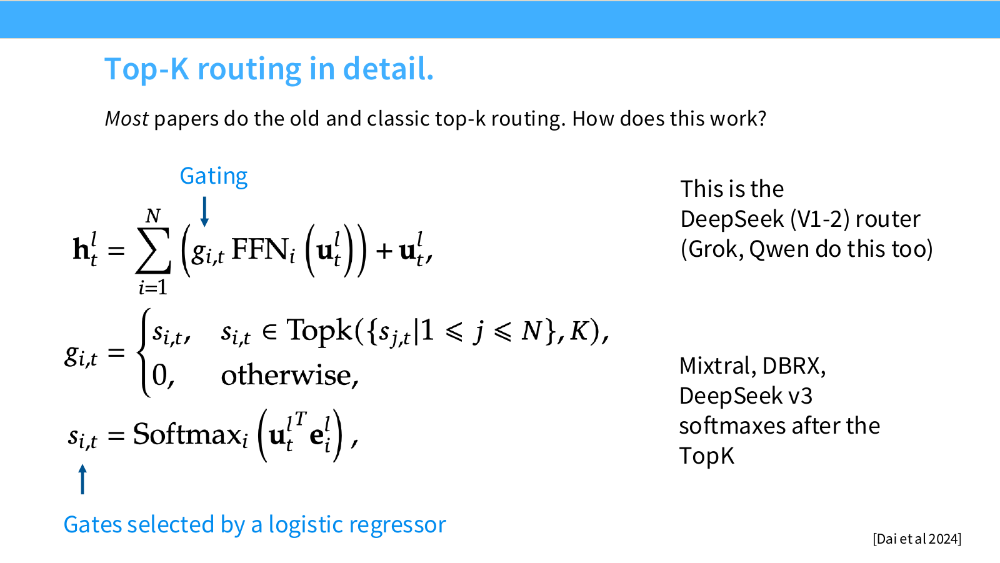

# 第 04 讲：注意力替代与混合专家

> CS336 Spring 2026，Lecture 4，Tatsu Hashimoto，2026 年 4 月 8 日。本笔记按 [官方 60 页讲义](https://github.com/stanford-cs336/lectures/blob/main/lecture_04.pdf)的页序整理；页码均指 PDF 页码。[B 站合集 P4](https://www.bilibili.com/video/BV11LEA6eEuj/?p=4)是配套观看入口。以下以讲义为可核对的一手内容；没有取得 P4 的可核对字幕或逐帧内容，因此不标视频时间戳，也不把补充推导当成讲者口述。

## 1. 为什么还要改注意力（讲义 1–3 页）

全注意力让长度为 $n$ 的序列形成 $n\times n$ 个查询与键的配对。单头注意力分数的计算量约为 $O(n^2d_k)$，分数加权值约为 $O(n^2d_v)$；显式保存分数矩阵也需要 $O(n^2)$ 空间。FlashAttention 等系统实现可避免把完整分数矩阵写到高带宽显存，却不会消除配对运算的二次规模。长度翻倍时，仅这部分运算的数量级会接近四倍。局部窗口、少量全局层及更好的 kernel 是基本工具；本讲进一步讨论改变计算结构的线性/循环注意力、稀疏注意力，后半讲转向节约每 token 激活计算量的混合专家（Mixture of Experts，MoE）。两种问题不同：前者主要处理长上下文，后者主要处理「参数容量大但每 token 不必运行全部参数」。（2–3、14–16 页）

## 2. 从矩阵重排到循环状态（讲义 4–6 页）

### 线性注意力的关键等式

设 $Q$ 为查询（Query）、$K$ 为键（Key），两者在 $\mathbb R^{n\times d_k}$ 中；$V$ 为值（Value），在 $\mathbb R^{n\times d_v}$ 中。若注意力权重运算 $\rho$ 是恒等映射，矩阵乘法满足结合律：

$$Y=(QK^\top)V=Q(K^\top V).$$

左式先形成 $n\times n$ 矩阵，成本约 $O(n^2d_k+n^2d_v)$；右式先形成大小仅 $d_k\times d_v$ 的状态，成本约 $O(nd_kd_v)$，再乘 $Q$ 仍是同阶。这里的「线性」指对序列长度 $n$ 线性，并不意味着对头维度也免费。**标准 softmax 注意力不能直接这样重排**：$\operatorname{softmax}(QK^\top)$ 是非线性的。若采用特征映射 $\phi$ 近似/重新定义核权重，可把 $q_i^\top k_j$ 改为 $\phi(q_i)^\top\phi(k_j)$。归一化的因果版本需同时保存 $S_t=\sum_{j\le t}\phi(k_j)v_j^\top$ 与 $z_t=\sum_{j\le t}\phi(k_j)$，使 $y_t=\phi(q_t)^\top S_t/(\phi(q_t)^\top z_t)$（分母非零时）。这是讲义引用的 kernel 化路线的补充推导，并非与原始 softmax 完全等价。（4 页）

自回归因果场景不能先聚合未来 token。令 $q_t,k_t\in\mathbb R^{d_k}$、$v_t\in\mathbb R^{d_v}$，则

$$S_t=S_{t-1}+k_tv_t^\top,\qquad y_t=q_t^\top S_t,\qquad S_0=0.$$

归纳展开可得 $y_t=\sum_{j\le t}(q_t^\top k_j)v_j^\top$。因此同一运算既可理解为下三角的并行注意力，也可理解为读取/写入固定大小状态的循环神经网络（Recurrent Neural Network，RNN）。讲义称之为 duality：训练可选并行形式，逐 token 推理可仅保留 $S_t$；后者状态空间 $O(d_kd_v)$，不随上下文长度增长。不过并行形式仍可能采用二次计算，且循环状态压缩历史会损失逐 token 精确检索的自由度。若引入衰减 $S_t=\gamma S_{t-1}+k_tv_t^\top$，便与讲义点到的 RetNet 思路相连。（5 页）

**补充算例。** 若 $d_k=d_v=64$，单头循环状态只有 $64^2=4096$ 个数；传统 KV 缓存对 32,768 个历史 token 要存 $2\times32768\times64=4,194,304$ 个数。这个比较只覆盖该头的状态与 KV，不代表模型总显存或质量对比。讲义举 MiniMax M1/MiniMax-Text-01 的「7 个线性层配 1 个全注意力层」混合方式：少量全注意力层补足长距内容寻址，线性层控制长序列成本；讲义给出的性能图支持这种路线，但不是同预算下所有模型的普适最优比率。（6 页）

## 3. 加入选择性：Mamba-2 与 Gated DeltaNet（讲义 7–11 页）

### Mamba-2：可按输入调节记忆时间

讲义把 Mamba-2 的核心机制概括为

$$S_t=\gamma_tS_{t-1}+k_tv_t^\top,\qquad y_t=q_t^\top S_t+v_t^\top D,\qquad \gamma_t=f(x_t).$$

$\gamma_t$ 由当前输入决定：小值使旧状态快速淡去，大值延长保留；$v_t^\top D$ 是一条直接通路。展开状态可见过去第 $j$ 个写入项对 $t$ 的贡献被 $\prod_{r=j+1}^{t}\gamma_r$ 加权。这个乘积是「选择性遗忘」的直观来源。讲义明确说完整 Mamba-2 还需参照原论文，这里的式子只用于理解其与线性注意力的机械联系；并行/循环对偶仍可用于高效计算。讲义以 Nemotron 3 的约 3:1 Mamba/注意力混合作为实例。（7–8 页）

### Gated DeltaNet：写入新值，同时改写同一键方向的旧值

讲义的简化表达是

$$S_t=\gamma_t(I-\beta_tk_tk_t^\top)S_{t-1}+\beta_tk_tv_t^\top,\qquad y_t=q_t^\top S_t.$$

重排成 $S_t=\gamma_tS_{t-1}+\beta_tk_t\bigl(v_t^\top-\gamma_tk_t^\top S_{t-1}\bigr)$，就能看清 delta 更新：新写入与「当前键从旧状态读到的值」之差有关。$\beta_t=0$ 表示本步不写入新键值，但若 $\gamma_t\ne1$，旧状态仍会衰减，所以并非严格意义上的整个状态不变。假设 $\lVert k_t\rVert=1$ 且 $\gamma_t=\beta_t=1$，更新后 $k_t^\top S_t=v_t^\top$：当前键方向的旧映射被新值替换；对与 $k_t$ 正交的方向则不产生这一擦除。门控因此比单纯累加更适合「同一键的事实更新」。讲义把它与 fast weight programming、测试时训练的想法联系起来，并举 Qwen 3.5/Qwen Next 约 3:1 GDN/全注意力混合。（9–10 页）

这些混合模型提示质量与成本可在层间分摊。讲义第 11 页也提醒，受控消融仍不多；图中低混合比率的好损失不能直接证明某一架构对所有上下文、硬件和训练预算都优胜。比较时至少同时看预填充吞吐、解码延迟、KV/状态空间、长距检索以及固定 FLOPs 的损失。

## 4. 另一条路线：动态稀疏注意力（讲义 12–13 页）

全注意力改为只计算选中的 query-key 配对，若每个查询最终访问 $s\ll n$ 个键，配对部分可从 $O(n^2)$ 降至约 $O(ns)$。但选择器本身要计算并维护索引，路由开销和不规则访存可能吃掉理论收益。讲义用 DeepSeek 稀疏注意力（DeepSeek Sparse Attention，DSA；并列提到 DeepSeek V3.2、GLM5）说明轻量 indexer 可选相关位置，并可在已有的短上下文稠密预训练模型上做后续适配。这里的「稀疏」是**token 对 token 的连接稀疏**，不是后面 MoE 的**token 对 FFN 专家的激活稀疏**。固定滑窗一定会漏掉窗外直接连接；内容驱动选择可寻址远处，但必须检验漏召回和索引效率。（12–13 页）

## 5. MoE 的收益来自「参数多、每次只用一部分」（讲义 14–26 页）

标准 Transformer 块通常把一个前馈网络（Feed-Forward Network，FFN）换成多个 FFN 专家和一个路由器（router），注意力仍照常运行。设共有 $N$ 个专家，每个 token 选 $k\ll N$ 个，其 FFN 输出可写为

$$\operatorname{MoE}(x)=\sum_{i\in\operatorname{TopK}(r(x),k)}g_i(x)E_i(x).$$

*图：Stanford CS336 Spring 2026 [第 04 讲官方 PDF 第 31 页](https://github.com/stanford-cs336/lectures/blob/main/lecture_04.pdf#page=31)原图，页脚标注 Dai et al. (2024)。左侧公式展示「对全部专家 softmax，再保留 top-$k$」的门控；右侧文字说明 Mixtral、DBRX、DeepSeek V3 在选出 top-$k$ 后归一化，不能把两种顺序混同。*

若各专家与原 FFN 同大小，专家参数约随 $N$ 增长，而每 token 的专家矩阵乘法约随 $k$ 增长；固定 $k$ 时增加 $N$ 不会按比例增加这部分激活 FLOPs。实际总 FLOPs 还含 router、注意力和通信；所有专家权重仍要存储/分布到设备。MoE 的吸引力是相似激活计算预算下拥有更多可学习参数，讲义援引 Switch、OLMoE 等训练及性能结果，也列出现代开放模型中的实例；这些是特定实验与模型比较，不能从「参数多」直接推出所有任务质量都好。（14–23 页）

讲义也解释其长期推广的阻力：多设备通信与不均衡负载使基础设施复杂；离散路由需要启发式训练目标，可能出现不稳定。典型 MoE 替换的是 FFN，给注意力头做 MoE 较少见。理解一个 MoE 配置时要问三件事：**路由规则是什么，单个专家有多大，怎样训练与平衡**。（24–26 页）

## 6. Router：谁来选专家，门控在哪里归一化（讲义 27–35 页）

### Token-choice top-$k$ 是主流

「token 选专家」让每个 token 按 router 分数挑前 $k$ 个，易于确保每 token 的专家计算量固定；「专家选 token」保证每专家接收容量，可能导致 token 得不到同样处理；全局匹配可同时考虑整体约束，但求解更复杂。讲义指出实际大多数现代 MoE 使用 token-choice top-$k$，例如 Switch 的 $k=1$、Mixtral 的 $k=2$、Qwen/DBRX 的 $k=4$；另介绍 hashing、早期强化学习和匹配式路由作为比较。（27–30 页）

令 $a_i=x^\top e_i$。一种门控先对全部专家做 $s_i=\operatorname{softmax}_i(a)$，再保留 top-$k$ 的 $s_i$，其余置零；讲义将 DeepSeek V1–V2、Grok、Qwen 列在这一类。另一种先选 top-$k$，再只在选中集合上归一化，讲义列 Mixtral、DBRX、DeepSeek V3。两者专家集合可能相同，但门控总和及梯度不同；不要把「top-$k$」当成完整的 router 描述。（31 页）

### 专家细粒度化与共享专家

把一个大专家拆成多个小专家、每 token 选更多个，可产生更丰富的专家组合；总参数、激活参数与通信粒度都要同时算。共享专家始终参与计算，用来承载通用知识，路由专家负责更具选择性的部分。讲义给出的消融并不一致：DeepSeek 的实验支持更细专家与共享专家，OLMoE 的实验支持细专家，却没有得到共享专家的额外收益。由此只能得出「在这些实验条件下的表现」，不能把共享专家写成 MoE 的必要部件。（32–34 页）

讲义表中 DeepSeek V1 为 64 个路由专家、激活 6 个，另有 2 个共享专家；Qwen 1.5 MoE 为 60/4/4；DeepSeek V3 为 256/8/1；OLMoE 为 64/8/0。斜杠依次表示「路由专家总数/每 token 激活的路由专家数/共享专家数」，不是三者相加得到的 top-$k$。这些配置差别说明仅报「总参数」不足以比较每 token 算力。（35 页）

## 7. 如何训练离散路由并保持负载均衡（讲义 36–43 页）

top-$k$ 的「谁入选」是离散决定，任务损失只能对已选路径的连续门控权重与专家求导，难以直接教会未选专家获得未来 token。讲义列三类办法：REINFORCE 直接优化路由策略，但梯度方差和实现复杂度高；给 router 分数加高斯扰动或乘法 jitter，使边界附近的选择更有探索性；实际更常用的办法是启发式负载均衡损失。（36–39 页）

以 Switch 的 top-1 形式为例，批内有 $T$ 个 token、$N$ 个专家，定义 $f_i=T^{-1}\sum_t\mathbf1[\arg\max_j p_j(x_t)=i]$ 为真正分给专家 $i$ 的比例，$P_i=T^{-1}\sum_t p_i(x_t)$ 为 router 给它的平均概率。辅助项为

$$L_{\mathrm{bal}}=\alpha N\sum_{i=1}^N f_iP_i.$$

若忽略 $f_i$ 对当前路由边界的不可导变化，过度使用的专家有较大 $f_i$，优化会降低它的 $P_i$。当 $f_i=P_i=1/N$ 时，辅助项为 $\alpha$；所以它是促进均衡的软约束，不是保证每批每专家严格等量的分配器。DeepSeek V1–V2 还按设备聚合负载，缓解专家散布造成的通信热点。（40–41 页）

DeepSeek V3 改用每专家偏置 $b_i$ 调整**选择**：按 $s_i+b_i$ 取 top-$k$，却用原始分数 $s_i$ 计算已选专家的输出权重。训练中根据负载在线调节 $b_i$，减轻主要平衡目标对语言建模梯度的干扰。讲义特意指出称作「auxiliary-loss-free balancing」并不代表完全没有辅助损失：还保留序列级平衡项，以防单条序列的极端失衡。（42–43 页）

**工程例子。** 8 张设备各放 8 个专家、一个 token 选 4 个专家。如果 4 个都落在远程设备且多数 token 集中在同一张卡，算术上仍只跑 4 次 FFN，墙钟时间却受 all-to-all 传输与最忙设备拖累。负载均衡优化的是实际运行效率，不只是统计表好看。

## 8. 系统、稳定性与后续训练（讲义 44–53 页）

专家可分布到多卡，形成 expert parallelism：先按路由分发 token 激活，各卡执行自己的专家 FFN，再把结果送回原位置并加权合并。这为模型容量提供了额外并行维度，同时引入 all-to-all 通信、不同专家收到 token 数不等、padding 或碎片化小矩阵乘法的问题。讲义提到 MegaBlocks 用稀疏矩阵乘法改善不规则专家批次；Nemotron 3 讨论下投影激活以降低跨设备通信量。若容量上限导致 token dropping，某个 token 能否被处理可能受同批其他请求影响，服务推理中尤其需要留意这种批次级随机性。（44–47 页）

Router 数值不稳定还可能牵连整个模型。讲义引用 ST-MoE 的做法：router 局部使用 float32，并可给 router logits 增加 z-loss 约束其 log-sum-exp 的尺度；这不是要把所有专家都转成 float32。小样本微调时稀疏专家也更易过拟合，讲义对比了只微调非 MoE MLP 的方案与 DeepSeek 使用大量 SFT 数据的方案。适用性取决于数据量和更新哪些参数。（48–50 页）

**Upcycling** 是用已有稠密预训练模型初始化 MoE，再继续训练，使已经支付过的预训练成本得到利用。最直观的起点是复制原 FFN 权重初始化多个专家，再让路由和专家在后续训练中分化；复制只是补充理解，具体实现可变化。讲义举 MiniCPM 由已有模型扩为 8 专家、top-2、约 4B 激活参数，并继续训练约 520B token；Qwen MoE 从 Qwen 1.8B 初始化，采用 60 个路由专家、top-4、4 个共享专家。初始化并不能替代后续训练，否则相同副本不会自动拥有专业分工。（51–53 页）

## 9. DeepSeek V1 到 V3：把这些设计拼起来（讲义 54–59 页）

V1（讲义记作 16B 总参数、2.8B 激活参数）使用 64 个细粒度路由专家、每 token 选 6 个，另有 2 个共享专家；路由是标准 top-$k$，带专家级与设备级辅助平衡。V2（236B/21B）扩至 160 个路由专家、激活 6 个，另有 2 个共享专家；先选有限设备（top-$M$ device），再在这些设备的专家中选 top-$k$，并加通信平衡损失。V3（671B/37B）采用 sigmoid 专家分数、top-$k$ 及选后归一化，配合设备限制路由、偏置式负载调节与序列级辅助平衡；讲义 35 页的汇总表写 256 个路由专家、激活 8 个、1 个共享专家。（54–56 页）

**讲义排印核对。** 第 56 页标题是「DeepSeek MoE v3」，正文却写「V2 (671B – 37 active)」并称 258 个细粒度专家，与第 35 页 V3 表的 256 个不一致。本文按第 35 页的 256 来描述，保留此处冲突；不能把第 56 页的「V2」当作新的 V2 配置。

讲义最后两页补充 V3 不只靠 MoE。MLA 用低维潜变量 $c_t^{KV}$ 表示可缓存的 K/V，减少解码 KV 缓存。若没有位置旋转，键的上投影可吸收到查询投影，因 $q^\top W^{UK}c_t^{KV}=(W^{UK\top}q)^\top c_t^{KV}$；但对 Q/K 使用随位置变化的 RoPE 后，旋转矩阵插在中间，不能一般性地做同一静态吸收。讲义提到保留少量非潜变量的旋转键维度作为处理思路。MTP（多 token 预测）增加轻量未来步预测分支；讲义说该配置实际只向前多预测 1 个 token。它们是 DeepSeek 整体架构的补充，不属于 MoE 路由本身。（57–59 页）

## 10. 复习框架与自测（讲义 60 页）

复习本讲可以沿两条成本轴思考：**注意力**在长序列中为 token 对配对付费，线性/循环、混合层和动态稀疏分别压缩历史状态、减少昂贵层数、减少被计算的连接；**MoE**则为专家 FFN 的激活付费，用路由使参数容量大于每 token 实际计算量。前者可能损失内容寻址精度，后者增加路由、通信与负载管理成本。两者能组合，但不能把「线性」或「稀疏」直接等同于最终墙钟加速。

### 闭卷自测

1. **为何 $Q(K^\top V)$ 不能直接替换标准 softmax 注意力？** softmax 对分数矩阵做非线性归一化，不满足该矩阵结合律；需改定义或核化并处理分母。
2. **因果线性注意力的状态尺寸是多少？** 单头 $d_k\times d_v$；逐步更新成本约 $O(d_kd_v)$，不随已有上下文长度增长，但压缩历史。
3. **Mamba-2 与 Gated DeltaNet 相对简单累加分别增加了什么？** 前者有输入依赖的状态衰减和直接通路；后者还可按键方向选择性擦除/改写，并用 $\beta_t$ 控制本次写入。
4. **DSA 与 MoE 的「稀疏」差在哪？** DSA 筛 token 对连接；MoE 筛每 token 使用哪些 FFN 专家。
5. **为什么 $N$ 增大但 $k$ 固定时仍不能说推理完全免费？** 激活专家乘法数近似固定，但权重存储、router、跨设备通信和负载不均仍有成本。
6. **Switch 平衡项里的 $f_i$ 与 $P_i$ 分别是什么？** 前者是实际分配比例，后者是平均路由概率；过载专家较大的 $f_i$ 让降低其概率成为优化方向。
7. **DeepSeek V3 的偏置为什么不直接加到专家输出权重上？** 讲义中的偏置用于改变 top-$k$ 选择，已选专家的权重仍依原分数计算，避免平衡控制直接污染输出门控。
8. **为什么 MLA 的低维 KV 缓存会遇到 RoPE 问题？** 位置相关旋转隔开查询与键的静态投影，原先的矩阵吸收关系不能一般性地保持。

## 来源与核对边界

- 一手材料：[Stanford CS336 Spring 2026 官方课表](https://cs336.stanford.edu/)将第 4 讲列为 4 月 8 日「Attention alternatives and mixture of experts」；[官方讲义 PDF](https://github.com/stanford-cs336/lectures/blob/main/lecture_04.pdf)共 60 页。本文的模型实例、图表结论、页码及讲义笔误均按该 PDF 核对。
- 课程网站所列[官方 YouTube 录像列表](https://www.youtube.com/playlist?list=PLoROMvodv4rMqXOcazWaTUHhq-yembLCV)与[B 站合集 P4](https://www.bilibili.com/video/BV11LEA6eEuj/?p=4)可用于视频定位；本次未取得可可靠核对的 P4 字幕/逐帧内容，故不声称与录像逐句一致。式子的代数展开、状态/缓存算例、通信场景与成本比较是明确的复习补充，并非讲义中的逐字表述。
- 第 4 讲引用的模型结果来自各自论文和讲义选图；跨论文训练 token、硬件及评测设置不同。这里不把非受控的排行榜差距解释为单个注意力或 MoE 设计的因果收益。
