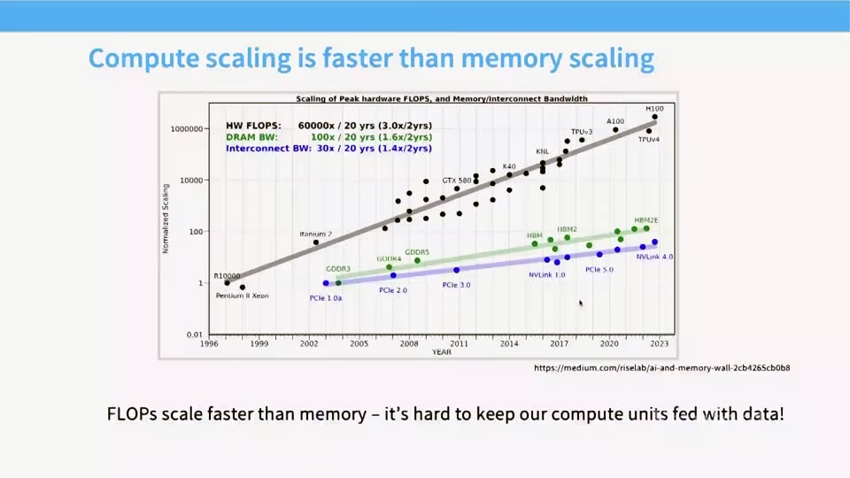
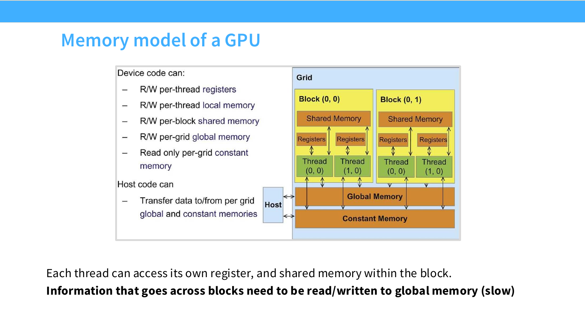

# 第 05 讲：GPU、TPU 与让计算跑快的访存设计

> CS336 Spring 2026，Lecture 5「GPUs, TPUs」，Tatsu Hashimoto，2026-04-13。GPU 指图形处理器（Graphics Processing Unit），TPU 指张量处理单元（Tensor Processing Unit）。本文按 55 页[官方讲义](https://github.com/stanford-cs336/lectures/blob/main/lecture_05.pdf)的页序写成复习笔记；[B 站合集 P5](https://www.bilibili.com/video/BV11LEA6eEuj/?p=5)是配套观看入口。下文的页码均指 PDF 页码，视频核对边界见文末。

## 1. 课程主线：算力增长为何变成数据搬运问题（讲义 1–7 页）

本讲希望把 GPU 从「会自动加速的黑盒」变成可推理的机器。路线分三段：先认识执行单元与内存层次，再用性能模型解释优化技巧，最后把这些技巧串到 FlashAttention。语言模型对训练算力的需求不断增加，传统靠缩小晶体管获得的 Dennard scaling 已不足以支撑增长；并行计算和专用矩阵硬件接过了主要任务。但计算吞吐增长快于内存吞吐，能做多少浮点操作（floating-point operations，FLOPs）与能把多少数据及时送到计算单元，是两个不同的问题。（2–7 页）

*图：第 05 讲约 26:15 的课件画面，横轴覆盖约 1996–2023 年，纵轴为归一化后的对数尺度。图示约 20 年间峰值硬件 FLOPs、DRAM 带宽、互连带宽分别增长 60,000×、100×、30×；它是跨设备系列的历史量级示意，**不是** 2026 年某台设备的精确 benchmark 或未来增速预测。*

复习时先问三件事：工作是否足够并行？做每次计算要从哪层内存读写多少字节？计算形式能否用上矩阵乘专用单元？这三问比只看 GPU 标称峰值 FLOPs 更接近实际耗时。

**面试速述：** GPU/TPU 的矩阵算力增长很快，但模型速度还取决于是否有足够并行工作、数据能否及时搬入计算单元。性能分析应同时看计算峰值和各级内存流量，不能用标称 FLOP/s 直接预测耗时。

## 2. GPU 如何执行与存数据（讲义 8–19 页）

**面试速述：** GPU 用大量 SM、block 和 warp 追求吞吐，并依靠寄存器、片上缓存与 HBM 形成容量和速度不同的存储层次；TPU 也有高吞吐矩阵单元，但执行组织不同。优化目标是让并行任务充分占用硬件，并让从慢内存取来的数据在片上多次复用。

### CPU、SM、线程块与 warp

中央处理器（Central Processing Unit，CPU）偏向少量线程的低延迟执行，有较多控制和缓存资源；GPU 偏向大量线程的总吞吐。GPU 有许多流式多处理器（Streaming Multiprocessor，SM），每个 SM 内有执行单元，线程块（block）被调度到 SM。一个 block 包含多个线程，共享该 block 的 shared memory。NVIDIA GPU 上，线程通常以 32 个为一组组成 warp；同一 warp 按单指令多线程（Single Instruction, Multiple Threads，SIMT）方式执行相同指令，但各线程处理不同数据。（8–11 页）

可以把并行层次记成「GPU → 多个 SM → block → warp → thread」。这是一种执行模型，不意味着 32 个线程在每个时刻都有 32 套独立的指令流；也不意味着一个 block 必然只含一个 warp。线程块彼此独立便于调度，代价是跨 block 共享信息通常要经过 global memory 或另起同步阶段，而不能像同一 block 中的线程那样直接使用 shared memory。（11–12 页）

**面试速述：** CPU 偏低延迟控制，GPU 则把许多 block 分配给 SM，在 warp 内以 SIMT 执行来追求总吞吐。同一 block 的线程可用 shared memory 协作，跨 block 通信更昂贵；warp 也不等于独立的 32 条指令流。

### 内存层次与复用

| 位置 | 典型作用 | 与并行单元的关系 |
| --- | --- | --- |
| 寄存器 | 保存线程正在用的标量、中间值 | 线程私有，容量最紧 |
| L1 / shared memory | 缓存或由程序显式组织复用的块数据 | 靠近 SM；shared memory 为同一 block 的线程共享 |
| L2 缓存 | 缓存多个 SM 访问的数据 | 芯片上的共享层次 |
| Global memory（高带宽显存 High Bandwidth Memory，HBM；动态随机存取存储器 Dynamic Random Access Memory，DRAM） | 存放大张量、模型参数、跨块结果 | 容量大，远离计算单元，访问昂贵 |

越靠近 SM 的存储通常更快、更小，也更值得把会重复使用的数据留下。讲义用静态随机存取存储器（Static Random Access Memory，SRAM）相比 DRAM 更贵、访问更快的数量级示意强调这一点；具体延迟、带宽、容量随设备代际变化，不能把图中的倍数当通用硬件常数。（10、12 页）若寄存器或 shared memory 用量过大，又会压低同一 SM 可同时驻留的 block 数，所以「尽可能全塞进片上」也不是无条件最优。

*图：Stanford CS336 Spring 2026 [第 05 讲官方 PDF 第 12 页](https://github.com/stanford-cs336/lectures/blob/main/lecture_05.pdf#page=12)原图；该页未标第三方图源。线程私有寄存器、块内 shared memory 和跨块 global memory 的可见范围不同；图是组织模型，具体缓存行为还要看硬件及程序实现。*

**面试速述：** 寄存器和片上 shared memory 速度快但容量小，HBM 容量大却搬运昂贵；将会重复用的数据留在靠近 SM 的位置可以提高有效吞吐。片上资源占用过多又会减少驻留 block，因此复用与并行度需要平衡。

### TPU 与矩阵专用单元

讲义把 TPU 作为对照：GPU、TPU 都把轻量控制、快速矩阵乘单元和片上快存储组合起来，但组织形态不同。GPU 有较多 SM 和 warp/SIMT 执行机制；讲义示意的 TPU 核心数量较少，依靠大的矩阵计算单元完成高吞吐矩阵乘，没有 GPU 式 warp。课堂约 19:49–20:08 将 GPU 的 Tensor Core 与 TPU 的 **MXU（Matrix Multiplication Unit，矩阵乘法单元）**并列，借**脉动阵列（systolic array）**说明相邻计算单元逐步传递、复用矩阵数据的直觉。[Google Cloud TPU 架构文档](https://docs.cloud.google.com/tpu/docs/system-architecture-tpu-vm)明确把 MXU 描述为脉动阵列；这不等于已经证明各代 GPU Tensor Core 与 TPU MXU 有完全相同的底层电路。网络互连和跨设备并行的差异留到后续并行课程讨论，不能由这一页推断所有 TPU 型号的详细架构。（13–14 页）

GPU 的强项是可扩展地安排大量工作；专用 Tensor Core 让适配的数据类型与矩阵形状上的矩阵乘法格外快，讲义用「相对一般浮点操作可快 10 倍以上」说明量级。这不是任意形状、任意精度、任意设备的固定加速比。FLOPs 变快而 DRAM 带宽没同比变快，正是后半讲不断讨论复用与减少访存的原因。（15–19 页）

**面试速述：** GPU 与 TPU 都用专用矩阵单元和片上快存储提升矩阵吞吐，但 GPU 的 SM/warp 模型与 TPU 的核心组织不同。矩阵单元的优势依赖形状、精度和设备支持；算力提升也会让数据供给更易成为瓶颈。

## 3. Roofline：判断先改算力还是先改访存（讲义 20–22 页）

设一个 kernel 完成 $F$ 次运算，从所讨论的内存层搬运 $M$ 字节；算术强度定义为 $I=F/M$，单位为 FLOP/byte。给定峰值计算吞吐 $P_{\max}$（FLOP/s）及相应内存层的有效带宽 $B_{\max}$（byte/s），Roofline 的理想上界是

$$P_{\mathrm{attainable}}\leq\min(P_{\max},\,B_{\max}I),\qquad T\geq\max\left(\frac{F}{P_{\max}},\frac{M}{B_{\max}}\right).$$

转折点 $I^*=P_{\max}/B_{\max}$：左侧受带宽约束，右侧才有机会受算力约束。讲义 21 页的图把寄存器、shared memory、主存画成不同斜率的带宽「屋顶」，同时对比密集和稀疏矩阵乘。它的结论是数据落在哪一层内存、能被复用多少次，会改变可达到的性能；图上具体坐标不是本机 benchmark。密集矩阵乘有较高数据复用，逐元素操作通常强度低。实际性能还受启动开销、对齐、占用率和编译器实现影响，Roofline 只是上界与诊断框架。

[官方第 21 页图](https://github.com/stanford-cs336/lectures/blob/main/lecture_05.pdf#page=21)还给出了一个直观对照：密集矩阵乘用菱形标在较高算术强度一侧，稀疏矩阵乘用圆点标在低强度一侧；同样叫「矩阵乘」，稀疏结构减少乘加时，也可能使数据复用与访存模式更难支撑峰值算力。图同时有 CPU 与 GPU 的计算屋顶，不能把 GPU 的高峰值理解为所有强度区间都更快；应先定位工作点落在哪层内存的斜线下。这是读图方法，而非该图对任意稀疏实现的性能保证。

**手算例子。** 假设某层带宽为 $1$ TB/s、算力为 $100$ TFLOP/s，则 $I^*=100$ FLOP/byte。$I=2$ 的 kernel 带宽屋顶为 $2$ TFLOP/s，单纯换更高峰值的矩阵单元帮助有限；若通过复用把 $I$ 提高到 $150$，瓶颈就可能转向计算。这里的数字只用于练习公式，并非讲义给出的某款 GPU 参数。

**面试速述：** Roofline 用算术强度 `FLOPs/搬运字节` 对比硬件的 `算力/带宽` 拐点，判断一个 kernel 理想情况下先受访存还是计算限制。它给出性能上界，实际还要排查启动、对齐与占用率；字节数也必须对应所分析的内存层。

## 4. 六类优化手段（讲义 22–44 页）

**面试速述：** 六类手段分别改善 warp 执行利用、数据位宽、算子间往返、激活保存、内存事务有效率，以及片上数据复用。先用瓶颈模型定位成本，再组合优化并实测，因为减少访存有时会增加寄存器占用或额外计算。

### 4.1 控制分歧：同一 warp 的条件分支（23 页）

当 warp 内线程走不同 `if` 分支时，硬件可能需要分别执行两侧路径，并对不属于当前路径的线程屏蔽结果。这会浪费指令槽位。条件判断本身没有被禁止；关键是同一 warp 内数据相关分支是否严重分歧。若能让相邻线程处理具有相似分支行为的数据，通常更容易保持吞吐。这一招主要针对执行效率，不是降低内存流量。

**面试速述：** Warp 分歧是同组线程走不同条件路径，硬件分批执行这些路径会浪费指令槽。让同 warp 的数据与分支更一致可缓解，但它解决的是执行效率，不是访存字节数。

### 4.2 低精度：字节变少，也要管数值误差（24–29 页）

数据位宽减半，同样数量的元素一般需要搬的字节就减半。以每元素读一次、写一次的 ReLU 为简化模型：FP32 约搬运 $8$ byte，FP16 约搬运 $4$ byte；若粗略把比较算一次操作，对应 $I$ 约为 $1/8$ 与 $1/4$ op/byte。讲义 25 页把 $8$ 与 $4$ byte/op 称作「intensity」；严格按第 21 页 Roofline 的横轴 FLOP/byte，它们是**算术强度的倒数**。而 ReLU 比较是否计入 FLOPs，也依性能计数口径而定。要记住的是访存字节数变少，而不是混淆单位。

低精度还可能匹配 Tensor Core 的混合精度矩阵乘，收益不只来自带宽。讲义继续展示 FP8、MXFP8 和 FP4 块缩放：例如 MXFP8 为小块数据配缩放因子，因此张量转置不再只是改变索引，缩放块也需处理；示例训练方案并非把所有权重都无差别量化。第 29 页把后一个例子标作「MXFP4」，但其中的块大小与缩放格式对应 NVIDIA 的 **NVFP4**；复习时应区分课件标签与标准格式。精度越低，数值范围、舍入和缩放方案越重要。（26–29 页）

具体看[官方第 27–29 页图](https://github.com/stanford-cs336/lectures/blob/main/lecture_05.pdf#page=27)：MXFP8 示例以每 32 个值共享一个 E8M0 指数缩放因子，让数据可偏向有效数字较多的 E4M3；按另一维转置后，原来的 32 值分组不再适用，所以训练图为前向传播（FPROP, Forward Propagation）、输入梯度（DGRAD, Data Gradient）和权重梯度（WGRAD, Weight Gradient）分别展示量化／转置路径，并让部分层、优化器主权重继续保留较高精度（第 28 页）。第 29 页列出的 4-bit 未缩放正幅值为 $0,0.5,1,1.5,2,3,4,6$，负值对称；**每 16 个值共享 E4M3 局部缩放因子**这一描述按 [NVIDIA 的 NVFP4 规格](https://docs.nvidia.com/deeplearning/transformer-engine/features/low_precision_training/nvfp4/nvfp4.html)应称为 NVFP4，它还使用张量级全局缩放。标准 MXFP4 则是[每 32 个值共享 E8M0 缩放因子](https://docs.nvidia.com/cutlass/4.6.2/media/docs/operators/api_reference/arguments.html)。两者的单值码字同为 FP4 E2M1（2 个指数位、1 个尾数位），但缩放粒度与格式不同；不能照课件标题把 16/E4M3 记成标准 MXFP4。

**面试速述：** 降低数值位宽可减少读写字节，并在支持的设备上用更快的矩阵单元；但范围、舍入和块级缩放会影响精度。课件第 29 页的 16/E4M3 是 NVFP4 配置，别按其标题误记成标准 MXFP4 的 32/E8M0。算术强度用 FLOP/byte 表示，不能把讲义中的 byte/op 直接当同一指标。

### 4.3 融合：减少中间张量回写与 kernel 启动（30–33 页）

若先算 `sin(x)`、再平方，再对 `cos(x)` 做同样操作，最后相加，朴素逐算子执行会多次启动 kernel，并把中间结果写回 global memory、再读出。将这些逐元素操作放进一个 kernel，输入读入后可在寄存器中连续处理，只写最终输出。这就是 operator fusion。讲义用 $\sin^2x+\cos^2x$ 的五个点操作作示意，并说明 `torch.compile` 等编译工具可自动完成一部分简单融合。（32–33 页）

融合的主要收益是减少流量与启动开销，但如果融合导致寄存器压力过高、降低占用率，也可能得不偿失。这里不应因恒等式 $\sin^2x+\cos^2x=1$ 就把示例理解成真实业务需要五个算子；讲义是在演示执行路径。

**面试速述：** 算子融合把连续操作放进一个 kernel，让中间结果在片上使用，减少 HBM 回写和启动次数。它适合原本由许多小算子组成的访存敏感路径，但寄存器压力可能抵消收益，需要测量。

### 4.4 重算：用廉价计算换昂贵搬运（34–36 页）

反向传播常保存前向激活，供后向求导。讲义以三个 sigmoid 串接示意：若把每层中间激活都写入并取回，示意的内存读写次数为 8；舍弃部分激活、需要时再算，示意访问可降到原来的 $5/8$。这不是所有网络的固定比例，而是「算一次比存一次、读一次还便宜」时成立的权衡。Activation checkpointing 就把这一思想用于更大计算图：以额外前向计算减少激活内存。是否加速要由计算与带宽的实际比例决定，显存下降不等于运行时间必然下降。

**面试速述：** 重算在反向需要时重新生成部分激活，以额外计算换较少保存和读取；activation checkpointing 是典型应用。只有重算比相关搬运更划算时才可能提速，省显存本身不保证省时间。

### 4.5 合并访存：让相邻线程读相邻地址（37–39 页）

DRAM 按一段连续地址做事务；warp 同时读相邻地址，通常能合并为较少的内存事务。若 32 个线程各读相隔很远的地址，硬件可能为这些请求搬来很多没有用到的字节。对行主序矩阵 $A$，地址近似为 $\operatorname{addr}(A_{i,j})=\operatorname{base}+(iN+j)s$。令相邻线程变化的是列号 $j$，地址间距为一个元素大小 $s$，利于合并；若相邻线程变化的是行号 $i$，地址相隔 $Ns$，通常不利。（38–39 页）

**小例子。** 对行宽 $N=1024$、FP32 矩阵，线程 $t$ 读 $A_{i,t}$ 时相邻地址差 $4$ byte；改成读 $A_{t,j}$ 则相差 $4096$ byte。两种写法的数学结果可能等价，但访存事务数会不同。讲义 39 页左图标「不合并」、右图标「合并」，要结合「不同线程在同一时刻访问哪里」理解，不能只看单个线程是沿行还是沿列移动。

**面试速述：** 合并访存让相邻 lane 同时访问相邻地址，以更少的全局内存事务搬运相同有效数据、减少无效字节。对行主序矩阵通常让相邻线程变化列索引；判断依据是同一时刻的跨线程地址，而非单线程遍历方向。

### 4.6 Tiling：在片上反复用同一块数据（40–44 页）

以 $C=AB$ 的 $N\times N$ 矩阵乘为例，给 $C$ 的一个 $T\times T$ 输出块计算部分和时，把所需 $A$、$B$ 的小块协同载入 shared memory，再让线程在块内反复读取。下一段 $K$ 维度来时换一组输入块，累加到同一输出块。这样把反复的 global memory 读取变成片上读取，还能安排线程以合并方式加载小块。（40–41 页）

讲义用理想化方阵说明：不做块复用时，每个输入元素可能从 global memory 重读约 $N$ 次；块边长为 $T$ 且复用充分时，约降为 $N/T$ 次，即相关 global-memory 读取量降低约 $T$ 倍。这个比较只计输入数据复用，忽略 cache 自发命中、输出写回、边界和同步，不是端到端运行时间的 $T$ 倍加速。矩阵乘运算量约 $2N^3$ FLOPs，而理想块化后的输入读流量可按 $O(N^3/T)$ 个元素估算，于是算术强度随 $T$ 增长。（42 页）

块不能无限增大：shared memory 和寄存器容量有限，矩阵维度未必能被块大小整除，尾块里有闲置线程；行宽和对齐也影响突发内存事务。适合的 tile 大小须平衡复用、合并加载、片上资源与可并行的块数。（43–44 页）

[官方第 44 页对齐图](https://github.com/stanford-cs336/lectures/blob/main/lecture_05.pdf#page=44)把一个对齐的 tile 与错位后跨两个 burst 区段的 tile 对比：即使逻辑上取相同数量的元素，后者也可能搬入更多无用字节。矩阵行宽使下一行起始地址持续错位时，单纯改变线程布局不一定能实现理想合并访问，有时要以 padding 换对齐；是否值得，要比较额外存储／计算与减少的访存事务。

**面试速述：** Tiling 把矩阵乘输入分块加载到片上，并让同一块数据参与多次乘加，从而减少 HBM 重读、提高算术强度。Tile 越大不一定越快，还受 shared memory、寄存器、尾块浪费和可并行 block 数限制。

## 5. 为什么矩阵只大一列，速度却可能骤变（讲义 45–49 页）

讲义引用矩阵形状实验，展示吞吐随尺寸有锯齿和周期性，不是「尺寸越大一定越慢或越快」的光滑曲线。原因有两层：tile 对齐使尾块效率随尺寸跳变；wave quantization 使块数跨过 SM 可同时处理的批次边界。（45–48 页）

讲义的具体例子是 $256\times128$ 的输出 tile：$1792\times1792$ 矩阵需要 $(1792/256)(1792/128)=7\times14=98$ 个 tile；尺寸增加到 $1793$，需要 $\lceil1793/256\rceil\lceil1793/128\rceil=8\times15=120$ 个。讲义示意 A100 有 108 个 SM，于是 98 块可分布在一波内，而 120 块要有后续一波，且许多边界 tile 只做少量有效工作。实际调度还受每个 SM 可驻留多少块等因素影响；这组数用于解释性能突变，不能直接推出精确耗时。（48 页）

把前半讲压缩成一个决策表：控制分歧改善同 warp 的执行利用；低精度减少字节并使用快矩阵单元；融合减少中间结果读写；重算以计算换存取；合并访存提高每次事务的有效字节比例；tiling 通过片上复用提高算术强度。它们可以叠加，也可能相互制约。（49 页）

**面试速述：** 矩阵尺寸跨过 tile 或 SM 波次边界时，可能突然多出大量尾块和稀疏的下一波任务，所以吞吐会呈锯齿而非平滑变化。性能比较必须记录精确形状与 tile 配置，不能仅按 FLOPs 规模外推。

## 6. FlashAttention：把前面的手段用于精确注意力（讲义 50–55 页）

**面试速述：** FlashAttention 将注意力分数、softmax 和输出乘法分块融合，在片上维护在线 softmax 状态，避免把完整 $n\times n$ 中间矩阵写到 HBM。它保持精确注意力的数学目标，同时仍有二次配对计算；反向实现还需专门处理重算。

### 标准路径的瓶颈

设单头 $Q,K,V\in\mathbb{R}^{n\times d}$。注意力前向是

$$S=\frac{QK^\top}{\sqrt d},\qquad P=\operatorname{softmax}(S),\qquad O=PV.$$

若把 $S$ 和 $P$ 两个 $n\times n$ 中间矩阵完整写入 HBM，再读回，序列变长时会产生大量内存流量与中间显存占用。这里的 $Q,K,V$ 是输入投影后的张量；讲义 51 页的图同时画了 Q/K/V 投影及注意力核心。分析 FlashAttention 的 IO 时，重点是 $QK^\top$、softmax、$PV$ 之间的 $n\times n$ 中间结果。（50–51 页）

讲义 50 页援引原论文某次实验：FlashAttention 的 GFLOPs 从 66.6 增至 75.2，但 HBM 读写从 40.3 GB 降到 4.4 GB，时间从 41.7 ms 降到 7.3 ms。结论是**多做一些运算仍可能更快**，因为减少 HBM 往返是主收益。该数值属于图中的特定实验，不是所有序列长度或硬件的承诺。

**面试速述：** 标准注意力若物化分数和概率两个 $n\times n$ 张量，长序列会产生大量中间显存与 HBM 往返。FlashAttention 的收益主要来自减少这些读写，即使局部重算使 FLOPs 略增，也可能更快；示例加速比不能泛化到所有设备和形状。

### 分块乘法必须解决跨块 softmax

按[官方第 52 页的 FlashAttention 图](https://github.com/stanford-cs336/lectures/blob/main/lecture_05.pdf#page=52)，外层遍历 $K,V$ 块并搬到片上 SRAM，内层遍历 $Q$ 块、更新对应输出块；也可从一个 $Q$ 行块视角，理解为它陆续汇入各 $K,V$ 块的贡献。两种说法的视角不同，不能把图中的外／内循环次序写反。分块过程不把完整 $S$ 或 $P$ 落到 HBM。难点是 softmax 分母要看整行所有 key，仅对每块单独 softmax 再相加会错。在线 softmax 用每行的运行最大值 $m$、指数和 $\ell$ 与未归一化输出向量 $u$ 解决这个问题。假设新块分数为 $s_j$，对应 value 为 $v_j$，更新为

$$m'=\max\bigl(m,\max_j s_j\bigr),$$
$$\ell'=e^{m-m'}\ell+\sum_j e^{s_j-m'},$$
$$u'=e^{m-m'}u+\sum_j e^{s_j-m'}v_j,\qquad o'=\frac{u'}{\ell'}.$$

初始取 $m=-\infty,\ell=0,u=0$。当后续块出现更大的分数时，旧块贡献乘上 $e^{m-m'}$，便与新块共享同一数值基准；最终除以 $\ell$ 得到与整行稳定 softmax 相同的结果（忽略浮点求和次序造成的微小差别）。这就是讲义 53 页「逐块更新最大值与伸缩求和」的可计算形式。对因果注意力（causal attention），先把非法未来位置掩成 $-\infty$；若某个查询行在当前键／值块中没有任何合法位置，则应按行跳过该块或单独处理空块，不能直接套用递推：初始状态下会有 $m=m'=-\infty$，使 $m-m'$ 未定义。只有已累计至少一个合法位置、$\ell'>0$ 时才计算 $o'=u'/\ell'$。

**两块数字例子。** 第一块分数只有 $0$，value 为 $2$：$m=0,\ell=1,u=2$。第二块分数为 $\ln 2$，value 为 $5$：新最大值 $m'=\ln2$，旧贡献缩放 $e^{-\ln2}=1/2$，故 $\ell'=1/2+1=3/2$，$u'=2/2+5=6$，输出 $o=4$。整行直接算 $(1\cdot2+2\cdot5)/(1+2)=4$，两者相同。

FlashAttention 将分块矩阵乘、指数/归一化和输出累加融合在一个 IO 感知的前向实现中。讲义只介绍前向；反向传播的要点是逐块重算必要的注意力量，避免保存整个注意力矩阵，但此讲没有展开后向算法，也不应把上面的前向递推当作完整反向推导。（52–54 页）

**面试速述：** 分块 softmax 不能各块独立归一化；每行要维护运行最大值、指数和及输出累加，并在新最大值出现时重标定旧块贡献。这样可在不落盘完整分数矩阵的情况下得到整行 softmax；空的因果块需跳过或专门处理。

## 7. 自测与练习

1. **为什么一个 warp 的 32 个线程都遇到 `if`，仍可能变慢？** 若条件结果不同，就可能串行执行不同路径并屏蔽另一部分线程；判断是否有分歧要看同一 warp 内的数据分布。
2. **Roofline 的 $I$ 用什么单位？** FLOP/byte。若每次操作读 4 byte、写 4 byte，且按一次操作计，则为 $1/8$ op/byte；$8$ byte/op 是倒数。不要混用两种口径。
3. **为何 FP16 的 ReLU 通常仍是带宽敏感操作？** 单元素只做极少计算，却要读写元素；减半字节能改善它的带宽屋顶，但不让计算量突然变大。
4. **对行主序 $A_{i,j}$，应让相邻线程变化 $i$ 还是 $j$ 才更可能合并加载？** 变化 $j$，因为相邻地址只差一个元素。
5. **$T$ 倍减少 global-memory 输入读取，是否等于矩阵乘快 $T$ 倍？** 不等于；还存在计算、输出、同步、片上资源、尾块、带宽和硬件调度等成本。
6. **为何把两个 key 块分别 softmax 后求和不等于整行 softmax？** 每块分母不同；在线更新要把旧块与新块的指数和重标定到共同最大值与共同分母。
7. **动手推导。** 若旧状态 $m=1,\ell=3,u=(6,0)$，新块只有分数 $2$、value $(0,4)$，求 $m',\ell',u'$ 和最终 $o'$。答案：$m'=2$，$\ell'=3/e+1$，$u'=(6/e,4)$，$o'=(6/e,4)/(3/e+1)$。

**本节小结：** 练习用于验证 Roofline 单位、合并访存的跨线程视角、tiling 边界，以及在线 softmax 跨块重标定是否真正会算。

## 来源、版本与视频核对边界

- 课程版本依据：[Stanford CS336 Spring 2026 官方课表](https://cs336.stanford.edu/)；第 5 讲列为 4 月 13 日「GPUs, TPUs」[Tatsu]。正文以[2026 版第 5 讲官方讲义 PDF](https://github.com/stanford-cs336/lectures/blob/main/lecture_05.pdf)第 1–55 页为主，按其三部分顺序整理。算术强度口径纠正、Roofline 小例子、行主序地址式、在线 softmax 递推与数字练习为基于讲义的补充解释，不是讲义原句。
- 视频入口：课程网站所列[官方 YouTube 录像列表](https://www.youtube.com/playlist?list=PLoROMvodv4rMqXOcazWaTUHhq-yembLCV)及[B 站合集 P5](https://www.bilibili.com/video/BV11LEA6eEuj/?p=5)。另用经校验的第三方归档录像、英文字幕与抽取画面核对上述硬件术语和历史图；没有人工逐帧观看或逐句听写，补充推导也不归为教师原话。
- 讲义图表包含特定硬件或论文实验（如 A100 的 SM 数、FlashAttention 的 GFLOPs/HBM/时间）；复习应掌握因果关系，复现实测则须说明设备、数据类型、矩阵形状与实现版本。旧版课程或第三方笔记没有作为 2026 年课堂内容依据。

**本节小结：** 本篇以 2026 版官方讲义为主，硬件数字和论文性能图只在对应设备、形状与实现条件下成立。
