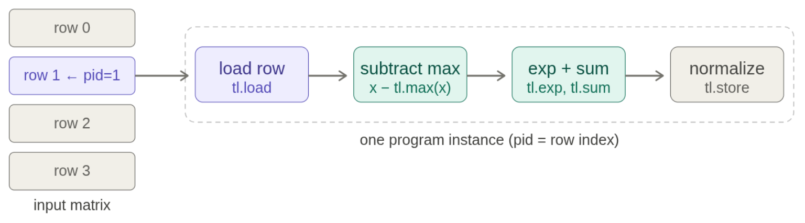

# 第 06 讲：Kernel 与 Triton

> CS336 Spring 2026，Lecture 6。本文依照[官方可执行讲义 `lecture_06.py`](https://github.com/stanford-cs336/lectures/blob/main/lecture_06.py)的 `main()` 调用顺序整理；课程主页见 [Stanford CS336](https://cs336.stanford.edu/)，[B 站合集 P6](https://www.bilibili.com/video/BV11LEA6eEuj/?p=6)可配合观看。已核对讲义源码，未取得可逐句核对的视频字幕，所以下面的内容以讲义为准，不标注未经验证的视频时间戳，也不把推导写成教师原话。

[课程主页列出的原版录像播放列表](https://www.youtube.com/playlist?list=PLoROMvodv4rMqXOcazWaTUHhq-yembLCV)可用于观看。

本讲从上一讲的图形处理器（GPU, Graphics Processing Unit）性能概览，走到实际的优化循环：先理解硬件与编程模型，再计时、定位瓶颈，最后用 Triton 写融合 kernel。四个代码例子逐步增加线程间协作需求：逐元素 GeLU（Gaussian Error Linear Unit，高斯误差线性单元）→ 行内 softmax → 跨 tile 的行求和 → 分块矩阵乘并融合 ReLU（Rectified Linear Unit，修正线性单元）。

下文 FLOPs 指 Floating Point Operations（浮点运算次数）；它衡量计算工作量，不等同于 FLOP/s（每秒浮点运算次数）。

## 1. GPU 编程模型与性能约束

**面试速述：** 写 GPU kernel 要同时安排 grid/block 的并行任务、warp 的执行路径，以及寄存器、shared memory 和 HBM 的数据流。性能取决于单块复用、访存合并和设备上是否有足够 block；占用率本身不是越高越好。

### Grid、block、thread 与存储层次

GPU kernel 的 **grid** 是多个 thread block（CUDA，即 Compute Unified Device Architecture，统一计算设备架构中也称 CTA，Cooperative Thread Array，协作线程数组）的集合；block 里有多个 thread。逐元素运算适合把不同元素分给不同 thread；softmax、矩阵乘法需要线程间交换或复用数据。一个 block 被安排在同一个流式多处理器（SM, Streaming Multiprocessor）上，因而其线程能够通过该 SM 的 shared memory 协作；寄存器主要保存单个线程的临时量。可记成：grid 面向设备的全局数据，block 是共享局部数据的协作单位，thread 持有寄存器状态。

高带宽显存（HBM, High Bandwidth Memory）容量大而相对慢，片上 shared memory / 一级缓存（L1 cache）、寄存器容量小而带宽高。讲义列 A100、H100、B200 的 SM 数分别为 108、132、148，HBM 标称带宽分别约 2、3.35、8 TB/s；这些是课堂比较硬件趋势的数字，不是任意运行条件下可达到的应用带宽。B200 还引入供 tensor core 使用的张量内存（TMEM, Tensor Memory）。优化 kernel 时的核心问题是：一次从 HBM 取入的数据能在片上被复用几次，以及是否有足够并行任务掩盖延迟。

讲义的硬件表还把“快但小”量化到了每一层，不能只记 HBM 一个数字：（官方讲义 `review_of_gpus()`；容量与带宽为讲义列值）

| 存储层 | A100 | H100 | B200 | 读表要点 |
| --- | ---: | ---: | ---: | --- |
| 每 SM 寄存器容量 | 256 KB | 256 KB | 256 KB | 一条 thread 的临时值先受这里约束 |
| 每 SM L1 + shared memory | 192 KB | 256 KB | 256 KB | 一个 block 复用 tile，但容量远小于整张量 |
| 全卡 L2 容量 | 40 MB | 50 MB | 96–126 MB | 可缓冲跨 block 的部分数据 |
| HBM 容量 | 80 GB | 80 GB | 192 GB | 容纳权重、状态和大张量 |
| HBM 带宽 | 2 TB/s | 3.35 TB/s | 8 TB/s | 对频繁往返全局内存的 kernel 构成上界 |

同表还列了寄存器、L1/shared memory 和 L2 的粗略带宽估计，但讲义明确说 L1/L2 数值在公开来源间有差异。这张表应帮助决定 tile 是否放得下、是否值得复用，而不能按这些带宽直接承诺某个 kernel 的速度。TMEM 供 B200 tensor core 使用，并非普通 Triton 代码可以当作另一块显式 shared memory 随意分配。（官方讲义 `review_of_gpus()`；末句为依据其“对程序员不可见”所作的复习解释）

**面试速述：** Grid 由许多 block 组成，block 在 SM 上让线程通过 shared memory 协作，线程临时量主要用寄存器；数据最终要在容量更大的 HBM 与片上存储之间搬运。设计 kernel 时要问每次 HBM 加载能复用多少次，以及 block 数是否足以覆盖设备延迟。

### Warp、分歧与寄存器占用

一个 warp 通常有 **32 个线程**。例如 64 线程的 block 含 2 个 warp。warp 中各 lane 执行同一指令流；如果同一 warp 的线程走不同 `if` 分支，硬件要分别执行分支并屏蔽不参与的 lane，这叫控制流分歧。若条件按整个 warp 一致分组，代价通常小于同一 warp 内交错分歧。SM 可以在驻留 warp 间切换，以覆盖读写 HBM 时的等待。

**Warp occupancy** 是驻留 warp 数与硬件允许最大驻留 warp 数之比，它受到每线程寄存器数、每 block shared memory、线程数等限制。讲义中的实际计算代码设每 block 128 线程、每线程 160 个寄存器、每 SM 65,536 个寄存器、最多 64 个 warp，则每 block 用 $128\times160=20{,}480$ 个寄存器，受寄存器约束最多驻留 $\lfloor65536/20480\rfloor=3$ 个 block，即 12 个 warp，算出的占用率为 $12/64=18.75\%$。讲义前一句文字写“64 线程”，但后续计算变量是 128；这里按**代码实际取值**计算。硬件分配粒度和其他资源还可能进一步限制真实驻留量。占用率也不是越高越好：每线程多处理元素可能增加寄存器需求，同时减少重复访存或提高指令级并行。

**面试速述：** Warp 内分歧让不同分支分批执行；增加寄存器或 shared memory 占用又会压低可驻留 warp 数和隐藏延迟的能力。Occupancy 是诊断量而非优化目标，更多寄存器也可能换来更好的复用与指令级并行。

### Shared memory bank conflict 与 HBM 合并访存

讲义用 32 个 bank、每 bank 4 字节宽解释 shared memory。对 32 位元素，连续 32 个地址分散到不同 bank；若 32 个 lane 访问同一列，而矩阵行跨度恰好为 32 个这样的元素，它们可能全落在同一 bank 的不同地址，造成最坏情形的 32 路冲突。访问**同一个地址**的广播是例外。矩阵乘中既要按行又要按列取数，常通过转置布局、padding 或 swizzle（重排地址映射）减少冲突；不能假定“读列必然冲突”，要看实际布局。

HBM 访问关注 **memory coalescing**：一个 warp 的连续 lane 若各读一个连续的 `float32`，合起来刚好 128 字节，能高效覆盖一个 128 字节区间。若每 lane 相隔很远，通常要触及更多内存事务。事务粒度、缓存路径和地址对齐随架构与指令而变，讲义的 128 字节是理解合并访存的模型。

**面试速述：** Shared memory bank conflict 是同一组 lane 访问映到同一 bank 的不同地址，HBM 非合并访存则是跨 lane 地址分散而触发更多全局事务。前者靠 padding 或布局重排缓解，后者靠相邻 lane 读相邻地址；具体冲突还取决于对齐、广播和硬件路径。

### Block 数量也影响设备利用率

Block 以波次分配给各 SM。讲义例子：B200 有 148 个 SM，若只发起 160 个 block，第一波可覆盖 148 个 SM，第二波仅有 12 个 block，尾波很稀疏。这叫 wave quantization。选择 tile 大小时，不仅要看单 block 的效率，还要看总 block 数是否足够填满 GPU；“让 block 数整除 SM 数”在讲义里是说明尾波问题的简化建议，并非可不顾寄存器、复用和 workload 的硬规则。

**面试速述：** 总 block 数决定任务分成多少波；最后一波很稀疏时，即使每块本身高效，整卡也会闲置大量 SM。Tile 变大通常减少 block 数，所以必须和片上复用、资源占用一起调。

## 2. Benchmark 与 profiler：先量再改

**面试速述：** Benchmark 量给定形状与设备下的最终耗时，profiler 告诉我们实际运行了哪些 kernel、时间集中在哪里。优化前后必须保持 dtype、输入形状和计时范围一致，才能区分启动开销、实现切换与真正的 kernel 收益。

### 测运行时间

Benchmark 回答“这一操作耗时多少、输入变大后如何增长”；profile 回答“实际执行了什么 kernel、时间花在哪里”。讲义把 $n\times n$ 矩阵乘从 $n=256$ 扫到 8192：小尺寸的时间可能近乎常数，固定启动成本占主导；大尺寸才更明显呈现近似 $O(n^3)$ 的计算增长。因此优化结果必须带着形状和设备一起看。

讲义计时函数先 warmup，排除首次编译等冷启动影响；随后用 `torch.cuda.Event` 在 GPU 流上记录开始和结束，每次 `torch.cuda.synchronize()` 后读取毫秒值，并取多次 trial 的平均。最小骨架如下，前提是 `run()` 在 CUDA 上执行：

```python
for _ in range(num_warmups):
    run()
torch.cuda.synchronize()

times_ms = []
for _ in range(num_trials):
    start = torch.cuda.Event(enable_timing=True)
    end = torch.cuda.Event(enable_timing=True)
    start.record()
    run()
    end.record()
    torch.cuda.synchronize()
    times_ms.append(start.elapsed_time(end))
```

CUDA 调用通常异步返回；直接在 Python 侧用 `time.time()` 围住一次调用、又不等待 GPU 完成，会主要量到发射开销。实验时还要固定 dtype、形状、设备、预热次数以及待测范围，区分是否计入输入分配和数据传输。讲义的 `run_operation1/2` 在计时前创建输入，所以测的是操作本身。

**面试速述：** GPU kernel 通常异步执行，可靠基准要预热，再用 GPU event 和同步测量实际完成时间。小形状可能受固定启动成本主导，故任何速度结论都要连同形状、设备、dtype 与是否计入分配一起报告。

### 看实际执行的 kernel

讲义使用 `torch.profiler.profile(activities=[ProfilerActivity.CUDA])`，预热后运行一次，按 `cuda_time_total` 排序观察。它对比 2048 维加法、2048 维矩阵乘、128 维矩阵乘：不同规模可调用不同的底层 CUDA kernel。例子中的名字包含 `cutlass`、`sm100`、`f32`、`64x64x16` 等字段，分别提示实现库、Blackwell 架构、数据类型与 tile 形状；这些是**某次设备与软件环境下**的观察，不应拿名称当跨机器不变的 API。作业会用 Nsight 做更细分析。

复习时把两个问题分开：benchmark 给出最终延迟，profiler 指出优化对象。修改后重新执行同一条件的基准与 profile，才知道优化是否真的起效。

**面试速述：** Profiler 能指出底层实际选择的 kernel 及其 CUDA 时间，帮助定位是矩阵乘、逐元素算子还是启动次数主导。底层 kernel 名称会随形状和软件版本变化，应把它当一次运行的证据，而非稳定接口。

## 3. GeLU：用融合减少 kernel 与 HBM 往返

讲义采用 tanh 近似：

$$\operatorname{GeLU}(x)\approx\frac{x}{2}\left[1+\tanh\!\left(\sqrt{\frac{2}{\pi}}\,(x+0.044715x^3)\right)\right],\qquad \sqrt{2/\pi}\approx0.79788456.$$

对比三种实现：用 PyTorch 基础算子直接拼公式的 `naive_gelu`；`torch.nn.functional.gelu(x, approximate="tanh")`；对前者使用 `torch.compile`。讲义先对结果做 `allclose`，再对 16384×16384 输入测量与 profile。朴素写法把乘、加、tanh 等拆成多个 kernel，产生中间张量和多次 HBM 读写；内置版本与编译版本把这些操作融合到单个 kernel，显著减少启动与数据搬运。编译版本实际生成 Triton kernel。计时前一定先触发编译，否则把编译时间混进 steady-state 推理延迟。

这里的“融合收益”与浮点运算数不是同一回事。即使两版做几乎相同的数学运算，少写回中间结果也可能大幅提速；反之，复杂的融合 kernel 若寄存器需求过高，也要再测量。

**面试速述：** GeLU 公式若拆成 PyTorch 基础算子，会产生多次 kernel 启动和中间张量读写；内置或编译融合版本可在一次 kernel 内算完。融合主要省 HBM 往返和启动成本，比较 steady-state 延迟时还要把首次编译时间排除。

## 4. Triton 的抽象：一个 program 处理一块张量

CUDA 常以“每个 thread 做什么”组织代码；Triton `@triton.jit` 内通常先定义“每个 program instance 处理哪块逻辑数据”，由编译器安排 lane、warp 和底层指令。讲义用 `tl.program_id(axis=0)` 获取当前块编号，用 `tl.arange(0, BLOCK_SIZE)` 生成块内向量索引，用 `tl.load` / `tl.store` 搬运，用 `tl.constexpr` 声明编译时常量。`triton.cdiv(N, B)` 即 $\lceil N/B\rceil$，保证尾部不足一整块时也被覆盖。

讲义把 Triton 概括成“取入一块数据 → 在片上计算并融合 → 写回”。这是很好的设计视角，但 `tl.load` 的值究竟放寄存器、shared memory 或触发何种指令，应以编译结果为准；并非每个 Triton kernel 都显式先拷贝到 shared memory。Triton 生成 PTX（Parallel Thread Execution，并行线程执行中间表示）；讲义通过 `kernel.asm["ptx"]` 检视 `ld.global`、`st.global`、block/thread 索引和寄存器等低层细节。

**面试速述：** Triton 以一个 program 处理一块逻辑张量来写 kernel，程序通过块索引、向量偏移、掩码和 load/store 表达计算。它方便组织分块融合，但逻辑 `BLOCK_SIZE` 不是物理线程数，真实存储映射与指令需看编译结果。

### 逐元素 Triton GeLU

包装函数检查 CUDA 与 contiguous 输入，创建同形输出，使用 `BLOCK_SIZE=1024`，发射 $\lceil N/1024\rceil$ 个 program。核心索引与掩码是：

```python
pid = tl.program_id(0)
offsets = pid * BLOCK_SIZE + tl.arange(0, BLOCK_SIZE)
mask = offsets < num_elements
x = tl.load(x_ptr + offsets, mask=mask)
# 对 x 向量计算上述 GeLU 近似式
tl.store(y_ptr + offsets, y, mask=mask)
```

`mask` 同时保护尾块读写。讲义用 $\tanh(a)=(e^{2a}-1)/(e^{2a}+1)$ 转成 `tl.exp`，展示从数学表达式到设备原语的过程。这个直接指数形式在极大正数时可能溢出，若要做通用数值库应另行处理极值；课堂示例主要说明向量索引、掩码与融合。`BLOCK_SIZE=1024` 是每个 program 处理的**元素数**，不能机械理解为 1024 个物理 CUDA 线程；讲义观察生成 PTX 时还指出一个线程可能处理多个元素（thread coarsening）。

**面试速述：** 逐元素 Triton GeLU 让每个 program 处理一段偏移，尾块通过 mask 安全读写，并把多个数学步骤融合在一次数据往返中。示例的指数形式和固定块大小用于教学，通用实现还要检查极值稳定性与目标设备性能。

## 5. 行内 softmax：把规约融合在一个 program 内

对一行 $x_1,\dots,x_N$，稳定 softmax 先取 $m=\max_jx_j$，再算

$$y_j=\frac{e^{x_j-m}}{\sum_{k=1}^{N}e^{x_k-m}}.$$

减最大值防止原始指数溢出，数学结果不变。讲义的 `[0,0,0]` 变成三个 $1/3$；`[1,1,-\infty]` 变成 `[1/2,1/2,0]`。实际课堂演示输入是两行 `[5,5,5]` 和 `[0,0,100]`：第一行不因共同加 5 而改变均匀分布，第二行减去 100 后得到 `[-100,-100,0]`，数值上几乎全部概率落在最后一列；若直接对 100 求指数，则可能溢出。（官方讲义 `triton_softmax_example()`、`naive_softmax()`）

朴素 PyTorch 版本分成求行最大、减最大、指数、行求和、归一化五步，每步都可能读写中间张量。按讲义的主导项，约有 $5MN$ 次元素级读与 $3MN$ 次元素级写，另有 $O(M)$ 的逐行标量访问；实际缓存和算子融合会改变物理 HBM 流量。理想的单次读入、单次写回需要约 $MN$ 读与 $MN$ 写。这里减少的是全局内存往返，并非把指数或规约的数学工作省掉。

Triton 版本给每行一个 program，`BLOCK_SIZE=next_power_of_2(N)`，因此一行在逻辑块内：



图：Stanford CS336 Spring 2026 [Lecture 6 官方讲义中的原图](https://github.com/stanford-cs336/lectures/blob/main/images/triton-softmax.png)。图示的是整行装入一个 Triton program 的情形；超长行要另行分块。

```python
row = tl.program_id(0)
cols = tl.arange(0, BLOCK_SIZE)
x = tl.load(x_ptr + row * x_row_stride + cols,
            mask=cols < num_cols, other=float("-inf"))
z = tl.exp(x - tl.max(x, axis=0))
y = z / tl.sum(z, axis=0)
tl.store(y_ptr + row * y_row_stride + cols, y, mask=cols < num_cols)
```

补齐的无效列用 $-\infty$，故不会抬高最大值，指数变 0，也不参与分母；写回时再次用掩码。包装函数为 $M\times N$ 输入发射 `[(M,)]`。代码假设每行元素在列方向连续，只传入行 stride；若输入是转置视图，需增加列 stride 或先转连续。此实现适用于整行能放入一个 program 的情形，超长行要另设分块策略。

**面试速述：** 行内 softmax 把求最大值、减最大值、指数、求和与归一化放入同一 program，减少中间张量的 HBM 读写，并用 `-∞` 掩掉补齐列。它要求一行能在逻辑块中处理且地址 stride 正确；超长行不能照搬单块方案。

## 6. 行比块大：循环 tile 并规约累加器

讲义接着提出：如果一行有 4096 列，而逻辑块只有 1024 元素，怎样做规约？以更简单的 row sum 为例，每个 program 负责一行，循环处理每个 tile，把同一向量位置的值加到 `float32` 累加器，最后对累加器求和：

```python
row = tl.program_id(0)
acc = tl.zeros([BLOCK_SIZE], dtype=tl.float32)
for start in range(0, N, BLOCK_SIZE):
    cols = start + tl.arange(0, BLOCK_SIZE)
    x = tl.load(x_ptr + row * N + cols, mask=cols < N, other=0.0)
    acc += x
result = tl.sum(acc, axis=0)
tl.store(out_ptr + row, result)
```

若 $N=12$、`BLOCK_SIZE=4`，四个逻辑 lane 分别累计第 $0,4,8$、第 $1,5,9$ 等列，再把四个部分和规约成一个值。最后一步由编译器在 warp 或 shared memory 等机制上实现。边界列用 0，因为 0 是求和的单位元。行求和可以这样流式处理；**softmax 若超长行，不能只照搬这个简单求和**，因为还要维护全局最大值以及相应的指数和，可用稳定的分块合并公式。讲义到此仅实现 row sum，没有给出长行 softmax 的完整 kernel。

**面试速述：** 行长超过一个 tile 时，可循环加载各块到向量累加器，最后再做一次规约；求和的越界填充值是 0。长行 softmax 还需跨块维护最大值与重标定后的指数和，不能把这个 row sum 代码直接改名使用。

## 7. 分块矩阵乘与 ReLU 融合

**面试速述：** 分块矩阵乘让一块 A/B 输入在片上服务多个输出乘加，提高复用并减少全局读取；随后在写回前做 ReLU，可再省一次输出往返。Tile 大小要在算术强度、寄存器、shared memory 和并行块数之间平衡。

### 为什么需要 tile

设 $A\in\mathbb R^{M\times K}$、$B\in\mathbb R^{K\times N}$。最朴素的“一个输出算一个点”做法对每个 $(m,n)$ 重复从 HBM 读取 $A_{m,k},B_{k,n}$，计算 $C_{m,n}=\sum_kA_{m,k}B_{k,n}$。其主导读取次数为 $O(MKN)$，每次读的数据只参与少量计算，算术强度低。理想情况若整块 $A,B$ 常驻片上，则各元素只需从 HBM 读一次，但实际矩阵通常大过 shared memory。

Tile 的做法是把输出 $C$ 划成 $B_M\times B_N$ 块；固定一个输出块，沿 $K$ 方向反复读取 $B_M\times B_K$ 的 $A$ 子块和 $B_K\times B_N$ 的 $B$ 子块，做局部乘加并累积。每轮约执行 $2B_MB_NB_K$ FLOPs，输入搬运约为 $(B_MB_K+B_KB_N)$ 个元素；若 $B_M=B_N=T$，随着 $T$ 增大，每个输入元素被复用更多次，算术强度按 $O(T)$ 增长。寄存器、shared memory 和 occupancy 限制了 tile 不能无限增大。

**面试速述：** 一个输出算一点的朴素矩阵乘会反复从 HBM 读取相同 A/B 元素；tile 让输入小块在片上复用，算术强度随合理的块边长提高。块太大又会耗尽片上资源并减少并行度。

### 讲义的 Triton 实现骨架

讲义包装函数选 `BLOCK_M=64, BLOCK_N=64, BLOCK_K=32`，grid 是 $(\lceil M/64\rceil,\lceil N/64\rceil)$。二维 `tl.program_id(0/1)` 确定输出 tile。对矩阵视图，地址公式是 `base + row * stride_row + col * stride_col`；例如两行四列的连续矩阵，位置 `(1,2)` 的元素偏移为 $1\times4+2=6$。这一 stride 公式随后用于构造 $A$、$B$、$C$ 的二维指针网格。

```python
acc = tl.zeros([BLOCK_M, BLOCK_N], dtype=tl.float32)
for k in range(0, K, BLOCK_K):
    a = tl.load(a_ptrs, mask=a_row_valid & a_k_valid, other=0.0)
    b = tl.load(b_ptrs, mask=b_k_valid & b_col_valid, other=0.0)
    acc += tl.dot(a, b)
    a_ptrs += BLOCK_K * stride_ak
    b_ptrs += BLOCK_K * stride_bk
acc = tl.maximum(acc, 0.0)
tl.store(c_ptrs, acc, mask=c_row_valid & c_col_valid)
```

这里展示循环逻辑；各 `*_valid` 在完整讲义代码中由 $M,N,K$ 和 tile 索引构造。尾部 $K$ 不足一 tile 时读取 0，不影响乘加；边界输出靠 store mask 防止越界。`tl.dot` 把乘加交给编译器映射到设备计算单元，`float32` 累加器提高累加精度。讲义在矩阵乘后直接 `tl.maximum(acc, 0.0)`，等价于 `ReLU(A @ B)`，省去单独的激活 kernel 和对 $C$ 的再次读写。讲义文字另以 `GeLU(A @ B)` 说明融合思路，但**示例实现实际融合的是 ReLU**。

此例是教学 kernel，不代表所有 dtype、stride、设备上的最佳矩阵乘实现；也不能从 Python 层的 `tl.dot` 断言具体 shared memory 布局或 tensor core 路径，需看生成代码和 profile。

**面试速述：** Triton 用二维 program ID 定位输出 tile，按矩阵 stride 构造指针，沿 K 循环 `tl.dot` 并以 FP32 累加；边缘通过 mask 填零和限写。示例融合的是 `ReLU(A @ B)`，具体是否走 tensor core 或达到最优速度要看生成代码与 profile。

## 8. 复习自测

1. 一个 128 线程 block 有几个 warp？若每线程需要 160 寄存器，每 SM 65,536 寄存器且最多 64 warp，单看寄存器上限可驻留几个这样的 block，warp occupancy 多少？
2. 为何同一 warp 的 `if` 分歧、shared memory 的 bank conflict、HBM 的非合并访存是三个不同问题？各举一种缓解方式。
3. 为什么用 CPU 侧计时而不同步 GPU 容易低估一次 CUDA 操作的完成时间？warmup 又在排除什么？
4. 对 $x=[1,1,-\infty]$，稳定 softmax 的最大值、指数向量与最终输出是什么？尾部 padding 为什么填 $-\infty$？
5. 若一行 4096 列而 `BLOCK_SIZE=1024`，row sum 要循环几次？为什么这一写法不能原样成为完整的长行 softmax？
6. 分块矩阵乘的输出 tile 为 $64\times64$、$K$ tile 为 32，一轮读取多少个 $A/B$ 元素，做约多少次 FLOPs？为何在写回前做 ReLU 能节省全局数据搬运？

参考答案：① 4 warp；每 block 20,480 寄存器，最多 3 block、12 warp，占 18.75%。② 分别是指令路径、片上 bank 地址冲突、全局内存事务分散；可分别让分支按 warp 一致、重排 shared memory 布局、让相邻 lane 访问相邻地址。③ CUDA 异步；warmup 排除首次编译及初始化等。④ 最大值 1，指数为 $[1,1,0]$，输出 $[1/2,1/2,0]$；padding 不能影响最大值和分母。⑤ 4 次；还需处理跨块全局最大值与稳定指数和。⑥ 每轮读 $64\times32+32\times64=4096$ 个元素，约 $2\times64\times64\times32=262{,}144$ FLOPs；融合 ReLU 省下一次单独读取和写回输出。

**本节小结：** 自测把 warp 占用、三类访存与执行问题、稳定 softmax、跨 tile 规约和矩阵乘复用连起来，便于检查能否手算并解释性能来源。

## 9. 来源与核对边界

- 主要依据：[Stanford CS336 Spring 2026 官方可执行讲义，Lecture 6](https://github.com/stanford-cs336/lectures/blob/main/lecture_06.py)。文中代码片段是为复习而摘出的骨架，完整索引与 mask 表达式以官方源码为准。
- 课程与视频入口：[官方课程页](https://cs336.stanford.edu/)；[B 站合集 P6](https://www.bilibili.com/video/BV11LEA6eEuj/?p=6)。视频链接用于定位，本文未据其字幕逐句校验口述内容。
- 进阶参考：[Triton fused softmax 官方教程](https://triton-lang.org/main/getting-started/tutorials/02-fused-softmax.html)。本笔记叙述和自测为原创整理；其中对讲义例子中的 128/64 线程文字差异、softmax 的 $O(M)$ 访问计数与数值极值的说明，是根据源码独立核算的补充。

**本节小结：** 本篇按官方可执行讲义的例子顺序整理，代码片段为复习骨架；硬件实现与数值边界的补充需结合生成代码及具体设备验证。
