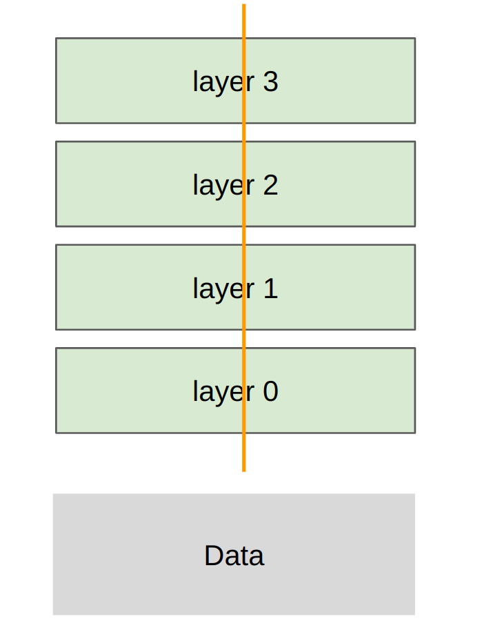

# 第 07 讲：并行基础

> CS336 Spring 2026，Lecture 7（Parallelism，Percy Liang）。按[官方课程安排](https://cs336.stanford.edu/)和[官方可执行讲义 `lecture_07.py`](https://github.com/stanford-cs336/lectures/blob/main/lecture_07.py)的调用顺序整理。[B 站合集 P7](https://www.bilibili.com/video/BV11LEA6eEuj/?p=7)可配合观看；目前未取得可逐句核对的视频字幕，本文的事实和代码以官方讲义为准，额外推导会明确标出。

[课程主页列出的原版录像播放列表](https://www.youtube.com/playlist?list=PLoROMvodv4rMqXOcazWaTUHhq-yembLCV)可用于观看。

术语先对齐：GPU 是 Graphics Processing Unit（图形处理器），HBM 是 High Bandwidth Memory（高带宽显存）；后文 PCIe 是 Peripheral Component Interconnect Express（高速外设组件互连），HCA 是 Host Channel Adapter（主机通道适配器），NIC 是 Network Interface Card（网络接口卡），NCCL 是 NVIDIA Collective Communications Library（NVIDIA 集合通信库），MLP 是 Multilayer Perceptron（多层感知机）。DP/TP/PP 分别是 Data/Tensor/Pipeline Parallelism（数据／张量／流水线并行）；DDP 是 Distributed Data Parallel（分布式数据并行），FSDP 是 Fully Sharded Data Parallel（完全分片数据并行），ZeRO 是 Zero Redundancy Optimizer（零冗余优化器）。

上一讲讨论单 GPU 的融合和 tiling，减少片外访存；本讲把问题扩大到多 GPU：算力和数据相隔更远，如何通过**复制**或**切分**控制跨设备的数据搬运？采用多 GPU，通常是单卡放不下参数、梯度、优化器状态和激活，或需要更多算力缩短训练时间。传输层级大致是片上缓存／shared memory → HBM → 节点内 NVLink/NVSwitch → 节点间网络；越往右，越要仔细计算通信成本。

## 1. 分布式通信的积木：collective

**面试速述：** collective 是多 rank 共同执行的通信原语，先明确每个 rank 输入什么、哪些 rank 得到规约或拼接结果，才能推导并行训练的数据流。实际选择时还要区分结果是全量复制还是保留分片，因为这直接决定显存和通信量。

### Rank、world size 与基础操作

一个 **rank** 是参加通信的一个进程／设备编号；**world size** 是参与进程总数。讲义用 4 个 rank 解释 collective：每个 rank 按同一个通信模式调用操作，底层负责点对点传输安排。这里把数组写在不同 rank 下，便于看清“谁有输入、谁得到结果”。

| 操作 | 输入与输出（4 个 rank 的小例子） | 常见用途 |
| --- | --- | --- |
| Broadcast | rank 0 的 `[0,1,2,3]` 复制到每个 rank | 从主 rank 分发初始权重 |
| Scatter | rank 0 的 `[0,1,2,3]` 拆成每人一个元素 | 分发分片 |
| Gather | 四人各持有 `0`、`1`、`2`、`3`，只在 rank 0 拼回完整数组 | 集中收集结果 |
| Reduce | 四人各持有 `0`、`1`、`2`、`3`，只在 rank 0 得到和 `6` | 汇总统计量 |

`reduce` 是对对应位置做求和、最大值等规约；`gather` 是按 rank 顺序拼接，不做算术。名字中的 `all` 表示结果发给全部 rank，而不是仅给一个根 rank。

**面试速述：** rank 是参与进程编号，world size 是参与数；broadcast/scatter 从根节点分发，gather/reduce 向根节点收集，区别是拼接还是逐元素聚合。带 all 的操作让所有 rank 拿到结果，适合后续都要继续计算的场景。

### 三个训练常用 collective

**All-gather**：每人持有一个分片，如 rank $r$ 持有 $[r]$；操作后每人都持有 $[0,1,2,3]$。参数分片训练中，计算某层前可先聚齐所需参数。若完整张量有 $M$ 个元素、均匀分给 $p$ 人，每人输出需容纳 $M$ 个元素。

**Reduce-scatter**：先对相同位置做规约，再把规约结果切分。讲义四人输入依次为 $[0,1,2,3]$、$[1,2,3,4]$、$[2,3,4,5]$、$[3,4,5,6]$，逐元素求和为 $[6,10,14,18]$；输出是 rank 0 得 $[6]$、rank 1 得 $[10]$、rank 2 得 $[14]$、rank 3 得 $[18]$。它适合汇总各数据分片的梯度，同时保留梯度分片。

**All-reduce**：每人都得到规约后的完整数组，上例每个 rank 都得到 $[6,10,14,18]$。逻辑上可分解成 `reduce-scatter` 再 `all-gather`。这让“所有人都保留完整结果”和“汇总后继续分片存储”可以按需要选择。数据并行常对梯度做 all-reduce。

**All-to-all**：每个 rank 将其输入按目标 rank 分块发送。若 rank 0～3 的输入分别是 `[0,1,2,3]`、`[4,5,6,7]`、`[8,9,10,11]`、`[12,13,14,15]`，rank 0 收 `[0,4,8,12]`，rank 1 收 `[1,5,9,13]`，依此类推。这很像矩阵转置；MoE 按专家路由 token 时会用到。路由不均衡时，慢的 rank 可能拖住整个通信。

记忆法：`reduce` 做规约，`scatter` 拆开，`gather` 拼回，`all` 改变结果的接收范围。`all-reduce = reduce-scatter + all-gather` 是本讲随后理解 DDP 与 FSDP/ZeRO 的关键。

**面试速述：** all-reduce 让每卡拿到完整聚合结果，常用于复制参数的数据并行梯度同步；reduce-scatter 聚合后只留各自分片，all-gather 再恢复全量，适合分片状态训练。all-to-all 按目标设备重排数据，适合 MoE 路由，但负载不均会让慢 rank 拖累整体。

## 2. GPU 互连、RDMA 与 NCCL

**面试速述：** 多卡通信要同时看逻辑 collective 和物理拓扑：同一操作跨节点时可能远比节点内昂贵。RDMA 减少 CPU 介入，NCCL 负责执行 GPU 集合通信；性能判断应依据 rank 映射和实测，而非只看硬件峰值。

### 拓扑决定通信代价

讲义从普通机器的 PCIe、Ethernet，走到数据中心的节点内 NVLink/NVSwitch、节点间 InfiniBand。典型示意是每节点 8 张 GPU，经 NVSwitch 互连；多个节点再通过 HCA／InfiniBand NIC 和线缆连接。讲义给 B200 NVLink 5.0 约 1.8 TB/s、B200 HBM 约 8 TB/s、节点间 InfiniBand 约 0.05 TB/s 等数量级。这些是课堂硬件示意值，口径、链路方向、节点配置和实测吞吐都可能不同，不能直接把它们当作某次程序的有效带宽。

传统网络路径往往需要 CPU、内核协议栈以及缓冲区参与。**RDMA**（Remote Direct Memory Access）允许经网络直接访问远端内存，减少 CPU 介入和拷贝；讲义用 GPU 间直接读写作直观解释。InfiniBand 支持 RDMA，RoCE 则是在以太网上承载 RDMA 的方案，因此不能笼统说“以太网永远不能 RDMA”。讲义还提到 GB200/GB300 NVL72 扩大同一 NVLink 域，意图是把更多设备放在较快的通信层内。实际训练中仍应先画清 rank 到 GPU、GPU 到交换机、节点到节点的映射。

**面试速述：** GPU 间传输经过不同层级的链路，节点内高速互连与节点间网络的带宽、延迟差距会改变最佳并行切法。RDMA 能减少主机处理和拷贝，但具体吞吐仍取决于链路、拓扑及映射，课堂规格不能代替程序测量。

### NCCL 的位置

[NCCL](https://docs.nvidia.com/deeplearning/nccl/user-guide/docs/overview.html)是 GPU 集合通信库。PyTorch 发出 `all_reduce` 这类操作后，NCCL 感知拓扑、选择传输路径和算法、启动相关 GPU kernel 完成收发与规约。调用同一个 collective，并不意味着物理上只有一条链路或一个固定算法；延迟、数据量和拓扑会影响选择。理解 API 时关注逻辑结果，优化时再关注拓扑与实测。

**面试速述：** PyTorch 的 collective 定义逻辑结果，NCCL 在 GPU 上按消息大小和拓扑选择通信路径与算法。优化瓶颈时要测具体数据量和链路，不能从操作名称推断固定传输方式。

## 3. `torch.distributed` 的最小演示

官方讲义通过 `torch.multiprocessing.spawn` 启动 4 个进程，每个进程执行 `setup(rank, world_size)`。`MASTER_ADDR=localhost`、`MASTER_PORT=15623` 用于初始化进程组；GPU 场景选 `nccl` 后端，CPU 场景选 `gloo`。主地址是进程组协调入口，并不表示所有张量都要绕 rank 0 传输。演示结束调用 `destroy_process_group()`。

每个 rank 构造 `torch.arange(4) + rank`，即四组输入恰好是上一节的数组。三步依次执行：

```python
# all-reduce 原地修改 data；每个 rank 最终都有 [6, 10, 14, 18]
dist.all_reduce(data, op=dist.ReduceOp.SUM)

# reduce-scatter：每人输入长度为 4，输出长度为 1
dist.reduce_scatter_tensor(output, input, op=dist.ReduceOp.SUM)

# all-gather：每人用自己的 1 个元素，恢复长度为 4 的完整结果
dist.all_gather_into_tensor(output_tensor=full, input_tensor=output)
```

`all_reduce` 修改输入张量；另两个 API 需要按形状预分配输出。调用前的 `barrier()` 主要让讲义的日志按阶段出现。通信结果要求各 rank 以兼容的顺序参与操作，否则可能挂起；`async_op=False` 表示 API 调用等待该操作完成，但做性能测量仍要考虑 CUDA 执行和跨 rank 同步。讲义的自动 trace 路径会临时把分布式函数换成空操作，所以 trace 页面单 rank 的状态不能当真实多进程通信结果。

**面试速述：** 分布式训练先初始化进程组，再让所有 rank 以一致顺序参与 collective；all-reduce 原地更新，reduce-scatter 和 all-gather 需预分配匹配形状的输出。演示代码说明语义，跨 rank 顺序不一致会挂起，单 rank 的空操作 trace 也不能证明真实通信性能。

## 4. 怎样测通信带宽

讲义分别基准测试 4 rank 的 all-reduce 和 reduce-scatter：先 warmup，再同步 GPU、用 `barrier` 对齐各 rank，墙钟计时包含通信与同步开销。测试对象是 `float32` 的大张量，`num_elements=100*1024**2`；这是每个 rank 在 all-reduce 中的元素数，约 400 MiB。reduce-scatter 的输入形状是 `[world_size, num_elements]`，因而每个 rank 的输入约为它的 4 倍、输出约 400 MiB；不能把两段代码的 `num_elements` 当成相同总输入量。

以理想环形算法估算，设完整输入大小 $S$ 字节、$p$ 个 rank、操作耗时 $t$：每 rank 的 all-reduce 网络发送量约为 $2S(p-1)/p$；reduce-scatter 约为 $S(p-1)/p$。讲义据此定义的近似有效带宽为

$$B_{\mathrm{AR}}\approx\frac{2S(p-1)}{pt},\qquad B_{\mathrm{RS}}\approx\frac{S(p-1)}{pt}.$$

例如 $p=4$、$S=400$ MiB，all-reduce 的每 rank 估算发送量是 $600$ MiB。这里的 $S$ 在两个公式里都指该操作**每 rank 的完整输入大小**；按讲义的实际参数，reduce-scatter 的 $S$ 要用约 1600 MiB。代码中的 `sent_bytes / (world_size * duration)` 正好对应这些式子。它是基于理想通信量的**算法有效带宽**，不等于某条 NVLink／网卡的物理吞吐；真实实现可能用树或分层算法，且 barrier 时间被计入。小消息还会受启动延迟支配，不能只看 GB/s。可参考 [NCCL tests 的带宽定义](https://github.com/NVIDIA/nccl-tests/blob/master/doc/PERFORMANCE.md#allreduce)，重复多次并报告分布会比单次结果稳健。

**面试速述：** 通信带宽基准先 warmup、同步，再用每 rank 的输入字节数和理想算法通信量除以耗时；ring all-reduce 约传 $2S(p-1)/p$，reduce-scatter 约传 $S(p-1)/p$。所得是算法有效带宽，受同步、拓扑和算法影响；小消息还应重点看启动延迟。

## 5. 数据并行：切 batch

讲义生成 $128\times1024$ 的数据、4 层 $1024\times1024$ MLP，用 4 个 rank 各取 32 行。每个 rank 有**完整且相同初始化**的模型参数和自己的 AdamW 优化器状态；前向、损失与反向只在本地数据上计算。各 rank 的本地 loss 一般不同，随后对每个参数梯度执行 `all_reduce(..., op=AVG)`，再各自 `optimizer.step()`。只要初值、平均后的梯度和更新规则一致，模型参数便保持同步。讲义的核心代码结构是：

```python
local_data = data[rank * 32:(rank + 1) * 32]
loss = mlp(local_data).square().mean()
loss.backward()
for param in params:
    dist.all_reduce(param.grad, op=dist.ReduceOp.AVG)
optimizer.step()
```

由于每个 rank 在例子里恰好处理相同样本数，平均各本地 mean 梯度等价于全局 batch 的 mean 梯度；若本地 batch 大小不等，应按样本数加权。讲义并未调用 PyTorch 的 `DistributedDataParallel` 封装，而是手写同步来展示机制。代码没有在步间 `zero_grad()`；示例只运行 `num_steps=1`，若扩展多步必须清零，否则梯度会意外累积。

代价与能力：每 rank 持有全模型参数、梯度和优化器状态，单卡模型容量没有按 rank 数缩小；换来的是每 rank 只需约 $1/p$ 的 batch 计算。若梯度总大小为 $G$ 字节，理想 ring all-reduce 每 rank 传约 $2G(p-1)/p$，与本地 batch 大小基本无关。所以每卡 batch 太小，计算可能不足以摊薄通信。下一讲涉及的 FSDP/ZeRO 利用 all-gather 和 reduce-scatter，把参数／梯度／优化器状态的部分存储也切开。

**面试速述：** 数据并行在各卡复制模型、切分 batch，反向后平均梯度再同步更新，可提高总吞吐。它不降低单卡模型状态显存，而且每卡 batch 太小时梯度通信难以摊薄；本地样本数不等时还须按样本数加权。

## 6. 张量并行：切层的宽度



图：Stanford CS336 Spring 2026 [Lecture 7 官方讲义原图](https://github.com/stanford-cs336/lectures/blob/main/images/tensor-parallelism.png)。下文按讲义的四 rank 简化前向演示说明权重列分片与激活汇聚。

讲义仍用 $128\times1024$ 输入、4 层 MLP、4 个 rank。每个 rank 都拿到完整输入，但一层的权重只持有 $1024\times256$ 的**列分片**。本地矩阵乘得到 $128\times256$ 激活，做 GeLU 后对 4 份激活执行 `all_gather`，沿特征维拼为 $128\times1024$，交给下一层：

$$X\in\mathbb R^{B\times d},\quad W=[W_0|\cdots|W_{p-1}],\quad H_r=\operatorname{GeLU}(XW_r),\quad H=\operatorname{concat}(H_0,\ldots,H_{p-1}).$$

每 rank 的该层权重数量约为单卡的 $1/p$，但每一层边界都要重新收集宽度为 $d$ 的激活。若元素占 $s$ 字节、batch 为 $B$，理想 all-gather 每 rank 至少接收约 $Bds(p-1)/p$；讲义的 $B=128,d=1024,p=4,s=4$ 时，约 $384$ KiB／层／rank。与数据并行主要通信梯度不同，这个简化张量并行实现**在前向的每层**通信激活，因此通常更依赖快速节点内互连。注意力、MLP 的实际工程切法还可利用行／列并行组合，减少不必要的 all-gather。

讲义这里只实现前向，反向留作练习；示例中的 `dist.all_gather` 加手工 `cat` 不足以直接声称完成可训练的自动求导张量并行。另外，示例初始化函数每次固定相同随机种子；若要把这些列分片当作某个通常随机初始化的完整大矩阵，必须正确分片其不同列，不能误以为代码生成的 rank 间分片已彼此独立。课堂代码重在展示数据形状与通信路径。

**面试速述：** 张量并行把单层矩阵的宽度切给多卡，减少每卡权重，但层间常需汇聚激活，因此依赖低延迟、高带宽互连。讲义的列切例子只展示前向形状与 all-gather，不能直接当作完整可训练的 TP 实现。

## 7. 流水线并行：切层的深度

讲义以 2 个 rank 分 4 层 MLP，每个 rank 持有连续的 2 层。输入 batch 为 128，切成 4 个 micro-batch，每个大小 32。rank 0 对一个 micro-batch 计算本地层后用 `dist.send` 把 $32\times1024$ 激活送往 rank 1；rank 1 `dist.recv` 后计算后两层。重复 4 次。每个 rank 的参数量约为完整模型的一半，跨阶段边界需要传激活；理想情况下，整批前向在一个边界上传输 $Bds$ 字节，这里约 512 KiB，分成 4 条消息。增加 micro-batch 数不会自动减少总字节数，却有机会让不同阶段同时忙起来，同时增加消息启动和调度开销。

为什么会有 **pipeline bubble**？阶段 1 要先产出首个 micro-batch，阶段 2 才能开工；末尾也会有阶段空闲。作为补充推导，若有 $p$ 个等时阶段、$m$ 个 micro-batch、只看理想前向且忽略通信，完成时间约为 $(m+p-1)T$，有用计算总量为 $mpT$，设备平均利用率为

$$\eta_{\mathrm{forward}}\approx\frac{m}{m+p-1}.$$

本例 $p=2,m=4$，理想值是 $4/5=80\%$；这是分析模型，不是讲义测得的实测效率。若阶段计算不均衡、`send/recv` 阻塞或网络慢，实际更低。讲义只展示前向和同步发送／接收，反向、激活保存、调度和通信计算重叠尚未实现。

**面试速述：** 流水线并行按层分 stage，通过边界激活传输分担模型参数，micro-batch 让多个 stage 同时工作。简单等时前向模型的利用率约为 $m/(m+p-1)$；更多 micro-batch 可缩小气泡，却会增加调度和消息开销，讲义示例尚未覆盖反向。

## 8. 哪些工作还没有做：重叠与组合

要隐藏通信时间，可以在某个 micro-batch 计算时预取下一份参数，或在梯度块产生后异步做规约，也可以让流水线不同阶段处理不同 micro-batch。有效重叠要求有独立可运行的计算、正确的依赖顺序以及足够的计算／网络资源；把 API 改成异步调用本身不保证延迟下降。张量并行还涉及 backward collective，流水线并行还要处理反向的梯度和 micro-batch 调度。讲义明确将这些作为未覆盖内容。

除 batch、宽度、深度外，序列长度可用于 sequence parallelism，专家维度可用于 expert parallelism；实际大模型会组合多维切分。另一个权衡是激活可保留在本卡、反向时重新计算，或交给别的 GPU 存储并在需要时传回：本质是在显存、计算和通信之间选择。选择并行方案之前，先写清**每 rank 持有的张量形状、每层前后需要的 collective、跨越的物理链路**。

| 方案 | 切分轴 | 每 rank 主要持有什么 | 本讲示例的主要通信 | 主要限制 |
| --- | --- | --- | --- | --- |
| 数据并行 | batch | 完整模型，本地样本 | 反向梯度 all-reduce | 模型状态仍要装进单卡 |
| 张量并行 | 层宽度 | 每层权重的一部分，完整输入 | 每层激活 all-gather | 高频通信，适合快互连 |
| 流水线并行 | 层深度 | 一部分连续层 | 阶段边界 send/recv | bubble 与调度复杂度 |

**面试速述：** 真实训练常组合 batch、层宽、层深、序列和专家等切分轴，并通过预取或异步规约争取通信与计算重叠。重叠只有在依赖顺序允许且计算与网络资源足够时才有效；选方案应逐项核对每卡张量形状、通信位置和跨越的链路。

## 9. 自测与复习抓手

1. 四个 rank 输入依次为 `[0,1,2,3]`、`[1,2,3,4]`、`[2,3,4,5]`、`[3,4,5,6]`。reduce-scatter 后 rank 2 拿什么？答案：`[14]`；随后 all-gather，每个 rank 都拿 `[6,10,14,18]`。
2. 4 卡数据并行，每卡只看到 32 条、总 batch 128，为什么对**等样本数**的本地 mean 梯度做 `AVG`？答案：$(g_0+g_1+g_2+g_3)/4$ 正是全局 128 条样本的 mean 梯度。
3. $B=128,d=1024,p=4$ 的讲义张量并行，每 rank 本地激活与拼接后的激活是什么形状？答案：$128\times256$、$128\times1024$。
4. 两级流水线、4 个等时 micro-batch，理想纯前向利用率为何是 $4/5$？答案：填充／排空共额外占一个阶段时隙，总长 5 个时隙，每阶段有 4 个时隙做有用计算。
5. 一个 collective 的逻辑功能正确，却在多机训练时很慢，该先查什么？答案：消息大小、rank 到 GPU 的映射、是否跨节点、链路与实测延迟／带宽，再看计算能否覆盖通信。

本讲最实用的心智模型：**DP 复制模型切数据，TP 切层宽度传激活，PP 切层深度传边界激活**。所有方案都要同时计算显存、算力、通信量和空闲时间，不能只凭“GPU 数量翻倍”预测加速。

**本节小结：** 这些题目用 collective 输出、梯度平均、激活形状和流水线气泡检验是否能把并行概念落实到张量与通信量；复习时可先手算，再核对边界条件。
