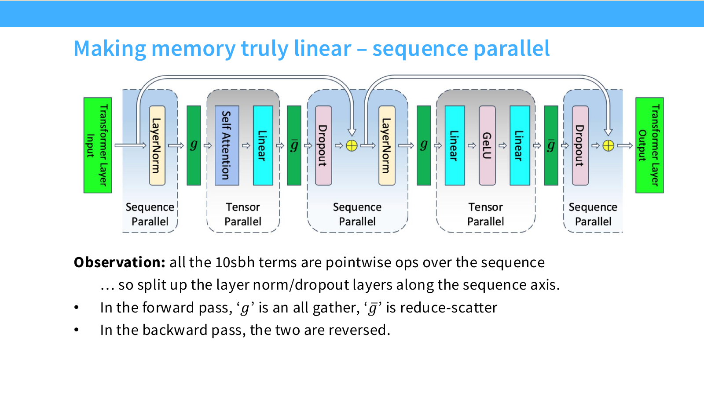
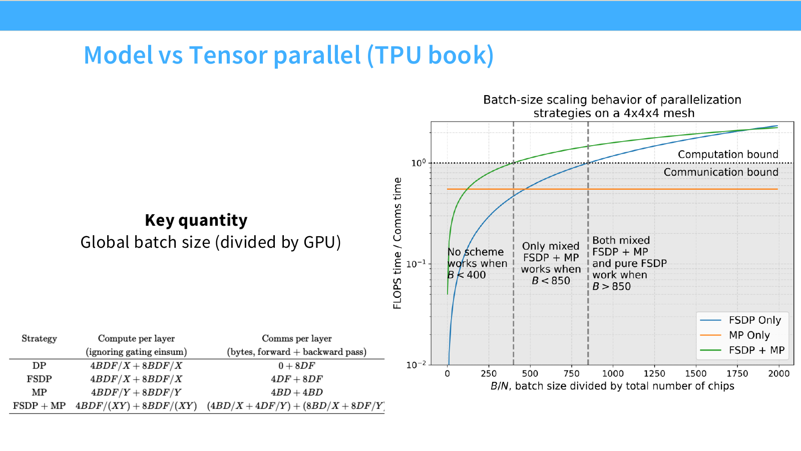
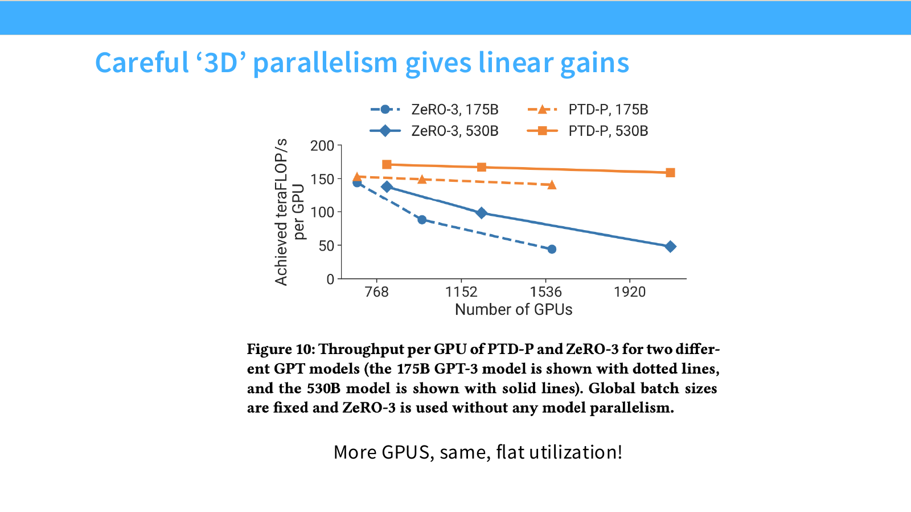

# 第 08 讲：大模型并行策略

> CS336 Spring 2026，Lecture 8（Tatsu Hashimoto，2026-04-22）。本文按[官方 73 页讲义](https://github.com/stanford-cs336/lectures/blob/main/lecture_08.pdf)的顺序整理；[课程表](https://cs336.stanford.edu/)与 [B 站合集 P8](https://www.bilibili.com/video/BV11LEA6eEuj/?p=8)用于定位课程。下文的推导和练习是独立整理，页码指讲义页码；未取得可逐句核验的视频字幕，因此不标注视频时间戳或归纳讲义之外的口述内容。

[课程主页列出的原版录像播放列表](https://www.youtube.com/playlist?list=PLoROMvodv4rMqXOcazWaTUHhq-yembLCV)可用于观看。

本讲要解决两个相互关联的问题：单卡算力和显存无法支撑更大模型时，怎样让多卡共同计算；并行之后，参数、优化器状态、梯度、激活究竟分布在哪些设备上，代价又落在哪条网络链路上。可先记住：**数据并行（DP, Data Parallelism）切样本，流水线并行（PP, Pipeline Parallelism）切层，张量并行（TP, Tensor Parallelism）切矩阵，序列并行（SP, Sequence Parallelism）／上下文并行（CP, Context Parallelism）切 token，专家并行（EP, Expert Parallelism）切专家。** MoE 指 Mixture of Experts（混合专家），MLP 指 Multilayer Perceptron（多层感知机），FSDP 指 Fully Sharded Data Parallel（完全分片数据并行），ZeRO 指 Zero Redundancy Optimizer（零冗余优化器）。

硬件与数值缩写：GPU 是 Graphics Processing Unit（图形处理器），TPU 是 Tensor Processing Unit（张量处理器），BF16 是 Brain Floating Point 16（16 位脑浮点格式）。下文 DDP 指 Distributed Data Parallel（分布式数据并行），Adam 指 Adaptive Moment Estimation（自适应矩估计优化器）。

## 1. 多机训练的前提：网络拓扑与集合通信（第 4–13 页）

**面试速述：** 多机扩展的有效收益由计算是否均衡以及 collective 穿过哪一级网络决定；增加总显存不等于每种并行方案都能容纳更大单模型。设计前应先画 rank 与拓扑，再按聚合后是否要全量结果选择通信原语。

### 从单卡扩展到数据中心

一块 GPU 的计算速度、显存容量都有上限。扩展到一个节点内的多 GPU，再到多个节点后，算力总量与可用显存理论上都可以增加；实际能否接近线性扩展，取决于通信量、链路带宽/延迟，以及工作是否均衡。这里的“总显存增加”不等于任何并行方式都能放下更大的单模型：朴素数据并行仍在每块 GPU 上保存一整份模型。

讲义先比较通信拓扑。TPU 传统上常用环面网格，GPU 集群可以在某个高速互联域内提供更灵活的全互连或交换网络。网格通常较省布线，并适合规则的邻近通信；树/交换式连接更适合目的地不规则的流量，例如 MoE 的 token 路由。讲义也指出 TPU8i/t 的网络设计正在变化，所以“TPU 必然网格、GPU 必然全互连”并不是普遍定律。互联域不能无限扩张：连接数、交换设备、布线、成本和跨域带宽都会成为限制。选并行方式时先画清楚**单节点、节点间、跨机架**哪些链路快。

**面试速述：** 从单卡扩展到数据中心，算力和总显存虽增加，慢链路、布线成本与负载偏斜会限制线性加速。节点内和跨节点带宽不同，拓扑也因设备设计而异，不能简单假定某类加速器总是固定网络形态。

### 五种基本 collective

设 $N$ 个 rank，每个 rank 有大小为 $S$ 的张量：

| 操作 | 每个 rank 最终拿到什么 | 本讲中的典型用途 |
| --- | --- | --- |
| Reduce | 仅目标 rank 拿到逐元素聚合结果 | 汇总梯度到指定设备 |
| All-reduce | 每个 rank 都拿到聚合结果 | 朴素 DP 的梯度同步；TP 的部分和 |
| All-gather | 每个 rank 拿到各 rank 分片拼接后的完整张量 | ZeRO 的参数恢复；序列分片转完整输入 |
| Broadcast | 源 rank 的张量复制给其他 rank | 同步同一份输入或参数 |
| Reduce-scatter | 逐元素聚合后，每个 rank 只保留结果的一片 | ZeRO 的分片梯度；TP/SP 的输出切片 |

以求和为例，all-reduce 可以拆为 **reduce-scatter + all-gather**：前半步让每个 rank 持有全局和的 $1/N$ 分片，后半步把所有分片交换给每个人。在理想环算法、带宽主导且每 rank 原始张量大小为 $S$ 字节时，两步各传约 $\frac{N-1}{N}S$ 字节/设备，总计 $2\frac{N-1}{N}S$。课程常把 $N$ 较大时的这一量简写为 **$2S$**；它是每设备通信量的近似，不是整个集群的总流量，也没有算启动延迟、拥塞和拓扑损耗。后面“$2P$ / $3P$”以 $P$ 个参数大小的张量为单位，乘上通信 dtype 的字节数才是字节流量。

**面试速述：** collective 的关键是结果位置：all-reduce 给所有 rank 完整聚合结果，reduce-scatter 只保留聚合分片，all-gather 恢复完整张量。理想环形 all-reduce 可视为后两步组合，每设备通信约 $2(N-1)S/N$；这个量不含启动延迟与拓扑损耗。

## 2. 数据并行与 ZeRO：先处理模型状态（第 14–30 页）

**面试速述：** 朴素数据并行复制模型状态；ZeRO 逐级分片优化器状态、梯度和参数以节省常驻显存。前两级主要改变通信形式，三级还需聚齐参数、通常增加流量；评估峰值显存时也要计入临时参数和激活。

### 朴素数据并行的算力收益与显存瓶颈

对全局 batch 大小 $B$，$N$ 个数据并行 rank 各算约 $B/N$ 个样本的梯度，再同步并平均；若损失定义为样本均值，更新为

$$\theta_{t+1}=\theta_t-\eta\frac{1}{B}\sum_{i=1}^{B}\nabla_\theta f(x_i;\theta_t).$$

讲义第 15 页把梯度写作求和；上式的 $1/B$ 取决于损失与学习率约定。每个 rank 仍需完整参数。若模型有 $P$ 个参数，一次梯度 all-reduce 约传 $2P$ 个梯度元素；batch 越小，每卡计算越少，通信占比越高。DP 能扩大**总吞吐**和全局 batch，却不能单靠复制模型解决单卡装不下的问题。

按讲义的混合精度 Adam 记账，每参数有 BF16 参数 2 字节、BF16 梯度 2、FP32 主权重 4、一阶矩 4、二阶矩 4，合计 **16 字节/参数**，尚未计入激活、临时缓冲、CUDA/框架开销。所谓“五份状态”并不是五份同精度权重。如果两个 Adam 矩也用 BF16，则变成 12 字节/参数；具体精度与数值稳定性必须按实现选择。

**面试速述：** 朴素数据并行把 batch 分给各卡并同步平均梯度，提高吞吐，但每卡仍保存完整参数、梯度和 Adam 状态。讲义的混合精度示例是每参数 16 字节静态状态；真实显存还包括激活和缓冲，小 batch 也可能让通信占主导。

### ZeRO-1：仅切优化器状态

设每参数复制的“参数 + 梯度”占 $C$ 字节，优化器状态（含主权重）占 $K$ 字节，DP 规模为 $N$。朴素 DP 每 rank 需 $(C+K)P$；ZeRO-1 为 $(C+K/N)P$。采用上面的 16 字节例子，$C=4,K=12$。每个 rank 只负责更新自己那 $1/N$ 的参数：本地完整反向 → 梯度 reduce-scatter → 本地用自己的状态更新参数分片 → 参数 all-gather。通信仍约 $P+P=2P$，所以在带宽主导的简化模型中，节省优化器显存并未增加主导通信量；现实还受 collective 启动和额外缓冲影响。

**面试速述：** ZeRO-1 只分片优化器状态，每卡仍有完整参数与梯度；各卡更新所负责参数后再聚齐权重。它主要缓解 Adam 状态显存，简化带宽模型下通信主导量仍约为两个参数大小，完整参数仍须放进单卡。

### ZeRO-2：进一步切梯度

ZeRO-2 每 rank 保留完整参数，但梯度和优化器状态分片，静态模型状态近似为 $(C_{\rm param}+(C_{\rm grad}+K)/N)P$。难点在于每个 rank 对本地样本做反向时，仍必须**计算每层完整的局部梯度**；它只是不把全模型梯度一直留在显存里。做完一层就对这一层 reduce-scatter，把属于别人的部分发送并释放；最后本地更新，再 all-gather 参数。于是通信主导项仍约 $2P$，但梯度桶、重叠和释放时机决定峰值显存。

**面试速述：** ZeRO-2 进一步用 reduce-scatter 分片并及时释放梯度，常驻显存降低，但反向仍要计算各层完整的本地梯度。通信主导量与 ZeRO-1 近似，实际峰值取决于梯度桶和释放时机，参数仍是完整复制的。

### ZeRO-3 / FSDP：参数也切开

每 rank 常驻参数、梯度、优化器状态的 $1/N$ 分片，理论静态模型状态接近 $(C+K)P/N$。执行某个 FSDP 单元的前向时 all-gather 该单元参数，算完释放完整临时副本；反向前再 all-gather 参数，算完把梯度 reduce-scatter 到所属 rank，随后释放临时副本并本地更新。按讲义“朴素版本”，每步约 **两次参数 all-gather + 一次梯度 reduce-scatter = $3P$**；相比 DP/ZeRO-1/2 的 $2P$ 是约 1.5 倍通信量。精确环算法因子是 $(N-1)/N$；峰值显存还要加当前/预取单元的完整参数、激活与通信缓冲，不能直接等同于静态状态除以 $N$。

讲义第 26 页强调逐单元通信和计算重叠：例如前向算当前单元时预取下一个单元参数、反向边算边规约。异步调度能隐藏部分传输时间，但受网络、单元粒度及依赖顺序限制。ZeRO-3 解决参数状态问题，**没有自动消除激活显存**。ZeRO-1/2 的完整参数仍必须放得进单卡；当全局 batch 太小，DP rank 数还会受样本数与梯度同步开销制约。

**面试速述：** ZeRO-3/FSDP 连参数也分片，计算某层时临时 all-gather，反向再聚齐参数并 reduce-scatter 梯度，因此能突破单卡完整参数的容量限制。讲义朴素模型每步约 $3P$ 通信，高于前两级的约 $2P$；静态状态的 $1/N$ 不代表实际峰值显存。

### 8×A100 80 GB 的课堂估算

讲义第 28 页换用 12 字节/参数的假设：BF16 参数 2、BF16 梯度 2、FP32 主权重 4、BF16 两个 Adam 矩各 2。令 $N=8$，单卡暂按十进制 80 GB、忽略所有激活和缓冲，则：

| 策略 | 每参数每卡字节数 | 理论最大参数量 |
| --- | ---: | ---: |
| 朴素 DP | $12$ | $80/12\approx6.67$B |
| ZeRO-1 | $2+2+8/8=5$ | $16$B |
| ZeRO-2 | $2+(2+8)/8=3.25$ | $\approx24.62$B |
| ZeRO-3 | $12/8=1.5$ | $\approx53.33$B |

这里 B 指十亿参数，不是 batch。上述是**仅模型状态的乐观上界**：真实可训练模型必须为激活、临时 all-gather、通信桶、内核工作区及运行时预留空间。讲义第 28 页先说“纯 BF16 训练配合 Kahan 求和可以可行”；Kahan 是用补偿量减少浮点累加误差的方法。随后讲义用“除 FP32 主权重外其余 BF16”的 12 字节口径做表；前者是低精度累加的数值条件，**不等于**表中的主权重已被删除。不能把该口径与前面 FP32 Adam 矩的 16 字节直接混用。

**面试速述：** 8×80 GB 示例按 BF16 Adam 矩的 12 字节/参数记账，ZeRO 级别越高，每卡静态模型状态越少，理论可容纳的参数量越大。表中的最大参数量忽略了激活、临时参数副本和运行时开销，也不能与前面 FP32 Adam 矩的 16 字节口径混用。

## 3. 模型并行：先切深度，再切宽度（第 31–43 页）

数据并行让每卡处理不同样本；模型并行则让不同卡持有模型的不同部分，主要传**激活或部分结果**。因此可以在不扩大 batch 的情况下分担参数与计算。它不是单一算法，切分轴决定通信模式。

**面试速述：** 模型并行把权重和计算分布到不同卡，以激活或部分结果的传输换取单卡容量。按层深切形成 PP，按矩阵宽度切形成 TP；两者的通信频率和适合的链路不同。

### 流水线并行 PP：按层切分

把连续层分给 $p$ 个 stage，前向把激活发送给下一 stage，反向把激活梯度传回。若一次只处理一个 batch，任一时刻大部分 stage 等待其他 stage，利用率可低至约 $1/p$。把 batch 切成 $m$ 个 microbatch，stage 处理完一个 microbatch 就继续下一个，形成流水线。讲义对简单 flush 调度给出**气泡时间/有用计算时间约为 $(p-1)/m$**；相应理想利用率可写成 $m/(m+p-1)$。这个比值依赖等长 stage、稳定 microbatch 计算、忽略通信等假设，不是任意 1F1B/交错调度的精确值。

PP 的好处是每卡只放约 $1/p$ 层参数，并在相邻 stage 之间以点对点方式传大小约 $bsh$ 的激活（$b$ 为 microbatch 大小，$s$ 为序列长，$h$ 为 hidden size）；比每层都 collective 的 TP 更适合较慢的跨节点链路。代价是需要足够多 microbatch 填满流水线，以及保存/重算在途激活。讲义进一步提到交错流水线用更多通信换利用率；“zero bubble” 将反向拆成必须沿流水线传播的输入/激活梯度和可择机计算的权重梯度，借调度空隙填补气泡。它们都需要具体实现和资源预算，不能由公式直接保证零空闲。

**面试速述：** PP 把连续层分成 stage，前向传激活、反向传梯度，并用 microbatch 填流水线；简单等时 flush 调度的利用率约 $m/(m+p-1)$。它能分担层参数且通信集中在阶段边界，但微批次不足或阶段不均衡会产生气泡。

### 张量并行 TP：按矩阵宽度切分

对两层 MLP，令 $A=[A_1,A_2]$ 按**列**切、$B=[B_1;B_2]$ 按**行**切：

$$Y_i=\operatorname{GeLU}(XA_i),\qquad Z=\sum_iY_iB_i.$$

每卡算自己的 $Y_i$ 和 $Y_iB_i$，然后 all-reduce 部分和得到完整 $Z$。图中的 $f$ 在前向是恒等、反向是 all-reduce；$g$ 在前向是 all-reduce、反向是恒等。这解释了为什么列并行和行并行通常成对放置：非线性 GeLU 在各自列片上即可做，直到第二个矩阵乘后才需要合并。Transformer 内可把 QKV 和 MLP 上投影列切、注意力输出投影与 MLP 下投影行切；norm、router 等在该基础方案中复制。

TP 不需要 pipeline microbatch 来填气泡，但几乎每个 block 都要传激活规模的 collective，且计算通常要等待结果。讲义第 43 页用每层约 $8\frac{t-1}{t}bsh$ 的通信量与 PP 的每 microbatch 约 $bsh$ 点对点传输作量级对比；系数取决于是否包含前反向、何种激活与并行实现，不能当作所有架构的精确性能公式。GPU 上通常把 TP 约束在节点内高速互联域，讲义例子一般不超过 8 卡；越过慢链路时频繁同步会拖累速度。

**面试速述：** TP 将 MLP 第一矩阵按列、第二矩阵按行切，各卡独立做非线性，再对部分输出求和，减少过早汇聚。它在每个 block 都要做激活 collective，通常适合节点内快互连；讲义通信系数依实现假设而变。

## 4. 激活显存、专家与长上下文（第 44–54 页）

**面试速述：** 参数放下后，激活、MoE 专家和长上下文仍可能分别形成瓶颈。TP/SP 处理普通层的激活布局，EP 分布专家权重，CP 分担长序列注意力状态；它们切的维度不同，也各有通信代价。

### 按讲义模型推导激活公式

第 46–49 页引用特定 Transformer 实现的激活记账模型。设 $s$ 为序列长、$b$ 为 microbatch 大小、$h$ 为 hidden size、$a$ 为注意力头数、$t$ 为 TP 度；下式单位随原文的激活精度/记账约定而定，适合比较缩放趋势，**不是通用网络结构的逐字节显存预测器**：

$$M_{\rm no\ parallel}=sbh\left(34+5\frac{as}{h}\right).$$

其中 $5as/h$ 对应注意力矩阵和相关 dropout 等随 $s^2$ 增长的存储；FlashAttention 或选择性重计算可使这部分不常驻。TP 把可切的矩阵乘相关激活摊到 $t$ 卡，但留下一项不能靠 TP 缩小：

$$M_{\rm TP}=sbh\left(10+\frac{24}{t}+5\frac{as}{ht}\right).$$

$10sbh$ 由层归一化 $4sbh$、dropout $2sbh$、注意力与 MLP 输入 $4sbh$ 组成。随着 TP 度上升，固定的 10 项成为瓶颈。若配合选择性激活重计算，二次项去掉，剩 $sbh(10+24/t)$。

**面试速述：** 讲义的激活公式说明，单纯 TP 只缩小可分片项，归一化和 dropout 等仍留下 $10sbh$ 的固定激活项。选择性重计算可去掉该示例的二次项；这些系数来自特定 Transformer 记账，不能直接当通用逐字节预测。

### 序列并行 SP

图：Stanford CS336 Spring 2026 [Lecture 8 官方 PDF 第 48 页](https://github.com/stanford-cs336/lectures/blob/main/lecture_08.pdf#page=48)。图中的 $g$ 在前向为 all-gather，$\bar g$ 为 reduce-scatter；反向操作互换。该页未标注此示意图的第三方出处。

LayerNorm、dropout 等是对 token 逐点执行的操作，可以沿序列维把上述 10 项分给 TP 进程组。讲义图中，从序列切片进入需要完整输入的 TP 子层，前向用 all-gather；从 TP 子层回到序列切片，前向用 reduce-scatter，反向方向互换。于是该模型中

$$M_{\rm TP+SP}=sbh\left(\frac{34}{t}+5\frac{as}{ht}\right),\qquad
M_{\rm TP+SP+recompute}=sbh\frac{34}{t}.$$

这才使所列激活项随 $t$ 近似线性下降。SP 不是“额外复制出 $t$ 倍设备”：它通常利用既有 TP 进程组，在 TP 子层之间改变激活布局。公式没覆盖所有模型结构、残差缓冲及通信时的峰值。

**面试速述：** SP 在既有 TP 组内按序列分担逐 token 激活，进入 TP 子层时 all-gather，出来时 reduce-scatter，使讲义所列激活项近似随 TP 度下降。它会增加布局切换通信，公式也未覆盖所有结构和瞬时缓冲。

### 专家并行 EP：按 MoE 专家切分

讲义第 50–53 页转向 MoE。路由器为 token 选专家；EP 把不同专家放到不同 GPU，先把 token 激活按目的专家 **all-to-all** 发送，执行各专家的 MLP，再把输出送回原 token 位置。它分摊的是**专家权重**，不是普通 dense attention 权重，也不直接减少所有激活显存。与把同一个大矩阵切开的 TP 相比，EP 让每个专家保留较完整的矩阵乘，计算效率可能更好；代价是路由通信不规则，专家负载可能失衡，还需每专家有足够 token 形成高效 batch。

讲义特别提醒：MoE 多用于 MLP，attention 与专家部分对 TP/EP 的偏好不同。系统可为 attention 设 TP/CP/DP，为专家设 ETP/EP/EDP 等不同维度；不能把每个层都机械地套进同一组轴。DP 与 EP 的副本关系，以及 DP×TP 对每卡 token 数和利用率的影响，也要按实际进程组检查。

**面试速述：** EP 把 MoE 专家权重分布到不同卡，token 经 all-to-all 送到选中专家、计算后再送回。它保留每个专家较完整的矩阵乘，却要求每专家有足够 token，且路由热点会造成负载不均；dense attention 仍需单独规划。

### 上下文并行 CP / Ring Attention

讲义第 54 页另列 CP：为超长上下文把整段输入序列切到多卡，注意力计算要交换别的卡的 K/V 块，或以 ring 方式逐块传递，使各卡的 query 与全局上下文交互。它主要分担长序列激活与 KV 占用，尤其在 $s$ 极大时有用；不同于 SP 主要分摊 LN/dropout 等逐 token 操作。CP 的通信取决于注意力实现、序列长度和切分度，不能假定单纯切序列后各 GPU 完全独立。讲义第 55 页的总表也将 SP/CP 归为“激活或 KV 分片，付出跨 rank 交换”。

**面试速述：** CP 为超长上下文切分整段序列，各卡须交换 K/V 块才能让本地 query 看到全局上下文；它主要缓解长序列激活和 KV 容量。SP 则主要分摊逐 token 操作，不能把两者都理解为切序列后零通信。

## 5. 组合并行维度与实际配置（第 55–73 页）

**面试速述：** 多维并行应从显存、激活、链路和每卡 token 数倒推：快链路承载高频 TP，PP 可按边界跨节点，最后用 DP 扩吞吐。真实系统还要核对进程组乘积、最慢 stage 和容错成本，公开配置只能当案例。

### 先确定瓶颈，再选择并行轴

讲义的经验顺序是：先使模型状态与激活放得下，再用剩余 GPU 增大数据并行吞吐。若节点内高速互联充足，可先用 TP（MoE 则结合 EP）；层数多、跨节点链路较慢时用 PP 切层；也可在带宽足够时选择 ZeRO-3/FSDP。长上下文优先检查激活/KV，考虑 SP、CP、FlashAttention 与重计算。最后再扩 DP；若每卡 microbatch 小，做梯度累积可扩大有效全局 batch、摊薄每次同步开销，但会改变优化过程中的有效 batch。

讲义第 56 页的 **4×4×4 网格模型**把每层计算时间除以通信时间，横轴是全局 batch 除以总芯片数 $B/N$。图中约 $B/N<400$ 时所比较的方案仍由通信主导；约 400–850 时，混合 FSDP（Fully Sharded Data Parallel，完全分片数据并行）+ MP（Model Parallelism，模型并行）跨过计算/通信分界，而纯 FSDP 尚未跨过；再增大到约 850 以上，两者都可能成为计算主导。纯 MP 的橙线在图示范围内始终低于计算/通信比 1，不能把“两个方案可行”误读成三个方案都可行。**这些是该图的模型与拓扑下的阈值，不是通用 batch 配置建议**：同一分片方案随每芯片工作量变化，优劣会反转，不能只按总 GPU 数选择并行轴。

*图源：[官方 Lecture 8 讲义第 56 页](https://github.com/stanford-cs336/lectures/blob/main/lecture_08.pdf#page=56)；表和曲线均为特定假设的示意，非通用阈值。*

对一个简单 dense 训练网格，常用总卡数记账为 $G=d\times t\times p\times c$（DP、TP、PP、CP 各轴相互独立时）；例如 256 卡若选 $t=8,p=4,c=1$，则 $d=8$。EP 的进程组可能与 DP 或 TP/ETP 交错，不应在不了解拓扑时无条件再乘一个 EP。还须核查：每个 stage 的层数与显存、每张卡的 microbatch/token 数、最慢 stage、所有 collective 所跨网络层级，以及故障重启/检查点成本。

第 59–62 页的 Megatron-LM 案例说明：模型增大时，TP 先升至 8 左右，之后主要增 PP 以放下更多层，DP 度可能下降；在给定 64 GPU、162.2B GPT 的实验中 $(p,t)=(8,8)$ 性能优于更极端的切法。该观察有指定模型、机器和 batch 条件，不能推成“TP=8 永远最优”。激活重计算虽增加 FLOPs，若因此能用更大 microbatch、减少气泡或改善吞吐，整体训练反而可能更快。

讲义第 58 页摘录的 Megatron 建议把这个取舍落到网络域：在避免 OOM 的前提下尽量少用模型并行、保留较大的 DP；常规情况下让 EP×TP 位于单节点 NVLink 域内（示例为 8 卡），跨节点扩展优先切 PP；当 $PP\ge2$ 时可用虚拟流水线 stage 缩小气泡。专家层优先考虑 EP 而非盲目增 TP，图中的 Mixtral 8×7B 示例为 EP8×TP1 优于 EP4×TP2；序列长到约 8K token 及以上时可考虑 CP，但收益仍依赖计算/通信重叠。图也特别提醒：超大 MoE 的 EP 通信甚至可超过节点内链路能力，需要让跨节点 all-to-all 与计算重叠。这些均是**该讲义转述的具体系统经验**，不是任意硬件上的固定配方。

第 60 页另一张实测图对比固定全局 batch 下的 175B 与 530B 模型：只用 ZeRO-3、不断扩大 GPU 数时，单卡 achieved TFLOP/s 明显下降；将 TP、PP、DP 组合的 PTD-P 方案则保持相对平坦的单卡吞吐。这补足了“分得下”与“扩得快”的区别：纯分片能解决容量，却未必让通信随规模保持可控；曲线只证明该实验配置的表现，不能推断所有 FSDP 实现都如此。

*图源：[官方 Lecture 8 讲义第 60 页](https://github.com/stanford-cs336/lectures/blob/main/lecture_08.pdf#page=60)；PTD-P 指组合的流水线、张量和数据并行方案。*

**面试速述：** 先让模型状态与激活放得下，再按每卡 batch 与节点内外带宽选择 TP、PP、FSDP 或长上下文所需的 CP/SP，余量用于 DP。第 56/60 页表明纯 FSDP 的容量优势不保证扩展吞吐，具体取舍要看计算/通信比。简单 dense 网格可用 $G=d t p c$ 核卡数，但 EP 可能与其他进程组交错，不能机械再乘一次。

### 讲义中的模型案例如何阅读

| 案例（讲义页） | 讲义强调的配置或变化 | 应抓住的设计理由 |
| --- | --- | --- |
| DeepSeek / V3（64） | ZeRO-1 与 TP、SP、PP；V3 例子给 PP=16、EP=64，专家路由与 1F1B 重叠 | dense attention 与 MoE 专家可用不同并行轴 |
| Yi / Yi-Lightning（65） | Yi 用 ZeRO-1、TP、PP；Yi-Lightning 倾向以 EP 替换部分 TP | 专家化后切专家可能优于切 MLP 矩阵 |
| Llama 3 405B（66–67、72） | 讲义总表列 DP=128、TP=8、PP=16、CP=1，并提示大规模故障频繁 | 巨型 dense 模型要考虑多维并行及容错 |
| Gemma 2（68、72） | 讲义列 ZeRO-3、TP/SP；总表以 DP=768、TP=8 展示一个配置 | FSDP 和 TP/SP 可以组合，但表中数字不应脱离具体运行配置 |
| Mixtral 8×22B（69、72） | Megatron 示例 TP/PP/CP/EP=4/4/1/8，若总 256 卡则讲义推测 DP=2 | EP 需与其余维度一起核算总卡数 |
| Nemotron 3 Super、Qwen 3（70–72） | 长上下文案例出现大 CP；Qwen 3 示例用 EP=32、TP=2、PP=8 | CP 随上下文需求升高，EP 可大于典型 TP 域 |

这些是讲义摘取的**不同论文、不同阶段、不同框架配置**，不是统一硬件上的受控对比。第 70 页出现“PP=0”而第 72 页又把 PP 写作未知；并行度按数学定义不应取 0，此处不据此推断“零段流水线”。讲义总表的 `??` 表示未给出的配置，本文也不补猜。概括性的模式是：TP 经常约束在高带宽小域内；EP 可以跨更大域但路由难；长上下文会显著提高 CP 的价值。

**面试速述：** 讲义案例展示 dense、MoE 和长上下文模型会采用不同轴的组合，原因分别在高频激活同步、专家路由和序列容量。表格跨论文、硬件与训练阶段，个别参数还未给出，不能把某个数字当作通用最优配置。

## 6. 复习练习与自测

1. 8 张卡训练 $10$B 参数模型。按本讲 16 字节/参数的 Adam 记账，朴素 DP、ZeRO-1/2/3 每卡的**静态模型状态**分别是多少？为什么这些数不能直接用于判定能否在 80 GB 卡上训练？
2. 为什么 all-reduce 可以拆为 reduce-scatter 与 all-gather？若每 rank 梯度张量是 4 GB、$N=8$，理想环算法的每设备传输量约多少？
3. 若 $p=4$ 个等长流水线 stage、$m=8$ 个 microbatch，简单 flush 模型的气泡/有用计算比是多少、理想利用率是多少？若 $m$ 降到 2 会怎样？
4. 对 $A=[A_1,A_2]$、$B=[B_1;B_2]$，写出两卡计算 $\operatorname{GeLU}(XA)B$ 时在何处需要合并。为什么列切和行切搭配比两次都列切更自然？
5. 在第 46–49 页模型中，令 $s=2048,b=1,h=4096,a=32,t=8$。分别写出 TP 与 TP+SP+选择性重计算的激活表达式；哪个项即使 $t$ 增大也不会通过单纯 TP 下降？
6. 同一训练集群中，哪些通信适合放在节点内高速域，哪些可跨较慢节点间链路？若 MoE 有 token 热点，EP 还需要检查什么？

参考答案：① 每卡分别为 $160$、$(4+12/8)\times10=55$、$(2+14/8)\times10=37.5$、$16/8\times10=20$ GB；均未算激活、临时参数副本等。② all-reduce 的全量结果由各 rank 的 reduce-scatter 分片拼合；$2(7/8)\times4=7$ GB/设备。③ $3/8=37.5\%$，利用率 $8/11\approx72.7\%$；$m=2$ 时比值 $3/2$、利用率 $2/5=40\%$。④ 各卡先独立算 $Y_i=\operatorname{GeLU}(XA_i)$，再对 $Y_iB_i$ 求和；合并发生在第二个矩阵乘之后，非线性不需事先合并。⑤ $M_{\rm TP}=sbh(10+24/8+5as/(8h))$；$M_{\rm TP+SP+recompute}=34sbh/8$；固定的 $10sbh$ 是单纯 TP 的瓶颈。⑥ TP 高频 collective 宜在快链路；PP 相邻 stage 的激活点对点传输可跨节点，仍需以实测带宽和延迟评估；EP 要看 token 数/专家、负载偏斜与 all-to-all 带宽。

**本节小结：** 练习用显存记账、collective 流量、气泡、激活公式和拓扑选择检验是否会按假设推导，并提醒理论容量与真实可训练容量不同。

## 7. 来源与核对边界

- 主来源：[Stanford CS336 Spring 2026 Lecture 8 官方讲义](https://github.com/stanford-cs336/lectures/blob/main/lecture_08.pdf)，已按 73 页核对文字与关键图表。上文 $2P/3P$、12/16 字节、激活公式、并行案例均依讲义假设注明适用范围。
- 课程与视频入口：[Stanford 课程表](https://cs336.stanford.edu/)；[B 站合集 P8](https://www.bilibili.com/video/BV11LEA6eEuj/?p=8)。视频仅作观看入口，未使用未经验证的字幕、时间戳或课堂原话。
- 讲义引用的进一步材料包括 [PyTorch FSDP 教程](https://pytorch.org/tutorials/intermediate/FSDP_tutorial.html)、[FSDP 系统论文](https://arxiv.org/abs/2304.11277)、[Megatron-Core MoE 指南](https://docs.nvidia.com/megatron-core/developer-guide/latest/user-guide/features/moe.html)。本文以官方课件而非外部教程为章节依据；练习、公式条件说明及第 70/72 页配置差异提示为独立整理。

**本节小结：** 本节列出课程讲义与延伸材料，并交代视频未逐句核对、公式及案例各自的来源边界，便于复查具体结论。
