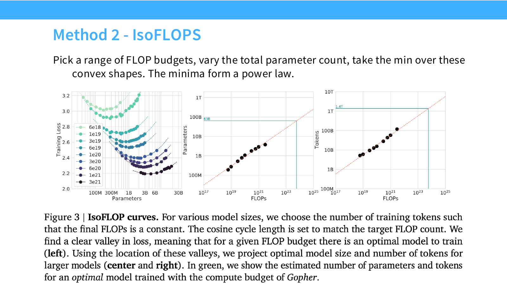

# 第 09 讲：Scaling Laws 基础

> CS336 Spring 2026，Lecture 9，Tatsunori Hashimoto。本文按[官方 57 页讲义](https://github.com/stanford-cs336/lectures/blob/main/lecture_09.pdf)的页序整理；课程主页见 [Stanford CS336](https://cs336.stanford.edu/)，[B 站合集 P9](https://www.bilibili.com/video/BV11LEA6eEuj/?p=9)可配合观看。已逐页核对讲义文本和关键图表，未取得可逐句核对的视频字幕，故以下陈述以讲义为依据，不标注未经核实的视频时间戳或教师原话。

[课程主页列出的原版录像播放列表](https://www.youtube.com/playlist?list=PLoROMvodv4rMqXOcazWaTUHhq-yembLCV)可用于观看。

本讲的实际问题是：如果有大量图形处理器（GPU, Graphics Processing Unit）、一个月时间和训练数据，应该训练多大的模型、用多少 token、选什么架构与优化设置？Scaling law（缩放规律）试图用较小规模的实验，预测大规模训练的损失和资源分配。它是**特定实验条件下的经验拟合**，不保证换数据、模型、优化器和评估目标后仍保持同一系数。FLOPs 指 Floating Point Operations（浮点运算次数），IsoFLOPs 指固定 FLOPs 预算进行对比；后文 LSTM、SGD、FFN、MoE 分别指 Long Short-Term Memory（长短期记忆网络）、Stochastic Gradient Descent（随机梯度下降）、Feed-Forward Network（前馈网络）、Mixture of Experts（混合专家）。

## 1. 从样本复杂度到经验幂律（讲义第 2–20 页）

### 为什么“规律”有用

逐项在目标规模训练再挑最优，成本过高；只照搬已有模型配置，也未必适合自己的数据和预算。可操作的流程是：用同一训练与评估配方跑若干小模型，拟合规模与损失的关系，再外推并用中等规模实验检验。外推能减少盲试，但其可靠性取决于训练点是否覆盖关键转折区，以及大模型是否仍在相同机制下工作。

讲义先回顾样本复杂度理论和数据缩放史。理论上界描述“最坏情况下可能需要多少样本”，不等于实际训练曲线；Banko 与 Brill、Kolachina 等早期工作已探索数据量与任务效果的函数形式。Hestness 等（2017）在机器翻译、语言模型、语音等任务中观察到可预测的学习曲线，还讨论了计算量与精度的关系。大模型时代把这种思路系统地用于参数量、数据量和训练计算量。

### log-log 直线意味着什么

若某个**误差项**满足 $e(n)=A n^{-\alpha}$，其中 $n$ 为样本数、$A>0$、$\alpha>0$，则

$$\log e(n)=\log A-\alpha\log n.$$

因此横纵轴都取对数时，斜率为 $-\alpha$。数据乘 $k$，该误差项乘 $k^{-\alpha}$。例如 $\alpha=0.3$ 时，数据翻倍只让这个误差项乘 $2^{-0.3}\approx0.812$，并不是把**总损失**降低 18.8%。实际总损失常带不可约项 $E$：$L(n)=E+A n^{-\alpha}$；此时应考察 $L-E$ 的对数，不能直接断言 $\log L$ 在所有范围都是直线。讲义第 15 页展示 Kaplan 等语言模型数据缩放图的近似 log-log 直线。

### 均值估计：一个可精确推导的例子

设 $x_i\overset{\mathrm{iid}}\sim\mathcal N(\mu,\sigma^2)$，估计量 $\hat\mu=n^{-1}\sum_{i=1}^n x_i$。它无偏，且 $\operatorname{Var}(\hat\mu)=\sigma^2/n$，所以均方误差

$$\mathbb E[(\hat\mu-\mu)^2]=\frac{\sigma^2}{n},\qquad \log\operatorname{MSE}=2\log\sigma-\log n.$$

这里的指数恰为 1。它解释了“幂律为什么可能出现”，却**不能推出**语言模型的指数也是 1：目标函数、估计难度、模型偏差和数据分布都不同。讲义第 18 页指出，神经网络任务中的经验斜率与许多经典参数模型的 $1/n$ 速率差异明显。

### 非参数学习与维度直觉

讲义第 19 页给一个二维函数估计玩具例子：$x_i$ 均匀落在单位正方形，$y_i=f(x_i)+\varepsilon_i$，噪声方差为 1。若把每条边切成宽约 $n^{-1/4}$ 的格子，共有约 $\sqrt n$ 个格子，每格约 $\sqrt n$ 个样本；格内平均的噪声方差因而约为 $n^{-1/2}$，另外还有由 $f$ 的平滑性决定的近似偏差。**讲义正文的 OCR 容易把两个 $\sqrt n$ 误读为 $n$；这里以页面图像和格子计数为准。**

这个例子用来说明灵活函数估计的斜率可依赖维度与平滑性，不是证明通用的 $n^{-1/d}$ 定律。讲义随后介绍一种把经验指数联系到数据“内在维度”的解释（Bahri 等），但同时提醒内在维度难以稳健估计，推论并不严密。复习时应把**可精确计算的均值例子**、**帮助理解的分箱例子**和**尚有争议的内在维度解释**分开。

## 2. 数据的数量、组成、重复与筛选（讲义第 21–27 页）

### 数据混合：斜率相似，截距可以变

总 token 数相同，来源不同，效果仍会不同。讲义引用 Hashimoto（2021）的分布偏移示意：改变数据源混合比例时，图上的学习曲线可呈近似相同斜率、不同截距；配比极端时表现更差。这里的“组成主要影响截距”是该示例中的观察，**不是所有任务、所有规模的定律**。选择数据混合比例要固定验证分布，用多个规模验证小模型上的优胜配比能否延续到大模型。

讲义第 23 页比较了复杂的数据混合缩放拟合与直接在小模型上比较候选数据集的思路。前者可以预测未试过的大模型和混合比，却需要足够覆盖的数据与可信拟合；后者便宜、直接，但排名可能随规模和训练步数改变。实践中应记录各来源比例、去重方式和验证集组成，避免把数据配方变化误解释为“模型规模收益”。

### 有限语料下，重复 token 不是新增 token

设 $U_D$ 是独特 token 数，$R_D$ 表示额外重复的次数，$D'$ 表示在拟合意义上的有效数据量。讲义第 24 页展示的数据受限模型写成

$$D'=U_D+U_D R_D^{*}\left(1-e^{-R_D/R_D^{*}}\right),$$

其中 $R_D^*$ 是控制重复边际收益衰减的拟合常数。$R_D=0$ 时 $D'=U_D$；小幅增加重复时 $1-e^{-x}\approx x$，所以起初额外重复近似有价值；重复很多时，额外价值逐渐饱和。这个式子是某项研究在其语料与训练范围内的经验模型，不能把 $D'$ 当成严格可观测的“新 token 数”。图中最初数轮重复接近新增数据的收益，之后回报迅速递减；“第 40 轮无用”只是图示设置中的量级，不是通用阈值。

第 25 页进一步提醒：把有限语料反复训练到很久，损失可能先降后升；原来拟合出的曲线会失效。更好的训练配方还可能突破原配方的经验包络。讲义称 scaling law 为“lower bound”，应理解为**给定配方下的经验性能边界**，不是对所有训练算法可证明的普遍下界。

### 筛选强度必须随计算预算变

讲义第 26 页的数据过滤例子有高质量小语料和低质量大语料：预算小时，激进过滤、先用最优质样本可能最好；预算变大，高质量语料不得不反复使用，加入较广泛来源反而更有效。因而数据质量与数量要连同**重复次数、目标训练 token 数和模型规模**一起评估。某个筛选阈值在 1 个 epoch 最优，未必在 10 个 epoch 最优。

## 3. 用缩放实验选择模型与训练超参数（讲义第 28–42 页）

### 架构、优化器与模型形状

模型设计也可比较缩放曲线：用相似的训练预算，分别训练几种架构或优化器的多个规模，比较在目标预算下的**拟合预测**与中间规模实测。讲义以 LSTM 与 Transformer、Adam 与 SGD 为例。小规模的单点胜负不足以预测大规模结果：两条曲线若斜率不同，可能在更大预算处交叉。比较时还要同时报告参数量、训练 FLOPs、数据与调参预算，不能只看模型名。

讲义引用 Kaplan 等实验：1 层与 2 层的差距大；在一定参数范围内，再加层收益递减。固定非 embedding 参数量时，Transformer 的层数/宽度比、FFN 扩展比和 head 维度在相当宽的区域对 loss 的影响相对温和，极端配置仍会变差。第 34 页展示的例子中，宽范围形状可达到接近的效果；这并不意味着形状不影响**速度、显存和并行效率**。最终选择需同时考虑吞吐、序列长度与部署限制。

第 35–36 页提醒“参数不是等价的”。词嵌入和输出层参数的统计作用与 Transformer block 中的非 embedding 参数不同；MoE 还有总参数与每 token 激活参数之别。跨实验拟合时要明确 $N$ 指总参数、非 embedding 参数，还是激活参数，并用与之匹配的 FLOPs 计算口径。否则仅改变词表或专家数就会让横轴含义改变。

### 临界 batch：并行提速与样本效率的折中

给定目标 loss，对多个 batch 大小 $B$ 分别测达到该目标所需的更新步数 $S$ 和处理样本/token 数 $E=BS$。讲义第 38 页采用近似关系

$$\frac{S}{S_{\min}}-1=\left(\frac{E}{E_{\min}}-1\right)^{-1},\qquad B_{\mathrm{crit}}=\frac{E_{\min}}{S_{\min}}.$$

$S_{\min}$ 是大 batch 极限下的最少步数，$E_{\min}$ 是小 batch 极限下的最少样本数。由上式和 $E=BS$ 可推得

$$S=S_{\min}\left(1+\frac{B_{\mathrm{crit}}}{B}\right),\qquad E=E_{\min}\left(1+\frac{B}{B_{\mathrm{crit}}}\right).$$

当 $B=B_{\mathrm{crit}}$，两者分别约为各自极限的 2 倍。$B\ll B_{\mathrm{crit}}$ 时，加大 batch 能明显减少步数、便于并行；$B\gg B_{\mathrm{crit}}$ 时，步数已接近下限，继续加大 batch 主要增加 token 消耗。这个“临界点”要针对**某一目标 loss 和训练状态**测定。第 39 页显示目标 loss 越低，临界 batch 往往越大；讲义也提及它与梯度协方差迹和梯度均值平方范数之比（梯度噪声尺度）接近，但只是近似模型，不是万能常数。

### 学习率与参数化也要随规模设计

简单把小模型宽度放大、其余设置原封不动，最佳学习率可能移动。讲义第 40 页并列展示标准参数化下最优学习率随宽度改变，以及采用 $\mu$P（最大更新参数化）和按参数类型缩放初始化/学习率后的较稳定趋势。其要点是：如果要让小模型的超参数搜索能迁移到大模型，需要在**初始化、学习率和层类型**上采用一致的缩放规则。不能把图中某个数值学习率直接套到不同模型、优化器或宽度。

第 41 页还提醒，下游任务指标可能比预训练 loss 更不稳定：任务难度、提示方式和评估噪声会造成曲线转折或排序变化。因此“先小模型拟合、再选架构与超参”的程序，最好先预测可重复的预训练 loss，再另做目标任务和部署验证。

## 4. 联合模型与数据缩放：Kaplan 到 Chinchilla（讲义第 43–53 页）

### 固定算力时，$N$ 与 $D$ 需要一起选

用 $N$ 表示模型参数量，$D$ 表示训练 token 数，$C$ 表示训练 FLOPs。对稠密自回归 Transformer，常用粗估 $C\approx6ND$；它只保留主导项，真实开销还受上下文长度、embedding、注意力、重算等影响。固定 $C$ 时，增大 $N$ 意味着可训练的 $D$ 减少。讲义第 43 页用 Rosenfeld 和 Kaplan 的联合拟合示意：只增加数据而模型太小，会碰到容量瓶颈；只增加模型而数据太少，也会碰到数据瓶颈。两篇研究的函数形式和变量定义不同，不能把讲义图中的简写当成同一个精确公式。

一个便于推导的**Chinchilla 第三方法**联合损失形式为

$$L(N,D)\approx E+\frac{A}{N^{\alpha}}+\frac{B}{D^{\beta}},\qquad A,B,\alpha,\beta>0.$$

这里 $E$ 是拟合中的损失底项，后两项分别表征模型和数据规模不足。若将 $C\approx6ND$ 代入并对 $N$ 求极小，得到

$$N_{\mathrm{opt}}\propto C^{\beta/(\alpha+\beta)},\qquad D_{\mathrm{opt}}\propto C^{\alpha/(\alpha+\beta)}.$$

这说明**配比由拟合指数决定**。若 $\alpha\approx\beta$，两个最优量都近似随 $C^{1/2}$ 增长。该推导依赖所选损失形式、算力近似和拟合范围；“约 20 token/参数”是 Chinchilla 场景的量级经验，不是由 $C\approx6ND$ 单独推出的常数。

### Kaplan 与 Chinchilla 的不同预测

讲义第 45–46 页对比：Kaplan（2020）的计算最优趋势约为 $N_{\mathrm{opt}}\propto C^{0.73}$、$D_{\mathrm{opt}}\propto C^{0.27}$；Hoffmann 等（2022）的 Chinchilla 前两种方法约为 $N_{\mathrm{opt}}\propto C^{0.5}$、$D_{\mathrm{opt}}\propto C^{0.5}$。前者意味着预算越大，最优 token/参数比下降；后者意味着参数和训练 token 更均衡增长。两组指数是**各自实验与计算口径下的结果**，比例常数同样不可忽略。

Chinchilla 论文的三个估计方法，讲义按以下顺序讲解：

1. **训练曲线下包络**（第 47 页）：训练多个模型，观察不同 FLOPs 位置上哪条训练曲线达到最低 loss，再从最优点拟合 $N_{\mathrm{opt}}(C)$ 与 $D_{\mathrm{opt}}(C)$。讲义表中指数约为 0.50 / 0.50。
2. **IsoFLOPs**（第 48 页）：选若干固定 FLOPs 预算，在每个预算下改变模型大小，并相应调整训练 token 数；每条 loss 对 $N$ 的曲线呈谷形，取谷底后拟合最优轨迹。讲义表中约为 0.49 / 0.51。谷底左边一般是模型太小、数据过多；右边一般是模型太大、训练不足。
3. **联合参数拟合**（第 49 页）：在 $(N,D)$ 网格上测 loss，再拟合整体损失面，沿固定 FLOPs 截面找极小。原论文报告约 0.46 / 0.54；第 53 页引用 Besiroglu 等对原始方法的复核，指出第三方法原有拟合可能存在问题，重做后与前两种方法更一致。复习时不要把 0.46 / 0.54 当作比另外两种更精确的“标准答案”。

图：Stanford CS336 Spring 2026 [Lecture 9 官方 PDF 第 48 页](https://github.com/stanford-cs336/lectures/blob/main/lecture_09.pdf#page=48)；课件此图摘自 Hoffmann 等《Training Compute-Optimal Large Language Models》的 Figure 3。左图同色曲线对应固定预算，谷底用于拟合中、右图轨迹。

### 为什么两代预测相差很大

讲义第 50–52 页给出两组后续解释。其一，Kaplan 实验的参数/计算口径未计入最后一层的部分成本，且很小算力预算下 warmup 相对过长；后续复现实验还显示随规模调优化器很重要。衰减学习率本身可能不是主要分歧，只要 batch 和学习率得到合适调节。其二，使用总参数还是非 embedding 参数作为 $N$，再叠加有限区间内的小非线性，会显著改变局部拟合斜率。由此应记住：**缩放指数与定义、训练配方和拟合区间绑定**，并非互相矛盾的自然常数。

## 5. 推理经济与何谓“最优”（讲义第 54–57 页）

Chinchilla 的“最优”指**固定训练 FLOPs、以预训练 loss 为目标**的选择。若模型要服务海量请求，较小模型的每 token 推理计算和部署内存通常更低；可以多花训练计算，把较小模型训得更久。讲义第 54 页将这种相对于训练最优配比的选择称为 “overtrain”。它列出 GPT-3 约 2、Chinchilla 约 20、LLaMA 65B 约 22、Llama 2 70B 约 29、Mistral 7B 约 110、Llama 3 70B 约 215 token/参数，展示不同项目的训练深度，并不表示这些数可以脱离数据和目标 loss 直接排名。

可把决策写成总成本：

$$C_{\mathrm{life}}(N,D,Q)\approx C_{\mathrm{train}}(N,D)+Q\,C_{\mathrm{infer}}(N),$$

其中 $Q$ 是预期生成/处理的 token 量；比较方案时还必须要求**质量达到同一目标**，并考虑延迟、显存、上下文长度和并发。$Q$ 越大，节省单 token 推理成本越有价值，愿意支付的前期训练成本就可能越高。若只是一次性研究模型或短期使用，训练最优可能更接近需要的目标。

讲义最后提及 IsoFLOPs 也可用于 diffusion 与 MoE：方法是固定资源预算、扫描设计变量、找性能谷底，再看谷底如何随预算移动；但稀疏模型的“总参数”和“激活参数”、diffusion 的训练目标都不同，不能直接套用本讲的数值指数。

## 6. 把讲义变成可复现的实验设计

如果要为自己的语言模型拟合缩放规律，可以按下面的次序执行：

1. 固定 tokenizer、训练语料版本、验证集、序列长度、架构族和主要训练实现；明确 $N$、$D$、$C$ 的口径，以及质量指标是预训练 loss 还是下游任务分数。
2. 在目标预算附近选多个对数间隔的 FLOPs 档位；每档扫描若干 $N$，用 $D\approx C/(6N)$ 粗定 token 数，再以实际测得的 FLOPs 校正。每个点至少把 batch、学习率和 warmup 调到合理范围，记录失败/发散点。
3. 对每档做 IsoFLOPs 曲线，确认最优点被左右两侧实验包住，而非落在搜索边界；对最优点拟合 $N_{\mathrm{opt}}(C)$、$D_{\mathrm{opt}}(C)$。也可另拟合联合损失面，与 IsoFLOPs 结果交叉检查。
4. 留出一些较大规模训练点不参与拟合，检查外推误差和区间；用不同随机种子评估小差距是否超过噪声。若换数据混合、过滤强度或重复次数，重新评估曲线。
5. 最终报告同时给出 loss、真实训练 FLOPs/墙钟时间、吞吐、推理成本和预计调用量。先明确“最优”针对哪个目标，才选模型与数据配比。

### 一个算力配比例子

用粗估 $C=6ND$，若 $N=7\times10^9$、$D=1.4\times10^{11}$，则 $C\approx5.88\times10^{21}$ FLOPs，$D/N=20$。保持同样 $C$ 并改成 $N=3.5\times10^9$，可训练约 $2.8\times10^{11}$ token，$D/N=80$。**相同 FLOPs 不等于相同 loss**；要靠对应数据与架构下的 IsoFLOPs 曲线比较。若计算注意力或其它额外开销，实际 FLOPs 也会偏离 $6ND$。

## 7. 自测与答案

1. **数据量翻四倍，$L(n)=E+A n^{-0.5}$ 会怎样？** 答：可缩放的残差 $L-E$ 降为原来的一半；总损失不一定减半。
2. **为什么均值估计的 $1/n$ 不能推断语言模型也有相同斜率？** 答：前者是指定高斯模型和均方误差的精确结果；后者的函数、数据维度、容量与优化误差不同，指数要实测。
3. **第 19 页二维分箱例子有多少格，每格约多少样本？** 答：每边格宽 $n^{-1/4}$，约 $\sqrt n$ 个格，每格约 $\sqrt n$ 个样本；噪声方差约 $n^{-1/2}$，另有平滑性偏差。
4. **若 $S_{\min}=100$ 步、$E_{\min}=10^6$ token，临界 batch 是多少？** 答：$B_{\mathrm{crit}}=10^4$ token；近似模型下此时需 200 步、$2\times10^6$ token。
5. **固定 FLOPs 的 loss–参数曲线谷底意味着什么？** 答：在该预算及实验配方下，模型规模和训练 token 的局部最佳折中；须检查搜索范围、超参调节和真实算力口径。
6. **为什么高调用量场景可能选择超过 Chinchilla 训练深度的 token/参数比？** 答：额外训练可让较小模型达到目标质量，而较小模型反复推理可节省更多总成本。

## 来源与核对边界

- 一手课程来源：[CS336 Spring 2026 课表](https://cs336.stanford.edu/)及[Lecture 9 官方讲义](https://github.com/stanford-cs336/lectures/blob/main/lecture_09.pdf)。本文章节与图表页码按该版 57 页 PDF 核对。
- 核心研究原文：[Kaplan 等，Scaling Laws for Neural Language Models](https://arxiv.org/abs/2001.08361)；[Hoffmann 等，Training Compute-Optimal Large Language Models](https://arxiv.org/abs/2203.15556)；[McCandlish 等，An Empirical Model of Large-Batch Training](https://arxiv.org/abs/1812.06162)；[Muennighoff 等，Scaling Data-Constrained Language Models](https://arxiv.org/abs/2305.16264)；[Porian 等，Resolving Discrepancies](https://arxiv.org/abs/2406.19146)；[Besiroglu 等，Chinchilla Scaling: A replication attempt](https://arxiv.org/abs/2404.10102)。
- [B 站合集 P9](https://www.bilibili.com/video/BV11LEA6eEuj/?p=9)是配套观看入口；本文没有用未经验证的视频字幕补写课堂口述内容。文中的代数推导、算力案例与实验步骤是依据讲义概念作出的复习性展开，已与讲义的原始经验结果区分。
