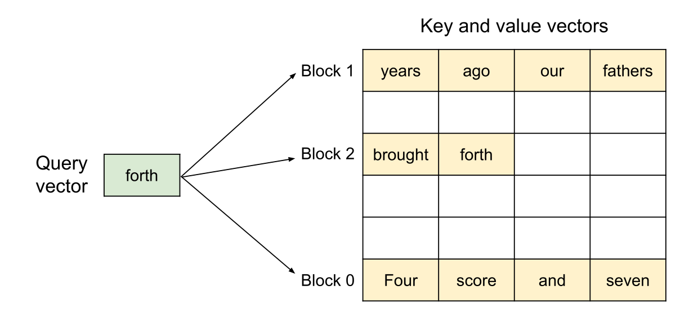

# 第 10 讲：推理系统

> CS336 Spring 2026，Lecture 10（Inference，Percy Liang）。按[官方课程表](https://cs336.stanford.edu/)及[官方可执行讲义 `lecture_10.py`](https://github.com/stanford-cs336/lectures/blob/main/lecture_10.py)的执行顺序整理。[B 站合集 P10](https://www.bilibili.com/video/BV11LEA6eEuj/?p=10)供配合观看；目前没有取得可逐句核对的视频字幕或可靠时间轴，因此下文的课堂归属以官方讲义为准，工程补充和推导会注明。讲义的数值是简化模型，不是服务压测结果。

[课程主页列出的原版录像播放列表](https://www.youtube.com/playlist?list=PLoROMvodv4rMqXOcazWaTUHhq-yembLCV)可用于观看。

本讲贯穿一个问题：自回归生成时，每条请求一次只多出一个 token，但图形处理器（GPU, Graphics Processing Unit）要反复读取模型权重和不断增长的历史状态。推理不只发生在聊天服务，还发生在评测、批量数据处理和强化学习采样中。一次训练的成本可摊到许多请求上，推理成本则随请求数和生成 token 数持续累积。

术语：KV 是 Key/Value（注意力的键／值），HBM 是 High Bandwidth Memory（高带宽显存），MLP/FFN 分别是 Multilayer Perceptron（多层感知机）／Feed-Forward Network（前馈网络），bf16 是 Brain Floating Point 16（16 位脑浮点格式），FLOPs 是 Floating Point Operations（浮点运算次数）。后文 MHA/GQA/MQA 分别是 Multi-Head/Grouped-Query/Multi-Query Attention（多头／分组查询／多查询注意力）；MLA 是 Multi-head Latent Attention（多头潜在注意力），CLA 是 Cross-Layer Attention（跨层注意力）；QAT/PTQ 是 Quantization-Aware Training / Post-Training Quantization（量化感知训练／训练后量化）。

## 1. 先定义“快”：工作负载和指标

**Prefill** 处理已知提示词，所有位置可在一次前向中并行计算，并为后续生成写入 KV cache。**Decode** 从当前上下文预测下一个 token，采样后才能进行下一步，因此单条序列的生成步骤具有顺序依赖。注意“可并行验证一段候选”不等于可以无条件并行采样整段输出。

在线服务至少分开看三个指标：首 token 时间 **TTFT**（Time to First Token），从请求到首个输出的墙钟时间；token 间延迟 **ITL/TBT**（Inter-Token Latency / Time Between Tokens），相邻输出 token 的间隔；**吞吐**，单位时间内服务的输出 token 数。端到端完成时间还受提示词长度、输出长度、排队、网络传输和流式发送影响。更大批次可能提高总吞吐，却让某条请求等得更久；优化一个指标时要带着另两个一起测。

**面试速述：** prefill 并行处理提示词，decode 则逐 token 依赖前一步输出，所以同一模型在两阶段的瓶颈不同。服务性能要同时看 TTFT、token 间延迟和吞吐；增大批次可能提高总吞吐，却拉长单请求等待。

## 2. 从矩阵乘看计算强度

令 $B$ 为同时处理的序列数，$S$ 为已在上下文中的 token 数，$T$ 为本次前向计算的查询 token 数，$D$ 为模型宽度，$F$ 为 FFN 中间宽度，$L$ 为层数，$N$ 为查询头数，$K$ 为 KV 头数，$H$ 为头维，通常 $D=NH$。讲义用 bf16，每元素 2 字节；把一次乘加算 2 FLOPs。计算强度 $I=\mathrm{FLOPs}/\mathrm{HBM\ bytes}$，单位 FLOPs/byte。若设备峰值计算率为 $P$、峰值显存带宽为 $M$，其 roofline 转折点是 $P/M$；低于该点时，理想情况下更可能被访存限制。实际峰值利用率、缓存命中和 kernel 效率会改变转折位置。

先看 $X\in\mathbb R^{B\times D}$ 与 $W\in\mathbb R^{D\times F}$ 的乘法。按“读输入、读权重、写输出各一次”的模型，FLOPs 为 $2BDF$，HBM 流量为 $2BD+2DF+2BF$ 字节，所以

$$I_{XW}=\frac{2BDF}{2BD+2DF+2BF}=\frac{BDF}{BD+DF+BF}\approx B\quad(B\ll D,F).$$

讲义用 H100 的约 $989$ TFLOPs/s 和 $3.35$ TB/s 得到转折点约 $295$ FLOPs/byte。这个“$B>295$ 才可能计算受限”的结论只适用于上述矩阵乘、峰值规格与简化流量；不是所有推理算子的通用批大小阈值。$B=1$ 时近似为矩阵向量乘，权重每读一个元素只参与很少运算。

**面试速述：** 计算强度是 FLOPs 与显存搬运字节之比；在权重读取占主导的简化矩阵乘里，它近似随 batch 行数增长。roofline 转折点只对应给定硬件、算子和流量假设，不能把某个批大小阈值推广到全部推理。

### Prefill 与 decode 的 MLP

门控 FFN 有 $W_{\mathrm{up}},W_{\mathrm{gate}}\in\mathbb R^{D\times F}$ 和 $W_{\mathrm{down}}\in\mathbb R^{F\times D}$。令输入为 $B\times T\times D$，只计三次矩阵乘，讲义得到

$$C_{\mathrm{MLP}}=6BTDF,\qquad Q_{\mathrm{MLP}}=4BTD+4BTF+6DF\ \text{字节},$$

$$I_{\mathrm{MLP}}=\frac{6BTDF}{4BTD+4BTF+6DF}\approx BT\quad(BT\ll D,F).$$

这里的流量显式计算中间张量写回，融合 kernel 可降低它；激活、归一化等额外开销未计入。Prefill 时 $T$ 可很长，权重一次加载服务许多 token，容易形成大矩阵乘。Decode 时 $T=1$，强度近似 $B$，只有足够多的并发请求才能摊薄每步权重读取。

**面试速述：** prefill 的 MLP 让一份权重服务多个 token，容易形成高计算强度的大矩阵乘；decode 每次只处理一个新 token，少量并发时更像反复读权重的矩阵向量乘。融合能减少中间张量流量，但并不改变单序列生成的顺序依赖。

### KV cache 与注意力

如果每次生成都把整个历史重新送入模型，旧 token 的 K、V 乃至全部中间计算会被反复重算。设生成长度为 $T$ 且上下文随之增长，纯注意力每次重算前缀的二次代价累计可达 $O(T^3)$。KV cache 在每层保存过去 token 的 K/V，新一步只计算新查询并读旧 KV；标准全注意力跨 $T$ 个新 token 的历史扫描仍累计为 $O(T^2)$，并非变成常数。KV cache 是用显存换掉重复计算。

对 **MHA**（$K=N$），讲义按 FlashAttention 式实现忽略 $S\times T$ 分数矩阵的 HBM 落盘，注意力的 $QK^\top$ 与 $AV$ 合计 $4BSTD$ FLOPs；读 $Q,K,V$ 和写输出为 $4BSD+4BTD$ 字节。因此

$$I_{\mathrm{attn,MHA}}=\frac{4BSTD}{4BSD+4BTD}=\frac{ST}{S+T}.$$

Prefill 取 $T=S$，得到 $S/2$；单 token decode 取 $T=1$，得到 $S/(S+1)<1$。批大小 $B$ 被约掉：每条序列的 KV 不同，增加并发不会像共享权重的 MLP 那样提高这一读 KV 算子的计算强度。若采用 GQA，K/V 的宽度改为 $KH$ 而计算仍按查询宽度 $D=NH$；在同一简化口径下流量变成 $4BSKH+4BTD$，所以降低 $K$ 确实能提高读 KV 时的强度。讲义“decode 注意力小于 1”的式子不能原封不动套到 GQA。

**面试速述：** KV cache 保存历史键值，避免每步重算旧 token，却需要随上下文增长的显存和读取带宽；标准全注意力生成期间的历史扫描仍非常数。MHA decode 的简化注意力强度小于 1 且不随并发 batch 提高，因为每条序列的 KV 私有；GQA 减少 KV 头后要重新计算流量。

## 3. 延迟、吞吐与容量的一笔账

讲义设词嵌入与输出头共 $2VD$ 个参数、门控 MLP 每层 $3DF$、注意力投影每层 $2DNH+2DKH$，于是

$$P_{\mathrm{params}}=2VD+L(3DF+2DNH+2DKH).$$

假设所有权重与 KV 都是 bf16，一条长度为 $S$ 的序列有

$$Q_{\mathrm{KV,seq}}=S\cdot K H\cdot L\cdot2\text{（K/V）}\cdot2\text{（字节）}=4SKHL\ \text{字节}.$$

批量 $B$ 的占用近似 $Q_{\mathrm{total}}=2P_{\mathrm{params}}+B Q_{\mathrm{KV,seq}}$。若每一步刚好把这些字节各搬一次，且达到显存峰值带宽 $M$，带宽给出的**时间下界**为 $t_{\mathrm{step}}\ge Q_{\mathrm{total}}/M$，对应理想吞吐上界 $R\le B M/Q_{\mathrm{total}}$。讲义代码直接用等号做理想估计，还假设计算与传输完全重叠、忽略其它开销。实际不能把这个时间当预测延迟：计算、采样、通信、调度、低带宽利用率、未计显存及缓存重用都会影响结果。

讲义的 Llama 2 13B 形状取 $S=1024,D=5120,F=13824,N=40,H=128,L=40,V=32000$，$M=3.35$ TB/s。下面数值按**十进制 GB**，由讲义公式重新计算，非压测数据：

| KV 头 $K$ | 批大小 $B$ | 参数量 | 每序列 KV | 权重＋KV 占用 | 理想每步时间下界 | 理想总吞吐上界 |
| ---: | ---: | ---: | ---: | ---: | ---: | ---: |
| 40 | 1 | 13.02B | 0.839 GB | 26.87 GB | 8.02 ms | 125 token/s |
| 40 | 64 | 13.02B | 0.839 GB | 79.72 GB | 23.80 ms | 2689 token/s |
| 40 | 256 | 13.02B | 0.839 GB | 240.78 GB | 71.87 ms | 3562 token/s |
| 8 | 64 | 11.34B | 0.168 GB | 33.41 GB | 9.97 ms | 6417 token/s |
| 8 | 256 | 11.34B | 0.168 GB | 65.63 GB | 19.59 ms | 13068 token/s |

$K=40,B=256$ 已超过讲义设定的 80 GB 显存，其他接近上限的配置也未给运行时、激活、碎片及系统留余量。改 $K$ 时不仅 KV 缩小，K/V 投影参数也改变；这相当于比较两种模型结构，而不是给同一现成模型切个服务参数。扩大 $B$ 摊薄权重读取，提高总吞吐，但每步要读更多 KV，单请求 token 间隔可能变长。多部署副本可提高系统总吞吐而保持单副本的理想延迟，但代价是多份权重和设备；模型或 KV 跨卡切分还要核算通信。

**面试速述：** 显存需求可粗估为权重字节加 $B$ 倍每请求 KV 字节；只有假设每步都搬运这些字节并达到设定带宽时，搬运量除以带宽才给出理想的单步访存时间下界。增大 batch 可摊薄每请求的权重读取，却增加 KV 占用；吞吐和尾延迟仍须实测。

## 4. 有损捷径之一：减少历史状态

**GQA** 在 $N$ 个查询头之间只用 $K$ 个 KV 头，每组 $N/K$ 个查询头共享一组 K/V。$K=N$ 是 MHA，$K=1$ 是 MQA，介于其间是 GQA。缓存字节和读 KV 字节相对 MHA 约按 $K/N$ 缩小；例如 $N=40,K=8$，缓存为原来的五分之一。质量取决于训练或权重转换后的实验，不能只凭比例推断。讲义引用 [GQA 论文](https://arxiv.org/abs/2305.13245)比较速度和质量。

**MLA** 将每个 token 的 K/V 信息压成维度为 $C$ 的潜变量 $c$ 存入缓存，需要时由投影参与注意力计算；关键是推理实现可以吸收部分投影，避免朴素地把完整 K/V 对每次查询都写回缓存。讲义以 DeepSeek V2 为例：普通头维总数 $NH=16384$，潜变量 $C=512$，再加处理 RoPE 的 64 维，缓存约为每 token 576 维的相关状态。这里是特定架构设计，位置编码不能简单套在压缩潜变量上；不能把 $16384/576$ 当作完整端到端加速倍数。讲义引用的 [DeepSeek V2 技术报告](https://arxiv.org/abs/2405.04434)还给出质量对比，比较结论受任务、训练预算及实现约束。

**CLA（cross-layer attention）** 沿层共享部分 K/V：GQA 沿头共享，CLA 沿层共享。若共享范围更大，存储的独立 KV 状态更少，但层间表达能力和依赖关系发生变化，需要用质量与延迟一起评估。参见讲义所引的 [CLA 论文](https://arxiv.org/abs/2405.12981)。

**局部／滑动窗口注意力** 只留最近 $W$ 个 token 的 KV，单个纯局部层的缓存随总上下文长度不再增长，而是 $O(W)$；代价是单层不能直接看远处。多层传播会扩大有效感受野，但不保证能可靠取回任意远处细节。因此可把局部层与全局层交错成混合注意力：局部层省 KV，全局层保留远程访问能力；只要有全局层，总缓存仍会随上下文增长。讲义接着展示 DeepSeek V4 的压缩稀疏注意力（CSA）、选择 top-$k$ 的 DSA、进一步压缩的 HCA，核心也是减少需保留或读取的历史信息，同时验证长上下文质量。线性注意力、状态空间模型则是更换状态表示的另一条路线。

**面试速述：** GQA 沿头、CLA 沿层共享 KV，MLA 压缩每 token 的缓存表示，局部或稀疏注意力减少可见历史；共同目标是降低 KV 容量或读量。它们改变模型表示或注意力范围，需复测质量，缓存缩小比例也不能直接当端到端加速倍数。

## 5. 有损捷径之二：量化与剪枝

量化把数值映射到更少比特。仿射整数示例为

$$z_q=\operatorname{clip}\bigl(\operatorname{round}(x/s)+z_0,q_{\min},q_{\max}\bigr),\qquad \hat x=s(z_q-z_0),$$

其中 $s$ 是 scale、$z_0$ 是 zero point，实际实现还需明确舍入、截断、分组和异常值处理。按讲义例子 $x=5.2342,s=0.1,z_0=4$，得到 $z_q=56,\hat x=5.2$。bf16 每元素 2 字节；8 位约 1 字节，4 位约 0.5 字节（未算 scale 等元数据）。减半权重或 KV 字节不等于延迟必定减半：反量化、混合精度 kernel、带宽瓶颈位置和硬件支持都重要。

**QAT** 在训练前向中模拟量化误差，让权重适应低精度，但需要训练成本。**PTQ** 在训练后用校准数据确定量化参数；GPTQ 用近似二阶信息补偿权重量化误差，[AWQ](https://arxiv.org/abs/2306.00978)根据激活识别敏感权重通道并保护它们。权重、激活、KV 可以分别量化，精度风险也不一样；评估应覆盖长上下文、罕见 token 和目标任务，而非只测短文本平均分。讲义列的 fp8、int8、int4 是不同数值格式，整数方案通常需要显式 scale。

**剪枝** 删掉不重要的层、头或隐藏维，再用蒸馏修复质量。讲义所引 [NVIDIA 剪枝与蒸馏研究](https://arxiv.org/abs/2407.14679)用小校准集估计重要性，删结构后从原模型蒸馏。结构化剪枝能直接缩小矩阵及模型深度；非结构化稀疏若没有合适 kernel，参数数变少也未必更快。两种路线都要复测模型质量，特别是不同任务上的尾部退化。

**面试速述：** 量化用更少比特存权重、激活或 KV，剪枝删除部分模型结构，能降低容量或访存，但都可能损害质量。实际加速取决于反量化、kernel 和硬件；非结构化稀疏若缺少合适实现，参数变少也不一定更快。

## 6. 无损捷径：投机采样

Prefill 能一次并行检查一段已知 token，而普通 decode 逐个产生 token。投机采样让便宜的草稿模型 $p$ 先提出若干候选，再由目标模型 $q$ 一次前向计算对应位置的条件分布。对候选 $y\sim p$，以

$$a(y)=\min\left(1,\frac{q(y)}{p(y)}\right)$$

的概率接受；首次拒绝时，从残差分布 $r(x)\propto\max(q(x)-p(x),0)$ 补采样。若一批候选全接受，还需从目标模型的下一位置分布多采一个 token。严格按这一修正采样，并保证两模型使用相同的条件上下文，最终分布与逐 token 从 $q$ 采样相同；随意使用“目标模型认为概率够高就接受”的阈值规则不具有这个保证。详见讲义所引[投机采样论文](https://arxiv.org/abs/2211.17192)。

用二元词表检查：若 $p(A)>q(A)$，草稿过度提出 $A$，其接受率为 $q(A)/p(A)$；被拒绝的概率质量转给 $B$。于是最终 $A$ 的概率恰为 $p(A)q(A)/p(A)=q(A)$，最终 $B$ 也恰为 $q(B)$。实际收益取决于草稿提出 token 的成本、接受长度、目标模型并行验证效率和服务批次；草稿越接近目标通常越有利，但过大的草稿本身会变慢。讲义还列 Medusa 的多头候选与 EAGLE 利用目标模型高层特征的路线。

**面试速述：** 投机采样用便宜草稿提出多个 token，让目标模型并行验证，并用接受概率及残差补采保持目标采样分布不变。收益取决于草稿成本、接受长度和验证效率；随意改成概率阈值接受就失去无损保证。

## 7. 动态请求：连续批处理与选择性批处理

真实请求到达时间不同、提示词和输出长度不同，且可能共享前缀。固定批处理若等整批全部完成才纳入新请求，会让早到或短请求闲等。**连续批处理**按解码迭代调度：每步让已完成请求退出，容许新请求加入，动态维护活跃批次。它解决的是调度粒度；是否把新的长 prefill 和正在运行的 decode 混排，还要看 token 预算和 TTFT／ITL 目标。讲义引 [Orca 系统论文](https://www.usenix.org/system/files/osdi22-yu.pdf)。

**选择性批处理**针对变长张量：注意力需要每条请求自己的长度与 KV，按序列处理或用变长 attention kernel；非注意力的线性层、MLP 可把各序列本轮待处理的 token 拼成一个紧密的二维矩阵再批量执行。例如一次处理长度分别为 3、9、5 的三个片段，非注意力部分可拼为 $17\times H$，而注意力仍必须维持三条各自的因果边界；若三条都只解码一个新 token，则拼接形状是 $3\times H$。这样减少 padding 浪费，也让共享权重矩阵乘有更多行。

**面试速述：** 连续批处理按 decode 迭代让完成的请求退出、新请求进入；选择性批处理把非注意力 token 拼成紧密矩阵，同时保留各序列独立的注意力边界。前者减少批次空转和请求等待，后者减少 padding 浪费；prefill 与 decode 混排仍需按 TTFT 和 ITL 权衡。

## 8. PagedAttention：给 KV cache 分页

图：Stanford CS336 Spring 2026 [Lecture 10 官方可执行讲义原图](https://github.com/stanford-cs336/lectures/blob/main/images/paged-attention-blocks.png)；课件引用 vLLM/PagedAttention 论文，图示逻辑块映射到可不连续的物理显存块。

若请求开始就为最大可能生成长度预留连续 KV 空间，实际提前结束会造成块内闲置；动态请求的申请和释放还会留下难以重用的空洞。**PagedAttention**把每条序列的逻辑 KV 切成固定大小块，块表把逻辑块号映射到不必连续的物理显存块。新增 token 只需按需分配块，释放请求时回收块；通常最后一个块仍有少量内部浪费。注意力 kernel 按块表读取相应 KV，不能误读别的请求的缓存。参见讲义所引 [vLLM/PagedAttention 论文](https://arxiv.org/abs/2309.06180)。

多条请求有同一系统提示或对同一提示采样多条回答时，可让它们只读共享前缀 KV 块；分叉处采用**写时复制**，保证各自后续生成不会相互覆盖。分页是显存分配与地址映射办法，本身不改变模型数学输出，也不直接减少每个有效历史 token 所需的注意力乘法；收益来自提高缓存利用率、可容纳更多并发和复用前缀。它与连续批处理配合，才能把释放和加入请求的能力充分用在动态服务上。讲义还点到融合块读取与注意力、较新 attention kernel、CUDA graphs 等其它实现优化。

**面试速述：** PagedAttention 用块表把逻辑 KV 映射到不连续的物理块，按需分配、释放和共享前缀，从而减轻碎片并提高可服务并发。分页本身不减少单请求全注意力的配对量；共享前缀可避免重复 prefill，收益仍须结合动态调度评估。

## 9. 上线时如何测出真实收益

对同一模型、同一硬件、同一采样配置，分别扫提示词长度、目标输出长度与到达率，报告 TTFT、ITL、请求完成时间的中位数及尾分位数、输出 token/s、请求/s、GPU 显存峰值和失败／排队比例。Prefill 压力会影响 TTFT，长上下文主要放大 KV 容量和读带宽压力，高到达率会推动批大小与排队时间同时变化。前缀缓存命中率、投机接受长度、每步活跃序列数、KV 块利用率能解释优化为何有效或失效。把“每步理论时间下界”与“端到端请求延迟”分开报告，才能避免误把容量优化说成每个请求都会加速。

**面试速述：** 真实服务收益要在同一模型、硬件和采样配置下扫提示长度、输出长度与到达率，同时报告 TTFT、ITL、吞吐、尾延迟、显存和失败率。理论每步带宽下界不能代替端到端压测，缓存命中与批大小等内部指标可解释收益来源。

## 10. 自测

1. 为什么 prefill 与 decode 即使用同一个 Transformer，也会落在 roofline 的不同位置？**答**：prefill 的 $BT$ 较大，同一权重服务许多 token；decode 的 $T=1$，少量并发时权重复用少，而且每步要读私有 KV。
2. $L=40,K=8,H=128,S=1024$、bf16 KV，每请求缓存是多少？**答**：$4SKHL=167{,}772{,}160$ 字节，约 0.168 GB 或 160 MiB。
3. MHA 注意力的简化计算强度为何不因 $B$ 增大而提高？**答**：FLOPs 和私有 KV 读流量都按 $B$ 增长，式中约掉；共享权重的 MLP 不同。
4. 把 40 个 KV 头改成 8 个，能说端到端速度提高五倍吗？**答**：不能。五倍只对应同头维同精度的 KV 状态比例，投影权重、MLP、调度、算力和 kernel 仍需计入。
5. 投机采样首次拒绝后为什么从 $(q-p)_+$ 补采？**答**：已接受的候选覆盖了 $\min(p,q)$ 的质量，剩下的目标概率质量必须由正残差补齐，才能保持目标分布。
6. PagedAttention 能否让全注意力的长上下文计算变成 $O(1)$？**答**：不能；它改善 KV 的分配、碎片和共享，仍需按有效历史读 KV 并计算注意力，除非模型另行采用窗口、压缩或稀疏注意力。

本讲的复习顺序是：先用 FLOPs/字节判断瓶颈，再算权重与 KV 容量，随后区分“改变模型表示”的有损方法、“保留目标分布”的投机采样，以及“管理动态请求和显存”的服务系统方法。所有收益最终仍要回到质量、TTFT、ITL、吞吐与容量的共同实测。

**本节小结：** 自测把 roofline、KV 记账、投机采样分布修正和分页缓存的作用边界串起来，检验能否区分计算、容量与调度优化。
