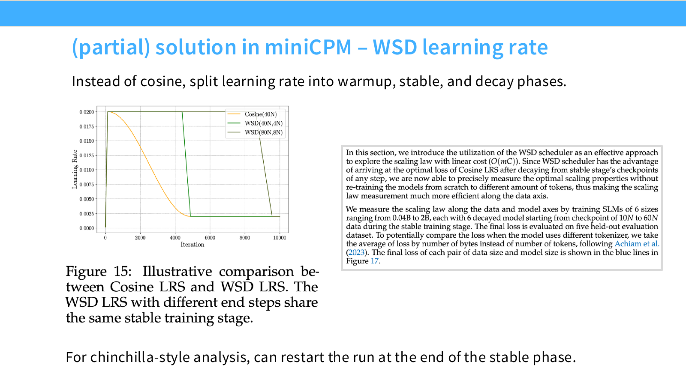

# 第 11 讲：Scaling Laws 实践——案例、超参数与 μP

> CS336 Spring 2026，Lecture 11，Tatsunori Hashimoto，2026 年 5 月 4 日。本文按官方 58 页讲义的叙述顺序整理；页码指 PDF 页码。核心问题是：小规模实验怎样可靠地指导大模型的模型/数据配比、学习率、批量大小和参数化？

[课程主页列出的原版录像播放列表](https://www.youtube.com/playlist?list=PLoROMvodv4rMqXOcazWaTUHhq-yembLCV)可用于观看；另以经校验的第三方归档录像、英文字幕及画面抽样核对下文标明的课堂图表，但未人工逐帧观看或逐句听写。

术语：μP 是 Maximum Update Parametrization（最大更新参数化）；WSD 是 Warmup-Stable-Decay（升温—稳定—衰减学习率日程）；FLOPs 是 Floating Point Operations（浮点运算次数）。后文 MoE、SGD、RMSNorm 分别是 Mixture of Experts（混合专家）、Stochastic Gradient Descent（随机梯度下降）、Root Mean Square Normalization（均方根归一化）。

## 1. 为什么“缩放定律”落地时更难

上一讲的 Chinchilla 式问题是：给定训练计算量，在模型参数量 $N$ 与训练 token 数 $D$ 之间怎样分配，才能把验证损失降到最低？实践中还必须决定宽度、深度、词表/嵌入、优化器、学习率 $\eta$、全局 batch $B$ 和学习率日程。这些选择可能随规模变化；小模型上领先的方案未必在大模型上领先。讲义据此考察公开、细节相对充分的 MiniCPM 与 DeepSeek，再看较新的经验研究、优化器和 μP（第 2–5 页）。

先固定记号：$N$ 是模型参数量，$D$ 是训练 token 数，$C$ 是训练 FLOPs，$B$ 若无说明指每次参数更新处理的 token 数，$L$ 是在同一评测分布上的损失。对稠密 Transformer，常用粗近似 $C\approx 6ND$；它忽略注意力、嵌入、实现等差别。DeepSeek 图中也用每 token FLOPs $M$，于是 $C=MD$。跨论文比较比例和拟合系数前，务必先核对它们的 $N$ 是总参数还是非嵌入参数、$B$ 的单位、$L$ 是何种 token 化下的指标、$C$ 是否采用同一估算。

一个便于贯穿全讲的损失面是

$$
L(N,D)=L_\infty+A N^{-\alpha}+B_D D^{-\beta},\qquad C\approx kND.
$$

这里用 $B_D$ 表示数据项系数，避免与 batch $B$ 混淆；$A,B_D,\alpha,\beta>0$，$k$ 是每参数、每 token 的近似计算系数。这个函数是经验拟合假设，不是对所有模型、数据和训练日程都成立的定理。固定 $C$ 后代入 $D=C/(kN)$，对 $N$ 求导，得到

$$
N_*(C)=\left(\frac{\alpha A}{\beta B_D}\right)^{1/(\alpha+\beta)}
\left(\frac{C}{k}\right)^{\beta/(\alpha+\beta)},\qquad
D_*(C)=\frac{C}{kN_*(C)}\propto C^{\alpha/(\alpha+\beta)}.
$$

因此 $D_*/N_*\propto C^{(\alpha-\beta)/(\alpha+\beta)}$。只有两指数相等且这些假设保持有效时，最优数据/参数比才与计算量无关；一个案例的“某个比例”不能直接当成通用常数。

**面试速述：** 实践中的 scaling law 不只选参数量与 token 数，还要处理学习率、batch、参数化和训练日程随规模改变的问题。联合损失面可在固定 FLOPs 下导出最优配比，但指数和比例只对同一数据、参数及计算口径的拟合范围有效。

## 2. MiniCPM：用 μP 和 WSD 降低小规模外推成本

**面试速述：** MiniCPM 先用 μP 风格规则改善跨宽度超参迁移，再用 WSD 共享训练主干，低成本收集多个数据预算的近似终点。两者都减少搜索成本，最终规模仍要验证学习率与损失外推。

### 2.1 先使宽度缩放可控

MiniCPM 是 2024 年的高性能小模型案例，讲义关注其详细的缩放实验，而不是用它代表当下最高性能（第 6–9 页）。作者先采用 μP（Maximal Update Parameterization，最大更新参数化）风格规则，使不同宽度下的激活与更新尺度接近，再固定模型形状比例、整体放大。课堂约 05:25 的配方表令宽度比 $r=d_m/d_{\mathrm{base}}$（目标模型宽度除以基准宽度），列出的 **MiniCPM 实现**是：

| 项目 | 课堂给出的缩放 |
| --- | --- |
| 二维矩阵参数的初始化标准差 | `init_std / √r`，其中基准 `init_std=0.1` |
| 二维矩阵参数的学习率 | 基准学习率 `0.01` 再乘 `1/r` |
| 语言模型输出头（LM head）的 logits | 乘 `1/r` |
| token embedding 输出 | 乘 `scale_emb=12` |
| 每层残差增量 | 乘 `scale_depth/√层数`，其中 `scale_depth=1.4` |

表中还将非二维参数的初始化值列为 `0.1`。这些方向和指数有助于复现课件示例，但属于 MiniCPM 的架构配方，**不是所有 μP 实现的通则**；更不能把这里的二维矩阵规则直接套到任意优化器。表中数字应与[第 11 讲官方讲义](https://github.com/stanford-cs336/lectures/blob/main/lecture_11.pdf)及[MiniCPM 原论文](https://arxiv.org/abs/2404.06395)配套使用。

图中小模型到最终模型仍有约五倍规模差距，因此“稳定”指可用小规模搜索给出较好的外推起点，不等于无需目标规模验证。MiniCPM 的学习率扫描显示，在所比较的宽度范围内，损失最低附近的学习率迁移较平稳（第 10 页）；这支持配方的实际用途，却不是任意架构、优化器下的理论保证。

**面试速述：** MiniCPM 的 μP 风格配方按宽度与层数调整初始化、残差和学习率，使小模型的较优超参更可能迁移到大模型。文中的具体缩放常数属于该架构；小到大仍有规模差距，必须做目标规模复核。

### 2.2 Batch 不必保持常数

讲义第 11 页对 9M、30M、170M 三种模型，分别画出 batch、已处理数据量与损失的关系：同一 batch 下沿训练进度形成一列点；固定数据量，在横向比较候选 batch 的最低损失，得到该模型/数据量处的经验最优 batch。第 12 页再把最优 batch 对最终损失作图：损失降低时，最优 batch 总体上增大，并可用幂型关系近似。这里的“最优”由所选模型、训练预算、学习率扫描和损失定义共同决定；不能理解成任意大 batch 都更好。

**面试速述：** MiniCPM 在多个模型和训练进度上扫描 batch，发现经验最优 batch 随目标损失降低总体增大。这里的最优依赖模型、日程及预算，不能理解为 batch 越大越好或固定一个值全程适用。

### 2.3 WSD 让一条训练主干提供多个近似终点

图：Stanford CS336 Spring 2026 [Lecture 11 官方 PDF 第 14 页](https://github.com/stanford-cs336/lectures/blob/main/lecture_11.pdf#page=14)，原图为 MiniCPM 论文 Figure 15。不同终点的 WSD 曲线共用 stable 段，再从各自 checkpoint 进入 decay；图上是学习率曲线，并非验证损失曲线。

第 14 页原图旁的论文摘录还给出这条曲线背后的实验网格：6 种规模约从 0.04B 到 2B，每种模型在 stable 主干上取约 $10N$ 到 $60N$ token 的 6 个 checkpoint，分别做末段 decay；最终损失在 5 份留出评测数据上计算。为降低不同 tokenizer 的 token 粒度差异，作者按**字节数**而非 token 数平均损失。因而图上的共享主干只是节省采样成本的日程示意，真正用于拟合的是每个已完成 decay、采用同一评测口径的终点；与其他论文的每 token loss 比较前还要对齐单位。

若每个候选 $N,D$ 都从头训练到终点并独立衰减学习率，拟合二维损失面会很贵。MiniCPM 用 WSD：warmup（升温）→ stable（高且近似恒定的学习率）→ decay（末段衰减）（第 13–15 页）。在 stable 阶段保存多个 checkpoint；针对不同目标 token 预算，从各 checkpoint 分支运行短暂 decay。讲义的图示中，末段 decay 约占相应训练过程的 10%。这让不同 $D$ 的最终损失共享前面的训练主干，减少重复计算。

理解 WSD 的关键是：stable 阶段的即时损失可能高于余弦衰减日程，但末段降学习率能迅速降低损失；比较模型/数据配比时，要比较经过相应末段 decay 后的损失，而不能把任意 stable checkpoint 直接当成完整训练终点。共享主干也意味着这些样本并非独立“从零训练”，所以 WSD 只是在该实验条件下提供近似且便宜的拟合样本；换数据或日程要重新验证。

**面试速述：** WSD 先 warmup、保持 stable，再从不同 checkpoint 分叉做末段 decay，让多个 token 预算共享前期计算。比较最终损失必须对各分支完成相应 decay，stable checkpoint 不能直接与已衰减终点比，且共享主干结果只是特定配方下的近似样本。

### 2.4 两种 Chinchilla 分析及比例的边界

MiniCPM 同时展示方法 1：取不同计算预算下的较低损失包络，再拟合最佳 $N,D$ 轨迹；和方法 3：对所有观测点联合拟合 $L(N,D)$ 形式（第 16–18 页）。方法 1 的不同颜色表示不同模型，曲线有相对连续的趋势，但讲义也提醒“是否严格线性”存疑。方法 3 的拟合给出较高的最佳数据/模型比；图中标出在一个特定计算点 $C=10^{21}$ 的 $D_*/N_*\approx95.60$。这属于所用数据、非嵌入参数定义与拟合范围下的结果。它说明“训练 token 数远超传统 20 倍参数量”的方案在这个案例中可能有利，不表示所有模型都应固定用 96:1。

**面试速述：** MiniCPM 用训练曲线较低损失包络和联合损失面两种方式估计最优模型/数据轨迹。其约 96:1 的数据/非嵌入参数比只在指定计算点和拟合条件下成立，不能当通用 Chinchilla 常数。

## 3. DeepSeek：直接拟合学习率、batch 与 IsoFLOP 曲线

DeepSeek LLM 的公开案例覆盖 7B 和 67B（第 19–24 页）。它采用另一条路径：先假定大多数 Transformer 架构超参数在规模间相对稳定，不先引入 μP；在小规模上对学习率与 batch 网格搜索，然后拟合其缩放趋势（第 20–21 页）。热力图上最低损失区域较宽，表示某些近优超参数组合并不唯一。讲义引用论文的做法是收集距最优损失约 0.25% 范围内的组合进行拟合，得到特定 FLOPs 单位下的经验式：

$$
\eta_*(C)=0.3118\,C^{-0.1250},\qquad B_*(C)=0.2920\,C^{0.3271}.
$$

这两个系数有单位依赖：图中的横轴是非嵌入参数的训练 FLOPs，不能把 $C$ 换成“PFLOP-day”后仍原样代入；$B$ 是以 token 数计的全局 batch。图中 batch 随规模的趋势比学习率更整齐；讲师特别指出学习率拟合“有点可疑”，因为观测值离散、近优区宽、外推距离大。正确用法是把拟合当作目标规模试验的中心点，保留附近扫描，而不是机械照搬一个小数。

DeepSeek 为模型/数据配比实验使用 WSD 风格的多段日程（第 22 页）：先快速 warmup 约 2000 步；处理完约 80% token 时，学习率降到峰值的 31.6%；约 90% 时降到峰值的 10%。这里的“10% + 10%”是后两段所占训练 token 比例，不是连续两次都把学习率减去 10%。图示表明这类日程在该实验中与余弦日程表现接近，适合取得可比的不同预算终点。

随后用方法 2（IsoFLOP）：对每个固定计算预算 $C$，训练多种每 token 模型计算量 $M$ 的方案；在相同 $C=MD$ 上，找验证损失最低的 $M$，再拟合 $M_*(C)$ 与 $D_*(C)$（第 23 页）。左图的每条 U 形曲线体现取舍：模型过小会欠容量，模型过大则在同样 FLOPs 下处理 token 不足。第 24 页用较小规模点拟合的性能曲线预测 7B、67B 的验证 bits-per-byte，两颗大模型点大体落在曲线附近。这是对该数据与指标的外推检验；不能自动保证下游任务、不同数据分布或不同训练配方也精确可预测。

**面试速述：** DeepSeek 在小规模网格搜索学习率与 token batch，拟合其随训练 FLOPs 的变化，再以 IsoFLOP 曲线找各预算下的模型/数据折中。拟合系数受单位和非嵌入参数口径约束，尤其学习率近优区较宽，应把预测当目标规模附近的扫描中心，并用留出大模型检验。

## 4. 其他公开案例提示了哪些维度

讲义第 25–30 页简要扫过几种方向，提供的是方法版图，不是可直接复刻的完整配方：Qwen 2.5/3 报告学习率、batch 的缩放；Kimi K2 用稀疏度缩放研究 MoE；Hunyuan 对 MoE 活跃参数量做 IsoFLOP 分析，课件给出约 96:1 的数据/活跃参数比；LLaMA 3 的 IsoFLOP 分析显示约 39:1，并讨论训练计算与下游表现。MiniMax-01 的三联图把 Softmax Attention、Lightning Attention 和 Hybrid-lightning 三种架构放在不同计算预算下，分别比较验证损失、经验最优模型大小和经验最优 token 数；它说明**架构选择会改变缩放研究的对象和拟合结果**，并不证明某架构普遍更优。（课堂约 27:33）尤其是 MoE，必须区分总参数量与每 token 激活参数量，不能把“活跃参数比”与稠密模型的总参数比直接比较。

讲义把主要路线概括为两类。MiniCPM 先让参数化与学习率尽量可迁移，再用共享主干的 WSD 为联合拟合提供样本；DeepSeek 直接用网格实验估计 batch/学习率的变化，再做 IsoFLOP 选模型大小。两者都依赖小规模实验，也都需要在目标规模附近检查外推误差。

**面试速述：** 公开案例把学习率、batch、MoE 稀疏度、架构和活跃参数都纳入缩放研究，说明没有单一维度能覆盖所有设计。跨案例的比例必须先对齐数据、总参数或活跃参数、计算预算与损失指标，不能直接比较数字大小。

## 5. 经验超参数研究：先看损失地形，再选拟合变量

StepFun 的研究把问题明确成：最优学习率与 batch 应写成损失、$N$、$D$、$C$ 中哪些变量的函数（第 31–37 页）？已有路线并不一致：临界 batch 可按当前损失建模，DeepSeek 按计算量 $C$ 拟合，有些公式显式使用 $N,D$。如果把 $N,D$ 同时随计算预算变化，单看 $C$ 很容易把二者的作用混在一起。

StepFun 用多种规模和数据量在学习率 × batch 网格训练，画验证损失的二维等高线。讲义展示的局部损失面大致有清晰谷底，沿固定学习率或固定 batch 的截线近似 U 形，因此“经验最优点”可以被搜索出来（第 34–35 页）。这只描述观测区间内的损失地形，不保证全局凸性或超出搜索区间后仍如此。

在联合放大 $N,D$ 的实验中，最优 batch 主要随数据量 $D$ 增长；论文展示的一个经验式为 $B_*\approx0.58D^{0.571}$，学习率则有 $\eta_*\approx1.79N^{-0.713}D^{0.307}$（第 33、36 页，系数依原实验单位而定）。固定 $N$ 增加 $D$ 时“最优学习率上升”的趋势，讲师特别提醒可能依赖学习率日程；若改用 WSD，结论可能改变。第 37 页再展示在 MoE 稀疏度变化与不同数据集上的测试，提示拟合公式必须跨这些维度接受检验，不能凭单一预训练语料上的低误差就称为普适定律。

**面试速述：** 超参数可拟合成计算量或分别依赖模型大小与训练数据量的函数；若 $N,D$ 同时变化，只用 $C$ 容易混淆二者作用。StepFun 的学习率和 batch 关系来自观测范围内的损失谷底，日程或数据一变就要重新验证，不代表全局定律。

## 6. 优化器与规模：Muon 为什么值得试，也为什么要谨慎

**面试速述：** 比较 Muon 等新优化器时，必须各自调学习率和正则，并在多个模型与 token/参数比上比较。Muon 的正交化更新可能改变训练效率，但小规模加速比例和漂亮的低预算拟合都不足以保证大规模稳定或同等收益。

### 6.1 公平比较先分别调参

讲义第 38–41 页指出两个常见混杂因素。第一，不同优化器需要不同学习率和 weight decay；例如展示的实验中，为 AdamW 改学习率可带来明显训练速度变化，Lion 的最佳 weight decay 与 AdamW 也不同。只用一个优化器精调、其他优化器套同样超参数，会把调参差异误判成算法差异。第二，相对 AdamW 的收益会随模型尺寸、训练 token/参数比变化。课件的 130M→1.2B 图中，Muon/Soap 相对加速没有保持一个固定百分比。比较时应固定计算口径与验证集，并在多个规模和数据/模型比上重调超参数。

第 41 页还有反例：小预算的 IsoFLOP 拟合看起来规律良好，留出的更大规模点却偏离，最高规模训练甚至发散。后续更仔细的参数化、缩放和优化器调整才修复。实用启示是为外推留出中等规模验证点，监测训练稳定性与梯度/更新尺度；不能仅凭低计算区的漂亮拟合线批准巨额训练。

**面试速述：** 优化器对比若只为 AdamW 精调，会把调参差异误判成算法差异；相对收益也可能随模型和训练深度改变。应统一验证与计算口径，留出更大规模检查外推和发散，而不是按小模型百分比估算大训练成本。

### 6.2 Muon 的核心更新

Muon 面向矩阵形参数。课件给出的简化算法是先累计动量

$$
G_t=\nabla_\theta\mathcal L_t(\theta_{t-1}),\quad
R_t=\mu R_{t-1}+G_t,\quad
O_t\approx\operatorname{orthogonalize}(R_t),\quad
\theta_t=\theta_{t-1}-\eta O_t.
$$

若 $R_t=U\Sigma V^\top$，理想化的正交化取极分解因子 $UV^\top$；实现用若干次 Newton–Schulz 迭代近似，避免逐步完整 SVD（第 42 页）。对非方阵，$UV^\top$ 只有适当的行或列正交性质；并非“把权重矩阵本身变成正交矩阵”。它改变的是更新方向的奇异值谱，因此其学习率与 AdamW 不可直接等值比较。

第 43 页依次给出小型 NanoGPT speedrun、跨尺寸优化器比较和 Kimi K2 的训练证据：Muon 能在较大训练中工作，但增益大小受规模、计算口径和调参影响。小规模 wall-clock 曲线不能直接换算成大规模端到端节省。

**面试速述：** Muon 对矩阵梯度先做动量，再近似取极分解的正交因子来更新权重，改变的是更新方向的奇异值谱。非方阵只具有相应的行或列正交性质，学习率也不能与 AdamW 数值直接对齐，收益须按规模实测。

## 7. μP 深入：控制初始化激活与一次更新的尺度

**面试速述：** μP 希望网络加宽后初始化激活和单次参数更新仍保持合适尺度，从而提升小模型调参向大模型迁移的可靠性。讲义用深线性网络推导直觉，真实 Transformer 要对不同层和优化器分别设规则并验证。

### 7.1 要求与范围

μP（Maximum Update Parametrization）的目标，是放大网络宽度时保持合适的激活和参数更新尺度，从而提高超参数迁移性。讲义先提 CerebrasGPT 在 0.1B–13B、按 Chinchilla 配比训练时，μP 参数化使缩放更稳定（第 44–45 页）；然后用一个“baby μP”深线性网络演示推导。完整 Transformer 的 embedding、attention、MLP、输出层各有不同缩放规则，不能直接把以下单层公式一刀切地施加到所有张量（第 51 页）。

设第 $l$ 层宽度为 $n_l$，$h_l=W_lh_{l-1}$。两条设计要求是：A1，初始化时单个激活坐标保持 $\Theta(1)$；A2，一次梯度更新后，单个激活坐标的变化保持 $\Theta(1)$。若坐标尺度相近，则相应向量的二范数是 $\Theta(\sqrt{n_l})$。这里的 $\Theta$ 是宽度变化时的阶数，而不是说每一坐标恰好相等或训练全过程都不变（第 46 页）。

**面试速述：** baby μP 的 A1 要求初始化时单坐标激活为常数量级，A2 要求一次更新造成的单坐标变化也如此。它们约束的是随宽度变化的尺度，而非每个坐标相等或整个训练过程都固定。

### 7.2 A1：初始化标准差的一个保守选择

假设 $W_l\in\mathbb R^{n_l\times n_{l-1}}$ 的元素独立、零均值、方差 $\sigma_l^2$。高斯随机矩阵的谱范数典型量级是

$$
\|W_l\|_2\approx\sigma_l(\sqrt{n_{l-1}}+\sqrt{n_l}).
$$

若输入范数为 $\Theta(\sqrt{n_{l-1}})$，要求最坏方向的输出不超过 $\Theta(\sqrt{n_l})$，可取

$$
\sigma_l\asymp
\frac{\sqrt{n_l/n_{l-1}}}{\sqrt{n_{l-1}}+\sqrt{n_l}}
=\Theta\!\left[\frac{1}{\sqrt{n_{l-1}}}
\min\!\left(1,\sqrt{\frac{n_l}{n_{l-1}}}\right)\right].
$$

例如等宽层 $n_l=n_{l-1}=n$ 时是 $\Theta(n^{-1/2})$；很窄的输出层 $n_l\ll n_{l-1}$ 时则是 $\Theta(\sqrt{n_l}/n_{l-1})$。注意 $\|W_lh_{l-1}\|\le\|W_l\|_2\|h_{l-1}\|$ 是上界，课件也明确说这是偏“最坏情况”的推导。仅靠谱范数等式不能证明输出范数严格等于 $\Theta(\sqrt{n_l})$；对独立、各向同性的输入，标准 fan-in 初始化甚至可以用另一种平均意义的推导维持输出方差。这一页给的是便于理解 μP 设计目标的尺度直觉。

**面试速述：** A1 可用随机矩阵谱范数给初始化标准差一个保守尺度，使最坏方向的输出不至于随宽度失控。这个论证给上界，不证明输出范数恰好等于目标阶数；对各向同性输入也可从平均方差另行推导。

### 7.3 A2：一次 SGD 更新怎样决定学习率尺度

考虑单样本、单层、SGD 的简化情形。令 $g_l=\nabla_{h_l}\ell$，则

$$
\nabla_{W_l}\ell=g_l h_{l-1}^\top,\qquad
\Delta W_l=-\eta_lg_l h_{l-1}^\top.
$$

这是一阶外积矩阵，故对同一个 $h_{l-1}$，$\|\Delta W_lh_{l-1}\|_2=\|\Delta W_l\|_2\|h_{l-1}\|_2$。更新前后两层都变化时，展开有

$$
\Delta h_l=W_l\Delta h_{l-1}+\Delta W_lh_{l-1}
+\Delta W_l\Delta h_{l-1}.
$$

在前层更新已满足 A2、主导项没有异常抵消且交叉项不失控的假设下，要让当前层的更新范数为 $\Theta(\sqrt{n_l})$，需

$$
\|\Delta W_l\|_2\sqrt{n_{l-1}}
=\Theta(\sqrt{n_l}),\qquad
\|\Delta W_l\|_2=\Theta\!\left(\sqrt{\frac{n_l}{n_{l-1}}}\right).
$$

进一步假设该层引起的损失变化量为 $\Theta(1)$，且线性化近似 $|\Delta\ell|\asymp|\langle\Delta W_l,\nabla_{W_l}\ell\rangle|$ 有效。因为在 SGD 下 $\Delta W_l$ 与梯度平行，且单样本梯度为秩一矩阵，Frobenius 范数与谱范数相同，所以

$$
|\Delta\ell|\asymp\eta_l\|\nabla_{W_l}\ell\|_F^2
=\frac{\|\Delta W_l\|_2^2}{\eta_l}
=\Theta(1)
\quad\Longrightarrow\quad
\eta_l=\Theta\!\left(\frac{n_l}{n_{l-1}}\right).
$$

这就是讲义第 48–49 页的 SGD 尺度推导。它依赖秩一/平行更新、非退化损失变化与一次更新的线性化；多样本 batch 的梯度通常不是秩一，深网络的交叉项也可能改变结论，所以不能把式子视为任意训练设置中的严格证明。

**面试速述：** A2 在单样本秩一 SGD 梯度、更新与梯度平行及损失线性化等假设下，推出矩阵更新尺度和学习率随层宽比变化。多样本梯度不再秩一、深层交叉项也可能显著，因此公式是这个玩具模型的尺度推导，不是任意优化器的定理。

### 7.4 SGD 与 Adam 的区别，以及迁移性边界

“baby μP”小结（第 50 页）是：初始化标准差按上式依 fan-in/fan-out 调整；简化 SGD 层的学习率按 $n_l/n_{l-1}$ 调整。标准参数化通常用 $\sigma_l\propto n_{l-1}^{-1/2}$、宽度不变的基准学习率。Adam 的逐坐标归一化使 $\Delta W$ 不再与原始梯度成比例，前一节的 $\eta_l\propto n_l/n_{l-1}$ 不能直接沿用；讲义对其简化矩阵规则标出 $\eta_l\propto1/n_{l-1}$，尤其要结合输出层和实际优化器实现理解。

讲义接着问：宽度放大后，最优基准学习率真的近似不变吗（第 52 页）？实测的 μP 通常比标准参数化更易稳定调参，但并非零条件迁移。需要分别检查激活函数（SwiGLU、平方 ReLU）、batch、特殊初始化、RMSNorm 的可学习 gain、Lion 等优化器及正则项（第 53 页）。讲义的复现实验中，RMSNorm 的可学习 gain 破坏了其 μP 迁移表现，而去掉 gain 的性能损失不大（第 54 页）；符号类优化器的迁移也不能默认成立（第 55 页）；较强的 weight decay（例示 0.1）是更明显的失效情形之一（第 56 页）。结论是 μP 有用，至少相对标准参数化能减少一部分宽度放大带来的不稳定，但仍要对目标架构和优化器验证（第 57 页）。

**面试速述：** Adam 的逐坐标归一化改变更新与原始梯度的关系，不能照搬 baby μP 的 SGD 学习率规则。μP 通常改善宽度迁移，但激活、归一化 gain、优化器和 weight decay 等变化可破坏它，目标架构必须留出规模验证。

## 8. 把案例变成可执行的缩放实验

1. **先写清目标与计量。** 固定训练和验证数据、tokenizer、损失单位、模型参数口径、训练 FLOPs 估算、序列长度与全局 token batch。MoE 额外记录总参数和激活参数；否则拟合系数及比例无法复用。
2. **把架构选择与优化器选择锁定在可比较的实验网格。** 对至少几个 $N$、$D$、$\eta$、$B$ 点做扫描。若采用 μP，先按层实现初始化、输出缩放与学习率规则，并用实际激活/更新范数检查，再测试学习率迁移；若直接拟合，保留最优附近而非只取单点。
3. **让候选预算都拥有可比较的末段。** 可以各自从零训练并衰减，也可以采用经验证的 WSD 主干、保存稳定段 checkpoint，再按目标 token 预算各自衰减。记录每个样本实际训练到的 $D$ 和衰减比例，避免拿 stable 阶段的损失与已 decay 的终点混用。
4. **拟合两类问题并留出验证。** 在固定 $C$ 上找 $N_*,D_*$，再拟合 IsoFLOP 轨迹；或联合拟合 $L(N,D)$。学习率与 batch 的函数形式可以分别尝试 $C$、$N,D$ 或当前损失。保留一个中等规模模型与一个更大预算不参与拟合，用它们检验外推误差和是否发散。
5. **到目标规模仍做局部复核。** 在预测的 $N,D,\eta,B$ 周围做少量邻近点，检查损失是否形成预期谷底；评估训练稳定性、吞吐和最终任务表现。优化器改变、weight decay 改变、激活函数/归一化改变时重做必要的敏感性扫描。

这套流程对应讲义末页的三种成本：架构超参数、优化器超参数、拟合 Chinchilla 曲线所需的大量计算。μP 或“假设部分超参稳定”主要降低前两项的搜索成本；小规模网格和经验函数给出学习率/batch 起点；WSD 主要降低收集不同数据预算终点的成本。三者都需要外推验证。

**面试速述：** 可执行缩放实验要先统一数据、参数和 FLOPs 口径，再扫描模型、数据、学习率与 batch，确保不同预算拥有可比较的训练末段。用 IsoFLOP 或联合损失面拟合后，留出较大规模点检验外推与稳定性，并在目标规模扫描邻近配比确认谷底。

## 9. 自测与易错点

1. 给定 $L=L_\infty+A N^{-\alpha}+B_DD^{-\beta}$、$C=kND$，推导 $N_*(C)$ 与 $D_*(C)$ 的指数。什么时候 $D_*/N_*$ 不随 $C$ 变化？
2. MiniCPM 的 WSD 中，为什么不同 token 预算可以共享 stable 阶段？为什么必须对每个选定终点再进行 decay，才能比较 Chinchilla 式最终损失？
3. DeepSeek 的学习率在 80% token 处变为峰值的 31.6%、90% 处变为 10%。课件写的两个“10%”究竟指什么？
4. 如果模型从稠密结构改成 MoE，为什么“总参数/token 数比”和“活跃参数/token 数比”不能混在一起？
5. Muon 对矩阵更新 $U\Sigma V^\top$ 做 $UV^\top$ 近似操作，改变的是什么？为何它在 130M 的加速比例不能直接外推到 1.2B？
6. 在第 47 页推导中，谱范数控制的是上界还是真正的输出范数等式？SGD 一次更新推导又用了哪些非退化与秩一假设？
7. 哪些组件可能破坏 μP 超参数迁移？如何设计一个留出规模的实验，避免漂亮的低预算幂律在大规模失效？

核对要点：第 1 题的 $N_*$ 指数是 $\beta/(\alpha+\beta)$，$D_*$ 指数是 $\alpha/(\alpha+\beta)$，两指数相等时比例恒定；第 3 题指末两段各占约 10% 的 token；第 6 题的谱范数论证只给保守上界，SGD 论证要求单样本秩一梯度、线性化与损失变化不退化。

**本节小结：** 自测聚焦最优配比指数、WSD 终点、优化器更新和 μP 假设，帮助区分可推导的结论与只在案例中观察到的趋势。

## 10. 来源与视频核对边界

- [Stanford CS336 Spring 2026 课程页](https://cs336.stanford.edu/)：课表将第 11 讲列为 5 月 4 日 Tatsu 的 Scaling laws；[官方第 11 讲 PDF](https://github.com/stanford-cs336/lectures/blob/main/lecture_11.pdf) 为本文主来源。本文核对了本地 58 页 PDF 的逐页文字和关键图表，页码引用以该版本为准。
- [B 站合集 P11](https://www.bilibili.com/video/BV11LEA6eEuj/?p=11) 是补充观看入口；关键 MiniCPM 配方和 MiniMax 图表另用经校验的第三方归档录像、英文字幕及画面抽样核对。录像未人工逐帧观看或逐句听写，未核实口述和数值仍不写成课堂事实。
- MiniCPM、DeepSeek、StepFun 等案例中的拟合系数和图示比例按讲义所展示的相应论文图表解释。跨论文比较时应先核对原文使用的数据、模型参数定义、计算单位及验证指标。

**本节小结：** 这里标明课程讲义、录像抽样和案例图表的来源，以及未逐句核验的边界；复用系数或比例时应回到原实验单位和模型定义。
