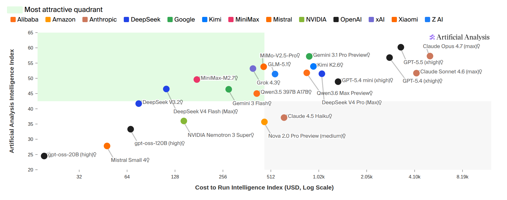
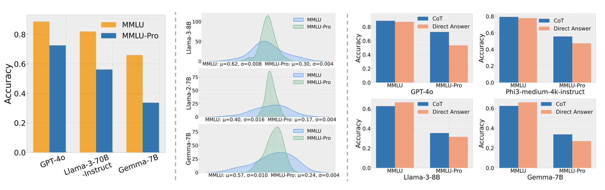
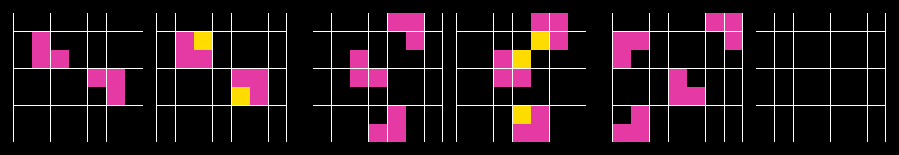

# 第 12 讲：模型评测

> CS336 Spring 2026，Lecture 12（Evaluation，Percy Liang）。本文按[官方课程表](https://cs336.stanford.edu/)及[官方可执行讲义 `lecture_12.py`](https://github.com/stanford-cs336/lectures/blob/main/lecture_12.py)的顺序整理。[B 站合集 P12](https://www.bilibili.com/video/BV11LEA6eEuj/?p=12)可配合观看；目前无法取得可核对的字幕或时间轴，因此具体课堂内容以官方讲义为依据，本文的推导、实验建议和自测是复习补充。

训练方法、算力和规模只说明怎样得到模型，评测还要回答模型应该具有什么行为。评测看似是“准备问题→调用模型→算分”，实则先要把抽象目标（知识、实用性、推理、安全等）转成可观察指标。一个模型可以考试高分却答不好真实用户，也可以深受用户喜欢却在可核查事实中出错。价格、延迟和使用量能帮助做产品选择，但它们衡量的也不等同于能力。

图：官方 `what_is_good()` 使用的[能力与运行成本原图](https://github.com/stanford-cs336/lectures/blob/main/images/artificial-analysis-cost.png)。该函数依次展示基准分数、价格、成对偏好、真实使用量四种“好”的候选定义；图只是其中一个观察角度。读排行榜前应先写清自己要优化的是哪一种结果，以及是否有成本或延迟约束。

## 1. 困惑度：先问模型给文本多少概率

给定留出测试集（held-out）的 token 序列 $D=(x_1,\ldots,x_N)$，自回归模型的平均负对数似然与困惑度（PPL, perplexity）为

$$L_D=-\frac{1}{N}\sum_{i=1}^{N}\log p_\theta(x_i\mid x_{<i}),\qquad \mathrm{PPL}(D)=\exp(L_D)=p_\theta(D)^{-1/N}.$$

若每个目标 token 的正确预测概率都为 $1/4$，则 $L_D=\log4$、PPL $=4$；PPL 越低表示模型给**这份文本**的平均概率越高。比较时须固定测试集、分词器、计分 token、上下文截断和对数底数；不同分词器的“每 token PPL”通常不可直接横比。训练集 PPL 主要说明拟合程度，评测应使用未训练的样本。

传统语言建模常在 Penn Treebank、WikiText-103、One Billion Word Benchmark 等数据上按训练／测试划分做**同分布**评测。讲义以 GPT-2 为例：在 WebText 上训练，再零样本测这些标准集，改成了**分布外迁移**问题；小数据集上的迁移收益不必推广到所有语料。

从理论上说，若测试文本真由分布 $t$ 产生，交叉熵满足 $H(t,p)=H(t)+D_{\mathrm{KL}}(t\Vert p)$，其中 $D_{\mathrm{KL}}$ 是 Kullback–Leibler 散度（KL 散度）；交叉熵的全局最小值在 $p=t$ 取得。这解释了“足够好的语言建模终会给任务解答高概率”的直觉，却不是有限模型、有限测试集上“PPL 降低必然使任意下游任务变好”的证明。自然文本中许多词对目标任务并不重要。对于指定提示 $q$ 和回答 $a=(a_1,\ldots,a_M)$，更贴近目标的是**条件 PPL**：

$$\mathrm{PPL}(a\mid q)=\exp\!\left(-\frac{1}{M}\sum_{j=1}^{M}\log p_\theta(a_j\mid q,a_{<j})\right).$$

它只在回答 token 上计分，仍不保证事实正确、满足指令或安全。LAMBADA 的完形填空、HellaSwag 的句子续写选择，都在一定程度上把概率预测包装成下游题目。若评测者只接收模型自报的 `log_prob`，还必须信任这些值确实来自归一化概率分布；直接生成回答再按正确性评分，则把输出行为纳入检验。PPL 对平滑跟踪训练和缩放规律仍很有用，真实使用还需要任务评测。

**面试速述：** PPL 是留出文本的平均负对数似然取指数，适合平滑比较同一计分协议下的语言建模能力。它依赖测试分布、分词器和上下文设置，较低 PPL 不自动代表事实正确、指令遵循或安全；目标任务还需条件概率或输出行为评测。

## 2. 考试式 benchmark：答案明确，能力边界也明确

考试题便于控制学科和难度，标准答案使自动评分成本低。讲义依次介绍：

| 基准 | 讲义中的设计 | 主要测到什么与局限 |
| --- | --- | --- |
| [MMLU](https://arxiv.org/abs/2009.03300)（Massive Multitask Language Understanding，大规模多任务语言理解） | 57 个学科，四选一；原工作以少样本提示（few-shot）评测 GPT-3 | 跨学科知识与解题，名称中的“语言理解”不等于单独识别理解能力 |
| [MMLU-Pro](https://arxiv.org/abs/2406.01574) | 清理较简单／有噪声的题，选项从 4 扩到 10，允许思维链（CoT, chain of thought） | 降低猜中概率并拉开分数；提示格式和推理预算要固定 |
| [GPQA](https://arxiv.org/abs/2311.12022)（Graduate-Level Google-Proof Q&A，研究生级难以靠搜索解答的问答） | 博士级专家编写、非专家难以检索作答的专业题 | 测高难知识／推理组合，不能把分数直接解释为“专家水平” |
| [Humanity's Last Exam](https://arxiv.org/abs/2501.14249)（HLE，“人类终极考试”） | 约 2500 道跨学科、多模态的选择与简答题，经模型筛选和人工审查 | 延缓旧题饱和；简答还需规定等价答案和评分规则 |

讲义强调基准会随着模型进步逐步变难。MMLU-Pro 相对 MMLU 的模型准确率下降，是**题目和协议改变**后的结果，不能当成同一模型能力退化。多选题可以很难，但现实用户通常不会把问题、四个备选答案和唯一标准答案一同提供。复现实验必须记下 zero-shot／few-shot、示例顺序、是否要求思维链、最大生成长度、答案抽取方法及失败解析如何计分；否则“同一 benchmark”的分数并不一定可比。

官方 `exam_benchmarks()` 的对比数字让难度变化更直观：MMLU-Pro 清题并把 4 个选项扩为 10 个后，讲义称所列模型准确率相对原 MMLU 下降约 16%–33%（课件未在文字中说明是相对百分比还是百分点）；GPQA 案例中，博士领域专家约 65%，非专家允许搜索 30 分钟约 34%，当时测得的 GPT-4 约 39%。这些是讲义引用研究时的实验结果，题集、提示和模型版本不同便不能直接横比，更不能把“GPT-4 低于专家”写成今天所有模型的现状。HLE 则通过多模态、简答题、前沿模型筛题和多轮人工审查延缓基准饱和，其成绩仍取决于评分协议。

图：官方 `exam_benchmarks()` 的[原图](https://github.com/stanford-cs336/lectures/blob/main/images/mmlu-pro.png)。左侧展示原 MMLU 与 MMLU-Pro 的分数差异，右侧还比较了思维链（CoT）与直接作答：CoT 的收益因模型和题集而异。整图是在比较题集和作答协议，不能当作同一题集的时间序列退化曲线。

**面试速述：** MMLU、GPQA 等考试基准用标准答案低成本测知识和解题能力，难度及题型也限定了能推断的能力边界。比较分数必须固定提示、思维链、生成与答案抽取协议；换题集或选项数后准确率变化不能直接解释为模型退化。

## 3. 聊天评测：开放回答与偏好

例如用户询问“甜菜配山羊奶酪，哪些香草合适”，回答可以有多种合理写法，很难用唯一金标做 exact match。[Chatbot Arena](https://arxiv.org/abs/2403.04132)让用户对同一提问看到两个匿名模型的回答，并选择更好者。讲义用 Elo 风格模型描述成对胜率：

$$\Pr(A\succ B)=\frac{1}{1+10^{(R_B-R_A)/400}},$$

其中 $R_A,R_B$ 是拟合成对比较结果的评分。两者同分时预测胜率 $1/2$；$A$ 高 400 分时预测胜率 $10/11$。排名体现该平台、该时段用户群和提问分布下的偏好，不能直接解读为事实正确率。真实用户问题提高了贴近实际使用的程度，也带来参与者选择偏差、刷票、风格偏好与迎合用户等问题；不同模型不必都答完全相同的一组题，抽样和配对机制必须一并理解。

[AlpacaEval](https://tatsu-lab.github.io/alpaca_eval/)在固定指令集上让 LLM judge 判断候选相对基线的胜率，成本较低、可重复；但评委可能偏爱较长回答及自身相似的风格。其[后续工作](https://arxiv.org/abs/2404.04475)试图校正长度等偏差。[WildBench](https://arxiv.org/abs/2406.04770)从真实人机对话抽样，使用检查表引导模型评委逐项判断。与人类偏好排名的相关性是有用的外部检查，并不能证明评委在每一道事实题都判对。比较开放回答时，宜同时保存原始输出、胜负／平局及理由，用明确 rubric 分开核查正确性、任务完成、表达、拒答和引用质量。

官方 `chat_benchmarks()` 给出两种成本不同的课堂例子：AlpacaEval 用来自多个来源的 805 条指令，按相对基线模型的胜率评测；WildBench 从约 100 万段人机对话中抽出 1024 条，并让评委按检查表逐项核查。讲义用 Arena 人类偏好结果作外部相关性检查，强调检查表／rubric 可以提高判断信号，但不能消除评委偏差。805 与 1024 是相应版本的数据集大小，扩大样本或更换抽样来源就构成新协议。

**面试速述：** 开放聊天没有唯一金标，可用用户成对偏好或 LLM judge 评估回答，但排名反映相应提问分布和评委偏好，不等于事实正确率。长回答偏好、参与者偏差与迎合用户等会影响结论，最好保留原始输出并用明确 rubric 单独核查正确性。

## 4. 智能体与纯推理：从回答转向行动

智能体评测观察系统在环境中**做成了什么**。结果属于“语言模型＋工具权限＋上下文管理＋规划／委派等智能体支架（scaffold，即调用模型和工具的外层程序）”的组合；换一个 scaffold 即使底层权重不变，分数也可能大变。

| 基准 | 任务与验收 |
| --- | --- |
| [SWE-bench](https://arxiv.org/abs/2310.06770) | 给出代码仓库和 issue，提交修复；用测试检查。原始集有 2294 个任务、12 个 Python 仓库；测试通过不一定证明所有需求满足。 |
| [Terminal-Bench](https://arxiv.org/abs/2601.11868) | 在终端环境完成可执行任务；需说明环境、工具、时间和尝试预算。 |
| [CyBench](https://arxiv.org/abs/2408.08926) | 40 道夺旗赛（CTF, Capture the Flag）安全挑战；用人类首次解出时间表征难度，评测需隔离环境。 |
| [MLE-bench](https://arxiv.org/abs/2410.07095) | 75 个 Kaggle 竞赛式机器学习任务，要处理数据、训练模型并提交结果。 |

智能体可以列计划、调用子智能体、读写持久文件、重复试错。报告结果时必须公布模型版本、scaffold、可用工具、网络权限、运行时长、token／费用预算、每题尝试次数和成功判定；只报“模型通过率”会混淆模型与系统贡献。

官方 `agentic_benchmarks()` 将智能体支架具体拆成显式待办与规划、分层委派、持久文件记忆以及过程指令／上下文管理。例如同一 SWE-bench issue，支架可以决定先跑哪些测试、是否把查仓库与改代码交给不同子代理、如何保存上次失败轨迹；这些都会改变测试通过率，即使语言模型权重完全相同。Terminal-Bench 的讲义案例还区分众包 229 道任务与 Terminal-Bench 2.0 的 89 道任务，报告结果时必须写明版本和任务子集。

如果希望减少世界知识的影响，[ARC-AGI](https://arcprize.org/arc-agi)（Abstraction and Reasoning Corpus for Artificial General Intelligence，面向通用人工智能的抽象推理题集）让模型从少量网格示例推断变换规则。讲义按 ARC-AGI-1、强调更多多步推理的 ARC-AGI-2，再到交互环境中的 ARC-AGI-3 展开。每题构造独特，有助于减少直接背答案的收益；但视觉编码、搜索程序、测试时计算和先验知识仍参与解题，不能声称完全“纯推理”。交互版本还必须统一行动次数和反馈规则。

图源：[ARC Prize 原图](https://arcprize.org/media/images/arc-task-grids.jpg)，由[Stanford CS336 Spring 2026 第 12 讲讲义](https://github.com/stanford-cs336/lectures/blob/main/lecture_12.py)引用；图展示的是任务形式，不代表任何模型的答题结果。

**面试速述：** 智能体基准评的是模型连同工具、权限、时间预算和 scaffold 在环境中是否完成任务，分数不能全归因于底层权重。ARC-AGI 等题试图减少知识记忆影响，但视觉编码、搜索和测试时计算仍会参与；跨系统比较须固定支架与尝试预算。

## 5. 安全：风险类别与上下文

[HarmBench](https://arxiv.org/abs/2402.04249)围绕 510 项具体有害行为测试拒答／违规表现；[AIR-Bench](https://arxiv.org/abs/2407.17436)依据监管框架和企业政策组织 314 个风险类别、5694 个提示。测试常比较模型对正常请求的帮助能力与对违规请求的拒绝能力，单看“拒绝率”会奖励一概不回答。对越狱，还需评估攻击者经多次改写和迁移是否能诱导违规；讲义举[贪心坐标梯度（GCG, Greedy Coordinate Gradient）](https://arxiv.org/abs/2307.15043)自动优化攻击提示的例子。

安全并非一个统一二值属性。事实幻觉、谄媚、协助违法、歧视、侵蚀用户判断等风险不同；法律和社会规范还随地区和场景变化。网络安全能力可能用于防护测试，也可能被滥用。发布“安全分”时应写清威胁模型、政策版本、语言／地区、攻击预算、评委以及误拒正常请求的代价。

**面试速述：** 安全评测要按危害类别、政策和攻击预算衡量违规协助，同时统计正常请求的误拒；只看拒绝率会奖励一概拒答。结论会随地区、语言和使用场景变化，不能压成脱离威胁模型的单一安全分。

## 6. 生态效度：题目像不像实际工作

**生态效度**问的是测试任务、用户和环境能否代表目标使用场景。GPQA 有清楚金标，却不像普通工作流；Arena 收集真实提问，却难控制人群与分布。[GDPVal](https://arxiv.org/abs/2510.04374)取美国 GDP 主要行业中 44 种职业的专业任务，试图逼近职业实际交付物。[MedHELM](https://arxiv.org/abs/2505.23802)从临床人员与真实医疗任务出发，超越标准考试题。[Clio](https://arxiv.org/abs/2412.13678)分析真实用户互动的总体模式，帮助理解人们究竟让模型做什么。

官方 `realism()` 给出了抽样口径：GDPVal 的 44 种职业覆盖美国 GDP 前九大行业，任务提供者是平均约 14 年经验的从业者；MedHELM 包含来自 29 位临床人员的 121 项临床任务，混合公开与私有数据。前者更像职业交付物，后者更像临床工作；两者都不能仅凭任务名称保证与某家公司的用户或工作流一致，评测仍要检查抽样人群和实际使用场景。

更真实的数据常包含隐私、机构机密和难共享的背景，因此复现性与隐私存在张力。一个可行设计是保留公开基准用于横向比较，再用经授权、去标识的内部任务验收目标场景；两种结果分别报告，避免用公开考试高分替代部署前验证。

**面试速述：** 生态效度关注测试任务、用户和环境能否代表真实工作；标准考试便于复现，却不一定像实际交付，真实任务更贴近用途却有隐私和共享限制。可分别报告公开基准与经授权的目标场景任务，避免用前者代替部署验收。

## 7. 有效性：污染、题目质量与评分漏洞

**训练／测试重叠**是当代基准的核心风险：模型可能在预训练网页、微调集或工具检索中见过原题及答案，而提供商未必公开完整数据。高分此时无法分清泛化、记忆与临场检索。讲义给出四类路线：从模型行为推断可能重叠；促使提供商报告数据与重叠情况；持续发布新题；使用未上网的私有测试。新题时间戳也不是充分保证，因为题目可能在别处提前复制或进入评测时的检索工具。数据去重可查文本完全匹配、近似重复、题干与答案变体，但“未查到重叠”也不能证明绝无污染。

官方 `validity()` 对四条路线各给一例：行为推断可利用题目次序或样本的可交换性寻找异常记忆痕迹；报告规范要求提供商披露训练／测试重叠；LiveCodeBench、UncheatableEval 使用较新网页内容；私有评测可取未公开的内部代码库或个人写作。前两者依赖推断或透明度，后两者依赖题目来源与访问控制，均不能单独证明模型“完全没见过题”。

**数据集质量**同样决定结论。[SWE-bench Verified](https://openai.com/index/introducing-swe-bench-verified/)通过人工核查改善任务可解性和测试可靠性。一个代理任务若测试太弱，琐碎修改就可能通过；若测试期待了 issue 未要求的行为，正确修复又可能被误判。复核应抽查原题、环境可运行性、标准答案、评分脚本和失败轨迹，并记录被排除题目的理由。对开放回答，评委 rubric 本身也要抽样人工审计。

官方 `validity()` 还用“一个极简代理都能过关”的智能体基准漏洞说明：测试通过率首先取决于测试是否覆盖任务要求，不能把弱测试上的通过数直接解释为解决真实问题的能力。讲义列举 Platinum 版本基准和检查代理执行轨迹的 Docent 工具作为质量审计思路；复习时应把题目可解性、验收充分性和轨迹异常分开检查。

**面试速述：** 评测有效性要防训练或检索污染、错误题目和过弱评分器：高分可能来自记忆、检索或钻测试漏洞，而不是目标能力。新题和去重能降低风险却不能证明零污染，还要抽查题目、环境、评分脚本与失败轨迹。

## 8. 先确定评测对象，再写协议

同一个分数可以服务不同问题：采购者要选最适合自身工作流的系统；研究者要比较底层能力或算法；治理者要量化收益与风险；开发者要获得训练反馈。早期机器学习常在固定训练／测试划分下比较**方法**，现在公开排行榜更多比较可随意调提示、工具和系统的**模型或产品**。比较对象不同，允许的训练数据、测试时计算、外部工具与人工参与也不同；规则应在测试前写定。

官方 `how_to_think_about_evaluation()` 给出一个“测方法”的反例：nanoGPT speedrun 固定数据与目标验证损失，比的是用多少计算时间达到该损失，因此更适合比较训练实现或算法改进。若改测某个现成模型的绝对分数，训练数据、权重和推理支架都可能不同，回答的是下游用户的选型问题。两个赛制都合理，但排行榜标题必须写明固定了哪些条件、允许改动哪些部分。

一个可执行的评测协议至少包含：目标用户及任务分布；数据来源、抽样、去重、公开／私有状态；模型版本与训练截止信息；prompt、few-shot 示例、CoT、工具权限、采样温度、token 上限、超时及重试；评分器、答案解析、无效输出和平局处理；计算成本、延迟与安全指标；最终报告的分组结果和原始样例。对比两个系统时尽量使用同一批题，固定预算并保存逐题配对结果。

统计上，若 $n$ 道近似独立二元题的准确率为 $\hat p$，其粗略标准误是 $\sqrt{\hat p(1-\hat p)/n}$；$n=800,\hat p=0.5$ 时约为 **1.77 个百分点**，正态近似的 95% 区间半宽约 **3.46 个百分点**。这只是示意：同源题簇、同一用户多轮提问和多次采样并不独立；模型间差值宜用逐题配对 bootstrap 或配对检验，用户／仓库层面相关时按相应簇重采样。对很多模型或提示反复挑最高分会产生选择偏差，需保留未参与调参的最终测试集。报告分数还应给样本量、置信区间、失败率和关键子群，不把微小差异写成确定胜负。

**面试速述：** 先定义要比较的是底层模型、完整系统还是产品，以及目标用户与任务分布，再固定数据、提示、工具、预算和评分规则。报告应含样本量、区间、失败率及关键子群；两系统同题比较时还应保存逐题配对结果，小分差尤其要考虑题目相关性和反复挑榜造成的偏差。

## 9. 自测

1. 两个模型在不同分词器下 PPL 分别为 8 和 10，可以直接判前者更好吗？**答**：不可以。计分 token 单位不同，还要统一测试语料、上下文和计分协议。
2. 原始 MMLU 与 MMLU-Pro 的准确率下降说明模型退化吗？**答**：不说明；题目难度、噪声处理、选项数和推理协议均改变了。
3. Arena 中 $R_A=R_B+400$，公式预期 $A$ 胜率多少？**答**：$1/(1+10^{-1})=10/11\approx90.9\%$；这是拟合模型的期望，不是所有任务上的正确率。
4. 同一底座模型的 SWE-bench 分数变高，能全部归因于权重提升吗？**答**：不能，还可能来自 scaffold、工具、测试时预算、提示和环境配置。
5. 发布后两周的新题就一定无污染吗？**答**：不一定。可能提前流传、被复制，也可能被评测代理在线检索到；应继续核查来源和工具可见性。
6. 某安全模型拒绝全部请求，有害请求拒绝率 100%，就算安全优秀吗？**答**：不能。还需看正常请求误拒率及不同危害类别下的表现。

本讲的总原则是：先说明要测的行为、对象和使用场景，再挑任务与指标；以公开基准定位能力，以真实任务检查生态效度，以污染审计、题目复核和统计区间限制结论强度。没有一个分数能替代完整的评测协议。

**本节小结：** 自测逐项检查 PPL 可比性、基准协议、智能体支架、污染和安全误拒，练习用评测设计限制分数的解释范围。
