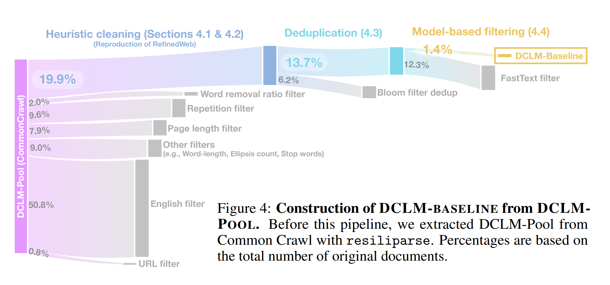

# 第 13 讲：数据（一）——来源与数据集

> 课程：Stanford CS336, Spring 2026；官方课表日期：2026-05-11；主讲：Percy Liang。本文按[官方可执行讲义](https://cs336.stanford.edu/lectures/?trace=lecture_13)的展开顺序整理。对应 [B 站合集 P13](https://www.bilibili.com/video/BV11LEA6eEuj/?p=13) 标为“Data (Sources, Datasets)”。课程讲义是内容依据；视频页面可核对分集身份，本文没有逐帧核对课堂口述。

## 一、为什么先研究数据，而不是只研究模型

前几讲默认已有数据，讨论分词、架构、系统、训练与评测；这一讲把问题前移：**训练文本从哪里来，怎样取得，是否有权使用，最终怎样形成数据集？** 同一架构、相近算力下，数据覆盖、清洗和配比足以改变模型能力。模型论文往往充分公开结构，却较少公开完整语料配方；竞争与版权风险都是原因。

数据工作也从“为监督学习人工标注样本”转向“为大规模预训练策展和清理原始材料”。标注负担可能下降，但采集、追溯、去重、质量判断、许可核验仍是长尾的人力问题。

一个有用的阶段视角是：

| 阶段 | 常见数据与目的 | 规模趋势 |
|---|---|---|
| 预训练 | 大量网页、书籍、代码等，学习广泛分布 | 最大、质量参差 |
| 中训练（mid-training） | 更精选的领域或高质量材料，增强指定能力 | 较小、更精 |
| 后训练 | 对话、指令、偏好或强化学习轨迹，调整行为 | 更小、更有目标 |

边界并不固定。“基础模型”在讲义的用法中通常指预训练加中训练之后的模型；经过后训练的是指令/聊天模型。OLMo 2 的预训练、中训练及 Tulu 后训练是讲义用来展示阶段差异的例子，不能推断所有模型都采用同一配方。

**面试速述：** 训练数据决定模型实际见过的分布，来源、清洗和配比会在架构与算力相近时改变能力。预训练、中训练、后训练的数据规模和目标不同，但具体阶段配方不能套用到所有模型。

## 二、从在线服务到可训练文本：获取本身就是筛选

“在整个互联网上训练”是失真的说法。互联网不等于公开万维网；公开网页也不是天然存在于本地磁盘的文本文件。爬虫从种子 URL 出发，下载页面、发现链接并决定下一批访问目标。最终能训练的是某时刻取得并处理后的**有限快照**。

有五类边界：

1. **动态页面**：同一个 URL 随按钮、表单和登录状态改变内容；简单 HTTP 抓取无法覆盖应用内全部状态。
2. **身份与付费墙**：社交网络、新闻站等大量内容需要账户或付费。
3. **技术限制**：`robots.txt`、反机器人验证、IP 封锁、速率限制等会影响可获取性和服务器负载。
4. **合同与版权**：服务条款可能限制自动下载；页面可访问，不代表复制、再分发或模型训练已有授权。
5. **来源合法性**：影子图书馆可能绕过付费与版权控制；“网上能下载”与“有可用许可”是两回事。

讲义提到针对 C4、RefinedWeb、Dolma 所涉网址的研究发现，网站对抓取/训练的限制随时间增长。它说明**采集时点、站点政策和来源记录**会影响后续可复现与合规判断。即使爬虫能获得内容，也应控制抓取频率、尊重站点政策并保存审计信息。

可以把数据血缘写成：

```text
在线服务 / 原始出版物
  → URL、仓库、数据转储或授权交付
  → 原始快照（时间、版本、来源、许可）
  → 解析与正文提取
  → 语言识别、质量过滤、去重、隐私处理
  → 分词及采样混合
  → 训练集
```

少记下一个来源字段，后面可能就无法回答某段文本从何而来、能否删除或能否商用。

**面试速述：** 可训练语料是从有限的在线快照经解析、过滤、去重和采样得到的，不等于“整个互联网”。采集时就要留来源、时间和许可证据，否则后续很难审计或删除样本。

## 三、版权与许可：可访问性不等于使用权

讲义以美国版权制度解释核心区分。版权保护**具有原创性的表达**，不保护抽象思想；例如快速排序思想与某个实现代码不是同一对象。作品固定到媒介时一般即受保护，不需要先加版权声明。公共领域作品、获得许可的作品、以及可能符合合理使用的使用方式，应分别判断。

**面试速述：** 网页可访问、可抓取和可用于训练是不同问题，版权判断针对作品表达、授权和具体用途。做语料时应逐件核验权利，不能把公开链接当成训练许可。

### 3.1 三个不同的问题

- **能否访问或抓取？** 受身份、技术限制、`robots.txt` 与服务条款影响。
- **能否复制、改作、分发或用于训练？** 取决于作品权利、许可、适用法域与具体使用方式。
- **能否公开发布处理后的数据集？** 即使内部训练有依据，原文再分发也可能需要单独权利。

开放许可如 Creative Commons 是权利人给予一定使用权限，并非放弃所有权利；具体版本、署名、相同方式共享、非商业限制都要看原条款。MIT、Apache 等代码许可也有各自义务。购买数据训练授权是另一条路径。公共领域并非“来源不明”，仍应记录版本和取得方式。

**面试速述：** 数据使用要分别回答能否取得、能否训练和能否再分发，三者受技术、合同和作品权利的不同约束。即使用开放许可，也要检查版本、条件和原始来源。

### 3.2 合理使用与诉讼案例

美国版权法的合理使用通常综合四项因素：使用目的和性质、原作性质、使用数量及其核心程度、对原作市场的影响。没有“用于 AI 训练就自动合理使用”或“训练后不逐字输出就必然合法”的通用规则。训练前的复制行为、模型是否输出受保护表达、市场影响以及取得副本的方式，都可能进入分析。

讲义用《纽约时报》诉 OpenAI、作者诉 Anthropic、作者诉 Meta 案说明争议仍在发展。其中若干 2025 年判决只处理特定案件、特定事实或特定程序阶段；尤其要分开看“训练用途”与“盗版副本的取得和保存”。不要把个案写成所有国家、所有数据集适用的许可证。这里是课程知识点梳理，不是具体项目的法律意见。

**面试速述：** 美国合理使用要综合目的、作品性质、使用量和市场影响，AI 训练没有自动适用的统一结论。个案判决还要区分训练用途与副本取得方式，不能外推为通用授权。

### 3.3 数据集许可不能代替逐件来源核验

一个数据集网页标称开放，不保证内部每篇文章、每本书或每个代码文件都拥有相同许可。对项目而言，至少要记录原始来源、抓取/取得日期、许可文本或授权依据、过滤和删除记录。尤其警惕 **license laundering（许可洗白）**：有人把无权再分发的作品放进标称宽松许可的数据包。

**面试速述：** 数据集整体标注的许可不能证明其中每件作品都可用；混入无权再分发内容会造成许可洗白。入库时应保留逐件来源与授权依据，支持后续核查和删除。

## 四、基础来源：Common Crawl、Wikipedia、代码和论文

**面试速述：** 网页、百科、代码和论文提供互补的训练信号，但各自的获取、噪声和权利边界不同。选来源时要同时问能取到什么、会丢掉什么，以及能否合法处理和发布。

### 4.1 Common Crawl：规模与正文提取

[Common Crawl](https://commoncrawl.org/) 是周期性发布网页抓取档案的非营利项目。讲义以 2026 年 4 月批次为例说明单批可达数十亿页面、数百 TB；这些是**批次统计，不是去重后可训练 token 数**。爬虫需要决定抓哪些 URL、多久重访以及如何礼貌访问。多个 URL 也可能指向几乎相同的正文。

最重要的格式差别：

| 格式 | 保存什么 | 对模型数据的影响 |
|---|---|
| WARC（Web ARChive，网页抓取归档格式） | 原始抓取记录，包含 HTTP 响应和 HTML | 可重新选择正文提取算法，处理成本较高 |
| WET（WARC Encapsulated Text，WARC 提取文本格式） | 从抓取记录提取的文本 | 使用方便，但转换已有信息损失和抽取误差 |

例如一篇新闻的 HTML 包含导航栏、推荐链接、广告和正文。若正文提取把导航重复计入，模型会反复见到站点模板；若过度抽取，又会丢掉正文。讲义引用 DCLM 的结果强调：**WARC 到文本的转换方式本身会影响下游准确率**。`trafilatura`、`resiliparse`、`jusText` 是不同项目所用的正文提取工具，不能把“下载了 Common Crawl”当成完成预训练集。

**面试速述：** Common Crawl 给的是抓取档案，WARC 保留原始响应，WET 已提取文本；正文抽取会影响实际训练质量。批次页面数和容量不能当作去重后的可训练 token 数。

### 4.2 Wikipedia：高质量也有边界

[Wikipedia](https://www.wikipedia.org/) 的文章以可核查来源与关注度为基础，不收原创研究、广告或个人主页。它公开周期性数据转储，因此不必逐页爬取。条目可以由众人编辑，也可能遭受破坏；若恶意修改恰好进入快照，训练集会吸收错误甚至定向投毒。讲义由此提醒：**权威来源不是绝对无噪声来源**。应保留转储日期、语言版本，并考虑清理模板、修订记录及异常内容。

**面试速述：** Wikipedia 有结构化、可批量取得的高质量文本，但开放编辑意味着快照仍可能含错误或投毒。使用时要记录版本和语言，并处理模板与异常修订。

### 4.3 GitHub 与 Software Heritage：代码、历史和元数据

[GitHub](https://github.com/) 仓库包含代码、目录结构、提交历史；issue（问题单）、PR（Pull Request，合并请求）、评论则提供问题描述、修改意图和讨论。训练数据可经 Git 协议取得仓库，通过应用程序接口（API, Application Programming Interface）或事件档案取得元数据。代码存在 fork、镜像、复制粘贴及生成文件，文件数量不等于独立样本数量。公开仓库也**不等于**宽松许可；需检查仓库或文件许可及来源。

[Software Heritage](https://www.softwareheritage.org/) 致力于保存多个平台的源码历史，适合作为跨平台仓库来源；它的关注点主要是软件本身，不能将它等同于 GitHub 的 issue/PR 讨论流。讲义提到代码对编程任务有价值，对一般推理的益处则属于经验性看法，不应当作无需验证的因果定律。

**面试速述：** 代码数据既有源码，也有提交和问题讨论等任务上下文；GitHub 与 Software Heritage 的覆盖重点不同。公开仓库仍需核查许可、fork 重复和生成文件，文件数不代表独立样本数。

### 4.4 arXiv：论文内容与元数据权利分开

[arXiv](https://arxiv.org/) 提供论文元数据、PDF，有些作者还提交 LaTeX 源文件；其公开预印本经过平台审核，但**不等于同行评审**。标题、摘要等元数据和论文全文的许可条件可能不同，论文作者也可选择保留全部权利或采用 Creative Commons。平台提供批量下载途径；获取方式便利并不能替代逐篇许可判断。LaTeX 源更便于保留公式结构，但需要去宏、参考文献等噪声。

**面试速述：** arXiv 的 PDF、LaTeX 源和元数据便于构造学术语料，却有格式清理与逐篇权利核验成本。预印本经过平台审核不等于同行评审，元数据许可也不能代替全文许可。

## 五、数据集发展脉络：每代数据集在解决什么问题

下面按讲义顺序看代表性实践。数字是论文/讲义所报告的**各自口径**，GB、TB、词和 token 不能直接横比；使用不同 tokenizer 或过滤阶段，也会改变 token 数。

**面试速述：** 数据集演进主要是在来源覆盖、质量过滤、去重和可复现配方之间取舍。比较规模时先统一原始容量、过滤后容量与训练 token 口径，不能直接横比论文数字。

### 5.1 BERT 与 GPT-2：从书籍长文到社交链接筛选

**BERT（Bidirectional Encoder Representations from Transformers，双向 Transformer 编码表示）** 使用 Wikipedia 和 BooksCorpus。后者来自 Smashwords 上当时免费的自出版书籍，约 7,000 本、9.85 亿词；免费标价不等于允许大规模抓取及再分发，BooksCorpus 后来因服务条款问题下线。BERT 强调**完整文档**语境，而非把训练单位降为互不相连的句子。

**GPT-2 的 WebText** 选择 Reddit 帖子中获得至少 3 karma 的外链页面，用社区投票间接筛质量，报告约 800 万页、40 GB 文本。OpenWebText 是开放复现，加入英语识别和近重复清理。关键不是把 Reddit 评论本身当 WebText，而是**顺着高票帖子链接取网页**。这种方法会继承 Reddit 用户与投票机制的偏好，未被链接的内容自然缺席。

**面试速述：** BERT 借完整书籍和百科文章学习长文语境；GPT-2 的 WebText 则用 Reddit 高票外链筛网页。前者要注意书籍权利，后者继承社区链接与投票偏好。

### 5.2 CCNet 与 C4：把 Common Crawl 变成可用文本

**CCNet** 的核心链路是轻量规范化后段落去重、fastText 语言识别、用 Wikipedia 文本训练的 5-gram KenLM 评估质量。它试图为多语言构造较高质量语料，质量标准中隐含“像百科”的偏好；小语种或非百科体裁可能被误删。

**C4（Colossal Clean Crawled Corpus，大规模清洗网页语料；T5 即 Text-to-Text Transfer Transformer，文本到文本迁移 Transformer 论文中的数据集）** 从 Common Crawl 快照出发，使用人工规则：保留较长且带句末标点的行、过滤过短文档和特定模板/敏感词、识别英文等。讲义报告原始快照约 1.4 万亿 token，最后约 806 GB、1,560 亿 token。规则清楚、便于复现，但“一出现某个词就删除整页”可能系统性损失特定群体或主题的内容。WebText 风格的链接子集实验也提醒：Common Crawl 对互联网的覆盖并不完整。

**面试速述：** CCNet 用段落去重、语言识别和百科风格语言模型筛网页；C4 更依赖明确的人工规则。两者都把 Common Crawl 变成可训练文本，但参考语料偏好和规则误杀会改变覆盖分布。

### 5.3 GPT-3、The Pile、MassiveText：分类器与多源混合

**GPT-3** 组合处理后的 Common Crawl、WebText2、两个书籍语料和 Wikipedia，报告约 570 GB、4,000 亿 token。它用高质量参考语料训练分类器筛 Common Crawl，再做文档模糊去重，也处理与基准测试的重合。分类器的“高质量”由正样本选择定义，并非客观常数。

**The Pile** 汇集 22 个来源，报告约 825 GB，体现“按域策展”的开放复现路径。Pile-CC 从 WARC 用 `jusText` 抽正文；还包括 PubMed Central、arXiv、Stack Exchange 问答、古腾堡图书及 Enron 邮件。来源多样化有利于能力覆盖，同时带来不同许可和隐私风险。尤其 **Books3** 来自影子图书馆，后续因版权问题下线；不能因它曾在著名数据集中出现，就推断其使用无争议。Project Gutenberg 通常有版权清理，但具体作品仍应看来源和所在法域。

**Gopher 的 MassiveText** 混合网页、C4、书籍、新闻、GitHub、Wikipedia；网页部分用英语识别、去重、测试集重合检查和手工质量规则，并借助毒性识别。讲义报告约 10.5 TB 文本，但 Gopher 只采样其中一部分用于训练。**可用语料池规模与实际训练用量是两个数。**

**面试速述：** GPT-3、The Pile 和 MassiveText 都将筛选后的网页与其他来源混合，以扩大领域覆盖。质量分类器会继承正例偏好，多源数据也带来许可与隐私差异；语料池大小不等于实际训练量。

### 5.4 LLaMA、RefinedWeb、FineWeb、Dolma：配方与大规模网页管线

**LLaMA 1** 混合经 CCNet 处理的 Common Crawl、C4、宽松许可 GitHub、Wikipedia、Gutenberg/Books3、arXiv 和 Stack Exchange，报告训练约 1.2 万亿 token。各源处理不同：arXiv 去评论并处理宏，问答按得票排序，代码按许可及规则过滤。RedPajama v1 尝试开放复现该数据配方，SlimPajama 再以近重复清理缩减规模。

**RefinedWeb** 说明只要认真抽取和过滤，网页也能支撑强模型：从 WARC 经 `trafilatura` 抽正文，采用 Gopher 风格规则并对 5-gram 做 MinHash 近重复判定；讲义写其公开约 6,000 亿 token，少于全部处理量。它尽量避免模型分类器带来的筛选偏差。**FineWeb** 延伸这一网页路线，汇集多个 Common Crawl 批次，做网址（URL, Uniform Resource Locator）、语言、规则、MinHash 去重和邮箱／网络协议地址（IP, Internet Protocol address）匿名化，报告约 15 万亿 token。

**Dolma** 又回到多来源组合：网页之外还纳入 Reddit、学术论文、C4、Gutenberg、Wikipedia/Wikibooks 等；其网页管线做英语识别、Gopher/C4 风格质量规则、毒性过滤与 Bloom filter 去重，报告约 3 万亿 token。选择“规则”还是“分类器”没有永久赢家，要看保留率、域覆盖、模型效果与偏差。

**面试速述：** LLaMA、RefinedWeb、FineWeb、Dolma 展示了多源配方与大规模网页管线两条路径，核心步骤仍是抽取、过滤、去重和混合。规则或分类器没有通用胜者，要连同保留率、领域覆盖和模型效果评估。

### 5.5 DCLM 与 Nemotron-CC：质量和数量的拉扯

**DCLM / DataComp-LM** 把数据处理算法放到可比较的标准实验环境中。讲义所述 `DCLM-pool` 约 240 万亿 token，基线用 fastText 质量分类器筛出约 3.8 万亿 token。正例来自指令数据和 ELI5 等，负例来自网页池。这样可以提升筛选质量，但筛选器也会学习正例的体裁偏好，需用下游任务及保留分布检验。



图源：[Stanford CS336 Spring 2026 第 13 讲官方讲义原图](https://github.com/stanford-cs336/lectures/blob/main/images/dclm-filter.png)；图中百分比以原始文档总量为基数，既有各步筛除份额，也有阶段剩余份额，不能全部当作保留率。正负参考样本如何定义分类器目标见上段文字，图中未展示它们。

**Nemotron-CC** 关注过严过滤导致可训练 token 不足的问题：采用更高召回的正文提取、结合教育价值打分与 DCLM 分类器，并将部分低质文本改写、把高质文本扩展成任务。讲义报告总量约 6.3 万亿 token，其中高质量子集约 1.1 万亿。这里的合成文本不是“免费增加独立知识”；它仍依赖原文质量、生成模型偏差及来源许可。

**面试速述：** DCLM 用受控实验比较质量过滤，Nemotron-CC 则尝试在筛质量时保住更多可训练 token。筛选器的参考样本会带来体裁偏好，合成扩展也不能凭空增加独立知识。

## 六、代码语料与许可优先：The Stack、Common Pile

**The Stack** 从大量公开仓库中筛代码，用许可检测器留下符合其许可策略的仓库或文件，再去近重复；讲义报告约 3.1 TB。**The Stack v2** 利用 Software Heritage 仓库，加入 issue、评论、PR 和文档，处理二进制、恶意软件、机器人活动、个人可识别信息（PII, Personally Identifiable Information）与重复内容。PR 是结构化对象，通常需要把变更前后、周边代码和讨论整理成序列；否则只有 diff 片段，模型可能看不懂修改目的。代码文件的 fork、生成代码、许可证继承与敏感密钥，都是现实清洗难点。

**Common Pile** 反过来把许可作为入库条件，汇集约 8 TB 宽松许可或公共领域数据，研究只用有较明确使用权的数据能否训练出有竞争力的模型。讲义结论是这种路线可以取得不错效果，但在 token 规模上有挑战。它也揭示三层细节：数据集整体许可不必然覆盖单个作品；被错误标许可的材料可能混入；由其他模型生成的合成数据，其权利和来源问题仍需具体分析。

**面试速述：** The Stack 以许可筛选和去重构造代码语料，Common Pile 把清晰使用权作为更广语料的入库条件。两者仍需逐件核查，且许可优先可能限制可用规模。

## 七、把本讲化成实际的数据审计问题

看一个网页或代码样本时，可以依次问：

1. **它最初是谁创作的？** 当前下载站点是否只是转载或镜像？
2. **我从哪里、何时、以什么方式取得？** 有无转储版本、URL、仓库 commit 或 arXiv ID？
3. **取得与使用各受什么限制？** `robots.txt`、服务条款、作品许可、地域和商业用途是否有差别？
4. **文本经历了哪些变换？** HTML 正文提取、语言识别、过滤、去重、脱敏分别删掉了什么？
5. **保留下来的数据代表什么分布？** 过滤规则和正例定义排斥了哪些语言、写法或群体？
6. **能否响应纠错或删除？** 有无从训练样本回溯到原始来源的索引？

一个极简记录可以包含 `source_type`、`source_id/url`、`snapshot_time`、`license_evidence`、`raw_hash`、`extraction_version`、`filter_decisions`、`dedup_group`。这些不是讲义规定的数据库模式，而是由课程中的来源、许可和处理问题推导出的实践建议。

**面试速述：** 数据审计要能从训练样本回溯原作者、取得时间、使用权和每一步处理决定。保留血缘索引，才能判断分布偏差、响应删除和排查许可问题；字段示例是实践建议，并非课程规定格式。

## 八、自测与参考答案

**1. “GitHub 公开仓库”能直接等于“可用于任何训练并发布训练集”吗？** 不能。公开可读、代码许可、仓库元数据条款、模型训练和原文再分发是不同判断；还需看是否有许可、是否包含他人代码及秘密。

**2. 为什么两组研究都声称使用 Common Crawl，模型效果却不同？** 不同批次、URL 覆盖、WARC/WET 选择、正文提取、语言与质量过滤、去重和采样混合都会改变实际训练文本。

**3. CCNet 与 C4 的质量判断有何代表性差异？** CCNet 用“像 Wikipedia”的语言模型困惑度等方法，C4 主要依赖人工规则；前者受参考语料分布影响，后者易出现规则误杀。

**4. WebText 的“Reddit 3 karma”筛选对象是什么？** 是达到阈值的 Reddit 帖子所链接的**外部网页**，不是把 Reddit 评论直接当成全部训练文本。

**5. 一个数据集标了宽松许可，为什么还要查每条来源？** 集合的许可或下载页标注不自动证明其中每件作品的权利状态；错误转载、许可洗白和混合来源都可能发生。

**6. 如何解释“10 TB 的数据集只用其中一部分训练”？** 原始/处理后语料池容量、过滤后容量、最终采样 token 是不同统计口径；训练预算、去重和混合比例决定最后进入优化器的样本。

**本节小结：** 这些题用来源权利、网页处理差异和统计口径检验是否把“可获取数据”误当成“可训练样本”。

## 九、来源与核对边界

- [Stanford CS336 Spring 2026 课程页与课表](https://cs336.stanford.edu/)：确认第 13 讲日期、主题、主讲及与第 14 讲的分工。
- [第 13 讲官方可执行讲义](https://cs336.stanford.edu/lectures/?trace=lecture_13)：本文内容主线、案例与讲义报告数字的依据。
- [B 站合集 P13](https://www.bilibili.com/video/BV11LEA6eEuj/?p=13)：合集页面列出的对应分集标题为“Lecture 13: Data (Sources, Datasets)”，时长约 1:04:06。页面未提供可核验的完整字幕，本文不声称逐句转录或补充视频独有内容。
- [Common Crawl](https://commoncrawl.org/)、[Wikimedia dumps](https://dumps.wikimedia.org/)、[Software Heritage](https://www.softwareheritage.org/)、[arXiv bulk data](https://info.arxiv.org/help/bulk_data_s3.html)：用于核对四类基础数据源及获取途径。
- 论文进一步阅读：[C4/T5](https://arxiv.org/abs/1910.10683)、[The Pile](https://arxiv.org/abs/2101.00027)、[RefinedWeb](https://arxiv.org/abs/2306.01116)、[Dolma](https://arxiv.org/abs/2402.00159)、[DCLM](https://arxiv.org/abs/2406.11794)、[Common Pile](https://arxiv.org/abs/2506.05209)。

本讲重点是**来源与已有数据集的形成过程**。过滤、去重、混合和合成数据的算法细节属于官方第 14 讲；这里仅在理解各数据集时交代必要处理步骤。

**本节小结：** 官方讲义支撑本讲的数据来源与案例主线，视频仅用于分集定位；算法细节和未核对的课堂口述不在本讲笔记的证据范围内。
