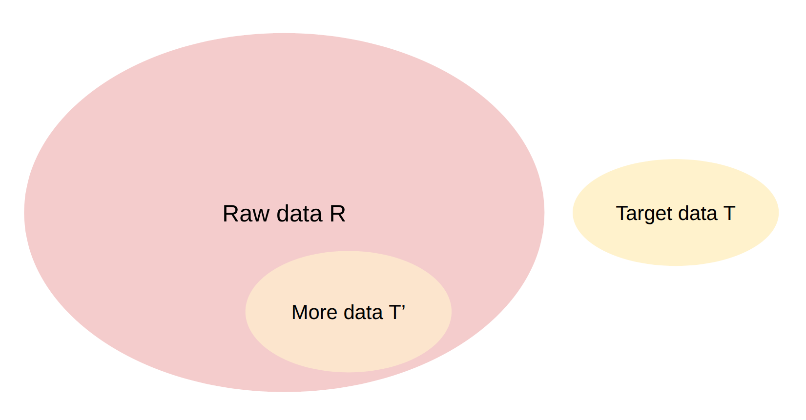

# 第 14 讲：数据（二）——清洗、过滤、去重、混合与合成数据

> 课程：Stanford CS336，Spring 2026；官方课表日期：2026-05-13；主讲：Percy Liang。本文依照[官方可执行讲义](https://cs336.stanford.edu/lectures/?trace=lecture_14)的顺序整理，对应 [B 站合集 P14](https://www.bilibili.com/video/BV11LEA6eEuj/?p=14)。课程内容与公式以讲义为准；目前未逐帧核对视频口述，因此不把讲义之外的说法归于课堂。

## 一、承接上一讲：数据流水线解决什么

上一讲讨论在线服务或出版物如何变成原始转储，以及来源、服务条款、版权与许可。本讲从已经拿到的原始材料继续：**转换格式 → 过滤 → 去重 → 按来源混合 → 形成训练样本**。中训练和后训练还需要任务、提示和回答，有些内容由强模型合成。数据工程的目标不是单纯追求 token 总量，而是在给定训练预算下，保留有用的信息、覆盖足够广的能力，并控制重复和采样偏差。

## 二、转换：网页、文档与代码仓库并非天然文本

### 2.1 HTML（HyperText Markup Language，超文本标记语言）正文抽取是有损变换

网页包含导航、广告、页脚、推荐链接与正文。正文提取器必须判定哪些元素是内容，再把多栏、表格、图片说明等结构线性化为文本。错误有两面：保留模板会使大量网页共享无用句子；过度删减则会丢掉正文、表格或图文关系。`trafilatura`、`resiliparse`、`jusText`、`lynx` 是讲义列举的规则式工具。DataComp-LM（DCLM，语言模型数据处理基准）的例子强调，即使同一份网页抓取，文本抽取方式也会影响模型效果。WARC 提取文本格式（WET, WARC Encapsulated Text）一类预提取文本很方便，但无法恢复已丢失的页面结构；原始 HTML 允许重新抽取。

便携式文档格式（PDF, Portable Document Format）更依赖版面。普通 PDF 的字形位置不等于阅读顺序；扫描版还需要光学字符识别（OCR, Optical Character Recognition）。讲义以 FinePDFs 为例：从 Common Crawl 找到 PDF，重新抓取被截断的大文件，用视觉语言模型（VLM, Vision-Language Model）驱动的 OCR 或 Docling 处理，再做清理和过滤。公式、表格、双栏阅读顺序仍可能出错。代码仓库则要从目录与文件结构中选择训练单位，避免把二进制、生成文件和仓库元数据直接当自然语言段落。

复习时要分清两种损失：**获取损失**是压根没抓到页面或 PDF 全文；**转换损失**是已有原件，却把结构或文字提错了。后续过滤器无法凭空补回前者，也可能把后者误判为低质量。

## 三、过滤：从少量目标数据定义“想要的文本”

### 3.1 统一问题与评分器

令 $R$ 为规模巨大的原始集，$T$ 为表达目标性质的参考集。训练一个评分器 $s(x)$，从 $R$ 中选出与 $T$ 相似、但不必逐字相同的子集 $T'\subseteq R$。常见目标分别是“指定语言”“有教育/知识价值”“非毒性”。评分器必须能推广到不同于 $T$ 的网页，还必须足够快，才能扫描整个 $R$。

图源：[Stanford CS336 Spring 2026 第 14 讲官方讲义原图](https://github.com/stanford-cs336/lectures/blob/main/images/raw-target-schema.png)；图中的相似性是待设计的评分目标，不能直接等同于逐字匹配。

两种典型评分器：

| 方法 | 分数的含义 | 典型用途与边界 |
|---|---|---|
| 目标语料语言模型，如 KenLM | $s(x)=p_T(x)$ 或等价的交叉熵/困惑度变换 | 衡量文本像不像目标分布；长短文本的原始概率不可直接比较，通常按 token 归一化 |
| 轻量分类器，如 fastText | $s(x)=P(y=\text{目标}\mid x)$ | 直接判类别，吞吐高；输出依赖训练标签和来源偏差，未必是校准后的真实概率 |

最直接的选择是 $s(x)\ge\tau$；也可以让保留概率随分数变化，以维持多样性。阈值并非“越严越好”，它同时改变质量与可用数据量。规则过滤与模型过滤可结合：先用便宜规则去掉明显垃圾，再用模型区分细微质量。

### 3.2 语言、数学与一般质量

语言识别的例子是 fastText 的现成 176 语言分类器，训练来源包括 Wikipedia、Tatoeba 和 SETimes。Dolma 曾以 $P(\text{English}\mid x)\ge0.5$ 选择英文页面。这个阈值只是项目中的配置，不是所有语言或所有混合文本的通用最佳值；短片段、代码和多语页面尤其容易误判。

OpenMathText 的目标是从 Common Crawl 中找数学文本。它先用 LaTeX 命令等规则，再用在 ProofPile 上训练的 KenLM，以困惑度低于 15000 为一项过滤条件；还训练 fastText 判断数学写作。讲义记载按不同条件使用 0.17、0.8 两个分类阈值，说明筛选可因子集而异。最终报告 14.7B token，并展示 1.4B 模型用这批数据优于使用约 20 倍数据的对照；这是特定实验，不可推出“任何高质量语料都能稳定节省 20 倍数据”。

GPT-3 用 Wikipedia、WebText2 和两组书籍作为正例，从 Common Crawl 抽负例，训练词特征线性分类器，再按分数随机保留文档。LLaMA/RedPajama 则把 **Wikipedia 引用到的网页**当正例，将 Common Crawl 作为负例。两者都在学习一种间接的质量定义：被选作正例的来源较可信，但分类器也会继承其题材、语言和风格偏见。

phi-1 展示了更专门的目标：从 The Stack 的 Python 子集中找有教学价值的代码。先让 GPT-4 为 10 万样本评价“对学习基础编程概念的学生是否有教育价值”，再用预训练代码模型的嵌入训练随机森林，将它应用到大规模原始集。讲义给出的 HumanEval 对照为：未精选子集训练的 1.3B 模型在 96K 步达到 12.19%，精选子集在 36K 步达到 17.68%。这说明该实验里更有针对性的数据提高了样本效率；训练步数不同，不能把数字当作只改了过滤器的严格控制实验。

### 3.3 毒性过滤与尺度依赖阈值

Dolma 的毒性过滤案例使用 Jigsaw Toxic Comments 数据，标签包括 toxic、severe toxic、obscene、threat、insult、identity hate。分类器可识别有害文本，但语境、引述、反驳恶意言论以及少数群体自述也可能被误删。过滤目标要与训练用途对应，且应抽样人工检查误杀和漏网。

讲义的尺度图给出重要结论：**最优过滤阈值依赖训练 token 预算**。训练很短时，可只用更严格的高分子集；训练较长时若这批数据被反复采样，适度放宽阈值、增加新样本可能更好。设阈值 $\tau$ 留下 $N(\tau)$ 个 token，训练总预算为 $D$，则粗略重复次数为 $D/N(\tau)$。提高 $\tau$ 往往减少 $N$，所以质量增益须与重复、覆盖损失一起评估。

## 四、去重：先定义“同一内容”，再选择算法

完全重复可能来自镜像站、仓库 fork；近重复可能只是格式、少数单词、模板或页脚不同。讲义举 C4 中一段商品文案重复 61,036 次，直观说明仅按网页 URL 计数会高估独立信息量。去重可节省训练 token，并降低逐字记忆风险，但无法保证消除所有版权或隐私问题。

设计去重任务先回答三件事：**单位是什么**（句子、段落、文档）、**匹配关系是什么**（全同、共享子段、相似比例）、**命中后怎么处理**（只留一份或删掉整组）。如果把常见许可证或模板当作整篇文档的重复证据，容易误伤真正不同的正文。

### 4.1 哈希与精确去重

哈希函数把任意长文本映为较短的值。不同文本可能同哈希，即**碰撞**。SHA-256 更抗人为构造的碰撞，但计算较慢；MurmurHash 一类非密码学哈希快，适合批量分桶，却不能仅凭短哈希证明两个原文相同。工程上可用哈希找候选，再比较原文或使用更强摘要确认。

讲义的小例子把 `Hello!`、`hello`、`hello there`、`hello`、`hi`、`bye` 排序后按 MurmurHash 分组，每组留一项。若不做规范化，两个 `hello` 合并，`Hello!` 与 `hello` 仍不同。是否小写化、去空白和标点，是去重语义的一部分。分布式系统可按哈希键聚合候选，近似 MapReduce 的映射、分组、归约流程。

C4 的一个策略以连续三句为单位精确匹配，再删除重复片段。粒度变小能发现跨文档复制，但从文章中间删掉三句可能破坏上下文连贯性；需要结合后续文档质量检查。

### 4.2 Jaccard 相似度与 MinHash

将文档转换为集合，例如单词或 $k$-gram 集合。Jaccard 相似度为

$$
J(A,B)=\frac{|A\cap B|}{|A\cup B|}.
$$

讲义的集合 $A=\{1,2,3,4\}$、$B=\{1,2,3,5\}$ 有三个公共元素、五个并集元素，所以 $J=3/5=0.6$。集合表示忽略频次与顺序；选单词还是 shingle、如何规范化，会直接改变相似度。两篇文章若 $J\ge\tau$，可定义为近重复，但逐对计算 $N$ 篇文档需要 $O(N^2)$ 次比较，不适合大语料。

MinHash 为每个集合记录随机排列下最先出现的元素，等价地在理想随机哈希下取最小哈希值。$A\cup B$ 的任一元素同样可能排第一；只有排第一的元素在交集中时，两集合的最小值相同，因此

$$
\Pr[h_{\min}(A)=h_{\min}(B)]=J(A,B).
$$

上例中五个候选首元素里三个共同，所以单次 MinHash 碰撞概率为 $3/5$。用 $n$ 个独立种子的签名，匹配比例 $\hat J=\frac{1}{n}\sum_{i=1}^{n}\mathbf1[h_i(A)=h_i(B)]$ 估计相似度。实际有限位哈希有额外碰撞，估计也有抽样波动；讲义用 100 个种子演示的是一次运行，不保证每次误差都小于 0.01。

### 4.3 局部敏感哈希（LSH, Locality-Sensitive Hashing）：把高相似候选找出来

MinHash 一次碰撞的概率正好是 $s=J(A,B)$，但单次事件太随机。LSH 把 $n=br$ 个签名切成 $b$ 个分组（band），每组有 $r$ 个值；若**任意一组的全部 $r$ 个值相同**，就把两篇文档送入候选集。假设各哈希近似独立，则

$$
P(\text{成为候选}\mid s)=1-(1-s^r)^b.
$$

例如 $b=5,r=10,s=0.8$，候选概率是 $1-(1-0.8^{10})^5\approx0.433$，不是“超过 0.8 就必然命中”。增加 $r$ 使每个 band 更难全匹配，曲线向右移；增加 $b$ 提高至少一个 band 匹配的机会，曲线向左移。常用粗略拐点 $s_*\approx(1/b)^{1/r}$ 来选参数；讲义所举 $b=20,r=450$ 的拐点约为 $0.9934$。这个拐点只是调参近似，真正的误报漏报还受集合构造、签名数及哈希依赖影响。

实际流水线通常先用 band 哈希桶找候选，再对候选计算真实 Jaccard 并按阈值合并；LSH 本身不是最终重复判决。若一个 band 桶很大，还需处理热点桶，以免候选对重新膨胀。

## 五、数据混合：质量、多样性和重复次数共同决定权重

设来源 $s$ 的混合概率为 $p_s$，满足 $\sum_s p_s=1$。讲义以 Wikipedia、Common Crawl、GitHub 的 $(0.3,0.5,0.2)$ 为例。基本基线有人工设权重、各来源均匀、按来源 token 数比例采样；质量更高的来源常值得加权，但过度倾斜会压缩题材和语言覆盖，还会让小来源反复出现。

### 5.1 先算有效 epoch

设来源 $s$ 有 $N_s$ 个可用 token，训练共消耗 $D$ 个 token，那么该来源被抽到的期望 token 数为 $p_sD$，有效 epoch 约为

$$
E_s=\frac{p_sD}{N_s}.
$$

讲义示例：低质量大库 $N_L=10$T，高质量小库 $N_H=10$B，训练 $D=1$T，二者各占 50%。于是 $E_L=0.05$，$E_H=50$。同样的混合概率不意味着同样的重复次数；高质量库被看 50 遍，可能过拟合。

### 5.2 UniMax、回归混合与模拟 epoch

UniMax 面向多语言训练，思路是先尽量公平地给来源训练份额，但限制任何来源最多被重复 $C$ 次。应把约束写成 $E_s=p_sD/N_s\le C$，等价于 $p_sD\le C N_s$。官方讲义在该段的简写 `p(s) * num_training_tokens ≤ C` 省去了来源容量 $N_s$，若 $C$ 表示 epoch 数，不能直接照抄。与常见的幂律配比 $p_s\propto N_s^\alpha$、$0\le\alpha\le1$ 相比，硬上限直接约束小来源的最大重复次数。

RegMix 类方法在小规模上采样多组混合比例，例如从 Dirichlet 分布取 $\boldsymbol p$，各训练一个小模型，记录下游评测损失，再拟合“配比 $\to$ 损失”的回归模型，寻找预测较优的配比。关键风险有两个：回归器在预测最优点可能不准；小模型的最优配比未必迁移到大模型。若用固定评测集反复选配比，也可能对评测集过拟合。

模拟 epoch 用按比例缩小每个来源容量来改善小规模代理实验。若大训练预算 $D_{\rm large}=1$T、小预算 $D_{\rm small}=10$B，则比例 $q=0.01$。把原本 $10$T、$10$B 的来源分别下采样为 $100$B、$100$M，再跑 $10$B 小实验。因为

$$
\frac{p_sD_{\rm small}}{qN_s}=\frac{p_sD_{\rm large}}{N_s},\qquad q=\frac{D_{\rm small}}{D_{\rm large}},
$$

小实验与大实验在同一配比下具有相同的**名义 epoch 数**。例如给小库 90% 权重，两边都会重复约 90 次；小实验因此能暴露原先因样本池过大而看不出的重复风险。它匹配的是重复比例，不保证模型规模、数据顺序和能力差异也被消除。

## 六、中训练与后训练：任务和回答从哪里来

讲义把合成数据概括为三步：定义环境，设计任务或提示，向强模型（教师）收集回答。评测通常先定义具体任务；后训练数据也因此更像一组可执行或可判分的任务，而非泛网页文字。但训练任务与评测题不能泄漏重合，否则成绩会虚高。

OpenThoughts 报告以 QwQ-32B 为教师，从 27 个人工及合成来源采问题，生成约 120 万样本。讲义指出每个提示采多条回答（如 16 条）有帮助，而“参数更大或更强”不必然等于更合适的教师；在其对照里 QwQ-32B 优于 DeepSeek-R1。答案过滤在该实验中未带来帮助，较小但优质的数学来源有时胜过更大更杂的来源。这些都是该数据集的经验结果。

软件工程任务更难合成，因为修改代码往往依赖真实仓库、环境和测试。SWE-smith 让模型在 128 个 GitHub 仓库中引入 bug，得到约 5 万任务。SWE-Zero 利用真实 PR 等材料形成约 30 万条无需针对每个仓库执行的 agent 轨迹，并移除未来提交以避免代理读取答案；配套 SWE-Hero 有约 1.3 万条需要执行反馈的轨迹。SWE-rebench 则从 GitHub/档案中收集 PR，构造约 2.1 万个可交互 Python 任务，并借助强模型配置依赖、评估 PR 质量。后续 SWE-ZERO-12M-trajectories 将这种轨迹数据扩到 1200 万条，使用约 3.2 万个可执行与 12 万个不可执行任务。这里的“任务数”“PR 数”“轨迹数”单位不同，不能互换。

可把提示来源分成：完全由模型生成；真实环境加合成任务；真实 PR/问题记录。回答还需教师模型、采样策略和验证。环境越真实，搭建与执行成本往往越高；无执行反馈的轨迹成本更低，却更依赖教师对代码语义的判断，因此仍需要抽检和任务级评测。

## 七、一页复盘与自测

从原始数据到训练样本，先检查抽取是否保留正文，再定义目标数据并量化过滤阈值；去重先定单位和相似度，精确哈希找全同，MinHash 与 LSH 找近重复候选；混合时同时算权重和有效 epoch；合成后训练数据时核对任务真实性、教师回答与评测隔离。

1. 两个集合 $A=\{a,b,c,d\}$、$B=\{a,b,c,e\}$ 的 Jaccard 是多少？若只用一次理想 MinHash，碰撞概率是多少？**答：**都是 $3/5$。
2. $b=10,r=2$，若 $s=0.5$，LSH 命中概率是多少？**答：**$1-(1-0.5^2)^{10}=1-0.75^{10}\approx0.944$；它是候选召回概率，不是两篇文章必为重复的概率。
3. 某高质数据只有 2B token，训练预算 100B、混合概率为 0.4，有效 epoch 多少？**答：**$0.4\times100/2=20$。
4. 为什么把小实验训练 token 降为大实验的 1% 时，也要把各来源容量降为 1%？**答：**这样 $p_sD/N_s$ 保持一致，小模型能体验相同的名义重复次数，便于评估大实验的过拟合风险。
5. 为什么英语分类器得分高不能替代去重？**答：**语言过滤只判断是否像英语，重复英文页仍会全部通过；两个步骤解决不同问题。

## 八、来源与核对边界

- [Stanford CS336 Spring 2026 官方课表](https://cs336.stanford.edu/)：核对讲次、日期、讲者和主题。
- [第 14 讲官方可执行讲义](https://cs336.stanford.edu/lectures/?trace=lecture_14)：本文内容顺序、案例、数字与公式的主要依据；公式中的 UniMax epoch 约束按量纲补全。
- [B 站合集 P14](https://www.bilibili.com/video/BV11LEA6eEuj/?p=14)：分集入口；此处未能直接读取视频或字幕，未做逐帧核对，也未引用课堂口述。
- 讲义进一步链接的原始材料包括 [DCLM](https://arxiv.org/abs/2406.11794)、[去重研究](https://arxiv.org/abs/2107.06499)、[UniMax](https://arxiv.org/abs/2304.09151)、[RegMix](https://arxiv.org/abs/2407.01492)、[模拟 epoch](https://arxiv.org/abs/2501.11747) 与 [OpenThoughts](https://arxiv.org/abs/2506.04178)。这些用于追溯实例；本文不把原论文的额外结论冒充讲义内容。
