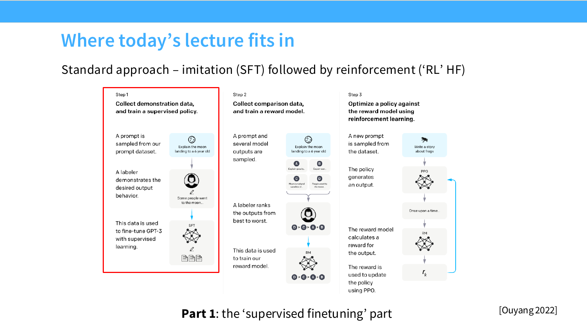

# 第 15 讲：预训练之后——中训练、SFT 与 RLHF

> 课程：Stanford CS336, Spring 2026；讲义标题为“After Pretraining (Mid/Post Training)”。本文依照[第 15 讲官方 PDF 讲义](https://github.com/stanford-cs336/lectures/blob/main/lecture_15.pdf)的顺序整理。对应的 [B 站合集 P15](https://www.bilibili.com/video/BV11LEA6eEuj/?p=15) 仅作分集定位；正文以讲义为主，个别明确标时间戳的补充来自 Stanford Online 原版英文字幕，不声称全片逐句核对。

## 一、从会续写到会听指令

预训练把模型训练成强大的文本续写器，但用户希望的是“按我的意图回答、遵守边界、用合适格式输出”。讲义把后续训练的核心问题写成三件事：想要的行为数据是什么，如何使用这些数据，以及是否仍需要巨大规模。常见路线是先做**监督微调（SFT, Supervised Fine-Tuning）**，再用**人类反馈强化学习（RLHF, Reinforcement Learning from Human Feedback）**进行偏好优化。讲义提醒：公开的后训练配方尤其是新模型的数据细节有限，所以这里描述的是有公开证据的做法和局限，不应推断为所有产品的实际配方。

第 3 页以一个包含四条曲线、误差带、插值、三张动态图和实时饼图的长提示为例：模型按自然语言要求写出可生成这些图的代码。这个案例说明指令可以对输出施加很细的控制；它展示的是一个结果样例，不能据此证明生成代码对所有约束都正确，或证明该能力完全由 SFT 产生。（官方 PDF 第 3 页。）

图源：[Stanford CS336 Spring 2026 第 15 讲官方 PDF 第 6 页](https://github.com/stanford-cs336/lectures/blob/main/lecture_15.pdf#page=6)；课件引用 Ouyang 等人 2022 年的 InstructGPT 流程。红框标示本讲先讲 SFT，后续再讨论偏好与强化学习。

一个贯穿本讲的区分是：SFT 学习“示范者会怎样写”，RLHF 则用“评价者更喜欢哪一个”来改变输出分布。两者测到的东西可能不同：人类能识别一篇摘要较好，却未必能自己写出同等质量的摘要。这就是讲义提到的生成与验证差距（G-V gap, Generation–Verification gap），也是偏好优化的动机。

第 33 页的新闻摘要对照是这个动机的具体边界：自由撰稿人摘要与 Instruct-Davinci 摘要在图中总体偏好接近 **50.4% 对 49.6%**，标注者间一致性系数 $\alpha$ 约 **0.07**。它支持“人写的示范不自动等于人评最喜欢的答案”，同时低一致性提醒我们：对困难摘要题，偏好标签本身也可能噪声很大。（官方 PDF 第 33 页；图来自 Zhang 等人的新闻摘要研究。）

**面试速述：** 预训练学续写，SFT 用示范调指令行为，RLHF 用偏好比较进一步优化输出。能判断好答案不等于能写出好示范，所以两种信号互补；公开配方不足以概括所有模型。

## 二、SFT 数据如何演进：从任务模板到工具轨迹

讲义按开放数据的演进列出 FLAN、Self-Instruct、Alpaca、ShareGPT/Vicuna、OpenAssistant、WizardLM、Tulu 3、Nemotron，以及工具使用数据。这不是严格的单一质量排行榜，而是可见的数据形态在变：

| 讲义中的例子 | 样本形态 | 给模型的训练信号 |
|---|---|---|
| FLAN | 分类、摘要、结构化数据转句子等任务的指令与答案 | 理解任务描述并输出合适结果；常像传统 NLP 基准 |
| Alpaca | 生活建议、概念解释、简单编程等较短问答 | 通用助手口吻与基础指令遵循 |
| OpenAssistant | 更开放、较长的解释和带参考文献的回答 | 对话详略、复杂知识陈述和引用形式 |
| Nemotron 的代码 SFT 样本 | 带角色、工具调用与工作流的轨迹 | 何时调用工具、怎样组织多步任务 |

讲义中 OpenAssistant 的“劳动市场买方垄断”回答带着具体参考文献。模型可能从中学到某项知识，也可能只学到“被要求引用时要写出像引用的格式”。**格式模仿与引用真实性必须分开评估**。讲义里的 Nemotron 示例还显示，现代 SFT 不只是单轮自然语言答案，甚至包括工具调用和代理式流程；训练轨迹中的无关或错误步骤同样可能被模仿。

**面试速述：** SFT 训练样本从任务指令与答案扩展到开放对话和工具轨迹，学习目标也包括多步行为。模型会模仿数据中的错误引用或工具步骤，数据形式丰富不等于事实和执行能力可靠。

### 2.1 风格、能力、知识不是同一个指标

从 FLAN 到后来的对话数据，显著差别包括答复长度、条目化、详细程度和工具使用。偏好评测尤其容易受到长度与文风影响：更长的答案可能更容易获胜，但这不等于事实更正确或任务能力更强。讲义同时指出，这些风格差异对某些传统基准成绩影响小得多。因此应至少分开观察**偏好胜率、客观任务正确率、事实性、长度与格式**，避免把一个分数误读成“模型整体更聪明”。

第 17 页散点图把“偏好列表式回答”和“偏好更长回答”分别画出来，在图示的人评与模型评设置里，很多点的列表偏好超过 50%，更长回答的偏好也常明显超过 50%。这两轴是**文风选择**，不是答案正确率；同一系统可因评分者不同落在不同位置。（官方 PDF 第 17 页。）

SFT 的基本目标是最大化示范答案的条件概率。若数据为提示 $x$ 与示范回复 $y=(y_1,\ldots,y_T)$，可写为：

$$
\mathcal L_{\mathrm{SFT}}(\theta)=-\mathbb E_{(x,y)\sim D}\sum_{t=1}^{T}\log\pi_\theta(y_t\mid x,y_{<t}).
$$

实践中通常只对待学习的助手回复计算损失。这一目标能把已有能力调成用户期望的呈现方式，却不会自动验证示范中的事实或代码是否正确。

**面试速述：** SFT 最大化示范回复的条件概率，擅长塑造风格、格式和已有能力的表达。偏好胜率、客观正确率、事实性和长度应分开评估，回复更长不代表能力更强。

### 2.2 为什么“正确事实”也可能使模型变差

讲义用知识提取与对齐研究说明：在模型原本不会的尾部知识上继续做问答式微调，甚至使用事实正确的训练答案，也可能导致开发集效果下降或让模型更容易自信地猜测。原因不能简化为“微调一定不能教知识”：局部问答损失会奖励对某些提示输出答案，但不直接教会模型识别哪些相近问题仍超出其知识边界。模型是否真正储存、能否提取、何时应拒答，是不同问题。

第 20 页曲线更精确地展示这个现象：在所引实验中，训练集上“已知事实”的准确率很快变高，“未知事实”的训练准确率继续随 epoch 上升，但开发集准确率在约第 10 个 epoch 后回落。这里能观察到**训练拟合继续改善而泛化变差**，不能只凭训练正确率判断新增事实被可靠学会。（官方 PDF 第 20 页，Gekhman 等人的图。）

因此讲义的经验结论是：SFT 更适合**提取并组织预训练已具备的行为**，而不是依靠少量问答样本植入大量新事实。对于知识正确性，可以考虑外部检索、可核验反馈或奖励式正确性信号，但这些不是讲义保证有效的万能解。任何包含引文的 SFT 样本都应检查来源和可追溯性。

**面试速述：** 少量事实正确的问答微调也可能让模型对未知问题更自信地猜，因为局部损失没教它识别知识边界。SFT 更稳妥的用途是组织已有能力；新增知识要另做事实性与拒答校验。

### 2.3 安全 SFT：少量针对性样本与长尾场景

面向终端用户的模型还要处理虚假信息、诈骗、垃圾内容等风险。讲义展示的公开安全数据做法包括：从真实用户场景归纳类别，收集会诱发违规或不当行为的提示，再构造恰当的遵守、拒绝、澄清或安全替代回答。Tulu 3 的安全与非顺从数据、WildChat 的真实交互场景、越狱提示研究，都是讲义举的来源例子。

第 24 页的 Tulu 3 表中，`CoCoNot` 一行显示 10,983，`WildJailbreak` 与 `WildGuardMix` 两行都同时显示 50,000 和 26,356；表中有多个计数列，不能只挑较大的数当最终训练量。第 25 页的图把正常请求、危险/敏感话题、请求约束违反等场景分开，也展示从真实用户越狱提示挖掘攻击再组合成新提示的流程。设计安全 SFT 时既要覆盖有害请求，也要覆盖**可正常回答但容易被误拒**的边界。（官方 PDF 第 24–25 页。）

课堂口述给了一个很贴近工程场景的误拒例子：用户问“如何 kill 一个 Python 进程”，这里的 `kill` 是操作系统进程管理，不是伤害人的请求；若只按触发词拒答，就伤害了正常帮助能力。这一例子见[官方原版录像约 29:45–30:01](https://www.youtube.com/watch?v=2oH6PWPrYFo&t=1785s)的英文字幕，属于口述补充而非 PDF 原文；字幕可能有转写误差。

讲义引用的实验显示，在特定测试设置中加入约 **500 条**安全示范，已经能明显改变模型的安全表现；图中的不同测试集改善程度并不相同。这说明少量高针对性的行为样本可以产生大影响，同时不能推断 500 条就覆盖所有风险。安全规则需要覆盖普通请求与恶意请求之间的边界，否则模型可能过度拒绝；长尾场景仍需要更广的数据与评测。

**面试速述：** 安全 SFT 用针对性示范教模型何时遵守、拒绝或澄清，少量样本也可能显著改变行为。它必须覆盖正常请求与风险请求的边界，并以长尾评测检查过度拒绝。

## 三、中训练：把指令数据放进持续预训练阶段

SFT 最直接的实现就是继续做梯度下降。若有大量算力和指令数据，讲义介绍了一个更大规模的三段方案：

1. 在网页等通用数据上预训练。
2. 在后续预训练中混入指令数据，形成所谓 **mid-training / two-phase training**。
3. 最后再做一轮相对短的专门 SFT。

第 2 步仍保留通用语料，让模型在学习指令格式的同时维持原有分布与能力；第 3 步再把交互行为集中调到目标形式。这是一种缓解大量纯指令微调造成遗忘的配方，不意味着“所有指令样本都应无差别重复”。讲义称这一实践在公司中较常见，但公开文档并不完整，并点名 miniCPM、JetMoE 等公开讨论过相关路线。这里的**中训练**是按数据与训练阶段描述的工程术语，不是与 SFT、RLHF 完全互斥的新损失函数。

**面试速述：** 中训练在持续预训练中混入指令数据，仍保留通用语料，最后再用短期 SFT 集中调整助手行为。它是数据与阶段配方，用来缓解纯指令训练的遗忘风险，并非一种独立损失函数。

## 四、偏好数据：从模仿示范到学习比较

SFT 需要参考答案 $y\sim p^*(y\mid x)$；偏好优化则希望找到策略 $\pi$，提高某个关于提示和回答的奖励 $R(x,y)$ 的期望。典型数据是一条提示 $x$ 下的两条候选 $y_w$、$y_l$，标注者选择前者（winner）优于后者（loser）。这种反馈比“写出完美答案”容易提供，但“更喜欢”必须通过明确规范变成可学习信号。

讲义展示的 InstructGPT 标注规范会权衡**有帮助、真实、无害**，也要求考虑任务意图、是否臆造事实、是否偏离指令及可能造成的损害。在比较界面里还可以表达“稍微更好”，并非每一对都差距巨大。候选来源、提示分布、呈现顺序、评分指导与标注者培训都会改变标签含义。

**面试速述：** 偏好数据让标注者在同一提示的候选回答中选优，利用“会比较”但未必“会写示范”的反馈。标签受候选生成、规范和标注人群影响，不能当成客观统一的质量尺度。

### 4.1 人工标注的质量和代表性

众包的难点不是只把任务分发出去：要确认标注者真的查证了事实、能处理专业问题、没有不受控地用其他 AI 代答，并且得到合理报酬。讲义提到专家标注的增长与劳务伦理问题。标注者群体的背景也会影响模型偏好；关于社会立场、宗教、写作风格及事实错误的研究图表说明，某一人群的偏好不能被当成“所有用户的客观偏好”。例如，讲义引用的研究发现标注者可能更难发现**自信措辞中的事实或一致性错误**。整理数据时宜记录规范、标注者构成、分歧和仲裁方式。

**面试速述：** 人工偏好质量取决于事实核查、专业能力、评分规范和人群代表性。应记录标注分歧及仲裁，尤其防止自信文风掩盖事实错误。

### 4.2 AI 反馈、自训练和长度偏差

讲义展示 GPT-4 作为成对评价器时，在某些实验中与人工系统级排名有很强相关性，并展示 Zephyr、Tulu 3 等项目使用模型生成的反馈。它使标注扩展更便宜，但相关性不保证每个样本、每种领域都正确；评价模型的风格偏好和错误也会进入训练闭环。讲者在约 01:00:25–01:02:55 用 Zephyr、UltraChat/UltraFeedback、Tulu 3 说明一个目标差别：模型标注适于低成本**追赶已有前沿能力**，继续推动前沿仍很依赖人驱动的数据收集。这是当次课对已有案例的经验判断，不是“模型标注永远无法产生新能力”或“人标注总比模型标注好”的定律。

第 45 页左图给出模拟胜率与人工胜率的**系统级** Spearman 排名相关约 0.98、$R^2$ 约 0.87；右图把不同反馈来源的人机一致性与每千条标注成本并排比较。高系统级相关并不意味着 GPT-4 对每一对回答的判断都和某个标注者一致，成本图也受当时模型价格与标注设置限制。（官方 PDF 第 45 页。）

Constitutional AI 的示意图进一步展示**自训练**：模型对有害提示先生成答复，再根据原则自我批评、修订，用修订结果做监督训练；之后还可生成成对样本、得到 AI 偏好并继续训练。此流程依赖原则本身、提示构造和反馈模型。无论反馈来自人还是模型，都要特别检查**长度效应**：标注者常把完整、详尽和正确混在一起，优化后模型可能越来越长。

第 48 页提供一个直观例子：同一个“成年人为何不会从床上滚落”的问题，SFT 前回答约 **59 token**，RLHF 后约 **243 token**，主要仍是相似解释但多了细节。旁边的奖励—长度分布图也显示两者相关；因此比较优化器时要同时看胜率与回复长度，避免把新增文字直接当成新增知识。（官方 PDF 第 48 页；该例是课件所引研究中的对照。）

**面试速述：** AI 反馈和自我修订能低成本扩展偏好数据，适于追赶已有能力；推进新能力仍可能需要人驱动的数据。评判模型的错误与文风偏好会进入训练闭环，无论人评还是机评，都要控制长度偏差，避免把啰嗦当成正确。

## 五、奖励模型：把成对判断变成可优化的数

传统 RLHF 先训练奖励模型 $r_\phi(x,y)$，对一条回复给出标量。常用 Bradley-Terry（BT）成对概率假设是：

$$
P_\phi(y_w\succ y_l\mid x)=\sigma\bigl(r_\phi(x,y_w)-r_\phi(x,y_l)\bigr),\qquad \sigma(z)=\frac{1}{1+e^{-z}}.
$$

据此最小化负对数似然：

$$
\mathcal L_{\mathrm{RM}}(\phi)=-\mathbb E_{(x,y_w,y_l)\sim D}\log\sigma\bigl(r_\phi(x,y_w)-r_\phi(x,y_l)\bigr).
$$

奖励的**差**决定偏好概率：同一提示下给两个回答都加同一个常数，预测不变。因此标量奖励不是跨所有任务天然可比的绝对“质量单位”。Stiennon 等工作的例子还会把参考答案的奖励均值归零，方便后续优化。BT 假设把复杂、多目标、可能矛盾的人类判断压成一个分值；对事实正确性、冗长、礼貌的取舍若没写清，奖励模型学到的可能是数据中的捷径。

第 52 页给出奖励模型的具体实现轮廓：从监督基线模型初始化，加随机初始化的线性标量输出头，用成对摘要判断训练，最后把参考摘要上的平均奖励归零。后续 PPO 的值函数模型使用**与策略分开的参数**、由奖励模型初始化；三种模型在该实验中同规模。这些是 Stiennon 摘要实验的配置，不是 BT 公式本身要求的结构。（官方 PDF 第 52 页。）

**面试速述：** 奖励模型用成对偏好训练标量分数，BT 概率只取决于同一提示下的奖励差。这个分数是偏好代理而非跨任务绝对质量，标注中的风格捷径会被一起学进去。

## 六、近端策略优化（PPO, Proximal Policy Optimization）：在线采样，并限制策略走太远

有了奖励模型，策略可以生成新回复并接收奖励。讲义以 InstructGPT 和 Stiennon 的工作解释：提示 $x$ 是环境给出的状态，模型生成完整回复 $y$，奖励模型在结束时评价；优化时又加入与 SFT 参考策略 $\pi_{\mathrm{ref}}$ 的 Kullback–Leibler 散度（KL 散度）约束，以降低奖励过优化和输出分布漂移。常见的总体目标写作：

$$
\max_\theta\;\mathbb E_{x\sim D,\,y\sim\pi_\theta(\cdot\mid x)}[r_\phi(x,y)]
-\beta\,\mathbb E_{x\sim D}\!\left[D_{\mathrm{KL}}\bigl(\pi_\theta(\cdot\mid x)\,\|\,\pi_{\mathrm{ref}}(\cdot\mid x)\bigr)\right].
$$

InstructGPT 的图还给出把预训练梯度混进 PPO 更新的 **PPO-ptx** 变体；其中 $\beta$ 控制 KL 惩罚，额外的预训练损失系数控制语言建模梯度。不要把“带 KL 的 RLHF 目标”直接当作 PPO 的全部实现。

讲义把算法动机压缩成三个台阶：直接策略梯度使用 $\nabla_\theta\mathbb E_{z\sim\pi_\theta}R(z)=\mathbb E[R(z)\nabla_\theta\log\pi_\theta(z)]$，估计方差可能太高；信赖域策略优化（TRPO, Trust Region Policy Optimization）试图限制策略更新范围；PPO 则通过对新旧策略概率比做裁剪，取得较易操作的近似。其常见代理目标为

$$
\mathbb E_t\!\left[\min\!\left(\rho_t A_t,\;\operatorname{clip}(\rho_t,1-\epsilon,1+\epsilon)A_t\right)\right],\quad
\rho_t=\frac{\pi_\theta(a_t\mid s_t)}{\pi_{\mathrm{old}}(a_t\mid s_t)}.
$$

这里 $A_t$ 衡量某个生成动作相对基线的好坏。实际流程还要处理采样、价值函数、优势估计、KL、不同长度序列和奖励尺度，因此讲义称 PPO 路线复杂且容易受实现细节影响。它同时列出几种不用在线 PPO 的设想：给好坏样本加控制标记，只训练优选答案，或生成多个候选由奖励模型挑最好再做模仿；这些都是不同的训练取舍。

**面试速述：** PPO 在线采样后用奖励模型更新策略，概率比裁剪控制单次更新，参考策略的 KL 项限制整体漂移。它能利用新生成的回答，却需要价值估计、优势计算和采样系统，复杂度与实现细节都较高。

## 七、直接偏好优化（DPO, Direct Preference Optimization）：用偏好对直接更新策略

DPO 从上面的 KL 正则目标出发。先假定可以在**所有条件分布**中寻优，其最优策略与奖励的关系为

$$
\pi_r(y\mid x)=\frac{\pi_{\mathrm{ref}}(y\mid x)\exp(r(x,y)/\beta)}{Z(x)},\qquad
r(x,y)=\beta\log\frac{\pi_r(y\mid x)}{\pi_{\mathrm{ref}}(y\mid x)}+\beta\log Z(x).
$$

将这个“由策略隐含的奖励”代入 BT 偏好概率，同一提示的两个回答相减时 $\log Z(x)$ 抵消。令可训练策略为 $\pi_\theta$，便得到讲义第 57 页的 DPO 损失：

$$
\mathcal L_{\mathrm{DPO}}(\theta)=-\mathbb E_{(x,y_w,y_l)\sim D}\log\sigma\!\left[
\beta\log\frac{\pi_\theta(y_w\mid x)}{\pi_{\mathrm{ref}}(y_w\mid x)}
-\beta\log\frac{\pi_\theta(y_l\mid x)}{\pi_{\mathrm{ref}}(y_l\mid x)}
\right].
$$

例子：对同一“写摘要”提示，$y_w$ 忠实概括且简洁，$y_l$ 遗漏关键事实；优化会提高前者相对后者的**参考校正后对数概率差**。这不等于无条件提高所有优选回答概率：参考策略、$\beta$、两条回复当前概率，以及成对分类错误程度都参与梯度。若 $\Delta$ 表示方括号内的差，损失对它的梯度是 $-\sigma(-\Delta)$；模型越把顺序判断错，更新权重越大。DPO 不需要训练独立奖励模型，也省去在线 rollout 和 PPO 外循环，但仍依赖可靠偏好对及参考策略，并没有消除数据偏差。

讲义随后提到与 expert iteration 结合的开放模型实践，及两个长度相关变体：**SimPO** 去掉参考策略、按回复长度规范化对数概率并设偏好间隔；**length-normalized DPO** 在 DPO 的对数概率项中按长度规范化。这些方法的目标之一是减弱长回答在序列概率和偏好标注中的混杂作用。讲义也强调，PPO 在某些设置下仍能达到同样或更好的效果；算法排序高度依赖训练和评测设置。

第 59 页流程图把 expert iteration 展开为：收集提示 → 每题采样 $K$ 个候选 → 奖励模型辅助拒绝采样 → 用留下的答案做 SFT → 再用偏好对训练 DPO；上一轮较好的模型还可为下一轮候选生成提供起点。因此图中的最终 DPO 模型并非只靠一次离线 DPO 损失得到，数据生成、筛选和重复迭代也参与了效果。（官方 PDF 第 59 页。）

**面试速述：** DPO 利用 KL 正则目标与 BT 偏好关系，直接提高优选回答相对劣选回答的参考校正对数概率差。它省去独立奖励模型和在线 PPO，却仍依赖偏好对质量、参考策略及长度偏差控制。

## 八、奖励过优化、熵塌缩与概率校准

奖励模型只是人类偏好的代理。不断把代理分数推高，模型可能发现评分器漏洞：表面更讨喜，真实偏好却先升后降。讲义第 63 页的曲线显示，在人类偏好和有噪声的模型偏好实验中，越过某个优化强度后，代理奖励继续升而评价胜率下降；另一组接近无噪声的模型反馈没有出现同样拐点。**过优化风险随反馈噪声与分布外程度改变**，不能从单一实验推断固定阈值。

偏好优化还可能把概率质量集中到少数“高分说法”，降低输出多样性或熵。更深的影响是**校准**：当模型说某答案概率为 $0.8$，在许多同类问题中约八成正确，才叫相应意义上的校准。预训练的概率目标与偏好排序目标不同，后训练提高胜率后，概率不一定仍可解释为正确率。讲义第 64 页用校准曲线和熵分布展示了这种偏移；不是说 RLHF 后模型完全没有概率分布，而是说概率默认不再是可靠的事实置信度。

第 64 页右上角的一组图中，预训练模型约 **0.82 准确率、0.007 期望校准误差（ECE, Expected Calibration Error）**，PPO 后模型约 **0.78 准确率、0.074 ECE**；下方熵分布也发生变化。它是课件引用的某个实验设置，说明“偏好训练可改变校准”这一风险，不是对所有模型的普遍数值结论。（官方 PDF 第 64 页。）

因此同时监测代理奖励与独立人工偏好、客观正确率、拒绝行为、长度、输出多样性及校准，比只看单一奖励曲线更能发现副作用。KL 约束可限制偏离参考策略，但不能代替真实评测。

**面试速述：** 奖励过优化时可能出现代理分数继续上升、独立评测中的真实偏好反而下降；偏好训练也可能压低输出熵并破坏概率校准。要用独立正确率、偏好、多样性和校准评测，KL 约束不能代替这些检查。

## 九、自测与参考答案

**1. FLAN、Alpaca、OpenAssistant 与工具轨迹的主要区别是什么？** 从基准任务形式，逐步扩展到通用助手问答、长篇开放解释及显式工具调用。它们改变的是行为分布，数据名字本身不能证明能力单调增加。

**2. 为什么一条带真实引用的 SFT 示例仍可能导致错误引用？** 模型可能只学到引用外观，没有学会核验来源，也可能把局部事实泛化到不适用的问题。需要独立核验事实性和引用可追溯性。

**3. 中训练与最终 SFT 的分工是什么？** 中训练在继续预训练时混入指令数据，兼顾通用语料和交互信号；最终 SFT 更集中地把输出调为目标助手形式。

**4. 在 BT 奖励模型中，给同一提示的两条奖励都加 10，偏好概率会怎样？** 不变，因为 $\sigma(r_w-r_l)$ 只看差值。

**5. PPO 的 KL 项与 PPO 裁剪是一回事吗？** 不是。前者限制策略偏离参考 SFT 模型；后者在更新时限制新旧策略概率比，作用位置和参照对象不同。

**6. DPO 为什么不用估计 $Z(x)$？** 同一提示的优选与劣选回答做隐含奖励差，两个 $\beta\log Z(x)$ 相消。

**7. 代理奖励持续升高但人工胜率下降，说明什么？** 可能出现奖励过优化。需要检查奖励模型的噪声、分布外候选和真实偏好，而不是继续只追代理分数。

**8. RLHF 后模型的 token 概率可直接当作“答案正确概率”吗？** 不能。排序和奖励优化可能改变熵与校准，必须用独立数据检验概率与正确率的对应关系。

**本节小结：** 自测集中检验 SFT、中训练、PPO 和 DPO 的分工，以及奖励差、KL 与校准等容易混淆的概念。

## 十、来源与核对边界

- [Stanford CS336 Spring 2026 课程页](https://cs336.stanford.edu/)及[第 15 讲官方 PDF 讲义](https://github.com/stanford-cs336/lectures/blob/main/lecture_15.pdf)：本文的结构、术语、案例和讲义图表结论依据。公式中 SFT 损失、BT 与 PPO 裁剪的标准记法是为帮助复习而展开；DPO 主公式和推导按讲义第 56–58 页核对。
- [Stanford Online 第 15 讲原版录像](https://www.youtube.com/watch?v=2oH6PWPrYFo)：供观看和时间定位；实际复核使用经校验的第三方归档副本、英文字幕及抽取画面。安全 SFT、标注偏好、DPO 和“追赶已有能力／推进前沿”的口述已重点抽查；字幕可能转写不准，未人工逐帧观看或逐句核对全片。
- [B 站合集 P15](https://www.bilibili.com/video/BV11LEA6eEuj/?p=15)：中文分集入口，未以配音版字幕作依据。
- 讲义引用的进一步阅读：[InstructGPT](https://arxiv.org/abs/2203.02155)、[Learning to Summarize from Human Feedback](https://arxiv.org/abs/2009.01325)、[DPO](https://arxiv.org/abs/2305.18290)、[Tulu 3](https://arxiv.org/abs/2411.15124)、[Constitutional AI](https://arxiv.org/abs/2212.08073)。这些链接帮助追查原始研究，本文没有把论文的全部实验当作本讲直接讲授内容。

**本节小结：** 本讲以官方 PDF 的结构和图表为依据，标准公式作复习性展开；录像中的标时口述经重点核对并与课件事实分开标注，其他口述不作逐句覆盖保证。
