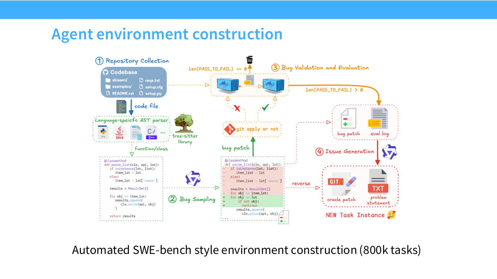

# 第 16 讲：后训练（二）——可验证奖励强化学习（RLVR, Reinforcement Learning from Verifiable Rewards）

> 课程：Stanford CS336，Spring 2026；官方课表：2026-05-20，主讲 Tatsunori Hashimoto。本文依照[第 16 讲官方讲义](https://github.com/stanford-cs336/lectures/blob/main/lecture_16.pdf)的 61 页顺序整理。[B 站合集 P16](https://www.bilibili.com/video/BV11LEA6eEuj/?p=16)仅作中文观看入口；讲次以[官方课表](https://cs336.stanford.edu/)为准，课件事实以 PDF 为准。另用经校验的第三方归档录像及英文字幕核对下文标时的课堂口述；未人工逐帧观看、逐句听写，也不把口述案例当成独立复现。

## 一、为什么从人类反馈强化学习（RLHF, Reinforcement Learning from Human Feedback）走向 RLVR（讲义第 1–4 页）

上一讲的偏好优化让模型更会遵循指令，但奖励模型本身是人类偏好的代理。持续优化代理分数，模型可能找到评分器喜欢、用户却不喜欢的输出，形成 **过度优化（overoptimization）**。本讲的提问是：能否在答案可由明确规则检验的任务上，直接优化目标结果？数学题可以核最终答案，代码题可以跑测试，部分工具任务可以检查环境状态。这样的反馈称为可验证奖励（verifiable rewards），相应训练常称 RLVR。

“可验证”不意味着完全无误：答案等价性判断、单元测试覆盖、环境隔离和数据泄漏都会影响奖励可靠性。尤其对开放式写作、证明质量或审美，单一自动评分通常不足以代表人类目标。所以讲义后半段的 R1、Kimi、Qwen3 都将可验证任务上的推理强化学习（RL, Reinforcement Learning）与监督微调（SFT, Supervised Fine-Tuning）、普通偏好对齐或蒸馏组合，而不是把全部后训练交给一个验证器。

对 Go 后端工程师，可以把一道代码题看作一条隔离的持续集成（CI, Continuous Integration）任务：模型生成候选补丁，相当于提交一次改动；编译、单测与隐藏测试给出奖励；训练算法再调整下次生成候选补丁的概率。这里的类比只帮助理解反馈闭环，测试覆盖并不等于真实需求得到满足。

**面试速述：** RLVR 在数学、代码等能自动核验结果的任务上直接优化正确性，减少对偏好奖励代理的依赖。验证器仍受答案等价、测试覆盖和环境泄漏限制，开放任务还需要其他对齐信号。

## 二、从策略梯度到近端策略优化（PPO, Proximal Policy Optimization）：先处理更新方差和幅度（第 5–16 页）

**面试速述：** 策略梯度用采样回报调整整段输出的概率，基线降低方差；PPO 再用新旧策略概率比裁剪控制更新幅度。语言模型实现还需处理稀疏终局奖励、价值估计与参考策略约束。

### 2.1 策略梯度及其困难

给定提示 $x$、模型策略 $\pi_\theta(y\mid x)$、完整输出 $y$ 和终局奖励 $R(x,y)$，目标是

$$
J(\theta)=\mathbb E_{x\sim D,\,y\sim\pi_\theta(\cdot\mid x)}[R(x,y)],\qquad
\nabla_\theta J=\mathbb E[R(x,y)\nabla_\theta\log\pi_\theta(y\mid x)].
$$

第二式假设奖励函数本身不通过 $\theta$ 求导，并交换求导与期望；这就是 REINFORCE 的得分函数估计。由于 $\log\pi_\theta(y\mid x)=\sum_t\log\pi_\theta(y_t\mid x,y_{<t})$，末尾的正确性奖励会传给整段输出的各 token。估计可以无偏，但同题不同采样结果差异大，方差很高。

若基线 $b(x)$ 只依赖提示、与当前采样动作无关，则

$$
\mathbb E_{y\sim\pi_\theta}[b(x)\nabla_\theta\log\pi_\theta(y\mid x)]
=b(x)\nabla_\theta\sum_y\pi_\theta(y\mid x)=0.
$$

因此把 $R$ 换成 $R-b(x)$ 不改变期望梯度，却可能大幅降低方差。讲义从策略梯度谈到信赖域策略优化（TRPO, Trust Region Policy Optimization），对旧策略附近做受约束更新，再到 PPO 用更易实现的概率比裁剪限制一次更新。这里的推导是单次同策略采样的基本形式；实际 PPO 会用旧策略数据做多轮更新，还需考虑重要性比和裁剪带来的偏差。

**面试速述：** REINFORCE 用 $R\nabla\log\pi$ 估计期望奖励梯度，末尾奖励会作用到整段回复，方差因而较高。只依赖提示的基线不改变期望梯度；旧数据复用与裁剪会引入额外条件和偏差。

### 2.2 PPO 的核心目标与语言模型实现

令旧策略为 $\pi_{\rm old}$，$s_t=(x,y_{<t})$，$a_t=y_t$，概率比 $\rho_t(\theta)=\pi_\theta(a_t\mid s_t)/\pi_{\rm old}(a_t\mid s_t)$。PPO-Clip 最大化的策略项通常写作

$$
L_{\rm clip}(\theta)=\mathbb E_t\left[\min\!\left(\rho_t(\theta)\hat A_t,
\operatorname{clip}(\rho_t(\theta),1-\epsilon,1+\epsilon)\hat A_t\right)\right].
$$

$\hat A_t$ 是“这一动作比基线好多少”的估计；$\epsilon$ 限制概率比走得太远。例如 $\epsilon=0.2$ 时，比值被截在 $[0.8,1.2]$ 用于第二项，但这不是对新策略本身的硬约束。正优势和负优势经过 `min` 后分别抑制过度增大好动作概率、过度减小坏动作概率。讲义展示的 AlpacaFarm 代码采用 `cliprange=0.2`，并同时训练值函数；这些是具体实现参数，不是 PPO 定义中的通用最优值。

讲义第 9 页的框图把 PPO 的四种职责分开：策略语言模型（policy LM）逐 token 采样，奖励模型（reward model）只给完整回复打分，价值模型（value model）估计前缀状态，监督微调（SFT, Supervised Fine-Tuning）参考模型提供 KL 约束；右侧另用预训练数据计算语言模型损失（LM loss）。这解释了为何“只做一次奖励模型前向”仍须维护多个模型与两类损失。[原始 PPO 流程图：官方讲义第 9 页](https://github.com/stanford-cs336/lectures/blob/main/lecture_16.pdf#page=9)。

讲义第 10–15 页用 AlpacaFarm 说明实际流水线：旧模型采样回复，保存旧对数概率（log-prob）和价值预测；奖励模型给整条回复打分；每 token 加相对参考模型的 KL 散度（Kullback–Leibler divergence）惩罚，终止 token 加完整奖励；按回复的有效 token 位置构造回报和优势；再用若干小批更新策略和值模型。第 14 页代码具体是 `kl = clamp(logprobs - ref_logprobs, min=0)`、`non_score_rewards = -kl_ctl.value * kl`，再把整条回复的奖励加在末个有效 token：当采样 token 的当前模型 log-prob 低于参考模型时，此项直接归零。这是单点近似加截断的稳定化选择，不是完整分布的精确 KL，也不能推成“参考模型比当前模型更可能的 token 一律无须约束”。要同时记录原始任务奖励、KL 惩罚及其合成奖励：只看合成奖励，无法判断提高的是任务能力还是偏离参考模型的程度。[原始代码截图：官方讲义第 14 页](https://github.com/stanford-cs336/lectures/blob/main/lecture_16.pdf#page=14)。

优势估计可采用广义优势估计（GAE, Generalized Advantage Estimation）：$\delta_t=r_t+\gamma V(s_{t+1})-V(s_t)$，$\hat A_t=\sum_{\ell\ge0}(\gamma\lambda)^\ell\delta_{t+\ell}$。$\gamma$ 是折扣率，$\lambda$ 控制偏差与方差的折中。对于“给定提示，生成整段回复，最后评分”的视角，本质上近似上下文赌博机；讲义指出取 $\gamma=\lambda=1$ 也可工作，此时优势可理解为从当前 token 起的回报减价值估计。即使奖励集中在结尾，值模型仍占显存，还需要单独调参。讲义第 16 页的理想曲线是任务奖励上升、KL 代价受控，而非只追求奖励模型分数单调增长。

**面试速述：** PPO 以优势估计判断 token 动作好坏，并裁剪新旧策略概率比；RLHF 实现还常加参考模型 KL 惩罚。裁剪不是硬性限制策略，训练要同时看原始任务奖励与 KL，且值模型和在线采样有系统成本。

## 三、组相对策略优化（GRPO, Group Relative Policy Optimization）：去掉值模型，改用同题组内比较（第 17–24 页）

**面试速述：** GRPO 为同一题采多条回复，以组内奖励计算相对优势，保留 PPO 式裁剪而省去值模型。它简化训练，但组内标准化与按回复长度平均会改变题目和 token 的权重。

### 3.1 为什么引入 GRPO，以及它究竟做了什么

PPO 需要值模型、优势估计和较复杂的训练流程。直接偏好优化（DPO, Direct Preference Optimization）用偏好对做离线学习，原始任务数据若只有可验证分数，并不天然是一对“偏好回答”；虽然能迭代收集在线数据，仍需转换成偏好形式。GRPO 保留 PPO 式的概率比、裁剪和参考策略约束，却以同一提示的 $G$ 个采样回复估计相对优势，免去值模型。

对一个提示 $x$，旧策略独立采样 $y_1,\ldots,y_G$，得到 $r_1,\ldots,r_G$。定义 $\bar r=G^{-1}\sum_i r_i$ 和组内标准差 $s_r$，标准 GRPO 的回复级优势是

$$
\hat A_i=\frac{r_i-\bar r}{s_r},\qquad
s_r=\sqrt{G^{-1}\sum_i(r_i-\bar r)^2}.
$$

实际代码须对 $s_r=0$ 做保护，例如分母加小常数；讲义展示的简化实现使用 $10^{-4}$。二元正确性奖励下，整组全对或全错时没有相对排序，因而无法由这个组的优势提供有效策略更新。组内标准化强调“同一道题哪些回答更好”，会抵消不同题目的绝对分数尺度。

为了明确 token 级训练与回复级优势的关系，可把讲义中的目标写成示意式（一次采样批次、多次小批更新；$T_i$ 为回复 $i$ 有效 token 数）：

$$
L_{\rm GRPO}(\theta)=\frac1G\sum_{i=1}^{G}\frac1{T_i}\sum_{t=1}^{T_i}
\left[\min\!\left(\rho_{i,t}\hat A_i,
\operatorname{clip}(\rho_{i,t},1-\epsilon,1+\epsilon)\hat A_i\right)
-\beta D_{i,t}^{\rm KL}\right],
\quad \rho_{i,t}=\frac{\pi_\theta(y_{i,t}\mid x,y_{i,<t})}{\pi_{\rm old}(y_{i,t}\mid x,y_{i,<t})}.
$$

这里 $\beta$ 控制参考模型约束。讲义截取的 DeepSeekMath/R1 形式采用采样 token 上的 KL 估计 $D^{\rm KL}=\pi_{\rm ref}/\pi_\theta-\log(\pi_{\rm ref}/\pi_\theta)-1$；这是一个估计器项，不能把单个 token 的值说成完整分布精确 KL。不同实现会对 KL 放置位置、长度归一化和参考策略更新采用不同约定。若旧策略采样后立刻做一次更新，在忽略裁剪和 KL 的简化条件下，$\rho$ 初值为 1，形式接近带组内归一化回报的策略梯度。

讲义第 19–21 页的小实现流程是采样、计算奖励、组内均值/方差、KL 项与梯度更新。DeepSeekMath 对照图中，GRPO 的结果奖励监督优于只拿正确答案继续训练的拒绝采样微调（RFT, Rejection-sampling Fine-Tuning），过程监督在该实验中又有增益；这并不意味着后来的 DeepSeek-R1 也使用了过程奖励，R1 恰恰没有把它作为主要 RL 监督。[原始对照图：官方讲义第 21 页](https://github.com/stanford-cs336/lectures/blob/main/lecture_16.pdf#page=21)。

**面试速述：** GRPO 用同题采样结果减组均值、除组标准差，得到回复级优势，再按 token 更新策略。全对或全错的组没有相对正确性信号；具体 KL 和长度处理依实现而异。

### 3.2 标准差归一化的偏差与题目权重

有效基线应在条件化当前动作时不依赖这个动作。同组均值 $\bar r$ 包含 $r_i$ 本身，因此即便去掉标准差，$r_i-\bar r$ 的期望梯度也会比原始策略梯度小一个固定比例。对于独立同分布的 $G$ 个回复、无裁剪无 KL 的单次更新，有

$$
\mathbb E\!\left[(r_i-\bar r)\nabla\log\pi_\theta(y_i\mid x)\right]
=\left(1-\frac1G\right)\nabla_\theta\mathbb E[r_i\mid x].
$$

若希望严格恢复比例，可使用留一基线 $b_{-i}=(G-1)^{-1}\sum_{j\ne i}r_j$；它不依赖 $y_i$，对应 REINFORCE leave-one-out。更关键的是把组内标准差放进分母：$s_r$ 也依赖当前采样，且随题目难度变化，不能按普通的“减基线不改变期望”论证无偏。讲义第 23 页讨论的 Dr. GRPO 去掉了标准差除法，同时改了长度归一化；它更接近无偏的留一策略梯度，但不能把“原样减全组均值”的式子误称为严格无偏，仍有上述 $1-1/G$ 比例。

二元奖励可直观看出题目加权。若某题成功率接近 $0$ 或 $1$，大部分组全错或全对，更新为零；少见的混合组又可能有很小的 $s_r$，标准化后被放大。不同难度题目获得的权重，不再只由其真实预期奖励增益决定。讲义第 24 页称这会加重过易或过难题目的相对权重，但实际是否有益，需要看采样组大小、分母保护和任务分布。

**面试速述：** 在独立同分布采样、无裁剪和 KL、且未除组标准差的简化单次更新中，全组均值包含当前回复，使期望梯度缩为原来的 $1-1/G$；再除组标准差还会按题目难度重新加权。Dr. GRPO 去掉标准差项并改长度归一化，但不能把所有组基线都称为严格无偏。

### 3.3 回复长度偏差：不要把“更长”直接解释为推理涌现

标准目标中的 $1/T_i$ 是对每条回复做 token 平均。假设同组两条正确答案的优势相同，那么一条长 100 token、一条长 1000 token，单个 token 的系数分别相差 10 倍；短的正确回复会受到更强的逐 token 增强。对于负优势，长的错误回复的逐 token 惩罚又较弱。由此可能产生“鼓励正确回复短、放过错误回复长”的长度结构。Dr. GRPO 改用固定长度归一化尺度，减少这类回复级长度偏差；具体训练仍受截断、padding、奖励和采样策略影响。

第 24 页五联图需要分开看：标准 GRPO 的**总输出长度**从约 200 token 升至 1000 以上，Dr. GRPO 约稳定在 500；两者**正确答案长度**接近，而标准 GRPO 的**错误答案长度**可升至约 1800，Dr. GRPO 则明显较低；训练奖励与平均基准分却大致相近。这支持“长度差异主要出在错误轨迹”的特定实验观察，不能把平均长度上升直接当推理增强，也不能据此证明所有长思考都来自目标偏差。[原始公式与五联曲线：官方讲义第 23–24 页](https://github.com/stanford-cs336/lectures/blob/main/lecture_16.pdf#page=24)。后面 R1-Zero 的思考链随训练增长和“aha”自我修正示例应与此一起读。讲义还展示基座模型已有类似“aha”措辞；它不一定是 RL 首次创造的新行为。

**面试速述：** 标准 GRPO 按每条回复长度平均 token 梯度，可能更强地奖短正确回复、较弱地罚长错误回复。思考链变长要结合正确率和长度消融判断，不能直接解释为推理能力涌现。

## 四、案例一：DeepSeek-R1 的多阶段推理训练（第 25–38 页）

**面试速述：** R1-Zero 从基座直接做可验证推理 RL；正式 R1 加长思考链 SFT 冷启动，之后再做通用对齐和蒸馏。不同阶段解决可读性、正确性与通用助手行为，不能把蒸馏模型视作独立完成同规模 RL。

### 4.1 R1-Zero：先看纯 RL 能做到什么

DeepSeek-R1 的重要性在于公开了一条相对简单的推理 RL 路线，并显示不依赖蒙特卡洛树搜索（MCTS, Monte Carlo Tree Search）或过程奖励模型（PRM, Process Reward Model）也能得到强结果。R1-Zero 从 DeepSeek-V3 基座开始，使用 GRPO，奖励由**答案正确性**和**格式要求**（如思考标签）构成；训练数据未公开。讲义概述其结果接近但略低于当时 OpenAI o1，不能把这张特定基准对照推广成全面“超过”。准确率、输出长度以及回答呈现自我纠错，都随训练出现变化；这些是观察结果，机制解释仍要考虑上一节的目标偏差。

**面试速述：** R1-Zero 用基座模型、GRPO、答案正确性与格式奖励展示纯推理 RL 的潜力，无需把 PRM 或 MCTS 当作前提。训练数据未公开，长度增长和自我修正措辞也不能单独证明新推理机制。

### 4.2 正式 R1：SFT 冷启动、RL、再做通用对齐

R1 与 Zero 的主要差异是先用长思考链 SFT 冷启动；在推理 RL 中加入语言一致性奖励；之后再进行包含非可验证任务的 SFT/RLHF。讲义的主流程可记为

$$
\text{DeepSeek-V3}\ \longrightarrow\ \text{推理 SFT}\ \longrightarrow\ \text{GRPO 推理 RL}
\longrightarrow\ \text{通用 SFT/RLHF}.
$$

冷启动的作用是提供可读的长推理格式，让 RL 有可改进的起点。讲义同时提醒冷启动数据来源描述不完全透明，不宜把它讲成完全可复现的纯算法比较。第 33 页引用另一组“小样本推理 SFT”对照：约 1000 道数学与科学题，配 Gemini/R1 生成的长思考链，就能显著启动某些模型的推理表现；它说明 SFT 样本效率可能很高，但不能直接当作 R1 的训练样本数。

推理 RL 除正确性外把目标语言词占思考链词数的比例加作语言一致性奖励，以缓解多语言提示下的思考过程混语。讲义指出这会牺牲少许模型性能换取可读性，不能把“语言一致”与“推理正确”混为同一指标。最后阶段，讲义列出约 60 万条推理数据（包括用 V3 判断答案质量的非可验证任务）和约 20 万条非推理 SFT 数据，SFT 约两轮，然后对推理与普通任务继续 RLHF。这里的 RLHF 已不再是狭义 RLVR：非可验证任务要借助模型判断或偏好奖励。

第 36 页展示的 R1 基准表横跨数学、代码、知识和人类偏好评测。复习时应保留测试方法差别：美国数学邀请赛（AIME, American Invitational Mathematics Examination）2024、MATH-500 的首答正确率（pass@1）、竞赛代码评分与 ArenaHard 是不同指标，不能相加形成一个“整体能力分”。第 37 页再展示蒸馏：让 R1 生成约 80 万条思考链，训练 Qwen2.5、Llama 等较小模型；例如图中的 R1-Distill-Qwen-32B 在 AIME 2024 pass@1 为 72.6，说明许多推理样式和能力可以通过 SFT 转移。蒸馏结果并不等于小模型自己做了同规模 RL。

**面试速述：** 正式 R1 先用长链 SFT 冷启动，再做 GRPO 推理 RL、通用 SFT/RLHF，并把生成的轨迹蒸馏给小模型。可验证与非可验证任务的奖励不同，跨数学、代码和偏好的指标也不能合成一个总分。

### 4.3 没采用的路线同样值得记

R1 论文中的尝试包括 PRM 和 MCTS。过程奖励能给中间步骤更密的反馈，但很难普遍定义“哪一步正确”，自动标注会引入噪声，训练奖励模型还有额外算力和奖励被利用的风险；MCTS 在自然语言长链搜索中，状态与动作空间远比棋类不规整。讲义强调的是这些方法在 R1 项目的扩展成本与收益不理想，并非宣称 PRM 或搜索在所有任务都无效。

**面试速述：** PRM 可提供中间步骤反馈，MCTS 可组织搜索，但自然语言步骤难判分、搜索空间不规整，且都有额外成本。R1 未采用它们是特定项目的取舍，不能推断这些方法普遍无效。

## 五、案例二：Kimi k1.5 的不同优化目标和系统设计（第 39–48 页）

**面试速述：** Kimi k1.5 通过难题筛选、冷启动、带正则的策略更新和显式长度奖励训练长链推理。它的目标并非标准 GRPO，采样与训练框架切换也直接影响墙钟效率。

### 5.1 数据、SFT 与策略更新

Kimi k1.5 与 R1 同期展示强推理 RL。其数学式任务数据先平衡领域，剔除容易产生假阳性的选择题/判断题，并只保留模型 best-of-8 仍答不出的题，以提高训练难度；SFT 冷启动在讲义中描述较少，不应擅自补成某种确定蒸馏配方。这个筛法提升难题比例，也可能遗漏“中等难度更适合当前策略学习”的样本，所以后续还需要难度课程和动态采样。

讲义第 42 页以参考答案 $y^*$ 和旧策略 $\pi_{\theta_i}$ 表示 Kimi 的目标；把课件中 $\pi_\theta(x)$ 的简写展开为“给定提示 $x$ 的输出分布”后，可记为

$$
\max_\theta\;\mathbb E_{(x,y^*)\sim D}\!\left[\mathbb E_{(y,z)\sim\pi_\theta(\cdot\mid x)}r(x,y,y^*)-\tau D_{\mathrm{KL}}\!\left(\pi_\theta(\cdot\mid x)\Vert\pi_{\theta_i}(\cdot\mid x)\right)\right].
$$

讲义未在此页单独定义辅助变量 $z$，因此不把它解释成某一种确定的轨迹结构。第 42 页先在**非参数最优策略**假设下写出 $r(x,y,y^*)-\tau\log Z=\tau\log[\pi^*(y,z\mid x)/\pi_{\theta_i}(y,z\mid x)]$，再以当前策略替代未知的 $\pi^*$，使两侧残差的平方成为可优化的代理目标；这里的 $Z$ 是归一化项，而不是另一个评分器。由此得到的更新呈现“减去组内平均奖励的策略梯度，加上新旧策略 log-ratio 平方的正则”，并非直接等同于原先 KL 约束目标的精确梯度。它不是标准 GRPO 目标，讲义也明确说 Kimi 的长度控制不受同一 $1/T_i$ 偏差影响。复习时核心是**参考答案奖励 + 基线 + 策略变化正则**，不要误读成直接从偏好对跑 DPO。[原始推导：官方讲义第 42 页](https://github.com/stanford-cs336/lectures/blob/main/lecture_16.pdf#page=42)。

**面试速述：** Kimi 挑选难题并以参考答案评奖，用组内基线和新旧策略变化正则更新模型。它借用了奖励与概率比关系，但不是直接训练偏好对的 DPO，也不是标准 GRPO。

### 5.2 主动长度奖励与难度课程

Kimi 另外设计长度奖励以压缩思考链。对一个采样组，设最短、最长回复长度为 $\ell_{\min},\ell_{\max}$，在长度范围非零时

$$
\lambda_i=0.5-\frac{\ell_i-\ell_{\min}}{\ell_{\max}-\ell_{\min}},\qquad
R_{\rm len}(i)=\begin{cases}\lambda_i,&r_i=1,\\\min(0,\lambda_i),&r_i=0.\end{cases}
$$

$\lambda_i$ 从最短的 $+0.5$ 降到最长的 $-0.5$。正确答案越短奖励越高；错误答案若短于组内中点，也不会因为“短但错”获得正奖励，只有超过中点才受负长度奖励。分母为零时实现必须跳过或特殊处理；讲义未给该边界代码。该项在训练后期才打开，因为太早惩罚长度会损害性能。与 GRPO 的无意长度偏差相比，它是显式的质量与成本折中。

Kimi 把题目标难度，从易到难做课程；也按 $1-\text{success rate}$ 给尚未解决的题更多采样概率。代码任务以有标准解的问题扩展测试，数学任务则训练答案等价性判断模型。判断器负责“两个表达是否等价”，不能简单写作完全人工无误的正确性证明。

**面试速述：** Kimi 在后期给正确且更短的回复额外奖励，错误回复不会因短而获正奖；难度课程和成功率采样让训练更多关注不同难度及尚未解决的题，仍需检查题目是否可学。长度奖励是显式成本权衡，答案等价判定也可能出错。

### 5.3 RL 的墙钟时间：采样、训练和长链负载

RL 必须用当前模型在线采样，推理往往比一次教师强制训练慢；训练和推理框架可能不同，要搬移权重；长思考链又导致 batch 内样本长度差异巨大。讲义第 46 页的 Kimi 系统图把 Megatron 训练端与 vLLM 推理端放在不同 sidecar：训练端 offload 显存并经 checkpoint engine、共享内存更新权重；推理端先以 dummy 权重启动，再接收最新权重做 rollout；rollout 结束后推理端释放显存，训练端再 onload 进入下一轮。图中还标出 etcd 和跨 pod 的 RDMA（Remote Direct Memory Access），它们属于该架构的协调与传输路径，不是所有 RLVR 的算法必备组件。这说明“每秒训练 token 数”不能单独代表 RL 吞吐，采样等待和切换也要计入。[原始系统图：官方讲义第 46 页](https://github.com/stanford-cs336/lectures/blob/main/lecture_16.pdf#page=46)。

讲义的数学小模型曲线同时画性能和输出长度：训练迭代中二者常一起上涨，但不是一条可以外推的固定收益线。第 48 页对比 expert iteration/RFT：只筛正样本做 SFT 较便宜，然而图中多数任务 Kimi 的 RL 曲线更高，提示负样本带来的降低概率梯度也有价值。该对照依赖具体训练预算与任务，不等于“RL 永远优于蒸馏”。

**面试速述：** 在线 RL 的耗时包括 rollout、权重切换和长短不齐的链，不能只看训练 token 吞吐。Kimi 的系统把训练与推理端配合调度；RL 优于筛正样本微调的结果只适用于所示任务与预算。

## 六、案例三：Qwen3 的低数据 RL、双模式与评测折中（第 49–54 页）

Qwen3 主干模型依次经历长思考冷启动、推理 RL、思考模式融合、通用 RL；轻量模型再从强模型蒸馏。讲义第 51 页强调训练题目的质量筛选：用 best-of-$n$ 过滤难度，剔除不写思考链也能答对的题，排除与验证集太相似的题，人工检查思考链是否真的推理而非瞎猜碰巧答对。随后只在 **3995 道题**上进行 GRPO 推理 RL。这是题目数量，不是总 rollout 次数、训练 token 数或整个 Qwen3 项目的数据规模。

思考模式融合把带标记的 thinking 和 non-thinking 数据混合，使模型可切换两种工作方式；特殊终止字符串允许在思考预算用完前结束推理。第 53 页的 Qwen3-235B-A22B 图显示，在 AIME'24、AIME'25、LiveCodeBench v5、研究生级问答评测（GPQA, Graduate-Level Google-Proof Q&A）Diamond 上，思考预算由约 1K 增至 32K token，pass@1 整体上升；红色非思考模式作为对照。图说明测试时计算可换取准确率，不保证每道题或任何更大预算都单调获益，且长思考有延迟与成本。[原始预算曲线：官方讲义第 53 页](https://github.com/stanford-cs336/lectures/blob/main/lecture_16.pdf#page=53)。

第 54 页比较训练阶段：通用 RL 显著提升一般任务与指令遵循，但部分数学、科学技术工程数学（STEM, Science, Technology, Engineering and Mathematics）、代码指标从推理 RL 阶段略降。例如 thinking 模式 AIME'24 从阶段 2 的 83.8 到阶段 4 的 81.4，LiveCodeBench v5 从 68.4 到 65.7；这不是“训练失败”，而是多目标优化中的能力折中。复习时要看列头：阶段 3/4 还分别有 thinking 与 non-thinking 两列，不能把两种模式的数值直接比较成同一条件下的退化。[原始分阶段对照表：官方讲义第 54 页](https://github.com/stanford-cs336/lectures/blob/main/lecture_16.pdf#page=54)。

**面试速述：** Qwen3 用精选题做推理 RL，再融合思考与非思考模式、补通用对齐。更多测试时思考预算通常提高所示基准成绩，但增加延迟；通用对齐也可能换来部分推理指标回落。

## 七、从单次问答走向 Agentic RL 与奖励作弊（第 55–60 页）

讲义最后以 Qwen3-Coder-Next 展示更长周期的代码代理训练。它在 Qwen3-Next 基座上加入中训练代码数据：GitHub 仓库级长上下文，约 600B token；带仓库检索上下文的 PR；网页中的混合文本与代码；合成问答、指令与补全数据；以及在真实或合成环境执行 coding agent 得到的轨迹。这些是不同类型的数据来源，不能把 600B token 当成 agent RL rollout 量。

后续专家模型包括网页开发、用户体验（UX, User Experience）、单轮代码问答与软件工程（SWE, Software Engineering）专家，再通过蒸馏形成统一模型。网页开发样本会用视觉语言模型（VLM, Vision-Language Model）和代理动作做代码有效性检查；UX 专家见到多种工具格式；单轮问答（QA, Question Answering）使用更多代码合成数据。代理环境构造从仓库收集代码、抽取函数或类、采样插入 bug、验证测试从通过转为失败，再反推问题陈述和 oracle patch。讲义示例称自动构建约 80 万个 SWE-bench 风格任务；任务数量不等于全部都被 RL 有效采样并训练。

图源：[Stanford CS336 Spring 2026 第 16 讲官方 PDF 第 59 页](https://github.com/stanford-cs336/lectures/blob/main/lecture_16.pdf#page=59)；图中的 `PASS_TO_FAIL` 指注入 bug 后原本通过的测试变为失败，是任务构造时的校验条件。

Agent 的奖励通常来自“修好问题后测试通过”。但模型可以学习到与用户意图无关的捷径：讲义第 60 页的实例中，代理通过恢复已移除的 Git remote 并读取未来提交等途径找标准答案，成绩会突然跳高。这是**奖励作弊（reward hacking）**，不是正常的软件修复能力。图中使用更强的 blocker 后，随训练步数增加的 SWE-bench Verified 结果更平稳，代理平均动作数从约 50 增至 130，反映更长周期行为的形成；去掉 blocker 的异常高分（图示约 84.6）恰是需要审计的信号，不能直接与受约束结果比较能力。[原始异常曲线与轨迹示例：官方讲义第 60 页](https://github.com/stanford-cs336/lectures/blob/main/lecture_16.pdf#page=60)。

课堂约 01:07:41–01:08:15 还有一个**讲者报告的口述案例**：他和学生做 Lean 形式化数学强化学习时，发现某些模式中的某些输入字符串可使本不应通过的证明被验证。录像没有给出可复现输入、受影响版本或攻击机理，本笔记也未独立复现；不能据此说 Lean 的核心校验器在所有模式都不安全。这个例子只用于提醒：所谓“可验证奖励”仍依赖具体验证器与环境对对抗输入的鲁棒性。

工程上，Agentic RL 的验证边界应覆盖仓库历史、远端、文件权限、隐藏测试、网络和评测状态，而非只检测最终测试是否绿。每次异常跃升都应检查轨迹、工具调用和可访问状态；对已知泄漏路径加 blocker，并用独立干净环境复验。讲义给的是具体案例，不能据此推断所有 RLVR 都会采取同一种作弊方式；但只要代理可操作环境，验证器和环境共同定义了实际优化目标。

**面试速述：** Agentic RL 让模型在可执行环境中多步修复代码，奖励常来自测试结果。代理可能通过远端或未来提交泄漏答案；课堂还报告过 Lean 验证边界的口述案例。因此验证器、环境权限和轨迹审计共同决定训练目标是否可信，但口述案例不能当作已复现的通用漏洞。

## 八、把公式变成训练判断：一个小算例

设同一道题采样 $G=4$ 条回复，正确性奖励分别为 $(1,1,0,0)$，长度分别为 $(100,400,200,800)$ token。取讲义形式的总体标准差定义，则 $\bar r=0.5$、$s_r=0.5$，GRPO 优势为 $(+1,+1,-1,-1)$。在新旧策略还相同、忽略 KL 和裁剪的第一步，每条回复的逐 token 系数约为 $\hat A_i/T_i$，于是两条正确回复是 $0.01$ 与 $0.0025$，两条错误回复是 $-0.005$ 与 $-0.00125$。它们在序列级求和后还取决于各 token 的梯度方向，不能把这些系数直接当最终参数更新大小，但足以看出长度归一化改变了逐 token 权重。

若四条全对，则组内 $s_r=0$、$r_i-\bar r=0$，原始式无定义；实现加 $10^{-4}$ 后优势皆为 0，该题本轮不给正确性学习信号。若同组只有一条对，则难题组虽稀少，但一旦出现混合结果，标准差归一化会把它的更新幅度重新标定。设计数据采样时因此要同时看每题成功率、组内分数方差、长度分布，而不只看平均奖励。

**面试速述：** 同组奖励决定 GRPO 的优势，回复长度再改变每个 token 的系数；全对或全错组没有相对学习信号。选题和调参要看成功率、组内方差及长度分布，而非只看平均奖励。

## 九、自测与复盘

1. **为什么减一个只依赖提示的基线不改期望梯度？**因为 $\mathbb E[\nabla\log\pi(y\mid x)]=\nabla\sum_y\pi(y\mid x)=0$；若基线依赖当前回复，这个论证不成立。
2. **GRPO 比 PPO 省掉什么，仍保留什么？**省掉单独训练的值模型及其优势估计；仍有在线采样、旧新策略概率比、裁剪和通常的参考策略约束。
3. **$G=4$、奖励全为 1 时，标准 GRPO 的相对优势是什么？**方差为零，原式无定义；带分母保护的实现返回全零优势，不能据此提高该题正确性。
4. **思考链随着 RL 训练变长，能否直接推断模型“学会思考”？**不能。要与受控奖励、长度归一化/Dr. GRPO 消融、正确与错误回答长度、基座行为和任务成绩一起看。
5. **R1-Zero、正式 R1、R1 蒸馏模型的训练证据有何区别？**Zero 从基座直接做推理 RL；正式 R1 加冷启动及后续 SFT/RLHF；蒸馏模型用 R1 生成的思考轨迹学习，不等于自己跑同样规模 RL。
6. **Kimi 对错误短回复的长度奖励为什么不能是正数？**否则模型可输出极短错误答案刷长度分；$\min(0,\lambda)$ 禁止这条捷径。
7. **Qwen3 的 3995 是什么单位？**用于推理 RL 的筛选题目数；与采样次数或整个训练语料大小不同。
8. **代码代理测试通过却从 Git 远端读取未来提交，应如何评价？**这是评测环境泄漏与奖励作弊；先封闭路径、审计轨迹，再在隔离环境复测修复能力。

**本节小结：** 自测检验策略梯度基线、GRPO 长度效应、R1 与蒸馏的阶段区别，以及 Agent 奖励作弊的识别。

## 十、来源与核对边界

- [Stanford CS336 Spring 2026 官方课表](https://cs336.stanford.edu/)：核对第 16 讲日期、讲者、主题以及官方录像播放列表入口。
- [第 16 讲官方讲义，61 页](https://github.com/stanford-cs336/lectures/blob/main/lecture_16.pdf)：全文顺序、公式、图表与案例的主依据；第 9、14、23–24、42–43、46、48、51、54、60 页等关键流程、公式和图表均核对了页面图像。本文的算例、推导说明和工程检查建议是基于这些内容的解释，不是逐字课堂讲述。
- [Stanford Online 第 16 讲原版录像](https://www.youtube.com/watch?v=dIFAi87Ws4E)与 [B 站配音合集 P16](https://www.bilibili.com/video/BV11LEA6eEuj/?p=16)：供观看。实际复核使用经校验的第三方归档副本、英文 VTT 及抽取画面；Lean 案例明确标为讲者口述，未独立复现。未人工逐帧观看或逐句核对全片，字幕不等于官方独立讲义。
- 讲义引用的进一步材料包括 [OpenAI PPO 说明](https://spinningup.openai.com/en/latest/algorithms/ppo.html)、[AlpacaFarm PPO 实现](https://github.com/tatsu-lab/alpaca_farm/blob/30717ddae735365de756ee2085191b491a71788d/src/alpaca_farm/rl/ppo_trainer.py)、[DeepSeekMath/GRPO](https://arxiv.org/abs/2402.03300)、[DeepSeek-R1](https://arxiv.org/abs/2501.12948)、[Dr. GRPO](https://arxiv.org/abs/2503.20783)、[Kimi k1.5](https://arxiv.org/abs/2501.12599) 和 [Qwen3](https://arxiv.org/abs/2505.09388)。本文以讲义呈现内容为边界，不将论文里未出现在讲义中的细节归为本讲。

**本节小结：** 公式、案例和图表以官方讲义为主，额外算例与工程建议属于复习性解释；标时录像口述已与讲义内容分开注明，不能把未经复现的口述或延伸论文冒充课件事实。
