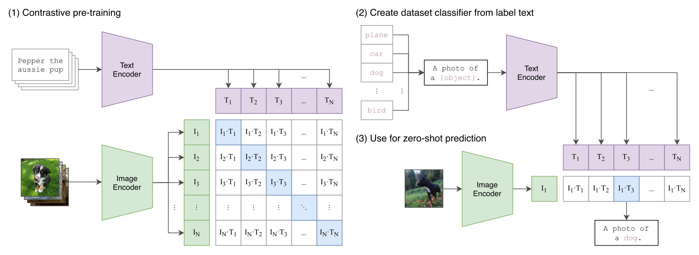
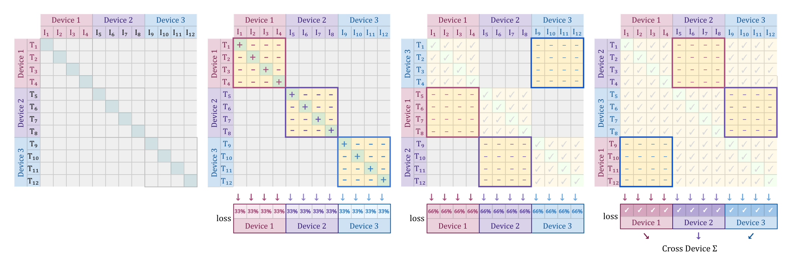
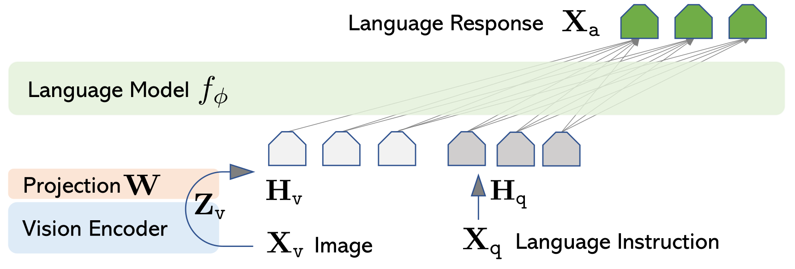
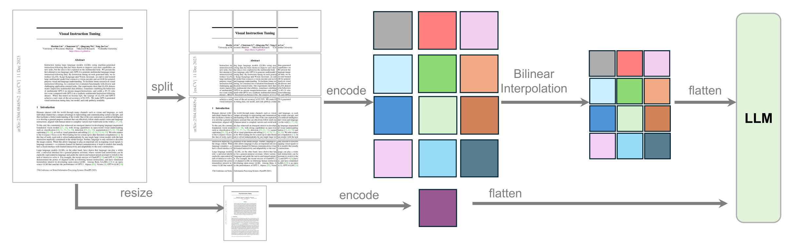
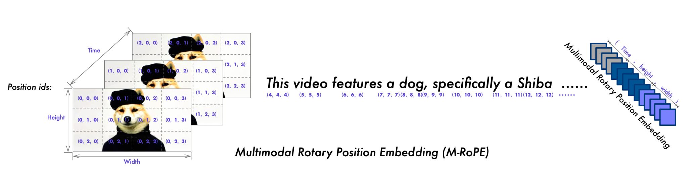
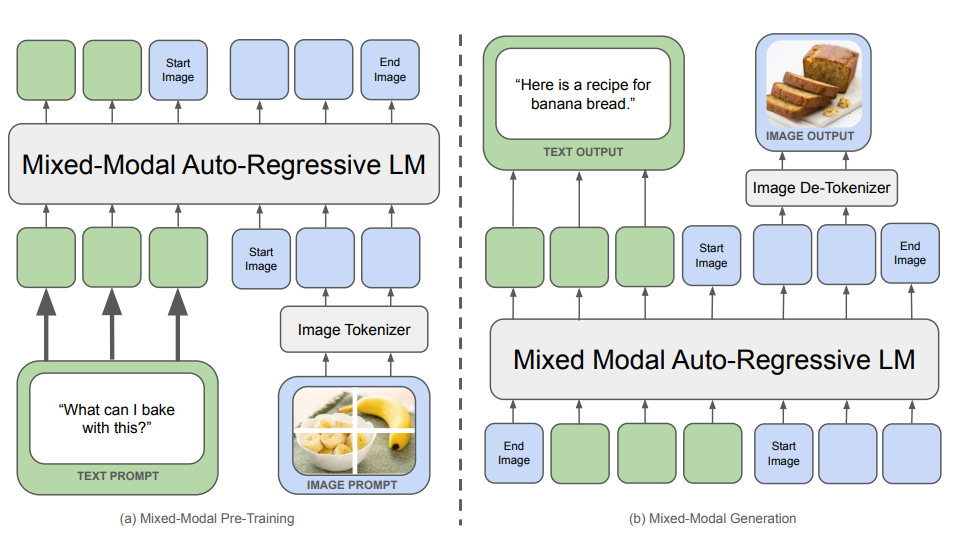

# 第 17 讲：多模态模型——从图文对齐到统一生成

> 课程：Stanford CS336，Spring 2026；官方课表日期：2026-05-27；主讲：Percy Liang。本文按[第 17 讲官方可执行讲义](https://cs336.stanford.edu/lectures/?trace=lecture_17)的顺序整理。[B 站合集 P17](https://www.bilibili.com/video/BV11LEA6eEuj/?p=17)仅作观看入口。文中的公式推导与小例子用于复习；个别标明时间戳的口述补充来自原版英文字幕，尚未逐帧或逐句核对全片。

## 一、从文本模型到多模态模型

前面的大语言模型主要处理“文本输入 → 文本输出”。现实任务同时包含图像、视频、声音与文本。讲义提出的终极方向是 **omni model（全模态模型）**：输入可以是任意模态组合，输出也可以是任意模态组合。眼下的共同起点仍是 Transformer，而 Transformer 接收的是一串表示信息单元的 token（词元）。因此核心问题不是简单地“把图片放进提示词”，而是：怎样将非文本信号转为模型可处理的表示？怎样让模型再输出非文本信号？

这两个方向的要求并不相同。问“图里是什么动物”主要需要语义；读很小的文字需要保留局部细节；生成图像还要重建颜色、纹理和空间结构。因此图像**理解**使用的连续视觉特征，不一定天然适合图像**生成**。本讲先从图文对齐学视觉表示，再看把表示注入语言模型的视觉语言模型（VLM，Vision-Language Model），最后看用离散图像 token 同时处理理解与生成的 Chameleon。

**面试速述：** 多模态模型要把图像等信号变成 Transformer 可处理的表示，并决定如何输出非文本内容。语义理解、细节读取和图像生成的表示要求不同，不能只靠增大文本模型解决。

## 二、CLIP：用海量图文对学习可迁移的视觉表示

**面试速述：** CLIP 用图像与文字双编码器和 batch 内对比学习，让匹配图文靠近，从海量弱标注数据学习开放词汇视觉语义。它适合检索和零样本分类，但裁剪与全局表示可能丢局部细节。

### 2.1 图文配对为何能替代逐类标注

传统图像分类通常依赖人工标好类别的图片。互联网上的“图片 + 周边文字/标题”虽然噪声多，却规模大，能提供开放词汇的语义信号。[CLIP（Contrastive Language-Image Pretraining，对比式语言图像预训练）](https://arxiv.org/abs/2103.00020)将图像编码器 $f$ 与文本编码器 $g$ 分别训练到同一个向量空间：匹配的图文相似度高，不匹配的低。讲义给出其数据收集方式：约 50 万个查询，每个查询约取 2 万图文对，最终训练集为约 4 亿对；原数据集未公开。[OpenCLIP](https://arxiv.org/abs/2212.07143)是后续复现路线，所用 LAION-5B 还借助 CLIP 做过滤。不要把这两个数据集说成同一份。

设一个 batch 有 $N$ 对 $(I_i,T_i)$。分别得到归一化向量 $u_i=f(I_i)/\|f(I_i)\|$、$v_j=g(T_j)/\|g(T_j)\|$，相似度矩阵为 $s_{ij}=u_i^\top v_j/\tau$，$\tau$ 是温度参数。对第 $i$ 张图，正确文本是第 $i$ 条；对第 $i$ 段文本，正确图片也是第 $i$ 张。对称对比目标可写成

$$
\mathcal L_{\rm CLIP}=\frac{1}{2N}\sum_{i=1}^{N}\left[-\log\frac{e^{s_{ii}}}{\sum_{j=1}^{N}e^{s_{ij}}}-\log\frac{e^{s_{ii}}}{\sum_{j=1}^{N}e^{s_{ji}}}\right].
$$

第一项在每一行做“图找文”，第二项在每一列做“文找图”。例如 batch 中有“猫”“飞机”“树”三张图与三条配文，对“猫图”而言“飞机文”和“树文”就是 batch 内负例；同理“猫文”要在三张图中选择猫图。负例来自同一批数据，所以大 batch 会提供更多对照，但完整矩阵需要计算并汇聚 $N^2$ 个图文相似度。讲义以 32,768 为 batch 示例，并强调大 batch 与全 batch softmax 的系统代价。上式是把讲义中的双向分类过程写成复习公式，不表示图文相似度已校准成真实概率。

图源：官方 `lecture_17.py::clip()`，`images/clip.png`。左侧沿矩阵对角线读正例、沿同行/同列读负例；右侧把类别名填入 `A photo of a {object}` 模板，编码成候选文本向量，再与待分类图像比较得到零样本预测。因此图不只展示训练损失，也连起了训练与下游分类用法。

**面试速述：** CLIP 把配对图文作为正例、同批其他组合当负例，双向 softmax 同时训练图找文和文找图。互联网配文可替代封闭类别标注，但噪声与 batch 内相似度矩阵带来数据和系统成本。

### 2.2 编码器和预处理决定“看见”什么

CLIP 的图像预处理把不同分辨率的原图按短边缩放到 336 像素，再中心裁剪为 $336\times336$。这让模型输入整齐，却可能裁掉边缘文字、物体或上下文。视觉端试过 ResNet-50 与 [视觉 Transformer（ViT，Vision Transformer）](https://arxiv.org/pdf/2010.11929)。讲义介绍了 ResNet 路线中的 attention pooling（注意力池化）：以全局平均激活作查询，再通过注意力汇聚空间特征；最佳配置为 ViT-L/14@336px，其中 14 表示 $14\times14$ 图像 patch（小块）。文本端是 12 层、约 6300 万参数的 GPT-2 Transformer，把 `[BOS] ... [EOS]` 编进去，取最高层的 `[EOS]` 表示。

训练好后，做零样本分类时可把候选类别写成文本提示，编码后与图像比较相似度，选择最高者。讲义的代表性结果是：CLIP 在 ImageNet 上的零样本表现超过用 120 万张 ImageNet 标注图像训练的 ResNet-50。这是特定实验结果，不意味着 CLIP 在细粒度读字、定位或所有视觉任务上都更好。讲义还对比了“从图像直接预测整段文字”：图文排序式训练在该实验中更省计算，因为它学习匹配关系，无需自回归生成完整描述。CLIP 获得的是由嘈杂自然语言监督塑造的语义表示，其预处理和评测也明显偏向分类式任务。

[官方 CLIP 计算效率对照图](https://github.com/stanford-cs336/lectures/blob/main/images/clip-efficiency.png)对应的是“图文排序”与“由图生成文字”的训练效率比较；它不能单独证明 CLIP 在图片说明生成任务上更好。（官方 `lecture_17.py::clip()`。）

**面试速述：** CLIP 的图像缩放、中心裁剪和编码器决定模型实际保留的视觉信息；零样本分类靠候选文本与图像相似度排序。分类效果不能外推到读小字、定位或生成任务。

## 三、SigLIP：把 batch 内匹配改成逐对二分类

[SigLIP（Sigmoid Loss for Language-Image Pre-Training，图文预训练的 sigmoid 损失）](https://arxiv.org/abs/2303.15343)保留图像和文本编码到共同空间的思路，改变训练目标。CLIP 要对一整行或整列做 softmax；SigLIP 则对每一对图文判断“匹配/不匹配”。令 $y_{ij}=+1$ 当 $i=j$，其余为 $-1$，用 logit $z_{ij}=a\,u_i^\top v_j+b$，一个便于记忆的形式是

$$
\mathcal L_{\rm SigLIP}=\frac{1}{N}\sum_{i=1}^{N}\sum_{j=1}^{N}\log\bigl(1+e^{-y_{ij}z_{ij}}\bigr).
$$

这里的 $a$ 是可学习尺度，$b$ 是偏置；归一化或正负对重加权的实现细节可依具体代码而变。关键区别是：每个 $(i,j)$ 的 sigmoid 二分类项可单独计算，不要求对全 batch 的一行做归一化。因此可以把图文对的损失分块处理，弱化大规模全局 softmax 的通信与内存约束。“解耦 batch 大小与损失”也不等于没有负例或没有 batch：其他图文对仍是训练信号，只是目标不再要求同一 softmax 分母。

图源：官方 `lecture_17.py::siglip()`，`images/siglip-parallelism.png`。图把图文配对矩阵按设备分块；对角块含正例与负例，非对角块只有负例。各块可分别算 sigmoid 损失，最后仍有跨设备求和（`Cross Device Σ`）。因此“无需共享整行 softmax 分母”不等于完全零通信；全部配对计算与负例规模仍须选择。

讲义介绍其 [WebLI](https://arxiv.org/pdf/2209.06794) 数据：互联网抓取的十亿量级图文对，含自动光学字符识别（OCR，Optical Character Recognition）提取的图中文字，保留质量较高的 10%，覆盖 100 种语言。讲义报告的训练对比为 CLIP 用 256 个 TPUv3 训练约 10 天，SigLIP 用 32 个 TPUv4 训练约 5 天；这是各自配置的观察，不能只从“天数”推导同硬件的精确加速比。实验中 SigLIP 在小于 16K 的 batch 上更好；batch 可扩大到 100 万，但约 32K 已足够，体现继续增大 batch 的收益递减。

**面试速述：** SigLIP 把图文对比改为每对的 sigmoid 匹配判断，损失可分块算，减轻全 batch softmax 的通信依赖。它仍需要正负图文对；不同硬件配置下的训练天数不能直接当成算法加速比。

## 四、标准 VLM：视觉编码器、投影器和语言模型

CLIP/SigLIP 输出视觉语义向量，但用户希望模型能用自然语言回答图片问题。常见 VLM 因此采用三段：**视觉编码器**把图像转为一组特征；**投影器/适配器**把视觉特征映射到语言模型的隐藏维度；**语言模型**把视觉 token 与文字 token 放入同一上下文，自回归生成回答。若视觉编码器给出 $H_v\in\mathbb R^{m\times d_v}$，线性投影器 $W\in\mathbb R^{d_v\times d_{\rm LM}}$ 可得 $Z_v=H_vW$。$m$ 个视觉位置随后成为语言模型可关注的输入位置。这个式子解释维度对齐，并不表示模型已经知道如何回答；还需图文指令数据训练。

**面试速述：** 标准 VLM 用视觉编码器提特征、投影器对齐维度、语言模型结合视觉 token 生成文本。维度接通只是结构条件，还需图文指令训练；没进入视觉特征的细节无法靠投影器补回。

### 4.1 LLaVA：简单投影器加两阶段训练

[LLaVA（Large Language and Vision Assistant，大语言与视觉助手）](https://arxiv.org/abs/2304.08485)使用 CLIP ViT-L/14 视觉编码器，语言端为 Vicuna（基于 LLaMA 的对话微调模型），两者之间先用一个线性投影 $W$。讲义提到 Flamingo、Q-Former 等更复杂的连接法，以突出 LLaVA 的简洁结构。数据构造从 MS COCO 的图像、边框标注和人工配文出发：将配文或检测到的物体信息交给 GPT-4，生成问题与对话，再与原图配对，得到约 15.8 万条样本。注意 GPT-4 在这一步看到的是**文本描述/物体信息**，成品样本才重新配上原图；不能说它直接观察这些原图。

[官方 LLaVA 合成问答流程图](https://github.com/stanford-cs336/lectures/blob/main/images/llava-gen.png)把 COCO 标注、GPT-4 生成与原图重新配对三步分开；它也是判断“教师模型到底看到了什么”的依据。（官方 `lecture_17.py::llava()`。）

*图：第 17 讲[官方讲义源文件](https://github.com/stanford-cs336/lectures/blob/main/lecture_17.py)引用的 `images/llava-architecture.png`；图示结构对应 [LLaVA 原论文](https://arxiv.org/abs/2304.08485)。蓝色视觉编码器经投影 $W$ 形成视觉 token，与灰色文字指令 token 一同供语言模型生成回答。*

训练分两步。第一阶段冻结视觉编码器和语言模型，只训练 $W$，让视觉特征进入语言模型的表示空间；第二阶段继续冻结视觉编码器，训练 $W$ 与语言模型，使回答适应多模态指令。冻结/解冻表可帮助记忆：

| 阶段 | 视觉编码器 | 投影器 | 语言模型 | 目标 |
|---|---|---|---|---|
| 对齐 | 冻结 | 训练 | 冻结 | 使视觉表示能被语言模型读取 |
| 指令微调 | 冻结 | 训练 | 训练 | 学会结合图像与提问生成回答 |

这也解释为什么视觉编码器的细节丢失很难靠后续语言模型补救：如果图片边缘的字在中心裁剪时已消失，投影器无法凭空恢复。

**面试速述：** LLaVA 用 CLIP 视觉端、线性投影器和 Vicuna，先冻结两端训练投影器，再训练投影器与语言模型做图文指令微调。简单连接器能工作，但合成对话的依据和视觉预处理决定它的事实与细节边界。

### 4.2 LLaVA OneVision：高分辨率、多图和视频

[LLaVA OneVision](https://arxiv.org/pdf/2408.03326)将输入范围扩展到单图、多图和视频。讲义所列配置是 SigLIP 视觉编码器（使用最后一层前后的网格特征）、两层多层感知机（MLP，Multi-Layer Perceptron）投影器、Qwen-2 72B 语言模型。这里的关键变化并非只换更大的语言模型，而是让不同输入类型在视觉 token 预算内保留有用信息。

**AnyRes** 的动机是高分辨率图像中的小字、图表细节在 CLIP 式 $336\times336$ 缩放与中心裁剪后容易丢失。做法是把原图按视觉编码器可处理的尺寸切成 $a\times b$ 块，分别编码后拼接视觉特征。若原图非常大，token 数会膨胀，再用双线性插值压缩特征数量。切块提高局部细节覆盖，代价是更长的语言模型上下文和块间关系整合问题。讲义把 AnyRes 的来源记为 LLaVA 1.5；[LLaVA 项目方对 LLaVA-NeXT 的介绍](https://llava-vl.github.io/blog/2024-01-30-llava-next/)则明确把 AnyRes 列为 NeXT 的技术。这里以“按块处理高分辨率 + 控制 token 数”理解方法，不依此讲义判定首次提出版本。

图源：官方 `lecture_17.py::llava_onevision()`，`images/llava-onevision-anyres.png`。图中不只有上方的高分辨率**切块—逐块编码—双线性插值—展平**路径，下方还把整图缩小后编码成一个全局缩略特征，再一起送入语言模型；前者保局部小字，后者给全局布局线索。切块后的特征数量仍受上下文预算限制，压缩与保留细节之间存在取舍。

OneVision 的三种输入采用不同预算：单图可使用较高分辨率；多图中每张图用基础分辨率；视频每帧用更低分辨率。目标是让几类输入产生大致可比的序列长度。可用一个自造例子理解：若总预算约为 $K$ 个视觉 token，单图可把预算集中在一幅海报的细字上；四张图要分给四个画面；视频若采多帧，则每帧还得再压缩。这里的 $K$ 只是解释资源分配，并非讲义规定的固定数值。

[官方单图、多图、视频 token 预算示意](https://github.com/stanford-cs336/lectures/blob/main/images/llava-onevision-modalities.png)直接对照三类输入的分辨率配置；它说明“每帧更低分辨率”的系统理由是总序列长度，而非视频帧天然不需要细节。（官方 `lecture_17.py::llava_onevision()`。）

讲义强调数据“质量优先”与训练“从易到难”，并展示跨模态能力迁移：单图训练的图表能力可迁移到多图任务；单图 OCR 与多图关系推理可共同支持图形界面智能体（GUI agent，Graphical User Interface agent）；单图上的圈选等视觉提示能力可迁移到视频。它们是所展示实验中的迁移现象，不能理解为对任意任务都必然迁移。OneVision 的总结仍是“视觉编码器 + 投影器 + 语言模型”，大量工作实际落在合成、筛选和组织专门的训练数据；讲义还指出模型权重与数据开放。

**面试速述：** OneVision 用高分辨率切块与特征压缩支持单图、多图和视频，并按输入类型分配视觉 token 预算。细节覆盖提升会增加上下文成本；跨模态迁移目前只由所示实验支持，不能直接外推到任意任务。

## 五、Qwen-VL 系列：从固定图像长度走向动态分辨率

**面试速述：** Qwen-VL 系列逐步从固定视觉 token 长度转向随图像分辨率变化的序列，再处理视频时空位置与长上下文。细节保留增加时，token 预算、位置编码和损失权重都要一起设计。

### 5.1 初代 Qwen-VL：交叉注意力压成固定长度

[Qwen-VL](https://arxiv.org/abs/2308.12966)采用 OpenCLIP 的视觉编码器，讲义记为 ViT-bigC，patch 大小 $14\times14$。适配器是一层交叉注意力，带二维位置编码，把视觉信息映射成**固定 256 个**输出位置。``、`<box>`、`<ref>` 等特殊 token 用于标示图像、框和指代相关结构。固定输出长度便于接入语言模型，但分辨率升高时更多视觉细节仍须压到相同的 256 个位置。

讲义列出三阶段训练：第一阶段用大规模、较低质量数据，冻结语言模型，训练视觉编码器和适配器；第二阶段换更高质量、任务专门的数据并提高分辨率，训练全部参数；第三阶段用指令数据，冻结视觉编码器，训练适配器与语言模型。要注意每阶段的冻结范围变化，它体现了先学图文连接、再提升视觉任务能力、最后调整对话行为的路线。

**面试速述：** 初代 Qwen-VL 用交叉注意力把图像压成固定 256 个视觉位置，接入语言模型较方便。分辨率提高仍受固定长度瓶颈；三阶段训练分别处理连接、视觉能力和指令行为。

### 5.2 Qwen2-VL：分辨率与时间进入 token 序列

[Qwen2-VL](https://arxiv.org/abs/2409.12191)使用更大的约 6.75 亿参数 ViT。相比固定 256 个视觉 token，它的重点是**动态分辨率**：不同大小的图像产生不同数量的视觉 token，尽量让高分辨率保留更多信息，同时仍需设置计算预算。讲义描述把图像按 $224\times224$ 区域交给 ViT/14，并将 $2\times2$ 的视觉特征合并：$(224/14)^2/4=64$ 个视觉特征 token，再加图像起止标记 `<|vision_start|>` 和 `<|vision_end|>`，进入语言模型时共 66 个 token。这两个标记及计数也见 [Qwen2-VL 原论文](https://arxiv.org/html/2409.12191)。视频方面，讲义列出每秒采样 2 帧、最多 16,384 个视觉 token 的配置；视频时长、帧分辨率与 token 预算因此互相制约。

位置编码也必须表达图像的**高、宽**，以及视频的**时间**。Qwen2-VL 的多模态旋转位置编码（MRoPE，Multimodal Rotary Position Embedding）将旋转位置编码的维度分配给时间 $t$、高度 $h$、宽度 $w$ 三个坐标；普通文本仍沿序列一维位置前进。可把同一视频中两个 patch 写成 $(t_1,h_1,w_1)$ 与 $(t_2,h_2,w_2)$：即便它们在展开后相隔若干 token，模型仍能区分“同一帧的不同位置”和“不同帧的同一位置”。这只是解释三轴坐标的例子，不是声称注意力一定正确识别物体运动。

图源：官方 `lecture_17.py::qwen2_vl()`，`images/qwen2-vl-mrope.png`。图把各帧图像 patch 标成 $(t,h,w)$，而文字 token 的三个轴使用同一个递增序号（如 $(4,4,4)$、$(5,5,5)$），于是文字仍沿一维顺序前进。图示的是位置如何标记，实际视频理解还取决于帧采样、视觉特征与后续训练。

初始化使用 Qwen2 语言模型与数据过滤网络（DFN，Data Filtering Networks）训练的视觉编码器。训练也分三段：先仅训练视觉编码器，后训练全部参数，最后以指令数据训练语言模型。讲义展示多种视觉能力，但复习时更重要的因果链是：**动态分辨率增加细节覆盖 → 视觉 token 长度随输入变化 → 需要位置编码和预算管理**。

**面试速述：** Qwen2-VL 让高分辨率图像产生更多视觉 token，并用 MRoPE 表示视频时间与图像高宽。这样更能保留细节，却使序列长度和帧预算成为显式成本。

### 5.3 Qwen3-VL：长上下文、交错位置编码与损失平衡

[Qwen3-VL](https://arxiv.org/abs/2511.21631)的语言端是 Qwen3 系列，包括稠密模型及最高 235B-A22B 的专家混合（MoE，Mixture of Experts）配置，讲义给出 256K 的长上下文理解能力；视觉端转向 SigLIP-2。它沿用三轴 MRoPE 的思想，但把时间、宽、高轴**交错**安排到高频和低频维度，如 $[t,w,h,t,w,h,\ldots]$，而不是三个连续维度块 $[t,t,\ldots,w,w,\ldots,h,h,\ldots]$。直觉是让每种轴的信息都分布在不同频段；这是设计动机，不能单凭排列方式推断所有长视频任务必然更好。视频时间戳还作为显式 token 输入，而不是只隐含在位置编码里。

视觉适配采用 **DeepStack**，把视觉信息注入语言模型的多个层，而非只在输入层投影一次。训练方面，讲义列出预训练四阶段：先训练适配器，再分别在 8K、32K、256K 序列长度上训练全部参数；后训练则包括长思维链监督微调（SFT，Supervised Fine-Tuning）、知识蒸馏和强化学习（RL，Reinforcement Learning）。讲义同时指出，数据工作量很大，但详细数据配方披露有限，因此不应把结果全归功于某个单独的架构改动。

长视频样本包含的 token 可能远多于纯文本样本。如果把一个样本中每个 token 的交叉熵直接相加，长样本会按长度获得更大权重。讲义提出按样本 token 数的**平方根归一化**以平衡文本和多模态数据。可将其复习为

$$
\mathcal L_e=\frac{1}{\sqrt{n_e}}\sum_{k=1}^{n_e}\ell_{e,k},
$$

其中 $n_e$ 是样本 $e$ 的受训 token 数，$\ell_{e,k}$ 是逐 token 损失。若两个样本逐 token 平均损失相同，长度分别为 100 与 10,000，未归一化总权重相差 100 倍；除以 $\sqrt{n_e}$ 后约相差 10 倍。公式表达讲义所说的归一化思想，实际训练还可能叠加 batch 与模态采样权重；它不是把长样本和短样本权重完全变成一样。

课堂问答补了一个系统侧约束：视频数据的**读取本身**可能成为吞吐瓶颈，需要让加载与 GPU 计算异步重叠；视频样本 token 数较多也不表示训练时就该让它天然占更大权重，可通过归一化或数据混合权重调整。[官方原版录像约 1:01:24–1:02:31](https://www.youtube.com/watch?v=26FtD08ZpOU&t=3684s)的英文字幕支持这一口述补充；这不是课件公式的额外数学结论，字幕也可能有转写误差。

**面试速述：** Qwen3-VL 结合长上下文、交错时空位置编码和多层视觉注入，并按样本长度平方根调节混合损失。设计旨在兼顾长视频与文本，但公开数据配方有限，不能把效果归因于单一结构变化。

## 六、Chameleon：离散图像 token 的统一自回归路线

前述 VLM 把连续视觉特征送入语言模型，擅长理解后输出文本；若要生成图像，通常另接扩散模型等生成器。[Chameleon](https://arxiv.org/pdf/2405.09818)采取另一条路：把图像也转成**离散 token**，与文本 token 一起组成序列，用统一的自回归目标预测下一个 token。这样同一个模型可以既读图又在序列中输出图像 token，再由图像解码器还原图像。

图源：官方 `lecture_17.py::chameleon()`，`images/chameleon.png`；同一函数还给出交错图文生成实例 `images/chameleon-example.png`。这幅结构图的重点是**输出图像也由模型预测 token**，而非只把视觉特征作为输入后输出文字。

**面试速述：** Chameleon 把图像量化为离散码字，与文字共同做下一 token 预测，使同一自回归模型可读图也可输出图像。统一序列目标简洁，但量化损失与跨模态训练稳定性成为新约束。

### 6.1 VQ-VAE 与图像码本

离散化采用向量量化变分自编码器（VQ-VAE，Vector Quantized Variational Autoencoder）的思想。图像编码器先给出连续局部向量 $z$，从有限码本 $\{e_1,\ldots,e_K\}$ 中找最近的码字编号：

$$
q(z)=\arg\min_{k\in\{1,\ldots,K\}}\|z-e_k\|_2^2.
$$

编号 $q(z)$ 是可放入自回归序列的离散图像 token；解码器再把码字序列重建成图像。训练视觉 tokenizer 时需控制重建误差，实际 VQ-VAE 还有码本与编码器的训练目标；上式仅描述量化步骤。讲义给出的 Chameleon 配置是把 $512\times512$ 图像编码为 1,024 个 token，码本大小 8,192，并重新训练字节对编码（BPE，Byte Pair Encoding）文本 tokenizer。图像 token 能生成，不等于没有信息损失：离散码本和压缩可能抹去细小文字与精确纹理，OCR 之类任务尤其敏感。

[官方 VQ-VAE 编码—码本—解码示意图](https://github.com/stanford-cs336/lectures/blob/main/images/vq-vae.png)对应上式中的码字选择和图像重建两个环节；复习时要把“编号是离散的”与“解码后仍有重建误差”同时记住。（官方 `lecture_17.py::chameleon()`。）

**面试速述：** VQ-VAE 把连续局部图像特征映射到有限码本编号，编号可与文本 token 一起自回归生成，再由解码器还原图像。离散压缩使生成可行，也会损失小字和纹理等细节。

### 6.2 混合训练的稳定性

讲义列出两阶段训练预算：第一阶段约占训练的 80%，用大规模无监督数据，其中纯文本约 2.9T token、图文类约 1.5T token、交错图文约 400B token；第二阶段约占 20%，其中一半沿用第一阶段数据、一半换成高质量数据。这里的 T/B 是 **token 计数**，不是图像张数，也不能把几个数简单看成互斥样本量，因为讲义区分数据形式与阶段配比。

文本 token 的不确定性通常低于图像 token；图像 token 更高熵，混合训练会带来表示范数增长和 logit 漂移。Chameleon 使用查询/键归一化（QK norm，Query-Key normalization）控制注意力查询和键的尺度，使用 z-loss 正则化 logit 归一化项，以改善训练稳定性。直觉上，若 $z=\log\sum_v e^{a_v}$ 是词表 logit 的 log-sum-exp，z-loss 惩罚 $z$ 过度偏离目标尺度；这只是机制说明，具体系数与实现应看原论文。讲义的评价是这种“统一预测离散 token”的形式很整齐，但离散化影响性能，多模态混训也更难稳定。

**面试速述：** 文本与图像 token 的熵不同，混合自回归训练可能让表示和 logit 尺度漂移。Chameleon 用 QK norm 与 z-loss 改善稳定性，但具体效果和系数依训练设置而定。

## 七、把几条路线放在一起复习

| 路线 | 图像进入模型的形式 | 主要训练信号 | 直接生成图像？ | 主要瓶颈 |
|---|---|---|---|---|
| CLIP / SigLIP | 整图或网格的连续语义表示 | 图文匹配 | 否 | 分辨率处理、细节损失、负例与训练规模 |
| LLaVA / OneVision | 连续视觉特征经投影变成语言模型输入 | 图文指令回答 | 否 | 高分辨率 token 预算、数据质量、多图/视频组织 |
| Qwen-VL 系列 | 连续视觉特征经适配器/多层注入 | 分阶段图文与指令训练 | 此讲义讨论的结构不直接生成图像 | 动态长度、时空位置、长序列损失平衡 |
| Chameleon | 视觉 tokenizer 的离散码字 | 混合文本/图像的下一 token 预测 | 是 | 量化信息损失、跨模态训练稳定性 |

从 CLIP 到 SigLIP，是**怎样学到视觉语义对齐**；从 LLaVA 到 Qwen-VL，是**怎样把视觉信息以可控 token 预算接入语言模型**；到 Chameleon，则是**怎样让模型输出图像**。三类问题相连，但无法只凭一个更大 Transformer 自动解决。讲义末尾还指出另一种总体系统方向：连续视觉编码器用于理解，Transformer 负责跨模态推理，扩散模型负责高保真生成。它与离散 token 统一生成各有取舍。

**面试速述：** 选择路线先看任务：CLIP/SigLIP 学图文对齐，LLaVA/Qwen-VL 用连续视觉特征回答问题，Chameleon 用离散图像 token 统一理解与生成。连续特征偏理解，离散生成能输出图像，却要权衡细节损失和训练稳定性。

### 自测

1. CLIP 的一个 batch 有 $N$ 对图文，对第 $i$ 张图和第 $i$ 条文本分别怎样构造正负例？**答：**$(I_i,T_i)$ 为正例；图找文时同批其他 $T_j$ 是负例，文找图时同批其他 $I_j$ 是负例；两个方向分别做 softmax 分类。
2. SigLIP 为什么更容易把损失拆开算？**答：**它对每对图文计算 sigmoid 二分类损失，没有依赖整行/整列求和的 softmax 分母；分块计算仍须有正负图文对。
3. 一张图片的边缘小字在 CLIP 中心裁剪后消失，LLaVA 只增大语言模型能恢复吗？**答：**不能可靠恢复；信息未进入视觉特征。应在视觉预处理和高分辨率编码侧改善。
4. OneVision 为什么给单图、多图、视频不同的单帧分辨率？**答：**因为视觉 token 预算有限，图数和视频帧数增加时，要减少每图/帧 token 才能使总序列长度可控。
5. Qwen2-VL 的三轴 MRoPE 比普通一维位置多表示什么？**答：**图像的高、宽和视频的时间；同一展开序列中的 patch 因此还带有时空坐标。
6. 若 $n_e$ 从 100 增至 10,000，且逐 token 平均损失不变，Qwen3-VL 复习式中的样本损失比例是多少？**答：**$\sqrt{10,000}/\sqrt{100}=10$，比直接求和的 100 倍温和，但长样本仍有较高总权重。
7. Chameleon 为什么可输出图像，又为何可能不适合读极小文字？**答：**它可自回归输出离散图像码字并解码；量化与压缩会损失细节，细小文字容易受影响。

**本节小结：** 自测用正负图文对、视觉 token 预算、时空位置和图像量化检查各路线的关键差别。

## 八、来源与视频核对边界

- [Stanford CS336 Spring 2026 官方课表](https://cs336.stanford.edu/)：核对第 17 讲日期、主题、讲者及官方录像播放列表入口。
- [第 17 讲官方可执行讲义](https://cs336.stanford.edu/lectures/?trace=lecture_17)与[讲义源文件](https://github.com/stanford-cs336/lectures/blob/main/lecture_17.py)：本文顺序、模型配置、数据和数值的主要依据。公式及自测例子是在讲义目标与图示基础上的复习性展开。
- [Stanford Online 第 17 讲原版录像](https://www.youtube.com/watch?v=26FtD08ZpOU)：已导出英文字幕并定点抽查图文对齐、OneVision、Qwen 系列与问答；仅视频加载和损失权重的问答按时间戳标为口述补充。未逐帧或逐句核对全片，字幕可能有转写误差。
- [B 站合集 P17](https://www.bilibili.com/video/BV11LEA6eEuj/?p=17)：仅作中文配音版观看入口；“完整对应”以官方讲义和原版录像为准。
- 讲义进一步链接的原始研究为 [CLIP](https://arxiv.org/abs/2103.00020)、[SigLIP](https://arxiv.org/abs/2303.15343)、[LLaVA](https://arxiv.org/abs/2304.08485)、[LLaVA OneVision](https://arxiv.org/pdf/2408.03326)、[Qwen-VL](https://arxiv.org/abs/2308.12966)、[Qwen2-VL](https://arxiv.org/abs/2409.12191)、[Qwen3-VL](https://arxiv.org/abs/2511.21631) 和 [Chameleon](https://arxiv.org/pdf/2405.09818)；这些链接便于追溯，不把论文里讲义未涉及的结果当作课堂内容。

**本节小结：** 官方可执行讲义是模型配置和案例的依据，公式与小例子用于复习；只有标注时间戳的原版字幕口述补充被单独纳入，其他未核对口述及论文额外结果不算已确认的课堂内容。
