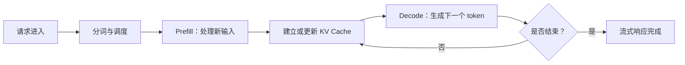
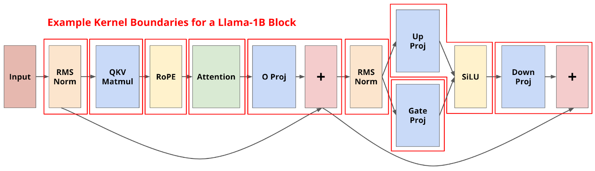
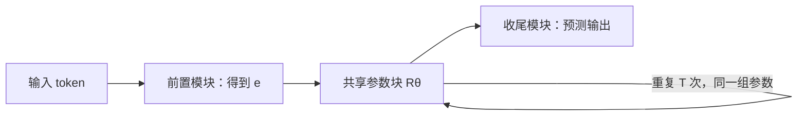

# 第 19 讲：Dan Fu 嘉宾课——推理系统、Megakernel 与循环模型

> 课程：Stanford CS336，Spring 2026；官方课表日期：2026-06-03；讲者：Dan Fu。[原版录像](https://www.youtube.com/watch?v=9EEm4iMAF5s)是核对课堂内容的最终来源，[B 站合集 P18](https://www.bilibili.com/video/BV11LEA6eEuj/?p=18)仅作观看入口。官方课表未提供独立讲义。本笔记的课堂主线参考两份非官方的[录像字幕衍生笔记 A](https://github.com/narain1/stanford-cs336-2026-notes/blob/main/lecture-18.md)、[录像衍生笔记 B](https://yulong-ge.github.io/open-course-notes/courses/stanford-cs336-2026/guest-lecture-dan-fu/)，技术机制再与讲者署名的[Megakernel 研究说明](https://hazyresearch.stanford.edu/blog/2025-05-27-no-bubbles)和 [Parcae 论文](https://arxiv.org/abs/2604.12946)交叉核对。当前环境未能直接获取原版录像字幕或逐帧图像，因此**不能宣称已逐字或逐帧核对**；论文中的细节只作为相关研究背景，不自动等同于课堂口述。

## 一、这堂课为什么从训练转到推理

CS336 前面的主线是把数据和算力转成模型。模型训练完成后，用户请求还要经过分词、调度、模型执行、缓存管理与流式返回，才能变成可用的服务。Dan Fu 以推理（inference）为入口，最后把话题带回模型架构：**系统并非训练之后的附属工作；硬件和服务约束也会反过来决定什么模型值得训练。**

可以用 Go 后端的经验理解：一个算法复杂度漂亮的函数，放到真实服务里仍要面对请求分布、排队、缓存命中、内存上限和尾延迟。大语言模型（LLM，Large Language Model）推理也是如此，只是一次请求还会多次进入图形处理器（GPU，Graphics Processing Unit），逐个生成 token。

依据两份非官方笔记，本讲可按三段复习：真实请求怎样变成输出 token；为什么 Megakernel 要改变 GPU 执行粒度；循环模型怎样让同一模型块重复计算。第三段与 Dan Fu 共同署名的 Parcae 论文相对应；其中一份自动字幕衍生笔记将名称记作“Per Se”，另一份记作“Parcae”。在直接核验原版录像前，本文用论文的正式名称介绍机制，不把名称分歧当成已经解决的课堂口述事实。

## 二、真实推理请求：先看负载，再定优化目标

### 2.1 一个请求不只是“一次 forward”

假设一个代码助手收到 5,000 个输入 token，生成 200 个输出 token。输入首先进入 **prefill（提示词预处理）**：模型并行处理已知输入，并建立后续生成需要的状态。接下来进入 **decode（逐 token 解码）**：每一步使用已有上下文和此前状态，生成下一个 token；200 个输出 token 通常意味着约 200 次连续解码步骤。实际实现可能有分块 prefill、推测解码等，所以“200 次”是入门近似。

**KV Cache（Key–Value Cache，键值缓存）**保存注意力层历史 token 的 key/value 向量。没有它，每生成一个新 token 都要重复处理旧前缀；有了它，计算减少，但缓存占用显存。更长的会话和更多并发请求可能使显存先于算力成为瓶颈。若多个请求有完全相同的公共前缀，引擎还可能共享相应 KV 状态；可复用的前提是 token 序列及相关模型状态确实一致。

**Continuous batching（连续批处理）**允许请求在不同解码步骤加入和退出，不必等固定的一整批同时完成。它类似一个长期运行的调度循环，而非把若干 HTTP（Hypertext Transfer Protocol，超文本传输协议）请求凑齐后执行一次矩阵乘法。调度器要同时平衡当前可执行 token 数、KV Cache 容量与各请求的延迟。

*图：复习性流程图，并非课堂课件原图。它只表达 prefill、缓存和逐 token decode 的依赖；实际系统还可能包含安全检查、工具调用、跨卡通信与缓存迁移。*

### 2.2 指标取决于请求形状

- **TTFT（Time to First Token，首 token 延迟）**：从请求到收到首个输出 token；排队与 prefill 往往直接影响它。
- **TPOT（Time per Output Token，每个输出 token 耗时）**：进入流式生成后相邻输出的平均时间；与 decode 效率有关。也常见 **TBT（Time Between Tokens，token 间隔）**，两者在具体统计口径上可能不同。
- **吞吐量（throughput）**：单位时间处理的请求或 token 数。高吞吐不自动意味着低 TTFT。
- **端到端延迟**：到完整回答结束的时间；长输出时不仅看首 token，还要看所有 decode 步骤。

同一个模型，短问短答、长代码库检索、长时间保持的工具会话，需要的调度和缓存策略都不同。讲座的工作负载视角提醒我们：先量输入/输出长度、会话复访和缓存命中，再谈“哪个 kernel 最快”。这与后端做压测时先确定流量模型是同一个道理。

### 2.3 Prefill 与 decode 的硬件压力不同

Prefill 可同时处理许多输入位置，有较大的矩阵运算，常能较好利用 GPU 的浮点计算；decode 在小批量时每一步的计算较小，却仍要读取模型权重和 KV Cache，常更受内存带宽约束。这里的“常”很重要：大 batch、长上下文、注意力实现和硬件不同，瓶颈可能变化。**FLOP（Floating-Point Operation，浮点运算）**数量不是完整的延迟模型，还要看数据搬运与 kernel 启动间隙。

把 prefill 和 decode 分到不同工作池（prefill/decode disaggregation）是因此产生的系统设计方向。但这会引入 KV 状态的跨工作池传输，是否划算须看网络、缓存命中与请求长度，而非认为“拆开必然更快”。

## 三、KV Cache 可以当成分层存储问题

在大规模服务中，KV Cache 未必永远留在一张 GPU 的高带宽内存（HBM，High-Bandwidth Memory）里。热的活跃会话需要快速访问；冷的前缀可能迁往中央处理器（CPU，Central Processing Unit）内存甚至固态硬盘（SSD，Solid-State Drive）。这与操作系统的内存分层、页换入换出很像：保留所有缓存会挤占显存，直接删除又会造成后续重复 prefill。

讲座在推理部分以这种系统视角讨论缓存与 prefill/decode 解耦。用于复习的判断式是：

$$
\text{保留或迁移缓存的收益}
\quad\text{对比}\quad
\text{占用容量、传输耗时及重算耗时}.
$$

它是**决策问题的文字表达**，不是通用成本公式。实际策略取决于下一次复访概率、前缀长度、内存带宽、互连速度和当前队列压力。不要把“KV Cache 是缓存”理解成“命中就免费”；找到、放置和传送缓存本身都要付代价。

## 四、Megakernel：把执行边界拉大

### 4.1 为什么分开的 kernel 会留下空档

**Kernel（GPU 核函数）**是提交给 GPU 执行的一段并行程序。传统 Transformer 前向过程由许多 kernel 完成：归一化、查询/键/值（QKV，Query/Key/Value）投影、注意力、多层感知机（MLP，Multi-Layer Perceptron）等各自执行，便于编写与复用。但 batch 为 1 的小模型 decode 可能高度受权重读取带宽限制；当单个算子本身很短，kernel 启动、结束和等待上一 kernel 的尾部工作就变得显著。

下面的图来自 Dan Fu 共同署名的 [Hazy Research 原始研究说明](https://hazyresearch.stanford.edu/blog/2025-05-27-no-bubbles)，展示一层模型被多个 kernel 边界切开的示意。**它是相关研究原图，不是已核实的课堂幻灯片**；用它看“每个红框都形成执行边界”，不把图中细节外推到所有模型。

研究团队以 Llama-3.2-1B、单序列、16 位精度等特定负载研究这一问题，把整次前向过程组织为一个 **Megakernel（巨型核函数）**。目标不是“所有操作随便粘成一个函数”，而是让不同阶段在 GPU 内更细粒度地重叠，减少没有用来加载权重或计算的空档。原研究在 H100 的该测试配置下报告约 78% 的内存带宽利用率，相比 vLLM/SGLang 基线得到不同幅度的加速；这**不是**任意模型、batch 或 GPU 的普适倍数。

### 4.2 巨型核函数怎样保持正确的依赖顺序

GPU 的**流式多处理器**（SM，Streaming Multiprocessor）可理解为执行许多线程块的硬件单元。研究中的 Megakernel 为各 SM 预先安排指令序列，提前加载后续阶段要用的权重；共享内存（shared memory）按页分配给不同指令，完成后释放复用。由于不再由不同 kernel 的边界自动保证“上一阶段全部完成”，程序必须显式同步依赖：某个指令完成时更新计数，依赖它的指令等到计数达到目标值才能读结果。

这件事和 Go 后端的流水线相似：把多个服务步骤塞进一个进程，减少 RPC（Remote Procedure Call，远程过程调用）及队列开销后，依赖与资源所有权不会消失，只是需要在进程内自己管理。GPU 里更危险的是同步和显存错误可能只在极少数张量形状或并发状态下出现，因此极致性能也意味着更高的验证与维护成本。

讲座借这项研究说明：**系统优化不是单纯寻找更快的单个算子，调度域和依赖粒度也会决定上限。** 但 Megakernel 对模型结构、硬件和 batch 大小有较强专用性。原研究聚焦低延迟、小 batch 的 Llama-1B 推理，不能推断大 batch 训练、任意模型服务都应这样实现。

## 五、Parcae：参数不加倍，计算深度还能增加吗

### 5.1 “循环模型”到底循环什么

传统固定深度 Transformer 有一串不同参数的层。**Looped language model（循环语言模型）**则让隐藏状态重复经过同一组参数，使一次 token 处理可做更多计算，而独立参数量不随循环次数线性增加。设输入经过前置模块得到 $e$，共享块是 $R_\theta$，可用简化式记忆：

$$
h_{t+1}=R_\theta(h_t,e),\qquad t=0,1,\ldots,T-1.
$$

$T$ 是循环次数，$\theta$ 是各次循环共享的参数。这个式子只说明“参数复用、计算次数可增”；[Parcae 原论文](https://arxiv.org/html/2604.12946v1)有更具体的前置模块、循环块、收尾模块和状态更新形式。不要把它理解成普通生成模型“逐 token decode”的循环：**逐 token 循环**在输出序列轴上前进，Parcae 的**层循环**在处理一个位置的计算深度上重复同一块，两种循环可以同时存在。

*图：根据 Parcae 论文结构自绘的复习示意，非课堂原图；它省略了状态注入、残差、归一化等细节。*

### 5.2 复用参数不等于容易训练

朴素地把同一个块执行很多次，隐藏状态可能越迭代越大，导致损失尖峰甚至训练不稳定。Parcae 论文把状态更新分析为动力系统：上一轮状态如何保留、输入如何再次注入，以及 Transformer 非线性模块如何改变状态。在线性近似中，作用于上一轮状态的转移矩阵若没有受到适当约束，重复迭代可能放大扰动；这不是完整非线性训练过程的稳定性定理。

论文用有约束的参数化控制相应矩阵的谱范数，并加入输入归一化及按样本采样循环深度等训练措施。对初学者，核心不是背实现细节，而是理解因果链：**同一块重复使用 → 小的放大效应会累积 → 需要从架构和训练流程上约束稳定性**。不能简单地把训练好的普通 Transformer 某几层多跑几遍，就推断能得到同样效果。

### 5.3 循环次数成为第三个 scaling 轴

常见的训练扩展讨论参数量 $N$ 和训练数据量 $D$；Parcae 把循环次数 $T$ 当成另一个可调轴。增加 $T$ 通常增加训练/推理 FLOP，却不同比增加独立权重和权重显存。论文的小规模等计算量实验给出的**初步趋势**是：当训练数据及计算预算增大时，最优循环次数也可能增大；测试时继续增加循环次数可改善质量，但收益逐渐饱和。

这里最容易误读的两点是：

1. **参数少不等于推理一定便宜。**同一权重多次执行仍消耗计算，延迟可能上升；价值可能来自节省权重显存、跨过单卡部署阈值，或配合更高效的 kernel。
2. **小模型趋势不是大模型定律。**最优 $T$ 还取决于数据、训练预算、推理硬件、目标延迟和并发负载；论文报告的是特定配置的实证结果。

这正好把课程最后一讲的两条线合起来：模型架构改变推理中的内存/计算比例；推理系统能否高效支持某种结构，又会改变这种架构的实际价值。

## 六、面向 Go 后端开发者的复习对照

| 课程概念 | 可借用的后端直觉 | 不能照搬之处 |
|---|---|---|
| Continuous batching | event loop / 动态请求调度 | 每一步还受 GPU 张量形状与 KV 显存约束 |
| KV Cache | 热数据缓存、分页与换层 | 保存的是模型注意力状态，容量随层数和 token 数增长 |
| Prefill / decode 分离 | 把吞吐型与低延迟型任务放在不同工作池 | KV 状态迁移可能抵消收益 |
| Megakernel | 把多次小 RPC 合并成同一执行域 | 必须自己保证 GPU 指令依赖和共享内存安全 |
| Parcae 循环块 | 同一函数/参数反复迭代 | 训练稳定性与表达能力由数值动力学决定 |

面试或复习时，如果只记一条判断，应是：**延迟、吞吐、显存、模型质量是联动约束；“模型更小”“kernel 更快”都不是脱离负载的完整结论。**

### 自测

1. 输入 5,000 token、输出 200 token 时，prefill 与 decode 分别处理什么？**答：**prefill 处理新增输入并建立 KV 状态；decode 逐 token 生成输出，约 200 步只是普通自回归实现的近似。
2. KV Cache 为什么既能加速又可能成为瓶颈？**答：**它避免重算历史前缀，却随上下文和并发数占用显存，还可能产生迁移成本。
3. Megakernel 为什么需要显式同步？**答：**合并后不同 kernel 的执行边界不再自动保证前一步全部完成，读者必须等依赖数据就绪。
4. Parcae 的“循环”与逐 token 生成是同一回事吗？**答：**不是。它复用模型块增加处理深度，逐 token 生成则沿输出序列前进。
5. Parcae 参数量较少时，为什么不能直接断言服务成本低？**答：**重复循环仍消耗计算和时间，是否有收益取决于显存阈值、硬件与负载。

## 七、来源与核对边界

- [Stanford CS336 Spring 2026 官方课表](https://cs336.stanford.edu/)确认第 19 讲的日期和讲者；课表未列独立讲义。[Stanford Online 原版录像](https://www.youtube.com/watch?v=9EEm4iMAF5s)是课堂内容的最终准绳，但当前环境未能直接获取可核验字幕、逐帧图像，因此这份笔记**不能证明完全覆盖每段口述与问答**。
- [字幕衍生笔记 A](https://github.com/narain1/stanford-cs336-2026-notes/blob/main/lecture-18.md)与[录像衍生笔记 B](https://yulong-ge.github.io/open-course-notes/courses/stanford-cs336-2026/guest-lecture-dan-fu/)支持本文的三段主题顺序，但都是非官方二手材料，不能独立证明课堂每句话和每张幻灯片。A 把循环研究名称记作“Per Se”，B 记作“Parcae”；[论文正式名称](https://arxiv.org/abs/2604.12946)为 Parcae。本文不把二手笔记中的时间戳、口述数字或案例当作已亲自核验的录像事实。
- [Megakernel 原始研究说明](https://hazyresearch.stanford.edu/blog/2025-05-27-no-bubbles)和 [Parcae 原论文](https://arxiv.org/abs/2604.12946)用于核对技术机制与适用范围；研究论文的信息不等于课堂每一项均有详细讲解。上述插图来自研究说明，不是已核实的课堂课件原图；Mermaid 流程图则是复习性自绘示意。
- [B 站合集 P18](https://www.bilibili.com/video/BV11LEA6eEuj/?p=18)仅作中文观看入口；该合集 P19 也标为 Dan Fu，不能把两个入口误计为两堂不同嘉宾课。若以后取得官方讲义或可直接核验的字幕，应再按录像补齐时间戳、课堂演示和问答细节。
