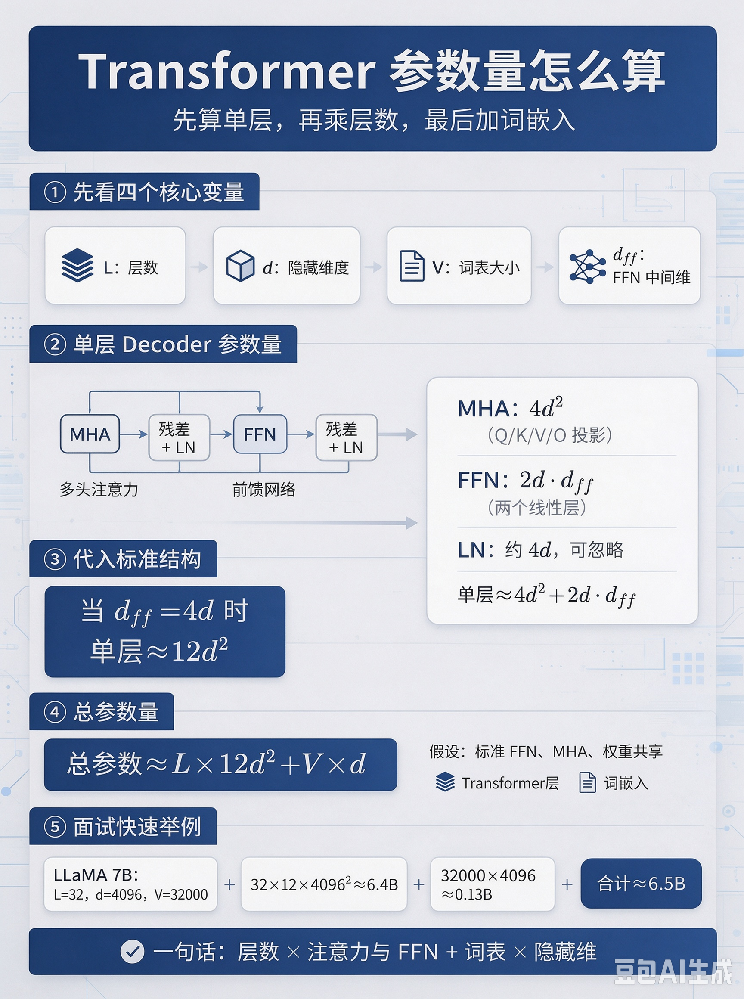
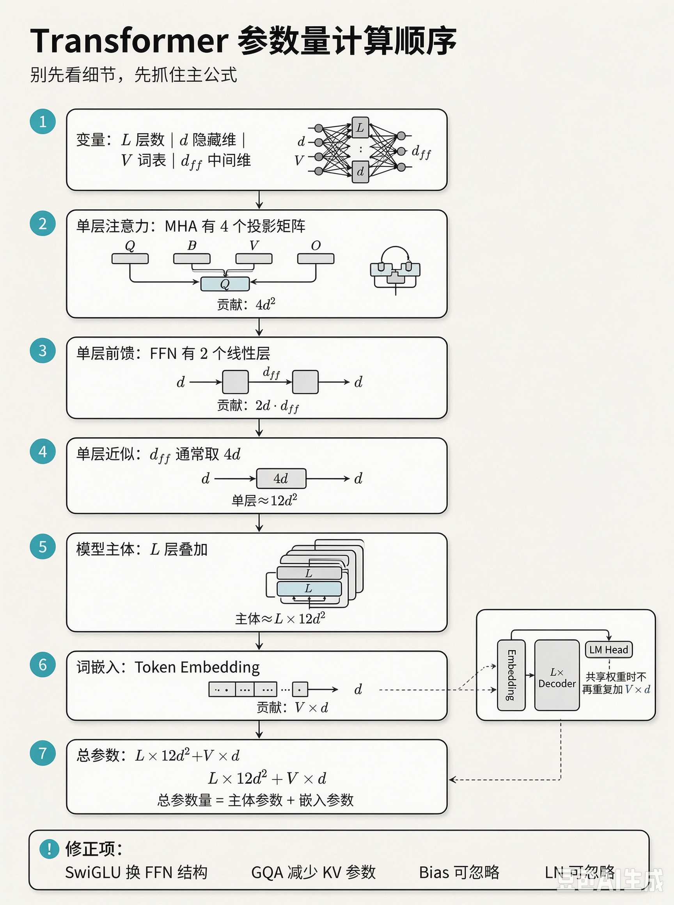
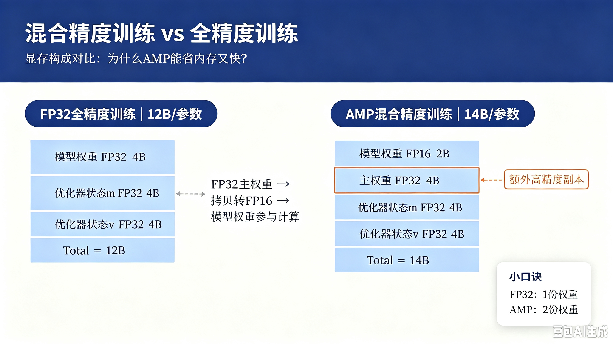
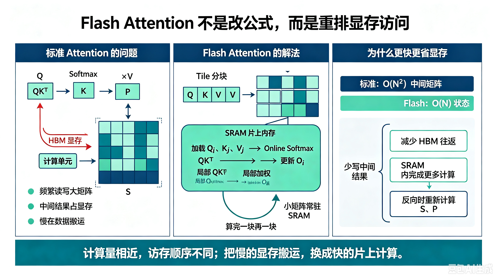
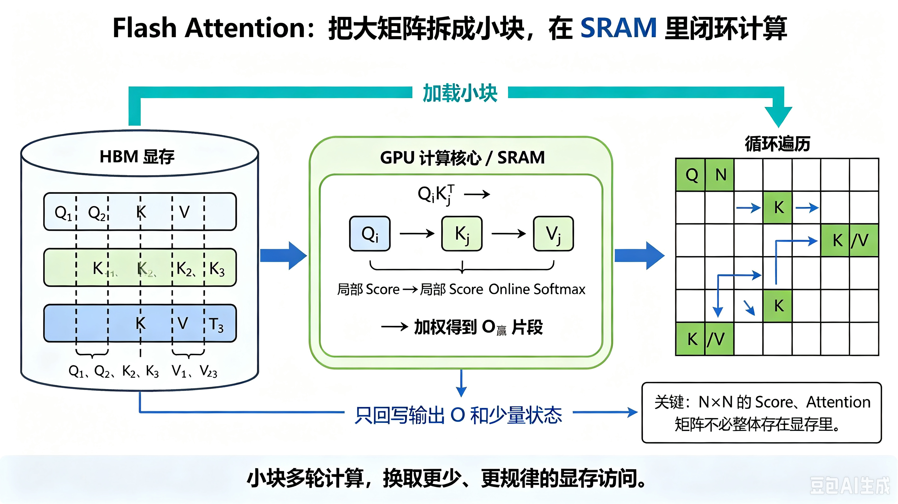
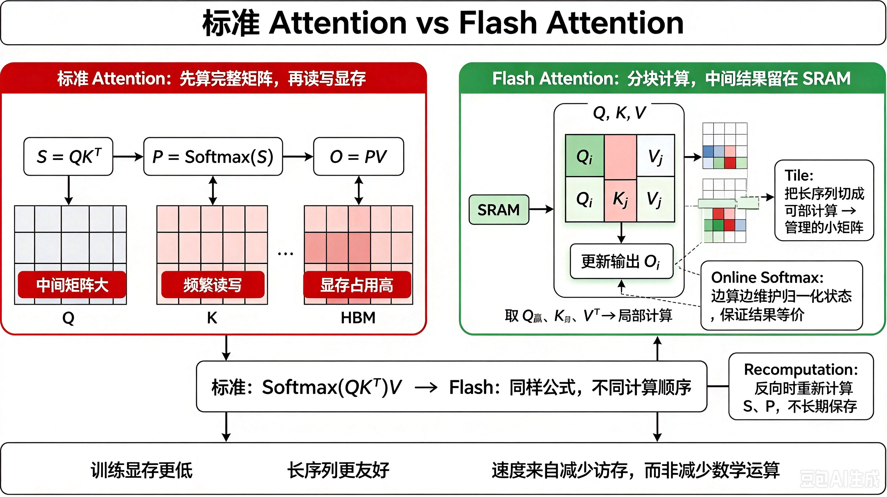
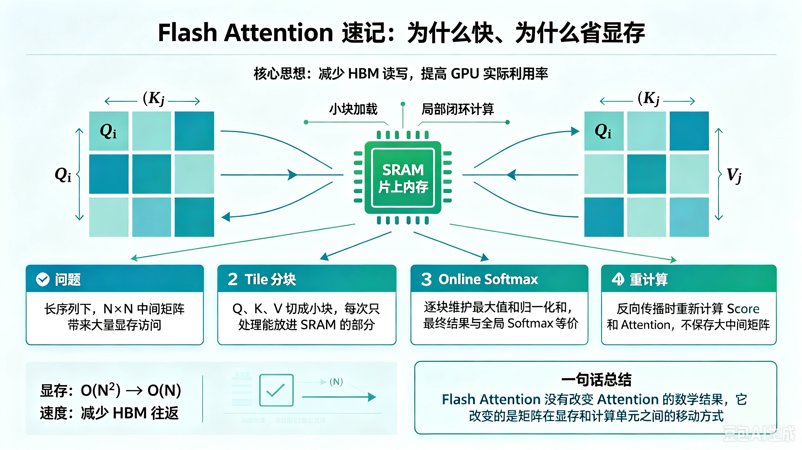
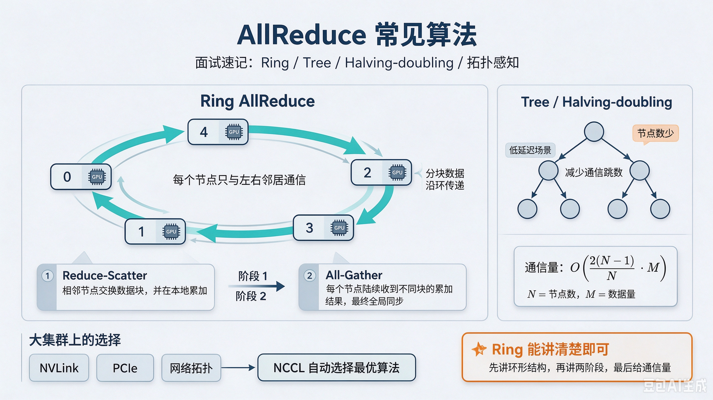
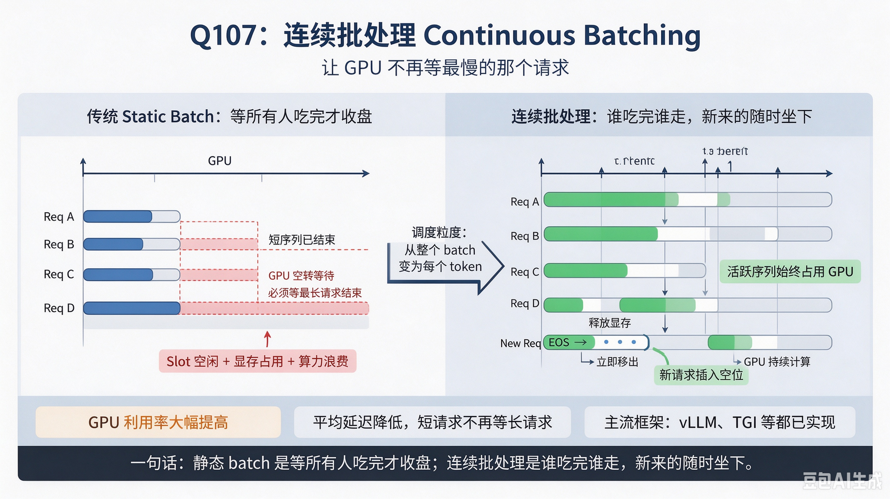

# CS336 学习指南：面试八股文大全（简体中文）

> 面向 Stanford CS336《从零构建语言模型》及 LLM 工程/研究岗的综合复习资料。本题库含 **110 道**高频问答，按主题分八章，便于系统复习与模拟面试。

> **范围说明**：主要参考 [CS336 Spring 2025](https://cs336.stanford.edu/spring2025/)；本仓库的 20 篇学习笔记不是官方课次划分。LoRA、推理部署等包含延伸学习，DPO 属于该年 A5 的选做部分。“高频”表示复习建议，不是面试题频率统计；掌握概念也不等于完成了对应实验。

## 文档约定与符号

### Transformer 核心维度符号说明

在 Self-Attention 与 Transformer 的复杂度分析中，常用符号及其含义如下：

| 符号                      | 含义                  | 典型取值 / 说明                                              |
| ------------------------- | --------------------- | ------------------------------------------------------------ |
| $T$                       | 序列长度（token 数）  | 输入序列的维度，如 512、1024、2048                           |
| $d$ 或 $d_{\text{model}}$ | 模型宽度 / 隐藏维度   | 每个 token 的向量维度，如 768（BERT-base）、4096（LLaMA）    |
| $h$                       | 注意力头数            | 多头注意力并行头数，如 12（BERT-base）、32（LLaMA）          |
| $d_k$                     | 每个头的 Q/K 投影维度 | 通常 $d_k = d / h$，如 768/12 = 64                           |
| $d_v$                     | 每个头的 V 投影维度   | 通常 $d_v = d / h$，与 $d_k$ 保持一致                        |
| $d_{\text{ff}}$           | FFN 隐层宽度          | 前馈网络中间层维度，如 $4d$（标准 Transformer）或 $\frac{8}{3}d$（SwiGLU 变体） |

### 常用关系式

- **每头维度**：

    $$
    d_k = d_v = \frac{d}{h}
    $$

  即模型宽度被均匀分配到各个注意力头上。

- **标准 FFN 宽度**：

    $$
    d_{\text{ff}} = 4d
    $$

  这是原始 Transformer 论文中的配置（两层线性层 + ReLU）。

- **SwiGLU 变体 FFN 宽度**：

    $$
    d_{\text{ff}} = \frac{8}{3}d \approx 2.67d
    $$

  这是在 LLaMA 等模型中使用 SwiGLU 激活函数时的常见配置，为保证参数量与标准 FFN 大致持平而调整。

### 代入复杂度公式

将上述符号代入 Self-Attention 的时间复杂度公式：

- **单头 Self-Attention**：

    $$
    O(T \cdot d \cdot d_k + T^2 \cdot d_k + T^2 \cdot d_v) = O(T \cdot d^2 / h + T^2 \cdot d / h)
    $$

- **多头 Self-Attention（$h$ 个头并行）**：

    $$
    O(T \cdot d^2 + T^2 \cdot d)
    $$

- **完整 Transformer 层（含 FFN）**：

    $$
    O(T \cdot d^2 + T^2 \cdot d + T \cdot d \cdot d_{\text{ff}})
    $$

当 $d_{\text{ff}} = 4d$ 时：

$$
O(T \cdot d^2 + T^2 \cdot d)
$$

即标准 Transformer 中，Self-Attention 和 FFN 的时间复杂度在 $T$ 和 $d$ 的量级上相当，但 Self-Attention 多出 $T^2$ 项，是长序列场景下的主要瓶颈。

- **答题结构建议**：一句话定义 → 关键公式或步骤 → 直觉解释 → 工程取舍/常见追问。

## 一、Transformer 架构（Q1–Q20）

### Q1：Transformer 的核心创新是什么？

**答：**

Transformer 的核心创新是用 **纯自注意力机制** 替代 RNN/CNN 作为序列建模主干，使任意位置对可在 **O(1) 路径长度** 内直接交互（RNN 需经过 O(n) 个顺序步骤），极大提升并行性和长程依赖建模能力。核心操作是 **Scaled Dot-Product Attention**：Q、K、V 线性投影后计算点积相似度，经缩放和 softmax 得到权重，再对 V 加权求和；**多头机制**允许模型在不同子空间关注不同模式。配合**残差连接**与 **LayerNorm**（原始为 Post-Norm，现代常用 Pre-Norm）稳定深层训练，**前馈网络（FFN）**提供逐位置的非线性变换。位置信息通过**绝对正弦位置编码**（原始方案）或后续的**相对位置编码/RoPE** 注入，弥补无位置编码的自注意力缺少顺序信息这一缺陷。整体上，Transformer 将“长程依赖 + 高并行 + 可扩展深度”统一为模块化结构，成为现代 LLM 的基础。**代价是稠密自注意力包含 O(n²) 的序列长度项，限制了超长序列处理。**

### Q2：Self-Attention 的计算流程？（Q/K/V → 点积 → 缩放 → Softmax → 加权求和）

**答：**

对输入 $X \in \mathbb{R}^{T \times d}$，先通过三个线性投影矩阵得到：

$$
Q = XW^Q,\quad K = XW^K,\quad V = XW^V
$$

其中 $W^Q, W^K \in \mathbb{R}^{d \times d_k}$，$W^V \in \mathbb{R}^{d \times d_v}$，通常 $d_k = d_v = d/h$（$h$ 为头数）。

计算注意力分数：

$$
S = QK^\top \in \mathbb{R}^{T \times T}
$$

再除以 $\sqrt{d_k}$ 进行缩放（目的是控制点积大小，避免 softmax 梯度进入饱和区）。对每一行做 softmax，得到权重矩阵：

$$
A = \text{softmax}\left(\frac{S}{\sqrt{d_k}}\right)
$$

（行和为 1），最后加权求和：

$$
O = AV \in \mathbb{R}^{T \times d_v}
$$

多头注意力则将 $h$ 个头的结果拼接后经 $W^O \in \mathbb{R}^{h d_v \times d}$ 映射回 $T \times d$：

$$
\text{MultiHead}(Q, K, V) = \text{Concat}(\text{head}_1, \dots, \text{head}_h) W^O
$$

因果解码时在 softmax 前对非法未来位置加 $-\infty$ 掩码，即：

$$
M_{ij} =
\begin{cases}
0, & i \ge j \\
-\infty, & i < j
\end{cases}
$$

若计入 Q/K/V 与输出投影，多头注意力的总时间复杂度为 $O(Td^2+T^2d)$：前一项来自线性投影，后一项来自注意力分数及对 V 的聚合。长序列时 $T^2d$ 常成为瓶颈，短而宽的模型中 $Td^2$ 也可能占主导。

### Q3：Self-Attention 的时间复杂度和空间复杂度？

**答：**

**一、时间复杂度**

对于单头自注意力，输入 $X \in \mathbb{R}^{T \times d}$，投影到 $Q, K, V \in \mathbb{R}^{T \times d_k}$，其时间复杂度分解如下：

| 步骤           | 操作                                  | 时间复杂度               |
| -------------- | ------------------------------------- | ------------------------ |
| Q/K/V 投影     | $XW^Q, XW^K, XW^V$                    | $O(T \cdot d \cdot d_k)$ |
| 注意力分数计算 | $QK^\top \in \mathbb{R}^{T \times T}$ | $O(T^2 \cdot d_k)$       |
| Softmax        | 对 $T \times T$ 矩阵每行做 softmax    | $O(T^2)$                 |
| 加权求和       | $AV \in \mathbb{R}^{T \times d_v}$    | $O(T^2 \cdot d_v)$       |

其中 $QK^\top$ 和 $AV$ 的矩阵乘法是主要瓶颈，均为 $O(T^2 \cdot d_k)$ 量级。

当 $d_k = d_v = d$ 时（单头情况），总时间复杂度为：

$$
O(T \cdot d^2 + T^2 \cdot d)
$$

对于多头注意力（$h$ 个头，$d_k = d_v = d/h$），各个头并行计算，总时间复杂度为：

$$
O(T \cdot d^2 + T^2 \cdot d)
$$

即多头机制不增加额外的 $T^2$ 项复杂度，只是将 $d$ 分配到各个头上。

若考虑 Transformer 整层（含 FFN 子层），还需加上：

$$
O(T \cdot d \cdot d_{\text{ff}})
$$

其中 $d_{\text{ff}}$ 为前馈网络的隐层维度（通常 $d_{\text{ff}} = 4d$）。

**结论**：对于长序列（大 $T$），$T^2$ 项主导复杂度，这是 Self-Attention 的主要瓶颈。

**二、空间复杂度**

主要显存占用来源：

| 占用项                                            | 空间复杂度     | 说明           |
| ------------------------------------------------- | -------------- | -------------- |
| 注意力分数矩阵 $S = QK^\top$                      | $O(T^2)$       | 若不物化可优化 |
| 注意力权重矩阵 $A = \text{softmax}(S/\sqrt{d_k})$ | $O(T^2)$       | 同上           |
| Q/K/V 中间激活                                    | $O(T \cdot d)$ | 三份           |
| 输出 $O$                                          | $O(T \cdot d)$ |                |

如果**物化完整注意力矩阵**（标准实现），额外显存占用为：

$$
O(T^2)
$$

加上 Q/K/V 和输出，总空间复杂度约为：

$$
O(T^2 + T \cdot d)
$$

以上空间量级按单头或把头数视为常数书写。显式计入 $B$ 个样本、$h$ 个头时，物化注意力矩阵为 $O(BhT^2)$，Q/K/V 和输出为 $O(BTd)$；估算实际显存时不能漏乘 batch 和头数。

对于长序列，$T^2$ 项是主要瓶颈。仅计算**单个样本、单个头的一张** FP16 注意力矩阵，$T=4096$ 时约为 32 MiB，$T=65536$ 时约为 8 GiB；朴素多头、批量训练还会随 batch size 和头数增加，并包含反向传播所需的其他激活。

**三、复杂度优化方法**

| 方法                   | 核心思想                                                    | 效果                                                         |
| ---------------------- | ----------------------------------------------------------- | ------------------------------------------------------------ |
| **FlashAttention**     | 分块计算 + 不物化完整 $T \times T$ 矩阵 + 重计算            | 算术复杂度仍为 $O(T^2d)$；在论文设定下 HBM 访问量为 $\Theta(T^2d_k^2/M)$（$M$ 为片上存储容量），同时显著降低峰值显存 |
| **稀疏注意力**         | 只计算部分位置的注意力（如局部窗口、块稀疏模式）            | 注意力对数与权重存储由 $O(T^2)$ 降至 $O(Tw)$；计入头维的打分与聚合算术量约为 $O(Twd)$，另有投影项 $O(Td^2)$ |
| **线性注意力**         | 用可分解核/特征映射等替代标准 softmax attention，再重排乘法 | 典型算术量可降至关于 $T$ 线性、如 $O(Td^2)$；它改变或近似注意力形式，不能越过 softmax 直接套用 $(QK^\top)V=Q(K^\top V)$ |
| **KV Cache**（推理时） | 缓存历史 token 的 K 和 V，避免重复投影和完整前缀重算          | 第 $t$ 个解码步的注意力项由完整重跑的 $O(t^2d)$ 降为 $O(td)$；生成 $T$ 个 token 的注意力总量由 $O(T^3d)$ 降为 $O(T^2d)$，缓存空间为 $O(Td)$ |

**四、总结**

| 维度             | 复杂度                                 | 瓶颈                                 |
| ---------------- | -------------------------------------- | ------------------------------------ |
| **时间复杂度**   | $O(T^2 \cdot d + T \cdot d^2)$         | $T^2$ 项（长序列时）                 |
| **空间复杂度**   | $O(T^2 + T \cdot d)$                   | $T^2$ 项（标准实现物化注意力矩阵时） |
| **主要优化方向** | FlashAttention、稀疏注意力、线性注意力 | 减少或避免 $T^2$ 项                  |

### Q4：为什么要除以 $\sqrt{d_k}$？

**答：**

点积 $q^\top k$ 可看作 $d_k$ 个分量乘积之和。若 $q_i$、$k_i$ 相互独立、均值为 0，方差分别为 $\sigma_q^2$、$\sigma_k^2$，则：

$$
\operatorname{Var}(q^\top k)=d_k\sigma_q^2\sigma_k^2
$$

在常用的单位方差假设下，未缩放点积的方差为 $d_k$；随维度增大，softmax 输入幅值增大，容易进入饱和区。除以 $\sqrt{d_k}$ 后方差约为 1，使分数尺度不随头维度增长，训练更稳定。实践中它与多头设计配套：

$$
d_k = d/h
$$

缩放操作使得不同头数的设置保持一致的尺度。

### Q5：多头注意力（MHA）比单头好在哪里？

**答：**

多头将 $h$ 组独立投影矩阵并行计算注意力：

$$
\text{head}_i = \text{Attention}(XW_i^Q, XW_i^K, XW_i^V)
$$

再将 $h$ 个头输出拼接后经 $W^O$ 融合：

$$
\text{MultiHead}(X) = \text{Concat}(\text{head}_1, \dots, \text{head}_h) W^O
$$

不同头可学习 **不同子空间** 的关系（局部搭配、句法、长距共指等），表达能力比单一大矩阵更丰富。单头需在同一 $d_k$ 维里挤所有模式，易相互干扰。复杂度上多头总计算量与单头「宽矩阵一次算」同阶，即：

$$
O(T^2 \cdot d + T \cdot d^2)
$$

多头结构提供更丰富的表示子空间，实证上通常能改善任务效果或**降低困惑度**。但它不天然保证降低过拟合，头数过多还可能产生冗余，需要与模型宽度和任务共同设计。

### Q6：Encoder-only vs Decoder-only vs Encoder-Decoder 各自适用场景？

**答：**

三种架构的差别不只在注意力掩码，还包括单栈或双栈结构、是否具有 Encoder-Decoder Cross-Attention，以及相应的预训练目标；这些设计共同决定信息流和适用任务。

**1. Encoder-only（如 BERT、RoBERTa）**

**核心机制**：双向自注意力，每个 token 能同时看到**左右两侧**的所有 token。

**预训练任务**：MLM（Masked Language Model，掩码语言模型），即随机掩盖 15% 的 token，让模型根据上下文还原。

**适用场景**：分类、信息检索、文本相似度、序列标注（NER、词性标注）等"理解型"任务。

**代表模型**：BERT、RoBERTa、ALBERT。

**选型理由**：如果任务主要需要双向上下文表示并输出标签或向量，Encoder-only 通常是高效且常见的选择，但并非所有理解任务的必然最优方案。

**2. Decoder-only（如 GPT、LLaMA、Qwen）**

**核心机制**：因果自注意力（Causal Attention），每个 token 只能**看到自己及之前的 token**，未来 token 被掩码遮住，保证自回归生成时不会"作弊"。

**预训练任务**：Next Token Prediction（下一 token 预测），即给定前文预测下一个 token。训练和生成都使用相同的条件语言模型分解，但训练通常使用真实前缀（teacher forcing），生成时使用模型自己产生的前缀，因此仍存在暴露偏差和解码策略差异，不能说两阶段过程完全一致。

**适用场景**：开放域对话、文本续写、代码生成、推理等"生成型"任务。

**代表模型**：GPT 系列、LLaMA 系列、Qwen、DeepSeek。

**选型理由**：预训练任务与下游生成任务一致，工程简单，Scaling Law 友好，是**现代 LLM 的主流架构**。注意：Decoder-only 也可通过"前缀提示"来执行翻译、摘要等任务，只是不如 Encoder-Decoder 显式对齐。

**3. Encoder-Decoder（如 T5、BART、原始 Transformer）**

**核心机制**：Encoder 采用双向注意力，负责**理解源端**；Decoder 采用**因果注意力** + **交叉注意力（Cross-Attention）**，在生成每一步时主动"查询"源端信息。

**预训练任务**：Span Corruption（如 T5 的随机 span 掩码 + 预测）或 Denoising（如 BART）。

**适用场景**：机器翻译、文本摘要、语音识别等"输入-输出有明确对应关系"的 Seq2Seq 任务。

**代表模型**：T5、BART、原始 Transformer。

**选型理由**：当输入和输出的结构和长度差异较大，且需要显式的"源→目标"对齐时，Encoder-Decoder 是最自然的选择。

**总结对比表**

| 架构                | 注意力             | 预训练任务                  | 适用场景             | 代表模型         |
| ------------------- | ------------------ | --------------------------- | -------------------- | ---------------- |
| **Encoder-only**    | 双向               | MLM                         | 分类、检索、表示学习 | BERT、RoBERTa    |
| **Decoder-only**    | 因果（单向）       | Next Token Prediction       | 对话、续写、推理     | GPT、LLaMA、Qwen |
| **Encoder-Decoder** | 双向 + 因果 + 交叉 | Span Corruption / Denoising | 翻译、摘要、Seq2Seq  | T5、BART         |

**面试时的一句话总结**

> "Encoder-only 适合'读'，Decoder-only 适合'写'，Encoder-Decoder 适合'读完再写'。其中 Decoder-only 因预训练-生成一致性强、Scaling 友好，已成为现代 LLM 的主流选择。"

### Q7：为什么现代通用 LLM 多采用 Decoder-only？

**答：**

（1）**目标形式统一**：预训练和生成都使用因果 next-token 条件分布，通常无需为开放式生成增加任务头；但 teacher forcing 与自由生成的输入分布不同，仍可能存在暴露偏差。

（2）**工程简单**：单栈模块、KV Cache 路径清晰，易于分布式与推理优化。Encoder-Decoder 还需维护编码器及交叉注意力；其 Cross-Attention 复杂度为 $O(T_{\text{tgt}}T_{\text{src}}d)$。固定 Encoder 输出的 K/V 可以预计算并缓存，但每个解码步仍需让 query 访问源序列。

（3）**Scaling 经验充分**：大量公开的 Decoder-only 模型验证了这一路线在规模扩展、上下文学习和统一生成接口上的有效性。对未公开详细结构的闭源模型，不应仅凭产品名称断言其具体架构。

（4）**参数分配与实现取舍**：Encoder-Decoder 需要在两套栈及 Cross-Attention 间分配参数；Decoder-only 则把主要容量集中在单一自回归栈。许多翻译、摘要和问答能力可以通过预训练与指令微调获得，但在输入输出明确分离的条件生成任务上，Encoder-Decoder 仍有自身优势。

（5）**研究上也有混合系统**：如 Encoder-only 做嵌入检索、Decoder-only 做生成，但 **基座 LLM** 的主流仍是 Decoder-only。

### Q8：残差连接的作用？

**答：**

层输出常写为（以 Pre-Norm 为例）：

$$
x_{l+1} = x_l + F_l(\text{Norm}(x_l))
$$

或 Post-Norm 变体。残差提供 **恒等捷径**，使梯度可直接回传，缓解深层 **梯度消失**：

$$
\frac{\partial x_{l+1}}{\partial x_l} = I + \frac{\partial F_l}{\partial x_l}
$$

雅可比中的恒等项为梯度提供了更直接的传播路径，通常能改善深层网络的条件数并缓解梯度消失。不过 $I+\partial F_l/\partial x_l$ 仍可能发生方向抵消或数值放大，因此残差连接并不从数学上保证梯度“无损”。

同时，子层只需学习 **对恒等的修正**（即 $F_l$），而非从零映射整个函数，优化曲面更平滑，训练更稳定。

在 Transformer 中，残差保证信息可跨层直通，有利于深层堆叠（数十层甚至上百层）。初始化适当时，网络近似逐步 **叠加** 小扰动，训练更稳。

残差也有助于跨层保留信息，使每层主要学习相对输入的增量更新。但它不保证不同层一定保持特征多样性；深层 Transformer 仍可能出现表示趋同或残差流尺度失衡，需要归一化、初始化和残差缩放共同处理。

### Q9：LayerNorm vs BatchNorm，为什么 Transformer 选 LN？

**答：**

**① 归一化维度不同（根本差异）**

BatchNorm 在 **batch 维** 上统计均值和方差（跨样本、同通道），依赖 batch 内样本间的统计关系；LayerNorm 在 **特征维** 上统计均值和方差（单样本、跨通道），与 batch 内其他样本无关。这是两者一切差异的根源。

**② BatchNorm 的三大缺陷，在 Transformer 中被放大**

- **对 batch size 敏感**：小 batch 下统计量抖动剧烈，训练不稳定；大 batch 又受显存限制。LN 与 batch 无关，batch size=1 也能稳定训练。
- **对变长序列不友好**：NLP 中序列长度动态变化，BN 需要 padding 对齐，填充 token 会污染统计量。LN 逐样本归一化，天然适配变长序列。
- **训练与推理行为不匹配**：BN 依赖 mini-batch 统计量，并在推理时改用运行统计量；若还跨时间位置统计，实现不当也可能耦合不同 token。LN 只在单个 token 的特征维上归一化，不依赖其他样本或序列长度，更适合变长序列和逐 token 解码。

**③ Transformer 内部特征分布的特殊性**

Transformer 中不同 token 位置共享参数，但各位置输入分布差异较大（尤其深层），BN 强制拉齐会扭曲位置信息；LN 保留个体特征尺度差异，更符合“每个 token 独立处理”的设计哲学。此外，LN 对每个样本的梯度路径更干净，避免 BN 中 batch 内样本相互依赖带来的梯度噪声（分布式训练时同步统计量额外增加通信开销）。

**④ 现代演进：RMSNorm**

不少现代大模型（如 LLaMA）采用 **RMSNorm**，即省略 LN 的均值中心化，只根据均方根进行缩放。其动机是保留重缩放不变性并简化计算；实际速度收益依模型、张量形状和内核实现而定，不能用固定百分比概括。GPT 各代具体配置应按公开实现或技术报告分别判断。

**⑤ 补充：CV 中为何常见 BN？**

在许多卷积网络与足够大、统计稳定的 batch 设置中，BN 有成熟实现并可提供良好优化效果；小 batch 或不同视觉架构也常采用 GroupNorm、LayerNorm 等。两者各有所长，并非 LN 绝对优于 BN。

**一句话总结：** BatchNorm 使用跨样本统计，LayerNorm 在单个 token/样本的特征维归一化。LN 不依赖 batch 统计、训练推理规则一致，因此更适合多数 Transformer；这是一种稳定且成熟的架构选择，不是数学上唯一可行的归一化方案。RMSNorm 则省略均值中心化，进一步简化计算。

### Q10：Pre-Norm vs Post-Norm 哪个更好？

**答：**

**① 定义与公式**

**Post-Norm**（原始 Transformer）：先残差后归一化。

$$
x_{l+1} = \text{LN}(x_l + F_l(x_l))
$$

**Pre-Norm**（现代主流）：先归一化后残差。

$$
x_{l+1} = x_l + F_l(\text{LN}(x_l))
$$

**② 训练稳定性**

- **Post-Norm**：深层训练通常更敏感，往往需要更谨慎的初始化、学习率和 warmup。
- **Pre-Norm**：恒等残差路径改善了梯度传播，通常更容易训练，并可降低对 warmup 的依赖；但它并不保证无需 warmup，许多大型预训练仍会保留 warmup。

**③ 效果争议**

部分实验中 Post-Norm 或改进的归一化布局在充分调参后取得更好最终指标，但这不是“Post-Norm 表达能力必然更强”的通用结论；架构深度、初始化、残差尺度和训练配方都会影响比较。

**④ 工业界选择**

GPT-3、LLaMA 等公开架构采用 Pre-Norm，主要考虑训练稳定性和深度扩展。未公开完整架构的模型不宜据此归类。

**⑤ 补充**

还有残差缩放、DeepNorm、Sandwich Norm 等变体，用于控制激活/梯度尺度或改善深层训练。不能把它们统一解释成“弥补 Pre-Norm 的表达能力损失”。

**一句话总结：** Pre-Norm 通常更易稳定扩展，Post-Norm 在部分设置下最终效果可能更好；实际选择还需配合初始化、残差缩放和学习率调度。

### Q11：RMSNorm 和 LayerNorm 的区别？

**答：**

**① 公式对比**

**LayerNorm（LN）**：先中心化（减均值），再缩放（除标准差）。

$$
\hat{x} = \frac{x - \mu}{\sigma}, \quad \mu = \frac{1}{d}\sum_{i=1}^{d} x_i, \quad \sigma = \sqrt{\frac{1}{d}\sum_{i=1}^{d}(x_i - \mu)^2 + \epsilon}
$$

**RMSNorm（RMS）**：去掉均值中心化，仅用均方根做缩放。

$$
\text{RMS}(x) = \sqrt{\frac{1}{d}\sum_{i=1}^{d} x_i^2 + \epsilon}, \quad \hat{x}_i = \frac{x_i}{\text{RMS}(x)}
$$

两者最后均可乘以可学习增益参数 $g$（即 $\hat{x} \cdot g$）。

**② 核心区别**

- **LN**：先减均值，标准化结果在 affine 变换前为零均值；应用逐维可学习增益和偏置后，最终输出均值不保证为 0；
- **RMSNorm**：不减均值，只按均方根缩放；应用增益后也不要求输出均值为 0。

**③ 为什么 RMSNorm 有效？**

RMSNorm 的出发点是：许多网络主要需要归一化带来的**重缩放不变性**，未必需要 LayerNorm 的重中心化。它省略均值计算和减法，计算更简单；论文在多个模型上观察到可保持相近效果并带来不同程度的运行时间收益，但收益不是固定比例，也不能归因于 FFN 对平移不敏感。

**④ 工业界选择**

LLaMA 使用 RMSNorm，T5 使用不减均值、仅带缩放参数的 RMS 风格归一化。其他模型需按具体版本判断，例如 GPT-NeoX-20B 使用的是 LayerNorm。

**⑤ 相同点**

两者都是**逐 token、在特征维上**归一化（与 BatchNorm 无关），都适用于变长序列和自回归生成。

**一句话总结：** RMSNorm 可理解为省略均值中心化、按均方根缩放的归一化方法；它计算更简单，并已被 LLaMA 等模型采用，但是否更快、效果是否相当需结合具体模型和实现评估。

### Q12：SwiGLU 激活函数的公式和优势？

**答：**

**① 公式定义**

SwiGLU 是一种 **门控线性单元**（GLU）变体，将标准 FFN 的单路投影改为双路门控结构：

$$
\text{SwiGLU}(x) = (\text{Swish}(xW_1) \odot (xW_2)) W_3
$$

其中：

- $\text{Swish}(t) = t \cdot \sigma(t)$（$\sigma$ 为 Sigmoid），作为门控激活；
- $\odot$ 为逐元素乘；
- $W_1, W_2, W_3$ 为可学习权重矩阵。

**② 相比 ReLU/GELU 的优势**

| 对比项         | ReLU/GELU 单路 FFN | SwiGLU 双路门控 FFN                        |
| -------------- | ------------------ | ------------------------------------------ |
| **非线性来源** | 单次激活函数变换   | 激活值 × 门控值（逐元素乘），非线性更强    |
| **信息流控制** | 无选择性，全量通过 | 门控机制**选择性过滤**信息，类似 LSTM 思想 |
| **表达能力**   | 中等               | 更强，相同宽度下困惑度（PPL）更低          |

> **“困惑度（PPL）本质上是语言模型对下一个词预测不确定性的量化，数值越低表示模型对语言规律拟合得越好。大模型用它来衡量‘信息压缩能力’——PPL 降低，意味着模型用更少的‘惊讶’就学会了数据分布。**

**③ 参数量与工程调优**

- 标准 FFN：中间维 $4d$，参数量 $d \times 4d + 4d \times d = 8d^2$
- SwiGLU：三路投影（$W_1, W_2, W_3$），为保证参数量可比，中间维调整为 $\frac{2}{3} \times 4d = \frac{8d}{3}$，参数量约为 $d \times \frac{8d}{3} \times 2 + \frac{8d}{3} \times d \approx 8d^2$（与标准 FFN 持平）

**④ 代价**

- 相比两投影的标准 FFN，SwiGLU 有三路投影；但当中间维从 $4d$ 调为约 $8d/3$ 时，主导参数量和矩阵乘 FLOPs 与标准 FFN 大致相当，并非必然“多一次等宽矩阵乘”后整体算力更高。
- 朴素实现需保存门和值两路中间激活，激活显存可能更高；融合算子、激活重计算等实现可改变这一开销。

**⑤ 工业界选择**

PaLM、LLaMA 等多种现代大模型采用 SwiGLU 或相近的门控 FFN；具体激活函数和门控形式仍因模型而异，不能概括为所有主流模型都采用同一实现。

**一句话总结：** SwiGLU = 用“Swish 门 × 变换值”的门控结构替代普通激活；通常通过缩小中间维保持与标准 FFN 相近的参数量和主导 FLOPs，实际速度与激活显存取决于具体内核实现。

### Q13：GQA / MQA / MHA 的区别和各自优缺点？

**答：**

**① 三者核心区别（一句话定义）**

三者的本质区别在于 **K、V 在不同注意力头之间是否共享**：

- **MHA（Multi-Head Attention）**：每个头独立拥有自己的 Q、K、V 投影矩阵，头与头之间完全独立。
- **MQA（Multi-Query Attention）**：所有头共享**同一组 K 和 V**，只有 Q 是每个头独立拥有。
- **GQA（Grouped-Query Attention）**：介于两者之间，将头分成若干组，**组内共享 K 和 V**，组与组之间独立。

**② MHA（Multi-Head Attention）**

- **做法**：每组 Q、K、V 独立投影，各自做注意力计算，最后拼接输出。
- **优点**：每个头拥有独立 K/V，可保留更充分的头间表示容量，在一些模型和任务上具有质量优势。
- **缺点**：推理时每个头都需要缓存独立的 K 和 V，KV Cache 和解码访存开销较大。相同 query 头数与头维下，三种结构的注意力打分主项接近，但 MHA 的 K/V 投影、缓存容量和内存带宽开销更高。

**③ MQA（Multi-Query Attention）**

- **做法**：所有头共享一组 K 和 V，只有 Q 独立。即 K 和 V 只算一次，复制给所有头用。
- **优点**：KV Cache 减少为原来的 1/h（h 为头数），显存大幅降低；推理速度显著提升，尤其适合长序列生成。
- **缺点**：共享 K/V 减少了表示自由度，在部分配置上可能相对 MHA 损失质量；下降幅度和是否下降需由训练方式、模型规模与任务评测确定。

**④ GQA（Grouped-Query Attention）**

- **做法**：将 h 个头分成 g 组（g < h），每组内共享 K 和 V，组之间独立。当 g = h 时退化为 MHA，当 g = 1 时退化为 MQA。
- **优点**：是 MHA 和 MQA 的**折中方案**，在推理速度和模型质量之间取得平衡。KV Cache 降为 MHA 的 g/h，比 MHA 省显存，比 MQA 保留更多表达能力。
- **缺点**：实现略复杂（需要分组逻辑），超参数 g 需要调优。

**⑤ 工业界选择与建议**

- **架构选择**：MHA、MQA、GQA 都可以从头预训练；不能笼统断言 MHA 的质量必然最高，应结合模型规模、KV 头数和评测结果判断。

- **推理阶段**：MQA 或 GQA 更受青睐，尤其在大模型部署场景（长上下文、高并发）。

- **实际落地**：Llama 2 的 34B/70B 使用 GQA，而 7B/13B 使用 MHA；Llama 3 的公开模型使用 GQA。闭源模型若未公开注意力结构，不应仅凭系列名称推断。

  > **“MHA、MQA、GQA 是模型架构层面的设计选择，不是运行时的配置开关。模型一旦以某种架构完成训练，权重矩阵的结构就固定了，推理时只能沿用同一种架构。所谓‘训练用 MHA、推理用 GQA’，指的是在项目规划阶段，根据‘质量优先’还是‘效率优先’选择不同的架构方案来训练模型。”**

**一句话总结：** MHA = 每个头独立 K/V、缓存最大；MQA = 所有 query 头共享一组 K/V、缓存最小；GQA = 分组共享，在缓存、带宽与模型质量之间折中。三者是训练时确定的架构选择，效果需通过具体模型评测判断。

### Q14：RoPE 旋转位置编码的核心思想？

**答：**

**① 背景：为什么需要位置编码？**

不含位置编码的逐 token 自注意力对输入排列是**置换等变**的：打乱输入位置后，输出会按相同方式打乱，但模型本身无法区分先后顺序。语言具有顺序性，因此需要注入位置信息。传统方案有**绝对位置编码**（如原始 Transformer 的 Sin/Cos 编码）和**相对位置编码**（如 T5 的偏置项）。

**② 核心思想（一句话概括）**

RoPE 的核心思路是：**不把位置编码加到 embedding 上，而是对 Q 和 K 向量做旋转，让旋转角度随位置变化，从而使 Q·K 的内积结果自动包含相对位置信息。**

**③ 具体做法**

- 将 $d$ 维的 $q$ 和 $k$ 向量，按两两一组拆成 $d/2$ 个二维子空间。
- 对第 $i$ 组，旋转角度为 $m \cdot \theta_i$，其中 $m$ 是当前位置，$\theta_i$ 是预设频率（类似 Sin/Cos 里的 $1/10000^{2i/d}$）。
- 数学上等价于：在复数域将 $q$ 和 $k$ 乘以 $e^{im\theta_i}$ 进行旋转。
- 做完旋转后，再计算 $q$ 与 $k$ 的点积。

**④ 为什么它能表达相对位置？**

关键在于：旋转后的 $q_m$ 与 $k_n$ 做内积时，位置相关部分会出现 $(m-n)$ 的三角函数组合（如 $\cos((m-n)\theta_i)$），因此注意力分数能够显式感知相对位置差。需要注意，各频率分量具有周期性，RoPE **不保证任意一对 token 的注意力分数随距离单调下降**；长距离行为由频率设计、模型权重和训练共同决定。

**⑤ 相比传统位置编码的优势**

| 对比项           | 绝对位置编码                         | 相对位置方法                         | RoPE                         |
| ---------------- | ------------------------------------ | ------------------------------------ | ---------------------------- |
| 位置注入方式     | 固定或可学习向量加到输入表示         | 相对向量、距离桶偏置、线性偏置等     | 对 Q/K 做位置相关旋转        |
| 额外可学习参数   | 正弦编码无；learned absolute 有      | 依方法而定：T5 有，原始 ALiBi 斜率无 | 原始 RoPE 无                 |
| 长度外推         | 依编码与训练范围而定                 | 依分桶/偏置形式与训练而定            | 原始 RoPE 也有限，常需缩放   |
| 高效内核兼容性   | 通常简单                             | 取决于偏置形式和内核支持             | 已有广泛的融合内核支持       |

**⑥ 工业界应用与改进**

RoPE 已被 **LLaMA、PaLM、Qwen、ChatGLM** 等主流大模型广泛采用。原始 RoPE 在长文本外推上存在局限，后续改进包括：

- **NTK-aware RoPE**：通过缩放基频 $\theta_i$，让旋转频率适应更长序列；
- **YaRN**：采用分频率的 RoPE 插值/外推策略，并配合 attention scaling，以改善长上下文扩展。

**⑦ 面试官可能追问的坑**

**追问：RoPE 和绝对位置编码能共存吗？**
可以。实践中（如 LLaMA）就是用 RoPE 替代绝对位置编码，不需要额外加位置向量。但有些模型会同时使用 RoPE + 可学习偏置，但这并非 RoPE 必需。

**一句话总结：** RoPE = **在 Q/K 上做位置相关旋转**，让内积的位置项依赖**相对位置差**，无需学习位置向量；它被许多现代大模型采用，但原始版本的长度外推仍需专门处理。

### Q15：RoPE vs 绝对位置编码 vs 相对位置编码？

**答：**

**① 绝对位置编码（Absolute Positional Encoding）**

- **做法**：为每个位置 $pos$ 生成一个固定或可学习的向量，直接加到 token embedding 上。原始 Transformer 使用正弦/余弦函数生成固定编码，后续模型（如 BERT）采用可学习位置编码。
- **优点**：实现简单，直接相加即可，计算量几乎为零。
- **缺点**：只编码绝对位置，**相对位置关系需要网络从数据中间接学习**，缺乏显式的位置差归纳偏置；外推性较差，遇到比训练时更长的序列时性能明显下降。

**② 相对位置编码（Relative Positional Encoding）**

- **做法**：不同方法实现不同。Shaw 等方法把可学习的相对位置向量加入 key 兼容度，并可在 value 聚合中加入相对位置表示；T5 则把相对距离分桶，为每个注意力头学习标量偏置并加到 logits 上。标量偏置形式可写为：$\text{logit}_{i,j}=q_i k_j^T+b_{\text{bucket}(i-j)}$。
- **优点**：显式建模相对距离，更符合语言中“词与词的关系依赖相对顺序”的直觉；某些设计具有较好的长度外推表现。
- **缺点**：代价依实现而异。Shaw/T5 类方法需要相对向量或偏置表，ALiBi 使用固定斜率而无需可学习表；额外存储和计算也因是否融合进内核而不同。现代 FlashAttention 实现已支持 ALiBi 等部分偏置，不能笼统说相对位置编码都难以融合。

**③ RoPE（旋转位置编码）**

- **做法**：不改变输入 embedding，而是在计算 $Q$ 和 $K$ 之后，对每个位置的 $q$ 和 $k$ 向量施加二维旋转（旋转角度随位置变化），使旋转后的 $q_m$ 与 $k_n$ 内积结果天然依赖 $m-n$。
- **优点**：
  - 使注意力分数显式依赖相对位置差，同时保留通过旋转频率表示位置的结构；
  - 不增加额外参数和注意力偏置表，实现简洁；
  - 与 FlashAttention 等高效注意力实现兼容性好。
- **缺点**：
  - 原始版本在长度外推上有限制（需配合 NTK/YaRN 等改进）；
  - 对 $Q/K$ 施加旋转带来少量额外计算开销。

**④ 补充：ALiBi（Attention with Linear Biases）**

- ALiBi 也是一种相对位置方案，不做旋转也不加位置向量，而是在注意力 logits 上加入随距离线性变化的偏置；因果场景常写为 $-m_h(i-j)$。
- 原始 ALiBi 为不同注意力头**预设不同且固定的斜率** $m_h$，训练时不学习这些斜率。它实现轻量、长度外推表现较好，但具体质量需结合任务评估。

**⑤ 工业界选择**

- **RoPE** 被 LLaMA、Qwen、PaLM 等许多模型采用，是常见选择之一；具体实现与长上下文缩放方案因模型而异。
- **ALiBi** 在某些注重外推的场景（如 BLOOM）中仍有使用。
- 可学习绝对位置编码仍见于 BERT 类和其他架构；新模型也会使用 RoPE、相对偏置、ALiBi 或混合方案，不能概括为全部转向一种方案。

**一句话总结：** 绝对编码把位置加入输入；相对方法把距离信息加入注意力；RoPE 则旋转 Q/K，使内积依赖相对位置差且不引入可学习位置参数。三者的外推性和内核效率都取决于具体实现，RoPE 是常见方案而非唯一默认答案。

### Q16：因果掩码（causal mask）如何实现？

**答：**

**① 为什么要做因果掩码？**

自回归语言模型通常把位置 $t$ 的隐藏状态用于预测 $x_{t+1}$，因此该位置只能关注 $x_{\le t}$；等价地，预测 $x_t$ 时只能以 $x_{<t}$ 为条件。若允许关注目标 token 之后的位置，训练时就会泄露未来信息。

**② 具体实现方式（核心操作）**

因果掩码在 **softmax 之前** 施加于注意力分数矩阵上：

- 正常计算得到注意力 logits：$\text{logits}_{i,j} = q_i \cdot k_j^T$
- 对所有非法位置（$j > i$），将 logits 设为 $-\infty$（实际代码中常用一个极大的负数，如 `-1e9` 或 `-inf`）
- 然后过 softmax：$\text{softmax}(-\infty) = 0$，非法位置的注意力权重归零

**张量构造方式**：

- 生成一个**下三角矩阵**（包含对角线），位置 $i \ge j$ 为 0（保留），$i < j$ 为 $-\infty$（屏蔽）
- PyTorch 中常用：`mask = torch.triu(torch.ones(T, T), diagonal=1).bool()`，生成上三角的 True 掩码，再通过 `masked_fill` 将 True 位置填为 `-inf`

**③ 训练 vs 推理的差异**

| 阶段                    | 实现方式                                 | 说明                                                         |
| ----------------------- | ---------------------------------------- | ------------------------------------------------------------ |
| **训练**                | 一次性构造完整的 $T \times T$ 下三角掩码 | 序列固定长度，并行计算所有位置，掩码矩阵统一应用             |
| **推理（无 KV Cache）** | 同训练，但逐 token 生成                  | 每步重新计算全序列注意力，效率低                             |
| **单 token 推理（有 KV Cache）** | 新 token 只与历史缓存及自身的 K/V 计算注意力 | 通常无需显式三角掩码，因为缓存中不存在未来位置；若一次解码多个 token，仍需对该块内部施加因果约束 |

**④ 工程优化**

- 大模型训练时，$T \times T$ 的掩码张量会占用大量显存（如 $4096 \times 4096$ 的 bool 矩阵约 16MB，长序列时更大）。**FlashAttention** 等融合内核采用**因果掩码 + 注意力计算**的融合策略，不显式构造掩码矩阵，而是通过循环或分块时自动跳过未来位置，大幅节省显存和计算。
- 在分布式训练中，掩码逻辑需与序列并行/张量并行的切分方式配合，确保各设备只计算自己负责的块，且跨块时仍遵循因果约束。

**⑤ 容易混淆的点**

- **Padding Mask**：用于屏蔽变长序列中的填充 token，与因果掩码可以**叠加使用**（取并集）。两者都是通过将对应位置设为 $-\infty$ 实现。**因果掩码是标配，Padding Mask 按需启用（仅在 batch 内有变长 padding 时）。**
- 因果掩码不仅用于训练，也用于推理。即便有 KV Cache，注意力计算时仍需确保新 token 不会"回头看"未来——只不过在 Cache 场景下，这个约束由"只取历史缓存"天然保证，无需显式构造三角掩码。

**一句话总结：** 因果掩码在 softmax 前将未来位置的 logits 置为 $-\infty$，使权重归零，保证自回归模型只看到过去。训练时用下三角矩阵，推理时用 KV Cache 天然等效于动态掩码，FlashAttention 等融合内核可避免显式构造大掩码矩阵以提升效率。

### Q17：Transformer 的参数量如何计算？

**答：**

**① 核心原则**

参数量由 **模型深度（层数 L）**、**隐藏维度（d）**、**词表大小（V）** 和 **FFN 中间维（d_ff）** 共同决定，主导项是 **多层叠加** 与 **词嵌入层**。

**② 单层 Decoder 参数量（以 MHA + 标准 FFN 为例）**

- **多头注意力（MHA）**：

  - 包含 $W_Q, W_K, W_V, W_O$ 四个投影矩阵，每个尺寸为 $d \times d$。
  - 小计：$4 \times d^2 = 4d^2$。

- **前馈网络（FFN）**：

  - 两层线性层：第一层 $d \times d_{\text{ff}}$，第二层 $d_{\text{ff}} \times d$。
  - 小计：$2 \times d \times d_{\text{ff}}$。通常 $d_{\text{ff}} = 4d$，即 $8d^2$。

- **层归一化（Layer Norm）**：
  - 每层有两个 LN，各含可学习缩放参数 $\gamma$ 和平移参数 $\beta$，均为 $d$ 维。
  - 小计：$2 \times (d + d) = 4d$，相对于 $d^2$ 项可忽略。

  > **Pre-Norm 改变的是归一化相对残差分支的位置，并不把两个 Norm 合并。标准 Decoder block 通常仍有两个独立 Norm：Attention 前一个、FFN 前一个。普通 LayerNorm 若含 scale 和 bias，共约 $4d$ 个参数；LLaMA 的两个 RMSNorm 只有 scale，共约 $2d$。它们相对 $d^2$ 主导项通常可忽略。**

**单层合计**：

$$
\text{单层} = 4d^2 + 2d \cdot d_{\text{ff}} + 4d \approx 12d^2 \quad (\text{当 } d_{\text{ff}}=4d \text{ 时})
$$

**③ 整体参数量（含嵌入层）**

若模型包含 $L$ 层：

$$
\text{总参数} \approx L \times (4d^2 + 2d \cdot d_{\text{ff}}) + V \times d + \text{输出层（若未共享）}
$$

其中：

- $V \times d$ 为词嵌入矩阵（token embedding table）。

  > 词嵌入矩阵的本质是一张尺寸为 **[词表大小 × 隐藏维度]** 的查找表，Token ID 就是行索引。它不存储 Token 本身，而是存储每个 Token 对应的稠密向量——即每一行就是一个 Token 的向量表示。模型拿到 Token ID 后不做任何复杂运算，直接按索引把那一行的浮点数向量拷贝出来，作为该 Token 的输入表示。它的作用是将离散的文本符号（BPE 分词后的 Token ID）转换为模型可计算的连续向量空间，是模型处理文本输入的入口。
  >
  > **输出向量经过 `lm_head` 映射为词表大小的 logits，采样策略据此选出 Token ID；随后由 tokenizer 的词表及解码规则把 ID 还原成字节或字符串，而不是查询浮点 embedding 矩阵。**
  >
  > **标准精确 softmax 通常先计算完整的 $d\times V$ 输出投影及词表 logits，再执行 Top-K/Top-p 等采样；这些采样方法一般不会减少前面的全词表投影。FlashAttention 优化的是注意力，MoE 优化的是 FFN 专家计算，也不会直接消除 LM Head 开销。词表并行、分层/自适应 softmax 或候选词近似才是更直接的优化方向。**

- 输出层（lm_head）**可以**与输入嵌入层做权重共享，此时无需重复计入；是否共享取决于具体模型。GPT-2/T5 等采用共享，而 LLaMA/Llama 2 的官方实现使用独立的输入 embedding 与输出投影，需额外计入 $V \times d$。

**④ 常见大模型修正系数**

| 组件       | 标准 FFN                 | SwiGLU（LLaMA 等）                            |
| ---------- | ------------------------ | --------------------------------------------- |
| 投影层数   | 2 层                     | 3 层（$W_1, W_2, W_3$）                       |
| 参数量     | $2d \cdot d_{\text{ff}}$ | $3d \cdot d_{\text{ff}}$                      |
| 实际中间维 | $4d$                     | $\frac{8}{3}d$（保持总参数量与标准 FFN 相当） |
| 等价贡献   | $8d^2$                   | $8d^2$（因 $3d \times \frac{8}{3}d = 8d^2$）  |

- 若采用 **GQA**（分组查询注意力），$K, V$ 的投影矩阵维度缩减，$W_K, W_V$ 参数量会低于 $d^2$，具体取决于分组数 $g$。
- **Bias 项**：现代大模型（如 LLaMA）通常**不加 bias**，若加上则每层线性层额外增加 $O(d)$ 量级参数，相对 $d^2$ 可忽略。

**⑤ 快速估算口诀（面试防懵）**

> **“总参数 ≈ 层数 × 12d² + 词表相关参数”**
> （标准 FFN、MHA 时；词表项在权重共享时约为 $Vd$，不共享时约为 $2Vd$）

例如：对 $L=32,d=4096,V=32000$ 的标准近似，Transformer 层约为 $32\times12\times4096^2\approx6.4\text{B}$。若输入和输出词表权重共享，再加约 $0.13\text{B}$；若像 LLaMA 一样不共享，则词表相关参数约为 $0.26\text{B}$。精确值还会受 SwiGLU 中间维、GQA 和其他投影尺寸影响。

**⑥ 面试回答策略**

- 面试官问“怎么算参数量”，**先给主导公式** $L \times (4d^2 + 2d \cdot d_{\text{ff}}) + Vd$；
- 再**补充修正项**（SwiGLU 三路投影、GQA 缩减、权重共享等）；
- 最后**给个具体数**（如 LLaMA 7B 估算过程），展示你能把公式落地到实际模型。

**一句话总结：** 参数量看 **层数 × (注意力 + FFN)** 加上 **词嵌入**；标准结构约 $L \times 12d^2 + Vd$，SwiGLU 等价替换 $d_{\text{ff}}$ 保持总量相当，GQA/权重共享/无 bias 再做修正即可。

### Q18：Feed-Forward Network 在 Transformer 中的作用？

**答：**

在 Transformer 中，**Attention** 的核心职责是 **token 间的信息路由与混合**（即决定“谁看谁”以及如何加权聚合），而 **FFN（Feed-Forward Network）** 则负责对每个位置的聚合结果进行 **独立、非线性的高维变换**，以增强该位置的表示能力。两者分工明确：**Attention 聚合上下文，FFN 处理聚合后的特征**，共同构成 Transformer 的基本计算单元。

具体来说，FFN 的作用可展开为以下几点：

1. **逐位置独立变换**
   FFN 对序列中的每个 token 位置单独作用，不跨位置共享信息（与 Attention 的跨位置交互互补）。它采用两层 MLP 结构：$d \to d_{\text{ff}} \to d$，其中中间隐层维度 $d_{\text{ff}}$ 通常取 $4d$ 左右，通过大幅扩维再压缩，为每个位置提供丰富的特征重组空间。

2. **引入关键非线性**
   自注意力并非线性映射：权重由输入相关的 softmax 决定。但它的输出主要沿 token 维聚合 Value；FFN 则通过 ReLU、GELU、SwiGLU 等在每个位置进行非线性的通道变换，两者提供不同且互补的表达能力。

3. **存储与检索知识**
   在标准 $d_{\text{ff}}=4d$ 的 Transformer block 中，FFN 权重约占该 block 主要矩阵参数的 $2/3$。一些分析把 FFN 解释为键值记忆，并发现事实关联可定位到部分 FFN 参数；但知识也分布在 Attention、Embedding 和残差表示中，不能把 FFN 称为唯一知识存储位置。

4. **补充 Attention 的表达局限**
   即使没有 FFN，自注意力中的 softmax 权重仍依赖输入，因此整个网络**不是线性变换的组合**。但缺少逐 token 的非线性通道混合后，模型的表达能力和特征变换能力会受到明显限制；FFN 让每层都能对聚合后的上下文表示进行更丰富的“精加工”。

5. **常见变体与改进**
   标准 FFN 为 $\text{FFN}(x) = W_2 \cdot \text{Act}(W_1 x + b_1) + b_2$。**SwiGLU** 等门控变体在多项实验中优于对应的非门控基线，因而被 LLaMA 等模型采用；收益大小取决于中间维、参数预算和训练配置，不能保证所有任务都更好。

综上，FFN 不是简单的“附属组件”，而是 Transformer 中与 Attention 并重的核心模块，负责 **逐位置特征精炼、非线性映射和知识存储**，两者交替堆叠，共同构成强大的深度表示学习架构。

### Q19：Embedding 层的作用和实现？

**答：**

Embedding 层是 Transformer 模型中最基础也最关键的数据入口模块，其核心作用是将离散的 token ID（$0 \sim V-1$)，其中 $V$ 为词表大小）映射为 **稠密、连续的向量表示**$\mathbb{R}^d$（$d$ 为隐层维度），从而将符号化的文本转换为模型能够进行数学运算的数值形式。这一映射过程可以抽象为一个可训练的查找表（lookup table），即：

$$
\text{Embedding}(x) = E[x], \quad E \in \mathbb{R}^{V \times d}
$$

其中 $E$ 即为 embedding 矩阵，每一行对应一个 token 的 $d$ 维向量。这些向量通过反向传播与模型其他参数共同学习，可编码有用的词法、句法或语义特征；但上下文化含义主要由后续层形成，静态 token embedding 的距离和向量类比并不是 next-token 训练直接保证的性质。

为了更全面地理解，可以从以下几个维度展开：

**1. 基本实现：`nn.Embedding` 查表**

在深度学习框架（如 PyTorch）中，标准实现为 `nn.Embedding(V, d)`，其参数通常是一个**稠密存储**的 $V\times d$ 矩阵，前向通过索引/gather 取出对应行；它也可视为 one-hot 与矩阵相乘的高效实现。只有被访问的行会产生非零梯度，但是否使用稀疏梯度由框架配置决定。

**2. 参数量与显存影响**

Embedding 层的参数量为 $V \times d$，在子词分词（如 BPE、SentencePiece）下，词表 $V$ 通常为 3 万～10 万甚至更大（如 50k、100k），与隐层维度 $d$（如 4096、8192）相乘后，参数量可达数亿至数十亿。例如，$V=50,000$、$d=4096$ 时，embedding 参数量约为 2.05 亿（约 0.8 GB，FP32），这是一个不小的开销，尤其在大词表多语言模型中更为突出。

**3. 输入 embedding 与输出层的权重共享（Weight Tying）**
Transformer 的输出层通常也需要将最后一层隐藏状态映射回词表大小 $V$ 的 logits，即一个 $d \to V$ 的线性层，其参数量同样为 $V \times d$。部分模型采用 **权重共享（Weight Tying）**，让输入 embedding 矩阵 $E$ 与输出投影层共享参数（输出 logits = $H \cdot E^\top$），从而减少参数并约束输入输出空间。它并非现代 LLM 的统一做法：GPT-2、T5 等采用共享，而 LLaMA/Llama 2 官方实现不共享。

**4. 与位置信息的结合方式**
Embedding 层本身只编码 token 的语义信息，不包含任何位置顺序，因此必须叠加位置信息。常见做法有两种：

- **绝对位置编码（如可学习位置编码或 Sinusoidal）**：将 position embedding 直接加在 token embedding 上，得到最终输入 $X_{\text{final}} = E[x] + P_{\text{pos}}$，例如 GPT-1/2。LLaMA 从第一代起就使用 RoPE，并不存在“早期 LLaMA 使用绝对位置编码”这一阶段。
- **旋转位置编码（RoPE）**：不修改输入 embedding，而是在每层 Attention 计算 Query 和 Key 时，通过旋转矩阵对 $Q$、$K$ 施加相对位置信息，这种方式避免了额外的位置 embedding 参数，且能更好地捕捉相对位置关系，已成为现代模型（如 LLaMA、PaLM）的主流选择。

**5. Embedding 的语义学习本质**
语言模型直接优化的是序列的 next-token 对数似然，而不是 token embedding 的欧氏/余弦距离或“国王－男人＋女人”类比。Embedding 会为了整体预测目标学习可用表示，相似 token 有时会形成几何结构，但关系依模型、层和度量而异；许多语义信息存在于上下文化隐藏状态而非输入查找表本身。

**6. 特殊 token 与 embedding 初始化**
词表通常包含模型所需的特殊 token（如 BOS、EOS；是否存在 PAD、UNK 取决于 tokenizer）。它们有相应 embedding，但 padding 行可能被 mask 或配置为不更新。常见初始化使用正态或均匀分布；是否采用外部预训练词向量及其效果取决于模型和数据，不能断言随机初始化必然更好。

**7. 大词表下的优化策略**
当 $V \times d$ 过大（如多语言模型词表达 200k 以上）时，可采用以下优化：

- **Adaptive Embedding**（如 Transformer-XL）：将词表按频率分组，高频词用大维度，低频词用小维度，减少总参数量。
- **嵌入降维**：先通过较小的投影矩阵（如 $V \times d'$，$d' < d$）再线性映射到 $d$，但会增加计算步骤。
- **输入输出共享 + 低秩分解**：在共享基础上，对 $E$ 进行低秩近似（如 SVD）以减少存储。

**总结**：Embedding 层是 Transformer 的“符号转数值”入口，通过 **可训练查找表 $E \in \mathbb{R}^{V \times d}$** 将 token ID 映射为连续向量，参数量为 $Vd$，并可选择与输出层共享权重。位置可通过输入位置向量、RoPE 或注意力偏置等方式注入；Embedding 与全模型共同为语言建模目标优化，并不单独承担全部语义表示。

### Q20：GPT vs BERT vs LLaMA vs T5 的主要区别？

**答：**

这四类模型代表了 Transformer 时代最具影响力的架构路线，它们在设计哲学、训练目标、适用场景和工程实现上均有显著差异。简要对比如下：

- **GPT（Generative Pre-trained Transformer）**：公开的 GPT-1/2/3 采用 **Decoder-only** 架构和自回归语言建模目标，擅长续写与生成；InstructGPT/ChatGPT 等后续系统再加入指令微调和偏好对齐。GPT-4 等闭源模型的完整架构未公开，不应把早期 GPT 的每项实现细节直接外推给所有产品。

- **BERT（Bidirectional Encoder Representations from Transformers）**：**Encoder-only** 架构，使用 **MLM（Masked Language Modeling）** + **NSP（Next Sentence Prediction）** 进行预训练，通过双向注意力获得深层上下文表示，在自然语言理解（NLU）任务（如分类、问答、命名实体识别）上表现优异。但它不直接支持自回归生成（除非额外附加生成头），且预训练目标和下游任务之间存在一定 gap。

- **T5（Text-to-Text Transfer Transformer）**：**Encoder-Decoder** 架构，将所有 NLP 任务统一为“文本到文本”的生成范式（输入是文本，输出也是文本）。采用 **Span Corruption** 预训练目标（类似 MLM 但随机掩码连续片段），既能理解也能生成，具有极强的任务统一性和迁移能力。模型规模覆盖 base 到 11B，是早期多任务学习的典范。

- **LLaMA（Large Language Model Meta AI）**：**Decoder-only** 架构，使用 RMSNorm、SwiGLU 和 RoPE。注意不同代际和规模的配置并不完全相同：第一代主要使用 MHA；Llama 2 仅 34B/70B 使用 GQA；Llama 3 的公开模型使用 GQA。训练 token 数也从 LLaMA 1 的约 1.0～1.4T、Llama 2 的 2T 增长到 Llama 3 的约 15T，不能把整个系列统一描述为“数万亿 token”。

**面试总结（四点对比框架）**：

|      对比维度       |                       GPT                       |                       BERT                        |                   T5                    |                           LLaMA                           |
| :-----------------: | :---------------------------------------------: | :-----------------------------------------------: | :-------------------------------------: | :-------------------------------------------------------: |
| **架构（Enc/Dec）** |                  Decoder-only                   |                   Encoder-only                    |             Encoder-Decoder             |                       Decoder-only                        |
|   **预训练目标**    |          自回归 LM（预测 next token）           |             MLM + NSP（双向掩码预测）             |     Span Corruption（片段掩码生成）     |              自回归 LM（预测 next token）                 |
| **位置编码与 Norm** |         早期可学习绝对编码 + LayerNorm          |            可学习绝对编码 + LayerNorm             | 相对位置偏置 + RMS 风格归一化           |              RoPE + RMSNorm                                |
| **开放性与适用**    | GPT-3/4 等权重未开放，后续产品推动指令对齐范式  | 模型与代码生态丰富，适合 NLU                      | T5、Flan-T5 权重可获取，适合统一生成任务 | Meta 提供权重和代码，但不同代际使用自定义许可证，需逐版确认用途限制 |

**更深层的差异点**（可补充）：

- **注意力掩码**：GPT 使用**因果掩码（causal mask）**，只允许 token 关注左侧上下文；BERT 使用**双向掩码**（无因果限制），允许完整序列双向交互；T5 在 Encoder 中用双向，Decoder 中用因果；LLaMA 同 GPT 为因果掩码。

- **参数效率与训练数据**：BERT 使用 BooksCorpus + Wikipedia；GPT-3 实际训练约 300B token，论文中的 45TB 是 Common Crawl 原始数据量，过滤后数据规模更小，不能说成“在 45TB 文本上训练”；T5 使用 C4；LLaMA 家族的训练 token 数随代际从约 1T 级增长到 15T 以上。

- **下游任务迁移方式**：BERT 需在任务特定数据上微调（加分类头）；GPT 和 LLaMA 可通过 **上下文学习（In-Context Learning）** 和 **指令微调** 直接适配新任务；T5 通过“任务前缀 + 输入文本 → 输出文本”的统一格式进行 fine-tuning，迁移最为简洁。

- **生成能力**：GPT、LLaMA 和 T5 都原生支持生成；BERT 本身不是自回归生成模型，通常需要附加 Decoder 或改造训练目标。Encoder-Decoder 与 Decoder-only 在条件生成上的优劣取决于任务、参数分配、训练数据和推理约束，不能笼统断言同参数规模下 T5 通常更差。

**总结**：GPT 和 LLaMA 代表了 **纯自回归生成路线**（Decoder-only），BERT 代表了 **双向理解路线**（Encoder-only），T5 则试图 **统一理解与生成**（Encoder-Decoder）。现代趋势明显偏向 **Decoder-only 架构**（如 LLaMA 系列），因其更好的扩展性、更灵活的上下文学习和更统一的训练范式。面试中从“架构、目标、位置编码/Norm、开源生态”四方面展开，即可覆盖核心差异。

## 二、分词器（Q21–Q30）

### Q21：BPE（Byte Pair Encoding）训练流程是什么？

**答：**

BPE（Byte Pair Encoding）是一种基于数据压缩思想的子词分词算法，广泛应用于现代大语言模型的 tokenizer（如 GPT、LLaMA 等）。其核心思想是通过迭代合并高频相邻符号对，构建一个大小可控且覆盖力强的词表。具体训练流程如下：

（1）**预分词（Pre-tokenization，可选且实现相关）**：GPT-2 风格 byte-level BPE 会先用正则划分片段，传统 subword BPE 也常按词边界处理；SentencePiece 等实现则可直接从原始文本学习并把空格显式编码。是否允许合并跨越空格或其他边界由具体 tokenizer 的规范决定。

（2）**初始化词表**：将所有词单元拆分为 **字符级（character-level）** 或 **字节级（byte-level）** 符号作为初始词表。例如，英文中初始符号为 "a", "b", ..., "z" 及空格、标点等；字节级则直接用 256 个字节值。

（3）**迭代合并相邻符号对**：重复执行以下步骤直到达到预设的 **合并次数（merge operations）** 或目标词表大小：
- 统计当前语料表示中所有 **相邻符号对（adjacent symbol pairs）** 的出现频率；
- 选出频率最高的那一对符号（如 ("h", "e")）；
- 将该符号对合并为一个新的符号（如 "he"），并更新语料中所有出现该对的位置；
- 将新符号加入词表。

（4）**输出合并规则与最终词表**：训练完成后，得到一组有序的合并规则（按合并顺序编号）和最终的子词词表。这些规则在推理时用于对未见文本进行编码。

**推理时编码**：对新输入文本先执行相同的预分词，再从基础符号开始，依据训练得到的 **merge rank/有序合并规则**，反复合并当前优先级最高的合法相邻符号对，直到不能继续。经典 BPE 的这一过程不等价于直接做 greedy longest-match；最长匹配更接近 WordPiece 等词表编码策略。对于未登录词，BPE 可退回到更小的字符或字节单元以保证覆盖。

**核心优势**：BPE 通过数据驱动的方式自动平衡 **词表大小**（可固定为 3 万～10 万）与 **文本覆盖率**（极少出现完全无法编码的 token），同时保留高频词作为整体以减少序列长度，低频词则拆为更小单元以共享参数。

### Q22：字节级 BPE（byte-level BPE）有什么优势？

**答：**

字节级 BPE（byte-level BPE）是指在初始化词表时，使用 **256 个基础字节值（0x00～0xFF）** 作为基础符号，而非把所有 Unicode 码点列入基础表。它以固定的小字母表覆盖任意字节序列；文本如何转换成字节、是否规范化以及怎样预分词仍由 tokenizer 规范决定。

- **可用很小基础表实现无 OOV**：对采用已知字节编码（通常是 UTF-8）的文本，任意字节都能由 256 个基础符号表示，因此不会因未见字符产生 `<UNK>`。码点级 tokenizer 若覆盖全部允许码点或提供 byte fallback 也能做到无损；字节级方案的优势是基础字母表固定且很小。

- **多语言与噪声文本友好**：字节级表示天然统一了所有语言和特殊符号，无需针对不同语言设计不同的预处理规则。对于包含 emoji（如 "😊" 占 4 字节）、混杂多种脚本的文本，都能以统一方式处理，工程鲁棒性极高。

- **与具体脚本弱耦合**：合并规则在字节序列上学习，同一套基础编码可覆盖多种语言。不过正则预分词、Unicode 归一化和训练语料配比仍会引入语言相关行为，不能说完整 tokenizer 与语言先验完全解耦。

- **代价：基础字节序列可能更长**：ASCII 字符通常占 1 字节；常用中日韩字符通常占 3 个 UTF-8 字节，扩展平面字符可占 4 字节。最终 token 数并不等于字节数，因为 BPE 会把高频多字节序列继续合并；实际压缩率取决于训练语料与词表。

- **工程应用广泛**：GPT-2/3、Llama 3 等采用 byte-level BPE 或近似方案；LLaMA 早期代际使用 SentencePiece BPE 并支持 byte fallback。Unigram、码点级子词和混合方案也广泛存在，因此不宜把 byte-level BPE 称为唯一标准。

### Q23：中文为什么往往 token 消耗更高？

**答：**

中文是否比英文消耗更多 token **取决于具体 tokenizer、训练语料和文本领域**。以英文为主、中文覆盖不足的词表往往对中文压缩较差，但为中文或多语言充分训练的 tokenizer 可以显著缩小甚至改变这一差距，主要影响因素包括：

- **中文基本书写单位（汉字）密度高**：英文常用词（如 "information"）常作为完整 token 或高频子词被吸收，而中文大部分单字及常见双字词虽可被编码，但大量三字及以上词或罕见字需拆分为更细的子词或字节片段，导致语义信息被分散到更多 token 上。
- **字节级 BPE 的 UTF-8 基础长度**：常用中文字符通常占 3 个 UTF-8 字节，而 ASCII 英文字母占 1 个字节。高频字节组合可以合并成单个 token，低频字符或组合则可能保留为多个 token。
- **词表覆盖决定最终比例**：相同语义的中英文 token 数没有通用的固定倍数，应针对目标 tokenizer 和代表性语料实测，并用 bytes/token、characters/token 等指标说明。

**影响**：如果目标 tokenizer 对中文压缩率较低，中文 prompt 会带来更高的按 token 计费和更快的上下文占用；是否如此需要以所用 tokenizer 的实际编码结果为准。

**缓解策略**：
- 使用 **大规模中文语料训练专属 tokenizer**，让高频中文词组合被充分合并，提高压缩率；
- 在业务侧对用户输入进行 **提示压缩（prompt compression）**，如去除冗余表达、精简指令；
- 采用 **多语言词表扩展**（如 LLaMA 原版词表对中文支持不足，开源社区扩展了中文词表版本，显著降低中文 token 消耗）。

### Q24：BPE 与 WordPiece 的主要区别？

**答：**

BPE 和 WordPiece 都是数据驱动的子词分词算法，目标都是在固定词表大小下平衡“序列长度”与“覆盖率”，但它们的 **合并准则** 存在本质区别：

- **BPE（Byte Pair Encoding）**：采用 **贪心频率准则**。每次迭代统计当前语料中所有相邻符号对的频次，选择 **出现频率最高** 的一对进行合并，加入词表。该过程基于纯粹的统计计数，计算简单且高效，适用于大规模语料。GPT 系列及 LLaMA 等主流 Decoder-only 模型普遍采用 BPE。

- **WordPiece（如 BERT 所用）**：原始方法以提升训练语料的语言模型似然为目标；常见复现会用类似 $\text{freq}(ab)/(\text{freq}(a)\text{freq}(b))$ 的关联分数近似选择候选 pair，而不是简单选最高频 pair。不同工具的训练实现存在差异，不应概括成“每次为所有 pair 重训完整语言模型”或与互信息严格等价。

**实现细节差异**：
- WordPiece 常使用特殊前缀（如 `##`）标记非开头的子词片段，以区分词边界（如 `play` + `##er`），而 BPE 通常依赖空格预分词或直接按字节序列合并，边界管理方式不同。
- BPE 的合并顺序固定且可逆（可通过规则还原），而 WordPiece 的合并决策更依赖全局似然，实现相对复杂。

**实际效果**：两者在多数任务上表现 **大同小异**，均能有效解决 OOV 问题并保持合理词表大小。面试时记住核心差异在于 **合并选择准则不同**——BPE 基于频次，WordPiece 基于似然增益；但两者目标一致：子词平衡与覆盖率最大化。

### Q25：词表大小如何选择？

**答：**

词表大小（Vocabulary Size，记为 $V$）是 tokenizer 设计中最重要的超参数之一，直接影响模型容量、计算效率和泛化能力。选择时需要在以下因素间权衡：

**更大词表的优缺点**：
- **优点**：通常能提高文本压缩率、缩短序列，从而减少 Attention、FFN 和 KV Cache 在 token 维上的成本。
- **缺点**：
  - **Embedding 与输出投影参数随 $V$ 线性增长**：权重共享时词表相关矩阵约为 $Vd$，不共享时约为 $2Vd$，还可能有 output bias；
  - 输出投影和 softmax 的计算量随 $V$ 增长，因此序列变短不保证端到端延迟一定下降；
  - 很少出现的整词 token 获得的更新较少，可能降低参数利用率；
  - 过大词表可能学到收益有限的低频合并，是否影响收敛需实测。

**更小词表的优缺点**：
- **优点**：参数少，存储和计算压力低；低频问题减轻，词嵌入更稳健。
- **缺点**：序列 $T$ 变长，注意力复杂度 $O(T^2)$ 和 FFN 计算量随 $T$ 线性增长，导致 **训练和推理速度显著下降**；同时每个 token 信息量低，长上下文占用窗口。

**实际经验值**：
- 英文单语模型：常见 $32k \sim 50k$（如 GPT-2 用 50k，BERT 用 30k）。
- 多语言或代码模型常使用更大的词表，但并非必须如此。公开示例应以具体 tokenizer 为准，不应根据闭源模型的产品表现猜测其词表大小。
- 词表大小不应简单按参数规模决定。随着模型宽度 $d$ 增大，每增加一个词表项的 embedding/output 参数成本也更高；应结合语言覆盖、压缩率、训练/推理工作负载以及是否权重共享来选取。

**权衡依据**：
- **压缩率（bytes/token）**：评估在目标语言上每 token 平均压缩的字节数，压缩率越高越好。
- **OOV 率**：在验证集上未登录词的比例，应尽量接近 0（字节级 BPE 天然可做到）。
- **归一化语言模型指标**：不同 tokenizer 的 token 单位不同，原始 token-level PPL 不能直接横向比较。应使用 bits-per-byte、bits-per-character，或按同一原始文本单位归一化的 NLL，并结合下游任务指标评估。
- **工程约束**：产品对延迟、显存和吞吐的要求，应与模型宽度 $d$、是否权重共享及目标硬件联合搜索；模型更大并不自动意味着词表就应更大。

**总结**：词表大小需在“压缩率 vs 参数量/速度”之间折中，常见范围 32k～100k，多语言和大模型倾向更大值；最终选择应结合语料分布、硬件资源和下游任务指标进行实验验证。

### Q26：预分词（pre-tokenization）的作用？

**答：**

在采用预分词的 tokenizer 管线中，会先对规范化文本做规则化的粗粒度切分（例如处理空格、标点、数字或缩写），再在各片段内学习/应用子词规则。它用于定义候选 token 的边界并控制词表统计；但并非所有 BPE/Unigram 实现都要求外部预分词。

- **注入边界先验**：可禁止跨越指定空格、标点或正则片段的合并，让词表更符合设计目标；这些边界是工程选择，并不保证语言学最优。
- **控制压缩与泛化**：允许或禁止跨空格、数字内部等位置合并会改变序列长度和低频 token 数量，应在目标语料上评估，而不是把所有跨空格 token 都视为错误。
- **与 SentencePiece 等工具的关系**：SentencePiece 可以直接从原始句子训练，不要求外部按空格预分词；它通常把空格转写为可见边界符 `▁`（U+2581），而不是普通下划线 `_`。
- **保证可复现性**：不同预分词规则（如是否将标点与其前后词绑定）会导致同一语料下 BPE 学出的词表完全不同。因此，训练 tokenizer 时必须固定预分词管线（包括 Unicode 规范化、大小写处理、数字拆分等），以确保模型跨环境可复现。

### Q27：特殊 token 如何处理？

**答：**

特殊 token 是 tokenizer 中预留的、不参与正常子词合并流程的控制符号，用于标记序列结构或辅助训练。常见类型包括：

- `<pad>`：用于将不同长度的序列填充到同一长度，方便批量计算；
- `<bos>` / `<eos>`：标记序列的开始与结束（尤其在生成任务中）；
- `<unk>`：用于替换未登录词（OOV），但在字节级 BPE 下应尽量少用，因为理论上无 OOV；
- `[MASK]`：BERT 类 MLM 预训练专用的掩码符号；
- 对话角色/工具专用 token（如 `<|user|>`、`<|assistant|>`、`<|tool|>`），用于结构化多轮对话。

**实现与使用规范**：
- **预留 ID**：在初始化词表时预先分配固定 ID，并在 BPE 合并过程中锁定这些 ID（不参与合并），避免被合并或覆盖；
- **注意力掩码**：在 softmax 前将指向 `<pad>` key 的 attention logits 置为 $-\infty$（或用布尔 mask 实现），使其 softmax 权重为 0；是否同时屏蔽 padding query 取决于实现，损失仍需单独 mask；
- **损失掩码**：计算交叉熵损失时，需将 `<pad>` 位置的损失置零（通常通过 `ignore_index` 参数），否则模型会学习无意义的填充预测，干扰梯度更新；
- **模板化对话**：不同模型使用不同 chat template，例如角色 token、回合边界 token 或 `[INST]...[/INST]`。ChatML 只是其中一种格式；训练和推理必须使用对应模型的模板。
- **同源约束**：**训练模型所用的 tokenizer 必须与推理时完全一致**（包括特殊 token 定义和 ID 分配），否则会导致 ID 错位、乱码或崩溃，这是工程落地中最容易踩的坑之一。

### Q28：SentencePiece 是什么？与裸 BPE 关系？

**答：**

SentencePiece 是 Google 开源的 **无监督文本 tokenization 库**，它封装了 BPE、Unigram 等多种分词算法，并提供统一的训练与编码 API。其核心设计特点是直接将原始 Unicode 字符串作为输入，不依赖语言特定的外部预分词；空格会被转写为可见边界符 `▁`，从而也能参与模型化。

**与裸 BPE 的关系**：
- **算法层面可等价**：SentencePiece 内置的 BPE 模式与标准 BPE 算法在合并逻辑上一致，但前者将空格作为普通字符参与统计（通过特殊下划线标记边界），避免了外部预分词器的依赖。
- **工程封装优势**：SentencePiece 提供完整的训练、编码、解码流程，支持子词正则化（subword regularization）、采样编码、确定性解码等高级功能，且模型文件自包含（无需额外配置文件），便于端上部署。
- **HuggingFace 集成**：`LlamaTokenizer`、`T5Tokenizer` 等许多流行 tokenizer 底层均基于 SentencePiece 实现，它已成为多语言大模型的 tokenization 标准工具。

### Q29：Tokenizer 对训练与推理性能有什么影响？

**答：**

Tokenizer 的设计直接影响模型从输入到输出的全链路效率，具体体现在以下层面：

- **序列长度与注意力成本**：词表大小和分词粒度决定了平均序列长度 $T$。注意力复杂度为 $O(T^2)$，更短的序列能显著降低训练/推理时的矩阵乘法和内存开销；反之，低压缩率（如中文）会大幅增加 $T$，直接拖慢整体吞吐。
- **词表大小与参数计算**：词表 $V$ 越大，Embedding 层和输出 Softmax 层的参数量$(V \times d)$越大，前向/反向传播中这部分计算和显存占用也随之增加，尤其是在大模型宽维度下影响明显。
- **计费与 KV Cache 占用**：按 token 计费的 API 服务中，中英文 token 比差异直接反映在成本上；同时，更长的序列会占用更多的 KV Cache 内存，限制 batch size 和最大上下文长度。
- **分词质量与模型性能**：低质量分词（如过度碎片化或不合理合并）会使模型更难以捕捉语义边界，导致更高困惑度和更差的下游对齐效果，尤其在多语言混用场景中尤为突出。

**优化策略**：

- **词表与模型协同设计**：在确定模型宽度 $d$ 时，同步搜索最优词表大小，平衡参数增量和序列缩短带来的收益；
- **推理侧融合内核**：将 tokenization 与模型 forward 流水线重叠，或使用 fused embedding lookup 减少内核启动开销；
- **批处理长度分桶**：在训练/推理时对序列长度近似分桶，减少 padding 浪费，提升 GPU 利用率。

### Q30：Unigram 分词（SentencePiece Unigram）原理简述？

**答：**

Unigram 分词是一种基于 **概率语言模型** 的子词分词算法，其基本思路不同于 BPE 的“从底向上合并”，而是 **自上而下删减**。具体原理如下：

- **初始词表构建**：先启发式生成一个较大的候选词表，包含必须保留的基础字符和大量高频字符串片段。实际实现不会枚举语料中的“所有可能子串”，因为候选数量会过于庞大。
- **迭代剪枝（EM 风格）**：通过期望最大化（Expectation-Maximization）的思想，对当前词表评估每个子词对整体语料对数似然的贡献，然后 **删除贡献最低的一批子词**（使得删减后语料似然损失最小），重复此过程直到词表达到目标大小。
- **概率编码**：最终训练完成后，对于一段新文本，Unigram 可以基于词表中各子词的概率（通过 EM 估计得到）输出 **概率最大的切分路径**（类似维特比解码），并支持子词正则化（随机采样多种切分，用于增强鲁棒性）。

**与 BPE 的对比**：
- **BPE**：自底向上，基于频次贪心合并，简单高效；
- **Unigram**：自顶向下，基于似然最优剪枝，对多语言和复杂形态学更灵活，但训练速度更慢、实现更复杂。

**典型应用**：T5、mT5 等模型采用 Unigram 分词，因其在多语言场景下比 BPE 有更好的概率建模能力。面试时简明对比“**BPE 是合并，Unigram 是删减**”即可点明核心差异。

## 三、训练优化（Q31–Q45）

### Q31：Adam 与 SGD 的区别？

**答：**

**1. SGD（随机梯度下降Stochastic Gradient Descent）**

SGD 的更新规则为：

$$
\theta_{t+1} = \theta_t - \eta \cdot g_t
$$

其中 $g_t$ 是当前 mini-batch 的梯度，$\eta$ 是学习率。

**优点**：
- 实现简单，计算开销极小，每个迭代只需一次梯度计算和一次参数更新。
- 在精细调参（学习率 + 动量）下，SGD 的泛化性能通常优于自适应方法，尤其在图像分类等任务上表现突出。

**缺点**：
- **对学习率极其敏感**：学习率太大，loss 容易爆炸；太小则收敛极慢。
- **对病态曲率敏感**：在损失函数的“峡谷”地形中（一个方向极陡、另一个方向极平），SGD 会沿陡峭方向剧烈震荡，沿平坦方向停滞不前。
- **对稀疏特征不友好**：若某个特征（如 ID 特征）出现频率极低，其梯度更新次数少，但 SGD 给它与高频特征相同的学习率，导致稀疏特征难以学好。

**2. Adam（自适应矩估计Adaptive Moment Estimation）**

> Moment（矩）是统计学里的概念。Adam 的 $m_t$ 是梯度一阶原始矩的指数移动平均，$v_t$ 是梯度平方的指数移动平均，即**未中心化二阶原始矩** $E[g^2]$，不是统计学中的方差 $E[g^2]-E[g]^2$。

Adam 的核心思想是：**为每个参数自适应地维护独立的学习率**。

更新规则为：

$$
m_t = \beta_1 m_{t-1} + (1 - \beta_1) g_t
$$

$$
v_t = \beta_2 v_{t-1} + (1 - \beta_2) g_t^2
$$

$$
\theta_{t+1} = \theta_t - \eta \cdot \frac{\hat{m}_t}{\sqrt{\hat{v}_t} + \epsilon}
$$

其中 $\hat{m}_t$ 和 $\hat{v}_t$ 是经过偏差校正后的一阶矩和二阶矩估计（详见 Q34）。

**直觉理解**：
- **一阶矩 $m_t$（动量）**：如果某个方向的梯度长期同号，指数移动平均会逐步接近该方向的稳定值，减少随机波动并保持更新方向；它不会在恒定梯度下无限累积。若梯度符号来回振荡，正负项会部分抵消。
- **二阶矩 $v_t$（自适应缩放）**：若某个参数的历史梯度很大（处于陡峭方向），则 $\sqrt{v_t}$ 较大，除以它后步长被压缩；若历史梯度很小（处于平坦方向），则 $\sqrt{v_t}$ 较小，步长被放大。这就是“逐参数自适应学习率”的本质。

**优点**：
- 为不同参数提供逐元素自适应缩放，通常比纯 SGD 更容易处理稀疏、噪声较大或模块间梯度尺度差异明显的目标；
- 常在训练早期取得较快的损失下降，并适应非平稳梯度。

**缺点**：
- 仍需认真选择学习率，不存在 $10^{-4}$ 到 $10^{-2}$ 对所有任务都安全的保证；
- 需要额外保存与参数同形状的一阶矩和二阶矩，即额外 $2P$ 个数值；若计入梯度、FP32 master weights 等，总训练显存还会更高；
- 在部分任务上，充分调参的 SGD + Momentum 可能有更好的泛化。

**3. 为什么 Transformer 训练用 AdamW 而非 SGD？**

Transformer 不同参数、模块和训练阶段的梯度尺度可能差异较大，语言建模目标也具有较强噪声。Adam 的逐参数自适应缩放和动量在实践中通常比纯 SGD 更容易优化大型 Transformer；但不能断言“浅层梯度一定小、深层一定大”，其分布会随归一化布局、初始化和训练阶段变化。AdamW 还把 weight decay 与自适应梯度更新解耦，因此成为常见配置；这属于经验上验证充分的选择，不意味着 SGD 在理论上无法训练 Transformer。

### Q32：AdamW 与「在 Adam 里加 L2」有何不同？

**答：**

**1. L2 正则化的本质**

L2 正则化在原始损失函数上添加惩罚项 $\frac{\lambda}{2} \|\theta\|^2$，梯度变为：

$$
g_t' = g_t + \lambda \theta_t
$$

代入 SGD 更新：

$$
\theta_{t+1} = \theta_t - \eta (g_t + \lambda \theta_t) = (1 - \eta \lambda) \theta_t - \eta g_t
$$

可见，L2 正则化的效果是每一步将权重乘以 $(1 - \eta \lambda)$，即“权重衰减”，防止参数过大。

**2. 直接在 Adam 中加 L2 有何问题？**

> **范数，就是人类为了统一衡量“向量整体大小”而特意发明的数学工具。**

Adam 的更新为：

$$
\theta_{t+1} = \theta_t - \eta \cdot \frac{\hat{m}_t}{\sqrt{\hat{v}_t} + \epsilon}
$$

若在梯度中直接加入 L2 项 $g_t' = g_t + \lambda \theta_t$，这个合成梯度会一起进入 $m_t$ 和 $v_t$ 的递推。特别是 $(g_t+\lambda\theta_t)^2$ 还包含平方项与交叉项，因此不能把 Adam 更新线性拆成“原梯度更新 + $\eta\lambda\theta_t/\sqrt{\hat v_t}$”两部分。

**关键问题**：L2 项会经过 Adam 的动量累积和逐参数自适应预条件器，因而不再等价于 SGD 中统一的乘法式权重衰减。不同参数会受到不同的历史缩放，这使正则化强度与梯度统计耦合。

**3. AdamW 的做法（AdamW 中的 W，代表 Weight Decay（权重衰减））**

AdamW 将权重衰减从梯度更新中**解耦**。以下采用 [PyTorch AdamW](https://docs.pytorch.org/docs/stable/generated/torch.optim.AdamW.html) 的约定：衰减作用于本步更新前的参数，不进入梯度的一阶、二阶矩。

1. 用原损失梯度计算标准 Adam 的矩估计和自适应更新量（不加入 L2 梯度）；
2. 对旧参数独立应用衰减，再减去自适应更新量：

$$
\theta_{t+1} = \theta_t - \eta \cdot \frac{\hat{m}_t}{\sqrt{\hat{v}_t} + \epsilon} - \eta \lambda \theta_t
$$

等价地写为：

$$
\theta_{t+1} = (1 - \eta \lambda) \theta_t - \eta \cdot \frac{\hat{m}_t}{\sqrt{\hat{v}_t} + \epsilon}
$$

现在权重衰减系数不再进入 $m_t$ 和 $v_t$ 的估计，与梯度的自适应缩放解耦。实际训练中通常还会按参数类型决定是否衰减，例如常见做法是不给 bias 和 Norm scale 施加 weight decay。

**直观比喻**：

- **Adam + L2**：自适应变速器里混入刹车，不同档位刹车力度不同，车子跑偏。
- **AdamW**：自适应更新与统一的参数衰减分开计算。若代码先减 Adam 更新量、再乘衰减因子，会把更新量也衰减，与上述公式相差交叉项 $\eta^2\lambda\hat m_t/(\sqrt{\hat v_t}+\epsilon)$，并非完全等价。

因此，Transformer 训练标配 **AdamW + weight decay**（如 0.1），而非 Adam + L2。

### Q33：学习率 warmup 的作用？

**答：**

**1. 为什么需要 warmup？**

训练初期，模型参数随机初始化，梯度方向和大小均极不稳定。若一开始就用较大的学习率：
- 参数可能朝随机方向猛冲，越过最优区域，甚至导致梯度爆炸（loss 变为 NaN）；
- Adam 的 $v_t$（二阶矩）在早期估计严重不准——因样本量不足，无法准确判断各参数合适的步长。

**Warmup** 在训练最初若干步将学习率从 0 缓慢提升至目标值，让模型“热身”，待梯度统计量稳定后再全速前进。

**2. Warmup 对 Adam 尤为重要**

Adam 的更新取决于 $\hat m_t/(\sqrt{\hat v_t}+\epsilon)$，不能只观察分母并把“有效步长”写成 $\eta/\sqrt{v_t}$。偏差校正会补偿零初始化带来的尺度偏差，但训练最初的梯度方向、激活尺度和矩估计仍可能快速变化；在大 batch、深层网络或较高峰值学习率下，直接使用目标学习率容易造成过大的参数漂移或 loss spike。

Warmup 让全局学习率逐渐升高，为模型和优化器统计量提供过渡期。它是经验上常用的稳定化手段，但作用来自整体训练动力学，而不是简单因为“$v_t$ 从 0 开始所以分母必然异常小”。

**3. 常见 Warmup + Decay 调度策略**

| 策略        | 公式                                                         | 特点                       |
| ----------- | ------------------------------------------------------------ | -------------------------- |
| 线性 warmup | $\eta_t = \eta_{\text{target}} \cdot \dfrac{t}{T_{\text{warmup}}}$ | 最简单，最常用             |
| 指数 warmup | $\eta_t = \eta_{\text{target}} \cdot (1 - e^{-t/\tau})$    | 更平滑，需调 $\tau$      |
| 余弦 warmup | $\eta_t = \eta_{\text{target}} \cdot \dfrac{1 - \cos(\pi t / T_{\text{warmup}})}{2}$ | 平滑上升，适合搭配余弦衰减 |

**Linear Warmup + Cosine Decay** 是 LLM 训练的经典配方：

$$
\eta_t =
\begin{cases}
\eta_{\text{target}} \cdot \dfrac{t}{T_{\text{warmup}}}, & t < T_{\text{warmup}} \\[10pt]
\eta_{\text{target}} \cdot \dfrac{1 + \cos\left(\pi \cdot \dfrac{t - T_{\text{warmup}}}{T_{\text{total}} - T_{\text{warmup}}}\right)}{2}, & t \ge T_{\text{warmup}}
\end{cases}
$$

**4. Warmup 长度如何设置？**

Warmup 长度没有只由参数量决定的通用公式，还取决于 global batch size、每步 token 数、峰值学习率、初始化、归一化方式和总训练预算。更可比的单位通常是 warmup token 数或占总训练 token 的比例；实践中应结合小规模稳定性实验、loss 和 gradient norm 曲线选择。

### Q34：Adam 中的偏差校正（bias correction）是什么？

**答：**

**1. 问题根源**

Adam 维护两个指数移动平均：

$$
m_t = \beta_1 m_{t-1} + (1 - \beta_1) g_t
$$

$$
v_t = \beta_2 v_{t-1} + (1 - \beta_2) g_t^2
$$

且 $m_0 = 0, \; v_0 = 0$。

在 **前几步**，因初始值为 0，指数移动平均被严重拉向 0。

以常用的 $\beta_1 = 0.9$、$\beta_2 = 0.999$ 和第 1 步为例：

$$
m_1 = 0.9 \times 0 + 0.1 \times g_1 = 0.1 g_1
$$

同时：

$$
v_1 = 0.999 \times 0 + 0.001 \times g_1^2 = 0.001 g_1^2
$$

二者都因零初始化而向 0 偏置，但缩放比例不同。

**后果**：如果直接使用带偏的 $m_t$、$v_t$，它们不能正确反映相应矩的尺度；对更新量的影响不能简单判断为“必然偏小”。例如默认超参数下，不做校正的首步比例为 $0.1/\sqrt{0.001}\approx3.16$，反而可能比校正后更大。

**2. 偏差校正如何解决？**

Adam 对 $m_t$ 和 $v_t$ 进行校正：

$$
\hat{m}_t = \frac{m_t}{1 - \beta_1^t}, \qquad \hat{v}_t = \frac{v_t}{1 - \beta_2^t}
$$

验证：当 $t=1$ 时，

$$
\hat{m}_1 = \frac{0.1 g_1}{1 - 0.9} = \frac{0.1 g_1}{0.1} = g_1
$$

校正后 $\hat m_1=g_1$；同理，$\hat v_1=g_1^2$。这里被校正的是带帽变量，原始 $v_1$ 仍为 $0.001g_1^2$。

当 $t$ 增大时，$\beta_1^t \to 0$，分母趋近于 1，校正项逐渐失效，$\hat{m}_t \approx m_t$。因此**偏差校正仅在训练早期起作用，后期自动退化**。

**3. 若不进行偏差校正会怎样？**

- $m_t$ 和 $v_t$ 都带有由零初始化引入的系统性偏差，且偏差程度由 $\beta_1$、$\beta_2$ 和步数共同决定；
- 因为分子与分母的偏差比例不同，实际更新可能偏大也可能偏小，默认超参数的首步通常会偏大；
- 这会让早期更新尺度依赖超参数和步数，破坏 Adam 设计中的尺度解释与训练稳定性。

**4. 面试常见追问**

**问**：为什么 Adam 需要偏差校正？
**答**：因为 $m_t$ 和 $v_t$ 从 0 初始化，前几步的指数移动平均都会向 0 偏置；分别除以 $1-\beta_1^t$、$1-\beta_2^t$ 可恢复相应矩的正确尺度。未经校正的最终更新不一定偏小。

**问**：偏差校正在后期还有影响吗？
**答**：几乎无影响，因为 $\beta^t$ 随 $t$ 呈指数衰减至 0。

**问**：AdamW 是否仍需偏差校正？
**答**：是的。AdamW 仅在权重衰减层面做了修改，一阶矩和二阶矩的偏差校正机制完全保留，与标准 Adam 一致。

### Q35：$\beta_1$、$\beta_2$ 的含义？

**答：**

$\beta_1$ 控制梯度一阶矩 EMA 的衰减速度。它越大，估计越平滑但对新变化响应越慢；常见取值为 **0.9**。

$\beta_2$ 控制梯度平方，即未中心化二阶矩 EMA 的衰减速度。Adam 原论文默认值为 **0.999**；许多 LLM 配方使用 **0.95、0.98** 等更低值，让二阶矩更快响应非平稳梯度。更高的 $\beta_2$ 会提高平滑程度，也会增加响应滞后，不能简单概括为“越大越稳定”。

二者共同影响 Adam 的有效更新尺度，应结合学习率、batch size、梯度噪声和训练稳定性通过实验选择。

### Q36：梯度裁剪（gradient clipping）的常见方式？

**答：**

梯度裁剪主要防止梯度爆炸（gradient explosion），常见两种方式：

> 梯度裁剪的核心目的，是为了应对深度神经网络训练中常见的 **梯度爆炸（gradient explosion）** 问题。梯度爆炸是指，在反向传播过程中，由于链式法则的连乘效应，梯度值会随着层数增加呈指数级增长，变得非常大（甚至溢出为 `NaN`）。

- **按全局范数裁剪（global norm clipping）**：将所有参数梯度视为拼接后的向量 $\mathbf g$，计算 $G=\|\mathbf g\|_2$。给定阈值 $\tau$，统一缩放为：

    $$
    \mathbf g \leftarrow \mathbf g\cdot \min\left(1,\frac{\tau}{G+\epsilon}\right)
    $$

  这种方式保持了梯度方向不变，是**大模型训练中最常用的方式**。

- **按值裁剪（value clipping）**：对每个梯度元素逐元素截断到 $[-\tau, \tau]$ 区间内。这种方式会破坏梯度方向，在大模型中较少使用。

**目的**：抑制 **loss spike**（损失尖峰）和梯度爆炸，尤其在 **RNN / 深层 Transformer** 和 **混合精度训练** 中尤为重要。常与 **loss scaling** 配合使用。

### Q37：混合精度训练 FP16 / BF16 的原理与取舍？

**答：**

混合精度训练的核心是：让适合低精度的矩阵乘等算子使用 FP16/BF16，以降低激活、带宽和计算成本；对数值敏感的归约、部分状态或参数更新保留更高精度。具体哪些张量以哪种精度持久存储，取决于训练框架，并不存在唯一固定布局。

- **经典 FP16 master-weight 方案**：可维护低精度工作权重和 FP32 master weights，并配合 loss scaling；
- **原生 autocast 方案**：例如常见 PyTorch AMP 用法通常让模型参数保持 FP32，只在算子执行时自动选择低精度输入，并不额外长期保存一整份 FP16 工作权重；
- **BF16/分片训练方案**：部分系统可让参数、梯度或优化器状态采用不同精度，并结合 ZeRO/FSDP 分片，因此需按实现逐项计算显存。

- **FP16（半精度）**：动态范围较小（约 $6 \times 10^{-8}$ 到 $6.5 \times 10^4$），容易发生**上溢（溢出到无穷）** 或**下溢（小梯度变为 0）**。因此需要配合 **loss scaling**（损失缩放）来避免梯度下溢。

- **BF16（Brain Floating Point）**：指数位与 FP32 相同（8 位），动态范围接近 FP32，远大于 FP16，因此许多训练不需要 loss scaling。其尾数位较少（7 位 vs FP16 的 10 位），舍入误差更大；是否影响收敛仍需结合算子、累加精度和模型验证，不能概括为始终可忽略。

在 A100 / H100 等现代 GPU 上，**BF16 已成为大模型训练的主流选择**。在 CS336 等实验课程中，常要求学生对比二者的数值行为和收敛差异。

### Q38：Loss scaling 是什么？为何需要？

**答：**

在 FP16 混合精度训练中，许多梯度幅值可能小于 FP16 的最小可表示正数（约 $6 \times 10^{-8}$），从而导致**下溢（变为 0）**，使得模型参数无法更新。

**Loss scaling** 的做法是：

1. 前向传播正常计算 loss；
2. 反向传播前，将 loss 乘以一个**大常数 $S$**（如 128、256 或 1024）；
3. 进行反向传播，所有梯度被同比例放大，使其落入 FP16 可表示的有效范围；
4. 在更新参数前，将放大的梯度**除以 $S$**，恢复到原始尺度，再更新主权重。

**动态 loss scaling** 会在训练过程中根据是否发生溢出自动调整 $S$ 的大小。

**BF16** 因为动态范围大（与 FP32 相同），通常**不需要 loss scaling**，这也是其广受欢迎的原因之一。

### Q39：常见学习率调度策略？

**答：**

学习率调度器控制训练过程中学习率随 step 或 token 数的变化，需要与训练时长、global batch、优化器、初始化和模型规模共同设计，不存在对所有任务都最优的固定策略。

**Warmup**

训练初期模型表示与优化器统计尚未稳定，立即使用峰值学习率可能导致更新过猛。Warmup 通常让学习率从较小值逐步升到峰值；长度应通过稳定性实验确定，并非固定占比。

**Warmup + Cosine Decay**

Warmup 后按余弦曲线从峰值衰减到预设最小值：

$$
\eta_t=\eta_{\min}+\frac{1}{2}(\eta_{\max}-\eta_{\min})\left[1+\cos\left(\pi\frac{t-t_{\text{warmup}}}{T-t_{\text{warmup}}}\right)\right]
$$

它在许多预训练和微调配置中使用，但不是唯一正确方案。

**其他常见策略**

- **Linear Decay**：warmup 后线性降至最小学习率，适合总步数已知的任务；
- **Inverse Square Root**：warmup 后近似按 $1/\sqrt t$ 衰减，原始 Transformer 使用这类形式；
- **Constant**：warmup 后保持不变，在部分预训练和微调配置中都可能使用；
- **WSD**：Warmup-Stable-Decay，增加较长稳定阶段，最后集中衰减，便于灵活延长训练。

**如何选择**

调度器的结束位置应匹配计划训练 token/step，而不是机械设在“Chinchilla token 数”附近。Chinchilla 描述的是特定实验条件下固定训练计算预算的模型—数据配比，不是学习率调度器的通用终点。峰值学习率、warmup 和最终学习率应参考同类模型并通过小规模消融确定。

### Q40：AdamW 的「内存开销」主要在哪里？

**答：**

AdamW 相比无动量 SGD 的主要额外开销是两个与可训练参数同形状的状态：一阶矩 $m$ 和未中心化二阶矩 $v$。它们通常用 FP32 存储，因此优化器状态本身常为 **8 字节/参数**。

**1. 必须按具体精度布局逐项计算**

- **纯 FP32 的常见估算**：参数 4B + 梯度 4B + $m$ 4B + $v$ 4B，合计约 **16B/参数**；若只讨论参数与优化器状态、不计梯度，则为 12B。
- **经典 FP16 master-weight 方案**：低精度工作权重 2B + 低精度梯度 2B + FP32 master weight 4B + $m/v$ 8B，合计约 **16B/参数**。若梯度也保留 FP32，数值还会变化。
- **原生 AMP/BF16、ZeRO/FSDP 或低精度优化器**：可能没有独立低精度工作权重，或会改变参数、梯度、状态的精度和分片方式。因此“14B/参数”“额外 2～3 倍”“master weights 永远是 FP32”都不是通用结论。

以上只计算模型状态，不含激活、临时 buffer、通信 bucket、内存碎片和 CUDA workspace。

**2. 与其他优化器的对比**

- **SGD + Momentum**：通常只需一个动量状态；
- **Adam/AdamW**：需要 $m$、$v$ 两个状态；
- **Adafactor**：对 $n\times m$ 矩阵把二阶矩由 $O(nm)$ 因子化为约 $O(n+m)$，节省比例取决于参数形状以及是否保存一阶动量，不能固定说“约一半”；
- **LoRA 等参数高效微调**：减少可训练参数数量，从而显著减少梯度和优化器状态。

**3. 常见降低方法**

- ZeRO/FSDP 按相应策略分片优化器状态、梯度和参数；
- 将部分状态 offload 到 CPU/NVMe；
- 使用低精度或因子化优化器状态；
- 使用 activation checkpointing 等方法处理另一大显存来源——激活。

**4. 推理阶段**

推理不需要梯度、$m$、$v$ 或训练用 master weights，但仍需模型权重、KV Cache、激活和运行时 workspace。推理与训练显存的比例随 batch、上下文长度、量化和并行策略而变，不能统一写成 $1/4$～$1/3$。

**总结**：AdamW 的固定核心状态是 $m$ 和 $v$；FP32 master weight 是否存在取决于实现。回答显存题时应列出“参数、梯度、master、$m/v$、激活”各项的 dtype 和是否分片，而不要套用单一倍数。

### Q41：语言建模中的交叉熵损失？

**答：**

在语言建模中，交叉熵损失（Cross-Entropy Loss）是训练自回归语言模型时最核心的优化目标，其本质是 **最大化训练数据上的对数似然**。对于每个位置，模型将前文上下文 $x_{<i}$ 映射为一个 logits 向量 $z \in \mathbb{R}^{V}$（$V$ 为词表大小），真实下一个 token 为类别 $y$（对应索引 $c$），则该位置的交叉熵损失定义为：

$$
\mathcal{L}_i = -\log p(y \mid x_{<i}) = -\log \big(\text{softmax}(z)_y\big) = -z_c + \log\sum_{j=1}^{V} \exp(z_j)
$$

对整个序列（长度为 $N$）的损失，通常取 **逐 token 平均**（per-token averaging），并在计算时 **忽略 padding 位置**（通过 mask 将填充位置的损失置零，再除以有效 token 数），以保证不同长度样本间损失可比：

$$
\mathcal{L}_{\text{seq}} = \frac{1}{N_{\text{有效}}} \sum_{i=1}^{N} -\log p(x_i \mid x_{<i})
$$

上述公式也表明，**训练目标即为最大化似然估计（MLE）**，这一范式贯穿了从传统 n-gram 到现代大语言模型的预训练过程。

为了更深入理解，可从以下几个维度展开：

**1. 概率与信息论视角**
交叉熵 $H(y, p) = -\sum_y y \log p$，在真实标签为 one-hot（即 $y_c = 1$）时退化为 $-\log p_c$。由于真实分布的熵 $H(y) = 0$，最小化交叉熵等价于最小化模型分布 $p$ 与真实分布 $y$ 之间的 **KL 散度**$D_{\text{KL}}(y \| p)$，即让模型分布尽可能逼近数据经验分布。这也是为何交叉熵能直接作为似然度量的原因。

**2. 与困惑度（PPL）的单调对应关系**
交叉熵损失的平均值 $\mathcal{L}_{\text{seq}}$ 取指数即为困惑度：$\text{PPL} = \exp(\mathcal{L}_{\text{seq}})$。在测试集、tokenizer、上下文和归约方式相同时，两者在模型排序上等价；“有效候选数”只是一种直觉解释，不代表模型真的在固定数量的等概率 token 中选择。

**3. 正则化技巧：Label Smoothing**
标准交叉熵易导致模型对正确类别赋予过高概率（logit 趋向 ±∞），造成过拟合和过度自信。**Label Smoothing** 将 hard one-hot 标签替换为软标签：

**平滑强度 $\epsilon$（epsilon）**：下面采用“把 one-hot 标签与全类别均匀分布混合”的定义。

$$
\epsilon = 0
$$

退化为硬标签（无平滑）。

$$
\epsilon = 0.1
$$

表示以 $10\%$ 的权重混入均匀分布。

$\epsilon$ 越大，模型越"不自信"，正则化越强。

**词表大小 $V$**：均匀分布在全部 $V$ 个类别上，每个类别获得：

$$
\frac{\epsilon}{V}
$$

因此正确类的目标概率为 $1-\epsilon+\epsilon/V$，每个错误类为 $\epsilon/V$，错误类总概率质量为 $\epsilon(V-1)/V$。虽然单个错误类的概率很小，总体正则化强度仍约为 $\epsilon$，不能据此说影响很小。另一种常见定义是只把 $\epsilon$ 分给错误类，此时应使用 $\epsilon/(V-1)$；两套公式不能混用。

**软标签公式**

平滑后的软标签为：

$$
\tilde{y}_k = (1 - \epsilon) \cdot \mathbf{1}_{k=c} + \frac{\epsilon}{V}
$$

其中：

- $\mathbf{1}_{k=c}$ 是指示函数：当 $k = c$（正确答案）时为 1，否则为 0。
- $\tilde{y}_k$ 是平滑后第 $k$ 个词对应的标签值。

**损失函数**

Label Smoothing 对应的交叉熵损失变为：

$$
\mathcal{L}^{\text{LS}} = -\sum_{k=1}^{V} \tilde{y}_k \log p_k
$$

**4. 多任务场景下的损失加权**
当模型同时优化多个子任务（如预训练中的 MLM + 文本生成、指令微调中的回答损失 + 辅助分类损失、多模态对齐损失等）时，总损失通常为各任务交叉熵损失的 **加权和**：

$$
\mathcal{L}_{\text{total}} = \sum_{t} \lambda_t \cdot \mathcal{L}_t
$$

权重 $\lambda_t$ 需根据任务难度、数据规模或验证集表现手动调节，也可采用 **同方差不确定性加权**（Uncertainty Weighting）自适应学习各任务权重，以避免某一任务梯度主导训练过程。

**5. 数值稳定性实现**
直接计算 softmax 后取负对数可能导致下溢或上溢。实际工程中，通常使用框架内置的交叉熵函数（如 PyTorch 的 `F.cross_entropy`），该函数内部采用 **Log-Sum-Exp 技巧**（先对所有 logits 减去最大值再取指数），同时将 logits 与标签索引直接传入，避免显式构造 one-hot 向量，提高内存效率和数值稳定性。此外，**温度系数** $T$（对 logits 缩放：$z/T$）可在训练或采样时软化概率分布，常用于知识蒸馏和可控生成。

> **温度系数 T 是在 Softmax 之前对 logits 做缩放的参数：T>1让概率更"温和"（多样性↑），T<1让概率更"激进"（确定性↑），T=1就是标准 Softmax。**

**6. 与信息论的联系**

样本负对数似然是数据分布相对于模型分布的**条件交叉熵**的 Monte Carlo 估计。对固定数据分布，有：

$$
H(p_{\text{data}},p_\theta)
=H(p_{\text{data}})
+D_{\mathrm{KL}}(p_{\text{data}}\|p_\theta)
$$

其中真实条件熵由数据分布决定，不随模型参数变化。因此，最小化训练交叉熵等价于减小模型条件分布与数据条件分布之间的 KL，而不是“最小化真实条件熵”或“最大化数据本身的互信息”。增加模型规模或上下文也不保证在所有设置下都降低验证交叉熵，效果还受数据、优化和泛化影响。

**总结**：语言模型交叉熵是逐 token 负对数似然，并按实际参与训练的 token 数归约。它与 MLE、KL 散度和困惑度相关；Label Smoothing 是否改善校准或泛化取决于任务，不能保证始终有益。实现中需注意 label shift、损失 mask、归约口径和数值稳定性。

### Q42：困惑度（Perplexity, PPL）？

**答：**

困惑度（Perplexity, PPL）是语言模型中最常用的评估指标之一，其定义为 **平均负对数似然（cross-entropy loss）的指数**，数学表达式为：

$$
\text{PPL}(x_1, \dots, x_N) = \exp\left(-\frac{1}{N}\sum_{i=1}^{N} \log p(x_i \mid x_{<i})\right) = \exp(\mathcal{L}_{\text{CE}})
$$

其中 $x_i$ 表示第 $i$ 个 token，$x_{<i}$ 表示其上下文，$N$ 是参与评估的 token 数。PPL 等于模型赋给真实 token 概率的**几何平均数的倒数**：

$$
\text{PPL}=\left(\prod_{i=1}^{N}p(x_i\mid x_{<i})\right)^{-1/N}
$$

若每个位置给真实 token 的概率都恰为 0.5，则 PPL 为 2；仅仅算术平均概率为 0.5 并不能推出 PPL 为 2。

为了更透彻地理解 PPL，可以从以下几个角度展开：

1. **与交叉熵的单调对应关系**
   对同一个测试集而言，PPL 与交叉熵损失 $-\frac{1}{N}\sum \log p$ 呈严格单调指数关系，因此两者在模型排序上完全等价。训练时通常最小化交叉熵，而报告 PPL 只是将其映射到更直观的“候选词数量”尺度上。

2. **“候选词数”的概率解释**
   只有在每个位置都近似对 $K$ 个候选均匀分配概率、且真实 token 位于其中时，PPL 才可解释为约 $K$ 个等可能候选。一般模型分布并不均匀，因此“有效候选数”只是直觉，PPL=100 不能字面解释为每步从 100 个词中猜一次。

3. **PPL 的局限性与比较前提**
   PPL 是一个相对指标，**跨模型比较时必须满足严格的控制条件**，否则结果不可比：
   - **相同 tokenizer（分词器）**：不同分词方式（如 BPE、SentencePiece、词级 vs 子词级）会导致词汇表大小和序列长度不同，PPL 会随之大幅变化，不能直接比较。
   - **相同测试集 / 领域分布**：PPL 对数据分布极度敏感，在新闻语料上训练的模型在小说测试集上 PPL 可能飙升，因此必须在同一测试集上对比。
   - **相同上下文长度**：更长的上下文通常能降低 PPL（信息更多），因此需保证评估时的截断窗口一致。

4. **PPL 不能完全反映生成质量**
   PPL 衡量的是“对给定文本的拟合程度”，但低 PPL 并不一定意味着高生成质量（如多样性、连贯性、事实准确性）。在对话、摘要、创意写作等任务中，PPL 只能作为基础参考，还需配合人工评估或其他任务特定指标（如 BLEU、ROUGE、BERTScore）。

5. **不要背固定数值范围**
   - PPL 强烈依赖 tokenizer、词表单位、数据集、预处理、上下文长度和是否有评测污染；字符级、词级与子词级 PPL 的数值尺度不同。
   - 报告结果时应给出完整评测设置，并只在口径一致时比较。无法脱离这些条件断言“现代 LLM 的正常 PPL 是 5～20”。

综上，**PPL 是平均 token 负对数似然的指数，也是模型赋给真实 token 概率的几何平均倒数**。它不是跨 tokenizer 的绝对质量分数，也不等于真实候选词个数；应在相同数据、分词、上下文和归约口径下比较，并结合任务评测使用。

### Q43：Top-p（nucleus）与 Top-k 采样？

**答：**

**Top-k**：每步只保留概率最高的 $k$ 个 token，重新归一化后采样。它实现简单，但固定 $k$ 不能适应不同位置分布的尖锐程度。

**Top-p**：按概率从高到低排序，选取累计概率至少达到 $p$ 的最小集合，再重新归一化采样。分布尖锐时集合较小，分布平坦时集合较大。

相对于在完整词表上按同一温度采样，Top-k/Top-p 都会截断低概率尾部、缩小候选范围；相对于贪心解码，它们又提供随机性。因此不能笼统说“截断本身增加多样性”。二者可与 temperature 组合，但参数没有跨模型、跨任务通用的固定值。

### Q44：Temperature 在采样中的作用？

**答：**

Temperature 在 softmax 前缩放 logits：

$$
p_i(T)=\frac{\exp(z_i/T)}{\sum_j\exp(z_j/T)}
$$

$T>1$ 时分布通常更平坦，$0<T<1$ 时更尖锐；若最高 logit 唯一，$T\to0$ 时趋近贪心，$T\to\infty$ 时在未被 mask 的有限词表上趋近均匀。训练中温度可用于知识蒸馏；推理时它控制采样熵。降低温度可能减少随机错误，但模型也可能高置信地产生错误，因此不能保证减少幻觉，取值需与 Top-p/Top-k 和任务评测共同确定。

### Q45：训练中的 loss spike（损失尖峰）原因与应对？

**答：**

**常见原因**：异常或分布突变的 batch、label/mask 错误、学习率过大或 warmup 不足、梯度爆炸、FP16 溢出/下溢，以及硬件、通信错误导致的数据损坏或 rank 状态失配。单纯通信变慢通常只会让 step 变慢或超时，不会自行改变正确完成的梯度。

**排查与应对**：记录 loss、梯度范数、学习率、样本 ID 和各 rank 状态；检查输入、label shift、mask 和长度分布；根据证据调整学习率、warmup 和全局梯度裁剪；FP16 使用动态 loss scaling，必要时评估 BF16；检查 GPU ECC、NCCL 和 checkpoint。若跳过异常 batch，所有 rank 必须协调执行，并保证 optimizer、scheduler 和 scaler 状态一致，不能只让某个 rank 单独跳过。

## 四、系统工程（Q46–Q60）

### Q46：FlashAttention 的核心思想？

**答：**

标准 attention 往往会把 $QK^\top$、softmax 概率等大规模中间结果写入并再次读出 HBM，长序列时容易受容量和带宽限制。FlashAttention 通过 tiling 将 Q/K/V 块搬入片上存储，使用 online softmax 分块更新归一化统计量和输出，并融合多个步骤，从而避免物化完整注意力矩阵。它的核心是 **IO-aware：减少 HBM 与片上存储之间的数据往返，而不是近似 attention**。

FlashAttention-2 进一步减少非矩阵乘 FLOPs，并改进 thread-block 和 warp 的工作划分；FlashAttention-3 针对 Hopper 架构利用异步执行、TMA、warp specialization 和低精度路径。具体支持的 dtype、GPU 和前后向能力应以所用实现版本为准。

### Q47：标准 Attention 的访存瓶颈为何严重？

**答：**

计算 $QK^\top$ 后若把 $T\times T$ 分数矩阵写回 HBM，再读取做 softmax、再次写回并读取乘 $V$，会多次搬运二次规模的中间结果。GPU 在这类低算术强度阶段容易受 HBM 带宽限制。例如仅一张 $65536\times65536$ 矩阵，FP16/BF16 约为 8 GiB、FP32 约为 16 GiB；这里尚未乘 batch 和 head 数。它远大于片上 SRAM，因此需要融合与分块。

### Q48：分块 Softmax / online softmax 的思想？

**答：**

对一行 attention score 分块处理时，维护当前最大值 $m$、指数和 $l$ 及未归一化的加权输出 $\mathbf o$。若新块统计量为 $m_b,l_b,\mathbf o_b$，则：

$$
m'=\max(m,m_b)
$$

$$
l'=e^{m-m'}l+e^{m_b-m'}l_b
$$

$$
\mathbf o'=e^{m-m'}\mathbf o+e^{m_b-m'}\mathbf o_b
$$

遍历所有块后输出 $\mathbf o/l$。新最大值出现时，旧累计量会被重缩放，因此无需一次存下整行 score。在实数算术下它与标准 softmax attention 数学等价；有限精度下因累加顺序不同，可能有小的舍入差异，不保证逐 bit 相同。

### Q49：FlashAttention 的内存复杂度（相对物化 $T \times T$）？

**答：**

FlashAttention 不保存完整的 $T\times T$ score 和 softmax 矩阵。把 batch、head 和 head dimension 视为固定时，额外显存相对于序列长度由二次降为线性量级；更完整地说，输入、输出和统计量仍需 $O(Td)$ 或 $O(T)$ 空间。训练反向传播通过重新分块计算部分中间结果换显存，因此 FLOPs 可能略增。自回归 KV Cache 是另一项内存，其大小还取决于层数、batch、KV 头数和头维。

> **“物化” = “真正占用了显存的实际数据”。不物化 = “不把中间大矩阵写回显存，用完即丢”。**

### Q50：FlashAttention 的 IO 复杂度直觉？

**答：**

FlashAttention 的核心是让 Q/K/V 块进入片上 SRAM 后尽量复用，并通过 online softmax 避免把完整注意力矩阵写回 HBM。若序列长度为 $T$、每头维度为 $d_h$、SRAM 容量为 $M$（以可存储元素数计），原论文在其适用区间给出的 HBM 访问量为：

$$
\Theta\left(\frac{T^2d_h^2}{M}\right)
$$

这描述的是 **IO 复杂度**，不是算术复杂度。对固定硬件和头维度，它关于 $T$ 仍是二次量级，不能写成 $O(T\log T)$；FlashAttention 的优势是避免物化 $T^2$ 中间矩阵，并达到更好的、接近下界的数据搬运量。

**面试一句话版本**

> **标准 Attention 的问题是反复在 HBM 读写 $T\times T$ 中间矩阵；FlashAttention 用分块和 online softmax 在 SRAM 内复用数据，不物化该矩阵。它不改变精确稠密注意力的 $O(T^2d)$ FLOPs，但显著减少 HBM 往返和峰值显存。**

### Q51：FlashAttention-2 相对 FA1 的主要改进？

**答：**

FlashAttention-2 在保持精确注意力结果和线性辅助内存的前提下，主要从三方面提高 GPU 利用率：

**1. 减少非矩阵乘 FLOPs**

现代 GPU 的 Tensor Core 矩阵乘远快于普通标量运算。FA2 重新组织 online softmax 的缩放、边界检查等操作，减少昂贵的非矩阵乘计算。

**2. 增加 thread-block 级并行**

FA1 主要沿 batch 和 head 并行；当二者较小时，并行块数量不足。FA2 还沿 query 序列维切分工作，使长序列、小 batch 场景也能产生更多 thread blocks。它提高的是可用并行度，并不保证任何配置都能“打满 GPU”。

**3. 改进 warp 间工作划分**

FA1 的 forward 更接近 split-K：不同 warp 负责 K/V 子块，需要通过 shared memory 汇总中间结果。FA2 改为让不同 warp 负责不同 Q 行、共享 K/V，即 split-Q，减少 warp 间 shared-memory 通信和同步。需要区分：分支发散导致部分 lane 不活跃，与等待数据或同步造成的 warp stall 不是同一个概念。

**总结**：FA2 的关键不是笼统地“让所有 warp 一直忙”，而是减少非矩阵乘开销、增加序列维并行，并通过更合适的 warp 划分降低同步和共享内存流量。实际吞吐和延迟提升取决于形状、硬件与内核版本。

### Q52：Triton vs CUDA 简述？

**答：**

**CUDA（底层精细控制）**
- CUDA 是 NVIDIA 的并行计算平台和编程模型；开发者通常通过 CUDA C++ 等接口编写 kernel，显式组织 thread block、warp，并管理 shared memory、寄存器等资源。
- 可手写 tile、shared memory、指令级优化，灵活极致，能达到硬件极限性能
- 缺点：开发门槛高，普通开发者手写 CUDA 很难超过 cuBLAS

**Triton（高层快速开发）**
- Python 式 DSL，在更高级抽象上描述分块计算
- 编译器自动处理 shared memory 分配、同步、向量化等细节
- 适合融合算子快速迭代，屏蔽部分硬件细节
- PyTorch 2 生态大量内核用 Triton 编写（如 `torch.compile` 后端）

**选型建议**
- 追求硬件极限性能 → CUDA（如 FlashAttention 官方实现）
- 追求开发效率/快速原型 → Triton（如 FlashAttention 的 Triton 复现版本，方便魔改）

### Q53：什么是 IO 感知算法？

**答：**

**1. 核心定义**
- 不仅分析 FLOPs（浮点运算量），还分析内存层次中数据移动的代价
- 算法设计目标：最小化慢速存储访问（如 HBM），尽量在 SRAM/寄存器中完成数据重用
- > **SRAM（Static Random-Access Memory）** 是一种存储电路类型。FlashAttention 语境中的“片上 SRAM”主要指 shared memory 等片上暂存空间；shared memory 是程序可管理的 scratchpad，不应简单等同于硬件自动管理的 cache。

**2. 为什么重要？**

- 传统算法只关注"算得少"；IO 感知算法还关注"搬得少"
- 因为 HBM 带宽远低于 SRAM，数据搬运往往比计算更耗时

**3. 典型例子**

- FlashAttention：通过分块让数据在 SRAM 内尽可能复用，只把必要的输入/输出写入 HBM
- GEMM 分块实现：选择合适的分块大小来匹配 SRAM 容量
- > **GEMM（General Matrix Multiply，通用矩阵乘法）**：即 $C = A \times B$。

**4. 与 Roofline 模型的关系**

- 若算子内存带宽 bound（算术强度低），减 IO 比减 FLOPs 更有效
- 若算子计算 bound（算术强度高），减 FLOPs 更重要
- > **Roofline（屋顶线）模型**：一个**性能分析工具/理论模型**，帮你判断一个算子的性能**到底被什么卡住了**。

### Q54：FlashAttention 的精度损失问题？

**答：**

**数学语义**

FlashAttention 计算精确的 scaled dot-product attention，不通过截断或低秩近似改变定义。“精确”指目标数学函数相同，不表示不同内核、硬件和 dtype 会逐 bit 一致。

**数值差异来源**

分块会改变最大值、指数和矩阵乘的累加次序，并行归约顺序也可能不同，因此存在舍入差异。差异大小取决于 dtype、形状、mask、硬件和内核，应使用与 dtype 匹配的绝对/相对误差阈值分别比较输出和梯度，不能无条件断言它总小于训练噪声。

**混合精度与量化**

FP16/BF16 的溢出、下溢和舍入并非 FlashAttention 独有；FP16 通常配合动态 loss scaling，BF16 通常不需要，但敏感算子仍可能使用更高精度累加。INT8/FP8 等路径还会引入量化和缩放误差，应与分块导致的浮点差异分开评估。

### Q55：GPU SRAM vs HBM？

**答：**

**HBM**

HBM 是 GPU 的片外主显存，容量通常为数十至数百 GB。带宽依 GPU 型号和形态而异，例如 H100 SXM 的公开规格约为 3.35 TB/s，不能泛化到所有 H100 或所有 GPU。相较片上存储，HBM 的访问延迟和数据移动成本更高。

**片上存储**

GPU 片上高速存储包括寄存器、shared memory/L1 cache 等。FlashAttention 讨论的 SRAM 通常重点指程序可管理的 shared memory。容量按每个 SM 分配并随架构变化，例如 A100 每个 SM 的 shared memory 上限约 164 KB，H100 约 228 KB；有效带宽还受访问模式、bank conflict 和并发度影响，不能统一写成固定总量或带宽。

**内核设计**

tile 大小受 shared memory、寄存器、head dimension 和 occupancy 共同约束。块太大会降低 occupancy 或装不下，块太小则增加循环与 HBM 往返；目标是在维持并行度的同时提高片上复用。

### Q56：DDP（DistributedDataParallel）工作原理？

**答：**

**0. 它是什么、干什么用**

- PyTorch 的多 GPU 训练工具，让模型同时在多张 GPU 上训练，速度更快
- 核心任务：协调所有 GPU，让它们始终保持一致的模型参数
- GPU 训练中最常见、官方推荐的配置是**每个进程管理一张 GPU**，但这不是 DDP 的概念定义。一个 DDP replica 也可以与张量并行、流水线并行等模型并行方式组合，由多张 GPU 共同承载。
- 只有在“纯 DDP、每进程单卡且不结合模型分片”的配置下，完整 replica 才必须能装入单卡。

**1. 基本架构**

- 纯数据并行时，每个 DDP 进程持有一份完整模型副本。与 tensor/pipeline parallel 组合时，DDP 复制的是相应的模型并行分片或并行组，而不是要求每个进程都持有全局完整模型。
- 各进程处理不同数据 batch：数据并行，每张卡喂不同的数据

**2. 计算与同步流程**

- 前向反向本地计算梯度：每张卡独立算出自己那份数据的梯度
- 通过 AllReduce 对梯度求平均：所有 GPU 交换梯度并取平均
- 各进程同步更新相同参数：因为梯度相同、初始参数相同，更新后参数依然相同

**3. PyTorch 实现细节**

- bucket 化异步通信：梯度按 bucket 分组
- overlap 计算：算完一个 bucket 就立刻开始通信，同时继续算下一个 bucket，通信和计算重叠

**4. 硬件配置**

- 每进程一个 GPU 常见配置

**5. 为什么不用 DP（DataParallel）**

- DP 单进程在每次 forward 复制 module、分发输入，并把输出及各 replica 的梯度汇总到原始 module 所在设备；优化器更新原始 module，下一次 forward 再据此创建/同步 replica。集中式工作使主设备和 Python 线程更易成为瓶颈。
- DDP 多进程，AllReduce 去中心化，所有卡平等参与通信，扩展性好
- 多 GPU 训练通常优先选择 DDP/FSDP；`DataParallel` 仍可用于简单场景，但扩展性和性能通常较差。

### Q57：AllReduce 常见算法？

**答：**

**1. Ring AllReduce**

> **DDP 中每个 replica 对本地 mini-batch 计算梯度，AllReduce 汇总后再按约定缩放。在样本权重、loss reduction 和 batch 划分一致时，它等价于一个由各本地 batch 拼成的 global mini-batch 梯度，而不是“全数据集梯度”。墙钟加速还受通信、同步、负载不均和扩展效率影响，不能笼统称为 $N$ 倍。**
>
> **所有节点把各自的数据拿出来，按某种规则合并，再把合并结果发回给所有节点。**
>
> **关键点**：不是把结果汇总到某一张卡，而是**每张卡都拿到完整结果**。这就是 AllReduce 里 "All" 的含义——**所有人都得到结果**。

- 节点排成环，分块流水线传递：每个节点只和左右邻居通信，数据分块后沿环流动
- 分两个阶段：先 reduce-scatter，再 all-gather
- 对 $N$ 个 rank、每 rank 各有 $M$ 字节张量的经典 ring，共有 $2(N-1)$ 个通信轮次；每个 rank 合计发送 $2(N-1)M/N$ 字节并接收同量。若只看渐近带宽项则为 $\Theta(M)$。
- 带宽利用高：每个节点同时发送和接收，链路不空闲

**2. Tree / Halving-doubling**
- 这类算法通常以 $O(\log N)$ 轮次完成归约/分发，常用于小消息或延迟敏感场景；实际选择还取决于 rank 数、拓扑、消息大小和实现。

**3. 大集群上的选择**
- NCCL 会结合拓扑、消息规模、可用协议和配置选择实现算法；其启发式选择通常经过调优，但不能保证对每个负载都是全局最优。

- > AllReduce 是**操作**；Ring、Tree、Halving-Doubling 是**实现这个操作的算法**
  >
  > NCCL（通信库）
  >  ├── 集合通信操作：AllReduce、Broadcast、AllGather、ReduceScatter、AllToAll
  >  │    └── 每个操作有多种实现算法：
  >  │         ├── Ring
  >  │         ├── Tree
  >  │         ├── Halving-Doubling
  >  │         └── CollNet/SHARP
  >  └── 在调用者指定的 collective 下，根据拓扑和消息规模选择可用算法/协议
  >
  > **AllReduce、AllGather 等语义操作由调用者选择；NCCL 在给定 collective 下，根据拓扑、消息规模和配置选择底层算法与协议。它不会自行把调用者请求的 AllReduce 改成另一种 collective。**

**4. 面试要点**
- Ring 能讲清楚即可

### Q58：DDP 与 DP（DataParallel）区别？

**答：**

**1. DP（DataParallel）**
- 单进程多 GPU
- scatter/replicate 在单线程：主线程把数据切分发给各 GPU，再把模型复制到各 GPU
- backward 时，各 replica 的梯度会**求和到原始 module 所在设备**；优化器更新原始 module。replica 通常在下一次 forward 时重新创建/同步，并不存在“持久 replica 梯度平均后再广播回去”的标准流程。
- 各 replica 的前向/反向仍会并行；主要瓶颈来自单进程多线程、逐轮复制、scatter/gather，以及输出和梯度向主设备集中，因而扩展性通常弱于 DDP。

**2. DDP（DistributedDataParallel）**
- 常见且推荐的模式是多进程、每进程一张 GPU；各进程有独立 Python 解释器和执行上下文，但会通过 process group 集体同步梯度，通信或某个 rank 变慢仍会阻塞其他 rank。
- 梯度 AllReduce 去中心化：没有主卡瓶颈，所有卡平等参与通信
- 可扩展性好

**3. 现代训练的选择**

- 通常优先 DDP/FSDP；DP 主要适合快速原型或兼容性场景。

### Q59：FSDP 与 DDP 区别？

**答：**

**1. DDP**
- 在纯 DDP、常见的一进程一卡且未结合模型并行/分片时，每个 rank（通常对应一张 GPU）持有完整的 data-parallel module；与 TP/PP 等模型并行组合时，每个 rank 可只持有相应模型分片。

**2. FSDP（Fully Sharded Data Parallel）**

- FSDP 是一组可配置的分片策略。`FULL_SHARD` 会分片参数、梯度和优化器状态，并在前向/反向按需 all-gather 参数、用 reduce-scatter 汇总梯度，整体类似 ZeRO-3。
- `SHARD_GRAD_OP`、`HYBRID_SHARD`、`NO_SHARD` 等策略的分片范围不同，不能把所有 FSDP 配置都等同于 ZeRO-3。

**3. 对比**
- 采用 `FULL_SHARD`、`SHARD_GRAD_OP` 或 `HYBRID_SHARD` 时，会降低相应状态的每-rank 显存；`NO_SHARD` 与 DDP 类似，不获得分片节省。
- 通信模式按策略判断：`FULL_SHARD` 典型地需要参数 all-gather 和梯度 reduce-scatter，其他策略的通信与复制范围不同。
- PyTorch FSDP 与 DeepSpeed ZeRO 常对比

| 方案              | 参数     | 梯度     | 优化器状态 |
| :---------------- | :------- | :------- | :--------- |
| **DDP**           | 每卡完整 | 每卡完整 | 每卡完整   |
| **ZeRO-1**        | 每卡完整 | 每卡完整 | **分片**   |
| **ZeRO-2**        | 每卡完整 | **分片** | **分片**   |
| **ZeRO-3 / FSDP FULL_SHARD** | **分片** | **分片** | **分片**   |

FSDP 的 `FULL_SHARD` 策略会把参数、梯度和优化器状态全部分片；其他策略需按配置判断。

### Q60：DeepSpeed ZeRO Stage 1/2/3？

**答：**

> **DeepSpeed 是微软开源的训练优化库，核心功能是 ZeRO（分片省显存）、Offload（卸载到 CPU/硬盘）、混合精度等，专门让大模型训练更快、更省、更大。它和 PyTorch FSDP 是竞品关系，都解决“单卡装不下大模型”的问题。**

**1. ZeRO-1**
- 分片优化器状态：每张卡只存一部分优化器状态，如 Adam 的 $m$ 和 $v$

**2. ZeRO-2**

- 再分片梯度：每个 rank 只长期保留与其优化器状态分片对应的已归约梯度分片；实现可用 reduce-scatter 或等价通信，并通常按 bucket 处理、可选择与反向计算重叠，因此不应概括为每个梯度算完立即通信。

**3. ZeRO-3**
- 再分片参数：每张卡只存一部分参数，前向反向时动态 all-gather 收集需要的参数

**4. 总结**
- 显存节省随 stage 增加。按原始 ZeRO 分析，Stage 1 和 Stage 2 的总通信量约与普通数据并行相当，只是通信形式和状态存储不同；Stage 3 因参数 all-gather 增加通信，论文估算约比基线高 50%。具体频次、峰值和重叠效果仍取决于实现。
- 常与 offload CPU/NVMe 组合：把暂时不用的状态卸载到 CPU 内存或硬盘上，进一步省显存

**5. 面试要点**

| 方案              | 参数     | 梯度     | 优化器状态 |
| :---------------- | :------- | :------- | :--------- |
| **DDP**           | 每卡完整 | 每卡完整 | 每卡完整   |
| **ZeRO-1**        | 每卡完整 | 每卡完整 | **分片**   |
| **ZeRO-2**        | 每卡完整 | **分片** | **分片**   |
| **ZeRO-3 / FSDP FULL_SHARD** | **分片** | **分片** | **分片**   |

## 五、Scaling Laws（Q61–Q70）

### Q61：Scaling Laws 描述什么规律？

**答：**

**核心结论**

- 在合理范围内，模型性能（如 **test loss**）随 **模型参数量 $N$**、**数据量 $D$**、**计算量 $C$** 呈**幂律改善**。
- 幂律意味着：损失随规模增大而下降，但下降速度越来越慢（对数坐标下近似直线）。

**存在最优配比**
- 给定计算量 $C$，$N$ 与 $D$ 太小或太大都会**次优**。
- 例如：全部算力用来堆大模型但数据不够，或数据很多但模型太小，都不如两者平衡。

**指导意义**
- 在**算力预算**下，指导如何选择模型大小与训练 token 数。
- 是 GPT-3、Chinchilla、LLaMA 等模型设计的重要理论依据。

### Q62：Chinchilla 最优配比是什么？

**答：**

**核心发现**
- Chinchilla 工作研究的是：在给定训练计算预算下，模型参数量 $N$ 与训练 token 数 $D$ 应如何分配。
- 在该论文的模型族、数据分布和计算口径下，许多当时的大模型相对其参数量训练 token 不足；固定计算量时，适当减小模型并增加训练 token 能取得更低的验证损失。

**经验法则**
- 论文拟合得到 $N_{\mathrm{opt}}$ 与 $D_{\mathrm{opt}}$ 都近似随计算量按平方根增长，即计算预算增加时，两者应大致同比扩展。
- 常见速记是**约 20 个训练 token/参数**；按此粗略估算，70B 参数约对应 1.4T token。
- 这个比值是特定实验设定下的经验近似，不是跨架构、跨数据质量和跨训练目标都成立的定律。

**面试要点**
- **数据应随模型一起 scale**，不能只堆参数不堆数据。

### Q63：给定计算预算，如何直觉上选「最优模型」？

**答：**

**方法：IsoFLOP 曲线**（**ἴσος（isos）** = 希腊语，意思是 **“相等”**）

**IsoFLOP 方法 = 固定计算预算，扫描模型大小并寻找验证 loss 最低的配置。经验曲线在合适扫描范围内通常近似 U 形；对多个预算重复实验，再拟合最优模型与数据规模随计算量的关系。**

- 对多个 $(N, D)$ 组合，计算相同 **FLOPs**。
- 找**验证损失最低**的点。

**直觉结论**
- 通常**中等规模模型 + 更长训练**在相同算力下优于**过大模型早停**。

**实践**
- 先在多个计算预算上做 IsoFLOP 扫描，再拟合最优 $N$、$D$ 随 $C$ 的关系，并外推到目标预算。
- 在拟合出损失函数或最优前沿后可以解析求解或数值求解；不存在脱离具体模型族和数据分布的通用固定答案。

### Q64：IsoFLOPs 方法？

**答：**

**做法**
- 固定**总训练 FLOPs**。FLOPs 是算法计算量；实际训练时间还取决于硬件吞吐、通信和利用率。
- 扫描不同 **$N$**，配套调整 **$D$** 使 FLOPs 恒定。
- 比较 loss。

**结果**
- 经验曲线通常在扫描范围内呈近似 **U 形**，最低点对应该计算预算下的最优 $N$；形状和最优点依赖实验设定。

**地位**
- 是 Chinchilla 类实验的核心方法。
- 不同算力预算对应不同的最优 $N$，把这些最优点连起来就是 scaling law 的最优配比线。

### Q65：LLaMA 的「过训练」策略指什么？

**答：**

**做法**
- LLaMA 为了降低给定性能下的推理成本，让较小模型在**远多于经典 Chinchilla compute-optimal 估计**的 token 上训练。
- 例如 LLaMA-7B 使用约 1T token，约 143 token/参数，显著高于经典的约 20 token/参数经验值。

**目的**
- 使**小模型**在推理部署时**性价比更高**。
- 训练阶段投入更多计算，换取更小模型在推理时的速度和显存优势；只有当部署调用量、服务周期等条件足够大时，生命周期总成本才可能更低。

**名称辨析**
- “Over-trained” 是相对于**固定训练计算量下的 compute-optimal 点**而言，不表示模型已经发生统计意义上的过拟合。
- 它并不位于 Chinchilla 的固定训练算力最优区域，而是把一次性训练成本换成更低的长期推理成本，可称为 inference-aware scaling。

**适用场景**
- 强调**推理成本**时很有价值。
- 如果训练成本是唯一约束，则按 Chinchilla 最优配比更划算。

### Q66：$C \approx 6ND$ 公式是什么含义？

**答：**

**公式含义**
- 粗略估计 **decoder-only Transformer 训练总 FLOPs** 与**参数量 $N$**、**token 数 $D$** 成**线性**关系。

**系数 6 的来源**
- 前向传播约 **2 倍 $ND$**（矩阵乘法）。
- 反向传播约 **4 倍 $ND$**（计算梯度 + 参数梯度）。
- 合计约 **6 倍 $ND$**。

**注意**
- 系数因架构与是否算重注意力等略有出入（如 attention 的 $T^2$ 项在长序列时不可忽略）。
- 用于**从预算估 token** 或**反推**。

**面试要点**
- 说**数量级估计工具**即可，勿背死精确 6。
- 例如：1000 张 A100 跑 10 天，可估算能训练多大的模型和多少 token。

### Q67：Scaling Laws 的局限性？

**答：**

**（1）数据质量非同质**

- 经验 scaling law 通常是在固定或相近的数据分布与训练流程上拟合的。
- 真实语料的质量、领域、重复率和污染程度不同，因此相同 token 数并不代表相同的有效训练信号。

**（2）超参、架构变化会移动曲线**
- Scaling Laws 是在特定架构（如 Transformer）和特定超参下拟合的。
- 改变稠密/MoE 架构、上下文长度、优化器或学习率调度，都可能改变拟合系数和最优配比，不能无条件套用旧曲线。

**（3）推理与部署成本不在 loss 里**

- Scaling Laws 只关心 test loss，不关心推理时延、显存占用、电费。
- 一个 loss 更低的模型，可能推理成本高到无法部署。

**（4）小尺度外推到大尺度可能失效**
- 在小模型上拟合的曲线，外推到大模型时可能不准。
- 数据瓶颈、数值稳定性、并行效率和评测指标都可能在更大尺度发生变化；某些能力在离散指标上看似突然出现，也可能受指标阈值影响。

**（5）多模态、工具、对齐后行为不只看预训练 loss**
- 经过 RLHF、工具调用、多模态对齐后，模型行为不能只用预训练 loss 衡量。
- 一个预训练 loss 更低的模型，对齐后可能反而更差。

### Q68：数据质量 vs 数量？

**答：**

**先明确口径**

- 许多 scaling 实验把数据分布和清洗流程固定后研究 token 数；这不等于理论上假设所有网络数据都独立同分布且干净。
- 真实网络数据包含噪声、重复、隐私和高风险内容，需要过滤、去重、许可审查与安全处理。

**质量 vs 数量的权衡**
- **更高质量、更匹配目标分布的数据**可以提高每个 token 的训练价值，但不能脱离任务、模型规模和覆盖面给出固定换算比例。
- 过度过滤也会损失多样性、长尾知识和方言内容，因此目标是质量、覆盖与规模之间的平衡。

**实践手段**
- **质量加权**：给高质量数据更高的采样权重。
- **课程学习**：先学简单干净的数据，再逐步加入复杂数据。
- **合成数据**：可补充特定能力和稀缺样本，但需要验证正确性、保持来源多样性并控制递归训练带来的偏差；使用合成数据并不必然导致模型崩溃。
- **区分去重与多 epoch**：语料内部的重复/近重复样本应进行 deduplication；对已清洗语料训练多个 epoch 则是独立的训练选择，并非自动错误。重复次数过多会增加记忆和过拟合风险，应结合验证集、数据规模和样本重复率评估。

### Q69：Scaling 对推理成本的影响？

**答：**

**训练最优 ≠ 部署最优**
- 训练时可以按 Chinchilla 最优配比（$D \approx 20N$）。
- 但**部署**时，大 $N$ 仍然很贵：显存占用大、推理时延高、GPU 成本高。

**小模型过训练的策略**
- 用**小模型 + 更多数据**训练（LLaMA 策略）。
- 训练时多花算力，但推理时小模型更快、更省显存、更便宜。
- 当模型调用量足够大时，生命周期内的推理成本节省**可能**超过额外训练成本；具体结论取决于请求量、上下文长度、硬件和服务期限。

**产品权衡**
- 需在**训练算力**与**推理算力生命周期**之间权衡。
- 当累计推理 token 量和服务周期足以越过额外训练成本的盈亏平衡点时，推理成本可能占主导，小模型过训练才可能更划算。
- 如果模型只跑一次实验，训练成本是主要矛盾，Chinchilla 最优更划算。

**MoE 等架构的尝试**
- **MoE（混合专家）** 试图分离**总参数**与**激活参数**。
- 总参数可以很大，但每个 token 只激活一部分专家，从而降低相对于同等总参数稠密模型的计算量。
- MoE 仍需存储全部专家权重，还会引入路由、专家负载均衡和跨设备 all-to-all 通信，因此并不保证实际延迟更低。

### Q70：当前 Scaling 的主要挑战（面试可谈方向）？

**答：**

**（1）数据枯竭与版权**
- 可合法获取、质量高且未重复的公开文本是有限资源，数据许可、隐私和版权约束日益重要。
- 可探索多模态、合成数据和经授权的私有数据，但每类来源都有新的质量与合规问题。

**（2）合成数据的边际收益**
- 合成样本可以大量生成，但**有用且可验证**的合成数据并非无限，质量受教师模型、采样策略和验证器限制。
- 反复只在未经筛选的模型生成数据上训练可能放大偏差、丢失分布尾部；混入真实数据并做过滤、验证可降低风险。

**（3）能源与合规**
- 大规模训练和推理的能源、机房容量与成本可能成为约束；影响取决于硬件效率、负载和能源结构。
- 法规因司法辖区和应用场景而异，需要按实际产品评估数据、模型与部署合规。

**（4）多模态与 agent 行为不可单用 loss 衡量**
- 多模态模型的能力不能只看文本 loss。
- Agent 的任务完成率、安全性、鲁棒性需要新的评估体系。

**（5）测试时计算（推理 scaling）**
- 对某些可验证任务，增加思考长度、多次采样或搜索等测试时计算可以提高成功率，但会增加延迟和成本，且收益依任务而异。

**（6）专用芯片与互联改变 $C$ 的性价比**
- 专用芯片（TPU、NPU）和高速互联（NVLink、InfiniBand）改变了算力的性价比。
- 在算法和数值精度相同的前提下，相同有效 FLOPs 不应因硬件名称而改变模型规律；不同硬件改变的是可达到的利用率、墙钟时间、能耗和成本，也可能支持不同数值格式与内核。

**面试要点**
- 强调：从**唯规模**到**规模 + 数据管线 + 对齐 + 系统**的综合竞争。
- 参数规模仍是重要变量，但不能脱离数据、训练目标、评测和部署约束单独讨论。

## 六、数据工程（Q71–Q80）

### Q71：预训练数据来源一般有哪些？

**答：**

**公开数据源**
- **Common Crawl**：主要公开 web crawl 来源之一，体量很大；原始抓取含模板、垃圾、重复和非正文内容，通常需要强清洗。
- **书籍**：Books3、PG-19 等，语言质量高，长文本连贯性好。
- **学术文本**：arXiv 提供预印本全文；PubMed 主要提供题录和摘要，PMC 才是可获取的生物医学全文档案。具体可用内容仍取决于许可。
- **代码仓库**：如 GitHub，可提供源代码和相关文档；需处理许可证、自动生成代码和重复仓库。
- **技术问答**：如 Stack Overflow/Stack Exchange，包含自然语言问答及代码片段，但它们不是代码仓库。
- **维基百科**：多语言、结构化、质量较高，是知识密度的核心来源。
- **论坛与社区内容**：Reddit、Stack Exchange 等可直接作为语料，也可用于筛选高质量外链网页。例如 GPT-2 的 WebText 就由 Reddit 高 karma 外链构建，不能笼统说 Reddit 很少进入预训练主干。

**多语言处理**
- 需**分层采样**：按语言、领域、质量分层，控制混合比例。
- 避免高资源语言（如英语）主导，低资源语言被忽略。

**企业私有数据**
- 业务日志、内部文档等（需脱敏）。
- **版权风险**：即使脱敏，也需要确认**著作权授权**，不是脱敏就可以直接拿来训练。
- 来源决定模型的知识边界与偏见倾向，需严格**许可与合规审查**。

### Q72：Common Crawl 是什么？

**答：**

**基本定义**
- 非营利组织，定期抓取全球网页的**开放数据集**。
- 每次 crawl 可包含数十亿级页面记录，是规模最大的公开网页抓取来源之一；发布频率和记录数会随具体 crawl 变化。

**三种格式**
- **WARC**：原始抓取记录，包含 WARC/HTTP 元数据与响应 payload；payload 可以是 HTML，也可以是其他 MIME 类型，不等于浏览器渲染后的“完整网页”。
- **WET**：从响应中提取的纯文本记录，仍不代表已经达到训练清洗质量。
- **WAT**：由 WARC 派生的结构化元数据记录。

**特点**
- 体量大：原始数据达 PB 级别。
- 噪声高：包含 HTML 标签、导航栏、广告、SEO 垃圾等。
- 它只是**原始网页快照**，**不是清洗好的训练语料**。

**LM 训练中的处理**
- 需经过**清洗、去重、质量打分、语言识别**等多道工序。
- 是开放网络语料的**主要入口之一**；具体模型是否使用及使用比例应以其技术报告为准。

### Q73：典型数据处理流程？

**答：**

**典型流水线（顺序可迭代调整）**
1. **下载**：从 Common Crawl 等源获取原始数据。
2. **解压缩**：WARC、WET 等格式解压。
3. **文本提取**：用 trafilatura 等工具从 HTML 中提取正文。
4. **语言识别**：fastText、cld3 打语言标签。
5. **粗筛长度过滤**：去掉过短或过长的文档。
6. **去重**：做文档内、精确和近重复去重；MinHash 常用于近重复集合估计，SimHash 也是可选方案。工程上可先粗去重节省后续计算，再在过滤后复查，顺序不是唯一标准。
7. **精细质量打分**：启发式规则 + 模型打分。
8. **PII 与安全处理**：检测后可删除文档、删除片段或替换敏感字段；任何方法都难保证 100% 召回，应配合审计。安全过滤阈值需兼顾风险与数据覆盖。
9. **基准去污染**：检测训练数据与评测集的重合，降低评测泄漏风险。
10. **分桶混合**：按领域、语言、质量分桶，控制采样比例。
11. **tokenizer 与打包**：训练或选定分词器，将文本编码并打包为训练序列。

**可复现性**
- 除工具版本外，还需记录**过滤阈值、采样权重、随机种子**。
- CS336 强调**可复现流水线**。

### Q74：HTML 文本提取注意什么？

**答：**

**需要去除的内容**
- 脚本（`<script>`）、样式（`<style>`）。
- 导航栏、页脚、侧边栏、广告。
- trafilatura、resiliparse 等正文提取器会**尝试**识别并剔除这些内容，但仍会出现误删正文或保留模板噪声，需要抽样评估。

**注意：不要一刀切只取正文**
- **很多高质量长文本不在正文里**（比如论坛评论、讨论帖）。
- 如果一刀切只取文章正文，会丢掉很多有用语料。
- 需要根据数据集目标调整策略。

**错误提取的后果**
- 引入 SEO 垃圾、重复模板、无关链接。

  > SEO 垃圾是网站为提升搜索引擎排名批量生成的低质量网页，关键词堆砌、内容空洞、大量模板化重复文本；如果 HTML 提取把这类网页保留，会污染预训练语料。

- 污染训练数据，降低模型质量。

**工具与规则**
- 工具和规则需**版本固定**，保证可复现。
- 表格、列表是否保留视任务而定：代码和数学任务可能需要保留，通用文本可去除。
- 应分别评估提取**精确率**（保留下来的内容有多少是正文）和**召回率**（原正文保留了多少）；过度清洗与清洗不足都会损害语料。

### Q75：语言识别的作用？

**答：**

**核心用途**
- 多语言语料需**按语言打标签**。
- 用于**混合比例控制**：决定每种语言采样多少。
- 用于**去偏**：防止英语等主导语言淹没低资源语言。
- 用于**分语言评估**：单独测每种语言的表现。

**常用工具**

- fastText 的公开语言识别模型覆盖 176 种语言，基于字符 n-gram，速度快，适合大规模初筛。
- CLD3 的常用接口可返回主语言，也提供返回若干高频语言及比例的接口；对语码混合文本仍应结合分句/分段检测和目标语料评测，不能仅凭整篇文档的一个标签判断所有片段。
- 工具覆盖范围、维护状态和许可证会变化，生产管线应固定版本，并在目标语料上评测，而不是只看官方语种数。

**误判的后果**
- **语言污染**：低资源语言数据被误判为其他语言，导致采样失衡。
- **压缩率取决于词表覆盖**：语码混合本身不会必然增加 token 数；如果 tokenizer 对其中某种语言或脚本覆盖不足，该部分文本才可能被切得更碎。应在目标 tokenizer 上按语言与混合场景实测 tokens/character 或 bytes/token。
- 本该被过滤的非目标语言保留进来，破坏语料分布。

### Q76：数据配比（data mixing）？

**答：**

**核心做法**

- 不同来源**按权重采样**，例如 web : book : code = 60 : 20 : 20。
- **采样权重的含义取决于采样单位**：按文档/样本抽样时，长度差异会让最终 token 占比偏离样本概率；若先切成近似等长 token 块、使用 packed sequence，或直接按 token 配置 mixture，权重可以近似对应 token 占比。讨论配比时应先说明 sampler 粒度。

**影响**
- 提高代码、数学、书籍或网页等来源的比例，通常会改变对应领域的损失和下游能力，但影响不是单调且会相互作用，不能仅凭来源标签保证某项能力提升。
- 配比直接决定模型的**能力倾向**。

**优化方法**
- 可用消融实验、代理模型、网格/贝叶斯优化或数据混合优化方法选择配比；小规模结论放大后可能漂移，需要中间规模复验。
- **也可以搭配课程学习**：先学简单数据，再逐步加入复杂数据（不是必选项，很多大模型直接混合全部数据训练）。

### Q77：预训练数据规模量级？

**答：**

**当前量级**
- 现代公开技术报告中常见**数万亿 token** 的训练量级；例如 Llama 3 报告称其旗舰模型在约 15T 多语言 token 上预训练。
- 训练 token 数随模型、数据复用方式和报告口径而异，不能概括为固定的年度倍增规律。

**面试要点**
- Chinchilla 在固定训练计算量、特定模型族和数据分布下得到参数量与训练 token 数大致同比增长的经验结论，经典近似常写为 $D\approx20N$；它不是跨模型、跨数据集都成立的理论常数。
- 例如 70B 参数按该近似对应约 1.4T token，但现代模型常训练更久。这会降低相对于固定训练预算最优点的 **compute efficiency**，并不等于 GPU 硬件利用率下降；其动机常是用更多一次性训练计算换取更低的长期推理成本。

**小模型**
- 小模型可用**数百 B token** 仍表现很强，取决于数据质量。
- “质量”和“数量”不能用一个通用比例互换，应通过 held-out loss、下游评测、污染检查与人工审计综合比较。

### Q78：数据质量如何评估？

**答：**

**启发式指标**
- 长度：过短或过长都可能是低质量。
- 困惑度（PPL）：用小型语言模型打分，困惑度低代表文本更流畅。**注意 PPL 有缺陷：模板、重复垃圾文本 PPL 也会偏低，不能单独作为判定依据。**
- 重复率：n-gram 重复率高的数据质量差。
- 符号比例：符号过多（如乱码）或过少（如纯数字）需过滤。

**模型式评估**
- 用小分类器打分**教育性/毒性**。
- 例如：用 fastText 分类器判断文本是否像教科书。

**下游探针**
- 用 MMLU、HumanEval 等基准测试模型能力。
- 但下游表现受架构、优化器、训练策略等多种因素影响，**不能直接归因于数据质量**。

**人工审计**
- 小规模抽样人工检查，发现自动化指标遗漏的问题。

**结论**
- 无单一度量，需多维度综合评估。

### Q79：常见开源数据集与资源？

**答：**

**经典数据集**
- **The Pile**：EleutherAI 构建，涵盖 22 个领域。
- **C4**：Google 从 Common Crawl 清洗后的数据集。
- **ROOTS**：BigScience 构建的多语言数据集。
- **RedPajama**：模仿 LLaMA 数据配比的开源复现。
- **FineWeb**：HuggingFace 构建的高质量网页数据集，随时间更新。

**许可证**
- 各数据集许可证各异，**商用需法律审查**。
- 有些数据集仅限研究用途，不能用于商业产品。

**获取方式**
- HuggingFace Hub 聚合了大量开源数据集。
- **企业**常基于开源管线自建数据流水线，而非直接用现成数据集。

### Q80：数据偏见与风险？

**答：**

**偏见来源**
- 网络数据含**刻板印象、仇恨言论、隐私信息、错误信息**。
- 模型会**继承并可能放大**训练数据中的分布偏见（如性别、种族、地域）。

**缓解手段**
- 预训练阶段：过滤明显有害内容，分层采样优化语料分布，减少偏差。
- 对齐阶段：RLHF/安全对齐、拒绝策略、红队测试，进一步缓解偏见和风险。

**覆盖不均**
- **地域与语言**覆盖不均导致**能力倾斜**：英语能力强，低资源语言弱。
- 需要分层采样和针对性补充数据。

**合规与价值观**
- 合规与**价值观**是产品问题，不仅是技术问题。
- 不同地区对内容审核的要求不同，需因地制宜。

## 七、对齐技术（Q81–Q95）

### Q81：SFT（监督微调）的定义和作用？

**答：**

**定义**

- 在**指令-回答**、对话等**高质量标注**数据上**继续训练**（通常全参或 LoRA），优化**交叉熵损失**。
- 数据格式通常是 `(指令, 回答)` 对，模型学习在给定指令下生成对应回答。
- SFT 数据类型不止指令跟随，也可以是对话、工具调用、代码、多轮历史。

**损失计算（高频坑）**
- SFT 通常仍使用自回归的下一 token 交叉熵。
- 指令微调中常把 system、user 和提示模板部分设为 `ignore_index`，只对 assistant 回答 token 计算损失。
- 但“只训练回答部分”不是 SFT 的定义；有些管线对完整序列计算损失，也可能只选择部分轮次或角色。应直接检查 label mask、chat template 和多轮边界。

**作用**
- 教会模型**遵循格式、任务类型、基本有用性**。
- 把「续写」变成「助手」：预训练模型只会续写文本，SFT 后能听懂指令并给出有用回答。
- 是**对齐流水线第一步**（SFT → 奖励模型 → RLHF）。

**局限**

- 主要从示范数据学习行为和偏好，覆盖范围受数据限制；它不能直接利用“两个回答哪个更好”的比较信号，也不能保证事实正确。是否还需要偏好优化或 RL 取决于产品目标，并非所有 SFT 都必须继续 RLHF。
- 数据质量**决定上限**：高质量少量数据胜过低质量大量数据。

**训练 epoch**

- 训练轮数依数据规模、重复率、学习率和验证集表现而定；1～3 epoch 是常见起点，不是通用规则，大规模混合数据也可能按 token budget 而非整数 epoch 训练。

### Q82：LoRA 原理？

**答：**

**核心思想**
- 冻结原权重 $W$，引入**低秩分解** $\Delta W = BA$（$r \ll d$），只训练 $B, A$。
- 前向传播：$h = Wx + \frac{\alpha}{r}BAx$。
- $d$ 是隐藏层维度（如 $4096$），$r$ 是 LoRA 的秩（通常 $8$~$64$）。$r \ll d$ 使参数量从 $d^2$ 降到 $2dr$，实现显存友好。$r$ 越大容量越强，但参数量也越多；$r=8$ 或 $16$ 是最常用的起点。
- **LoRA 不是全局只训一个矩阵，而是在选定的若干层上各自训练独立的 LoRA 矩阵。最常见的是所有层的 $q, v$ 都加，每层一组独立的 $B$ 和 $A$。选哪些层、加多少模块，取决于任务难度和数据量。**
- 每层不是只有 4 个矩阵。Q、K、V、O 是 attention 的 4 个，FFN 还有 2~3 个（gate、up、down）。LoRA 最常加在 $W_Q, W_V$ 上，也可扩展到所有 attention 矩阵，FFN 通常不加。

**初始化**

- $A$ 矩阵随机初始化，$B$ 初始化为 0。
- 训练起始 $\Delta W = 0$，保证训练起点和原基座一致。

**缩放系数 $\alpha/r$**

- 输出会乘缩放因子 $\alpha/r$，$\alpha$ 一般和 $r$ 相等，是超参，很多面试会问。
- 作用：调整 LoRA 更新量的幅度，避免因 $r$ 变化导致需要重新调学习率。

**为什么省资源**

- 原权重 $W$ 是 $d \times d$，参数量 $d^2$。
- $B$ 是 $d \times r$，$A$ 是 $r \times d$，参数量 $2dr$。
- 因为 $r \ll d$，所以 $2dr \ll d^2$，**参数量与优化器状态**大幅减少，**显存友好**。

**适用范围**

- LoRA 是**冻结基座的增量参数方法**，不止 Transformer，CNN 也能用。
- 大模型领域默认作用在 attention 的 $q, v$ 矩阵，也可扩展到 $k, o$ 和 FFN。

**推理**

- 可**合并** $\Delta W$ 回 $W$：$W' = W + \frac{\alpha}{r}BA$，推理无额外延迟。
- 也可不合并，多适配器切换（每个任务一个 LoRA）。

**缺点**

- LoRA 把权重增量约束为低秩矩阵 $\Delta W=BA$，限制的是增量矩阵的秩。$A$、$B$ 会共同训练，其行/列子空间不是预先固定的；在分布差异很大的任务上，低秩约束可能限制容量。

### Q83：QLoRA 是什么？

**答：**

**核心做法**

- **量化基础模型**（如 4-bit NF4）+ **LoRA 适配器 FP16/BF16 训练**。
- **量化 = 把连续的浮点数，映射到有限个离散的级别上。**
- 基础模型权重被量化到 4-bit，冻结不训练；只训练 LoRA 适配器。
- QLoRA 的核心是量化并冻结预训练基座的主要权重、以 BF16/FP16 计算时反量化，同时训练高精度 LoRA 参数。具体哪些模块保持高精度由实现和模型配置决定，不能固定成同一层清单。

**4-bit NF4**

- NF4（4-bit NormalFloat）是 QLoRA 为近似正态分布权重设计的 4-bit 数据类型，16 个表示值按正态分布分位区间构造。它在 QLoRA 实验设置下比常见 4-bit 表示有效，但不能脱离权重分布断言总是优于所有 FP4 格式。
- QLoRA 量化的是冻结基座权重；前向时按需反量化到计算 dtype，激活和 LoRA 适配器通常保持 BF16/FP16。
- **4-bit 指的是每个权重只用 4 个二进制位来编码，因此最多 16 个离散级别；NF4 指的是这 16 个级别不是均匀的 0~15，而是按正态分布的分位数选取的非均匀浮点级别。**
- 实现通常把权重分块量化，每块保存缩放常数；块大小属于实现参数，并非 NF4 定义固定为 64。双量化再量化这些常数，进一步降低元数据开销。

**核心亮点**

- QLoRA 论文在其评测中取得了接近 16-bit 微调基线的结果，但这不是任意模型和任务上的无损保证。
- 它显著降低冻结基座的存储开销，使原本放不下的模型可在更少 GPU 上微调；能否单卡完成取决于模型大小、序列长度、batch 和激活内存。

**注意事项**
- 量化是**权重量化，激活值仍然 FP16/BF16**，不是全部量化。
- **量化误差**：4-bit 量化会引入精度损失，需评估对任务的影响。
- **学习率**：合适取值取决于模型规模、数据、LoRA rank、目标模块、batch 和优化器，不能概括为一定小于普通 LoRA。
- **局限**：量化基座可能造成任务相关的质量损失；是否影响长上下文需以具体评测为准。QLoRA 主要压缩基座权重，并不会消除长上下文的激活和注意力成本。
- HuggingFace PEFT 常用实现。
- NF4 的设计假设是经过适当归一化的权重块近似正态；实际各层分布可能偏离该假设，因此仍需做任务评测。

### Q84：全参微调 vs LoRA 对比？

**答：**

**全参微调**
- 容量最大，能充分适应新任务。
- 显存大头：不只是权重，还有梯度、Adam 的两个矩状态，以及某些混合精度方案中的高精度主权重；相对字节数取决于 dtype 和分片策略，不能固定为“优化器恰好占权重 2 倍”。
- 小数据上若超参数或正则化不当可能过拟合，且显存与每任务存储成本高。
- 每个任务需保存一份完整模型权重。
- 风险：容易**灾难性遗忘**。

**LoRA**
- 省资源，多任务可**多适配器切换**（一份基础模型 + 多个小适配器）。
- 不需要存储基座梯度，这是显存差距最核心原因。
- 冻结基座便于卸载 Adapter 后恢复原模型，也便于多任务参数隔离；但启用某个 Adapter 时，旧任务性能仍可能下降，不能据此保证不会遗忘。
- 大任务可能**略逊全参**，尤其当任务与预训练分布差异大时。
- 适配器体积小（几 MB 到几百 MB），便于存储和分发。

**折中方案**
- **部分参数微调**：冻结大部分层，只训练顶层，介于全参和 LoRA 之间。

**选型建议**
- 根据**数据量、任务难度、基础设施**决定。
- 高容量需求可评估全参、部分参数微调或更高 rank/更多目标模块的 LoRA。
- 选择取决于任务分布差异、数据量、质量目标和资源；“数据多就必须全参、数据少就必须 LoRA”不是固定规则。

### Q85：灾难性遗忘（catastrophic forgetting）？

**答：**

**定义**
- 微调新分布后，模型在**旧任务**上性能**下降**。
- 例如：微调代码任务后，模型通用对话能力变差。

**成因**
- 模型参数被更新，覆盖旧任务学到的特征。

**区分**
- **参数层面遗忘** vs **分布偏移导致的性能下降**，后者不是遗忘。

**缓解手段**
- **混合旧数据重放**：微调时混入一部分预训练或旧任务数据。
- **KL 到参考模型**：约束微调后模型不要偏离原模型太远。
- **较小学习率**：避免更新步子太大。
- **LoRA/Adapter 隔离**：只训练低秩增量，便于卸载适配器后恢复基座；但激活适配器时仍需评估旧任务能力，低秩约束不构成无遗忘保证。
- **多任务均衡**：同时训练多个任务，避免偏向单一任务。
- **弹性权重巩固 EWC**：理论居多，大模型很少用。**EWC = Elastic Weight Consolidation（弹性权重巩固）**，EWC 是一种通过 Fisher 信息给重要权重加“弹性锁”的正则化方法，防止新任务微调时破坏旧任务能力。理论上优雅，但在大模型上因计算成本高、效果不如 LoRA 和数据重放，很少实际使用。

**地位**
- 是**持续学习**核心问题，也是微调实践中的常见坑。

### Q86：RLHF 三步流程？

**答：**

**（1）SFT（有监督微调）**

- 在高质量指令-回答数据上微调，让模型学会遵循指令。

**（2）训练奖励模型 RM**

- 收集人类偏好数据：同一个 prompt 的两个回答做 **pairwise 比较**、标出 chosen/rejected，也可以把多个回答的排序拆成偏好对；不要求每条样本都做完整排序。依据参见 [InstructGPT](https://arxiv.org/abs/2203.02155)。
- 训练奖励模型学习人类偏好，输出标量奖励分数。

**（3）RL 优化策略（如 PPO）**
- 用奖励模型打分，通过强化学习优化策略。
- **actor 模型是 SFT 模型，critic 价值网络和 RM 不是同一个东西**，很多人混淆。
- 同时加 **KL 惩罚**，一般是和 SFT 参考模型做 KL 散度，限制生成分布偏移，防止奖励黑客。
- 可选**拒绝采样**、**迭代**多轮。

**缺点**

- RLHF 不稳定、调参麻烦、成本高，这也是 DPO 出现的动机。

### Q87：PPO 目标（直觉）

**答：**

**核心思想**

PPO 是一种 on-policy actor-critic 算法。PPO-Clip 通过裁剪代理目标，减少在同一批数据上进行过于激进的策略更新。

**语言模型中的状态、动作与轨迹**

- 状态 $s_t$：当前提示和已经生成的前缀；
- 动作 $a_t$：该位置选择的下一个 token；
- 轨迹：从提示开始生成的一整段响应；
- 奖励可只在序列结束时给出，也可包含逐 token 的 KL shaping 或过程奖励。

**优势估计**

一步 TD 残差为：

$$
\delta_t=r_t+\gamma V(s_{t+1})-V(s_t)
$$

PPO 常配合 GAE：

$$
\hat A_t^{\mathrm{GAE}}=\sum_{l=0}^{T-t-1}(\gamma\lambda)^l\delta_{t+l}
$$

单个 $\delta_t$ 只是 $\lambda=0$ 的特殊情况，不能直接等同于一般的 advantage 估计。

**PPO-Clip 目标**

$$
r_t(\theta)=\frac{\pi_\theta(a_t|s_t)}{\pi_{\theta_{\mathrm{old}}}(a_t|s_t)}
$$

$$
L^{\mathrm{CLIP}}=\mathbb E_t\left[\min\left(r_t\hat A_t,\operatorname{clip}(r_t,1-\epsilon,1+\epsilon)\hat A_t\right)\right]
$$

裁剪的是 surrogate objective，而不是把实际概率比硬性限制在区间内。优势为正时，它截平继续提高动作概率所带来的收益；优势为负时，它截平继续降低动作概率所带来的收益。因此“ratio 一越界梯度就全部为 0”并不准确。

**RLHF 中的典型组件**

1. Actor：要优化的语言模型；
2. Critic：估计状态价值，用于构造优势；
3. Reference model：冻结的参考策略，用于限制偏移；
4. Reward model 或可验证奖励：为回答或过程打分。

PPO 的优点是奖励设计灵活；代价是需要在线采样、价值模型和多轮更新，系统和显存开销较高。

### Q88：DPO vs RLHF？

**答：**

DPO 使用偏好对 $(x,y_w,y_l)$ 直接优化策略，其中 $y_w$ 是偏好回答，$y_l$ 是较差回答。其损失为：

$$
\mathcal L_{\mathrm{DPO}}=-\mathbb E\left[\log\sigma\left(\beta\left[\log\frac{\pi_\theta(y_w|x)}{\pi_{\mathrm{ref}}(y_w|x)}-\log\frac{\pi_\theta(y_l|x)}{\pi_{\mathrm{ref}}(y_l|x)}\right]\right)\right]
$$

它比较的是优选与拒选回答**相对于参考策略**的 log-ratio 差，而不只是当前策略下的 $\log\pi_\theta(y_w)-\log\pi_\theta(y_l)$。

**与 PPO 式 RLHF 的关系**

- DPO 从带 KL 正则的偏好优化目标推导出分类式损失，不需要单独训练显式 Reward Model，也不需要 on-policy 采样环；
- reference 项体现了贴近参考策略的约束，但不等于每次更新都有一个显式、严格的 KL 上界；
- DPO 适合已有离线偏好对的数据，流程相对简单；PPO/GRPO 等在线方法更容易接入环境反馈、工具结果和可验证奖励，但系统更复杂。

### Q89：GRPO 原理（Group Relative Policy Optimization）？

**答：**

GRPO（Group Relative Policy Optimization）由 **DeepSeekMath** 提出，之后被 DeepSeek-R1 等工作采用，并非首次出现在 R1。

**核心流程**

1. 对同一 prompt 从旧策略采样一组回答 $\{o_1,\ldots,o_G\}$；
2. 用规则、Reward Model 或可验证结果得到奖励 $r_i$；
3. 用组内相对奖励构造优势，例如：

$$
\hat A_i=\frac{r_i-\operatorname{mean}(r_1,\ldots,r_G)}{\operatorname{std}(r_1,\ldots,r_G)+\epsilon}
$$

4. 使用这些相对优势更新策略。原始 GRPO 包含 PPO 风格的概率比裁剪，并加入相对参考策略的 KL 正则。

**特点与局限**

- 不训练独立 critic，从而省去其参数、优化器状态、激活和计算；总显存节省比例仍取决于 actor、reference、奖励计算、序列长度和并行策略；
- 组内归一化可减弱 prompt 难度和奖励尺度差异，但估计质量依赖组大小、样本多样性和奖励质量；
- 仍属于需要在线采样的 policy-gradient 方法，同一 prompt 多次生成会增加采样成本。

### Q90：GRPO vs PPO（面试对比）？

**答：**

| 维度 | PPO | GRPO |
|---|---|---|
| 优势基线 | 通常由 critic 估计逐状态价值，并通过 GAE 等方法构造优势 | 同一 prompt 下多个回答的组内相对奖励 |
| 是否需要 critic | 通常需要 | 不需要独立 critic |
| 采样方式 | 当前/旧策略的 on-policy 或近 on-policy 采样 | 每个 prompt 通常采样一组回答 |
| 更新约束 | PPO-Clip；RLHF 中常另加 KL | 原始 GRPO 也使用 PPO 风格 clipping 和 KL 正则 |
| 主要代价 | critic 的训练、状态和激活增加开销 | 多回答生成的采样成本随组大小增加 |

PPO 的 $V(s_t)$ 是随状态/前缀变化的 baseline，不是“全局状态价值”。GRPO 去掉 critic 后能节省一部分资源，但没有具体配置时不能断言总显存减半。两者的关键差异是 advantage 的构造方式，而不是一方有约束、另一方没有约束。

### Q91：奖励模型（RM）如何训练？

**答：**

**数据收集**
- 对同一 prompt 的两个或多个回答标注相对偏好。数据可以直接采集为 chosen/rejected 的 pairwise 比较，也可以先获得完整或部分排序，再拆成偏好对；并不要求每条样本都有 $A>B>C$ 的全排序。

**训练输入格式**
- 输入通常为 `(prompt, response)`。Decoder-only 的序列级 RM 常取 EOS 或最后一个非 padding token 的 hidden state，经 value head 输出标量奖励；也可以使用其他 pooling 或 token-level reward 结构，因此“取最后一个 token”是常见实现而不是 RM 的定义。

**训练目标**
- 训练 **Bradley-Terry / pairwise** 模型：$r_\phi(x, y_w) > r_\phi(x, y_l)$。
- 损失常为 **ranking loss**：$-\log \sigma(r_\phi(x, y_w) - r_\phi(x, y_l))$。
- 还有 **Margin ranking loss** 两种常用选择，面试会问两种 loss 区别。

**关键问题**
- 数据**覆盖域**决定 RM **盲区**：训练数据没覆盖的场景，RM 打分不可靠。
- **长度偏见**：长回答更容易包含部分正确信息，RM 容易给高分；常见解法除长度归一化外，训练时做长度均衡采样。

**工程细节**
- RM 训练完后**冻结**，在 PPO 阶段只做推理打分，不更新 RM 权重。
- 缺陷：RM 学到的是标注偏好，不是事实正确性，容易出现奖励黑客。

### Q92：KL 散度惩罚在对齐中的作用？

**答：**

**核心作用**
- 防止策略为**刷高奖励**而**胡言乱语或模式崩塌**。
- 约束 **$\pi_\theta$** 接近**参考模型 $\pi_{\text{ref}}$**（常为 SFT 模型）。

**数学形式**
- 项 $\beta \mathrm{KL}(\pi_\theta \|\pi_{\text{ref}})$，加在 RL 目标里。
- $\beta$ **权衡**有用性与**忠实度**：$\beta$ 大则保守，$\beta$ 小则激进。

**KL 的方向**

RLHF 中常见的约束方向为：

$$
D_{\mathrm{KL}}(\pi_\theta\|\pi_{\text{ref}})=\mathbb E_{a\sim\pi_\theta}\left[\log\pi_\theta(a|s)-\log\pi_{\text{ref}}(a|s)\right]
$$

反方向 $D_{\mathrm{KL}}(\pi_{\text{ref}}\|\pi_\theta)$ 具有不同的 mode-seeking/mode-covering 行为，不能混用；不同对齐算法也可能使用不同散度或估计器，不宜概括为“几乎不用”。

**常见实现方式**

- **采样估计**：对当前策略实际生成的 token 计算 $\log\pi_\theta(a_t|s_t)-\log\pi_{\text{ref}}(a_t|s_t)$，作为相应期望的 Monte Carlo 估计。它仍需要 reference 对所采样 token 的概率，除非这些值已缓存或通过等价方式获得；
- **全词表 KL**：在每个位置对两个完整离散分布求和，可得到该位置的精确 KL，但计算和显存代价更高；
- 共享冻结层、缓存 reference log-prob 或使用独立推理服务只是工程优化，不改变 KL 的定义。

**$\beta$ 自适应**
- 很多工程不是固定 $\beta$，而是动态调整 KL 系数，把 KL 维持在目标区间。

**副作用**
- KL 系数过大时，策略会被强约束在参考模型附近，可能限制奖励改进和输出多样性；影响需结合目标 KL、奖励质量和采样设置评估。

### Q93：RLAIF 是什么？

**答：**

**全称**：Reinforcement Learning from AI Feedback。

**定义**：用 **AI 模型**（而非纯人类）生成**偏好或评分**，训练 RM 或直接 DPO。

**两种典型用法**

- AI 标注 pairwise 偏好数据，训练 RM，后续走 RLHF。
- AI 偏好数据直接喂 DPO，不需要 RM。

**优势**
- **降低成本**：人类标注贵且慢，AI 标注快且便宜。
- **加速迭代**：可大规模自动生成偏好数据。

**风险**

- **AI 偏见叠加**：AI 标注的偏见会传递到 RM，再传递到策略。
- **位置偏差**：大模型打分容易偏爱排在前面的回答，需要打乱顺序多次采样做投票。
- 实践中可混合人类反馈并用人工抽检校准 AI 评审；纯 AI、纯人工或混合方案孰优取决于评审模型、任务和质量控制，不能一概而论。

**适用边界**
- AI 擅长在简单、客观任务上做偏好判断。
- 复杂主观任务、安全类判断，AI 标注质量显著弱于人标。

**整体补充：离线 vs 在线对齐**

| 类别     | 方法              | 特点                               |
| :------- | :---------------- | :--------------------------------- |
| **离线** | SFT、RM 训练、DPO | 使用固定监督数据；SFT 通常是示范回答，RM/DPO 通常是偏好对，不需要实时采样 |
| **在线** | PPO、GRPO         | 需要实时从策略采样新样本           |

面试很喜欢问这一组分类。

**整体补充：对齐评估**

- **自动指标**：MT-Bench、MMLU、HumanEval。
- **人工评估**：人类偏好打分、A/B 测试。
- **安全评估**：红队测试、有害内容检测。

**整体补充：安全对齐**

- 红队测试、安全 RL、拒绝有害请求。
- 是当前高频面试题，建议单独整理。

### Q94：安全对齐（safety alignment）常见手段？

**答：**

**训练阶段手段**

- **安全 SFT**：在指令微调数据中混入安全相关的样本，教模型拒绝有害请求、避免危险建议。也包括**拒绝模板**，SFT 阶段教会模型标准拒绝话术。
- **红队数据**：红队人员构造越狱/有害 prompt → 模型输出 → 人工修正得到安全样本，再加入 SFT。产出的是**对抗 prompt + 安全回复对**，不是只用 prompt 训练。
- **宪法 AI / 自我批评**：给模型一套明确的安全原则（“宪法”），让模型自己审查输出是否符合原则，不符合则修正。Anthropic 的 Constitutional AI 是典型代表。
- **RLHF 安全奖励**：工业界很多做法是奖励模型同时评估**有用性 + 安全性**两个维度，不是单独一个安全 RM；也有做法是额外一个独立安全打分头做惩罚。
- **DPO 安全偏好对**：按本文 Q88 的记号可写为 `(有害 prompt, 安全回答 chosen, 不安全回答 rejected)`；若数据文件使用其他字段顺序，应显式标明 chosen/rejected。DPO 不是专门的安全技术，只是可以使用安全偏好数据进行优化。
- **其他**：ORPO、KTO 也可以做安全对齐，面试简答可不提。

**推理阶段手段**

- **推理时护栏**：在输入输出两端加过滤层，检测并拦截有害内容（如关键词过滤、分类器检测），也包含 **LLM 本身做内容审核**（大模型作为裁判）。
- **监控与熔断**：实时监控模型输出，发现异常（如大量有害内容）时自动降级或切断服务。

**核心矛盾**

- 安全性与有用性**可能冲突**：过度拒绝会损害用户体验（“这也不答那也不答”），过度宽松会带来风险。
- 需要**产品政策**来权衡：不同场景（医疗、金融、娱乐）对安全的要求不同，需因地制宜。

**一句话总结**

> **安全对齐分为训练、推理两大路径：训练侧使用安全 SFT、红队对抗样本、宪法 AI、RLHF 安全奖励、DPO 安全偏好对优化模型本身；推理侧部署护栏过滤、监控熔断做兜底。核心难点是权衡安全性与有用性，依靠产品政策做场景化取舍。**

### Q95：指令数据如何构建？

**答：**

**常见来源**

- **人工撰写**：专家手写高质量的指令-回答对，质量最高但成本也最高。
- **模型蒸馏**：用强模型生成指令-回答对，成本低、规模大，但需过滤低质量样本。注意：Alpaca 原始用的是 `text-davinci-003`，不是 GPT-4；后来很多衍生版本才用 GPT-4 蒸馏。
- **多轮对话合成**：让模型模拟多轮对话，生成对话历史 + 回答，适合训练对话能力。
- **工具调用轨迹**：记录模型调用工具（搜索、计算、API）的完整过程。真实轨迹往往噪声大，一般还要做清洗、重标注，原始轨迹不能直接喂训练。
- **领域模板**：针对特定领域（医疗、法律、代码）设计模板，批量生成指令数据。
- **线上业务日志**：线上用户真实指令 + 人工标注回复，是企业非常重要的指令数据来源。

**关键原则**

- **多样性**：任务类型、难度、领域、语言都要覆盖，避免模型偏科。
- **难度分布**：工业实践中不一定严格“由简到难”，更多是**混合采样**，训练 batch 内难易样本混杂；“难度曲线”更多指数据集整体分布，不是训练时序。
- **格式统一**：所有数据遵循相同的格式（如 `(instruction, input, output)`），便于训练。
- **去毒与隐私审查**：过滤有害内容和个人隐私信息，确保数据合规。

**开源参考**

- **ShareGPT**：真实用户对话数据，格式多样，适合对话训练。但原生是用户聊天 json，存在大量劣质、重复数据，实际使用必须做清洗过滤，不能直接训练。
- **Alpaca 系**：用 `text-davinci-003` 蒸馏的指令数据，结构清晰，适合入门参考。

**一句话总结**

> **指令数据来源包含人工标注、大模型蒸馏、多轮对话合成、工具调用轨迹、领域模板、线上业务日志；构建需要保证样本多样性、合理难度分布、格式统一，并完成去毒与隐私脱敏；开源可以参考 ShareGPT、Alpaca 系列数据集。**

## 八、推理部署（Q96–Q110）

### Q96：KV Cache 原理？

**答：**

**核心问题**

自回归解码时，每生成一个新 token，都要计算它与**所有历史 token** 的注意力。如果每次都重新计算所有历史 token 的 K 和 V，就会产生大量重复计算，浪费算力。

**KV Cache 的做法**

- 自回归解码每步只新增一个 query，历史 token 的 **$K, V$ 不变**。
- 缓存每层历史 token 的 K/V。当前步骤只为新输入位置计算 Q/K/V，把当前 K/V 与历史缓存拼接后，当前 Q 对“历史位置加当前位置”的 K 做注意力，并使用对应的 V 聚合；随后把当前 K/V 保存在 cache 中供后续步骤复用。
- 历史 token 的 K、V 不再重新投影，直接读缓存，避免重复前向。

**两个阶段的区别（高频坑）**

- **Prefill 阶段**：对一个全新的 prompt 并行计算各位置的表示，并把 K/V 写入 cache。全注意力的算术复杂度仍为 $O(P^2d)$；普通 KV cache 是该阶段的产物，本身不会消除这次计算。若多个请求复用完全相同的前缀，则额外的 **prefix caching** 可以跳过已缓存前缀的 prefill。
- **Decode 阶段**：逐 token 生成并复用历史 cache。第 $t$ 步的注意力要读取约 $P+t$ 个历史位置，因此注意力部分为 $O((P+t)d)$，而不是常数时间。

**复杂度变化（关键，需区分对比基线）**

- 设 prompt 长度为 $P$、新生成 $G$ 个 token。若每一步都把当前完整序列重新送入模型，注意力计算约为 $\sum_{t=1}^{G}O((P+t)^2d)$，并且历史位置的投影和 MLP 也会重复计算。
- 使用 KV cache 后，只对新 token 计算投影和 MLP；注意力部分累计约为 $O((GP+G^2)d)$。它避免了重算历史表示，但每一步仍需读取并关注历史 KV。
- 讨论复杂度时应说明只统计注意力，还是统计整层中的线性层/MLP；在短上下文或大隐藏维度下，$O(d^2)$ 的投影也可能占主导。

**代价**

- **显存**随 $T$ 线性增长：序列越长，缓存越大。
- 长上下文时 KV cache 成为**主要显存瓶颈**。

**一句话总结**

> **KV Cache 缓存各层历史 token 的 K/V，使解码时只需为新 token 计算新的表示；它避免重复计算历史位置，但仍需读取并关注历史 KV。代价是缓存随 batch、层数和序列长度线性增长。**

### Q97：KV Cache 内存如何估算？

**答：**

**理论公式**

$$
\text{KV 显存} = 2 \times B \times H_{\text{kv}} \times T \times d_h \times L \times \text{bytes}
$$

其中：

- $2$：K 和 V 各一份。
- $B$：batch size。
- $H_{\text{kv}}$：**KV 头数**（num_kv_heads），不是总 query 头数。
- $T$：序列长度。
- $d_h$：每头维度。
- $L$：层数。
- $\text{bytes}$：精度字节数（FP16 = 2，FP32 = 4）。

**现实估算**

- 上面公式是**理论张量大小**。
- vLLM/PagedAttention 会有内存碎片、页表开销，真实占用会略大于理论值。
- 面试估算直接用该公式即可。

**GQA 的影响**

- GQA 减少 K/V 头数 $H_{\text{kv}}$，则 **KV 显存**下降。
- 例如 MHA 有 32 个 KV 头，GQA 只有 8 个，KV cache 直接降到 $8/32 = 1/4$。

**长上下文的瓶颈**

- 百万 token 时 KV 是**主要瓶颈**，推动 **PagedAttention、量化 KV** 等技术。
- 例如采用 80 层、8 个 KV 头、每头 128 维的 GQA 配置，128 Ki-token 上下文、batch=1、BF16 缓存的理论大小为 40 GiB；这是按上述维度计算的张量大小，不代表所有 70B 模型都采用同一配置或支持该上下文长度。

**一句话总结**

> **KV Cache 显存理论公式：$2 \times B \times H_{kv} \times T \times d_h \times L \times \text{bytes}$；GQA 通过减少 KV 头数降低 KV 显存；序列越长显存开销越大，催生 PagedAttention、KV 量化等技术缓解显存压力。**

### Q98：量化方法 INT8 / INT4？

**答：**

**先区分量化对象**

- **权重量化（weight-only）**：例如 W8A16、W4A16，权重以 8/4 bit 存储，激活通常保持 FP16/BF16。
- **权重与激活量化**：例如 W8A8，同时量化权重和激活，更依赖硬件、标定和数值范围处理。
- 缩放粒度可按 tensor、channel 或 group 设置；粒度越细通常误差越小，但元数据和实现开销更高。

**常见方法**

- **LLM.int8()**：采用 8-bit 矩阵乘并把激活中的离群维度走高精度路径，不是简单地把所有张量统一转成 INT8。
- **SmoothQuant**：利用等价缩放把激活的量化难度迁移到权重，常用于 W8A8 PTQ。
- **GPTQ**：使用少量校准样本和近似二阶信息，逐层/逐块降低权重量化后的重建误差。
- **AWQ**：根据校准激活识别重要权重通道并选择缩放，常用于低比特权重量化。
- **NF4**：QLoRA 使用的 4-bit 数据类型/量化格式，量化级别针对近似正态分布权重设计；它本身不是一套通用推理算法。

**推理时如何计算**

- 权重通常保持压缩格式存放，由融合内核按 tile/group 解码并立即参与高精度或低精度累加；一般不会先把**整个模型权重**完整反量化成 FP16，否则会失去主要显存收益。
- 显存下降较确定，吞吐和延迟是否改善则取决于硬件是否有高效低比特指令、解码开销、batch 大小和内核实现。

**权衡**

- 比特更低通常增加量化误差，但误差不是只由位宽决定，还取决于量化粒度、校准数据、模型和保留高精度的敏感层。
- 是否让 embedding、LM head 或特定层保持高精度应通过评测决定，不是所有模型的固定规则。

**一句话总结**

> **量化要同时说明位宽、量化对象和粒度。INT4 在 LLM 中常用于仅权重量化；W8A8 还会量化激活。低比特能降低模型存储和带宽，但实际速度与精度必须在目标硬件和任务上验证。**

### Q99：PTQ vs QAT？

**答：**

**PTQ（训练后量化）**

- 训练完成后量化，不对原模型做完整的量化感知训练。
- 有些 PTQ 方法需要少量代表性数据做校准（如 GPTQ、AWQ、静态激活量化），也有权重舍入或动态量化方案可以不使用校准集。
- **快**，成本低。
- GPTQ、AWQ、SmoothQuant 等属于 PTQ 方法；NF4 更准确地说是一种量化数据类型，QLoRA 用它存储冻结的预训练权重。
- 大模型部署**PTQ 更常见**，因为 QAT 成本太高。

**QAT（量化感知训练）**

- 训练或微调过程中在前向加入伪量化/量化算子，使参数适应部署时的离散化误差；反向通常通过直通估计器等近似传递梯度，并保留高精度主参数更新。
- QAT 往往比同配置 PTQ 更能恢复低比特精度，但需要额外训练，不保证对所有模型和位宽都更优。
- 适合小模型或对精度要求极高的场景。

**实践策略**

- 大模型部署 **PTQ** 更常见。
- 可根据逐层敏感度采用混合精度：敏感层保持 8/16 bit，其他层使用 4 bit；具体层应以校准和任务评测确定。

**一句话总结**

> **PTQ 在训练后量化，可能有校准也可能无校准；QAT 在训练中模拟部署量化误差，使模型主动适应低精度。PTQ 成本低、在大模型部署中常见，极低位宽下可再考虑 QAT 或混合精度。**

### Q100：vLLM 的 PagedAttention？

**答：**

**核心问题：KV cache 的显存浪费**

Transformer 推理时，每个请求都要缓存历史 token 的 Key 和 Value（KV cache）。

- 传统 KV 管理常要求每个序列占用连续空间，并按较大的最大长度预留或在增长时搬迁。
- 问题：未知输出长度会造成预留浪费、内部/外部碎片或频繁重新分配，限制可并发的请求数。

**PagedAttention 的做法**

类比 **OS 虚拟内存分页**：

- 把 KV cache 切成固定大小的**块（block）**，比如每块存 16 个 token 的 KV。
- 这些块**不需要连续**，可以分散在显存任意位置。
- 每个请求维护一张**块表（block table）**，记录它的 KV 存在哪些块里。

**效果**

- **减少最大长度预留浪费**：只分配实际需要的块，不按每个请求的最大长度预分配；是否减少计算中的 padding 还取决于批调度与内核实现。
- **减少碎片**：块大小固定，显存利用率高。
- **提高 batch 内可变长度推理吞吐**：不同长度的请求可以共享显存池，动态分配释放。
- 动态请求长度下 **GPU 利用率**更高。

**额外好处：前缀共享**

- 块式寻址也便于 copy-on-write 和前缀共享；但只有在服务框架实现了前缀匹配/缓存、且模型权重与相关推理配置兼容时，相同前缀的请求才能复用 KV 块。

### Q101：投机解码（speculative decoding）？

**答：**

**核心思想**

- 用较便宜的**草稿分布 $q$** 自回归提出多个候选 token，再让**目标分布 $p$** 用一次并行前向为这些位置打分。
- 如果候选接受率高，一次昂贵的目标模型调用可以确认多个 token，从而减少串行目标模型步数。

**采样模式下的标准流程**

1. 草稿模型依次生成 $K$ 个 token，并保存每一步的草稿概率 $q_i$。
2. 目标模型并行计算对应位置的概率 $p_i$。
3. 从左到右，以 $\min(1,p_i(x_i)/q_i(x_i))$ 接受草稿 token；第一次拒绝时，从归一化后的 $\max(0,p_i-q_i)$ 残差分布采样并结束本轮。
4. 若 $K$ 个草稿 token 全部接受，再从目标模型为下一位置给出的分布采样一个额外 token。

**为什么不损失分布**

- 上述接受概率、残差重采样和“全部接受后的额外 token”共同保证输出服从目标模型分布。
- “投机解码无损”是对**正确实现的验证/校正算法**而言；若只是接受分数较高的草稿 token，或省略残差校正，就不再自动具有这一保证。
- 在贪心解码中，可以通过目标模型验证候选是否等于其贪心选择来保持相同的确定性输出，规则与随机采样不同。

**效果**

- 潜在收益取决于接受长度、草稿成本、目标模型并行验证成本、batch 大小和硬件利用率。
- 草稿过慢或接受率过低时，额外工作可能抵消收益；因此它不保证在所有负载下降低延迟或提高吞吐。

**草稿来源**

- 经典方案使用与目标模型分布接近的独立小模型；也可以使用 Medusa 类多头、EAGLE 类特征草稿、提前退出层或模型内置 MTP 模块。
- 不同来源需要相应的候选组织和验证方法，不能把它们都等同为“两套完整语言模型”。

**一句话总结**

> **投机解码用便宜的草稿提出多个 token，再由目标模型并行验证。严格的接受与残差校正规则可以保持目标分布不变；是否真正加速取决于接受率和端到端系统成本。**

### Q102：MTP（Multi-Token Prediction）是什么？

**答：**

**核心思想**

- 传统语言模型每次只预测**下一个 token**（next-token prediction）。
- MTP 在训练时增加对更远未来 token 的预测目标，使一个位置的表示不仅监督 $t+1$，还可监督 $t+2,t+3,\ldots$。
- “多 token”是一类目标，不对应唯一结构：有的方法从同一隐藏状态接多个并行预测头，有的方法用级联模块顺序预测后续 token。

**两类常见结构**

- **并行头式**：多个头基于同一主干隐藏状态分别预测不同偏移量，辅助损失与 next-token loss 加权求和。
- **级联式**：后一个预测模块依赖前一个模块的表示或前一位置 token，因此候选之间保留显式因果依赖。
- 训练时可以使用真实的后续 token embedding；推理时使用模型自己产生的候选，二者要区分。

**DeepSeek-V3 的具体做法**

- DeepSeek-V3 报告使用**顺序的 MTP 模块**，并在其最终配置中设置 MTP 深度 $D=1$：主模型负责 next token，额外模块学习再向前预测一个 token。
- MTP loss 作为辅助训练目标；训练后可以丢弃 MTP 模块做普通解码，也可以把它作为投机候选来源并配合验证算法。
- 仅仅能预测多个候选并不自动带来无损加速；仍需要正确的验证规则和支持该执行路径的推理系统。

**优势**

- 提供额外训练信号，并可能改善数据效率或主模型表现；收益应以对应论文和复现实验为准。
- 当 MTP 模块足够便宜且候选接受率较高时，可作为内置草稿器，避免部署一套独立的完整草稿模型。

**代价**

- **训练成本增加**：预测头/模块带来额外参数、计算和实现复杂度。
- **接受率依赖训练质量**：如果 MTP 头预测不准，加速效果打折扣。
- **结构不统一**：不同论文中的并行头、级联模块和训练标签构造不同，不能只用一张固定架构图概括。

**一句话总结**

> **MTP 是让模型同时学习更远未来 token 的训练目标/模型模块；它可以只用于改善训练，也可以在推理时充当投机草稿器，但后者仍需要验证算法。**

### Q103：投机解码和 MTP 的关系是什么？

**答：**

**核心区分**

- **投机解码**是推理算法范式：候选生成、目标模型并行验证、接受或校正。
- **MTP**是训练目标或模型模块：让模型学习预测多个未来 token。它可以被关闭，也可以只作为辅助损失使用。
- 因此，MTP **可以提供**投机解码所需的候选，但 MTP 不等于投机解码，投机解码也不要求使用 MTP。

**常见候选器并不相同**

- **独立草稿模型**：小模型自回归生成候选，目标模型验证。
- **Medusa 类方法**：从目标模型隐藏状态接多个并行头，组织成候选树。
- **EAGLE 类方法**：用轻量草稿组件自回归预测目标模型的特征/候选，而不是简单的并行 token 头。
- **DeepSeek 式 MTP**：使用级联的未来 token 预测模块；其候选也需要目标路径验证。

**无损保证来自哪里**

- 是否保持原目标分布，取决于候选器对应的验证与校正规则，而不是“共享主干”或“MTP”这个名称。
- 对随机采样，要执行正确的接受概率和残差重采样；对贪心解码，要验证候选与目标模型的贪心结果一致。
- MTP 与主干共享表示可能减少额外参数和提高候选相关性，但不保证接受率一定高于独立草稿模型，也不保证端到端加速。

**一句话总结**

> **投机解码负责“怎样验证候选并保持目标输出”，MTP 负责“怎样训练模型产生多个未来候选”。两者可以组合，但概念和正确性条件不同。**

### Q104：MLA（Multi-Head Latent Attention）是什么？

**答：**

**一句话定义**

MLA 是 DeepSeek-V2 提出的注意力机制。它把每个 token 的 Key/Value 内容联合压缩为低维潜在向量，解码时主要缓存这个潜在向量，而不是缓存每个头完整的 K 和 V。

**低秩联合压缩**

对层输入 $h_t$，先计算：

$$
c_t^{KV}=W^{DKV}h_t
$$

各头的内容 Key/Value 可由上投影得到：

$$
k_t^C=W^{UK}c_t^{KV},\qquad v_t^C=W^{UV}c_t^{KV}
$$

投影矩阵是固定模型权重；随序列长度增长的缓存主要是每个历史 token 的 $c_t^{KV}$。因此不能把“增加投影权重”和“KV cache 增长”混为一谈。

**矩阵吸收**

内容注意力分数可重排为：

$$
q_{t,i}^{C\top}k_{j,i}^C
=q_{t,i}^{C\top}W_i^{UK}c_j^{KV}
=(W_i^{UK\top}q_{t,i}^C)^\top c_j^{KV}
$$

同理，Value 上投影可以与输出投影重排。部署实现可预先合并相应权重，使解码时直接围绕潜在缓存计算，而不必为所有历史位置显式物化完整的多头内容 K/V。这里“吸收”的是线性上投影；下投影仍需为每个新 token 计算。

**为什么还要单独处理 RoPE**

- RoPE 是位置相关变换，不能像普通固定线性映射那样把整个 Key 上投影直接吸收到 Query 投影中。
- DeepSeek-V2 因此把注意力分成**内容部分**和**解耦的 RoPE 部分**。缓存除 $c_t^{KV}$ 外，还要保存一个较小的 RoPE key $k_t^R$。
- 最终分数由内容项与位置项共同构成；说“MLA 只缓存一个 512 维向量”会漏掉 RoPE 缓存。

**与 MHA/GQA 的区别**

- **MHA**：每个 Query 头有独立的完整 K/V 头并全部缓存。
- **GQA/MQA**：减少 KV 头数，让多个 Query 头共享缓存的 K/V。
- **MLA**：不同头的内容 K/V 由共享的低维潜在表示重构，缓存的是潜在表示加解耦位置 Key。它不是简单地“保留所有完整 KV 头再压缩文件”。

**DeepSeek-V2 的量级示例**

- 论文配置中 $d_c=512$、解耦 RoPE key 维度 $d_h^R=64$，所以每层每 token 缓存 $512+64=576$ 个元素。
- 论文用于比较的 MHA 配置有 $n_h=128$、$d_h=128$，每层每 token 的 K/V 为 $2n_hd_h=32768$ 个元素；按元素数比较约为 $56.9$ 倍差距。
- 这是特定配置的理论元素数。真实字节数还取决于缓存精度、布局、对齐和实现；DeepSeek-V2 报告的端到端节省也包含其部署设置，不能外推成所有 MLA 模型的固定倍率。

**局限**

- MLA 的训练与推理内核、张量并行布局和 RoPE 处理比标准 GQA 更复杂。
- 低秩瓶颈会改变模型容量；DeepSeek-V2 的消融实验显示其配置表现良好，但不能据此保证任意压缩率、模型规模和任务都优于 MHA/GQA。
- prefill 与 decode 的最优实现路径可能不同，是否更快需要以端到端基准验证。

**一句话总结**

> **MLA 联合压缩 K/V 内容并缓存低维潜在表示，通过矩阵吸收避免在解码时物化全部历史内容 K/V；为兼容 RoPE，它还缓存较小的解耦位置 Key。其核心收益是显著降低 KV cache，代价是更复杂的架构和内核。**

### Q105：局部敏感哈希（LSH）是什么？在注意力里怎么用？

**答：**

**一句话定义**

局部敏感哈希（Locality-Sensitive Hashing，LSH）是一种让**相似输入大概率落到同一个桶里**的哈希技术。和普通哈希追求“均匀分散”不同，LSH 追求“相似聚集”。

**核心直觉**

假设你要在 $n$ 个向量里为一个查询向量找近邻：

- **暴力做法**：计算它与全部 $n$ 个向量的距离，代价约为 $O(nd)$；只有做所有向量的两两比较时才是 $O(n^2d)$。
- **LSH 做法**：针对特定相似度设计哈希族，让相近向量以更高概率碰撞，再只对候选桶做精确比较。通常需要多个哈希表/轮次来平衡召回率和查询成本。

它是概率型近似检索；具体复杂度和召回率取决于距离度量、数据分布、哈希参数和桶是否均衡，不能笼统保证固定倍数加速。

**在注意力里怎么用**

标准注意力要计算完整的 $T \times T$ 分数矩阵，算术复杂度为 $O(T^2d)$。LSH 注意力方法利用 Query/Key 相似性，把可能相关的位置放入相同或相邻桶，只在候选集合内计算。

- 不能先知道“注意力分数相近”再哈希，因为那会先付出完整计算；实际是对 Query/Key 或其变换做哈希。
- Reformer 等方法按桶限制注意力邻域；HyperAttention 则用 LSH 辅助定位未归一化注意力矩阵中的大元素，再近似其余部分。两者算法并不相同。

**在 HyperAttention 中的具体应用**

HyperAttention 的高层思路是把贡献分成两部分：

- **重元素**：用 LSH 快速定位，精确计算。
- **剩余部分**：通过均匀采样等方法估计，不逐个计算所有矩阵项。
- 其近线性结论依赖论文定义的矩阵参数较小等条件，并不是 LSH 对任意注意力输入都能把复杂度无条件降为线性。

**和普通哈希的区别**

| 维度     | 普通哈希           | 局部敏感哈希                 |
| :------- | :----------------- | :--------------------------- |
| 目标     | 均匀分散           | 相似聚集                     |
| 相似输入 | 哈希值可能完全不同 | 哈希值大概率相同             |
| 用途     | 哈希表、去重       | 近似最近邻、聚类、注意力加速 |

**局限**

- 是近似方法，不是无损的，精度和速度需要权衡。
- 对注意力矩阵的分布有假设（重元素占比不能太高），极端情况下加速效果会打折。
- 目前主要在研究和实验阶段，工业大规模部署的案例还不多。

**一句话总结**

> **LSH 让相似输入以更高概率落入同桶，从而缩小候选比较集合。注意力方法可用它寻找潜在大权重项；能否达到近线性复杂度取决于具体算法、输入分布和论文假设。**

### Q106：HyperAttention 是什么？

**答：**

**一句话定义**

HyperAttention 是一项 2023 年公开的**近似注意力**研究，目标是在可刻画的输入条件下，以关于序列长度近线性的时间近似 softmax attention。

**它解决什么问题**

标准注意力的算术复杂度是 $O(T^2d)$。FlashAttention 通过分块和重计算减少显存占用与 HBM 读写，但仍计算精确注意力，算术阶仍为二次。HyperAttention 从算法层面减少要估计的矩阵项，以近似误差换取更低复杂度。

**核心做法**

它把注意力矩阵拆成“重元素”和“轻元素”两部分，分别处理：

- **重元素（heavy entries）**：用基于 LSH 的过程寻找并显式处理较大的未归一化注意力项。
- **剩余部分**：通过采样估计归一化注意力输出。
- 论文用两个数据相关参数刻画问题难度；当最大列范数、去除大元素后的行范数比等参数较小时，可得到线性或近线性的运行时间界。不能把这个条件性结果写成任意输入上的严格 $O(T)$。

**效果**

论文报告：在其 ChatGLM2、32k 上下文实验中，推理时间约减少 50%，困惑度由 5.6 变为 6.3；在 131k、因果掩码的单层注意力实验中报告约 5 倍加速。这些是特定实现、硬件和评测设置下的结果，不是通用保证。

**和 FlashAttention 的关系**

两者解决的问题不同：HyperAttention 近似减少算法工作量，FlashAttention 优化精确注意力的 IO。HyperAttention 的模块化实现可以调用 FlashAttention 处理其中的精确子问题，但不能因此认为组合后既严格精确又无条件线性。

**局限**

- 是**近似方法**，不是无损的，精度和速度需要权衡。
- 对注意力矩阵的分布有假设（重元素占比不能太高），极端情况下加速效果会打折。
- 目前主要在研究和实验阶段，工业大规模部署的案例还不多。

**一句话总结**

> **HyperAttention 用 LSH 辅助发现大注意力项，并采样估计剩余部分；在论文给定的数据相关条件下可达到关于序列长度近线性的复杂度。它是有误差的算法近似，而 FlashAttention 是精确注意力的 IO 优化。**

### Q107：连续批处理（continuous batching）？

**答：**

**传统静态 batch 的问题**

- 静态 batch 在一轮生成期间固定成员。完成的请求可以提前返回，但其槽位通常不能立即被新请求利用；实现若继续对齐到最长序列，还会产生 padding 或掩码计算浪费。

**连续批处理的做法**

- 调度器在迭代边界重新组织活跃请求：
  - 有序列生成完了（遇到 EOS）→ **立刻移出 batch**，释放显存。
  - 在容量、KV cache 和调度策略允许时，把等待中的请求加入后续迭代。
- 实际系统还需协调长 prefill 与 decode，未必严格“每个 token 都插入新请求”，也不能保证 GPU 永远满载。

**效果**
- 对长度不齐、请求持续到达的在线负载，通常能提高有效批量和吞吐。
- 它可能降低排队或批尾浪费，但更激进的批处理也可能增加单个请求的 token 间延迟；效果取决于调度策略和负载。
- 多种现代 LLM 服务引擎提供迭代级/连续批处理能力，具体行为和配置以所用版本为准。

**一句话**：静态 batch 是“等所有人吃完才收盘”，连续批处理是“谁吃完谁走，新来的随时坐下”。

### Q108：推理吞吐 vs 延迟？

**答：**

**吞吐（Throughput）**

- 可用 requests/s、output tokens/s，或 input + output tokens/s 表示；报告时必须说明口径、请求长度分布和硬件数量。
- 增大 batch 通常先提高硬件利用率，但达到算力、显存或内存带宽瓶颈后会饱和，甚至因排队、调度和 padding 开销而下降。
- 适合**离线批处理**场景（如批量生成训练数据、文档摘要）。

**延迟（Latency）**
- 若 TTFT 从请求起点开始计时，则端到端延迟可写为“TTFT + 首 token 之后各次输出间隔之和”；排队、prefill 和第一次 decode 通常已包含在 TTFT 中。也可按系统阶段拆为排队、prefill/首 token 计算和后续 decode，但不能把两种口径重复相加。
- 交互式场景（如聊天）对延迟敏感，用户等不了太久。
- 适合**在线服务**场景（如 ChatGPT 对话）。

**优化目标不同**
- **聊天场景**：同时关注 TTFT、流式输出间隔，以及 p95/p99 尾延迟。
- **离线批处理**：重吞吐，总时间最短就行，首 token 慢一点无所谓。

**实践**
- 需要按场景调最大并发、token budget、prefill/decode 调度和内核参数；不存在“batch 越大吞吐必然越高”的无限单调关系。
- 找到吞吐和延迟的平衡点，是推理优化的核心任务之一。

### Q109：典型模型服务架构？

**答：**

**请求链路（从上到下）**
1. **入口层**：鉴权、配额、限流、请求校验和流式连接管理。
2. **请求/模型路由**：在多模型、多版本或多副本之间选择可用的 replica，并考虑负载与缓存亲和性。
3. **副本与并行组**：一个副本可以在单 GPU 上运行，也可以跨多 GPU 使用 tensor/pipeline/expert parallel；不能默认“一卡一个完整副本”。
4. **批调度器**：根据 token budget、KV cache 容量和优先级调度 prefill/decode，执行连续批处理。
5. **模型执行引擎**：运行算子和通信，并管理 KV cache、采样及输出。
6. **流式返回与可观测性**：回传 token，记录队列、TTFT、TBT、吞吐、错误和资源指标。

**容易混淆的路由**

- 多模型/多副本路由发生在请求层。
- MoE 的专家路由通常发生在模型内部的每个 MoE 层，并且按 token 选择专家；它不是网关把整个请求固定发给某一个专家。

**大流量场景的额外优化**
- 可以在进程内、节点内或专门的分布式 KV/prefix-cache 系统中复用公共前缀。复用键除 token 前缀外，还要包含模型版本、适配器及影响 KV 的相关配置。
- Redis 等通用存储可承担元数据或序列化对象管理，但不能仅靠“放进 Redis”就高效复用 GPU 上的分层 KV 张量；跨节点传输成本、布局和缓存失效都需专门设计。

### Q110：TTFT vs TBT 指标？

**答：**

**TTFT（Time To First Token）**
- 定义：从约定的请求起点到收到/生成**首个输出 token**的时间。客户端与服务端测量会因是否包含网络传输而不同，报告时应说明边界。
- 受什么影响：排队与调度、prompt 的 prefill、第一次 decode/采样、运行时开销，以及客户端口径下的网络时间。
- 为什么重要：用户等第一个字的时间，直接决定交互体验。

**TBT/ITL 与 TPOT**

- **TBT** 在概念上表示相邻 token 的输出间隔；具体 benchmark 的 **ITL（Inter-Token Latency）** 可能按相邻流式输出事件计时。标准解码通常每个事件输出一个 token，此时两者近似一致；投机解码一次事件可能返回多个 token，此时事件级 ITL 不等于逐 token 间隔。
- **TPOT（Time Per Output Token）**：当 $N_{\text{out}}>1$ 时，常按 $(\text{E2E}-\text{TTFT})/(N_{\text{out}}-1)$ 计算每个请求首 token 之后的平均生成耗时；只有 0 或 1 个输出 token 的请求需单独处理。
- 因此应明确测量单位与聚合口径，不能无条件把事件级 ITL、逐 token TBT 和请求级 TPOT 当作同一个指标。

**SLA（服务等级协议）通常同时规定二者**
- 在线服务常分别约束 TTFT、TBT/ITL、端到端延迟和可用性，并按输入/输出长度分桶看 p50/p95/p99；阈值由产品场景决定，没有通用的 500 ms/50 ms 标准。

**优化手段**
- **调度与连续批处理**：可提高吞吐，但需约束队列和 token budget，避免伤害尾延迟。
- **投机解码**：在候选接受率和实现成本合适时降低串行解码开销。
- **量化与优化内核**：可降低带宽/计算成本，但只有硬件和内核匹配时才会转化为延迟收益。
- **KV 管理与前缀缓存**：提高并发或跳过重复 prefill；PagedAttention 主要改善内存管理，不等于自动降低每个 token 的算术量。

## 附录：快速自查清单（面试前 10 分钟）

- Transformer：**Attention 流程 + $O(T^2)$ + RoPE + 因果掩码**。
- 训练：**AdamW、warmup、BF16、梯度裁剪、loss spike**。
- 系统：**FlashAttention IO、DDP/FSDP/ZeRO**。
- Scaling：**Chinchilla、IsoFLOP、6ND 量级**。
- 数据：**清洗去重、混合比例、偏见**。
- 对齐：**SFT → RM → PPO；DPO/LoRA/QLoRA**。
- 推理：**KV cache 显存、PagedAttention、量化 PTQ、TTFT**。

**文档版本说明**：本题库与 CS336 课程主题对齐，数值系数（如 6ND）以课堂/论文为准；面试中强调 **数量级与权衡** 优于死记硬背。

**题目说明**：本文档含 110 道主问答与附录，按 Transformer、分词器、训练、系统、Scaling Laws、数据、对齐和推理部署八个主题组织。
