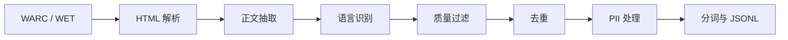

# CS336 面试导向学习指南


> Stanford CS336: Language Modeling from Scratch - 面试导向完整学习项目


---


# CS336 课程总览与学习路线

> Stanford CS336: Language Modeling from Scratch — 从零构建语言模型

---

## 一、这门课讲什么？

CS336 是斯坦福大学开设的一门**实战型**课程，通过实现分词器、语言模型、优化器和训练系统等关键组件，理解语言模型的构建过程。

**版本与范围**：本仓库主要参考 [CS336 Spring 2025](https://cs336.stanford.edu/spring2025/)，将相关主题整理为 20 篇学习笔记；这不是官方课次划分。推理部署、LoRA、DPO 等内容包含延伸学习，不能据此认定它们都是必做作业。官方仓库的默认分支可能已更新到新学期，复现时应核对讲义年份与对应提交。

```
原始文本 → 分词器 → Transformer模型 → 训练循环 → 系统优化 → 数据工程 → 对齐微调 → 部署推理
```

这条学习路径可用于展示从数据到训练、评估与推理的**全链路理解**。

---

## 二、课程结构（5大模块 × 5个Assignment）

```
┌─────────────────────────────────────────────────────────────┐
│                    CS336 课程知识图谱                         │
├─────────────┬───────────────────────────────────────────────┤
│  Assignment 1  │  基础：BPE分词 + Transformer + 训练循环      │
│  (Basics)      │  → 从零实现一个能跑的语言模型                  │
├─────────────┼───────────────────────────────────────────────┤
│  Assignment 2  │  系统：GPU优化 + FlashAttention + DDP        │
│  (Systems)     │  → 让模型跑得快、跑得稳                       │
├─────────────┼───────────────────────────────────────────────┤
│  Assignment 3  │  缩放：Scaling Laws + 最优配比               │
│  (Scaling)     │  → 在算力预算下权衡模型规模与数据规模          │
├─────────────┼───────────────────────────────────────────────┤
│  Assignment 4  │  数据：Common Crawl + 过滤 + 去重            │
│  (Data)        │  → 从互联网原始数据到高质量训练集               │
├─────────────┼───────────────────────────────────────────────┤
│  Assignment 5  │  推理：SFT + 验证奖励 + GRPO                 │
│  (Alignment)   │  → 数学推理训练；偏好对齐另有选做扩展          │
└─────────────┴───────────────────────────────────────────────┘
```

---

## 三、学习路线图（20节课）

### 第一阶段：基础篇（Lesson 1-8）⏱️ 建议2-3周

**目标**：从零实现一个能训练的 Transformer 语言模型

| 节次 | 主题 | 你将学到 | 面试热度 |
|------|------|---------|---------|
| 01 | 环境搭建 | Python/PyTorch/uv工具链 | ★☆☆☆☆ |
| 02 | BPE分词器 | 字节对编码的训练与推理 | ★★★★★ |
| 03 | Transformer架构 | Encoder/Decoder/Decoder-only | ★★★★★ |
| 04 | 注意力与RoPE | Multi-Head Attention + 旋转位置编码 | ★★★★★ |
| 05 | 现代LLM组件 | RMSNorm/SwiGLU/GQA | ★★★★☆ |
| 06 | AdamW优化器 | 权重衰减、学习率调度 | ★★★☆☆ |
| 07 | 训练与采样 | 交叉熵损失、Top-p采样 | ★★★★☆ |
| 08 | Assignment 1 实战 | 端到端代码整合 | ★★★★★ |

### 第二阶段：系统篇（Lesson 9-12）⏱️ 建议1-2周

**目标**：理解 GPU 硬件特性，优化模型训练效率

| 节次 | 主题 | 你将学到 | 面试热度 |
|------|------|---------|---------|
| 09 | GPU架构 | SRAM/HBM/DRAM内存层级 | ★★★★☆ |
| 10 | FlashAttention | 分块计算、IO感知优化 | ★★★★★ |
| 11 | 分布式训练 | DDP/AllReduce/梯度同步 | ★★★★★ |
| 12 | Assignment 2 实战 | 性能分析与优化 | ★★★★☆ |

### 第三阶段：缩放与数据篇（Lesson 13-16）⏱️ 建议1-2周

**目标**：掌握大模型的缩放规律和数据工程

| 节次 | 主题 | 你将学到 | 面试热度 |
|------|------|---------|---------|
| 13 | Scaling Laws | 幂律关系、Chinchilla配比 | ★★★★☆ |
| 14 | Common Crawl | 网页数据抓取与处理 | ★★★☆☆ |
| 15 | 数据过滤去重 | MinHash/质量分类器 | ★★★★☆ |
| 16 | Assignment 3-4 实战 | 缩放实验+数据管道 | ★★★☆☆ |

### 第四阶段：对齐与部署篇（Lesson 17-20）⏱️ 建议1-2周

**目标**：让模型对齐人类偏好，掌握推理部署优化

| 节次 | 主题 | 你将学到 | 面试热度 |
|------|------|---------|---------|
| 17 | SFT微调 | 指令数据构建与训练 | ★★★★★ |
| 18 | RLHF/DPO/GRPO | 偏好对齐全景 | ★★★★★ |
| 19 | Assignment 5 实战 | 数学推理RL训练 | ★★★★☆ |
| 20 | 推理优化部署 | KV Cache/量化/vLLM | ★★★★★ |

---

## 四、面试关联度分析

下表是学习主题与岗位能力的参考对应关系，不是招聘统计或面试频率调查：

```
CS336 模块          →    面试岗位方向
─────────────────────────────────────────
Assignment 1 基础   →    大模型算法工程师（架构理解）
Assignment 2 系统   →    AI系统工程师（性能优化）
Assignment 3 缩放   →    AI研究员（训练策略）
Assignment 4 数据   →    数据工程师（预训练数据）
Assignment 5 对齐   →    对齐研究员 / 应用算法工程师
```

薪资受城市、职责、经验和公司影响；本文未提供可核验的招聘样本，不给出薪资区间。

---

## 五、学习建议

1. **先理论后代码**：每节课先看概念讲解，再动手写代码
2. **重点标记面试考点**：每节课末尾的「面试高频题」必须掌握
3. **动手实现 > 看懂代码**：CS336 的精髓在于亲手实现
4. **建立知识图谱**：用思维导图串联各模块之间的关系
5. **准备 STAR 故事**：每完成一个 Assignment，就写一段 STAR 面试稿

---

## 六、参考资源

| 资源 | 链接 | 说明 |
|------|------|------|
| 官方课程 | [stanford-cs336.github.io](https://stanford-cs336.github.io/spring2025/) | 课件+作业 |
| 官方代码 | [github.com/stanford-cs336](https://github.com/stanford-cs336) | 5个Assignment仓库 |
| 参考实现 | [Melody-Zhou](https://github.com/Melody-Zhou/stanford-cs336-spring2025-assignments) | 完整作业实现 |
| 课程评价 | [Pinlin Xu](https://www.pinlinxu.com/posts/cs336_review.html) | 详细课程体验 |
| 中文笔记 | [Munger Yang](https://mungeryang.github.io/2025/07/14/cs336-study-note/) | 中文学习笔记 |
| YouTube | Stanford CS336 Spring 2025 | 完整录播视频 |

---

**下一步**：[Lesson 01 - 环境搭建与Python基础](../docs/01-%E7%8E%AF%E5%A2%83%E6%90%AD%E5%BB%BA%E4%B8%8EPython%E5%9F%BA%E7%A1%80.md) →


---


# Lesson 01：环境搭建与 Python 基础

> **Stanford CS336：Language Modeling from Scratch** — 20 节面试导向学习指南 · 第 1 节

---

## 一、标题与概览

### 1.1 本课定位

本节课是「从零手搓语言模型」系列的**第一站**。我们不一上来就堆公式，而是先把**工具链**（Python 环境、包管理、PyTorch 安装）和 **PyTorch 心智模型**（张量、自动求导、模块、设备）搭牢——因为 CS336 的五个 Assignment 本质上都是**在张量上写数学、在加速器上跑训练循环**。面试中，面试官也常会先确认「你对 PyTorch 是否熟练」，再深入到 Transformer、注意力与系统优化。

### 1.2 学完本节后你应该能够

- **课程层面**：说清楚 CS336 的五个 Assignment（Basics / Systems / Scaling / Data / Alignment）各自解决什么问题，以及本仓库文档与官方作业的对应关系；
- **环境层面**：使用 **Python 3.11+**，在 **conda、pip、uv** 三种路径中做出合理选择并完成可复现安装；
- **PyTorch 层面**：正确安装 **PyTorch**，完成张量创建、索引切片、**广播**、**`requires_grad`** 下的梯度计算；
- **工程层面**：理解 **`nn.Module`** 与 **`nn.Parameter`**，能写出一个最小可训练模块；用 **NumPy** 做预处理，用 **einops** 做维度重排；读懂带**类型标注**与**装饰器**的训练代码；
- **资源层面**：会做粗粒度的 **FLOPs** 与**参数显存**估算，能在面试中口述推理过程；
- **设备层面**：正确管理 **`device`**（CPU / CUDA / MPS），规避常见的设备不匹配错误。

### 1.3 文档结构说明（如何使用本文）

| 章节 | 内容 |
|------|------|
| **概念详解** | 面向小白，从零解释「为什么要这样」 |
| **代码示例** | 带中文注释的可运行片段，建议本地敲一遍 |
| **面试考点** | 浓缩清单，考前速览 |
| **练习题** | 自测，建议先闭卷再对答案 |
| **面试高频题** | 带详细口述/推导答案，模拟一面 |

---

## 二、概念详解（面向小白）

### 2.1 为什么需要「独立 Python 环境」？

你的电脑可能已装有系统自带的 Python，或 Anaconda 的 base 环境。**直接在系统 Python 上 `pip install`** 容易导致：版本冲突、不同项目依赖互相覆盖、难以复现「我机器能跑」。**虚拟环境**（venv、conda env）把每个项目的解释器与 `site-packages` 隔离开，像给每个项目单独一个「干净房间」。

### 2.2 conda、pip、uv 分别是什么？

- **conda**：不仅是 Python 包管理器，还能装 **Python 本身、CUDA 相关运行时、非 Python 库**（如某些 C 库）。可管理 Python/PyTorch 环境，但 **NVIDIA GPU 驱动需要在操作系统层安装**，不能由 conda 环境代替。
- **pip**：**Python 官方推荐的包安装器**，通常与 **`python -m venv`** 创建的虚拟环境配合：轻量、文档多、生态最大。
- **uv**（Astral）：用 Rust 实现的**极快**解析与安装工具，可创建虚拟环境、`uv pip install` 与 pip 命令接近，适合 CI 与频繁重建环境。

**一句话决策**：要管 CUDA/多语言栈 → 倾向 **conda**；只要 Python 包、追求标准 → **pip + venv**；追求速度与锁版本 → **uv**。

### 2.3 PyTorch 与「张量」是什么？

**张量（Tensor）**可以理解为「多维数组」：0 维是标量，1 维是向量，2 维是矩阵，更高维是批量数据（如 `(batch, seq_len, hidden_dim)`）。**PyTorch** 在 NumPy 式 API 之上提供了：

- **GPU / Apple Silicon MPS** 加速；
- **自动求导（autograd）**：对 `requires_grad=True` 的张量自动建计算图并 `backward()`；
- 与 **`nn.Module`**、优化器、分布式训练的一体化。

### 2.4 `nn.Module` 与 `nn.Parameter` 各管什么？

- **`nn.Module`**：可组合的计算单元，负责**子模块注册**、`forward` 定义、`train()`/`eval()` 切换（影响 Dropout、BatchNorm 等）。
- **`nn.Parameter`**：特殊的 `Tensor`；赋给 `nn.Module` 属性后会注册到 `parameters()`，并随模块迁移。传给优化器且产生梯度时才会被更新。

普通 `Tensor` 挂在 `self` 上若未用 `register_buffer`，**不会**被优化器默认更新，常用于临时常量（需谨慎）。

### 2.5 FLOPs 与显存估算为什么要会？

系统设计题、研究员岗常问：**这个模型训练要多少显存？前向一次大概多少算力？** 不需要精确到个位，但要**数量级正确**：会把大计算拆成若干矩阵乘（matmul），按 **2×M×N×K**（或说明口径）估 FLOPs；按 **参数量 × 每参数字节数** 估权重占用，并知道训练时还有**优化器状态、激活**等额外开销（本课先掌握权重与 matmul）。

### 2.6 CS336 五个 Assignment 在整条链路中的位置

| Assignment | 英文主题 | 中文概括 |
|------------|----------|----------|
| **A1 Basics** | 基础 | BPE、Transformer、训练循环，跑通**可训练的语言模型** |
| **A2 Systems** | 系统 | GPU 优化、FlashAttention、DDP 等，**又快又稳** |
| **A3 Scaling** | 缩放 | Scaling Laws、算力与数据的**最优配比** |
| **A4 Data** | 数据 | Common Crawl、过滤、去重，构建**高质量预训练集** |
| **A5 Alignment** | 对齐 | SFT、RLHF、DPO、GRPO 等，**有用且可控** |

本仓库 **20 节**文档与上述模块对齐：第 1～8 节主攻 Assignment 1 所需基础；后续分阶段覆盖系统、缩放、数据、对齐。本节是**全系列的公共底座**。

### 2.7 本仓库典型目录（心里有数）

```
learn-cs336/
├── docs/              # 课程文档（面试导向）
├── interview/         # 八股、简历等（若存在）
├── code/              # 实现示例（若存在）
├── requirements.txt
└── README.md
```

官方课程与作业请以当年发布为准：[Stanford CS336 课程站](https://stanford-cs336.github.io/spring2025/)。

---

## 三、代码示例（含中文注释）

以下片段建议在新环境中**逐段运行**，观察 `print` 输出与张量 `shape`。

### 3.1 conda / pip / uv 命令骨架

```bash
# ---------- conda：适合需要统一 CUDA / 多语言依赖时 ----------
# conda create -n cs336 python=3.11 -y
# conda activate cs336
# 安装 PyTorch 请以官网命令为准，CUDA 版本需与驱动匹配
# conda install pytorch torchvision torchaudio pytorch-cuda=12.1 -c pytorch -c nvidia

# ---------- pip + venv：经典、标准 ----------
cd /path/to/learn-cs336
[Mac]python3.11 -m venv .venv
[windows] py -3.11 -m venv .venv
source .venv/bin/activate          # Windows: .venv\Scripts\activate
pip install --upgrade pip
pip install -r requirements.txt

# ---------- uv：快速创建环境与安装 ----------
# uv venv .venv
# source .venv/bin/activate
# uv pip install -r requirements.txt
```

### 3.2 PyTorch 安装后自检

```python
import torch

# 打印版本，确认与项目要求一致
print("torch version:", torch.__version__)

# NVIDIA GPU：需要正确安装 CUDA 版 PyTorch 与驱动
print("CUDA available:", torch.cuda.is_available())
if torch.cuda.is_available():
    print("GPU name:", torch.cuda.get_device_name(0))

# Apple Silicon：常用 MPS 后端
print("MPS available:", torch.backends.mps.is_available())
```

### 3.3 张量创建、dtype、device

```python
import torch

# 从 Python 列表创建；默认在 CPU，dtype 常为 float32
x = torch.tensor([1.0, 2.0, 3.0])
print(x.shape, x.dtype, x.device)

B, T, D = 2, 8, 16
a = torch.zeros(B, T, D)           # 全零
b = torch.randn(B, T, D)           # 标准正态分布

# 根据环境选择设备（面试常写成一个函数）
def pick_device() -> torch.device:
    if torch.cuda.is_available():
        return torch.device("cuda")
    if torch.backends.mps.is_available():
        return torch.device("mps")
    return torch.device("cpu")

device = pick_device()
c = torch.ones(3, 4, device=device, dtype=torch.float32)
print(c.device)
```

### 3.4 NumPy 与 PyTorch 互转（注意共享内存）

```python
import numpy as np
import torch

# 随机 numpy 数组，显式 float32 与 torch 常见训练精度一致
arr = np.random.randn(4, 8).astype(np.float32)

# from_numpy：与 arr 共享底层内存，改一方可能影响另一方
x = torch.from_numpy(arr)
arr[0, 0] = 999.0
print(x[0, 0])  # 可能也是 999.0，演示共享内存

# 需要独立副本时用 torch.tensor 或 clone
y = torch.tensor(arr)
arr[0, 0] = 0.0
print(y[0, 0])  # 不受后续 arr 修改影响（取决于是否仍共享，tensor(arr) 一般为拷贝）
```

### 3.5 类型标注与小型 `nn.Module`

```python
# 从 Python 的 typing 模块导入 Tuple 类型（虽然这段代码里没用到，但可能是为以后准备）
from typing import Tuple

# 导入 PyTorch 的核心库
import torch
# 导入 PyTorch 的神经网络模块，里面包含了所有神经网络的层（比如 Linear、Conv2d 等）
import torch.nn as nn


def split_heads(x: torch.Tensor, n_heads: int, head_dim: int) -> torch.Tensor:
    """
    这个函数的作用：把输入张量重新排列，为"多头注意力机制"做准备
    
    大白话解释：
    输入是一个 3 维数据，形状是 (B, T, 总特征数)
    我们要把它变成 4 维数据，形状是 (B, 头数, T, 每个头的特征数)
    
    类比：就像把一个班级的学生（总特征）分成若干个小组（头数），
         每个小组负责处理自己的那部分特征
    
    参数：
        x: 输入张量，形状为 (B, T, n_heads * head_dim)
           - B: batch size（批次大小），可以理解为一次处理多少个独立的样本
           - T: 序列长度（sequence length），比如一句话有多少个词
           - 最后一个数字: n_heads * head_dim，即所有头的总特征维度
        
        n_heads: 多头数量（要分成几个小组）
        head_dim: 每个头的特征维度（每个小组处理多少特征）
    
    返回：
        重新排列后的张量，形状为 (B, n_heads, T, head_dim)
    """
    
    # 获取输入张量的形状，解包成三个变量
    # b = batch size（批次大小）
    # t = 序列长度（sequence length）
    # c = 特征总数（即 n_heads * head_dim）
    b, t, c = x.shape
    
    # 检查一下：特征总数必须等于 头数 × 每个头的维度
    # 如果不相等，说明数据格式不对，程序会报错停下来
    # 比如：n_heads=4, head_dim=8，那么 c 必须等于 32
    assert c == n_heads * head_dim
    
    # 核心操作（分两步）：
    
    # 第一步：使用 view() 改变形状，但不改变数据顺序
    # 从 (B, T, n_heads*head_dim) 变成 (B, T, n_heads, head_dim)
    # 就是把最后一大坨特征，按照"头数 × 每头维度"的方式重新分组
    x = x.view(b, t, n_heads, head_dim)
    
    # 第二步：使用 transpose() 交换维度位置
    # 原来的顺序是 (批次, 序列长度, 头数, 每头维度)
    # 我们想要 (批次, 头数, 序列长度, 每头维度)
    # 所以把第1维（序列长度）和第2维（头数）交换位置
    x = x.transpose(1, 2)
    
    # 返回处理后的张量
    return x


class DummyModel(nn.Module):
    """
    这是一个简单的神经网络模型，用于演示如何自定义模型
    
    大白话解释：
    在 PyTorch 里，所有神经网络都要继承 nn.Module 这个类
    就像你要做一个玩具，必须先有一个"玩具"的模子（nn.Module）
    
    这个模型特别简单：输入什么维度，输出什么维度，中间只经过一个线性变换
    就像一个"翻译器"，把数字从一种形式翻译成另一种形式，但大小不变
    """
    
    def __init__(self, d_model: int) -> None:
        """
        初始化函数：当创建这个模型时，会自动调用这个函数
        
        参数：
            d_model: 模型的维度，即输入和输出的特征数量
                    比如 d_model=512，表示输入是512维，输出也是512维
        
        大白话解释：
        就像你要开一家工厂，需要先买好机器设备（这里就是买一个线性层）
        """
        
        # 调用父类 nn.Module 的初始化函数
        # 这一行必须写，否则 PyTorch 无法正常管理这个模型
        # 就像你开店必须先办营业执照一样，这是必须的手续
        super().__init__()
        
        # 创建一个线性层（全连接层），把它作为这个模型的"零件"
        # nn.Linear(d_model, d_model) 的意思是：
        # 输入维度是 d_model，输出维度也是 d_model
        # 这个线性层做的事情：y = x * W + b
        # 其中 W 是权重矩阵，b 是偏置项，它们都是模型需要学习的参数
        # 把这个线性层存到 self.proj 里，这样模型就能记住自己有这个零件
        self.proj = nn.Linear(d_model, d_model)
    
    def forward(self, x: torch.Tensor) -> torch.Tensor:
        """
        前向传播函数：数据进入模型后，该怎么流动
        
        大白话解释：
        就像工厂的生产线，原材料（输入数据）进来后，
        经过一道工序（self.proj 线性变换），
        生产出产品（输出数据）再送出去
        
        参数：
            x: 输入张量，形状可以是任意的，但最后一维必须是 d_model
        
        返回：
            经过线性变换后的张量，形状和输入一样
        
        注意：在 PyTorch 中，你通常不直接调用这个函数，
        而是调用 model(x)，PyTorch 会自动调用 forward()
        """
        
        # 把输入 x 传给 self.proj（线性层），得到输出
        # 相当于：output = x * W + b
        # 然后把这个结果返回给调用者
        return self.proj(x)
```

### 3.6 装饰器示例：`@torch.no_grad()` 与自定义计时

```python
# 导入 functools 模块，它提供了"装饰器"相关的工具函数
# 装饰器就像给函数穿上一件"外衣"，在不修改原函数代码的情况下增加新功能
import functools
# 导入 time 模块，用来计时
import time
# 从 typing 导入类型提示相关的工具
# Any: 任意类型, Callable: 可调用对象（函数）, TypeVar: 类型变量
from typing import Any, Callable, TypeVar

# 导入 PyTorch 核心库
import torch

# 定义一个类型变量 F，表示"可调用对象"（即函数）
# bound=Callable[...] 限制 F 只能是函数类型，不能是 int、str 等其他类型
# 这样装饰器就能精准保留被装饰函数的原始类型信息，IDE 会有正确的代码补全
#
# Callable[..., Any] 的含义：
#   - ...（三个点）：表示函数的参数列表【任意】，数量和类型都不限制
#   - Any：表示函数的返回值类型【任意】，可以是任何类型
#   合起来就是：一个"参数和返回值都不限定"的函数类型
F = TypeVar("F", bound=Callable[..., Any])


def timeit(fn: F) -> F:
    """
    装饰器：给被装饰的函数添加"计时"功能
    
    大白话：给函数戴上秒表，执行前开始计时，执行后打印耗时
    
    参数：
        fn: 要被装饰的函数
    
    返回：
        包装后的函数（原函数 + 计时功能）
    """
    
    # functools.wraps 保留原函数的名字、文档字符串等信息
    @functools.wraps(fn)
    def wrapper(*args: Any, **kwargs: Any) -> Any:
        """
        包装函数：在调用原函数前后加上计时逻辑
        
        *args: 所有位置参数
        **kwargs: 所有关键字参数
        """
        
        # 记录开始时间（time.perf_counter() 是高精度计时器，单位秒）
        t0 = time.perf_counter()
        
        # 调用原函数
        out = fn(*args, **kwargs)
        
        # 记录结束时间，计算并打印耗时（转换为毫秒）
        t1 = time.perf_counter()
        print(f"{fn.__name__}: {(t1 - t0) * 1000:.2f} ms")
        
        # 返回原函数的执行结果
        return out
    
    return wrapper  # type: ignore[return-value]


@torch.no_grad()
def eval_forward(model: torch.nn.Module, x: torch.Tensor) -> torch.Tensor:
    """
    模型推理函数（评估/测试阶段使用）
    
    作用：
    1. 把模型切换到评估模式（model.eval()）
    2. 用模型做一次前向传播
    
    好处：
    - 关闭梯度计算，节省显存/内存
    - 加快推理速度
    
    参数：
        model: PyTorch 模型
        x: 输入数据（张量）
    
    返回：
        模型的预测结果（张量）
    """
    
    # 切换到评估模式
    # 会影响 Dropout（关闭随机丢弃）和 BatchNorm（用全局统计量）等层的行为
    model.eval()
    
    # 前向传播（@torch.no_grad() 保证这里不会记录梯度）
    return model(x)
```

### 3.7 广播（Broadcasting）

```python
import torch

# ============================================================================
# 示例1：广播机制基础演示
# ============================================================================
# 广播（Broadcasting）规则：
# 从最后一维开始向前对齐，逐维比较，满足以下条件之一即可广播：
#   1. 两个维度大小相等
#   2. 其中一个维度大小为 1
#   3. 某个维度缺失（相当于大小为 1）
# ============================================================================

# 创建一个形状为 (32, 1, 128) 的张量
# - 32: 批次大小（batch size）
# - 1:  中间维度大小为1，可以被广播
# - 128: 特征维度
a = torch.randn(32, 1, 128)

# 创建一个形状为 (128,) 的一维张量
# 这是一个一维向量，没有批次和序列维度
b = torch.randn(128)

# a + b 的广播过程：
# 1. a 的形状: (32, 1, 128)
# 2. b 的形状: (128,) → 先在前面补1 → (1, 1, 128)
# 3. 比较维度（从后往前）：
#    - 最后一维: 128 vs 128 ✅ 相等
#    - 第二维:   1   vs 1   ✅ 相等（b补了1）
#    - 第一维:   32  vs 1   ✅ b的维度为1，可以广播到32
# 4. 结果形状: (32, 1, 128)
c = a + b

print(f"a 的形状: {a.shape}")      # torch.Size([32, 1, 128])
print(f"b 的形状: {b.shape}")      # torch.Size([128])
print(f"c 的形状: {c.shape}")      # torch.Size([32, 1, 128])


# ============================================================================
# 示例2：大语言模型中的实际应用
# ============================================================================
# 场景：在 Transformer 的 Softmax 之前，为每个 token 加上偏置（bias）
# ============================================================================

# logits: 模型的原始输出分数
# 形状为 (4, 10, 50257) 表示：
#   - 4:   批次大小（4个句子）
#   - 10:  序列长度（每个句子10个token）
#   - 50257: 词表大小（每个token在50257个词上的得分）
logits = torch.randn(4, 10, 50257)

# bias: 词表偏置，每个词有一个偏置值
# 形状为 (50257,) 的一维向量
bias = torch.randn(50257)

# view(1, 1, -1) 将 bias 变成 (1, 1, 50257)
# - 第0维变成1（批次维度，可以广播）
# - 第1维变成1（序列维度，可以广播）  
# - 第2维是 -1，自动计算为 50257（保持不变）
# 
# 广播过程：
# logits: (4, 10, 50257)
# bias:   (1, 1, 50257) → 广播到 (4, 10, 50257)
# 结果:   (4, 10, 50257)
bias = bias.view(1, 1, -1)

# 加上偏置：每个 token 的每个词得分都加上对应的词偏置
out = logits + bias

print(f"\nlogits 的形状: {logits.shape}")   # torch.Size([4, 10, 50257])
print(f"bias 的形状:   {bias.shape}")     # torch.Size([1, 1, 50257])
print(f"out 的形状:    {out.shape}")      # torch.Size([4, 10, 50257])

# ============================================================================
# 广播的优缺点
# ============================================================================
# 优点：
#   - 无需显式扩展张量，节省内存
#   - 代码简洁，可读性好
# 
# 注意：
#   - 如果维度不匹配且都不为1，会报错
#   - 例如：(4, 10, 50257) + (4, 10, 10) ❌ 最后一维 50257 ≠ 10 且都不为1
# ============================================================================
```

### 3.8 自动求导与 `zero_grad`

```python
import torch

# ============================================================================
# 自动求导（Autograd）基础演示
# ============================================================================
# 在深度学习中，我们需要计算损失函数对模型参数的梯度（导数），
# 然后用梯度下降法更新参数。PyTorch 的 autograd 可以自动帮我们计算这些梯度。
# ============================================================================

# 创建一个需要求导的张量 w（权重矩阵）
# - shape: (10, 1)，10行1列
# - requires_grad=True: 表示 PyTorch 需要追踪对这个张量的所有运算，
#   以便后续自动计算梯度
# - 数值来自标准正态分布（随机初始化）
w = torch.randn(10, 1, requires_grad=True)

# 创建一个输入张量 x（不需要求导，因为它是数据，不是要训练的参数）
# - shape: (1, 10)，1行10列
# - 数值来自标准正态分布
x = torch.randn(1, 10)

# ============================================================================
# 前向传播：计算损失（标量）
# ============================================================================
# x @ w: 矩阵乘法
#   - x 形状: (1, 10)
#   - w 形状: (10, 1)
#   - 结果形状: (1, 1)
#
# .sum(): 把所有元素求和，变成标量（0维张量）
# 
# 为什么需要 .sum()？
#   在 PyTorch 中，.backward() 要求从标量开始反向传播。
#   .sum() 把预测结果聚合成一个数，这样就能调用 y.backward() 了。
#
# 一句话总结：(x @ w).sum() = 先做矩阵乘法得到预测值，再求和变成标量
# 
# 在真正的训练中，这里的 y 通常是损失函数（如 MSE、交叉熵），
# 会自然产生标量，但这里为了教学演示，用 .sum() 来构造一个标量。
y = (x @ w).sum()

# ============================================================================
# 反向传播：计算梯度
# ============================================================================
# .backward() 会执行反向传播，自动计算所有 requires_grad=True 的张量的梯度
# 具体来说：
#   1. 从 y 开始，沿着计算图反向传播
#   2. 计算 dy/dw（损失对权重 w 的导数）
#   3. 把计算结果存到 w.grad 中
y.backward()

# 查看梯度形状
# w.grad 的形状和 w 完全一样，都是 (10, 1)
# 每个位置的梯度值表示：如果改变 w 中该位置的数值，y 会变化多少
# 大白话：w.grad 告诉我们"每个权重应该往哪个方向调整才能让损失变小"
print(w.grad.shape)   # 输出: torch.Size([10, 1])

# ============================================================================
# 梯度清零（非常重要！）
# ============================================================================
# 在 PyTorch 中，梯度是【累加】的，而不是覆盖的。
# 也就是说，每次调用 .backward()，新的梯度会【加到】旧的梯度上。
# 
# 为什么这样设计？
#   某些场景下需要累加梯度（比如梯度累积，用多个小批次模拟大批次）
#   但大多数情况下，我们只需要当前批次的梯度，所以每次更新前要清零。
#
# 如果不清零会怎样？
#   第一次反向传播: w.grad = 梯度1
#   第二次反向传播: w.grad = 梯度1 + 梯度2  ← 累加了！
#   这样更新权重时用的是"累加后的梯度"，会导致训练出错！
#
# .zero_() 方法：
#   - 下划线 _ 表示"原地操作"（in-place），直接修改张量本身
#   - 把 w.grad 中的所有元素设置为 0
#   - 为下一轮迭代做好准备
w.grad.zero_()

# 清零后，w.grad 全部变成 0
print(w.grad)  # 输出: tensor([[0.], [0.], ...])
```

### 3.9 `nn.Parameter` 与自定义线性层

```python
# 导入 PyTorch 核心库
import torch
# 导入 PyTorch 神经网络模块
import torch.nn as nn


# ============================================================================
# 自定义线性层（全连接层）
# ============================================================================
# 这是一个从零实现的全连接层，功能等同于 nn.Linear(in_features, out_features)
# 
# 大白话：建立一个"翻译器"，输入 in_features 个数字，输出 out_features 个数字
# 比如：输入4个特征（身高、体重、年龄、学历），输出2个值（收入预测、信用评分）
# ============================================================================

class TinyLinear(nn.Module):
    """
    自定义线性层（全连接层）
    
    数学公式：y = x @ W.T
    其中 W 是权重矩阵，形状为 (out_features, in_features)
    """
    
    def __init__(self, in_features: int, out_features: int):
        """
        初始化线性层
        
        参数：
            in_features:  输入特征数量（比如 4）
            out_features: 输出特征数量（比如 2）
        
        大白话：买好"翻译器"的零件（权重矩阵），准备开始工作
        """
        
        # 调用父类 nn.Module 的初始化（必须的"办营业执照"步骤）
        super().__init__()
        
        # ============================================================
        # 创建权重矩阵（模型需要学习的参数）
        # ============================================================
        # nn.Parameter() 的作用：
        #   - 把张量"包装"成模型参数
        #   - 这样 model.parameters() 才能识别并收集它
        #   - 训练时优化器会自动更新它
        #
        # 形状：torch.randn(out_features, in_features)
        #   - 为什么是 (out_features, in_features)？
        #     因为矩阵乘法时：x @ W.T
        #     输入 x 形状: (batch, in_features)
        #     权重 W 形状: (out_features, in_features)  
        #     W.T 转置后: (in_features, out_features)
        #     这样 (batch, in_features) @ (in_features, out_features) 
        #     = (batch, out_features) ✅
        #
        # * 0.02：小随机初始化
        #   - 标准正态分布（均值0，方差1）乘以 0.02
        #   - 让初始值非常小（标准差只有0.02）
        #   - 为什么？避免一开始数值太大导致"饱和"
        #     （比如激活函数是 Sigmoid 或 Tanh 时，大数值会进入平坦区，梯度消失）
        #   - 在真正的 nn.Linear 中，初始化策略更复杂（如 Kaiming 初始化）
        self.weight = nn.Parameter(torch.randn(out_features, in_features) * 0.02)

    def forward(self, x: torch.Tensor) -> torch.Tensor:
        """
        前向传播：数据流过这个层
        
        参数：
            x: 输入张量，形状为 (batch_size, in_features)
               比如 (32, 4) 表示 32 个样本，每个 4 个特征
        
        返回：
            输出张量，形状为 (batch_size, out_features)
               比如 (32, 2) 表示 32 个样本，每个 2 个输出值
        
        计算公式：y = x @ W.T
        
        为什么用 W.T（转置）？
            输入 x: (batch, in_features)
            权重 W: (out_features, in_features)  ← 我们存储的格式
            W.T:   (in_features, out_features)   ← 转置后
            x @ W.T: (batch, out_features)       ← 结果
            
            如果不转置直接用 W：(batch, in_features) @ (out_features, in_features)
            ❌ 矩阵乘法不合法（列数 in_features ≠ 行数 out_features）
        """
        
        # 矩阵乘法：输入 @ 权重的转置 = 输出
        return x @ self.weight.T


# ============================================================================
# 使用示例
# ============================================================================

# 创建一个线性层：4个输入特征 → 2个输出特征
m = TinyLinear(4, 2)

# 打印参数个数
# p.numel() 返回张量中元素的总个数（number of elements）
# 权重矩阵是 (2, 4)，所以有 2 × 4 = 8 个参数
# sum(...) 把所有参数的个数加起来
print("参数个数:", sum(p.numel() for p in m.parameters()))
# 输出: 参数个数: 8
```

### 3.10 einops：与 Attention 形状强相关

```python
import torch
from einops import rearrange, repeat

# 定义张量的维度大小
B, T, HD = 2, 64, 128   # batch size=2, 序列长度=64, 隐藏维度=128
H, D = 8, 16            # 注意力头数=8, 每个头的维度=16
assert H * D == HD      # 校验：多头拼接后的总维度必须等于隐藏维度

# 构造一个形状为 (B, T, H*D) 的随机张量，模拟 Transformer 中的隐藏状态
x = torch.randn(B, T, H * D)

# 命名维度：论文里常见的 (B, T, H, D) 拆分
# 将最后一维 (H*D) 拆分为 (H, D)，即把隐藏维度拆成多个注意力头
# 结果形状: (B, H, T, D)，方便后续按头做注意力计算
x_heads = rearrange(x, "b t (h d) -> b h t d", h=H, d=D)
print(x_heads.shape)    # torch.Size([2, 8, 64, 16])

# 构造一个形状为 (3, 1) 的随机张量
y = torch.randn(3, 1)

# 沿第二维（b 维度）复制 repeat=4 次
# "a b -> a (repeat b)" 表示保持 a 维不变，把 b 维扩展为 repeat 份并拼接到一起
# 结果形状: (3, 1*4) = (3, 4)
y_rep = repeat(y, "a b -> a (repeat b)", repeat=4)
print(y_rep.shape)      # torch.Size([3, 4])

#rearrange 的拆维："b t (h d) -> b h t d" 中括号 (h d) 表示把最后一维按 h 和 d 两个因子拆开，h=H, d=D 明确指定各因子大小；输出顺序 b h t d 把 h 提到了 t 前面。

#repeat 的复制："a b -> a (repeat b)" 中的 repeat 是一个新的轴名（不是关键字，只是约定俗成的名字），右侧 (repeat b) 表示把 b 维复制 repeat 份后与 b 拼在一起。等价于 y.unsqueeze(1).expand(-1, 4, -1).reshape(3, 4)。

#两种操作的本质区别：rearrange 只做形状变换（view/permute），不复制数据；repeat 会真正复制数据，因此内存占用会随 repeat 倍数增长。


```

```python
# 导入 PyTorch 核心库
import torch
# 从 einops 导入张量操作工具
# rearrange: 重新排列张量的维度（类似 view/permute，但更易读）
# repeat: 重复张量的内容（类似 expand/repeat，但更直观）
from einops import rearrange, repeat

# ============================================================================
# 设置张量维度参数
# ============================================================================
B, T, HD = 2, 64, 128
# B (Batch):   批次大小，一次处理 2 个独立样本
# T (Time/Seq): 序列长度，每个样本有 64 个 token/时刻
# HD (Hidden Dimension): 隐藏层总维度，128

H, D = 8, 16
# H (Heads):   多头数量，8 个头
# D (Depth/Head Dimension): 每个头的维度，16

# 验证：总维度 = 头数 × 每头维度
# 128 = 8 × 16 ✅
assert H * D == HD

# 创建一个随机张量，形状为 (B, T, H*D) = (2, 64, 128)
# 这个形状是 Transformer 中典型的"混合头"格式
# 所有的头信息都堆叠在最后一个维度里
x = torch.randn(B, T, H * D)

# ============================================================================
# rearrange: 重新排列维度（拆分头）
# ============================================================================
# 代码：x_heads = rearrange(x, "b t (h d) -> b h t d", h=H, d=D)
#
# 大白话：把"混合在一起的头"拆分成"独立的头"
# 
# 详细解释：
#   左侧描述原始形状："b t (h d)"
#     - b: 批次维度
#     - t: 序列长度维度
#     - (h d): 把最后一个维度拆分成两部分 h 和 d（括号表示拆分）
# 
#   右侧描述目标形状："b h t d"
#     - b: 批次维度不变
#     - h: 头数（变成独立的维度）
#     - t: 序列长度维度
#     - d: 每个头的维度
# 
#   h=H, d=D: 指定拆分后的维度大小
# 
# 形状变化：(2, 64, 128) → (2, 8, 64, 16)
#   原来 128 维 = 8 个头 × 每个头 16 维
#   拆分成 8 个独立的头，每个头 16 维
x_heads = rearrange(x, "b t (h d) -> b h t d", h=H, d=D)

# 打印拆分后的形状
print(x_heads.shape)  # 输出: torch.Size([2, 8, 64, 16])

# 为什么要这样做？
# 在多头注意力中，每个头独立计算注意力，需要把"混合头"变成"独立头"格式
# 这样每个头可以并行计算，提高效率


# ============================================================================
# repeat: 重复张量内容
# ============================================================================
# 创建一个形状为 (3, 1) 的张量，包含 3 行 1 列
# 就像 3 个样本，每个样本只有 1 个特征
y = torch.randn(3, 1)

# 代码：y_rep = repeat(y, "a b -> a (repeat b)", repeat=4)
#
# 大白话：把 b 维度重复 4 次
# 
# 详细解释：
#   左侧描述原始形状："a b"
#     - a: 第1维（大小为 3）
#     - b: 第2维（大小为 1）
# 
#   右侧描述目标形状："a (repeat b)"
#     - a: 第1维不变
#     - (repeat b): 把 b 维度重复 repeat 次（括号表示合并）
# 
#   repeat=4: 指定重复次数
# 
# 形状变化：(3, 1) → (3, 4)
#   原来第2维只有 1 列，重复 4 次变成 4 列
y_rep = repeat(y, "a b -> a (repeat b)", repeat=4)

# 打印重复后的形状
print(y_rep.shape)  # 输出: torch.Size([3, 4])

# 实际效果演示：
# 假设 y = [[1.0], [2.0], [3.0]]
# 重复后变成：
# [[1.0, 1.0, 1.0, 1.0],
#  [2.0, 2.0, 2.0, 2.0],
#  [3.0, 3.0, 3.0, 3.0]]
```


### 3.11 资源估算：参数量显存与 matmul FLOPs

```python
def param_memory_gb(num_params: int, bytes_per_param: int = 4) -> float:
    """仅权重占用，不含优化器状态与激活。"""
    return num_params * bytes_per_param / (1024**3)


def matmul_flops_2mnk(m: int, n: int, k: int) -> int:
    """矩阵乘 C = A @ B，形状 (m,k) @ (k,n)；按 2*M*N*K 计 FLOPs 的一种常见口径。"""
    return 2 * m * n * k


n = 1_000_000_000
print(f"1B 参数 FP32 权重约 {param_memory_gb(n, 4):.2f} GB")
print(f"1B 参数 BF16 权重约 {param_memory_gb(n, 2):.2f} GB")

M, N, K = 4096, 4096, 4096
print("4096^3 matmul FLOPs (2MNK):", matmul_flops_2mnk(M, N, K))
```

```python
# ============================================================================
# 模型参数显存与计算量估算工具
# ============================================================================
# 在深度学习中，我们需要估算：
# 1. 模型参数占多少显存（能不能装进 GPU）
# 2. 矩阵乘法需要多少次计算（训练速度有多快）
# ============================================================================

def param_memory_gb(num_params: int, bytes_per_param: int = 4) -> float:
    """
    计算模型参数占用的显存大小（仅权重本身，不含优化器状态和激活值）
    
    参数：
        num_params: 模型参数个数
        bytes_per_param: 每个参数占用的字节数
            - FP32 (单精度): 4 字节
            - FP16/BF16 (半精度): 2 字节
            - FP64 (双精度): 8 字节
            - INT8: 1 字节
    
    返回：
        显存大小（单位：GB）
    
    计算公式：
        GB = 参数个数 × 每参数字节数 / (1024^3)
    
    为什么除以 1024^3？
        1 KB = 1024 字节
        1 MB = 1024^2 字节
        1 GB = 1024^3 字节
    """
    # 总字节数 = 参数个数 × 每参数字节数
    # 除以 1024^3 转换成 GB（用 1024 而不是 1000，这是计算机存储的标准）
    return num_params * bytes_per_param / (1024**3)


def matmul_flops_2mnk(m: int, n: int, k: int) -> int:
    """
    计算矩阵乘法的浮点运算次数（FLOPs）
    
    矩阵乘法：C = A @ B
        - A 的形状: (m, k)
        - B 的形状: (k, n)
        - C 的形状: (m, n)
    
    参数：
        m: 矩阵 A 的行数
        n: 矩阵 B 的列数
        k: 矩阵 A 的列数 / 矩阵 B 的行数（内积维度）
    
    返回：
        FLOPs 总数（浮点运算次数）
    
    计算公式：2 × m × n × k
    
    为什么是 2？
        对于 C[i, j] = sum(A[i, :] × B[:, j])：
        - 有 k 次乘法
        - 有 (k-1) 次加法 ≈ k 次加法
        - 总共约 2k 次运算
        - 所以总 FLOPs = 2 × m × n × k
    
    注意：这是"一次矩阵乘法"的计算量
    """
    return 2 * m * n * k


# ============================================================================
# 示例计算
# ============================================================================

# 创建一个变量 n，表示 10 亿个参数
n = 1_000_000_000  # 1B = 10 亿

# 计算 10 亿参数在不同精度下的显存占用
# FP32（单精度）：每个参数 4 字节
print(f"1B 参数 FP32 权重约 {param_memory_gb(n, 4):.2f} GB")
# 计算：1,000,000,000 × 4 / 1024^3 ≈ 3.73 GB

# BF16/FP16（半精度）：每个参数 2 字节
print(f"1B 参数 BF16 权重约 {param_memory_gb(n, 2):.2f} GB")
# 计算：1,000,000,000 × 2 / 1024^3 ≈ 1.86 GB

# ============================================================================
# 矩阵乘法计算量示例
# ============================================================================

# 设置矩阵维度为 4096 × 4096 × 4096
M, N, K = 4096, 4096, 4096  # 3 个维度都是 4096

# 计算这个矩阵乘法的 FLOPs
print("4096^3 matmul FLOPs (2MNK):", matmul_flops_2mnk(M, N, K))
# 计算：2 × 4096 × 4096 × 4096 = 2 × 68,719,476,736 = 137,438,953,472
# 结果：约 1.37e11 FLOPs（1370 亿次浮点运算）


# ============================================================================
# 补充：大模型的实际数字
# ============================================================================

# GPT-3 175B 参数
gpt3_params = 175_000_000_000
print(f"\nGPT-3 (175B 参数):")
print(f"  FP32 权重显存: {param_memory_gb(gpt3_params, 4):.2f} GB")
print(f"  BF16 权重显存: {param_memory_gb(gpt3_params, 2):.2f} GB")

# 实际训练还需要额外显存：
# 1. 梯度（梯度通常和参数一样大）
# 2. 优化器状态（Adam 需要额外 2 倍参数显存）
# 3. 激活值（取决于批次大小和序列长度）
# 所以实际需求远大于模型本身！
```


### 3.12 最小训练循环（线性层 + MSE）

```python
import torch
import torch.nn as nn

# 自动选择运行设备：有 GPU 就用 GPU，否则用 CPU
device = torch.device("cuda" if torch.cuda.is_available() else "cpu")


class MyLinear(nn.Module):
    """手写线性层：y = x @ W^T + b"""

    def __init__(self, in_f: int, out_f: int):
        super().__init__()
        # 权重 (out_f, in_f)，用小幅随机值初始化
        self.weight = nn.Parameter(torch.randn(out_f, in_f, device=device) * 0.01)
        # 偏置 (out_f,)，初始化为 0
        self.bias = nn.Parameter(torch.zeros(out_f, device=device))

    def forward(self, x: torch.Tensor) -> torch.Tensor:
        # (..., in_f) @ (in_f, out_f) + (out_f,) -> (..., out_f)
        return x @ self.weight.T + self.bias


torch.manual_seed(0)                       # 固定随机种子，保证结果可复现
model = MyLinear(5, 3).to(device)          # 输入维度 5，输出维度 3
opt = torch.optim.SGD(model.parameters(), lr=0.1)  # 随机梯度下降优化器

x = torch.randn(4, 5, device=device)       # 4 个样本，每个 5 维
target = torch.randn(4, 3, device=device)  # 回归目标

for step in range(3):
    opt.zero_grad(set_to_none=True)        # 清空上一步的梯度（set_to_none 更省内存）
    pred = model(x)                        # 前向传播
    loss = (pred - target).pow(2).mean()   # MSE 损失
    loss.backward()                        # 反向传播，计算梯度
    opt.step()                             # 更新参数
    print(step, loss.item())               # 打印当前步的损失
```

---

## 四、面试考点（浓缩清单）

| 主题 | 你需要达到的程度 |
|------|------------------|
| conda / pip / uv | 能说明定位与选型；强调**版本锁定**、可复现安装 |
| CS336 五作业 | 能一句话概括 Basics / Systems / Scaling / Data / Alignment |
| 张量 / 广播 / device | 会白板推形状；会排查 `Expected all tensors on the same device` |
| autograd | leaf tensor、`detach`、`no_grad`、为何 `optimizer.zero_grad()` |
| `nn.Module` / `Parameter` / `Buffer` | 参数是否被优化器更新、是否随 `to(device)` 迁移 |
| NumPy ↔ PyTorch | `from_numpy` 共享内存、dtype、何时 `clone` |
| einops | 能读 `b t (h d) -> b h t d` |
| FLOPs / 显存 | matmul 2MNK 口径；参数量 × 字节数；知训练还有优化器与激活 |

---

## 五、练习题

1. **广播**：`a` 形状 `(4, 1, 512)`，`b` 形状 `(512,)`，求 `a + b` 的结果形状并说明过程。`(4, 10, 512)` 与 `(10, 512)` 能否直接相加？如何改？

2. **梯度**：`w = torch.tensor(2.0, requires_grad=True)`，`y = w ** 3`，一次 `backward()` 后 `w.grad` 是多少？若再调用一次 `y.backward()` 且未 `zero_grad`，梯度会怎样？

   ```python
   w = torch.tensor(2.0, requires_grad=True)
   y = w ** 3
   y.backward()
   
   #dy/dw = 3 * w² = 3 * 4 = 12
   
   #w.grad = tensor(12.)
   
   #若再调用一次 y.backward() 且未 zero_grad：
   
   #PyTorch 默认累加梯度，不会覆盖。
   
   #第二次又加 12 → w.grad = tensor(24.)
   
   #注意：若 y 已被释放（默认 backward() 后计算图释放），第二次调用 y.backward() 会报错 RuntimeError: Trying to backward through the graph a second time，除非在第一次时指定 retain_graph=True。在能执行的前提下，梯度是累加的。
   ```

   

3. **Parameter**：模块内有 `self.buf = torch.ones(3)` 与 `self.w = nn.Parameter(torch.ones(3))`。`list(model.parameters())` 长度？`buf` 会被默认优化器更新吗？

   ```python
   self.buf = torch.ones(3)                        # 普通张量，不是 Parameter
   self.w   = nn.Parameter(torch.ones(3))          # 注册为参数
   
   # list(model.parameters()) 的长度为 1（只有 self.w）。
   
   #buf 不会被默认优化器更新。它不在 model.parameters() 里。
   
   #若想被保存进 state_dict 但不训练，应注册为 buffer：self.register_buffer("buf", torch.ones(3))
   
   #若想被训练，应改为 nn.Parameter。
   ```

   

4. **einops**：`x` 形状 `(2, 64, 768)`，12 个头、每头 64 维，写出 `rearrange` 得到 `(2, 12, 64, 64)`。

   ```python
   from einops import rearrange
   
   x = torch.randn(2, 64, 768)   # (B, T, H*D)
   x = rearrange(x, "b t (h d) -> b h t d", h=12, d=64)
   print(x.shape)                # torch.Size([2, 12, 64, 64])
   ```

5. **资源**：线性层 `in_f=4096, out_f=4096`，`batch=8`，按 **2MNK** 估算一次前向主要 matmul 的 FLOPs。权重用 BF16 存储约多少 GB（仅权重）？

   > 线性层：`in_f = 4096`，`out_f = 4096`，`batch = 8`，输入可视为 `(8, 4096)`。
   >
   > **FLOPs（按 2MNK）：**
   >
   > - `M = 8`（batch），`N = 4096`（out_f），`K = 4096`（in_f）
   > - `FLOPs = 2 * M * N * K = 2 * 8 * 4096 * 4096 ≈ 2.68e8`（约 0.27 GFLOPs）
   >
   > **权重显存（仅权重，BF16 = 2 字节）：**
   >
   > - 参数量：`4096 * 4096 = 16,777,216 ≈ 16.78M`
   > - 显存：`16,777,216 * 2 bytes ≈ 33.55 MB ≈ 0.0335 GB`
   >
   > > 若算上 bias（4096 个），可忽略不计。

6. **设备**：创建 `nn.Linear(100, 10)` 与输入 `(32, 100)`，在**不显式** `.to(device)` 的前提下，用构造函数参数把二者放到 GPU（若可用）。

   用 `nn.Linear` 的 `device` 构造参数，以及 `torch.randn` 的 `device` 参数：

   ```Python
   import torch
   import torch.nn as nn
   
   device = torch.device("cuda" if torch.cuda.is_available() else "cpu")
   
   # 通过构造函数参数把权重放到 GPU
   model = nn.Linear(100, 10, device=device)
   
   # 通过 device 参数把输入放到 GPU
   x = torch.randn(32, 100, device=device)
   
   y = model(x)          # 二者同设备，可直接计算
   print(y.shape)        # torch.Size([32, 10])
   ```

   

> **建议**：每题限时 5～10 分钟，先闭卷再对照下文「面试高频题」中的相关思路或运行代码验证。

---

## 六、下一课导航

| 上一节 | 下一节 |
|--------|--------|
| [← 课程总览与学习路线](../docs/00-%E8%AF%BE%E7%A8%8B%E6%80%BB%E8%A7%88%E4%B8%8E%E5%AD%A6%E4%B9%A0%E8%B7%AF%E7%BA%BF.md) | [BPE 分词器原理与实现 →](../docs/02-BPE%E5%88%86%E8%AF%8D%E5%99%A8%E5%8E%9F%E7%90%86%E4%B8%8E%E5%AE%9E%E7%8E%B0.md) |

更多官方资源：[Stanford CS336 课程站](https://stanford-cs336.github.io/spring2025/)、[stanford-cs336 GitHub](https://github.com/stanford-cs336)。

---

## 七、面试高频题（5+ 题 · 详细答案）

以下 **8** 题覆盖 PyTorch 基础与工程习惯；建议**闭卷口述**后再对照。

### Q1：`torch.Tensor` 与 `numpy.ndarray` 的主要区别？

**答**：（1）PyTorch 张量可把计算放在 **GPU / MPS**，NumPy 数组默认在 CPU。（2）PyTorch 集成 **autograd**，支持 `requires_grad` 与 `backward()`。（3）与 `nn.Module`、优化器、分布式工具链深度集成；NumPy 更适合通用数值与数据预处理。二者可通过 `torch.from_numpy` / `.numpy()` 交互，需注意 **dtype、设备、内存是否共享**。

下面分别说明 PyTorch 权重的存储形状与实际矩阵乘法：

---

### Q2：广播规则怎样快速判断「能不能逐元素相加」？

**答**：从**最后一维**向左对齐两形状，维数不足的一方在**左侧补 1**；对齐后每一维必须满足**相等**或**其中一方为 1**，全部满足才能逐元素相加。结果形状取每一维的**最大值**。

**例 1**：`(4, 1, 512)` 与 `(512,)`

`(512,)` 左侧补 1 → `(1, 1, 512)`。

| 从右往左 | a    | b（补后） | 判断   |
| -------- | ---- | --------- | ------ |
| 第 1 维  | 512  | 512       | 相等 ✓ |
| 第 2 维  | 1    | 1         | 相等 ✓ |
| 第 3 维  | 4    | 1         | 有 1 ✓ |

**可相加，结果 `(4, 1, 512)`。**

---

**例 2**：`(4, 10, 512)` 与 `(10, 512)`

`(10, 512)` 左侧补 1 → `(1, 10, 512)`。

| 从右往左 | a    | b（补后） | 判断   |
| -------- | ---- | --------- | ------ |
| 第 1 维  | 512  | 512       | 相等 ✓ |
| 第 2 维  | 10   | 10        | 相等 ✓ |
| 第 3 维  | 4    | 1         | 有 1 ✓ |

**可相加，结果 `(4, 10, 512)`。**（`b` 在最左维被广播到 4。）

> ⚠️ 原答案此处误写为“不能广播”，是错的：`4` 与 `1` 满足“其中一方为 1”，因此兼容。

---

**真正不能相加的反例**（某维既不相等、又无 1）：

- `(4, 10, 512)` 与 `(10,)`  
  对齐 → `(4, 10, 512)` vs `(1, 1, 10)`，最右 `512` vs `10` → ❌ 报错。  
  改法：给第二方补一个尾维，`b.unsqueeze(-1)` → `(10, 1)`，再广播得 `(4, 10, 512)`。

- `(4, 10, 512)` 与 `(8, 512)`  
  对齐 → `(4, 10, 512)` vs `(1, 8, 512)`，中间 `10` vs `8` → ❌ 报错。

---

**汇总表：**

| 组合                      | 对齐后                      | 能否相加 | 结果         |
| ------------------------- | --------------------------- | -------- | ------------ |
| `(4,1,512)` + `(512,)`    | `(4,1,512)` + `(1,1,512)`   | ✅        | `(4,1,512)`  |
| `(4,10,512)` + `(10,512)` | `(4,10,512)` + `(1,10,512)` | ✅        | `(4,10,512)` |
| `(4,10,512)` + `(10,)`    | `(4,10,512)` + `(1,1,10)`   | ❌        | 报错         |
| `(4,10,512)` + `(8,512)`  | `(4,10,512)` + `(1,8,512)`  | ❌        | 报错         |

### Q3：`nn.Parameter` 与普通 `Tensor` 作为模块属性有何区别？

**答**：

- 将 `nn.Parameter` 赋给 `nn.Module` 属性后，它会注册进 `parameters()` 并随 `model.to(device)` 迁移。只有将其传给优化器、允许求导且产生梯度时，优化器才会更新它。

- 普通 `Tensor` 若仅 `self.x = torch.ones(3)`，不会自动注册成参数或 buffer，也不会随 `model.to(device)` 自动迁移或写入 `state_dict()`。
- 若需持久化且非训练（如 running mean），应 **`register_buffer`**。面试强调：**是否参与训练**、**是否出现在 `parameters()`**、**是否随设备迁移**。

### Q4：为什么 `loss.backward()` 前常要 `optimizer.zero_grad()`？

**答**：默认情况下梯度写在 `param.grad` 上，**会累加**。不清零则本次 backward 会叠加上一轮残留，等价于错误的大 batch 或重复计数。标准步骤：`zero_grad` → `forward` → `backward` → `step`。仅在**梯度累积**故意多步 `backward` 再一步 `step` 时例外，且周期末仍要清零。

### Q5：`model.train()` 与 `model.eval()` 改变什么？

**答**：切换子模块在训练/推理下的行为，本身不改变参数值，只改一个运行模式标志，并递归作用到所有子模块。典型受影响的层是 **Dropout**（训练时按概率随机置零并缩放，推理时直接关闭）和 **BatchNorm**（训练时用当前 batch 的均值方差归一化并更新滑动统计量，推理时改用滑动均值方差且不再更新）。**LayerNorm**、Linear、Conv、ReLU 等与 batch 无关的层，两种模式下行为完全一致。

要注意 `eval()` 只改层的行为，**不影响 autograd**，仍会建图、仍可反向。真正省显存提速靠的是 `torch.no_grad()`（不建计算图、不存中间激活）。所以推理的标准写法是：

```python
model.eval()
with torch.no_grad():
    pred = model(x)
```

两者职责不同：`eval()` 保证数值行为正确（Dropout 关闭、BN 在默认 `track_running_stats=True` 时用滑动统计），`no_grad()` 保证不把显存和算力浪费在反向上。训练前记得切回 `model.train()`，否则 Dropout 不生效、BN 不更新，容易欠拟合；另外 BN 的滑动统计只在 train 模式更新，若从未训练就使用 eval，滑动统计可能不准确。微调时若想冻结 BN，可单独把 BN 层设回 `eval()`。

### Q6：如何估算一个全连接层的前向 FLOPs 与权重大小？

**答**：设 batch 为 `B`，输入维 `I`，输出维 `O`。主要计算为 `(B, I) @ (I, O)`，按 **2×B×I×O**（2MNK）为一种常见 FLOPs 口径。参数量约 **I×O**（加偏置则 +O，常可忽略主导项）。显存：**参数量 × 每参数字节**（FP32 为 4，BF16 约 2）。训练时若用 Adam，动量等状态通常再占**数倍**于权重，视面试深度展开。

---

### Q7：`torch.no_grad()` 与 `tensor.detach()` 有何不同？

**答**：二者都能“不要给某部分求导”，但作用层级和语义不同。

**`torch.no_grad()`** 是一个**上下文管理器**，关闭当前线程内运算的反向自动求导记录，一般运算结果的 `requires_grad=False`。它不改变已有张量的属性；接受 `requires_grad` 参数的工厂函数，以及创建 `nn.Parameter` 等操作是例外。典型用途是验证/推理，避免建立反向计算图：

```python
with torch.no_grad():
    pred = model(x)      # 不建图，无法 backward
```

**`detach()`** 是**单张量操作**，返回一个与原张量**共享底层数据**、但**从计算图中剪断**的新张量。它的梯度不会回传到上游，常用于“我只想用这个张量的值，不想让梯度经过它”：

```python
y = x.detach()           # y 与 x 共享数据，但 y 不参与反向
```

---

**关键区别：**

- **作用范围**：`no_grad` 是**当前线程的上下文级**（有工厂函数例外，也不关闭前向模式 AD）；`detach` 是**单张量级**（切断该张量的自动求导关系）。
- **是否改变已有张量**：都不改。`no_grad` 只影响块内新建的张量；`detach` 返回一个新张量。
- **数据是否共享**：`detach` 返回的张量**与原张量共享内存**（改一个另一个也变，除非 `clone`）；`no_grad` 与共享无关，它只是不记录梯度。
- **典型场景**：`no_grad` 用于推理、评估、参数更新时防止建图；`detach` 用于强化学习里的 target 网络、停止梯度、把张量转成 numpy/日志记录。

---

**常见误用与注意点：**

- `detach()` 后**还能**再 `requires_grad_()` 打开梯度，但此时它已是计算图的“叶子”，与原来的图无关。
- 在 `no_grad` 内执行需要反向传播的**前向运算**会丢失相应计算图；但若图已在外部建立，仍可在该上下文内调用 `backward()`。已有张量的 `requires_grad` 属性不变。
- 想**永久**切断某参数的梯度，用 `param.requires_grad_(False)`；想**临时**切断，用 `with torch.no_grad():`。
- 标准顺序是 `loss.backward()` **之后**再 `optimizer.step()`。PyTorch 优化器通常自行在无梯度上下文中更新参数；手写更新应使用 `no_grad`。不要把训练前向和 loss 计算包进 `no_grad`。

---

**一句话总结**：`no_grad` 是**上下文级**的“整块不建图”，`detach` 是**张量级**的“剪断这一条梯度链”，二者常配合使用，但语义与粒度不同。

### Q8：出现 `RuntimeError: Expected all tensors to be on the same device` 时如何排查？

**答**：逐项检查（1）模型参数 `device`；（2）输入数据 `device`；（3）**buffer**（如 `register_buffer` 的张量）；（4）**新创建的常量**是否在 CPU（例如 `torch.zeros(...)` 默认 CPU，需 `device=x.device`）。统一写法：先 `device = next(model.parameters()).device` 或 `x.device`，再创建张量。推理时也要检查 `hidden` 等中间状态是否被 `.cpu()` 过。

---

## 本节小结

- **CS336** 五模块（**Basics / Systems / Scaling / Data / Alignment**）覆盖从建模到系统、缩放、数据、对齐；本课是后续实现的**公共底座**。
- **环境**：Python 3.11+；**conda** 管二进制栈，**pip** 标准装包，**uv** 加速；按 [PyTorch 官网](https://pytorch.org/get-started/locally/) 安装并自检 CUDA/MPS。
- **Python for ML**：**NumPy** 预处理，**类型标注**与**装饰器**提升可读性；**einops** 对齐论文中的张量形状记号。
- **PyTorch**：张量、`dtype`/`device`、广播、`autograd`、`nn.Module`/`nn.Parameter`、设备一致性。
- **资源**：会粗算 **matmul FLOPs（2MNK 口径）** 与 **参数 × 精度** 的权重视图。

---

## 八、GPU 与 CPU 基础（概念讲解）

### 8.1 分工直觉

- **CPU**：通用、分支与系统调用强；适合数据加载、预处理、轻量控制流、调试。
- **GPU**：大规模并行浮点运算；适合矩阵乘、大规模 Attention（在实现高效时）。

### 8.2 数据传输

```python
import torch
device = torch.device("cuda" if torch.cuda.is_available() else "cpu")

#能直接在目标设备创建，就不要先建在 CPU 再搬过去。
x = torch.randn(1000, 1000, device=device)
```

频繁在 CPU/GPU 间拷贝会成为瓶颈；训练时应尽量 **batch 化传输**，配合 `pin_memory=True`（CUDA）等。

这两个问题都跟 **CPU↔GPU 数据传输是瓶颈** 这个核心事实有关。下面分开讲。

**一、为什么训练时要尽量 batch 化输入？**

**1.传输开销包含固定启动成本和随数据量增长的搬运成本**

一次 CPU→GPU 拷贝（`cudaMemcpy`）本身有固定的启动开销（kernel launch、同步、DMA 建立等），大概在微秒量级。如果你把 1000 个样本一个一个传：

```python
# 坏做法：1000 次小拷贝
for i in range(1000):
    x = data[i].to(device)   # 每次都触发一次传输
    y = model(x)
```

那么你要付 **1000 次固定开销**，而每次只搬一点点数据，带宽根本跑不满。

如果一次传 1000 个：

```python
# 好做法：1 次大拷贝
x = data[:1000].to(device)   # 一次传输，摊薄了固定开销
```

固定启动开销只付一次，同时仍需承担随字节数增长的搬运成本，近似为“启动延迟 + 字节数 / 有效带宽”。GPU 侧传输与计算重叠还需要 pinned 源内存、独立 CUDA stream 和可用 DMA 引擎，并处理同步依赖；同一 stream 内不会自动重叠。参见 [PyTorch 官方传输教程](https://docs.pytorch.org/tutorials/intermediate/pinmem_nonblock.html)。

**2.让 GPU 保持"吃饱"状态**

GPU 计算极快，但一旦要等数据从 CPU 过来就会空闲（starvation）。batch 化让每次搬运的数据量足够大，GPU 一次能算很久，计算/传输的重叠效率更高。这也是为什么用 `DataLoader` + 多 worker 预取（`num_workers>0`）能进一步掩盖传输延迟。

**3.和 GPU 的并行度匹配**

GPU 擅长的是大矩阵并行运算。batch 太小（比如 1），kernel 利用率低、launch 开销占比高，既浪费算力也放大传输开销。

> 一句话总结：**传输的固定开销要靠"批量"来摊薄，GPU 的空闲要靠"批量"来填满。**

**二、`pin_memory=True` 是什么？**

**1.背景：CUDA 的"页锁定内存"（pinned / page-locked memory）**

普通 CPU 内存（pageable memory）可能被操作系统换页（swap）到磁盘。GPU 的 DMA 引擎不能安全地直接读取这种"可能被移动"的内存，所以： 

- **pageable memory → GPU**：CUDA 驱动得先偷偷在后台把数据拷到一块临时的 pinned 缓冲区，再从那里 DMA 到 GPU。等于**多了一次内存拷贝**。
- **pinned memory → GPU**：DMA 可以直接读，**不需要中转**，速度快很多。

```
pageable:  CPU内存 --(CPU拷贝)--> 临时pinned缓冲 --(DMA)--> GPU   ← 两次搬运
pinned:    CPU内存 ---------------------------(DMA)--> GPU   ← 一次搬运
```

**2. `pin_memory=True` 在 DataLoader 里做什么**

```python
loader = DataLoader(dataset, batch_size=64, num_workers=4, pin_memory=True)
```

开启后，DataLoader 会把取出的 batch 放进 **pinned memory**。配合下面的选项，可避免每次拷贝后都阻塞主机线程；实际速度需测量，并不保证更快：

```python
x = x.to(device, non_blocking=True)
```

`non_blocking=True` 避免主机线程在每次拷贝后立即同步等待，但**不保证拷贝与 GPU 计算重叠**。GPU 侧重叠还需要 pinned 源内存、与计算不同的 CUDA stream、可用 DMA 引擎，以及正确的同步依赖；同一 stream 内仍按顺序执行。条件满足时，可用预取下一批数据等方式隐藏传输时间，详见 [PyTorch 官方传输教程](https://docs.pytorch.org/tutorials/intermediate/pinmem_nonblock.html)。

**3. 注意事项**

- 只有**要用 GPU 时**才设 `pin_memory=True`；纯 CPU 训练设了没意义甚至有害。
- pinned memory 是**稀缺资源**，分配/释放比普通内存贵，不能滥用。
- 它主要加速的是 **Host→Device** 方向（训练输入）；Device→Host（比如取 loss）也受益但通常不是瓶颈。
- 配合 `num_workers>0` 效果最好，否则 pin 操作在主的进程里可能反而拖慢。

三、**两者怎么配合**

```python
loader = DataLoader(
    dataset,
    batch_size=256,          # ① batch 化，摊薄传输固定开销、喂饱 GPU
    shuffle=True,
    num_workers=4,           # 多进程预取，掩盖传输延迟
    pin_memory=True,         # ② 放进页锁定内存，让 H2D 拷贝更快
    persistent_workers=True,
)

for x, y in loader:
    x = x.to(device, non_blocking=True)   # ③ 主机侧不逐次等待；同一 CUDA stream 内仍按序执行
    y = y.to(device, non_blocking=True)
    ...
```

① 解决"传多少次"的问题，②③ 解决"每次传多快、能不能和计算重叠"的问题。二者目标一致：**别让 CPU↔GPU 的搬运拖住 GPU。**

### 8.3 显存直觉（预告）

训练时显存大致包括：**模型参数**、**优化器状态**、**激活**、**梯度**；推理侧 **KV Cache** 在长上下文下显著（后续课程）。

---

## 九、PyTorch 张量内存布局（面试重点）

### 9.1 什么是 storage 与 view？

PyTorch 张量由 **底层一维 storage** + **形状 size** + **步长 stride** 描述。多个张量可**共享**同一 storage（如 `view` 成功时），仅视图不同。

### 9.2 行主序（C contiguous）

C 连续 = 和 C 语言原生多维数组一模一样的内存排布：**逻辑上最右边那一维的元素，在物理内存紧紧挨着**。名字叫 C‑contiguous 就是因为继承 C 语言行主序。

PyTorch 默认是 C 行主序 C‑contiguous，**最后一维的元素在内存中紧密相邻**。以`(B, T, D)`三维张量举例：固定 batch、序列位置，遍历最后一维隐藏维度 D 时，访问的是内存上连续的一块区域。

### 9.3 `is_contiguous()` 含义

若张量满足 C 连续内存布局，返回 `True`。`transpose`、`permute` 常使张量 **不连续**（只改 stride，不搬数据）。

### 9.4 `contiguous()` 做什么？

返回 **连续内存**的张量；若已连续可能零拷贝；否则 **拷贝** 数据。

### 9.5 `view` vs `reshape`（必背）

| API | 要点 |
|-----|------|
| `view` | 要求底层布局兼容；常需 **先 contiguous**；失败抛错 |
| `reshape` | 能 view 则 view；否则 **拷贝** 后再变形状 |

**建议**：不确定时用 **`reshape`**；性能热点路径再显式 `contiguous().view(...)`。

### 9.6 代码：transpose 后为何 view 失败

```python
import torch
x = torch.arange(24).reshape(2, 3, 4)
y = x.transpose(1, 2)
print(y.is_contiguous())  # False
# y.view(2, 12)  # 可能 RuntimeError
z = y.reshape(2, 12)     # OK
w = y.contiguous().view(2, 12)  # OK
```

### 9.7 面试标准答法（60 秒）

「PyTorch 默认 C 连续；`transpose/permute` 往往只改 stride，数据不搬，因而不 contiguous。`view` 要求内存布局与新形状一致，所以常失败；`reshape` 会必要时拷贝再 reshape。显式 `contiguous()` 会拷贝得到连续块。」

---

## 十、代码实现：打印 stride 调试

```python
import torch

def describe(t: torch.Tensor, name: str) -> None:
    print(name, "shape", tuple(t.shape), "stride", t.stride(), "contig", t.is_contiguous())

x = torch.randn(2, 3, 4)
describe(x, "x")
y = x.transpose(1, 2)
describe(y, "transpose")
describe(y.contiguous(), "contiguous")
```

---

## 十一、补充：einops 与维度语义（再巩固）

**einops** 用符号标注 batch、seq、head 等，减少 `permute` 维度顺序错误；CS336 与开源实现中极常见，建议熟读 `rearrange`/`repeat`。

---

## 十二、补充练习题（含提示）

1. 解释 `x.expand(3, 4)` 与 `x.repeat(3, 1)` 区别。  
2. `torch.stack` 与 `torch.cat` 维度变化？  
3. `torch.linalg.norm(x, dim=-1)` 与 RMS 关系？  
4. 为何 inplace 操作 `x += 1` 有时破坏 autograd？  
5. `optimizer.zero_grad(set_to_none=True)` 好处？  
6. `torch.cuda.amp.autocast` 用途？  
7. `GradScaler` 解决什么？  
8. `model.state_dict()` 含 buffer 吗？  
9. `register_buffer` 与 `Parameter` 区别？  
10. `torch.backends.cudnn.benchmark` 何时开？

---

## 十三、扩展复习条目

1. 张量是计算图节点。  

   张量本质是存放数值的数据容器；当开启`requires_grad=True`，张量就会成为 autograd 计算图的节点。节点除了持有数据，还通过`grad_fn`记录运算来源，用来构建反向传播求导链路；算子负责实际数学运算，节点负责保存输入输出与求导信息。叶子节点由用户创建，中间节点由运算生成。

2. `requires_grad` 控制是否追踪。  

3. 非标量 `backward` 需 `gradient` 参数。  

4. `retain_graph` 多步 backward 时用。  

5. `leaf` 张量 `grad` 可直接看。  

6. 非 leaf 需 `retain_grad()`。  

7. `detach` 切断分支梯度。  

8. `no_grad` 推理省显存。  

9. `inference_mode` 更严格。  

10. `train`/`eval` 影响 dropout。  

11. `to(device)` 迁移。  

12. `to(dtype)` 转换类型。  

13. 混合精度 bf16/fp16。  

14. Tensor Core 加速 matmul。  

15. 广播从尾对齐。  

16. `einsum` 表达清晰。  

17. `bmm` batch 矩阵乘。  

18. `matmul` 自动广播。  

19. `addmm` 融合。  

20. 内存带宽常是瓶颈。  

21. 合并小算子 fusion。  

22. `torch.compile` 图优化。  

23. 动态图默认。  

24. 静态图部分场景。  

25. JIT `torch.jit.trace` 了解。  

26. ONNX 导出部署。  

27. 量化 INT8/INT4。  

28. 分布式 `torchrun`。  

29. DDP 梯度同步。  

30. 单机多卡常见。  

31. 随机种子可复现。  

32. cudnn 确定性开关。  

33. 数据加载 `num_workers`。  

34. `pin_memory` CUDA。  

35. `persistent_workers`。  

36. `prefetch_factor`。  

37. 数据集 `Dataset`。  

38. 迭代器 `DataLoader`。  

39. 自定义 `collate_fn`。  

40. 变长序列 pad。  

41. `pack_padded_sequence` 了解。  

42. 梯度裁剪 `clip_grad_norm_`。  

43. 权重衰减 AdamW。  

44. 学习率 warmup。  

45. Cosine schedule。  

46. 梯度累积大 batch。  

47. 检查点 `save`。  

48. 恢复 `load_state_dict`。  

49. 微调冻结层 `requires_grad=False`。  

50. LoRA 低秩适配（扩展）。  

51. 张量命名维度（了解）。  

52. `vmap` 向量化（了解）。  

53. `torch.fx` 符号追踪（了解）。  

54. 自定义 autograd Function（了解）。  

55. 二阶导数 `create_graph`（了解）。  

56. Hessian（了解）。  

57. Jacobian（了解）。  

58. 数值精度 float64 调试。  

59. NaN 检测 `torch.isnan`。  

60. 异常值处理。  

61. 随机数生成器 `Generator`。  

62. 可复现 dropout。  

63. 模型初始化 Xavier。  

64. Kaiming 初始化。  

65. 正交初始化。  

66. 参数统计 `norm`。  

67. 梯度统计监控。  

68. TensorBoard 记录。  

69. WandB 实验（了解）。  

70. 单元测试 pytest。  

71. 形状测试 assert。  

72. CI 跑 lint。  

73. 类型检查 mypy（了解）。  

74. 代码格式化 black（了解）。  

75. 读 CS336 官方作业说明。  

76. 遵守学术诚信。  

77. 引用论文出处。  

78. 许可证合规。  

79. 开源模型协议。  

80. 商业使用注意。  

81. 继续背 PyTorch API。  

82. 继续写小实验。  

83. 调试 print shape。  

84. 调试 print device。  

85. 调试 print dtype。  

86. 三层打印解决一半 bug。  

87. contiguous 解决 view 一半报错。  

88. reshape 更省心。  

89. 性能敏感再优化。  

90. 先正确后快。  

91. 面试先思路后细节。  

92. 白板写公式。  

93. 标注维度 B T D。  

94. 因果 mask 画三角。  

95. 残差画旁路。  

96. 与 Lesson 02 BPE 衔接。  

97. 字节 token ID。  

98. Embedding 查表。  

99. 词表大小 V。  

100. 输出 logits V。  

101. 交叉熵训练。  

102. Softmax 温度。  

103. 采样策略。  

104. Top-p。  

105. Top-k。  

106. 重复惩罚。  

107. EOS token。  

108. BOS 可选。  

109. Padding mask。  

110. Attention mask。  

111. 合并 mask 小心。  

112. 半精度 mask 值域。  

113. `-inf` 用大负数替代有时。  

114. 数值稳定。  

115. LayerNorm eps。  

116. RMSNorm eps。  

117. 深度学习调参。  

118. 学习率是超参。  

119. Batch size 超参。  

120. 序列长度超参。  

121. 一切可实验。  

122. 日志记录实验。  

123. 版本管理 git。  

124. 数据版本管理。  

125. 可复现第一。  

126. 团队协作规范。  

127. Code review。  

128. 读写 README。  

129. 写清楚依赖。  

130. Docker 可选。  

131. 云端 GPU 选型。  

132. A100 H100 了解。  

133. 显存容量规划。  

134. 互联带宽。  

135. NVLink。  

136. InfiniBand。  

137. 多机训练。  

138. 通信后端 NCCL。  

139. 故障排查日志。  

140. OOM 减 batch。  

141. OOM 梯度检查点。  

142. OOM 换小模型。  

143. 工程权衡。  

144. 研究创新。  

145. 产品落地。  

146. 全栈视野。  

147. CS336 路线完整。  

148. 面试自信来源。  

149. 持续学习。  

150. 论文日读。  

151. arXiv 跟踪。  

152. GitHub 跟踪。  

153. HuggingFace 生态。  

154. 模型卡阅读。  

155. Tokenizer 文档。  

156. 配置 yaml。  

157. 超参 sweep。  

158. 早停策略。  

159. 验证集监控。  

160. 过拟合识别。  

161. 欠拟合识别。  

162. 数据增广 NLP。  

163. 回译（了解）。  

164. 对比学习（了解）。  

---

### 十四、结语（张量内存与 PyTorch 基础）

**GPU/CPU 分工**、**contiguous / view / reshape**、**autograd 与 Module** 是后续课程的公共底座；建议结合第九节概念与第十节代码练习。

**复习建议**：时间有限时，可先读 **第八～十节**与 **Q&A**。

---

## 十五、PyTorch 与 CS336 Assignment 1 对照（收尾）

| A1 任务 | 本课相关技能 |
|---------|----------------|
| 跑通环境与依赖 | 第二节、第三节 |
| 张量形状与调试 | 第三节、第九节 |
| 实现分词与模型时的 device/dtype | 第三节、第八节 |
| 训练循环 backward/step | 第三节、第七节 |

**最后一句话**：把 **张量 + 内存视图 + 设备** 当成 muscle memory，你在 A1 里省下的调试时间，会直接变成「能写完作业」的概率。

---

### 十六、版本与兼容性备忘

- 以课程当年 `requirements.txt` 与 PyTorch 官方 wheel 为准；**CUDA 驱动版本 ≥ PyTorch 期望的最低驱动**。  
- Apple Silicon 可试 **MPS**；未支持的算子不保证自动回退。部分算子可通过 `PYTORCH_ENABLE_MPS_FALLBACK=1` 启用 CPU 回退，仍需检查支持范围与速度，见 [PyTorch MPS 环境变量](https://docs.pytorch.org/docs/stable/mps_environment_variables.html)。
- **Python 3.11+** 与 `typing`、性能、生态兼容性整体更好。

---

**【全文完】**


---


# Lesson 02: BPE分词器原理与实现

> Stanford CS336：Language Modeling from Scratch — 从零构建语言模型

本节是**面试极高频**主题：几乎所有 LLM / NLP 岗位都会追问分词器如何训练、如何编码、与模型如何衔接。建议把本文中的**算法步骤、复杂度、与 WordPiece 对比、代码骨架**背熟并能白板推导。

---

## 本节概览

你将系统掌握：

1. **为什么**语言模型需要分词器，以及词级 / 字级 / 子词级各自的取舍。
2. **BPE（Byte Pair Encoding）** 从数据压缩到 NLP 子词单元的演变与核心思想。
3. **字节级 BPE** 为何成为 GPT-2 / GPT-3 / 多数开源模型的默认方案。
4. **训练**：预分词、频次统计、迭代合并、词表增长；含**数值例题**。
5. **推理**：按合并优先级应用规则、`encode` / `decode` 与 UTF-8 字节流的关系。
6. **实现**：可运行的 Python（`get_stats`、`merge`、训练、编码、解码、GPT-2 正则预分词、多进程统计）。
7. **优化与现象**：局部更新、并行、数字被拆开、中英文 token 数差异等。
8. **对比**：BPE、WordPiece、SentencePiece。
9. **面试题**：10 道以上带标准答法。

**预计学习时间**：精读 2～3 小时；动手跑通代码 1～2 小时。

---

## 漫画导入 (reference: )


（若本地尚无该图片，可将 `comics/ch02-BPE分词器.png` 放入仓库后显示。漫画用于直觉：**长文本像绳子，BPE 不断把「最常一起出现的两股」拧成一股**，直到词表达到目标大小。）

---

## 一、为什么需要分词器？

### 1.1 NLP pipeline：text → tokens → embeddings → model

现代自回归语言模型的典型数据流为：

```
原始文本 (string)
    ↓  分词器 Tokenizer
离散 token ID 序列 (int[])
    ↓  词嵌入 Embedding lookup
连续向量序列 (float tensor)
    ↓  Transformer 堆叠
logits / 下一 token 分布
```

没有分词器，模型无法把可变长字符串变成**固定词表上的离散符号**，也就无法做查表与 softmax。

### 1.2 Why not character-level or word-level?

| 粒度 | 优点 | 缺点 |
|------|------|------|
| **词级**（空格分词等） | 单 token 语义完整；序列短 | 词表巨大；OOV 严重；形态变化浪费参数 |
| **字符级** | 词表较小；保留字符边界 | 未覆盖的字符仍可能 OOV；序列长 |
| **子词级**（BPE、WordPiece、SentencePiece 等） | 词表大小与序列长度折中 | 需训练分词器 |

### 1.3 The vocabulary size tradeoff（词表大小的权衡）

- 词表 **太小**：序列变长，算力与梯度步数上升。
- 词表 **太大**：嵌入与输出层巨大；低频 token 估计差。
- 常见：**几万级**（32k、50k 等）。

**结论**：子词分词（尤其是**字节级 BPE**）已成为 Decoder-only LLM 的主流选择。

---

## 二、BPE（字节对编码）核心原理

### 2.1 History：originally a data compression algorithm

BPE 最初是 **Philip Gage（1994）** 的**数据压缩**思路：反复合并**最频相邻字节对**。在 NLP 中迁移为**子词单元学习**（如 Sennrich et al., 2016）。

### 2.2 Core idea：iteratively merge most frequent adjacent pairs

1. 最细粒度开始（字节级 BPE：**256 个字节值**）。
2. 统计相邻符号对频次（可加权）。
3. 选频次最高的一对，合并为新 token ID。
4. 全语料应用该合并。
5. 重复至目标词表。

**合并顺序必须保存**；推理时按相同顺序应用。

### 2.3 Byte-level BPE vs character-level BPE

- **字符级**：在 Unicode 码点上合并。
- **字节级**：在 UTF-8 **字节**上合并；初始 **256**；任意文本可编码，**字节级无「未知字符」**（与词级 UNK 概念不同【**UNK** 是 **Unknown token**（未知词元）的缩写】）。

### 2.4 Why byte-level is preferred

实现简单、跨语言一致、与 GPT / tiktoken 生态对齐；代价是 CJK 等往往 **token 更多**（UTF-8 多字节）。

**CJK** 是 **Chinese、Japanese、Korean** 三个词的缩写，指代**中文、日文、韩文**这三种语言/文字系统。

---

## 三、BPE 训练流程（详细步骤）

### Step 1：Initialize vocabulary with 256 byte values + special tokens

基础 **256 字节**；特殊 token 单独分配 ID（各实现不同）。

### Step 2：Pre-tokenize using regex（GPT-2 pattern）

用与推理**完全一致**的正则切分为片段，合并**不跨预分词片段边界**。GPT-2 风格正则允许一个前导空格与后面的词同属一片段，空格可以参与片段内合并。特殊 token 要先单独切出，不参与普通 BPE 合并。

### Step 3：Count adjacent byte pair frequencies

每片段 `encode('utf-8')`，在片段内统计相邻对，按片段频次加权。

### Step 4：Find most frequent pair（break ties lexicographically）

`argmax` 频次；本节采用 CS336 的同频规则：选择 **字节串二元组 `(left_bytes, right_bytes)` 字典序最大** 的 pair，不能按 token ID 或拼接后的字节串比较。参见 [官方变更记录](https://github.com/stanford-cs336/assignment1-basics/blob/main/CHANGELOG.md) 中 original bytes 与 tuple comparison 的说明。

### Step 5：Create new token, merge all occurrences

新 ID 常为 `256,257,...`；在每片段上**从左到右非重叠**合并。

### Step 6：Repeat until target vocab size

更新各片段表示，再统计，直至 `num_merges` 或上限。

### 3.1 Worked example（简例）

若 `"hi"` 字节对 `(104,105)` 在全语料中极高频，第一轮可能合并为 ID `256`，该片段由两字节变一 token。下一轮在新的 ID 序列上重新统计。

### 3.2 手算小练习（面试白板友好）

设**不做**复杂正则，语料仅为重复字符串 `"aaab"` 的 UTF-8 字节（字母 `a`=97，`b`=98），且整段作为一个片段：

- 初始序列：`[97,97,97,98]`。
- 第一轮统计：`(97,97)` 出现 **2 次**（有重叠），`(97,98)` 出现 **1 次** → 合并 `(97,97)→256`，从左到右非重叠合并后得 `[256,97,98]`。新序列包含 `(256,97)` 与 `(97,98)` 两个相邻 pair，各出现 1 次。
- 下一轮在**新序列**上重新数对；后续合并由新频次决定。

**面试要点**：口述「**先全局选 max 频对 → 全片段应用 → 再统计**」；**平局**时说明你的 tie-break（如字典序）。

**Tie-break** 中文叫**平局打破规则**或**决胜规则**，指的是：当出现**多个候选并列最优**时，按什么规则从中选一个。

---

## 四、BPE 推理 / 编码流程

### 4.1 Apply merges in training order（rank）

`merges` 为有序列表：越早训练的合并，在编码中优先级越高（实现上可用「按顺序整段应用」或「选当前可合并对中 rank 最小者」的等价策略）。

### 4.2 Pre-tokenize first, then apply merges per piece

与训练相同正则 → 每片段字节序列 → 应用合并。

### 4.3 Encoding：text → bytes → apply merges → token IDs

### 4.4 Decoding：token IDs → bytes → text

`vocab[id]` 为字节串拼接；`bytes.decode('utf-8')` 得文本。

---

## 五、代码实现

依赖：`pip install regex`。

```python
"""
BPE 教学实现 — CS336 Lesson 02
逐行详细注释版本
"""
# 允许注解里使用还未定义的类型，老python版本兼容
from __future__ import annotations
# 导入多进程库，用于并行统计语料pair频次
import multiprocessing as mp
# Counter用于统计频次；defaultdict带默认值的字典
from collections import Counter, defaultdict
# 类型注解，标明输入输出的数据结构
from typing import Dict, List, Optional, Sequence, Tuple
# regex第三方正则库，支持unicode属性\p{L}\p{N}，比内置re更强
import regex as re

# GPT‑2 的预分词正则：先按规则切块，再对每块做 BPE
# 把文本切为后缀、单词、数字、符号、空白，限制合并在预分词片段内部
GPT2_SPLIT_PATTERN = re.compile(
    r"""'s|'t|'re|'ve|'m|'ll|'d| ?\p{L}+| ?\p{N}+| ?[^\s\p{L}\p{N}]+|\s+(?!\S)|\s+"""
)

# ============================================================
# 函数作用：GPT2预分词，把原始字符串切为独立片段chunk列表
# 阶段：【训练阶段、推理阶段 两者都用】
# 输入：text：待切分原始字符串
# 输出：List[str]，切分后的各个预分词片段
# ============================================================
def pretokenize_gpt2(text: str) -> List[str]:
    # finditer遍历正则匹配到的全部片段；m.group(0)拿到匹配到的字符串
    # 列表推导收集所有chunk返回
    return [m.group(0) for m in GPT2_SPLIT_PATTERN.finditer(text)]

# ============================================================
# 函数作用：单个字符串片段转UTF‑8字节id列表，每个字节映射为0‑255整数
# 阶段：【训练阶段、推理阶段 两者都用】
# 输入：chunk：一个预分词得到的字符串片段
# 输出：List[int]，字节id序列，全部取值0~255
# ============================================================
def bytes_to_ids(chunk: str) -> List[int]:
    # .encode("utf-8") 将字符串转为utf8字节bytes对象
    # list()把bytes拆解成一个个0~255的int，就是初始id序列
    return list(chunk.encode("utf-8"))

# ============================================================
# 函数作用：统计id序列内部所有相邻pair出现频次，可外部传入字典累加
# 阶段：【工具函数，训练阶段内部使用】
# 输入：ids：字节/子词id序列；counts：可选，外部传入的pair计数字典用于累加
# 输出：Dict[Tuple[int,int], int]，pair→出现次数的统计字典
# ============================================================
def get_stats(ids: Sequence[int], counts: Optional[Dict[Tuple[int, int], int]] = None) -> Dict[Tuple[int, int], int]:
    # 如果没有传入counts，新建空字典；否则复用传入的字典实现累加
    counts = counts if counts is not None else {}
    # 遍历ids，取每一组相邻id对
    for i in range(len(ids) - 1):
        # 取出相邻两个id，组成pair元组作为key
        pair = (ids[i], ids[i + 1])
        # dict.get(key,默认值)，key不存在返回0，再+1计数
        counts[pair] = counts.get(pair, 0) + 1
    # 返回统计好的pair频次字典
    return counts

# ============================================================
# 函数作用：序列内把所有相邻的(a,b)pair替换为new_id，从左到右非重叠替换
# 阶段：【工具函数，训练阶段、推理阶段都调用】
# 输入：ids：待处理id列表；pair：待合并(a,b)；new_id：合并后的新token id
# 输出：List[int]，执行替换之后新的id列表
# ============================================================
def merge(ids: List[int], pair: Tuple[int, int], new_id: int) -> List[int]:
    # 解包待合并的两个id
    a, b = pair
    # 新建空列表存放输出结果
    out: List[int] = []
    # i循环游标；n是输入序列总长度
    i, n = 0, len(ids)
    # while循环遍历整个ids序列
    while i < n:
        # 判断：不是最后一个元素，并且当前位置正好匹配(a,b)待合并pair
        if i < n - 1 and ids[i] == a and ids[i + 1] == b:
            # 匹配成功，写入合并后的new_id
            out.append(new_id)
            # 向后跳2位，跳过已经合并的两个元素（非重叠）
            i += 2
        else:
            # 不匹配，直接把当前id原样写入输出
            out.append(ids[i])
            # 游标向后走1位
            i += 1
    # 返回完成合并后的新id序列
    return out

# ============================================================
# 函数作用：基于chunk频次加权统计pair；每个chunk_tuple乘上自身出现频次统计pair
# 阶段：【工具函数，训练阶段train_bpe内部调用】
# 输入：chunk_freqs：Dict[Tuple[int,...], int] key=chunk的id元组 value=该片段出现频次
# 输出：Dict[Tuple[int,int], int]，全局pair加权计数字典
# ============================================================
def count_pairs_for_chunks(chunk_freqs: Dict[Tuple[int, ...], int]) -> Dict[Tuple[int, int], int]:
    # 初始化空字典保存pair统计结果
    stats: Dict[Tuple[int, int], int] = {}
    # 遍历每一个chunk元组，以及该chunk在语料中出现的频次freq
    for chunk_tuple, freq in chunk_freqs.items():
        # 元组转list得到id序列
        ids = list(chunk_tuple)
        # 遍历这个chunk内部全部相邻pair
        for i in range(len(ids) - 1):
            # 取出相邻id对
            p = (ids[i], ids[i + 1])
            # 加权累加：这个chunk出现freq次，所以pair计数 += freq，而不是+1
            stats[p] = stats.get(p, 0) + freq
    # 返回加权统计后的pair频次
    return stats

# ============================================================
# 函数作用：BPE主训练逻辑，输入原始语料，迭代多轮merge生成vocab与merges表
# 阶段：【训练阶段】
# 输入：text_corpus：训练原始大语料字符串；num_merges：要执行多少轮合并；pattern：预分词正则
# 输出：(vocab, merges)
#       vocab:Dict[int,bytes] key=token_id value=对应字节；merges:List[(left,right,new_id)]合并规则列表
# ============================================================
def train_bpe(text_corpus: str, num_merges: int, pattern: re.Pattern = GPT2_SPLIT_PATTERN):
    # 字典：key是chunk的id元组，value是该片段出现次数；Counter专门做计数
    chunk_freqs: Dict[Tuple[int, ...], int] = Counter()
    # 正则遍历语料所有预分词chunk
    for m in pattern.finditer(text_corpus):
        # 将chunk字符串转为字节id列表，再转元组（list不能做字典key，tuple可以）
        t = tuple(bytes_to_ids(m.group(0)))
        # 该chunk计数+1
        chunk_freqs[t] += 1

    # 初始化词表：0~255分别对应单个原始字节
    vocab: Dict[int, bytes] = {i: bytes([i]) for i in range(256)}
    # merges保存所有合并规则：(左id,右id,新生成id)
    merges: List[Tuple[int, int, int]] = []
    # 第一个新token id从256开始，0‑255是原始字节
    next_id = 256

    # 循环num_merges次，执行指定轮数的BPE合并
    for _ in range(num_merges):
        # 加权统计当前所有chunk上的pair频次
        pair_stats = count_pairs_for_chunks(chunk_freqs)
        # 如果没有任何pair可以合并，提前退出循环
        if not pair_stats:
            break
        # 同频时比较原始字节串二元组，选最大者；不能直接比较 token ID
        best_pair = max(pair_stats, key=lambda p: (pair_stats[p], (vocab[p[0]], vocab[p[1]])))
        # 解包本轮要合并的两个id
        left, right = best_pair

        # defaultdict(int) key不存在时默认value=0，用于保存合并之后新chunk的频次
        new_chunk_freqs: Dict[Tuple[int, ...], int] = defaultdict(int)
        # 遍历全部旧chunk，逐个执行merge
        for chunk_tuple, freq in chunk_freqs.items():
            # 对当前chunk执行一次best_pair合并
            merged = merge(list(chunk_tuple), best_pair, next_id)
            # 合并后的id列表转为tuple，累加到新的频次字典，带上原来的freq
            new_chunk_freqs[tuple(merged)] += freq
        # 更新chunk_freqs为本轮全部合并完成后的结果
        chunk_freqs = dict(new_chunk_freqs)

        # 更新词表：新token的bytes等于左右两个token的bytes拼接
        vocab[next_id] = vocab[left] + vocab[right]
        # 将本轮合并规则记录进merges列表
        merges.append((left, right, next_id))
        # id自增，下一轮使用下一个id
        next_id += 1
    # 返回训练产物：词表、合并规则
    return vocab, merges

# ============================================================
# 函数作用：构建pair→rank字典，rank越小代表越早训练生成，推理要优先合并
# 阶段：【工具函数，推理阶段使用】
# 输入：merges：训练输出的合并规则列表 List[(a,b,nid)]
# 输出：Dict[Tuple[int,int], int] pair对应合并优先级rank
# ============================================================
def build_merge_ranks(merges: List[Tuple[int, int, int]]) -> Dict[Tuple[int, int], int]:
    # enumerate拿到merges下标r(就是rank)和每一条(a,b,_)；pair做key，rank做value
    return {(a, b): r for r, (a, b, _) in enumerate(merges)}

# ============================================================
# 函数作用：单chunk BPE合并实现；每轮扫描选rank最小pair合并；同rank取最左位置
# 阶段：【推理阶段】
# 输入：ids：单个预分词chunk的原始字节id列表；merges：训练产出合并规则
# 输出：List[int]，BPE合并完成后的子词token id序列
# ============================================================
def encode_piece_by_rank(ids: List[int], merges: List[Tuple[int, int, int]]) -> List[int]:
    # 构建pair到new_id的映射，方便查到合并后的id
    pair_to_new = {(a, b): nid for a, b, nid in merges}
    # 构建合并优先级rank字典
    merge_ranks = build_merge_ranks(merges)
    # 拷贝输入序列，不修改原输入
    seq = ids[:]

    # 循环：不断找当前序列中可以合并的最优pair，直到没有可合并pair
    while True:
        # best_rank记录当前最优合并的优先级；pos记录位置，初始None代表无
        best_rank, pos = None, None
        # 遍历当前seq，查找全部可合并pair
        for i in range(len(seq) - 1):
            # 取出当前相邻pair
            p = (seq[i], seq[i + 1])
            # 如果这个pair不在merges规则里，跳过
            if p not in merge_ranks:
                continue
            # 获取该pair的合并优先级rank
            r = merge_ranks[p]
            # 如果还没有选pair，或者当前pair rank更小，或者rank相等位置更靠左，则更新最优
            if best_rank is None or r < best_rank or (r == best_rank and pos is not None and i < pos):
                best_rank, pos = r, i
        # best_rank/pos为None，代表没有可以合并的pair，跳出while循环
        if best_rank is None or pos is None:
            break
        # 获取要合并的pair
        p = (seq[pos], seq[pos + 1])
        # 根据pair查到合并后的new_id
        new_id = pair_to_new[p]
        # 切片替换：pos位置两个元素替换成new_id，生成新序列
        seq = seq[:pos] + [new_id] + seq[pos + 2 :]
    # 返回反复合并完成后的token id序列
    return seq

# ============================================================
# 函数作用：单chunk BPE合并实现，按merges列表顺序逐条执行全部合并规则
# 阶段：【推理阶段】
# 输入：ids：单个预分词chunk原始字节id列表；merges：训练产出合并规则
# 输出：List[int]，BPE合并完成后的子词token id序列
# ============================================================
def encode_piece_sequential(ids: List[int], merges: List[Tuple[int, int, int]]) -> List[int]:
    # 拷贝输入序列，不改动外部传入的ids
    seq = ids[:]
    # 按merges训练生成的顺序，逐条取出合并规则
    for left, right, new_id in merges:
        # 调用merge函数：在整个seq上把所有(left,right)替换成new_id，得到新seq
        seq = merge(seq, (left, right), new_id)
    # 全部规则应用完毕，返回结果
    return seq

# ============================================================
# 函数作用：完整文本BPE编码对外入口：预分词→逐chunk转字节id→逐chunkBPE合并→拼接结果
# 阶段：【推理阶段】
# 输入：text：待编码原始字符串；merges：训练得到合并规则；pattern：GPT2预分词正则
# 输出：List[int]，整篇文本编码后的完整token id序列
# ============================================================
def bpe_encode(text: str, merges: List[Tuple[int, int, int]], pattern: re.Pattern = GPT2_SPLIT_PATTERN) -> List[int]:
    # 初始化空列表保存整篇文本所有token id
    out: List[int] = []
    # 对输入文本做GPT‑2预分词，遍历每一个chunk片段
    for piece in pretokenize_gpt2(text):
        # piece字符串转字节id列表；调用encode_piece_sequential做BPE合并；extend把结果追加到out
        out.extend(encode_piece_sequential(bytes_to_ids(piece), merges))
    # 返回整篇文本的token id序列
    return out

# ============================================================
# 函数作用：BPE解码，token id序列还原回原始字符串
# 阶段：【推理阶段】
# 输入：ids：待解码token id序列；vocab：词表字典 key=token_id value=bytes
# 输出：str，还原得到字符串；非法字节自动替换为�不抛异常
# ============================================================
def bpe_decode(ids: Sequence[int], vocab: Dict[int, bytes]) -> str:
    # 1.遍历ids，每个id查表vocab拿到对应的bytes对象
    # 2.b"".join把所有小bytes拼接成一整个大bytes
    # 3.decode("utf‑8")转为字符串；errors="replace"遇到非法字节不会崩溃，替换为�符号
    return b"".join(vocab[i] for i in ids).decode("utf-8", errors="replace")

# ============================================================
# 函数作用：多进程worker子进程，统计给定一批文本行内部pair局部频次
# 阶段：【训练阶段，仅被parallel_count_pairs调用】
# 输入：lines：分给当前worker的一批文本行；pattern：预分词正则
# 输出：Dict[Tuple[int,int], int]，本分片pair局部计数字典
# ============================================================
def worker_count_pairs(lines: List[str], pattern: re.Pattern) -> Dict[Tuple[int, int], int]:
    # 本worker分片内pair的局部计数字典
    local: Dict[Tuple[int, int], int] = {}
    # 遍历分配给本进程的每一行文本
    for line in lines:
        # 正则预分词，遍历该行切分出的每一个chunk
        for m in pattern.finditer(line):
            # chunk字符串转为字节id列表
            ids = bytes_to_ids(m.group(0))
            # 遍历chunk全部相邻id对
            for i in range(len(ids) - 1):
                # 取出pair
                p = (ids[i], ids[i + 1])
                # 局部计数+1
                local[p] = local.get(p, 0) + 1
    # 返回本分片统计结果，交给主进程汇总
    return local

# ============================================================
# 函数作用：多进程并行统计全语料pair频次；切分语料分片给worker，汇总各进程计数
# 阶段：【训练阶段】
# 输入：corpus_lines：全部训练语料按行组成list；num_workers：进程数量；pattern：预分词正则
# 输出：Dict[Tuple[int,int], int]，全语料汇总pair全局频次字典
# ============================================================
def parallel_count_pairs(
    corpus_lines: List[str], num_workers: int = 4, pattern: re.Pattern = GPT2_SPLIT_PATTERN
) -> Dict[Tuple[int, int], int]:
    # 如果进程数≤1，不走多进程开销，直接单线程执行
    if num_workers <= 1:
        return worker_count_pairs(corpus_lines, pattern)
    # 计算每个分片分配多少行；max(1, ...)防止总行数小于worker数时分片大小为0
    chunk_size = max(1, len(corpus_lines) // num_workers)
    # 将全部语料切分成多个分片shard，每个shard交给一个worker
    shards = [corpus_lines[i : i + chunk_size] for i in range(0, len(corpus_lines), chunk_size)]
    # 创建进程池，with退出时自动关闭进程池，释放资源
    with mp.Pool(num_workers) as pool:
        # starmap把每个shard和pattern传入worker_count_pairs，并行执行，收集各个worker返回结果
        parts = pool.starmap(worker_count_pairs, [(s, pattern) for s in shards])
    # 主进程全局总pair计数字典
    total: Dict[Tuple[int, int], int] = {}
    # 遍历每一个worker返回的局部统计字典
    for d in parts:
        # 遍历该worker的每一组(pair,频次)
        for k, v in d.items():
            # 不同worker相同pair的计数累加，得到全局总频次
            total[k] = total.get(k, 0) + v
    # 返回汇总完成的全局pair频次字典
    return total

# ============================================================
# 脚本主入口演示：训练BPE模型，再编码解码，断言校验无损还原
# 阶段：【演示脚本，训练+推理链路完整跑通做验证】
# 输入：脚本内置sample测试字符串，无外部入参
# 输出：控制台打印token ids与OK；断言失败抛出AssertionError，无函数返回值
# ============================================================
if __name__ == "__main__":
    # 测试样例文本，包含重复英文、中文，覆盖ASCII与UTF‑8多字节字符
    sample = "hello hello hello 你好"
    # 执行BPE训练，做10轮合并，得到词表vocab、合并规则merges
    vocab, merges = train_bpe(sample, num_merges=10)
    # 使用训练好的merges对sample文本做推理编码，得到token id序列
    ids = bpe_encode(sample, merges)
    # 解码id序列还原字符串；断言：解码结果必须等于原始sample，不等直接抛AssertionError
    assert bpe_decode(ids, vocab) == sample
    # 在控制台打印编码得到的token ids
    print("token ids:", ids)
    # 断言没有报错，打印OK，代表整套链路运行正常
    print("OK")

```

**说明**：`encode_piece_sequential` 按 `merges` 顺序逐条合并；`encode_piece_by_rank` 为等价实现。`parallel_count_pairs` 用于大语料**分块统计 pair**，主进程合并 Counter 后再选 `best_pair` 并与单进程训练逻辑对齐。

---

## 六、性能优化技巧

1. **避免全量重计**：合并后只更新受影响片段的局部统计。
2. **并行预分词与并行统计**：`parallel_count_pairs`；merge 步骤保持全局一致顺序。
3. **哈希表**：`(a,b) -> rank` 与 `(a,b) -> new_id`。
4. **原生实现**：tiktoken / Rust 后端。

**复杂度（朴素实现）**

- $M$：合并条数（`num_merges`），即训练做了多少轮 merge。
- $T$：训练语料所有片段的总长度（按字节/token 计）。
- $L$：待编码序列的长度（按字节/token 计）。

**训练：$O(M \cdot T)$**

- 每轮：扫一遍全部片段，统计相邻对频次 → $O(T)$；再扫一遍应用 merge → $O(T)$。
- 共 $M$ 轮，所以 $O(M \cdot T)$。

**编码：$O(L \cdot M)$**

- 按训练顺序逐条应用 merge，每条规则扫一遍当前序列 → $O(L)$。
- 共 $M$ 条规则，所以 $O(L \cdot M)$。

**为什么叫“朴素”**

- 每轮/每条规则都全量重扫。
- 优化版：训练用优先队列 + 增量更新；编码用 `pair → rank` 表选择当前可合并 pair。rank 表只减少规则查询成本，不会自动变成单次扫描；本节逐次重扫的 rank 版最坏仍为 $O(L^2)$。链表配合优先队列的编码在常见假设下可达 $O(L\log L)$（不含 rank 表预处理）。
- 教学代码为直观，用朴素版。

**一句话记**
训练是“$M$ 轮 × 全语料 $T$”，编码是“$M$ 条规则 × 全序列 $L$”。

---

## 七、常见现象解释

### 7.1 为什么数字会被拆成多个 token？

数字的切分同时受预分词正则与合并词表影响。本节 GPT-2 正则将连续数字作为片段，再按 BPE 合并；其他 tokenizer 可能先限制每个数字片段的位数。`12345 → 12 / 34 / 5` 只是可能的示例，不是固定规则。

### 7.2 Why same word tokenizes differently with/without leading space

GPT-2 风格正则把「可选空格 + 词」绑在一起，`hello` 与 `  hello  ` 是不同片段。

### 7.3 Why Chinese uses more tokens than English（UTF-8 encoding）

**中文 token 为什么比英文多（UTF-8）**

1. **字节起点不同**：汉字 UTF-8 多为 3 字节，英文 ASCII 多为 1 字节，同样一个字/字母，中文占的字节数就多。
2. **语料偏置**：训练语料英文占多数，高频字节对偏英文，英文被大量合并成短 token；中文对 rank 靠后、合并机会少，更多以字节形式保留。

两条叠加 → 中文 token 更多。

---

## 八、BPE vs WordPiece vs SentencePiece

| Feature | BPE | WordPiece | SentencePiece |
|---------|-----|-----------|----------------|
| **合并准则** | 相邻对 **频次** 最高 | 似然类目标（依实现） | 可配 **BPE 或 Unigram** |
| **空白与多语** | 依赖预分词 | 子词 + `##` 等 | 空白可编码，**不依赖英文空格** |
| **初始单元** | 字节级 BPE 为 **256 字节** | 通常从字符等基本符号开始 | 通常为 Unicode 字符，可选 byte fallback；算法可为 BPE 或 Unigram |
| **典型模型** | GPT、Llama 等 | BERT 系 | T5、多语模型等 |

**补充**：SentencePiece 是**工具/流程**；内部可跑 BPE 或 Unigram。WordPiece 与 BPE 的**目标函数**不同，面试常考。

---

## 九、面试高频题（10 道主问题 + 2 道追问，均附详细答案）

### 1. BPE 分词器的训练流程是什么？

**答**：预分词 → 片段转 UTF-8 字节 → 加权统计相邻对 → 选频次最高对（平局字典序）→ 生成新 ID 并全局应用合并 → 重复至目标词表。推理时用相同预分词与 `merges`。

### 2. 字节级 BPE 相比字符级 BPE 有什么优势？

**答**：256 单元固定；任意 UTF-8 文本可表示；实现简单、生态一致。

### 3. BPE 的时间复杂度是多少？如何优化？

**朴素复杂度**
- 训练：$O(M \cdot T)$
  - $M$：merge 条数；$T$：语料总长度。
  - 每轮全量重扫统计 + 应用合并，共 $M$ 轮。
- 编码：$O(L \cdot M)$
  - $L$：待编码序列长度。
  - 逐条应用 merge，每条扫一遍序列，共 $M$ 条。

**优化手段**
1. **增量统计**：只更新受合并影响的局部 pair 频次，不每轮全量重扫。具体复杂度取决于合并次数、索引与优先队列实现，不能统一保证 $O(T\log T)$。
2. **并行 map-reduce**：分片统计 pair 频次，再合并结果（代码里的 `parallel_count_pairs`）。
3. **`merge_ranks` 哈希**：`pair → rank` 建表，编码时 $O(1)$ 查优先级，避免线性找规则。
4. **原生代码**：热点用 C/C++/Rust 实现（如 HuggingFace `tokenizers`），减少 Python 开销。

**一句话记**
朴素是“每轮全量重扫”，优化靠“增量 + 并行 + 哈希 + 原生”。

### 4. 为什么中文在英文分词器中消耗更多 token？

**答**：UTF-8 三字节汉字 + 语料偏英文导致合并机会少。

### 5. BPE、WordPiece、SentencePiece 的区别？

**答**：见第八节；核心在**准则**与**是否依赖空格预分词**。

### 6. 预分词（pre-tokenization）的作用是什么？

**答**：限制合并不跨边界、稳定统计、与英文词边界对齐；须训练/推理一致。

### 7. 分词器的词表大小如何选择？

**答**：嵌入与 softmax 成本 vs 序列长度；常见几十 k；结合实验与压缩率。

### 8. 如何处理未见过的特殊字符？

**答**：字节级下变为 UTF-8 字节，通常无需 `<unk>`。

### 9. BPE 合并时如何处理平局（tie-breaking）？

**答**：固定规则（如 pair 字典序）保证可复现。

### 10. 分词器对模型性能有什么影响？

**答**：影响序列长度、稀有词/数字/代码切分、多语公平性及训练-推理一致性。

### 11.（追问）为何必须按训练得到的 merge 顺序编码？

**答**：顺序定义唯一确定性切分；乱序会改变 ID 分布。

### 12.（追问）多进程能否每块单独训练一套 BPE？

**答**：不能得到统一词表；应**全局汇总**统计再统一 merge。

---

## 十、本节小结

- 分词器是 LLM 的**入口**：`text ↔ token IDs`。
- BPE **迭代合并最频相邻对**；字节级简单稳健。
- **训练**保存 `merges` 与 `vocab`；**推理**预分词与合并顺序一致。

---

## 十一、下一步预告

**Lesson 03：Transformer 架构** 将衔接 token 嵌入与 Decoder-only：注意力、残差、层归一化与因果掩码。

---

## 附录：与课程其它文档的衔接

| 文档 | 说明 |
|------|------|
| [00-课程总览与学习路线](../docs/00-%E8%AF%BE%E7%A8%8B%E6%80%BB%E8%A7%88%E4%B8%8E%E5%AD%A6%E4%B9%A0%E8%B7%AF%E7%BA%BF.md) | CS336 全局路线图 |
| Assignment 1（Basics） | 常含 BPE + Transformer + 训练循环；实现须与作业说明中的 **tie-break、预分词** 完全一致 |

**结语**：把**初始化—预分词—统计—合并—编解码**闭环跑通一次，面试会轻松很多。

---

## 附录：自测练习题（选做）

1. 将第五节代码保存为 `bpe_tutorial.py`，运行 `python bpe_tutorial.py`，确认输出 `OK`。
2. 对同一短句比较 `encode_piece_sequential` 与 `encode_piece_by_rank` 的输出是否一致（同一片段、同一 `merges`）。
3. 用 `tiktoken.get_encoding("cl100k_base")` 对中英混合句 `encode`，观察 token 数与「UTF-8 字节数」的比值，并用本节第七部分解释。
4. 说明为何 `parallel_count_pairs` 只加速**统计**，而**选 merge 与应用 merge** 仍须在全局一致顺序下进行。
5. 口述：WordPiece 与 BPE 的**目标函数**差异，各举一个在工业界的代表模型。

---

## 十二、BPE 核心算法分步复盘（白板）

1. **初始化**：256 字节 ID。  
2. **预分词**：GPT-2 正则切片段。  
3. **统计**：相邻对加权频次。  
4. **合并**：最大频；平局固定规则。  
5. **新 ID**：递增写入 `merges`。  
6. **应用**：全语料替换 `(a,b)→new`。  
7. **迭代**至目标词表。  

---

## 十三、面试十大高频题（合并速查）

| # | 问题 | 要点 |
|---|------|------|
| 1 | 训练流程？ | 见第十二节 |
| 2 | 字节级原因？ | 256、无字符 OOV |
| 3 | 中文 token？ | UTF-8 多字节 + 语料 |
| 4 | 复杂度？ | 朴素 $O(MT)$ 量级 |
| 5 | 优化？ | 并行统计、哈希、C++ |
| 6 | vs WordPiece/Unigram？ | 频次 / 似然 / LM |
| 7 | 预分词？ | 限制范围、空格附着 |
| 8 | UNK？ | 字节级通常无 |
| 9 | 词表大小？ | 压缩率与参数折中 |
| 10 | merge 顺序？ | 推理须与训练一致 |

---


---


# 第03课：Transformer 架构详解

> **课程系列**：CS336（Stanford *Language Modeling from Scratch*）面试导向学习指南  
> **本课定位**：从 RNN/LSTM 的历史脉络到「Attention Is All You Need」，系统掌握 Transformer 的数据流、三种范式（Encoder-only / Decoder-only / Encoder–Decoder）、核心子层与参数量估算，并能手写最小 PyTorch 块级实现。  
> **面试热度**：★★★★★ —— 大模型岗位必考；本课是后续多头细节、RoPE、RMSNorm/SwiGLU 的**总纲**。

---

## 1. 标题与概述

### 1.1 本课要解决的问题

语言模型需要把**离散 token 序列**变成**可训练的连续表示**，并在不同位置之间传递信息。在 Transformer 出现之前，主流是 **RNN/LSTM** 的逐步递归；2017 年后，**Self-Attention** 成为主流。**本课回答**：

- Transformer 相对 RNN 的根本变化是什么？为什么能并行？
- Encoder-only、Decoder-only、Encoder–Decoder 各解决什么任务？为何现代通用 LLM 多是 Decoder-only？
- 从 Embedding 到 Softmax，**张量形状如何变化**？因果掩码、残差、LayerNorm 各起什么作用？
- 面试常问的 **参数量公式**（含标准 FFN 与 SwiGLU）、**复杂度**如何快速推导？

### 1.2 学完本课你应该能回答

- 「Attention Is All You Need」相对 RNN 的核心主张是什么？
- Self-Attention 中 Q、K、V 如何一步步算出输出？为什么要除以 $\sqrt{d_k}$？
- 多头注意力与 FFN 分工是什么？Pre-Norm 与残差如何配合？
- 因果掩码如何实现？与自回归训练、推理的关系？
- 如何估算 $L$ 层、维度 $d$、词表 $V$ 下的参数量级？

### 1.3 预备知识

- Lesson 02（BPE）：token ID 序列如何进入模型；
- 线性代数基础：矩阵乘法、Softmax；
- PyTorch 基础：`nn.Linear`、`nn.LayerNorm`、`tensor` 形状。

### 1.4 本课在 CS336 中的位置

```
BPE 分词 ──→ 【本课：Transformer 块级架构】──→ 多头细节与 RoPE（第04课）
                    ↓
            Assignment 1：从零拼出可训练 LM
```

---

## 2. 概念详解（面向小白）

### 2.1 历史：从 RNN/LSTM 到 Transformer

**序列建模的早期范式**

- **RNN**：第 $t$ 步隐藏状态 $h_t$ 依赖 $h_{t-1}$ 与当前输入 $x_t$，形成**时间上的递归**。信息沿时间步传递，**长距离依赖**需经过很多步，易出现**梯度消失/爆炸**。
- **LSTM/GRU**：通过门控与记忆单元**缓解**长依赖与梯度问题，但本质仍是**逐步计算**，**时间步之间难以完全并行**（训练时虽有 Truncated BPTT 等技巧，但并行度仍受限）。

**CNN 作为序列模型的补充**

- 一维卷积可并行，但**局部感受野**需堆叠多层才能覆盖长距离，且对「任意两个位置」的直接关联不如注意力直观。

**Transformer 的转折点（2017）**

Vaswani 等人在 **「Attention Is All You Need」**（NeurIPS 2017）中提出 **Transformer**：**不再用循环层作为编码器/解码器的主干**，而用 **Self-Attention** 与 **前馈网络（FFN）** 堆叠，配合**位置编码**与**残差、LayerNorm**。

**一句话历史意义**：把「建模依赖」的主要机制从**沿时间递归**改为**基于内容相似度的加权聚合（注意力）**，从而在**固定深度**内连接任意位置，并释放**序列长度维上的并行**（实现上受显存限制）。

---

### 2.2 Transformer 架构总览与 ASCII 示意图

**宏观数据流（Decoder-only，与 GPT/LLaMA 类生成模型最贴近）**

```
                    ┌─────────────────────────────────────┐
                    │  Input Token IDs  [B, n]             │
                    └──────────────────┬────────────────────┘
                                       │
                    ┌──────────────────▼────────────────────┐
                    │  Token Embedding + Positional Info    │
                    │  → X  [B, n, d]                        │
                    └──────────────────┬────────────────────┘
                                       │
          ┌────────────────────────────┼────────────────────────────┐
          │                     重复 L 次                          │
          │  ┌───────────────────────▼───────────────────────┐     │
          │  │  ┌─────────────────────────────────────────┐  │     │
          │  │  │ Pre-Norm: LayerNorm                     │  │     │
          │  │  └───────────────────┬─────────────────────┘  │     │
          │  │                    ▼                         │     │
          │  │  ┌─────────────────────────────────────────┐  │     │
          │  │  │ Multi-Head Causal Self-Attention       │  │     │
          │  │  │  Q,K,V → scores → softmax → mix V      │  │     │
          │  │  └───────────────────┬─────────────────────┘  │     │
          │  │                    │                         │     │
          │  │            ┌─────────▼─────────┐               │     │
          │  │            │  Residual Add     │◄── 输入 x     │     │
          │  │            └─────────┬─────────┘               │     │
          │  │                      │                         │     │
          │  │  ┌───────────────────▼───────────────────┐  │     │
          │  │  │ Pre-Norm: LayerNorm                     │  │     │
          │  │  └───────────────────┬───────────────────┘  │     │
          │  │                      ▼                      │     │
          │  │  ┌─────────────────────────────────────┐  │     │
          │  │  │ FFN: Linear(d→d_ff) → act → Linear   │  │     │
          │  │  └───────────────────┬─────────────────┘  │     │
          │  │                      │                    │     │
          │  │            ┌─────────▼─────────┐           │     │
          │  │            │  Residual Add     │           │     │
          │  │            └─────────┬─────────┘           │     │
          │  └────────────────────┼──────────────────────┘     │
          └────────────────────────┘
                                       │
                    ┌──────────────────▼────────────────────┐
                    │  Final LayerNorm（依具体实现可选）      │
                    └──────────────────┬────────────────────┘
                                       │
                    ┌──────────────────▼────────────────────┐
                    │  Output Linear: d → V（词表大小）      │
                    │  → logits [B, n, V]                   │
                    └──────────────────┬────────────────────┘
                                       │
                    ┌──────────────────▼────────────────────┐
                    │  Softmax → 下一 token 分布（训练/采样）│
                    └───────────────────────────────────────┘
```

**原论文中的 Encoder–Decoder 结构（概念）**

- **Encoder**：多层 **双向 Self-Attention + FFN**，对源序列编码。
- **Decoder**：**因果 Self-Attention** + **Cross-Attention**（Q 来自 Decoder，K/V 来自 Encoder 输出）+ FFN。

**Encoder–Decoder 数据流（ASCII，与翻译等 seq2seq 对齐）**

```
  源序列 token IDs
        │
        ▼
  ┌─────────────────────────────────────────┐
  │ Encoder：Emb + Pos                       │
  │   → [Encoder Layer × L_enc]              │
  │      每层：双向 Self-Attn → 残差/LN → FFN  │
  │   → 输出 Memory H（供 Cross-Attn 作 K/V） │
  └──────────────────┬──────────────────────┘
                     │ H
  目标序列（右移）    │
        │            │
        ▼            ▼
  ┌─────────────────────────────────────────┐
  │ Decoder：Emb + Pos                       │
  │   → [Decoder Layer × L_dec]              │
  │      Masked Self-Attn（因果）             │
  │           ↓                             │
  │      Cross-Attention（Q: Dec, K/V: H）   │
  │           ↓                             │
  │      FFN → 残差/LN                       │
  │   → Linear + Softmax → 目标 token 分布    │
  └─────────────────────────────────────────┘
```

---

### 2.3 三种变体：Encoder-only、Decoder-only、Encoder–Decoder

| 类型 | 注意力形态 | 代表模型 | 强项 | 典型弱项/备注 |
|------|------------|----------|------|----------------|
| **Encoder-only** | **双向**（可见全句，受任务 mask 约束） | BERT、RoBERTa | 分类、检索、句向量、理解类任务 | 不原生做自回归长文本生成 |
| **Decoder-only** | **因果**（只看过去 token） | GPT、**LLaMA**、Qwen | 通用生成、对话、代码；与 **NTP** 训练目标一致 | 单轮「纯双向理解」需 prompt/技巧或额外结构 |
| **Encoder–Decoder** | Encoder 双向 + Decoder 因果 + **Cross-Attn** | **T5**、BART | 翻译、摘要等 **seq2seq** | 结构更重；「单塔通用 LM」不如 Decoder-only 直接 |

**为何现代通用 LLM 多为 Decoder-only？**

1. **预训练目标统一**：大规模预训练主流是 **Next-Token Prediction (NTP)**，与 Decoder 的**因果自注意力**形式一致，**训练–推理同构**。
2. **工程简单**：单塔、无 Cross-Attention，分布式与内核优化路径清晰；**KV Cache** 与自回归解码天然匹配。
3. **规模与数据**：同一套目标易做超大规模扩展；理解类任务可通过 **SFT、RLHF、工具调用、长上下文** 补足。

> 并非「Encoder 理论上更差」，而是**通用文本智能 + 可扩展预训练 + 推理形态**的综合选择。

---

### 2.4 核心组件详解

#### （1）Input Embedding 与位置信息

- **Token Embedding**：查表矩阵 $E \in \mathbb{R}^{V \times d}$，第 $i$ 个 token 得到 $d$ 维向量。输出形状 `[B, n, d]`。
- **为何需要位置编码**：无位置编码、也无固定因果掩码的 Self-Attention 对输入置换**等变**，不能仅凭内容区分顺序；置换后输出随之置换，而非原地不变。通常用绝对正弦、可学习位置或 **RoPE** 注入位置；因果掩码本身也提供顺序约束。
- **常见做法**：$X = \text{TokEmb} + \text{PosEmb}$（或 RoPE 作用于 Q/K）。

#### （2）Self-Attention 逐步推导（Q、K、V）

忽略 batch，输入隐藏维度为 $d$，头数为 $H$，以下推导多头注意力中的第 $h$ 个头。采用常见的 $d_k = d_v = d/H$ 设置；真正的单头情形对应 $H=1$、$d_k=d$。下文统一采用行向量/右乘权重的记法。

1. **线性投影**：对输入 $X \in \mathbb{R}^{n \times d}$，
   $Q_h = X W_{Q,h},\quad K_h = X W_{K,h},\quad V_h = X W_{V,h}$，
   其中 $W_{Q,h}, W_{K,h}, W_{V,h} \in \mathbb{R}^{d \times d_k}$，所以 $Q_h, K_h, V_h \in \mathbb{R}^{n \times d_k}$。工程上通常把各头投影合并为三个 $d \times d$ 矩阵，先投影到 $d$ 再拆头。
2. **注意力分数**：$S_h = Q_h K_h^\top \in \mathbb{R}^{n \times n}$，第 $i$ 行表示位置 $i$ 对每个位置 $j$ 的相似度。
3. **缩放**：$\widetilde{S}_h = S_h / \sqrt{d_k}$。
4. **掩码（Decoder）**：使用加性掩码 $M$，允许位置取 $M_{ij}=0$，未来位置（$j>i$）取 $M_{ij}=-\infty$。Softmax 前加到缩放后的分数上，未来位置概率为 0。无掩码的 Encoder 注意力可取 $M=0$。
5. **Softmax（按行）**：$A_h = \operatorname{softmax}(\widetilde{S}_h + M)$，$A_h \in \mathbb{R}^{n \times n}$；对每个查询位置，沿键位置维归一化。
6. **聚合**：每头输出 $O_h = A_h V_h \in \mathbb{R}^{n \times d_k}$。
7. **拼接与输出投影**：$O = \operatorname{Concat}(O_1,\ldots,O_H) \in \mathbb{R}^{n \times d}$，再计算 $O' = O W_O$，其中 $W_O \in \mathbb{R}^{d \times d}$。

**每头的完整公式**：

$$
O_h = \operatorname{softmax}\left(\frac{Q_h K_h^\top}{\sqrt{d_k}} + M\right)V_h
$$

公式与投影维度可对照 [Attention Is All You Need，§3.2](https://arxiv.org/html/1706.03762v7#S3.SS2)。

**直觉**：每个位置用**查询 Q** 去和**键 K** 匹配，得到权重，再对**值 V** 加权求和——即「按内容相关性」从全序列收集信息。

#### （3）为什么要除以 $\sqrt{d_k}$？与 Softmax 饱和

- **方差稳定**：在 $q, k$ 的各分量相互独立、零均值、方差为 1 的简化假设下，$\operatorname{Var}(q^\top k)=d_k$，而 $\operatorname{Var}(q^\top k/\sqrt{d_k})=1$。除以 $\sqrt{d_k}$ 使点积尺度**不随维度爆炸**，降低 Softmax 过早进入**极端饱和区**的风险。
- **与梯度的关系**：Softmax 对所有 logits 加同一个常数并不敏感；真正导致饱和的是 **logits 的相对差距过大**，使概率几乎 one-hot、梯度接近 0。缩放有助于控制这种差距，**优化更稳定**，但不保证任何输入下都不会饱和。

#### （4）Multi-Head Attention

将 $d$ 拆成 $H$ 个头，每头独立一组 $Q_h, K_h, V_h$（维度 $d_k = d/H$），并行计算 $H$ 个注意力，再 **concat** 并经 $W_O$ 融合。

**直觉**：多头 = **多个子空间**上并行做「谁该看谁」，有的头偏句法、有的头偏共指等（具体模式由训练涌现）。

#### （5）Feed-Forward Network (FFN)

每层通常对每个位置**独立**做两层 MLP：

$$
\operatorname{FFN}(x) = \sigma(x W_1 + b_1) W_2 + b_2
$$

这里 $x \in \mathbb{R}^{1 \times d}$，$W_1 \in \mathbb{R}^{d \times d_{\text{ff}}}$，$W_2 \in \mathbb{R}^{d_{\text{ff}} \times d}$，偏置按输出维广播。中间维度 $d_{\text{ff}}$ 常取 **$4d$**。$\sigma$ 常用 GELU/ReLU。

**分工**：Attention **混合位置间信息**；FFN **在每个位置做强非线性变换**，常被视为**容量与记忆**的重要部分（教学类比，非严格证明）。

#### （6）残差连接与 Layer Normalization

- **残差**：基本形式为 $x_{\text{out}} = x + \operatorname{Sublayer}(x)$；Pre-Norm 写作 $x_{\text{out}} = x + \operatorname{Sublayer}(\operatorname{LN}(x))$，Post-Norm 写作 $x_{\text{out}} = \operatorname{LN}(x + \operatorname{Sublayer}(x))$。残差提供**恒等路径**，利于梯度回传与**深层堆叠**。
- **LayerNorm**：在**特征维**上归一化（Transformer 序列任务中通常对每个 token 向量归一），稳定激活分布。

#### （7）输出投影与 Softmax

最后一层隐藏状态按行向量记为 $h \in \mathbb{R}^{1 \times d}$。沿用 PyTorch 的权重存储形状，**LM Head** 的 $W_{\text{lm}} \in \mathbb{R}^{V \times d}$，无偏置时 $\text{logits} = h W_{\text{lm}}^\top \in \mathbb{R}^{1 \times V}$，再 Softmax 得词表上的概率分布。训练时常对**下一 token** 位置做交叉熵。

---

### 2.5 Decoder-only 特有问题：因果掩码与自回归

**因果掩码（Causal / Lower-Triangular Mask）**

- 位置 $i$ 只能 attend $j \le i$。在 $n \times n$ 注意力矩阵中，**禁止** $j > i$ 的位置。
- 实现：将 **上三角（不含对角）** 的 logits 置为 $-\infty$，Softmax 后这些位置权重为 0。

**自回归生成（Autoregressive）**

- 生成第 $t+1$ 个 token 时，仅依赖已生成的 $1\ldots t$。训练时**并行 teacher forcing** 在同一前向中计算所有位置，但每个位置的标签仍是「预测下一个 token」，与推理一致。

---

### 2.6 对比表：GPT vs BERT vs LLaMA vs T5

下表便于面试快速对比（具体版本有差异，抓**范式**即可）。

| 维度 | GPT（Decoder-only 代表） | BERT（Encoder-only） | LLaMA（现代 Decoder-only） | T5（Encoder–Decoder） |
|------|--------------------------|----------------------|-----------------------------|------------------------|
| **注意力** | 因果自注意力 | 双向自注意力 | 因果；常用 GQA、RoPE 等 | Encoder 双向 + Decoder 因果 + Cross-Attn |
| **典型预训练目标** | Next-Token / 自回归 | MLM、NSP 等 | NTP（自回归） | Span Corruption 等 seq2seq |
| **强项** | 生成、对话、通用 LM | 分类、检索、句向量 | 开源生态、推理优化多 | 翻译、摘要、文本到文本 |
| **位置编码** | 可学习 / RoPE | 可学习绝对位置（另有 segment embedding） | **RoPE**（常见） | 相对位置等（依版本） |
| **Norm/FFN** | 依代际不同 | LayerNorm + 标准 FFN | 常见 **RMSNorm + SwiGLU**（Lesson 05） | Pre-LN 等 |

---

### 2.7 模型参数量估算公式

**记号**：$V$ 词表，$d$ 模型宽度，$L$ 层数，$d_{\text{ff}}$ FFN 中间维，注意力头数影响 $d_k$ 但不改变 $d\times d$ 投影的主项阶（标准 MHA 下）。

**适用假设**：以下估算针对 Decoder-only、标准 MHA、标准两矩阵 FFN，忽略 bias、Norm 和位置参数；不直接适用于含 Cross-Attention 的 Decoder 层或 GQA/MQA。若使用可学习绝对位置嵌入，还需另加 $n_{\max}d$ 个位置参数。

**Embedding**

$$
P_{\text{emb}} \approx V \cdot d
$$

（若与 output **权重共享 weight tying**，则不计第二次 $Vd$。）

**每层 Self-Attention（四个 $d\times d$ 投影 $W_Q, W_K, W_V, W_O$）**

$$
P_{\text{attn}} \approx 4 d^2
$$

**每层标准 FFN（两层：$d \to d_{\text{ff}} \to d$）**

$$
P_{\text{ffn}} \approx 2 \cdot d \cdot d_{\text{ff}}
$$

当 $d_{\text{ff}} = 4d$ 时，$P_{\text{ffn}} \approx 8d^2$。

**每层合计（标准假设）**

$$
P_{\text{layer}} \approx 4d^2 + 2 d d_{\text{ff}} \approx 12 d^2 \quad (\text{当 } d_{\text{ff}}=4d)
$$

**$L$ 层 Transformer Block**

$$
P_{\text{blocks}} \approx L \cdot (4d^2 + 2 d d_{\text{ff}})
$$

**总参数量（粗算，忽略 bias、Norm 小项）**

$$
P_{\text{total}} \approx P_{\text{io}} + L(4d^2 + 2 d d_{\text{ff}})
$$

其中输入 Embedding 与 LM Head 合计为：

$$
P_{\text{io}} =
\begin{cases}
Vd, & \text{共享权重} \\
2Vd, & \text{不共享权重}
\end{cases}
$$

**SwiGLU FFN（LLaMA 等常用）**

SwiGLU 可看作门控：中间有三个投影（up、gate、down），维度常取 **$\frac{2}{3} \cdot 4d$** 等以保持 FLOPs 近似。参数量常按三矩阵估算，例如中间宽 $d_{\text{ff}}$ 时：

$$
P_{\text{ffn}}^{\text{SwiGLU}} \approx 3 \cdot d \cdot d_{\text{ff}}
$$

若目标总 FLOPs 与「$d_{\text{ff}}=4d$ 的两层 MLP」对齐，常取 $d_{\text{ff}} = \frac{2}{3} \cdot 4d$，则：

$$
P_{\text{ffn}}^{\text{SwiGLU}} \approx 3 d \cdot \frac{8}{3}d = 8d^2
$$

与标准 $8d^2$ **同量级**（具体系数依实现与是否含 bias 略有出入）。面试说明**假设**即可。

**另一种常见记法（与「把 hidden 设为 $\frac{2}{3} \times 4d$ 以保持算力」对齐）**

若将「标准 FFN 的中间维」记为 $4d$，SwiGLU 为保持主要矩阵乘的前向 FLOPs 近似不变，常取 **中间瓶颈维** $d_{\text{ff}}^{\text{SwiGLU}} \approx \frac{2}{3} \times 4d$。up、gate 两个矩阵形状为 $d \times d_{\text{ff}}^{\text{SwiGLU}}$，down 矩阵形状为 $d_{\text{ff}}^{\text{SwiGLU}} \times d$，三者参数量相同，总量可记为：

$$
P_{\text{ffn}}^{\text{SwiGLU}} \approx 3 \cdot d \cdot d_{\text{ff}}^{\text{SwiGLU}}
= 3 \cdot d \cdot \frac{2}{3} \cdot 4d = 8d^2
$$

即与「两层标准 FFN、$d_{\text{ff}}=4d$」在 **$8d^2$** 上**同阶**。面试时写清「**三矩阵 × 中间维**」比死记系数更重要。

实际实现通常把中间维取整到便于硬件计算的倍数，上述 $8d^2$ 是未取整时的估算；“FLOPs 对齐”主要比较矩阵乘，不表示激活、门控逐元素运算也完全相同。三矩阵与中间维缩减的依据见 [GLU Variants Improve Transformer，§2](https://arxiv.org/html/2002.05202v1#S2)。

---

## 3. 代码示例与实现

以下为 **教学用** Pre-Norm **Decoder Block** + 极简 LM，强调**形状与因果掩码**；生产环境会换 FlashAttention、RoPE、RMSNorm、SwiGLU 等。

```python
import math
import torch
import torch.nn as nn


class TransformerBlock(nn.Module):
    """
    单塔 Decoder Block（Pre-Norm）：
    x -> LN -> MHA(causal) -> + -> LN -> FFN -> +
    """

    def __init__(
        self,
        d_model: int,
        n_heads: int,
        d_ff: int,
        dropout: float = 0.0,
    ) -> None:
        super().__init__()
        assert d_model % n_heads == 0
        self.d_model = d_model
        self.n_heads = n_heads
        self.d_head = d_model // n_heads

        self.ln1 = nn.LayerNorm(d_model)
        self.ln2 = nn.LayerNorm(d_model)

        self.qkv = nn.Linear(d_model, 3 * d_model, bias=True)
        self.out_proj = nn.Linear(d_model, d_model, bias=True)

        self.ffn = nn.Sequential(
            nn.Linear(d_model, d_ff),
            nn.GELU(),
            nn.Linear(d_ff, d_model),
        )

        self.drop = nn.Dropout(dropout)

    def _causal_mask(self, n: int, device: torch.device) -> torch.Tensor:
        """上三角（不含对角）为 True：这些位置在 softmax 前被置为 -inf。"""
        return torch.triu(torch.ones(n, n, device=device, dtype=torch.bool), diagonal=1)

    def forward(self, x: torch.Tensor) -> torch.Tensor:
        # x: [batch, seq, d_model]
        b, n, d = x.shape
        assert d == self.d_model

        # Pre-Norm + Multi-Head Causal Self-Attention
        h = self.ln1(x)
        qkv = self.qkv(h).chunk(3, dim=-1)
        q, k, v = qkv

        def split_heads(t: torch.Tensor) -> torch.Tensor:
            return t.view(b, n, self.n_heads, self.d_head).transpose(1, 2)

        q, k, v = map(split_heads, (q, k, v))

        scores = torch.matmul(q, k.transpose(-2, -1)) / math.sqrt(self.d_head)
        mask = self._causal_mask(n, x.device)
        scores = scores.masked_fill(mask, float("-inf"))
        attn = torch.softmax(scores, dim=-1)
        attn = self.drop(attn)

        y = torch.matmul(attn, v)
        y = y.transpose(1, 2).contiguous().view(b, n, d)
        y = self.out_proj(y)
        y = self.drop(y)
        x = x + y

        # Pre-Norm + FFN
        h2 = self.ln2(x)
        z = self.drop(self.ffn(h2))
        x = x + z
        return x


class TinyDecoderLM(nn.Module):
    """Embedding + L 层 Block + Final LN + LM Head"""

    def __init__(
        self,
        vocab_size: int,
        d_model: int,
        n_layers: int,
        n_heads: int,
        d_ff: int,
        max_pos: int = 2048,
    ):
        super().__init__()
        self.tok_emb = nn.Embedding(vocab_size, d_model)
        self.pos_emb = nn.Embedding(max_pos, d_model)
        self.blocks = nn.ModuleList(
            TransformerBlock(d_model, n_heads, d_ff) for _ in range(n_layers)
        )
        self.ln_f = nn.LayerNorm(d_model)
        self.lm_head = nn.Linear(d_model, vocab_size, bias=False)

    def forward(self, token_ids: torch.Tensor) -> torch.Tensor:
        b, n = token_ids.shape
        pos = torch.arange(n, device=token_ids.device).unsqueeze(0).expand(b, n)
        x = self.tok_emb(token_ids) + self.pos_emb(pos)
        for blk in self.blocks:
            x = blk(x)
        x = self.ln_f(x)
        return self.lm_head(x)
```

**自查清单**：因果掩码是否作用在 **scores** 上？残差是否在 Attention 与 FFN **各一次**？$\sqrt{d_k}$ 是否用 **每头维度** 而非 $d_{\text{model}}$？

---

## 4. 面试考点（面试高频题详解）

### 4.1 Transformer 的核心创新是什么？

**答**：在序列建模中，用 **Scaled Dot-Product Self-Attention** 作为主要信息混合机制，**替代 RNN/LSTM 的递归**，在固定层数内让任意位置直接交互；配合 **多头、FFN、残差、LayerNorm** 与**位置编码**，实现**高并行**与**可扩展的深度堆叠**。论文标题 **「Attention Is All You Need」** 强调：**不必依赖循环层**也能取得极强表现（在足够数据与算力下）。

---

### 4.2 Self-Attention 的计算复杂度是多少？

**答**：对序列长度 $n$、模型维度 $d$（单头维度 $d_k = d/H$）：

- 计算 $Q, K, V$ 与输出投影：**$O(n d^2)$**（主导项为矩阵乘）。
- 注意力矩阵 $Q_hK_h^\top$ 与加权：**单头为 $O(n^2 d_k)$**；全部 $H$ 个头合计为 **$O(H n^2 d_k) = O(n^2 d)$**，因为 $H d_k=d$。

**总时间复杂度**：**$O(n^2 d + n d^2)$**。当 $n$ 相对 $d$ 足够大时，**$n^2 d$** 项会主导计算；朴素实现中，显式存储各头注意力矩阵需要 **$O(Hn^2)$** 的空间（忽略 batch），不要将这一空间复杂度与时间复杂度混淆。[FlashAttention](https://arxiv.org/abs/2205.14135) 通过分块避免完整物化注意力矩阵、降低显存占用与访存开销，但不改变精确稠密注意力的二次计算主项。**与 RNN 每步 $O(d^2)$、总长 $O(n d^2)$** 相比，Attention 在长序列上**平方项**是主要瓶颈。

---

### 4.3 为什么要除以 $\sqrt{d_k}$？

**答**：点积 $q^\top k$ 若各维独立零均值、方差 1，则方差约为 $d_k$，随维度增大 logits **尺度变大**，Softmax 趋近 one-hot，**梯度饱和**。除以 $\sqrt{d_k}$ 使点积方差**与 $d_k$ 无关**，Softmax 更平滑、**训练稳定**。面试可补充：这是**缩放**而非任意常数，与维度匹配。

---

### 4.4 Encoder-only vs Decoder-only vs Encoder–Decoder 各自适用场景？

**答**：

- **Encoder-only（如 BERT）**：**双向上下文**，适合 **分类、NER、语义相似度、检索向量** 等理解任务；不原生适合长文本自回归生成。
- **Decoder-only（如 GPT、LLaMA）**：**因果注意力**，适合 **语言建模、生成、对话、代码**；与 NTP 训练一致，工程生态最大。
- **Encoder–Decoder（如 T5）**：**输入编码 + 解码生成**，适合 **翻译、摘要、文本到文本** 等明确 seq2seq；结构更重，通用「只训一个超大规模 LM」时常不如 Decoder-only 直接。

---

### 4.5 残差连接的作用是什么？

**答**：提供 **$x \mapsto x$** 的近似恒等通路，使梯度更易回传，**缓解深层网络梯度消失/退化**，让 **几十层** 堆叠可训练；与 **LayerNorm**、合适初始化与学习率共同构成稳定训练的基础。

---

### 4.6 LayerNorm vs BatchNorm：Transformer 中为何选 LayerNorm？

**答**：

- **BatchNorm** 依赖 batch 统计，对 **序列长度变化、小 batch、NLP 变长序列** 不友好；推理时 running stats 与训练分布差异也可能带来问题。
- **LayerNorm** 在 **特征维**上归一化，**与 batch、序列位置无关**，适合 **Transformer 的 token 级计算** 与 **自注意力** 的稳定化。

---

### 4.7 Transformer 参数量如何计算？

**答**：分项估算后求和：

1. **Embedding**：约 $Vd$（是否 **weight tying** 决定是否再加 $Vd$）。
2. **每层 Attention**：四个 $d \times d$ 矩阵，约 **$4d^2$**。
3. **每层 FFN**：约 **$2 d d_{\text{ff}}$**；若 $d_{\text{ff}}=4d$，约 **$8d^2$**。
4. **SwiGLU**：约 **$3 d d_{\text{ff}}$**，按 $d_{\text{ff}}$ 取值与标准 FFN 对齐 FLOPs 时常与 **$8d^2$** 同量级。
5. **LayerNorm、bias** 相对 $d^2$ 常可忽略（除非问细节）。

**主项**：$P \approx Vd + L(4d^2 + 2dd_{\text{ff}})$（Decoder-only、标准 MHA/FFN、输入 Embedding 与 LM Head 共享；不共享时再加 $Vd$，其余假设见 2.7）。

---

### 4.8 因果掩码（causal mask）是如何实现的？

**答**：对长度 $n$，构造 **$n \times n$** 掩码：**位置 $i$ 仅允许 $j \le i$**。在 **Softmax 之前**，将 **$j > i$** 的 logits 设为 **$-\infty$**，Softmax 后这些位置概率为 0。实现上常用 **`torch.triu(..., diagonal=1)`** 得到上三角 True，再 `masked_fill`。广播到 **batch 与 head** 维。

---

### 4.9 Transformer 相比 RNN 的优势？

**答**：

1. **并行**：单层内对长度维并行度高；RNN 时间步串行度高。
2. **长依赖**：注意力提供直接路径；RNN 长链反向传播难。
3. **可扩展与生态**：大模型训练/推理（FlashAttention、KV Cache 等）围绕 Transformer 成熟。

补充：RNN 在**极小算力或强在线约束**场景仍有讨论，但通用 LLM 主战场是 Transformer。

---

### 4.10 Decoder-only 为什么成为主流？

**答**：**Next-Token 预训练目标**与因果结构一致；**单塔**实现与扩展简单；**自回归推理**与训练同构，**KV Cache** 等优化自然；数据与算力规模下 **通用能力强**、**生态最大**。理解任务可通过微调与工具补足。

---

### 4.11 补充：FFN 在块内扮演什么角色？

**答**：Attention 负责**路由与聚合**跨位置信息；FFN 在每个位置做**非线性变换**，提供**大容量**；二者互补。可提及 Pre-Norm 下子层更稳定等（与 Lesson 05 的 SwiGLU 衔接）。

---

### 4.12 多头注意力（Multi-Head）解决什么问题？

**答**：单头注意力在**一个**子空间里学习「谁看谁」，表达能力有限。**多头**将 $d$ 拆成 $H$ 份，在 **$H$ 个并行子空间**里各自学习不同的相关模式（如句法、共指、局部短语），再经 $W_O$ **融合**。效果上类似**多视角投票**，降低单头需同时拟合多种关系的压力，是 Transformer **表达力**的关键之一。

---

## 5. 练习题

1. **手推形状**：设 $B=2, n=128, d=768, H=12$，写出 $Q,K,V$ 在拆头前后的形状，以及 $A = \text{softmax}(QK^\top/\sqrt{d_k})$ 的形状。
2. **掩码**：$n=4$ 时，列出位置 $i=2$ 在因果注意力中可见的 $j$ 集合（位置从 1 开始编号）。
3. **参数量**：$d=4096, L=32, d_{\text{ff}}=16384, V=32000$，在 **embedding 与 lm_head 共享** 时，估算 **$12Ld^2$ 量级** 与 **$Vd$** 谁更大？
4. **复杂度**：解释为何上下文从 $2K$ 增到 $32K$ 时，**注意力**部分近似按 **$n^2$** 放大。
5. **架构选择**：各举一个「更适合 T5 而非纯 GPT」与「更适合 BERT 而非 GPT」的任务。
6. **对比**：用不超过五句话说明 LLaMA 相对「原版 GPT-2 风格」在常见实现上的两点差异（提示：RoPE、Norm、FFN）。
7. **缩放因子**：若错误地使用 $\sqrt{d}$（模型宽度）而非 $\sqrt{d_k}$（每头维度）做缩放，当 $H>1$ 时会对训练产生什么影响？
8. **Post-Norm 与 Pre-Norm**：各用一句话写出 Post-Norm 与 Pre-Norm 下「Attention 子层 + 残差 + LayerNorm」的典型顺序差异。
9. **Cross-Attention**：在 T5 中，Cross-Attention 的 Q、K、V 分别来自哪里？若 K/V 维与 Decoder 隐状态维不一致，通常如何处理？
10. **权重绑定**：什么是 input embedding 与 LM head 的 weight tying？它如何改变参数量估算中的 $Vd$ 项？

**提示**：题 3 需代入数量级比较；题 6 可查阅 Lesson 05 的 RMSNorm/SwiGLU；题 7 答「缩放过强/过弱导致 softmax 与梯度行为异常」；题 9 答「Q 来自 Decoder，K/V 来自 Encoder；投影矩阵对齐维度」。

---

## 6. 下一课链接

| 上一课 | 本课 | 下一课 |
|--------|------|--------|
| [第02课 - BPE 分词器原理与实现](../docs/02-BPE%E5%88%86%E8%AF%8D%E5%99%A8%E5%8E%9F%E7%90%86%E4%B8%8E%E5%AE%9E%E7%8E%B0.md) | **第03课 - Transformer 架构详解** | [第04课 - 多头注意力与 RoPE](../docs/04-%E5%A4%9A%E5%A4%B4%E6%B3%A8%E6%84%8F%E5%8A%9B%E4%B8%8ERoPE.md) |

**返回**：[课程总览与学习路线](../docs/00-%E8%AF%BE%E7%A8%8B%E6%80%BB%E8%A7%88%E4%B8%8E%E5%AD%A6%E4%B9%A0%E8%B7%AF%E7%BA%BF.md)

---

## 附录：速查

| 概念 | 一句话 |
|------|--------|
| 缩放点积注意力 | $\text{softmax}(QK^\top/\sqrt{d_k})V$ |
| 因果掩码 | $j > i$ 处 logits 为 $-\infty$ |
| 残差 | 恒等路径，利于深层优化 |
| 参数量主项（$d_{\text{ff}}=4d$） | 每层约 $12d^2$，共 $L$ 层 |
| 长序列瓶颈 | Attention $O(n^2 d)$ |

---

*掌握本课 + 能画图 + 能估算参数量与复杂度，你在「Transformer 架构」类面试中会明显更稳。*

---

## 补充 A：面试追问与简答

### Q：Transformer 的核心创新是什么？
**答**：以 **Scaled Dot-Product Self-Attention** 替代序列递归结构，使全局依赖可并行计算；配合多头、残差与归一化形成可扩展深度架构。

### Q：为什么 Transformer 能并行而 RNN 不能？
**答**：RNN 时间步存在链式依赖；Transformer 主要计算为 **大块矩阵乘**，在 GPU 上对长度与特征维并行度高（Decoder 仍有因果掩码约束可见性，但算子并行）。

### Q：Causal Mask 是什么？为什么需要？
**答**：禁止位置 $i$ attend 到 $j>i$；保证训练与自回归推理一致，避免「偷看未来」。

### Q：Embedding 参数量？
**答**：$V \times d$；若与 LM head **权重共享**则不计两次。

### Q：FFN 隐层通常多少？为什么？
**答**：经典 **$4d$**；容量与算力折中；现代 SwiGLU 会调整有效宽度（Lesson 05）。

### Q：Transformer 中 dropout 常见位置？
**答**：注意力输出/概率、残差后、FFN、embedding 等依实现；`eval()` 关闭。

### Q：如何理解信息流？
**答**：Embedding→各层 **Attention 混合上下文**→**FFN 逐点非线性**→残差与 Norm 稳定与传递。

### Q：LLaMA 相对原始 Transformer 改进？
**答**：**RMSNorm**、**RoPE**、**SwiGLU**、**GQA** 等（Lesson 04–05）。

### Q：参数量如何算？
**答**：共享 Embedding/LM Head 时计 $Vd$，不共享时计 $2Vd$；再加 $L$ 层的 Attention 与 FFN 参数，即 $L(4d^2+2d\cdot d_{\text{ff}})$ + 小项。标准 MHA 且 $d_{\text{ff}}=4d$ 时，Block 主项为 $12Ld^2$。

### Q：FLOPs 如何算？
**答**：Attention $O(n^2 d)$ 与投影 $O(n d^2)$ 组合；随 $n$ 增大平方项主导。

---

## 补充 B：完整前向伪代码（Decoder-only）

```python
# 仅结构示意：Embedding + L × (RMSNorm + Attn + RMSNorm + SwiGLU) + Norm + LM head
def forward(ids):  # ids: (B,T)
    x = tok_emb(ids)  # 本例采用 RoPE，不额外相加位置向量
    positions = torch.arange(ids.shape[1], device=ids.device)
    for block in blocks:
        x = x + block.attn(block.norm1(x), positions=positions)  # 内部旋转 Q/K
        x = x + block.ffn(block.norm2(x))
    return lm_head(norm(x))
```

---


---


# Lesson 04：多头注意力与 RoPE

> Stanford CS336 面试导向学习指南 · **概念讲解 → 代码实现 → 面试考点 → 练习题**  
> 本节为**超高频面试区**：Self-Attention 全流程、缩放因子、多头机制、位置编码全家桶、**RoPE** 与 KV Cache 入门。

---

## 目录

1. [Self-Attention 完整推导](#一self-attention-完整推导)
2. [为什么要除以 sqrt(d_k)](#二为什么要除以-sqrtd_k)
3. [Multi-Head Attention](#三multi-head-attention)
4. [位置编码全家桶](#四位置编码全家桶)
5. [RoPE 旋转位置编码（重点）](#五rope-旋转位置编码重点)
6. [KV Cache 基础概念](#六kv-cache-基础概念)
7. [面试高频题（12 题详解）](#七面试高频题12-题详解)
8. [练习题](#八练习题)
9. [附录](#九附录)

---

## 一、Self-Attention 完整推导

### 1.1 动机：用「查询—键—值」做软检索

给定一层输入 $\mathbf{X} \in \mathbb{R}^{n \times d}$（$n$ 个 token，每维 $d$），我们希望对每个位置 $i$ 计算一个输出向量，该输出能聚合**全序列**的信息，且聚合权重由**内容相似度**动态决定。

为此引入三个可学习线性投影：

$$
\mathbf{Q} = \mathbf{X}\mathbf{W}_Q,\quad
\mathbf{K} = \mathbf{X}\mathbf{W}_K,\quad
\mathbf{V} = \mathbf{X}\mathbf{W}_V
$$

其中 $\mathbf{W}_Q,\mathbf{W}_K,\mathbf{W}_V \in \mathbb{R}^{d \times d_k}$（单头简化记号；多头时通常 $d_k = d/h$）。

**直觉**：

- **Query $\mathbf{q}_i$**：「我当前在找什么信息？」
- **Key $\mathbf{k}_j$**：「位置 $j$ 提供的内容标签是什么？」
- **Value $\mathbf{v}_j$**：「若选中位置 $j$，实际取走的信息向量。」

### 1.2 注意力分数：$\mathbf{Q}\mathbf{K}^\top$

对位置 $i$ 与 $j$，未归一化的相似度常取点积：

$$
s_{ij} = \mathbf{q}_i^\top \mathbf{k}_j
$$

矩阵形式：$\mathbf{S} = \mathbf{Q}\mathbf{K}^\top \in \mathbb{R}^{n \times n}$。

### 1.3 缩放：除以 $\sqrt{d_k}$

定义 **Scaled Dot-Product Attention**：

$$
\mathbf{A} = \mathrm{softmax}\left(\frac{\mathbf{Q}\mathbf{K}^\top}{\sqrt{d_k}}\right) \in \mathbb{R}^{n \times n}
$$

其中 softmax **对最后一维（key 维）**做：每一行 $i$ 对应「位置 $i$ 对所有 $j$ 的注意力分布」。

### 1.4 加权求和得到输出

$$
\mathrm{Attention}(\mathbf{Q},\mathbf{K},\mathbf{V}) = \mathbf{A}\mathbf{V} = \mathbf{O} \in \mathbb{R}^{n \times d_k}
$$

再经输出投影 $\mathbf{W}_O$ 回到 $d$ 维（单头）或与多头拼接后投影。

### 1.5 完整公式（背诵版）

$$
\boxed{
\mathrm{Attention}(\mathbf{Q},\mathbf{K},\mathbf{V}) =
\mathrm{softmax}\left(\frac{\mathbf{Q}\mathbf{K}^\top}{\sqrt{d_k}}\right)\mathbf{V}
}
$$

**Decoder 因果掩码**：在 softmax **之前**，对非法位置 $(i,j), j>i$ 将 logits 置为 $-\infty$，使 $\mathbf{A}_{ij}=0$。

---

## 二、为什么要除以 $\sqrt{d_k}$？

### 2.1 方差稳定直觉

设 $\mathbf{q},\mathbf{k}$ 的分量近似独立、零均值、方差 1，则 $q^\top k = \sum_{r=1}^{d_k} q_r k_r$ 的方差随 $d_k$ **线性增长**（独立项方差相加）。因此点积幅度约为 **$\sqrt{d_k}$** 量级。

若不缩放，较大的点积分数差异可能使 softmax **接近 one-hot**，其对输入分数的导数趋小，妨碍注意力中的梯度传播。分数差异很小时，注意力可能**接近均匀分布**，表示位置间区分性较弱，但**不能仅据此推断梯度弱或消失**；梯度大小还取决于序列长度、温度缩放与上游梯度。**除以 $\sqrt{d_k}$** 使点积方差回到 $O(1)$，降低因尺度过大而饱和的风险。

### 2.2 简化的数学推导（面试够用）

假设 $q_r, k_r$ 独立，$\mathbb{E}[q_r]=\mathbb{E}[k_r]=0$，$\mathrm{Var}(q_r)=\mathrm{Var}(k_r)=1$。

$$
\mathbb{E}[q_r k_r] = 0,\quad \mathrm{Var}(q_r k_r) = \mathbb{E}[q_r^2]\mathbb{E}[k_r^2] = 1
$$

和 $S = \sum_{r=1}^{d_k} q_r k_r$ 的方差为 $d_k$，标准差 $\sqrt{d_k}$。故将 $S$ 除以 $\sqrt{d_k}$，使 **标准化** 到 $O(1)$ 波动。

### 2.3 与「温度」的关系

有时把 $\alpha$ 写作温度：$\mathrm{softmax}(\mathbf{S}/T)$。$\sqrt{d_k}$ 相当于**隐式**设定温度，使训练稳定。

---

## 三、Multi-Head Attention

### 3.1 为什么要多头？

单头注意力只学习**一种**相似度模式；多头将 $d$ 切为 $h$ 份，每份在独立子空间做 Attention，再拼接/投影，能同时捕获：

- 句法局部模式  
- 语义依赖  
- 指代、共指等  

**一句话**：**多子空间并行，模式更丰富**。

### 3.2 头数与维度关系

常见设定：$d_k = d_h = d/h$，每头维度 $d_h$。总参数量：$4 d^2$（QKV O）或按实现拆分为多头低秩形式。

### 3.3 拼接与输出投影

$$
\mathrm{MultiHead}(\mathbf{X}) = \mathrm{Concat}(\mathrm{head}_1,\ldots,\mathrm{head}_h)\mathbf{W}_O
$$

其中 $\mathbf{W}_O \in \mathbb{R}^{d \times d}$。

### 3.4 PyTorch 风格代码（单头示意 + 多头拼接）

```python
import math
import torch
import torch.nn as nn
import torch.nn.functional as F

class MultiHeadSelfAttention(nn.Module):
    def __init__(self, d_model: int, n_heads: int):
        super().__init__()
        assert d_model % n_heads == 0
        self.d_model = d_model
        self.n_heads = n_heads
        self.d_head = d_model // n_heads
        self.qkv = nn.Linear(d_model, 3 * d_model, bias=True)
        self.out = nn.Linear(d_model, d_model, bias=True)

    def forward(self, x: torch.Tensor, causal: bool = True) -> torch.Tensor:
        # x: (B, T, d)
        B, T, _ = x.shape
        qkv = self.qkv(x)
        q, k, v = qkv.chunk(3, dim=-1)
        q = q.view(B, T, self.n_heads, self.d_head).transpose(1, 2)  # (B,h,T,dh)
        k = k.view(B, T, self.n_heads, self.d_head).transpose(1, 2)
        v = v.view(B, T, self.n_heads, self.d_head).transpose(1, 2)

        att = (q @ k.transpose(-2, -1)) / math.sqrt(self.d_head)
        if causal:
            mask = torch.triu(torch.ones(T, T, device=x.device, dtype=torch.bool), diagonal=1)
            att = att.masked_fill(mask, float("-inf"))
        att = F.softmax(att, dim=-1)
        y = att @ v  # (B,h,T,dh)
        y = y.transpose(1, 2).contiguous().view(B, T, self.d_model)
        return self.out(y)
```

---

## 四、位置编码全家桶

### 4.1 为什么 Transformer 需要位置编码？

**无位置编码、也无固定因果掩码**的 Self-Attention 对输入置换等变：置换矩阵为 $P$ 时，$A'=PAP^\top$、$O'=PO$，不是矩阵元素原地不变。它不能仅凭内容分辨顺序，因此通常需加入位置信息；因果掩码本身也引入顺序约束。

### 4.2 正弦绝对位置编码（Sinusoidal）

原始 Transformer 使用：

$$
PE_{(pos,2i)} = \sin(pos / 10000^{2i/d}),\quad
PE_{(pos,2i+1)} = \cos(pos / 10000^{2i/d})
$$

**特点**：固定、可外推性讨论多；现代 LLM 较少用，但面试常考。

### 4.3 可学习绝对位置编码

直接学习 $\mathbf{E}_{pos} \in \mathbb{R}^{n_{\max} \times d}$。简单、长外推弱。

### 4.4 相对位置编码（概念）

相对编码强调 $i-j$ 而非绝对 $i$，如 T5、Transformer-XL 等。利于归纳长度外推相关性质。

### 4.5 位置编码演进对比表

| 类型 | 代表 | 优点 | 缺点 |
|------|------|------|------|
| Sinusoidal | 原始 Transformer | 无需学习参数 | 外推仍有限 |
| 可学习绝对 | 早期 BERT/GPT | 实现简单 | 超长序列弱 |
| RoPE | LLaMA 等 | 相对性、实现优雅 | 需理解旋转 |
| ALiBi | 部分模型 | 外推讨论 | 与架构耦合 |

---

## 五、RoPE 旋转位置编码（重点）

### 5.1 核心思想

**RoPE（Rotary Position Embedding）** 在二维子空间对 $q,k$ 施加位置相关旋转。对固定内容向量，有 $(R_mq)^\top(R_nk)=q^\top R_{n-m}k$，位置因子只依赖相对位移；内积仍依赖内容，不是只由位置决定。

### 5.2 复数与旋转（推导骨架）

将两维 $(q_{2i},q_{2i+1})$ 视作复数 $q_i$，乘以 $e^{im\theta_i}$ 等价于旋转 **$m\theta_i$** 角，其中 $\theta_i$ 是该二维子空间的频率。

对位置 $m$ 的旋转：

$$
f(q, m) = R_m q,\quad f(k, n) = R_n k
$$

适当构造 $R_m$ 使得 $q_m^\top k_n$ 依赖 **$m-n$**。

### 5.3 为什么 RoPE 能表达相对位置？

点积在旋转下保持某种「配对」结构：当 $q,k$ 同受旋转作用时，内积可表示为 $\sum g_i(m-n)$ 形式（示意），从而**自然编码相对位移**。

### 5.4 长序列外推

训练时见长度 $L_{\mathrm{train}}$，推理更长时，RoPE 的 **基频** $\theta_i$ 与插值（如 NTK、Linear RoPE scaling）是常见工程技巧；面试可答「与旋转基、位置插值有关，详见推理优化课」。

### 5.5 代码实现（简化版，与主流实现一致的思想）

```python
import torch

def precompute_freqs_cis(dim: int, end: int, theta: float = 10000.0) -> torch.Tensor:
    assert dim > 0 and dim % 2 == 0
    # dim: head dimension (must be even)
    freqs = 1.0 / (theta ** (torch.arange(0, dim, 2)[: (dim // 2)].float() / dim))
    t = torch.arange(end, device=freqs.device)
    freqs = torch.outer(t, freqs).float()
    freqs_cis = torch.polar(torch.ones_like(freqs), freqs)  # e^{i m theta}
    return freqs_cis

def apply_rotary_emb(xq: torch.Tensor, xk: torch.Tensor, freqs_cis: torch.Tensor) -> tuple[torch.Tensor, torch.Tensor]:
    # xq/xk: (B, T, n_heads, d_head)，Q/K 头数可以不同
    def rotate(x):
        B, T, H, D = x.shape
        assert D % 2 == 0 and freqs_cis.shape == (T, D // 2)
        z = torch.view_as_complex(x.float().reshape(B, T, H, D // 2, 2).contiguous())
        freqs = freqs_cis.to(x.device).view(1, T, 1, D // 2)
        return torch.view_as_real(z * freqs).flatten(-2).to(x.dtype)
    return rotate(xq), rotate(xk)
```

> **面试**：能口述「对 $q,k$ 成对二维旋转 + 点积体现相对位置」即可；手写代码常考 `triu` mask 而非 RoPE 内核。

---

## 六、KV Cache 基础概念

**问题**：自回归生成第 $t$ 步时，前 $1..t-1$ 的 Key/Value 与第 $t$ 步的 Q 计算注意力时，**历史 K/V 可复用**，不必每步重算。

**KV Cache**：缓存每层、每头已算好的 **K、V** 张量，新 token 只追加当前 K/V。

**显存**：MHA 下缓存元素数约为 $2 \times L \times B \times h \times T \times d_h$；换算为字节还需乘每元素字节数 $b_{\text{elem}}$（FP16/BF16 为 2），即 $2 L B h T d_h b_{\text{elem}}$。它与序列长度 $T$ 线性增长；GQA/MQA 应改用 KV 头数（Lesson 20 详讲）。

---

## 七、面试高频题（12 题详解）

### Q1：Self-Attention 的计算步骤？

**答**：① 线性投影得 Q、K、V；② 算 $\mathbf{S}=\mathbf{Q}\mathbf{K}^\top/\sqrt{d_k}$；③（Decoder）加因果掩码；④ softmax 得 $\mathbf{A}$；⑤ $\mathbf{O}=\mathbf{A}\mathbf{V}$；⑥ 多头拼接/输出投影。

### Q2：为什么除以 $\sqrt{d_k}$？（要能推导）

**答**：点积维度 $d_k$ 增大时方差线性增大，幅度约 $\sqrt{d_k}$；除以 $\sqrt{d_k}$ 使 softmax 输入稳定在 $O(1)$，避免饱和与梯度问题。见第二节推导。

### Q3：多头注意力的优势？

**答**：多子空间学习不同关系模式，表达力更强；最后拼接融合。

### Q4：头数和维度的关系？

**答**：常设 $d = h \times d_h$，每头维度 $d_h = d/h$；在标准 MHA、固定 $d$ 且 $d_h=d/h$ 时，Q/K/V/O 的投影权重总数为 $4d^2$，不会仅因头数 $h$ 改变而增减（忽略 bias）。

### Q5：RoPE 的核心思想是什么？

**答**：在 Q/K 上施加**位置相关的旋转**，使注意力内积体现**相对位置**；利于长度外推讨论。

### Q6：RoPE vs 绝对位置编码 vs 相对位置编码？

**答**：RoPE 通过旋转实现**相对性**与实现优雅；绝对编码直接加向量；相对编码显式建模 $i-j$（多种形式）。现代 LLM 常用 RoPE。

### Q7：RoPE 如何实现长序列外推？

**答**：训练长度有限，推理更长时需 **位置插值/基频调整**（如 NTK、Linear scaling）等缓解分布偏移；非简单公式一句，需结合工程。

### Q8：Self-Attention 的时间与空间复杂度？

**答**：标准 MHA 中，单头注意力混合为 $O(n^2 d_k)$，全部头合计为 $O(hn^2d_k)=O(n^2d)$；计入 Q/K/V/O 投影后的总时间为 $O(n^2d+nd^2)$。若显式物化全部头的注意力矩阵，空间为 $O(hn^2)$（忽略 batch）；FlashAttention 可避免完整物化。

### Q9：为什么用 Q、K、V 三个矩阵而不是一个？

**答**：**角色分离**：Q 表查询、K 表索引、V 表内容；不同投影给优化器**不同自由度**，比单一投影更灵活（经典解释）。

### Q10：Attention 矩阵的物理含义是什么？

**答**：行 $i$ 表示位置 $i$ 对各个位置 $j$ 的**依赖权重**；可理解为动态路由/软对齐。

### Q11：MQA 和 GQA 是什么？（简要）

**答**：**MQA**：所有头共享 K/V；**GQA**：头分组共享 K/V。减少 KV Cache 与带宽（Lesson 05 详讲）。

### Q12：注意力分数的 softmax 在哪个维度做？

**答**：对 **key 维**（最后一维，即对每个固定 query 位置 $i$，对 $j$ 归一化）。

---

## 八、练习题

1. 手算 $n=3,d_k=2$ 的 $\mathbf{Q}\mathbf{K}^\top$ 与因果 mask 后 softmax（用小型矩阵）。  
2. 解释为何 $\mathbf{A}\mathbf{V}$ 是「加权求和」。  
3. 若 $h=8,d=512$，每头维度多少？  
4. RoPE 与「加性位置向量」本质差异？  
5. 推导：若 $q,k$ 方差为 1，点积方差为何 $\approx d_k$？  
6. 实现：用 `torch.triu` 构造因果 mask。  
7. 对比：FlashAttention 不改变数学输出，只改什么？  
8. 思考：KV Cache 为何不缓存 Q？  

---

## 九、附录

### 附录 A：注意力与 softmax 数值稳定性

```python
att = torch.matmul(q, k.transpose(-2, -1)) / math.sqrt(d_k)
att_max = att.max(dim=-1, keepdim=True).values
att = torch.softmax(att - att_max, dim=-1)  # 等价，更稳
```

### 附录 B：扩展阅读关键词

1. Attention 名字来自认知科学类比。  
2. Scaled dot-product 是最常见实现。  
3. Additive attention（Bahdanau）不同公式。  
4. 点积比加法注意力更省算。  
5. $n^2$ 是长上下文瓶颈。  
6. 稀疏注意力可减少相对于稠密 $n^2$ 的注意力连接数。
7. Linear Attention 近似 softmax。  
8. Performer 用随机特征。  
9. FlashAttention 分块 softmax。  
10. 内存层次影响实际速度。  
11. 头数不是越多越好。  
12. 头数需整除 $d$。  
13. GQA 折中 MHA 与 MQA。  
14. MQA 推理快。  
15. RoPE 来自论文 RoFormer。  
16. LLaMA 2 使用 RoPE。  
17. GPT-3 使用可学习位置编码（版本依实现）。  
18. GPT-4 细节未全公开。  
19. 位置编码与长度外推是活跃研究。  
20. YaRN 等插值方法。  
21. NTK-aware scaling。  
22. 动态 NTK。  
23. 注意力可视化工具。  
24. head 分工可解释性研究。  
25. 归纳偏置弱于 CNN。  
26. 数据规模补偿归纳偏置。  
27. 自注意力是集合函数。  
28. Set Transformer 相关。  
29. Perceiver IO 相关。  
30. 交叉注意力用于条件生成。  
31. Encoder-Decoder 用 Cross-Attn。  
32. Q 来自 decoder，K/V 来自 encoder。  
33. 因果掩码只在 decoder self-attn。  
34. 双向注意力无因果掩码。  
35. BERT 用双向注意力。  
36. MLM 训练。  
37. 自回归用交叉熵。  
38. Teacher forcing 训练。  
39. 推理时自回归。  
40. KV Cache 加速自回归。  
41. 批推理变长 padding。  
42. attention mask 区分 pad。  
43. 绝对位置 + 相对位置可混合。  
44. 旋转矩阵正交。  
45. 复数乘法对应旋转。  
46. 偶数维 RoPE。  
47. half 精度与 RoPE 兼容需注意。  
48. 推理量化影响 attention。  
49. INT8 KV 缓存。  
50. paged attention vLLM。  
51. 连续批处理。  
52. 前缀共享 KV。  
53. 多轮对话前缀复用。  
54. 系统提示缓存。  
55. 长文分块 attention。  
56. 局部窗口 attention。  
57. dilated attention。  
58. Longformer 稀疏模式。  
59. BigBird 随机+窗口。  
60. 理论表达力与深度宽度。  
61. Universal Transformer 循环。  
62. 深度与层归一化。  
63. Pre-LN 稳定。  
64. Post-LN 原始。  
65. 残差连接梯度。  
66. 初始化影响注意力尺度。  
67. 缩放与 LayerScale。  
68. Dropout 在 attention 概率上。  
69. Stochastic depth。  
70. 注意力 dropout 与推理。  
71. 导出 ONNX 注意力节点。  
72. TensorRT 融合 attention。  
73. CUDA kernel 手写 attention。  
74. Triton 教程。  
75. 反向传播过 attention。  
76. 梯度检查点过层。  
77. 激活重计算。  
78. 序列并行切分 n。  
79. Ring attention 分布式。  
80. 文献《Attention is All You Need》。  
81. 论文页数不多影响大。  
82. 引用量极高。  
83. 后续 BERT GPT T5。  
84. 视觉 ViT。  
85. 语音 Conformer。  
86. 图 Graph Transformer。  
87. 时间序列 Transformer。  
88. TabTransformer。  
89. 推荐 DLRM 与 attention。  
90. 多模态 cross-attention。  
91. CLIP 双塔。  
92. Flamingo 交叉。  
93. Perceiver Resampler。  
94. 对比学习用 attention pooling。  
95. Set Transformer PMA。  
96. 面试常问复杂度。  
97. 常问掩码形状。  
98. 常问 softmax 维。  
99. 常问 RoPE 动机。  
100. 下一课 RMSNorm/SwiGLU/GQA。  

---

### 附录 C：学习内容自检

| 要求 | 状态 |
|------|------|
| Q、K、V 含义与计算 | 第一节 |
| 注意力分数 QK^T | 第一节 |
| 除以 sqrt(d_k) 数学推导 | 第二节 |
| Softmax 与加权求和 | 第一节 |
| 完整公式 | 第一节 |
| 多头原因、头数维度、代码 | 第三节 |
| 位置编码种类 | 第四节 |
| RoPE 核心、复数、相对位置、外推、代码 | 第五节 |
| KV Cache 入门 | 第六节 |
| 面试题 ≥12 | 第七节 |

---

---

## 附录 D：Self-Attention 白板推导长版（概念 → 代码 → 面试）

### D.1 从标量到矩阵：一行一行看

设 batch 忽略，序列矩阵 $\mathbf{X} \in \mathbb{R}^{n \times d}$。第 $i$ 行 $\mathbf{x}_i^\top$ 是 token $i$ 的向量。

$$
\mathbf{q}_i = \mathbf{W}_Q^\top \mathbf{x}_i,\quad
\mathbf{k}_j = \mathbf{W}_K^\top \mathbf{x}_j,\quad
\mathbf{v}_j = \mathbf{W}_V^\top \mathbf{x}_j
$$

注意力权重：

$$
\alpha_{ij} = \frac{\exp(\mathbf{q}_i^\top \mathbf{k}_j / \sqrt{d_k})}{\sum_{j'}\exp(\mathbf{q}_i^\top \mathbf{k}_{j'} / \sqrt{d_k})}
$$

输出：

$$
\mathbf{o}_i = \sum_j \alpha_{ij} \mathbf{v}_j
$$

### D.2 矩阵形式一次性写完

$$
\mathbf{O} = \mathrm{softmax}\left(\frac{\mathbf{Q}\mathbf{K}^\top}{\sqrt{d_k}}\right)\mathbf{V}
$$

**softmax 行方向**：对固定的 $i$，对所有 $j$ 归一化。

### D.3 参考实现：显式循环版（仅教学，勿用于生产）

```python
import math
import torch

def attention_naive(Q: torch.Tensor, K: torch.Tensor, V: torch.Tensor) -> torch.Tensor:
    # Q,K,V: (n, dk)
    dk = Q.size(-1)
    scores = Q @ K.transpose(-2, -1) / math.sqrt(dk)
    attn = torch.softmax(scores, dim=-1)
    return attn @ V
```

### D.4 面试题：softmax 在最后一维的代码验证

```python
import torch
x = torch.randn(2, 5, 7)
y = torch.softmax(x, dim=-1)
assert torch.allclose(y.sum(dim=-1), torch.ones(2, 5))
```

---

## 附录 E：更多 RoPE 细节（面试追问）

### E.1 旋转矩阵为何是「成对」二维？

偶数维 $d_h$ 拆成 $d_h/2$ 个二维平面，每平面独立旋转，频率 $\theta_i$ 随 $i$ 递减，兼顾短程与长程模式。

### E.2 与相对位置编码的异同

RoPE 在**内积里**编码相对位置；经典相对偏置在 logits 上加 $b_{i-j}$。二者目标相近，形式不同。

### E.3 外推为何困难？

训练分布上位置 $m$ 有界；推理超过时旋转角度进入**未充分训练**区域，注意力模式偏移；故需插值或微调。

---

## 附录 F：扩展练习题 50 道（简答提示）

1. $\mathbf{A}\mathbf{V}$ 每行是否是凸组合？→ 是（非负且行和为 1）。  
2. 因果 mask 后每行是否仍和为 1？→ 在可见集合上归一化，仍和为 1。  
3. 自注意力是否对称？→ $\mathbf{A}$ 一般不对称。  
4. 双向注意力矩阵可否对称？→ 一般不保证。  
5. 点积 vs 欧氏距离？→ 点积等价于余弦相似当范数固定。  
6. 缩放是否等价于 LayerNorm？→ 不等价，作用在不同位置。  
7. 多头拼接后维数？→ $h \cdot d_h = d$。  
8. $\mathbf{W}_O$ 作用？→ 混合头信息并映射回 $d$。  
9. bias 在 QKV？→ 可选，LLaMA 常无 bias。  
10. 位置信息进 V 吗？→ RoPE 在 QK；若加性位置可进输入 embedding。  
11. ALiBi 放哪？→ attention logits bias。  
12. 长度 $n=1$ 时注意力？→ 退化为自身权重 1。  
13. 全部位置被屏蔽会怎样？→ 常导致 softmax 的 NaN；每个有效 query 至少需一个可见 key。加性 mask 全为 0 表示不屏蔽，不能与布尔 mask 混淆。
14. 温度 $T>1$？→ 分布更平。  
15. $T<1$？→ 更尖。  
16. Gumbel-softmax？→ 可微离散（了解）。  
17. 注意力作为核？→ 有研究与 kernel 联系。  
18. Nyströmformer？→ 近似（了解）。  
19. Performer 复杂度？→ 线性近似（了解）。  
20. 为什么工业界仍多用标准 attention？→ 硬件成熟、稳定。  
21. FlashAttention 版本？→ 1/2/3（了解）。  
22. 显存 $n^2$ 来自？→ 存 logits 或 softmax 中间。  
23. checkpoint 不存？→ 重算。  
24. 逆注意力？→ 非主流。  
25. 局部窗口限制 $j$ 范围？→ 降复杂度。  
26. 膨胀窗口？→ 扩大感受野。  
27. 分层注意力？→ 多阶段（了解）。  
28. 与图注意力 GAT？→ 类似加权邻居。  
29. 与胶囊网络？→ 不同机制。  
30. Transformer 深度 $L$ 典型？→ 几十层。  
31. 宽度 $d$ 典型？→ 几百到几万。  
32. 头数典型？→ 32、40 等。  
33. GQA 分组数？→ 如 8 query 组 1 KV（示例）。  
34. MQA 头数？→ 多 query 共享 K/V。  
35. KV 重复广播？→ 实现细节。  
36. 旋转用复数还是实数矩阵？→ 等价实现皆可。  
37. `torch.view_as_complex`？→ 工程常用。  
38. half 精度旋转？→ 需注意数值。  
39. 静态图 batch？→ 变长 mask。  
40. ONNX export attention？→ 支持因版本而异。  
41. 量化 QAT？→ 量化感知训练；训练后量化称为 PTQ。
42. 注意力蒸馏？→ 小模型学大模型（了解）。  
43. 稀疏专家 MoE？→ 不同路由（了解）。  
44. 对比学习 SimCLR？→ 不用 LM attention。  
45. BERT attention 可视化？→ 可看层与头。  
46. 恶意触发高注意力？→ 安全研究。  
47. 长上下文法律/RAG？→ 应用。  
48. 注意力与检索？→ 类比。  
49. 注意力凸组合的结论适用条件？→ softmax 后、未施加 attention dropout 的权重。
50. 掌握 D.1–D.4 可应付大部分一面。  

---

## 附录 G：数学符号表

| 符号 | 含义 |
|------|------|
| $n$ | 序列长度 |
| $d$ | 模型维 |
| $h$ | 头数 |
| $d_h$ | 每头维 |
| $\mathbf{A}$ | 注意力权重 |

---

## 附录 H：与 Lesson 03、05 的边界

- Lesson 03：整体 Decoder-only 架构。  
- Lesson 04：Attention + 位置编码细节。  
- Lesson 05：RMSNorm、SwiGLU、GQA 替换 LN/FFN/MHA。  

---

## 附录 I：英文面试 30 秒模板

"Scaled dot-product attention computes QKᵀ over sqrt(d_k), softmax over keys, times V. Multi-head splits d into h subspaces. RoPE applies rotations to Q and K so inner products encode relative positions. Complexity is O(n²d) for standard attention; KV cache stores past keys and values for autoregressive decoding."

---

## 附录 K：「概念讲解 → 代码实现 → 面试考点 → 练习题」四段式总复习

### K.1 概念讲解（5 分钟口述稿）

Self-Attention 用三个投影 $\mathbf{Q},\mathbf{K},\mathbf{V}$ 从同一层输入得到查询、键与值。相似度用点积，为控制方差在 $d_k$ 增大时不爆炸，除以 $\sqrt{d_k}$，再对 key 维 softmax 得到权重，对 $\mathbf{V}$ 加权求和。Decoder 用因果掩码屏蔽未来位置。多头将维度切分，子空间并行，再输出投影融合。RoPE 在 $\mathbf{Q},\mathbf{K}$ 上施加与位置相关的旋转，使内积编码相对位置。KV Cache 缓存历史 K/V 以加速自回归。

### K.2 代码实现（最小可运行骨架）

见第三节 `MultiHeadSelfAttention` 与附录 D `attention_naive`。面试手写推荐：**`att = (q @ k.T) / sqrt(dh)` + `triu` mask + `softmax(dim=-1)` + `att @ v`**。

### K.3 面试考点速记卡片

| 考点 | 关键词 |
|------|--------|
| 缩放 | 独立、零均值、单位方差假设下，未缩放点积方差为 $d_k$，标准差为 $\sqrt{d_k}$；除以 $\sqrt{d_k}$ 后方差为 1 |
| softmax 维 | 最后一维（key） |
| 因果 | $j>i$ 为 $-\infty$ |
| 多头 | $d/h$ |
| RoPE | 旋转、相对位置 |
| 复杂度 | $O(n^2 d)$ |
| KV Cache | 存 K/V，不重复算历史 |

### K.4 练习题加量（10 道）

1. 证明 softmax 行和为 1。  
2. 若 K=V，Attention 退化成什么形式？（讨论）  
3. 若 Q 为常数，权重如何？  
4. 写出 $\mathbf{A}\mathbf{1}$ 的含义。  
5. 因果注意力第 $t$ 行非零列范围？  
6. RoPE 是否改变 $\|q\|$？（旋转保范）  
7. 为何旋转保范对稳定有帮助？  
8. 比较 $\mathbf{O}\mathbf{1}$ 与 $\mathbf{V}$ 行均值关系。  
9. 多头拼接后为何还要 $\mathbf{W}_O$？  
10. 解释「注意力是动态路由」。

### K.6 结语

当你能在白板上 **同时写出** Attention 公式、因果 mask 示意图与 RoPE 的一句话动机，本节目标即已达成。

**复习建议**：先掌握主干公式与张量形状，再按需阅读附录。

---

## 导航

| 上一课 | 下一课 |
|--------|--------|
| [Lesson 03 - Transformer 架构详解](../docs/03-Transformer%E6%9E%B6%E6%9E%84%E8%AF%A6%E8%A7%A3.md) | [Lesson 05 - RMSNorm / SwiGLU / GQA](../docs/05-RMSNorm-SwiGLU-GQA.md) |

[返回课程总览](../docs/00-%E8%AF%BE%E7%A8%8B%E6%80%BB%E8%A7%88%E4%B8%8E%E5%AD%A6%E4%B9%A0%E8%B7%AF%E7%BA%BF.md)

**文档结束**

---


---


# Lesson 05：RMSNorm、SwiGLU 与 GQA

> Stanford CS336 面试导向学习指南 · **概念讲解 → 代码实现 → 面试考点 → 练习题**  
> 本节聚焦 LLaMA 系常见的 RMSNorm、SwiGLU 与 RoPE，以及较新模型采用的 GQA。并非所有 LLaMA 版本/规模都使用 GQA，例如初代采用 MHA。

---

## 目录

1. [为什么现代 LLM 替换原始组件](#一为什么现代-llm-替换原始组件)
2. [RMSNorm](#二rmsnorm)
3. [SwiGLU 激活与 FFN](#三swiglu-激活与-ffn)
4. [GQA：分组查询注意力](#四gqagrouped-query-attention)
5. [现代 LLM「四件套」总结表](#五现代-llm四件套总结表)
6. [面试高频题（10 题详解）](#六面试高频题10-题详解)
7. [练习题](#七练习题)
8. [附录](#八附录)

---

## 一、为什么现代 LLM 替换原始组件？

**原始 Transformer（Vaswani 2017）** 使用：

- **LayerNorm** + 残差  
- **Post-LN**（论文图示）与后续实现变体  
- **ReLU FFN** 或后续常用 **GELU**  
- **Multi-Head Attention（MHA）**：每头独立 K/V  

**规模化训练**后发现：

1. **LayerNorm** 的均值分支与偏置在部分设定下可简化，**RMSNorm** 更省算且稳定足够好。  
2. **FFN** 用 **门控 GLU 变体（SwiGLU）** 提升效果；代价是参数与算力需重新配比（常调整中间宽）。  
3. **推理**时 **KV Cache** 随层数与序列长度线性增长，**GQA/MQA** 通过共享 K/V 降显存与带宽。

**一句话**：在**效果、训练稳定性、推理效率**三角中寻找更优折中，而非死守 2017 论文的每一处细节。

---

## 二、RMSNorm

### 2.1 LayerNorm 回顾

对 $\mathbf{x} \in \mathbb{R}^d$（单 token），LayerNorm：

$$
\mathrm{LN}(\mathbf{x}) = \gamma \odot \frac{\mathbf{x} - \mu}{\sqrt{\sigma^2 + \epsilon}} + \beta
$$

其中 $\mu = \frac{1}{d}\sum_i x_i$，$\sigma^2 = \frac{1}{d}\sum_i (x_i-\mu)^2$；这里采用 [PyTorch LayerNorm](https://docs.pytorch.org/docs/stable/generated/torch.nn.LayerNorm.html) 的写法，$\epsilon$ 加在方差上、位于平方根内。

### 2.2 RMSNorm 公式

**RMSNorm（Root Mean Square Layer Normalization）** 去掉**中心化**（不减均值），通常也**去掉 $\beta$**，只保留缩放：

$$
\mathrm{RMSNorm}(\mathbf{x}) = \alpha \odot \frac{\mathbf{x}}{\mathrm{RMS}(\mathbf{x})},\quad
\mathrm{RMS}(\mathbf{x}) = \sqrt{\frac{1}{d}\sum_{i=1}^d x_i^2 + \epsilon}
$$

$\alpha \in \mathbb{R}^d$ 为可学习缩放（类比 $\gamma$）。

### 2.3 与 LayerNorm 对比

| 项目 | LayerNorm | RMSNorm |
|------|-----------|---------|
| 减均值 | 是 | 否 |
| 归一化分母 | 标准差（含稳定项） | 均方根（含稳定项） |
| 偏置 $\beta$ | 常有 | 常无 |
| 计算量 | 略高 | 略低 |

### 2.4 为什么 RMSNorm「足够好」？

经验上，深层网络中**尺度稳定**是关键；RMS 已能抑制向量范数爆炸/消失；**去均值**带来的额外归纳偏置在部分设定下收益有限，反而增加计算。

### 2.5 Pre-Norm vs Post-Norm（再述）

- **Pre-Norm**：$\mathbf{x} \leftarrow \mathbf{x} + \mathrm{Sublayer}(\mathrm{Norm}(\mathbf{x}))$  
- **Post-Norm**：$\mathbf{x} \leftarrow \mathrm{Norm}(\mathbf{x} + \mathrm{Sublayer}(\mathbf{x}))$  

现代大模型 **Pre-Norm + RMSNorm** 极常见，训练更稳、易加深。

### 2.6 PyTorch 风格实现

```python
import torch
import torch.nn as nn

class RMSNorm(nn.Module):
    def __init__(self, dim: int, eps: float = 1e-6):
        super().__init__()
        self.eps = eps
        self.weight = nn.Parameter(torch.ones(dim))

    def forward(self, x: torch.Tensor) -> torch.Tensor:
        # x: (..., dim)
        dtype = x.dtype
        x_float = x.float()  # 半精度输入用 FP32 计算平方和
        inv_rms = torch.rsqrt(x_float.pow(2).mean(dim=-1, keepdim=True) + self.eps)
        return ((x_float * inv_rms) * self.weight.float()).to(dtype)
```

---

## 三、SwiGLU 激活与 FFN

### 3.1 从 ReLU 到 GELU 到 SwiGLU

- **ReLU**：$\max(0,x)$，简单但不平滑。  
- **GELU**：平滑，Transformer 常用。  
- **GLU（Gated Linear Unit）**：把一路当门控。

### 3.2 SwiGLU 公式

**Swish** 激活：$\sigma(x) = x \cdot \mathrm{sigmoid}(\beta x)$，常取 $\beta=1$。

**SwiGLU** FFN 常写作：

$$
\mathrm{FFN}_{\mathrm{SwiGLU}}(\mathbf{x}) = \big(\mathrm{Swish}(\mathbf{x}\mathbf{W}_1) \odot \mathbf{x}\mathbf{V}\big)\mathbf{W}_2
$$

其中 $\odot$ 为逐元素乘，$\mathbf{W}_1,\mathbf{V}$ 将 $\mathbf{x}$ 映到中间维（常取 $2/3$ 或按实现调整相对 $4d$ 的配比），$\mathbf{W}_2$ 映回 $d$。

**直觉**：门控 $\sigma(\mathbf{x}\mathbf{W}_1)$ 控制 $\mathbf{x}\mathbf{V}$ 哪些通道通过，**表达能力**强于单路 MLP。

### 3.3 对隐层维度的影响（$8d/3$ 梗）

若经典 FFN 用两层 $d \to 4d \to d$，参数量约 $2 \cdot 4d^2 = 8d^2$。

SwiGLU 有 **三路线性**（$\mathbf{W}_1,\mathbf{V},\mathbf{W}_2$），若仍将「总参数」控制在相近量级，常把中间维从 $4d$ 调到约 **$\frac{8}{3}d$**，使总参数量级与 $8d^2$ 可比（**面试说法**：「为补偿三矩阵，缩中间宽」；精确常数依实现）。

### 3.4 代码实现（示意）

```python
import torch
import torch.nn as nn
import torch.nn.functional as F

class SwiGLU(nn.Module):
    def __init__(self, d_model: int, hidden: int):
        super().__init__()
        self.w1 = nn.Linear(d_model, hidden, bias=False)
        self.v = nn.Linear(d_model, hidden, bias=False)
        self.w2 = nn.Linear(hidden, d_model, bias=False)

    def forward(self, x: torch.Tensor) -> torch.Tensor:
        return self.w2(F.silu(self.w1(x)) * self.v(x))
```

`F.silu` 即 Swish（$\beta=1$）。

---

## 四、GQA（Grouped Query Attention）

### 4.1 MHA → MQA → GQA 演进

- **MHA（Multi-Head Attention）**：每头有独立 **Q、K、V**。  
- **MQA（Multi-Query Attention）**：**所有头共享一组 K、V**；推理 KV Cache 最小，但表达力可能下降。  
- **GQA（Grouped Query Attention）**：头分为若干组，**组内共享 K/V**，介于 MHA 与 MQA 之间。

### 4.2 为什么 GQA 成为「实用默认」？

在 **长上下文推理** 下，KV Cache 与内存带宽常是瓶颈；**减少 K/V 头数**直接降低缓存大小与读取量；GQA 在 **精度与效率** 间折中优于极端 MQA。

### 4.3 KV Cache 显存直觉

每层缓存 $\mathbf{K},\mathbf{V}$，形状 roughly $(B, n_{\mathrm{kv}}, T, d_h)$。  
从 MHA 到 GQA：$n_{\mathrm{kv}} = h$ 降为 $n_{\mathrm{groups}}$ 或等价更小的 KV 头数 → **线性**减少 KV 张量大小。

### 4.4 代码骨架（概念）

```python
import torch
import torch.nn as nn

class GQAProjection(nn.Module):
    def __init__(self, d_model: int, n_q_heads: int, n_kv_heads: int):
        super().__init__()
        assert n_q_heads > 0 and n_kv_heads > 0
        assert d_model % n_q_heads == 0 and n_q_heads % n_kv_heads == 0
        self.n_q_heads = n_q_heads
        self.n_kv_heads = n_kv_heads
        self.n_rep = n_q_heads // n_kv_heads
        self.q_proj = nn.Linear(d_model, d_model, bias=False)
        self.k_proj = nn.Linear(d_model, (d_model // n_q_heads) * n_kv_heads, bias=False)
        self.v_proj = nn.Linear(d_model, (d_model // n_q_heads) * n_kv_heads, bias=False)

    def forward(self, x: torch.Tensor):
        # 返回 q, k, v 后需在 head 维 repeat_interleave k/v 以对齐 q 头数
        ...
```

> **面试**：能口述「K/V 头少，Q 头多，K/V 在组内广播/repeat」即可。

---

## 五、现代 LLM「四件套」总结表

| 组件 | 经典 Transformer | 现代 LLM（如 LLaMA） |
|------|------------------|----------------------|
| 归一化 | LayerNorm | **RMSNorm** |
| 位置编码 | Sinusoidal / 可学习 | **RoPE**（Lesson 04） |
| FFN | ReLU/GELU MLP | **SwiGLU** |
| 注意力 | MHA | **GQA**（或 MQA） |

另：**Pre-Norm**、**无 bias**（依实现）、**权重共享** 等亦常见。

---

## 六、面试高频题（10 题详解）

### Q1：RMSNorm 和 LayerNorm 的区别？

**答**：RMSNorm **不减均值**，常无偏置；用 RMS 缩放；计算更省；实践中对大规模 LM 效果与稳定性表现良好。

### Q2：Pre-Norm 为什么比 Post-Norm 更稳定？

**答**：Pre-Norm 让归一化进入子层输入，**梯度路径更平滑**，深层更易优化；Post-Norm 在残差后归一，训练深层时更敏感。

### Q3：SwiGLU 的优势是什么？

**答**：**门控**机制提升非线性表达能力；Swish 平滑；在同等参数预算下常优于单路 FFN（经验）。

### Q4：GQA 的核心思想和优势？

**答**：**分组共享 K/V**，减少 KV 头数；降低 **KV Cache** 与内存带宽压力；相对 MQA 保留更多表达能力。

### Q5：MHA / MQA / GQA 的参数量与 KV 对比？

**答**：固定 $d$、$h_q$ 且 $d_h=d/h_q$ 时，Q/O 共 $2d^2$ 个权重，K/V 共 $2d h_{kv}d_h$；MHA 取 $h_{kv}=h_q$，总计 $4d^2$，GQA/MQA 减少 K/V 参数。KV Cache 与 $h_{kv}$ 成正比（同 $d_h,T,L$ 下）。

### Q6：为什么 LLaMA 选择这些组件？

**答**：RMSNorm+Pre-Norm 用于稳定优化，SwiGLU 提供门控非线性，RoPE 编码位置；部分较新 LLaMA 型号采用 GQA 以减少 KV 缓存。不能把这些组件或权重共享归为所有 LLaMA 型号一致的配置。

### Q7：RMSNorm 的计算复杂度？

**答**：相对 LN **略低**（少均值）；主项仍是 $O(d)$ 每 token；相对整体 $O(n^2 d)$ attention 常可忽略。

### Q8：SwiGLU 对 FFN 隐层维度有什么影响？

**答**：三矩阵结构下为控制总参数，常把中间维从经典 $4d$ 调整为约 **$8d/3$** 量级（经验值，依实现）。

### Q9：GQA 如何减少 KV Cache 显存？

**答**：缓存的 K/V **头数减少**；推理每步读取的 KV 体积下降，带宽压力下降。

### Q10：现代 LLM 还有哪些改进？（Tie Embedding 等）

**答**：**Tied input/output embeddings**；**无 bias**；**RoPE**；有时 **MQA**；**滑动窗口/稀疏注意力**（部分模型）；量化与 KV cache 压缩（推理侧）。

---

## 七、练习题

1. 手算 $\mathbf{x}=(3,4)$ 的 RMS（加 $\epsilon=0$）与 RMSNorm（$\alpha=(1,1)$）。  
2. 对比 LN 与 RMSNorm 的 Python 行数差异。  
3. 为什么 SwiGLU 用 `silu` 而非 `relu`？  
4. 若 $n_q=32, n_{kv}=8$，每组重复几次 K/V？  
5. 解释「门控」与 LSTM 门控异同（口头）。  
6. 为什么推理比训练更在意 KV？  
7. 写一行：RMS 的 `torch` 实现。  
8. 若去掉 RMSNorm 的 `weight` 会怎样？  

---

## 八、附录

### 附录 A：RMSNorm 数值示例

```python
import torch
from typing import Optional

def rms_norm(x: torch.Tensor, weight: Optional[torch.Tensor], eps: float = 1e-6) -> torch.Tensor:
    x_float = x.float()
    rms = torch.rsqrt(x_float.pow(2).mean(dim=-1, keepdim=True) + eps)
    out = x_float * rms
    if weight is not None:
        out = out * weight.float()
    return out.to(x.dtype)
```

### 附录 B：LayerNorm 对照实现（复习）

```python
import torch

def layer_norm(x: torch.Tensor, gamma: torch.Tensor, beta: torch.Tensor, eps: float = 1e-5) -> torch.Tensor:
    mu = x.mean(dim=-1, keepdim=True)
    var = x.var(dim=-1, unbiased=False, keepdim=True)
    return gamma * (x - mu) / torch.sqrt(var + eps) + beta
```

---

---

## 附录 C：概念讲解 → 代码实现 → 面试考点 → 练习题（四段强化）

### C.1 RMSNorm 概念深化

RMSNorm 保留 **按特征维缩放** 的核心作用，使每 token 向量范数稳定；去掉减均值等价于假设已存在**其他机制**（如残差、权重初始化）处理均值漂移，或在大规模训练中经验上不必要。

### C.2 SwiGLU 概念深化

忽略偏置时，GLU 为 $\mathrm{GLU}(x)=(xW)\odot\mathrm{sigmoid}(xV)$：两路线性投影分别提供内容与门控。SwiGLU 将 sigmoid 门替换为 Swish/SiLU，不必通过把输入张量直接切成两半实现。

### C.3 GQA 概念深化

Query 头保持 **细粒度查询模式**；KV 头在组内共享，使 **Key/Value 子空间** 更粗；Attention 仍对每组内 **repeat** 后的 K/V 做点积，数学上等价于「少套 K/V，多套 Q」。

### C.4 代码：带 repeat 的 GQA 注意力（示意）

```python
import torch
import torch.nn.functional as F
import math

def repeat_kv(x: torch.Tensor, n_rep: int) -> torch.Tensor:
    """x: (B, n_kv, T, dh) -> (B, n_kv*n_rep, T, dh) 通过 repeat interleave"""
    if n_rep == 1:
        return x
    return x.repeat_interleave(n_rep, dim=1)

def gqa_attention(q, k, v, n_rep: int, causal: bool = False):
    # q: (B, n_q, T, dh); k,v: (B, n_kv, T, dh)
    k = repeat_kv(k, n_rep)
    v = repeat_kv(v, n_rep)
    att = (q @ k.transpose(-2, -1)) / math.sqrt(q.size(-1))
    if causal:
        assert q.size(-2) == k.size(-2)  # 全序列 self-attention；KV 增量 mask 另处理
        mask = torch.triu(torch.ones(q.size(-2), k.size(-2), device=q.device, dtype=torch.bool), diagonal=1)
        att = att.masked_fill(mask, float("-inf"))
    att = torch.softmax(att, dim=-1)
    return att @ v
```

### C.5 面试考点卡片

| 主题 | 答法关键词 |
|------|------------|
| RMS vs LN | 无去均值、无偏置、RMS 缩放 |
| SwiGLU | 三矩阵、门控、中间宽 $8d/3$ |
| GQA | 少 KV 头、repeat KV、Cache↓ |

### C.6 练习题加量（15 道）

1. RMSNorm 是否等价于 LN 当 $\mu=0$？讨论。  
2. 写出 RMS 与 L2 范数关系。  
3. SwiGLU 参数量相对两层 MLP 如何估算？  
4. 为何推理吞吐用「tokens/s」衡量？  
5. MQA 何时可能掉点？  
6. GQA 分组数如何选择？  
7. 无 bias 线性层利弊？  
8. RMSNorm 放在 Attention 前还是 FFN 前？（LLaMA：子层前）  
9. 与 LN 的 LayerScale 区别？  
10. 组合 Pre-Norm + RMSNorm + SwiGLU + GQA 的 Block 画出来。  
11. ZeRO 与 GQA 都省显存，层次是否相同？  
12. KV int8 与 GQA 可否叠加？  
13. 长文本下谁更瓶颈：Attention 还是 KV？  
14. 解释带宽瓶颈。  
15. 本课与 A1 作业对齐点？  

---

## 附录 E：SwiGLU 参数量推导草稿

设模型维 $d$，中间维 $d_{\mathrm{ff}}$。SwiGLU 三矩阵：$\mathbf{W}_1,\mathbf{V} \in \mathbb{R}^{d \times d_{\mathrm{ff}}}$，$\mathbf{W}_2 \in \mathbb{R}^{d_{\mathrm{ff}} \times d}$。

参数量近似：$2 d d_{\mathrm{ff}} + d_{\mathrm{ff}} d = d_{\mathrm{ff}} (2d + d) = 3 d d_{\mathrm{ff}}$（忽略 bias）。

令与经典 $8d^2$（$d_{\mathrm{ff}}=4d$ 时 $2\cdot d \cdot 4d=8d^2$）可比，解 $d_{\mathrm{ff}}$ 得约 $\frac{8}{3}d$ 量级（**示意**，常数依是否含 bias、是否融合而定）。

---

## 附录 F：RMSNorm 反向传播直觉（了解）

RMSNorm 对 $\mathbf{x}$ 的梯度涉及 RMS 分母；实现需数值稳定；PyTorch `autograd` 已处理。

---

## 附录 G：与 Lesson 04 的衔接

- Lesson 04：Attention + RoPE。  
- Lesson 05：Norm + FFN + GQA，拼成 **LLaMA 风格 Block**。

---

## 附录 H：英文面试段落

“LLaMA-family models use RMSNorm, RoPE and SwiGLU. GQA in newer models reduces KV heads and cache traffic; the exact attention type depends on model generation and size.”

---

## 附录 J：学习内容自检

| 学习内容 | 章节 |
|----------|------|
| 为何替换原始组件 | 第一节 |
| RMSNorm 公式与对比 | 第二节 |
| Pre/Post-Norm | 2.5 |
| SwiGLU 公式与门控直觉 | 第三节 |
| 隐层维度 8d/3 | 3.3、附录 E |
| GQA 演进与 KV | 第四节 |
| 四件套表 | 第五节 |
| 面试 10 题 | 第六节 |
| 练习题 | 第七、附录 C |

---

### 附录 K：结语

**RMSNorm + SwiGLU + GQA（+ RoPE）** 已成为「开源 LLM 标准答案」的常见配方；面试时把 **动机（稳、省、强）** 说清楚，把 **公式与形状** 写对，即可与面试官同频。

---

## 附录 L：面试追问 20 条（极简答案）

1. RMSNorm 有 bias 吗？→ 通常无。  
2. RMSNorm 可学习参数？→ `weight` $\alpha$。  
3. SwiGLU 几个 Linear？→ 常三个。  
4. SiLU 与 Swish？→ 常等价（$\beta=1$）。  
5. GQA 论文？→ Ainslie et al.（2023）；并非所有 LLaMA 型号都使用 GQA。
6. MQA 论文？→ Shazeer 等。  
7. 为何不叫 MHA-GQA？→ 命名习惯。  
8. KV 头数能任意吗？→ 需整除 Q 头数。  
9. $d_h$ 会变吗？→ 通常 $d/h$ 固定。  
10. SwiGLU 中间宽谁定？→ 架构搜索/经验。  
11. 还能用 GELU FFN 吗？→ 可以，效果权衡。  
12. RMSNorm 用于输出？→ 视实现，常在子层前。  
13. Final norm？→ LLaMA 有 `norm` 在 lm head 前。  
14. Weight tying？→ 独立话题。  
15. 偏置在 Attention？→ LLaMA 常无。  
16. 偏置在 SwiGLU？→ 常无。  
17. 激活函数还有 GeGLU？→ 同类门控变体。  
18. ReGLU？→ ReLU 门控变体。  
19. 选 SwiGLU 原因？→ 实验效果好。  
20. 本节与原始 Transformer 最大区别？→ **Norm+FFN+Attn 三处**均可能不同。  

---

## 附录 M：对比表扩展（经典 Block vs LLaMA 风格 Block）

| 子模块 | 经典 Decoder Block | LLaMA 风格 |
|--------|---------------------|------------|
| Norm 位置与类型 | 原始 Transformer 为 Post-LN + LayerNorm | **Pre-Norm + RMSNorm** |
| Self-Attn | MHA | **GQA**（较新/部分型号）+ **RoPE** |
| FFN | 原始 Transformer 为 ReLU MLP，后续也常用 GELU | **SwiGLU** |
| 偏置 | 常有 | **常无** |

---

## 附录 N：扩展阅读论文 / 关键词

- RMSNorm: *Root Mean Square Layer Normalization*  
- GLU Variants: *GLU Variants Improve Neural Network*（Shazeer）  
- GQA: *Grouped-Query Attention*（Ainslie et al.）  
- LLaMA: *LLaMA: Open and Efficient Foundation Language Models*  

---

## 导航

| 上一课 | 下一课 |
|--------|--------|
| [Lesson 04 - 多头注意力与 RoPE](../docs/04-%E5%A4%9A%E5%A4%B4%E6%B3%A8%E6%84%8F%E5%8A%9B%E4%B8%8ERoPE.md) | [Lesson 06 - AdamW 优化器实现](../docs/06-AdamW%E4%BC%98%E5%8C%96%E5%99%A8%E5%AE%9E%E7%8E%B0.md)（若已创建） |

[返回课程总览](../docs/00-%E8%AF%BE%E7%A8%8B%E6%80%BB%E8%A7%88%E4%B8%8E%E5%AD%A6%E4%B9%A0%E8%B7%AF%E7%BA%BF.md)

---


---


# Lesson 06：AdamW 优化器实现 — 从梯度下降到解耦权重衰减

> **Stanford CS336**：Language Modeling from Scratch — 面向面试的体系化笔记（第 06 节）

**本节定位**：把 **梯度下降 → SGD → Momentum → Adam → AdamW** 串成一条线，讲清 **一阶/二阶矩、偏差修正、解耦权重衰减**，并覆盖 **学习率调度（warmup、余弦衰减、线性衰减、阶梯衰减）**、**梯度裁剪（按范数 / 按值）**、**混合精度训练（FP16 / BF16 / FP32、loss scaling）** 与 **CS336 Assignment 1** 对手写 AdamW 的典型要求。

**先修**：自动求导、参数张量、训练循环概念（Lesson 01）；Transformer 前向与反向（Lesson 03～05）。

**面试热度**：★★★★☆（中高频：Adam vs SGD、AdamW vs Adam、调度与裁剪、混合精度、显存开销）

---

## 概念详解（面向初学者）

### 优化器在训练里做什么？

语言模型训练本质是：给定损失 $L(\theta)$，在极高维参数空间 $\theta$ 上**迭代减小损失**。每一步典型流程为：

1. **前向**计算 loss；  
2. **反向**得到梯度 $\mathbf{g}_t = \nabla_\theta L(\theta_{t-1})$；  
3. **优化器**根据 $\mathbf{g}_t$ 与历史统计，更新 $\theta_t$。

**AdamW** 是当前 **Decoder-only LLM 预训练** 的主流选择之一（常与 **cosine + warmup**、**全局梯度范数裁剪**、**混合精度** 一起出现）。理解它，等于理解「现代 LM 训练脚本里一半的超参」。

---

### 1. 梯度下降（Gradient Descent, GD）

**全批量梯度下降**使用**整个数据集**上的平均梯度：

$$
\theta_{t+1} = \theta_t - \eta \cdot \frac{1}{N}\sum_{i=1}^{N} \nabla_\theta L_i(\theta_t)
$$

- $\eta$：**学习率（learning rate）**，控制每步沿负梯度方向走多远。  
- **优点**：梯度方向是「真实」的期望方向，更新稳定。  
- **缺点**：$N$ 很大时每一步都扫全数据，**太慢**；且只有大 batch 才近似稳定。

**直觉**：站在损失曲面上，每一步朝「最陡下坡」的方向走一小步。

---

### 2. 随机梯度下降（SGD）

对每个 **mini-batch**（大小 $B \ll N$）用样本梯度近似：

$$
\theta_{t+1} = \theta_t - \eta \cdot \mathbf{g}_t
$$

其中 $\mathbf{g}_t$ 是当前 batch 的梯度（是总体梯度的无偏估计，但**方差大**）。

- **优点**：每步计算量小，可在海量数据上迭代。  
- **缺点**：噪声大，损失曲面抖动；在狭长「峡谷」里易**之字形**震荡，收敛慢。  
- **工程**：常配合 **Momentum**、**学习率调度**、**weight decay**。

**与 GD 对比**：SGD 用噪声换速度；batch 越大，梯度估计越稳，越接近 GD。

---

### 3. 带动量的 SGD（Momentum）

引入 **速度** $\mathbf{v}_t$，把历史梯度做指数滑动平均，阻尼震荡、加速一致方向：

$$
\mathbf{v}_t = \beta \mathbf{v}_{t-1} + \mathbf{g}_t
$$

$$
\theta_{t+1} = \theta_t - \eta \cdot \mathbf{v}_t
$$

常见变体也会写成 $\mathbf{v}_t = \beta \mathbf{v}_{t-1} + (1-\beta)\mathbf{g}_t$，与 Adam 中一阶矩形式统一，本质是 **对梯度的 EMA（指数滑动平均）**。

- **直觉**：以前几步的「惯性」冲过平坦区、减少直角弯折。  
- $\beta$：典型 **0.9**。  
- **局限**：仍只有**一个全局学习率**缩放整向量；各参数维度的梯度尺度差异大时，不如自适应方法省心。

---

### 4. Adam：一阶矩、二阶矩、偏差修正与更新式

**Adam**（Adaptive Moment Estimation）同时维护：

- **一阶矩** $\mathbf{m}_t$：梯度的指数滑动平均（可理解为梯度方向的「平滑估计」，与 momentum 思想相通）；  
- **二阶矩** $\mathbf{v}_t$：梯度**逐元素平方**的指数滑动平均（刻画各维梯度的**尺度**，用于自适应归一化）。

**递推（与 PyTorch / 论文常见写法一致）**：

$$
\mathbf{m}_t = \beta_1 \mathbf{m}_{t-1} + (1-\beta_1)\mathbf{g}_t
$$

$$
\mathbf{v}_t = \beta_2 \mathbf{v}_{t-1} + (1-\beta_2)\mathbf{g}_t^2
$$

其中 $\mathbf{g}_t^2$ 表示 **Hadamard 逐元素平方**（每个参数位置独立）。

**偏差修正（bias correction）**：初始化 $\mathbf{m}_0=\mathbf{0}$、$\mathbf{v}_0=\mathbf{0}$，导致初期 $\mathbf{m}_t,\mathbf{v}_t$ **系统性偏小**（尤其 $t$ 很小时）。定义：

$$
\hat{\mathbf{m}}_t = \frac{\mathbf{m}_t}{1-\beta_1^t}, \quad
\hat{\mathbf{v}}_t = \frac{\mathbf{v}_t}{1-\beta_2^t}
$$

**参数更新（Adam 核心步）**：

$$
\theta_{t+1} = \theta_t - \eta \cdot \frac{\hat{\mathbf{m}}_t}{\sqrt{\hat{\mathbf{v}}_t} + \epsilon}
$$

- **$\epsilon$**：数值稳定项（典型 **1e-8**），加在 $\sqrt{\hat{\mathbf{v}}_t}$ 上防止分母过小。  
- **直觉**：$\hat{\mathbf{m}}_t$ 定更新方向；$\sqrt{\hat{\mathbf{v}}_t}$ 做逐维缩放——历史梯度幅度大的维，有效步长自动被压低（**自适应**）。

---

### 5. AdamW：解耦权重衰减（Decoupled Weight Decay）

**Adam + L2 正则**把 $\lambda\theta$ 加入梯度，确实是在优化带 $\frac{\lambda}{2}\|\theta\|_2^2$ 惩罚的目标；该项也进入一阶/二阶矩。但在 Adam 中，它**不等价于参数按固定比例收缩的 weight decay**，因为受到逐维自适应缩放影响。

**AdamW**（Loshchilov & Hutter, 2019）将 **weight decay** 与 Adam 的自适应更新**解耦**。常见等价写法之一：

$$
\theta_{t+1} = \theta_t - \eta \cdot \frac{\hat{\mathbf{m}}_t}{\sqrt{\hat{\mathbf{v}}_t} + \epsilon} - \eta \lambda \theta_t
$$

此式使用更新前的权重：先执行 `θ ← (1 - η·λ)·θ`，再减去 Adam 自适应更新量。若先做 Adam 步、再缩放已经更新的权重，会额外缩放该更新量，**并不与上式严格等价**。不同讲义可能采用后一种顺序，应明确约定并与测试一致；本节采用 [PyTorch AdamW](https://docs.pytorch.org/docs/stable/generated/torch.optim.AdamW.html) 的先衰减顺序。

| 维度 | L2 并入梯度（与 Adam 耦合） | AdamW（解耦） |
|------|---------------------------|---------------|
| 正则如何作用 | 进入 $\mathbf{m},\mathbf{v}$，与 $\sqrt{\hat{\mathbf{v}}}$ 纠缠 | **不**进入矩估计，单独衰减 $\theta$ |
| 与自适应关系 | 衰减强度受二阶缩放影响 | 衰减与自适应步长 **独立** |
| LLM 实践 | 较少作为主配置 | **预训练常用** |

**面试一句话**：在 Adam 里把 L2 当梯度加进去会改变自适应行为；**AdamW 把 weight decay 当作参数空间上的显式收缩**，更符合「解耦 decay」的工程语义。

---

### 6. 超参数备忘

| 符号 | 含义 | 典型值 / 说明 |
|------|------|----------------|
| $\eta$ / `lr` | 学习率 | 与调度器配合；base 常见 $10^{-4}\sim 3\times 10^{-4}$（视模型与 batch 而定） |
| $\beta_1$ | 一阶矩 EMA 衰减 | **0.9** |
| $\beta_2$ | 二阶矩 EMA 衰减 | **0.999**（通用）；部分 **LLM** 用 **0.95** 等更短窗口 |
| $\epsilon$ | 分母稳定项 | **1e-8**（FP32）；半精度下有时需略调 |
| `weight_decay` | $\lambda$ | **0.01** 量级常见于 Transformer（需任务验证） |

---

### 7. 学习率调度：warmup、余弦、线性衰减、阶梯衰减

**Warmup**：训练前若干 step 将 $\eta$ 从 0（或很小）**爬升**到目标 base lr。动机：初期 $\mathbf{m},\mathbf{v}$ 估计不稳定；大 batch / 大 lr 下易数值爆炸；**Transformer** 类模型尤其依赖 warmup。

**Cosine decay**：在 warmup 结束后，学习率按余弦从 $\eta_{\max}$ 平滑降到 $\eta_{\min}$（接近 0 或某一 floor）。典型形式（示意）：

$$
\eta_t = \eta_{\min} + \frac{1}{2}(\eta_{\max}-\eta_{\min})\left(1 + \cos\frac{\pi (t - T_{\mathrm{warm}})}{T_{\mathrm{decay}}}\right)
$$

**Linear decay**：从某步起 $\eta$ **线性**降至 $\eta_{\min}$，形式简单，部分基线与课程作业采用。

**Step decay（阶梯衰减）**：每隔固定 epoch 或 step 将 $\eta$ 乘以常数 $\gamma\in(0,1)$（如每 30 epoch ×0.1）。边界处 lr **突变**，可能带来 loss 抖动，但在 CV 传统任务中很常见。

**常见组合**：**linear warmup + cosine decay** 是 LLM 预训练标配之一。

---

### 8. 梯度裁剪：按范数与按值

**动机**：长序列、大模型或半精度下可能出现 **梯度爆炸**，单步更新过大导致 loss 发散。

**按全局范数裁剪（clip by global norm）**：先算所有参数梯度的整体 $\ell_2$ 范数 $G = \|\text{concat}(\mathbf{g}_i)\|_2$。若 $G > c$，则所有梯度乘以 $c/G$，**方向不变、只缩小模长**。

**按值裁剪（clip by value）**：逐元素将 $g_{ij}$ 限制在 $[-c, c]$，**会改变方向**。

**LLM 训练更常用 global norm**：保留梯度方向，抑制极端大更新。

---

### 9. 混合精度训练（FP32、FP16、BF16、Loss Scaling）

**目标**：前向与反向用 **FP16 或 bfloat16** 加速、省显存；**主权重（master weights）** 常用 **FP32** 存储并在优化器里累加更新，减轻舍入误差。

| 格式 | 指数位 | 尾数位 | 特点 |
|------|--------|--------|------|
| FP32 | 8 | 23 | 全精度基准 |
| FP16 | 5 | 10 | 动态范围小，易 underflow/overflow |
| BF16 | 8 | 7 | 与 FP32 同指数宽度，**动态范围大**，尾数少 |

- **Loss scaling（FP16 常用）**：前向得到 loss 后先乘以较大因子 $S$（如 $2^{16}$），反传梯度同比例放大，避免梯度过小在 FP16 中下溢为 0；`optimizer.step()` 前再 **unscale**，最后用 `scaler.update()` 根据是否出现 inf 调整 $S$。  
- **BF16**：许多场景下**不需要** loss scaling（梯度不易下溢），实现更简单。  
- **Master weights**：半精度前向，FP32 存 $\theta$ 做 `step`，再写回半精度权重（具体 API 因 `autocast` / FSDP 等而异）。

**为何大模型训练常用 BF16 而非 FP16？** 核心原因是 **动态范围**：BF16 与 FP32 **相同的 8 位指数**，对大激活/大梯度更宽容；FP16 指数位少，即便有 loss scaling，仍可能在某些层或长训练中出现 **数值不稳定**。在 A100/H100 等硬件上 BF16 吞吐高，已成为 LLM 预训练默认选项之一。但 **FP16 + loss scaling** 在成熟框架下同样广泛使用，最终以硬件支持与实测为准。

---

### 10. CS336 Assignment 1：优化器相关要求（与官方说明对齐）

Assignment 1（Basics）通常要求 **BPE + Decoder-only Transformer LM + 手写优化器 + 训练循环**。与优化器直接相关的要点（**以当年官方 README/PDF 为准**）：

1. **手写 AdamW，且不直接 `import` 使用 `torch.optim.AdamW`**：需实现 **bias correction** 与 **decoupled weight decay**。  
2. **公式与版本**：本节按更新前权重写 $\theta \leftarrow (1-\eta\lambda)\theta-\eta\hat{m}/(\sqrt{\hat{v}}+\epsilon)$，与 [PyTorch AdamW](https://docs.pytorch.org/docs/stable/generated/torch.optim.AdamW.html) 一致。2025 版作业曾使用先自适应步、后衰减的顺序，[官方变更记录](https://github.com/stanford-cs336/assignment1-basics/blob/main/CHANGELOG.md) 在 2026-03-30 修正；复现旧测试时核对年份，两顺序不严格等价。
3. **`param_groups`**：支持不同组不同 `lr` / `weight_decay`（例如 **bias 不衰减**）。  
4. **`state`**：每个参数存 `step`、`exp_avg`、`exp_avg_sq`，且在 **`model.to(device)` 之后** 创建，保证与参数 **同设备**。  
5. **训练循环**：`zero_grad` → `forward` → `loss` → `backward` →（可选）`clip` → `optimizer.step()` → `scheduler.step()`。  
6. **可复现**：固定种子、必要时 CUDA 确定性设置。

---

## 代码（PyTorch 从零实现）

### 1. 完整 AdamW：不依赖 `torch.optim.AdamW`

下面实现 **仅依赖 `torch`**，**不** `import torch.optim` 中的 AdamW，便于与 CS336 Assignment 1「禁止直接调用 `torch.optim.AdamW`」的要求一致。接口提供 `param_groups`，便于 bias 单独一组关闭 `weight_decay`。

```python
import math
from typing import Iterable, List, Dict, Any, Optional, Union

import torch
import torch.nn as nn


Number = Union[float, int]
ParamGroup = List[Dict[str, Any]]


class AdamW:
    """
    纯 PyTorch 张量实现 AdamW，不依赖 torch.optim.AdamW。
    更新: θ ← θ - η * ( m_hat / (sqrt(v_hat) + ε) + λ * θ )
    先衰减更新前的权重，再执行自适应步，与 PyTorch AdamW 顺序一致。
    """

    def __init__(
        self,
        params: Union[Iterable[torch.nn.Parameter], ParamGroup],
        lr: Number = 1e-3,
        betas: tuple = (0.9, 0.999),
        eps: float = 1e-8,
        weight_decay: float = 0.0,
    ):
        self.state: Dict[torch.nn.Parameter, Dict[str, Any]] = {}
        if isinstance(params, list) and len(params) > 0 and isinstance(params[0], dict):
            self.param_groups = []
            for g in params:
                self.param_groups.append(
                    {
                        "params": list(g["params"]),
                        "lr": float(g.get("lr", lr)),
                        "betas": tuple(g.get("betas", betas)),
                        "eps": float(g.get("eps", eps)),
                        "weight_decay": float(g.get("weight_decay", weight_decay)),
                    }
                )
        else:
            self.param_groups = [
                {
                    "params": list(params),
                    "lr": float(lr),
                    "betas": (float(betas[0]), float(betas[1])),
                    "eps": float(eps),
                    "weight_decay": float(weight_decay),
                }
            ]

    def zero_grad(self, set_to_none: bool = False) -> None:
        for group in self.param_groups:
            for p in group["params"]:
                if p.grad is not None:
                    if set_to_none:
                        p.grad = None
                    else:
                        p.grad.zero_()

    def _init_state(self, p: torch.nn.Parameter) -> Dict[str, Any]:
        return {
            "step": 0,
            "exp_avg": torch.zeros_like(p, memory_format=torch.preserve_format),
            "exp_avg_sq": torch.zeros_like(p, memory_format=torch.preserve_format),
        }

    @torch.no_grad()
    def step(self, closure: Optional[Any] = None) -> Optional[torch.Tensor]:
        loss = None
        if closure is not None:
            with torch.enable_grad():
                loss = closure()

        for group in self.param_groups:
            lr = group["lr"]
            beta1, beta2 = group["betas"]
            eps = group["eps"]
            wd = group["weight_decay"]

            for p in group["params"]:
                if p.grad is None:
                    continue
                g = p.grad

                if p not in self.state:
                    self.state[p] = self._init_state(p)
                st = self.state[p]

                m, v = st["exp_avg"], st["exp_avg_sq"]
                st["step"] += 1
                t = st["step"]

                m.mul_(beta1).add_(g, alpha=1.0 - beta1)
                v.mul_(beta2).addcmul_(g, g, value=1.0 - beta2)

                m_hat = m / (1.0 - beta1**t)
                v_hat = v / (1.0 - beta2**t)

                denom = v_hat.sqrt().add_(eps)
                if wd != 0.0:
                    p.mul_(1.0 - lr * wd)
                p.add_(m_hat.div_(denom), alpha=-lr)

        return loss


def build_optimizer(model: nn.Module, lr: float = 3e-4, wd: float = 0.1) -> AdamW:
    """二维及以上参数（多为 weight）使用 weight_decay；一维（多为 bias/LayerNorm）不衰减。"""
    decay, no_decay = [], []
    for _, p in model.named_parameters():
        if not p.requires_grad:
            continue
        if p.dim() >= 2:
            decay.append(p)
        else:
            no_decay.append(p)
    return AdamW(
        [
            {"params": decay, "lr": lr, "weight_decay": wd},
            {"params": no_decay, "lr": lr, "weight_decay": 0.0},
        ]
    )
```

> **说明**：`param_groups` 为 **字典列表** 时，每组可单独指定 `lr` / `weight_decay`；`build_optimizer` 将 **bias 等一维参数** 与 **权重矩阵** 分组，符合 Assignment 1 常见写法。

这个极简类只展示密集梯度更新，没有实现完整 `Optimizer` 接口（如 `state_dict/load_state_dict`、稀疏梯度和参数校验）。接入 checkpoint/scheduler 前需补齐对应接口，或使用下节继承 `Optimizer` 的版本；不能直接当成生产优化器替换。

---

### 2. 继承 `Optimizer` 的精简版（若作业仅禁止 `AdamW` 类本身）

```python
import torch
from torch.optim import Optimizer


class AdamWRef(Optimizer):
    def __init__(self, params, lr=1e-3, betas=(0.9, 0.999), eps=1e-8, weight_decay=0.0):
        defaults = dict(lr=lr, betas=betas, eps=eps, weight_decay=weight_decay)
        super().__init__(params, defaults)

    @torch.no_grad()
    def step(self, closure=None):
        loss = None
        if closure is not None:
            with torch.enable_grad():
                loss = closure()
        for group in self.param_groups:
            lr, eps, wd = group["lr"], group["eps"], group["weight_decay"]
            b1, b2 = group["betas"]
            for p in group["params"]:
                if p.grad is None:
                    continue
                g = p.grad
                st = self.state.setdefault(
                    p,
                    {
                        "step": 0,
                        "exp_avg": torch.zeros_like(p),
                        "exp_avg_sq": torch.zeros_like(p),
                    },
                )
                st["step"] += 1
                t = st["step"]
                m, v = st["exp_avg"], st["exp_avg_sq"]
                m.mul_(b1).add_(g, alpha=1 - b1)
                v.mul_(b2).addcmul_(g, g, value=1 - b2)
                m_hat = m / (1 - b1**t)
                v_hat = v / (1 - b2**t)
                if wd:
                    p.mul_(1.0 - lr * wd)
                p.add_(m_hat / (v_hat.sqrt() + eps), alpha=-lr)
        return loss
```

---

### 3. 学习率调度：Linear Warmup + Cosine Decay

```python
def get_lr_linear_warmup_cosine(
    step: int,
    base_lr: float,
    warmup_steps: int,
    total_steps: int,
    min_lr_ratio: float = 0.0,
) -> float:
    if step < warmup_steps:
        return base_lr * float(step + 1) / float(max(1, warmup_steps))
    progress = float(step - warmup_steps) / float(max(1, total_steps - warmup_steps))
    progress = min(1.0, max(0.0, progress))
    cosine = 0.5 * (1.0 + math.cos(math.pi * progress))
    min_lr = base_lr * min_lr_ratio
    return min_lr + (base_lr - min_lr) * cosine
```

每步将返回值写入 `for g in optimizer.param_groups: g["lr"] = lr`，再调用 `optimizer.step()`。**`step` 与 `scheduler` 的先后次序**须与参考实现一致（常见：`optimizer.step()` 后再更新下一步的 lr，或反之，二选一贯穿全程）。

---

### 4. 学习率调度：线性衰减（无余弦）

```python
def get_lr_linear_decay(
    step: int, base_lr: float, decay_start: int, total_steps: int, floor: float = 0.0
) -> float:
    if step < decay_start:
        return base_lr
    span = max(1, total_steps - decay_start)
    frac = min(1.0, (step - decay_start) / span)
    return base_lr + (floor - base_lr) * frac
```

---

### 5. 学习率调度：阶梯衰减（Step Decay）

```python
def get_lr_step_decay(
    step: int,
    base_lr: float,
    decay_steps: list,
    gamma: float = 0.1,
) -> float:
    """decay_steps 为升序列表，如 [10000, 20000]；每到一步乘以 gamma。"""
    lr = base_lr
    for s in decay_steps:
        if step >= s:
            lr *= gamma
    return lr
```

---

### 6. 梯度裁剪：按全局范数与按值

```python
import torch


def clip_grad_norm_(parameters, max_norm: float) -> torch.Tensor:
    params = [p for p in parameters if p.grad is not None]
    if not params:
        return torch.tensor(0.0)
    device = params[0].device
    total_norm_sq = torch.stack([p.grad.detach().float().pow(2).sum() for p in params]).sum()
    if max_norm < 0:
        raise ValueError("max_norm must be nonnegative")
    total_norm = total_norm_sq.sqrt()
    clip_coef = (max_norm / (total_norm + 1e-6)).clamp(max=1.0)
    for p in params:
        p.grad.detach().mul_(clip_coef.to(p.grad.dtype))
    return total_norm.to(device)


def clip_grad_value_(parameters, clip_value: float) -> None:
    for p in parameters:
        if p.grad is not None:
            p.grad.detach().clamp_(-clip_value, clip_value)
```

训练循环中可与 `torch.nn.utils.clip_grad_norm_(model.parameters(), max_norm)` 对照使用。

---

### 7. 混合精度训练（FP16 + GradScaler 示意）

```python
# from torch.cuda.amp import autocast, GradScaler
# scaler = GradScaler()
# for batch in loader:
#     optimizer.zero_grad(set_to_none=True)
#     with autocast(dtype=torch.float16):
#         loss = model(...)
#     scaler.scale(loss).backward()
#     scaler.unscale_(optimizer)
#     torch.nn.utils.clip_grad_norm_(model.parameters(), 1.0)
#     scaler.step(optimizer)
#     scaler.update()
```

BF16 路径常用 `autocast(dtype=torch.bfloat16)`，许多硬件上**可不使用** `GradScaler`。

---

## 面试要点（速记清单）

| 主题 | 要点 |
|------|------|
| GD → SGD | 全批量 vs mini-batch；方差与速度权衡 |
| Momentum | 梯度 EMA；减震荡；仍非逐维自适应 |
| Adam | $\mathbf{m}_t,\mathbf{v}_t$；$\hat{\mathbf{m}}_t,\hat{\mathbf{v}}_t$；$\hat{\mathbf{m}}/\sqrt{\hat{\mathbf{v}}}$ |
| AdamW | weight decay **不**进矩估计；$-\eta\lambda\theta$ |
| 超参 | $\beta_1=0.9,\beta_2=0.999,\epsilon=10^{-8}$；`weight_decay` 与任务相关 |
| 调度 | warmup；cosine / linear / step decay；LLM 常见 warmup+cosine |
| 梯度裁剪 | global norm 保方向；clip by value 改方向 |
| 混合精度 | FP16+scaling；BF16 范围大；FP32 master weights |
| 显存 | 优化器状态常为 **2× 参数量**（$m,v$），dtype 依实现多为 FP32 |

---

## 面试高频题（10+ 道详解）

### Q1：Adam 和 SGD 的区别？

**答**：（1）**SGD**（含 Momentum）对每个参数使用**相同的全局学习率**缩放整个梯度向量；**噪声**来自 mini-batch，方向靠动量平滑。（2）**Adam** 额外维护 **梯度平方的 EMA**（二阶矩），用 $\sqrt{\hat{\mathbf{v}}_t}$ **逐元素**归一化更新量，相当于 **自适应学习率**，不同参数维度步长比例可不同。（3）**代价**：Adam 需存 **$m,v$** 两份状态，**显存与计算**高于 SGD；部分任务上 SGD 泛化讨论较多，但 **LLM 预训练默认**多为 Adam 系（尤其 AdamW）。

---

### Q2：AdamW 和 Adam 的区别？为什么要解耦权重衰减？

**答**：Adam 中把 $\lambda\theta$ 加入梯度，对应 L2 正则，并会进入矩估计；它不等价于固定比例的参数收缩。AdamW 将衰减与梯度统计解耦，本节先按更新前权重执行 $\theta\leftarrow(1-\eta\lambda)\theta$，再减去自适应更新量。两者的差别是 **L2 正则与解耦 weight decay**，不是“L2 并入梯度不算 L2”。

---

### Q3：学习率预热（warmup）的作用？

**答**：训练初期 **$\mathbf{m},\mathbf{v}$ 从 0 初始化**，$\hat{\mathbf{m}}/\sqrt{\hat{\mathbf{v}}}$ 在 **前几步可能异常大**；若 **base lr 较大** 或 **batch 很大**，易出现 **loss 尖峰、梯度爆炸、NaN**，混合精度下更明显。Warmup 在若干 step 内将 lr **从低到高**缓慢升到目标值，让矩估计与梯度统计 **稳定下来**。Transformer 类模型几乎**标配** warmup。

---

### Q4：为什么要做偏差校正（bias correction）？

**答**：$\mathbf{m}_t = (1-\beta_1)\sum_{i=1}^{t}\beta_1^{t-i}\mathbf{g}_i$ 在 **$t$ 较小**时，由于 $\mathbf{m}_0=\mathbf{0}$，$\mathbf{m}_t$ 的期望 **系统性地小于** 真实梯度的一阶矩估计；$\mathbf{v}_t$ 同理。除以 $1-\beta_1^t$ 与 $1-\beta_2^t$ 相当于把 EMA 的 **尺度拉回** 与「真实矩」可比的无偏尺度。**$t$ 大之后** $1-\beta^t \to 1$，修正量可忽略。

---

### Q5：$\beta_1$ 和 $\beta_2$ 的物理含义？

**答**：二者都是 **指数滑动平均的衰减系数**。$\beta_1$ 控制 **一阶矩（梯度方向）** 的历史窗口：越接近 1，方向越平滑、惯性越大，典型 **0.9**。$\beta_2$ 控制 **二阶矩（梯度平方、逐维幅度）** 的平滑：越接近 1，$\hat{\mathbf{v}}$ 变化越慢、分母越稳定，典型 **0.999**；若 $\beta_2$ **偏小**，$\hat{\mathbf{v}}$ **波动更大**，有效步长更不稳定。部分长训 LLM 会尝试 **略小的 $\beta_2$**（如 0.95）以更快适应训练动态。

---

### Q6：梯度裁剪的两种方式？

**答**：（1）**按全局 $\ell_2$ 范数（clip by global norm）**：把所有参数的梯度拼成一向量，若范数大于阈值 $c$，则整体乘以 $c/\|\mathbf{g}\|$，**方向不变**。（2）**按值裁剪（clip by value）**：对每个梯度元素截断到 $[-c,c]$，**会改变方向**。LLM 训练 **普遍用 global norm**（如 1.0），与 AdamW、大序列更搭。

---

### Q7：混合精度训练的原理？FP16 vs BF16？

**答**：**原理**：用 **半精度**（FP16 或 BF16）做前向/反向矩阵运算以 **提速、省显存**；**权重更新**常在 **FP32 master weights** 上累加以减少舍入误差。**FP16**：1-5-10 布局，**动态范围小**，梯度易 underflow，常配合 **loss scaling**。**BF16**：1-8-7 布局，**指数与 FP32 同宽**，动态范围大，多数情况下 **更不易溢出/下溢**，常 **无需** loss scaling。二者尾数位均少于 FP32，**数值精度**均低于 FP32，需依赖 master weights 等技巧。

---

### Q8：为什么大模型训练常用 BF16 而不是 FP16？

**答**：首要原因是 **表示范围**：BF16 **指数位与 FP32 相同**，对大激活值、大梯度更鲁棒；FP16 **指数位少**，即使使用 loss scaling，在极深网络或长序列下仍可能 **不稳定**。其次，在 **A100/H100** 等 GPU 上 BF16 **Tensor Core** 支持成熟，吞吐高。FP16 仍在许多场景广泛使用（配合 GradScaler），**并非被淘汰**；选择常由 **硬件、框架与稳定性实验**共同决定。

---

### Q9：学习率调度策略有哪些？

**答**：**常数**（无调度）；**线性 warmup**；**余弦衰减**、**线性衰减**、**指数衰减**；**阶梯衰减（step decay）**；**多项式衰减**；**循环/重启（如 SGDR）** 等。LLM 预训练最常见组合是 **linear warmup + cosine decay**；CV 里 **step decay** 也很经典。需与 **总步数、batch、是否微调** 一起设计。

---

### Q10：AdamW 的参数量开销是多少？

**答**：对每个可训练参数，AdamW 通常维护 **一阶矩 $\mathbf{m}$** 与 **二阶矩 $\mathbf{v}$**，形状与参数相同，故 **状态张量元素个数约为模型可训练参数数量的 2 倍**。若 $m,v$ 以 **FP32** 存储（常见），优化器状态显存约为 **$2 \times 4 \times |\theta|$ 字节**（不计对齐与框架开销）；若与参数同 dtype 则随精度变化。**面试可答**：约为 **2 倍模型参数量的额外状态**（一阶 + 二阶矩）。

---

### Q11（加餐）：手写 AdamW 时最容易踩的坑？

**答**：常见问题有：参数自己的步数计数错误；weight decay 混入矩估计；参数与状态设备/dtype 不匹配；更新顺序或 epsilon 约定与参考版本不一致；scheduler 步数错位；原地运算误改状态。bias/Norm 是否衰减是参数组策略，并非 AdamW 论文强制排除。

---

## 练习

1. 默写 $\mathbf{m}_t,\mathbf{v}_t$、$\hat{\mathbf{m}}_t,\hat{\mathbf{v}}_t$ 及 Adam 更新式；说明 $t=1$ 时偏差修正因子分别为多少。  
2. 用两种表述对比 **AdamW** 与 **Adam + L2 并入梯度**。  
3. 手写 **linear warmup**：输入 `step`、`warmup_steps`、`base_lr`，返回当前 `lr`。  
4. 若 global norm 为 $5$、阈值为 $1$，裁剪后梯度范数是多少？  
5. 画表对比 FP32 / FP16 / BF16 的指数位、尾数位与动态范围直觉。  
6. $\beta_2$ 从 $0.999$ 改为 $0.99$ 时，$\hat{\mathbf{v}}_t$ 波动更大还是更小？对有效步长有何影响？  
7. 阅读 PyTorch `AdamW` 文档：`amsgrad` 选项与 weight decay 是否独立？  
8. 设计实验：同一小 MLP，固定种子，对比 SGD 与 AdamW 的 loss 曲线，预期现象是什么？  
9. 实现 **step decay** 调度，并在三个 `decay_steps` 上打印 lr 是否符合乘以 $\gamma$ 的预期。  
10. 解释为何 FP16 训练常需要 `GradScaler`，而 BF16 常不需要。

---

## 导航

- **上一课**：[Lesson 05：RMSNorm、SwiGLU 与 GQA](../docs/05-RMSNorm-SwiGLU-GQA.md)  
- **下一课**：[Lesson 07：训练循环与损失函数](../docs/07-%E8%AE%AD%E7%BB%83%E5%BE%AA%E7%8E%AF%E4%B8%8E%E6%8D%9F%E5%A4%B1%E5%87%BD%E6%95%B0.md)  
- **关联**：[Lesson 08：Assignment 1 实战指南](../docs/08-Assignment1%E5%AE%9E%E6%88%98%E6%8C%87%E5%8D%97.md)  
- **总览**：[Lesson 00：课程总览与学习路线](../docs/00-%E8%AF%BE%E7%A8%8B%E6%80%BB%E8%A7%88%E4%B8%8E%E5%AD%A6%E4%B9%A0%E8%B7%AF%E7%BA%BF.md)

---

## 附录：符号表

| 符号 | 含义 |
|------|------|
| $\eta$ | 学习率 |
| $\mathbf{g}_t$ | 第 $t$ 步梯度 |
| $\mathbf{m}_t,\mathbf{v}_t$ | 一阶、二阶矩（未修正） |
| $\hat{\mathbf{m}}_t,\hat{\mathbf{v}}_t$ | 偏差修正后的矩 |
| $\beta_1,\beta_2$ | 一阶、二阶衰减率 |
| $\lambda$ | weight decay 系数 |
| $\epsilon$ | 数值稳定小常数 |

---

*文档版本：与 CS336 公开大纲、通用 PyTorch 实现及本仓库 Assignment 1 指南对齐；作业细则以当年官方说明为准。*


---


# 第 07 课：训练循环与损失函数

> CS336 面试导向学习指南 · 从下一词预测到完整训练管线与解码策略

---

## 概念讲解（面向初学者）

本节把**语言模型在优化什么**、**损失怎么算**、**困惑度怎么读**、**训练一步里张量怎么走**、**生成时怎么采样**串成一条线。你不需要先背完所有公式，但要能在白板上画出：**数据 → 前向 → CE → 反传 → 裁剪 → 优化器 → 调度器 → 日志**，并能解释 **PPL** 与 **Top-p** 的直觉。

### 1. 语言模型的训练目标：下一词预测（Next-Token Prediction）

自回归（causal）语言模型把长度为 $T$ 的 token 序列 $x_1,\ldots,x_T$ 写成链式法则：

$$
P(x_1,\ldots,x_T)=\prod_{t=1}^{T} P(x_t \mid x_{<t})
$$

**训练目标**：在每个位置 $t$，在已知前缀 $x_{<t}$ 的条件下，让模型输出的类别分布接近**真实下一 token** 的 one-hot 标签。对整条序列，通常对所有「有效预测位置」上的负对数似然求平均（或按 token 数加权），等价于在常用设定下**最大化对数似然**（Maximum Likelihood Estimation, MLE）。

直观理解：模型在学「读完上文后，下一个词最像什么」。数据越大、分布越覆盖真实使用场景，学出的条件分布越有用。注意：这**不直接**优化「人类觉得好」的文本，只优化概率；对齐、偏好、安全往往要另加 RLHF/DPO 等目标（本课不展开）。

### 2. 交叉熵损失（Cross-Entropy）用于语言建模：定义、公式与实现要点

设词表大小为 $V$。在某一位置，模型输出 logits 经 softmax 得到概率向量 $\mathbf{p}\in\mathbb{R}^V$。真实标签为类别 $c$（one-hot 仅在第 $c$ 维为 1）。**交叉熵**为：

$$
H(\mathbf{y},\mathbf{p}) = -\sum_{i=1}^{V} y_i \log p_i = -\log p_c
$$

对一个 batch，若对 $N$ 个预测位置独立求和再除以 $N$，得到**平均交叉熵**，与「平均负对数似然」在单标签分类下是一致的。

**PyTorch 实现**：`F.cross_entropy(logits, target)` 其中 `logits` 形状为 `(N, V)`，`target` 为 `(N,)` 的长整型类别索引。内部使用 **log-softmax + NLL** 的数值稳定融合形式，避免先 `softmax` 再 `log` 带来的下溢与 `log(0)`。

**形状惯例**：语言模型常见 `logits` 为 `(B, T, V)`，`labels` 为 `(B, T)`。需 `reshape` 成 `(B*T, V)` 与 `(B*T,)`，或只对「预测下一 token」的有效时间步对齐（常见做法是 `input_ids` 与 `labels` 错一位：用位置 $t$ 的 logits 预测 $t+1$ 的 token）。

**Padding**：若序列带 pad，务必在 `cross_entropy` 中使用 `ignore_index`（例如 `-100`）或在损失上乘 mask 并只对有效 token 求平均，否则 pad 位置会污染梯度与指标。

### 3. 困惑度（Perplexity, PPL）：定义、解释与意义

设在某数据集上（按 token 平均的）交叉熵为 $L$，且 $\log$ 与 $\exp$ 使用**同一底**（深度学习中常为自然对数），定义：

$$
\mathrm{PPL} = \exp(L)
$$

**解释**：PPL 是真实 token 概率倒数的几何平均，可类比有效分支数，但它不是预测分布熵。模型只有对**实际出现的 token**给出更高概率时 PPL 才会降低；自信地预测错误反而会增大 PPL，甚至远大于词表大小 $V$。均匀预测时 $L=\ln V$、$\mathrm{PPL}=V$。

**为何重要**：PPL 把「难以直接比较的对数尺度损失」转成更直观的正数尺度，便于在论文与工程里横向对比（前提是 **平均方式、是否含 pad、词表与分词器一致**）。**局限**：PPL 不反映事实性、安全性、指令遵循；验证集 PPL 低也可能过拟合或数据泄漏。

**底数说明**：若损失以 bit 为单位，常用 $\mathrm{PPL}=2^{L_{\mathrm{bits}}}$。跨论文比较时必须统一。

### 4. 完整训练循环：从数据到一步更新

一次典型迭代包含：

1. **数据加载与 batching**：把 token 序列组织成 `(B, T)`；长语料可切成固定长度块（chunk），得到无 padding 的监督对 $(x, y)$，例如 `x=tokens[:-1]`、`y=tokens[1:]`，标签是输入各位置之后的 token。
2. **前向**：`logits = model(x)`。
3. **损失**：`loss = CE(logits, y)`（注意时间维对齐与 `ignore_index`）。
4. **反向**：`loss.backward()`（若梯度累积，常对 `loss` 除以累积步数再反传）。
5. **梯度裁剪**：`clip_grad_norm_(parameters, max_norm)`，抑制梯度爆炸。
6. **优化器步**：`optimizer.step()`。
7. **学习率调度**：`scheduler.step()`（放在 `step` 之后或按文档约定；不同 scheduler 习惯不同，需与框架一致）。
8. **清零梯度**：`optimizer.zero_grad()`。
9. **日志**：记录标量 loss、可选 PPL、学习率、耗时、**吞吐量**（见下文）。

**梯度累积**：把大 batch 拆成 micro-batch，累加梯度后再更新。仅当各 micro-batch 的有效监督 token 数相同时，平均 loss 再除以累积步数才与 token 平均的大 batch 等价；长度/padding 不同时应按有效 token 数加权。还需正确处理 epoch 末尾不足一个完整累积窗口的余量。

### 5. 序列打包（Sequence Packing）与注意力边界

将短样本拼成长序列可减少 padding。若目标是保持样本彼此独立，应：

- 使用 **segment id** 或 **边界 mask**，使注意力**不跨样本**（或采用 FlashAttention 的 varlen API）。
- 损失仅在真实 token 上计算；拼接处的「假下一词」不能当作标签。

预训练也可明确选择用 EOS 分隔文档而允许跨文档上下文，并非一律禁止；SFT 独立样本打包通常应隔离注意力、屏蔽拼接处标签。segment id 只有被注意力实现用来构造边界 mask 才能起作用。

### 6. 文本生成与推理：贪心、温度、Top-k、Top-p、重复惩罚

- **贪心（Greedy）**：每步取 $\arg\max_i p_i$。快、确定性高，但易重复、多样性差。
- **温度（Temperature）**：将 logits 除以 $T>0$ 再 softmax。$T<1$ 分布更尖（更保守）；$T>1$ 更平（更随机）。$T\to 0^+$ 趋近贪心。
- **Top-k**：只保留概率最高的 $k$ 个 token，在该集合上重归一化后采样。
- **Top-p（Nucleus）**：从大到小累加概率，直到累积质量至少为 $p$，在该**最小**集合上重归一化后采样；候选集大小随分布形状自适应。
- **重复惩罚（Repetition Penalty）**：对已出现 token 的 logits 进行抑制（常见实现：对正 logits 除以惩罚系数，对负 logits 乘以系数），减轻循环复述；需调参，过大可能损伤连贯性。

### 7. 评估指标：验证损失与验证 PPL

**验证集**上通常 `model.eval()` + `torch.no_grad()`，只做前向，统计 token 平均 CE，再报告 $\mathrm{PPL}=\exp(\mathrm{val\_loss})$。应与训练使用**相同的分词器与 mask 规则**，否则不可比。

### 8. 过拟合与欠拟合：如何察觉

- **欠拟合**：训练 loss 仍高、验证 loss 也高；模型容量不足、训练不足、学习率过小或数据太难。
- **过拟合**：训练 loss 持续下降而**验证 loss 先降后升**或差距拉大；记忆训练集细节，泛化变差。缓解：正则（weight decay）、早停、更多数据、dropout、较小模型等。

实际大语料 LM 常表现为训练/验证曲线接近，但仍需下游任务评测。

### 9. 训练稳定性：梯度范数、Loss Spike、NaN

- **梯度范数**：可记录 `clip_grad_norm_` 返回值或各组梯度范数，用于判断是否在爆炸边缘。
- **Loss spike**：单步或短期 loss 暴涨。可能原因：学习率过大、异常 batch、梯度爆炸、混合精度溢出、实现 bug（如 mask 错误）。
- **NaN**：检查是否有 inf/nan logits、是否未做梯度裁剪、Adam 的 $\epsilon$ 与 lr、fp16 的 loss scale、以及数据异常。

### 10. CS336 Assignment 1 与训练配置（与官方 PDF 对齐）

Assignment 1（Basics）通常要求：**手写 AdamW（不使用 `torch.optim`）**、**BPE**、**Decoder-only Transformer LM**、**可运行训练循环**与测试。训练侧常见约定（**具体以当年作业说明为准**）包括：

| 项目 | 典型做法（课程项目语境） |
|------|--------------------------|
| **优化器** | 自实现 AdamW；`param_groups` 区分 bias（常不做 weight decay）与权重 |
| **损失** | Token 级 `cross_entropy`，`logits` 与 `labels` 时间维对齐（常 shift 一位） |
| **混合精度** | 部分学期选做；若使用需 `GradScaler` 与 careful clipping |
| **学习率** | Toy 实验可用 $10^{-3}$ 量级试起；正式跑可用 warmup + cosine/linear decay |
| **批大小与序列长** | 受显存限制；通过梯度累积增大**有效** batch |
| **可复现性** | 固定 `seed`（Python/NumPy/Torch/CUDA），记录 `step` 与 checkpoint |
| **Checkpoint** | 至少保存 `model`、`optimizer`、`scheduler`、全局 `step`，便于断点续训 |
| **日志** | `loss`、可选 `ppl`、`lr`、`tokens/sec`；验证循环单独写 |
| **Toy 过拟合检查** | 极小重复语料 + 小模型，使 loss 明显下降，验证管线正确 |

更完整的提交清单与目录组织见 [第 08 课：Assignment 1 实战指南](../docs/08-Assignment1%E5%AE%9E%E6%88%98%E6%8C%87%E5%8D%97.md)。

---

## 代码示例

以下代码为**教学用骨架**：演示 **chunk 数据集**、**训练一步**、**梯度累积、裁剪、调度、吞吐日志**、**greedy / temperature / top-k / top-p** 与 **重复惩罚**。作业中请替换为你的模型 API，并满足课程测试接口。

### 1. 数据：分块与 batch（下一词标签）

```python
import math
import time
from pathlib import Path

import torch
import torch.nn as nn
import torch.nn.functional as F
from torch.utils.data import Dataset, DataLoader


class TokenChunkDataset(Dataset):
    """将长 token 张量切为固定长度块：x=data[s:s+T]，y=data[s+1:s+T+1]。"""
    def __init__(self, token_ids: torch.Tensor, seq_len: int):
        super().__init__()
        self.data = token_ids.long()
        if seq_len < 1 or self.data.ndim != 1:
            raise ValueError("need positive seq_len and one-dimensional token_ids")
        self.seq_len = seq_len
        # 需要至少 seq_len+1 个 token 才能形成 seq_len 个 (x,y) 对
        self.n = max((len(self.data) - 1) // seq_len, 0)

    def __len__(self):
        return self.n

    def __getitem__(self, idx):
        start = idx * self.seq_len
        x = self.data[start : start + self.seq_len]
        y = self.data[start + 1 : start + self.seq_len + 1]
        return x, y


def collate_batch(batch):
    xs = torch.stack([b[0] for b in batch], dim=0)
    ys = torch.stack([b[1] for b in batch], dim=0)
    return xs, ys
```

### 2. 占位语言模型（作业中换成 CS336 要求的 Decoder-only 结构）

```python
class TinyLM(nn.Module):
    def __init__(self, vocab_size: int, d_model: int, n_heads: int, n_layers: int, max_seq: int):
        super().__init__()
        self.embed = nn.Embedding(vocab_size, d_model)
        self.pos = nn.Embedding(max_seq, d_model)
        enc_layer = nn.TransformerEncoderLayer(
            d_model=d_model, nhead=n_heads, dim_feedforward=4 * d_model, batch_first=True
        )
        self.encoder = nn.TransformerEncoder(enc_layer, num_layers=n_layers)
        self.lm_head = nn.Linear(d_model, vocab_size, bias=False)

    def forward(self, input_ids: torch.Tensor) -> torch.Tensor:
        b, t = input_ids.shape
        pos = torch.arange(t, device=input_ids.device).unsqueeze(0).expand(b, t)
        h = self.embed(input_ids) + self.pos(pos)
        causal_mask = nn.Transformer.generate_square_subsequent_mask(t, device=input_ids.device)
        h = self.encoder(h, mask=causal_mask, is_causal=True)
        return self.lm_head(h)
```

### 3. 损失、困惑度、训练循环（含梯度累积、裁剪、调度、吞吐）

```python
def cross_entropy_lm_loss(logits: torch.Tensor, labels: torch.Tensor, ignore_index: int = -100):
    """logits: (B, T, V), labels: (B, T)"""
    b, t, v = logits.shape
    if not (labels != ignore_index).any():
        raise ValueError("batch has no supervised tokens")
    return F.cross_entropy(logits.reshape(-1, v), labels.reshape(-1), ignore_index=ignore_index)


def perplexity_from_mean_nll(mean_nll: float) -> float:
    return float(math.exp(mean_nll))


def train_one_epoch(
    model: nn.Module,
    loader: DataLoader,
    optimizer: torch.optim.Optimizer,
    scheduler: torch.optim.lr_scheduler._LRScheduler | None,
    device: torch.device,
    grad_accum_steps: int = 1,
    max_grad_norm: float | None = 1.0,
    log_interval: int = 10,
):
    model.train()
    optimizer.zero_grad(set_to_none=True)
    total_loss_sum = 0.0
    n_tokens = 0
    t0 = time.time()
    window_tokens = 0
    micro_step = 0
    if grad_accum_steps < 1:
        raise ValueError("grad_accum_steps must be positive")
    global_step = 0

    for batch_idx, (x, y) in enumerate(loader):
        x, y = x.to(device), y.to(device)
        logits = model(x)
        loss = cross_entropy_lm_loss(logits, y)
        valid_tokens = int((y != -100).sum().item())
        if valid_tokens == 0:
            raise ValueError("batch has no supervised tokens")
        # 先反传 token 总损失，再在窗口结束时除以总有效 token 数
        (loss * valid_tokens).backward()
        window_tokens += valid_tokens

        with torch.no_grad():
            total_loss_sum += loss.item() * valid_tokens
            n_tokens += valid_tokens

        micro_step += 1
        if micro_step % grad_accum_steps == 0 or batch_idx + 1 == len(loader):
            for param in model.parameters():
                if param.grad is not None:
                    param.grad.div_(window_tokens)
            window_tokens = 0
            grad_norm = None
            if max_grad_norm is not None:
                grad_norm = torch.nn.utils.clip_grad_norm_(model.parameters(), max_grad_norm)
            optimizer.step()
            if scheduler is not None:
                scheduler.step()
            optimizer.zero_grad(set_to_none=True)
            global_step += 1

            if global_step % log_interval == 0:
                elapsed = time.time() - t0
                tok_per_sec = n_tokens / max(elapsed, 1e-6)
                lr = optimizer.param_groups[0]["lr"]
                avg_nll = total_loss_sum / max(n_tokens, 1)
                ppl = perplexity_from_mean_nll(avg_nll)
                msg = (
                    f"step={global_step} loss={avg_nll:.4f} ppl={ppl:.2f} "
                    f"lr={lr:.2e} tok/s={tok_per_sec:.0f}"
                )
                if grad_norm is not None:
                    msg += f" grad_norm={grad_norm:.2f}"
                print(msg)

    return total_loss_sum / max(n_tokens, 1)


@torch.no_grad()
def evaluate(model: nn.Module, loader: DataLoader, device: torch.device) -> tuple[float, float]:
    model.eval()
    total, ntok = 0.0, 0
    for x, y in loader:
        x, y = x.to(device), y.to(device)
        valid_tokens = int((y != -100).sum().item())
        if valid_tokens == 0:
            continue
        logits = model(x)
        loss = cross_entropy_lm_loss(logits, y)
        valid_tokens = int((y != -100).sum().item())
        if valid_tokens:
            total += loss.item() * valid_tokens
            ntok += valid_tokens
    if ntok == 0:
        raise ValueError("evaluation set has no supervised tokens")
    mean_nll = total / ntok
    return mean_nll, perplexity_from_mean_nll(mean_nll)
```

### 4. Checkpoint

```python
def save_checkpoint(
    path: Path,
    model: nn.Module,
    optimizer: torch.optim.Optimizer,
    scheduler: torch.optim.lr_scheduler._LRScheduler | None,
    step: int,
    cfg: dict,
):
    payload = {
        "model": model.state_dict(),
        "optimizer": optimizer.state_dict(),
        "scheduler": scheduler.state_dict() if scheduler else None,
        "step": step,
        "cfg": cfg,
    }
    path.parent.mkdir(parents=True, exist_ok=True)
    torch.save(payload, path)
```

### 5. 生成：贪心、温度、Top-k、Top-p（Nucleus）与重复惩罚

```python
@torch.no_grad()
def apply_repetition_penalty(logits: torch.Tensor, generated_ids: torch.Tensor, penalty: float):
    """对 batch 中已生成 token 的 logits 进行惩罚（HF 风格，简化版：对整段历史去重后惩罚）。"""
    if penalty == 1.0:
        return logits
    # logits: (B, V); generated_ids: (B, L)
    for b in range(logits.size(0)):
        for tid in set(generated_ids[b].tolist()):
            if logits[b, tid] > 0:
                logits[b, tid] /= penalty
            else:
                logits[b, tid] *= penalty
    return logits


@torch.no_grad()
def top_k_filter(logits: torch.Tensor, k: int):
    if k <= 0:
        return logits
    v, _ = torch.topk(logits, min(k, logits.size(-1)), dim=-1)
    min_v = v[..., -1, None]
    return torch.where(logits < min_v, torch.full_like(logits, float("-inf")), logits)


@torch.no_grad()
def top_p_filter(logits: torch.Tensor, p: float):
    """Nucleus sampling：按降序累加概率至达到 p；将尾部置为 -inf，再在原始索引空间还原。"""
    if p >= 1.0:
        return logits
    sorted_logits, sorted_idx = torch.sort(logits, descending=True, dim=-1)
    probs = F.softmax(sorted_logits, dim=-1)
    cumsum = torch.cumsum(probs, dim=-1)
    # 保留达到阈值的最小前缀；至少保留一个 token
    mask = cumsum - probs >= p
    mask[..., 0] = False
    sorted_logits = sorted_logits.masked_fill(mask, float("-inf"))
    full = torch.full_like(logits, float("-inf"))
    full.scatter_(-1, sorted_idx, sorted_logits)
    return full


@torch.no_grad()
def greedy_decode(model: nn.Module, prompt_ids: torch.Tensor, max_new_tokens: int):
    model.eval()
    ids = prompt_ids
    for _ in range(max_new_tokens):
        logits = model(ids)[:, -1, :]
        next_id = logits.argmax(dim=-1, keepdim=True)
        ids = torch.cat([ids, next_id], dim=1)
    return ids


@torch.no_grad()
def generate(
    model: nn.Module,
    prompt_ids: torch.Tensor,
    max_new_tokens: int,
    temperature: float = 1.0,
    top_k: int = 0,
    top_p: float = 1.0,
    repetition_penalty: float = 1.0,
):
    model.eval()
    ids = prompt_ids
    for _ in range(max_new_tokens):
        logits = model(ids)[:, -1, :]
        logits = apply_repetition_penalty(logits.clone(), ids, repetition_penalty)
        logits = logits / max(temperature, 1e-6)
        logits = top_k_filter(logits, top_k)
        logits = top_p_filter(logits, top_p)
        probs = F.softmax(logits, dim=-1)
        next_id = torch.multinomial(probs, num_samples=1)
        ids = torch.cat([ids, next_id], dim=1)
    return ids
```

---

## 面试要点

### 速记清单

1. **目标**：下一词预测 = 条件分布学习；token 平均 CE 与 MLE 一致（在标准独立假设下）。
2. **CE**：$L=-\log p_{\text{true}}$；`cross_entropy` 比手写 softmax+log 更稳。
3. **PPL**：$\exp(\text{mean NLL})$；报告时统一「是否 pad、是否按 token 平均、对数底」。
4. **循环**：`forward` → `loss`（÷累积步数）→ `backward` → `clip_grad_norm_` → `optimizer.step` → `scheduler.step` → `zero_grad`。
5. **吞吐**：`tokens/sec ≈ 已处理 token 数 / 墙钟时间`；多卡需约定是否含数据加载时间。
6. **采样**：贪心快但易重复；温度调随机性；Top-k 固定分支数；Top-p 自适应核大小；重复惩罚缓解循环。
7. **稳定**：裁剪、合理 lr/warmup、fp16 scaler、检查 mask 与异常 batch。
8. **过拟合**：看训练/验证曲线分离；PPL 不是唯一标准。

### 面试高频题（详解）

以下为 **12 道**高频题，覆盖本课核心；回答面试时可先给**一句话结论**，再展开**公式或步骤**。

### Q1：交叉熵损失函数的公式和含义？

**一句话**：衡量模型分布与「真实 one-hot 标签」的差异，单标签下等于 **负对数似然** $-\log p_{\text{true}}$。

**展开**：对类别 $c$，$L=-\log p_c$，其中 $p_c=\mathrm{softmax}(\mathrm{logits})_c$。对整个数据集最小化平均 CE，等价于最大化正确类的对数概率（MLE）。含义：模型给真实下一词的概率越高，损失越小。

### Q2：困惑度（Perplexity）是什么？如何计算？

**一句话**：$\mathrm{PPL}=\exp(L)$，$L$ 为与 CE **同底**的按 token 平均负对数似然（自然对数时常用 $\exp$）。

**展开**：若验证平均 NLL 为 $L$，则 $\mathrm{PPL}=e^L$。直觉是「下一步平均还有多少『等效均匀分支』」。计算步骤：先算 token 平均 CE（注意 mask），再取指数。

### Q3：Top-p 采样和 Top-k 采样的区别？

**一句话**：Top-k **固定候选个数**；Top-p（nucleus）**固定累积概率质量**，候选个数随分布形状变化。

**展开**：Top-k 在很平的分布里仍保留 k 个，可能含大量长尾噪声；在很尖的分布里可能仍保留过多低概率 token。Top-p 在尖分布时核小、平分布时核大，**自适应**更强。工程上常 Top-p 与温度联调。

### Q4：Temperature 参数的作用？

**一句话**：对 logits 除以 $T$ 后再 softmax；调**尖锐度**与**随机性**。

**展开**：$T<1$ 放大差异、更保守、更像贪心；$T>1$  flatten、更随机。$T\to 0^+$ 趋近 $\arg\max$。不改变排序时相对顺序只改变「 softmax 温度」，但除以 $T$ 会改变 logits 间距，从而影响采样结果。

### Q5：训练中出现 loss spike 怎么处理？

**一句话**：先**定位**是全局还是个别 batch，再**减 lr / 强裁剪 / 检查溢出与实现**。

**展开步骤**：(1) 是否单个 batch：记录样本 id、梯度范数；(2) 开/调 **gradient clipping**；(3) 降低 lr 或延长 **warmup**；(4) 混合精度下检查 **GradScaler** 与 loss scale；(5) 检查 **attention mask、label shift**；(6) 对异常 batch 跳过或清洗。线上可配合梯度裁剪与恢复 best checkpoint。

### Q6：梯度爆炸和梯度消失的原因和解决方法？

**一句话**：深层网络与循环结构中，梯度连乘可能指数放大或缩小；用**架构与优化技巧**稳定。

**展开**：**爆炸**：连乘因子 $>1$ 累积 → 范数裁剪、较小学习率、合理初始化、残差、LayerNorm。**消失**：连乘因子 $<1$ 累积 → 用 ReLU/GELU、残差、更好的初始化、门控结构；Transformer 中深度与注意力缩放也有关。优化器层面：**Adam/AdamW** 自适应学习率常比纯 SGD 更易调。

### Q7：如何判断模型过拟合？

**一句话**：**训练误差持续变好而验证误差变差或差距拉大**，或下游任务指标在验证上转差。

**展开**：看 learning curve；也可在更大 hold-out 上评测。注意：数据噪声大时验证曲线也会抖。语言模型还可看 **perplexity gap** 与生成质量退化（复述训练集）。

### Q8：语言模型的训练目标是什么？

**一句话**：**自回归下一词预测**（最大化序列的（加权）对数似然，常实现为 token 平均交叉熵）。

**展开**：与 masked LM（BERT）不同，causal LM 每个位置只依赖前文。多任务微调时目标会加辅助损失，但预训练主目标仍是 next-token。

### Q9：Batch size 对训练的影响？

**一句话**：影响**梯度噪声、收敛速度、泛化、显存与吞吐**；大 batch 常需调 lr（如线性缩放规则，但非绝对）。

**展开**：小 batch 梯度噪声大，有时泛化更好但训练抖；大 batch 估计准、并行友好，但可能陷入尖锐极小。显存不够时用**梯度累积**模拟大 batch。总吞吐量 $\approx$ batch token 数 × 频率，受内存带宽与算力共同限制。

### Q10：如何计算训练吞吐量（tokens/sec）？

**一句话**：**一段时间内处理的 token 总数 / 墙钟时间**；多卡需约定是否 all-reduce 前后、是否含数据加载。

**展开**：单步 token 数 $\approx B \times T$（无 packing 时）；若梯度累积 $K$ 步再 `step`，日志窗口内用「累积 token 数 / 时间」。对比实验时固定是否计入了 `DataLoader` 与 `cuda synchronize`。

### Q11：语言建模里交叉熵和负对数似然是什么关系？

**答**：单标签下 CE 等于 NLL。对整个数据集平均后，最小化 CE 等价于 MLE。

### Q12：Checkpoint 只存模型够吗？

**答**：仅部署推理可只存权重；**续训**需要优化器状态、调度器步数、全局 step、随机种子状态等，否则实验不可复现、曲线不连续。

---

## 练习

1. 若验证集平均 token NLL 为 2.3（自然对数），PPL 约为多少？
2. 梯度累积 4、micro-batch 每卡 8 序列、每序列长度 512，单步反传处理多少 token？单卡有效 batch 含多少序列？
3. 简述 Top-p 比 Top-k 更适合「分布形状变化大」的场景的原因。
4. 列举三种可能导致 loss spike 的非数据原因。
5. 为何对梯度做 `clip_grad_norm_` 而不是简单把 loss 截断到常数？
6. 实现 repetition penalty 时，若 penalty 过大，可能出现什么现象？

**提示**：(1) $e^{2.3}\approx 9.97$；(2) $8\times 512=4096$ token/步；有效序列 batch $=8\times 4=32$；(3) Top-p 按质量截断；(4) lr、裁剪缺失、溢出；(5) 将 loss 硬截断到常数会使超阈值区域的梯度为零；梯度裁剪保留方向并限制范数；(6) 语义断裂或乱码。

---

## 导航

| 上一课 | 下一课 |
|--------|--------|
| [第 06 课：AdamW 优化器实现](../docs/06-AdamW%E4%BC%98%E5%8C%96%E5%99%A8%E5%AE%9E%E7%8E%B0.md) | [第 08 课：Assignment 1 实战指南](../docs/08-Assignment1%E5%AE%9E%E6%88%98%E6%8C%87%E5%8D%97.md) |

**相关**：课程总览 [00-课程总览与学习路线](../docs/00-%E8%AF%BE%E7%A8%8B%E6%80%BB%E8%A7%88%E4%B8%8E%E5%AD%A6%E4%B9%A0%E8%B7%AF%E7%BA%BF.md) · Transformer 架构 [03-Transformer架构详解](../docs/03-Transformer%E6%9E%B6%E6%9E%84%E8%AF%A6%E8%A7%A3.md)

---

*文档版本：Lesson 07 · 训练循环与损失函数 · 与 CS336 通用作业要点及本仓库 Assignment 1 指南对齐；细则以当年官方 PDF 为准。*


---


# Lesson 08：Assignment 1 实战指南

> Stanford CS336：Language Modeling from Scratch — 面试导向「从零到可训练 Transformer LM」全链路整合

---

## 一、标题与定位

本节是 **CS336 基础篇（Assignment 1 / Basics）** 的实战总览：把 **BPE 分词器、Decoder-only Transformer 语言模型（含 RoPE、MHA、RMSNorm、SwiGLU）、交叉熵损失、手写 AdamW、带学习率调度的训练循环、Top-p 文本生成** 收束为一条可执行路径，并对照单元测试与小型训练建立「实现—调试—复盘」闭环。

**学完应能**：向面试官 **逐步展开** 你的 LLM 实现；清楚 **设计取舍、超参选择与踩坑经历**；用 **STAR** 讲清项目背景与个人贡献。

**预计时间**：精读本文约 2～3 小时；若已克隆官方作业仓库，端到端实现与调通测试约 **3～7 天**（视基础与每日投入而定）。

**成功标准（学习视角）**：`uv run pytest` 全绿；在 toy 数据上 loss 随步数下降；`generate` 能输出比均匀随机略连贯的续写（不要求 ChatGPT 级别）。

---

## 二、核心概念（零基础友好）

### 2.1 这条作业在解决什么问题？

语言模型在给定前文的情况下，为**下一个 token** 在词表上分配概率分布。Assignment 1 要求你**不依赖** `torch.optim.AdamW` 等高层封装（以课程 PDF 为准），从零拼出：

**文本 → 整数序列 → 嵌入向量 → 多层因果 Transformer → 词表 logits → 交叉熵 → 反向传播 → AdamW 更新**。

### 2.2 为什么需要 BPE？

字符级序列太长，词表级分词对未登录词不友好。**字节级 BPE** 在「子词」与「字节」之间折中：既能表示任意 UTF-8 文本，又能通过 merge 得到高频片段，控制词表大小 $V$。

### 2.3 为什么是 Decoder-only Transformer？

自回归语言建模只需「看见当前位置及以前」，因此用 **因果自注意力**（causal mask），不需要 Encoder 的双向注意力。每层通常是：**归一化 → 自注意力（+ 残差）→ 归一化 → FFN（+ 残差）**，具体是 Pre-LN 还是 Post-LN **以作业与测试为准**。

### 2.4 RoPE 一句话

**旋转位置编码（RoPE）** 把位置信息编码进 $Q,K$ 的二维子空间中，通过旋转实现相对位置关系；现代 LLM 常用 RoPE 替代可学习绝对位置嵌入。实现时要注意：**旋转施加在 head 维度的正确子空间上**，且与 **因果 mask** 分工明确（RoPE 管位置，mask 管「不能看未来」）。

### 2.5 RMSNorm / SwiGLU 一句话

- **RMSNorm**：用均方根归一化，比 LayerNorm 略省参数，常见于 LLaMA 系。
- **SwiGLU FFN**：$\mathrm{SwiGLU}(x) = (\mathrm{Swish}(xW_1) \odot xW_2) W_3$（形状以作业定义为准），表达能力与 GELU-MLP 不同，是当前大模型常用 FFN 形态。

### 2.6 交叉熵在做什么？

对每个位置，模型输出 $V$ 维 logits，与「真实下一个 token」做 **多分类交叉熵**。语言建模通常把 `(B, T, V)` 与下一 token 对应的 `labels` 对齐后 **展平** 成 `(B*(T-1), V)` 与 `(B*(T-1),)` 再计算（忽略 padding 位置时用 `ignore_index`）。

### 2.7 AdamW 与「手写」的意义

**AdamW** 把权重衰减**解耦**在参数更新上，而不是混进梯度里的 L2。手写一遍是为确认你理解 `m,v`、偏差修正、`ε`、以及 `param_groups`（例如 bias 不衰减）。

### 2.8 学习率调度

常见组合：**warmup**（步数或比例）+ **cosine decay** 或 **linear decay**。调度对象通常是 **当前 step 的有效学习率** $\eta_t$，再代入 AdamW 更新式。

### 2.9 Top-p 采样

从最高概率的 token 开始累加概率，直到超过阈值 $p$，再在该集合内按重归一化概率采样；可避免长尾噪声，比纯 greedy 更自然。

---

## 三、Assignment 1 总览：从零训练 Transformer LM

### 3.1 你将完成什么

- 实现 **全部关键组件**，使模型在真实或 toy 语料上**可前向、可反传、可更新**。
- 用 **`pytest`** 保证分词器、模型、优化器与训练逻辑与课程规范一致。
- 形成可讲述的 **端到端故事**：数据如何进模型、loss 如何算、生成如何做。

### 3.2 组件清单（逐项自检）

| # | 组件 | 要点 |
|---|------|------|
| 1 | **BPE Tokenizer** | 预分词（常为 GPT-2 风格正则）、字节映射、pair 统计、迭代 merge、`encode` / `decode`、特殊 token 与 tie-break |
| 2 | **Transformer LM** | Token embedding；**RoPE** 与 **MHA**（多头、因果 mask）；**RMSNorm**；**SwiGLU FFN**；最终 **lm_head**（$D \to V$） |
| 3 | **Cross-entropy loss** | 时间维 **shift**、展平、`ignore_index` 处理 padding |
| 4 | **AdamW** | $m_t,v_t$、偏差修正、**解耦** `weight_decay`、`param_groups` |
| 5 | **Training loop** | `zero_grad` → forward → loss → `backward` →（可选 `clip_grad_norm_`）→ `step`；**LR schedule** |
| 6 | **Text generation** | 自回归逐 token；**top-p**（nucleus）采样；`eval` + `torch.no_grad()` |

具体 API 名称、是否要求 **weight tying**、词表索引范围、特殊 token 列表，**以官方 PDF 与测试为准**。

### 3.3 与前置课程的关系

| 前置课 | 本节如何用到 |
|--------|----------------|
| [Lesson 02 BPE](../docs/02-BPE%E5%88%86%E8%AF%8D%E5%99%A8%E5%8E%9F%E7%90%86%E4%B8%8E%E5%AE%9E%E7%8E%B0.md) | 预分词、字节、merge、encode/decode |
| [Lesson 03 Transformer](../docs/03-Transformer%E6%9E%B6%E6%9E%84%E8%AF%A6%E8%A7%A3.md) | Decoder-only 堆叠、残差与归一化顺序 |
| [Lesson 04 RoPE/MHA](../docs/04-%E5%A4%9A%E5%A4%B4%E6%B3%A8%E6%84%8F%E5%8A%9B%E4%B8%8ERoPE.md) | 因果注意力、RoPE 施加维度 |
| [Lesson 05 RMSNorm/SwiGLU](../docs/05-RMSNorm-SwiGLU-GQA.md) | 现代 LLM 子层 |
| [Lesson 06 AdamW](../docs/06-AdamW%E4%BC%98%E5%8C%96%E5%99%A8%E5%AE%9E%E7%8E%B0.md) | 矩估计、偏差修正、解耦权重衰减 |
| [Lesson 07 训练与采样](../docs/07-%E8%AE%AD%E7%BB%83%E5%BE%AA%E7%8E%AF%E4%B8%8E%E6%8D%9F%E5%A4%B1%E5%87%BD%E6%95%B0.md) | CE、调度、Top-p |

---

## 四、端到端代码走读（串联所有组件）

下面用 **记号**：batch $B$，序列长度 $T$，宽度 $D$，层数 $L$，头数 $H$，词表 $V$，头维 $d_\text{head}=D/H$（需整除）。

### 4.1 数据进入模型之前

1. 原始字符串 `text`。
2. `ids = tokenizer.encode(text)` → `List[int]`，长度约与字节/子词数相关。
3. 构造训练 batch：`input_ids` 形状 `(B, T)`，`dtype=torch.long`，$\max(\text{ids}) < V$。
4. `input_ids = input_ids.to(device)`，`model = model.to(device)`。

### 4.2 前向（Transformer LM）

1. **Embedding**：`x = embed(input_ids)` → `(B, T, D)`。
2. **RoPE**：在注意力内部对 $Q,K$ 按位置旋转（实现细节见作业；注意 **不要** 把 RoPE 当成因果 mask 的替代品）。
3. **L 个 Decoder block**（示意）：  
   `x = x + attn(norm(x))`；`x = x + ffn(norm(x))`（Pre-LN 写法为例）。
4. **Causal MHA**：注意力 logits 为 `(B, H, T, T)`（或等价形状），对 $j>i$ 的位置加 mask，softmax 后与未来无关。
5. **输出头**：`logits = lm_head(norm(x))` → `(B, T, V)`。

### 4.3 损失

```python
# 示意：无 padding 的最简对齐
logits = model(input_ids)   # (B, T, V)
loss = F.cross_entropy(
    logits[:, :-1, :].reshape(-1, V),
    input_ids[:, 1:].reshape(-1),
)
```

若有 padding，对 `labels` 置 `-100`（或作业规定值）并在 `cross_entropy(..., ignore_index=...)` 中忽略。

### 4.4 反向与优化

```python
optimizer.zero_grad(set_to_none=True)
loss.backward()
torch.nn.utils.clip_grad_norm_(model.parameters(), max_norm)  # 推荐保留
optimizer.step()
# 下一步前：scheduler.step() 或按 step 更新 lr（依实现而定）
```

### 4.5 生成（Top-p）

1. `model.eval()`，`torch.no_grad()`。
2. 从 prompt 得到 `input_ids`，循环：forward 取最后一个位置 logits → 可选温度缩放 → **top-p 过滤与重归一化** → `torch.multinomial` 采样下一个 id → 拼接到序列直到 `max_new_tokens` 或 EOS。

---

## 五、项目结构与文件组织

### 5.1 推荐目录布局（与社区常见作业仓库兼容）

官方仓库命名可能为 `assignment1-basics`、`cs336_basics` 等；下面为**思路示例**（包名以你克隆版本为准）。

```
assignment1/
├── cs336_basics/                    # 可 import 的包名（示例）
│   ├── __init__.py
│   ├── tokenizer/
│   │   ├── __init__.py
│   │   ├── bpe.py                   # 训练、merges、encode/decode
│   │   └── regex.py                 # GPT-2 预分词（若要求独立文件）
│   ├── model/
│   │   ├── __init__.py
│   │   ├── transformer.py         # LM：Embedding、Blocks、lm_head
│   │   ├── attention.py             # 因果 MHA + RoPE
│   │   └── modules.py               # RMSNorm、SwiGLU 等
│   ├── optim/
│   │   └── adamw.py                 # 手写 AdamW，不 import torch.optim
│   └── train/
│       ├── loop.py                  # 训练循环、调度器
│       ├── data.py                  # Dataset / DataLoader
│       └── generate.py              # 采样（可选独立）
├── scripts/
│   └── train.py                     # 入口：解析参数、启动训练
├── tests/
│   ├── test_tokenizer.py
│   ├── test_model.py
│   └── test_adamw.py
├── pyproject.toml
└── README.md
```

### 5.2 模块依赖方向

```
┌─────────────┐     ┌──────────────┐     ┌─────────────┐
│  tokenizer  │     │    model     │     │   AdamW     │
│  str↔ids    │     │  nn.Module   │     │  参数更新    │
└──────┬──────┘     └──────┬───────┘     └──────▲──────┘
       │                 │                     │
       │    input_ids    │    logits/loss      │ step()
       └────────────────┴─────────────────────┘
                          train/loop.py
```

- **Tokenizer** 不依赖 `torch.nn`：只负责 `str ↔ List[int]`，便于单独测试。
- **Model** 只依赖张量与模块约定。
- **Optimizer** 依赖 `param.grad`；在 `model.to(device)` **之后** 构造，避免 state 设备错误。

### 5.3 与本仓库 `code/` 的对应关系

本学习项目中的参考实现可对照阅读：

- `code/tokenizer/` — BPE
- `code/model/` — Transformer LM
- `code/training/` — 循环与优化器

**官方 `tests/` 与 PDF 为最高准则**；本地 `code/` 用于类比结构，不要假设 API 完全一致。

---

## 六、测试策略：单元测试、梯度检查、形状验证

### 6.1 单元测试（pytest）

- **Tokenizer**：固定小语料训练 BPE；检查 `decode(encode(text))` 在允许规则下与原文一致；merge 顺序与 tie-break 与参考一致。
- **模型**：固定种子与极小 `B,T,D,L,H`，对 `output shape`、`因果性`（未来位置不应影响过去输出）做检验。
- **AdamW**：若干步后参数应变化；`weight_decay` 仅作用于应衰减的组；与 `torch.optim.AdamW` 在简单网络上数值接近（若作业允许对拍）。

### 6.2 梯度检查

- 对关键模块使用 **有限差分** 或 `torch.autograd.gradcheck`（在 double、极小输入上）验证自定义算子/重组逻辑（若作业要求）。
- 训练一步后检查 **`param.grad is not None`** 且非全零（排除被冻结参数）。

### 6.3 形状验证

- 在 `forward` 关键处 `assert` 或一次性打印：`embed (B,T,D)`、`attn (B,H,T,T)`、`logits (B,T,V)`。
- **`cross_entropy`**：PyTorch 的类别维是**第 1 维**（从 0 计数）；本节先将 `(B,T,V)` 展平为 `(B*T,V)`，此时类别维恰好也是最后一维。也可转为 `(B,V,T)`，不能直接把 `(B,T,V)` 当作其多维输入。

### 6.4 过拟合单 batch

- 取 `B=1`、重复同一段文本，训练数十～数百步，**loss 应明显下降**——证明「数据—标签—loss—反传」闭环正确。

### 6.5 运行测试（uv）

```bash
uv sync                                  # 首次安装依赖
uv run pytest                            # 全部测试
uv run pytest -x tests/test_tokenizer.py # 单文件，遇错即停
uv run pytest -k "bpe"                   # 按名称子串筛选
```

若无 `uv`，可用 `pytest` 或 `python -m pytest`。

**习惯**：改 tokenizer 只跑 `test_tokenizer`；改模型只跑 `test_model`；全绿后再集成。

---

## 七、常见 Bug 与调试技巧

### 7.1 形状不匹配（Shape mismatch）

| 现象 | 常见原因 |
|------|-----------|
| matmul 维度错误 | $QK^\top$ 中 head 维与 `d_head` 混淆；`transpose` 写错 |
| `cross_entropy` 报错 | logits/labels 未对齐；未展平或未把 `V` 移到类别维（第 1 维） |
| attention 广播失败 | 未 reshape 为 `(B, H, T, d)`；mask 长度不是 `T` |

**方法**：固定 `B=1`、小 `T`，逐步打印 `tensor.shape`。

### 7.2 因果 mask 未正确施加

- **症状**：验证集或生成时「偷看未来」，loss 异常低但不泛化；或 attention 权重在非因果位置非零。
- **处理**：显式构造 `(T,T)` 上三角 mask；softmax 前将禁止位置设为 `-inf` 或 `torch.finfo(dtype).min`；检查 **半精度** 下是否出现全 `-inf` 行导致 NaN。

### 7.3 RoPE 施加在错误维度

- **症状**：位置不变性异常、长序列 ppl 崩、与参考实现对拍失败。
- **处理**：对照论文/讲义，确认旋转作用于 **每个 head 内** 的成对维度；`cos/sin` 缓存与 `position` 对齐；不要与 embedding 加性位置编码混用除非作业要求。

### 7.4 BPE merge 顺序与平局（tie-break）

- **症状**：encode 结果与官方不一致、测试偶发失败。
- **处理**：**全局**选最高频 pair；平局按 PDF（常见 **字典序**）打破；**推理**严格按训练得到的 **merge 列表顺序**应用；预分词正则与字节映射与训练一致。

### 7.5 数值精度问题

- **症状**：loss NaN、Inf、训练几步后崩溃。
- **处理**：降低 LR；`clip_grad_norm_`；检查 RMSNorm 的 `eps`；混合精度时用 `GradScaler`；检查 masked softmax 数值稳定性。

### 7.6 其他高频问题

- **设备不一致**：`Expected all tensors on same device` → 数据、`model`、optimizer state 同设备。
- **假内存泄漏**：列表里累积未 `detach()` 的 loss；每步用 `loss.item()` 记日志。
- **评估/生成**：忘记 `model.eval()` 与 `torch.no_grad()`。

---

## 八、训练配置：模型大小、batch、序列长度、学习率

以下为 **自学 toy / 小语料** 的常用起点；真实作业以 PDF 与机器显存为准。

| 项 | Toy / 调试建议 | 说明 |
|----|----------------|------|
| $D$（d_model） | 128～384 | 先保证能过拟合小数据 |
| $L$（层数） | 2～6 | 深模型更难调，先浅后深 |
| $H$（头数） | 如 4～8，要求 $D$ 可被 $H$ 整除，且 RoPE 的头维为偶数 | 联合验证 reshape 与旋转 |
| $T$（序列长度） | 128～512 | 朴素注意力矩阵为 $O(BHT^2)$；FlashAttention 不完整物化该矩阵 |
| $B$（batch） | 从 1～8 起 | OOM 则减 $B$ 或梯度累积 |
| 学习率 $\eta$ | $1\mathrm{e}{-4}$～$3\mathrm{e}{-4}$ 量级试探 | 配合 warmup |
| weight decay $\lambda$ | $0.01$～$0.1$（常见范围） | bias/LayerNorm 常不衰减 |
| 调度 | warmup + cosine | warmup 步数占总步数 1%～10% |

**面试表述**：说明你如何 **先小模型过拟合** 再放大；如何看 **train/val loss** 与 **梯度范数**。

---

## 九、如何运行：uv、pytest、训练脚本

### 9.1 环境（uv）

```bash
cd /path/to/assignment1
uv sync
uv run python scripts/train.py --config configs/toy.yaml   # 示例，以仓库为准
```

### 9.2 测试

```bash
uv run pytest
uv run pytest tests/test_model.py -v
```

### 9.3 训练脚本通常做什么

- 解析 YAML/CLI：数据路径、词表大小、模型维度、训练步数、设备。
- 构建 `Dataset` / `DataLoader`。
- 初始化 `model`、`optimizer`、`lr_scheduler`。
- 循环：取 batch → forward → loss → backward → clip → step → 日志（loss、lr、可选 grad norm）。

---

## 十、性能基准与预期结果（非官方保证）

以下仅为判断「是否离谱」的**粗参考**；真实曲线依赖词表、数据、超参与种子。

| 观察项 | 粗参考 |
|--------|--------|
| 随机初始化、未训练 | loss 常接近 $\ln V$（自然对数） |
| Toy 过拟合 | 数十～数百步内 loss 明显下降 |
| 小语料真实训练 | 验证 loss 可能波动；需调 LR 与正则 |
| 生成质量 | 极小模型以「连贯子串、复述训练片段」为目标即可 |

**面试表述**：强调 **loss 曲线、梯度范数、token 级准确率**，而不是「像不像 ChatGPT」。

---

## 十一、面试中如何描述本作业（STAR 格式预览）

STAR 是 **Situation（情境）— Task（任务）— Action（行动）— Result（结果）**。

**示例骨架（请替换为你的真实数据与仓库名）**：

- **S**：在 CS336 课程中，需要在不依赖 PyTorch 自带 AdamW 的前提下，从零实现 BPE、因果 Transformer LM、优化器与训练管线，并通过官方单元测试。
- **T**：交付可训练、可复现的最小语言模型，并能在 toy 数据上过拟合验证实现正确性。
- **A**：按模块拆分 tokenizer/model/optim；先单测后集成；对 RoPE 与因果 mask 做形状与对拍检查；使用 warmup+cosine 与学习率分组；用 top-p 做生成调试。
- **R**：`pytest` 全部通过；toy 训练 loss 从约 $\ln V$ 降至明显更低；能清晰向面试官画出数据流与公式。

---

## 十二、完整整合示例（最小可运行伪代码）

下面将 **encode → 模型 → CE → AdamW → 一步更新** 串在一起（变量名示意，**不可直接当作某学期官方 API**）。

```python
import torch
import torch.nn as nn
import torch.nn.functional as F

# 假设已实现：tokenizer, TransformerLM, AdamW, lr_scheduler
device = torch.device("cuda" if torch.cuda.is_available() else "cpu")

text_batch = ["hello world", "cs336 assignment"]
input_ids = torch.tensor(
    [tokenizer.encode(t) for t in text_batch],
    dtype=torch.long,
    device=device,
)  # 需 padding 时应用 pad 与 attention_mask，labels 用 ignore_index

model = TransformerLM(vocab_size=V, d_model=D, n_layers=L, n_heads=H).to(device)
optimizer = AdamW(model.parameters(), lr=3e-4, weight_decay=0.1, betas=(0.9, 0.95))
scheduler = torch.optim.lr_scheduler.LambdaLR(optimizer, lr_lambda=...)  # 或自定义

model.train()
optimizer.zero_grad(set_to_none=True)
logits = model(input_ids)  # (B, T, V)

shift_logits = logits[:, :-1, :].reshape(-1, V)
shift_labels = input_ids[:, 1:].reshape(-1)
loss = F.cross_entropy(shift_logits, shift_labels, ignore_index=-100)

loss.backward()
torch.nn.utils.clip_grad_norm_(model.parameters(), 1.0)
optimizer.step()
scheduler.step()
```

生成侧（概念）：

```python
model.eval()
with torch.no_grad():
    ids = torch.tensor([tokenizer.encode(prompt)], device=device)
    for _ in range(max_new_tokens):
        logits = model(ids)[:, -1, :]
        probs = top_p_filter_softmax(logits, p=0.9, temperature=0.8)
        next_id = torch.multinomial(probs, num_samples=1)
        ids = torch.cat([ids, next_id], dim=1)
text = tokenizer.decode(ids[0].tolist())
```

---

## 十三、面试要点速览（答题角度）

1. **数据流**：能口述从字符串到 logits 的每一步形状变化。
2. **因果性**：causal mask 与自回归训练目标一致；推理时无标签，靠采样扩展序列。
3. **BPE 与模型**：tokenizer 只影响离散 ID；嵌入矩阵行数等于 $V$；特殊 token ID 固定且文档化。
4. **优化**：AdamW 解耦衰减；调度为何需要 warmup；何时梯度裁剪。
5. **对比框架**：你实现的是「教学最小闭环」；HuggingFace 提供工程化、算子融合、分布式与生态；各有利弊见下文高频题详解。

---

## 十四、面试高频题（10+ 题详解）

### Q1：请描述你从零实现语言模型的过程

**参考答案**：我按数据流把任务拆成四块：**分词器、模型、损失与优化、训练与生成**。首先实现 **字节级 BPE**：用课程规定的预分词正则把文本切成片段，在片段内统计相邻字节对，迭代 merge 扩展词表，并严格处理 **平局规则**，保证训练与推理同一套 merge 顺序；`encode` 得到 ID 序列，`decode` 查词表拼回字节再 UTF-8 解码。接着实现 **Decoder-only Transformer**：token embedding、多层 block，每层包含 **RMSNorm**、**多头因果自注意力**（对 $Q,K$ 施加 **RoPE**）、残差与 **SwiGLU FFN**；注意力里用 **causal mask** 禁止看未来位置；最后 **lm_head** 映射到词表 logits。训练时对 logits 与 `input_ids[:, 1:]` 对应的下一 token 标签 做 **交叉熵**。优化器使用 **手写的 AdamW**（含偏差修正与解耦权重衰减），训练循环里配合 **学习率调度**（如 warmup+cosine），并记录 loss。验证无误后用 **top-p** 做文本生成调试。整个过程以 **`pytest`** 与 toy 过拟合实验锁定正确性。

### Q2：实现过程中遇到的最大挑战是什么？

**参考答案**（请结合真实经历改写）：我遇到的最大挑战是 **多组件耦合时的错误定位**——例如 BPE 的 merge 顺序与 tie-break 有一处不一致，会导致 encode 结果偏移，进而让模型输入分布与测试期望不符；另一类是 **RoPE 与多头 reshape** 的维度顺序错误，表现为 loss 不降或数值不稳定。我的做法是：**冻结其他模块**，用最小输入单独验证 tokenizer；模型侧用 **固定种子、B=1、小 T** 打印中间张量形状，并对照讲义检查 RoPE 与 mask 的广播维度；必要时与参考实现或 `torch` 内置算子做小规模数值对拍。通过 **分层调试**，最终让单测与过拟合实验都通过。

### Q3：如何验证每个组件的正确性？

**参考答案**：**Tokenizer**：小语料训练、与官方样例 encode/decode 一致；边界字符串与特殊 token。**注意力与 RoPE**：形状检查、因果性测试（未来 token 不应影响当前输出）、与已知实现对比。**损失**：手算微型样例（$B=1,T=2$）核对 CE。**AdamW**：单步更新可解析的简单二次函数或对照 `torch.optim.AdamW`（若允许）。**端到端**：单 batch 过拟合、全量 `pytest`、观察 loss 是否从约 $\ln V$ 下降。

### Q4：你的模型有多少参数？训练了多少数据？

**参考答案**：这是开放性问题，请填真实数字。示例：**参数量**可按 $\approx 2 V D$（嵌入+输出头，若未 tying）+ Transformer 主体（每层 attention/FFN）估算；口头可说明「约 **X M** 参数」。**数据量**说明语料来源（如 toy 复制语料 / 小型维基子集 / 课程提供 shard）、**大致 token 数或文档数**，以及训练 **步数与总 token 数（tokens = batch × T × steps）**。面试官关注的是你是否清楚 **规模量级** 与 **实验可复现**，而非背诵精确个位数。

### Q5：训练过程中的 loss 曲线是怎样的？

**参考答案**：**健康情况**：经过 warmup 后，train loss **整体下行**，可能有噪声；若划分验证集，val loss 先降后可能略升（轻微过拟合）。**异常**：全程平坦在 $\ln V$ 附近 → 可能未学习（LR 太小、标签错、mask 错）；突然变 NaN → LR 过大、数值问题或未裁剪梯度。**我如何描述**：我会准备一张真实截图或口述「前 N 步从 A 降到 B」，并提到曾用 **梯度范数** 与 **学习率** 辅助判断。

### Q6：你如何调优超参数？

**参考答案**：我先保证 **正确性**，再调参。顺序上：**(1)** 固定小模型与小数据，确认能过拟合；**(2)** 调 **学习率** 与 **warmup**（常用网格或二分）；**(3)** 调 **weight decay**、**dropout**（若实现）；**(4)** 再增大 $D,L,T$ 或数据。**batch 与序列长度**受显存约束，必要时 **梯度累积**。记录每次实验的 `lr, wd, batch, T, steps` 与曲线，避免「凭感觉改多处」。

### Q7：BPE 分词器和 Transformer 模型如何连接？

**参考答案**：连接点是 **离散 token ID**。BPE 输出 `List[int]`，每个整数在 $[0, V-1]$（或作业规定范围）；模型中的 **`nn.Embedding(V, D)`** 把这些 ID 映射为向量。模型 **不** 直接处理字符串。特殊 token（如 EOS）在 encode 时插入，词表大小需与嵌入与 **lm_head** 输出维一致。训练数据管道负责 batching 与 padding，并在 labels 里标记忽略位置。

### Q8：你的实现和 HuggingFace Transformers 有什么区别？

**参考答案**：**目标不同**：我的作业实现聚焦 **教学闭环与规范一致性**（手写 AdamW、可测试的最小模块）；HuggingFace 是 **工业级库**，提供海量模型配置、**融合算子**、**分布式**、**checkpoint 生态** 与工具链。**实现层面**：HF 的 LLaMA/Mistral 等实现包含 **KV Cache**、**FlashAttention**、并行与数值细节；我的 A1 版本通常更直白、层数少、以通过测试与可解释为先。**面试价值**：我能讲清 **我实现的子集** 与 **工业版增强点** 的对应关系，而不是声称「等价于 HF」。

### Q9：从零实现 vs 使用框架，各自的优缺点？

**参考答案**：**从零实现优点**：理解每个张量、公式与边界条件；面试能白板推导；调试时有心理模型。**缺点**：耗时长、易出细节 bug、性能未必最优。**框架优点**：快速实验、GPU 优化与生态；**缺点**：若只会调 API，遇到训练异常可能不知根因。最佳实践是：**A1 类作业吃透原理**，工作中用框架并 **能读源码与定位问题**。

### Q10：这个项目中你学到了什么？

**参考答案**：我学到了 **语言建模的完整数据流** 与 **现代 LLM 基础组件**（RoPE、RMSNorm、SwiGLU、因果注意力）；学会了 **用测试驱动开发** 拆分问题；积累了 **形状、设备、数值稳定性** 的调试方法；并对 **优化器与学习率调度** 有了可量化描述的经验。这些对后续 **系统优化（FlashAttention、DDP）** 与 **对齐训练** 都是前置基础。

### Q11：请解释 Top-p 采样与 greedy 的差异

**参考答案**：**Greedy** 每步取 argmax，容易重复、缺乏多样性。**Top-p（nucleus）** 只在累积概率达到 $p$ 的最小集合内采样，兼顾质量与多样性；常配合 **temperature** 缩放 logits。训练仍用真实标签的 CE；采样只影响 **推理**。

### Q12：手写 AdamW 最容易漏掉什么？

**参考答案**：**(1)** **偏差修正**里要用当前 **step**；**(2)** **权重衰减** 是加在参数上的解耦项，不要当成经典 Adam 的 L2 梯度；**(3)** `exp_avg` / `exp_avg_sq` 与参数 **同设备同 dtype 策略**；**(4)** `param_groups` 里 **bias 不衰减** 等分组；**(5)** `zero_grad(set_to_none=True)` 的习惯。

---

## 十五、练习建议（自测清单）

1. **白板**：画出 `(B,T)` 从 embedding 到 logits 的形状变化，并标出 causal mask 作用位置。
2. **手算**：$T=3$、$V=5$ 的假 logits，写出一个 batch 的 CE 计算。
3. **代码**：实现 `top_p_filter` 纯 NumPy/torch 小函数，对随机 logits 跑通。
4. **排查**：故意关掉 causal mask，观察 loss 是否「好得不正常」。
5. **口语**：用 90 秒英文版 walkthrough，录音自我纠正。

---

## 十六、导航与延伸阅读

| 链接 | 内容 |
|------|------|
| [Lesson 07 训练与采样](../docs/07-%E8%AE%AD%E7%BB%83%E5%BE%AA%E7%8E%AF%E4%B8%8E%E6%8D%9F%E5%A4%B1%E5%87%BD%E6%95%B0.md) | CE、Top-p、困惑度 |
| [Lesson 09 GPU 与内存](../docs/09-GPU%E6%9E%B6%E6%9E%84%E4%B8%8E%E5%86%85%E5%AD%98%E5%B1%82%E7%BA%A7.md) | 进入 Assignment 2 系统篇 |
| [README 参考实现](https://github.com/Melody-Zhou/stanford-cs336-spring2025-assignments) | 社区作业结构参考 |
| [Stanford CS336 官网](https://stanford-cs336.github.io/spring2025/) | 课程主页 |

**下一课**：[Lesson 09：GPU 架构与内存层级](../docs/09-GPU%E6%9E%B6%E6%9E%84%E4%B8%8E%E5%86%85%E5%AD%98%E5%B1%82%E7%BA%A7.md) — 为 FlashAttention 与分布式训练打基础。

---

## 附录：提交前自检清单

- [ ] `uv run pytest` 全部通过  
- [ ] 固定种子下关键输出可复现  
- [ ] `encode`/`decode` 与作业样例一致  
- [ ] 因果 mask 在 `(T,T)` 上正确  
- [ ] RoPE 施加维度与讲义一致  
- [ ] AdamW 含偏差修正与解耦权重衰减  
- [ ] 训练循环含 LR 调度（若作业要求）  
- [ ] 生成使用 `eval` + `no_grad`，并实现 top-p（若作业要求）  
- [ ] toy 训练 loss 下降趋势合理  
- [ ] README 含安装、测试、最小训练命令  

---

**结语**：Assignment 1 的目标不是「造 ChatGPT」，而是让你拥有一套 **可向面试官白板展开的实现**。对照官方 PDF 逐项勾选本文与附录清单，你会为后续 FlashAttention、DDP 等系统主题打下扎实接口与调试基础。


---


# Lesson 09：GPU 架构与内存层级

> **Stanford CS336**：Language Modeling from Scratch — 面向面试的体系化笔记（第 09 节）

**本节定位**：从 **CPU / GPU 设计差异** 与 **SIMT 并行模型** 出发，系统梳理 **GPU 硬件（SM、CUDA Core、Tensor Core、Warp）** 与 **内存层级**（寄存器 → 共享内存 → L1/L2 → HBM → 主机 DRAM），建立 **算术强度、Roofline、计算/访存瓶颈** 的分析框架；结合 **A100 / H100 / H200** 规格对照、**Profiling** 工具链（`torch.profiler`、Nsight、py-spy）与 **MFU / 带宽利用率** 等性能指标；延伸到 **PyTorch CUDA API**、**训练显存估算** 与 **激活值重计算（activation checkpointing）**，为 **FlashAttention**（Lesson 10）打好访存直觉。

**先修**：并行计算基本概念、PyTorch 张量与 `cuda` 设备（Lesson 01 及前序实验）。

**面试热度**：★★★★★（极高频：体系结构 + 性能 + 显存 + 工具链）

---

## 概念讲解

本节按「**为什么用 GPU → 硬件长什么样 → 内存有多快/多大 → 怎么判断瓶颈 → 卡怎么选 → 怎么量 → PyTorch 怎么用 → 显存怎么估**」的顺序展开，尽量用**初学者友好**的语言，数字以**数据中心常见 SKU 的教学量级**为准，精确值以 NVIDIA 官方 datasheet 与实测为准。

### 1. 为什么深度学习主要用 GPU：并行度与 SIMT

**（1）问题形态匹配**  
Transformer 与卷积网络的主体是 **稠密线性代数**：大矩阵乘（GEMM）、批量矩阵乘（BMM）、归约、逐元素运算。这类 workload 的共性是：**同一套指令要对海量数据重复执行**，天然适合 **单指令、多数据** 风格的硬件。

**（2）吞吐量优先，而非单线程延迟**  
CPU 为 **操作系统、分支预测、缓存层次** 优化，追求 **少量强核、低延迟**。GPU 则堆叠 **大量较简单的执行单元**，用 **海量并发** 把 **内存访问延迟**「藏」在别的线程/ warps 后面（latency hiding）。对 LLM 训练而言，**总吞吐（tokens/s、samples/s）** 比单线程延迟更重要。

**（3）SIMT（Single Instruction, Multiple Threads）**  
NVIDIA CUDA 设备上，**同一时刻、同一指令** 往往由 **一组线程** 共同执行，这组线程的典型调度单位是 **Warp（32 个线程）**。可以粗略理解为：**一条指令广播给 32 个线程**，每个线程用自己的 **寄存器** 操作自己的数据。这与 CPU 的 SIMD（向量指令）有相似之处，但 **SIMT 更强调「大量独立线程 + 分支掩码」**，编程模型上是 **显式并行线程**。

**面试一句话**：GPU 适合深度学习，是因为 **数据并行度高 + 计算密集块（尤其 GEMM）与 Tensor Core 匹配**，SIMT / Warp 模型把 **并行执行** 固化在硬件与 ISA 层面。

### 2. GPU 硬件架构概览

#### 2.1 Streaming Multiprocessors（SM）

**SM** 是 NVIDIA GPU 上 **调度与执行的基本「集群」**：每个 SM 内有 **Warp 调度器、寄存器文件、共享内存、L1（常与共享内存共享部分存储体）**，以及 **CUDA Core、Tensor Core、Load/Store 单元** 等。  
**多 SM 并行** 构成整张卡的 **大规模并行**；**Occupancy（占用率）** 指每个 SM 上 **活跃 warps / 最大可驻留 warps** 的比例，与 **寄存器用量、共享内存用量、block 大小** 等相关。

**初学者直觉**：把 **SM** 想成「**许多工位组成的车间**」，每个车间同时处理 **多个 warp**；车间总数 × 每车间吞吐 ≈ 整卡吞吐。

#### 2.2 CUDA Core vs Tensor Core

| 单元 | 角色 | 面试怎么说 |
|------|------|------------|
| **CUDA Core** | **标量** FP32/FP64 等通用浮点 ALU，数量多 | 负责 **通用逐元素、非矩阵乘** 类运算，以及部分 **FP32 路径** |
| **Tensor Core** | **矩阵乘累加** 专用（GEMM 类），从 Volta 起成为数据中心 GPU 标配 | **大矩阵乘、混合精度训练** 的峰值 TFLOPS 主要来自 Tensor Core |

**要点**：**大规格 GEMM** 在 **FP16/BF16/TF32/FP8** 等路径上走 Tensor Core，**有效 TFLOPS** 接近规格表峰值；**纯逐元素** 或 **小矩阵** 可能更多受 **CUDA Core / 访存** 限制。

#### 2.3 Warp（32 线程）执行模型

- **调度粒度**：一个 **warp = 32 个线程**，是 **指令发射与执行** 的常见粒度（同一 warp 同一 PC，除非分支发散）。
- **分支发散（divergence）**：若 warp 内线程走 **不同分支**，硬件用 **掩码** 串行化不同路径，**有效利用率下降**。因此 GPU **不鼓励深度嵌套、不规则分支**。
- **合并访存（coalescing）**：若一个 warp 内线程访问的地址 **可被合并成少量 cache line / segment**，则 **有效带宽** 高；随机或不规则访问则 **带宽利用率** 差。

**与 FlashAttention 的联系（预告）**：手写 kernel 时常通过 **tiling** 让 **一个 block 内线程协作**，把 **Q/K/V 分块** 放进 **共享内存或寄存器**，减少对 **HBM** 的往返——这正是 **理解内存层级** 后读 FlashAttention 的钥匙。

### 3. 内存层级（理解 FlashAttention 的前置知识）

深度学习 kernel 的性能，往往由 **「数据放在哪、搬了多少次」** 决定。下面自快到慢、自小到大梳理；**容量与带宽为常见教学锚点**，不同架构/SKU 会变化。

#### 3.1 寄存器（Registers）

- **每线程私有**，容量 **极小（通常 KB 量级/线程，由 ISA 与编译器决定）**，**延迟最低**，紧挨 ALU。
- **寄存器溢出** 时，编译器可能把变量放到 **Local Memory**（往往落到 **片外**，性能骤降），或削减 **Occupancy**。

#### 3.2 共享内存 Shared Memory / 片上 SRAM

- **同一线程块（block）内可见**，速度 **远快于 HBM**，带宽可达 **约 10～20 TB/s 量级**（教学中常记 **~19 TB/s** 作为 **片上 SRAM 路径** 的峰值锚点）。
- **单 SM 可用容量** 常见 **约 164～228 KB 量级**（依架构与配置而定，且与 L1 划分有关——面试说 **「一百多 KB / SM 量级」** 即可）。
- **用途**：CUDA 手写分块 GEMM、规约、FlashAttention 类 **tile 数据驻留**，以及 **融合 kernel** 的中间结果。

#### 3.3 L1 / L2 Cache

- **L1**：通常 **更贴近 SM**，容量 **较小**；与 **共享内存** 在部分架构上 **共享存储体**，需查具体白皮书。
- **L2**：**全 GPU 共享**，容量 **数十 MB 量级**，位于 SM 与 **HBM** 之间，缓解 **重复访问** 与 **部分不规则访问**。

#### 3.4 全局显存 Global Memory / HBM

- **容量**：数据中心卡常见 **40～80 GB** 等；**H200** 等 SKU 可达 **约 141 GB 量级**。
- **带宽**：**H100** 常见峰值讨论量级 **约 1.5～3.35 TB/s**（依 SKU、HBM 代际而定）；**A100** 常见 **约 1.5～2 TB/s 量级**。
- **地位**：**容量最大、相对最慢的一级「主存」**；**memory-bound** kernel 的最终瓶颈常常落在 **HBM 有效带宽**（而非峰值 TFLOPS）。

#### 3.5 CPU DRAM（主机内存）

- **容量**：服务器常见 **512 GB～2 TB** 等（视配置）。
- **带宽**：CPU 内存与 CPU↔GPU 链路是不同指标。常规独立 GPU 主要通过 PCIe；GPU↔GPU NVLink 带宽不能套用到主机传输。Grace Hopper 等专用平台另有 NVLink-C2C，应分别核对单向/双向与有效/峰值口径。

### 4. 内存层级对照表（容量与带宽）

| 层级 | 典型容量量级 | 典型带宽量级 | 延迟直觉 |
|------|----------------|----------------|----------|
| **寄存器** | 每线程 **极少量（KB 级以下/线程）** | **极高（随执行单元）** | **最低** |
| **Shared Memory / SRAM** | **~164～228 KB / SM**；全卡合计 **~十 MB 量级** | **~10～20 TB/s（如 ~19 TB/s 锚点）** | **很低** |
| **L1** | **每 SM 较小** | **高** | **低** |
| **L2 Cache** | **~数十 MB（全卡）** | **介于 Shared 与 HBM 之间** | **低～中** |
| **HBM（全局显存）** | **~40～80 GB（常见）；更大 SKU 如 ~141 GB** | **~1.5～3.35 TB/s（依代际）** | **相对片上更高** |
| **CPU DRAM** | **数百 GB～TB** | **内存本体 ~50～400 GB/s；跨 GPU 有效常更低** | **跨设备最高** |

**记忆口诀**：**越靠近 ALU，越小越快；HBM 大但仍远慢于片上 SRAM 路径；跨到 CPU 往往最慢。**

### 5. 计算受限 vs 访存受限（Compute-bound vs Memory-bound）

#### 5.1 算术强度（Arithmetic Intensity）

$$
\text{Arithmetic Intensity} = \frac{\text{FLOPs（或有效计算量）}}{\text{Bytes Transferred（与实现相关的内存流量）}}
$$

单位常用 **FLOPs/Byte**：含义是 **每从内存体系搬运 1 字节，平均做多少次浮点运算**。  
**强度越高**，越可能 **吃满算力**；**强度越低**，越可能 **吃满内存带宽**。

#### 5.2 Roofline 模型

- **算力屋顶**：由 **Tensor Core / CUDA Core 峰值 TFLOPS** 决定（Roofline 图上为 **水平线**）。
- **带宽屋顶**：由 **有效内存带宽** 决定；在 **强度–性能** 平面上是 **过原点的斜线**（斜率与 TB/s 相关）。

对给定 Kernel：**可达性能 ≈ min(算力屋顶, 强度 × 有效带宽)**。  
若实际性能 **贴近算力水平线** → **compute-bound（计算密集型）**；若 **贴近带宽斜线** → **memory-bound（访存密集型）**。

#### 5.3 为什么 Attention（朴素实现）常是 memory-bound

- **朴素 Attention** 往往产生 **大尺寸中间张量**（如 $O(B \cdot H \cdot T^2)$ 量级），并多次 **读写 HBM**。
- 相对 **GEMM**，**每字节对应的有效 FLOPs** 不够高，或 **实现上 IO 次数过多**，容易 **先触及 HBM 带宽** 而非 Tensor Core 峰值。
- **FlashAttention** 通过 **分块、融合、重算**，**减少 HBM 往返**，把瓶颈向 **计算** 方向推——这是 Lesson 10 的核心动机之一。

### 6. GPU 规格对比：A100 vs H100 vs H200

| 项目 | **A100（典型 80GB SXM）** | **H100（典型 80GB SXM）** | **H200（典型）** |
|------|---------------------------|----------------------------|------------------|
| **架构** | Ampere | Hopper | Hopper 系（更大 HBM） |
| **显存** | **80GB HBM2e**（常见讨论） | **80GB HBM3** | **更大容量（如 ~141GB 级 SKU）** |
| **显存带宽** | **~2 TB/s 量级** | **~3.35 TB/s 量级** | **4.8 TB/s（141 GB H200 SKU）** |
| **Tensor Core** | 第三代 | **第四代**（FP8 等） | 在 H100 基础上强化大模型/长上下文场景 |
| **面试表述** | 上一代训练主力 | **算力 + HBM 带宽** 相对 A100 全面提升 | **更大显存 + 更高带宽**，显存敏感 workload 友好 |

### 7. Profiling 工具：torch.profiler、Nsight、py-spy

| 工具 | 解决什么问题 | 典型用法 |
|------|----------------|----------|
| **`torch.profiler`** | Python / ATen **算子级** 时间线、CUDA kernel 名称、可选显存 | `profile(activities=[CPU, CUDA])`，`key_averages()` 找热点 |
| **NVIDIA Nsight Systems** | **系统级** timeline：CPU 线程、CUDA API、kernel、NVLink、PCIe、D2H/H2D | 找 **流水线气泡**、**数据加载 vs 计算** 是否重叠 |
| **NVIDIA Nsight Compute** | **单 kernel** 微观：occupancy、内存事务、warp 效率、指令吞吐 | 针对 **关键 kernel** 深度优化 |
| **py-spy** | **Python 层采样**，低开销 | 找 **GIL、Python 热点、DataLoader 主线程** 等 **CPU 侧** 瓶颈；与 GPU profiler **互补** |

**注意**：GPU 内核 **异步**；计时时务必在区间边界 **`torch.cuda.synchronize()`**，否则会 **严重低估** GPU 时间。

### 8. 性能分析：MFU、带宽利用率与瓶颈识别

#### 8.1 FLOPS 利用率与 MFU（Model FLOPS Utilization）

- **MFU** 用有效模型训练 FLOPs/步 ÷ 步时 ÷ 所用 GPU 的合计峰值 FLOP/s 估算。通常不把 activation checkpointing 的额外重算计入有效模型 FLOPs；包含硬件实际重算的利用率更接近 HFU。需注明 dtype、是否稀疏峰值和 FLOPs 口径。
- **意义**：衡量 **算法+实现** 是否 **吃满硬件算力**；大模型训练中 **MFU 低** 可能来自 **访存、通信、小 kernel launch、低 occupancy** 等。

#### 8.2 内存带宽利用率

- **有效 TB/s** / **峰值 TB/s**：若 **长期接近带宽顶** 且 **强度偏低**，说明 **memory-bound**。
- **Nsight** 可看 **内存事务、L2 命中、HBM 吞吐**；与 **Roofline** 对照。

#### 8.3 瓶颈识别（实操顺序）

1. **端到端**：Nsight Systems 看 **是否有大段 CPU 等待、拷贝是否与计算重叠**。
2. **GPU 热点**：`torch.profiler` 看 **哪些 op / kernel 占时**。
3. **单 kernel**：Nsight Compute 看 **occupancy、内存模式**。
4. **模型级**：估算 **算术强度** 与 **MFU**，判断 **算力顶还是带宽顶**。

### 9. PyTorch GPU 操作：设备与 `torch.cuda` API

- **设备**：`torch.device("cuda")`、`cuda:0`，多卡 `cuda:1` …
- **当前设备**：`torch.cuda.current_device()`；**设默认**：`torch.cuda.set_device(i)`。
- **同步**：`torch.cuda.synchronize()`。
- **显存统计**：`torch.cuda.memory_allocated()`、`max_memory_allocated()`、`memory_reserved()`；**快照**：`memory_summary()`（调试时有用）。
- **缓存**：`torch.cuda.empty_cache()` **只影响 PyTorch 缓存分配器**，**不保证** 立刻向 OS/驱动归还 **nvidia-smi** 可见显存。
- **流**：`torch.cuda.Stream` 用于 **异步并发**（高级用法）。

### 10. 训练显存估算：参数 + 梯度 + 优化器 + 激活

**（1）静态部分（以 FP32 训练为例，单位：字节/参数）**

| 组成部分 | FP32 估算 |
|----------|------------|
| **参数** | 4 B |
| **梯度** | 4 B |
| **Adam m** | 4 B |
| **Adam v** | 4 B |

**合计约 16 B/参数**（参数、梯度、Adam 两份状态均为 FP32），即 FP32 权重文件大小的约 4 倍。激活、通信缓冲和分配器开销另计；不能说是“16～20 倍参数字节数”，也不能当作总显存上界。

**（2）激活（Activations）**  
与 **batch、序列长度、隐藏维、层数、是否 checkpoint、是否重计算 attention** 强相关；常占 **大头**，且 **梯度检查点（activation checkpointing）** 用 **重算前向** 换 **存更少的激活**，是 **用计算换显存**。

**（3）混合精度与 ZeRO/FSDP**  
**BF16 权重**、**FP32 master weight**、**分片优化器状态** 等会 **显著改变** 上述估算；面试要能说出 **定性方向**，不必背死每一个变体数字。

### 11. 激活值重计算（Activation Checkpointing）原理（简）

- **前向** 时 **不保存** 部分中间激活，**反向** 时 **重新计算** 这些激活以求梯度。
- **代价**：**前向计算量增加**（约 **增加 0.33～1× 前向** 量级，依分段策略而异）。
- **收益**：**峰值激活显存下降**，使 **更大 batch 或更长序列** 成为可能。与 **FlashAttention** 一样，体现 **用算力换带宽/存储** 的系统思维。

---

## 代码示例

### 1. 设备与同步

```python
import torch

assert torch.cuda.is_available()
device = torch.device("cuda", 0)
torch.cuda.set_device(device)

x = torch.randn(1024, 1024, device=device)
torch.cuda.synchronize()
```

### 2. 正确计时：`torch.cuda.synchronize()`

```python
import torch
import time

def bench(fn, repeats=50, warmup=10):
    for _ in range(warmup):
        fn()
    torch.cuda.synchronize()
    t0 = time.perf_counter()
    for _ in range(repeats):
        fn()
    torch.cuda.synchronize()
    return (time.perf_counter() - t0) / repeats
```

### 3. `torch.profiler` 最小示例

```python
import torch
from torch.profiler import profile, ProfilerActivity

x = torch.randn(4096, 4096, device="cuda", dtype=torch.float16)
w = torch.randn(4096, 4096, device="cuda", dtype=torch.float16)

def step():
    return torch.matmul(x, w)

with profile(
    activities=[ProfilerActivity.CPU, ProfilerActivity.CUDA],
    record_shapes=True,
    with_stack=False,
) as prof:
    for _ in range(8):
        step()
        torch.cuda.synchronize()

print(prof.key_averages().table(sort_by="cuda_time_total", row_limit=10))
```

### 4. 显存查询与 `empty_cache()`

```python
import torch

x = torch.randn(1024, 1024, device="cuda")
print("allocated MiB:", torch.cuda.memory_allocated() / 1024**2)
print("max MiB:", torch.cuda.max_memory_allocated() / 1024**2)

del x
torch.cuda.empty_cache()
```

### 5. 算术强度与 Roofline 示意（教学用）

```python
import torch

def roofline_hint(flops, bytes_moved, peak_tflops=300, peak_tbs=3.0):
    """
    flops: 算子浮点操作数估计
    bytes_moved: 读写字节总量估计（与实现强相关）
    peak_tflops: 峰值算力（TFLOPS）
    peak_tbs: 峰值内存带宽（TB/s）
    """
    intensity = flops / max(bytes_moved, 1e-9)
    roof_compute = peak_tflops
    roof_mem = intensity * peak_tbs  # FLOP/byte × TB/s = TFLOP/s，无需乘 1000
    attainable = min(roof_compute, roof_mem)
    return {
        "intensity_flops_per_byte": intensity,
        "attainable_tflops_order": attainable,
        "likely": "compute-bound" if roof_mem >= roof_compute else "memory-bound",
    }

M, N, K = 8192, 8192, 8192
flops = 2 * M * N * K
bytes_moved = 4 * (M * N + N * K + M * K)
print(roofline_hint(flops, bytes_moved))
```

### 6. 梯度检查点（概念示例）

```python
import torch
from torch.utils.checkpoint import checkpoint

m = torch.nn.Linear(1024, 1024, device="cuda")

def segment(x):
    return torch.relu(m(x))

x = torch.randn(8, 1024, device="cuda", requires_grad=True)
# 将 segment 作为一段重算单元（真实场景按层/块划分）
y = checkpoint(segment, x, use_reentrant=False)
y.sum().backward()
```

---

## 面试要点

### 必背清单

1. **架构**：CPU **少核强核、低延迟** vs GPU **多核弱核、高吞吐**；LLM **稠密 GEMM** 匹配 GPU。
2. **SM / Warp**：**SM** 为执行集群；**Warp=32 线程** 为调度粒度；**分支发散** 降效。
3. **CUDA Core vs Tensor Core**：**CUDA Core** 通用浮点；**Tensor Core** 专吃 **GEMM 类** 峰值。
4. **层级顺序**：寄存器 → Shared → L1 → L2 → HBM →（跨设备）CPU DRAM；**片上远快于 HBM**。
5. **锚点（量级）**：Shared **~164～228KB/SM**，片上带宽 **~19 TB/s 量级**；H100 **HBM ~80GB、~3.35 TB/s**；CPU↔GPU 带宽取决于 PCIe 或专用互连，需实测。
6. **强度与 Roofline**：**FLOPs/Byte**；**min(算力顶, 带宽顶)**。
7. **算子**：**大 GEMM → compute-bound**；**逐元素 → memory-bound**；**朴素 Attention → memory-bound**；**FlashAttention → 减 HBM IO**。
8. **代际**：**A100** Ampere；**H100** Hopper；**H200** 更大 HBM/带宽。
9. **指标**：**MFU** 衡量算力利用；带宽利用率对照 **Roofline**。
10. **工具**：**`synchronize()`**；**torch.profiler**；**Nsight Systems / Compute**；**py-spy** 看 Python/CPU。
11. **显存**：FP32 静态 **~16 B/参数**；总 **+ 激活 + 并行策略**。
12. **Checkpointing**：**重算换显存**。

### 面试高频题（10+ 详解）

**1. GPU 和 CPU 的主要区别？**  
**答**：**设计目标不同**。CPU **核心数少、单核强**，有 **大缓存、乱序执行、分支预测**，适合 **操作系统、复杂控制流、低延迟串行逻辑**。GPU **核心/线程数极多、单线程较瘦**，采用 **SIMT**，用 **海量并行隐藏内存延迟**，片上 **ALU 与 Tensor Core** 追求 **吞吐**。深度学习 **稠密矩阵乘与规则并行** 与 GPU 高度匹配；**不规则稀疏、强分支** 更吃 CPU 或专用架构。

**2. SRAM 和 HBM 的区别？各自的容量和带宽？**  
**答**：**SRAM** 指 **片上静态存储**（含 **共享内存、缓存、寄存器文件** 等路径），**容量小**（如 **每 SM 一百多 KB 共享内存**、L2 **数十 MB 全卡**），但 **带宽极高**（共享内存路径教学锚点 **~19 TB/s 量级**）。**HBM（High Bandwidth Memory）** 是 **GPU 主存**，**容量大**（常见 **40～80 GB**，H200 更大），**带宽** 低于片上 SRAM，但高于传统 DDR，常见讨论 **~1.5～3.35 TB/s**。面试强调：**越小越快越贵；HBM 是大容量主战场**。

**3. 什么是计算密集型 vs 访存密集型操作？**  
**答**：**计算密集型（compute-bound）** 指 **性能主要受峰值 FLOPS 限制**，内存带宽 **未饱和**，提升 **算力或 Tensor Core 利用率** 更有效。**访存密集型（memory-bound）** 指 **性能主要受内存带宽限制**，算力 **吃不满**，优化重点是 **减少读写字节、融合 kernel、改善访存合并与缓存复用**。

**4. 如何判断一个操作是计算瓶颈还是访存瓶颈？**  
**答**：三步走：**（1）** 估算或测量 **算术强度 FLOPs/Byte**；**（2）** 用 **Roofline** 看 **min(算力顶, 强度×带宽)**；**（3）** 用 **profiler**（`torch.profiler`、Nsight）观察 **kernel 是否接近带宽顶**、**是否大量 memory stall**。若 **大 GEMM** 且 Tensor Core 活跃、**MFU 高**，多 **compute-bound**；若 **逐元素链**、**朴素 Attention** 且 **内存事务占比高**，多 **memory-bound**。

**5. 训练一个模型需要多少 GPU 显存？如何估算？**  
**答**：分块估算：**静态** = **参数 + 梯度 + 优化器状态**（Adam 常用 **FP32 下约 16 B/参数** 粗算）+ **框架开销（另计，不是固定倍率）**；**动态** = **激活**，与 **batch、T、d、层数、checkpoint** 有关；再加上 **分布式** 下的 **分片、通信缓冲**。实操可用 **`torch.cuda.max_memory_allocated()`** 与 **逐步打开**（无 checkpoint → 有 checkpoint → ZeRO）观测。

**6. Tensor Core 的作用是什么？**  
**答**：**Tensor Core** 是 **矩阵乘累加** 专用单元，在 **FP16/BF16/TF32/FP8** 等格式上对 **GEMM** 提供 **远高于 CUDA Core 标量乘加** 的 **峰值吞吐**。大模型训练 **主力算力** 来自 Tensor Core；**小矩阵、不规则访存** 可能无法充分发挥。

**7. 什么是 MFU（Model FLOPS Utilization）？**  
**答**：**MFU** 衡量 **模型在真实步进中 achieved FLOPS** 相对 **硬件峰值 FLOPS** 的比例，反映 **实现与调度** 是否 **吃满算力**。**MFU 低** 时需结合 **访存、通信、kernel 粒度、Python 开销** 排查；与 **仅看 GPU-Util** 相比，更贴近 **有效训练吞吐** 讨论。

**8. H100 相比 A100 的主要提升？**  
**答**：**不同架构代际：Hopper vs Ampere**：**H100** 在 **第四代 Tensor Core**、**峰值算力**、**HBM3 带宽（常见 ~3.35 TB/s 量级）**、**新数据类型（如 FP8）与系统特性** 上整体强于 **A100（~2 TB/s 量级带宽的常见讨论）**；具体数值以 **官方规格** 为准。面试答 **算力 + 内存带宽 + 新特性** 三类即可。

**9. 如何使用 profiler 分析性能瓶颈？**  
**答**：**（1）** 先 **`torch.cuda.synchronize()`** 保证计时正确；**（2）** 用 **`torch.profiler`** 找 **Top CUDA ops** 与 **Python 热点**；**（3）** 用 **Nsight Systems** 看 **DataLoader、H2D、计算是否重叠**；**（4）** 对关键 kernel 用 **Nsight Compute** 看 **occupancy 与内存**；**（5）** 若怀疑 **GIL/Python**，用 **py-spy** 采样。最终把结论映射到 **Roofline：算力顶还是带宽顶**。

**10. 激活值重计算（activation checkpointing）的原理？**  
**答**：**反向传播** 需要 **前向中间激活** 计算梯度。**Checkpointing** 在 **前向** 中 **不保存** 部分段落的激活，在 **反向** 经过该段时 **再前向一次** 以恢复激活。**代价** 是 **额外前向计算**；**收益** 是 **峰值激活显存下降**。与 **FlashAttention** 同属 **用计算换存储/带宽** 的系统策略。

**11.（补充）Kernel 融合为什么能加速？**  
**答**：融合后 **中间结果可留在寄存器/共享内存**，**减少对 HBM 的读写次数**，并 **降低 kernel launch 开销**；对 **memory-bound** 的逐元素链 **效果尤其明显**。

**12.（补充）`torch.cuda.empty_cache()` 能否立刻让 nvidia-smi 下降？**  
**答**：**不一定**。它主要释放 **PyTorch 缓存分配器** 中的空闲块；**CUDA 驱动与上下文** 仍可能占用，**OS 级归还** 也不保证即时。

---

## 练习

1. **推导**：对 $A\in\mathbb{R}^{M\times K}, B\in\mathbb{R}^{K\times N}$，FP32 GEMM 的 **FLOPs** 与 **朴素读写字节上界**；写出 **算术强度** 表达式；当 $M=N=K\to\infty$ 时强度趋势？

2. **对比**：**LayerNorm → Dropout → MatMul** 中，哪段更可能 **memory-bound**？为什么？

3. **估算**：**13B 参数**，FP32 **参数+梯度+Adam**，粗算多少 **GB**？若 **BF16 参数 + FP32 优化器状态**，静态部分如何变化（定性）？

4. **工具**：设计一次实验，用 **Nsight Systems** 区分 **DataLoader 瓶颈** 与 **GPU kernel 瓶颈**。

5. **Roofline**：画一张草图（纸笔即可）：横轴 **算术强度**，纵轴 **GFLOPS**；标出 **算力水平线** 与 **带宽斜线**。

6. **FlashAttention**：用一句话解释 **IO 复杂度** 直觉（**分块 + 重算**）。

7. **（进阶）**：逐元素链 **融合前** 每元素 **5 次读写过 HBM**，**融合后** **1 次读 + 1 次写**，**理论带宽需求** 下降多少倍？对 **memory-bound** 场景意味着什么？

8. **MFU**：若某训练 **achieved 200 TFLOPS**，GPU **峰值 1000 TFLOPS**，**MFU** 是多少？可能原因列举三项。

---

## 附录：面试速记卡片

| 关键词 | 一句话 |
|--------|--------|
| SIMT / Warp | 32 线程一组调度，分支发散伤性能 |
| SM | 调度与执行的「车间」，多 SM 构成整卡并行 |
| CUDA Core | 通用浮点 ALU |
| Tensor Core | GEMM 峰值算力担当 |
| HBM | 全局显存主战场，容量大、带宽低于片上 SRAM |
| Shared | 块内共享，带宽可达 ~19 TB/s 量级（锚点） |
| Intensity | FLOPs / Bytes，Roofline 取 min |
| GEMM | 大规格多为 compute-bound |
| Elem-wise | 常为 memory-bound，融合救命 |
| MFU | achieved FLOPS / 峰值 FLOPS |
| Adam | 静态约 16B/参数（FP32 m,v） |
| empty_cache | 不保证 OS/驱动立刻归还 |
| Fusion | 少读写 HBM、少 launch |
| A100 / H100 / H200 | Ampere → Hopper 主力 → 更大 HBM 与带宽 |

---

## 导航

### 本节小结

- **CPU vs GPU**：**少而强、低延迟** 对比 **多而简、高吞吐**；**SIMT + Warp** 是调度核心。
- **硬件**：**SM** 为执行集群；**CUDA Core** 通用、**Tensor Core** 专吃 **GEMM**。
- **内存层级**：**寄存器 → Shared（~164～228KB/SM，~19TB/s 量级锚点）→ L1/L2 → HBM（~40～80GB+，~1.5～3.35TB/s）→ CPU DRAM（跨设备带宽依链路而定）**。
- **性能模型**：**算术强度** + **Roofline**；**GEMM 偏 compute-bound**，**逐元素与朴素 Attention 偏 memory-bound**。
- **代际**：**A100 → H100 → H200** 算力与 **HBM 容量/带宽** 递进。
- **工具**：**torch.profiler**、**Nsight Systems/Compute**、**py-spy**；**synchronize** 正确计时。
- **分析**：**MFU**、**带宽利用率**、**瓶颈识别流程**。
- **工程**：**torch.cuda** 设备与显存 API；**训练显存 = 静态权重相关 + 激活 + 并行**；**checkpointing = 重算换显存**。

### 相关链接

- **下一节**：[Lesson 10：FlashAttention 原理与 Triton](../docs/10-FlashAttention%E5%8E%9F%E7%90%86%E4%B8%8ETriton.md)
- **相关复习**：[Lesson 03：Transformer 架构详解](../docs/03-Transformer%E6%9E%B6%E6%9E%84%E8%AF%A6%E8%A7%A3.md)、[Lesson 04：多头注意力与 RoPE](../docs/04-%E5%A4%9A%E5%A4%B4%E6%B3%A8%E6%84%8F%E5%8A%9B%E4%B8%8ERoPE.md)
- **总览**：[Lesson 00：课程总览与学习路线](../docs/00-%E8%AF%BE%E7%A8%8B%E6%80%BB%E8%A7%88%E4%B8%8E%E5%AD%A6%E4%B9%A0%E8%B7%AF%E7%BA%BF.md)

---

**规格来源与口径**：Shared Memory 的 SM 容量可查 [Ampere 指南](https://docs.nvidia.com/cuda/ampere-tuning-guide/index.html)（A100 164 KB）与 [Hopper 指南](https://docs.nvidia.com/cuda/hopper-tuning-guide/index.html)（H100 228 KB）；显存带宽查 [H100](https://www.nvidia.com/en-us/data-center/h100/) 与 [H200](https://www.nvidia.com/en-us/data-center/h200/) 官方 SKU 表。片上带宽锚点是整卡路径的量级，不能视为单 SM 带宽或统一硬件规格。

**延伸阅读（非面试必答）**：Hopper **TMA（Tensor Memory Accelerator）**、**异步拷贝** 等特性进一步降低 **访存与计算流水** 之间的空隙；若投递 **CUDA / 推理引擎** 方向，可结合 **Nsight Compute** 的 **memory workload analysis** 做深挖。


---


# Lesson 10：FlashAttention 原理与 Triton

> **Stanford CS336**：Language Modeling from Scratch — 面试导向学习指南（第 10 节）

**先修**：[Lesson 09：GPU 架构与内存层级](../docs/09-GPU%E6%9E%B6%E6%9E%84%E4%B8%8E%E5%86%85%E5%AD%98%E5%B1%82%E7%BA%A7.md)（HBM / SRAM、算术强度）、[Lesson 04：多头注意力与 RoPE](../docs/04-%E5%A4%9A%E5%A4%B4%E6%B3%A8%E6%84%8F%E5%8A%9B%E4%B8%8ERoPE.md)。

**面试热度**：★★★★★（系统岗 / 大模型工程岗极高频）

---

## 导读

本节从 **标准 Scaled Dot-Product Attention** 的 **$O(N^2)$ 峰值显存** 与 **HBM 访存瓶颈** 出发，讲清 **FlashAttention** 的 **IO 感知（IO-aware）** 设计：**分块（tiling）**、**在线 Softmax（online softmax）** 与 **融合内核**；给出 **额外显存复杂度 $O(N)$**、**IO 复杂度 $O(N^2 d^2 / M)$**（$d$ 为头维，$M$ 为片上 SRAM 可容纳的标量元素数）、**FlashAttention-2** 的工程改进；介绍 **Triton** 块级编程模型与 **PyTorch `F.scaled_dot_product_attention`**；并对接 **CS336 Assignment 2（Systems：Triton 实现 FlashAttention-2 等）**。

---

## 一、概念讲解（由浅入深）

### 1.1 标准 Attention 在算什么？

对单头、省略 batch 与 head 下标，设 $\mathbf{Q},\mathbf{K},\mathbf{V} \in \mathbb{R}^{N\times d}$，缩放因子 $s = 1/\sqrt{d}$。标准前向为：

$$
\mathbf{S} = s \cdot \mathbf{Q}\mathbf{K}^\top \in \mathbb{R}^{N\times N}, \quad
\mathbf{P} = \mathrm{softmax}_{\mathrm{row}}(\mathbf{S}), \quad
\mathbf{O} = \mathbf{P}\mathbf{V} \in \mathbb{R}^{N\times d}.
$$

**直觉**：每个 query 位置与 **所有** key 位置做点积得到一行 logits，经 softmax 得到权重，再对 value 行加权求和。复杂度上，主导项常写作 **$O(N^2 d)$** 次乘加（QK$^\top$ 与 PV），但 **实现方式** 决定了你是 **算得快** 还是 **卡在搬运数据上**。

---

### 1.2 瓶颈一：$O(N^2)$ 显存（物化注意力矩阵）

若 **显式物化** $\mathbf{S}$（未 softmax 的 logits）或 $\mathbf{P}$（概率矩阵），需要 **$N \times N$** 个浮点数。

- 当 $N$ 从 2K 增到 32K、128K 时，**$N^2$** 项主导峰值显存，往往比 **$N \times d$** 的 Q/K/V 存储更「致命」。
- **反向传播** 若需长期保留完整 $\mathbf{P}$ 或等价大张量，压力进一步放大。

**面试一句话**：朴素实现把 **完整 $N \times N$ 注意力矩阵** 放在 **HBM**，峰值显存 **至少 $\Theta(N^2)$** 量级（常数与精度、是否存多份中间结果有关）。

---

### 1.3 瓶颈二：频繁 HBM 访问与 Memory-bound

GPU 存储层次（详见 Lesson 09）可粗分为：

| 层级 | 典型特征 |
|------|----------|
| **HBM** | 容量大（数十 GB），带宽相对算力 **仍常成为瓶颈** |
| **片上 SRAM（如 Shared Memory）** | 容量小，记教学分析中的 **$M$**（与 **tile 大小** 同阶），**有效带宽远高于 HBM** |

标准「多阶段」实现典型路径是：

1. 算 $\mathbf{Q}\mathbf{K}^\top$ → **写 $\mathbf{S}$ 到 HBM**；
2. 读 $\mathbf{S}$ → softmax → **写 $\mathbf{P}$ 到 HBM**；
3. 读 $\mathbf{P}$、$\mathbf{V}$ → 算 $\mathbf{P}\mathbf{V}$。

每一步都把 **大块中间张量** 在 **HBM 与计算单元之间来回搬运**。当 **算术强度（FLOPs / Byte）** 偏低时，算子表现为 **访存受限（memory-bound）**：算力没跑满，时间花在 **等数据**。

**直觉**：Transformer 里 Attention 常常是 **「算得动但搬不动」** —— 优化目标之一是 **减少 HBM 访问量**，并 **避免把 $N \times N$ 整块长期驻留**。

---

### 1.4 FlashAttention 核心思想：IO 感知（IO-aware）算法设计

**IO-aware** 的含义：不仅看 **渐近 FLOPs**，还把 **内存层级** 纳入设计 —— **尽量减少对慢速存储（HBM）的读写次数与数据量**，让 **热数据** 尽量留在 **片上 SRAM**，在 **一次或少数几次 kernel 启动** 内完成 **QK$^\top$ → 稳定 softmax → PV** 的 **融合**。

三条主线：

1. **Tiling / Blocking**：把 $\mathbf{Q},\mathbf{K},\mathbf{V}$ 沿序列维切成 **小块**，使每一步的中间结果 **能放进 SRAM 可容纳的 tile**。
2. **Online Softmax**：对每一行 softmax **不一次性看到整行 logits**，用 **递推统计量** 合并各子块贡献，从而 **无需完整 $N \times N$ 的 $\mathbf{S}$ 或 $\mathbf{P}$**。
3. **Kernel 融合**：在 **融合内核** 内完成矩阵乘与 softmax 规约，显著减少 **全局内存往返**。

**与「近似注意力」的区别**：FlashAttention 是 **精确（exact）** 的 softmax attention（在同一实数运算模型下与朴素实现 **数学等价**），不是稀疏近似或低秩近似。

---

### 1.5 分块计算（Tiling）：把 Q、K、V 切成能放进 SRAM 的块

**目标**：任何时刻 **不在 HBM 上持有完整 $N \times N$ 矩阵**；在 **片上** 只保留 **当前 query 块 × 当前 key/value 块** 相关的中间量。

沿序列维分块。为便于理解，先看 **单个 query 行** $\mathbf{q} \in \mathbb{R}^{d}$。第 $j$ 个 K/V 块（块长 $B_K$）：

$$
\mathbf{K}_j \in \mathbb{R}^{B_K \times d}, \quad \mathbf{V}_j \in \mathbb{R}^{B_K \times d}.
$$

该 query 与第 $j$ 块对应的 **局部 logits**（列向量）为：

$$
\mathbf{s}_j = s \cdot \mathbf{K}_j \mathbf{q} \in \mathbb{R}^{B_K}.
$$

**真实 GPU kernel** 通常以 **query 块 × key 块** 的矩阵乘组织（便于走 **Tensor Core** 的 `tl.dot`），与上面 **行向量形式** 数学等价。

**处理顺序**：

- 对 **外层** query 块：固定一块 $\mathbf{Q}$ 在片上（或寄存器/共享内存能覆盖的范围）；
- **内层** 沿 K/V 序列维 **依次** 扫过各个 key 块：每步计算局部 $\mathbf{s}_j$，用 **在线 softmax** 更新全局统计，并累积对 $\mathbf{V}_j$ 的加权贡献；
- **绝不** 分配形状为 $(N,N)$ 的完整注意力矩阵。

---

### 1.6 Online Softmax：为什么不能「一块一块 softmax」再拼起来？

**问题**：标准 softmax 对一行 $\mathbf{s} \in \mathbb{R}^{N}$ 需要 **全局最大值** 与 **全局求和**：

$$
p_i = \frac{e^{s_i - m}}{\sum_{k=1}^{N} e^{s_k - m}}, \quad m = \max_k s_k.
$$

若对每个块 **单独** 做 softmax 再拼接，**分母与基准最大值都错了** ——  softmax 是 **全局归一化**，不是各块独立归一化。

**解决**：维护 **递推的** 运行统计量，使 **每纳入一个新块** 时，等价于在 **「当前全局基准最大值」** 下 **重标度** 旧累积与新块贡献。

---

### 1.7 三个运行统计量：$m$（max）、$\ell$（exp-sum）、$\mathbf{o}$（输出累加器）

对 **单个 query 行**（向量记法）：

| 符号 | 含义 |
|------|------|
| $m$ / $M$ | **截至目前** 该行 logits 的 **全局最大值**（running max） |
| $\ell$ / $L$ | 在 **当前 $m$ 为参考基准** 时，$\sum_i \exp(s_i - m)$（running sum of exponentials） |
| $\mathbf{o}$ / $\mathbf{O}$ | **未归一化** 的加权输出；处理完所有块后 **$\mathbf{o} / \ell$** 为最终 attention 输出 |

处理第 $j$ 个 K/V 块前，记 **旧状态** 为 $M_{\mathrm{old}}, L_{\mathrm{old}}, \mathbf{O}_{\mathrm{old}}$；本块算出局部 $m_j, \ell_j$ 及与 $\mathbf{V}_j$ 的结合项。

---

### 1.8 块更新公式与重标度

对第 $j$ 块，设：

$$
\mathbf{s}_j = s \cdot \mathbf{K}_j \mathbf{q}, \quad
m_j = \max(\mathbf{s}_j), \quad
\ell_j = \sum_{i \in \mathrm{block}_j} \exp(s_i - m_j).
$$

**合并后的新最大值**：

$$
M_{\mathrm{new}} = \max(M_{\mathrm{old}}, m_j).
$$

**重标度因子**（把「旧基准」和「新块局部基准」统一到 $M_{\mathrm{new}}$）：

$$
\mathrm{exp\_old} = \exp(M_{\mathrm{old}} - M_{\mathrm{new}}), \quad
\mathrm{exp\_new} = \exp(m_j - M_{\mathrm{new}}).
$$

**更新指数和（全局，基准为 $M_{\mathrm{new}}$）**：

$$
L_{\mathrm{new}} = L_{\mathrm{old}} \cdot \mathrm{exp\_old} + \ell_j \cdot \mathrm{exp\_new}.
$$

**更新未归一化输出**。记对块 $j$ 在基准 $M_{\mathrm{new}}$ 下的权重与 $\mathbf{V}_j$ 的乘积为一块贡献，则：

$$
\mathbf{O}_{\mathrm{new}} =
\mathbf{O}_{\mathrm{old}} \cdot \mathrm{exp\_old}
+
(\mathrm{weights}_j \mathbf{V}_j),
$$

其中 $\mathrm{weights}_j = \exp(\mathbf{s}_j - M_{\mathrm{new}})$（逐元素），**工程上通常不先物化完整 $\mathbf{P}$**。

**该行全部块处理完毕后**：

$$
\mathbf{o}_{\mathrm{final}} = \mathbf{O}_{\mathrm{final}} \;/\; L_{\mathrm{final}}.
$$

---

### 1.9 数学正确性证明（为何与标准 softmax 一致）

设整行 logits 为 $\mathbf{s}$，全局最大值 $M^\star = \max_i s_i$。标准 softmax 权重 $p_i = \exp(s_i - M^\star) / \sum_k \exp(s_k - M^\star)$。

**归纳思路**：假设处理完前若干个块后，$(M_{\mathrm{old}}, L_{\mathrm{old}}, \mathbf{O}_{\mathrm{old}})$ 满足：

- $M_{\mathrm{old}}$ 等于 **已覆盖下标集合** 上的最大值；
- $L_{\mathrm{old}} = \sum_{i \in \mathrm{已覆盖}} \exp(s_i - M_{\mathrm{old}})$；
- $\mathbf{O}_{\mathrm{old}} = \sum_{i \in \mathrm{已覆盖}} \exp(s_i - M_{\mathrm{old}}) \mathbf{V}[i]$（行向量形式对应 value 行）。

**并入新块** 时，令 $M_{\mathrm{new}} = \max(M_{\mathrm{old}}, m_j)$。

- 对 **旧下标** $i$：$s_i$ 不变，但基准从 $M_{\mathrm{old}}$ 变为 $M_{\mathrm{new}}$，故每个指数项乘以 $\exp(M_{\mathrm{old}} - M_{\mathrm{new}}) = \mathrm{exp\_old}$。因此旧贡献整体乘以 $\mathrm{exp\_old}$，与更新式一致。
- 对 **新块下标**：在基准 $M_{\mathrm{new}}$ 下直接累加 $\exp(s - M_{\mathrm{new}})$，相当于 $\ell_j \cdot \exp(m_j - M_{\mathrm{new}})$ 与 $\mathbf{V}_j$ 的乘积形式（块内先以 $m_j$ 为局部基准算出 $\ell_j$，再乘 $\mathrm{exp\_new}$ 统一到 $M_{\mathrm{new}}$），与 **先全局 max 再 exp** 的定义 **一致**。

**结论**：在 **实数精确运算** 下，online softmax 与 **一次性全局 softmax** 等价。**浮点实现** 中因 **舍入顺序**、**非结合律**，可能与朴素实现有 **极小数值差异**。

---

### 1.10 FlashAttention 前向算法伪代码（概念级）

下面用 **单 query 行** 展示逻辑；完整 kernel 会对 **query 块** 向量化，并对 **batch / head** 分 grid。

```
输入: q, K, V, scale = 1/sqrt(d)
初始化: m = -inf, L = 0, O = 0 (长度为 d 的向量)

将 K, V 按列（序列维）分成块 K_1,...,K_J 与 V_1,...,V_J

for j = 1 to J:
    S_j = scale * (K_j @ q)           # 局部 logits，长度 = 块宽
    m_j = max(S_j)
    # 数值稳定：块内可先减 m_j 再 exp
    ell_j = sum(exp(S_j - m_j))

    m_new = max(m, m_j)
    exp_old = exp(m - m_new)
    exp_new = exp(m_j - m_new)

    P_partial = exp(S_j - m_new)      # 与全局基准一致
    contrib = P_partial @ V_j         # 向量，形状 (d,)

    L = L * exp_old + ell_j * exp_new
    O = O * exp_old + contrib
    m = m_new

return O / L
```

**要点**：循环结束后 **$m$** 即为该行 **全局 max**；**$L$** 为 **$\sum_i \exp(s_i - m)$**；**$O/L$** 即 $\sum_i p_i \mathbf{V}[i]$。

---

### 1.11 显存复杂度：避免平方级中间矩阵

| 实现 | 主导峰值 |
|------|----------|
| 物化 $\mathbf{S}$ 或 $\mathbf{P}$ | **$\Theta(N^2)$** |
| FlashAttention | Q/K/V 和输出本身为 $O(Nd)$；反向保存的行级统计为 $O(N)$；片上临时 tile 受 SRAM 容量限制 |

**表述建议**：保留 $d$ 时，总张量存储为 $O(Nd)$，不是不带条件的 $O(N)$。论文的 $O(N)$ 额外存储指避免平方矩阵后保存的行级统计；固定头维 $d$ 时总存储也对 $N$ 线性。

---

### 1.12 IO 复杂度：$O(N^2 d^2 / M)$

在原论文的 **IO 模型** 中，$N$ 为序列长度，$d$ 为头维，$M$ 是片上 SRAM 可容纳的**标量元素数**（不是字节数或 token 数）。在 $d \le M \le Nd$ 的范围内，单头 FlashAttention 对 Attention 的 HBM 元素读写量为：

$$
\mathrm{IO}_{\mathrm{HBM}} = \Theta\left(\frac{N^2 d^2}{M}\right).
$$

**直觉**：每个 K/V 块可容纳约 $M/d$ 个 token，总计约 $Nd/M$ 轮；每轮搬运约 $Nd$ 个 Q/输出元素，因此主项为 $N^2d^2/M$。分母 **$M$** 越大，单次 tile 能 **复用** 更多数据，**HBM 往返次数** 相对越少。该界与条件见 [FlashAttention 原论文，§3.2 / Theorem 2](https://arxiv.org/html/2205.14135v2#S3.SS2)。若计算字节流量，再乘每元素的字节数。

**注意**：这是 **量级分析**；真实性能还受 **occupancy、mask、序列是否整除块长、bank conflict、Tensor Core 利用率** 等影响。

---

### 1.13 FlashAttention-2 相对 FlashAttention-1 的改进

1. **更好的并行与工作划分**：减少 **warp 空泡**，提高 **SM 占用率**；对 **不同 warps / blocks** 的任务切分更精细。
2. **更少的非 matmul FLOPs**：归一化与重标度路径更贴近 **Tensor Core 友好** 的实现。
3. **反向传播更快**：整体训练吞吐提升；**前向数学** 与 FA-1 **一致**。

**一句话**：在 **相同数学** 下追求 **更高硬件利用率** 与 **更少零碎开销**。

---

### 1.14 Triton 编程模型

#### 什么是 Triton？

**Triton** 是 **OpenAI** 开源的 **GPU 编程语言与编译器栈**，用 **Python 风格** 编写 **融合算子**（Attention、LayerNorm 等），抽象层级 **高于 CUDA C/C++**，适合 **快速迭代** 自定义 kernel。

#### 块级编程（区别于 CUDA 的线程级）

| 维度 | CUDA | Triton |
|------|------|--------|
| 抽象单位 | **线程 / warp / block** 显式 | **program（块程序）** + **张量块运算** |
| 内存 | shared / register **手工** 为主 | **编译器** 辅助调度，接口偏 **tile** |
| 开发效率 | 样板多、细节多 | **融合 kernel** 迭代快 |
| 极限优化 | 专家可压榨极致 | 多数场景 **足够快** |

#### 常用 API（教学级）

- **`@triton.jit`**：标记 **JIT 编译** 的 kernel 函数。
- **`tl.program_id(axis)`**：当前 program 在 **launch grid** 中的坐标，用于 **划分数据块**（如 batch、head、query tile）。
- **`tl.load` / `tl.store`**：按 **块** 读写全局内存，支持 **`mask`** 处理尾部或不规则形状。
- **`tl.dot`**：块矩阵乘（对接 Tensor Core）。
- **`tl.where`**：按条件选择元素（如 **causal mask**：上三角置 $-\infty$）。
- **`tl.max`**：沿指定轴求最大值（online softmax 中求块内 max）。

---

### 1.15 FlashAttention 的 Triton 实现（简化轮廓）

典型结构：

1. **Grid**：`program_id` 映射到 **batch、head、query 序列块** 等维度。
2. **对每个 query tile**：沿 **K/V 序列维** 外层循环；内层维护 **$m,\ell,\mathbf{acc}$**（与论文中 $\mathbf{O}$ 对应）。
3. **内层**：`tl.dot` 得 **QK$^\top$** 块 → **`tl.where` 应用 causal / padding mask** → **online softmax 更新** → `tl.dot` 累积 **PV**。
4. **写回**：**$\mathbf{acc} / \ell$** 写入输出。

**CS336 Assignment 2（Systems）** 通常要求：使用 **Triton** 实现 **FlashAttention-2** 风格内核，与 **PyTorch 参考实现** 做 **数值对齐（allclose）**、覆盖 **causal / 变长 / 多 head 维** 等，并提交 **基准测试（吞吐、与基线对比）**。细则以 **当年官方 README / PDF** 为准；常见仓库结构含 `assignment2-systems` 或类似命名，需实现 **`flash_attention_triton.py`** 等文件并通过 `pytest`。

---

### 1.16 PyTorch 原生：`F.scaled_dot_product_attention()`

PyTorch 提供统一入口 **`torch.nn.functional.scaled_dot_product_attention`**，内部根据 **硬件、dtype、形状、mask 类型** 选择 **FlashAttention 后端**、**memory-efficient** 路径或 **math** 兜底实现。

---

### 1.17 性能与适用场景

- **经验加速**：长序列、memory-bound 配置下，相对 **未融合朴素实现**，Attention 子模块常见 **约 2～4×** 加速（**非保证**，依 GPU、驱动、PyTorch 版本而变）。
- **显存**：避免 **$N^2$** 张量，**长上下文** 训练/推理 **更省显存**。

**局限**：极短序列时 kernel 启动与 tile **固定开销** 占比高；**复杂稀疏 mask** 可能无法走最快路径；低精度下可能有 **微小数值差**。

---

### 1.18 推理 vs 训练中的 FlashAttention

| 场景 | 常见优化点 |
|------|------------|
| **训练** | 前向 + 反向；常配合 **重计算（recomputation）** 降低激活显存；FA-2 强调 **反向吞吐**；与 **梯度检查点** 可叠加 |
| **推理** | Prefill 仍有全序列注意力；单 token decode 是 $1\times S$ 而非 $S\times S$。增量解码内核主要优化 KV 读取、并行度与带宽，PagedAttention 另管缓存分配 |

面试可答：**训练** 侧重 **吞吐 + 反向显存**；**推理** 侧重 **延迟 + KV 缓存 + 批处理** 下的 **访存与内核选择**。

---

## 二、代码示例

### 2.1 教学用：单 query 行的 Online Softmax + 加权 V（NumPy）

```python
import numpy as np

def online_softmax_attention_row(q, K, V, scale):
    """
    q: (d,)
    K: (N, d)
    V: (N, d)
    返回与 softmax(scale * Q K^T) @ V 的一行等价的结果 (d,)
    """
    N, d = K.shape
    m_old = -np.inf
    L_old = 0.0
    O_old = np.zeros(d, dtype=np.float64)

    block = 128
    for j in range(0, N, block):
        Kj = K[j : j + block]
        Vj = V[j : j + block]
        sj = scale * (Kj @ q)  # (block,)

        mj = float(np.max(sj))
        lj = float(np.sum(np.exp(sj - mj)))

        M_new = max(m_old, mj)
        exp_old = np.exp(m_old - M_new)
        exp_new = np.exp(mj - M_new)

        weights = np.exp(sj - M_new)
        PV = weights @ Vj

        L_new = L_old * exp_old + lj * exp_new
        O_new = O_old * exp_old + PV

        m_old, L_old, O_old = M_new, L_new, O_new

    return O_old / L_old
```

---

### 2.2 极简 Triton：向量加法

```python
import torch
import triton
import triton.language as tl

@triton.jit
def add_kernel(x_ptr, y_ptr, out_ptr, n_elements, BLOCK_SIZE: tl.constexpr):
    pid = tl.program_id(axis=0)
    offsets = pid * BLOCK_SIZE + tl.arange(0, BLOCK_SIZE)
    mask = offsets < n_elements
    x = tl.load(x_ptr + offsets, mask=mask)
    y = tl.load(y_ptr + offsets, mask=mask)
    tl.store(out_ptr + offsets, x + y, mask=mask)

def add(x: torch.Tensor, y: torch.Tensor):
    assert x.is_cuda and y.is_cuda
    out = torch.empty_like(x)
    n = x.numel()
    BLOCK_SIZE = 1024
    grid = (triton.cdiv(n, BLOCK_SIZE),)
    add_kernel[grid](x, y, out, n, BLOCK_SIZE=BLOCK_SIZE)
    return out
```

**要点**：`BLOCK_SIZE: tl.constexpr` 为 **编译期常量**；`mask` 处理 **非整除** 尾部。

---

### 2.3 教学用 Triton：沿最后一维做 Softmax（示意）

```python
import torch
import triton
import triton.language as tl

@triton.jit
def softmax_kernel(
    inp_ptr, out_ptr,
    stride_row, n_cols,
    BLOCK_COL: tl.constexpr,
):
    row_idx = tl.program_id(0)
    row_start = row_idx * stride_row
    cols = tl.arange(0, BLOCK_COL)
    mask = cols < n_cols
    x = tl.load(inp_ptr + row_start + cols, mask=mask, other=-float("inf"))
    m = tl.max(x)
    x_shifted = x - m
    num = tl.exp(x_shifted)
    den = tl.sum(num)
    out = num / den
    tl.store(out_ptr + row_start + cols, out, mask=mask)
```

**说明**：真实场景需处理 **`n_cols` 大于 `BLOCK_COL` 的分块规约**；此处展示 **`tl.max`、`tl.exp`、`tl.sum`** 的用法。FlashAttention 的 online softmax 是在 **K 维循环** 中 **增量** 更新 **$m,\ell$**，而不是对整个行一次性 `max/sum`。

---

### 2.4 FlashAttention 风格 Triton 内核（骨架，非完整可运行）

```python
import triton
import triton.language as tl

@triton.jit
def flash_attn_fwd_kernel(
    Q, K, V, Out,
    stride_qb, stride_qh, stride_qm, stride_qd,
    # ... K/V/Out 的 stride, scale, seqlen, causal 等
    BLOCK_M: tl.constexpr, BLOCK_N: tl.constexpr, HEAD_DIM: tl.constexpr,
):
    # start_m = tl.program_id(0) * BLOCK_M + ...
    # q = tl.load(...)  # [BLOCK_M, HEAD_DIM]

    m_i = tl.full([BLOCK_M], float("-inf"), tl.float32)
    l_i = tl.full([BLOCK_M], 0.0, tl.float32)
    acc = tl.zeros([BLOCK_M, HEAD_DIM], tl.float32)

    # for start_n in range(0, seqlen_k, BLOCK_N):
    #     k = tl.load(...)
    #     s = tl.dot(q, tl.trans(k)) * scale
    #     s = tl.where(causal_mask, s, float("-inf"))
    #     m_ij = tl.max(s, 1)
    #     m_new = tl.maximum(m_i, m_ij)
    #     alpha = tl.exp(m_i - m_new)
    #     p = tl.exp(s - m_new[:, None])
    #     l_i = l_i * alpha + tl.sum(p, 1)
    #     acc = acc * alpha[:, None] + tl.dot(p.to(v.dtype), v)
    #     m_i = m_new

    # o = acc / l_i[:, None]
    # tl.store(Out + ..., o)
    pass
```

Assignment 2 实现时需补全：**指针算术、mask、dtype、边界、反向或对照测试**。

---

### 2.5 PyTorch：`scaled_dot_product_attention`

```python
import torch
import torch.nn.functional as F

device = "cuda" if torch.cuda.is_available() else "cpu"
B, H, T, D = 2, 8, 4096, 64
q = torch.randn(B, H, T, D, device=device, dtype=torch.float16)
k = torch.randn(B, H, T, D, device=device, dtype=torch.float16)
v = torch.randn(B, H, T, D, device=device, dtype=torch.float16)

out = F.scaled_dot_product_attention(
    q, k, v, attn_mask=None, dropout_p=0.0, is_causal=True
)
```

较新 PyTorch 可通过环境变量或上下文配置 **SDPA 后端**；具体 API 以 [官方文档](https://pytorch.org/docs/stable/generated/torch.nn.functional.scaled_dot_product_attention.html) 为准。

---

## 三、面试要点（速记清单）

1. **瓶颈**：物化 **$N \times N$** $\Rightarrow$ **$O(N^2)$** 显存；Attention 常 **memory-bound**，HBM 往返多。
2. **核心**：**IO-aware** = **分块 tiling** + **online softmax** + **融合 kernel**；**精确注意力**，非稀疏近似。
3. **三路量**：**$m,\ell,\mathbf{O}$**；**$M_{\mathrm{new}}, \mathrm{exp\_old}, \mathrm{exp\_new}$** 做 **基准统一**。
4. **归一化**：行处理完后 **$\mathbf{O} / L$**。
5. **显存**：Q/K/V/输出共 $O(Nd)$，行级统计额外 $O(N)$；避免完整 $N^2$ 中间矩阵。
6. **IO**：**$O(N^2 d^2 / M)$**，$M$ 为片上 SRAM 可容纳的标量元素数，适用条件为 $d \le M \le Nd$。
7. **FA-2**：**更好并行**、**更少非 matmul FLOPs**、**更快反向**。
8. **Triton**：**块级** GPU 语言；**`tl.load/store/dot/where/max`** + **`@triton.jit`**。
9. **正确性**：数学 **等价**；浮点 **可能有微小差**。
10. **PyTorch**：**`F.scaled_dot_product_attention`**；长序列收益大。
11. **推理/训练**：训练关注 **反向与重计算**；推理关注 **KV cache 与延迟**。
12. **A2**：Triton 实现 FA-2 风格 + **数值测试** + **benchmark**。

---

## 四、面试高频题详解（12+）

### Q1：FlashAttention 的核心思想是什么？

**答**：在 **不近似注意力定义** 的前提下，通过 **分块 tiling** 使计算主要在 **片上 SRAM** 完成，并用 **在线 Softmax** 维护每行的 **全局最大值 $m$**、**指数和 $\ell$** 与 **未归一化输出累加 $\mathbf{O}$**，从而 **不显式构造完整 $N \times N$ 注意力矩阵**，显著 **降低 HBM 访问量** 与 **峰值显存**。本质是 **IO 感知（IO-aware）的精确注意力 + 融合内核**。

---

### Q2：为什么标准 Attention 是访存瓶颈？

**答**：标准多阶段实现会 **物化** 大尺寸中间张量（如 $\mathbf{S}$、$\mathbf{P}$），在 **HBM 与计算单元之间多次读写**；Attention 的 **算术强度** 往往不足以 **吃满算力**，表现为 **memory-bound**。此外 **$N^2$** 规模的张量 **占用带宽与显存**，进一步放大瓶颈。

---

### Q3：FlashAttention 如何实现分块 Softmax（online softmax 算法）？

**答**：将一行 logits 按 **K/V 块** 顺序处理。每块计算 **局部最大值 $m_j$** 与 **局部指数和 $\ell_j$**（块内可先减 $m_j$ 稳定 exp）。用 **$M_{\mathrm{new}} = \max(M_{\mathrm{old}}, m_j)$** 更新全局最大值，用 **$\exp(M_{\mathrm{old}}-M_{\mathrm{new}})$** 与 **$\exp(m_j-M_{\mathrm{new}})$** 把 **旧累积** 与 **新块** 统一到 **同一基准最大值**，更新 **$L$** 与 **$\mathbf{O}$**；全程 **无需存储整行 logits**。最后 **$\mathbf{O}/L$** 即 softmax 加权后的输出。

---

### Q4：FlashAttention 的内存复杂度是多少？

**答**：单头 Q/K/V 与输出本身占 $O(Nd)$；反向所需行级统计占 $O(N)$，片上 tile 占受限的临时空间。固定 $d$ 时，总存储对序列长度 $N$ 线性；若同时讨论 $N,d$，应写 $O(Nd)$。相较显式物化的 $N^2$ 注意力矩阵，关键是去掉平方级中间存储。

---

### Q5：FlashAttention 的 IO 复杂度是多少？

**答**：在原论文的 **IO 模型** 下，单头 HBM 元素读写量为 **$\Theta(N^2 d^2 / M)$**，其中 **$M$** 表示 **片上 SRAM 可容纳的标量元素数**，且 $d \le M \le Nd$。这是**访存量**，不能与计算量 $O(N^2d)$ 混淆；**更大的 $M$** 提高数据复用，**减少 HBM 往返**。完整定义与条件见 1.12 节。

---

### Q6：FlashAttention-2 相比 FlashAttention-1 有什么改进？

**答**：**数学定义不变**。改进主要在 **并行度与工作划分**（减少空泡、提高占用）、**减少非矩阵乘的零碎 FLOPs**、**更快的反向传播**，从而提升 **训练端到端吞吐**。

---

### Q7：Triton 和 CUDA 的区别？

**答**：**CUDA** 以 **线程** 为基本编程单位，需显式管理 **shared memory、同步、occupancy** 等；**Triton** 以 **program + 张量块** 组织计算，编译器承担更多 **调度与优化**，写 **融合算子** 更快。**极限手工优化** 仍可能用 CUDA；**快速实现 Attention 类融合内核** 时常选 Triton。

---

### Q8：什么是 IO 感知（IO-aware）算法设计？

**答**：在设计算法时 **不仅考虑 FLOPs**，还显式考虑 **内存层级**（尤其是 **HBM 与片上 SRAM 的速度差**），通过 **分块、融合、减少中间结果物化** 等手段 **降低对慢速存储的访问量**。FlashAttention 是典型：**减少 HBM 读写** 比 **减少乘法次数** 更关键。

---

### Q9：FlashAttention 是否会损失精度？为什么？

**答**：算法是 **数学上精确的 softmax attention**（非近似方法）。**实现层面** 使用与标准 softmax 相同的 **减最大值** 技巧保证稳定；与 **朴素实现** 相比，因 **浮点运算顺序不同**、**FP16/BF16**、**融合求和** 等，可能有 **极小数值差异**，通常 **可接受**。若需与参考严格对齐，应在作业中以 **`torch.allclose`** 等容差验证。

---

### Q10：FlashAttention 在推理和训练中分别有什么优化？

**答**：**训练** 中关注 **前向省显存**、**反向高效**（FA-2 优化反向）、常与 **重计算**、**梯度检查点** 配合降低激活。**推理** 中与 **KV Cache** 结合（只对新 query 与缓存 K/V 计算），并常与 **PagedAttention、连续批处理** 等配合；FlashAttention 仍避免 **大张量物化**，降低 **显存与带宽** 压力。

---

### Q11：如何在 PyTorch 中使用 FlashAttention？

**答**：优先使用 **`torch.nn.functional.scaled_dot_product_attention`**，保证 **CUDA**、**支持的 dtype（如 fp16/bf16）**、**张量布局（如 `(B, H, T, D)`）**；因果注意力设 **`is_causal=True`** 或传入兼容的 **`attn_mask`**。亦可安装 **`flash-attn`** 等库使用独立 API。是否走 Flash 后端取决于 **PyTorch 版本与硬件**；可用 profiler 或日志确认实际路径。

---

### Q12：分块计算（Tiling）的基本原理？

**答**：当 **工作集大于片上快速存储** 时，把大矩阵/张量沿某维切成 **小块（tile）**，使 **当前计算所需数据** 能放入 **SRAM/寄存器**，算完一块再载入下一块，通过 **提高数据局部性** 减少对 **HBM** 的重复访问。FlashAttention 将 **Q、K、V** 分块，并在块上维护 **online softmax** 统计量，**从不组装完整 $N \times N$ 矩阵**。

---

### Q13（补充）：反向传播为什么也能省显存？

**答**：朴素实现常在 **前向保存大张量** 供反向使用。FlashAttention 常用 **重计算**：反向需要时在 **分块结构下重新计算** 部分中间量，以 **额外计算换存储**，避免 **$O(N^2)$** 激活常驻 HBM，从而降低 **反向峰值显存**。

---

## 五、练习

### 练习 1：复杂度对比

给定 $N=65536, d=128$，比较 **物化 $\mathbf{P}\in\mathbb{R}^{N\times N}$** 与 **仅每行存 $\ell$ 与 $\mathbf{o}\in\mathbb{R}^d$** 的显存主导项阶别。

**提示**：$N^2$ vs $Nd$；估算 float16 下字节数。

---

### 练习 2：手推块更新

给定 $M_{\mathrm{old}}, L_{\mathrm{old}}$ 与新块 $m_j, \ell_j$，写出 $M_{\mathrm{new}}, \mathrm{exp\_old}, \mathrm{exp\_new}, L_{\mathrm{new}}$，并说明 $L_{\mathrm{new}}$ 是在基准 $M_{\mathrm{new}}$ 下的全行指数和。

---

### 练习 3：PyTorch 实测

用 **朴素 attention**（物化 $\mathbf{P}$）与 **`scaled_dot_product_attention`** 在 **fp16**、$T=2048$ 下对比 **`torch.cuda.max_memory_allocated`** 与 **耗时**。

---

### 练习 4：Triton 阅读

阅读 Triton 官方教程中的 **vector add** 与 **matmul**，说明 **`program_id`** 如何映射到 **输出 tile**。

---

### 练习 5：CS336 Assignment 2 自检清单

对照当年官方说明，逐项勾选：

- [ ] **数值对齐**：与 `torch` 参考实现 **`allclose`**（给定 atol/rtol）。
- [ ] **Causal mask** 与 **padding / 变长**（若作业要求）。
- [ ] **多种 head 维 $d$**、**序列长度**（含非整除 block）。
- [ ] **性能基准**：相对基线或目标吞吐、记录 GPU 型号与 PyTorch 版本。
- [ ] **代码风格与提交格式**（如 `pytest` 全绿）。

---

## 六、导航

| 文档 | 说明 |
|------|------|
| [00-课程总览与学习路线](../docs/00-%E8%AF%BE%E7%A8%8B%E6%80%BB%E8%A7%88%E4%B8%8E%E5%AD%A6%E4%B9%A0%E8%B7%AF%E7%BA%BF.md) | CS336 全局路线图 |
| [09-GPU架构与内存层级](../docs/09-GPU%E6%9E%B6%E6%9E%84%E4%B8%8E%E5%86%85%E5%AD%98%E5%B1%82%E7%BA%A7.md) | HBM/SRAM、算术强度（本节先修） |
| [04-多头注意力与RoPE](../docs/04-%E5%A4%9A%E5%A4%B4%E6%B3%A8%E6%84%8F%E5%8A%9B%E4%B8%8ERoPE.md) | Attention 数学基础 |
| [08-Assignment1实战指南](../docs/08-Assignment1%E5%AE%9E%E6%88%98%E6%8C%87%E5%8D%97.md) | Assignment 1 整合 |
| [12-Assignment2系统优化实战](../docs/12-Assignment2%E7%B3%BB%E7%BB%9F%E4%BC%98%E5%8C%96%E5%AE%9E%E6%88%98.md) | Assignment 2 实战（若已收录） |

**下一课建议**：分布式训练（DDP / 通信）与 **Lesson 12** Assignment 2 实战文档衔接。

---

## 附录：符号表与延伸阅读

| 符号 | 含义 |
|------|------|
| $N$ | 序列长度 |
| $d$ | head 维度 |
| $s$ | $1/\sqrt{d}$ |
| $M_{\mathrm{old}}, M_{\mathrm{new}}$ | 行 softmax 参考最大值 |
| $L_{\mathrm{old}}, L_{\mathrm{new}}$ | 与当前最大值一致的指数和 |
| $\mathbf{O}$ | 未归一化输出累加 |
| $M$ | IO 分析中的片上 / tile 规模 |

**延伸阅读**

- Dao et al., *FlashAttention: Fast and Memory-Efficient Exact Attention with IO-Awareness*（NeurIPS 2022）.
- Dao, *FlashAttention-2: Faster Attention with Better Parallelism and Work Partitioning*.
- [Triton 语言与教程](https://triton-lang.org/).
- PyTorch [`scaled_dot_product_attention`](https://pytorch.org/docs/stable/generated/torch.nn.functional.scaled_dot_product_attention.html).

---

*文档面向 CS336 与面试复习；公式与复杂度为教学表述，工程实现以具体 GPU、驱动、PyTorch 与作业当年说明为准。*


---


# Lesson 11：DDP 分布式训练（Distributed Data Parallel）

> CS336 面试导向学习指南 · 单机多卡与多机多卡训练的核心机制

---

## 一、为什么要做分布式训练？

### 1.1 单卡装不下：显存与参数量

现代大语言模型（LLM）的参数量可达数十亿到万亿级别。即使采用混合精度（FP16/BF16）、梯度检查点（activation checkpointing）等技巧，**单张 GPU 的显存仍可能无法容纳完整模型、优化器状态与激活值**。分布式训练通过将模型、数据或优化器状态分散到多张卡或多台机器上，突破单设备容量上限。

### 1.2 缩短训练时间：并行与吞吐

即使单卡能放下模型，**完整数据集上的训练迭代次数巨大**，单卡训练可能需要数周甚至数月。通过多卡并行处理不同数据子集（数据并行）或拆分模型（模型并行等），可以在理想情况下接近线性加速，显著缩短 wall-clock 时间。

### 1.3 小结

| 动机 | 说明 |
|------|------|
| 显存瓶颈 | 模型/优化器/激活过大，需参数/优化器分片或模型并行；普通 DDP 的全副本不能解决整模单卡装不下 |
| 时间成本 | 希望用更多算力换更短训练周期 |
| 工程现实 | 生产环境普遍为多卡服务器或 K8s 多节点集群 |

---

## 二、并行范式概览：DP / MP / PP / TP

### 2.1 数据并行（Data Parallelism, DP）

- **思想**：每张卡保存**完整模型副本**，各卡处理**不同的 mini-batch 子集**，前向与反向在本地完成，再**同步梯度**（如 AllReduce 平均）。
- **特点**：实现相对简单；通信量与模型大小、梯度规模相关；适合模型能放进单卡但希望加速训练的场景。
- **典型代表**：PyTorch `DataParallel`（单进程多线程，已不推荐）、**DDP**（多进程，每进程一卡）。

### 2.2 模型并行（Model Parallelism, MP）

- **思想**：将**模型的不同层或模块**放在不同设备上，前向按拓扑顺序在设备间传递中间激活。
- **特点**：可缓解单卡放不下整模的问题；但容易产生**流水线气泡**（若未与流水线并行结合）或设备间串行依赖。
- **与“张量并行”关系**：广义的 MP 可包含按层切分；业界常把**按张量维度切分**单独称为 TP。

### 2.3 流水线并行（Pipeline Parallelism, PP）

- **思想**：将模型按**层**划分为多个 stage，不同 stage 在不同设备上；通过 **micro-batch** 流水线填充，减少设备空闲。
- **特点**：适合**超深网络**、单卡放不下所有层时；需要处理 **bubble**、调度策略（如 1F1B、interleaved 等）。

### 2.4 张量并行（Tensor Parallelism, TP）

- **思想**：在**单层内**对权重矩阵按列/行切分，矩阵乘分块在多设备上完成，中间结果通过通信（如 AllGather / ReduceScatter）组合。
- **特点**：单 layer 计算与通信交织；常见于 Megatron-LM 等；与 **序列并行** 等结合可进一步降低显存。

### 2.5 对比小结

| 范式 | 切分对象 | 主要通信 | 典型用途 |
|------|----------|----------|----------|
| DP | 数据 batch | 梯度 AllReduce | 加速、易与 ZeRO/FSDP 结合 |
| MP | 层/模块 | 激活传递 | 模型过大 |
| PP | 层序列 | 激活 + 流水线控制 | 极深模型 |
| TP | 张量块 | 高频 collective | 单层过大、Megatron 类 |

实际大模型训练常**组合**多种策略（如 DP + TP + PP）。

---

## 三、DDP（Distributed Data Parallel）深入

### 3.1 架构：每卡一份完整模型

在经典 DDP 中，**每个进程对应一个 GPU**，每个进程维护**相同的模型参数副本**。不存在参数分片（那是 FSDP/ZeRO 的方向）。

### 3.2 数据划分

全局 batch size 记为 $B$，若有 $N$ 个进程，通常每个进程的 **local batch size** 为 $B_{\text{local}} = B / N$（需整除）。各进程从各自数据子集取样，保证**每个 step 各卡数据不同**，等价于增大吞吐。

### 3.3 梯度同步：AllReduce

反向传播后，各卡得到**本地 batch 上的梯度**。为使所有副本等价于在全局 batch 上训练，需对梯度做**平均**（或等价缩放后再同步）：

$$
\bar{g} = \frac{1}{N} \sum_{i=1}^{N} g_i
$$

实现上常用 **AllReduce**：所有进程最终都得到相同的规约结果。若先 Reduce 到 rank 0 再 Broadcast，语义可一致但效率通常不如 AllReduce。

### 3.4 通信原语（Collective operations）

| 原语 | 行为简述 |
|------|----------|
| **Broadcast** | 根进程将张量发给所有进程，大家得到相同数据 |
| **Reduce** | 将各进程张量按运算（如 sum）规约到一个目标 rank |
| **AllReduce** | 规约（如 sum）后**广播**到所有进程，结果一致 |
| **AllGather** | 各进程有不同分片，收集后每进程得到完整拼接结果 |
| **ReduceScatter** | 先 reduce，再按分片 scatter，每进程只得一部分规约结果 |

DDP 梯度同步核心是 **AllReduce**；部分优化器分片或 FSDP 会用到 **ReduceScatter / AllGather** 组合。

### 3.5 Ring-AllReduce 算法（直观）

**目标**：在 $N$ 个进程上对向量做求和（或平均），使每进程最终都有全局和。

**环形拓扑**：进程排成环 $0 \to 1 \to \cdots \to N-1 \to 0$。

**两阶段**（以 sum 为例）：

1. **Reduce-Scatter 阶段**：数据向量切成 $N$ 块。经过 $N-1$ 步，每步每个进程把**自己负责的一块**在环上传递并累加；结束后，**每个进程完整拥有某一块的全局部分和**（不同块在不同进程上）。
2. **AllGather 阶段**：再经过 $N-1$ 步，把各块在环上转一圈，使**每个进程拼出完整的全局和向量**。

**带宽直觉**：环让各 rank 分担流量，避免集中式单点瓶颈；单环通常沿一个方向发送，不能把它等同于必然充分利用双向链路。多环、树和分层算法由具体实现与拓扑选择。

### 3.6 梯度分桶（Gradient Bucketing）与重叠

若每产生一个参数的梯度就做一次 AllReduce，**通信次数多、消息小**，GPU 计算与网络都难以饱和。

**做法**：将多个相邻参数的梯度**拼接成大张量**（bucket），在 bucket 级别做 AllReduce；同时利用 **CUDA stream / 异步**，在**当前 bucket 通信**时，让 GPU 继续算**后续层的反向**。

这就是 **computation-communication overlap**：通过 bucketing + 异步 collective，隐藏部分通信延迟。

---

## 四、从零实现 DDP 风格训练（CS336 Assignment 2 思路）

以下代码为**教学示意**：展示进程组、hook、手动 AllReduce 与训练循环骨架，便于面试中口述“如何实现 DDP”。

### 4.1 环境与进程组（NCCL）

```python
import os
import torch
import torch.distributed as dist
import torch.nn as nn

def setup():
    # torchrun 会设置这些环境变量
    rank = int(os.environ["RANK"])
    world_size = int(os.environ["WORLD_SIZE"])
    local_rank = int(os.environ.get("LOCAL_RANK", 0))

    torch.cuda.set_device(local_rank)
    dist.init_process_group(
        backend="nccl",
        init_method="env://",
        world_size=world_size,
        rank=rank,
    )
    return rank, world_size, local_rank

def cleanup():
    dist.destroy_process_group()
```

- **NCCL**：NVIDIA GPU 间通信后端，多机时需正确配置 `MASTER_ADDR` / `MASTER_PORT`。
- **每进程一 GPU**：`set_device(local_rank)` 避免设备冲突。

### 4.2 模型与优化器（每进程各一份）

```python
def build_model_on_device(local_rank):
    torch.manual_seed(0)  # 教学手动同步版：各 rank 参数初始值必须相同
    model = nn.Linear(1024, 1024).cuda(local_rank)
    return model
```

### 4.3 梯度 Hook：在 backward 后触发 AllReduce

教学版：对所有参数注册 hook，在梯度就绪后做 **all_reduce**（注意与真实 PyTorch DDP 的 bucket 顺序、异步细节有差异）。

```python
def allreduce_grads(model, world_size):
    for p in model.parameters():
        if p.grad is not None:
            dist.all_reduce(p.grad, op=dist.ReduceOp.SUM, async_op=False)
            p.grad.div_(world_size)  # 等价于全局平均梯度
```

另一种教学示意是参数 hook：下面使用**阻塞** AllReduce，不实现计算/通信重叠。只适用于各 rank 相同静态图、相同参数就绪顺序；动态图可能使 collective 顺序不一致而挂起。生产使用原生 DDP，不要把两种同步方式叠加。

```python
def register_ddp_hooks(model, world_size):
    handles = []

    def make_hook(param):
        def hook(grad):
            dist.all_reduce(grad, op=dist.ReduceOp.SUM, async_op=False)
            grad.div_(world_size)
            return grad
        return hook

    for p in model.parameters():
        if p.requires_grad:
            handles.append(p.register_hook(make_hook(p)))
    return handles
```

**面试要点**：真实 `torch.nn.parallel.DistributedDataParallel` 使用 **Reducer**、**bucket**、**autograd hook** 与 **prepare_for_backward** 等，与上述简化版相比更注重**重叠与顺序**。

### 4.4 DataLoader 与 DistributedSampler

```python
from torch.utils.data import DataLoader, DistributedSampler, TensorDataset

def make_loader(rank, world_size, batch_size):
    # 示例：合成数据
    generator = torch.Generator().manual_seed(123)  # 各 rank 共享同一数据集内容
    x = torch.randn(1000, 1024, generator=generator)
    y = torch.randn(1000, 1024, generator=generator)
    ds = TensorDataset(x, y)
    sampler = DistributedSampler(ds, num_replicas=world_size, rank=rank, shuffle=True)
    loader = DataLoader(ds, batch_size=batch_size, sampler=sampler, num_workers=2)
    return loader, sampler
```

每个 epoch 开始需 **`sampler.set_epoch(epoch)`** 以保证 shuffle 在不同 epoch 可复现且正确。

### 4.5 完整训练循环骨架

```python
def train_one_epoch(model, loader, sampler, optimizer, local_rank, world_size, epoch):
    model.train()
    sampler.set_epoch(epoch)
    criterion = nn.MSELoss()

    for batch_x, batch_y in loader:
        batch_x = batch_x.cuda(local_rank, non_blocking=True)
        batch_y = batch_y.cuda(local_rank, non_blocking=True)

        optimizer.zero_grad(set_to_none=True)
        out = model(batch_x)
        loss = criterion(out, batch_y)
        loss.backward()

        # 本例采用 backward 后手动同步；不要同时启用 hook 或原生 DDP
        allreduce_grads(model, world_size)

        optimizer.step()

def main():
    rank, world_size, local_rank = setup()
    model = build_model_on_device(local_rank)
    optimizer = torch.optim.AdamW(model.parameters(), lr=1e-3)

    loader, sampler = make_loader(rank, world_size, batch_size=32)

    # 可选：教学用 hook 版 DDP
    # handles = register_ddp_hooks(model, world_size)

    for epoch in range(10):
        train_one_epoch(model, loader, sampler, optimizer, local_rank, world_size, epoch)

    cleanup()

if __name__ == "__main__":
    main()
```

**启动**：`torchrun --nproc_per_node=NUM_GPUS train.py`（多机时再加 `nnodes`、`node_rank` 等）。

---

## 五、FSDP（Fully Sharded Data Parallel）概览

### 5.1 核心思想

经典 DDP：**每卡存全量参数、梯度、优化器状态**。FSDP 将**参数、梯度、优化器状态**在数据并行维度上**分片（shard）**，在需要计算某层时通过 **AllGather** 临时拼出该层完整权重，计算后再释放，从而降低**每卡显存占用**。

### 5.2 与 DDP 的对比（高层）

| 维度 | DDP | FSDP |
|------|-----|------|
| 参数存储 | 每卡全副本 | 分片，按需 AllGather |
| 通信模式 | 主要梯度 AllReduce | AllGather / ReduceScatter 等组合 |
| 显存 | 较高 | 通常更低 |
| 实现复杂度 | 相对简单 | 更高，需处理包装与流 |

### 5.3 适用场景

显存紧张、希望在**不增加太多节点**的前提下训练更大模型或更大 batch 时，优先考虑 FSDP 或 ZeRO。

---

## 六、DeepSpeed ZeRO 阶段（Stage 1 / 2 / 3）

ZeRO（Zero Redundancy Optimizer）通过**消除数据并行中的冗余状态**来省显存：

| Stage | 分片内容 | 效果直觉 |
|-------|----------|----------|
| **ZeRO-1** | 只分片**优化器状态** | 显存下降明显，实现相对简单 |
| **ZeRO-2** | 优化器状态 + **梯度** | 进一步降低每卡占用 |
| **ZeRO-3** | 优化器 + 梯度 + **模型参数** | 最省显存，通信模式更复杂（参数预取等） |

与 FSDP 思想相近处：**分片 + 按需聚合**；差异多在生态、API、与流水线/张量并行的集成方式。

---

## 七、多机训练注意事项

1. **网络**：机间带宽常低于机内 NVLink/NVSwitch；AllReduce 可能成为瓶颈，需关注 **NCCL_IB**、网卡、拓扑。
2. **初始化**：`MASTER_ADDR`、`MASTER_PORT` 必须可达；防火墙放行。
3. **进程数**：`world_size = 节点数 × 每节点 GPU 数`；`rank` 全局唯一。
4. **数据**：`DistributedSampler` 与数据集路径在各节点一致或可访问共享存储。
5. **确定性**：多机下浮点顺序可能略有非确定性；调试可固定种子、注意 cudnn benchmark。
6. **容错**：生产常结合 checkpoint 与弹性训练（超出本课范围但面试可能提及）。

---

## 八、通信开销分析（定性 + 常用量级）

### 8.1 单次 AllReduce 数据量

FP32 梯度总大小为 $S=4P$ 字节。理想 Ring-AllReduce 中每 rank 发送约 $2\frac{N-1}{N}S$ 字节，并接收同等字节数；发送量、收发合计与全网络总量是不同口径。时间还包含 $2(N-1)$ 轮启动延迟。

### 8.2 与 batch、模型关系

- **数据并行**：通信量主要随**模型大小（梯度维度）**增长，与 local batch 大小无线性关系（batch 只影响计算时间）。
- **瓶颈**：当 **计算时间 $\ll$ 通信时间** 时，扩展效率下降。

### 8.3 重叠的意义

通过 **bucket** 与异步 NCCL，使 **通信与反向计算并行**，等效降低“暴露的通信时间”。

---

## 九、扩展效率（Scaling Efficiency）

### 9.1 理想线性加速

若用 $N$ 张卡，理想 wall-clock 变为原来的 $1/N$。定义 **加速比** $S(N) = T_1 / T_N$，理想 $S(N)=N$。

### 9.2 实际因素

- **通信开销**：AllReduce 等随卡数与拓扑变化。
- **straggler**：某 GPU 慢拖累全局。
- **小 batch 效应**：per-GPU batch 过小，计算效率低。
- **全局 batch 变化**：若保持 per-GPU batch 不变而增加 GPU，全局 batch 增大，可能需调学习率（linear scaling 等经验规则）。

### 9.3 扩展效率公式

常定义 **scaling efficiency** 为 $\eta(N) = S(N) / N$。若 $\eta(N)$ 随 $N$ 快速下降，说明通信或负载不均占主导。

---

## 十、面试高频题详解（10+）

### Q1：DDP 的工作原理？

**答**：DDP 为**数据并行**：每个进程一张 GPU，持有**相同模型副本**。每步各进程用 **DistributedSampler** 取**不同 mini-batch**，独立前向与反向，得到本地梯度。然后通过 **AllReduce** 将各卡梯度求和并平均（或等价缩放），使各卡参数更新一致，等价于在更大全局 batch 上训练。实现上常用 **多进程**、**NCCL**、**梯度 bucket** 与 **hook** 做通信与计算重叠。

---

### Q2：AllReduce 是什么？Ring-AllReduce 如何工作？

**答**：**AllReduce** 是集合通信：每个进程提供输入张量，对所有进程的输入做规约（如求和），**每个进程都得到相同的规约结果**。  
**Ring-AllReduce** 将数据分块，进程排成环，分 **Reduce-Scatter** 与 **AllGather** 两阶段，每阶段约 $N-1$ 步，使每步通信可与邻居进行，**充分利用环形带宽**，避免单节点成为中心瓶颈。最终每进程都有完整向量的全局和，再除以 $N$ 即得平均。

---

### Q3：DDP 和 DP（DataParallel）的区别？

**答**：**DataParallel（DP）**：单进程多线程，主卡聚合梯度再广播，**GIL** 与单进程多流易导致扩展性差，**不推荐**。  
**DDP**：**每进程一 GPU**，梯度 AllReduce 在进程间用 NCCL，**多进程**无 GIL 问题，支持多机，**性能与可扩展性更好**。DDP 需要 `torchrun`/`launch` 启动，并正确使用 `DistributedSampler`。

---

### Q4：梯度同步的通信开销如何计算？

**答**：粗略上，与**梯度总字节数**和 **AllReduce 的有效带宽** 有关。FP32 下梯度约 $4 \times P$ 字节（$P$ 为参数量）；BF16/FP16 减半。实际时间 $\approx$ 传输量 / 有效带宽 + 延迟；Ring 等多步算法用**带宽模型**估算。DDP 中若 **bucket 重叠**成功，**暴露**的通信时间小于未重叠情形。多机时机间带宽常是瓶颈。

---

### Q5：如何实现计算和通信的重叠？

**答**：（1）**梯度分桶**：多个参数梯度合并为大消息，减少 launch 次数；（2）**异步 AllReduce**（`async_op=True`）与 **CUDA stream** 协调，在通信进行的同时继续反向计算后续层；（3）PyTorch DDP 内部 **Reducer** 按拓扑顺序调度 bucket。目标是让 **NCCL kernel** 与 **GEMM/反向算子** 时间轴重叠。

---

### Q6：FSDP 和 DDP 的区别？

**答**：**DDP**：每卡**全量**参数与优化器状态，通信以**梯度 AllReduce** 为主。  
**FSDP**：参数/梯度/优化器状态**分片**存储，前向反向时对当前层 **AllGather** 权重，反向后 **ReduceScatter** 等更新分片，**显存更省**，通信模式更复杂。二者都是数据并行家族，FSDP 更接近 ZeRO-3 一类思路。

---

### Q7：DeepSpeed ZeRO 三个阶段分别优化什么？

**答**：**ZeRO-1**：仅**分片优化器状态**（如 Adam 的动量等），每卡不再存完整优化器副本。**ZeRO-2**：在 1 基础上再分片**梯度**。**ZeRO-3**：进一步分片**模型参数**，需在前向/反向时**按层收集参数**，通信与调度最复杂，显存节省最大。

---

### Q8：分布式训练中如何保证梯度一致性？

**答**：若各 rank 损失均为等量有效样本/token 的平均，AllReduce SUM 后除以 world_size 等价于全局平均。若监督 token 数不同，需要按各 rank 的有效 token 数加权。相同参数初值、相同更新规则和同步梯度才能保持副本一致；不同 rank 的 dropout/数据随机种子可以不同。

---

### Q9：多机训练和单机多卡的区别？

**答**：**单机多卡**：通常 **NVLink/NVSwitch** 带宽高、延迟低，NCCL 易优化。**多机**：依赖 **以太网或 IB**，**机间带宽**常更低、**延迟**更高，AllReduce 更易成为瓶颈；需配置 **MASTER_ADDR/PORT**、**RDMA/NCCL 环境变量**，并注意 **数据路径** 与 **时钟/同步**。算法上仍是 DDP，但**网络拓扑与故障域**不同。

---

### Q10：如何计算分布式训练的扩展效率？

**答**：测单机单卡（或单节点基准）一步时间 $T_1$，与 $N$ 卡（或 $N$ 节点）下一步时间 $T_N$。**加速比** $S(N)=T_1/T_N$，**扩展效率** $\eta(N)=S(N)/N$。若 $\eta$ 明显低于 1，分析：**通信占比**、**batch 过小**、**IO**、**straggler**、**学习率与 batch 缩放**是否匹配。也可用 **吞吐量（tokens/s）** 随资源增长是否接近线性来评估。

---

### Q11（补充）：Ring-AllReduce 相对 tree 或 master 的优势？

**答**：**避免单点带宽瓶颈**：中心节点或树根易饱和；环形每步仅与邻居通信，**带宽利用更均衡**。适合 GPU 集群全连接或环形拓扑下的高效实现（具体依 NCCL 算法选择而定）。

---

### Q12（补充）：DDP 中 `find_unused_parameters` 是做什么的？

**答**：若图中**部分参数未参与当前 iteration 的 loss**（多分支网络等），默认 DDP 可能报错。`find_unused_parameters=True` 会标记未用参数，**有额外遍历开销**；更好的做法是**结构设计避免未用参数**或保证每步参与前向的子图一致。

---

## 十一、实践建议（Practice）

1. **最小实验**：用 `torchrun --nproc_per_node=2` 跑通官方 MNIST/CIFAR DDP 示例，改 `world_size` 观察 `DistributedSampler` 行为。
2. **计时**：在 `backward` 前后与 `optimizer.step` 前后打时间戳，对比 **无重叠 / 手动同步** 与 **原生 DDP**。
3. **阅读源码**：浏览 `torch/nn/parallel/distributed.py` 中 Reducer、bucket 相关注释（面试常考“bucket 顺序”）。
4. **对比 FSDP**：同一小模型，记录每卡 **峰值显存** 与 **迭代时间**。
5. **多机模拟**：若有两台机器，练习 `torchrun` 多节点参数与 `NCCL_DEBUG=INFO` 排查。

---

## 十二、导航

| 上一课 | [10-FlashAttention原理与Triton.md](../docs/10-FlashAttention%E5%8E%9F%E7%90%86%E4%B8%8ETriton.md) |
|--------|------------------------------------------------------------------------|
| 下一课 | [12-Assignment2系统优化实战.md](../docs/12-Assignment2%E7%B3%BB%E7%BB%9F%E4%BC%98%E5%8C%96%E5%AE%9E%E6%88%98.md) |

---

## 附录：术语中英对照

| 中文 | 英文 |
|------|------|
| 分布式数据并行 | Distributed Data Parallel (DDP) |
| 全归约 | AllReduce |
| 进程组 | Process Group |
| 梯度分桶 | Gradient Bucketing |
| 全分片数据并行 | Fully Sharded Data Parallel (FSDP) |
| 集合通信 | Collective Communication |

---

*文档版本：与 CS336 课程主题对齐，代码为教学骨架，生产环境请使用 `torch.nn.parallel.DistributedDataParallel` 并参考官方最佳实践。*


---


# Lesson 12：Assignment 2 系统优化实战

> **Stanford CS336**：Language Modeling from Scratch — 面试导向学习指南（第 12 节）

**先修**：[Lesson 10：FlashAttention 原理与 Triton](../docs/10-FlashAttention%E5%8E%9F%E7%90%86%E4%B8%8ETriton.md)、[Lesson 11：DDP 分布式训练](../docs/11-DDP%E5%88%86%E5%B8%83%E5%BC%8F%E8%AE%AD%E7%BB%83.md)。

**面试热度**：★★★★★（系统 / 推理 / 训练工程岗极高频；常与「性能分析 → 内核 → 分布式」三连问绑定）

---

## 标题与定位

本节对应 **CS336 Assignment 2（Systems）**：把 **性能剖析（Profiling）**、**Triton 版 FlashAttention-2**、**DDP 多卡训练** 串成一条「先测量、再改内核、最后规模化训练」的闭环。学完应能：用工具 **定位算力/访存瓶颈**；理解 **Triton 块编程与在线 softmax**；独立写出 **`torchrun` + DDP + AMP** 的可复现脚本；并在面试中用 **数据与 trace** 而非形容词讲清优化故事。

**文档结构**：概念（Concepts）→ 代码走读（Code Walkthrough）→ 面试要点（Interview Points）→ 练习（Practice）→ 导航（Navigation）→ **面试高频题详解（10+ 题）**。

---

## 一、概念讲解（Concepts）

### 1.1 Assignment 2 总览：Profiling、FlashAttention-2（Triton）、DDP

| 模块 | 核心技能 | 面试官想听的关键词 |
|------|-----------|---------------------|
| **Part 1：Profiling & Benchmarking** | 层级/算子时间分解、基线、指标口径 | `torch.profiler`、Chrome trace、compute-bound / memory-bound、吞吐与延迟 |
| **Part 2：FlashAttention-2 in Triton** | 分块、在线 softmax、块大小与资源 | tiling、online softmax、`tl.dot`、SRAM、与 naive/参考实现对比 |
| **Part 3：DDP Training** | 进程组、梯度同步、混合精度、多卡脚本 | `init_process_group`、`DistributedDataParallel`、`all_reduce`、NCCL、AMP |

**一句话**：Assignment 2 练的是 **「测量驱动的系统优化」** —— 先证明瓶颈在哪，再在 **正确性约束** 下改内核与训练栈。

---

### 1.2 Part 1：Profiling 与 Benchmarking

**要解决什么问题**：把「模型慢」拆成 **可操作的子问题** —— 是 **某层 attention**、**FFN GEMM**、**Embedding**，还是 **CPU 数据管线**、**分布式通信**？

**推荐工作流**：

1. **固定基线（baseline）**：同一 GPU 型号、驱动、CUDA、PyTorch 版本；固定 `batch × seq × dtype`；记录 **步时（ms/step）**、**tokens/s**、**峰值显存**。
2. **层级 profiling**：对 `forward` / `backward` 分段打点（`record_function` 或模块 hook），看 **时间占比**；Transformer 常见热点在 **注意力** 与 **FFN**。
3. **算子与 kernel 级**：导出 **Chrome trace**（Perfetto），观察 **kernel 序列**、**是否存在大量 `memcpy`、小 kernel 风暴、意外同步**。
4. **区分 compute vs memory**：
   - **Compute-bound**：大 GEMM/Conv 占主导，提高 **Tensor Core 利用率**、算子融合、更大 tile 可能有效。
   - **Memory-bound**：访存带宽打满、算术强度低；**减少 HBM 往返**（如 FlashAttention）、融合、避免多余 `contiguous`/中间张量更有效。
5. **系统级**：`DataLoader` 是否让 GPU **空转**；分布式下 **all_reduce 气泡** 是否主导。

**性能指标（面试必会定义）**：

| 指标 | 含义 | 典型用途 |
|------|------|----------|
| **Throughput（吞吐）** | 单位时间处理样本数或 token 数（samples/s、tokens/s） | 训练效率对比 |
| **Latency（延迟）** | 单次迭代或前向耗时（ms/step、ms/batch） | 推理、同步开销、通信敏感场景 |
| **Memory（显存）** | 峰值分配（GB）、allocator 统计、activation 峰值 | OOM 排查、checkpoint、ZeRO 决策 |

**补充**：可结合 **roofline 模型**（算术强度 vs 硬件峰值算力/带宽）判断「算力顶」还是「带宽顶」；深度优化常用 **Nsight Systems（nsys）** 看 CPU–GPU 并发，**Nsight Compute（ncu）** 看单 kernel 的内存吞吐与占用。

---

### 1.3 Part 2：FlashAttention-2 与 Triton 实现要点

**FlashAttention-2**（相对第一代）通常强调 **更少的非 matmul 开销、更合理的工作划分与并行策略**（细节以课程讲义与论文为准）。在 **Triton** 中实现时，典型关注点包括：

- **沿序列维分块（tiling）**：外层按 **query 块** 调度，内层遍历 **K/V 块**。
- **Online softmax**：按行维护 **运行最大值 $m$**、**运行归一化因子 $\ell$**（与 exp 和相关）、**输出累加 $\mathbf{o}$**；每来一个新块做 **rescale** 合并，避免完整物化 $N\times N$ 注意力矩阵到 HBM。
- **融合**：在 **少量 kernel** 内完成 $QK^\top$、缩放、mask、softmax 与对 $V$ 的加权，显著降低 **HBM traffic**。

**Triton 内核开发流程（可写进简历/面试）**：

1. **规格与形状**：固定 `B, H, T, D`；先写清 **因果 / 非因果**、**dtype**（fp16/bf16）。
2. **参考实现**：PyTorch **朴素注意力**（小 `T`）、`F.scaled_dot_product_attention`（环境允许时）作为 **golden**。
3. **最小可运行内核**：单头或小 `B`，只实现 forward；对齐 **mask 与 `1/sqrt(d)`**。
4. **在线 softmax**：严格按递推式实现 $m,\ell,\mathbf{o}$，注意 **数值稳定**（减 max）。
5. **调块与并行**：调整 `BLOCK_M`、`BLOCK_N`、`BLOCK_K`（或课程命名），观察 **寄存器 spill、shared memory、occupancy**。
6. **性能对比**：与 **naive**、**SDPA** 对比 **耗时与显存**；用 **nsys/ncu** 佐证瓶颈类型。

**块大小选择策略**：

- **资源上限**：shared memory、寄存器随块尺寸增长；过大导致 **occupancy 下降** 或 **编译失败**。
- **硬件对齐**：内积维常对齐到 **16/32/64** 等以适配 Tensor Core；以目标 GPU 与 Triton 文档为准。
- **经验法**：从 **小块保证正确** 起步，再 **逐步放大** 扫吞吐；观察是否 **memory-bound** 或 **寄存器溢出**。

**正确性**：在 **atol/rtol** 约定下与参考对齐；覆盖 **长序列、边界 `T`、因果对角线、多 head**；fp16 需放宽阈值并记录 **最大误差位置** 辅助调试。

**性能对比维度**：**naive** 通常 **HBM 读写多、峰值激活大**；**FlashAttention** 在 **长序列** 上 **时间、显存** 往往显著更优（具体比例依赖硬件与形状）。

---

### 1.4 Part 3：DDP 训练实现

**DDP（Distributed Data Parallel）**：每进程 **一份完整模型**，各卡 **不同 micro-batch**；反向得到本地梯度后，通过 **`all_reduce`** 得到 **全局平均梯度**（常见语义），再各卡 **相同地** 更新参数。

**进程组与初始化**：

- `torch.distributed.init_process_group(backend="nccl", ...)`：单机多卡/多机多卡均常用 **NCCL**。
- 环境变量：`RANK`、`WORLD_SIZE`、`LOCAL_RANK`（`torchrun` 自动注入）；`torch.cuda.set_device(local_rank)` **一进程一卡**。

**梯度同步与 hooks**：

- `DistributedDataParallel` 在模型包装时注册、在 **`backward`** 中触发 **gradient accumulation hooks**：梯度就绪后按 **bucket** 触发 **`all_reduce`**，并与 **反向计算重叠**（实现细节随 PyTorch 版本演进）。
- 一般业务代码 **无需手写** `all_reduce`；若自定义通信（如 **gradient compression**），才需了解 **hook 时机** 与 **bucket**。

**混合精度（AMP）与 DDP**：

- 前向：`torch.cuda.amp.autocast` 或 `torch.amp.autocast("cuda", dtype=...)`。
- 反向：`GradScaler`（fp16 常用）做 **loss scaling**，`scaler.step` / `scaler.update`。
- **各 rank 控制流须一致**；**梯度裁剪** 常在 **unscale 之后**。

**多 GPU 训练脚本入口**：

- 推荐 **`torchrun`**（或 `python -m torch.distributed.run`）：自动设 `RANK`/`WORLD_SIZE`/`LOCAL_RANK`，支持 **多机** 时传 `--nnodes`、`--node_rank`、`--master_addr` 等。

---

### 1.5 分布式训练调试：死锁、NCCL、显存「泄漏」

**死锁与同步**：

- **不同 rank 执行不同分支**：例如仅部分 rank 调用 `barrier`、`all_gather`，或 `if rank==0` 内额外集合通信 → **极易死锁**。
- **顺序不一致**：某些 rank 多一次 `backward`、或少一次 `step`，集合通信 **次数不匹配**。
- **Sampler**：`DistributedSampler` + 多 epoch 必须 **`sampler.set_epoch(epoch)`**，否则 **shuffle 可重复/错配**（数据正确性问题，有时表现为「诡异」指标）。

**NCCL 常见问题与思路**：

| 现象 | 可能原因 | 处理方向 |
|------|----------|----------|
| 卡住无输出 | 某 rank 掉队、IO、编译 | `NCCL_DEBUG=INFO`；对齐各 rank 步数 |
| `unhandled system error` | 驱动/拓扑/权限 | 升级驱动；检查 PCIe/NVLink/IB |
| `invalid usage` | tensor 不在 GPU、dtype 不一致 | 统一 `device` 与 `dtype` |
| 多机超时 | 网络、防火墙 | 检查 `MASTER_ADDR/PORT`；必要时调超时参数（版本相关） |

**调试环境变量（按需）**：`NCCL_DEBUG=INFO`、`TORCH_DISTRIBUTED_DEBUG=DETAIL`（名称以当前 PyTorch 文档为准）。

**「显存泄漏」感**：

- 实为 **缓存未释放**、**Python 引用未清**、**每步 `clone` 堆积**；`empty_cache` **不能替代**根因分析。
- 多进程注意 **DataLoader worker**、**自定义 CUDA 扩展** 生命周期。

---

### 1.6 性能优化检查清单（Checklist）

**测量**

- [ ] 可复现 baseline（版本、种子、配置、硬件）。
- [ ] 区分 **纯训练步** 与 **数据加载**（profiler CPU/GPU 时间线）。
- [ ] 记录 **吞吐、延迟、峰值显存** 三联。

**Attention / 显存**

- [ ] 能否用 **SDPA / FlashAttention** 替代朴素实现？
- [ ] 是否需要 **gradient checkpointing**？
- [ ] 序列与 batch 是否 **分阶段** 增大？

**分布式**

- [ ] 全局 batch = `local_batch × world_size × grad_accum`。
- [ ] 学习率是否随 **全局 batch** 做合理缩放（如线性缩放规则及例外）。
- [ ] 是否了解 **`find_unused_parameters`** 等对性能的影响（有则按需开启）。

**混合精度**

- [ ] `autocast` 覆盖主要矩阵运算；敏感层是否 **fp32**（视模型而定）。
- [ ] `GradScaler` 与 **clip** 顺序正确。

---

### 1.7 常见陷阱与对策

| 陷阱 | 对策 |
|------|------|
| 无 `cuda.synchronize()` 测 GPU 时间 | 计时前后 **同步**；profiler 也要注意异步 launch |
| 只看 GPU util 高 | 可能在跑 **低效 kernel**；结合 **有效吞吐** 与 **ncu** |
| Triton 数值偏差 | 对齐 **scale/mask**；小形状单测；fp32 参考 |
| DDP 打印 local loss 不一致 | 本地 batch 不同本就可能不同；报告 **聚合后** loss |
| OOM 只减 batch | 先 profiler 看 **激活峰值层**；配合 checkpoint / FA |

---

### 1.8 面试中如何呈现 Assignment 2（STAR）

- **S（情境）**：Systems 作业要求 **profiler 找热点**、**Triton 实现类 FA2**、**多卡 DDP+AMP**。
- **T（任务）**：朴素注意力 **memory-bound + 显存峰值高**；单卡训练 **吞吐不足**。
- **A（行动）**：分块 + online softmax；**单测/数值对齐**；`torchrun`+`DDP`+`GradScaler`；**trace 与 benchmark 表**留存。
- **R（结果）**：用 **tokens/s、ms/step、峰值 GB** 量化；能解释 **为何快**（减少 HBM、融合）。

---

## 二、代码走读（Code Walkthrough）

> 以下为 **教学向伪代码**，与官方作业 **API 可能不同**，以课程 **starter code 与测试** 为准。

### 2.1 使用 `torch.profiler` 做层与算子级分析

```python
import torch
from torch.profiler import profile, record_function, ProfilerActivity, schedule

def train_step(model, x, y, optimizer):
    with record_function("forward"):
        logits = model(x)
        loss = torch.nn.functional.cross_entropy(
            logits.view(-1, logits.size(-1)), y.view(-1)
        )
    with record_function("backward"):
        loss.backward()
    with record_function("optimizer"):
        optimizer.step()
        optimizer.zero_grad(set_to_none=True)
    return loss

# 示例：抓取 CPU/GPU 活动；可配合 schedule 做 wait/warmup/active
with profile(
    activities=[ProfilerActivity.CPU, ProfilerActivity.CUDA],
    schedule=schedule(wait=1, warmup=1, active=3, repeat=1),
    on_trace_ready=torch.profiler.tensorboard_trace_handler("./log"),
    record_shapes=True,
    profile_memory=True,
    with_stack=True,
) as prof:
    for step in range(16):
        loss = train_step(model, batch_x, batch_y, optimizer)
        prof.step()

print(prof.key_averages().table(sort_by="cuda_time_total", row_limit=25))
# prof.export_chrome_trace("trace.json")  # Perfetto / chrome://tracing 打开
```

**读表与 trace 的关注点**：

- **Self CUDA time** 高的算子：是否 **非预期 memcpy**、**过多小 kernel**？
- **Attention**：融合前后 **kernel 数量** 与 **总耗时** 对比。
- **CPU**：`aten::` 与 DataLoader 是否长时间占用导致 GPU **饥饿**？

---

### 2.2 Benchmarking：对比不同 attention 实现

```python
import time
import torch
import torch.nn.functional as F

def benchmark(fn, warmup=10, steps=50):
    for _ in range(warmup):
        fn()
    torch.cuda.synchronize()
    t0 = time.perf_counter()
    for _ in range(steps):
        fn()
    torch.cuda.synchronize()
    return (time.perf_counter() - t0) / steps

def attn_naive(q, k, v, is_causal=True):
    d = q.size(-1)
    scores = (q @ k.transpose(-2, -1)) * (d ** -0.5)
    if is_causal:
        t = scores.size(-1)
        mask = torch.triu(torch.ones(t, t, device=q.device, dtype=torch.bool), diagonal=1)
        scores = scores.masked_fill(mask, float("-inf"))
    p = torch.softmax(scores, dim=-1)
    return p @ v

# 吞吐：tokens/s ≈ (B * T * steps) / total_seconds（forward 单次）
```

**要点**：**必须** `torch.cuda.synchronize()`；否则测到的是 **异步排队**。

---

### 2.3 Triton：正确性与性能对比流程

```python
# 正确性（示例阈值，以作业要求为准）
torch.manual_seed(0)
B, H, T, D = 2, 8, 512, 64
q = torch.randn(B, H, T, D, device="cuda", dtype=torch.float16)
k, v = torch.randn_like(q), torch.randn_like(q)

ref = F.scaled_dot_product_attention(q, k, v, is_causal=True)
out = triton_flash_attn(q, k, v, causal=True)
torch.testing.assert_close(ref, out, rtol=2e-2, atol=2e-2)
```

**对比 naive vs FlashAttention（汇报用）**：

| 维度 | Naive / 未融合 | Triton FlashAttention-2 类实现 |
|------|-----------------|----------------------------------|
| HBM 访问 | 常显著更高（物化大方阵等） | 分块融合，降低 traffic |
| 峰值显存 | $O(N^2)$ 级中间结果风险 | 通常更低（实现相关） |
| 调优抓手 | 有限 | block、occupancy、融合度 |

---

### 2.4 DDP：进程组、`torchrun`、混合精度

**启动（shell）**：

```bash
torchrun --nproc_per_node=4 train.py --config configs/lm.yaml
```

**训练骨架（Python）**：

```python
import os
import torch
import torch.distributed as dist
from torch.nn.parallel import DistributedDataParallel as DDP
from torch.utils.data import DataLoader
from torch.utils.data.distributed import DistributedSampler

def setup():
    rank = int(os.environ["RANK"])
    world_size = int(os.environ["WORLD_SIZE"])
    local_rank = int(os.environ.get("LOCAL_RANK", 0))
    torch.cuda.set_device(local_rank)
    dist.init_process_group(backend="nccl")
    return rank, world_size, local_rank

def cleanup():
    dist.destroy_process_group()

def main():
    rank, world_size, local_rank = setup()
    model = MyLM().to(local_rank)
    model = DDP(
        model,
        device_ids=[local_rank],
        output_device=local_rank,
        # find_unused_parameters=False,  # 默认 False；有未参与 loss 的参数时需谨慎
    )

    dataset = MyDataset(...)
    sampler = DistributedSampler(dataset, shuffle=True)
    loader = DataLoader(
        dataset,
        batch_size=per_gpu_batch,
        sampler=sampler,
        num_workers=4,
        pin_memory=True,
    )

    optimizer = torch.optim.AdamW(model.parameters(), lr=3e-4)
    scaler = torch.cuda.amp.GradScaler(enabled=True)

    for epoch in range(epochs):
        sampler.set_epoch(epoch)
        for batch in loader:
            batch = {k: v.to(local_rank, non_blocking=True) for k, v in batch.items()}
            optimizer.zero_grad(set_to_none=True)
            with torch.cuda.amp.autocast(dtype=torch.float16):
                loss = model(**batch).loss

            scaler.scale(loss).backward()
            scaler.unscale_(optimizer)
            torch.nn.utils.clip_grad_norm_(model.parameters(), max_norm=1.0)
            scaler.step(optimizer)
            scaler.update()

    cleanup()
```

**梯度同步直觉**：`DDP` 在 backward 中 **按 bucket** `all_reduce` 梯度；优化器 step 前各卡应对齐 **同一份平均梯度**（在标准同步 SGD 语义下）。

---

## 三、面试要点（Interview Points）

### 3.1 电梯演讲（30 秒）

1. **FlashAttention 为何快**：减少 **HBM 往返**，在 **片上** 完成分块注意力；数学上与标准 softmax 注意力一致（非随意近似）。
2. **如何论证 memory-bound**：roofline、trace 里 **memcpy** 占比、**ncu** 的 **DRAM throughput vs 算力**。
3. **DDP 同步什么**：同步 **梯度**（通常平均）；参数在 **相同初始化与相同梯度** 下保持一致更新。
4. **AMP + DDP**：**loss scale**、**unscale 与 clip 顺序**、各 rank **控制流一致**。

### 3.2 高频追问

- **块大小怎么选**：资源约束 → 实测吞吐 → 是否 spill。
- **Online softmax 三个量**：$m,\ell,\mathbf{o}$ 与 **rescale**。
- **DDP vs ZeRO**：DDP **每卡全参**；ZeRO **切分优化器状态/梯度/参数**（进阶）。

---

## 四、练习（Practice）

### 4.1 思考题

1. Profiler 显示 **Embedding** 占比高：如何区分 **IO/采样** vs **kernel**？
2. 为什么 **过大的 Triton block** 可能反而变慢？
3. 用文字描述一种 **必死锁** 的分布式写法。
4. 全局 batch 翻倍，学习率 **是否必翻倍**？依据与例外？

### 4.2 动手题

- 导出 **Chrome trace**，标注 **attention** 与 **FFN** 时间段。
- 画 **随序列长度** 的 naive vs Triton **耗时曲线**。
- `NCCL_DEBUG=INFO` 跑两卡，保存 **首次 all_reduce** 相关日志作面试素材。

---

## 五、导航（Navigation）

- **上一节**：[Lesson 11：DDP 分布式训练](../docs/11-DDP%E5%88%86%E5%B8%83%E5%BC%8F%E8%AE%AD%E7%BB%83.md)
- **下一节**：[Lesson 13：Scaling Laws 缩放定律](../docs/13-Scaling-Laws%E7%BC%A9%E6%94%BE%E5%AE%9A%E5%BE%8B.md)

---

## 六、面试高频题（详细参考答案）

### Q1：如何分析模型的性能瓶颈？

**答**：采用 **系统分层** 思路：**迭代级 → 模块级 → 算子/kernel 级 → 系统级**。

1. **可复现基线**：固定硬件与软件版本、输入形状、精度；记录 **ms/step**、**tokens/s**、**峰值显存**。
2. **模块级**：`torch.profiler` + `record_function` 看 **forward/backward** 各段占比；Transformer 常见 **注意力 + FFN** 双热点。
3. **算子/kernel 级**：`export_chrome_trace` 用 **Perfetto** 看时间线；识别 **memcpy**、**小算子碎片化**、**意外同步**。
4. **瓶颈类型**：**算术强度** 与 **roofline** 辅助判断 **compute-bound** 还是 **memory-bound**；必要时 **ncu** 看单 kernel。
5. **系统级**：**DataLoader**、磁盘、CPU 预处理是否导致 GPU **饥饿**；分布式下 **通信气泡** 占比。

**加分**：主动提 **nsys / ncu** 与 **roofline** 的适用分工。

---

### Q2：profiling 工具的使用方法？

**答**：

1. **PyTorch Profiler**：`profile(activities=[CPU, CUDA])` 包裹训练步；`key_averages().table(sort_by="cuda_time_total")` 看排名。
2. **进阶选项**：`record_shapes=True` 查 **频繁 reshape**；`profile_memory=True` 看 **显存热点算子**；`with_stack=True` 关联 **Python 源码栈**。
3. **可视化**：`export_chrome_trace("trace.json")` 导入 **Perfetto** 做 **时间线分析**。
4. **外部工具**：**Nsight Systems** 看 **端到端并发**；**Nsight Compute** 看 **单 kernel** 细节。
5. **计时注意**：GPU 默认异步，benchmark 与部分计时需 **`torch.cuda.synchronize()`**。

---

### Q3：FlashAttention Triton 实现的关键步骤？

**答**：

1. **Grid 划分**：按 **query 块**（或 `(batch, head, q_tile)`）映射到 program id。
2. **加载 Q tile** 到片上（寄存器/shared，依实现）。
3. **K/V 内层循环**：`tl.dot` 等计算 **块内 logits**（注意 **scale** 与 **mask**）。
4. **Online softmax**：更新 $m,\ell,\mathbf{o}$，新块 **rescale** 历史输出。
5. **写回**：将 **输出 tile** 写回全局内存；若作业要求 backward，常涉及 **重算** 或 **保存最小中间量**（依课程定义）。

**一句话**：**不在 HBM 物化完整 $N\times N$**，并尽量减少 **round-trips**。

---

### Q4：如何验证 kernel 的正确性？

**答**：

1. **参考**：朴素实现、`F.scaled_dot_product_attention`（若可用）。
2. **测试分层**：手工小例子 → 随机张量 → **边界**（`T=1`、因果边界、极端 `d`）。
3. **dtype**：fp16/bf16 设合理 **rtol/atol**；必要时 **fp32 黄金标准**。
4. **定位技巧**：不对时先关 **因果**、减 **head/batch**、缩小 **block**，二分定位。
5. **加分**：统计 **最大误差位置**、多 **seed** 压力测。

---

### Q5：DDP 训练中遇到的典型问题？

**答**：

1. **设备/进程**：未按 `LOCAL_RANK` **绑卡**；部分 tensor 在 CPU。
2. **采样**：未用 `DistributedSampler` 或忘 **`set_epoch`**。
3. **语义**：把 **local batch** 当 **global batch**，导致 **学习率/日志** 错误。
4. **通信**：`DataParallel` 与 `DDP` 混用；或 **rank 间控制流不一致** 导致 **死锁**。
5. **性能**：`find_unused_parameters=True` 等带来的 **额外开销**（有未用参数时不得已）。

**处理**：统一 **`torchrun`**；只用 **DDP**；开 **`TORCH_DISTRIBUTED_DEBUG`**；日志看 **聚合指标**。

---

### Q6：如何优化通信和计算的重叠？

**答**：

1. **DDP bucket**：梯度 **分桶 all_reduce**，与 **backward** 流水线 **重叠**（实现随版本迭代）。
2. **异步数据**：`non_blocking=True`、`pin_memory`、合适 **`num_workers`**。
3. **梯度累积**：改变 **通信频率** 与 **有效 batch** 的折中。
4. **高级**：自定义 **communication hook**、**压缩梯度**（偏研究/infra 岗）。

**核心叙述**：减少 **通信气泡**，让 **NIC/NCCL** 在 GPU 仍计算时 **并行推进**。

---

### Q7：混合精度训练在 DDP 中如何使用？

**答**：

1. **autocast** 包裹前向主体；对 **数值敏感** 模块可 **禁用** 或 **fp32**（按模型）。
2. **GradScaler**：`scaler.scale(loss).backward()` → `unscale_` →（可选）**`clip_grad_norm_`** → `scaler.step` → `scaler.update`。
3. **DDP**：每个 rank **同样执行** scaler 逻辑；避免 **仅 rank0** 做会改变图的操作。
4. **bf16**：若硬件支持，有时可 **减弱** 对 scaler 的依赖（仍取决于框架版本与数值稳定性策略）。

---

### Q8：性能优化的一般方法论？

**答**：**Measure → Identify → Optimize → Verify**。

1. **Measure**：无测量不优化；保留 **版本与配置** 可复现。
2. **Identify**：区分 **算力 / 访存 / 通信 / IO**；用 trace 与 roofline **定位主因**。
3. **Optimize**：先做 **低风险高收益**（SDPA、AMP、DataLoader），再 **内核**，再 **分布式策略**。
4. **Verify**：**正确性** + **性能不退化** + **训练指标** 三重验收。

---

### Q9：如何计算 GPU 利用率？

**答**：

1. **采样型 util**：如 **NVML** 的 GPU-Util（一段时间内 **至少一个 SM 活跃** 的比例），**粗粒度**。
2. **框架**：部分环境暴露 `torch.cuda.utilization()`（视版本/平台）。
3. **更可靠**：**nsys** timeline 看 **kernel 覆盖**；**ncu** 看 **SM 活跃周期、achieved occupancy**。
4. **训练侧**：**tokens/s**、**迭代分解** 往往比单一 util 数字更有业务意义。

**辨析**：**高 util 不等于高效**；可能充满 **低效率 memcpy** 或 **极短 kernel**。

---

### Q10：内存优化的常用手段？

**答**：

1. **算子/内核**：FlashAttention、**融合**、避免 **大张量物化**。
2. **重计算**：**gradient checkpointing** 换显存。
3. **精度**：fp16/bf16；优化器状态 **fp32** 存权重更新常用。
4. **框架**：减少 **碎片**（ allocator 配置因版本而异）；避免 **无谓 retain graph**。
5. **分布式进阶**：**ZeRO**、**offload**（超出基础 DDP）。

**注意**：checkpoint **降低吞吐换显存**，需 **联合评估**。

---

### Q11（附加）：NCCL 报错如何排查？

**答**：**先稳定复现 → 开日志缩小范围**：`NCCL_DEBUG=INFO`；检查 **tensor device/dtype 一致性**、**各 rank 步数对称**；多机查 **网络与防火墙**；单机可 **对比** `P2P` 开关做诊断（仅实验）；关注 **驱动/CUDA/PyTorch** 版本组合。

---

### Q12（附加）：如何向面试官展示 Assignment 2？

**答**：**问题—方法—证据—反思**：热点如何用 **profiler 证明**；Triton 如何实现 **分块与 online softmax**；**与参考的误差策略**；DDP+AMP **脚本与扩展性**；用 **表格/trace** 展示 **前后吞吐/显存**；诚实讲 **失败的调参尝试** 反而加分。

---

**结语**：Assignment 2 的面试价值在于 **可验证的优化链条**：**profiler 结论 → kernel 正确性测试 → 多卡训练日志与 benchmark** —— 把「我优化过模型」变成 **可展示的工程证据**。


---


# Lesson 13：Scaling Laws（缩放定律）

> **Stanford CS336**：Language Modeling from Scratch — 面向面试的体系化学习指南（第 13 节）

**文档结构**：标题与导读 → **概念（Concepts）** → **代码（Code）** → **面试要点（Interview）** → **练习（Practice）** → **导航（Navigation）**

**本节定位**：从 **经验幂律（power-law）** 出发，系统梳理 **Kaplan et al. (2020)** 关于 **损失随参数量 $N$、数据量 $D$、计算量 $C$** 的缩放关系；深入 **Chinchilla (Hoffmann et al., 2022)** 的 **计算最优配比**、**IsoFLOPs 分析** 与 **$D^{\ast} \approx 20N$** 量级直觉；连接 **$C \approx 6ND$** 的 FLOPs 估算与 **给定算力预算下的 $(N,D)$** 选择；对照 **过训练（如 LLaMA）**、**推理最优**、**数据质量**、**测试时计算（推理模型）** 等「超越经典 Chinchilla」的实践；并延伸到 **下游任务上的缩放** 与 **工业界落地含义**。本节与 **CS336 Assignment 3（Scaling）** 强相关。

**先修**：语言建模损失（交叉熵）、训练循环与 batch（Lesson 07）、分布式与算力概念（Lesson 11–12）。

**面试热度**：★★★★☆（中高频：配比、IsoFLOPs、与工程决策）

---

## 导读：为什么要单独学 Scaling Laws？

在大模型研发中，**「加参数」还是「加数据」**、**「7B 该训多少 token」**、**「多一倍 GPU 小时能换多少 loss」** 都不是拍脑袋问题。Scaling Laws 提供了一套 **可沟通、可拟合、可复盘** 的语言：把 **预训练损失** 与 **$N,D,C$** 的关系写成 **幂律 + 残差**，从而支持 **预算分配、实验设计、对外解释**。同时必须牢记：它是 **经验规律**，不是 **物理定律**——**数据治理、对齐、推理 SLA** 会系统性改写「最优」。

**本节读完你应能回答**：

1. Kaplan 式分解 $L(N,D)$ 的三项各代表什么？
2. Chinchilla 与 Kaplan 时代实践差异的 **一句话** 是什么？
3. 如何用 **IsoFLOPs** 在固定算力下找 **较优 $N$**？
4. **$C\approx 6ND$** 与 **$D\approx 20N$** 分别回答什么问题，能否混用？
5. 为何工业界会出现 **「过训练」** 与 **推理最优** 两条与教科书不同的轴？

---

# 一、概念讲解（Concepts）

## 1. 什么是 Scaling Laws：经验幂律关系

**Scaling Laws（缩放定律）** 指：在 **架构族相对固定、训练流程（优化器、精度、正则）相对稳定** 的前提下，语言模型在 **预训练阶段** 的 **验证集损失（或其它可重复指标）** 与 **模型规模、数据规模、计算量** 等变量之间，往往呈现 **可在 log-log 坐标下线性化的幂律关系**。它不是从第一性原理严格推导的定理，而是 **大量实验拟合出的经验规律**，因此对 **数据分布、tokenizer、训练细节、评估集** 敏感。

**核心数学形态（直觉）**：若 $y$ 随 $x$ 幂律变化，则

$$
y \propto x^{-k}
\quad\Leftrightarrow\quad
\log y \approx -k \log x + \text{const}
$$

**为什么要关心？**

- **规划**：给定 **算力/时间/数据** 预算，估计 **合理模型大小与训练 token 数**。
- **解释**：说明为何 **单纯堆参数** 或 **单纯加数据** 都会出现 **边际收益递减（diminishing returns）**。
- **对比**：比较 **Kaplan 时代** 与 **Chinchilla 之后** 的行业实践差异（常见历史叙事：**偏大模型 + 训练不足** vs **配比更均衡**）。

**面试一句话**：Scaling Laws 描述的是 **「规模变量 ↔ 预训练损失」** 的 **经验幂律**，用来指导 **算力约束下的 $(N,D)$** 选择，但必须结合 **数据质量、推理成本、任务目标** 修正。

---

## 2. Kaplan et al. (2020)：《Scaling Laws for Neural Language Models》

### 2.1 损失作为 $N$、$D$、$C$ 的函数

Kaplan 等系统变化 **参数量 $N$**、**训练 token 数 $D$**、以及由此隐含的 **计算量 $C$**，在 **Transformer 语言模型** 上拟合损失。核心观察是：在较大范围内，**验证损失** 随规模 **平滑下降**，且可用 **幂律项** 近似刻画。

论文中讨论了仅随 $N$、$D$、$C$ 缩放以及联合缩放等设定。下面的“不可约项 + 模型项 + 数据项”来自 [Chinchilla Approach 3](https://arxiv.org/html/2203.15556v1)，不能当作 [Kaplan 原论文](https://arxiv.org/html/2001.08361v1) 的联合公式：

$$
L(N, D) \approx E + \frac{A}{N^{\alpha}} + \frac{B}{D^{\beta}}
$$

其中：

- **$E$**：**不可约误差（irreducible error）** 的代理项——反映 **数据噪声、任务固有难度、评测与分布外因素** 等；**不随 $N,D$ 无限下降**。
- **$A/N^{\alpha}$**：**模型容量不足** 带来的误差项；$N$ 越大，该项越小。
- **$B/D^{\beta}$**：**数据不足** 带来的误差项；$D$ 越大，该项越小。
- **$\alpha,\beta$**：幂律指数。对上述含 $E$ 与两项之和的模型应做联合非线性拟合；只有纯幂律、或已扣除不可约项且其他项可忽略时，才适合 log-log 线性回归。

> **注意**：Kaplan 原文在不同图表里拟合的对象可能是 **$L(N)$**、**$L(D)$**、**$L(C)$** 或 **包含交互项** 的更复杂形式；面试中更重要的是 **「幂律 + 不可约项 + 双来源误差」** 的结构直觉，而不是背某一组系数的精确数值。

### 2.2 幂律指数及其含义

在 **log-log 坐标** 下，若某关系近似为直线，则原空间是幂律：

- **指数越大（绝对值）**：同样倍增规模，损失下降 **更快**，但也更容易 **很快进入平缓区**（diminishing returns 更明显）。
- **指数越小**：曲线 **更「拖尾」**，继续加规模仍可能有 **可见收益**，但 **绝对改进** 可能仍小。

**与工程决策的关系**：指数告诉你 **「再投一笔算力，loss 还能不能动」**；不可约项 $E$ 告诉你 **「loss 再低也有天花板」**（尽管真实系统里 $E$ 很难单独识别）。

### 2.3 边际收益递减：10× 算力 ≠ 10×「性能」

对于 $L(C)=E+aC^{-\gamma}$、$\gamma>0$，每次把计算量乘同一个倍数时，**绝对 loss 改善**会逐次变小；残差 $L-E$ 的相对下降比例不变，$\log(L-E)$ 的下降量也不变。因此：

- **10× 训练计算** 通常 **不会** 带来 **10× 的「质量」**（损失不是线性；下游指标更非线性）。
- 若把「性能」换成 **下游任务**，还会引入 **饱和、评测噪声、数据污染、对齐差异** 等复杂因素。

**面试表达**：Scaling Laws 揭示的是 **「规模红利真实存在，但强烈递减」**；工程上要用 **ROI（投入产出比）** 而不是 **线性外推** 来决策。

---

## 3. Chinchilla (Hoffmann et al., 2022)

### 3.1 关键发现：最优 $N:D$ 配比

在 **固定总算力（FLOPs）** 的前提下，Kaplan 路线启发下的许多实践会训练 **相对过大的模型、相对偏少的数据**（在同等 FLOPs 下 **欠训练**）。Chinchilla 通过 **IsoFLOPs 曲线** 系统扫描，发现 **更小模型 + 更多数据** 在 **算力最优** 意义下往往更优：即 **最优 token 数 $D^{\ast}$** 与 **参数量 $N$** 近似成 **线性比例**，而不是「固定训练若干步」那种与 $N$ 弱相关的习惯。

### 3.2 「~20:1」规则：$D^{\ast} \approx 20N$

社区常把 Chinchilla 的结论口语化为：

- **训练 token 数约为参数量的约 20 倍**：$D \approx 20 \times N$（$N$ 以 **参数个数** 计，$D$ 以 **token 数** 计）。

**直觉演算**：它把 **「算力最优」** 下的配比，转成一个 **可口算的检查**：例如 **7B（$7\times10^9$）参数** 模型，取 $D \approx 20N$ 时约为 **$1.4\times10^{11}$ tokens**，即 **140B tokens**（与「7B → 140B tokens」的口算一致）。

> **重要澄清**：**20** 不是宇宙常数，它来自论文在特定设定下的拟合；不同 **架构、数据、训练超参、是否包含重计算、是否混合精度** 会改变最优点的位置。面试要说清：**「量级规则 + 需要实验校准」**。

### 3.3 IsoFLOPs 分析方法

**IsoFLOPs（等计算量）**：固定 **总训练 FLOPs $C$**，改变 **模型大小 $N$**（从而改变每步成本）与 **训练 token 数 $D$**，使得 **$C \approx 6ND$**（见后文）保持不变或近似不变。对每条等计算量曲线，记录 **验证损失**，取 **最低点** 作为该 $C$ 下的 **近似最优 $N$**（以及对应的 $D$）。

**流程直觉**：

1. 选一个 **算力预算** $C$。
2. 扫一组 **$N_i$**，为每个 $N_i$ 配一个 **$D_i \approx C/(6N_i)$**（示意）。
3. 训练到对应 token，比较 **loss**。
4. 在 **$N$** 维度上找 **最小损失点** → 得到 **该 $C$ 下的最优规模**。
5. 多选几个 $C$，可进一步 **拟合 $N^{\ast}(C)$、$D^{\ast}(C)$** 的缩放关系。

### 3.4 对训练实践的影响（Before / After）

- **之前（Kaplan 启发下的常见误解）**：同等算力下 **偏大模型**、**训练步数不够** → **欠拟合数据/训练不足**。
- **之后（Chinchilla 视角）**：同等算力下应 **更平衡** —— **不要默认「参数优先」**；要显式问：**再多给数据会不会更划算？**

---

## 4. 计算最优训练：$C \approx 6ND$ 与预算分配

### 4.1 $C \approx 6ND$ 从哪里来？（教学推导）

考虑 **Decoder-only Transformer** 训练一步（一个 token 位置参与一次前向+反向），其主导成本常近似为 **矩阵乘**。一个非常粗糙但面试常用的数量级估计：

- **每个 token、每个参数** 在前向与反向中 **大约对应常数次乘法累加**（不同实现细节会改变常数）。
- 文献与课程中常把 **总训练 FLOPs** 近似为：

$$
C \approx \tau \, N D
$$

其中 $\tau$ 是 **经验常数**；在许多讨论里取 **$\tau \approx 6$**，于是：

$$
C \approx 6 N D
$$

**为什么是 6（而不是精确推导）**：

- 反向传播对 **线性层** 的梯度计算常带来 **约 2×** 于前向的乘法量量级（依实现与是否融合而异）。
- 注意力与其它算子也会改变常数；**6ND** 是 **数量级正确的工程近似**，用于 **配比与扫描**，不是精确会计。

**面试安全说法**：**$C \approx 6ND$** 是 **Transformer LM 训练 FLOPs 的常用粗估**；常数依赖 **重计算、并行策略、融合 kernel、是否计入优化器与嵌入** 等，**只能用于相对比较与 IsoFLOPs 设计**，不能当财务结算。

### 4.2 给定计算预算，如何想最优 $N$ 与 $D$

在 **$C \approx 6ND$** 约束下，$(N,D)$ 必须落在 **双曲线** 上。Chinchilla 的意义是：这条双曲线上 **只有一个「算力最优」区域**（损失最低），而不是 **任意点都一样**。

**实操模板**：

1. 先估计 **可用 FLOPs**（由 GPU 小时 × 峰值利用率 × 有效 TFLOPS 粗估，或由账单反推）。
2. 用 **IsoFLOPs** 扫 **$N$**，找到 **最低验证损失** 对应的 **$N^{\ast}$**。
3. 由 $D^{\ast} \approx C/(6N^{\ast})$ 得到 token 预算。

**例子（口算）**：若 Chinchilla 规则取 **$D \approx 20N$**，则

$$
C \approx 6 N D \approx 6 N \times (20N) = 120 N^2
$$

这给出一种直觉：在 **遵循该配比** 时，**算力预算** 与 **参数规模** 之间存在 **可讨论的标度关系**（具体指数依赖最优配比与拟合，面试说清「**不是单一公式定终身**」即可）。

**用户例子**：**7B 模型 → 140B tokens**：$7\times10^9 \times 20 = 1.4\times10^{11}$ tokens = **140B**。

---

## 5. CS336 Assignment 3 中的 IsoFLOPs 方法（与实验对齐）

Assignment 3 的典型训练目标是：**在固定算力预算** 下，理解 **模型规模与数据规模** 的 trade-off。与论文一致的核心步骤：

1. **固定 compute budget**（例如通过 **总训练 FLOPs** 或 **等价的 token×常数** 约束）。
2. **训练多个不同 $N$** 的模型（其它条件尽量一致：数据混合、超参搜索预算、评估协议）。
3. 在每个 $N$ 上配 **相应的 $D$**，使 **总 FLOPs 近似相同**。
4. 比较 **验证损失**，选择 **最小值** 对应的 **$N^{\ast}$**。
5. 选择明确的拟合模型；纯幂律或扣除不可约项的残差可做 log-log 回归，含多项之和时做非线性拟合，并验证残差与外推误差。

**拟合提示**：

- 对纯幂律或已知不可约项的残差可做 log-log 回归；对 $E+A/N^\alpha+B/D^\beta$ 不能直接取 log 当作线性模型，应估计 $E$ 并作非线性拟合或明确近似区间。
- 报告 **置信区间/残差** 比「报一个很精确的小数」更专业。

---

## 6. 超越 Chinchilla：工业界真实世界的修正项

### 6.1 过训练：LLaMA 与「远超 20N」

许多开源模型（如 **LLaMA** 系列讨论中常见的设定）会在 **7B** 规模上使用 **1T+ tokens** 量级训练，**远高于** 朴素 **20N** 的 Chinchilla 点。

**为什么合理？**

- **目标函数不同**：Chinchilla 主要优化 **预训练验证损失**；产品更关心 **推理、对齐后表现、知识与能力覆盖**。
- **推理部署约束**：更小模型若训练更久，可能在 **固定服务预算** 下更「划算」。
- **数据过滤与课程学习**：当 **数据质量** 提升时，「多训」可能更像 **持续清洗分布** 与 **巩固技能**。

**面试表述**：**Chinchilla 给的是算力最优的 baseline**；**过训练** 往往是 **推理成本、数据策略、下游指标** 驱动的 **有意偏离**。

### 6.2 推理最优缩放（Inference-optimal）

训练阶段最优的 $N$ 与 **服务阶段最优** 不一定一致：

- **大模型** 可能 **训练 loss 更好**，但需要 **更多 GPU 显存、更低并发、更高延迟成本**。
- 若业务 **QPS/时延/成本** 敏感，可能偏好 **更小模型 + 更长训练 + 更强蒸馏/对齐**。

### 6.3 数据质量 vs 数据数量

Scaling Laws 的经典叙事常把 **$D$** 当作「token 数」。但工业界经验是：

- **10× 低质网页** 可能不如 **1× 高质量代码/书籍/数学**。
- **去重、去毒、领域配比** 会改变 **有效 $D$**（可理解为 **等效 token**）。

### 6.4 测试时计算缩放（Test-time compute）

对 **推理模型 / 长思考链**，性能不仅来自 **参数与预训练 token**，还来自 **推理时采样、搜索、工具调用、并行验证** 等。**总性能** 是 **训练缩放 × 推理缩放** 的联合问题。

---

## 7. 下游任务上的 Scaling Laws

预训练损失与 **下游任务** 的关系并非简单线性：

- **涌现（emergence）** 讨论：某些能力在 **规模阈值** 附近快速出现（定义与测量争议很大）。
- **任务敏感**：**MMLU、代码、数学、多语言** 可能对 **数据配方** 比 **纯 loss** 更敏感。
- **微调与对齐** 可能 **重塑**「同样预训练模型」的可用性。

**面试说法**：**上游 loss 的幂律** 是 **必要但不充分** 的指标；上线要以 **任务评测 + 鲁棒性 + 安全** 闭环验证。

---

## 8. 工业界实践含义（清单）

- **规划**：用 **IsoFLOPs + 小规模探针实验** 校准团队数据与算力约束下的 **最优区间**。
- **预算**：把 **FLOPs 粗估** 写进 **项目里程碑**（避免只谈参数不谈 token）。
- **数据**：把 **「等效 token」** 纳入数据工程 KPI（质量、去重、领域覆盖）。
- **服务**：把 **推理成本** 纳入模型规格选型（不是越大越好）。
- **迭代**：Scaling Laws **不能替代 ablation**；任何配方变化都要 **重新量损失曲线**。
- **合规与风险**：更大 $D$ 可能放大 **记忆、版权与有害模式**；需要 **治理流程** 与 **红队** 并行。

---

# 二、代码示例（Code）

下列代码为 **教学演示**：用 **numpy** 做 **log-log 线性回归**，从斜率恢复 **幂律指数**；并演示 **在 $C \approx 6ND$ 约束下** 由 **$N$** 计算 **$D$**；最后给出一个 **IsoFLOPs 网格** 的伪代码骨架，便于对照 Assignment 3。

```python
import numpy as np

def fit_power_law(x: np.ndarray, y: np.ndarray) -> tuple[float, float, float]:
    """
    拟合 y ≈ k * x^(-a) 的对数线性形式：
      log y ≈ log k - a log x
    返回 (a, k, r_squared近似说明用残差)
    假设 x,y 全为正。
    """
    log_x = np.log(x)
    log_y = np.log(y)
    # 一元线性：log_y = b0 + b1 log_x
    b1, b0 = np.polyfit(log_x, log_y, 1)
    a = -b1
    k = np.exp(b0)
    # R^2
    pred = b0 + b1 * log_x
    ss_res = np.sum((log_y - pred) ** 2)
    ss_tot = np.sum((log_y - np.mean(log_y)) ** 2)
    r2 = 1 - ss_res / ss_tot
    return a, k, r2


def flops_from_N_D(N: float, D: float, tau: float = 6.0) -> float:
    """C ≈ tau * N * D（粗估）"""
    return tau * N * D


def D_given_C_and_N(C: float, N: float, tau: float = 6.0) -> float:
    """由 C ≈ tau N D 得 D ≈ C / (tau N)"""
    return C / (tau * N)


def chinchilla_rule_of_thumb_D(N: float, ratio: float = 20.0) -> float:
    """口语化「D ≈ ratio * N」，ratio 常取 ~20（依设定而变）"""
    return ratio * N


def isoflop_grid(
    C: float,
    N_list: list[float],
    tau: float = 6.0,
) -> list[tuple[float, float]]:
    """
    给定总算力 C 与一组模型规模 N_i，返回 (N_i, D_i) 使 C≈tau*N*D。
    实验中你会对每个 (N_i, D_i) 训练并记录 val loss，再取 argmin。
    """
    return [(N, D_given_C_and_N(C, N, tau=tau)) for N in N_list]


# --- 演示：幂律拟合 ---
if __name__ == "__main__":
    rng = np.random.default_rng(0)
    N = np.logspace(6, 10, num=8)  # 假参数规模
    true_a = 0.34
    true_k = 1.2e3
    y = true_k * (N ** (-true_a)) * (1.0 + 0.02 * rng.standard_normal(size=N.shape))
    a_hat, k_hat, r2 = fit_power_law(N, y)
    print(f"fitted exponent a ≈ {a_hat:.3f} (true {true_a})")
    print(f"fitted k ≈ {k_hat:.3g} (true {true_k})")
    print(f"R^2 ≈ {r2:.3f}")

    # --- 演示：算力约束下的 token 预算 ---
    N7B = 7e9
    D_chinchilla = chinchilla_rule_of_thumb_D(N7B, ratio=20.0)
    C = flops_from_N_D(N7B, D_chinchilla, tau=6.0)
    print(f"7B Chinchilla-ish tokens ≈ {D_chinchilla/1e9:.1f}B")
    print(f"implied C (6ND) ≈ {C:.3e} (arbitrary units)")

    pairs = isoflop_grid(C, N_list=[3e9, 7e9, 13e9])
    for N, D in pairs:
        print(f"N={N/1e9:.1f}B -> D≈{D/1e9:.2f}B tokens under same C (approx)")
```

**读代码要点**：

- **拟合** 用 **log 域** 更稳，但真实实验要对 **误差模型**（异方差）谨慎。
- **$C=6ND$** 与 **$D=20N$** 不要混用场景：前者是 **FLOPs 约束关系**，后者是 **经验最优配比**（二者结合才会推出 **$C$ 与 $N$ 的关系**）。
- **IsoFLOPs** 的关键不是算 $D$，而是 **在同一 $C$ 下比较不同 $N$** 的 **验证损失**。

---

# 三、面试要点（Interview points）

## 速记表

| 主题 | 你需要能说的「一句话」 |
|------|------------------------|
| Scaling Laws | 预训练指标随 $N,D,C$ 常呈 **经验幂律**，含 **不可约误差** 与 **递减收益**。 |
| Kaplan | 损失对模型、数据与计算呈经验幂律；其联合拟合与 Chinchilla 的可分离形式不同。 |
| Chinchilla | 固定 FLOPs 下 **更小模型+更多数据** 往往更优；**$D^{\ast} \sim N$**，口语 **~20N**。 |
| IsoFLOPs | **固定总算力**，扫 **$N$**，找 **最低 loss** 的 **$N^{\ast}$**。 |
| $C \approx 6ND$ | **训练 FLOPs 粗估**；常数依赖实现，用于 **相对比较**。 |
| 过训练 | **目标函数与服务成本** 使实践偏离 Chinchilla；**小模型+长训练** 可能更划算。 |
| 推理最优 | **服务时延/成本** 可能偏好更小模型或蒸馏。 |
| 数据质量 | **有效 token** 比 **原始 token** 更关键。 |
| 下游任务 | **loss 幂律** 不自动等于 **任务指标幂律**。 |

---

## 面试高频题（10+ 详细答案）

### Q1：Scaling Laws 揭示了什么规律？

**答**：它揭示在 **固定家族与训练范式** 下，语言模型的 **预训练损失** 往往随 **参数量 $N$、训练 token 数 $D$、总算力 $C$** 呈现 **可拟合的幂律关系**，并伴随 **不可约误差项** 与 **强烈边际递减**：算力倍增通常只会带来 **次线性** 的指标改进。因而它支持「**规模确实带来能力**」，但反对「**投入线性换性能**」的简单外推。其规律 **经验性** 强，会随 **数据、tokenizer、训练细节** 变化，需要 **持续重标定**。

---

### Q2：Chinchilla 最优配比是什么？

**答**：在 **总算力近似固定** 的前提下，Chinchilla 发现许多先前实践在同等 FLOPs 下 **模型过大、训练不足**；更优做法是让 **模型规模与数据规模更匹配**。经验上常把最优关系口语化为 **训练 token 与参数量近似线性**：$D^{\ast} \approx c \cdot N$，其中 **$c$** 常被引用在 **约 20** 的量级（因此有 **「约 20:1」** 说法：tokens ≈ 20× parameters）。需要强调：**20 不是精确常数**，应以 **IsoFLOPs 或团队探针实验** 校准。

---

### Q3：给定计算预算，如何确定最优模型大小？

**答**：工程上常用三步：**(1)** 用 **$C \approx 6ND$** 把预算翻译成 **可实现的 $(N,D)$ 双曲线**；**(2)** 做 **IsoFLOPs 扫描**：在相同 $C$ 下训练多档 $N$，比较 **验证损失**，取 **最小点 $N^{\ast}$**；**(3)** 结合 **显存、并行效率、数据可获得性** 修正——因为 **数学最优点** 可能在 **硬件不可达** 或 **数据不够** 时不可行。小规模 **pilot** 往往比纯口算更可靠。

---

### Q4：IsoFLOPs 方法是什么？

**答**：IsoFLOPs 指 **固定总训练计算量（FLOPs）**，系统改变 **模型参数规模 $N$**，并为每个 $N$ 配一个 **相应的训练 token 数 $D$**，使得 **$C \approx 6ND$** 近似保持不变；然后比较不同 $N$ 的 **验证损失**，找到 **该算力预算下的最优点**。它是 Chinchilla 用来反驳「一味变大模型」的关键实验框架，也是 CS336 Assignment 3 的核心方法学模板。

---

### Q5：为什么 LLaMA 选择「过训练」策略？

**答**：LLaMA 类实践往往在 **相对较小的模型** 上使用 **远超朴素 Chinchilla 点** 的数据量（例如讨论中常见的 **1T+ tokens**），主要因为：**(1)** 优化目标不仅是 **验证损失**，还包括 **能力覆盖、知识、可用性**；**(2)** **推理与部署成本** 使得更小模型如果更强更有价值；**(3)** **数据配方与过滤** 提升后，「多训」可能是在吃 **数据质量红利** 而非盲堆噪声；**(4)** 社区复现与工具链生态也偏好 **强小模型**。总结：**Chinchilla 是算力最优 baseline；过训练是产品/推理/数据策略驱动的偏离。**

---

### Q6：$C \approx 6ND$ 这个公式怎么来的？

**答**：它来自对 **Decoder-only Transformer 训练** 的计算量 **数量级估计**：训练一个 token 位置需要 **前向+反向** 的主要成本可近似为 **与参数量成比例** 的矩阵运算堆叠；业界常用经验把 **总训练 FLOPs** 写成 **$C \approx \tau ND$**，并取 **$\tau \approx 6$** 作为 **粗常数**（不同实现、是否 activation checkpoint、是否计入优化器与嵌入会改变 $\tau$）。因此它是 **工程近似**，用于 **配比与 IsoFLOPs 设计**，不是严格解析式。

---

### Q7：Scaling Laws 有什么局限性？

**答**：主要局限包括：**(1)** **经验性**：换数据/架构可能失效；**(2)** **指标单一**：预训练损失无法完整预测 **安全、对齐、长尾事实**；**(3)** **常数敏感**：$6ND$ 的常数、训练稳定性会让最优点偏移；**(4)** **分布外**：网页到业务场景的 **gap**；**(5)** **涌现与任务指标** 的非平滑现象难以用简单幂律概括；**(6)** **测试时计算**（推理搜索）使「训练缩放」不足以解释系统能力。工业界应把它当 **规划工具**，不是 **物理定律**。

---

### Q8：数据质量 vs 数据数量如何权衡？

**答**：Scaling Laws 的经典写法把 **$D$** 当 token 数，但真实训练应追求 **等效高质量 token**：**去重、去毒、领域配比、课程学习** 会改变「同样 $D$」带来的收益。一般策略是：**先提高质量与覆盖，再扩量**；扩量时监控 **数据重复率、有害率、能力维度**。**质量不足时盲加数量** 可能带来 **记忆、偏见、版权与攻击面** 放大。面试要强调：**数量是杠杆，质量决定杠杆是否打在正确支点上**。

---

### Q9：推理成本如何影响最优模型设计？

**答**：Chinchilla 的「最优」主要在 **训练算力最优**。一旦进入 **在线服务**，成本由 **时延、吞吐、显存占用、并发** 主导，可能更偏好 **更小模型 + 更长训练/蒸馏**、或 **分层系统（路由到小模型）**。因此 **推理最优** 与 **训练最优** 的 $N$ 可能不同：面试中要把 **TCO（总拥有成本）** 与 **SLA** 纳入，而不是只看训练曲线。

---

### Q10：Scaling Laws 在真实系统中有哪些延伸挑战？

**答**：可答 **趋势与不确定性**（不必断言唯一答案）：**(1)** **数据瓶颈与合规**：高质量公开语料竞争、版权与隐私约束使「继续扩 $D$」更贵；**(2)** **合成数据与自举** 改变「真实 $D$」定义；**(3)** **推理模型** 让 **测试时计算** 成为主战场，训练缩放不再是唯一叙事；**(4)** **多模态与工具** 使损失函数与架构更异质，单一幂律更难覆盖；**(5)** **能源与碳排** 约束算力扩张；**(6)** **评估体系**（能力与安全）比 **loss** 更主导产品决策。结论：**Scaling Laws 仍有价值，但必须与数据治理、对齐、系统工程一起谈**。

---

### Q11：如何把 Scaling Laws 用于「下游任务」讨论？

**答**：要谨慎：**上游交叉熵** 与 **下游准确率/胜率** 的关系受 **数据配方、指令微调、评测泄漏** 强烈影响。可行表述是：缩放往往 **提升平均能力**，但 **任务曲线** 可能 **阈值化** 或 **饱和**；因此上线要以 **任务集** 为主，不能把 **loss 外推** 当 **业务结果承诺**。

---

### Q12：Kaplan 与 Chinchilla 的「冲突」到底是什么？

**答**：两篇都研究固定训练计算下的最优资源分配，并非“一个只描述曲线，另一个才找最优”。Kaplan 拟合得到 $N_{opt}\propto C^{0.73}$、$D_{opt}\propto C^{0.27}$；Chinchilla 的不同方法给出更接近均衡增长的关系。差异涉及实验覆盖、训练 token 范围、学习率调度与拟合方法，不是简单的最优定义不同。

---

# 四、练习（Practice）

1. **推导直觉**：在 $C \approx 6ND$ 固定时，为什么「只增大 $N$」必须「减小 $D$」？用双曲线解释 trade-off。
2. **口算**：$N=1.3\times10^{10}$（13B）在 **$D=20N$** 规则下大约多少 tokens？
3. **实验设计**：你要复现 IsoFLOPs，列出 **必须控制变量** 与 **允许变化变量**。
4. **批判性思考**：为什么 **验证损失** 更低，可能 **有害内容** 或 **隐私记忆** 风险更高？
5. **联系 Assignment 3**：如果你拟合的幂律 **残差很大**，更可能来自 **训练不稳定** 还是 **数据分布漂移**？如何排查？
6. **综合题**：某团队只有 **固定 8 卡 A100 一个月** 的预算，你只能选 **一个中间规模** 做 pilot，你会如何用 **小规模 IsoFLOPs** 降低决策风险？
7. **对比题**：列举 **训练最优** 与 **推理最优** 各自优化的「成本函数」差异（各写 3 个因子）。

**参考答案提示**：

- 第 2 题：约 **260B tokens**。
- 第 4 题：损失与「人类偏好/安全」不对齐；需要 **对齐与评测**。
- 第 6 题：先 **缩小 $N$ 的搜索网格** + **短训探针** 估计 loss 曲线形状，再放大到目标 $C$；强调 **同数据同评估**。
- 第 7 题：训练侧关注 **FLOPs、收敛、数据覆盖**；推理侧关注 **延迟、吞吐、显存、并发、路由**。

---

# 五、导航（Navigation）

- **上一节**：[12-Assignment2系统优化实战.md](../docs/12-Assignment2%E7%B3%BB%E7%BB%9F%E4%BC%98%E5%8C%96%E5%AE%9E%E6%88%98.md)
- **下一节**：[14-数据工程-CommonCrawl处理.md](../docs/14-%E6%95%B0%E6%8D%AE%E5%B7%A5%E7%A8%8B-CommonCrawl%E5%A4%84%E7%90%86.md)

---

## 附录：符号表与单位约定

| 符号 | 含义 |
|------|------|
| $N$ | 模型参数量（个数，非 MB） |
| $D$ | 训练 token 数 |
| $C$ | 训练总计算量（FLOPs，粗估） |
| $L$ | 验证损失（如交叉熵） |
| $E$ | 不可约误差代理项 |

**单位提醒**：口语中 **7B** 指 **$7\times 10^9$** 参数；**140B tokens** 指 **$1.4\times 10^{11}$** tokens。

---

> **学习建议**：把本节与 **Assignment 3 实验日志** 对照阅读：你能用 **同一张图** 同时解释 **Kaplan 的幂律** 与 **Chinchilla 的 IsoFLOPs 最优点**，面试会稳很多。


---


# Lesson 14：数据工程 — Common Crawl 处理

> **定位**：面向 CS336（大语言模型）学习与面试的「数据工程」专题，聚焦 Web 规模语料（以 Common Crawl 为代表）从原始抓取到可训练格式的完整链路。

---

## 一、核心概念（Concepts）

### 1.1 为什么数据至关重要：「垃圾进，垃圾出」（Garbage In, Garbage Out）

大语言模型（LLM）的预训练本质上是在海量文本上拟合下一个 token 的分布。**模型能力的天花板在很大程度上由训练数据的覆盖面、质量与多样性决定**，而非仅由参数量或算力决定。

- **分布匹配**：模型会复现训练语料中的语言风格、事实错误、偏见与噪声；低质或有毒内容会被放大。
- **长尾与能力**：代码、数学、多语言等能力需要对应域数据；缺数据则表现为该能力薄弱。
- **可扩展定律的隐含前提**：Scaling Laws 描述的是「在**合理数据管线**下」损失随规模的变化；若数据脏、重复极高或域配比失衡，边际收益会迅速变差。

数据采集、清洗、去重、过滤与配比都是预训练工程的重要工作；不同项目投入比例差异很大，不应给出无调查依据的固定百分比。

### 1.2 预训练常见数据来源

| 来源 | 特点 | 典型用途 |
|------|------|----------|
| **Common Crawl** | Web 抓取，规模大、噪声高、覆盖广 | 通用知识与多语言基础语料 |
| **Wikipedia** | 结构清晰、较干净、百科事实 | 事实性与可读性较好的段落 |
| **Books** | 长文、叙事与论证 | 长上下文与连贯性 |
| **Code（GitHub / StackOverflow 等）** | 语法严格、可执行逻辑 | 代码生成与推理 |
| **ArXiv** | 学术论文、公式与证明 | STEM 与学术写作 |

实际系统通常 **混合多源**，并对各源设不同采样权重（见后文「数据混合与配比」）。

### 1.3 Common Crawl 概览

**是什么**：Common Crawl 发布互联网抓取档案与派生数据。抓取批次有年份与编号，但不保证每个自然月恰好发布一次，应按官方批次选择。参见 [Common Crawl 数据概览](https://commoncrawl.org/overview)。

**为何重要**：它提供了难以自建的海量、多语言、多领域文本，是 RedPajama、FineWeb、DCLM 等众多开放数据集的基底之一。

**三种主要衍生格式**（常用于 NLP 管线）：

| 格式 | 含义 | 典型内容 |
|------|------|----------|
| **WARC**（Web ARChive） | 抓取归档标准格式 | **原始 HTTP 响应**（含 HTML、头信息等），体积最大，信息最全 |
| **WET**（WARC Extracted Text） | 从 HTML 中抽取的纯文本 | 已做基础正文提取，处理成本低于全量 WARC |
| **WAT**（WARC Annotations） | 元数据与解析结果 | 链接、元标注等，用于分析与过滤，不一定直接当训练文本 |

**获取与下载**：

- 官方网站与索引：`https://commoncrawl.org/`（路径与月份分区会更新，以官网为准）。
- 数据通常按 **crawl 批次（如 CC-MAIN-YYYY-MM）** 组织在 **AWS S3** 等对象存储上，可用 **AWS CLI**、**HTTP 索引清单** 或 **Spark / Ray** 等分布式框架批量拉取。
- 实践建议：不要盲下全量；先根据 **WARC/WET 路径清单** 抽样若干 shard，跑通本地管线再扩容。

### 1.4 数据处理流水线（七步）

以下为从 Common Crawl 到「可喂给 tokenizer 的干净文本」的常见步骤，顺序在工程上可有微调，但逻辑依赖关系清晰。

#### Step 1：从 WARC 解析原始 HTML

- 输入：WARC 记录流（可能 gzip 压缩）。
- 任务：按 WARC 规范切分 record，取出 `response` 中的 **HTML 字节流**，并保留 URL、时间戳等元数据供后续过滤与审计。
- 要点：需处理 **编码**（UTF-8 / 声明与猜测）、**截断与畸形 HTML**、以及 **超大页面** 的内存保护。

#### Step 2：正文提取（Text Extraction）

HTML 中含导航、广告、页脚、脚本等噪声。常用工具：

- **trafilatura**：现代、偏新闻/博客类页面效果较好，可配置输出与元信息。
- **jusText**：经典启发式，速度尚可，适合批量。
- **readability**（及同类）：偏「读者视图」抽取，对文章页友好。

工程上常 **多策略回退**：主 extractor 失败或输出过短时换备用方案或丢弃。

#### Step 3：语言识别（Language ID）

- 目标：为每条文本打 **语言标签**，便于按语言过滤、分层或配比。
- 常用：**fastText** 的 **lid**（language identification）监督模型，输出 top-k 语言与置信度。
- 实践：对低置信度样本可 **丢弃** 或 **降级**到「未知语言」桶；多语言模型需仔细设定各语种子采样率。

#### Step 4：质量过滤（Quality Filtering）

两类常见手段：

1. **启发式规则**：文档长度、行长度分布、符号比例、停用词比例、重复行比例、脏词表等。
2. **分类器**：用「高质量 vs 低质量」数据训练二元（或多类）分类器，对网页文本打分；可参考 **Wikipedia / Book** 等作为正样本构造训练集。

目标是在 **召回率与精度** 间折中：过严丢域覆盖，过松则噪声损害损失与下游行为。

#### Step 5：去重（Deduplication）

- **精确去重**：对规范化后的全文或段落做哈希（如 SHA），去除完全重复文档。
- **模糊 / 近重复**：SimHash、MinHash + LSH、或基于子串/n-gram 的近似匹配，缓解镜像站与模板页。
- 大规模场景常用 **分布式 MinHash** 或 **后缀数组 / 后缀树** 类方法的分片实现。

去重直接影响 **有效 token 数** 与 **记忆泄漏**（重复背诵同一页面）。

#### Step 6：PII 移除（个人可识别信息）

- 动机：**隐私合规**、降低模型记忆身份证号/电话等敏感串的风险。
- 手段：正则与规则（电话、邮箱、证件号模式）、NER、专用脱敏流水线；与业务法务策略一致。

#### Step 7：分词与格式化（Tokenization & Formatting）

- 使用目标 tokenizer（如 **BPE / Unigram** 与具体词表）将文本转为 token id。
- 统一 **特殊符号**、**文档边界**（如 `<|endoftext|>`）、多文档拼接策略，与训练脚本一致。

### 1.5 CS336 Assignment 4 与管线对应关系（概念层）

CS336 作业通常要求学生将 **原始 Common Crawl 类 dump** 转为可用于预训练的格式，并**实现若干过滤器与去重模块**。这与上文七步一一对应：从解析 → 抽取 → 语言 → 质量 → 去重 →（可选 PII）→ 分词。实现时应注重 **可复现性**（固定随机种子、记录过滤原因统计）与 **单元测试**（对小样本 WARC 片段断言行为）。

**Assignment 4 典型任务拆解**（具体以当年课程说明为准）：

1. **输入适配**：读取课程提供的 WARC 子集或等价格式；处理流式 gzip、单条记录过大时的截断策略。
2. **HTML → 文本**：实现或调用正文抽取；对空结果、过短结果打标签并计入统计。
3. **过滤器**：至少实现若干可配置规则（如最小字符数、重复行比例、黑名单域名可选）；鼓励实现 **可组合**的 `Filter` 接口，便于消融实验。
4. **去重**：在 shard 内或跨 shard 的精确去重（课程常缩小范围以降低分布式复杂度）；理解 **为何 Bloom filter 可作为近似成员查询** 的面试加分项。
5. **输出**：与课程 tokenizer 约定一致的 **JSONL / 二进制列式** 格式；每条记录含 `text` 或 `token_ids` 及元数据 id。
6. **报告**：汇报 **保留率曲线**、各过滤器的贡献、去重前后 token 估算；与「不做某一步」的对比思考。

**调试建议**：先用 **单文件 WARC**（几十 MB）跑通，再并行；用 `pytest` 对边界 HTML（仅脚本、仅表格、全中文、全英文混合）做快照测试。

### 1.6 数据混合与配比（Data Mixing）

- **多源混合**：按目标能力设定各源比例，例如 Web : Books : Code : Wiki。
- **课程学习（Curriculum）**：早期更多「简单/干净」数据，后期增加难例或长尾域（实现上可通过 **数据调度器** 或 **阶段性重采样**）。
- **域加权策略**：静态比例、按 token 损失动态调权、或基于下游验证集反馈的 **自适应混合**（研究向较多）。

**从易到难（easy → hard）的常见做法**：

- **时间维度**：先维基/书籍等噪声较低源，再提高 Web 比例（若担心早期不稳定）。
- **难度维度**：短句 → 长文；或先用高置信度语言识别样本，再混入边界样本。
- **任务维度**：纯语言建模预训练较少显式 curriculum；多在 **多阶段训练**（如先通用再代码增强）中体现。

**域加权实操要点**：

- 各源 **token 计数**需统一口径（BPE 后计数，而非原始字节）。
- Web 往往占绝对多数；**过度下调 Web** 可能损害世界知识与多语言覆盖。
- **代码比例** 提高通常改善 HumanEval 类指标，但可能对「纯文学」风格有影响——属于产品目标权衡。

### 1.7 著名开放数据集（便于面试串联）

| 名称 | 简述 |
|------|------|
| **The Pile** | 22 个子源混合的英文语料集合，常用于基线与复现。 |
| **RedPajama** | 对齐 LLaMA 训练数据分布的开放复现努力，含 Common Crawl 等处理流程。 |
| **FineWeb** | 强调高质量 Web 过滤与规模，常作 Web 子集参考。 |
| **DCLM** | 强调数据管线与过滤对模型能力的影响（DataComp 系列思路延续）。 |
| **Dolma** | Allen AI 等发布的开放预训练语料，文档较全，利于对照实验。 |

**稍展开的面试一句话**：

- **The Pile**：体现「多源拼盘」思路，子源可单独消融；适合讲 **数据卡片** 与 **子源版权差异**。
- **RedPajama**：早期版本复现 LLaMA-1 的公开数据配方，后续版本扩展 Web 数据；需要区分开源模型权重与原始训练数据是否公开。
- **FineWeb**：适合讨论 **Web 子集上的激进过滤** 与 **质量–规模折中**。
- **DCLM / DataComp**：适合讲 **固定训练预算下比较数据管线**，突出 **数据工程即竞争力**。
- **Dolma**：强调 **透明文档 + 可复现管线**，适合答「如何向审稿人证明数据处理严谨」类问题。

### 1.8 数据质量指标与评估

- **内部启发式统计**：保留率、平均长度、语言分布、重复率、异常字符比例。
- **训练信号**：验证集 loss、各域 held-out perplexity。
- **下游探测**：常识、推理、代码、多语言小任务；**毒性/偏见**探测集。
- **记忆与隐私**：Canary 插入与记忆率、PII 再生率（合规向）。

**可操作的指标清单（面试可举例）**：

| 指标类型 | 示例 | 说明 |
|----------|------|------|
| 覆盖率 | 唯一 URL 数、唯一 n-gram 比例 | 过低可能重复严重 |
| 洁净度 | 乱码比例、HTML 标签残留率 | 抽取失败信号 |
| 多样性 | 语言熵、域熵（按顶级域） | 单域过高可能偏科 |
| 毒性/NSFW | 分类器分数分布 | 需定义阈值与抽样人工审计 |
| 训练对齐 | 每步有效 token、padding 比例 | 影响真实吞吐与收敛 |

**注意**：单一指标 **优化过度** 会伤害其他维度（例如过严过滤导致长尾知识缺失），需 **帕累托式**权衡。

### 1.9 伦理与合规

- **偏见**：Web 数据放大社会偏见与刻板印象，需过滤、平衡与红队评估。
- **版权**：抓取文本可能受版权保护；商业产品需法务策略（许可数据、Robots、地域法规）。
- **隐私**：PII 与敏感信息脱敏，最小化收集与保留日志。

**面试可深聊三点**：

1. **偏见**：不仅是「有毒词」，还包括 **代表性不足**（某些方言、地区、职业在语料中稀缺），会导致 **服务能力不均**。
2. **版权**：开放研究常用 Common Crawl；**商用**需区分「模型学习是否构成合理使用」的地域差异，此处只强调 **合规流程必不可少**，具体以法务为准。
3. **隐私**：即使脱敏，模型仍可能 **记忆**训练中的长串；故 **去重、Canary 测试、发布前红队** 与数据环节联动。

---

## 二、代码示例（Code）

以下示例为 **教学级伪代码 / 片段**，侧重展示「模块边界」与常见库用法；生产环境需加分布式、错误恢复与资源限制。

### 2.1 读取 WARC 并遍历记录（Python + warcio）

```python
# pip install warcio
from warcio.archiveiterator import ArchiveIterator

def iter_html_from_warc(warc_path: str):
    with open(warc_path, "rb") as stream:
        for record in ArchiveIterator(stream):
            if record.rec_type != "response":
                continue
            uri = record.rec_headers.get_header("WARC-Target-URI")
            content_type = record.http_headers.get_header("Content-Type") if record.http_headers else ""
            if "html" not in (content_type or "").lower():
                continue
            payload = record.content_stream().read()
            yield uri, payload.decode("utf-8", errors="ignore")
```

### 2.2 使用 trafilatura 抽取正文

```python
# pip install trafilatura
import trafilatura

def html_to_text(html: str) -> str | None:
    text = trafilatura.extract(
        html,
        include_comments=False,
        include_tables=False,
        no_fallback=False,
    )
    return text.strip() if text else None
```

### 2.3 fastText 语言识别（示意）

```python
# 需下载官方 lid 模型文件，如 lid.176.bin
# pip install fasttext
import fasttext

model = fasttext.load_model("lid.176.bin")

def predict_lang(text: str, k: int = 1):
    text = text.replace("\n", " ")
    labels, scores = model.predict(text, k=k)
    # labels 形如 ['__label__zh']
    return labels[0].replace("__label__", ""), float(scores[0])
```

### 2.4 简单启发式质量过滤

```python
import re

def is_plausible_document(text: str, min_chars: int = 200, max_line_len: int = 500) -> bool:
    if len(text) < min_chars:
        return False
    lines = text.splitlines()
    if not lines:
        return False
    long_lines = sum(1 for ln in lines if len(ln) > max_line_len)
    if long_lines / max(len(lines), 1) > 0.3:
        return False
    alpha = len(re.findall(r"[A-Za-z\u4e00-\u9fff]", text))
    if alpha / max(len(text), 1) < 0.2:
        return False
    return True
```

### 2.5 精确去重（规范化 + 哈希）

```python
import hashlib
import re

def normalize_for_dedup(text: str) -> str:
    text = text.lower()
    text = re.sub(r"\s+", " ", text).strip()
    return text

def doc_hash(text: str) -> str:
    return hashlib.sha256(normalize_for_dedup(text).encode("utf-8")).hexdigest()
```

### 2.6 分词与 JSONL 输出（概念）

```python
# 假设已有 transformers tokenizer
# from transformers import AutoTokenizer
# tok = AutoTokenizer.from_pretrained("...")
# ids = tok(text, add_special_tokens=False)["input_ids"]

def write_jsonl_line(f, doc_id: str, text: str, token_ids: list[int]):
    import json
    row = {"id": doc_id, "text": text, "ids": token_ids}
    f.write(json.dumps(row, ensure_ascii=False) + "\n")
```

---

## 三、面试要点（Interview Points）

1. **能说清 GIGO**：数据决定分布，噪声/偏见/重复会转化为模型行为与损失曲线问题。
2. **Common Crawl 三宝**：WARC / WET / WAT 区别与何时用 WARC（可控抽取）vs WET（省算力）。
3. **七步流水线**：解析 → 正文 → 语言 → 质量 → 去重 → PII → 分词；能解释每步输入输出。
4. **正文抽取**：至少提一个库（trafilatura / jusText / readability）及失败回退策略。
5. **语言识别**：fastText lid + 置信度阈值；多语言项目的分层采样。
6. **过滤**：启发式 vs 分类器；高质量正样本构造（Wiki/Book）思路。
7. **去重**：精确哈希 vs MinHash/SimHash；为何去重影响有效 token 与记忆。
8. **数据混合**：静态比例、课程学习、动态调权（概念即可）。
9. **开放数据集**：The Pile、RedPajama、FineWeb、DCLM、Dolma 能各说一句定位。
10. **伦理**：偏见、版权、隐私三线；与 PII、过滤、评估的关系。

---

## 四、面试高频题详解（10+）

### Q1：大模型预训练数据从哪里来？

**答**：预训练数据通常来自 **多源混合**，没有单一答案。常见包括：（1）**Common Crawl** 等 Web 抓取，提供规模与覆盖；（2）**Wikipedia**、**书籍** 等较干净长文；（3）**GitHub、StackOverflow** 等代码与问答；（4）**ArXiv** 等论文；（5）部分闭源系统还会使用 **授权用户数据、付费语料、合成数据** 等。工程上会用 **数据卡片** 记录各源比例与处理版本。面试可强调：**数据来源决定能力边界**，且需配合过滤、去重与合规流程。

### Q2：Common Crawl 是什么？如何使用？

**答**：Common Crawl 是 **按批次发布**的互联网网页数据集，体量为 **PB 级**，是开放 Web 语料的重要来源。**使用方式**一般为：（1）在官网或 S3 清单上选定 **crawl 批次**；（2）下载 **WARC**（原始）或 **WET**（预抽取文本）分片；（3）用 **warcio、Spark** 等流式解析；（4）走正文抽取、语言识别、过滤、去重后写入 **JSONL / MDS / Arrow** 等训练格式。注意：**不要试图单机下载全量**，应先抽样验证管线。

### Q3：数据处理的完整流程是什么？

**答**：可概括为七步：（1）**WARC 解析**出 HTML 与元数据；（2）**正文抽取**，去导航/广告；（3）**语言识别**，过滤目标语或分层；（4）**质量过滤**，规则 + 可选分类器；（5）**去重**，精确 + 近似；（6）**PII 脱敏**（按合规要求）；（7）**分词与格式化**，与训练代码对齐。另需贯穿 **监控指标**（保留率、语言分布、重复率）与 **可复现配置**。

### Q4：如何从 HTML 中提取高质量文本？

**答**：核心问题是去除模板化噪声、保留主体内容。常用做法：（1）使用 **trafilatura / jusText / readability** 等库；（2）设置 **最短长度、最大行长度、链接密度** 等启发式；（3）主方案失败时用 **备用抽取器** 或丢弃；（4）对论坛、列表页等 **站型敏感** 的规则。高质量抽取能显著降低「菜单栏被当正文」导致的噪声。

### Q5：语言识别怎么做？

**答**：工业界常用 **fastText 的 lid 模型**：将文本截断到合理长度，预测 top-k 语言标签与置信度。策略包括：低于阈值丢弃、按语言分桶采样、或训练 **多语言模型** 时对各语种子设 **目标比例**。对中文还可结合 **字符范围** 辅助规则，但主要仍以监督 lid 为主。

### Q6：数据配比（data mixing）策略有哪些？

**答**：（1）**静态比例**：按 token 预算预先定 Web/Wiki/Code 等比例；（2）**课程学习**：前期多干净数据，后期增难例或长尾；（3）**动态调权**：根据验证损失或下游任务反馈调整采样；（4）**分层采样**：语言、域、难度分层后分别抽样。关键是 **目标能力对齐**：代码模型提高 code 比例，对话模型可能增指令与对话数据（通常在微调阶段更多）。

### Q7：预训练数据的规模通常多大？

**答**：前沿闭源模型常达 **万亿 token 量级**或更高；开放复现与学术实验常见 **数百亿到数千亿 token**。规模需与 **算力、模型大小、数据质量** 联合考虑：**重复数据上的「伪 scaling」** 收益有限。面试可补一句：更关键的是 **有效唯一 token 量** 与 **域覆盖**，而非原始压缩包大小。

### Q8：如何评估预训练数据的质量？

**答**：分三层：（1）**数据层指标**：保留率、重复率、语言分布、异常字符、平均长度；（2）**训练层指标**：held-out perplexity、各域 loss；（3）**下游层**：MMLU、代码、多语言、安全性与偏见基准。还可做 **记忆与毒性**探测。质量是 **多维**的，不能单看一个数。

### Q9：常见的开源预训练数据集有哪些？

**答**：至少能列举：**The Pile**（多源英文混合）、**RedPajama**（对齐某分布的开放复现）、**FineWeb**（强调 Web 过滤）、**DCLM / DataComp** 系列（强调管线与过滤实验）、**Dolma**（文档齐全的大规模开放语料）。各自侧重点不同，可结合论文与数据卡片记忆。

### Q10：数据偏见如何影响模型？

**答**：训练语料中的 **刻板印象、地域与性别偏见、毒性言论** 会被模型学习并体现在 **生成内容、检索排序、下游决策** 中。缓解方向包括：**过滤与重采样**、**对抗性数据**、**RLHF/安全微调**、**红队与评估集**。需说明：**偏见无法仅靠「更大模型」自动消失**，数据与对齐环节必须介入。

### Q11：WARC、WET、WAT 有什么区别？

**答**：**WARC** 含完整抓取响应，适合自建抽取管线；**WET** 是预抽取纯文本，省时但自定义空间小；**WAT** 偏元数据与解析注解，多用于分析与特征，不常直接作为唯一训练文本。选型权衡 **灵活性 vs 计算成本**。

### Q12：为什么要做近似去重而不只做精确去重？

**答**：Web 上存在大量 **换皮重复**（同一文章镜像、模板页微调）。精确去重只能去 **完全一致**；近似去重可去掉 **高度相似**文档，提高 **有效信息密度**，减轻记忆与浪费算力。代价是实现与计算更复杂，需要调 **相似度阈值**。

---

## 五、自测练习（Practice）

1. **概念题**：用你自己的话解释 GIGO，并举一个 Web 语料导致模型输出问题的例子。
2. **流程题**：画出从 WARC 到 JSONL 的框图，标注每步可能丢弃样本的原因。
3. **对比题**：比较 trafilatura 与 jusText 的适用场景与取舍。
4. **实现题**：给定一段乱码很多的 HTML，设计三层过滤规则（长度、行分布、字符类比例）。
5. **开放题**：若目标是以中文为主的多语言模型，如何设计语言桶与采样率？
6. **伦理题**：列举三项可能违反隐私的数据使用行为及对应缓解措施。
7. **Scaling 题**：解释为何「重复爬取同一站点」可能让 scaling 曲线变差。
8. **数据集题**：任选 FineWeb 或 Dolma，阅读其数据卡片，总结三条处理决策。
9. **系统设计题**：若给你 100 台机器一天内处理一个 CC 批次的一个子集，如何划分任务（按 WARC 分片）、如何做去重状态共享、如何容错？
10. **对比题**：精确去重与 MinHash 去重在延迟、内存与误判类型上有何差异？

---

## 六、导航（Navigation）

| 项目 | 链接 |
|------|------|
| **上一课** | [13-Scaling-Laws缩放定律.md](../docs/13-Scaling-Laws%E7%BC%A9%E6%94%BE%E5%AE%9A%E5%BE%8B.md) |
| **下一课** | [15-数据过滤与去重.md](../docs/15-%E6%95%B0%E6%8D%AE%E8%BF%87%E6%BB%A4%E4%B8%8E%E5%8E%BB%E9%87%8D.md) |

---

## 附录：流水线示意图（Mermaid）



---

*本讲义仅供 CS336 学习与面试复习使用；Common Crawl 访问路径与许可以官方文档为准。*

**延伸阅读**：可检索关键词 `CCNet`、`massiveweb`、`datacomp` 了解业界经典 Web 过滤与数据竞赛管线；阅读时对照本课七步标注对应模块。


---


# Lesson 15：数据过滤与去重

> Stanford CS336 面试导向学习指南  
> **结构**：标题 → 概念篇 → 代码篇 → 面试高频题 → 练习题 → 导航  
> 本节系统讲解预训练管线中的**质量过滤**与**去重**：从规则启发式、分类器与困惑度过滤，到精确/模糊去重、MinHash+LSH、SimHash、后缀数组，并串联 **Assignment 4** 常见实现与**实证研究**对模型性能的影响。

---

## 目录

1. [概念篇](#一概念篇)
2. [代码篇](#二代码篇)
3. [面试高频题（10+ 详解）](#三面试高频题10-详解)
4. [练习题](#四练习题)
5. [导航](#五导航)

---

## 一、概念篇

### 1.1 为什么过滤与去重直接关系到模型质量

预训练的本质是在大规模语料上估计下一个 token 的分布。**数据分布 = 模型所「相信」的世界**。若不做过滤与去重，会出现三类典型问题：

| 问题 | 对模型的影响 |
|------|----------------|
| **低质噪声** | 模板页、乱码、广告导航占比高 → 有效信息密度低，同样 FLOPs 学到的「语言规律」更差。 |
| **重复与近似重复** | 同一段落多次出现 → 梯度被重复样本主导，**记忆（memorization）**增强，泛化变差。 |
| **评测重叠** | 训练语料与公开 benchmark 重叠 → 榜单分数**虚高**，无法反映真实泛化。 |

**工程直觉**：在固定算力下，**高质量、低冗余、多样化**的 token 优于「量大但脏且重复」的 token。Scaling Laws 成立的前提之一是数据管线相对稳定；管线失控时，再大模型也可能学到错误统计规律。

**与对齐的关系**：预训练中的毒性、偏见、隐私敏感内容会增加后训练（SFT/RLHF）的清洗成本；过滤与去重是**第一道治理**，不是替代安全对齐。

---

### 1.2 质量过滤（Quality Filtering）

#### 1.2.1 基于规则的经验过滤（Rule-based heuristics）

规则过滤**成本低、可解释、易并行**，通常是十亿/万亿 token 管线的**第一道闸**。典型做法是在**文档级或段落级**计算统计量，与阈值比较。下表汇总常见维度（阈值需按语言与领域调参）。

**（1）最小/最大文档长度**

- **过短**：可能是标题、抓取错误、空壳页。
- **过长**：可能是列表页拼接、日志 dump、异常抓取。

可设 `min_chars`、`max_chars` 或按 token 数（与分词器一致）截断/丢弃。

**（2）特殊字符比例（special character ratio）**

统计 `#`、`*`、`[]`、`|`、控制字符、异常 Unicode 等在全文中的占比。过高往往表示 Markdown 模板、表格碎片或损坏文本。

**（3）字母比例（alphabetic character ratio）**

对拉丁脚本语言，字母占比过低可能表示数字、符号、URL 主导的非自然段落。多语言场景需按**脚本**拆分（拉丁 vs 汉字 vs 阿拉伯文等）。

**（4）数字比例（digit ratio）**

过高常见于表格、商品 ID、体育比分页；不一定「坏」，但若与目标分布不符可降权或丢弃。

**（5）URL 比例（URL ratio）**

可用正则匹配 `http(s)://` 与 `www.` 等，按**字符数占比**或**URL 条数/总词数**度量。链接密集页多为导航、引用列表，信息密度常低。

**（6）句长统计（sentence length statistics）**

将文本按句号、换行或 NLP 分句切分，计算：

- 平均每句字符数/词数；
- 句长方差、最大值；
- 极短句比例（如长度 &lt; 3 的「句」占比）。

机器生成、列表页、SEO 垃圾常表现为**句长分布异常**（全极短或全极长）。

**（7）停用词频率（stop word frequency）**

自然语言中功能词（the、的、是…）通常占一定比例。停用词**过低**：可能非自然语言或加密/编码碎片；**过高**：灌水、套话。需与**语言识别**结果绑定不同停用词表。

**（8）「脏词」过滤（dirty word / blocklist）**

按产品或研究伦理维护**敏感词表**（脏话、仇恨、性内容关键词等）。注意：**上下文依赖**强，简单子串匹配易误杀（如医学、法律讨论）；生产上常与**分类器**结合，词表作硬规则兜底。

---

#### 1.2.2 基于分类器的质量过滤（Classifier-based）

**思路**：训练二分类器（高质 vs 低质）或多类分类器，对整篇或滑动窗口打分，超过阈值保留。

**数据构造（经典配方）**

- **正例**：Wikipedia、Project Gutenberg 书籍、精选新闻、教科书等「高编辑成本」文本。
- **负例**：随机网页片段、论坛灌水、明显模板页、抓取噪声等。

**常用模型**

- **FastText**：训练快、CPU 推理极快，适合**海量**过滤；可加入 n-gram 特征。
- **小型 Transformer**：精度更高，成本高；可作 teacher，蒸馏到线性层或 FastText。

**与规则的关系**：规则做**硬约束**与可解释兜底；分类器学习**非线性组合**。常见流水线：**规则预筛 → FastText →（可选）大模型抽检**。

---

#### 1.2.3 基于困惑度的过滤（Perplexity-based filtering, KenLM）

在「干净参考语料」（如 Wikipedia 子集）上训练 **n-gram 语言模型**（**KenLM** 为常用高效实现），对候选文档计算 **perplexity（困惑度）**。

- **PPL 过高**：与参考分布差异大 → 可能是乱码、混杂语言、极小众域；也可能是**有价值的长尾域**，需警惕误杀。
- **PPL 过低**：可能与参考分布过于接近，或存在**大量复制/近重复**（需与去重联合判断）。

**面试要点**：困惑度过滤是**启发式**，不是真理；常与**领域配额**、**人工审计**结合。

---

#### 1.2.4 安全过滤（Safety filtering）

目标：降低 NSFW、仇恨言论、自残/违法说明、极端偏见等内容在预训练中的曝光。**注意**：预训练降毒 ≠ 模型安全，**对齐阶段**仍必需。

常见手段：

- **关键词与正则**：成本低，误报/漏报并存。
- **专用多标签分类器**：毒性、性内容、偏见维度等。
- **策略**：分数据集安全级别、分产品阈值；研究管线可能记录统计而非全部硬删。

---

#### 1.2.5 语言过滤（Language ID）

多语训练需将文档路由到正确语言桶。**fastText** 提供轻量 **语言识别**模型（如 `lid.176.bin`）：输入文本 → 语言标签 + 置信度。

**注意**：代码、数学公式、中英混杂、罗马化中文等易误判；可结合**脚本检测**（Unicode block）与**分段**再识别。

---

### 1.3 去重技术（Deduplication）

#### 1.3.1 为什么要去重

| 动机 | 说明 |
|------|------|
| **Memorization** | 重复片段拉高条件概率，模型更易逐字复现训练数据，增加版权与隐私风险。 |
| **Benchmark contamination** | 评测题或答案出现在预训练中 → 公开指标不可信。 |
| **Wasted compute** | 重复样本不增加有效多样性，却占用 epoch 与存储。 |

---

#### 1.3.2 精确去重（Exact deduplication）

**文档级：全文哈希（如 SHA-256）**

对**规范化后**全文（Unicode NFKC、统一空白、可选小写）计算哈希，用集合或外存键值存储已见哈希。

- 优点：实现简单；规范化内容相同可直接判重复。哈希碰撞概率极低但不严格为零，若要求精确应再次比较内容；规范化过强也可能合并不同原文。
- 缺点：改一个字符即不命中；无法抓近似重复。

**URL 去重**

对 **canonical URL**（去 tracking query、协议/主机规范化、跟随重定向）去重，减少同一页面多地址的重复抓取。

**子串 / n-gram 精确匹配**

滑动窗口提取字符或 token 级 **n-gram**，对 n-gram 建哈希集合；用于检测**复制粘贴块**与共享模板。可与后缀结构结合做长公共子串检测。

---

#### 1.3.3 模糊 / 近似去重（Fuzzy / Near deduplication）

**MinHash + LSH（Locality-Sensitive Hashing）**

- **MinHash**：将大集合压缩为短**签名**，使签名相等概率与 **Jaccard 相似度**相关。
- **LSH**：将签名分段，段全同则映射到同一 **bucket**；仅对同 bucket 文档对做精细比较，避免 $O(N^2)$ 全对比较。

**MinHash 步骤（面试常考）**

1. **Shingling**：将文档转为 **k-shingle** 集合（字符 k-gram 或词级 k-gram），得到集合 $A$。
2. **多个哈希函数** $h_1,\ldots,h_m$：对每个 shingle 映射到大整数域。
3. **签名第 $i$ 维**：$\text{sig}_i(A) = \min_{x\in A} h_i(x)$（MinHash 性质）。
4. **Jaccard 估计**：在独立随机排列（或理想 min-wise 哈希）下，$\Pr[\mathrm{sig}_i(A)=\mathrm{sig}_i(B)]=J(A,B)$，匹配比例为无偏估计。实际有限位哈希近似该性质，还需考虑碰撞与相关性。

**LSH 分桶（banding）**

将长度为 $m$ 的签名分为 **$b$ 个 band**，每个 band 含 **$r$ 行**，满足 $b \times r = m$。若某 band 内 $r$ 个分量完全相同，则两文档进入该 band 的同一候选桶。**相似度越高**，至少一个 band 全匹配的概率越大；不相似文档碰撞概率可压到很低。候选对再用精确 Jaccard 或编辑距离**二次验证**，控制假阳性。

**Jaccard 相似度**

对有限集合 $A,B$：

$$
J(A,B) = \frac{|A \cap B|}{|A \cup B|}
$$

取值 $[0,1]$。基于 shingle 集合的 Jaccard 高 → 文本共享大量子串，适合**近重复**度量。

**SimHash**

对文本生成**固定长度**指纹（如 64 bit）。相似文档的 SimHash **汉明距离**小。常用于网页级去重；实现相对直接，可与 MinHash 分层使用：**SimHash 粗筛 → MinHash 细判**。

**后缀数组（Suffix Array）与子串级去重**

将拼接后大文本建**后缀数组 + LCP（最长公共前缀）数组**，可高效定位**跨文档长公共子串**，用于删除重复版权声明、许可证段落等。**子串级去重**常在文档级/MinHash 之后执行，计算更重，需分布式（后缀数组构建可并行化，工业上也有 MapReduce 方案）。

---

#### 1.3.4 大规模（TB 级）去重与分布式处理

核心原则：**Never compare all pairs**。

- **分片（sharding）**：按 `hash(doc_id)` 或 URL 域名分片；每片内建 LSH。跨片近似重复需**二次全局 pass**或按 URL/域名再聚合。
- **MapReduce / Spark / Flink**：Map 阶段计算 MinHash 签名；Reduce 按 LSH bucket key 分组，输出候选对；再 Job2 精确验证。
- **两阶段流水线**：Stage1 **SimHash 或 MinHash LSH** 粗筛 → Stage2 候选对 **精确 Jaccard / 编辑距离**。
- **外存与流式**：签名与倒排索引落 SSD；超大规模可对参数做**子集调参**再全量固定阈值。

---

### 1.4 CS336 Assignment 4 与去重实现（课程对齐）

课程数据作业（具体以当年 **PDF / starter 代码**为准）通常在 **Common Crawl 或类网页语料**上要求实现可扩展管线。与**去重**相关的典型能力包括：

1. **规范化（normalization）**  
   在 shingle 或哈希前统一空白、小写、Unicode 规范化；否则同一页面会产生多种「假不同」副本。

2. **粒度选择**  
   - **Document-level**：整篇 SHA-256 → 精确去重；SimHash → 近重复候选。  
   - **Shingle + MinHash + LSH**：捕获近似重复（洗稿、轻微编辑）。  
   - **Substring-level**：后缀数组或长 n-gram 重叠 → 删除跨文档复制块。

3. **参数**：k-gram 的 $k$、MinHash 排列数 `num_perm`、LSH 的 `bands × rows_per_band`、Jaccard 阈值。

4. **正确性验证**：小规模数据上 **暴力两两 Jaccard** 与 LSH 候选集对比，检查召回与假阳性。

5. **工程**：大文件流式读取、分片、外存索引；若作业要求分布式，需说明 **shuffle 开销**与 bucket key 设计。

**答辩可用一句话**：“规范化后用 LSH 缩小候选集，再用精确 Jaccard 验证。复杂度取决于桶大小，不保证近似线性；大桶可退化到平方比较。”

---

### 1.5 去重对模型性能的影响（实证研究）

以下结论在**不同数据规模与模型规模**下数值会有差异，但方向在多篇工作中一致：

1. **Lee et al., *Deduplicating Training Data Makes Language Models Better*（2022）**  
   系统研究去重对语言模型的影响：去重可**减轻有害记忆**、改善部分下游表现，并降低与训练数据记忆相关的风险；强调去重是**标准数据卫生**步骤。

2. **工业数据报告（如 Gopher、LLaMA、RedPajama、FineWeb 等）**  
   均将 **document-level 与（可选）子串/近重复** 去重写入管线；报告重复率下降与**污染风险**下降。

3. **常见观察**  
   - 去重后训练集 **perplexity 可能略升**（因为「易背」重复减少），但 **下游任务** 与 **诚实评测** 往往更可信。  
   - 过强去重可能减少某些**表面模式**的覆盖，需与**领域多样性**权衡。

**面试表述**：去重不是「越狠越好」，要同时看 **perplexity、下游任务、记忆率、污染检测** 与 **数据多样性**。

---

## 二、代码篇

以下为实现级教学示例（突出原理，生产环境应使用成熟库与分布式框架）。

### 2.1 基于规则的过滤器（含句长辅助）

```python
from __future__ import annotations

import re
import string
from dataclasses import dataclass
from typing import Optional


@dataclass
class RuleFilterConfig:
    min_chars: int = 200
    max_chars: int = 1_000_000
    max_special_ratio: float = 0.35
    min_alpha_ratio: float = 0.5
    max_digit_ratio: float = 0.25
    max_url_ratio: float = 0.2
    # 句长：平均过短/过长可判异常（阈值按语料调）
    min_mean_sentence_len: float = 3.0
    max_mean_sentence_len: float = 800.0


_URL_RE = re.compile(r"https?://[^\s]+|www\.[^\s]+", re.IGNORECASE)
_SENT_SPLIT = re.compile(r"[.!?。！？\n]+")


def _ratio(pred, s: str) -> float:
    if not s:
        return 0.0
    return sum(1 for c in s if pred(c)) / len(s)


def sentence_length_stats(text: str) -> tuple[float, float, int]:
    """返回 (平均句长, 句长方差近似, 句子数)。"""
    parts = [p.strip() for p in _SENT_SPLIT.split(text) if p.strip()]
    if not parts:
        return 0.0, 0.0, 0
    lengths = [len(p) for p in parts]
    n = len(lengths)
    mean = sum(lengths) / n
    var = sum((x - mean) ** 2 for x in lengths) / n
    return mean, var, n


def rule_based_keep(
    text: str,
    cfg: RuleFilterConfig = RuleFilterConfig(),
) -> tuple[bool, Optional[str]]:
    """返回 (是否保留, 拒绝原因)。"""
    n = len(text)
    if n < cfg.min_chars:
        return False, "too_short"
    if n > cfg.max_chars:
        return False, "too_long"

    special_set = set(string.punctuation + string.whitespace + "§¶")
    spec_ratio = _ratio(
        lambda c: c in special_set or (ord(c) > 127 and not c.isalpha()),
        text,
    )
    if spec_ratio > cfg.max_special_ratio:
        return False, "special_char_ratio"

    alpha_ratio = _ratio(lambda c: c.isalpha(), text)
    if alpha_ratio < cfg.min_alpha_ratio:
        return False, "alpha_ratio"

    digit_ratio = _ratio(lambda c: c.isdigit(), text)
    if digit_ratio > cfg.max_digit_ratio:
        return False, "digit_ratio"

    urls = _URL_RE.findall(text)
    url_ratio = sum(len(u) for u in urls) / max(n, 1)
    if url_ratio > cfg.max_url_ratio:
        return False, "url_ratio"

    mean_sl, _, n_sent = sentence_length_stats(text)
    if n_sent > 0 and (
        mean_sl < cfg.min_mean_sentence_len or mean_sl > cfg.max_mean_sentence_len
    ):
        return False, "sentence_length"

    return True, None
```

**停用词与脏词（示例骨架）**

```python
# 英文停用词可取自 NLTK 或自建小表；中文需分词后匹配。
EN_STOP = {"the", "a", "an", "is", "are", "of", "to", "in", "and", "or"}


def stopword_ratio_tokens(tokens: list[str]) -> float:
    if not tokens:
        return 0.0
    return sum(1 for t in tokens if t.lower() in EN_STOP) / len(tokens)


def contains_blocked_term(text: str, blocklist: set[str]) -> bool:
    low = text.lower()
    return any(w in low for w in blocklist)
```

---

### 2.2 文档级精确去重（SHA-256）

```python
import hashlib


def normalize_for_dedup(text: str) -> str:
    t = " ".join(text.split())
    return t.casefold()


def document_hash_sha256(text: str) -> str:
    norm = normalize_for_dedup(text)
    return hashlib.sha256(norm.encode("utf-8")).hexdigest()
```

---

### 2.3 MinHash 签名计算

```python
import hashlib
import struct
from typing import Iterable


def _stable_hash64(s: str, seed: int) -> int:
    h = hashlib.blake2b(f"{seed}:{s}".encode("utf-8"), digest_size=8).digest()
    return struct.unpack("<Q", h)[0]


def shingle_set(text: str, k: int = 5) -> set[str]:
    t = " " + text + " "
    return {t[i : i + k] for i in range(max(0, len(t) - k + 1))}


def minhash_signature(shingles: Iterable[str], num_perm: int = 128) -> list[int]:
    shingles = list(shingles)
    if not shingles:
        raise ValueError("empty shingle set: handle short/empty documents separately")

    sig: list[int] = []
    for i in range(num_perm):

        def h(x: str, _i: int = i) -> int:
            return _stable_hash64(x, seed=0x9E3779B9 ^ (_i << 16))

        sig.append(min(h(s) for s in shingles))
    return sig
```

---

### 2.4 LSH 分桶（banding）

```python
from collections import defaultdict


def lsh_buckets(
    signature: list[int],
    num_bands: int,
    rows_per_band: int,
) -> list[tuple[int, tuple[int, ...]]]:
    assert len(signature) == num_bands * rows_per_band
    out: list[tuple[int, tuple[int, ...]]] = []
    idx = 0
    for b in range(num_bands):
        chunk = tuple(signature[idx : idx + rows_per_band])
        idx += rows_per_band
        out.append((b, chunk))
    return out


def add_document_lsh(
    doc_id: str,
    signature: list[int],
    num_bands: int,
    rows_per_band: int,
    inverted: dict[tuple[int, tuple[int, ...]], list[str]],
) -> None:
    for key in lsh_buckets(signature, num_bands, rows_per_band):
        inverted.setdefault(key, []).append(doc_id)


def candidate_pairs_from_lsh(
    inverted: dict[tuple[int, tuple[int, ...]], list[str]],
) -> set[tuple[str, str]]:
    pairs: set[tuple[str, str]] = set()
    for ids in inverted.values():
        if len(ids) < 2:
            continue
        for i in range(len(ids)):
            for j in range(i + 1, len(ids)):
                a, b = ids[i], ids[j]
                if a > b:
                    a, b = b, a
                pairs.add((a, b))
    return pairs
```

生产环境可对 `(band_id, chunk)` 再哈希成**单键**，减少字典键体积。

---

### 2.5 SimHash 简化实现（64 位示例）

```python
import hashlib


def _hash_bits(s: str) -> int:
    h = hashlib.md5(s.encode("utf-8")).digest()
    return int.from_bytes(h[:8], "little")


def simhash_64(text: str, n_features: int = 64) -> int:
    """将文本按空格分词；每词哈希后更新各 bit 计数，最后生成 64 位指纹。"""
    tokens = text.split()
    if not tokens:
        return 0
    counts = [0] * n_features
    for tok in tokens:
        hv = _hash_bits(tok)
        for i in range(n_features):
            if hv & (1 << i):
                counts[i] += 1
            else:
                counts[i] -= 1
    out = 0
    for i in range(n_features):
        if counts[i] >= 0:
            out |= 1 << i
    return out


def hamming_distance(a: int, b: int) -> int:
    return (a ^ b).bit_count()
```

汉明距离阈值需凭验证集调参；常与 MinHash 分层使用。

---

## 三、面试高频题（10+ 详解）

### Q1：数据去重为什么重要？

**答**：预训练语料存在大量**完全重复**与**近似重复**文档或片段。若不去重：第一，**记忆效应**增强——重复内容获得更大梯度权重，模型更易逐字复现训练文本，损害泛化并增加版权与隐私风险；第二，**benchmark contamination**——训练集与公开评测重叠会使榜单分数虚高；第三，**算力与存储浪费**——重复样本不增加有效多样性。去重提升数据**多样性**与训练**信噪比**，是工业与学术数据管线的标准步骤。

---

### Q2：精确去重和模糊去重的区别？

**答**：**精确去重**在规范化规则下要求内容一致：整篇 SHA-256、URL 规范化、精确 n-gram 集合匹配等。优点是实现简单；需考虑哈希碰撞与规范化导致的内容合并；缺点是改一个字符即不命中，无法识别「洗稿」或轻微编辑。**模糊/近似去重**允许少量差异，用 **Jaccard（k-shingle 集合）**、**MinHash**、**SimHash**、编辑距离分桶等；能捕获镜像站、模板微调、复制块，但需设定阈值，存在**假阳性/假阴性**，工程上通常 **LSH/SimHash 出候选 → 精确相似度二次验证**。

---

### Q3：MinHash 算法的原理？

**答**：对两集合 $A,B$ 的 Jaccard 相似度 $J=|A\cap B|/|A\cup B|$，直接求交并在大集合上代价高。MinHash 使用 $m$ 个独立哈希函数 $h_i$，定义 $\text{sig}_i(A)=\min_{x\in A} h_i(x)$。**关键性质（理想随机排列/min-wise 哈希假设下）**：$\Pr[\text{sig}_i(A)=\text{sig}_i(B)] = J(A,B)$。因此两签名在各位上**相等频率**是 $J$ 的无偏估计。文本场景先将文档转为 **k-shingle 集合**再 MinHash。签名长度 $m$ 越大，估计方差越小，但存储与 LSH 成本上升。

---

### Q4：LSH（局部敏感哈希）如何加速近似去重？

**答**：朴素两两比较复杂度 $O(N^2)$，不可扩展。LSH 将 MinHash 签名划为 **$b$ 个 band**，每 band **$r$ 行**；若两文档在某 band 内 $r$ 个分量全相等，则进入同一 **bucket**，作为**候选对**。只对同 bucket 内文档计算精确 Jaccard 或编辑距离。相似文档在至少一个 band 上碰撞概率高；不相似文档碰撞概率可压得很低。比较次数取决于 $\sum_b \binom{|bucket_b|}{2}$，大桶最坏仍可达 $O(N^2)$。LSH 有假阳性也有假阴性；精确验证去掉假阳性，但不能找回未进入候选集的重复对。

---

### Q5：Jaccard 相似度是什么？

**答**：对有限集合 $A,B$，$J(A,B)=|A\cap B|/|A\cup B|$，取值 $[0,1]$。将文本表示为 k-gram **集合**（字符或词级 shingle）时，Jaccard 高表示两文档共享大量相同子串，适合度量**内容重叠**与近重复。若需 multiset，可改用加权或余弦等变体，但经典 MinHash 针对集合 Jaccard。

---

### Q6：如何在 TB 级数据上做高效去重？

**答**：采用**分层 + 分布式**：第一层 **规范化 + 文档级哈希** 去完全重复；第二层 **URL/域名** 去爬虫重复；第三层 **分布式 MinHash+LSH** 或 **SimHash 分桶** 做近似重复，MapReduce/Spark 按 bucket key shuffle；第四层对候选对做**精确 Jaccard**；子串级再用后缀数组或长 n-gram 扫描。**分片**降低单机内存；**外存索引**与**流式**处理避免全量进内存。核心是避免全对比较，并在全量前用**采样**调参。

---

### Q7：质量过滤的常用规则有哪些？

**答**：**文档长度**上下界；**特殊字符、字母、数字、URL** 比例；**句长统计**（均值、方差、极短句比例）；**停用词频率**（配合语言 ID）；**脏词/黑名单**；以及 **唯一行比例、重复行比例、bullet 密度** 等衍生特征。规则优点是快、可解释；缺点是难以覆盖所有垃圾类型，常与 **FastText 分类器**或 **KenLM 困惑度**组合。

---

### Q8：基于分类器的质量过滤怎么做？

**答**：收集**正样本**（Wikipedia、书籍等）与**负样本**（随机网页、低质论坛）；训练二分类器（如 **FastText**），对段落或文档输出分数并设阈值。注意**域偏移**（百科风格 vs 对话数据）与**困难负样本**迭代；可多级：**规则 → FastText →（可选）大模型抽检**。与困惑度过滤并用时，关注**长尾合法文本**被误删的问题。

---

### Q9：去重对模型性能有什么影响？

**答**：实证研究（如 Lee et al. 2022）表明，去重可减轻有害记忆并改善部分下游指标；工业报告普遍将去重作为标准步骤。常见现象：**训练 perplexity 可能略升**（易背重复减少），但**下游泛化与评测可信度**往往更好。过强去重可能损失部分表面模式，需与**多样性、领域覆盖**平衡；评估应综合 **PPL、下游任务、记忆率与污染检测**。

---

### Q10：Benchmark contamination 是什么？如何检测？

**答**：**污染**指预训练语料与**公开基准**在整段文档、题目或答案上存在重叠或极高相似度，导致评测分数**不能反映真实泛化**（模型可能「见过答案」）。**检测方法**：**(1)** 对评测条目与训练语料做 **n-gram 重叠**统计；**(2)** 规范化后 **字符串哈希 / MinHash** 查重；**(3)** 嵌入检索找**近邻句**；**(4)** 剔除重叠训练数据后重新训练对照模型，或使用新构造的未污染测试集评估；仅删除训练文件后对旧模型重新评测不能消除已有记忆。工业管线可对已知 benchmark 做**显式排除**或降权。

---

### Q11：SimHash 与 MinHash 如何选型？

**答**：**SimHash** 生成固定长度指纹，用**汉明距离**判相似，实现简单，常用于网页级快速去重。**MinHash+LSH** 对集合 Jaccard 有清晰概率解释，适合 **shingle 集合**的大规模近似重复。实践中可组合：**SimHash 粗筛 → MinHash 细判**，或 **文档级哈希 → MinHash**。

---

### Q12：安全过滤会不会损害模型能力？

**答**：过于激进可能减少某些领域数据，带来**能力缺口或偏见**；通常采用**分层语料池**、**可调阈值**，并在预训练后继续用 **SFT/RLHF/DPO** 做对齐。面试可强调：预训练安全过滤是**降低基座毒性先验**，不能替代完整安全工程。

---

### Q13：fastText 语言识别如何用于多语过滤？

**答**：使用预训练 **lid** 模型对文档或段落预测语言标签与置信度，再按训练配方进行**语言配额**采样。需注意代码、数学与混合语言误判，可辅以 **Unicode 脚本检测**与分段识别。

---

## 四、练习题

1. 手写两段 5 句英文，计算 **5-gram shingle 集合**的精确 Jaccard，并用 `minhash_signature` 估计 $J$，对比误差。
2. 固定文档集，扫描 **LSH 的 `num_bands` 与 `rows_per_band`**，记录候选对数量与暴力真重复集合的 **召回率**，写出调参笔记。
3. 在 `rule_based_keep` 中增加 **汉字占比**（`"\u4e00" <= c <= "\u9fff"`）与 **全角标点** 规则，适配中文网页。
4. 阅读 **LLaMA** 或 **Gopher** 数据附录，绘制 **document-level → near-dup → substring** 的流程草图。
5. 设计实验：对同一模型架构比较 **去重前/后** 在 **记忆探测任务**与 **下游任务**上的差异（文献或思想实验均可）。
6. 解释为何 **KenLM 困惑度过低** 可能与「重复内容」相关，应如何用去重交叉验证？

---

## 五、导航

| 上一课 | 下一课 |
|--------|--------|
| [Lesson 14：数据工程 — Common Crawl 处理](../docs/14-%E6%95%B0%E6%8D%AE%E5%B7%A5%E7%A8%8B-CommonCrawl%E5%A4%84%E7%90%86.md) | [Lesson 16：Assignment 3-4 实战指南](../docs/16-Assignment3-4%E5%AE%9E%E6%88%98%E6%8C%87%E5%8D%97.md) |

**建议学习顺序**：精读概念篇（能白板推导 MinHash+LSH）→ 运行代码篇小实验 → 用面试题自测 → 结合 Assignment 4 作业要求实现端到端管线。

---

*文档版本：与 CS336 语言建模课程常见数据作业主题对齐；具体 API 与评分标准以课程当年发布为准。*


---


# Lesson 16：Assignment 3–4 实战指南（Scaling × Data）

> **Stanford CS336**：Language Modeling from Scratch — 面向面试的体系化学习指南（第 16 节）

**文档结构**：**标题** → **概念（Concepts）** → **代码（Code）** → **面试要点（Interview）** → **练习（Practice）** → **导航（Navigation）**

**本节定位**：将 **Assignment 3（Scaling / 缩放实验）** 与 **Assignment 4（Data / 预训练数据工程）** 收束为一条可执行、可讲述、可面试的闭环：从 **IsoFLOPs 与 log-log 幂律拟合**、**外推到 $10^{23}$/$10^{24}$ FLOPs** 与 **可视化**，到 **Common Crawl WARC 处理、正文抽取、语言与质量过滤、精确哈希与 MinHash+LSH 去重、训练数据管道**；并给出 **调试清单、常见故障、预期现象、STAR 表达法** 与 **10+ 道面试题详解**。

**先修**：Lesson 07（训练循环）、Lesson 11–12（分布式与系统）、Lesson 13（Scaling Laws）、Lesson 14–15（Common Crawl 与过滤去重）。

**面试热度**：★★★★★（高频：实验设计、IsoFLOPs、数据管道、去重与评测污染、STAR 项目表达）

**预计学习时间**：精读本文约 3～4 小时；若配合官方作业仓库端到端完成，合计约 **1～3 周**（视算力与数据子集规模而定）。

---

# 概念（Concepts）

## 1. 为何把 A3 与 A4 放在同一课？

- **Assignment 3** 回答：**在固定总算力下，模型要多大、数据要训多长** —— 这是 **计算最优（compute-optimal）** 的实验方法论（Chinchilla / **IsoFLOPs**）。
- **Assignment 4** 回答：**训练分布长什么样** —— 同样的参数量 $N$ 与名义 token 数 $D$，若 **有效 token（等效数据量）** 不同，**同一条 scaling 曲线会整体平移**。

面试官常把二者连着问：**「你只调大了模型，有没有同时保证数据干净、去重、语言配比？」** 本节给出 **统一话术与检查清单**。

## 2. Assignment 3（Scaling）：在做什么？

**目标（教学抽象）**：在 **架构族固定**（同一套 Transformer LM 配置模板）、**训练流程可比**（相同 tokenizer、相同评估协议、相近超参搜索预算）的前提下，系统研究：

- **参数量 $N$**、**训练 token 数 $D$**、**总算力 $C$** 与 **验证损失 $L$** 之间的 **经验幂律**；
- 在 **固定 $C$**（**IsoFLOPs**）下，**最优 $N^{\ast}$** 出现在何处 —— 直观复现 **Chinchilla** 的核心结论：**同等算力下「过大模型 + 过少数据」往往不如更均衡的配比**（具体数值依赖设定）。

**你不只是在「跑 loss」**：而是在展示 **受控实验（controlled experiments）** 能力 —— 这是研究岗与训练工程岗的共性要求。

### 2.1 训练 API 与缩放实验要显式控制的量

无论课程提供的是 `train.py`、Hydra 配置还是 Slurm 脚本，缩放实验通常要 **显式** 控制：

1. **模型规模**：`hidden_size`、`num_layers`、`num_heads`、FFN 维度等 → 汇总为 **参数总量 $N$**（或由代码打印 `num_parameters`）。
2. **数据规模**：**总训练 token 数 $D$**（不是「epoch 数」本身，除非每 epoch token 恒定）。
3. **总算力**：用 **$C \approx 6ND$** 作为 **相对比较** 的预算锚点；或课程提供的 **FLOPs 计数器**（若作业要求更精确，以作业为准）。
4. **可比性**：**相同验证集**、**相同评估步长**、**相同数据混合**；**学习率、warmup、weight decay** 要么固定合理默认值，要么在 **小规模子集上做 budgeted sweep**。

**工程要点**：缩放实验最怕 **「欠训」**（optimization budget 不足）—— 表现为曲线抖动、最优点偏移。应对：**学习率随规模缩放规则（如参考 μParam / 宽度缩放经验）**、**更长 warmup**、**梯度裁剪**、**检查 loss spike**。

### 2.2 IsoFLOPs 方法（定义与心智模型）

**定义**：在 **近似相同的总训练 FLOPs $C$** 下，扫描一组模型规模 $\{N_i\}$，并为每个规模匹配 **$D_i \approx C / (\tau N_i)$**（常取 **$\tau \approx 6$**，与 **$C \approx 6ND$** 一致），训练 **到约定 token**，记录 **验证损失 $L_i$**，在 **$N$** 维度上取 **最小值** 对应的 **$N^{\ast}$**（及 **$D^{\ast}$**）。

**伪代码**：

```text
for each compute budget C in {C1, C2, ...}:
    for each candidate width/depth -> Ni:
        Di <- approximate_tokens_from_flops(C, Ni)   # e.g. Di ~ C / (6 * Ni)
        train model(Ni) for Di tokens (or equivalent schedule)
        record val_loss_i
    N_star(C) <- argmin_i val_loss_i
plot N_star vs C, val_loss vs N for each C
```

**常见坑**：

- **常数 $\tau$ 不一致**：不同实现计入 **重计算、融合算子、优化器** 会让绝对 FLOPs 偏移；**相对比较** 仍可用，但 **跨仓库对比** 要谨慎。
- **Batch 与步数**：若用 **固定步数** 而非固定 token，**$D$** 会随 **序列长度与 microbatch** 变化 —— 报告时以 **总 token** 为准更干净。
- **早停不一致**：IsoFLOPs 要求 **每个点训练到可比阶段**（各点达到自己的 $D_i=C/(6N_i)$，不是所有模型固定同一个 `D`），否则「较小型号更快收敛」会误导。

### 2.3 log-log 回归与幂律拟合

若经验上存在近似幂律，例如验证损失随参数量满足：

$$
L(N) \approx a N^{-\alpha} + L_\infty
$$

实践上常在 **log-log** 域做线性拟合（可对 **多段区间** 分段拟合，或只对 **中间线性段** 拟合）：

$$
\log(L - L_\infty) \approx -\alpha \log N + \text{const}
$$

**操作要点**：

1. **估计 $L_\infty$**：可用 **领域经验**、**最长训练点的平台值**、或 **多模型外推**；敏感，需报告 **敏感性分析**。
2. **线性回归**：最小二乘；报告 **$R^2$、残差图、置信区间** 比报「精确到小数点后四位」更重要。
3. **异常点处理**：训练不稳定、数据管线变更、评估集泄漏，都会让点 **偏离直线** —— 先修实验，再谈拟合。

对 **$N^{\ast}(C)$** 常拟合 **$\log N^{\ast}(C) = p \log C + q$**，用于 **外推** 更大算力下的最优规模（见下节）。

### 2.4 外推到 $10^{23}$ 与 $10^{24}$ FLOPs（方法论）

面试官想听的是 **结构化推理**，不是背一个数字：

1. 用 **IsoFLOPs** 得到 **若干 $C_j$** 下的 **$N^{\ast}(C_j)$** 经验点列。
2. 在 **log-log** 下拟合 **$N^{\ast}(C)$** 的幂律：**$N^{\ast} \propto C^{p}$**（指数 $p$ 由数据估计；常见讨论量级在 **0.5** 附近与 **$C \propto N^2$** 类口算一致，但以 **你的拟合** 为准）。
3. 将 **$C_{\text{target}} \in \{10^{23}, 10^{24}\}$** 代入，得到 **预测 $N$**，并立刻给出 **不确定性来源**：**外推风险**、**数据质量假设**、**推理成本是否纳入目标**。

**必须强调的 caveat**：这是 **预训练验证损失意义下的粗预测**；**产品最优** 可能选 **更小模型 + 更长训练（过训练）** 以适配 **推理预算**。

### 2.5 缩放曲线可视化（建议面板）

一张合格的 **scaling 报告** 至少包含：

1. **$L$ vs $N$**（固定 $C$ 的 IsoFLOPs 切片）：看 **U 形 / 最优点**。
2. **$L$ vs $D$**（固定 $C$）：检查 **数据是否欠给**。
3. **$L$ vs $C$**（不同预算）：看 **是否单调改善** 与 **收益递减**。
4. **残差 vs 拟合**：检查 **幂律假设是否成立**。
5. **训练曲线（train/val）**：排查 **欠训 vs 不稳定**。

**工具**：`matplotlib` / `seaborn` / `wandb` 均可；关键是 **统一协议与可复现配置**。

### 2.6 Transformer 各组件在「缩放叙事」中的位置（面试归因）

课程与面试强调的是 **归因层级**，而非背伪精确数字：

| 组件 | 常见直觉 | 实验上如何讨论 |
|------|----------|----------------|
| **Token Embedding** | 离散符号 → 连续空间；词表影响有效熵 | 固定 tokenizer 时是分布入口；换 tokenizer 会破坏曲线可比性 |
| **因果自注意力** | 长程依赖；推理侧 KV cache 影响成本 | 训练 scaling 主要体现为 **层数 × 宽度** 带来的容量 |
| **FFN（如 SwiGLU）** | 逐位置非线性；常占参数与算力大头 | IsoFLOPs 下牵动 **可训 token 数** |
| **RMSNorm / 残差** | 稳定深层优化 | 不稳定时 loss 曲线不可比 |
| **RoPE** | 相对位置偏置 | 基础 scaling 常固定 **最大序列长度** |

**面试安全表述**：在 **固定架构家族** 下，**宽度、深度、头数、FFN 比** 共同决定 $N$ 与 **每步 FLOPs**；A3 通常通过 **改规模并匹配 $D$** 观察 **验证损失**。

---

## 3. Assignment 4（Data）：在做什么？

**输入**：月度抓取的大规模网页存档（**WARC** 为主），体量可达 **PB 级**。

**输出**：**可流式消费** 的训练语料（如 **JSONL**、**token 二进制**），并附带 **统计与版本信息**（crawl ID、过滤版本、随机种子）。

### 3.1 Common Crawl WARC 与文本抽取

- **WARC**：按规范切分 record，处理 **gzip**、**HTTP 响应体**；保留 **URL、时间戳、MIME** 便于审计与去重。
- **HTML → 正文**：trafilatura / jusText / Readability 等；**多策略回退**（主 extractor 失败或输出过短时换方案或丢弃）。
- **编码**：UTF-8 为主；非法字节 **容错**（替换或丢弃）；**超大页面** 需内存保护。

### 3.2 语言过滤（Language Filtering）

- 设定 **目标语言集合**（如只要 `en`）。
- 使用 **fastText LID** 等，配合 **置信度阈值**；短文本设 **最小长度** 再判语言。
- **混合语料**（代码、数学）：可 **分段 LID** 或 **脚本检测** 辅助。
- **配额采样**：多语模型要报告 **语言分布**，避免单一语言支配。

### 3.3 质量过滤（Quality Filtering）

**启发式规则（第一道闸）**：最小/最大长度、字母比例、特殊字符比例、数字比例、行重复率、停用词比例等（与 Lesson 15 对齐）。

**可学习过滤**：高成本语料作正样本、随机网页作负样本训练 **快分类器（如 FastText）**；注意 **偏见与分布偏移**。

**困惑度过滤（KenLM / 小 LM）**：过低可能 **重复/抄袭**；过高可能 **乱码/外语混入** —— 必须结合 **去重** 与 **LID**。

### 3.4 去重：精确哈希 + MinHash + LSH

- **精确去重**：规范化空白与 Unicode 后 **整篇哈希**（SHA-256）；**$O(1)$** 查表；抓不到 **近似重复**。
- **MinHash + LSH**：**shingle**（如字符 n-gram）→ **MinHash 签名** → **LSH 分桶** → 只对 **候选对** 算 Jaccard/编辑距离；在 **TB 级** 上可扩展（分片 + 外存）。

**参数意识**：`num_perm`、bands/rows 影响 **召回 vs 假阳性**；要用 **小规模网格** 校准。

### 3.5 构建训练数据管道（工程顺序）

1. **解析 WARC** → 流式迭代，统计失败率。  
2. **正文抽取** → 黄金样例单测。  
3. **LID + 规则过滤** → 记录 **丢弃原因计数**。  
4. **（可选）分类器质量分** → 阈值网格。  
5. **精确去重** → 全局或分片哈希表。  
6. **MinHash-LSH** → 候选对精排，删除/聚类保留策略。  
7. **格式化 + 版本化** → JSONL、数据卡片、**有效 token 估算**。

### 3.6 数据质量如何影响 scaling（整合视角）

- **低质重复网页** → **有效 $D_{\text{eff}}$** 远小于名义 token。  
- **去重** → 降低记忆化与 **评测污染** 风险。  
- **过滤** → 提升信噪比，**同算力** 下曲线可能 **整体下移** 或 **更数据高效**。

**面试一句话**：数据管线决定 **「等效数据规模」**；它会把 **$L$–$N$–$D$–$C$** 关系 **整体上移/下移**，并改变 **最优配比点**。

---

# 代码（Code）

> 下列为 **与作业兼容的抽象步骤**；具体函数名、CLI 与计数器实现以 **官方 PDF / 仓库** 为准。

## 4. A3：配置一次 IsoFLOPs 实验（walkthrough）

```text
1) 冻结：tokenizer、数据混合、评估集、日志协议、随机种子策略
2) 选择：一组 Ni（例如按宽度缩放，覆盖预期最优点两侧）
3) 对每个 Ni：
     Di = flops_budget / (tau * Ni)   # tau 常取 ~6，或以作业 FLOPs 计数器反解
     设置 train_tokens = Di（或等价 constant-token schedule）
     运行 train，保存 checkpoint 与 val_loss 曲线
4) 汇总：每个 C 上 argmin val_loss -> N*(C)
5) log-log 拟合：L vs N, N* vs C, 残差分析；外推到目标 C
6) 可视化：IsoFLOPs 切片曲线 + 多 seed 误差条
```

## 5. A3：log-log 线性回归（Python 示意）

```python
import numpy as np

def loglog_fit_power_law(x, y, eps=1e-12):
    """示意：在 log-log 域对 y ~ a * x^(-alpha) 的中间段做线性化。"""
    lx = np.log(np.maximum(np.asarray(x, dtype=float), eps))
    ly = np.log(np.maximum(np.asarray(y, dtype=float), eps))
    # 实际作业常需先估计 L_inf、去异常点、或分段拟合
    slope, intercept = np.polyfit(lx, ly, 1)
    return slope, intercept  # slope 符号与 alpha 的关系依赖具体函数形式
```

**提醒**：真实作业要处理 **$L_\infty$**、**异常点**、以及拟合对象是 **$L(N)$** 还是 **$N^{\ast}(C)$** —— 以课件定义为准。

## 6. A4：WARC → 文本流（抽象）

```text
open_warc_stream(path)
for record in parse_warc_records(stream):
    if not is_http_response_record(record):
        continue
    html = decode_payload(record)       # 编码容错
    text = extract_main_text(html)      # trafilatura / 回退
    if text is None or len(text) < MIN_LEN:
        continue
    yield {"url": url, "text": text, "timestamp": ts}
```

## 7. A4：规则 + 语言过滤（示意）

```text
def keep(doc):
    if len(doc.text) < MIN_LEN: return False
    if alpha_ratio(doc.text) < MIN_ALPHA: return False
    if special_char_ratio(doc.text) > MAX_SPECIAL: return False
    lang, score = lid.predict(doc.text)
    if lang != TARGET_LANG: return False
    if score < LANG_THRESHOLD: return False
    return True
```

## 8. A4：MinHash-LSH 去重（工程顺序）

```text
1) 规范化文本（Unicode、空白）
2) 生成 shingle 集合（字符或词 n-gram）
3) 计算 MinHash 签名（num_perm 可扫参）
4) LSH 分桶检索候选近邻
5) 对候选对精算 Jaccard / 规范化编辑距离
6) 聚类或边删除：保留最长 / 最早 / 最高质量文档
```

---

# 面试要点（Interview）

## 9. 速记清单（Scaling + Data）

1. **IsoFLOPs**：固定 $C$，扫 $N$，配 $D \sim C/(6N)$，比较 **val loss**，取 **argmin**。  
2. **$C \approx 6ND$**：**粗估** 用；跨实现比较常数可能漂移。  
3. **log-log**：幂律在双对数下近似直线；注意 **$L_\infty$** 与 **分段**。  
4. **WARC / WET / WAT**：能解释 **为何自抽 WARC**（可控正文与管线一致性）。  
5. **过滤**：规则透明 + 分类器强力；警惕 **偏见与误杀**。  
6. **去重**：精确抓副本；MinHash+LSH 抓 **近重复**；参数影响 **召回/假阳性**。  
7. **数据 vs scaling**：**等效 token**、**曲线下移**、**最优点偏移**。  
8. **评测污染**：训练集与基准 **URL/片段重叠** 会虚高 —— 去重与 **n-gram 重叠检测** 是加分点。

## 10. 用 STAR 呈现 A3 / A4

**STAR**：

- **S（Situation）**：课程项目 / 算力与数据约束 / 团队目标。  
- **T（Task）**：交付物（IsoFLOPs 曲线、CC 子集管线、指标报表）。  
- **A（Action）**：实验设计、模块划分、阈值搜索、测试与版本管理。  
- **R（Result）**：**量化**（loss、保留率、吞吐、下游）；**反思**（外推局限、下一步）。

**A3 骨架**：S 固定 GPU 小时；T 实现 $C$ 约束与 $N^{\ast}(C)$；A 锁 tokenizer、扫 $N_i$、多 seed；R 报最优点与外推到 $10^{23}$ FLOPs 的 **区间与假设**。

**A4 骨架**：S 从 CC 构建语料；T 抽取+过滤+去重+JSONL；A 黄金测试、丢弃原因计数、MinHash 参数网格；R 保留率、去重率、固定训练预算下 loss/下游变化。

## 11. 调试技巧、常见问题与预期现象

### 11.1 Assignment 3

| 现象 | 可能原因 | 对策 |
|------|----------|------|
| IsoFLOPs 曲线 **无清晰最优点** | 全部欠训；LR 不适配；评估噪声 | 保持原预算调 LR/warmup、检查网格；若提高预算，整条 IsoFLOPs 曲线一起重跑 |
| **小模型** 更差 | batch 太小；正则过强 | 调正则；检查数据难度 |
| **大模型** loss 更差 | 不稳定；初始化与宽度不匹配 | 查 loss spike；参考宽度缩放经验 |
| 外推 **离谱** | 拟合用错段；$L_\infty$ 乱设 | 分段拟合；留验证点 |

**预期（定性）**：在同一 $C$ 下，**$L$ vs $N$** 常呈 **U 形**；**$N^{\ast}(C)$** 随 $C$ 增大而增大；训练曲线应 **整体下降** 且无长期平台前的 **断崖**（除非有意 early stop）。

### 11.2 Assignment 4

| 现象 | 可能原因 | 对策 |
|------|----------|------|
| WARC 解析慢 | 单线程、非流式 | 多进程分片；抽样开发 |
| 过滤太狠 | 阈值过严 | 网格扫描 **保留率 vs 代理指标** |
| 过滤太松 | 阈值过松 | 增加规则/分类器；分段阈值 |
| MinHash **误杀** | LSH 候选被直接当重复；未二次验证 | 对候选做精确相似度验证，再调整阈值/聚类策略 |
| MinHash **漏判** | 签名太短、shingle 不合适 | 调 num_perm、n-gram 宽度 |

**预期（定性）**：规则过滤后保留率 **显著低于** 原始抽取；精确去重去掉 **完全重复**；MinHash 进一步降低 **近重复**；最终语料 **平均长度、语言纯度** 应优于原始分布。

---

## 12. 面试高频题与详解（10+）

### Q1：如何通过实验验证 Scaling Laws？

**答**：Scaling laws 是 **经验幂律**，验证思路是 **受控实验 + 函数形式检验 + 外推检验**。

1. **固定架构族与训练协议**（tokenizer、数据混合、优化器族、评估集）。  
2. **系统改变规模变量**：至少覆盖 **IsoFLOPs（固定 $C$ 扫 $N$）** 或与 **$D$** 的联合扫描。  
3. **记录验证损失**，在 **log-log** 检验近似直线；**线性回归** 估计指数，报告 **残差与置信区间**。  
4. **多随机种子**；检查最优点稳定性。  
5. **外推谨慎**：在更大 $C$ 上 **留验证点**，观察是否 **断点**（数据瓶颈、技巧变更）。

**加分句**：验证的是 **你当前数据与训练栈下** 的可拟合关系，不是「宇宙常数」。

### Q2：IsoFLOPs 曲线本身如何「拟合」？与幂律外推有何区别？

**答**：**曲线本身**：对每个固定 **$C$**，得到 **$(N_i, L_i)$**；最优点为 **$\arg\min_i L_i$**，即 **$N^{\ast}(C)$**。若点密，可对 **$L_i$** 关于 **$N$** 做平滑插值（小数据慎用）。

**幂律外推**：对 **$N^{\ast}(C)$** 或 **$L^{\ast}(C)$** 在 log-log 域回归，例如 **$\log N^{\ast}(C) = p \log C + q$**。**$C \approx 6ND$** 用于 **配平 token**；**拟合的是实测 $L$**。

### Q3：数据管道的完整流程（端到端）？

**答**：**获取 → 解析 → 抽取 → 识别 → 过滤 → 去重 → 合规 → 格式化 → 版本化**。

1. 按 crawl ID 获取 **WARC 分片**（或 WET 快速路径）。  
2. WARC 记录切分、解压、MIME。  
3. HTML → 主文本。  
4. LID + 置信度；混合语料细分。  
5. 规则 +（可选）分类器 +（可选）困惑度。  
6. 精确哈希 + MinHash/LSH。  
7. PII/安全（若要求）。  
8. 分词与打包；**数据卡片**。

### Q4：如何评估数据质量对模型的影响？

**答**：**控制变量**：同一 **$N$、$D$、训练超参**，只换 **数据版本**。

**指标**：预训练 **val loss**；代表性 **下游任务**；**毒性/安全**（若相关）；**记忆率/污染**（与去重联动）。

**结论表述**：质量提升常体现为 **同预算下 loss 更低** 或 **达同等 loss 需更少 token**。

### Q5：Assignment 3 与 4 的关联？

**答**：**A3** 研究 **算力在 $N$ 与 $D$ 间如何分配**；**A4** 决定 **$D$ 的有效信息量**。

更干净的数据可使 **同一条 IsoFLOPs 曲线整体下移**；不去重会让模型浪费容量记忆重复，**scaling 变差** 或需更多名义 token。

### Q6：实验设计中的关键决策有哪些？

**答**：**可比性**（tokenizer、评估集）；**算力锚点**（token 与 FLOPs 计数器）；**优化预算**（是否欠训）；**规模网格**（是否覆盖最优点两侧）；**随机性与可复现**（seed、数据顺序、commit、数据版本）。

### Q7：如何处理 Common Crawl 的大规模数据？

**答**：**分片并行 + 流式 + 近似**。按文件/hash 分片多进程；解析器 **迭代器化**；先 **单分片** 调通再扩容；去重用 **外存哈希 / LSH**，避免 **$O(N^2)$** 全对比较；持续记录 **丢弃原因计数**。

### Q8：数据过滤阈值如何确定？

**答**：**「保留率—质量」帕累托**：定义 **代理指标**（val loss、下游、重复率等）；对关键阈值 **网格搜索**；画 **保留率 vs 指标**；选 **拐点** 或业务可接受保留率。**分语言/分域** 可能需要不同阈值。

### Q9：去重对 loss 曲线的影响？

**答**：**同 token 预算** 下，去重减少重复梯度，训练集 loss 可能 **不如「重复数据」低** —— 不一定坏。**验证损失** 与 **泛化** 往往更健康；减少 **评测污染**。**过度去重** 若误删合法模板，会改变域分布，需 **分层评估**。

### Q10：Kaplan 与 Chinchilla 在实验方法上差在哪？

**答**：**Kaplan** 系统展示 **$L$** 随 **$N,D,C$** 的幂律；**Chinchilla** 用 **IsoFLOPs** 强调 **固定总算力下的最优 $N:D$**，指出 **偏大模型+数据不足** 常 **欠训练**。A3 报告宜用 **IsoFLOPs** 语言对齐 Chinchilla。

### Q11：如何用可视化证明「你真的做过 scaling」？

**答**：展示：**每个 $C$ 的 $L$ vs $N$**（标最优点）；**$N^{\ast}(C)$** 或 **$L^{\ast}(C)$** 的 log-log 与残差；**训练曲线** 证明无灾难性欠训。

### Q12：MinHash 为何能估计 Jaccard？LSH 降低了什么复杂度？

**答**：**MinHash** 性质：两集合的 **MinHash 签名相等概率** 等于 **Jaccard 相似度**（在标准构造下）；多置换取平均得无偏估计。**LSH** 把相似文档 **映射到同一桶** 的概率高，从而 **近邻搜索** 从近似 **$O(N^2)$** 降到 **$O(N \cdot \text{每桶候选数})$**，只需对 **候选对** 精算距离。

### Q13：若过滤后 val loss 降 0.05，是否必然下游更好？

**答**：**不一定**。需 **同一训练协议** 下的 **下游评测**；检查 **分布偏移**（过滤是否去掉某类任务相关语料）；报告 **方差**（多 seed）。Loss 只是 **单一代理**。

---

# 练习（Practice）

1. 给定 **$C = 10^{22}$**，用 **$C \approx 6ND$** 与 **$D = 20N$** 联立，估算 **$N$** 的量级（笔算推导）。  
2. 设计一张表：列出 IsoFLOPs 实验的 **控制变量** 与 **必须记录的配置项**（至少 10 项）。  
3. 为 Common Crawl 管道写 **10 条**「应丢弃」的启发式规则，并各写一条 **误伤场景**。  
4. 解释 **MinHash** 估计 Jaccard 的直觉，以及 **bands/rows** 与 **假阳性/召回** 的权衡。  
5. 假设你要在 **单卡** 上调试 A3，如何设计 **缩小版** 实验仍保持 **方法正确**？  
6. 画出一个 **数据管道** 的模块图（纸上或 mermaid），标出 **可并行分片** 与 **必须全局** 的步骤。  
7. 写一段 **30 秒英文 elevator pitch**，用 STAR 描述 A4（可背诵用于面试）。

---

# 导航（Navigation）

| 方向 | 文档 |
|------|------|
| **上一节** | [15-数据过滤与去重.md](../docs/15-%E6%95%B0%E6%8D%AE%E8%BF%87%E6%BB%A4%E4%B8%8E%E5%8E%BB%E9%87%8D.md) |
| **下一节** | [17-SFT有监督微调.md](../docs/17-SFT%E6%9C%89%E7%9B%91%E7%9D%A3%E5%BE%AE%E8%B0%83.md) |

**建议复习链**：Lesson 13（Scaling Laws 理论）→ Lesson 14（CC 管道）→ Lesson 15（过滤与 MinHash）→ **本节（A3–A4 实战整合）**。

---

## 附录：术语中英对照（面试口语）

| 中文 | English |
|------|---------|
| 缩放定律 | scaling laws |
| 等算力曲线 / 等计算量 | IsoFLOPs |
| 计算最优 | compute-optimal |
| 验证损失 | validation loss |
| 幂律 | power law |
| 双对数回归 | log-log regression |
| 网页存档 | WARC |
| 正文抽取 | main content extraction |
| 语言识别 | language identification (LID) |
| 精确去重 | exact deduplication |
| 近似去重 | near / fuzzy deduplication |
| 局部敏感哈希 | LSH |
| 评测污染 | benchmark contamination |

---

*文档版本：与 CS336 面试导向学习路线对齐；作业细节以官方 PDF / 仓库为准。*


---


# Lesson 17：SFT 有监督微调（Supervised Fine-Tuning）

> **CS336 面试导向学习指南** — 对齐阶段的第一站：把「续写网页」的基座模型，变成「听从指令、给出有用回答」的助手模型。

---

## 一、概念（Concepts）

### 1.1 大模型训练的三阶段全景：Pretraining → SFT → RLHF

在工业界与学术界的常见叙事中，**通用大语言模型**从「能写」到「好用」往往经历三个层次（第三层有时可省略，或用 **DPO / GRPO** 等替代经典 RLHF）：

| 阶段 | 主要数据形态 | 核心目标 | 典型规模与特点 |
|------|----------------|----------|------------------|
| **预训练（Pretraining）** | 大规模无标注文本（网页、书籍、代码等） | 学习语言与世界的统计规律，**下一词预测（NTP）** | 数据量极大、算力消耗最高；模型学会语法、常识与广泛知识 |
| **有监督微调 SFT** | 指令–回答对（多轮对话亦可结构化） | 让模型学会**遵循指令**、**对话格式**与**任务模式** | 数据量远小于预训练，但格式与质量要求高 |
| **偏好对齐 RLHF / DPO / GRPO 等** | 人类偏好、排序、或成对比较；或可验证奖励 | 在 SFT 基础上进一步**符合人类偏好**（有用、诚实、无害等）或优化任务奖励 | 常依赖奖励模型或偏好损失；可与 SFT 迭代 |

**直观理解**：

- **预训练**：模型像读遍图书馆，学会「接龙写文章」。
- **SFT**：用大量「用户怎么说、助手该怎么答」的示范，把行为从「续写」扭转为「按指令完成任务」。
- **RLHF / DPO / GRPO**：在「已经会听指令」的前提下，用偏好信号或可验证奖励细调语气、安全性和任务表现。

三者**不是互斥替代关系**：SFT 往往是对预训练权重的**继续训练**（通常学习率更小、数据更 curated）；RLHF/DPO 则常在 SFT checkpoint 之上进行。**面试常考**：能画出这条流水线，并说明每一阶段的**数据形态、损失函数、与上下游接口**（例如 reference 模型从哪来）。

---

### 1.2 什么是 SFT（Supervised Fine-Tuning）？

**SFT** 指在**有标注的（指令，回答）**数据上，用监督学习（通常是条件语言建模损失）对**已预训练**的模型进行微调。

**核心目标**：

1. **指令遵循（Instruction Following）**：用户给任务描述，模型按要求输出（翻译、摘要、代码、推理步骤等）。
2. **对话与角色**：多轮上下文、系统提示（system）下的稳定行为。
3. **格式与工具占位**（视数据而定）：如 JSON、特定标签、`\boxed{}` 数学答案格式等，为后续工具调用、RAG 或 RL 阶段铺路。

与预训练相比，SFT 更强调 **「谁在说话、要完成什么」** 的结构化交互，而不仅是裸露的文本续写。业界常把这一阶段称为 **Instruction Tuning** 或 **Chat Fine-Tuning**。

---

### 1.3 SFT 与预训练的根本差异

| 维度 | 预训练 | SFT |
|------|--------|-----|
| **数据** | 原始文档流，无显式「指令」边界 | **指令 + 回答**（常含 system / user / assistant 角色） |
| **损失形式** | 对整段文本做 NTP（或经掩码的变体） | 通常 **仅对 assistant 回复部分** 计算 token 级交叉熵（见下文 masking） |
| **目的** | 通用表征与知识 | **行为对齐到任务接口**（instruction-following） |
| **学习率** | 相对较大（量级依规模与 schedule 而定） | **通常更小**，如 `1e-5`～`5e-5`，避免破坏预训练知识 |
| **数据量** | TB 级常见 | 千条到百万条级皆常见，更重 **质量与多样性** |

一句话：**预训练学「语言与知识」，SFT 学「按人类交互方式使用这些知识」。**

---

### 1.4 指令数据格式：System + User + Assistant

#### 三角色结构

- **System**：全局规则、人设、安全策略、输出格式要求（可选但工业界很常用）。
- **User**：用户任务或问题。
- **Assistant**：模型应学习的标准回答（**SFT 的监督信号主要来自这里**）。

多轮对话可重复 user/assistant 轮次；**损失仍通常只打在需要模型生成的部分**（assistant 内容）。

#### Chat 模板与常见格式

不同模型使用不同的 **chat template**（对话模板），把结构化字段渲染成**单一 token 序列**，再送进 Transformer。**训练与推理必须使用同一模板**，否则分布严重偏移。

**（1）ChatML 风格（概念示意）**

每条消息用角色标签包裹，例如：

```text
<|im_start|>system
你是一个有帮助的助手。<|im_end|>
<|im_start|>user
把下面句子翻译成英文：……<|im_end|>
<|im_start|>assistant
Here is the translation: ...<|im_end|>
```

特点：边界清晰，便于解析与 **只对 assistant 段计算 loss**。

**（2）Alpaca 格式（指令微调经典格式）**

```text
Below is an instruction that describes a task, paired with an input that provides further context. Write a response that appropriately completes the request.

### Instruction:
{instruction}

### Input:
{input}

### Response:
{response}
```

当无额外 input 时，Input 可省略或置空。该格式**可读性强**，许多开源数据与脚本仍沿用或兼容。

**面试要点**：无论哪种格式，**tokenizer 加 chat template 后的字符串**才是最终训练序列；不同开源模型（Llama、Qwen、Mistral 等）的 special token 与模板不同，**混用模板会导致分布偏移**。

---

### 1.5 指令数据构建：人工标注、Self-Instruct、Evol-Instruct 与数据质量

**（1）人工标注**

- **优点**：质量高、可控性强、可覆盖安全与边界案例。
- **缺点**：成本高、扩展慢。
- **适用**：安全红队样本、高难度推理、品牌话术、合规话术等。

**（2）Self-Instruct**

- 用已有强模型**自举**生成大量「指令 + 回答」，再经规则/模型过滤、去重。
- **优点**：规模化快、成本低。
- **缺点**：分布受 teacher 能力限制，可能放大偏见、幻觉或错误模式。

**（3）Evol-Instruct（及同类演化方法）**

- 对指令进行**演化**：加深难度、增加约束、改写领域或场景，以扩增**多样性**与**难度曲线**。
- **优点**：覆盖更广、难例更多。
- **缺点**：需质量控制，否则噪声与矛盾指令会累积。

**（4）从更强模型蒸馏**

- 用更大/更强的教师模型生成回复，训练较小学生模型。
- **优点**：以小博大，改善小模型表现。
- **缺点**：依赖教师分布；需注意许可与合规。

**（5）数据质量：面试与工程的核心**

- **正确性**：错误答案、自相矛盾会直接教坏模型。
- **多样性**：任务类型、领域、语言、长度、难度需均衡，避免过拟合到单一风格或题型。
- **一致性**：同一任务类型应用统一的输出格式（尤其数学、代码、JSON）。
- 实践中常 **混合**：高质量种子 + 规模化合成 + 规则/模型过滤 + 持续去重。

**（6）常见公开数据集（了解即可）**

| 名称 | 备注 |
|------|------|
| **Stanford Alpaca** | 早期指令微调标杆，格式经典 |
| **ShareGPT** | 用户分享的对话风格数据，多轮多 |
| **OpenAssistant** | 众包对话与质量信号 |
| **LIMA** | 强调**少量高质量**指令数据也能对齐得很好 |

---

### 1.6 训练细节：对哪些 token 算 loss、Padding 与 Packing

#### 仅对 Assistant 回复计算损失（Loss Masking）

在 response-only SFT 中，常见做法是：**仅对 assistant 回复中应生成的 token 计算交叉熵**，对 system、user、固定前缀和 padding 的标签设为 `-100`。这不是所有 SFT 的唯一目标；也有 full-sequence loss 配方，需要明确所用定义。

**原因简述**：

1. **训练目标对齐**：要学的是「在给定上文条件下如何**生成**回答」，而不是拟合用户问题的 token 分布。
2. **梯度效率**：避免在用户措辞上过拟合，把容量用在「如何答」上。
3. **与推理一致**：推理时模型只看到前文，不会「预测用户下一句」。

**数学上**，若 $m_t \in \{0,1\}$ 表示位置 $t$ 是否参与监督，常写作：

$$
\mathcal{L}_{\text{SFT}} = - \frac{1}{\sum_t m_t} \sum_{t} m_t \log p_\theta(x_t \mid x_{<t})
$$

实现上需明确监督所有 assistant 轮次还是仅最后一轮；工具调用、结束符等也要统一规则。移位后必须至少有一个有效标签，否则平均交叉熵可能为 NaN。

#### Padding

- 同一 batch 内序列长度不同，需 **padding** 到 `max_length`（或按 batch 内最长序列动态 pad）。
- **关键点**：padding 位置的 `labels` 必须设为 `ignore_index`，**不参与 loss**；attention mask 需屏蔽 pad token，避免注意力关注到无效位置。
- **标签与 logits 对齐**：Causal LM 通常对 `logits[..., :-1, :]` 与 `labels[..., 1:]` 做移位，mask 需同步移位。

#### Sequence Packing（序列打包）

- 将多条短样本**拼进同一最大长度窗口**，用 **attention mask**（或 FlashAttention 的 varlen / cu_seqlens）隔离不同样本，减少 padding 浪费，提高 GPU 吞吐。
- **必须正确处理**：**position id**（常按段重置）、**样本间不可互看**（否则标签泄漏）、以及 **每条样本仅在自身 assistant 段累计 loss**。
- 工业训练（如部分 Llama 系 recipe）广泛使用 packing；作业实现时需对照官方对 mask 的单元测试。

---

### 1.7 参数高效微调：LoRA 与 QLoRA

#### LoRA 数学：低秩增量、秩 $r$ 与 $\alpha$ 缩放

对某线性层原权重 $W_0 \in \mathbb{R}^{d_{\text{out}} \times d_{\text{in}}}$（实现中常等价讨论转置），LoRA **冻结** $W_0$，仅训练低秩增量：

$$
W = W_0 + \Delta W,\quad \Delta W = \frac{\alpha}{r} B A
$$

其中 $B \in \mathbb{R}^{d_{\text{out}} \times r}$，$A \in \mathbb{R}^{r \times d_{\text{in}}}$，**秩 $r \ll \min(d_{\text{in}}, d_{\text{out}})$**。

前向（以输入 $x$ 为例，忽略 bias）：

$$
y = W_0 x + \frac{\alpha}{r} \cdot B A x
$$

**$\alpha$** 为 LoRA 缩放超参（与 $r$ 常一起调）：$\alpha/r$ 使在改变 $r$ 时保持**更新幅度的大致可比性**（不同框架命名可能为 `lora_alpha`，实现细节以所用库为准）。

**Rank $r$**：越大容量越大，可训练参数约 $r(d_{\text{in}}+d_{\text{out}})$；过大可能过拟合，常见 8、16、32、64。

**施加在哪些层**：常见对 **注意力层的 $W_q, W_k, W_v, W_o$**（及有时 FFN）加 LoRA；**全层 LoRA** 更强但更贵。面试可答：**先 attention，再视任务扩到 FFN**。

#### 为什么 LoRA 往往有效：低秩与内在维度

**直观解释**：大量经验表明，**特定任务上的有效权重更新**往往落在**低维子空间**内——即「微调需要的方向」不必填满整个高维权重矩阵。用 $BA$ 低秩分解，用较少参数近似该子空间中的主要更新方向，从而**省显存、省存储、减轻灾难性遗忘**（相对全参而言）。

**补充**：这与「**内在维度（intrinsic dimension）**」相关文献一致：许多下游适配可用远小于全参的自由度描述。**并非**声称所有能力都低秩，而是**任务相关的偏移**常可低秩近似。

#### QLoRA：4-bit 量化 + LoRA

**QLoRA**（典型实现：bitsandbytes + PEFT）将**基座权重以 4-bit 量化**（如 **NF4** 数据类型 + **双量化**进一步压存储）加载到显存，**前向/反向中按需反量化**参与计算；**LoRA 适配器**仍以 FP16/BF16 等较高精度训练。

**优势**：

- **显存**：显著降低，使单卡或多卡上微调更大模型成为可能。
- **效果**：在不少设置下接近 **全精度 LoRA** 或全参微调（依任务与实现而定）。

**注意**：需关注量化内核、梯度稳定性、与不同 GPU 的兼容性；超参（如 `r`、`alpha`、学习率）可能需略调。

---

### 1.8 全量微调 vs LoRA vs QLoRA 对比

| 维度 | Full Fine-Tuning | LoRA | QLoRA |
|------|------------------|------|-------|
| **更新对象** | 全部权重 | 冻结 $W_0$，训 $A,B$ | 同 LoRA，基座 4-bit |
| **显存 / 优化器** | 最高（全参 Adam 状态） | 较低 | **最低**（基座量化） |
| **表达能力上限** | 最高 | 受 $r$ 与层选择限制 | 同 LoRA（数值上受量化影响） |
| **Checkpoint** | 全量大文件 | 小适配器权重 | 小适配器 + 可选合并脚本 |
| **灾难性遗忘** | 相对更易「改写」基座 | 通常较轻 | 通常较轻 |
| **典型场景** | 数据足、需深度改基座 | 默认 PEFT、多任务多适配器 | **单卡大模型**、资源紧 |

**选型口诀**：资源紧、多租户适配器 → **LoRA/QLoRA**；数据极大且需重塑广泛行为 → 考虑 **Full** 或 **更大 r + 更多层 LoRA**；**QLoRA** 优先在显存硬约束下使用。

---

### 1.9 灾难性遗忘（Catastrophic Forgetting）与缓解策略

**含义**：在下游任务或窄分布 SFT 数据上训练后，模型在**未在该阶段充分覆盖的任务或分布**上性能明显下降（例如通用知识、其他语种、代码能力）。

**缓解思路**：

1. **混合数据**：SFT 中保留一定比例 **通用指令 / 预训练风格** 数据，维持广度。
2. **较小学习率、较少 epoch**：减轻对基座的大幅偏移。
3. **正则与约束**：RLHF/DPO 中常见的 **KL 到 reference**（常为 SFT 模型）；纯 SFT 也可从直觉上理解「别偏离原模型太远」。
4. **PEFT**：只动少量参数，基座知识相对保留更好（非绝对）。
5. **多阶段 / 回放**：重要任务数据周期性回放；或分阶段先宽后窄。

---

### 1.10 SFT 评估：MMLU、HumanEval、MT-Bench

SFT 质量**不能**只看训练 loss，需**多维基准**（与业务任务对齐）：

| 基准 | 测什么 | 备注 |
|------|--------|------|
| **MMLU** | 57 个学科的多选题**知识与推理** | 考察广度与「像考试」的闭卷能力；SFT 后常提升指令格式下的表现，但需注意与预训练知识重叠 |
| **HumanEval** | **Python 代码**从 docstring 补全 | 测代码能力；对是否混入代码数据敏感 |
| **MBPP** 等 | 基础 Python 题 | 与 HumanEval 互补 |
| **MT-Bench** | **多轮对话**、多任务，强模型作裁判打分 | 贴近 chat 体验；注意裁判偏差与版本 |
| **AlpacaEval / Arena** | 与强基线对比胜率或 Elo | 指令跟随与风格 |

**面试表述**：**MMLU / HumanEval** 偏**客观任务**；**MT-Bench** 偏**对话综合**；上线前常辅以**人工评估**与**线上 A/B**。避免单一排行榜过拟合。

---

### 1.11 CS336 Assignment 5 中的 SFT 组件

Stanford **CS336 Assignment 5（Alignment）** 在课程叙事中把 **SFT、RL（如 GRPO）、可选 DPO** 串成对齐链路。就 **SFT 子任务** 而言，与 [Lesson 19：Assignment 5 对齐实战](../docs/19-Assignment5%E5%AF%B9%E9%BD%90%E5%AE%9E%E6%88%98.md) 一致，通常包括：

1. **数据**：数学推理等场景下的 **instruction–response**（常含 **思维链 CoT** 与可解析答案格式，如 `\boxed{}`）。
2. **损失**：标准 **Causal LM 交叉熵**，**仅对 assistant 完成部分** 累计；`labels` 在 user/system/padding 处 **ignore**。
3. **训练**：学习率、epoch、精度（BF16 等）、梯度裁剪；可选 **LoRA/QLoRA** 以降低资源占用。
4. **接口**：SFT checkpoint 可作为 RL 初始策略；若启用 KL 正则，可另冻结为 reference。reference 用于 KL，不是 critic/value baseline；是否需要 reference 取决于作业版本和损失定义。

**公式对齐**（与 Assignment 5 文档一致）：

$$
\mathcal{L}_{\text{SFT}} = - \frac{1}{\sum_t m_t} \sum_{t} m_t \log p_\theta(x_t \mid x_{<t})
$$

其中 $m_t$ 仅在 **模型应生成的 token** 上为 1。具体文件名与测试以**当年官方仓库**为准。

---

## 二、代码（Code）

### 2.1 使用 Chat Template 构造训练样本

以下展示 **Hugging Face Transformers** 常见用法思路（具体 API 随版本略有差异，以文档为准）：

```python
from transformers import AutoTokenizer

tokenizer = AutoTokenizer.from_pretrained("your-model-name")

messages = [
    {"role": "system", "content": "你是一个有帮助的助手。"},
    {"role": "user", "content": "用三句话解释什么是 LoRA。"},
    {"role": "assistant", "content": "LoRA 是一种参数高效微调方法……"},
]

encoded = tokenizer.apply_chat_template(
    messages,
    tokenize=True,
    return_dict=True,
    return_assistant_tokens_mask=True,  # 模板必须包含  区间
)

input_ids = encoded["input_ids"]
assistant_mask = encoded.get("assistant_masks")
if assistant_mask is None or len(assistant_mask) != len(input_ids):
    raise ValueError("模板未返回有效 assistant_masks")
labels = [tid if m else -100 for tid, m in zip(input_ids, assistant_mask)]
if not any(tid != -100 for tid in labels[1:]):
    raise ValueError("没有可监督的 assistant token，请检查模板/截断")
```

参数名是 `return_assistant_tokens_mask`，返回字段是 **`assistant_masks`**，且模板需支持 ``。不要用全 False 默认值掩盖不支持的模板。应逐 token 验证边界与结束符；不支持时可用下节的单轮前缀法，或实现经测试的多轮区间解析。参见 [Transformers 模板 API](https://huggingface.co/docs/transformers/main_classes/tokenizer#transformers.PreTrainedTokenizerBase.apply_chat_template)。

### 2.2 只对 response 求交叉熵（PyTorch）

```python
import torch
import torch.nn.functional as F

def masked_ce_loss(logits, labels, ignore_index=-100):
    # logits: (B, T, V), labels: (B, T)
    shift_logits = logits[..., :-1, :].contiguous()
    shift_labels = labels[..., 1:].contiguous()
    if not (shift_labels != ignore_index).any():
        raise ValueError("no supervised tokens after causal shift")
    return F.cross_entropy(
        shift_logits.view(-1, shift_logits.size(-1)),
        shift_labels.view(-1),
        ignore_index=ignore_index,
    )
```

**要点**：`labels` 在 user/system/pad 段为 `ignore_index`，**仅 assistant 段**为真实 token id；与 **causal LM 的移位**对齐。

### 2.3 LoRA 线性层（教学用极简实现）

```python
import torch.nn as nn
import torch

class LoRALinear(nn.Module):
    def __init__(self, base_linear, rank=8, alpha=16):
        super().__init__()
        if rank < 1:
            raise ValueError("rank must be positive")
        self.base = base_linear
        self.base.requires_grad_(False)
        in_features, out_features = base_linear.in_features, base_linear.out_features
        self.r = rank
        self.alpha = alpha
        self.scaling = alpha / rank
        self.lora_a = nn.Linear(in_features, rank, bias=False)
        self.lora_b = nn.Linear(rank, out_features, bias=False)
        nn.init.kaiming_uniform_(self.lora_a.weight, a=5**0.5)
        nn.init.zeros_(self.lora_b.weight)
        self.lora_a.to(device=base_linear.weight.device, dtype=base_linear.weight.dtype)
        self.lora_b.to(device=base_linear.weight.device, dtype=base_linear.weight.dtype)

    def forward(self, x):
        return self.base(x) + self.scaling * self.lora_b(self.lora_a(x))
```

生产环境应使用 **`peft`** 或框架内置 LoRA，以正确处理保存、合并与推理。

### 2.4 完整 SFT 训练示例（Hugging Face Trainer + PEFT LoRA）

下面给出一条可改造的**端到端骨架**：**加载模型 → LoRA → 数据集 map → Trainer**。依赖：`transformers`, `datasets`, `peft`, `torch`。

```python
import torch
from datasets import Dataset
from transformers import (
    AutoModelForCausalLM,
    AutoTokenizer,
    TrainingArguments,
    Trainer,
    DataCollatorForSeq2Seq,
)
from peft import LoraConfig, get_peft_model, TaskType

MODEL_ID = "meta-llama/Llama-3.2-1B-Instruct"  # 示例；按权限与显存替换

tokenizer = AutoTokenizer.from_pretrained(MODEL_ID)
tokenizer.pad_token = tokenizer.pad_token or tokenizer.eos_token
tokenizer.padding_side = "right"
use_bf16 = torch.cuda.is_available() and torch.cuda.is_bf16_supported()

model = AutoModelForCausalLM.from_pretrained(
    MODEL_ID,
    torch_dtype=torch.bfloat16 if use_bf16 else torch.float32,
)

peft_config = LoraConfig(
    task_type=TaskType.CAUSAL_LM,
    r=16,
    lora_alpha=32,
    lora_dropout=0.05,
    target_modules=["q_proj", "k_proj", "v_proj", "o_proj"],
)
model = get_peft_model(model, peft_config)
model.print_trainable_parameters()

raw = [
    {
        "messages": [
            {"role": "user", "content": "1+1=?"},
            {"role": "assistant", "content": "2"},
        ]
    },
]

def preprocess(example):
    messages = example["messages"]
    # 单轮示例：可含 system，但只允许最后一条是 assistant
    if messages[-1]["role"] != "assistant" or any(
        m["role"] == "assistant" for m in messages[:-1]
    ):
        raise ValueError("此示例只支持单个最终 assistant 回答")
    prefix = tokenizer.apply_chat_template(
        messages[:-1], tokenize=True, return_dict=False, add_generation_prompt=True,
    )
    enc = tokenizer.apply_chat_template(
        messages, tokenize=True, return_dict=True, add_generation_prompt=False,
    )
    if enc["input_ids"][:len(prefix)] != prefix:
        raise ValueError("模板前缀不一致，应改用经过验证的 assistant 区间 mask")
    enc = {k: v[:512] for k, v in enc.items()}
    input_ids = enc["input_ids"]
    if len(prefix) >= len(input_ids):
        raise ValueError("截断删除了全部回答 token")
    enc["labels"] = [-100] * len(prefix) + input_ids[len(prefix):]
    return enc

ds = Dataset.from_list(raw)
ds = ds.map(preprocess, remove_columns=["messages"])

args = TrainingArguments(
    output_dir="./sft-out",
    per_device_train_batch_size=1,
    gradient_accumulation_steps=8,
    num_train_epochs=1,
    learning_rate=2e-4,  # LoRA 常用略高于全参 SFT；全参常 1e-5~5e-5
    bf16=use_bf16,
    logging_steps=10,
    save_steps=200,
    report_to=[],
)

trainer = Trainer(
    model=model,
    args=args,
    train_dataset=ds,
    data_collator=DataCollatorForSeq2Seq(tokenizer, pad_to_multiple_of=8, label_pad_token_id=-100),
)

trainer.train()
model.save_pretrained("./sft-lora-adapter")
tokenizer.save_pretrained("./sft-lora-adapter")
```

**说明**：

- **`labels` 构造**：上例用经前缀一致性检查的单轮 response-only mask，不支持多轮。直接由模板 tokenize，避免重复添加 BOS/EOS。padding 按位置设为 `-100`，不能因 pad id 等于 EOS 就把真实回答的结束符一并屏蔽。
- **设备**：由 Trainer 管理训练设备，不使用面向大模型推理的 `device_map="auto"`。示例模型可能需要访问许可；完整训练仍需足够资源。
- **QLoRA**：将 `from_pretrained` 换为 `BitsAndBytesConfig` 加载 4-bit，其余 LoRA 类似（见 `peft` 与 `bitsandbytes` 文档）。
- **学习率**：LoRA 有时用 `1e-4`～`3e-4`；**全参 SFT** 更保守；以验证集为准。

---

## 三、面试要点（Interview points）

1. **三阶段**：预训练 → SFT（指令监督）→ RLHF/DPO/GRPO（偏好或奖励）；各阶段**数据形态、损失、参考模型角色**不同。
2. **SFT 目标**：指令遵循与对话行为，不是裸续写；常称 **instruction tuning**。
3. **格式**：ChatML / Alpaca 等；**训练与推理同一 chat template**。
4. **Loss**：**只对 assistant 生成段**做 NTP；system/user/pad **mask**。
5. **Padding / Packing**：pad 不参与 loss；packing 需防跨样本注意力与错误 position。
6. **数据**：人工 + Self-Instruct + Evol-Instruct + 蒸馏；**质量、多样性、一致性**。
7. **LoRA**：$W=W_0+(\alpha/r)BA$，$r$ 控容量；冻结基座，只训练适配器。
8. **QLoRA**：4-bit 基座 + LoRA 适配器，**省显存**。
9. **遗忘**：混合数据、小 LR、少 epoch、PEFT、KL、回放。
10. **评测**：**MMLU**（知识）、**HumanEval**（代码）、**MT-Bench**（多轮对话）+ 人工。
11. **Assignment 5**：SFT 提供 **policy 初始化** 与 **reference**；**loss masking** 必会考。
12. **LIMA**：少量高质量数据可对齐得很好 — **策展**重要性。

---

## 四、面试高频题（详解 10+ 道）

### Q1：SFT 和预训练的区别？

**答**：**数据与目标不同**。预训练用海量无标注文本做**下一词预测**，学通用语言与知识；SFT 用 **（指令，回答）** 或对话形式的数据，把行为对齐到**遵循指令、按角色输出**。**损失上**，SFT 常只对 **assistant 回复** 计交叉熵，而非整段文档。**超参上**，SFT 学习率通常更小、轮数更少（全参场景），以免破坏预训练能力。两者是同一套 Transformer 架构上的**不同阶段**。

---

### Q2：指令数据如何构建？

**答**：常见组合包括：**（1）人工标注** — 高质量、高成本；**（2）Self-Instruct** — 强模型自举再过滤；**（3）Evol-Instruct** — 演化增难与增广；**（4）蒸馏** — 教师生成伪标签。工程上要做 **去重、毒性过滤、长度与难度分层、多语言与多任务混合**。**核心原则**：宁可少一些，也要避免系统性错误与单一风格占主导。

---

### Q3：为什么只对 response 部分计算 loss？

**答**：监督信号要教的是：**在给定 system/user 上下文后，如何生成正确 assistant 回复**。对用户问题 token 算 loss 会迫使模型拟合「用户会怎么说」，与目标不符。**多轮**中每一轮 assistant 都应计入。实现上用 **labels mask**（`-100`）忽略非生成段。

---

### Q4：LoRA 的公式是什么？$\alpha$ 和 $r$ 起什么作用？

**答**：$\Delta W = BA$，$B\in\mathbb{R}^{d_{\text{out}}\times r}$，$A\in\mathbb{R}^{r\times d_{\text{in}}}$，前向常写 $y = W_0 x + \frac{\alpha}{r} BAx$。**$r$** 控制秩与容量；**$\alpha$** 与 **$\alpha/r$** 调节 LoRA 分支幅度，便于在改变 $r$ 时保持尺度可比。实际常用 **PEFT** 实现，超参需在小验证集上扫。

---

### Q5：为什么说权重更新具有低秩性？LoRA 为什么有效？

**答**：经验与「内在维度」研究表明，许多**任务特定微调**的有效更新可集中在**低维子空间**，不必填满整个权重矩阵。LoRA 用 $BA$ **参数化该子空间中的主要方向**，从而**大幅减少可训练参数与显存**，并常减轻对基座的全局改写。**注意**：不是断言所有现象都低秩，而是**适配偏移**常可低秩近似。

---

### Q6：QLoRA 是什么？相比 LoRA 多做了什么？

**答**：**QLoRA** 将基座权重以 **4-bit（如 NF4）** 加载，显著降低显存；**LoRA 适配器**仍以浮点训练。相比 LoRA，多的是**量化加载与反量化计算**；优势是**同等硬件可训更大模型或更大 batch**。需关注实现细节与数值稳定性。

---

### Q7：全量微调、LoRA、QLoRA 怎么选？

**答**：**全量**：数据足、需深度改行为、资源够。**LoRA**：默认 PEFT、多任务多适配器、快速迭代。**QLoRA**：显存硬约束下微调大模型。面试可补一句：**评测集上对比**遗忘与任务分，再定案。

---

### Q8：什么是灾难性遗忘？SFT 中如何缓解？

**答**：在新数据上训练后，**旧分布或通用能力**下降。**缓解**：混合通用数据、小 LR、少 epoch、PEFT、RL 中 KL 锚定 reference、回放等。

---

### Q9：Padding 和 Packing 在 SFT 里分别要注意什么？

**答**：**Padding**：pad 位置 **labels 为 ignore**，attention 屏蔽 pad。**Packing**：多段拼一条时 **不能跨段注意力**，position 与 **loss 分段**必须正确，否则泄漏或错梯度。

---

### Q10：如何用 MMLU、HumanEval、MT-Bench 评价 SFT？

**答**：**MMLU** 看多学科知识与推理；**HumanEval** 看代码补全；**MT-Bench** 看多轮对话综合体验。三者侧重不同，应**组合**看，并结合业务人工评估。

---

### Q11：SFT 的学习率为什么通常比预训练小？LoRA 为何有时更大？

**答**：SFT 在强基座上做**局部修正**，过大 LR 易**遗忘**与过拟合指令集。**LoRA** 只训少量参数，有效步长分布不同，实践中常见 **略高于全参 SFT** 的 LR，但仍需**验证集**与梯度稳定性。

---

### Q12：LIMA 对数据策略有什么启示？

**答**：**少量、高质量、多样化**的指令数据也能得到强指令跟随，强调**策展**与覆盖关键能力，而非盲目堆量（具体以论文实验为准）。

---

### Q13：CS336 Assignment 5 里 SFT 和后面 RL（如 GRPO）如何衔接？

**答**：SFT 提供**会按格式输出**的初始策略，并常作为 **reference**；RL 阶段用 **KL** 约束偏离，避免为刷奖励而崩坏。数据上数学场景常含 **CoT 与可验证答案格式**，与 **规则奖励** 对接。

---

## 五、练习（Practice）

1. **模板一致性**：对同一条多轮对话分别用 **Alpaca 手写拼接** 与 **`apply_chat_template`**，对比 token 序列与 **assistant 区间**，思考对 loss 的影响。
2. **Mask 实现**：不使用 `assistant_tokens_mask` 时，用 special token 位置**手动**构造 `labels`，小批量验证 `ignore_index`。
3. **LoRA 消融**：固定数据与 epoch，扫 **rank ∈ {4,8,16,32}** 与 **alpha**，记录验证 loss 与小型指令集评分。
4. **QLoRA 对照**：在单卡上对比 **bf16 LoRA** 与 **4-bit QLoRA** 的峰值显存与下游 50 条样例表现。
5. **遗忘粗测**：SFT 前后在同一 **通用知识问答集**上评测；尝试混入 10% 通用指令数据是否缓解掉点。
6. **评测脚本**：各跑一次 **MMLU 子集 / HumanEval / MT-Bench**（或官方子集），记录 SFT 前后变化（资源不足可缩小规模并注明）。
7. **阅读**：LIMA、Self-Instruct、Evol-Instruct 的摘要各一页，写出各自**适用边界**。
8. **（CS336）**：阅读 [Assignment 5 对齐实战](../docs/19-Assignment5%E5%AF%B9%E9%BD%90%E5%AE%9E%E6%88%98.md)，标出 SFT 阶段张量形状与 **reference model** 在 GRPO/DPO 中的用法。

---

## 六、导航（Navigation）

| 上一课 | 下一课 |
|--------|--------|
| [16-Assignment3-4实战指南.md](../docs/16-Assignment3-4%E5%AE%9E%E6%88%98%E6%8C%87%E5%8D%97.md) | [18-RLHF-DPO-GRPO对齐技术.md](../docs/18-RLHF-DPO-GRPO%E5%AF%B9%E9%BD%90%E6%8A%80%E6%9C%AF.md) |

---

**本节小结**：SFT 是把预训练模型变成「听得懂指令的助手」的关键一步；**模板、loss mask、padding/packing、数据质量、LoRA/QLoRA 与评测（MMLU / HumanEval / MT-Bench）** 是面试与工程中的反复考点。完成本节后，建议进入 **Lesson 18** 学习 RLHF/DPO/GRPO，并结合 **Lesson 19** 完成 Assignment 5 的端到端对齐实践。

*文档版本：Lesson 17 · SFT 有监督微调 · 与 CS336 对齐叙事及本仓库 Assignment 5 文档一致；作业细则以当年官方 PDF 为准。*


---


# Lesson 18：RLHF · DPO · GRPO 对齐技术

> **CS336 面试导向学习指南** — 从人类反馈强化学习（RLHF）到直接偏好优化（DPO）与组相对策略优化（GRPO）：把「会说话的基座」变成 **有用、无害、诚实（HHH）** 的助手。

---

## 一、概念（Concepts）

### 1.1 为什么要对齐：HHH 与「预训练目标 ≠ 人类目标」

仅靠大规模预训练（下一词预测，NTP）得到的模型，优化的是 **语料分布上的似然**，并不直接优化产品与社会所期望的行为：

| 维度 | 英文 | 含义（面试可展开） |
|------|------|---------------------|
| **有用** | Helpful | 遵循指令、完成任务、信息密度高、减少无效啰嗦 |
| **无害** | Harmless | 拒绝恶意请求、降低有害输出、提高对越狱提示的鲁棒性 |
| **诚实** | Honest | 在不确定时表达不确定、减少编造（幻觉）、引用与事实一致 |

这三项合称 **HHH**。**对齐（alignment）** 的目标，是把模型行为从「像互联网语料」拉向 **更符合人类价值观与使用规范**。常见技术路径包括：

- **SFT**：用示范数据教会指令遵循与对话格式（见 [Lesson 17](../docs/17-SFT%E6%9C%89%E7%9B%91%E7%9D%A3%E5%BE%AE%E8%B0%83.md)）。
- **偏好学习**：RLHF、DPO、迭代偏好优化等，用排序或成对比较细调行为。
- **规则 / 宪法**：Constitutional AI 等，用原则约束自评与改写。
- **可验证奖励 RL（RLVR）**：数学、代码等任务上用 **执行结果** 作奖励，常与 GRPO 类组采样结合。

**一句话**：预训练学「统计上的像」；对齐学「人类觉得该像什么样」。

---

### 1.2 RLHF 三阶段 Pipeline（标准叙事）

**RLHF（Reinforcement Learning from Human Feedback）** 在工业界与论文（如 InstructGPT）中常被描述为三步（实现细节因团队而异，面试按此框架答即可）：

| 步骤 | 名称 | 作用 |
|------|------|------|
| **1** | **SFT 模型作起点** | 用高质量指令–回答数据微调基座，得到「会听话、会对话格式」的初始策略；该 checkpoint 常同时作为后续 RL 的 **初始策略** 与 **参考模型 $\pi_{\mathrm{ref}}$** 的来源（参考模型多 **冻结** 或极慢更新） |
| **2** | **奖励模型（RM）训练** | 收集人类偏好数据 $(x, y_w, y_l)$，用 **Bradley–Terry（BT）** 等配对模型学习标量 $r_\phi(x,y)$，近似人类排序 |
| **3** | **PPO 等策略优化** | 以 RM 为奖励信号优化 $\pi_\theta$，并加 **KL 到 $\pi_{\mathrm{ref}}$**，在「刷分」与「别偏离 SFT 太远」之间折中 |

直觉：**SFT** 教格式与基本服从；**RM** 定义「什么叫更好」；**RL** 把「更好」变成可优化目标。

---

### 1.3 步骤 1：SFT 模型作为起点

给定上下文 $x$（单轮指令或多轮对话），策略 $\pi_\theta(y\mid x)$ 在 SFT 阶段通过 **负对数似然**（常对 assistant 段 mask 后计算）模仿示范。完成后得到 **SFT 模型**：

- 作为 **PPO 的初始策略**，避免从随机策略冷启动；
- 初始化或拷贝出 **$\pi_{\mathrm{ref}}$**，用于后续 KL 惩罚，锚定「可接受行为」邻域。

**面试要点**：SFT 无法区分「两个都不错但人类更喜欢 A」这类细粒度偏好，因此需要偏好数据 + RM 或 DPO 类直接偏好目标。

---

### 1.4 步骤 2：奖励模型与人类偏好、Bradley–Terry

#### 偏好数据形态

典型为 **$(x, y_w, y_l)$**：同一 prompt $x$ 下，**chosen** $y_w$ 与 **rejected** $y_l$。来源可包括：人类并排标注、排序多条候选、或 **AI 反馈（RLAIF）** 生成的合成偏好对。

#### Bradley–Terry 模型

将「$y_w$ 优于 $y_l$」的概率写成与 **隐式效用差** 相关的 logistic 形式。若用可学习标量奖励 $r_\phi(x,y)$ 近似人类效用，常见写法为：

$$
P(y_w \succ y_l \mid x) = \sigma\big(r_\phi(x,y_w) - r_\phi(x,y_l)\big)
$$

训练时最大化该模型下的对数似然，等价于让 **chosen 的奖励高于 rejected**。RM 常为与策略同族的 **Transformer**：输入 $(x,y)$ 拼接，取末 token 隐状态经线性层输出 **标量奖励**。

**工程注意**：RM 易出现 **长度偏置**（更长回答分更高）；需长度归一、截断或数据构造控制；奖励 **数值尺度** 需与后续 PPO 的超参（如 advantage 归一化）匹配。

---

### 1.5 步骤 3：PPO 与 RLHF 目标

#### PPO 在 LM 中的角色

将文本生成视为序列决策：每步选 token；**RM** 常在 **完整回答** 后给出终端奖励（可叠加逐步 KL 惩罚）。**价值网络 $V_\psi$** 估计从某前缀出发的期望回报，用于 **GAE** 等 **优势函数** $A_t$，降低策略梯度方差。

#### 裁剪目标（Clipped Surrogate）

用重要性比 $r_t(\theta)=\frac{\pi_\theta(a_t\mid s_t)}{\pi_{\mathrm{old}}(a_t\mid s_t)}$ 利用旧策略样本更新，并对目标 **clip**，限制单次更新幅度：

$$
L^{\mathrm{CLIP}}(\theta)=\mathbb{E}_t\left[\min\left(r_t(\theta)A_t,\ \mathrm{clip}(r_t(\theta),1-\epsilon,1+\epsilon)A_t\right)\right]
$$

直觉：**别把策略一步改太狠**，否则分布剧变、训练易崩。

#### KL 惩罚：贴近 SFT 参考模型

目标中常加入 **$\beta\,\mathrm{KL}(\pi_\theta\,\|\,\pi_{\mathrm{ref}})$**（或等价约束），使优化后的策略 **不要偏离 SFT 参考太远**：

- RM 只是人类偏好的 **近似**，在未见区域可能被 **过度优化**；
- 无 KL 时，策略可能找到 **RM 盲点**（reward hacking），对人类很糟但对 RM 分高。

KL 是相对参考模型的**正则项**，不同于 PPO 对旧策略的局部更新控制；它不保证处于“安全邻域”，也不能保证消除 reward hacking。

#### PPO + RLHF 的典型挑战

| 挑战 | 说明 |
|------|------|
| **训练不稳定** | 奖励尺度、优势归一化、学习率、clip 系数、熵 bonus 需联合调节；策略与价值网络估计滞后于分布漂移 |
| **Reward hacking** | 模型利用 RM 漏洞刷分（冗长、固定讨好句式、格式技巧），与人类真实偏好背离 |
| **算力与显存：四模型** | 通常指 **policy、reference、reward model、critic/value model**。旧策略一般缓存 rollout 时的 token log-prob，不一定额外保留第五份完整模型；critic 也可能共享 policy 主干。多路前向与优化器状态增加显存/算力开销 |

---

### 1.6 DPO（Direct Preference Optimization）

#### 关键洞见：隐式奖励模型

在 BT 偏好假设与一定最优性条件下，可将 **隐式奖励** 与策略、参考策略通过 **配分函数** 重参数化，从而 **不必显式训练 RM**，也 **不必在线 RL rollout**。

#### DPO 损失（交叉熵形式在偏好对上）

设 $\sigma$ 为 logistic，$\beta>0$ 控制偏离参考模型的强度。DPO 常写为：

$$
\mathcal{L}_{\mathrm{DPO}}(\theta) = -\mathbb{E}_{(x,y_w,y_l)}\left[\log \sigma\left(\beta\left(
\log\frac{\pi_\theta(y_w\mid x)}{\pi_{\mathrm{ref}}(y_w\mid x)}
-\log\frac{\pi_\theta(y_l\mid x)}{\pi_{\mathrm{ref}}(y_l\mid x)}
\right)\right)\right]
$$

**直觉分项**：

- $\log \pi_\theta(y_w\mid x) - \log \pi_\theta(y_l\mid x)$：提高 chosen、压低 rejected 的似然；
- 减去 $\log \pi_{\mathrm{ref}}$：比较**相对参考模型**的 chosen/rejected log-ratio 差；目标不保证 chosen 的绝对概率一定上升。
- $\beta$：来自 $\mathbb{E}[r]-\beta\,\mathrm{KL}(\pi\|\pi_{\mathrm{ref}})$ 的 KL 系数。固定奖励下，最优策略满足 $\pi^*(y|x)\propto\pi_{\mathrm{ref}}(y|x)\exp(r(x,y)/\beta)$，较大 $\beta$ 对应更强参考约束；它也缩放偏好损失的 logit/梯度，有限步训练效果并非单调，需实测。参见 [DPO 原论文](https://arxiv.org/html/2305.18290v2)。

从形式上看，这是对 **偏好对** 的 **负对数似然（交叉熵）** 风格目标，实现上类似监督学习，**稳定且简单**。

#### DPO 的优点

- **不需要单独 RM**；
- **不需要 PPO 式 rollout、价值网络**；
- **离线数据**上直接更新，工程链路短、复现性好。

#### DPO 的局限

- 依赖 **离线偏好分布**，对训练后策略新错误的覆盖可能不足；
- **模式坍缩** 风险：过度强化某些「chosen」模式；
- 数据质量仍是上限。

#### DPO vs RLHF（PPO+RM）对照

| 维度 | RLHF（PPO+RM） | DPO |
|------|----------------|-----|
| RM | 显式训练 | 隐式（含在损失里） |
| RL | 需要采样与优势估计 | 通常不需要 |
| 价值网络 | 常用 | 不需要 |
| 稳定性 | 调参难 | 相对稳 |
| 在线探索 | 可设计在线管线 | 典型为离线；也有迭代 DPO |
| 典型风险 | 系统复杂、reward hack | 分布偏移、模式单一 |

---

### 1.7 GRPO（Group Relative Policy Optimization）

#### 与 DeepSeek-R1 等推理增强路线

**GRPO** 在公开讨论中常与 **DeepSeek-R1** 等 **长思维链 + 强化学习** 路线一起出现：对 **数学 / 代码** 等 **可验证任务**，用 **规则或执行反馈** 作奖励，通过 **同一 prompt 下多次采样** 构造 **组内基线**，从而 **弱化经典价值网络**。

#### 不需要（或弱化）Critic / Value Model

经典 PPO 常用 $V_\psi(s)$ 作 baseline。原版 GRPO 对同一 $x$ 采样 $G$ 个回答，按组内均值和标准差构造优势：

$$
A_i = \frac{R_i-\bar R}{s_R+\varepsilon},\quad
\bar R=\frac{1}{G}\sum_jR_j,\quad s_R^2=\frac{1}{G}\sum_j(R_j-\bar R)^2
$$

再使用 token 级 PPO-style clip。组统计替代独立 critic，省掉价值网络，但增加多样本生成成本。仅去均值、不除标准差是 Dr. GRPO 等变体/课程消融的选择，应区分定义。GRPO 也可使用学得的奖励模型；规则奖励并不是其定义条件。参见 [DeepSeekMath 原论文](https://arxiv.org/html/2402.03300v3)。

#### 规则奖励与可验证任务

- **数学**：答案是否与标准解一致（符号化、数值容差、`\\boxed{}` 解析等）；
- **代码**：单元测试、隐藏测例、编译是否通过。

这类 **Outcome Reward** 比纯神经 RM 更难被「空话」欺骗，适合 **推理链** 与 **RLVR** 叙事。

#### GRPO vs PPO

| 维度 | 经典 PPO（RLHF） | GRPO |
|------|------------------|------|
| Baseline | 学习的 $V_\psi$ 为主 | 组内均值等 **相对基线** |
| 奖励 | 常为学得 RM | 常为 **可验证 / 规则** |
| 采样 | rollout | **同 prompt 组采样** |
| 适用 | 开放域偏好 | 数学、代码等 **对错清晰** 任务 |

---

### 1.8 其他对齐方法（简表）

| 方法 | 核心思想 | 备注 |
|------|----------|------|
| **RLAIF** | 用 **强模型**（或专用评判模型）代替人类生成偏好对，再走 RM+RL 或 DPO | 降标注成本；偏见会 **从教师模型传递** |
| **Constitutional AI** | 用 **宪法式原则** 引导模型 **自评、改写**，可再经 RLHF/DPO 强化 | 减少部分人工标注；原则仍需人设计 |
| **Rejection Sampling（拒绝采样）** | 从策略采多个候选，用 RM 或规则 **选最优**，可仅做 SFT 微调或作偏好数据构造 | 简单但 **推理时多倍算力**；适合中等规模提质 |

---

### 1.9 安全对齐：红队与安全 RLHF

- **红队（Red-teaming）**：有组织地 **模拟攻击者**（越狱提示、诱导有害输出、隐私套取等），发现模型漏洞，再 **回流数据与策略**（SFT、偏好、策略约束）。是 **评测—迭代** 闭环的关键环节，不能仅靠静态基准分数。
- **Safety RLHF**：在通用 RLHF 流程中，将 **安全相关偏好**（拒绝恶意请求、降低毒性）显式纳入 **RM 训练数据** 或 **奖励 shaping**，使 PPO/DPO 目标与安全指标一致。常与 **内容审核分类器**、**策略约束**、**宪法** 组合使用。

**面试一句**：安全不是「训一次 RM 就结束」，而是 **持续对抗评测 + 数据飞轮**。

---

### 1.10 CS336 Assignment 5 中的对齐组件（与课程叙事对齐）

Stanford **CS336 Assignment 5（Alignment）** 在常见大纲中把抽象对齐技术落到 **可复现 pipeline**，与本课概念对应关系可记为：

1. **SFT 子模块**：在 **数学推理** 等任务上，用指令数据教会 **格式与指令遵循**（如可解析答案、模板）；为后续 RL 提供 **稳定策略起点** 与 **参考模型**。
2. **GRPO 子模块**：在 **可验证奖励**（如判题、执行结果）下做 **组内相对优势** 优化，体会 **无需单独 value model** 的 RL 形态，与经典 **PPO+RM** 对照。
3. **可选 DPO 子模块**：用 **安全相关偏好对** 做 **直接偏好优化**，理解 **隐式奖励** 与 **KL 隐含在 log-ratio** 中的实现细节。

**作业层面一句话**：在指令跟随基座上，用 **GRPO + 规则奖励** 强化推理；可选 **DPO** 做安全偏好对齐。具体函数名与检查点以 **当年官方仓库 / PDF** 为准；动手路线见 [Lesson 19](../docs/19-Assignment5%E5%AF%B9%E9%BD%90%E5%AE%9E%E6%88%98.md)。

---

## 二、代码（Code）

下列为 **教学级伪代码**，重在 API 形状与概念对应；真实框架（TRL、OpenRLHF、Verl、课程仓库等）在 mask、分布式、旧策略缓存上会有更多细节。

### 2.1 奖励模型：Bradley–Terry / Pairwise Logistic

```python
import torch
import torch.nn as nn
import torch.nn.functional as F

def pairwise_rm_loss(rm: nn.Module, x_tokens, y_w_tokens, y_l_tokens) -> torch.Tensor:
    """rm(x, y) -> 标量 reward，batch 维 (B,)"""
    r_w = rm(x_tokens, y_w_tokens)
    r_l = rm(x_tokens, y_l_tokens)
    return -F.logsigmoid(r_w - r_l).mean()
```

**要点**：注意 padding mask、长度偏置、奖励尺度与后续 PPO 归一化一致。

### 2.2 PPO：Clipped Surrogate 与 KL（示意）

```python
def clipped_surrogate_ratio(ratio, advantage, eps=0.2):
    unclipped = ratio * advantage
    clipped = torch.clamp(ratio, 1 - eps, 1 + eps) * advantage
    return torch.minimum(unclipped, clipped).mean()

def kl_penalty_per_sequence(logits_theta, logits_ref, response_mask):
    # (B,T,V)，mask: (B,T)。在给定历史上精确计算分类分布的 forward KL。
    logp = F.log_softmax(logits_theta.float(), dim=-1)
    with torch.no_grad():
        logq = F.log_softmax(logits_ref.float(), dim=-1)
    token_kl = (logp.exp() * (logp - logq)).sum(dim=-1)
    counts = response_mask.sum(dim=-1)
    if (counts == 0).any():
        raise ValueError("empty response")
    return ((token_kl * response_mask).sum(dim=-1) / counts).mean()
```

**要点**：上例 KL 遍历整个词表，需对齐因果位置和 response mask，成本较高。仅采样 token 的 `logp-logq` 不是逐 token 非负 KL；在新策略采样下其期望才等于相应 KL，旧策略数据还需处理 off-policy 偏差。clip 是目标裁剪，不是 ratio 的硬约束。

### 2.3 DPO：直接偏好损失

```python
def dpo_loss(pi_theta, pi_ref, x, y_w, y_l, beta: float):
    def seq_logprob(policy, x_, y_):
        # 对非 pad token 的 log pi(y|x) 求和，形状 (B,)
        return policy.logprob_sum_conditional(x_, y_)

    logp_w_theta = seq_logprob(pi_theta, x, y_w)
    logp_l_theta = seq_logprob(pi_theta, x, y_l)
    with torch.no_grad():
        logp_w_ref = seq_logprob(pi_ref, x, y_w)
        logp_l_ref = seq_logprob(pi_ref, x, y_l)

    inside = beta * ((logp_w_theta - logp_w_ref) - (logp_l_theta - logp_l_ref))
    return -F.logsigmoid(inside).mean()
```

**要点**：$\pi_{\mathrm{ref}}$ 通常 **冻结**；$\pi_\theta$ 由参考初始化；$\beta$ 与 batch 构造影响极大。

### 2.4 GRPO：组内相对优势

```python
def group_relative_advantages(rewards_group: torch.Tensor, eps=1e-5) -> torch.Tensor:
    """rewards_group: (G,) 同一 prompt 的 G 条轨迹标量奖励"""
    if rewards_group.numel() < 2:
        raise ValueError("group needs at least two responses")
    rewards = rewards_group.float()
    return (rewards - rewards.mean()) / (rewards.std(unbiased=False) + eps)

# 后续将 advantages 接入策略梯度或 PPO-style clip（依课程实现而定）
```

**要点**：$G$ 增大可降低方差但增加采样算力；奖励需在同一评判标准下可比。

---

## 三、面试要点（Interview points）

### 3.1 一句话速记

- **RLHF**：SFT → RM（BT pairwise）→ PPO + KL 锚定 $\pi_{\mathrm{ref}}$。
- **RM**：学 $r_\phi(x,y_w) > r_\phi(x,y_l)$；推理时标量奖励驱动 RL。
- **PPO**：clip 限制目标中的改进激励，不保证步长/ratio 硬界；KL 正则可缓解偏离，但不保证安全。
- **DPO**：隐式奖励；对比 **log-ratio**；无显式 RM、无典型 RL 循环。
- **GRPO**：**组采样** + **组均值基线** + **可验证奖励**；推理任务友好。
- **在线 / 离线**：偏好数据是否随当前策略持续刷新。
- **对齐税**：对齐后部分通用能力或广度可能下降。
- **RLVR**：可验证奖励减轻主观 RM 偏差，适合代码与数学。

### 3.2 高频对比（白板级）

| 主题 | 答法骨架 |
|------|----------|
| BT 与 RM | BT 给出 $P(\text{win})=\sigma(r_w-r_l)$；RM 学 $r_\phi$ 逼近人类效用 |
| PPO clip | 按优势符号裁剪目标：正优势限制过大的 ratio，负优势限制过小的 ratio；不硬性限制策略概率 |
| DPO 各项 | 相对参考的 log-ratio 差；$\beta$ 控制偏离参考的强度 |
| GRPO baseline | 组内减均值 ≈ 控制 prompt 难度差异的相对排序信号 |
| 四模型成本 | policy、ref、RM、（value）；多路前向 + 优化器状态 |

---

## 四、面试深度问答（12+ 题详解）

### Q1：RLHF 的三个步骤分别解决什么问题？

**答**：（1）**SFT**：把预训练模型变成 **遵循指令、会对话格式** 的策略，并提供 **RL 起点** 与 **参考模型** 初值。（2）**奖励模型**：把 **人类偏好** 压缩成 **可微对比信号** $r_\phi(x,y_w) > r_\phi(x,y_l)$，供 RL 使用。（3）**PPO（+KL）**：在 RM 标量奖励下 **提升策略**，同时用 KL **限制与 SFT 的偏离**，缓解 RM 近似误差带来的 **过度优化**。

---

### Q2：奖励模型如何训练？Bradley–Terry 起什么作用？

**答**：数据为 **$(x,y_w,y_l)$**。BT 假设 $P(y_w \succ y_l\mid x)=\sigma(r_\phi(x,y_w)-r_\phi(x,y_l))$。训练最小化 **负对数似然** $-\log \sigma(r_w-r_l)$，使被人类选中的回答得分更高。BT 提供了 **配对比较** 与 **标量奖励** 之间的概率桥梁，便于用 **二元交叉熵** 训练 RM。

---

### Q3：PPO 的 clip 目标在优化什么？ratio 过大或过小会怎样？

**答**：用旧策略数据计算 $r_t=\pi_\theta/\pi_{\mathrm{old}}$。当 $A_t>0$，超过 $1+\epsilon$ 的进一步增大不再提高该项；当 $A_t<0$，低于 $1-\epsilon$ 的进一步减小不再提高该项。反方向仍可产生梯度，其他样本/共享参数也会影响 ratio。裁剪是软性的目标设计，不保证 $r_t$ 始终处于区间内。参见 [PPO 原论文](https://arxiv.org/abs/1707.06347)。

---

### Q4：RLHF 里 KL 惩罚的目标是什么？和「贴近 SFT」有什么关系？

**答**：KL 正则惩罚相对冻结 reference（常为 SFT）的偏离，可缓解 RM 过度优化。它不同于对旧策略的 PPO clip，不保证保留所有能力或消除有害输出；仍需独立质量/安全评测。

---

### Q5：为什么说经典 RLHF+PPO「贵」？「四个模型」指什么？

**答**：通常是 policy、reference、reward model、critic 四个角色。policy 与 critic 常训练，reference 与 RM 通常冻结；旧策略 token log-prob 可在 rollout 时缓存，不必再驻留完整旧模型。critic 可与 policy 共享主干，实际内存开销依实现而定。

---

### Q6：DPO 的核心洞见是什么？为什么不需要显式 RM？

**答**：在 BT 与某些正则化假设下，**最优策略与隐式奖励** 可写成仅依赖 **$\pi_\theta$** 与 **$\pi_{\mathrm{ref}}$** 的 **闭式关系**，从而偏好似然可直接对策略参数优化，**RM 被消去** 或 **隐含在 log-ratio 中**。实现上是对偏好对的 **sigmoid 交叉熵**，无需单独训练 $r_\phi$。

---

### Q7：写出 DPO 损失并解释 $\beta$。

**答**：$\mathcal{L}_{\mathrm{DPO}}=-\mathbb{E}[\log\sigma(\beta(\Delta_w-\Delta_l))]$，其中 $\Delta_y=\log(\pi_\theta(y|x)/\pi_{\mathrm{ref}}(y|x))$。$\beta$ 对应推导中的 KL 系数：固定奖励下越大，最优策略越受参考约束；损失中也缩放 logit/梯度，不能据此断言实际训练越大越偏离或越强调 chosen。需联合学习率与验证 KL 调参。

---

### Q8：DPO 与 RLHF（PPO+RM）如何选择？

**答**：**DPO** 适合 **静态偏好数据**、希望 **快速迭代、系统简单**、团队 RL 工程经验有限。**RLHF+PPO** 适合需要 **在线采样、探索式纠错、复杂奖励 shaping** 的场景，但承担 **调参与不稳定性**。许多产品先 **DPO 上线**，再视需要叠 RLHF 或混合。

---

### Q9：GRPO 与 PPO 的本质区别是什么？

**答**：PPO 常用学习的 value baseline；GRPO 用同题多样本的组统计构造优势，不需独立 critic。两者可共享 clip，也都能使用规则或学得的奖励；主要区别不是奖励类型，而是优势估计与采样组织。

---

### Q10：GRPO 为什么可以不需要 Value Model？

**答**：GRPO 用同题组平均奖励和可选标准差构造优势，替代独立 critic。节省价值网络及其训练开销，不等于零成本：每题生成多个回答要算力，组大小、相关性和奖励分布也会影响方差。

---

### Q11：什么是 reward hacking？如何缓解？

**答**：策略找到 **奖励函数的捷径**（冗长、套话、刷格式）以得高分，但 **人类不满意**。缓解：**KL 到参考**、**奖励工程**（长度归一、多样性约束）、**红队与数据迭代**、**可验证奖励（RLVR）**、**多 RM 集成** 等。

---

### Q12：在线与离线偏好学习有何区别？

**答**：**离线**：固定数据集上训练（典型 DPO），成本低、可复现；风险是 **分布偏移**。**在线**：训练时用当前策略生成候选再标注，信号对准 **当前错误**；成本高、系统复杂。比喻：**离线如刷题库，在线如边考边改错**。

---

### Q13：对齐税（alignment tax）是什么？如何观察与缓解？

**答**：为获得 **更安全、更听话**，在 **其他能力**（如创意、部分知识问答）上 **性能下降**。原因：KL、偏好数据偏向保守、目标与预训练不一致等。缓解：**预训练数据混合回放**、**多任务偏好**、**评测驱动调 $\beta$ 与数据配比**。

---

### Q14：RLAIF 与 Rejection Sampling 各是什么？各有什么代价？

**答**：**RLAIF** 用 **AI 生成偏好** 替代部分人类标注，再走 RM/RL 或 DPO；**代价** 是教师模型的 **偏见与盲点** 会传递。**Rejection Sampling** 对同一 prompt **多采样**，用 RM/规则 **取最优**；**代价** 是 **推理与训练时采样倍数** 的算力开销，但实现简单、易与 SFT 结合。

---

## 五、练习（Practice）

1. 写出 BT 假设下的 pairwise logistic 损失，并说明与 **二元分类交叉熵** 的联系。
2. 推导：将 DPO 公式展开为仅含 $\log\pi_\theta$ 与 $\log\pi_{\mathrm{ref}}$ 的差，并标注 $\beta$ 出现位置。
3. 手算：同一数学题 4 个样本奖励为 $[1,0,0,1]$，求组内优势向量。
4. 解释 PPO 中若 **删除 clip**、仅保留 KL，训练可能出现什么现象？
5. 举两个 **reward hacking** 例子，并各给一条 **非神经网络** 缓解手段。
6. 对比 **RLAIF** 与 **人类标注** 在 **成本、偏差、适用场景** 三维上的差异。
7. 设计一个最小实验：固定 SFT 模型，比较 **仅 SFT** vs **SFT+DPO** 在安全评测集上的拒答率与有用性（需定义评测协议）。
8. 说明 **红队**  findings 如何回流到 **下一轮 RM 数据** 或 **DPO 偏好对**（流程图级描述即可）。

---

## 六、导航（Navigation）

| 上一课 | 下一课 |
|--------|--------|
| [Lesson 17：SFT 有监督微调](../docs/17-SFT%E6%9C%89%E7%9B%91%E7%9D%A3%E5%BE%AE%E8%B0%83.md) | [Lesson 19：Assignment 5 对齐实战](../docs/19-Assignment5%E5%AF%B9%E9%BD%90%E5%AE%9E%E6%88%98.md) |

**相关链接**：[训练循环与损失函数](../docs/07-%E8%AE%AD%E7%BB%83%E5%BE%AA%E7%8E%AF%E4%B8%8E%E6%8D%9F%E5%A4%B1%E5%87%BD%E6%95%B0.md)、[课程总览](../docs/00-%E8%AF%BE%E7%A8%8B%E6%80%BB%E8%A7%88%E4%B8%8E%E5%AD%A6%E4%B9%A0%E8%B7%AF%E7%BA%BF.md)。

---

## 附录：符号表

| 符号 | 含义 |
|------|------|
| $x$ | prompt / 上下文 |
| $y_w, y_l$ | chosen / rejected |
| $r_\phi$ | 奖励模型 |
| $\pi_\theta$ | 当前策略 |
| $\pi_{\mathrm{ref}}$ | 参考策略（常冻结） |
| $\beta$ | DPO 温度系数或 RL 中 KL 系数（语境依章节） |
| $\sigma$ | logistic 函数 |
| $\mathrm{KL}$ | Kullback–Leibler 散度 |
| $G$ | 组采样条数 |

---

> **学习建议**：先确保 [Lesson 17](../docs/17-SFT%E6%9C%89%E7%9B%91%E7%9D%A3%E5%BE%AE%E8%B0%83.md) 中 **mask 与参考模型角色** 清晰，再对照本课 **BT → PPO → DPO → GRPO** 串成一条线；动手请完成 [Assignment 5 实战](../docs/19-Assignment5%E5%AF%B9%E9%BD%90%E5%AE%9E%E6%88%98.md) 中的损失与解析器，把公式跑通。

*文档版本：CS336 面试导向 · Lesson 18 · 对齐技术总览；作业细节以官方当年说明为准。*


---


# Lesson 19：Assignment 5 对齐实战（数学推理：SFT + GRPO）

> **Stanford CS336**：Language Modeling from Scratch — 面试导向学习指南（第 19 节）

**先修**：[Lesson 17：SFT 有监督微调](../docs/17-SFT%E6%9C%89%E7%9B%91%E7%9D%A3%E5%BE%AE%E8%B0%83.md)、[Lesson 18：RLHF / DPO / GRPO 对齐技术](../docs/18-RLHF-DPO-GRPO%E5%AF%B9%E9%BD%90%E6%8A%80%E6%9C%AF.md)。

**面试热度**：★★★★☆（对齐 / 应用算法 / 推理增强岗高频；常与「SFT → RL → 评估」链路绑定）

---

## 标题（Title）

**本节主题**：**Assignment 5：Alignment** —— 在**数学推理**任务上，完成 **SFT（监督微调）→ GRPO（组相对策略优化）** 的完整训练闭环，并可选实现 **DPO** 进行**安全偏好对齐**。

**版本边界**：本指南以 [2025 年官方 Assignment 5 主讲义](https://github.com/stanford-cs336/assignment5-alignment/blob/eb2c562e05802d3c9ee4c4ec2eec43b104d77e9e/cs336_spring2025_assignment5_alignment.pdf) 为基准：主线还包含 **zero-shot baseline 与 Expert Iteration**（采样、验证、保留正确答案再 SFT）。该版本 GRPO **不要求 reference KL 项**，并比较是否除组标准差、不同长度归一化及 on/off-policy 更新。以下 KL 与 chat-template 示例属于扩展，不能当作所有年份作业的必做规格；实际评测应使用讲义指定模型、prompt 和奖励函数。

**你在简历/面试里的一句话**：在数学基座上比较 zero-shot、SFT、Expert Iteration 与 GRPO，用可验证奖励和组内优势优化，并按固定协议报告实际验证结果；KL 和偏好 DPO 是按版本选择的扩展，不能把未做的实验写成经历。

**与前后课关系**：第 17 课讲 SFT 通用范式，第 18 课讲 RLHF/DPO/GRPO 理论；本课把二者**落到作业级实现与调试**，下一课（推理优化与部署）延续「训好模型之后如何快、稳地服务」。

---

## 概念讲解（Concepts）

### 1. Assignment 5 总览：SFT + RL 面向数学推理

| 模块 | 你在练什么 | 面试官想听到的关键词 |
|------|-------------|------------------------|
| **Part 1：SFT** | 指令-回答数据、**loss masking**、训练循环、数学基准评测 | instruction tuning、只监督 assistant、GSM8K/MATH |
| **Expert Iteration** | 用规则筛选正确 rollout，再以 SFT 迭代更新 | verified self-training、采样与过滤 |
| **Part 2：GRPO** | 多解采样、规则奖励、组优势、token 级策略梯度/clip；KL 可选 | relative advantage、rule-based reward、old policy log-prob |
| **Optional：DPO** | 偏好对、Bradley-Terry 隐式奖励、β | preference data、helpfulness vs safety |
| **集成评测** | SFT-only vs SFT+GRPO、CoT 质量 | pass@k、maj@k、长度与格式 |

**课程叙事**：预训练模型擅长「续写」，未必擅长「按指令一步步解数学题并给出可检查答案」。Assignment 5 用 **SFT** 建立**格式与行为先验**，再用 **GRPO** 在**同一题目多次采样**中做**相对比较**，配合 **稀疏但可复现** 的**答案正确性奖励**，在工程上比完整 RLHF（RM+PPO）更轻量，又比纯 SFT 更能**针对评测目标**塑形。

**目标**：模型不仅能背题型，更能在**可解析的最终答案**（如 `\boxed{}`）上提升准确率，同时控制**幻觉**、**格式崩坏**与**对奖励规则的投机（reward hacking）**。

---

### 2. Part 1：SFT 实现要点

#### 2.1 加载预训练模型与分词器

- **基座**：课程通常提供较小规模 LM（或指定开源权重），需与 **tokenizer 配套**（词表、特殊 token、chat template）。
- **设备与精度**：训练侧常用 **BF16**；若作业允许 **LoRA**，需在加载后挂载适配器并仅更新可训练参数。
- **一致性**：`model.eval()` / `model.train()` 切换、**梯度检查点**、**FlashAttention** 等优化若开启，SFT 与后续 GRPO **forward 路径**应对齐，避免 log prob 与生成不一致。

#### 2.2 指令数据准备（Instruction Data）

典型对话结构（与 ChatML / Alpaca 等模板兼容）：

- **System（可选）**：你是数学助手；要求逐步推理；最终答案放在 `\boxed{}`。
- **User**：题目（可含 LaTeX）。
- **Assistant**：**Chain-of-Thought（CoT）** + **最终答案**。

数据工程检查表：

| 维度 | 说明 |
|------|------|
| **可解析性** | 金标答案可被规则提取（`\boxed{}`、`####` 行等），与**评测脚本**一致 |
| **难度分布** | 覆盖由易到难；避免全为 OOD 导致梯度噪声过大 |
| **格式一致** | 固定「推理 / 结论」分隔方式，降低 RL 阶段奖励设计复杂度 |
| **去重与泄漏** | 训练/验证/测试严格划分；避免基准题直接进训练集（若作业禁止） |

#### 2.3 Loss Masking：仅在 assistant token 上监督

**定义**：将多轮对话拼成单条 `input_ids` 后，**仅对 assistant 所对应的 token 位置**计算下一词交叉熵；**system / user** 以及 **assistant 之前的所有前缀**在 `labels` 上标为 **忽略**（常见为 `-100`，与 PyTorch `CrossEntropyLoss(ignore_index=-100)` 对齐）。

形式化：设掩码 $m_t \in \{0,1\}$，在 assistant 区间为 1：

$$
\mathcal{L}_{\text{SFT}} = - \frac{1}{\sum_t m_t} \sum_{t} m_t \log p_\theta(x_t \mid x_{<t})
$$

**常见错误**：误监督 user 内容 → 模型被训练成「复述题目」；**错位**：`logits` 与 `labels` 未按「预测下一 token」对齐；**模板差异**：`apply_chat_template` 与手写拼接不一致导致 mask 偏移。

#### 2.4 SFT 训练循环（逻辑）

1. 按 batch 读取对话，构建 `input_ids` / `labels`（含 masking）。
2. **Forward** 得 `logits`，计算 **shifted CE**（与 `ignore_index`）。
3. **Backward**、梯度裁剪、优化器步进；记录 **loss、学习率、吞吐**。
4. 按步或按 epoch 在**固定验证集**上算 loss 或 **小型 held-out EM**（若作业提供脚本）。

超参经验起点（需按算力与模型规模校准）：

| 超参 | 常见范围 | 备注 |
|------|----------|------|
| 学习率 | $10^{-5}$～$5\times10^{-5}$（全参） | 大模型常更小；LoRA 可略大 |
| 有效 batch | 梯度累积拉大 | 影响稳定性与泛化 |
| 序列长度 | 2k～8k | 数学题 + CoT 需要足够上下文 |
| Epoch | 1～3 | 小数据多 epoch 易过拟合格式 |
| Warmup + cosine | 常用 | 与第 7 课训练循环叙事一致 |

#### 2.5 数学基准评测（Evaluation）

| 基准 | 含义 | 常用指标 |
|------|------|----------|
| **GSM8K** | 小学数学应用题 | 最终答案 EM |
| **MATH** | 竞赛级 | 分难度 EM；可报 pass@N |
| **AIME 等** | 更难 | 样本少、方差大 |

**关键**：答案解析与奖励口径应一致；SFT/RL 对照必须使用固定评测模板、温度和 token 上限。训练采样可用不同温度探索，不要求与评测温度相同，但必须记录并处理对应的行为策略概率。

---

### 3. Part 2：GRPO 面向数学推理

#### 3.1 每题多条解（Multiple Samples per Problem）

对同一题目 $q$，从当前策略 $\pi_\theta$ **独立采样** $G$ 条完整解答 $\{y^{(i)}\}_{i=1}^G$（可固定 temperature、top-p）。

- **G 过小**：组内方差估计差，优势噪声大。
- **G 过大**：生成与反向成本线性上升。

实践常从 **G ∈ [4, 16]** 起步，在固定「每步算力预算」下与 **学习率、batch 内题目数** 联调。

#### 3.2 规则奖励：答案正确性验证

主信号常为 **0/1**：

```text
r = 1.0  if normalize(extract_answer(pred)) == normalize(gold)
r = 0.0  otherwise
```

`extract_answer` 与 `normalize`（分数、小数、LaTeX 等价化）应与 **评测脚本共用**，避免训练奖励与测试 EM **定义不一致**。

可选 **塑形**（慎用）：格式分、长度惩罚、重复惩罚。塑形越复杂，**投机空间**越大，越需要监控 **长度分布** 与 **人工抽样**。

#### 3.3 组优势（Group Advantage）

对组内奖励 $\{r_i\}_{i=1}^G$：

**去均值**：

$$
A_i = r_i - \frac{1}{G}\sum_{j=1}^G r_j
$$

**标准化**（更常见）：

$$
A_i = \frac{r_i - \mu}{\sigma + \epsilon},\quad \mu=\frac{1}{G}\sum_j r_j,\ \sigma^2=\frac{1}{G}\sum_j (r_j-\mu)^2
$$

**退化情况**：全组同分时 $\sigma=0$，减均值后优势恰为零，加 $\epsilon$ 可防除零，策略梯度项为零。若另有 KL、熵正则或 weight decay，整体参数更新仍可能非零。跳过整个组会改变这些项的权重，应明确约定，不能把“近零方差”一律视为无效。

**直觉**：在同一难度题目内做 **相对比较**，缓和「难题普遍低分、简单题普遍高分」带来的 **跨题尺度** 问题，与 **稀疏终端奖励** 搭配时尤其重要。

#### 3.4 策略梯度与 KL 约束

以每条回答按有效长度平均的 GRPO-Clip 为例，令 $\rho_{i,t}=\pi_\theta(y_t^{(i)}|q,y_{<t}^{(i)})/\pi_{\mathrm{old}}(y_t^{(i)}|q,y_{<t}^{(i)})$：

$$
J_{\mathrm{clip}}=\frac{1}{G}\sum_{i=1}^{G}\frac{1}{T_i}\sum_{t=1}^{T_i}
\min\left(\rho_{i,t}A_i,\operatorname{clip}(\rho_{i,t},1-\delta,1+\delta)A_i\right)
$$

这里是 **token 级 ratio**，不是整条序列 log-prob 相减后指数化。clip 约束目标的改进激励，不保证概率比硬性落在区间内。课程还比较 REINFORCE 与不同长度归一化；统一分母会改变训练权重，需与实验定义一致。

**可选扩展**：若使用相对冻结参考模型的 KL 正则，可最小化：

$$
\mathcal{L}_{\text{total}} = -J_{\mathrm{clip}} + \beta_{\mathrm{KL}}\mathbb{E}[\mathrm{KL}(\pi_\theta \| \pi_{\text{ref}})]
$$

KL 可缓解偏离参考，但不保证能力、安全或正确性；2025 年主讲义实验省略此项。旧策略用于 importance ratio，reference 用于可选 KL，二者不能混用。若采样使用 temperature/top-p，行为分布不再是原始 softmax；教学时可先用温度 1、top-p 1，并在真实实现中核对概率口径。

#### 3.5 GRPO 训练循环（逻辑）

1. 采样一批题目 $\{q\}$。
2. 对每个 $q$ 生成 $G$ 条 $\{y^{(i)}\}$，计算 **规则奖励** $r_i$。
3. 组内算优势 $A_i$，明确是否标准化；全同分组的策略梯度为零，不默认删除其所有正则项。
4. 对选中 token 计算 **策略损失**（+ **KL 项**）；**backward**。
5. 周期性保存 checkpoint；监控 **reward 均值、KL、生成长度**。

**工程要点**：保存 **rollout 时的旧策略 log prob** 用于 ratio；**参考模型**前向尽量 **no_grad**；分布式时注意 **同一题目 G 条** 的聚合与梯度同步。

---

### 4. 可选部分：DPO 与安全对齐

#### 4.1 安全数据集准备

构造偏好三元组 $(q, y_w, y_l)$：在同一 **用户请求** 下，$y_w$ **更安全/合规**，$y_l$ **更危险或更迎合恶意目标**。可与数学数据**分阶段**或**混合**训练，注意 **遗忘** 与 **拒答过度**。

#### 4.2 DPO 损失（实现视角）

在隐式奖励参数化下（参见第 18 课），最大化偏好对数似然，典型形式为：

$$
\mathcal{L}_{\text{DPO}} = - \mathbb{E}_{(q,y_w,y_l)}\Big[\log \sigma\Big(\beta \big(\Delta_w - \Delta_l\big)\Big)\Big]
$$

其中 $\Delta$ 是整条 completion 的序列 log-ratio，序列 log-prob 为有效 token 的和。DPO 的 $\beta$ 对应推导中的 KL 系数，固定奖励下较大值使最优策略更受参考约束；有限步偏好训练还受梯度尺度/学习率影响，不能简单推断越大越偏离。

实现检查：**仅对 completion 部分**累加 log prob；**padding** 与 **mask** 一致；**参考模型**冻结。

---

### 5. 预期结果与评估（Expected Results）

下列为**定性预期**（具体数值以作业说明与随机种子为准）：

| 阶段 | 常见现象 |
|------|----------|
| **SFT** | 指令跟随明显改善，输出格式稳定，基线 **EM** 相对预训练有提升 |
| **SFT + GRPO** | 在奖励与评测一致时，**测试 EM** 或 **pass@k** 常进一步提升；若奖励有漏洞，可能出现 **训练集 reward 涨、测试 EM 不涨** |
| **负面信号** | 平均生成长度异常上升/下降、重复模式、KL 持续飙升 |

报告结果时建议同时给出：**EM**、**pass@k**、**maj@k**（若作业要求）、**平均长度**、**KL 曲线**、**GPU 时间**，并固定 **评测协议** 做 **SFT vs SFT+GRPO** 对照表。

---

### 6. RL 训练调试专题：奖励坍塌与 KL 监控

#### 6.1 奖励坍塌（Reward Collapse）

**表现**：曲线显示 **mean reward 趋近常数**（例如长期在 0 附近），或 **方差趋零**。

**可能原因与排查**：

| 原因 | 排查 |
|------|------|
| 解析器与金标不一致 | 单元测试 `extract_answer` / `normalize` |
| 采样温度过低，多样性不足 | 提高 temperature 或 top-p |
| 题目过难，几乎全错 | 检查数据难度与 SFT 质量 |
| 全组同分 | 优势应恰为零；检查是否错误除零，以及 KL/weight decay 是否仍更新 |

#### 6.2 KL 散度监控

**若启用 KL 扩展**：记录相对冻结 reference 的 KL，注明估计器、token/序列平均及行为分布；未启用时不要求驻留 reference。下表仅适用于启用该正则的实验。

| 现象 | 可能解读 | 调参方向 |
|------|----------|----------|
| KL **持续上升** | 策略偏离参考过快 | 增大 **β**、减小 **RL 学习率**、加强 **clip** |
| KL **接近 0** | 更新过弱或实现 bug（如 ref 未冻结却与 policy 混用） | 检查 **ref forward**、学习率 |
| **reward 升而 KL 爆** | 典型「能力-稳定性」权衡 | 优先 **稳住 KL**，再微调 **β** |

建议与 **验证集 perplexity 相对 SFT**（若可算）或 **小型通用任务** 一并观察，避免 **数学分涨、通用能力掉** 未被察觉。

#### 6.3 其他高频问题

- **指标与训练不一致**：统一解析器与模板。
- **长度爆炸**：长度惩罚、`max_new_tokens`、检查是否在奖励中无意鼓励长输出。
- **分布式下优势算错**：确认 **同一 prompt 的 G 条** 在同一进程组内聚合后再反传。

---

### 7. 面试中如何呈现 Assignment 5

用 **问题 → 方法 → 指标 → 复盘** 控制在 **90～120 秒**：

1. **问题**：基座在数学指令与可解析答案上不足。
2. **方法**：SFT 与 Expert Iteration 做冷启动/自训练；GRPO 用组采样、规则奖励与组优势；明确是否启用 KL，偏好 DPO 可选。
3. **指标**：GSM8K/MATH EM、pass@k、SFT vs SFT+GRPO。
4. **复盘**：一次真实的 reward 或可选 KL 异常与定位方法（解析器、采样概率口径、mask、超参）。

---

## 代码走读（Code）

以下为实现**思路**的伪代码骨架，**函数名与文件路径以课程官方仓库为准**。

### 1. SFT：加载、批处理、Masking、训练步

```python
import torch
import torch.nn.functional as F

def build_sft_batch(tokenizer, conversations, max_length: int):
    """
    conversations: List[ List[{role, content}] ]，多轮对话。
    返回 padding 后的 input_ids 与 labels；labels 在非 assistant 段为 -100。
    """
    # 教学模板必须支持 ；不能逐消息模板化后再拼接。
    # 实际课程若用 r1_zero prompt，应按其 prompt/response 边界构造 mask。
    features = []
    for conv in conversations:
        enc = tokenizer.apply_chat_template(
            conv, tokenize=True, return_dict=True,
            return_assistant_tokens_mask=True,
            truncation=True, max_length=max_length, add_generation_prompt=False,
        )
        ids = enc["input_ids"]
        mask = enc.get("assistant_masks")
        if mask is None or len(mask) != len(ids):
            raise ValueError("unsupported assistant mask")
        labels = [tid if m else -100 for tid, m in zip(ids, mask)]
        if not any(tid != -100 for tid in labels[1:]):
            raise ValueError("empty supervision after truncation/shift")
        features.append({"input_ids": ids, "attention_mask": enc["attention_mask"], "labels": labels})
    # tokenizer.pad 本身不负责按 -100 补齐 labels，交给显式标签 collator。
    from transformers import DataCollatorForSeq2Seq
    return DataCollatorForSeq2Seq(tokenizer, label_pad_token_id=-100)(features)


def sft_loss(logits: torch.Tensor, labels: torch.Tensor) -> torch.Tensor:
    """logits: (B, T, V)；labels: (B, T)，-100 忽略。"""
    shift_logits = logits[..., :-1, :].contiguous()
    shift_labels = labels[..., 1:].contiguous()
    if not (shift_labels != -100).any():
        raise ValueError("no supervised tokens")
    return F.cross_entropy(
        shift_logits.view(-1, shift_logits.size(-1)),
        shift_labels.view(-1),
        ignore_index=-100,
    )


# 训练循环骨架（单卡示意）
def sft_train_step(model, batch, optimizer, max_grad_norm: float = 1.0):
    model.train()
    out = model(input_ids=batch["input_ids"], attention_mask=batch["attention_mask"], labels=batch["labels"])
    # 若模型未内置 loss，则用手写 sft_loss(out.logits, batch["labels"])
    loss = out.loss
    loss.backward()
    torch.nn.utils.clip_grad_norm_(model.parameters(), max_grad_norm)
    optimizer.step()
    optimizer.zero_grad(set_to_none=True)
    return loss.item()
```

**检查点**：`labels` 与「预测下一 token」**错位**；`ignore_index` 与模板 **逐 token 对齐**；多轮时 **每一段 assistant** 是否都应被监督（作业约定为准）。

---

### 2. GRPO：多解、奖励、优势、裁剪与 KL（示意）

```python
import statistics
import torch.nn as nn

def extract_answer(text: str) -> str | None:
    """与评测脚本共享：从模型输出中解析最终答案。"""
    ...

def normalize(ans: str) -> str:
    """数值/符号/LaTeX 等价归一化。"""
    ...

def rule_reward(pred: str, gold: str) -> float:
    p = extract_answer(pred)
    if p is None:
        return 0.0
    return 1.0 if normalize(p) == normalize(gold) else 0.0


def group_advantages(rewards: list[float], eps: float = 1e-5) -> tuple[list[float], bool]:
    """
    返回 (advantages, skip)。
    skip=True 仅表示全同分、策略梯度为零；不表示应跳过 KL/其他正则。
    """
    if len(rewards) < 2 or eps <= 0:
        raise ValueError("need at least two rewards and positive eps")
    mu = statistics.mean(rewards)
    sigma = statistics.pstdev(rewards)
    if sigma == 0:
        return [0.0] * len(rewards), True
    adv = [(r - mu) / (sigma + eps) for r in rewards]
    return adv, False


def token_log_probs(model, input_ids, attention_mask, labels_for_completion):
    """
    返回 token log-prob 与 response mask，均为 (B,T-1)，供 GRPO token ratio。
    DPO 的序列 log-prob 另由 (logp * mask).sum(-1) 得到，不取长度平均。
    """
    logits = model(input_ids=input_ids, attention_mask=attention_mask).logits[:, :-1]
    labels = labels_for_completion[:, 1:]
    mask = labels != -100
    safe_labels = labels.masked_fill(~mask, 0)
    logp = F.log_softmax(logits.float(), dim=-1).gather(-1, safe_labels.unsqueeze(-1)).squeeze(-1)
    return logp, mask


def grpo_loss_term(logp_new, logp_old, advantage, response_mask, clip_eps: float = 0.2):
    """logp: (B,T)，advantage: (B,)，response_mask 为 0/1，按有效长度平均。"""
    mask = response_mask.bool()
    counts = mask.sum(-1)
    if (counts == 0).any():
        raise ValueError("empty response")
    # 必须在 exp 之前屏蔽 padding；最后才乘 mask 无法消除 inf/NaN。
    log_ratio = (logp_new - logp_old.detach()).masked_fill(~mask, 0.0)
    ratio = torch.exp(log_ratio)
    adv = advantage.detach().unsqueeze(-1)
    unclipped = ratio * adv
    clipped = torch.clamp(ratio, 1.0 - clip_eps, 1.0 + clip_eps) * adv
    token_loss = -torch.minimum(unclipped, clipped)
    return (token_loss.masked_fill(~mask, 0.0).sum(-1) / counts).mean()


# 单题多采样逻辑位置：generate G 次 -> 算 reward -> advantages -> 反传
```

**检查点**：**旧策略** log prob 用于 ratio；**参考模型**仅用于 KL；**generate 与 log prob 路径**使用同一套 attention mask 与 special tokens。

**数值边界**：上例在指数运算前屏蔽无效 token，避免 padding 的异常 log-ratio 污染损失与梯度；有效 token 的极端 log-ratio 仍可能溢出，PPO-style clip 并不保证所有 ratio 都有界。真实训练需监控非有限值、精度与更新幅度，不能把屏蔽 padding 当作所有 NaN 的修复。

---

### 3. 可选：DPO batch 与损失

```python
import torch.nn.functional as F

def dpo_loss(
    policy_logp_chosen,
    policy_logp_rejected,
    ref_logp_chosen,
    ref_logp_rejected,
    beta: float = 0.1,
):
    logits = beta * (
        (policy_logp_chosen - ref_logp_chosen)
        - (policy_logp_rejected - ref_logp_rejected)
    )
    return -F.logsigmoid(logits).mean()
```

**检查点**：`logp_*` 为**整条 completion** 的聚合；batch 维平均；**参考模型**无梯度。

---

### 端到端串联（End-to-End Walkthrough）

1. **环境**：安装依赖、对齐 **CUDA / PyTorch**、能跑通 **预训练权重加载** 与 **单次 forward**。
2. **数据**：准备数学指令 JSON/JSONL；划分 train/val；**打印一条** 经 `apply_chat_template` 后的 token 与 mask，确认 **assistant 段** 正确。
3. **SFT**：实现 **masking + CE**；跑若干 step 后 **loss 下降**；在 val 上跑 **官方评测脚本** 得 **SFT 基线 EM**。
4. **GRPO**：按讲义从基座/SFT/EI checkpoint 初始化 policy，缓存旧策略 log-prob；实现 G 次 generate → reward → advantage → loss，记录 reward、长度、熵与梯度；仅在 KL 扩展中额外使用 reference。
5. **对照**：同一评测协议下 **SFT vs SFT+GRPO**；保存 **最佳 checkpoint** 与 **超参表**。
6. **可选 DPO**：构造安全偏好对；在 ref 上跑 **DPO**；小样本测 **拒答** 与 **数学 EM** 是否掉点。

---

## 面试要点（Interview Points）

| 主题 | 一句话 |
|------|--------|
| **为何先 SFT** | 冷启动策略、稳定格式、缩小 RL 探索空间，并提供 $\pi_{\text{ref}}$。 |
| **GRPO 与 PPO** | GRPO 用**组内基线**处理稀疏奖励；未必省掉 clip，但弱化 **价值网络** 依赖叙事。 |
| **KL** | 可选 reference 正则；2025 主线省略，不保证消除遗忘或投机。 |
| **DPO** | 离线偏好优化，无显式 RM rollout；数据需覆盖目标行为。 |
| **评测** | 解析/奖励口径一致；对照实验固定评测模板与采样协议，训练探索温度可以不同。 |

### STAR 话术模板

- **S（情境）**：课程要求完成数学推理上的对齐 pipeline：SFT + GRPO，可选 DPO。
- **T（任务）**：提升 **EM / pass@k**，并保证可复现评测。
- **A（行动）**：构造指令-CoT 数据与 response mask；比较 SFT/EI/GRPO，明确组优势、长度归一化和可选 KL 的配置；只陈述实际做过的扩展。
- **R（结果）**：对照表汇报 **SFT vs SFT+GRPO**；复盘一次 **reward/KL** 问题与修复。

### 面试高频题（10+ 详解）

**Q1：你是如何实现数学推理的 RL 训练的？**  
**答**：比较 zero-shot、SFT 与 EI；GRPO 每题采 G 条，用规则奖励、组内去均值/可选标准差与 token 级策略梯度或 clip。缓存旧策略 log-prob，统一解析/评测口径。2025 主线不加 reference KL；若做扩展，另报告配置与消融。

**Q2：组优势怎么算？全错一组怎么办？**  
**答**：原版标准化为 $A_i=(r_i-\mu)/(\sigma+\epsilon)$，课程也比较仅去均值。全同分时 $A_i=0$，策略梯度为零，但 KL/weight decay 等仍可产生更新；是否跳过整个组要明确目标，不能一概而论。

**Q3：奖励如何设计？**  
**答**：主信号 **正确性**；辅助项谨慎；与 **EM** 一致；监控 **长度与投机**。

**Q4：SFT 与 SFT+GRPO 预期差异？**  
**答**：SFT 稳格式；GRPO 在奖励对齐评测时常 **涨 EM / pass@k**；需防 **分布过拟合** 与 **hack**。

**Q5：训练中有哪些挑战？**  
**答**：**KL 暴涨**、**reward 不变**、解析错误、长度过长；对应调 **β、LR、温度、max tokens** 与 **代码审查**。

**Q6：如何评估推理提升？**  
**答**：**EM、pass@k、maj@k**；分层难度；抽样检查 **CoT 是否跳步**；报告 **长度与 KL**。

**Q7：DPO 安全对齐实现注意什么？**  
**答**：**completion mask**、**β**、**ref 冻结**、与数学能力 **混合比例** 防遗忘。

**Q8：RL 超参经验？**  
**答**：RL LR 常 **低于 SFT**；扫 **β、G、clip**；固定 **验证协议** 选 checkpoint。

**Q9：CoT 怎么训？**  
**答**：SFT **显式监督** 中间步骤；GRPO 多为 **终端奖励**，CoT 间接被塑造；需 **模板一致**。

**Q10：项目体现什么能力？**  
**答**：对齐 **全流程**、**奖励与评测一致**、**方差控制（组优势）**、**KL 稳定训练**。

**Q11：G 与吞吐？**  
**答**：每题 **G 次生成** 成本高；调参时可在相近 **采样预算** 下比较 **验证 EM**。

**Q12：GRPO 一定需要 $\pi_{\text{ref}}$ 的 KL 吗？**  
**答**：不一定。KL 可限制相对参考的漂移，但也增加模型与前向开销，不保证安全/能力保留。2025 作业主线明确省略；是否启用应按任务验证和消融判断。

---

## 练习题（Practice）

1. **Masking**：若把 system token 也计入 loss，优化目标偏到哪里？如何用最小单元测试发现？
2. **优势**：某题 G 条全错，标准化后梯度是否应近似为 0？你的实现是否 **skip**？
3. **KL**：β 过大与过小各表现为何？你最先改 **β** 还是 **RL LR**？
4. **DPO**：β 增大时，策略更贴近还是更远离 $\pi_{\text{ref}}$？对安全数据意味着什么？
5. **评测**：pass@32 升而 maj@1 降，可能说明什么（多样性 vs 一致性）？
6. **解析**：若 `normalize` 把 `1/2` 与 `0.5` 判不等，训练与测试会怎样分叉？
7. **分布式**：同一题 G 条 rollouts 若跨卡拆分，优势应在何处聚合？

---

## 导航（Navigation）

| 上一节 | 下一节 |
|--------|--------|
| [← Lesson 18：RLHF / DPO / GRPO 对齐技术](../docs/18-RLHF-DPO-GRPO%E5%AF%B9%E9%BD%90%E6%8A%80%E6%9C%AF.md) | [Lesson 20：推理优化与模型部署 →](../docs/20-%E6%8E%A8%E7%90%86%E4%BC%98%E5%8C%96%E4%B8%8E%E6%A8%A1%E5%9E%8B%E9%83%A8%E7%BD%B2.md) |

---

**延伸阅读**：[DeepSeekMath（GRPO）](https://arxiv.org/html/2402.03300v3)、[InstructGPT](https://arxiv.org/abs/2203.02155)、[DPO](https://arxiv.org/html/2305.18290v2)。作业细节以官方对应年份讲义与代码为准。

**文档版本**：Lesson 19 — Assignment 5 对齐实战（面试导向）。


---


# Lesson 20：推理优化与模型部署

> **Stanford CS336**：Language Modeling from Scratch — 面试导向学习指南（第 20 节）

**先修**：[Lesson 10：FlashAttention 原理与 Triton](../docs/10-FlashAttention%E5%8E%9F%E7%90%86%E4%B8%8ETriton.md)、[Lesson 05：RMSNorm / SwiGLU / GQA](../docs/05-RMSNorm-SwiGLU-GQA.md)、[Lesson 09：GPU 架构与内存层级](../docs/09-GPU%E6%9E%B6%E6%9E%84%E4%B8%8E%E5%86%85%E5%AD%98%E5%B1%82%E7%BA%A7.md)、[Lesson 19：Assignment 5 对齐实战](../docs/19-Assignment5%E5%AF%B9%E9%BD%90%E5%AE%9E%E6%88%98.md)。

**面试热度**：★★★★★（大模型推理 / 系统工程 / 云原生 ML 岗极高频；常与「训练」对照考查）

---

## 导读

大语言模型（LLM）在 **推理（inference）** 阶段与训练阶段面临截然不同的瓶颈：**自回归生成** 具有逐步依赖；使用 **KV Cache** 时，缓存大小随 **序列长度** 线性增长，但标准全注意力的累计计算量仍包含二次项（详见 2.1），不能把计算量与缓存显存一并视为线性；长上下文或高并发下，**KV Cache** 可能成为显存主因；**吞吐与延迟** 在在线服务中往往互相牵制。本节按 **概念 → 代码直觉 → 面试要点 → 练习 → 导航** 组织，系统覆盖 **KV Cache、量化、主流 Serving 框架、投机解码与连续批处理、部署架构与可观测性**，并附 **12+ 道高频面试题** 的「可背诵版」详细回答。

**本节一句话**：把 LLM 从「能跑」变成「在成本与 SLA 约束下稳定、可扩展地服务」，核心是 **减少冗余计算与冗余显存、提高硬件利用率、用系统方法隐藏延迟**。

---

## 一、概念讲解（Concepts）

### 1.1 LLM 推理的基本特征：自回归与访存受限

#### 1.1.1 自回归（Autoregressive）生成

解码阶段模型以 **逐 token** 方式生成：第 $t$ 步输出分布 $p(x_t \mid x_{<t})$，再采样或贪心得到 $x_t$，直至 EOS 或达到最大长度。与训练时 **并行 Teacher Forcing** 不同，推理时 **第 $t$ 步依赖前 $t-1$ 步已生成内容**，形成 **顺序依赖**。

**工程后果**：

- **无法**像训练那样对整段序列一次性做完全并行前向（除 **投机解码** 等并行化技巧外，单步解码仍是基本单元）。
- **总延迟**大致随 **生成长度** 增长；**首 token** 与 **后续每 token** 往往分开讨论（见后文 TTFT / TBT）。

#### 1.1.2 Memory-bound（访存受限）

在小 batch 的单步解码中，权重与历史 KV 的读取量较大，而每读取一字节完成的计算较少，即**算术强度偏低**。当它低于硬件“峰值 FLOP/s ÷ 带宽”的阈值时，性能更容易受 HBM 带宽限制，GPU 算力无法充分发挥。优化重点常是减少内存流量、提高复用与融合；长上下文 prefill 和大 batch 需要分别测量，不能一概认定为 memory-bound。

**面试一句话**：推理阶段 **batch=1** 或小 batch 时，**内存带宽** 往往是第一瓶颈；提高 **吞吐** 常靠 **更大有效 batch、量化降带宽、PagedAttention 减少碎片与拷贝**。

---

### 1.2 KV Cache

#### 1.2.1 为什么需要 KV Cache：避免对历史 token 的重复计算

在 Transformer 解码器中，第 $t$ 步计算注意力时，**Query** 只来自 **当前位置**（或最后一步），但 **Key/Value** 需覆盖 **所有已生成位置** $1..t$。若每步 **重新计算** 过去位置的 K、V，则对第 $i$ 层而言，历史位置会被重复计算 **多次**，复杂度与浪费随长度急剧上升。

**KV Cache** 的思想：**一旦某位置的 K、V 算出，就按层缓存**，后续步只算 **新 token** 的 Q、K、V，并将新 K、V **追加** 到 cache，注意力在 **缓存的历史 K、V** 与 **当前步** 之间进行。

#### 1.2.2 KV Cache 如何工作（按层、按序列位置缓存）

以 **Decoder-only** 模型为例，对层 $l$：

- 维护张量 **$K^{(l)}$**、**$V^{(l)}$**，形状在实现中常写为  
  `[batch, num_kv_heads, seq_len, head_dim]`（具体维序因框架而异）。
- **第 $t$ 步前向**：根据当前输入 token 计算 **本步** 的 $\mathbf{q}_t^{(l)}$、$\mathbf{k}_t^{(l)}$、$\mathbf{v}_t^{(l)}$；将 $\mathbf{k}_t,\mathbf{v}_t$ **写入** cache 的第 $t$ 个位置；注意力 logits 由 $\mathbf{q}_t$ 与 **整段** $K^{(l)}_{:, :, :t, :}$ 计算得到。

**因果掩码**保证只看过去与当前位置；**RoPE** 等位置编码需与 **绝对位置索引** 一致地写入 cache（实现上常对 **新 token** 用位置 $t$ 的 rope）。

#### 1.2.3 KV Cache 显存估算（数量级公式）

在 **多头注意力（MHA）** 下，每层、每 token 需存储 **K** 与 **V** 各一份，元素规模与 **隐藏维度** 同阶。记 **精度每个元素占 $\texttt{precision}$ 字节**（如 FP16/BF16 为 2，INT8 为 1），一种常用的 **教学级** 估算为：

$$
\text{KV\_bytes} \approx 2 \times L_{\text{layer}} \times d_{\text{model}} \times S \times B \times \texttt{precision}.
$$

其中唯一的因子 **$2$** 表示 **K 与 V 两份**。本质是 **每层 × 每序列位置 × (K 张量 + V 张量) × 每元素字节数**；MHA 下每张量的头维拼接为 $d_{\text{model}}$。若为 FP16/BF16，字节数的另一个因子 2 已包含在 $\texttt{precision}=2$ 中，不能再额外乘一次。

更 **标准、可推导** 的写法是直接用 **KV 头数** 与 **头维**：

$$
\text{KV\_bytes} \approx L_{\text{layer}} \times S \times B \times H_{\text{kv}} \times D_{\text{head}} \times 2 \times \texttt{precision},
$$

其中 **$H_{\text{kv}}$** 为 **KV 头数**，**$D_{\text{head}}$** 为每头维度，**中间的 $2$** 明确表示 **K 与 V**。对 **MHA**，$H_{\text{kv}} = H_{\text{q}}$，且 $H_{\text{kv}} \times D_{\text{head}} = d_{\text{model}}$，两式完全一致。以上只计张量数据，不含分页、预分配与管理元数据等开销；张量形状可对照 [Hugging Face Cache 文档](https://huggingface.co/docs/transformers/cache_explanation#cache-storage-implementation)。

**直观结论**：KV Cache **随层数、batch、序列长度线性增长**；长上下文服务中 **KV 往往压过权重** 成为 **显存第一大户**。

#### 1.2.4 GQA（Grouped-Query Attention）对 KV Cache 的影响

**GQA**：Query 头数 **多于** KV 头数，多个 Q 头 **共享** 同一组 K、V。与 **MHA** 相比，**每层、每 token 的 K、V 元素量按 $H_{\text{kv}}/H_{\text{q}}$ 比例下降**（通常 $H_{\text{kv}}$ 远小于 $H_{\text{q}}$），故 **KV Cache 显存显著减小**、带宽压力下降；**精度**上可能略逊于全 MHA，但在大模型上常是 **显存-质量** 的划算折中（参见 Lesson 05）。

---

### 1.3 量化（Quantization）

#### 1.3.1 INT8、INT4、FP8

| 格式 | 典型用途 | 备注 |
|------|----------|------|
| **INT8** | 权重量化、激活量化；W8A8 等 | 需 **零点 / 缩放**；对多数模型 **PTQ** 即可接受 |
| **INT4** | 常见 W4A16：4-bit 权重与 FP16/BF16 激活 | 计算/累加精度依内核而定，可能 FP32 累加；敏感层可保留高精度 |
| **FP8（E4M3 / E5M2 等）** | H100 等 **Tensor Core** 原生支持 | 动态范围与 **缩放策略** 关键；训练与推理生态快速发展 |

**核心矛盾**：量化 **降低存储与带宽、提高吞吐**，但引入 **舍入误差**；过强量化导致 **困惑度上升、事实错误增多**，需 **校准与混合精度**。

#### 1.3.2 PTQ vs QAT

| 类型 | 英文 | 做法 | 适用 |
|------|------|------|------|
| **训练后量化** | Post-Training Quantization（PTQ） | 在 **已训练 FP16/BF16 权重** 上，用校准数据估计 **缩放 / 裁剪** | 部署首选，成本低 |
| **量化感知训练** | Quantization-Aware Training（QAT） | 训练时 **插入伪量化节点**，前向模拟低比特、反向近似梯度 | 对 **极低比特** 或 **苛刻精度** 更稳，成本高 |

**面试话术**：线上多数用 **PTQ + 少量敏感层回退 FP16**；要追 **极限压缩** 再考虑 **QAT** 或 **蒸馏 + 量化**。

#### 1.3.3 代表性算法（简述）

- **GPTQ**：逐层、逐列（或块）**贪心**选择量化参数，依赖 **Hessian** 近似衡量误差，**仅权重量化** 场景强；适合 **离线一次性** 得到 4bit 权重。
- **AWQ（Activation-aware Weight Quantization）**：用激活统计选择通道缩放，保护显著权重的量化精度。论文中保留少量 FP16 权重的实验用于说明动机，最终方法通过等价缩放避免这种混合存储，不能说 AWQ 必须保留显著权重为 FP16。参见 [AWQ 原论文](https://arxiv.org/html/2306.00978v2)。
- **SmoothQuant**：通过 **数学等价变换** 把激活的难以量化部分 **平滑/迁移** 到权重侧，使 **INT8 权重与 INT8 激活** 同时可行，利于 **W8A8** 部署。

#### 1.3.4 精度 vs 速度

低比特通常减少权重存储与读流量，但吞吐不保证更高：取决于内核、反量化开销、硬件及 batch。权重量化也不会自动量化 KV Cache，缓存量化需单独实现并计入 scale 等开销。应联合验收困惑度、下游任务质量与延迟 SLO。

---

### 1.4 Serving 框架概览

#### 1.4.1 vLLM：PagedAttention 与 Continuous Batching

- **PagedAttention**：将 **KV Cache** 分块存储在非连续 **物理块** 中，通过 **块表** 映射逻辑序列位置 → 物理块，类似 **虚拟内存**，减少 **预留与浪费**，提高 **显存利用率** 与 **并发序列** 数。
- **Continuous Batching（动态/连续批处理）**：不等待同一批 **同时结束**，而是 **有请求完成就插新请求**，使 GPU **批次始终较满**，提高 **吞吐**。

#### 1.4.2 TensorRT-LLM

NVIDIA **推理优化栈**：**图优化、内核融合、量化（含 FP8）、多 GPU（TP/PP）** 等与 **硬件** 深度绑定；适合 **私有化、CUDA 环境** 下追 **极致延迟与吞吐**；构建与版本对齐 **NVIDIA 驱动 / CUDA** 成本需计入。

#### 1.4.3 SGLang

强调 **结构化生成**、**前端语言与运行时** 协同（如 **RadixAttention** 等 **前缀复用** 思想）、与 **多模态/复杂控制流** 友好的服务框架；适合 **复杂 Agent、工具循环、长前缀共享** 的工作负载。

---

### 1.5 进阶优化

#### 1.5.1 投机解码（Speculative Decoding）

用 **小模型（draft）** 快速生成若干 **候选 token**，大模型 **并行验证** 这些候选是否与其分布一致（或在一个等价接受准则下）。**接受** 则一次推进多步；**拒绝** 则回退修正。**不改变目标分布**（在标准算法设定下）的前提下 **降低 wall-clock 延迟**。

#### 1.5.2 Continuous Batching vs Static Batching

| 模式 | 说明 |
|------|------|
| **Static** | 一批请求 **同进同出**，短请求 **等** 长请求，**GPU 空转** |
| **Continuous** | **动态组装 batch**，先完成的槽位 **立刻** 被新请求占用 |

#### 1.5.3 PagedAttention 与「KV 的虚拟内存」

**要点**：逻辑上 **连续** 的 KV，在物理显存中 **可不连续**；缓解 **padding、变长序列、频繁分配** 带来的 **碎片与浪费**。

#### 1.5.4 Prefix Caching（前缀缓存）

多条请求 **共享相同前缀**（如系统提示、RAG 文档块）时，**缓存该前缀的 KV**，后续请求 **只算新后缀**。与 **Radix 树 / 哈希前缀** 等结构结合，在 **多租户聊天、RAG** 场景 **显著省算力与延迟**。

#### 1.5.5 推理中的张量并行（Tensor Parallelism, TP）

将 **线性层与注意力** 按 **隐藏维或头** 切分到多 GPU，**每层内通信**（AllReduce / AllGather）。推理时常与 **流水线并行** 组合；**小 batch** 下 **通信占比** 可能升高，需 **合并请求、批大小与并行度** 联合调优。

---

### 1.6 部署考量

#### 1.6.1 吞吐 vs 延迟

- **高吞吐**：更大 batch、更高 GPU 利用率，**单请求延迟** 可能上升（排队）。
- **低延迟**：小 batch、优先调度，**GPU 利用率** 可能下降。

#### 1.6.2 Batch Size 优化

在 **固定模型与硬件** 上，**吞吐-延迟曲线** 常存在 **拐点**；需 **压测**（不同输入长度、不同并发）找 **运营点**。

#### 1.6.3 SLA（服务等级协议）

典型指标：**P99 延迟**、**可用性**、**错误预算**；推理侧常把 **TTFT**、**每 token 延迟**、**端到端任务完成时间** 写入 SLA。

#### 1.6.4 成本优化

**GPU 时租、显存容量决定并发上限、量化与批处理提升每卡 QPS**；**前缀缓存** 降低 **每请求算力**；**自动扩缩容** 匹配 **潮汐流量**。

---

### 1.7 模型服务架构

典型分层：

1. **API Gateway**：鉴权、限流、路由、A/B。
2. **Load Balancer**：按 **健康检查、延迟、负载** 分发到 **推理副本**。
3. **Model Servers（Worker）**：加载权重、执行 **vLLM / TRT-LLM** 等；可 **每机多进程多卡**。
4. **Optional**：**缓存层**（前缀 KV、embedding）、**队列与背压**（Kafka / Redis Stream）、**观测与追踪**（Prometheus / OpenTelemetry）。

---

### 1.8 监控指标

| 指标 | 含义 |
|------|------|
| **Tokens/sec（吞吐）** | 单位时间生成 token 数；需区分 **总吞吐** vs **每用户** |
| **TTFT（Time To First Token）** | **首 token 延迟**；受 **排队、前缀长度、编译/冷启动** 影响 |
| **TBT / ITL（Time Between Tokens / Inter-Token Latency）** | **步间延迟**；反映 **解码阶段** 性能 |
| **显存占用** | **权重 + KV + 临时激活**；OOM 与 **并发上限** 直接相关 |

---

### 1.9 预填充（Prefill）与解码（Decode）两阶段

在线推理常把一次请求拆成：

| 阶段 | 在算什么 | 延迟关注点 | 备注 |
|------|----------|------------|------|
| **Prefill** | 对 prompt 全序列并行前向，建立各层 KV | TTFT 主要由本阶段 + 排队决定 | 仍使用因果 mask，但无需逐 token 生成；算术强度通常高于逐步 decode |
| **Decode** | **每步只追加 1 个 token**，读 **整段历史 KV** | **TBT / ITL**、生成长度 | 典型 **memory-bound**；**投机解码** 主要优化此阶段 wall-clock |

**面试话术**：同一 **API 延迟** 中，**长 prompt** 拉高 **prefill**；**长续写** 拉高 **decode 步数**；优化需 **分开量测** 两类时间，避免「只优化 decode 却卡在 prefill」。

---

### 1.10 部署检查清单（工程向）

上线前建议至少核对：

1. **容量**：单卡 **最大并发序列数**（KV + 权重 + 碎片）、**OOM 边界** 压测。
2. **精度**：量化后 **黄金集**（业务相关 prompt）**困惑度 / 成功率** 与 FP16 **对齐验收**。
3. **弹性**：**冷启动**（进程拉起、CUDA graph、编译缓存）、**滚动发布** 是否导致 **延迟尖刺**。
4. **公平性**：**连续批** 下 **短请求是否被长请求饿死**——是否需要 **多队列 / 优先级调度**。
5. **安全**：**网关限流**、**最大上下文**、**输出 token 上限**，与 **成本封顶** 一致。
6. **可观测**：**按路由 / 租户** 分桶的 TTFT、tokens/sec、**5xx**、**KV 命中率**（若启用前缀缓存）。

---

## 二、代码与伪代码（Code）

### 2.1 自回归循环（概念级 PyTorch 风格）

```python
# 概念说明：单序列贪心解码；真实工程需 KV cache、停止条件、采样等
import torch

@torch.inference_mode()
def greedy_decode(model, input_ids, max_new_tokens, eos_token_id):
    model.eval()
    assert input_ids.size(0) == 1
    generated = input_ids
    for _ in range(max_new_tokens):
        logits = model(generated).logits[:, -1, :]  # 未使用 KV cache 的朴素写法
        next_token = logits.argmax(dim=-1, keepdim=True)
        generated = torch.cat([generated, next_token], dim=1)
        if next_token.item() == eos_token_id:
            break
    return generated
```

**复杂度口径**：忽略固定 prompt，生成 $T$ 个 token，按单层隐藏维 $d$ 计：重复计算完整前缀的总注意力为 $\sum_tO(t^2d)=O(T^3d)$，线性投影/FFN 为 $O(T^2d^2)$。KV Cache 后每步注意力为 $O(td)$，总注意力仍为 $O(T^2d)$，投影/FFN 降为 $O(Td^2)$；它避免重算历史，不把完整生成的所有计算都变成线性。

### 2.2 KV Cache 增量步（伪代码）

```python
# 伪代码：维护 past_key_values（每层 (K,V)）

def decode_step(model, token_id, past_kv, position):
    # 仅将新 token 送入模型；position 用于 RoPE
    out, present_kv = model.forward_one_step(token_id, past_kv, position)
    logits = out.logits
    return logits, present_kv
```

### 2.3 投机解码（接受准则直觉）

```python
# 伪代码接口；sample/categorical/uniform/normalized 需由实际实现提供。

def speculative_step(draft_model, target_model, context, gamma):
    drafts, draft_probs = [], []
    for _ in range(gamma):
        q = draft_model.next_distribution(context + drafts)
        token = categorical(q)
        drafts.append(token)
        draft_probs.append(q)
    # causal target 前向得到每个候选前缀及完整候选后的分布 p_0...p_gamma
    target_probs = target_model.distributions_for_prefixes(context, drafts)
    accepted = []
    for i, token in enumerate(drafts):
        p, q = target_probs[i], draft_probs[i]
        if uniform() <= min(1.0, p[token] / q[token]):
            accepted.append(token)
        else:
            # 拒绝后从 max(p-q,0) 归一化分布采样，不是直接截断并退出
            return accepted + [categorical(normalized((p - q).clamp_min(0)))]
    # 全部接受时，再由 target 多采一个 token
    return accepted + [categorical(target_probs[-1])]
```

**面试强调**：上例是接口伪代码；标准随机接受率为 $\min(1,p(x)/q(x))$，拒绝时使用归一化的 $(p-q)_+$，全部接受则额外采一个 target token。概率必须是实际温度/过滤后的分布，并正确回滚未接受的 KV。参见 [Speculative Decoding 原论文](https://arxiv.org/abs/2211.17192)。近似验证可能改变分布，需单独验收。

### 2.4 KV Cache 显存估算（Python 数量级）

```python
def kv_cache_bytes(
    num_layers: int,
    seq_len: int,
    batch: int,
    d_model: int,
    bytes_per_elem: int,
    use_mha_style: bool = True,
) -> int:
    """教学用：MHA 风格下每 token 每层 K+V ≈ 2 * d_model 元素（与 1.2.3 节公式一致）。"""
    elems_per_token_layer = 2 * d_model  # K 与 V，各 d_model
    if not use_mha_style:
        raise NotImplementedError("GQA 请改为 H_kv * D_head * 2")
    return num_layers * seq_len * batch * elems_per_token_layer * bytes_per_elem


def kv_cache_bytes_gqa(
    num_layers: int,
    seq_len: int,
    batch: int,
    num_kv_heads: int,
    head_dim: int,
    bytes_per_elem: int,
) -> int:
    elems_kv = num_kv_heads * head_dim * 2  # K,V
    return num_layers * seq_len * batch * elems_kv * bytes_per_elem
```

**说明**：`use_mha_style` 路径对应 **「每层每 token 存 K、V 各一整段 hidden」** 的口头模型；真实框架还有 **布局、对齐、多缓冲** 等开销，**实测 `torch.cuda.max_memory_allocated` 为准**。

---

## 三、面试要点（Interview Cheatsheet）

1. **为何推理常 memory-bound？** 小 batch、长 KV、权重读带宽；优化方向是 **量化、融合、PagedAttention、提高 batch**。
2. **KV Cache 存什么？** 每层 **历史位置的 K 与 V**；新 token 只算当前步 QKV 并 **追加**。
3. **KV 显存怎么估？** 线性于 **层数 × 序列长 × batch × 每 token KV 元素量 × 精度**；**GQA** 用 **$H_{\text{kv}}$** 取代 **$H_{\text{q}}$**。
4. **PTQ vs QAT？** 成本与精度权衡；**GPTQ/AWQ/SmoothQuant** 各解决什么 **痛点**。
5. **vLLM 两大支柱？** **PagedAttention** + **Continuous Batching**。
6. **投机解码价值？** **并行验证** 减少步数；**小 draft + 大 target** 常见。
7. **Prefix caching 场景？** **多请求共享系统提示 / RAG 文档前缀**。
8. **SLA 常用？** **TTFT、token 延迟 P99、可用性**。
9. **架构分层？** **Gateway → LB → Model Server → 观测**。
10. **TP 推理注意？** **通信开销** 与 **batch**；需联合调优。

---

## 四、练习（Practice）

1. **纸面推导**：给定 $L=80$, $d_{\text{model}}=4096$, $S=8192$, $B=1$, FP16，用两种公式估算 KV Cache，并核对常数因子。
2. **对比题**：同一 70B 模型，**MHA vs GQA**，KV 显存差多少（设 $H_{\text{kv}}=8$, $H_{\text{q}}=64$）？
3. **设计题**：公司内部 **RAG** 聊天，**80% 请求共享 2K token 文档前缀**，如何设计 **前缀缓存键** 与 **失效策略**？
4. **调参题**：在线服务 **P99 TTFT** 超标，**吞吐尚可**，列出 **至少 5 条** 可能原因与对应手段。
5. **权衡题**：何时选 **TensorRT-LLM** 而非 **vLLM**？写清 **假设与约束**。
6. **指标题**：某服务 **P99 TTFT** 正常但 **P99 端到端延迟** 很差，可能原因有哪些（至少 4 条）？
7. **架构题**：画出 **Client → Gateway → LB → vLLM Worker** 的数据面，并标出 **适合加缓存** 的两处位置。
8. **算法题**：**PagedAttention** 与操作系统 **分页** 的类比：各对应「逻辑地址、物理块、页表」的是什么？

---

## 五、面试题详解（12+ 题）

### Q1：LLM 推理为什么通常是自回归的？能否一步输出整句？

**答**：自回归来自 **因果语言模型** 的因子分解 $p(x_{1:T})=\prod_t p(x_t\mid x_{<t})$，训练目标与此一致；**一步整句** 需 **非自回归** 或 **扩散式** 等另一类生成范式，与主流 Decoder 训练 **分布不一致**，需 **专门训练** 与 **解码算法** 配合。工业界主路径仍是 **自回归 + KV Cache + 各类加速**。

### Q2：KV Cache 解决的是什么冗余？

**答**：没有 cache 时每步重算完整前缀的投影与注意力；有 cache 时只算新增 token，并读取历史 K/V。单层单步注意力从 $O(t^2d)$ 降为 $O(td)$，但生成总注意力仍为 $O(T^2d)$；详见 2.1 的总量与单步口径。

### Q3：写出 KV Cache 显存随哪些量线性变化？为什么 GQA 能省？

**答**：随 **层数 $L$**、**batch $B$**、**当前缓存长度 $S$**、**每 token 每层的 K+V 元素量**、**精度字节数** 线性变化。**GQA** 减少 **KV 头数**，每 token 存更少的 K、V，故 **线性下降**。

### Q4：INT8 与 INT4 部署时分别要注意什么？

**答**：**INT8** 常配合 **per-tensor / per-channel scale**，关注 **激活动态范围** 与 **校准集代表性**；**INT4** 更敏感，常需 **混合精度（部分层 FP16）**、**AWQ/GPTQ** 等 **保护显著权重**，并加强 **任务级评测**。

### Q5：PTQ 和 QAT 如何选择？

**答**：**默认 PTQ**：快、便宜、易迭代；**QAT** 在 **极低比特**、**分布外任务** 或 **PTQ 掉点无法接受** 时考虑，承担 **训练成本与工程复杂度**。

### Q6：简述 GPTQ 的核心思想。

**答**：**逐层量化**，在给定已量化列的情况下，用 **Hessian 相关信息** 近似 **重构误差**，**贪心** 选量化参数；适合 **权重量化**，离线生成 **4bit 权重** 供推理加载。

### Q7：AWQ 与 GPTQ 的侧重点有何不同？

**答**：**GPTQ** 偏 **二阶近似下的逐层贪心最小化误差**；**AWQ** 强调 **激活感知**，识别 **salient** 权重并保护，以改善 **W4A16** 等场景下的 **稳健性**。

### Q8：SmoothQuant 在解决什么问题？

**答**：**激活** 量化难度常高于 **权重**；SmoothQuant 通过 **等价线性变换** 把难量化的激活 **平滑** 到权重侧，使 **W8A8** 在 **Transformer** 上更可行。

### Q9：vLLM 中 PagedAttention 解决什么工程问题？

**答**：**变长序列与动态 batch** 下，**预留连续显存** 导致 **碎片与浪费**；PagedAttention **按块分配** KV，**逻辑连续、物理不连续**，提高 **显存利用率** 与 **并发**。

### Q10：Continuous Batching 为何能提高 GPU 利用率？

**答**：静态批 **等齐** 造成 **尾部空转**；连续批 **动态填补** 已完成序列的槽位，使 **解码步** 上 **有效 batch 更大**，**每步总 tokens** 更高，**吞吐上升**。

### Q11：投机解码会不会改变模型输出分布？

**答**：在 **标准无偏投机解码** 设定下，目标是对 **原自回归分布** **精确采样** 的等价实现；若使用 **近似验证或启发式接受**，可能 **改变分布**，需 **业务可接受性** 评估。

### Q12：Prefix caching 与 PagedAttention 关系是什么？

**答**：**正交可组合**：PagedAttention 解决 **存储与分配效率**；Prefix caching 解决 **跨请求复用相同前缀 KV**。**二者结合** 在多租户、RAG 场景常见。

### Q13：推理中 Tensor Parallelism 的主要开销是什么？

**答**：**层内通信**（AllReduce 等）与 **同步**；**batch 小** 时 **通信占比** 上升，可能 **抵消** 单卡算力增益，需要 **并行度与 batch** 联合设计。

### Q14：如何通过监控判断是「算力瓶颈」还是「访存瓶颈」？

**答**：看 **GPU SM 利用率、Tensor Core 活跃、内存带宽利用率、内核 trace**；**低 SM、高 DRAM** 偏 **memory-bound**；**高 SM、内核计算饱满** 偏 **compute-bound**。推理小 batch 常见前者。

### Q15：TTFT 与 TBT 优化手段有何不同？

**答**：**TTFT** 受 **排队、预填充阶段算力、冷启动、前缀长度** 影响；优化 **队列调度、前缀缓存、编译缓存、算子融合**。**TBT** 更贴近 **解码步**；优化 **KV 带宽、量化、投机解码、批大小**。

### Q16：静态批处理在 GPU 上为何浪费算力？

**答**：同一 batch 内 **各请求生成长度不同** 时，**先结束的序列** 在后续 decode 步中 **不再产生有效 token**，但静态批往往 **占满槽位直到全员结束**，导致 **有效 batch size 随时间下降**、**SM 空转**；**连续批** 用新请求 **填补空槽**，提高 **每步有效计算量**。

### Q17：SGLang 的 RadixAttention 大致解决什么问题？

**答**：在多请求、**多轮对话、共享系统提示与 RAG 前缀** 场景，用 **Radix 树** 管理 **前缀 token 序列**，使 **相同前缀的 KV 只存一份** 并可被 **并发只读共享**；与 **PagedAttention 式块存储** 结合，减少 **重复 prefill** 与 **显存冗余**。

### Q18：成本优化时，为什么「提高 batch」可能反而损害 SLA？

**答**：更大 batch 提高 **吞吐与每 GPU QPS**，但会拉长 **排队时间** 与 **单步调度延迟**；若 **网关无限流** 或 **调度器 FIFO**，**长尾请求** 的 **P99** 可能恶化。需在 **吞吐—延迟—公平性** 间做 **联调**，必要时 **分优先级队列** 或 **限制单租户并发**。

---

## 六、导航

| 上一节 | 下一节（建议） |
|--------|----------------|
| [Lesson 19：Assignment 5 对齐实战](../docs/19-Assignment5%E5%AF%B9%E9%BD%90%E5%AE%9E%E6%88%98.md) | 回到 [课程总览](../docs/00-%E8%AF%BE%E7%A8%8B%E6%80%BB%E8%A7%88%E4%B8%8E%E5%AD%A6%E4%B9%A0%E8%B7%AF%E7%BA%BF.md) 或继续补充「生产监控与压测」专题 |

**建议延伸阅读**：Hugging Face `generate` 与 **KV cache** 实现；vLLM / SGLang 官方文档中的 **PagedAttention、RadixAttention**；NVIDIA TensorRT-LLM **Release Notes** 中的 **FP8、并行模式**。

---

**版本说明**：本文面向 **CS336 自学与面试**，公式与常数因子以 **教学一致** 为主；不同框架 **布局（NHD vs HND）** 与 **是否融合 bias** 会导致常数差异，**落地前请以实测显存为准**。


---


# 面试专区


# CS336 学习指南：面试八股文大全（简体中文）

> 面向 Stanford CS336《从零构建语言模型》及 LLM 工程/研究岗的综合复习资料。本题库含 **110 道**高频问答，按主题分八章，便于系统复习与模拟面试。

> **范围说明**：主要参考 [CS336 Spring 2025](https://cs336.stanford.edu/spring2025/)；本仓库的 20 篇学习笔记不是官方课次划分。LoRA、推理部署等包含延伸学习，DPO 属于该年 A5 的选做部分。“高频”表示复习建议，不是面试题频率统计；掌握概念也不等于完成了对应实验。

## 文档约定与符号

### Transformer 核心维度符号说明

在 Self-Attention 与 Transformer 的复杂度分析中，常用符号及其含义如下：

| 符号                      | 含义                  | 典型取值 / 说明                                              |
| ------------------------- | --------------------- | ------------------------------------------------------------ |
| $T$                       | 序列长度（token 数）  | 输入序列的维度，如 512、1024、2048                           |
| $d$ 或 $d_{\text{model}}$ | 模型宽度 / 隐藏维度   | 每个 token 的向量维度，如 768（BERT-base）、4096（LLaMA）    |
| $h$                       | 注意力头数            | 多头注意力并行头数，如 12（BERT-base）、32（LLaMA）          |
| $d_k$                     | 每个头的 Q/K 投影维度 | 通常 $d_k = d / h$，如 768/12 = 64                           |
| $d_v$                     | 每个头的 V 投影维度   | 通常 $d_v = d / h$，与 $d_k$ 保持一致                        |
| $d_{\text{ff}}$           | FFN 隐层宽度          | 前馈网络中间层维度，如 $4d$（标准 Transformer）或 $\frac{8}{3}d$（SwiGLU 变体） |

### 常用关系式

- **每头维度**：

    $$
    d_k = d_v = \frac{d}{h}
    $$

  即模型宽度被均匀分配到各个注意力头上。

- **标准 FFN 宽度**：

    $$
    d_{\text{ff}} = 4d
    $$

  这是原始 Transformer 论文中的配置（两层线性层 + ReLU）。

- **SwiGLU 变体 FFN 宽度**：

    $$
    d_{\text{ff}} = \frac{8}{3}d \approx 2.67d
    $$

  这是在 LLaMA 等模型中使用 SwiGLU 激活函数时的常见配置，为保证参数量与标准 FFN 大致持平而调整。

### 代入复杂度公式

将上述符号代入 Self-Attention 的时间复杂度公式：

- **单头 Self-Attention**：

    $$
    O(T \cdot d \cdot d_k + T^2 \cdot d_k + T^2 \cdot d_v) = O(T \cdot d^2 / h + T^2 \cdot d / h)
    $$

- **多头 Self-Attention（$h$ 个头并行）**：

    $$
    O(T \cdot d^2 + T^2 \cdot d)
    $$

- **完整 Transformer 层（含 FFN）**：

    $$
    O(T \cdot d^2 + T^2 \cdot d + T \cdot d \cdot d_{\text{ff}})
    $$

当 $d_{\text{ff}} = 4d$ 时：

$$
O(T \cdot d^2 + T^2 \cdot d)
$$

即标准 Transformer 中，Self-Attention 和 FFN 的时间复杂度在 $T$ 和 $d$ 的量级上相当，但 Self-Attention 多出 $T^2$ 项，是长序列场景下的主要瓶颈。

- **答题结构建议**：一句话定义 → 关键公式或步骤 → 直觉解释 → 工程取舍/常见追问。

## 一、Transformer 架构（Q1–Q20）

### Q1：Transformer 的核心创新是什么？

**答：**

Transformer 的核心创新是用 **纯自注意力机制** 替代 RNN/CNN 作为序列建模主干，使任意位置对可在 **O(1) 路径长度** 内直接交互（RNN 需经过 O(n) 个顺序步骤），极大提升并行性和长程依赖建模能力。核心操作是 **Scaled Dot-Product Attention**：Q、K、V 线性投影后计算点积相似度，经缩放和 softmax 得到权重，再对 V 加权求和；**多头机制**允许模型在不同子空间关注不同模式。配合**残差连接**与 **LayerNorm**（原始为 Post-Norm，现代常用 Pre-Norm）稳定深层训练，**前馈网络（FFN）**提供逐位置的非线性变换。位置信息通过**绝对正弦位置编码**（原始方案）或后续的**相对位置编码/RoPE** 注入，弥补无位置编码的自注意力缺少顺序信息这一缺陷。整体上，Transformer 将“长程依赖 + 高并行 + 可扩展深度”统一为模块化结构，成为现代 LLM 的基础。**代价是稠密自注意力包含 O(n²) 的序列长度项，限制了超长序列处理。**

### Q2：Self-Attention 的计算流程？（Q/K/V → 点积 → 缩放 → Softmax → 加权求和）

**答：**

对输入 $X \in \mathbb{R}^{T \times d}$，先通过三个线性投影矩阵得到：

$$
Q = XW^Q,\quad K = XW^K,\quad V = XW^V
$$

其中 $W^Q, W^K \in \mathbb{R}^{d \times d_k}$，$W^V \in \mathbb{R}^{d \times d_v}$，通常 $d_k = d_v = d/h$（$h$ 为头数）。

计算注意力分数：

$$
S = QK^\top \in \mathbb{R}^{T \times T}
$$

再除以 $\sqrt{d_k}$ 进行缩放（目的是控制点积大小，避免 softmax 梯度进入饱和区）。对每一行做 softmax，得到权重矩阵：

$$
A = \text{softmax}\left(\frac{S}{\sqrt{d_k}}\right)
$$

（行和为 1），最后加权求和：

$$
O = AV \in \mathbb{R}^{T \times d_v}
$$

多头注意力则将 $h$ 个头的结果拼接后经 $W^O \in \mathbb{R}^{h d_v \times d}$ 映射回 $T \times d$：

$$
\text{MultiHead}(Q, K, V) = \text{Concat}(\text{head}_1, \dots, \text{head}_h) W^O
$$

因果解码时在 softmax 前对非法未来位置加 $-\infty$ 掩码，即：

$$
M_{ij} =
\begin{cases}
0, & i \ge j \\
-\infty, & i < j
\end{cases}
$$

若计入 Q/K/V 与输出投影，多头注意力的总时间复杂度为 $O(Td^2+T^2d)$：前一项来自线性投影，后一项来自注意力分数及对 V 的聚合。长序列时 $T^2d$ 常成为瓶颈，短而宽的模型中 $Td^2$ 也可能占主导。

### Q3：Self-Attention 的时间复杂度和空间复杂度？

**答：**

**一、时间复杂度**

对于单头自注意力，输入 $X \in \mathbb{R}^{T \times d}$，投影到 $Q, K, V \in \mathbb{R}^{T \times d_k}$，其时间复杂度分解如下：

| 步骤           | 操作                                  | 时间复杂度               |
| -------------- | ------------------------------------- | ------------------------ |
| Q/K/V 投影     | $XW^Q, XW^K, XW^V$                    | $O(T \cdot d \cdot d_k)$ |
| 注意力分数计算 | $QK^\top \in \mathbb{R}^{T \times T}$ | $O(T^2 \cdot d_k)$       |
| Softmax        | 对 $T \times T$ 矩阵每行做 softmax    | $O(T^2)$                 |
| 加权求和       | $AV \in \mathbb{R}^{T \times d_v}$    | $O(T^2 \cdot d_v)$       |

其中 $QK^\top$ 和 $AV$ 的矩阵乘法是主要瓶颈，均为 $O(T^2 \cdot d_k)$ 量级。

当 $d_k = d_v = d$ 时（单头情况），总时间复杂度为：

$$
O(T \cdot d^2 + T^2 \cdot d)
$$

对于多头注意力（$h$ 个头，$d_k = d_v = d/h$），各个头并行计算，总时间复杂度为：

$$
O(T \cdot d^2 + T^2 \cdot d)
$$

即多头机制不增加额外的 $T^2$ 项复杂度，只是将 $d$ 分配到各个头上。

若考虑 Transformer 整层（含 FFN 子层），还需加上：

$$
O(T \cdot d \cdot d_{\text{ff}})
$$

其中 $d_{\text{ff}}$ 为前馈网络的隐层维度（通常 $d_{\text{ff}} = 4d$）。

**结论**：对于长序列（大 $T$），$T^2$ 项主导复杂度，这是 Self-Attention 的主要瓶颈。

**二、空间复杂度**

主要显存占用来源：

| 占用项                                            | 空间复杂度     | 说明           |
| ------------------------------------------------- | -------------- | -------------- |
| 注意力分数矩阵 $S = QK^\top$                      | $O(T^2)$       | 若不物化可优化 |
| 注意力权重矩阵 $A = \text{softmax}(S/\sqrt{d_k})$ | $O(T^2)$       | 同上           |
| Q/K/V 中间激活                                    | $O(T \cdot d)$ | 三份           |
| 输出 $O$                                          | $O(T \cdot d)$ |                |

如果**物化完整注意力矩阵**（标准实现），额外显存占用为：

$$
O(T^2)
$$

加上 Q/K/V 和输出，总空间复杂度约为：

$$
O(T^2 + T \cdot d)
$$

以上空间量级按单头或把头数视为常数书写。显式计入 $B$ 个样本、$h$ 个头时，物化注意力矩阵为 $O(BhT^2)$，Q/K/V 和输出为 $O(BTd)$；估算实际显存时不能漏乘 batch 和头数。

对于长序列，$T^2$ 项是主要瓶颈。仅计算**单个样本、单个头的一张** FP16 注意力矩阵，$T=4096$ 时约为 32 MiB，$T=65536$ 时约为 8 GiB；朴素多头、批量训练还会随 batch size 和头数增加，并包含反向传播所需的其他激活。

**三、复杂度优化方法**

| 方法                   | 核心思想                                                    | 效果                                                         |
| ---------------------- | ----------------------------------------------------------- | ------------------------------------------------------------ |
| **FlashAttention**     | 分块计算 + 不物化完整 $T \times T$ 矩阵 + 重计算            | 算术复杂度仍为 $O(T^2d)$；在论文设定下 HBM 访问量为 $\Theta(T^2d_k^2/M)$（$M$ 为片上存储容量），同时显著降低峰值显存 |
| **稀疏注意力**         | 只计算部分位置的注意力（如局部窗口、块稀疏模式）            | 注意力对数与权重存储由 $O(T^2)$ 降至 $O(Tw)$；计入头维的打分与聚合算术量约为 $O(Twd)$，另有投影项 $O(Td^2)$ |
| **线性注意力**         | 用可分解核/特征映射等替代标准 softmax attention，再重排乘法 | 典型算术量可降至关于 $T$ 线性、如 $O(Td^2)$；它改变或近似注意力形式，不能越过 softmax 直接套用 $(QK^\top)V=Q(K^\top V)$ |
| **KV Cache**（推理时） | 缓存历史 token 的 K 和 V，避免重复投影和完整前缀重算          | 第 $t$ 个解码步的注意力项由完整重跑的 $O(t^2d)$ 降为 $O(td)$；生成 $T$ 个 token 的注意力总量由 $O(T^3d)$ 降为 $O(T^2d)$，缓存空间为 $O(Td)$ |

**四、总结**

| 维度             | 复杂度                                 | 瓶颈                                 |
| ---------------- | -------------------------------------- | ------------------------------------ |
| **时间复杂度**   | $O(T^2 \cdot d + T \cdot d^2)$         | $T^2$ 项（长序列时）                 |
| **空间复杂度**   | $O(T^2 + T \cdot d)$                   | $T^2$ 项（标准实现物化注意力矩阵时） |
| **主要优化方向** | FlashAttention、稀疏注意力、线性注意力 | 减少或避免 $T^2$ 项                  |

### Q4：为什么要除以 $\sqrt{d_k}$？

**答：**

点积 $q^\top k$ 可看作 $d_k$ 个分量乘积之和。若 $q_i$、$k_i$ 相互独立、均值为 0，方差分别为 $\sigma_q^2$、$\sigma_k^2$，则：

$$
\operatorname{Var}(q^\top k)=d_k\sigma_q^2\sigma_k^2
$$

在常用的单位方差假设下，未缩放点积的方差为 $d_k$；随维度增大，softmax 输入幅值增大，容易进入饱和区。除以 $\sqrt{d_k}$ 后方差约为 1，使分数尺度不随头维度增长，训练更稳定。实践中它与多头设计配套：

$$
d_k = d/h
$$

缩放操作使得不同头数的设置保持一致的尺度。

### Q5：多头注意力（MHA）比单头好在哪里？

**答：**

多头将 $h$ 组独立投影矩阵并行计算注意力：

$$
\text{head}_i = \text{Attention}(XW_i^Q, XW_i^K, XW_i^V)
$$

再将 $h$ 个头输出拼接后经 $W^O$ 融合：

$$
\text{MultiHead}(X) = \text{Concat}(\text{head}_1, \dots, \text{head}_h) W^O
$$

不同头可学习 **不同子空间** 的关系（局部搭配、句法、长距共指等），表达能力比单一大矩阵更丰富。单头需在同一 $d_k$ 维里挤所有模式，易相互干扰。复杂度上多头总计算量与单头「宽矩阵一次算」同阶，即：

$$
O(T^2 \cdot d + T \cdot d^2)
$$

多头结构提供更丰富的表示子空间，实证上通常能改善任务效果或**降低困惑度**。但它不天然保证降低过拟合，头数过多还可能产生冗余，需要与模型宽度和任务共同设计。

### Q6：Encoder-only vs Decoder-only vs Encoder-Decoder 各自适用场景？

**答：**

三种架构的差别不只在注意力掩码，还包括单栈或双栈结构、是否具有 Encoder-Decoder Cross-Attention，以及相应的预训练目标；这些设计共同决定信息流和适用任务。

**1. Encoder-only（如 BERT、RoBERTa）**

**核心机制**：双向自注意力，每个 token 能同时看到**左右两侧**的所有 token。

**预训练任务**：MLM（Masked Language Model，掩码语言模型），即随机掩盖 15% 的 token，让模型根据上下文还原。

**适用场景**：分类、信息检索、文本相似度、序列标注（NER、词性标注）等"理解型"任务。

**代表模型**：BERT、RoBERTa、ALBERT。

**选型理由**：如果任务主要需要双向上下文表示并输出标签或向量，Encoder-only 通常是高效且常见的选择，但并非所有理解任务的必然最优方案。

**2. Decoder-only（如 GPT、LLaMA、Qwen）**

**核心机制**：因果自注意力（Causal Attention），每个 token 只能**看到自己及之前的 token**，未来 token 被掩码遮住，保证自回归生成时不会"作弊"。

**预训练任务**：Next Token Prediction（下一 token 预测），即给定前文预测下一个 token。训练和生成都使用相同的条件语言模型分解，但训练通常使用真实前缀（teacher forcing），生成时使用模型自己产生的前缀，因此仍存在暴露偏差和解码策略差异，不能说两阶段过程完全一致。

**适用场景**：开放域对话、文本续写、代码生成、推理等"生成型"任务。

**代表模型**：GPT 系列、LLaMA 系列、Qwen、DeepSeek。

**选型理由**：预训练任务与下游生成任务一致，工程简单，Scaling Law 友好，是**现代 LLM 的主流架构**。注意：Decoder-only 也可通过"前缀提示"来执行翻译、摘要等任务，只是不如 Encoder-Decoder 显式对齐。

**3. Encoder-Decoder（如 T5、BART、原始 Transformer）**

**核心机制**：Encoder 采用双向注意力，负责**理解源端**；Decoder 采用**因果注意力** + **交叉注意力（Cross-Attention）**，在生成每一步时主动"查询"源端信息。

**预训练任务**：Span Corruption（如 T5 的随机 span 掩码 + 预测）或 Denoising（如 BART）。

**适用场景**：机器翻译、文本摘要、语音识别等"输入-输出有明确对应关系"的 Seq2Seq 任务。

**代表模型**：T5、BART、原始 Transformer。

**选型理由**：当输入和输出的结构和长度差异较大，且需要显式的"源→目标"对齐时，Encoder-Decoder 是最自然的选择。

**总结对比表**

| 架构                | 注意力             | 预训练任务                  | 适用场景             | 代表模型         |
| ------------------- | ------------------ | --------------------------- | -------------------- | ---------------- |
| **Encoder-only**    | 双向               | MLM                         | 分类、检索、表示学习 | BERT、RoBERTa    |
| **Decoder-only**    | 因果（单向）       | Next Token Prediction       | 对话、续写、推理     | GPT、LLaMA、Qwen |
| **Encoder-Decoder** | 双向 + 因果 + 交叉 | Span Corruption / Denoising | 翻译、摘要、Seq2Seq  | T5、BART         |

**面试时的一句话总结**

> "Encoder-only 适合'读'，Decoder-only 适合'写'，Encoder-Decoder 适合'读完再写'。其中 Decoder-only 因预训练-生成一致性强、Scaling 友好，已成为现代 LLM 的主流选择。"

### Q7：为什么现代通用 LLM 多采用 Decoder-only？

**答：**

（1）**目标形式统一**：预训练和生成都使用因果 next-token 条件分布，通常无需为开放式生成增加任务头；但 teacher forcing 与自由生成的输入分布不同，仍可能存在暴露偏差。

（2）**工程简单**：单栈模块、KV Cache 路径清晰，易于分布式与推理优化。Encoder-Decoder 还需维护编码器及交叉注意力；其 Cross-Attention 复杂度为 $O(T_{\text{tgt}}T_{\text{src}}d)$。固定 Encoder 输出的 K/V 可以预计算并缓存，但每个解码步仍需让 query 访问源序列。

（3）**Scaling 经验充分**：大量公开的 Decoder-only 模型验证了这一路线在规模扩展、上下文学习和统一生成接口上的有效性。对未公开详细结构的闭源模型，不应仅凭产品名称断言其具体架构。

（4）**参数分配与实现取舍**：Encoder-Decoder 需要在两套栈及 Cross-Attention 间分配参数；Decoder-only 则把主要容量集中在单一自回归栈。许多翻译、摘要和问答能力可以通过预训练与指令微调获得，但在输入输出明确分离的条件生成任务上，Encoder-Decoder 仍有自身优势。

（5）**研究上也有混合系统**：如 Encoder-only 做嵌入检索、Decoder-only 做生成，但 **基座 LLM** 的主流仍是 Decoder-only。

### Q8：残差连接的作用？

**答：**

层输出常写为（以 Pre-Norm 为例）：

$$
x_{l+1} = x_l + F_l(\text{Norm}(x_l))
$$

或 Post-Norm 变体。残差提供 **恒等捷径**，使梯度可直接回传，缓解深层 **梯度消失**：

$$
\frac{\partial x_{l+1}}{\partial x_l} = I + \frac{\partial F_l}{\partial x_l}
$$

雅可比中的恒等项为梯度提供了更直接的传播路径，通常能改善深层网络的条件数并缓解梯度消失。不过 $I+\partial F_l/\partial x_l$ 仍可能发生方向抵消或数值放大，因此残差连接并不从数学上保证梯度“无损”。

同时，子层只需学习 **对恒等的修正**（即 $F_l$），而非从零映射整个函数，优化曲面更平滑，训练更稳定。

在 Transformer 中，残差保证信息可跨层直通，有利于深层堆叠（数十层甚至上百层）。初始化适当时，网络近似逐步 **叠加** 小扰动，训练更稳。

残差也有助于跨层保留信息，使每层主要学习相对输入的增量更新。但它不保证不同层一定保持特征多样性；深层 Transformer 仍可能出现表示趋同或残差流尺度失衡，需要归一化、初始化和残差缩放共同处理。

### Q9：LayerNorm vs BatchNorm，为什么 Transformer 选 LN？

**答：**

**① 归一化维度不同（根本差异）**

BatchNorm 在 **batch 维** 上统计均值和方差（跨样本、同通道），依赖 batch 内样本间的统计关系；LayerNorm 在 **特征维** 上统计均值和方差（单样本、跨通道），与 batch 内其他样本无关。这是两者一切差异的根源。

**② BatchNorm 的三大缺陷，在 Transformer 中被放大**

- **对 batch size 敏感**：小 batch 下统计量抖动剧烈，训练不稳定；大 batch 又受显存限制。LN 与 batch 无关，batch size=1 也能稳定训练。
- **对变长序列不友好**：NLP 中序列长度动态变化，BN 需要 padding 对齐，填充 token 会污染统计量。LN 逐样本归一化，天然适配变长序列。
- **训练与推理行为不匹配**：BN 依赖 mini-batch 统计量，并在推理时改用运行统计量；若还跨时间位置统计，实现不当也可能耦合不同 token。LN 只在单个 token 的特征维上归一化，不依赖其他样本或序列长度，更适合变长序列和逐 token 解码。

**③ Transformer 内部特征分布的特殊性**

Transformer 中不同 token 位置共享参数，但各位置输入分布差异较大（尤其深层），BN 强制拉齐会扭曲位置信息；LN 保留个体特征尺度差异，更符合“每个 token 独立处理”的设计哲学。此外，LN 对每个样本的梯度路径更干净，避免 BN 中 batch 内样本相互依赖带来的梯度噪声（分布式训练时同步统计量额外增加通信开销）。

**④ 现代演进：RMSNorm**

不少现代大模型（如 LLaMA）采用 **RMSNorm**，即省略 LN 的均值中心化，只根据均方根进行缩放。其动机是保留重缩放不变性并简化计算；实际速度收益依模型、张量形状和内核实现而定，不能用固定百分比概括。GPT 各代具体配置应按公开实现或技术报告分别判断。

**⑤ 补充：CV 中为何常见 BN？**

在许多卷积网络与足够大、统计稳定的 batch 设置中，BN 有成熟实现并可提供良好优化效果；小 batch 或不同视觉架构也常采用 GroupNorm、LayerNorm 等。两者各有所长，并非 LN 绝对优于 BN。

**一句话总结：** BatchNorm 使用跨样本统计，LayerNorm 在单个 token/样本的特征维归一化。LN 不依赖 batch 统计、训练推理规则一致，因此更适合多数 Transformer；这是一种稳定且成熟的架构选择，不是数学上唯一可行的归一化方案。RMSNorm 则省略均值中心化，进一步简化计算。

### Q10：Pre-Norm vs Post-Norm 哪个更好？

**答：**

**① 定义与公式**

**Post-Norm**（原始 Transformer）：先残差后归一化。

$$
x_{l+1} = \text{LN}(x_l + F_l(x_l))
$$

**Pre-Norm**（现代主流）：先归一化后残差。

$$
x_{l+1} = x_l + F_l(\text{LN}(x_l))
$$

**② 训练稳定性**

- **Post-Norm**：深层训练通常更敏感，往往需要更谨慎的初始化、学习率和 warmup。
- **Pre-Norm**：恒等残差路径改善了梯度传播，通常更容易训练，并可降低对 warmup 的依赖；但它并不保证无需 warmup，许多大型预训练仍会保留 warmup。

**③ 效果争议**

部分实验中 Post-Norm 或改进的归一化布局在充分调参后取得更好最终指标，但这不是“Post-Norm 表达能力必然更强”的通用结论；架构深度、初始化、残差尺度和训练配方都会影响比较。

**④ 工业界选择**

GPT-3、LLaMA 等公开架构采用 Pre-Norm，主要考虑训练稳定性和深度扩展。未公开完整架构的模型不宜据此归类。

**⑤ 补充**

还有残差缩放、DeepNorm、Sandwich Norm 等变体，用于控制激活/梯度尺度或改善深层训练。不能把它们统一解释成“弥补 Pre-Norm 的表达能力损失”。

**一句话总结：** Pre-Norm 通常更易稳定扩展，Post-Norm 在部分设置下最终效果可能更好；实际选择还需配合初始化、残差缩放和学习率调度。

### Q11：RMSNorm 和 LayerNorm 的区别？

**答：**

**① 公式对比**

**LayerNorm（LN）**：先中心化（减均值），再缩放（除标准差）。

$$
\hat{x} = \frac{x - \mu}{\sigma}, \quad \mu = \frac{1}{d}\sum_{i=1}^{d} x_i, \quad \sigma = \sqrt{\frac{1}{d}\sum_{i=1}^{d}(x_i - \mu)^2 + \epsilon}
$$

**RMSNorm（RMS）**：去掉均值中心化，仅用均方根做缩放。

$$
\text{RMS}(x) = \sqrt{\frac{1}{d}\sum_{i=1}^{d} x_i^2 + \epsilon}, \quad \hat{x}_i = \frac{x_i}{\text{RMS}(x)}
$$

两者最后均可乘以可学习增益参数 $g$（即 $\hat{x} \cdot g$）。

**② 核心区别**

- **LN**：先减均值，标准化结果在 affine 变换前为零均值；应用逐维可学习增益和偏置后，最终输出均值不保证为 0；
- **RMSNorm**：不减均值，只按均方根缩放；应用增益后也不要求输出均值为 0。

**③ 为什么 RMSNorm 有效？**

RMSNorm 的出发点是：许多网络主要需要归一化带来的**重缩放不变性**，未必需要 LayerNorm 的重中心化。它省略均值计算和减法，计算更简单；论文在多个模型上观察到可保持相近效果并带来不同程度的运行时间收益，但收益不是固定比例，也不能归因于 FFN 对平移不敏感。

**④ 工业界选择**

LLaMA 使用 RMSNorm，T5 使用不减均值、仅带缩放参数的 RMS 风格归一化。其他模型需按具体版本判断，例如 GPT-NeoX-20B 使用的是 LayerNorm。

**⑤ 相同点**

两者都是**逐 token、在特征维上**归一化（与 BatchNorm 无关），都适用于变长序列和自回归生成。

**一句话总结：** RMSNorm 可理解为省略均值中心化、按均方根缩放的归一化方法；它计算更简单，并已被 LLaMA 等模型采用，但是否更快、效果是否相当需结合具体模型和实现评估。

### Q12：SwiGLU 激活函数的公式和优势？

**答：**

**① 公式定义**

SwiGLU 是一种 **门控线性单元**（GLU）变体，将标准 FFN 的单路投影改为双路门控结构：

$$
\text{SwiGLU}(x) = (\text{Swish}(xW_1) \odot (xW_2)) W_3
$$

其中：

- $\text{Swish}(t) = t \cdot \sigma(t)$（$\sigma$ 为 Sigmoid），作为门控激活；
- $\odot$ 为逐元素乘；
- $W_1, W_2, W_3$ 为可学习权重矩阵。

**② 相比 ReLU/GELU 的优势**

| 对比项         | ReLU/GELU 单路 FFN | SwiGLU 双路门控 FFN                        |
| -------------- | ------------------ | ------------------------------------------ |
| **非线性来源** | 单次激活函数变换   | 激活值 × 门控值（逐元素乘），非线性更强    |
| **信息流控制** | 无选择性，全量通过 | 门控机制**选择性过滤**信息，类似 LSTM 思想 |
| **表达能力**   | 中等               | 更强，相同宽度下困惑度（PPL）更低          |

> **“困惑度（PPL）本质上是语言模型对下一个词预测不确定性的量化，数值越低表示模型对语言规律拟合得越好。大模型用它来衡量‘信息压缩能力’——PPL 降低，意味着模型用更少的‘惊讶’就学会了数据分布。**

**③ 参数量与工程调优**

- 标准 FFN：中间维 $4d$，参数量 $d \times 4d + 4d \times d = 8d^2$
- SwiGLU：三路投影（$W_1, W_2, W_3$），为保证参数量可比，中间维调整为 $\frac{2}{3} \times 4d = \frac{8d}{3}$，参数量约为 $d \times \frac{8d}{3} \times 2 + \frac{8d}{3} \times d \approx 8d^2$（与标准 FFN 持平）

**④ 代价**

- 相比两投影的标准 FFN，SwiGLU 有三路投影；但当中间维从 $4d$ 调为约 $8d/3$ 时，主导参数量和矩阵乘 FLOPs 与标准 FFN 大致相当，并非必然“多一次等宽矩阵乘”后整体算力更高。
- 朴素实现需保存门和值两路中间激活，激活显存可能更高；融合算子、激活重计算等实现可改变这一开销。

**⑤ 工业界选择**

PaLM、LLaMA 等多种现代大模型采用 SwiGLU 或相近的门控 FFN；具体激活函数和门控形式仍因模型而异，不能概括为所有主流模型都采用同一实现。

**一句话总结：** SwiGLU = 用“Swish 门 × 变换值”的门控结构替代普通激活；通常通过缩小中间维保持与标准 FFN 相近的参数量和主导 FLOPs，实际速度与激活显存取决于具体内核实现。

### Q13：GQA / MQA / MHA 的区别和各自优缺点？

**答：**

**① 三者核心区别（一句话定义）**

三者的本质区别在于 **K、V 在不同注意力头之间是否共享**：

- **MHA（Multi-Head Attention）**：每个头独立拥有自己的 Q、K、V 投影矩阵，头与头之间完全独立。
- **MQA（Multi-Query Attention）**：所有头共享**同一组 K 和 V**，只有 Q 是每个头独立拥有。
- **GQA（Grouped-Query Attention）**：介于两者之间，将头分成若干组，**组内共享 K 和 V**，组与组之间独立。

**② MHA（Multi-Head Attention）**

- **做法**：每组 Q、K、V 独立投影，各自做注意力计算，最后拼接输出。
- **优点**：每个头拥有独立 K/V，可保留更充分的头间表示容量，在一些模型和任务上具有质量优势。
- **缺点**：推理时每个头都需要缓存独立的 K 和 V，KV Cache 和解码访存开销较大。相同 query 头数与头维下，三种结构的注意力打分主项接近，但 MHA 的 K/V 投影、缓存容量和内存带宽开销更高。

**③ MQA（Multi-Query Attention）**

- **做法**：所有头共享一组 K 和 V，只有 Q 独立。即 K 和 V 只算一次，复制给所有头用。
- **优点**：KV Cache 减少为原来的 1/h（h 为头数），显存大幅降低；推理速度显著提升，尤其适合长序列生成。
- **缺点**：共享 K/V 减少了表示自由度，在部分配置上可能相对 MHA 损失质量；下降幅度和是否下降需由训练方式、模型规模与任务评测确定。

**④ GQA（Grouped-Query Attention）**

- **做法**：将 h 个头分成 g 组（g < h），每组内共享 K 和 V，组之间独立。当 g = h 时退化为 MHA，当 g = 1 时退化为 MQA。
- **优点**：是 MHA 和 MQA 的**折中方案**，在推理速度和模型质量之间取得平衡。KV Cache 降为 MHA 的 g/h，比 MHA 省显存，比 MQA 保留更多表达能力。
- **缺点**：实现略复杂（需要分组逻辑），超参数 g 需要调优。

**⑤ 工业界选择与建议**

- **架构选择**：MHA、MQA、GQA 都可以从头预训练；不能笼统断言 MHA 的质量必然最高，应结合模型规模、KV 头数和评测结果判断。

- **推理阶段**：MQA 或 GQA 更受青睐，尤其在大模型部署场景（长上下文、高并发）。

- **实际落地**：Llama 2 的 34B/70B 使用 GQA，而 7B/13B 使用 MHA；Llama 3 的公开模型使用 GQA。闭源模型若未公开注意力结构，不应仅凭系列名称推断。

  > **“MHA、MQA、GQA 是模型架构层面的设计选择，不是运行时的配置开关。模型一旦以某种架构完成训练，权重矩阵的结构就固定了，推理时只能沿用同一种架构。所谓‘训练用 MHA、推理用 GQA’，指的是在项目规划阶段，根据‘质量优先’还是‘效率优先’选择不同的架构方案来训练模型。”**

**一句话总结：** MHA = 每个头独立 K/V、缓存最大；MQA = 所有 query 头共享一组 K/V、缓存最小；GQA = 分组共享，在缓存、带宽与模型质量之间折中。三者是训练时确定的架构选择，效果需通过具体模型评测判断。

### Q14：RoPE 旋转位置编码的核心思想？

**答：**

**① 背景：为什么需要位置编码？**

不含位置编码的逐 token 自注意力对输入排列是**置换等变**的：打乱输入位置后，输出会按相同方式打乱，但模型本身无法区分先后顺序。语言具有顺序性，因此需要注入位置信息。传统方案有**绝对位置编码**（如原始 Transformer 的 Sin/Cos 编码）和**相对位置编码**（如 T5 的偏置项）。

**② 核心思想（一句话概括）**

RoPE 的核心思路是：**不把位置编码加到 embedding 上，而是对 Q 和 K 向量做旋转，让旋转角度随位置变化，从而使 Q·K 的内积结果自动包含相对位置信息。**

**③ 具体做法**

- 将 $d$ 维的 $q$ 和 $k$ 向量，按两两一组拆成 $d/2$ 个二维子空间。
- 对第 $i$ 组，旋转角度为 $m \cdot \theta_i$，其中 $m$ 是当前位置，$\theta_i$ 是预设频率（类似 Sin/Cos 里的 $1/10000^{2i/d}$）。
- 数学上等价于：在复数域将 $q$ 和 $k$ 乘以 $e^{im\theta_i}$ 进行旋转。
- 做完旋转后，再计算 $q$ 与 $k$ 的点积。

**④ 为什么它能表达相对位置？**

关键在于：旋转后的 $q_m$ 与 $k_n$ 做内积时，位置相关部分会出现 $(m-n)$ 的三角函数组合（如 $\cos((m-n)\theta_i)$），因此注意力分数能够显式感知相对位置差。需要注意，各频率分量具有周期性，RoPE **不保证任意一对 token 的注意力分数随距离单调下降**；长距离行为由频率设计、模型权重和训练共同决定。

**⑤ 相比传统位置编码的优势**

| 对比项           | 绝对位置编码                         | 相对位置方法                         | RoPE                         |
| ---------------- | ------------------------------------ | ------------------------------------ | ---------------------------- |
| 位置注入方式     | 固定或可学习向量加到输入表示         | 相对向量、距离桶偏置、线性偏置等     | 对 Q/K 做位置相关旋转        |
| 额外可学习参数   | 正弦编码无；learned absolute 有      | 依方法而定：T5 有，原始 ALiBi 斜率无 | 原始 RoPE 无                 |
| 长度外推         | 依编码与训练范围而定                 | 依分桶/偏置形式与训练而定            | 原始 RoPE 也有限，常需缩放   |
| 高效内核兼容性   | 通常简单                             | 取决于偏置形式和内核支持             | 已有广泛的融合内核支持       |

**⑥ 工业界应用与改进**

RoPE 已被 **LLaMA、PaLM、Qwen、ChatGLM** 等主流大模型广泛采用。原始 RoPE 在长文本外推上存在局限，后续改进包括：

- **NTK-aware RoPE**：通过缩放基频 $\theta_i$，让旋转频率适应更长序列；
- **YaRN**：采用分频率的 RoPE 插值/外推策略，并配合 attention scaling，以改善长上下文扩展。

**⑦ 面试官可能追问的坑**

**追问：RoPE 和绝对位置编码能共存吗？**
可以。实践中（如 LLaMA）就是用 RoPE 替代绝对位置编码，不需要额外加位置向量。但有些模型会同时使用 RoPE + 可学习偏置，但这并非 RoPE 必需。

**一句话总结：** RoPE = **在 Q/K 上做位置相关旋转**，让内积的位置项依赖**相对位置差**，无需学习位置向量；它被许多现代大模型采用，但原始版本的长度外推仍需专门处理。

### Q15：RoPE vs 绝对位置编码 vs 相对位置编码？

**答：**

**① 绝对位置编码（Absolute Positional Encoding）**

- **做法**：为每个位置 $pos$ 生成一个固定或可学习的向量，直接加到 token embedding 上。原始 Transformer 使用正弦/余弦函数生成固定编码，后续模型（如 BERT）采用可学习位置编码。
- **优点**：实现简单，直接相加即可，计算量几乎为零。
- **缺点**：只编码绝对位置，**相对位置关系需要网络从数据中间接学习**，缺乏显式的位置差归纳偏置；外推性较差，遇到比训练时更长的序列时性能明显下降。

**② 相对位置编码（Relative Positional Encoding）**

- **做法**：不同方法实现不同。Shaw 等方法把可学习的相对位置向量加入 key 兼容度，并可在 value 聚合中加入相对位置表示；T5 则把相对距离分桶，为每个注意力头学习标量偏置并加到 logits 上。标量偏置形式可写为：$\text{logit}_{i,j}=q_i k_j^T+b_{\text{bucket}(i-j)}$。
- **优点**：显式建模相对距离，更符合语言中“词与词的关系依赖相对顺序”的直觉；某些设计具有较好的长度外推表现。
- **缺点**：代价依实现而异。Shaw/T5 类方法需要相对向量或偏置表，ALiBi 使用固定斜率而无需可学习表；额外存储和计算也因是否融合进内核而不同。现代 FlashAttention 实现已支持 ALiBi 等部分偏置，不能笼统说相对位置编码都难以融合。

**③ RoPE（旋转位置编码）**

- **做法**：不改变输入 embedding，而是在计算 $Q$ 和 $K$ 之后，对每个位置的 $q$ 和 $k$ 向量施加二维旋转（旋转角度随位置变化），使旋转后的 $q_m$ 与 $k_n$ 内积结果天然依赖 $m-n$。
- **优点**：
  - 使注意力分数显式依赖相对位置差，同时保留通过旋转频率表示位置的结构；
  - 不增加额外参数和注意力偏置表，实现简洁；
  - 与 FlashAttention 等高效注意力实现兼容性好。
- **缺点**：
  - 原始版本在长度外推上有限制（需配合 NTK/YaRN 等改进）；
  - 对 $Q/K$ 施加旋转带来少量额外计算开销。

**④ 补充：ALiBi（Attention with Linear Biases）**

- ALiBi 也是一种相对位置方案，不做旋转也不加位置向量，而是在注意力 logits 上加入随距离线性变化的偏置；因果场景常写为 $-m_h(i-j)$。
- 原始 ALiBi 为不同注意力头**预设不同且固定的斜率** $m_h$，训练时不学习这些斜率。它实现轻量、长度外推表现较好，但具体质量需结合任务评估。

**⑤ 工业界选择**

- **RoPE** 被 LLaMA、Qwen、PaLM 等许多模型采用，是常见选择之一；具体实现与长上下文缩放方案因模型而异。
- **ALiBi** 在某些注重外推的场景（如 BLOOM）中仍有使用。
- 可学习绝对位置编码仍见于 BERT 类和其他架构；新模型也会使用 RoPE、相对偏置、ALiBi 或混合方案，不能概括为全部转向一种方案。

**一句话总结：** 绝对编码把位置加入输入；相对方法把距离信息加入注意力；RoPE 则旋转 Q/K，使内积依赖相对位置差且不引入可学习位置参数。三者的外推性和内核效率都取决于具体实现，RoPE 是常见方案而非唯一默认答案。

### Q16：因果掩码（causal mask）如何实现？

**答：**

**① 为什么要做因果掩码？**

自回归语言模型通常把位置 $t$ 的隐藏状态用于预测 $x_{t+1}$，因此该位置只能关注 $x_{\le t}$；等价地，预测 $x_t$ 时只能以 $x_{<t}$ 为条件。若允许关注目标 token 之后的位置，训练时就会泄露未来信息。

**② 具体实现方式（核心操作）**

因果掩码在 **softmax 之前** 施加于注意力分数矩阵上：

- 正常计算得到注意力 logits：$\text{logits}_{i,j} = q_i \cdot k_j^T$
- 对所有非法位置（$j > i$），将 logits 设为 $-\infty$（实际代码中常用一个极大的负数，如 `-1e9` 或 `-inf`）
- 然后过 softmax：$\text{softmax}(-\infty) = 0$，非法位置的注意力权重归零

**张量构造方式**：

- 生成一个**下三角矩阵**（包含对角线），位置 $i \ge j$ 为 0（保留），$i < j$ 为 $-\infty$（屏蔽）
- PyTorch 中常用：`mask = torch.triu(torch.ones(T, T), diagonal=1).bool()`，生成上三角的 True 掩码，再通过 `masked_fill` 将 True 位置填为 `-inf`

**③ 训练 vs 推理的差异**

| 阶段                    | 实现方式                                 | 说明                                                         |
| ----------------------- | ---------------------------------------- | ------------------------------------------------------------ |
| **训练**                | 一次性构造完整的 $T \times T$ 下三角掩码 | 序列固定长度，并行计算所有位置，掩码矩阵统一应用             |
| **推理（无 KV Cache）** | 同训练，但逐 token 生成                  | 每步重新计算全序列注意力，效率低                             |
| **单 token 推理（有 KV Cache）** | 新 token 只与历史缓存及自身的 K/V 计算注意力 | 通常无需显式三角掩码，因为缓存中不存在未来位置；若一次解码多个 token，仍需对该块内部施加因果约束 |

**④ 工程优化**

- 大模型训练时，$T \times T$ 的掩码张量会占用大量显存（如 $4096 \times 4096$ 的 bool 矩阵约 16MB，长序列时更大）。**FlashAttention** 等融合内核采用**因果掩码 + 注意力计算**的融合策略，不显式构造掩码矩阵，而是通过循环或分块时自动跳过未来位置，大幅节省显存和计算。
- 在分布式训练中，掩码逻辑需与序列并行/张量并行的切分方式配合，确保各设备只计算自己负责的块，且跨块时仍遵循因果约束。

**⑤ 容易混淆的点**

- **Padding Mask**：用于屏蔽变长序列中的填充 token，与因果掩码可以**叠加使用**（取并集）。两者都是通过将对应位置设为 $-\infty$ 实现。**因果掩码是标配，Padding Mask 按需启用（仅在 batch 内有变长 padding 时）。**
- 因果掩码不仅用于训练，也用于推理。即便有 KV Cache，注意力计算时仍需确保新 token 不会"回头看"未来——只不过在 Cache 场景下，这个约束由"只取历史缓存"天然保证，无需显式构造三角掩码。

**一句话总结：** 因果掩码在 softmax 前将未来位置的 logits 置为 $-\infty$，使权重归零，保证自回归模型只看到过去。训练时用下三角矩阵，推理时用 KV Cache 天然等效于动态掩码，FlashAttention 等融合内核可避免显式构造大掩码矩阵以提升效率。

### Q17：Transformer 的参数量如何计算？

**答：**


**① 核心原则**

参数量由 **模型深度（层数 L）**、**隐藏维度（d）**、**词表大小（V）** 和 **FFN 中间维（d_ff）** 共同决定，主导项是 **多层叠加** 与 **词嵌入层**。

**② 单层 Decoder 参数量（以 MHA + 标准 FFN 为例）**

- **多头注意力（MHA）**：

  - 包含 $W_Q, W_K, W_V, W_O$ 四个投影矩阵，每个尺寸为 $d \times d$。
  - 小计：$4 \times d^2 = 4d^2$。

- **前馈网络（FFN）**：

  - 两层线性层：第一层 $d \times d_{\text{ff}}$，第二层 $d_{\text{ff}} \times d$。
  - 小计：$2 \times d \times d_{\text{ff}}$。通常 $d_{\text{ff}} = 4d$，即 $8d^2$。

- **层归一化（Layer Norm）**：
  - 每层有两个 LN，各含可学习缩放参数 $\gamma$ 和平移参数 $\beta$，均为 $d$ 维。
  - 小计：$2 \times (d + d) = 4d$，相对于 $d^2$ 项可忽略。

  > **Pre-Norm 改变的是归一化相对残差分支的位置，并不把两个 Norm 合并。标准 Decoder block 通常仍有两个独立 Norm：Attention 前一个、FFN 前一个。普通 LayerNorm 若含 scale 和 bias，共约 $4d$ 个参数；LLaMA 的两个 RMSNorm 只有 scale，共约 $2d$。它们相对 $d^2$ 主导项通常可忽略。**

**单层合计**：

$$
\text{单层} = 4d^2 + 2d \cdot d_{\text{ff}} + 4d \approx 12d^2 \quad (\text{当 } d_{\text{ff}}=4d \text{ 时})
$$

**③ 整体参数量（含嵌入层）**

若模型包含 $L$ 层：

$$
\text{总参数} \approx L \times (4d^2 + 2d \cdot d_{\text{ff}}) + V \times d + \text{输出层（若未共享）}
$$

其中：

- $V \times d$ 为词嵌入矩阵（token embedding table）。

  > 词嵌入矩阵的本质是一张尺寸为 **[词表大小 × 隐藏维度]** 的查找表，Token ID 就是行索引。它不存储 Token 本身，而是存储每个 Token 对应的稠密向量——即每一行就是一个 Token 的向量表示。模型拿到 Token ID 后不做任何复杂运算，直接按索引把那一行的浮点数向量拷贝出来，作为该 Token 的输入表示。它的作用是将离散的文本符号（BPE 分词后的 Token ID）转换为模型可计算的连续向量空间，是模型处理文本输入的入口。
  >
  > **输出向量经过 `lm_head` 映射为词表大小的 logits，采样策略据此选出 Token ID；随后由 tokenizer 的词表及解码规则把 ID 还原成字节或字符串，而不是查询浮点 embedding 矩阵。**
  >
  > **标准精确 softmax 通常先计算完整的 $d\times V$ 输出投影及词表 logits，再执行 Top-K/Top-p 等采样；这些采样方法一般不会减少前面的全词表投影。FlashAttention 优化的是注意力，MoE 优化的是 FFN 专家计算，也不会直接消除 LM Head 开销。词表并行、分层/自适应 softmax 或候选词近似才是更直接的优化方向。**

- 输出层（lm_head）**可以**与输入嵌入层做权重共享，此时无需重复计入；是否共享取决于具体模型。GPT-2/T5 等采用共享，而 LLaMA/Llama 2 的官方实现使用独立的输入 embedding 与输出投影，需额外计入 $V \times d$。

**④ 常见大模型修正系数**

| 组件       | 标准 FFN                 | SwiGLU（LLaMA 等）                            |
| ---------- | ------------------------ | --------------------------------------------- |
| 投影层数   | 2 层                     | 3 层（$W_1, W_2, W_3$）                       |
| 参数量     | $2d \cdot d_{\text{ff}}$ | $3d \cdot d_{\text{ff}}$                      |
| 实际中间维 | $4d$                     | $\frac{8}{3}d$（保持总参数量与标准 FFN 相当） |
| 等价贡献   | $8d^2$                   | $8d^2$（因 $3d \times \frac{8}{3}d = 8d^2$）  |

- 若采用 **GQA**（分组查询注意力），$K, V$ 的投影矩阵维度缩减，$W_K, W_V$ 参数量会低于 $d^2$，具体取决于分组数 $g$。
- **Bias 项**：现代大模型（如 LLaMA）通常**不加 bias**，若加上则每层线性层额外增加 $O(d)$ 量级参数，相对 $d^2$ 可忽略。

**⑤ 快速估算口诀（面试防懵）**

> **“总参数 ≈ 层数 × 12d² + 词表相关参数”**
> （标准 FFN、MHA 时；词表项在权重共享时约为 $Vd$，不共享时约为 $2Vd$）

例如：对 $L=32,d=4096,V=32000$ 的标准近似，Transformer 层约为 $32\times12\times4096^2\approx6.4\text{B}$。若输入和输出词表权重共享，再加约 $0.13\text{B}$；若像 LLaMA 一样不共享，则词表相关参数约为 $0.26\text{B}$。精确值还会受 SwiGLU 中间维、GQA 和其他投影尺寸影响。

**⑥ 面试回答策略**

- 面试官问“怎么算参数量”，**先给主导公式** $L \times (4d^2 + 2d \cdot d_{\text{ff}}) + Vd$；
- 再**补充修正项**（SwiGLU 三路投影、GQA 缩减、权重共享等）；
- 最后**给个具体数**（如 LLaMA 7B 估算过程），展示你能把公式落地到实际模型。

**一句话总结：** 参数量看 **层数 × (注意力 + FFN)** 加上 **词嵌入**；标准结构约 $L \times 12d^2 + Vd$，SwiGLU 等价替换 $d_{\text{ff}}$ 保持总量相当，GQA/权重共享/无 bias 再做修正即可。

### Q18：Feed-Forward Network 在 Transformer 中的作用？

**答：**

在 Transformer 中，**Attention** 的核心职责是 **token 间的信息路由与混合**（即决定“谁看谁”以及如何加权聚合），而 **FFN（Feed-Forward Network）** 则负责对每个位置的聚合结果进行 **独立、非线性的高维变换**，以增强该位置的表示能力。两者分工明确：**Attention 聚合上下文，FFN 处理聚合后的特征**，共同构成 Transformer 的基本计算单元。

具体来说，FFN 的作用可展开为以下几点：

1. **逐位置独立变换**
   FFN 对序列中的每个 token 位置单独作用，不跨位置共享信息（与 Attention 的跨位置交互互补）。它采用两层 MLP 结构：$d \to d_{\text{ff}} \to d$，其中中间隐层维度 $d_{\text{ff}}$ 通常取 $4d$ 左右，通过大幅扩维再压缩，为每个位置提供丰富的特征重组空间。

2. **引入关键非线性**
   自注意力并非线性映射：权重由输入相关的 softmax 决定。但它的输出主要沿 token 维聚合 Value；FFN 则通过 ReLU、GELU、SwiGLU 等在每个位置进行非线性的通道变换，两者提供不同且互补的表达能力。

3. **存储与检索知识**
   在标准 $d_{\text{ff}}=4d$ 的 Transformer block 中，FFN 权重约占该 block 主要矩阵参数的 $2/3$。一些分析把 FFN 解释为键值记忆，并发现事实关联可定位到部分 FFN 参数；但知识也分布在 Attention、Embedding 和残差表示中，不能把 FFN 称为唯一知识存储位置。

4. **补充 Attention 的表达局限**
   即使没有 FFN，自注意力中的 softmax 权重仍依赖输入，因此整个网络**不是线性变换的组合**。但缺少逐 token 的非线性通道混合后，模型的表达能力和特征变换能力会受到明显限制；FFN 让每层都能对聚合后的上下文表示进行更丰富的“精加工”。

5. **常见变体与改进**
   标准 FFN 为 $\text{FFN}(x) = W_2 \cdot \text{Act}(W_1 x + b_1) + b_2$。**SwiGLU** 等门控变体在多项实验中优于对应的非门控基线，因而被 LLaMA 等模型采用；收益大小取决于中间维、参数预算和训练配置，不能保证所有任务都更好。

综上，FFN 不是简单的“附属组件”，而是 Transformer 中与 Attention 并重的核心模块，负责 **逐位置特征精炼、非线性映射和知识存储**，两者交替堆叠，共同构成强大的深度表示学习架构。

### Q19：Embedding 层的作用和实现？

**答：**

Embedding 层是 Transformer 模型中最基础也最关键的数据入口模块，其核心作用是将离散的 token ID（$0 \sim V-1$)，其中 $V$ 为词表大小）映射为 **稠密、连续的向量表示**$\mathbb{R}^d$（$d$ 为隐层维度），从而将符号化的文本转换为模型能够进行数学运算的数值形式。这一映射过程可以抽象为一个可训练的查找表（lookup table），即：

$$
\text{Embedding}(x) = E[x], \quad E \in \mathbb{R}^{V \times d}
$$

其中 $E$ 即为 embedding 矩阵，每一行对应一个 token 的 $d$ 维向量。这些向量通过反向传播与模型其他参数共同学习，可编码有用的词法、句法或语义特征；但上下文化含义主要由后续层形成，静态 token embedding 的距离和向量类比并不是 next-token 训练直接保证的性质。

为了更全面地理解，可以从以下几个维度展开：

**1. 基本实现：`nn.Embedding` 查表**

在深度学习框架（如 PyTorch）中，标准实现为 `nn.Embedding(V, d)`，其参数通常是一个**稠密存储**的 $V\times d$ 矩阵，前向通过索引/gather 取出对应行；它也可视为 one-hot 与矩阵相乘的高效实现。只有被访问的行会产生非零梯度，但是否使用稀疏梯度由框架配置决定。

**2. 参数量与显存影响**

Embedding 层的参数量为 $V \times d$，在子词分词（如 BPE、SentencePiece）下，词表 $V$ 通常为 3 万～10 万甚至更大（如 50k、100k），与隐层维度 $d$（如 4096、8192）相乘后，参数量可达数亿至数十亿。例如，$V=50,000$、$d=4096$ 时，embedding 参数量约为 2.05 亿（约 0.8 GB，FP32），这是一个不小的开销，尤其在大词表多语言模型中更为突出。

**3. 输入 embedding 与输出层的权重共享（Weight Tying）**
Transformer 的输出层通常也需要将最后一层隐藏状态映射回词表大小 $V$ 的 logits，即一个 $d \to V$ 的线性层，其参数量同样为 $V \times d$。部分模型采用 **权重共享（Weight Tying）**，让输入 embedding 矩阵 $E$ 与输出投影层共享参数（输出 logits = $H \cdot E^\top$），从而减少参数并约束输入输出空间。它并非现代 LLM 的统一做法：GPT-2、T5 等采用共享，而 LLaMA/Llama 2 官方实现不共享。

**4. 与位置信息的结合方式**
Embedding 层本身只编码 token 的语义信息，不包含任何位置顺序，因此必须叠加位置信息。常见做法有两种：

- **绝对位置编码（如可学习位置编码或 Sinusoidal）**：将 position embedding 直接加在 token embedding 上，得到最终输入 $X_{\text{final}} = E[x] + P_{\text{pos}}$，例如 GPT-1/2。LLaMA 从第一代起就使用 RoPE，并不存在“早期 LLaMA 使用绝对位置编码”这一阶段。
- **旋转位置编码（RoPE）**：不修改输入 embedding，而是在每层 Attention 计算 Query 和 Key 时，通过旋转矩阵对 $Q$、$K$ 施加相对位置信息，这种方式避免了额外的位置 embedding 参数，且能更好地捕捉相对位置关系，已成为现代模型（如 LLaMA、PaLM）的主流选择。

**5. Embedding 的语义学习本质**
语言模型直接优化的是序列的 next-token 对数似然，而不是 token embedding 的欧氏/余弦距离或“国王－男人＋女人”类比。Embedding 会为了整体预测目标学习可用表示，相似 token 有时会形成几何结构，但关系依模型、层和度量而异；许多语义信息存在于上下文化隐藏状态而非输入查找表本身。

**6. 特殊 token 与 embedding 初始化**
词表通常包含模型所需的特殊 token（如 BOS、EOS；是否存在 PAD、UNK 取决于 tokenizer）。它们有相应 embedding，但 padding 行可能被 mask 或配置为不更新。常见初始化使用正态或均匀分布；是否采用外部预训练词向量及其效果取决于模型和数据，不能断言随机初始化必然更好。

**7. 大词表下的优化策略**
当 $V \times d$ 过大（如多语言模型词表达 200k 以上）时，可采用以下优化：

- **Adaptive Embedding**（如 Transformer-XL）：将词表按频率分组，高频词用大维度，低频词用小维度，减少总参数量。
- **嵌入降维**：先通过较小的投影矩阵（如 $V \times d'$，$d' < d$）再线性映射到 $d$，但会增加计算步骤。
- **输入输出共享 + 低秩分解**：在共享基础上，对 $E$ 进行低秩近似（如 SVD）以减少存储。

**总结**：Embedding 层是 Transformer 的“符号转数值”入口，通过 **可训练查找表 $E \in \mathbb{R}^{V \times d}$** 将 token ID 映射为连续向量，参数量为 $Vd$，并可选择与输出层共享权重。位置可通过输入位置向量、RoPE 或注意力偏置等方式注入；Embedding 与全模型共同为语言建模目标优化，并不单独承担全部语义表示。

### Q20：GPT vs BERT vs LLaMA vs T5 的主要区别？

**答：**

这四类模型代表了 Transformer 时代最具影响力的架构路线，它们在设计哲学、训练目标、适用场景和工程实现上均有显著差异。简要对比如下：

- **GPT（Generative Pre-trained Transformer）**：公开的 GPT-1/2/3 采用 **Decoder-only** 架构和自回归语言建模目标，擅长续写与生成；InstructGPT/ChatGPT 等后续系统再加入指令微调和偏好对齐。GPT-4 等闭源模型的完整架构未公开，不应把早期 GPT 的每项实现细节直接外推给所有产品。

- **BERT（Bidirectional Encoder Representations from Transformers）**：**Encoder-only** 架构，使用 **MLM（Masked Language Modeling）** + **NSP（Next Sentence Prediction）** 进行预训练，通过双向注意力获得深层上下文表示，在自然语言理解（NLU）任务（如分类、问答、命名实体识别）上表现优异。但它不直接支持自回归生成（除非额外附加生成头），且预训练目标和下游任务之间存在一定 gap。

- **T5（Text-to-Text Transfer Transformer）**：**Encoder-Decoder** 架构，将所有 NLP 任务统一为“文本到文本”的生成范式（输入是文本，输出也是文本）。采用 **Span Corruption** 预训练目标（类似 MLM 但随机掩码连续片段），既能理解也能生成，具有极强的任务统一性和迁移能力。模型规模覆盖 base 到 11B，是早期多任务学习的典范。

- **LLaMA（Large Language Model Meta AI）**：**Decoder-only** 架构，使用 RMSNorm、SwiGLU 和 RoPE。注意不同代际和规模的配置并不完全相同：第一代主要使用 MHA；Llama 2 仅 34B/70B 使用 GQA；Llama 3 的公开模型使用 GQA。训练 token 数也从 LLaMA 1 的约 1.0～1.4T、Llama 2 的 2T 增长到 Llama 3 的约 15T，不能把整个系列统一描述为“数万亿 token”。

**面试总结（四点对比框架）**：

|      对比维度       |                       GPT                       |                       BERT                        |                   T5                    |                           LLaMA                           |
| :-----------------: | :---------------------------------------------: | :-----------------------------------------------: | :-------------------------------------: | :-------------------------------------------------------: |
| **架构（Enc/Dec）** |                  Decoder-only                   |                   Encoder-only                    |             Encoder-Decoder             |                       Decoder-only                        |
|   **预训练目标**    |          自回归 LM（预测 next token）           |             MLM + NSP（双向掩码预测）             |     Span Corruption（片段掩码生成）     |              自回归 LM（预测 next token）                 |
| **位置编码与 Norm** |         早期可学习绝对编码 + LayerNorm          |            可学习绝对编码 + LayerNorm             | 相对位置偏置 + RMS 风格归一化           |              RoPE + RMSNorm                                |
| **开放性与适用**    | GPT-3/4 等权重未开放，后续产品推动指令对齐范式  | 模型与代码生态丰富，适合 NLU                      | T5、Flan-T5 权重可获取，适合统一生成任务 | Meta 提供权重和代码，但不同代际使用自定义许可证，需逐版确认用途限制 |

**更深层的差异点**（可补充）：

- **注意力掩码**：GPT 使用**因果掩码（causal mask）**，只允许 token 关注左侧上下文；BERT 使用**双向掩码**（无因果限制），允许完整序列双向交互；T5 在 Encoder 中用双向，Decoder 中用因果；LLaMA 同 GPT 为因果掩码。

- **参数效率与训练数据**：BERT 使用 BooksCorpus + Wikipedia；GPT-3 实际训练约 300B token，论文中的 45TB 是 Common Crawl 原始数据量，过滤后数据规模更小，不能说成“在 45TB 文本上训练”；T5 使用 C4；LLaMA 家族的训练 token 数随代际从约 1T 级增长到 15T 以上。

- **下游任务迁移方式**：BERT 需在任务特定数据上微调（加分类头）；GPT 和 LLaMA 可通过 **上下文学习（In-Context Learning）** 和 **指令微调** 直接适配新任务；T5 通过“任务前缀 + 输入文本 → 输出文本”的统一格式进行 fine-tuning，迁移最为简洁。

- **生成能力**：GPT、LLaMA 和 T5 都原生支持生成；BERT 本身不是自回归生成模型，通常需要附加 Decoder 或改造训练目标。Encoder-Decoder 与 Decoder-only 在条件生成上的优劣取决于任务、参数分配、训练数据和推理约束，不能笼统断言同参数规模下 T5 通常更差。

**总结**：GPT 和 LLaMA 代表了 **纯自回归生成路线**（Decoder-only），BERT 代表了 **双向理解路线**（Encoder-only），T5 则试图 **统一理解与生成**（Encoder-Decoder）。现代趋势明显偏向 **Decoder-only 架构**（如 LLaMA 系列），因其更好的扩展性、更灵活的上下文学习和更统一的训练范式。面试中从“架构、目标、位置编码/Norm、开源生态”四方面展开，即可覆盖核心差异。

## 二、分词器（Q21–Q30）

### Q21：BPE（Byte Pair Encoding）训练流程是什么？

**答：**

BPE（Byte Pair Encoding）是一种基于数据压缩思想的子词分词算法，广泛应用于现代大语言模型的 tokenizer（如 GPT、LLaMA 等）。其核心思想是通过迭代合并高频相邻符号对，构建一个大小可控且覆盖力强的词表。具体训练流程如下：

（1）**预分词（Pre-tokenization，可选且实现相关）**：GPT-2 风格 byte-level BPE 会先用正则划分片段，传统 subword BPE 也常按词边界处理；SentencePiece 等实现则可直接从原始文本学习并把空格显式编码。是否允许合并跨越空格或其他边界由具体 tokenizer 的规范决定。

（2）**初始化词表**：将所有词单元拆分为 **字符级（character-level）** 或 **字节级（byte-level）** 符号作为初始词表。例如，英文中初始符号为 "a", "b", ..., "z" 及空格、标点等；字节级则直接用 256 个字节值。

（3）**迭代合并相邻符号对**：重复执行以下步骤直到达到预设的 **合并次数（merge operations）** 或目标词表大小：
- 统计当前语料表示中所有 **相邻符号对（adjacent symbol pairs）** 的出现频率；
- 选出频率最高的那一对符号（如 ("h", "e")）；
- 将该符号对合并为一个新的符号（如 "he"），并更新语料中所有出现该对的位置；
- 将新符号加入词表。

（4）**输出合并规则与最终词表**：训练完成后，得到一组有序的合并规则（按合并顺序编号）和最终的子词词表。这些规则在推理时用于对未见文本进行编码。

**推理时编码**：对新输入文本先执行相同的预分词，再从基础符号开始，依据训练得到的 **merge rank/有序合并规则**，反复合并当前优先级最高的合法相邻符号对，直到不能继续。经典 BPE 的这一过程不等价于直接做 greedy longest-match；最长匹配更接近 WordPiece 等词表编码策略。对于未登录词，BPE 可退回到更小的字符或字节单元以保证覆盖。

**核心优势**：BPE 通过数据驱动的方式自动平衡 **词表大小**（可固定为 3 万～10 万）与 **文本覆盖率**（极少出现完全无法编码的 token），同时保留高频词作为整体以减少序列长度，低频词则拆为更小单元以共享参数。

### Q22：字节级 BPE（byte-level BPE）有什么优势？

**答：**

字节级 BPE（byte-level BPE）是指在初始化词表时，使用 **256 个基础字节值（0x00～0xFF）** 作为基础符号，而非把所有 Unicode 码点列入基础表。它以固定的小字母表覆盖任意字节序列；文本如何转换成字节、是否规范化以及怎样预分词仍由 tokenizer 规范决定。

- **可用很小基础表实现无 OOV**：对采用已知字节编码（通常是 UTF-8）的文本，任意字节都能由 256 个基础符号表示，因此不会因未见字符产生 `<UNK>`。码点级 tokenizer 若覆盖全部允许码点或提供 byte fallback 也能做到无损；字节级方案的优势是基础字母表固定且很小。

- **多语言与噪声文本友好**：字节级表示天然统一了所有语言和特殊符号，无需针对不同语言设计不同的预处理规则。对于包含 emoji（如 "😊" 占 4 字节）、混杂多种脚本的文本，都能以统一方式处理，工程鲁棒性极高。

- **与具体脚本弱耦合**：合并规则在字节序列上学习，同一套基础编码可覆盖多种语言。不过正则预分词、Unicode 归一化和训练语料配比仍会引入语言相关行为，不能说完整 tokenizer 与语言先验完全解耦。

- **代价：基础字节序列可能更长**：ASCII 字符通常占 1 字节；常用中日韩字符通常占 3 个 UTF-8 字节，扩展平面字符可占 4 字节。最终 token 数并不等于字节数，因为 BPE 会把高频多字节序列继续合并；实际压缩率取决于训练语料与词表。

- **工程应用广泛**：GPT-2/3、Llama 3 等采用 byte-level BPE 或近似方案；LLaMA 早期代际使用 SentencePiece BPE 并支持 byte fallback。Unigram、码点级子词和混合方案也广泛存在，因此不宜把 byte-level BPE 称为唯一标准。

### Q23：中文为什么往往 token 消耗更高？

**答：**

中文是否比英文消耗更多 token **取决于具体 tokenizer、训练语料和文本领域**。以英文为主、中文覆盖不足的词表往往对中文压缩较差，但为中文或多语言充分训练的 tokenizer 可以显著缩小甚至改变这一差距，主要影响因素包括：

- **中文基本书写单位（汉字）密度高**：英文常用词（如 "information"）常作为完整 token 或高频子词被吸收，而中文大部分单字及常见双字词虽可被编码，但大量三字及以上词或罕见字需拆分为更细的子词或字节片段，导致语义信息被分散到更多 token 上。
- **字节级 BPE 的 UTF-8 基础长度**：常用中文字符通常占 3 个 UTF-8 字节，而 ASCII 英文字母占 1 个字节。高频字节组合可以合并成单个 token，低频字符或组合则可能保留为多个 token。
- **词表覆盖决定最终比例**：相同语义的中英文 token 数没有通用的固定倍数，应针对目标 tokenizer 和代表性语料实测，并用 bytes/token、characters/token 等指标说明。

**影响**：如果目标 tokenizer 对中文压缩率较低，中文 prompt 会带来更高的按 token 计费和更快的上下文占用；是否如此需要以所用 tokenizer 的实际编码结果为准。

**缓解策略**：
- 使用 **大规模中文语料训练专属 tokenizer**，让高频中文词组合被充分合并，提高压缩率；
- 在业务侧对用户输入进行 **提示压缩（prompt compression）**，如去除冗余表达、精简指令；
- 采用 **多语言词表扩展**（如 LLaMA 原版词表对中文支持不足，开源社区扩展了中文词表版本，显著降低中文 token 消耗）。

### Q24：BPE 与 WordPiece 的主要区别？

**答：**

BPE 和 WordPiece 都是数据驱动的子词分词算法，目标都是在固定词表大小下平衡“序列长度”与“覆盖率”，但它们的 **合并准则** 存在本质区别：

- **BPE（Byte Pair Encoding）**：采用 **贪心频率准则**。每次迭代统计当前语料中所有相邻符号对的频次，选择 **出现频率最高** 的一对进行合并，加入词表。该过程基于纯粹的统计计数，计算简单且高效，适用于大规模语料。GPT 系列及 LLaMA 等主流 Decoder-only 模型普遍采用 BPE。

- **WordPiece（如 BERT 所用）**：原始方法以提升训练语料的语言模型似然为目标；常见复现会用类似 $\text{freq}(ab)/(\text{freq}(a)\text{freq}(b))$ 的关联分数近似选择候选 pair，而不是简单选最高频 pair。不同工具的训练实现存在差异，不应概括成“每次为所有 pair 重训完整语言模型”或与互信息严格等价。

**实现细节差异**：
- WordPiece 常使用特殊前缀（如 `##`）标记非开头的子词片段，以区分词边界（如 `play` + `##er`），而 BPE 通常依赖空格预分词或直接按字节序列合并，边界管理方式不同。
- BPE 的合并顺序固定且可逆（可通过规则还原），而 WordPiece 的合并决策更依赖全局似然，实现相对复杂。

**实际效果**：两者在多数任务上表现 **大同小异**，均能有效解决 OOV 问题并保持合理词表大小。面试时记住核心差异在于 **合并选择准则不同**——BPE 基于频次，WordPiece 基于似然增益；但两者目标一致：子词平衡与覆盖率最大化。

### Q25：词表大小如何选择？

**答：**

词表大小（Vocabulary Size，记为 $V$）是 tokenizer 设计中最重要的超参数之一，直接影响模型容量、计算效率和泛化能力。选择时需要在以下因素间权衡：

**更大词表的优缺点**：
- **优点**：通常能提高文本压缩率、缩短序列，从而减少 Attention、FFN 和 KV Cache 在 token 维上的成本。
- **缺点**：
  - **Embedding 与输出投影参数随 $V$ 线性增长**：权重共享时词表相关矩阵约为 $Vd$，不共享时约为 $2Vd$，还可能有 output bias；
  - 输出投影和 softmax 的计算量随 $V$ 增长，因此序列变短不保证端到端延迟一定下降；
  - 很少出现的整词 token 获得的更新较少，可能降低参数利用率；
  - 过大词表可能学到收益有限的低频合并，是否影响收敛需实测。

**更小词表的优缺点**：
- **优点**：参数少，存储和计算压力低；低频问题减轻，词嵌入更稳健。
- **缺点**：序列 $T$ 变长，注意力复杂度 $O(T^2)$ 和 FFN 计算量随 $T$ 线性增长，导致 **训练和推理速度显著下降**；同时每个 token 信息量低，长上下文占用窗口。

**实际经验值**：
- 英文单语模型：常见 $32k \sim 50k$（如 GPT-2 用 50k，BERT 用 30k）。
- 多语言或代码模型常使用更大的词表，但并非必须如此。公开示例应以具体 tokenizer 为准，不应根据闭源模型的产品表现猜测其词表大小。
- 词表大小不应简单按参数规模决定。随着模型宽度 $d$ 增大，每增加一个词表项的 embedding/output 参数成本也更高；应结合语言覆盖、压缩率、训练/推理工作负载以及是否权重共享来选取。

**权衡依据**：
- **压缩率（bytes/token）**：评估在目标语言上每 token 平均压缩的字节数，压缩率越高越好。
- **OOV 率**：在验证集上未登录词的比例，应尽量接近 0（字节级 BPE 天然可做到）。
- **归一化语言模型指标**：不同 tokenizer 的 token 单位不同，原始 token-level PPL 不能直接横向比较。应使用 bits-per-byte、bits-per-character，或按同一原始文本单位归一化的 NLL，并结合下游任务指标评估。
- **工程约束**：产品对延迟、显存和吞吐的要求，应与模型宽度 $d$、是否权重共享及目标硬件联合搜索；模型更大并不自动意味着词表就应更大。

**总结**：词表大小需在“压缩率 vs 参数量/速度”之间折中，常见范围 32k～100k，多语言和大模型倾向更大值；最终选择应结合语料分布、硬件资源和下游任务指标进行实验验证。

### Q26：预分词（pre-tokenization）的作用？

**答：**

在采用预分词的 tokenizer 管线中，会先对规范化文本做规则化的粗粒度切分（例如处理空格、标点、数字或缩写），再在各片段内学习/应用子词规则。它用于定义候选 token 的边界并控制词表统计；但并非所有 BPE/Unigram 实现都要求外部预分词。

- **注入边界先验**：可禁止跨越指定空格、标点或正则片段的合并，让词表更符合设计目标；这些边界是工程选择，并不保证语言学最优。
- **控制压缩与泛化**：允许或禁止跨空格、数字内部等位置合并会改变序列长度和低频 token 数量，应在目标语料上评估，而不是把所有跨空格 token 都视为错误。
- **与 SentencePiece 等工具的关系**：SentencePiece 可以直接从原始句子训练，不要求外部按空格预分词；它通常把空格转写为可见边界符 `▁`（U+2581），而不是普通下划线 `_`。
- **保证可复现性**：不同预分词规则（如是否将标点与其前后词绑定）会导致同一语料下 BPE 学出的词表完全不同。因此，训练 tokenizer 时必须固定预分词管线（包括 Unicode 规范化、大小写处理、数字拆分等），以确保模型跨环境可复现。

### Q27：特殊 token 如何处理？

**答：**

特殊 token 是 tokenizer 中预留的、不参与正常子词合并流程的控制符号，用于标记序列结构或辅助训练。常见类型包括：

- `<pad>`：用于将不同长度的序列填充到同一长度，方便批量计算；
- `<bos>` / `<eos>`：标记序列的开始与结束（尤其在生成任务中）；
- `<unk>`：用于替换未登录词（OOV），但在字节级 BPE 下应尽量少用，因为理论上无 OOV；
- `[MASK]`：BERT 类 MLM 预训练专用的掩码符号；
- 对话角色/工具专用 token（如 `<|user|>`、`<|assistant|>`、`<|tool|>`），用于结构化多轮对话。

**实现与使用规范**：
- **预留 ID**：在初始化词表时预先分配固定 ID，并在 BPE 合并过程中锁定这些 ID（不参与合并），避免被合并或覆盖；
- **注意力掩码**：在 softmax 前将指向 `<pad>` key 的 attention logits 置为 $-\infty$（或用布尔 mask 实现），使其 softmax 权重为 0；是否同时屏蔽 padding query 取决于实现，损失仍需单独 mask；
- **损失掩码**：计算交叉熵损失时，需将 `<pad>` 位置的损失置零（通常通过 `ignore_index` 参数），否则模型会学习无意义的填充预测，干扰梯度更新；
- **模板化对话**：不同模型使用不同 chat template，例如角色 token、回合边界 token 或 `[INST]...[/INST]`。ChatML 只是其中一种格式；训练和推理必须使用对应模型的模板。
- **同源约束**：**训练模型所用的 tokenizer 必须与推理时完全一致**（包括特殊 token 定义和 ID 分配），否则会导致 ID 错位、乱码或崩溃，这是工程落地中最容易踩的坑之一。

### Q28：SentencePiece 是什么？与裸 BPE 关系？

**答：**

SentencePiece 是 Google 开源的 **无监督文本 tokenization 库**，它封装了 BPE、Unigram 等多种分词算法，并提供统一的训练与编码 API。其核心设计特点是直接将原始 Unicode 字符串作为输入，不依赖语言特定的外部预分词；空格会被转写为可见边界符 `▁`，从而也能参与模型化。

**与裸 BPE 的关系**：
- **算法层面可等价**：SentencePiece 内置的 BPE 模式与标准 BPE 算法在合并逻辑上一致，但前者将空格作为普通字符参与统计（通过特殊下划线标记边界），避免了外部预分词器的依赖。
- **工程封装优势**：SentencePiece 提供完整的训练、编码、解码流程，支持子词正则化（subword regularization）、采样编码、确定性解码等高级功能，且模型文件自包含（无需额外配置文件），便于端上部署。
- **HuggingFace 集成**：`LlamaTokenizer`、`T5Tokenizer` 等许多流行 tokenizer 底层均基于 SentencePiece 实现，它已成为多语言大模型的 tokenization 标准工具。

### Q29：Tokenizer 对训练与推理性能有什么影响？

**答：**

Tokenizer 的设计直接影响模型从输入到输出的全链路效率，具体体现在以下层面：

- **序列长度与注意力成本**：词表大小和分词粒度决定了平均序列长度 $T$。注意力复杂度为 $O(T^2)$，更短的序列能显著降低训练/推理时的矩阵乘法和内存开销；反之，低压缩率（如中文）会大幅增加 $T$，直接拖慢整体吞吐。
- **词表大小与参数计算**：词表 $V$ 越大，Embedding 层和输出 Softmax 层的参数量$(V \times d)$越大，前向/反向传播中这部分计算和显存占用也随之增加，尤其是在大模型宽维度下影响明显。
- **计费与 KV Cache 占用**：按 token 计费的 API 服务中，中英文 token 比差异直接反映在成本上；同时，更长的序列会占用更多的 KV Cache 内存，限制 batch size 和最大上下文长度。
- **分词质量与模型性能**：低质量分词（如过度碎片化或不合理合并）会使模型更难以捕捉语义边界，导致更高困惑度和更差的下游对齐效果，尤其在多语言混用场景中尤为突出。

**优化策略**：

- **词表与模型协同设计**：在确定模型宽度 $d$ 时，同步搜索最优词表大小，平衡参数增量和序列缩短带来的收益；
- **推理侧融合内核**：将 tokenization 与模型 forward 流水线重叠，或使用 fused embedding lookup 减少内核启动开销；
- **批处理长度分桶**：在训练/推理时对序列长度近似分桶，减少 padding 浪费，提升 GPU 利用率。

### Q30：Unigram 分词（SentencePiece Unigram）原理简述？

**答：**

Unigram 分词是一种基于 **概率语言模型** 的子词分词算法，其基本思路不同于 BPE 的“从底向上合并”，而是 **自上而下删减**。具体原理如下：

- **初始词表构建**：先启发式生成一个较大的候选词表，包含必须保留的基础字符和大量高频字符串片段。实际实现不会枚举语料中的“所有可能子串”，因为候选数量会过于庞大。
- **迭代剪枝（EM 风格）**：通过期望最大化（Expectation-Maximization）的思想，对当前词表评估每个子词对整体语料对数似然的贡献，然后 **删除贡献最低的一批子词**（使得删减后语料似然损失最小），重复此过程直到词表达到目标大小。
- **概率编码**：最终训练完成后，对于一段新文本，Unigram 可以基于词表中各子词的概率（通过 EM 估计得到）输出 **概率最大的切分路径**（类似维特比解码），并支持子词正则化（随机采样多种切分，用于增强鲁棒性）。

**与 BPE 的对比**：
- **BPE**：自底向上，基于频次贪心合并，简单高效；
- **Unigram**：自顶向下，基于似然最优剪枝，对多语言和复杂形态学更灵活，但训练速度更慢、实现更复杂。

**典型应用**：T5、mT5 等模型采用 Unigram 分词，因其在多语言场景下比 BPE 有更好的概率建模能力。面试时简明对比“**BPE 是合并，Unigram 是删减**”即可点明核心差异。

## 三、训练优化（Q31–Q45）

### Q31：Adam 与 SGD 的区别？

**答：**

**1. SGD（随机梯度下降Stochastic Gradient Descent）**

SGD 的更新规则为：

$$
\theta_{t+1} = \theta_t - \eta \cdot g_t
$$

其中 $g_t$ 是当前 mini-batch 的梯度，$\eta$ 是学习率。

**优点**：
- 实现简单，计算开销极小，每个迭代只需一次梯度计算和一次参数更新。
- 在精细调参（学习率 + 动量）下，SGD 的泛化性能通常优于自适应方法，尤其在图像分类等任务上表现突出。

**缺点**：
- **对学习率极其敏感**：学习率太大，loss 容易爆炸；太小则收敛极慢。
- **对病态曲率敏感**：在损失函数的“峡谷”地形中（一个方向极陡、另一个方向极平），SGD 会沿陡峭方向剧烈震荡，沿平坦方向停滞不前。
- **对稀疏特征不友好**：若某个特征（如 ID 特征）出现频率极低，其梯度更新次数少，但 SGD 给它与高频特征相同的学习率，导致稀疏特征难以学好。

**2. Adam（自适应矩估计Adaptive Moment Estimation）**

> Moment（矩）是统计学里的概念。Adam 的 $m_t$ 是梯度一阶原始矩的指数移动平均，$v_t$ 是梯度平方的指数移动平均，即**未中心化二阶原始矩** $E[g^2]$，不是统计学中的方差 $E[g^2]-E[g]^2$。

Adam 的核心思想是：**为每个参数自适应地维护独立的学习率**。

更新规则为：

$$
m_t = \beta_1 m_{t-1} + (1 - \beta_1) g_t
$$

$$
v_t = \beta_2 v_{t-1} + (1 - \beta_2) g_t^2
$$

$$
\theta_{t+1} = \theta_t - \eta \cdot \frac{\hat{m}_t}{\sqrt{\hat{v}_t} + \epsilon}
$$

其中 $\hat{m}_t$ 和 $\hat{v}_t$ 是经过偏差校正后的一阶矩和二阶矩估计（详见 Q34）。

**直觉理解**：
- **一阶矩 $m_t$（动量）**：如果某个方向的梯度长期同号，指数移动平均会逐步接近该方向的稳定值，减少随机波动并保持更新方向；它不会在恒定梯度下无限累积。若梯度符号来回振荡，正负项会部分抵消。
- **二阶矩 $v_t$（自适应缩放）**：若某个参数的历史梯度很大（处于陡峭方向），则 $\sqrt{v_t}$ 较大，除以它后步长被压缩；若历史梯度很小（处于平坦方向），则 $\sqrt{v_t}$ 较小，步长被放大。这就是“逐参数自适应学习率”的本质。

**优点**：
- 为不同参数提供逐元素自适应缩放，通常比纯 SGD 更容易处理稀疏、噪声较大或模块间梯度尺度差异明显的目标；
- 常在训练早期取得较快的损失下降，并适应非平稳梯度。

**缺点**：
- 仍需认真选择学习率，不存在 $10^{-4}$ 到 $10^{-2}$ 对所有任务都安全的保证；
- 需要额外保存与参数同形状的一阶矩和二阶矩，即额外 $2P$ 个数值；若计入梯度、FP32 master weights 等，总训练显存还会更高；
- 在部分任务上，充分调参的 SGD + Momentum 可能有更好的泛化。

**3. 为什么 Transformer 训练用 AdamW 而非 SGD？**

Transformer 不同参数、模块和训练阶段的梯度尺度可能差异较大，语言建模目标也具有较强噪声。Adam 的逐参数自适应缩放和动量在实践中通常比纯 SGD 更容易优化大型 Transformer；但不能断言“浅层梯度一定小、深层一定大”，其分布会随归一化布局、初始化和训练阶段变化。AdamW 还把 weight decay 与自适应梯度更新解耦，因此成为常见配置；这属于经验上验证充分的选择，不意味着 SGD 在理论上无法训练 Transformer。

### Q32：AdamW 与「在 Adam 里加 L2」有何不同？

**答：**

**1. L2 正则化的本质**

L2 正则化在原始损失函数上添加惩罚项 $\frac{\lambda}{2} \|\theta\|^2$，梯度变为：

$$
g_t' = g_t + \lambda \theta_t
$$

代入 SGD 更新：

$$
\theta_{t+1} = \theta_t - \eta (g_t + \lambda \theta_t) = (1 - \eta \lambda) \theta_t - \eta g_t
$$

可见，L2 正则化的效果是每一步将权重乘以 $(1 - \eta \lambda)$，即“权重衰减”，防止参数过大。

**2. 直接在 Adam 中加 L2 有何问题？**

> **范数，就是人类为了统一衡量“向量整体大小”而特意发明的数学工具。**

Adam 的更新为：

$$
\theta_{t+1} = \theta_t - \eta \cdot \frac{\hat{m}_t}{\sqrt{\hat{v}_t} + \epsilon}
$$

若在梯度中直接加入 L2 项 $g_t' = g_t + \lambda \theta_t$，这个合成梯度会一起进入 $m_t$ 和 $v_t$ 的递推。特别是 $(g_t+\lambda\theta_t)^2$ 还包含平方项与交叉项，因此不能把 Adam 更新线性拆成“原梯度更新 + $\eta\lambda\theta_t/\sqrt{\hat v_t}$”两部分。

**关键问题**：L2 项会经过 Adam 的动量累积和逐参数自适应预条件器，因而不再等价于 SGD 中统一的乘法式权重衰减。不同参数会受到不同的历史缩放，这使正则化强度与梯度统计耦合。

**3. AdamW 的做法（AdamW 中的 W，代表 Weight Decay（权重衰减））**

AdamW 将权重衰减从梯度更新中**解耦**。以下采用 [PyTorch AdamW](https://docs.pytorch.org/docs/stable/generated/torch.optim.AdamW.html) 的约定：衰减作用于本步更新前的参数，不进入梯度的一阶、二阶矩。

1. 用原损失梯度计算标准 Adam 的矩估计和自适应更新量（不加入 L2 梯度）；
2. 对旧参数独立应用衰减，再减去自适应更新量：

$$
\theta_{t+1} = \theta_t - \eta \cdot \frac{\hat{m}_t}{\sqrt{\hat{v}_t} + \epsilon} - \eta \lambda \theta_t
$$

等价地写为：

$$
\theta_{t+1} = (1 - \eta \lambda) \theta_t - \eta \cdot \frac{\hat{m}_t}{\sqrt{\hat{v}_t} + \epsilon}
$$

现在权重衰减系数不再进入 $m_t$ 和 $v_t$ 的估计，与梯度的自适应缩放解耦。实际训练中通常还会按参数类型决定是否衰减，例如常见做法是不给 bias 和 Norm scale 施加 weight decay。

**直观比喻**：

- **Adam + L2**：自适应变速器里混入刹车，不同档位刹车力度不同，车子跑偏。
- **AdamW**：自适应更新与统一的参数衰减分开计算。若代码先减 Adam 更新量、再乘衰减因子，会把更新量也衰减，与上述公式相差交叉项 $\eta^2\lambda\hat m_t/(\sqrt{\hat v_t}+\epsilon)$，并非完全等价。

因此，Transformer 训练标配 **AdamW + weight decay**（如 0.1），而非 Adam + L2。

### Q33：学习率 warmup 的作用？

**答：**

**1. 为什么需要 warmup？**

训练初期，模型参数随机初始化，梯度方向和大小均极不稳定。若一开始就用较大的学习率：
- 参数可能朝随机方向猛冲，越过最优区域，甚至导致梯度爆炸（loss 变为 NaN）；
- Adam 的 $v_t$（二阶矩）在早期估计严重不准——因样本量不足，无法准确判断各参数合适的步长。

**Warmup** 在训练最初若干步将学习率从 0 缓慢提升至目标值，让模型“热身”，待梯度统计量稳定后再全速前进。

**2. Warmup 对 Adam 尤为重要**

Adam 的更新取决于 $\hat m_t/(\sqrt{\hat v_t}+\epsilon)$，不能只观察分母并把“有效步长”写成 $\eta/\sqrt{v_t}$。偏差校正会补偿零初始化带来的尺度偏差，但训练最初的梯度方向、激活尺度和矩估计仍可能快速变化；在大 batch、深层网络或较高峰值学习率下，直接使用目标学习率容易造成过大的参数漂移或 loss spike。

Warmup 让全局学习率逐渐升高，为模型和优化器统计量提供过渡期。它是经验上常用的稳定化手段，但作用来自整体训练动力学，而不是简单因为“$v_t$ 从 0 开始所以分母必然异常小”。

**3. 常见 Warmup + Decay 调度策略**

| 策略        | 公式                                                         | 特点                       |
| ----------- | ------------------------------------------------------------ | -------------------------- |
| 线性 warmup | $\eta_t = \eta_{\text{target}} \cdot \dfrac{t}{T_{\text{warmup}}}$ | 最简单，最常用             |
| 指数 warmup | $\eta_t = \eta_{\text{target}} \cdot (1 - e^{-t/\tau})$    | 更平滑，需调 $\tau$      |
| 余弦 warmup | $\eta_t = \eta_{\text{target}} \cdot \dfrac{1 - \cos(\pi t / T_{\text{warmup}})}{2}$ | 平滑上升，适合搭配余弦衰减 |

**Linear Warmup + Cosine Decay** 是 LLM 训练的经典配方：

$$
\eta_t =
\begin{cases}
\eta_{\text{target}} \cdot \dfrac{t}{T_{\text{warmup}}}, & t < T_{\text{warmup}} \\[10pt]
\eta_{\text{target}} \cdot \dfrac{1 + \cos\left(\pi \cdot \dfrac{t - T_{\text{warmup}}}{T_{\text{total}} - T_{\text{warmup}}}\right)}{2}, & t \ge T_{\text{warmup}}
\end{cases}
$$

**4. Warmup 长度如何设置？**

Warmup 长度没有只由参数量决定的通用公式，还取决于 global batch size、每步 token 数、峰值学习率、初始化、归一化方式和总训练预算。更可比的单位通常是 warmup token 数或占总训练 token 的比例；实践中应结合小规模稳定性实验、loss 和 gradient norm 曲线选择。

### Q34：Adam 中的偏差校正（bias correction）是什么？

**答：**

**1. 问题根源**

Adam 维护两个指数移动平均：

$$
m_t = \beta_1 m_{t-1} + (1 - \beta_1) g_t
$$

$$
v_t = \beta_2 v_{t-1} + (1 - \beta_2) g_t^2
$$

且 $m_0 = 0, \; v_0 = 0$。

在 **前几步**，因初始值为 0，指数移动平均被严重拉向 0。

以常用的 $\beta_1 = 0.9$、$\beta_2 = 0.999$ 和第 1 步为例：

$$
m_1 = 0.9 \times 0 + 0.1 \times g_1 = 0.1 g_1
$$

同时：

$$
v_1 = 0.999 \times 0 + 0.001 \times g_1^2 = 0.001 g_1^2
$$

二者都因零初始化而向 0 偏置，但缩放比例不同。

**后果**：如果直接使用带偏的 $m_t$、$v_t$，它们不能正确反映相应矩的尺度；对更新量的影响不能简单判断为“必然偏小”。例如默认超参数下，不做校正的首步比例为 $0.1/\sqrt{0.001}\approx3.16$，反而可能比校正后更大。

**2. 偏差校正如何解决？**

Adam 对 $m_t$ 和 $v_t$ 进行校正：

$$
\hat{m}_t = \frac{m_t}{1 - \beta_1^t}, \qquad \hat{v}_t = \frac{v_t}{1 - \beta_2^t}
$$

验证：当 $t=1$ 时，

$$
\hat{m}_1 = \frac{0.1 g_1}{1 - 0.9} = \frac{0.1 g_1}{0.1} = g_1
$$

校正后 $\hat m_1=g_1$；同理，$\hat v_1=g_1^2$。这里被校正的是带帽变量，原始 $v_1$ 仍为 $0.001g_1^2$。

当 $t$ 增大时，$\beta_1^t \to 0$，分母趋近于 1，校正项逐渐失效，$\hat{m}_t \approx m_t$。因此**偏差校正仅在训练早期起作用，后期自动退化**。

**3. 若不进行偏差校正会怎样？**

- $m_t$ 和 $v_t$ 都带有由零初始化引入的系统性偏差，且偏差程度由 $\beta_1$、$\beta_2$ 和步数共同决定；
- 因为分子与分母的偏差比例不同，实际更新可能偏大也可能偏小，默认超参数的首步通常会偏大；
- 这会让早期更新尺度依赖超参数和步数，破坏 Adam 设计中的尺度解释与训练稳定性。

**4. 面试常见追问**

**问**：为什么 Adam 需要偏差校正？
**答**：因为 $m_t$ 和 $v_t$ 从 0 初始化，前几步的指数移动平均都会向 0 偏置；分别除以 $1-\beta_1^t$、$1-\beta_2^t$ 可恢复相应矩的正确尺度。未经校正的最终更新不一定偏小。

**问**：偏差校正在后期还有影响吗？
**答**：几乎无影响，因为 $\beta^t$ 随 $t$ 呈指数衰减至 0。

**问**：AdamW 是否仍需偏差校正？
**答**：是的。AdamW 仅在权重衰减层面做了修改，一阶矩和二阶矩的偏差校正机制完全保留，与标准 Adam 一致。

### Q35：$\beta_1$、$\beta_2$ 的含义？

**答：**

$\beta_1$ 控制梯度一阶矩 EMA 的衰减速度。它越大，估计越平滑但对新变化响应越慢；常见取值为 **0.9**。

$\beta_2$ 控制梯度平方，即未中心化二阶矩 EMA 的衰减速度。Adam 原论文默认值为 **0.999**；许多 LLM 配方使用 **0.95、0.98** 等更低值，让二阶矩更快响应非平稳梯度。更高的 $\beta_2$ 会提高平滑程度，也会增加响应滞后，不能简单概括为“越大越稳定”。

二者共同影响 Adam 的有效更新尺度，应结合学习率、batch size、梯度噪声和训练稳定性通过实验选择。

### Q36：梯度裁剪（gradient clipping）的常见方式？

**答：**

梯度裁剪主要防止梯度爆炸（gradient explosion），常见两种方式：

> 梯度裁剪的核心目的，是为了应对深度神经网络训练中常见的 **梯度爆炸（gradient explosion）** 问题。梯度爆炸是指，在反向传播过程中，由于链式法则的连乘效应，梯度值会随着层数增加呈指数级增长，变得非常大（甚至溢出为 `NaN`）。

- **按全局范数裁剪（global norm clipping）**：将所有参数梯度视为拼接后的向量 $\mathbf g$，计算 $G=\|\mathbf g\|_2$。给定阈值 $\tau$，统一缩放为：

    $$
    \mathbf g \leftarrow \mathbf g\cdot \min\left(1,\frac{\tau}{G+\epsilon}\right)
    $$

  这种方式保持了梯度方向不变，是**大模型训练中最常用的方式**。

- **按值裁剪（value clipping）**：对每个梯度元素逐元素截断到 $[-\tau, \tau]$ 区间内。这种方式会破坏梯度方向，在大模型中较少使用。

**目的**：抑制 **loss spike**（损失尖峰）和梯度爆炸，尤其在 **RNN / 深层 Transformer** 和 **混合精度训练** 中尤为重要。常与 **loss scaling** 配合使用。

### Q37：混合精度训练 FP16 / BF16 的原理与取舍？

**答：**

混合精度训练的核心是：让适合低精度的矩阵乘等算子使用 FP16/BF16，以降低激活、带宽和计算成本；对数值敏感的归约、部分状态或参数更新保留更高精度。具体哪些张量以哪种精度持久存储，取决于训练框架，并不存在唯一固定布局。

- **经典 FP16 master-weight 方案**：可维护低精度工作权重和 FP32 master weights，并配合 loss scaling；
- **原生 autocast 方案**：例如常见 PyTorch AMP 用法通常让模型参数保持 FP32，只在算子执行时自动选择低精度输入，并不额外长期保存一整份 FP16 工作权重；
- **BF16/分片训练方案**：部分系统可让参数、梯度或优化器状态采用不同精度，并结合 ZeRO/FSDP 分片，因此需按实现逐项计算显存。

- **FP16（半精度）**：动态范围较小（约 $6 \times 10^{-8}$ 到 $6.5 \times 10^4$），容易发生**上溢（溢出到无穷）** 或**下溢（小梯度变为 0）**。因此需要配合 **loss scaling**（损失缩放）来避免梯度下溢。

- **BF16（Brain Floating Point）**：指数位与 FP32 相同（8 位），动态范围接近 FP32，远大于 FP16，因此许多训练不需要 loss scaling。其尾数位较少（7 位 vs FP16 的 10 位），舍入误差更大；是否影响收敛仍需结合算子、累加精度和模型验证，不能概括为始终可忽略。

在 A100 / H100 等现代 GPU 上，**BF16 已成为大模型训练的主流选择**。在 CS336 等实验课程中，常要求学生对比二者的数值行为和收敛差异。

### Q38：Loss scaling 是什么？为何需要？

**答：**

在 FP16 混合精度训练中，许多梯度幅值可能小于 FP16 的最小可表示正数（约 $6 \times 10^{-8}$），从而导致**下溢（变为 0）**，使得模型参数无法更新。

**Loss scaling** 的做法是：

1. 前向传播正常计算 loss；
2. 反向传播前，将 loss 乘以一个**大常数 $S$**（如 128、256 或 1024）；
3. 进行反向传播，所有梯度被同比例放大，使其落入 FP16 可表示的有效范围；
4. 在更新参数前，将放大的梯度**除以 $S$**，恢复到原始尺度，再更新主权重。

**动态 loss scaling** 会在训练过程中根据是否发生溢出自动调整 $S$ 的大小。

**BF16** 因为动态范围大（与 FP32 相同），通常**不需要 loss scaling**，这也是其广受欢迎的原因之一。

### Q39：常见学习率调度策略？

**答：**

学习率调度器控制训练过程中学习率随 step 或 token 数的变化，需要与训练时长、global batch、优化器、初始化和模型规模共同设计，不存在对所有任务都最优的固定策略。

**Warmup**

训练初期模型表示与优化器统计尚未稳定，立即使用峰值学习率可能导致更新过猛。Warmup 通常让学习率从较小值逐步升到峰值；长度应通过稳定性实验确定，并非固定占比。

**Warmup + Cosine Decay**

Warmup 后按余弦曲线从峰值衰减到预设最小值：

$$
\eta_t=\eta_{\min}+\frac{1}{2}(\eta_{\max}-\eta_{\min})\left[1+\cos\left(\pi\frac{t-t_{\text{warmup}}}{T-t_{\text{warmup}}}\right)\right]
$$

它在许多预训练和微调配置中使用，但不是唯一正确方案。

**其他常见策略**

- **Linear Decay**：warmup 后线性降至最小学习率，适合总步数已知的任务；
- **Inverse Square Root**：warmup 后近似按 $1/\sqrt t$ 衰减，原始 Transformer 使用这类形式；
- **Constant**：warmup 后保持不变，在部分预训练和微调配置中都可能使用；
- **WSD**：Warmup-Stable-Decay，增加较长稳定阶段，最后集中衰减，便于灵活延长训练。

**如何选择**

调度器的结束位置应匹配计划训练 token/step，而不是机械设在“Chinchilla token 数”附近。Chinchilla 描述的是特定实验条件下固定训练计算预算的模型—数据配比，不是学习率调度器的通用终点。峰值学习率、warmup 和最终学习率应参考同类模型并通过小规模消融确定。

### Q40：AdamW 的「内存开销」主要在哪里？

**答：**

AdamW 相比无动量 SGD 的主要额外开销是两个与可训练参数同形状的状态：一阶矩 $m$ 和未中心化二阶矩 $v$。它们通常用 FP32 存储，因此优化器状态本身常为 **8 字节/参数**。


**1. 必须按具体精度布局逐项计算**

- **纯 FP32 的常见估算**：参数 4B + 梯度 4B + $m$ 4B + $v$ 4B，合计约 **16B/参数**；若只讨论参数与优化器状态、不计梯度，则为 12B。
- **经典 FP16 master-weight 方案**：低精度工作权重 2B + 低精度梯度 2B + FP32 master weight 4B + $m/v$ 8B，合计约 **16B/参数**。若梯度也保留 FP32，数值还会变化。
- **原生 AMP/BF16、ZeRO/FSDP 或低精度优化器**：可能没有独立低精度工作权重，或会改变参数、梯度、状态的精度和分片方式。因此“14B/参数”“额外 2～3 倍”“master weights 永远是 FP32”都不是通用结论。

以上只计算模型状态，不含激活、临时 buffer、通信 bucket、内存碎片和 CUDA workspace。

**2. 与其他优化器的对比**

- **SGD + Momentum**：通常只需一个动量状态；
- **Adam/AdamW**：需要 $m$、$v$ 两个状态；
- **Adafactor**：对 $n\times m$ 矩阵把二阶矩由 $O(nm)$ 因子化为约 $O(n+m)$，节省比例取决于参数形状以及是否保存一阶动量，不能固定说“约一半”；
- **LoRA 等参数高效微调**：减少可训练参数数量，从而显著减少梯度和优化器状态。

**3. 常见降低方法**

- ZeRO/FSDP 按相应策略分片优化器状态、梯度和参数；
- 将部分状态 offload 到 CPU/NVMe；
- 使用低精度或因子化优化器状态；
- 使用 activation checkpointing 等方法处理另一大显存来源——激活。

**4. 推理阶段**

推理不需要梯度、$m$、$v$ 或训练用 master weights，但仍需模型权重、KV Cache、激活和运行时 workspace。推理与训练显存的比例随 batch、上下文长度、量化和并行策略而变，不能统一写成 $1/4$～$1/3$。

**总结**：AdamW 的固定核心状态是 $m$ 和 $v$；FP32 master weight 是否存在取决于实现。回答显存题时应列出“参数、梯度、master、$m/v$、激活”各项的 dtype 和是否分片，而不要套用单一倍数。

### Q41：语言建模中的交叉熵损失？

**答：**

在语言建模中，交叉熵损失（Cross-Entropy Loss）是训练自回归语言模型时最核心的优化目标，其本质是 **最大化训练数据上的对数似然**。对于每个位置，模型将前文上下文 $x_{<i}$ 映射为一个 logits 向量 $z \in \mathbb{R}^{V}$（$V$ 为词表大小），真实下一个 token 为类别 $y$（对应索引 $c$），则该位置的交叉熵损失定义为：

$$
\mathcal{L}_i = -\log p(y \mid x_{<i}) = -\log \big(\text{softmax}(z)_y\big) = -z_c + \log\sum_{j=1}^{V} \exp(z_j)
$$

对整个序列（长度为 $N$）的损失，通常取 **逐 token 平均**（per-token averaging），并在计算时 **忽略 padding 位置**（通过 mask 将填充位置的损失置零，再除以有效 token 数），以保证不同长度样本间损失可比：

$$
\mathcal{L}_{\text{seq}} = \frac{1}{N_{\text{有效}}} \sum_{i=1}^{N} -\log p(x_i \mid x_{<i})
$$

上述公式也表明，**训练目标即为最大化似然估计（MLE）**，这一范式贯穿了从传统 n-gram 到现代大语言模型的预训练过程。

为了更深入理解，可从以下几个维度展开：

**1. 概率与信息论视角**
交叉熵 $H(y, p) = -\sum_y y \log p$，在真实标签为 one-hot（即 $y_c = 1$）时退化为 $-\log p_c$。由于真实分布的熵 $H(y) = 0$，最小化交叉熵等价于最小化模型分布 $p$ 与真实分布 $y$ 之间的 **KL 散度**$D_{\text{KL}}(y \| p)$，即让模型分布尽可能逼近数据经验分布。这也是为何交叉熵能直接作为似然度量的原因。

**2. 与困惑度（PPL）的单调对应关系**
交叉熵损失的平均值 $\mathcal{L}_{\text{seq}}$ 取指数即为困惑度：$\text{PPL} = \exp(\mathcal{L}_{\text{seq}})$。在测试集、tokenizer、上下文和归约方式相同时，两者在模型排序上等价；“有效候选数”只是一种直觉解释，不代表模型真的在固定数量的等概率 token 中选择。

**3. 正则化技巧：Label Smoothing**
标准交叉熵易导致模型对正确类别赋予过高概率（logit 趋向 ±∞），造成过拟合和过度自信。**Label Smoothing** 将 hard one-hot 标签替换为软标签：

**平滑强度 $\epsilon$（epsilon）**：下面采用“把 one-hot 标签与全类别均匀分布混合”的定义。

$$
\epsilon = 0
$$

退化为硬标签（无平滑）。

$$
\epsilon = 0.1
$$

表示以 $10\%$ 的权重混入均匀分布。

$\epsilon$ 越大，模型越"不自信"，正则化越强。

**词表大小 $V$**：均匀分布在全部 $V$ 个类别上，每个类别获得：

$$
\frac{\epsilon}{V}
$$

因此正确类的目标概率为 $1-\epsilon+\epsilon/V$，每个错误类为 $\epsilon/V$，错误类总概率质量为 $\epsilon(V-1)/V$。虽然单个错误类的概率很小，总体正则化强度仍约为 $\epsilon$，不能据此说影响很小。另一种常见定义是只把 $\epsilon$ 分给错误类，此时应使用 $\epsilon/(V-1)$；两套公式不能混用。

**软标签公式**

平滑后的软标签为：

$$
\tilde{y}_k = (1 - \epsilon) \cdot \mathbf{1}_{k=c} + \frac{\epsilon}{V}
$$

其中：

- $\mathbf{1}_{k=c}$ 是指示函数：当 $k = c$（正确答案）时为 1，否则为 0。
- $\tilde{y}_k$ 是平滑后第 $k$ 个词对应的标签值。

**损失函数**

Label Smoothing 对应的交叉熵损失变为：

$$
\mathcal{L}^{\text{LS}} = -\sum_{k=1}^{V} \tilde{y}_k \log p_k
$$

**4. 多任务场景下的损失加权**
当模型同时优化多个子任务（如预训练中的 MLM + 文本生成、指令微调中的回答损失 + 辅助分类损失、多模态对齐损失等）时，总损失通常为各任务交叉熵损失的 **加权和**：

$$
\mathcal{L}_{\text{total}} = \sum_{t} \lambda_t \cdot \mathcal{L}_t
$$

权重 $\lambda_t$ 需根据任务难度、数据规模或验证集表现手动调节，也可采用 **同方差不确定性加权**（Uncertainty Weighting）自适应学习各任务权重，以避免某一任务梯度主导训练过程。

**5. 数值稳定性实现**
直接计算 softmax 后取负对数可能导致下溢或上溢。实际工程中，通常使用框架内置的交叉熵函数（如 PyTorch 的 `F.cross_entropy`），该函数内部采用 **Log-Sum-Exp 技巧**（先对所有 logits 减去最大值再取指数），同时将 logits 与标签索引直接传入，避免显式构造 one-hot 向量，提高内存效率和数值稳定性。此外，**温度系数** $T$（对 logits 缩放：$z/T$）可在训练或采样时软化概率分布，常用于知识蒸馏和可控生成。

> **温度系数 T 是在 Softmax 之前对 logits 做缩放的参数：T>1让概率更"温和"（多样性↑），T<1让概率更"激进"（确定性↑），T=1就是标准 Softmax。**

**6. 与信息论的联系**

样本负对数似然是数据分布相对于模型分布的**条件交叉熵**的 Monte Carlo 估计。对固定数据分布，有：

$$
H(p_{\text{data}},p_\theta)
=H(p_{\text{data}})
+D_{\mathrm{KL}}(p_{\text{data}}\|p_\theta)
$$

其中真实条件熵由数据分布决定，不随模型参数变化。因此，最小化训练交叉熵等价于减小模型条件分布与数据条件分布之间的 KL，而不是“最小化真实条件熵”或“最大化数据本身的互信息”。增加模型规模或上下文也不保证在所有设置下都降低验证交叉熵，效果还受数据、优化和泛化影响。

**总结**：语言模型交叉熵是逐 token 负对数似然，并按实际参与训练的 token 数归约。它与 MLE、KL 散度和困惑度相关；Label Smoothing 是否改善校准或泛化取决于任务，不能保证始终有益。实现中需注意 label shift、损失 mask、归约口径和数值稳定性。

### Q42：困惑度（Perplexity, PPL）？

**答：**

困惑度（Perplexity, PPL）是语言模型中最常用的评估指标之一，其定义为 **平均负对数似然（cross-entropy loss）的指数**，数学表达式为：

$$
\text{PPL}(x_1, \dots, x_N) = \exp\left(-\frac{1}{N}\sum_{i=1}^{N} \log p(x_i \mid x_{<i})\right) = \exp(\mathcal{L}_{\text{CE}})
$$

其中 $x_i$ 表示第 $i$ 个 token，$x_{<i}$ 表示其上下文，$N$ 是参与评估的 token 数。PPL 等于模型赋给真实 token 概率的**几何平均数的倒数**：

$$
\text{PPL}=\left(\prod_{i=1}^{N}p(x_i\mid x_{<i})\right)^{-1/N}
$$

若每个位置给真实 token 的概率都恰为 0.5，则 PPL 为 2；仅仅算术平均概率为 0.5 并不能推出 PPL 为 2。

为了更透彻地理解 PPL，可以从以下几个角度展开：

1. **与交叉熵的单调对应关系**
   对同一个测试集而言，PPL 与交叉熵损失 $-\frac{1}{N}\sum \log p$ 呈严格单调指数关系，因此两者在模型排序上完全等价。训练时通常最小化交叉熵，而报告 PPL 只是将其映射到更直观的“候选词数量”尺度上。

2. **“候选词数”的概率解释**
   只有在每个位置都近似对 $K$ 个候选均匀分配概率、且真实 token 位于其中时，PPL 才可解释为约 $K$ 个等可能候选。一般模型分布并不均匀，因此“有效候选数”只是直觉，PPL=100 不能字面解释为每步从 100 个词中猜一次。

3. **PPL 的局限性与比较前提**
   PPL 是一个相对指标，**跨模型比较时必须满足严格的控制条件**，否则结果不可比：
   - **相同 tokenizer（分词器）**：不同分词方式（如 BPE、SentencePiece、词级 vs 子词级）会导致词汇表大小和序列长度不同，PPL 会随之大幅变化，不能直接比较。
   - **相同测试集 / 领域分布**：PPL 对数据分布极度敏感，在新闻语料上训练的模型在小说测试集上 PPL 可能飙升，因此必须在同一测试集上对比。
   - **相同上下文长度**：更长的上下文通常能降低 PPL（信息更多），因此需保证评估时的截断窗口一致。

4. **PPL 不能完全反映生成质量**
   PPL 衡量的是“对给定文本的拟合程度”，但低 PPL 并不一定意味着高生成质量（如多样性、连贯性、事实准确性）。在对话、摘要、创意写作等任务中，PPL 只能作为基础参考，还需配合人工评估或其他任务特定指标（如 BLEU、ROUGE、BERTScore）。

5. **不要背固定数值范围**
   - PPL 强烈依赖 tokenizer、词表单位、数据集、预处理、上下文长度和是否有评测污染；字符级、词级与子词级 PPL 的数值尺度不同。
   - 报告结果时应给出完整评测设置，并只在口径一致时比较。无法脱离这些条件断言“现代 LLM 的正常 PPL 是 5～20”。

综上，**PPL 是平均 token 负对数似然的指数，也是模型赋给真实 token 概率的几何平均倒数**。它不是跨 tokenizer 的绝对质量分数，也不等于真实候选词个数；应在相同数据、分词、上下文和归约口径下比较，并结合任务评测使用。

### Q43：Top-p（nucleus）与 Top-k 采样？

**答：**

**Top-k**：每步只保留概率最高的 $k$ 个 token，重新归一化后采样。它实现简单，但固定 $k$ 不能适应不同位置分布的尖锐程度。

**Top-p**：按概率从高到低排序，选取累计概率至少达到 $p$ 的最小集合，再重新归一化采样。分布尖锐时集合较小，分布平坦时集合较大。

相对于在完整词表上按同一温度采样，Top-k/Top-p 都会截断低概率尾部、缩小候选范围；相对于贪心解码，它们又提供随机性。因此不能笼统说“截断本身增加多样性”。二者可与 temperature 组合，但参数没有跨模型、跨任务通用的固定值。

### Q44：Temperature 在采样中的作用？

**答：**

Temperature 在 softmax 前缩放 logits：

$$
p_i(T)=\frac{\exp(z_i/T)}{\sum_j\exp(z_j/T)}
$$

$T>1$ 时分布通常更平坦，$0<T<1$ 时更尖锐；若最高 logit 唯一，$T\to0$ 时趋近贪心，$T\to\infty$ 时在未被 mask 的有限词表上趋近均匀。训练中温度可用于知识蒸馏；推理时它控制采样熵。降低温度可能减少随机错误，但模型也可能高置信地产生错误，因此不能保证减少幻觉，取值需与 Top-p/Top-k 和任务评测共同确定。

### Q45：训练中的 loss spike（损失尖峰）原因与应对？

**答：**

**常见原因**：异常或分布突变的 batch、label/mask 错误、学习率过大或 warmup 不足、梯度爆炸、FP16 溢出/下溢，以及硬件、通信错误导致的数据损坏或 rank 状态失配。单纯通信变慢通常只会让 step 变慢或超时，不会自行改变正确完成的梯度。

**排查与应对**：记录 loss、梯度范数、学习率、样本 ID 和各 rank 状态；检查输入、label shift、mask 和长度分布；根据证据调整学习率、warmup 和全局梯度裁剪；FP16 使用动态 loss scaling，必要时评估 BF16；检查 GPU ECC、NCCL 和 checkpoint。若跳过异常 batch，所有 rank 必须协调执行，并保证 optimizer、scheduler 和 scaler 状态一致，不能只让某个 rank 单独跳过。

## 四、系统工程（Q46–Q60）

### Q46：FlashAttention 的核心思想？

**答：**

标准 attention 往往会把 $QK^\top$、softmax 概率等大规模中间结果写入并再次读出 HBM，长序列时容易受容量和带宽限制。FlashAttention 通过 tiling 将 Q/K/V 块搬入片上存储，使用 online softmax 分块更新归一化统计量和输出，并融合多个步骤，从而避免物化完整注意力矩阵。它的核心是 **IO-aware：减少 HBM 与片上存储之间的数据往返，而不是近似 attention**。

FlashAttention-2 进一步减少非矩阵乘 FLOPs，并改进 thread-block 和 warp 的工作划分；FlashAttention-3 针对 Hopper 架构利用异步执行、TMA、warp specialization 和低精度路径。具体支持的 dtype、GPU 和前后向能力应以所用实现版本为准。


### Q47：标准 Attention 的访存瓶颈为何严重？

**答：**

计算 $QK^\top$ 后若把 $T\times T$ 分数矩阵写回 HBM，再读取做 softmax、再次写回并读取乘 $V$，会多次搬运二次规模的中间结果。GPU 在这类低算术强度阶段容易受 HBM 带宽限制。例如仅一张 $65536\times65536$ 矩阵，FP16/BF16 约为 8 GiB、FP32 约为 16 GiB；这里尚未乘 batch 和 head 数。它远大于片上 SRAM，因此需要融合与分块。

### Q48：分块 Softmax / online softmax 的思想？

**答：**

对一行 attention score 分块处理时，维护当前最大值 $m$、指数和 $l$ 及未归一化的加权输出 $\mathbf o$。若新块统计量为 $m_b,l_b,\mathbf o_b$，则：

$$
m'=\max(m,m_b)
$$

$$
l'=e^{m-m'}l+e^{m_b-m'}l_b
$$

$$
\mathbf o'=e^{m-m'}\mathbf o+e^{m_b-m'}\mathbf o_b
$$

遍历所有块后输出 $\mathbf o/l$。新最大值出现时，旧累计量会被重缩放，因此无需一次存下整行 score。在实数算术下它与标准 softmax attention 数学等价；有限精度下因累加顺序不同，可能有小的舍入差异，不保证逐 bit 相同。

### Q49：FlashAttention 的内存复杂度（相对物化 $T \times T$）？

**答：**

FlashAttention 不保存完整的 $T\times T$ score 和 softmax 矩阵。把 batch、head 和 head dimension 视为固定时，额外显存相对于序列长度由二次降为线性量级；更完整地说，输入、输出和统计量仍需 $O(Td)$ 或 $O(T)$ 空间。训练反向传播通过重新分块计算部分中间结果换显存，因此 FLOPs 可能略增。自回归 KV Cache 是另一项内存，其大小还取决于层数、batch、KV 头数和头维。

> **“物化” = “真正占用了显存的实际数据”。不物化 = “不把中间大矩阵写回显存，用完即丢”。**

### Q50：FlashAttention 的 IO 复杂度直觉？

**答：**

FlashAttention 的核心是让 Q/K/V 块进入片上 SRAM 后尽量复用，并通过 online softmax 避免把完整注意力矩阵写回 HBM。若序列长度为 $T$、每头维度为 $d_h$、SRAM 容量为 $M$（以可存储元素数计），原论文在其适用区间给出的 HBM 访问量为：

$$
\Theta\left(\frac{T^2d_h^2}{M}\right)
$$

这描述的是 **IO 复杂度**，不是算术复杂度。对固定硬件和头维度，它关于 $T$ 仍是二次量级，不能写成 $O(T\log T)$；FlashAttention 的优势是避免物化 $T^2$ 中间矩阵，并达到更好的、接近下界的数据搬运量。

**面试一句话版本**

> **标准 Attention 的问题是反复在 HBM 读写 $T\times T$ 中间矩阵；FlashAttention 用分块和 online softmax 在 SRAM 内复用数据，不物化该矩阵。它不改变精确稠密注意力的 $O(T^2d)$ FLOPs，但显著减少 HBM 往返和峰值显存。**

### Q51：FlashAttention-2 相对 FA1 的主要改进？

**答：**

FlashAttention-2 在保持精确注意力结果和线性辅助内存的前提下，主要从三方面提高 GPU 利用率：

**1. 减少非矩阵乘 FLOPs**

现代 GPU 的 Tensor Core 矩阵乘远快于普通标量运算。FA2 重新组织 online softmax 的缩放、边界检查等操作，减少昂贵的非矩阵乘计算。

**2. 增加 thread-block 级并行**

FA1 主要沿 batch 和 head 并行；当二者较小时，并行块数量不足。FA2 还沿 query 序列维切分工作，使长序列、小 batch 场景也能产生更多 thread blocks。它提高的是可用并行度，并不保证任何配置都能“打满 GPU”。

**3. 改进 warp 间工作划分**

FA1 的 forward 更接近 split-K：不同 warp 负责 K/V 子块，需要通过 shared memory 汇总中间结果。FA2 改为让不同 warp 负责不同 Q 行、共享 K/V，即 split-Q，减少 warp 间 shared-memory 通信和同步。需要区分：分支发散导致部分 lane 不活跃，与等待数据或同步造成的 warp stall 不是同一个概念。

**总结**：FA2 的关键不是笼统地“让所有 warp 一直忙”，而是减少非矩阵乘开销、增加序列维并行，并通过更合适的 warp 划分降低同步和共享内存流量。实际吞吐和延迟提升取决于形状、硬件与内核版本。

### Q52：Triton vs CUDA 简述？

**答：**

**CUDA（底层精细控制）**
- CUDA 是 NVIDIA 的并行计算平台和编程模型；开发者通常通过 CUDA C++ 等接口编写 kernel，显式组织 thread block、warp，并管理 shared memory、寄存器等资源。
- 可手写 tile、shared memory、指令级优化，灵活极致，能达到硬件极限性能
- 缺点：开发门槛高，普通开发者手写 CUDA 很难超过 cuBLAS

**Triton（高层快速开发）**
- Python 式 DSL，在更高级抽象上描述分块计算
- 编译器自动处理 shared memory 分配、同步、向量化等细节
- 适合融合算子快速迭代，屏蔽部分硬件细节
- PyTorch 2 生态大量内核用 Triton 编写（如 `torch.compile` 后端）

**选型建议**
- 追求硬件极限性能 → CUDA（如 FlashAttention 官方实现）
- 追求开发效率/快速原型 → Triton（如 FlashAttention 的 Triton 复现版本，方便魔改）

### Q53：什么是 IO 感知算法？

**答：**

**1. 核心定义**
- 不仅分析 FLOPs（浮点运算量），还分析内存层次中数据移动的代价
- 算法设计目标：最小化慢速存储访问（如 HBM），尽量在 SRAM/寄存器中完成数据重用
- > **SRAM（Static Random-Access Memory）** 是一种存储电路类型。FlashAttention 语境中的“片上 SRAM”主要指 shared memory 等片上暂存空间；shared memory 是程序可管理的 scratchpad，不应简单等同于硬件自动管理的 cache。

**2. 为什么重要？**

- 传统算法只关注"算得少"；IO 感知算法还关注"搬得少"
- 因为 HBM 带宽远低于 SRAM，数据搬运往往比计算更耗时

**3. 典型例子**

- FlashAttention：通过分块让数据在 SRAM 内尽可能复用，只把必要的输入/输出写入 HBM
- GEMM 分块实现：选择合适的分块大小来匹配 SRAM 容量
- > **GEMM（General Matrix Multiply，通用矩阵乘法）**：即 $C = A \times B$。

**4. 与 Roofline 模型的关系**

- 若算子内存带宽 bound（算术强度低），减 IO 比减 FLOPs 更有效
- 若算子计算 bound（算术强度高），减 FLOPs 更重要
- > **Roofline（屋顶线）模型**：一个**性能分析工具/理论模型**，帮你判断一个算子的性能**到底被什么卡住了**。

### Q54：FlashAttention 的精度损失问题？

**答：**

**数学语义**

FlashAttention 计算精确的 scaled dot-product attention，不通过截断或低秩近似改变定义。“精确”指目标数学函数相同，不表示不同内核、硬件和 dtype 会逐 bit 一致。

**数值差异来源**

分块会改变最大值、指数和矩阵乘的累加次序，并行归约顺序也可能不同，因此存在舍入差异。差异大小取决于 dtype、形状、mask、硬件和内核，应使用与 dtype 匹配的绝对/相对误差阈值分别比较输出和梯度，不能无条件断言它总小于训练噪声。

**混合精度与量化**

FP16/BF16 的溢出、下溢和舍入并非 FlashAttention 独有；FP16 通常配合动态 loss scaling，BF16 通常不需要，但敏感算子仍可能使用更高精度累加。INT8/FP8 等路径还会引入量化和缩放误差，应与分块导致的浮点差异分开评估。

### Q55：GPU SRAM vs HBM？

**答：**

**HBM**

HBM 是 GPU 的片外主显存，容量通常为数十至数百 GB。带宽依 GPU 型号和形态而异，例如 H100 SXM 的公开规格约为 3.35 TB/s，不能泛化到所有 H100 或所有 GPU。相较片上存储，HBM 的访问延迟和数据移动成本更高。

**片上存储**

GPU 片上高速存储包括寄存器、shared memory/L1 cache 等。FlashAttention 讨论的 SRAM 通常重点指程序可管理的 shared memory。容量按每个 SM 分配并随架构变化，例如 A100 每个 SM 的 shared memory 上限约 164 KB，H100 约 228 KB；有效带宽还受访问模式、bank conflict 和并发度影响，不能统一写成固定总量或带宽。

**内核设计**

tile 大小受 shared memory、寄存器、head dimension 和 occupancy 共同约束。块太大会降低 occupancy 或装不下，块太小则增加循环与 HBM 往返；目标是在维持并行度的同时提高片上复用。

### Q56：DDP（DistributedDataParallel）工作原理？

**答：**

**0. 它是什么、干什么用**

- PyTorch 的多 GPU 训练工具，让模型同时在多张 GPU 上训练，速度更快
- 核心任务：协调所有 GPU，让它们始终保持一致的模型参数
- GPU 训练中最常见、官方推荐的配置是**每个进程管理一张 GPU**，但这不是 DDP 的概念定义。一个 DDP replica 也可以与张量并行、流水线并行等模型并行方式组合，由多张 GPU 共同承载。
- 只有在“纯 DDP、每进程单卡且不结合模型分片”的配置下，完整 replica 才必须能装入单卡。

**1. 基本架构**

- 纯数据并行时，每个 DDP 进程持有一份完整模型副本。与 tensor/pipeline parallel 组合时，DDP 复制的是相应的模型并行分片或并行组，而不是要求每个进程都持有全局完整模型。
- 各进程处理不同数据 batch：数据并行，每张卡喂不同的数据

**2. 计算与同步流程**

- 前向反向本地计算梯度：每张卡独立算出自己那份数据的梯度
- 通过 AllReduce 对梯度求平均：所有 GPU 交换梯度并取平均
- 各进程同步更新相同参数：因为梯度相同、初始参数相同，更新后参数依然相同

**3. PyTorch 实现细节**

- bucket 化异步通信：梯度按 bucket 分组
- overlap 计算：算完一个 bucket 就立刻开始通信，同时继续算下一个 bucket，通信和计算重叠

**4. 硬件配置**

- 每进程一个 GPU 常见配置

**5. 为什么不用 DP（DataParallel）**

- DP 单进程在每次 forward 复制 module、分发输入，并把输出及各 replica 的梯度汇总到原始 module 所在设备；优化器更新原始 module，下一次 forward 再据此创建/同步 replica。集中式工作使主设备和 Python 线程更易成为瓶颈。
- DDP 多进程，AllReduce 去中心化，所有卡平等参与通信，扩展性好
- 多 GPU 训练通常优先选择 DDP/FSDP；`DataParallel` 仍可用于简单场景，但扩展性和性能通常较差。

### Q57：AllReduce 常见算法？

**答：**


**1. Ring AllReduce**

> **DDP 中每个 replica 对本地 mini-batch 计算梯度，AllReduce 汇总后再按约定缩放。在样本权重、loss reduction 和 batch 划分一致时，它等价于一个由各本地 batch 拼成的 global mini-batch 梯度，而不是“全数据集梯度”。墙钟加速还受通信、同步、负载不均和扩展效率影响，不能笼统称为 $N$ 倍。**
>
> **所有节点把各自的数据拿出来，按某种规则合并，再把合并结果发回给所有节点。**
>
> **关键点**：不是把结果汇总到某一张卡，而是**每张卡都拿到完整结果**。这就是 AllReduce 里 "All" 的含义——**所有人都得到结果**。

- 节点排成环，分块流水线传递：每个节点只和左右邻居通信，数据分块后沿环流动
- 分两个阶段：先 reduce-scatter，再 all-gather
- 对 $N$ 个 rank、每 rank 各有 $M$ 字节张量的经典 ring，共有 $2(N-1)$ 个通信轮次；每个 rank 合计发送 $2(N-1)M/N$ 字节并接收同量。若只看渐近带宽项则为 $\Theta(M)$。
- 带宽利用高：每个节点同时发送和接收，链路不空闲

**2. Tree / Halving-doubling**
- 这类算法通常以 $O(\log N)$ 轮次完成归约/分发，常用于小消息或延迟敏感场景；实际选择还取决于 rank 数、拓扑、消息大小和实现。

**3. 大集群上的选择**
- NCCL 会结合拓扑、消息规模、可用协议和配置选择实现算法；其启发式选择通常经过调优，但不能保证对每个负载都是全局最优。

- > AllReduce 是**操作**；Ring、Tree、Halving-Doubling 是**实现这个操作的算法**
  >
  > NCCL（通信库）
  >  ├── 集合通信操作：AllReduce、Broadcast、AllGather、ReduceScatter、AllToAll
  >  │    └── 每个操作有多种实现算法：
  >  │         ├── Ring
  >  │         ├── Tree
  >  │         ├── Halving-Doubling
  >  │         └── CollNet/SHARP
  >  └── 在调用者指定的 collective 下，根据拓扑和消息规模选择可用算法/协议
  >
  > **AllReduce、AllGather 等语义操作由调用者选择；NCCL 在给定 collective 下，根据拓扑、消息规模和配置选择底层算法与协议。它不会自行把调用者请求的 AllReduce 改成另一种 collective。**

**4. 面试要点**
- Ring 能讲清楚即可

### Q58：DDP 与 DP（DataParallel）区别？

**答：**

**1. DP（DataParallel）**
- 单进程多 GPU
- scatter/replicate 在单线程：主线程把数据切分发给各 GPU，再把模型复制到各 GPU
- backward 时，各 replica 的梯度会**求和到原始 module 所在设备**；优化器更新原始 module。replica 通常在下一次 forward 时重新创建/同步，并不存在“持久 replica 梯度平均后再广播回去”的标准流程。
- 各 replica 的前向/反向仍会并行；主要瓶颈来自单进程多线程、逐轮复制、scatter/gather，以及输出和梯度向主设备集中，因而扩展性通常弱于 DDP。

**2. DDP（DistributedDataParallel）**
- 常见且推荐的模式是多进程、每进程一张 GPU；各进程有独立 Python 解释器和执行上下文，但会通过 process group 集体同步梯度，通信或某个 rank 变慢仍会阻塞其他 rank。
- 梯度 AllReduce 去中心化：没有主卡瓶颈，所有卡平等参与通信
- 可扩展性好

**3. 现代训练的选择**

- 通常优先 DDP/FSDP；DP 主要适合快速原型或兼容性场景。

### Q59：FSDP 与 DDP 区别？

**答：**

**1. DDP**
- 在纯 DDP、常见的一进程一卡且未结合模型并行/分片时，每个 rank（通常对应一张 GPU）持有完整的 data-parallel module；与 TP/PP 等模型并行组合时，每个 rank 可只持有相应模型分片。

**2. FSDP（Fully Sharded Data Parallel）**

- FSDP 是一组可配置的分片策略。`FULL_SHARD` 会分片参数、梯度和优化器状态，并在前向/反向按需 all-gather 参数、用 reduce-scatter 汇总梯度，整体类似 ZeRO-3。
- `SHARD_GRAD_OP`、`HYBRID_SHARD`、`NO_SHARD` 等策略的分片范围不同，不能把所有 FSDP 配置都等同于 ZeRO-3。

**3. 对比**
- 采用 `FULL_SHARD`、`SHARD_GRAD_OP` 或 `HYBRID_SHARD` 时，会降低相应状态的每-rank 显存；`NO_SHARD` 与 DDP 类似，不获得分片节省。
- 通信模式按策略判断：`FULL_SHARD` 典型地需要参数 all-gather 和梯度 reduce-scatter，其他策略的通信与复制范围不同。
- PyTorch FSDP 与 DeepSpeed ZeRO 常对比

| 方案              | 参数     | 梯度     | 优化器状态 |
| :---------------- | :------- | :------- | :--------- |
| **DDP**           | 每卡完整 | 每卡完整 | 每卡完整   |
| **ZeRO-1**        | 每卡完整 | 每卡完整 | **分片**   |
| **ZeRO-2**        | 每卡完整 | **分片** | **分片**   |
| **ZeRO-3 / FSDP FULL_SHARD** | **分片** | **分片** | **分片**   |

FSDP 的 `FULL_SHARD` 策略会把参数、梯度和优化器状态全部分片；其他策略需按配置判断。

### Q60：DeepSpeed ZeRO Stage 1/2/3？

**答：**

> **DeepSpeed 是微软开源的训练优化库，核心功能是 ZeRO（分片省显存）、Offload（卸载到 CPU/硬盘）、混合精度等，专门让大模型训练更快、更省、更大。它和 PyTorch FSDP 是竞品关系，都解决“单卡装不下大模型”的问题。**

**1. ZeRO-1**
- 分片优化器状态：每张卡只存一部分优化器状态，如 Adam 的 $m$ 和 $v$

**2. ZeRO-2**

- 再分片梯度：每个 rank 只长期保留与其优化器状态分片对应的已归约梯度分片；实现可用 reduce-scatter 或等价通信，并通常按 bucket 处理、可选择与反向计算重叠，因此不应概括为每个梯度算完立即通信。

**3. ZeRO-3**
- 再分片参数：每张卡只存一部分参数，前向反向时动态 all-gather 收集需要的参数

**4. 总结**
- 显存节省随 stage 增加。按原始 ZeRO 分析，Stage 1 和 Stage 2 的总通信量约与普通数据并行相当，只是通信形式和状态存储不同；Stage 3 因参数 all-gather 增加通信，论文估算约比基线高 50%。具体频次、峰值和重叠效果仍取决于实现。
- 常与 offload CPU/NVMe 组合：把暂时不用的状态卸载到 CPU 内存或硬盘上，进一步省显存

**5. 面试要点**

| 方案              | 参数     | 梯度     | 优化器状态 |
| :---------------- | :------- | :------- | :--------- |
| **DDP**           | 每卡完整 | 每卡完整 | 每卡完整   |
| **ZeRO-1**        | 每卡完整 | 每卡完整 | **分片**   |
| **ZeRO-2**        | 每卡完整 | **分片** | **分片**   |
| **ZeRO-3 / FSDP FULL_SHARD** | **分片** | **分片** | **分片**   |

## 五、Scaling Laws（Q61–Q70）

### Q61：Scaling Laws 描述什么规律？

**答：**

**核心结论**

- 在合理范围内，模型性能（如 **test loss**）随 **模型参数量 $N$**、**数据量 $D$**、**计算量 $C$** 呈**幂律改善**。
- 幂律意味着：损失随规模增大而下降，但下降速度越来越慢（对数坐标下近似直线）。

**存在最优配比**
- 给定计算量 $C$，$N$ 与 $D$ 太小或太大都会**次优**。
- 例如：全部算力用来堆大模型但数据不够，或数据很多但模型太小，都不如两者平衡。

**指导意义**
- 在**算力预算**下，指导如何选择模型大小与训练 token 数。
- 是 GPT-3、Chinchilla、LLaMA 等模型设计的重要理论依据。

### Q62：Chinchilla 最优配比是什么？

**答：**

**核心发现**
- Chinchilla 工作研究的是：在给定训练计算预算下，模型参数量 $N$ 与训练 token 数 $D$ 应如何分配。
- 在该论文的模型族、数据分布和计算口径下，许多当时的大模型相对其参数量训练 token 不足；固定计算量时，适当减小模型并增加训练 token 能取得更低的验证损失。

**经验法则**
- 论文拟合得到 $N_{\mathrm{opt}}$ 与 $D_{\mathrm{opt}}$ 都近似随计算量按平方根增长，即计算预算增加时，两者应大致同比扩展。
- 常见速记是**约 20 个训练 token/参数**；按此粗略估算，70B 参数约对应 1.4T token。
- 这个比值是特定实验设定下的经验近似，不是跨架构、跨数据质量和跨训练目标都成立的定律。

**面试要点**
- **数据应随模型一起 scale**，不能只堆参数不堆数据。

### Q63：给定计算预算，如何直觉上选「最优模型」？

**答：**

**方法：IsoFLOP 曲线**（**ἴσος（isos）** = 希腊语，意思是 **“相等”**）

**IsoFLOP 方法 = 固定计算预算，扫描模型大小并寻找验证 loss 最低的配置。经验曲线在合适扫描范围内通常近似 U 形；对多个预算重复实验，再拟合最优模型与数据规模随计算量的关系。**

- 对多个 $(N, D)$ 组合，计算相同 **FLOPs**。
- 找**验证损失最低**的点。

**直觉结论**
- 通常**中等规模模型 + 更长训练**在相同算力下优于**过大模型早停**。

**实践**
- 先在多个计算预算上做 IsoFLOP 扫描，再拟合最优 $N$、$D$ 随 $C$ 的关系，并外推到目标预算。
- 在拟合出损失函数或最优前沿后可以解析求解或数值求解；不存在脱离具体模型族和数据分布的通用固定答案。

### Q64：IsoFLOPs 方法？

**答：**

**做法**
- 固定**总训练 FLOPs**。FLOPs 是算法计算量；实际训练时间还取决于硬件吞吐、通信和利用率。
- 扫描不同 **$N$**，配套调整 **$D$** 使 FLOPs 恒定。
- 比较 loss。

**结果**
- 经验曲线通常在扫描范围内呈近似 **U 形**，最低点对应该计算预算下的最优 $N$；形状和最优点依赖实验设定。

**地位**
- 是 Chinchilla 类实验的核心方法。
- 不同算力预算对应不同的最优 $N$，把这些最优点连起来就是 scaling law 的最优配比线。

### Q65：LLaMA 的「过训练」策略指什么？

**答：**

**做法**
- LLaMA 为了降低给定性能下的推理成本，让较小模型在**远多于经典 Chinchilla compute-optimal 估计**的 token 上训练。
- 例如 LLaMA-7B 使用约 1T token，约 143 token/参数，显著高于经典的约 20 token/参数经验值。

**目的**
- 使**小模型**在推理部署时**性价比更高**。
- 训练阶段投入更多计算，换取更小模型在推理时的速度和显存优势；只有当部署调用量、服务周期等条件足够大时，生命周期总成本才可能更低。

**名称辨析**
- “Over-trained” 是相对于**固定训练计算量下的 compute-optimal 点**而言，不表示模型已经发生统计意义上的过拟合。
- 它并不位于 Chinchilla 的固定训练算力最优区域，而是把一次性训练成本换成更低的长期推理成本，可称为 inference-aware scaling。

**适用场景**
- 强调**推理成本**时很有价值。
- 如果训练成本是唯一约束，则按 Chinchilla 最优配比更划算。

### Q66：$C \approx 6ND$ 公式是什么含义？

**答：**

**公式含义**
- 粗略估计 **decoder-only Transformer 训练总 FLOPs** 与**参数量 $N$**、**token 数 $D$** 成**线性**关系。

**系数 6 的来源**
- 前向传播约 **2 倍 $ND$**（矩阵乘法）。
- 反向传播约 **4 倍 $ND$**（计算梯度 + 参数梯度）。
- 合计约 **6 倍 $ND$**。

**注意**
- 系数因架构与是否算重注意力等略有出入（如 attention 的 $T^2$ 项在长序列时不可忽略）。
- 用于**从预算估 token** 或**反推**。

**面试要点**
- 说**数量级估计工具**即可，勿背死精确 6。
- 例如：1000 张 A100 跑 10 天，可估算能训练多大的模型和多少 token。

### Q67：Scaling Laws 的局限性？

**答：**

**（1）数据质量非同质**

- 经验 scaling law 通常是在固定或相近的数据分布与训练流程上拟合的。
- 真实语料的质量、领域、重复率和污染程度不同，因此相同 token 数并不代表相同的有效训练信号。

**（2）超参、架构变化会移动曲线**
- Scaling Laws 是在特定架构（如 Transformer）和特定超参下拟合的。
- 改变稠密/MoE 架构、上下文长度、优化器或学习率调度，都可能改变拟合系数和最优配比，不能无条件套用旧曲线。

**（3）推理与部署成本不在 loss 里**

- Scaling Laws 只关心 test loss，不关心推理时延、显存占用、电费。
- 一个 loss 更低的模型，可能推理成本高到无法部署。

**（4）小尺度外推到大尺度可能失效**
- 在小模型上拟合的曲线，外推到大模型时可能不准。
- 数据瓶颈、数值稳定性、并行效率和评测指标都可能在更大尺度发生变化；某些能力在离散指标上看似突然出现，也可能受指标阈值影响。

**（5）多模态、工具、对齐后行为不只看预训练 loss**
- 经过 RLHF、工具调用、多模态对齐后，模型行为不能只用预训练 loss 衡量。
- 一个预训练 loss 更低的模型，对齐后可能反而更差。

### Q68：数据质量 vs 数量？

**答：**

**先明确口径**

- 许多 scaling 实验把数据分布和清洗流程固定后研究 token 数；这不等于理论上假设所有网络数据都独立同分布且干净。
- 真实网络数据包含噪声、重复、隐私和高风险内容，需要过滤、去重、许可审查与安全处理。

**质量 vs 数量的权衡**
- **更高质量、更匹配目标分布的数据**可以提高每个 token 的训练价值，但不能脱离任务、模型规模和覆盖面给出固定换算比例。
- 过度过滤也会损失多样性、长尾知识和方言内容，因此目标是质量、覆盖与规模之间的平衡。

**实践手段**
- **质量加权**：给高质量数据更高的采样权重。
- **课程学习**：先学简单干净的数据，再逐步加入复杂数据。
- **合成数据**：可补充特定能力和稀缺样本，但需要验证正确性、保持来源多样性并控制递归训练带来的偏差；使用合成数据并不必然导致模型崩溃。
- **区分去重与多 epoch**：语料内部的重复/近重复样本应进行 deduplication；对已清洗语料训练多个 epoch 则是独立的训练选择，并非自动错误。重复次数过多会增加记忆和过拟合风险，应结合验证集、数据规模和样本重复率评估。

### Q69：Scaling 对推理成本的影响？

**答：**

**训练最优 ≠ 部署最优**
- 训练时可以按 Chinchilla 最优配比（$D \approx 20N$）。
- 但**部署**时，大 $N$ 仍然很贵：显存占用大、推理时延高、GPU 成本高。

**小模型过训练的策略**
- 用**小模型 + 更多数据**训练（LLaMA 策略）。
- 训练时多花算力，但推理时小模型更快、更省显存、更便宜。
- 当模型调用量足够大时，生命周期内的推理成本节省**可能**超过额外训练成本；具体结论取决于请求量、上下文长度、硬件和服务期限。

**产品权衡**
- 需在**训练算力**与**推理算力生命周期**之间权衡。
- 当累计推理 token 量和服务周期足以越过额外训练成本的盈亏平衡点时，推理成本可能占主导，小模型过训练才可能更划算。
- 如果模型只跑一次实验，训练成本是主要矛盾，Chinchilla 最优更划算。

**MoE 等架构的尝试**
- **MoE（混合专家）** 试图分离**总参数**与**激活参数**。
- 总参数可以很大，但每个 token 只激活一部分专家，从而降低相对于同等总参数稠密模型的计算量。
- MoE 仍需存储全部专家权重，还会引入路由、专家负载均衡和跨设备 all-to-all 通信，因此并不保证实际延迟更低。

### Q70：当前 Scaling 的主要挑战（面试可谈方向）？

**答：**

**（1）数据枯竭与版权**
- 可合法获取、质量高且未重复的公开文本是有限资源，数据许可、隐私和版权约束日益重要。
- 可探索多模态、合成数据和经授权的私有数据，但每类来源都有新的质量与合规问题。

**（2）合成数据的边际收益**
- 合成样本可以大量生成，但**有用且可验证**的合成数据并非无限，质量受教师模型、采样策略和验证器限制。
- 反复只在未经筛选的模型生成数据上训练可能放大偏差、丢失分布尾部；混入真实数据并做过滤、验证可降低风险。

**（3）能源与合规**
- 大规模训练和推理的能源、机房容量与成本可能成为约束；影响取决于硬件效率、负载和能源结构。
- 法规因司法辖区和应用场景而异，需要按实际产品评估数据、模型与部署合规。

**（4）多模态与 agent 行为不可单用 loss 衡量**
- 多模态模型的能力不能只看文本 loss。
- Agent 的任务完成率、安全性、鲁棒性需要新的评估体系。

**（5）测试时计算（推理 scaling）**
- 对某些可验证任务，增加思考长度、多次采样或搜索等测试时计算可以提高成功率，但会增加延迟和成本，且收益依任务而异。

**（6）专用芯片与互联改变 $C$ 的性价比**
- 专用芯片（TPU、NPU）和高速互联（NVLink、InfiniBand）改变了算力的性价比。
- 在算法和数值精度相同的前提下，相同有效 FLOPs 不应因硬件名称而改变模型规律；不同硬件改变的是可达到的利用率、墙钟时间、能耗和成本，也可能支持不同数值格式与内核。

**面试要点**
- 强调：从**唯规模**到**规模 + 数据管线 + 对齐 + 系统**的综合竞争。
- 参数规模仍是重要变量，但不能脱离数据、训练目标、评测和部署约束单独讨论。

## 六、数据工程（Q71–Q80）

### Q71：预训练数据来源一般有哪些？

**答：**

**公开数据源**
- **Common Crawl**：主要公开 web crawl 来源之一，体量很大；原始抓取含模板、垃圾、重复和非正文内容，通常需要强清洗。
- **书籍**：Books3、PG-19 等，语言质量高，长文本连贯性好。
- **学术文本**：arXiv 提供预印本全文；PubMed 主要提供题录和摘要，PMC 才是可获取的生物医学全文档案。具体可用内容仍取决于许可。
- **代码仓库**：如 GitHub，可提供源代码和相关文档；需处理许可证、自动生成代码和重复仓库。
- **技术问答**：如 Stack Overflow/Stack Exchange，包含自然语言问答及代码片段，但它们不是代码仓库。
- **维基百科**：多语言、结构化、质量较高，是知识密度的核心来源。
- **论坛与社区内容**：Reddit、Stack Exchange 等可直接作为语料，也可用于筛选高质量外链网页。例如 GPT-2 的 WebText 就由 Reddit 高 karma 外链构建，不能笼统说 Reddit 很少进入预训练主干。

**多语言处理**
- 需**分层采样**：按语言、领域、质量分层，控制混合比例。
- 避免高资源语言（如英语）主导，低资源语言被忽略。

**企业私有数据**
- 业务日志、内部文档等（需脱敏）。
- **版权风险**：即使脱敏，也需要确认**著作权授权**，不是脱敏就可以直接拿来训练。
- 来源决定模型的知识边界与偏见倾向，需严格**许可与合规审查**。

### Q72：Common Crawl 是什么？

**答：**

**基本定义**
- 非营利组织，定期抓取全球网页的**开放数据集**。
- 每次 crawl 可包含数十亿级页面记录，是规模最大的公开网页抓取来源之一；发布频率和记录数会随具体 crawl 变化。

**三种格式**
- **WARC**：原始抓取记录，包含 WARC/HTTP 元数据与响应 payload；payload 可以是 HTML，也可以是其他 MIME 类型，不等于浏览器渲染后的“完整网页”。
- **WET**：从响应中提取的纯文本记录，仍不代表已经达到训练清洗质量。
- **WAT**：由 WARC 派生的结构化元数据记录。

**特点**
- 体量大：原始数据达 PB 级别。
- 噪声高：包含 HTML 标签、导航栏、广告、SEO 垃圾等。
- 它只是**原始网页快照**，**不是清洗好的训练语料**。

**LM 训练中的处理**
- 需经过**清洗、去重、质量打分、语言识别**等多道工序。
- 是开放网络语料的**主要入口之一**；具体模型是否使用及使用比例应以其技术报告为准。

### Q73：典型数据处理流程？

**答：**

**典型流水线（顺序可迭代调整）**
1. **下载**：从 Common Crawl 等源获取原始数据。
2. **解压缩**：WARC、WET 等格式解压。
3. **文本提取**：用 trafilatura 等工具从 HTML 中提取正文。
4. **语言识别**：fastText、cld3 打语言标签。
5. **粗筛长度过滤**：去掉过短或过长的文档。
6. **去重**：做文档内、精确和近重复去重；MinHash 常用于近重复集合估计，SimHash 也是可选方案。工程上可先粗去重节省后续计算，再在过滤后复查，顺序不是唯一标准。
7. **精细质量打分**：启发式规则 + 模型打分。
8. **PII 与安全处理**：检测后可删除文档、删除片段或替换敏感字段；任何方法都难保证 100% 召回，应配合审计。安全过滤阈值需兼顾风险与数据覆盖。
9. **基准去污染**：检测训练数据与评测集的重合，降低评测泄漏风险。
10. **分桶混合**：按领域、语言、质量分桶，控制采样比例。
11. **tokenizer 与打包**：训练或选定分词器，将文本编码并打包为训练序列。

**可复现性**
- 除工具版本外，还需记录**过滤阈值、采样权重、随机种子**。
- CS336 强调**可复现流水线**。

### Q74：HTML 文本提取注意什么？

**答：**

**需要去除的内容**
- 脚本（`<script>`）、样式（`<style>`）。
- 导航栏、页脚、侧边栏、广告。
- trafilatura、resiliparse 等正文提取器会**尝试**识别并剔除这些内容，但仍会出现误删正文或保留模板噪声，需要抽样评估。

**注意：不要一刀切只取正文**
- **很多高质量长文本不在正文里**（比如论坛评论、讨论帖）。
- 如果一刀切只取文章正文，会丢掉很多有用语料。
- 需要根据数据集目标调整策略。

**错误提取的后果**
- 引入 SEO 垃圾、重复模板、无关链接。

  > SEO 垃圾是网站为提升搜索引擎排名批量生成的低质量网页，关键词堆砌、内容空洞、大量模板化重复文本；如果 HTML 提取把这类网页保留，会污染预训练语料。

- 污染训练数据，降低模型质量。

**工具与规则**
- 工具和规则需**版本固定**，保证可复现。
- 表格、列表是否保留视任务而定：代码和数学任务可能需要保留，通用文本可去除。
- 应分别评估提取**精确率**（保留下来的内容有多少是正文）和**召回率**（原正文保留了多少）；过度清洗与清洗不足都会损害语料。

### Q75：语言识别的作用？

**答：**

**核心用途**
- 多语言语料需**按语言打标签**。
- 用于**混合比例控制**：决定每种语言采样多少。
- 用于**去偏**：防止英语等主导语言淹没低资源语言。
- 用于**分语言评估**：单独测每种语言的表现。

**常用工具**

- fastText 的公开语言识别模型覆盖 176 种语言，基于字符 n-gram，速度快，适合大规模初筛。
- CLD3 的常用接口可返回主语言，也提供返回若干高频语言及比例的接口；对语码混合文本仍应结合分句/分段检测和目标语料评测，不能仅凭整篇文档的一个标签判断所有片段。
- 工具覆盖范围、维护状态和许可证会变化，生产管线应固定版本，并在目标语料上评测，而不是只看官方语种数。

**误判的后果**
- **语言污染**：低资源语言数据被误判为其他语言，导致采样失衡。
- **压缩率取决于词表覆盖**：语码混合本身不会必然增加 token 数；如果 tokenizer 对其中某种语言或脚本覆盖不足，该部分文本才可能被切得更碎。应在目标 tokenizer 上按语言与混合场景实测 tokens/character 或 bytes/token。
- 本该被过滤的非目标语言保留进来，破坏语料分布。

### Q76：数据配比（data mixing）？

**答：**

**核心做法**

- 不同来源**按权重采样**，例如 web : book : code = 60 : 20 : 20。
- **采样权重的含义取决于采样单位**：按文档/样本抽样时，长度差异会让最终 token 占比偏离样本概率；若先切成近似等长 token 块、使用 packed sequence，或直接按 token 配置 mixture，权重可以近似对应 token 占比。讨论配比时应先说明 sampler 粒度。

**影响**
- 提高代码、数学、书籍或网页等来源的比例，通常会改变对应领域的损失和下游能力，但影响不是单调且会相互作用，不能仅凭来源标签保证某项能力提升。
- 配比直接决定模型的**能力倾向**。

**优化方法**
- 可用消融实验、代理模型、网格/贝叶斯优化或数据混合优化方法选择配比；小规模结论放大后可能漂移，需要中间规模复验。
- **也可以搭配课程学习**：先学简单数据，再逐步加入复杂数据（不是必选项，很多大模型直接混合全部数据训练）。

### Q77：预训练数据规模量级？

**答：**

**当前量级**
- 现代公开技术报告中常见**数万亿 token** 的训练量级；例如 Llama 3 报告称其旗舰模型在约 15T 多语言 token 上预训练。
- 训练 token 数随模型、数据复用方式和报告口径而异，不能概括为固定的年度倍增规律。

**面试要点**
- Chinchilla 在固定训练计算量、特定模型族和数据分布下得到参数量与训练 token 数大致同比增长的经验结论，经典近似常写为 $D\approx20N$；它不是跨模型、跨数据集都成立的理论常数。
- 例如 70B 参数按该近似对应约 1.4T token，但现代模型常训练更久。这会降低相对于固定训练预算最优点的 **compute efficiency**，并不等于 GPU 硬件利用率下降；其动机常是用更多一次性训练计算换取更低的长期推理成本。

**小模型**
- 小模型可用**数百 B token** 仍表现很强，取决于数据质量。
- “质量”和“数量”不能用一个通用比例互换，应通过 held-out loss、下游评测、污染检查与人工审计综合比较。

### Q78：数据质量如何评估？

**答：**

**启发式指标**
- 长度：过短或过长都可能是低质量。
- 困惑度（PPL）：用小型语言模型打分，困惑度低代表文本更流畅。**注意 PPL 有缺陷：模板、重复垃圾文本 PPL 也会偏低，不能单独作为判定依据。**
- 重复率：n-gram 重复率高的数据质量差。
- 符号比例：符号过多（如乱码）或过少（如纯数字）需过滤。

**模型式评估**
- 用小分类器打分**教育性/毒性**。
- 例如：用 fastText 分类器判断文本是否像教科书。

**下游探针**
- 用 MMLU、HumanEval 等基准测试模型能力。
- 但下游表现受架构、优化器、训练策略等多种因素影响，**不能直接归因于数据质量**。

**人工审计**
- 小规模抽样人工检查，发现自动化指标遗漏的问题。

**结论**
- 无单一度量，需多维度综合评估。

### Q79：常见开源数据集与资源？

**答：**

**经典数据集**
- **The Pile**：EleutherAI 构建，涵盖 22 个领域。
- **C4**：Google 从 Common Crawl 清洗后的数据集。
- **ROOTS**：BigScience 构建的多语言数据集。
- **RedPajama**：模仿 LLaMA 数据配比的开源复现。
- **FineWeb**：HuggingFace 构建的高质量网页数据集，随时间更新。

**许可证**
- 各数据集许可证各异，**商用需法律审查**。
- 有些数据集仅限研究用途，不能用于商业产品。

**获取方式**
- HuggingFace Hub 聚合了大量开源数据集。
- **企业**常基于开源管线自建数据流水线，而非直接用现成数据集。

### Q80：数据偏见与风险？

**答：**

**偏见来源**
- 网络数据含**刻板印象、仇恨言论、隐私信息、错误信息**。
- 模型会**继承并可能放大**训练数据中的分布偏见（如性别、种族、地域）。

**缓解手段**
- 预训练阶段：过滤明显有害内容，分层采样优化语料分布，减少偏差。
- 对齐阶段：RLHF/安全对齐、拒绝策略、红队测试，进一步缓解偏见和风险。

**覆盖不均**
- **地域与语言**覆盖不均导致**能力倾斜**：英语能力强，低资源语言弱。
- 需要分层采样和针对性补充数据。

**合规与价值观**
- 合规与**价值观**是产品问题，不仅是技术问题。
- 不同地区对内容审核的要求不同，需因地制宜。

## 七、对齐技术（Q81–Q95）

### Q81：SFT（监督微调）的定义和作用？

**答：**

**定义**

- 在**指令-回答**、对话等**高质量标注**数据上**继续训练**（通常全参或 LoRA），优化**交叉熵损失**。
- 数据格式通常是 `(指令, 回答)` 对，模型学习在给定指令下生成对应回答。
- SFT 数据类型不止指令跟随，也可以是对话、工具调用、代码、多轮历史。

**损失计算（高频坑）**
- SFT 通常仍使用自回归的下一 token 交叉熵。
- 指令微调中常把 system、user 和提示模板部分设为 `ignore_index`，只对 assistant 回答 token 计算损失。
- 但“只训练回答部分”不是 SFT 的定义；有些管线对完整序列计算损失，也可能只选择部分轮次或角色。应直接检查 label mask、chat template 和多轮边界。

**作用**
- 教会模型**遵循格式、任务类型、基本有用性**。
- 把「续写」变成「助手」：预训练模型只会续写文本，SFT 后能听懂指令并给出有用回答。
- 是**对齐流水线第一步**（SFT → 奖励模型 → RLHF）。

**局限**

- 主要从示范数据学习行为和偏好，覆盖范围受数据限制；它不能直接利用“两个回答哪个更好”的比较信号，也不能保证事实正确。是否还需要偏好优化或 RL 取决于产品目标，并非所有 SFT 都必须继续 RLHF。
- 数据质量**决定上限**：高质量少量数据胜过低质量大量数据。

**训练 epoch**

- 训练轮数依数据规模、重复率、学习率和验证集表现而定；1～3 epoch 是常见起点，不是通用规则，大规模混合数据也可能按 token budget 而非整数 epoch 训练。

### Q82：LoRA 原理？

**答：**

**核心思想**
- 冻结原权重 $W$，引入**低秩分解** $\Delta W = BA$（$r \ll d$），只训练 $B, A$。
- 前向传播：$h = Wx + \frac{\alpha}{r}BAx$。
- $d$ 是隐藏层维度（如 $4096$），$r$ 是 LoRA 的秩（通常 $8$~$64$）。$r \ll d$ 使参数量从 $d^2$ 降到 $2dr$，实现显存友好。$r$ 越大容量越强，但参数量也越多；$r=8$ 或 $16$ 是最常用的起点。
- **LoRA 不是全局只训一个矩阵，而是在选定的若干层上各自训练独立的 LoRA 矩阵。最常见的是所有层的 $q, v$ 都加，每层一组独立的 $B$ 和 $A$。选哪些层、加多少模块，取决于任务难度和数据量。**
- 每层不是只有 4 个矩阵。Q、K、V、O 是 attention 的 4 个，FFN 还有 2~3 个（gate、up、down）。LoRA 最常加在 $W_Q, W_V$ 上，也可扩展到所有 attention 矩阵，FFN 通常不加。

**初始化**

- $A$ 矩阵随机初始化，$B$ 初始化为 0。
- 训练起始 $\Delta W = 0$，保证训练起点和原基座一致。

**缩放系数 $\alpha/r$**

- 输出会乘缩放因子 $\alpha/r$，$\alpha$ 一般和 $r$ 相等，是超参，很多面试会问。
- 作用：调整 LoRA 更新量的幅度，避免因 $r$ 变化导致需要重新调学习率。

**为什么省资源**

- 原权重 $W$ 是 $d \times d$，参数量 $d^2$。
- $B$ 是 $d \times r$，$A$ 是 $r \times d$，参数量 $2dr$。
- 因为 $r \ll d$，所以 $2dr \ll d^2$，**参数量与优化器状态**大幅减少，**显存友好**。

**适用范围**

- LoRA 是**冻结基座的增量参数方法**，不止 Transformer，CNN 也能用。
- 大模型领域默认作用在 attention 的 $q, v$ 矩阵，也可扩展到 $k, o$ 和 FFN。

**推理**

- 可**合并** $\Delta W$ 回 $W$：$W' = W + \frac{\alpha}{r}BA$，推理无额外延迟。
- 也可不合并，多适配器切换（每个任务一个 LoRA）。

**缺点**

- LoRA 把权重增量约束为低秩矩阵 $\Delta W=BA$，限制的是增量矩阵的秩。$A$、$B$ 会共同训练，其行/列子空间不是预先固定的；在分布差异很大的任务上，低秩约束可能限制容量。

### Q83：QLoRA 是什么？

**答：**

**核心做法**

- **量化基础模型**（如 4-bit NF4）+ **LoRA 适配器 FP16/BF16 训练**。
- **量化 = 把连续的浮点数，映射到有限个离散的级别上。**
- 基础模型权重被量化到 4-bit，冻结不训练；只训练 LoRA 适配器。
- QLoRA 的核心是量化并冻结预训练基座的主要权重、以 BF16/FP16 计算时反量化，同时训练高精度 LoRA 参数。具体哪些模块保持高精度由实现和模型配置决定，不能固定成同一层清单。

**4-bit NF4**

- NF4（4-bit NormalFloat）是 QLoRA 为近似正态分布权重设计的 4-bit 数据类型，16 个表示值按正态分布分位区间构造。它在 QLoRA 实验设置下比常见 4-bit 表示有效，但不能脱离权重分布断言总是优于所有 FP4 格式。
- QLoRA 量化的是冻结基座权重；前向时按需反量化到计算 dtype，激活和 LoRA 适配器通常保持 BF16/FP16。
- **4-bit 指的是每个权重只用 4 个二进制位来编码，因此最多 16 个离散级别；NF4 指的是这 16 个级别不是均匀的 0~15，而是按正态分布的分位数选取的非均匀浮点级别。**
- 实现通常把权重分块量化，每块保存缩放常数；块大小属于实现参数，并非 NF4 定义固定为 64。双量化再量化这些常数，进一步降低元数据开销。

**核心亮点**

- QLoRA 论文在其评测中取得了接近 16-bit 微调基线的结果，但这不是任意模型和任务上的无损保证。
- 它显著降低冻结基座的存储开销，使原本放不下的模型可在更少 GPU 上微调；能否单卡完成取决于模型大小、序列长度、batch 和激活内存。

**注意事项**
- 量化是**权重量化，激活值仍然 FP16/BF16**，不是全部量化。
- **量化误差**：4-bit 量化会引入精度损失，需评估对任务的影响。
- **学习率**：合适取值取决于模型规模、数据、LoRA rank、目标模块、batch 和优化器，不能概括为一定小于普通 LoRA。
- **局限**：量化基座可能造成任务相关的质量损失；是否影响长上下文需以具体评测为准。QLoRA 主要压缩基座权重，并不会消除长上下文的激活和注意力成本。
- HuggingFace PEFT 常用实现。
- NF4 的设计假设是经过适当归一化的权重块近似正态；实际各层分布可能偏离该假设，因此仍需做任务评测。

### Q84：全参微调 vs LoRA 对比？

**答：**

**全参微调**
- 容量最大，能充分适应新任务。
- 显存大头：不只是权重，还有梯度、Adam 的两个矩状态，以及某些混合精度方案中的高精度主权重；相对字节数取决于 dtype 和分片策略，不能固定为“优化器恰好占权重 2 倍”。
- 小数据上若超参数或正则化不当可能过拟合，且显存与每任务存储成本高。
- 每个任务需保存一份完整模型权重。
- 风险：容易**灾难性遗忘**。

**LoRA**
- 省资源，多任务可**多适配器切换**（一份基础模型 + 多个小适配器）。
- 不需要存储基座梯度，这是显存差距最核心原因。
- 冻结基座便于卸载 Adapter 后恢复原模型，也便于多任务参数隔离；但启用某个 Adapter 时，旧任务性能仍可能下降，不能据此保证不会遗忘。
- 大任务可能**略逊全参**，尤其当任务与预训练分布差异大时。
- 适配器体积小（几 MB 到几百 MB），便于存储和分发。

**折中方案**
- **部分参数微调**：冻结大部分层，只训练顶层，介于全参和 LoRA 之间。

**选型建议**
- 根据**数据量、任务难度、基础设施**决定。
- 高容量需求可评估全参、部分参数微调或更高 rank/更多目标模块的 LoRA。
- 选择取决于任务分布差异、数据量、质量目标和资源；“数据多就必须全参、数据少就必须 LoRA”不是固定规则。

### Q85：灾难性遗忘（catastrophic forgetting）？

**答：**

**定义**
- 微调新分布后，模型在**旧任务**上性能**下降**。
- 例如：微调代码任务后，模型通用对话能力变差。

**成因**
- 模型参数被更新，覆盖旧任务学到的特征。

**区分**
- **参数层面遗忘** vs **分布偏移导致的性能下降**，后者不是遗忘。

**缓解手段**
- **混合旧数据重放**：微调时混入一部分预训练或旧任务数据。
- **KL 到参考模型**：约束微调后模型不要偏离原模型太远。
- **较小学习率**：避免更新步子太大。
- **LoRA/Adapter 隔离**：只训练低秩增量，便于卸载适配器后恢复基座；但激活适配器时仍需评估旧任务能力，低秩约束不构成无遗忘保证。
- **多任务均衡**：同时训练多个任务，避免偏向单一任务。
- **弹性权重巩固 EWC**：理论居多，大模型很少用。**EWC = Elastic Weight Consolidation（弹性权重巩固）**，EWC 是一种通过 Fisher 信息给重要权重加“弹性锁”的正则化方法，防止新任务微调时破坏旧任务能力。理论上优雅，但在大模型上因计算成本高、效果不如 LoRA 和数据重放，很少实际使用。

**地位**
- 是**持续学习**核心问题，也是微调实践中的常见坑。

### Q86：RLHF 三步流程？

**答：**

**（1）SFT（有监督微调）**

- 在高质量指令-回答数据上微调，让模型学会遵循指令。

**（2）训练奖励模型 RM**

- 收集人类偏好数据：同一个 prompt 的两个回答做 **pairwise 比较**、标出 chosen/rejected，也可以把多个回答的排序拆成偏好对；不要求每条样本都做完整排序。依据参见 [InstructGPT](https://arxiv.org/abs/2203.02155)。
- 训练奖励模型学习人类偏好，输出标量奖励分数。

**（3）RL 优化策略（如 PPO）**
- 用奖励模型打分，通过强化学习优化策略。
- **actor 模型是 SFT 模型，critic 价值网络和 RM 不是同一个东西**，很多人混淆。
- 同时加 **KL 惩罚**，一般是和 SFT 参考模型做 KL 散度，限制生成分布偏移，防止奖励黑客。
- 可选**拒绝采样**、**迭代**多轮。

**缺点**

- RLHF 不稳定、调参麻烦、成本高，这也是 DPO 出现的动机。

### Q87：PPO 目标（直觉）

**答：**

**核心思想**

PPO 是一种 on-policy actor-critic 算法。PPO-Clip 通过裁剪代理目标，减少在同一批数据上进行过于激进的策略更新。

**语言模型中的状态、动作与轨迹**

- 状态 $s_t$：当前提示和已经生成的前缀；
- 动作 $a_t$：该位置选择的下一个 token；
- 轨迹：从提示开始生成的一整段响应；
- 奖励可只在序列结束时给出，也可包含逐 token 的 KL shaping 或过程奖励。

**优势估计**

一步 TD 残差为：

$$
\delta_t=r_t+\gamma V(s_{t+1})-V(s_t)
$$

PPO 常配合 GAE：

$$
\hat A_t^{\mathrm{GAE}}=\sum_{l=0}^{T-t-1}(\gamma\lambda)^l\delta_{t+l}
$$

单个 $\delta_t$ 只是 $\lambda=0$ 的特殊情况，不能直接等同于一般的 advantage 估计。

**PPO-Clip 目标**

$$
r_t(\theta)=\frac{\pi_\theta(a_t|s_t)}{\pi_{\theta_{\mathrm{old}}}(a_t|s_t)}
$$

$$
L^{\mathrm{CLIP}}=\mathbb E_t\left[\min\left(r_t\hat A_t,\operatorname{clip}(r_t,1-\epsilon,1+\epsilon)\hat A_t\right)\right]
$$

裁剪的是 surrogate objective，而不是把实际概率比硬性限制在区间内。优势为正时，它截平继续提高动作概率所带来的收益；优势为负时，它截平继续降低动作概率所带来的收益。因此“ratio 一越界梯度就全部为 0”并不准确。

**RLHF 中的典型组件**

1. Actor：要优化的语言模型；
2. Critic：估计状态价值，用于构造优势；
3. Reference model：冻结的参考策略，用于限制偏移；
4. Reward model 或可验证奖励：为回答或过程打分。

PPO 的优点是奖励设计灵活；代价是需要在线采样、价值模型和多轮更新，系统和显存开销较高。

### Q88：DPO vs RLHF？

**答：**

DPO 使用偏好对 $(x,y_w,y_l)$ 直接优化策略，其中 $y_w$ 是偏好回答，$y_l$ 是较差回答。其损失为：

$$
\mathcal L_{\mathrm{DPO}}=-\mathbb E\left[\log\sigma\left(\beta\left[\log\frac{\pi_\theta(y_w|x)}{\pi_{\mathrm{ref}}(y_w|x)}-\log\frac{\pi_\theta(y_l|x)}{\pi_{\mathrm{ref}}(y_l|x)}\right]\right)\right]
$$

它比较的是优选与拒选回答**相对于参考策略**的 log-ratio 差，而不只是当前策略下的 $\log\pi_\theta(y_w)-\log\pi_\theta(y_l)$。

**与 PPO 式 RLHF 的关系**

- DPO 从带 KL 正则的偏好优化目标推导出分类式损失，不需要单独训练显式 Reward Model，也不需要 on-policy 采样环；
- reference 项体现了贴近参考策略的约束，但不等于每次更新都有一个显式、严格的 KL 上界；
- DPO 适合已有离线偏好对的数据，流程相对简单；PPO/GRPO 等在线方法更容易接入环境反馈、工具结果和可验证奖励，但系统更复杂。

### Q89：GRPO 原理（Group Relative Policy Optimization）？

**答：**

GRPO（Group Relative Policy Optimization）由 **DeepSeekMath** 提出，之后被 DeepSeek-R1 等工作采用，并非首次出现在 R1。

**核心流程**

1. 对同一 prompt 从旧策略采样一组回答 $\{o_1,\ldots,o_G\}$；
2. 用规则、Reward Model 或可验证结果得到奖励 $r_i$；
3. 用组内相对奖励构造优势，例如：

$$
\hat A_i=\frac{r_i-\operatorname{mean}(r_1,\ldots,r_G)}{\operatorname{std}(r_1,\ldots,r_G)+\epsilon}
$$

4. 使用这些相对优势更新策略。原始 GRPO 包含 PPO 风格的概率比裁剪，并加入相对参考策略的 KL 正则。

**特点与局限**

- 不训练独立 critic，从而省去其参数、优化器状态、激活和计算；总显存节省比例仍取决于 actor、reference、奖励计算、序列长度和并行策略；
- 组内归一化可减弱 prompt 难度和奖励尺度差异，但估计质量依赖组大小、样本多样性和奖励质量；
- 仍属于需要在线采样的 policy-gradient 方法，同一 prompt 多次生成会增加采样成本。

### Q90：GRPO vs PPO（面试对比）？

**答：**

| 维度 | PPO | GRPO |
|---|---|---|
| 优势基线 | 通常由 critic 估计逐状态价值，并通过 GAE 等方法构造优势 | 同一 prompt 下多个回答的组内相对奖励 |
| 是否需要 critic | 通常需要 | 不需要独立 critic |
| 采样方式 | 当前/旧策略的 on-policy 或近 on-policy 采样 | 每个 prompt 通常采样一组回答 |
| 更新约束 | PPO-Clip；RLHF 中常另加 KL | 原始 GRPO 也使用 PPO 风格 clipping 和 KL 正则 |
| 主要代价 | critic 的训练、状态和激活增加开销 | 多回答生成的采样成本随组大小增加 |

PPO 的 $V(s_t)$ 是随状态/前缀变化的 baseline，不是“全局状态价值”。GRPO 去掉 critic 后能节省一部分资源，但没有具体配置时不能断言总显存减半。两者的关键差异是 advantage 的构造方式，而不是一方有约束、另一方没有约束。

### Q91：奖励模型（RM）如何训练？

**答：**

**数据收集**
- 对同一 prompt 的两个或多个回答标注相对偏好。数据可以直接采集为 chosen/rejected 的 pairwise 比较，也可以先获得完整或部分排序，再拆成偏好对；并不要求每条样本都有 $A>B>C$ 的全排序。

**训练输入格式**
- 输入通常为 `(prompt, response)`。Decoder-only 的序列级 RM 常取 EOS 或最后一个非 padding token 的 hidden state，经 value head 输出标量奖励；也可以使用其他 pooling 或 token-level reward 结构，因此“取最后一个 token”是常见实现而不是 RM 的定义。

**训练目标**
- 训练 **Bradley-Terry / pairwise** 模型：$r_\phi(x, y_w) > r_\phi(x, y_l)$。
- 损失常为 **ranking loss**：$-\log \sigma(r_\phi(x, y_w) - r_\phi(x, y_l))$。
- 还有 **Margin ranking loss** 两种常用选择，面试会问两种 loss 区别。

**关键问题**
- 数据**覆盖域**决定 RM **盲区**：训练数据没覆盖的场景，RM 打分不可靠。
- **长度偏见**：长回答更容易包含部分正确信息，RM 容易给高分；常见解法除长度归一化外，训练时做长度均衡采样。

**工程细节**
- RM 训练完后**冻结**，在 PPO 阶段只做推理打分，不更新 RM 权重。
- 缺陷：RM 学到的是标注偏好，不是事实正确性，容易出现奖励黑客。

### Q92：KL 散度惩罚在对齐中的作用？

**答：**

**核心作用**
- 防止策略为**刷高奖励**而**胡言乱语或模式崩塌**。
- 约束 **$\pi_\theta$** 接近**参考模型 $\pi_{\text{ref}}$**（常为 SFT 模型）。

**数学形式**
- 项 $\beta \mathrm{KL}(\pi_\theta \|\pi_{\text{ref}})$，加在 RL 目标里。
- $\beta$ **权衡**有用性与**忠实度**：$\beta$ 大则保守，$\beta$ 小则激进。

**KL 的方向**

RLHF 中常见的约束方向为：

$$
D_{\mathrm{KL}}(\pi_\theta\|\pi_{\text{ref}})=\mathbb E_{a\sim\pi_\theta}\left[\log\pi_\theta(a|s)-\log\pi_{\text{ref}}(a|s)\right]
$$

反方向 $D_{\mathrm{KL}}(\pi_{\text{ref}}\|\pi_\theta)$ 具有不同的 mode-seeking/mode-covering 行为，不能混用；不同对齐算法也可能使用不同散度或估计器，不宜概括为“几乎不用”。

**常见实现方式**

- **采样估计**：对当前策略实际生成的 token 计算 $\log\pi_\theta(a_t|s_t)-\log\pi_{\text{ref}}(a_t|s_t)$，作为相应期望的 Monte Carlo 估计。它仍需要 reference 对所采样 token 的概率，除非这些值已缓存或通过等价方式获得；
- **全词表 KL**：在每个位置对两个完整离散分布求和，可得到该位置的精确 KL，但计算和显存代价更高；
- 共享冻结层、缓存 reference log-prob 或使用独立推理服务只是工程优化，不改变 KL 的定义。

**$\beta$ 自适应**
- 很多工程不是固定 $\beta$，而是动态调整 KL 系数，把 KL 维持在目标区间。

**副作用**
- KL 系数过大时，策略会被强约束在参考模型附近，可能限制奖励改进和输出多样性；影响需结合目标 KL、奖励质量和采样设置评估。

### Q93：RLAIF 是什么？

**答：**

**全称**：Reinforcement Learning from AI Feedback。

**定义**：用 **AI 模型**（而非纯人类）生成**偏好或评分**，训练 RM 或直接 DPO。

**两种典型用法**

- AI 标注 pairwise 偏好数据，训练 RM，后续走 RLHF。
- AI 偏好数据直接喂 DPO，不需要 RM。

**优势**
- **降低成本**：人类标注贵且慢，AI 标注快且便宜。
- **加速迭代**：可大规模自动生成偏好数据。

**风险**

- **AI 偏见叠加**：AI 标注的偏见会传递到 RM，再传递到策略。
- **位置偏差**：大模型打分容易偏爱排在前面的回答，需要打乱顺序多次采样做投票。
- 实践中可混合人类反馈并用人工抽检校准 AI 评审；纯 AI、纯人工或混合方案孰优取决于评审模型、任务和质量控制，不能一概而论。

**适用边界**
- AI 擅长在简单、客观任务上做偏好判断。
- 复杂主观任务、安全类判断，AI 标注质量显著弱于人标。

**整体补充：离线 vs 在线对齐**

| 类别     | 方法              | 特点                               |
| :------- | :---------------- | :--------------------------------- |
| **离线** | SFT、RM 训练、DPO | 使用固定监督数据；SFT 通常是示范回答，RM/DPO 通常是偏好对，不需要实时采样 |
| **在线** | PPO、GRPO         | 需要实时从策略采样新样本           |

面试很喜欢问这一组分类。

**整体补充：对齐评估**

- **自动指标**：MT-Bench、MMLU、HumanEval。
- **人工评估**：人类偏好打分、A/B 测试。
- **安全评估**：红队测试、有害内容检测。

**整体补充：安全对齐**

- 红队测试、安全 RL、拒绝有害请求。
- 是当前高频面试题，建议单独整理。

### Q94：安全对齐（safety alignment）常见手段？

**答：**

**训练阶段手段**

- **安全 SFT**：在指令微调数据中混入安全相关的样本，教模型拒绝有害请求、避免危险建议。也包括**拒绝模板**，SFT 阶段教会模型标准拒绝话术。
- **红队数据**：红队人员构造越狱/有害 prompt → 模型输出 → 人工修正得到安全样本，再加入 SFT。产出的是**对抗 prompt + 安全回复对**，不是只用 prompt 训练。
- **宪法 AI / 自我批评**：给模型一套明确的安全原则（“宪法”），让模型自己审查输出是否符合原则，不符合则修正。Anthropic 的 Constitutional AI 是典型代表。
- **RLHF 安全奖励**：工业界很多做法是奖励模型同时评估**有用性 + 安全性**两个维度，不是单独一个安全 RM；也有做法是额外一个独立安全打分头做惩罚。
- **DPO 安全偏好对**：按本文 Q88 的记号可写为 `(有害 prompt, 安全回答 chosen, 不安全回答 rejected)`；若数据文件使用其他字段顺序，应显式标明 chosen/rejected。DPO 不是专门的安全技术，只是可以使用安全偏好数据进行优化。
- **其他**：ORPO、KTO 也可以做安全对齐，面试简答可不提。

**推理阶段手段**

- **推理时护栏**：在输入输出两端加过滤层，检测并拦截有害内容（如关键词过滤、分类器检测），也包含 **LLM 本身做内容审核**（大模型作为裁判）。
- **监控与熔断**：实时监控模型输出，发现异常（如大量有害内容）时自动降级或切断服务。

**核心矛盾**

- 安全性与有用性**可能冲突**：过度拒绝会损害用户体验（“这也不答那也不答”），过度宽松会带来风险。
- 需要**产品政策**来权衡：不同场景（医疗、金融、娱乐）对安全的要求不同，需因地制宜。

**一句话总结**

> **安全对齐分为训练、推理两大路径：训练侧使用安全 SFT、红队对抗样本、宪法 AI、RLHF 安全奖励、DPO 安全偏好对优化模型本身；推理侧部署护栏过滤、监控熔断做兜底。核心难点是权衡安全性与有用性，依靠产品政策做场景化取舍。**

### Q95：指令数据如何构建？

**答：**

**常见来源**

- **人工撰写**：专家手写高质量的指令-回答对，质量最高但成本也最高。
- **模型蒸馏**：用强模型生成指令-回答对，成本低、规模大，但需过滤低质量样本。注意：Alpaca 原始用的是 `text-davinci-003`，不是 GPT-4；后来很多衍生版本才用 GPT-4 蒸馏。
- **多轮对话合成**：让模型模拟多轮对话，生成对话历史 + 回答，适合训练对话能力。
- **工具调用轨迹**：记录模型调用工具（搜索、计算、API）的完整过程。真实轨迹往往噪声大，一般还要做清洗、重标注，原始轨迹不能直接喂训练。
- **领域模板**：针对特定领域（医疗、法律、代码）设计模板，批量生成指令数据。
- **线上业务日志**：线上用户真实指令 + 人工标注回复，是企业非常重要的指令数据来源。

**关键原则**

- **多样性**：任务类型、难度、领域、语言都要覆盖，避免模型偏科。
- **难度分布**：工业实践中不一定严格“由简到难”，更多是**混合采样**，训练 batch 内难易样本混杂；“难度曲线”更多指数据集整体分布，不是训练时序。
- **格式统一**：所有数据遵循相同的格式（如 `(instruction, input, output)`），便于训练。
- **去毒与隐私审查**：过滤有害内容和个人隐私信息，确保数据合规。

**开源参考**

- **ShareGPT**：真实用户对话数据，格式多样，适合对话训练。但原生是用户聊天 json，存在大量劣质、重复数据，实际使用必须做清洗过滤，不能直接训练。
- **Alpaca 系**：用 `text-davinci-003` 蒸馏的指令数据，结构清晰，适合入门参考。

**一句话总结**

> **指令数据来源包含人工标注、大模型蒸馏、多轮对话合成、工具调用轨迹、领域模板、线上业务日志；构建需要保证样本多样性、合理难度分布、格式统一，并完成去毒与隐私脱敏；开源可以参考 ShareGPT、Alpaca 系列数据集。**

## 八、推理部署（Q96–Q110）

### Q96：KV Cache 原理？

**答：**

**核心问题**

自回归解码时，每生成一个新 token，都要计算它与**所有历史 token** 的注意力。如果每次都重新计算所有历史 token 的 K 和 V，就会产生大量重复计算，浪费算力。

**KV Cache 的做法**

- 自回归解码每步只新增一个 query，历史 token 的 **$K, V$ 不变**。
- 缓存每层历史 token 的 K/V。当前步骤只为新输入位置计算 Q/K/V，把当前 K/V 与历史缓存拼接后，当前 Q 对“历史位置加当前位置”的 K 做注意力，并使用对应的 V 聚合；随后把当前 K/V 保存在 cache 中供后续步骤复用。
- 历史 token 的 K、V 不再重新投影，直接读缓存，避免重复前向。

**两个阶段的区别（高频坑）**

- **Prefill 阶段**：对一个全新的 prompt 并行计算各位置的表示，并把 K/V 写入 cache。全注意力的算术复杂度仍为 $O(P^2d)$；普通 KV cache 是该阶段的产物，本身不会消除这次计算。若多个请求复用完全相同的前缀，则额外的 **prefix caching** 可以跳过已缓存前缀的 prefill。
- **Decode 阶段**：逐 token 生成并复用历史 cache。第 $t$ 步的注意力要读取约 $P+t$ 个历史位置，因此注意力部分为 $O((P+t)d)$，而不是常数时间。

**复杂度变化（关键，需区分对比基线）**

- 设 prompt 长度为 $P$、新生成 $G$ 个 token。若每一步都把当前完整序列重新送入模型，注意力计算约为 $\sum_{t=1}^{G}O((P+t)^2d)$，并且历史位置的投影和 MLP 也会重复计算。
- 使用 KV cache 后，只对新 token 计算投影和 MLP；注意力部分累计约为 $O((GP+G^2)d)$。它避免了重算历史表示，但每一步仍需读取并关注历史 KV。
- 讨论复杂度时应说明只统计注意力，还是统计整层中的线性层/MLP；在短上下文或大隐藏维度下，$O(d^2)$ 的投影也可能占主导。

**代价**

- **显存**随 $T$ 线性增长：序列越长，缓存越大。
- 长上下文时 KV cache 成为**主要显存瓶颈**。

**一句话总结**

> **KV Cache 缓存各层历史 token 的 K/V，使解码时只需为新 token 计算新的表示；它避免重复计算历史位置，但仍需读取并关注历史 KV。代价是缓存随 batch、层数和序列长度线性增长。**

### Q97：KV Cache 内存如何估算？

**答：**

**理论公式**

$$
\text{KV 显存} = 2 \times B \times H_{\text{kv}} \times T \times d_h \times L \times \text{bytes}
$$

其中：

- $2$：K 和 V 各一份。
- $B$：batch size。
- $H_{\text{kv}}$：**KV 头数**（num_kv_heads），不是总 query 头数。
- $T$：序列长度。
- $d_h$：每头维度。
- $L$：层数。
- $\text{bytes}$：精度字节数（FP16 = 2，FP32 = 4）。

**现实估算**

- 上面公式是**理论张量大小**。
- vLLM/PagedAttention 会有内存碎片、页表开销，真实占用会略大于理论值。
- 面试估算直接用该公式即可。

**GQA 的影响**

- GQA 减少 K/V 头数 $H_{\text{kv}}$，则 **KV 显存**下降。
- 例如 MHA 有 32 个 KV 头，GQA 只有 8 个，KV cache 直接降到 $8/32 = 1/4$。

**长上下文的瓶颈**

- 百万 token 时 KV 是**主要瓶颈**，推动 **PagedAttention、量化 KV** 等技术。
- 例如采用 80 层、8 个 KV 头、每头 128 维的 GQA 配置，128 Ki-token 上下文、batch=1、BF16 缓存的理论大小为 40 GiB；这是按上述维度计算的张量大小，不代表所有 70B 模型都采用同一配置或支持该上下文长度。

**一句话总结**

> **KV Cache 显存理论公式：$2 \times B \times H_{kv} \times T \times d_h \times L \times \text{bytes}$；GQA 通过减少 KV 头数降低 KV 显存；序列越长显存开销越大，催生 PagedAttention、KV 量化等技术缓解显存压力。**

### Q98：量化方法 INT8 / INT4？

**答：**

**先区分量化对象**

- **权重量化（weight-only）**：例如 W8A16、W4A16，权重以 8/4 bit 存储，激活通常保持 FP16/BF16。
- **权重与激活量化**：例如 W8A8，同时量化权重和激活，更依赖硬件、标定和数值范围处理。
- 缩放粒度可按 tensor、channel 或 group 设置；粒度越细通常误差越小，但元数据和实现开销更高。

**常见方法**

- **LLM.int8()**：采用 8-bit 矩阵乘并把激活中的离群维度走高精度路径，不是简单地把所有张量统一转成 INT8。
- **SmoothQuant**：利用等价缩放把激活的量化难度迁移到权重，常用于 W8A8 PTQ。
- **GPTQ**：使用少量校准样本和近似二阶信息，逐层/逐块降低权重量化后的重建误差。
- **AWQ**：根据校准激活识别重要权重通道并选择缩放，常用于低比特权重量化。
- **NF4**：QLoRA 使用的 4-bit 数据类型/量化格式，量化级别针对近似正态分布权重设计；它本身不是一套通用推理算法。

**推理时如何计算**

- 权重通常保持压缩格式存放，由融合内核按 tile/group 解码并立即参与高精度或低精度累加；一般不会先把**整个模型权重**完整反量化成 FP16，否则会失去主要显存收益。
- 显存下降较确定，吞吐和延迟是否改善则取决于硬件是否有高效低比特指令、解码开销、batch 大小和内核实现。

**权衡**

- 比特更低通常增加量化误差，但误差不是只由位宽决定，还取决于量化粒度、校准数据、模型和保留高精度的敏感层。
- 是否让 embedding、LM head 或特定层保持高精度应通过评测决定，不是所有模型的固定规则。

**一句话总结**

> **量化要同时说明位宽、量化对象和粒度。INT4 在 LLM 中常用于仅权重量化；W8A8 还会量化激活。低比特能降低模型存储和带宽，但实际速度与精度必须在目标硬件和任务上验证。**

### Q99：PTQ vs QAT？

**答：**

**PTQ（训练后量化）**

- 训练完成后量化，不对原模型做完整的量化感知训练。
- 有些 PTQ 方法需要少量代表性数据做校准（如 GPTQ、AWQ、静态激活量化），也有权重舍入或动态量化方案可以不使用校准集。
- **快**，成本低。
- GPTQ、AWQ、SmoothQuant 等属于 PTQ 方法；NF4 更准确地说是一种量化数据类型，QLoRA 用它存储冻结的预训练权重。
- 大模型部署**PTQ 更常见**，因为 QAT 成本太高。

**QAT（量化感知训练）**

- 训练或微调过程中在前向加入伪量化/量化算子，使参数适应部署时的离散化误差；反向通常通过直通估计器等近似传递梯度，并保留高精度主参数更新。
- QAT 往往比同配置 PTQ 更能恢复低比特精度，但需要额外训练，不保证对所有模型和位宽都更优。
- 适合小模型或对精度要求极高的场景。

**实践策略**

- 大模型部署 **PTQ** 更常见。
- 可根据逐层敏感度采用混合精度：敏感层保持 8/16 bit，其他层使用 4 bit；具体层应以校准和任务评测确定。

**一句话总结**

> **PTQ 在训练后量化，可能有校准也可能无校准；QAT 在训练中模拟部署量化误差，使模型主动适应低精度。PTQ 成本低、在大模型部署中常见，极低位宽下可再考虑 QAT 或混合精度。**

### Q100：vLLM 的 PagedAttention？

**答：**

**核心问题：KV cache 的显存浪费**

Transformer 推理时，每个请求都要缓存历史 token 的 Key 和 Value（KV cache）。

- 传统 KV 管理常要求每个序列占用连续空间，并按较大的最大长度预留或在增长时搬迁。
- 问题：未知输出长度会造成预留浪费、内部/外部碎片或频繁重新分配，限制可并发的请求数。

**PagedAttention 的做法**

类比 **OS 虚拟内存分页**：

- 把 KV cache 切成固定大小的**块（block）**，比如每块存 16 个 token 的 KV。
- 这些块**不需要连续**，可以分散在显存任意位置。
- 每个请求维护一张**块表（block table）**，记录它的 KV 存在哪些块里。

**效果**

- **减少最大长度预留浪费**：只分配实际需要的块，不按每个请求的最大长度预分配；是否减少计算中的 padding 还取决于批调度与内核实现。
- **减少碎片**：块大小固定，显存利用率高。
- **提高 batch 内可变长度推理吞吐**：不同长度的请求可以共享显存池，动态分配释放。
- 动态请求长度下 **GPU 利用率**更高。

**额外好处：前缀共享**

- 块式寻址也便于 copy-on-write 和前缀共享；但只有在服务框架实现了前缀匹配/缓存、且模型权重与相关推理配置兼容时，相同前缀的请求才能复用 KV 块。

### Q101：投机解码（speculative decoding）？

**答：**

**核心思想**

- 用较便宜的**草稿分布 $q$** 自回归提出多个候选 token，再让**目标分布 $p$** 用一次并行前向为这些位置打分。
- 如果候选接受率高，一次昂贵的目标模型调用可以确认多个 token，从而减少串行目标模型步数。

**采样模式下的标准流程**

1. 草稿模型依次生成 $K$ 个 token，并保存每一步的草稿概率 $q_i$。
2. 目标模型并行计算对应位置的概率 $p_i$。
3. 从左到右，以 $\min(1,p_i(x_i)/q_i(x_i))$ 接受草稿 token；第一次拒绝时，从归一化后的 $\max(0,p_i-q_i)$ 残差分布采样并结束本轮。
4. 若 $K$ 个草稿 token 全部接受，再从目标模型为下一位置给出的分布采样一个额外 token。

**为什么不损失分布**

- 上述接受概率、残差重采样和“全部接受后的额外 token”共同保证输出服从目标模型分布。
- “投机解码无损”是对**正确实现的验证/校正算法**而言；若只是接受分数较高的草稿 token，或省略残差校正，就不再自动具有这一保证。
- 在贪心解码中，可以通过目标模型验证候选是否等于其贪心选择来保持相同的确定性输出，规则与随机采样不同。

**效果**

- 潜在收益取决于接受长度、草稿成本、目标模型并行验证成本、batch 大小和硬件利用率。
- 草稿过慢或接受率过低时，额外工作可能抵消收益；因此它不保证在所有负载下降低延迟或提高吞吐。

**草稿来源**

- 经典方案使用与目标模型分布接近的独立小模型；也可以使用 Medusa 类多头、EAGLE 类特征草稿、提前退出层或模型内置 MTP 模块。
- 不同来源需要相应的候选组织和验证方法，不能把它们都等同为“两套完整语言模型”。

**一句话总结**

> **投机解码用便宜的草稿提出多个 token，再由目标模型并行验证。严格的接受与残差校正规则可以保持目标分布不变；是否真正加速取决于接受率和端到端系统成本。**

### Q102：MTP（Multi-Token Prediction）是什么？

**答：**

**核心思想**

- 传统语言模型每次只预测**下一个 token**（next-token prediction）。
- MTP 在训练时增加对更远未来 token 的预测目标，使一个位置的表示不仅监督 $t+1$，还可监督 $t+2,t+3,\ldots$。
- “多 token”是一类目标，不对应唯一结构：有的方法从同一隐藏状态接多个并行预测头，有的方法用级联模块顺序预测后续 token。

**两类常见结构**

- **并行头式**：多个头基于同一主干隐藏状态分别预测不同偏移量，辅助损失与 next-token loss 加权求和。
- **级联式**：后一个预测模块依赖前一个模块的表示或前一位置 token，因此候选之间保留显式因果依赖。
- 训练时可以使用真实的后续 token embedding；推理时使用模型自己产生的候选，二者要区分。

**DeepSeek-V3 的具体做法**

- DeepSeek-V3 报告使用**顺序的 MTP 模块**，并在其最终配置中设置 MTP 深度 $D=1$：主模型负责 next token，额外模块学习再向前预测一个 token。
- MTP loss 作为辅助训练目标；训练后可以丢弃 MTP 模块做普通解码，也可以把它作为投机候选来源并配合验证算法。
- 仅仅能预测多个候选并不自动带来无损加速；仍需要正确的验证规则和支持该执行路径的推理系统。

**优势**

- 提供额外训练信号，并可能改善数据效率或主模型表现；收益应以对应论文和复现实验为准。
- 当 MTP 模块足够便宜且候选接受率较高时，可作为内置草稿器，避免部署一套独立的完整草稿模型。

**代价**

- **训练成本增加**：预测头/模块带来额外参数、计算和实现复杂度。
- **接受率依赖训练质量**：如果 MTP 头预测不准，加速效果打折扣。
- **结构不统一**：不同论文中的并行头、级联模块和训练标签构造不同，不能只用一张固定架构图概括。

**一句话总结**

> **MTP 是让模型同时学习更远未来 token 的训练目标/模型模块；它可以只用于改善训练，也可以在推理时充当投机草稿器，但后者仍需要验证算法。**

### Q103：投机解码和 MTP 的关系是什么？

**答：**

**核心区分**

- **投机解码**是推理算法范式：候选生成、目标模型并行验证、接受或校正。
- **MTP**是训练目标或模型模块：让模型学习预测多个未来 token。它可以被关闭，也可以只作为辅助损失使用。
- 因此，MTP **可以提供**投机解码所需的候选，但 MTP 不等于投机解码，投机解码也不要求使用 MTP。

**常见候选器并不相同**

- **独立草稿模型**：小模型自回归生成候选，目标模型验证。
- **Medusa 类方法**：从目标模型隐藏状态接多个并行头，组织成候选树。
- **EAGLE 类方法**：用轻量草稿组件自回归预测目标模型的特征/候选，而不是简单的并行 token 头。
- **DeepSeek 式 MTP**：使用级联的未来 token 预测模块；其候选也需要目标路径验证。

**无损保证来自哪里**

- 是否保持原目标分布，取决于候选器对应的验证与校正规则，而不是“共享主干”或“MTP”这个名称。
- 对随机采样，要执行正确的接受概率和残差重采样；对贪心解码，要验证候选与目标模型的贪心结果一致。
- MTP 与主干共享表示可能减少额外参数和提高候选相关性，但不保证接受率一定高于独立草稿模型，也不保证端到端加速。

**一句话总结**

> **投机解码负责“怎样验证候选并保持目标输出”，MTP 负责“怎样训练模型产生多个未来候选”。两者可以组合，但概念和正确性条件不同。**

### Q104：MLA（Multi-Head Latent Attention）是什么？

**答：**

**一句话定义**

MLA 是 DeepSeek-V2 提出的注意力机制。它把每个 token 的 Key/Value 内容联合压缩为低维潜在向量，解码时主要缓存这个潜在向量，而不是缓存每个头完整的 K 和 V。

**低秩联合压缩**

对层输入 $h_t$，先计算：

$$
c_t^{KV}=W^{DKV}h_t
$$

各头的内容 Key/Value 可由上投影得到：

$$
k_t^C=W^{UK}c_t^{KV},\qquad v_t^C=W^{UV}c_t^{KV}
$$

投影矩阵是固定模型权重；随序列长度增长的缓存主要是每个历史 token 的 $c_t^{KV}$。因此不能把“增加投影权重”和“KV cache 增长”混为一谈。

**矩阵吸收**

内容注意力分数可重排为：

$$
q_{t,i}^{C\top}k_{j,i}^C
=q_{t,i}^{C\top}W_i^{UK}c_j^{KV}
=(W_i^{UK\top}q_{t,i}^C)^\top c_j^{KV}
$$

同理，Value 上投影可以与输出投影重排。部署实现可预先合并相应权重，使解码时直接围绕潜在缓存计算，而不必为所有历史位置显式物化完整的多头内容 K/V。这里“吸收”的是线性上投影；下投影仍需为每个新 token 计算。

**为什么还要单独处理 RoPE**

- RoPE 是位置相关变换，不能像普通固定线性映射那样把整个 Key 上投影直接吸收到 Query 投影中。
- DeepSeek-V2 因此把注意力分成**内容部分**和**解耦的 RoPE 部分**。缓存除 $c_t^{KV}$ 外，还要保存一个较小的 RoPE key $k_t^R$。
- 最终分数由内容项与位置项共同构成；说“MLA 只缓存一个 512 维向量”会漏掉 RoPE 缓存。

**与 MHA/GQA 的区别**

- **MHA**：每个 Query 头有独立的完整 K/V 头并全部缓存。
- **GQA/MQA**：减少 KV 头数，让多个 Query 头共享缓存的 K/V。
- **MLA**：不同头的内容 K/V 由共享的低维潜在表示重构，缓存的是潜在表示加解耦位置 Key。它不是简单地“保留所有完整 KV 头再压缩文件”。

**DeepSeek-V2 的量级示例**

- 论文配置中 $d_c=512$、解耦 RoPE key 维度 $d_h^R=64$，所以每层每 token 缓存 $512+64=576$ 个元素。
- 论文用于比较的 MHA 配置有 $n_h=128$、$d_h=128$，每层每 token 的 K/V 为 $2n_hd_h=32768$ 个元素；按元素数比较约为 $56.9$ 倍差距。
- 这是特定配置的理论元素数。真实字节数还取决于缓存精度、布局、对齐和实现；DeepSeek-V2 报告的端到端节省也包含其部署设置，不能外推成所有 MLA 模型的固定倍率。

**局限**

- MLA 的训练与推理内核、张量并行布局和 RoPE 处理比标准 GQA 更复杂。
- 低秩瓶颈会改变模型容量；DeepSeek-V2 的消融实验显示其配置表现良好，但不能据此保证任意压缩率、模型规模和任务都优于 MHA/GQA。
- prefill 与 decode 的最优实现路径可能不同，是否更快需要以端到端基准验证。

**一句话总结**

> **MLA 联合压缩 K/V 内容并缓存低维潜在表示，通过矩阵吸收避免在解码时物化全部历史内容 K/V；为兼容 RoPE，它还缓存较小的解耦位置 Key。其核心收益是显著降低 KV cache，代价是更复杂的架构和内核。**

### Q105：局部敏感哈希（LSH）是什么？在注意力里怎么用？

**答：**

**一句话定义**

局部敏感哈希（Locality-Sensitive Hashing，LSH）是一种让**相似输入大概率落到同一个桶里**的哈希技术。和普通哈希追求“均匀分散”不同，LSH 追求“相似聚集”。

**核心直觉**

假设你要在 $n$ 个向量里为一个查询向量找近邻：

- **暴力做法**：计算它与全部 $n$ 个向量的距离，代价约为 $O(nd)$；只有做所有向量的两两比较时才是 $O(n^2d)$。
- **LSH 做法**：针对特定相似度设计哈希族，让相近向量以更高概率碰撞，再只对候选桶做精确比较。通常需要多个哈希表/轮次来平衡召回率和查询成本。

它是概率型近似检索；具体复杂度和召回率取决于距离度量、数据分布、哈希参数和桶是否均衡，不能笼统保证固定倍数加速。

**在注意力里怎么用**

标准注意力要计算完整的 $T \times T$ 分数矩阵，算术复杂度为 $O(T^2d)$。LSH 注意力方法利用 Query/Key 相似性，把可能相关的位置放入相同或相邻桶，只在候选集合内计算。

- 不能先知道“注意力分数相近”再哈希，因为那会先付出完整计算；实际是对 Query/Key 或其变换做哈希。
- Reformer 等方法按桶限制注意力邻域；HyperAttention 则用 LSH 辅助定位未归一化注意力矩阵中的大元素，再近似其余部分。两者算法并不相同。

**在 HyperAttention 中的具体应用**

HyperAttention 的高层思路是把贡献分成两部分：

- **重元素**：用 LSH 快速定位，精确计算。
- **剩余部分**：通过均匀采样等方法估计，不逐个计算所有矩阵项。
- 其近线性结论依赖论文定义的矩阵参数较小等条件，并不是 LSH 对任意注意力输入都能把复杂度无条件降为线性。

**和普通哈希的区别**

| 维度     | 普通哈希           | 局部敏感哈希                 |
| :------- | :----------------- | :--------------------------- |
| 目标     | 均匀分散           | 相似聚集                     |
| 相似输入 | 哈希值可能完全不同 | 哈希值大概率相同             |
| 用途     | 哈希表、去重       | 近似最近邻、聚类、注意力加速 |

**局限**

- 是近似方法，不是无损的，精度和速度需要权衡。
- 对注意力矩阵的分布有假设（重元素占比不能太高），极端情况下加速效果会打折。
- 目前主要在研究和实验阶段，工业大规模部署的案例还不多。

**一句话总结**

> **LSH 让相似输入以更高概率落入同桶，从而缩小候选比较集合。注意力方法可用它寻找潜在大权重项；能否达到近线性复杂度取决于具体算法、输入分布和论文假设。**

### Q106：HyperAttention 是什么？

**答：**

**一句话定义**

HyperAttention 是一项 2023 年公开的**近似注意力**研究，目标是在可刻画的输入条件下，以关于序列长度近线性的时间近似 softmax attention。

**它解决什么问题**

标准注意力的算术复杂度是 $O(T^2d)$。FlashAttention 通过分块和重计算减少显存占用与 HBM 读写，但仍计算精确注意力，算术阶仍为二次。HyperAttention 从算法层面减少要估计的矩阵项，以近似误差换取更低复杂度。

**核心做法**

它把注意力矩阵拆成“重元素”和“轻元素”两部分，分别处理：

- **重元素（heavy entries）**：用基于 LSH 的过程寻找并显式处理较大的未归一化注意力项。
- **剩余部分**：通过采样估计归一化注意力输出。
- 论文用两个数据相关参数刻画问题难度；当最大列范数、去除大元素后的行范数比等参数较小时，可得到线性或近线性的运行时间界。不能把这个条件性结果写成任意输入上的严格 $O(T)$。

**效果**

论文报告：在其 ChatGLM2、32k 上下文实验中，推理时间约减少 50%，困惑度由 5.6 变为 6.3；在 131k、因果掩码的单层注意力实验中报告约 5 倍加速。这些是特定实现、硬件和评测设置下的结果，不是通用保证。

**和 FlashAttention 的关系**

两者解决的问题不同：HyperAttention 近似减少算法工作量，FlashAttention 优化精确注意力的 IO。HyperAttention 的模块化实现可以调用 FlashAttention 处理其中的精确子问题，但不能因此认为组合后既严格精确又无条件线性。

**局限**

- 是**近似方法**，不是无损的，精度和速度需要权衡。
- 对注意力矩阵的分布有假设（重元素占比不能太高），极端情况下加速效果会打折。
- 目前主要在研究和实验阶段，工业大规模部署的案例还不多。

**一句话总结**

> **HyperAttention 用 LSH 辅助发现大注意力项，并采样估计剩余部分；在论文给定的数据相关条件下可达到关于序列长度近线性的复杂度。它是有误差的算法近似，而 FlashAttention 是精确注意力的 IO 优化。**

### Q107：连续批处理（continuous batching）？

**答：**


**传统静态 batch 的问题**

- 静态 batch 在一轮生成期间固定成员。完成的请求可以提前返回，但其槽位通常不能立即被新请求利用；实现若继续对齐到最长序列，还会产生 padding 或掩码计算浪费。

**连续批处理的做法**

- 调度器在迭代边界重新组织活跃请求：
  - 有序列生成完了（遇到 EOS）→ **立刻移出 batch**，释放显存。
  - 在容量、KV cache 和调度策略允许时，把等待中的请求加入后续迭代。
- 实际系统还需协调长 prefill 与 decode，未必严格“每个 token 都插入新请求”，也不能保证 GPU 永远满载。

**效果**
- 对长度不齐、请求持续到达的在线负载，通常能提高有效批量和吞吐。
- 它可能降低排队或批尾浪费，但更激进的批处理也可能增加单个请求的 token 间延迟；效果取决于调度策略和负载。
- 多种现代 LLM 服务引擎提供迭代级/连续批处理能力，具体行为和配置以所用版本为准。

**一句话**：静态 batch 是“等所有人吃完才收盘”，连续批处理是“谁吃完谁走，新来的随时坐下”。

### Q108：推理吞吐 vs 延迟？

**答：**

**吞吐（Throughput）**

- 可用 requests/s、output tokens/s，或 input + output tokens/s 表示；报告时必须说明口径、请求长度分布和硬件数量。
- 增大 batch 通常先提高硬件利用率，但达到算力、显存或内存带宽瓶颈后会饱和，甚至因排队、调度和 padding 开销而下降。
- 适合**离线批处理**场景（如批量生成训练数据、文档摘要）。

**延迟（Latency）**
- 若 TTFT 从请求起点开始计时，则端到端延迟可写为“TTFT + 首 token 之后各次输出间隔之和”；排队、prefill 和第一次 decode 通常已包含在 TTFT 中。也可按系统阶段拆为排队、prefill/首 token 计算和后续 decode，但不能把两种口径重复相加。
- 交互式场景（如聊天）对延迟敏感，用户等不了太久。
- 适合**在线服务**场景（如 ChatGPT 对话）。

**优化目标不同**
- **聊天场景**：同时关注 TTFT、流式输出间隔，以及 p95/p99 尾延迟。
- **离线批处理**：重吞吐，总时间最短就行，首 token 慢一点无所谓。

**实践**
- 需要按场景调最大并发、token budget、prefill/decode 调度和内核参数；不存在“batch 越大吞吐必然越高”的无限单调关系。
- 找到吞吐和延迟的平衡点，是推理优化的核心任务之一。

### Q109：典型模型服务架构？

**答：**

**请求链路（从上到下）**
1. **入口层**：鉴权、配额、限流、请求校验和流式连接管理。
2. **请求/模型路由**：在多模型、多版本或多副本之间选择可用的 replica，并考虑负载与缓存亲和性。
3. **副本与并行组**：一个副本可以在单 GPU 上运行，也可以跨多 GPU 使用 tensor/pipeline/expert parallel；不能默认“一卡一个完整副本”。
4. **批调度器**：根据 token budget、KV cache 容量和优先级调度 prefill/decode，执行连续批处理。
5. **模型执行引擎**：运行算子和通信，并管理 KV cache、采样及输出。
6. **流式返回与可观测性**：回传 token，记录队列、TTFT、TBT、吞吐、错误和资源指标。

**容易混淆的路由**

- 多模型/多副本路由发生在请求层。
- MoE 的专家路由通常发生在模型内部的每个 MoE 层，并且按 token 选择专家；它不是网关把整个请求固定发给某一个专家。

**大流量场景的额外优化**
- 可以在进程内、节点内或专门的分布式 KV/prefix-cache 系统中复用公共前缀。复用键除 token 前缀外，还要包含模型版本、适配器及影响 KV 的相关配置。
- Redis 等通用存储可承担元数据或序列化对象管理，但不能仅靠“放进 Redis”就高效复用 GPU 上的分层 KV 张量；跨节点传输成本、布局和缓存失效都需专门设计。

### Q110：TTFT vs TBT 指标？

**答：**

**TTFT（Time To First Token）**
- 定义：从约定的请求起点到收到/生成**首个输出 token**的时间。客户端与服务端测量会因是否包含网络传输而不同，报告时应说明边界。
- 受什么影响：排队与调度、prompt 的 prefill、第一次 decode/采样、运行时开销，以及客户端口径下的网络时间。
- 为什么重要：用户等第一个字的时间，直接决定交互体验。

**TBT/ITL 与 TPOT**

- **TBT** 在概念上表示相邻 token 的输出间隔；具体 benchmark 的 **ITL（Inter-Token Latency）** 可能按相邻流式输出事件计时。标准解码通常每个事件输出一个 token，此时两者近似一致；投机解码一次事件可能返回多个 token，此时事件级 ITL 不等于逐 token 间隔。
- **TPOT（Time Per Output Token）**：当 $N_{\text{out}}>1$ 时，常按 $(\text{E2E}-\text{TTFT})/(N_{\text{out}}-1)$ 计算每个请求首 token 之后的平均生成耗时；只有 0 或 1 个输出 token 的请求需单独处理。
- 因此应明确测量单位与聚合口径，不能无条件把事件级 ITL、逐 token TBT 和请求级 TPOT 当作同一个指标。

**SLA（服务等级协议）通常同时规定二者**
- 在线服务常分别约束 TTFT、TBT/ITL、端到端延迟和可用性，并按输入/输出长度分桶看 p50/p95/p99；阈值由产品场景决定，没有通用的 500 ms/50 ms 标准。

**优化手段**
- **调度与连续批处理**：可提高吞吐，但需约束队列和 token budget，避免伤害尾延迟。
- **投机解码**：在候选接受率和实现成本合适时降低串行解码开销。
- **量化与优化内核**：可降低带宽/计算成本，但只有硬件和内核匹配时才会转化为延迟收益。
- **KV 管理与前缀缓存**：提高并发或跳过重复 prefill；PagedAttention 主要改善内存管理，不等于自动降低每个 token 的算术量。

## 附录：快速自查清单（面试前 10 分钟）

- Transformer：**Attention 流程 + $O(T^2)$ + RoPE + 因果掩码**。
- 训练：**AdamW、warmup、BF16、梯度裁剪、loss spike**。
- 系统：**FlashAttention IO、DDP/FSDP/ZeRO**。
- Scaling：**Chinchilla、IsoFLOP、6ND 量级**。
- 数据：**清洗去重、混合比例、偏见**。
- 对齐：**SFT → RM → PPO；DPO/LoRA/QLoRA**。
- 推理：**KV cache 显存、PagedAttention、量化 PTQ、TTFT**。

**文档版本说明**：本题库与 CS336 课程主题对齐，数值系数（如 6ND）以课堂/论文为准；面试中强调 **数量级与权衡** 优于死记硬背。

**题目说明**：本文档含 110 道主问答与附录，按 Transformer、分词器、训练、系统、Scaling Laws、数据、对齐和推理部署八个主题组织。


---


# 2026年AI大模型岗位需求分析

> 本文作为 **2026 年求职备考的技能参考**，按算法、系统、数据、对齐与推理等方向映射学习内容；不是招聘市场抽样调查，也未附可核查的 JD 样本。岗位、平台和面试流程描述是准备材料的参考分类，具体要求以目标岗位最新 JD 为准。  
> **课程边界**：主要参考 [CS336 Spring 2025](https://cs336.stanford.edu/spring2025/)；文中 Lesson 01–20 是本仓库的笔记编号，不是官方课次。A5 主线为数学推理的 zero-shot、SFT、Expert Iteration 与 GRPO；安全 DPO 是该年选做部分，其他 RLHF、LoRA、推理部署内容含拓展学习。完成阅读不能直接写成已完成作业或生产项目。

---

## 一、岗位类型与CS336技能映射

为方便准备，可按**算法、系统、数据、对齐、推理**五条主线整理能力，又与「全栈型」岗位交叉。下表是岗位技能与学习主题的参考映射，不表示所有公司采用相同分工。

| 岗位方向 | 岗位核心职责（摘要） | CS336 强相关模块 | 对应课程/作业锚点 |
|---------|---------------------|------------------|-------------------|
| **大模型算法工程师** | 模型结构、训练目标、学习率与 batch 策略、评测与迭代 | Transformer 架构、训练优化、Scaling Laws、对齐微调 | **Assignment 1**（基础 LM）、**Lesson 03–08**；**Assignment 3**；**Assignment 5**（部分） |
| **AI系统工程师** | 单机/多机训练性能、显存与通信、训练稳定性；常与推理团队协作 | FlashAttention、DDP、GPU 与内存层级、Profiling | **Assignment 2**；**Lesson 09–12**；**Lesson 20**（与推理衔接） |
| **数据工程师** | 大规模语料采集、解析、清洗、去重、质量分层与合规管线 | Common Crawl 处理、数据清洗与过滤 | **Assignment 4**；**Lesson 14–16** |
| **对齐研究员** | SFT、偏好学习、RLHF/DPO/GRPO、安全与评测 | 指令微调与人类偏好对齐 | **Assignment 5**；**Lesson 17–19** |
| **推理优化工程师** | KV Cache、量化、批调度、高吞吐服务、成本与 SLA | 推理侧优化与部署 | **Lesson 20**；**A2** 中的 Attention/内存理解（解释瓶颈） |

### 1.1 映射关系详解（按用户关注技能）

- **大模型算法工程师 → Transformer架构、训练优化**  
  岗位要求能讲清 Decoder-only、注意力与 FFN、训练循环（损失、采样、困惑度），并能在小算力下完成可复现实验。CS336 的 **A1** 与 **Lesson 03–07** 覆盖从张量形状到 AdamW、训练循环的完整链条，是算法岗面试的「默认题库」。

- **AI系统工程师 → FlashAttention、DDP、GPU优化**  
  JD 常写「熟悉分布式训练」「显存优化」「NCCL/通信」。CS336 **A2** 与 **Lesson 09–11** 将 GPU 层级、分块 Attention、AllReduce 与梯度同步串成一条线，便于在技术面中结合 Profiling 数据讲故事。

- **数据工程师 → Common Crawl处理、数据清洗**  
  岗位强调流水线工程化与质量指标。**A4** 与 **Lesson 14–15** 对应网页语料处理、过滤策略、MinHash 去重等，可与 Spark/Flink 等司内栈叠加叙述。

- **对齐研究员 → SFT、RLHF、DPO**  
  准备路线对比、稳定训练与评测设计。**Lesson 17–18** 提供 SFT/RLHF/DPO/GRPO 的概念；2025 年 **A5** 主线实践是 SFT、Expert Iteration 与 GRPO，安全 DPO 另有选做部分，不能把所有方法都写成必做实践。

- **推理优化工程师 → KV Cache、量化、vLLM**  
  岗位关注延迟、吞吐、显存与框架。**Lesson 20** 是主战场；理解 **A2** 中 FlashAttention 与内存层级有助于说明「为何推理阶段瓶颈常在访存与批调度」。

### 1.2 模块总览与 Assignment 对照（速查）

```
原始文本 → BPE（Lesson 02）→ Transformer（03–05）→ 优化器与训练循环（06–08）→ A1
       → GPU/FlashAttention/DDP（09–12）→ A2
       → Scaling Laws（13）→ A3
       → Common Crawl/过滤去重（14–15）→ A4
       → SFT/Expert Iteration/GRPO（17–19）→ A5（DPO 为选做）
       → 推理部署（20）
```

---

## 二、主要招聘平台岗位分析

### 2.1 Boss直聘

**平台特点**：岗位更新快，候选人可与业务方或招聘者直接沟通，反馈周期相对短；中小厂与创业公司密度高，适合横向对比同一技能栈在不同 JD 中的表述差异。

**典型 JD 分析（抽象归纳 3～5 类常见岗位）**

1. **「大模型预训练/基座算法工程师」**  
   - **职责关键词**：参与百亿/千亿级或领域模型预训练、继续预训练；改进结构或训练策略；搭建离线评测。  
   - **要求关键词**：PyTorch、Transformer、分布式训练（DDP/FSDP 等）、Scaling、论文阅读。  
   - **与 CS336**：A1 + A3 为核心叙事；A2 体现多卡经验。

2. **「LLM 应用/SFT 工程师」**  
   - **职责关键词**：指令数据构建、SFT、业务效果迭代、badcase 分析。  
   - **要求关键词**：SFT、PEFT（LoRA 等）、评测集、Prompt/RAG 加分。  
   - **与 CS336**：Lesson 17–18、A5；A1 证明懂底座。

3. **「AI 基础设施/训练框架工程师」**  
   - **职责关键词**：训练性能优化、算子、并行、稳定性。  
   - **要求关键词**：CUDA/Triton 加分、NCCL、Profiling、Python/C++。  
   - **与 CS336**：A2、Lesson 09–11。

4. **「大模型数据工程师」**  
   - **职责关键词**：语料抓取、清洗、去重、质量分层、合规。  
   - **要求关键词**：Python、大数据组件（因司而异）、文本去重与过滤经验。  
   - **与 CS336**：A4、Lesson 14–15。

5. **「推理优化/部署工程师」**  
   - **职责关键词**：KV Cache、量化、服务化、吞吐与延迟。  
   - **要求关键词**：vLLM/TensorRT-LLM 等（因 JD 而异）、推理框架、系统基础。  
   - **与 CS336**：Lesson 20；A2 辅助理解瓶颈。

**薪资核对方法**：本仓库没有附带日期、城市、职级和样本量的招聘数据，因此不提供“市场常见薪资”数字。请记录目标 JD 的链接、发布日期、税前月薪、薪数与奖金/期权口径，并对比同城市、同职级岗位；平台标价不等于实际 offer。

**学历要求**：**本科/硕士**为主流；博士在算法/对齐研究岗为加分项。部分工程岗强调本科+扎实项目与实习经历即可竞争。

---

### 2.2 猎聘

**平台特点**：中高层岗位与**猎头**参与多，部分 JD 以年薪总包或宽幅区间呈现；大型集团、云厂商、成熟 AI 公司与外企在华研发中心信息相对集中。

**高端 AI 岗位画像（归纳）**

- **专家/架构向**：训练或推理一侧的「端到端负责人」，要求跨团队推动技术选型与成本核算。  
- **研究向**：对齐、安全、长上下文、MoE 等方向，顶会、开源、大规模实验经历权重大。  
- **管理向**：小组长/总监级，除技术外要求人才梯队与项目管理。

**薪资核对方法**：先确认 JD 写的是月薪、年薪还是总包，不能将年薪总包直接除以 12 当作固定月薪。分别记录固定现金、浮动奖金、签字费、股票/期权及归属条件，再与招聘方确认职级带宽；不把未注明来源的区间作为谈薪依据。

**与 CS336 的使用建议**：猎聘 JD 颗粒度不一，建议用 CS336 **Assignment 全链路**做「能力地图」，面试时主动映射到对方 JD 中的「预训练/数据/对齐/推理」关键词，减少空泛自我介绍。

---

### 2.3 牛客

**平台特点**：**校招/实习**信息活跃，**笔经、面经**集中，便于针对特定公司建立题型清单与流程预期。

**校招/实习岗位**

- **技术类**：大模型算法、机器学习平台、后端/客户端与算法结合岗等；算法岗常考 LeetCode、机器学习基础、深度学习八股，部分加手写 Attention 或并行复杂度。  
- **流程**：网申 → 笔试（部分批次）→ 2～4 轮技术面 → HR 面；暑期实习常多一轮主管或交叉面。

**面试流程分析（归纳）**

1. **简历关**：项目与实习是否与 JD 栈一致（训练/推理/数据/对齐）权重高；CS336 可统一为一条「从零实现 LM 全链路」主线。  
2. **笔试关**：算法题 + 选择题（ML/DL）；少数公司加简答（如 DDP 通信、KV Cache）。  
3. **技术面**：第一轮基础（Transformer、优化器、过拟合等）；第二轮项目深挖（Assignment 细节、指标、失败复盘）；第三轮综合或系统设计。  
4. **HR 面**：稳定性、动机、薪资与入职时间。

**建议**：在牛客检索「目标公司 + 大模型/PyTorch/推理」等关键词，将高频题映射回 `interview/01-面试八股文大全.md` 与 CS336 各课「面试高频题」小节。

---

## 三、核心技能要求详解

下表对每项技能给出：**技能描述**、**CS336 哪节课覆盖**、**面试考察方式**、**掌握程度要求**（以应届～3 年为例，高级岗上浮）。

### 3.1 Python / PyTorch

| 维度 | 说明 |
|------|------|
| **技能描述** | 张量运算、自动求导、`nn.Module` 封装、设备与混合精度、_dataloader_ 与训练循环调试；能读懂并实现最小可训练 LM。 |
| **CS336 覆盖** | **Lesson 01**（环境与 PyTorch 基础）；贯穿 **A1** 实现与 **Lesson 07–08**。 |
| **面试考察方式** | 手写小模块（Linear+激活）、形状推断、反向传播概念题；现场 debug 或读一段训练代码找 bug。 |
| **掌握程度要求** | **熟练**：独立完成中小规模实验脚本；理解 `backward`、梯度累积与常见 OOM 原因。 |

### 3.2 Transformer

| 维度 | 说明 |
|------|------|
| **技能描述** | Self-Attention、因果掩码、多头、FFN、残差与 Norm；Decoder-only 为主流 LLM 范式；参数量与复杂度估算。 |
| **CS336 覆盖** | **Lesson 03–05**（架构、多头与 RoPE、RMSNorm/SwiGLU/GQA）；**A1**。 |
| **面试考察方式** | 手推 Attention、复杂度 $O(n^2 d)$、与 RNN 对比；现代模块（RoPE、SwiGLU）名词与动机。 |
| **掌握程度要求** | **精通（岗位核心）**：能白板画图讲清数据流；能估算层数与维度对显存的影响。 |

### 3.3 BPE

| 维度 | 说明 |
|------|------|
| **技能描述** | 子词切分、词表构建、字节级 BPE 与多语言；tokenizer 与训练数据、特殊 token 的关系。 |
| **CS336 覆盖** | **Lesson 02**；**A1**。 |
| **面试考察方式** | BPE 训练流程、为何比词级更优、OOV 处理；有时结合分词对下游任务的影响。 |
| **掌握程度要求** | **理解到可实现**：能描述算法步骤；有实现或调库经验更佳。 |

### 3.4 FlashAttention

| 维度 | 说明 |
|------|------|
| **技能描述** | 标准 Attention 的显存与 HBM 带宽瓶颈；分块计算与 IO 感知；与长序列训练的关系。 |
| **CS336 覆盖** | **Lesson 10**；**A2**。 |
| **面试考察方式** | 「为何省显存」「分块与重计算 trade-off」；与内核/Triton 加分项。 |
| **掌握程度要求** | **理解原理 + 能对比指标**：能说清何时用 FA、Profiling 前后差异。 |

### 3.5 DDP

| 维度 | 说明 |
|------|------|
| **技能描述** | 数据并行、梯度 AllReduce、与 batch size/学习率缩放；多卡扩展效率与通信瓶颈。 |
| **CS336 覆盖** | **Lesson 11**；**A2**。 |
| **面试考察方式** | DDP 与 ZeRO/FSDP 区别（概念级）、通信复杂度、常见报错（NCCL）。 |
| **掌握程度要求** | **熟练**：至少跑通多卡实验并能解释加速比未线性原因。 |

### 3.6 Scaling Laws

| 维度 | 说明 |
|------|------|
| **技能描述** | 参数量、数据量、算力与 loss 的幂律关系；Chinchilla 类最优配比思想；实验设计。 |
| **CS336 覆盖** | **Lesson 13**；**A3**。 |
| **面试考察方式** | 「继续加大模型还是加数据？」小算力下如何做对照实验；读图与解释。 |
| **掌握程度要求** | **理解 + 能设计小规模消融**：不必背公式到每个系数，但要讲清变量与结论方向。 |

### 3.7 数据工程

| 维度 | 说明 |
|------|------|
| **技能描述** | 大规模文本抓取、解析、去 HTML/噪声、语言识别、质量过滤、近重复检测与合规。 |
| **CS336 覆盖** | **Lesson 14–16**；**A4**。 |
| **面试考察方式** | 去重算法（MinHash 等）思路、数据质量指标、脏数据 case；工程上可复现与监控。 |
| **掌握程度要求** | **掌握管线级思维**：能与 Spark/Flink 等司内栈类比叙述 CS336 中的逻辑模块。 |

### 3.8 SFT / RLHF / DPO

| 维度 | 说明 |
|------|------|
| **技能描述** | 指令数据构造、SFT 训练；偏好数据与奖励模型；RLHF 与 DPO 的优劣与稳定性；GRPO 等变体（了解）。 |
| **CS336 覆盖** | **Lesson 17–18**；**A5**；**Lesson 19**（作业实战）。 |
| **面试考察方式** | 路线对比、损失形式、数据偏差与幻觉；安全与评测设计。 |
| **掌握程度要求** | **对齐岗精通 / 算法岗熟练**：至少能讲清一种路线并实现过小实验。 |

### 3.9 推理优化

| 维度 | 说明 |
|------|------|
| **技能描述** | 自回归推理中的 KV Cache、批处理与连续批处理；INT8/INT4 等量化；vLLM 等框架的调度思想。 |
| **CS336 覆盖** | **Lesson 20**；**A2**（Attention 与内存基础）。 |
| **面试考察方式** | KV Cache 形状与显存、延迟 vs 吞吐、量化对精度的影响；线上 SLA 场景题。 |
| **掌握程度要求** | **推理岗精通**：能结合一次 profiling 或 benchmark 说明优化前后指标。 |

### 3.10 分布式系统（广义）

| 维度 | 说明 |
|------|------|
| **技能描述** | 训练侧多机多卡、通信与容错；推理侧服务化、扩缩容、队列与批调度；与「纯单机算法」的接口。 |
| **CS336 覆盖** | **Lesson 11**（训练分布式核心）；**Lesson 20**（推理服务）；其余为概念衔接。 |
| **面试考察方式** | 系统设计题（高并发推理）、CAP 粗浅、与业务 QPS 结合；训练岗问梯度同步与故障恢复。 |
| **掌握程度要求** | **概念清晰 + 能画架构图**：高级岗要求更深（Kubernetes、服务治理等依 JD）。 |

---

## 四、企业分类与侧重点

### 4.1 大厂（字节 / 阿里 / 腾讯 / 百度 等）

- **侧重点**：**全栈能力**与**工程规范**——分工细但协作多，要求你在窄方向做深的同时，能理解上下游（数据→训练→对齐→上线）。  
- **面试特点**：基础问得深（操作系统、网络、分布式常考）；项目追问指标、复盘与协作。  
- **CS336 策略**：用 A1～A5 + Lesson 20 展示全链路；选 1～2 个 Assignment 做到能画架构、报数字、讲 trade-off。

### 4.2 AI 独角兽（MiniMax / 月之暗面 / 智谱 等）

- **侧重点**：**深度技术**与**迭代速度**——模型能力差异化、数据与对齐策略、推理成本往往是核心竞争力。  
- **面试特点**：论文与开源、实验设计、对齐与安全追问多；可能更结果导向。  
- **CS336 策略**：强调 A3/A4/A5 中的「实验设计 + 指标」；对齐岗绑定 Lesson 17–19。

### 4.3 外企（Google / Meta / OpenAI 等）

- **侧重点**：**研究能力**、**英文沟通**、**严谨实验与论文复现**；部分岗位重视伦理、安全与合规流程。  
- **面试特点**：算法与数学、编程（LeetCode + ML）、系统设计、行为面（BQ）并重。  
- **CS336 策略**：作为 **from scratch** 的独立项目，突出可复现性与代码质量；配合顶会阅读与开源贡献更有说服力。

---

## 五、学历与经验要求

### 5.1 学历

- **本科**：工程与业务落地岗（应用 SFT、推理部署、数据工程）机会多，需强实习或项目补足。  
- **硕士**：算法与系统岗的主流画像；校招竞争最卷区间。  
- **博士**：研究岗、对齐/安全、大模型架构创新岗优势大；部分大厂专家序列偏好博士或同等研究经历。

### 5.2 经验

- **应届/实习**：侧重基础（Transformer、PyTorch）、实习或课程项目（CS336 可完整覆盖）、学习与代码习惯。  
- **1～3 年**：要求独立负责子模块；**有线上指标**或**可公开 benchmark** 者占优。  
- **3～5 年及以上**：架构决策、跨团队、成本与风险控制；管理岗加团队与项目管理经验。

### 5.3 其他加权项

- **顶会/开源/竞赛**：研究岗与头部算法岗的重要加分。  
- **领域交叉**：多模态、代码、数学推理等垂直场景经验，可对冲「纯八股」同质化。

---

## 六、面试流程详解（技术面 + HR面）

### 6.1 整体流程（通用模型）

```
简历筛选 →（笔试，部分校招/批量社招）→ 技术面（多轮）→ HR 面 →（谈薪/OC）
```

### 6.2 技术面

| 轮次（典型） | 内容 | 准备建议 |
|-------------|------|---------|
| **第一轮** | 深度学习/NLP 基础、Transformer、编程题（部分公司） | 刷题 + `interview/01` 八股；CS336 Lesson 03–07 |
| **第二轮** | 项目深挖：数据、实验、指标、失败案例 | 每个 Assignment 准备 STAR：难点→行动→指标→复盘 |
| **第三轮** | 系统设计、业务场景、更难优化或对齐问题 | 推理服务草图、数据管线草图；对齐路线对比 |
| **交叉/主管** | 价值观、协作、职业规划 | 与简历故事一致，避免夸大 |

**技术面高频形式**：白板推导、现场写 Attention 或伪代码、读论文谈启发、给定场景选预训练 vs SFT vs DPO。

### 6.3 HR 面

- **常见内容**：离职/择业动机、稳定性、期望薪资与入职时间、团队协作与冲突处理。  
- **建议**：回答与简历、技术面叙事**一致**；薪资提前调研 Boss/猎聘区间与职级带宽；不贬低前雇主。  
- **CS336 相关表达**：可自然带入「系统学习大模型全链路」「通过 Assignment 沉淀可复现实验习惯」。

---

## 七、CS336项目如何匹配岗位需求

### 7.1 作为「体系化能力」证明

CS336 路径：**Tokenizer → Transformer → 训练循环 → FlashAttention/DDP → Scaling Laws → 数据工程 → SFT/RLHF/DPO → 推理部署**，与工业界技术栈同构。简历中可用一条主线替代碎片化网课，面试中便于回答「你最熟哪一段、上下游如何衔接」。

### 7.2 分岗位简历叙事（Bullet 思路）

- **大模型算法工程师**：A1 + A3 + A5 —— 独立实现小模型训练；完成缩放相关实验；做过对齐微调与评测。  
- **AI 系统工程师**：A2 + Lesson 20 —— 多卡加速比、Profiling 结论；推理侧延迟/吞吐对比（若有）。  
- **数据工程师**：A4 —— Common Crawl 子集流程、过滤与去重策略、质量指标。  
- **对齐研究员**：A5 + Lesson 17–18 —— 实际完成的 SFT/Expert Iteration/GRPO 实验，及 DPO/RLHF 理论对比；选做或扩展需单独标注。  
- **推理优化工程师**：Lesson 20 —— KV Cache、量化、vLLM 等；结合 A2 解释 Attention 瓶颈。

### 7.3 面试表达结构（STAR 建议）

1. **背景**：学习目标（为何从零实现 LM）。  
2. **难点**：显存、通信、数据脏、对齐不稳定等真实问题。  
3. **行动**：对应 CS336 哪一模块、你修改或实现了什么。  
4. **结果**：loss、吞吐、延迟、评测分等**可量化**指标。  
5. **反思**：若重做如何改进（体现成长）。

### 7.4 与本项目其他资料的衔接

- 八股与简答题：`interview/01-面试八股文大全.md`  
- 简历与 STAR：`interview/03-项目简历模板.md`、`interview/04-STAR面试稿.md`  
- 面经参考：`interview/06-面经汇总.md`

---

## 结语

2026 年的大模型招聘，本质是**在算力、数据与人才约束下做可靠交付**。岗位已从「会调 API」转向「能定位瓶颈、能设计实验、能工程落地」。CS336 的价值在于提供与 JD 高度同构的**全链路锚点**：用 Assignment 做项目事实，用各 Lesson 做面试知识体系，用指标与复盘做差异化叙事。建议以本文技能表为自检清单，投递前逐条对照目标 JD，缺什么补什么、强什么讲什么。

---

**文档版本说明**：2026 年备考参考；课程基准为 CS336 Spring 2025，章节编号来自本仓库。未进行薪资、岗位数量或面试频率统计；平台与企业分类仅用于安排准备方向，请以可核查的最新 JD 和招聘方确认信息为准。


---


# CS336 项目简历模板

本文档面向 Stanford **CS336（Language Models from Scratch）** 课程项目，提供可复用的简历写作框架、关键词库、量化示例与岗位差异化写法，帮助你在求职材料中**准确、可验证、可检索**地呈现项目价值。

> **模板不是项目履历**：本仓库包含学习笔记与教学代码，不证明已经完成官方 A1–A5、运行 Triton GPU 内核、多卡训练或获得下文的性能结果。所有第一人称示例、硬件与指标均为写法占位；没有日志/测试/代码证据的条目应删除或改为“学习/计划”，不能复制为真实经历。课程范围以 [CS336 Spring 2025](https://cs336.stanford.edu/spring2025/) 为准；GQA、LoRA、部署等需按实际实现标为课程扩展。

---

## 一、简历写作核心原则

### 1. STAR + 数字化

- **S（Situation）**：一句话交代约束与目标（数据规模、硬件、课程要求、时间窗口）。
- **T（Task）**：你要解决的具体问题（例如吞吐、显存、收敛、分布式正确性）。
- **A（Action）**：你做了什么实现与工程决策（模块、算法、系统改动），用**技术名词**写清楚。
- **R（Result）**：用**数字**给出结果（吞吐倍数、显存下降比例、训练步数/时间、loss 曲线趋势、扩展效率）。

写作时把 STAR 压缩进 1～3 条 bullet，避免“负责模型训练”这类空泛表述。

### 2. 技术关键词匹配 JD

- 先拆解目标岗位的 JD：模型结构、训练系统、数据管线、评测、推理/服务、基础设施。
- 在项目中挑选**真实做过**且与 JD 重合最高的 5～10 个关键词，放进项目标题附近或 bullet 首句。
- 关键词要**可答辩**：面试官追问时你能讲清原理、边界条件与 trade-off。

### 3. 质量 > 数量

- 优先写：**端到端可运行训练**、**关键模块自研**、**可复现实验**、**可量化收益**。
- 少写：罗列课程章节名、堆叠名词但无实现细节、无法验证的“大幅提升”。

### 4. 量化成果必须有

能量化就量化；不能量化就写**可核对的过程指标**（例如：固定 batch/seq 下的 step time、峰值显存、checkpoint 体积、数据预处理吞吐）。

---

## 二、CS336 项目描述模板

### 简洁版（1～2 行，适合简历项目列表）

**写法要点**：一条线串起“课程项目 + 核心模块 + 系统能力 + 数字结果”。

**示例 A（偏训练系统）**：

> 基于 Stanford CS336，从零实现含 **BPE 分词器、Transformer（组件按实际列出）、AdamW** 的语言模型训练系统；完成 **___ 系统优化**，在 **___ 固定配置**下训练吞吐提升 **___×**（只填写已验证的实现与实测结果）。

**示例 B（偏模型与优化）**：

> 课程项目：自研 LM 训练栈（Tokenizer→Model→Optimizer），实现 **混合精度、梯度裁剪、学习率调度** 与 **分布式数据并行**；在 **A100×4** 上达到 **X tokens/sec**（可替换为你的实测值），并将峰值显存降低 **Y%**（可替换）。

**示例 C（偏工程完整性）**：

> CS336 端到端复现：数据预处理与 **BPE** 训练、模型前向/反向与检查点、评测脚本与可复现实验配置；关键路径完成性能剖析与算子/并行优化，缩短迭代周期 **Z%**（可替换）。

---

### 标准版（3～5 行，适合简历项目详情）

建议用 4～5 条 bullet，覆盖：**项目背景 → 技术架构 → 核心实现 → 性能优化 → 量化成果**。

**模板（可直接替换括号内容）**：

- **项目背景**：Stanford CS336 课程大作业，目标是从零搭建可训练的语言模型系统，覆盖分词、模型、优化器与训练工程化流程（数据规模：**___**；硬件：**___**；目标：**___**）。
- **技术架构**：Tokenizer（**BPE**）+ Transformer Decoder（**RoPE / RMSNorm / MHA或GQA / SwiGLU / 残差与Dropout**）+ **AdamW（β1/β2/weight decay）** + 训练循环（**AMP/GradClip/LR schedule**）+ 日志与 checkpoint。
- **核心实现**：完成 **Causal Self-Attention** 与 **KV Cache（如实现）**、数值稳定与初始化策略、可复现实验配置（随机种子、确定性选项按实际说明）。
- **性能优化**：引入 **FlashAttention-2（如实现）** / **torch.compile（如使用）** / **融合算子或自定义kernel（如有）**；使用 **DDP/FSDP（按实际）** 扩展多卡训练并处理梯度同步与吞吐瓶颈。
- **量化成果**：在 **batch=___、seq=___、precision=___** 下，单步耗时 **___ ms**、吞吐 **___ tokens/sec**、峰值显存 **___ GB**；相对基线提升 **___×** 或降低 **___%**（务必填真实或区间）。

---

### 详细版（6～10 行，适合项目详细描述 / 作品集）

采用完整 STAR，并显式写清**指标定义**，避免“看起来很强但无法核对”。

**模板**：

- **情境（S）**：CS336 要求不依赖高层黑盒接口完成 LM 训练关键组件；个人/小组在 **T 周**内完成里程碑 **M1→M2→M3**（例如：Tokenizer→单卡训练→多卡扩展）。
- **任务（T）**：在 **GPU 型号×数量**上，将训练吞吐从不满足迭代需求提升到可用区间，同时控制显存占用并保证分布式训练正确性（含 **loss 对齐/梯度检查（如做过）**）。
- **行动（A）**：
  - 数据与分词：构建预处理流水线，训练 **BPE**，词表规模 **V=___**；清洗规则 **___**（如有）。
  - 模型：实现 **RoPE** 位置编码与 **RMSNorm**；选择 **GQA** 分组注意力（组数 **G=___**）；前馈层采用 **SwiGLU**；dropout/stochastic depth（如有）。
  - 训练：实现 **AdamW** 与 **weight decay 解耦**；使用 **AMP**；梯度裁剪阈值 **___**；学习率 warmup+decay（写明策略）。
  - 系统工程：checkpoint（频率 **___**、格式 **___**）；指标记录 **W&B/TensorBoard**；崩溃恢复策略（如有）。
  - 性能：替换注意力实现为 **FlashAttention-2**；多卡 **DDP**；分析瓶颈（算子/通信/DataLoader），针对性优化 **___**。
- **结果（R）**：
  - 吞吐：**___ tokens/sec**（单卡/多卡分别给）。
  - 显存：峰值 **___ GB**，相对基线 **↓___%**。
  - 扩展：4 卡相对 1 卡加速 **___×**（理想上限附近说明通信占比）。
  - 训练：在 **___ steps** 内验证集 loss 从 **___ → ___**（或等效指标）。
  - 质量：复现实验 **seed 固定**；关键对比实验 **≥___ 组**（如启用/关闭 Flash、1/2/4 卡）。

---

## 三、技术关键词提炼

> 下列关键词按类别整理，简历中建议只挑选你**确实实现/集成/评测**过的条目，并与 JD 对齐。

### 分词与数据

- **BPE（Byte-Pair Encoding）**、词表、预处理、数据管线、shard、内存映射（mmap）、DataLoader、`num_workers`、bucket batching（如使用）

### 模型结构（Decoder-only Transformer）

- **LayerNorm/RMSNorm**、**残差**、**Causal Mask**、**Self-Attention**
- **RoPE（Rotary Positional Embedding）**
- **GQA/MQA/MHA**（按实际）
- **SwiGLU FFN**、激活、初始化（如 **Xavier/He** 等按实际）

### 训练与优化

- **AdamW**、**weight decay**、**gradient clipping**
- **学习率调度**：warmup、cosine、linear decay（按实际）
- **混合精度**：FP16/BF16、**loss scaling**、GradScaler（如使用）
- **分布式**：**DDP**、all-reduce、梯度同步、**通信-计算重叠**（如优化）

### 性能与内核

- **FlashAttention / FlashAttention-2**、**torch.compile**、CUDA Graphs（如使用）
- **kernel fusion**、**Triton**（如使用）、算子选择、profiling（Nsight/Chrome trace）

### 系统工程

- checkpoint、恢复训练、配置管理（YAML/hydra 等按实际）、日志与实验追踪（W&B）
- 随机种子、确定性、可复现构建（按实际）

### 评测与对齐（如课程/扩展包含）

- perplexity、生成质量抽样、（可选）轻量 benchmark 脚本

---

## 四、量化成果示例库（20+）

> 以下为**可直接改写**的句式模板；请把数字替换为你的真实测量，并保证口径一致（同 GPU、同 batch、同 seq、同精度）。

### 吞吐与耗时

1. 将训练吞吐从 **120k tokens/sec** 优化至 **384k tokens/sec**（**+220%**），同等配置下单步耗时从 **8.4 ms** 降至 **2.6 ms**。
2. 在 **BF16 + torch.compile** 条件下，单卡吞吐达到 **X tokens/sec**（**batch=___, seq=___**）。
3. DataLoader 预取与 `num_workers` 调优后，数据加载占比从 **35%** 降至 **9%**，GPU 利用率从 **62%** 提升到 **91%**。
4. 通过算子融合/减少 Python 热点，将每 step 中注意力以外开销降低 **18%**。

### 显存与规模

5. 引入 **FlashAttention-2** 后，在 **seq=4096** 条件下峰值显存从 **38 GB** 降至 **15 GB**（约 **-60%**），使单卡可训练更大 batch。
6. 启用梯度检查点（如使用）后，峰值显存下降 **42%**，训练时间仅增加 **11%**（给出你的 trade-off）。
7. 将激活以 **BF16** 存储（策略按实际）后，峰值显存降低 **19%**，数值稳定性保持（简述监控方式）。

### 分布式扩展

8. **DDP 4 卡**相对单卡实现 **3.6×** 加速（理想 **4×**），扩展效率 **90%**。
9. 在 **8 卡**上达到 **6.1×** 加速；主要瓶颈为 **通信占比 22%**（基于 profiler）。
10. 梯度同步与计算重叠优化后，多卡每 step 通信等待从 **18 ms** 降至 **7 ms**。

### 收敛与实验效率

11. 在固定 token 预算下，将实验完整跑完时间从 **14 小时**缩短到 **4.5 小时**（约 **3.1×**）。
12. 通过更合理 warmup+cosine，在 **20k steps** 内验证集 loss 降低 **0.18**（指标口径：**___**）。
13. 使用 **___ 无损压缩/序列化策略**，将可续训 checkpoint 体积从 **___ GB** 降至 **___ GB**；完成 **___ 次恢复测试**并核对参数、优化器和随机状态。权重量化/裁剪后的推理文件不是原训练状态的等价替代，应另报部署收益。

### 分词与数据预处理

14. BPE 训练完成后，词表 **32k**；预处理吞吐 **X MB/s**，全量语料处理耗时 **Y 分钟**。
15. 清洗规则迭代后，无效样本占比从 **7.3%** 降至 **1.1%**，下游训练更稳定（可用 loss spike 次数衡量）。

### 工程质量与可复现

16. 固定随机种子与确定性配置后，两次训练 **loss 曲线差异 < 1e-4**（按你实际能达到的精度描述）。
17. CI/脚本化（如有）：一键训练评测流水线将人工操作从 **45 分钟**降到 **6 分钟**。
18. 崩溃恢复：每 **___ 分钟/步**保存 checkpoint，实测故障后的重跑工作量为 **___ 分钟/步**；常规周期保存的最坏重跑工作量可接近一个保存间隔，还需另计载入与重启耗时，不能把低于间隔的平均值写成最坏上限。

### 课程里程碑式指标（可与项目报告一致）

19. 完成 **Tokenizer→Model→Optimizer→Train loop** 全链路最小可运行版本耗时 **N 天**；后续优化迭代 **M 轮**。
20. 单测/数值对比（如有）：与参考实现最大误差 **< 1e-5**（按模块写清楚：如 RoPE、softmax 注意力等）。
21. Profiling 驱动的优化：定位 top-3 热点算子并逐个处理，端到端 **+1.8×** 吞吐。
22. 多组对比实验（Flash on/off、compile on/off、1/2/4 卡）共 **12 组**，形成可复现实验表（链接/附录）。

---

## 五、不同岗位的简历侧重点

### 大模型算法工程师版本

**应突出**：模型结构选择与动机、训练稳定性、超参策略、数据与分词对指标的影响、评测方法与结论。

**建议关键词**：RoPE、RMSNorm、GQA、SwiGLU、AdamW、学习率调度、正则化、loss 曲线、perplexity、消融实验。

**写法提示**：每个结论尽量配**对照实验**（on/off、A/B、不同宽度/深度）。

**示例 bullet**：

- 在 **___ 对照协议**下比较 **MHA vs GQA**，记录各自参数量、KV Cache、吞吐和验证指标，选择 **___ KV 头**配置。GQA 会减少 K/V 投影与缓存；是否减少端到端 FLOPs、质量是否保持应以实际配置与实验为准，不能从“同等参数量”直接推得固定收益。

---

### AI 系统工程师版本

**应突出**：性能剖析、算子与框架、并行与通信、显存、吞吐、工程化与可观测性。

**建议关键词**：FlashAttention-2、DDP、profiling、显存峰值、tokens/sec、通信瓶颈、checkpoint、混合精度。

**写法提示**：写清**测量方法**（batch/seq/卡数/精度/版本），并给出扩展效率或瓶颈归因。

**示例 bullet**：

- 使用 **Nsight/Chrome trace** 定位注意力与 all-reduce 为 top 热点；引入 **FlashAttention-2** 与 **通信-计算重叠**后，4 卡扩展效率从 **68%** 提升到 **90%**。

---

### 数据工程师版本

**应突出**：数据获取与清洗、预处理流水线、BPE 训练与词表管理、存储格式、吞吐与成本、数据质量评估。

**建议关键词**：语料清洗、去重（如做过）、BPE、词表、shard、parquet/jsonl（按实际）、DataLoader、预处理吞吐。

**写法提示**：强调**数据规模、处理耗时、失败重试、可重复构建**。

**示例 bullet**：

- 构建可重复的数据预处理流水线：原始 **120 GB** 文本经清洗去噪后剩余 **96 GB**；BPE 词表 **32k**；全量预处理 **2.1 小时**完成，产物可用于多机复现。

---

## 六、简历模板（完整示例）

> 以下为“项目经历”排版示例；姓名/公司信息请自行替换。数字为演示占位，务必替换为真实值。

### 项目：基于 CS336 从零实现语言模型训练系统（课程项目）

**时间**：20XX.XX - 20XX.XX  **角色**：独立开发 / 核心成员（择一）  
**技术栈**：Python、PyTorch、CUDA（按实际）、DistributedDataParallel、FlashAttention-2（按实际）、W&B（按实际）

**项目描述**：

- 参考 Stanford **CS336**，从零实现 **BPE 分词器**与 **Decoder-only Transformer**（**RoPE + RMSNorm + SwiGLU**；**GQA 若实际扩展则注明**），并完成 **AdamW** 与训练闭环（**AMP 若使用、梯度裁剪、LR schedule、checkpoint**）。
- 训练系统工程：拆分数据预处理与训练路径，完善日志与实验追踪；通过 profiler 定位瓶颈，引入 **FlashAttention-2** 降低注意力显存与耗时；使用 **DDP** 扩展多卡并行并优化 DataLoader 与同步开销。
- **成果（示例口径）**：在 **A100×1、BF16、batch=__、seq=__** 下达到 **___ tokens/sec**；引入 FlashAttention 后峰值显存 **↓60%**（**38GB → 15GB**）；**4 卡 DDP**相对单卡 **3.6×** 加速；在 **___ 训练步数**内验证集 **loss 从 ___ → ___**。

**链接（可选）**：GitHub：`https://...` 课程报告/技术笔记：`https://...`

---

## 七、常见简历错误与修改建议

### 1. 只写课程名，不写个人产出

**问题**："学习了 CS336，并完成课程作业。"  
**修改**：明确你实现的模块与系统指标，例如："实现 BPE + Transformer 训练栈，并完成 FlashAttention/DDP 优化，使吞吐提升 **___×**。"

### 2. 堆叠名词，缺少机制与边界

**问题**："熟悉 Transformer、分布式、FlashAttention。"  
**修改**：写一句**你怎么用**以及**解决什么瓶颈**："将注意力从朴素实现替换为 **FlashAttention-2**，在 **seq=4096** 下显存从 **38GB→15GB**。"

### 3. 量化口径不一致或不可核对

**问题**："性能提升很多 / 显著降低显存。"  
**修改**：给 **固定配置** + **前后数字**：GPU 型号、卡数、精度、batch、seq、基线与优化后吞吐/显存。

### 4. 把团队/课程成果写成个人独占

**问题**：夸大个人贡献导致面试穿帮。  
**修改**：用"负责/主导/参与"区分职责；小组项目写清你的模块范围与接口。

### 5. 结果不可辩护（面试官一问就空）

**问题**："实现了大规模训练。"  
**修改**：补充数据规模、训练时长、指标定义、失败案例与排查过程（一两句即可）。

### 6. JD 关键词硬塞，但与项目无关

**问题**：简历出现 **Kubernetes**，但项目从未部署。  
**修改**：关键词必须对应真实经历；想投云原生方向就补**可验证**的部署与观测内容。

### 7. 只写“调参”，不写方法与对照

**问题**："调参使效果更好。"  
**修改**：写清对照实验：学习率范围、warmup 步数、最佳点如何选取、指标变化。

### 8. 忽略分布式正确性与可复现

**问题**：只写"多卡更快"。  
**修改**：补充你是否检查过 **loss 对齐**、是否报告过 **scaling efficiency**，以及随机种子/数据切分策略。

### 9. 项目链接无效或仓库不可读

**问题**：链接 404、README 空白。  
**修改**：保证 README 含**运行命令、依赖版本、最小复现实验**；敏感信息可用脱敏数据集规模描述。

### 10. 排版信息密度过低

**问题**：大量空泛形容词。  
**修改**：每条 bullet 尽量同时包含 **动作（动词）+ 关键技术 + 结果数字**。

---

## 附录：三条“从弱到强”的改写示例

### 弱

> 完成了 CS336 项目，训练了一个语言模型。

### 中

> 实现 BPE、Transformer 与 AdamW，完成语言模型训练，并使用多卡加速。

### 强

> 基于 CS336 从零搭建 LM 训练系统：实现 **BPE** 与 **Decoder-only Transformer（RoPE/RMSNorm/GQA/SwiGLU）**，完成 **AdamW + AMP + DDP**；引入 **FlashAttention-2** 后在 **seq=4096** 下峰值显存 **↓60%**，**4 卡**训练相对单卡 **3.6×** 加速，单卡吞吐 **___ tokens/sec**（**A100，BF16，batch=___**）。

---

**使用建议**：先把你真实测到的数字填入“量化成果示例库”中的句式，再按岗位版本挑选关键词，最后压缩成“简洁版/标准版/详细版”三档文本，分别用于简历列表、项目详情与面试逐条展开。


---


# CS336 项目 STAR 面试稿

> 面向 Stanford **CS336：Language Modeling from Scratch** 的学习与项目复盘。以下是**假设性口述模板，不是作者或本仓库的真实实验履历**：按 Situation → Task → Action → Result 组织。所有第一人称行动、故障故事、硬件、数据规模和数字都须用你的代码/测试/日志核对；未做的内容删除或改为“学习/计划”，不是仅替换 X 就能直接背诵。

> **版本与实现边界**：参考 [CS336 Spring 2025](https://cs336.stanford.edu/spring2025/)，Lesson 编号对应本仓库 20 篇笔记。2025 年 A5 主线包含 zero-shot、SFT、Expert Iteration 与 GRPO，安全 DPO 是选做；该年主线 GRPO 不要求 reference KL。仓库里的纯 PyTorch 分块 attention 教学实现不等同于已实现高性能 Triton FlashAttention-2 内核，阅读笔记也不证明已完成多卡或 TB 级实验。

**使用建议**：通读并标注与自身实现不一致之处；录音限时演练（STAR 1 约 2 分钟，STAR 2～10 每题约 1.5～2 分钟）；数字口径区分「子模块加速」与「端到端加速」、单次实验与中位数。

---

## STAR 法则简介

- **S (Situation)**：项目背景——在什么约束下做这件事？硬件、数据规模、课程/业务目标是什么？
- **T (Task)**：具体任务——你要交付什么？正确性、性能、可复现性分别的底线是什么？
- **A (Action)**：采取的行动——你如何实现、如何排障、如何做对照实验？用了什么工具与方法论？
- **R (Result)**：量化成果——吞吐、显存、loss、扩展效率、消融结论等，尽量用**数字**说话，并说明适用范围与诚实边界。

下面 10 则脚本均按「一整段自然口述」撰写，便于背诵与临场发挥；每则后附**面试官可能追问**与**建议回答要点**。

---

## STAR 面试稿 1：项目整体介绍

**常见提问**：「请介绍一下你做过的最有技术深度的项目」或「介绍一下你的 CS336 项目」。

### 口述正文（约 15～20 句）

我当时系统跟进了 Stanford 的 CS336，课名是 Language Modeling from Scratch，目标是从零把语言模型整条链路走通，而不是只调 API。背景上我使用【真实硬件与卡数】做实验，数据侧以【真实数据集与规模】为主，配合可重复的清洗、去重管线。技术栈是 PyTorch 2.x，系统作业里用 Triton 写 FlashAttention 风格内核，并行用 torchrun 加 DDP。我的任务可以概括成三件事：一是关键模块要能自己实现或逐行讲清，包括字节级 BPE、Decoder-only Transformer、手写 AdamW、以及 IO-aware 的注意力内核；二是训练与评估协议要固定，同样 config 和种子能复现趋势；三是不能只报 loss，还要能解释算力怎么花在模型规模 N 和数据量 D 上，对齐阶段 SFT、DPO、GRPO 各自优化的是什么目标。具体做法上，我先实现 GPT-2 风格的预分词加 UTF-8 字节上的 BPE，再搭带 RMSNorm、RoPE、SwiGLU、GQA 的 Transformer，小模型过拟合验证后再放大；然后进入系统篇，用 Triton 实现 FlashAttention-2 思路的内核，和 PyTorch 的 scaled_dot_product_attention 做数值与吞吐对照；数据工程上做流式解析、语言过滤、近似去重和分片；训练侧用 DDP 扩并行，并做 IsoFLOPs 扫描理解「同算力下 N 与 D 的配比」；最后对齐阶段用 SFT 稳定格式，再在可验证任务上尝试 GRPO 这类组采样加相对优势的方法。结果上，我在【固定评测协议】下记录 val loss【起点→终点】；Attention 子模块相对【明确基线】的加速为【实测倍数】，端到端为【实测倍数】；【实际卡数】卡的扩展效率为【实测值，并说明强/弱扩展口径】。整个项目让我能从算子、系统、数据、目标函数四个层次回答「为什么」，而不是只背名词。

### 面试官可能追问

| 追问 | 建议回答要点 |
|------|----------------|
| 和直接用 HuggingFace 训练比，你多做了什么？ | 强调**可解释的实现**：BPE 平局规则、RoPE 维度、Flash 内核与参考对齐；HF 是工具，CS336 价值在**底层可控与排障能力**。 |
| 你最大的收获是什么？ | **闭环**：从分词错误会污染数据分布，到算子错误会让 loss「假收敛」，再到对齐目标与预训练不一致——能跨层定位问题。 |
| 如果只有一周时间你会砍什么？ | 诚实取舍：保留 BPE+Transformer+可复现训练；Scaling 或对齐可缩成**小规模对照**而非完整网格。 |

### 补充追问（口述版）

**问：这个项目的创新点在哪里？**  
答：课程本身是既定大纲，我的价值不在「发明新架构」，而在于**把全链路跑通并能量化瓶颈**：我能说清楚 BPE 与数据分布如何影响 tokenizer、Attention 实现如何影响显存与吞吐、IsoFLOPs 下 N 与 D 如何 trade-off、对齐目标与预训练目标如何不一致。面试里这叫**工程与研究双重可解释性**。

**问：如果面试官质疑「你只是跟着作业做」？**  
答：我会承认作业提供了脚手架，但我负责**对照官方/社区参考实现、写测试、用 profiler 与消融**把结论变成自己的；任何一步偷懒都会在 loss、吞吐或扩展效率上暴露，这不是「抄答案」能混过去的。

**问：项目里你个人贡献最大的部分？**  
答：按你真实情况选 1～2 块展开，例如：「我独立实现了 Triton Flash 内核并与 SDPA 对齐」「我负责了 CC 清洗管线的指标面板与 shard 策略」——**越具体越好**，避免泛泛的「我参与了训练」。

---

## STAR 面试稿 2：BPE 分词器实现挑战

**常见提问**：「你在实现分词器时遇到了什么挑战？」

### 口述正文（约 22～28 句）

**Situation** 是课程要求从零实现**字节级 BPE**：词表从 256 个字节初始化，再迭代合并相邻 token 对，保存 merges，词表常扩到 32k 量级；并且 GPT-2 风格下要用正则做预分词，合并不跨片段，否则训练统计与推理编码会对不齐。**Task** 一方面要绝对正确：encode 再 decode 可逆，emoji、中英文混排、数字边界都要测；另一方面语料上到 GB 级时，朴素「反复全表扫描」的 Python 实现很容易跑到小时级，迭代成本太高。**Action** 上我把训练拆成稳定循环：每轮先统计相邻对频次，再全局应用一次 merge，避免在整串上反复做昂贵替换；频次用哈希表维护 pair 到 count，并只更新受影响的局部区间；大语料用多进程 map-reduce，子进程各自统计、主进程归并相加，同时注意分片边界只在片段内统计 pair，避免跨 shard 漏统计或重复统计；merge 顺序上遵守对应年份讲义的 tie-break，明确比较字节串二元组及方向，而不按 token ID 比较，保证确定性；编码阶段严格按训练得到的 merges 优先级应用。我还用 100MB～1GB 子集做快速冒烟再上全量，并加回归测试保证编解码一致。**Result** 上，在【实际 CPU 与核数】上，相较【明确基线】，在【语料规模】上训练到【目标词表大小】的耗时从【基线时间】变为【优化时间】，加速比为【实测值】；目标词表大小包含 256 个字节和特殊 token，不能把词表大小当 merge 数。压缩率按 held-out 的【bytes/token 或 tokens/character】报告；完整字节词表的可表示性为 100%，不以 99.9% 覆盖率冒充实验收益。

### 面试官可能追问

| 追问 | 建议回答要点 |
|------|----------------|
| 为什么不用 tiktoken 直接训？ | 课程目标是理解**算法与边界**；自研能改 tie-break、验证与参考实现一致；上线可再换工业实现。 |
| 中文为什么更耗 token？ | UTF-8 下汉字常占 3 字节，BPE 在字节上合并，且语料中英比例影响高频子词分布。 |
| 复杂度大概多少？ | 朴素实现每轮扫描语料为 $O(T)$ 量级，轮数约 merges；优化重点是**降低常数项**与并行，而非证明新渐近阶。 |

### 补充追问（口述版）

**问：encode 和 decode 哪一步更容易出错？**  
答：训练阶段 **merge 统计** 与 **推理阶段应用 merges 的顺序**必须一致；decode 若没按字节边界还原，会出现中文截断或乱码。单元测试里对「随机 UTF-8 字符串」做 round-trip 是最有效的保险。

**问：你如何把「训练速度提升 X 倍」写进简历才不虚？**  
答：写清**对比对象**（单进程朴素版 vs 多进程+哈希表优化）、**语料规模与 merges 数**、**硬件**（CPU 核数、是否 SSD）。X 必须来自实测；报告区间时注明样本数与范围，不能拿模板中的倍数当实验结果。

**问：字节级 BPE 的“词表覆盖率”该怎么解释？**  
答：保留全部 **256 个字节 token**、不额外做有损归一化时，任意合法 UTF-8 文本都可编码，因此字节可表示性为 **100%**；它不是通过 merge 才达到 99.9%。若统计“合并 token 占比”或“每字符 token 数”，应另给定义、语料与计数结果，不能称作没有 UNK 的覆盖率。可逆性还需通过 `decode(encode(text))` 测试，不能对任意随机生成的 token 序列保证合法 UTF-8。

---

## STAR 面试稿 3：Transformer 模型调试经历

**常见提问**：「你如何调试一个复杂的深度学习模型？」

### 口述正文（约 22～28 句）

**Situation** 是我实现 Decoder-only 因果语言模型，从小配置开始，比如 d_model=256、4 层、4 头，先用单 batch 过拟合合成数据。最难的 bug 往往不是立刻报错，而是 **shape 轻微不一致被 broadcast 悄悄吃掉**，表现为 loss 不降、梯度爆炸或 NaN，定位成本极高；低精度下 softmax、归一化需关注数值误差，FP16 动态范围尤其有限，BF16 则尾数精度较低；RoPE 若旋在错误维度上，注意力仍能算但语义错；GQA 下 K/V head 少于 Q head 时，repeat 与 cache 维序一错就会 silent wrong。**Task** 是建立可重复的调试流程：先在合成数据上「必降」，再对齐参考实现，关键张量 FP32 误差要在可接受范围，否则不调学习率掩盖实现错误。**Action** 上我用手写参考版 Attention 与模块版在小形状上做 `torch.allclose`；对 RoPE 单独测范数与相对位置性质；检查 causal mask 上三角为 -inf 且 dtype 与 softmax 一致；排查 RMSNorm 的 eps、初始化、Dropout 在 eval 关闭；核对梯度累积与学习率缩放与全局 batch 一致。印象最深的一次是 KV cache 推理路径与训练路径在 GQA repeat 上不一致，有的配置直接报错，有的则数值漂移。**Result** 上，按【合成任务与固定配置】记录 loss【起点→终点、实际步数】，按【dtype/模块/形状】报告参考对齐的绝对与相对误差【实测值】；我养成了**先对齐算子再谈训练策略**的习惯，并用 `assert_close`、形状断言减少盲猜。对面试官我会总结：复杂模型调试靠的是**分层对照与数值契约**，不是只调超参。

### 面试官可能追问

| 追问 | 建议回答要点 |
|------|----------------|
| 你怎么区分「实现错了」和「超参不好」？ | 合成数据过拟合、与参考实现逐层对齐；超参问题通常曲线「怪但一致」，实现错误常**不对齐或不稳定**。 |
| 混合精度下你特别注意什么？ | FP16 常用 loss scaling；BF16 通常不需要。softmax 前减 max、敏感累加用 FP32；关键对比先在 FP32 对齐再开低精度。 |
| GQA 相对 MHA 多哪些坑？ | K/V repeat 广播维度、cache 布局、不同框架对 head 维约定不同。 |

### 补充追问（口述版）

**问：你用什么工具定位 shape bug？**  
答：`torch.testing.assert_close`、逐步打印 shape、在可疑层前加 `assert x.shape == (...)`；复杂时用 **torch.autograd.gradcheck** 对小模块做数值梯度检验（注意适用条件）。Profiler 能看出某步是否异常慢，但**根因仍靠张量契约**。

**问：训练不稳定时你先调学习率还是先查实现？**  
答：**先查实现与数据**：mask、loss 归一化、padding 是否参与 loss、分布式下 batch 缩放。实现对齐后再系统扫学习率与 warmup；否则是在噪声上调参。

**问：能否举一个「loss 在降但其实是错的」例子？**  
答：例如标签右移一位错误、因果 mask 漏掉导致「偷看未来」，loss 仍可能下降，但生成质量或下游指标会异常；所以要有 **held-out 生成与人工抽检**，不能只看标量 loss。

---

## STAR 面试稿 4：FlashAttention 优化过程

**常见提问**：「你做过什么性能优化工作？」或「讲讲 FlashAttention」。

### 口述正文（约 22～28 句）

**Situation** 是标准注意力若物化 N×N 的 logits 或概率矩阵，显存是 $\Theta(N^2)$，长上下文时往往比 QKV 更先成为瓶颈；即使显存够，HBM 带宽也可能饿死算力。CS336 系统作业要求用 Triton 写 IO-aware 内核：分块 tiling、在线 softmax、把 matmul 与规约融合，本质是 FlashAttention-2 那套减少 HBM 往返的思路。**Task** 是数学上仍是**精确 softmax attention**（非常见稀疏近似），性能上要比朴素 baseline 明显更快，峰值显存不应再被 N² 主导，并提供与 `scaled_dot_product_attention` 或双精度参考的误差报告与不同序列长度下的吞吐。**Action** 上我先写清 online softmax：对每个 query tile 沿 key/value tile 扫描，维护运行最大值 m、归一化因子 ℓ、输出累加器，用重标度公式合并新块；Triton 里调 BLOCK_M、BLOCK_N，用 `tl.dot` 走 Tensor Core；特别注意 causal 在块边界上的可见范围；数值上每块先减 max 再 exp。验证从小到大：先在 N=128～512 对齐，再扩到 2k～8k，并用 profiler 看是否 memory-bound。**Result** 上，在【GPU、dtype、N、d_head 与 batch】下，输出与梯度误差为【实测绝对/相对误差】，相对【明确基线】的 attention 耗时为【前→后】，峰值显存为【前→后】。端到端加速另行实测；不能由子模块收益直接推出整体收益。

### 面试官可能追问

| 追问 | 建议回答要点 |
|------|----------------|
| FlashAttention 和「稀疏注意力」区别？ | Flash 通常是**精确 softmax 的融合实现**；稀疏/低秩才是近似模型。 |
| online softmax 为什么是对的？ | 分块更新 running max 与归一化因子，使合并结果与一次性 softmax 等价（可简述重标度）。 |
| 你实现 backward 了吗？ | 如实区分教学 forward、autograd 路径与自定义 backward；是否满足 A2 以对应年份讲义与测试为准，不能因 forward 对齐就声称完整作业或训练内核已通过。 |

### 补充追问（口述版）

**问：长序列时 Flash 一定值得上吗？**  
答：序列短、head 维度小时，kernel launch 与框架开销可能让优势不明显；一般 **N 较大**（如 2k+）时收益更稳定。要以 profiler 为准，**不要想当然**。

**问：Triton 写内核最大的工程难点？**  
答：**边界条件**（causal、可变长 batch）、**数值与 PyTorch 参考对齐**、以及 **tile 参数在不同 GPU 上迁移**；调 BLOCK 尺寸本质是**在 occupancy 与寄存器压力之间找平衡**。

**问：SDPA 已经很快了，为什么还要手写？**  
答：课程目标是理解 **IO-aware 算法**与 **kernel 映射**；工业界可直接调 cuDNN/Flash 后端。答法上：**学习目的 + 可控对比实验**，而非否定 PyTorch。

---

## STAR 面试稿 5：分布式训练问题解决

**常见提问**：「你有分布式训练的经验吗？遇到过什么问题？」

### 口述正文（约 22～28 句）

**Situation** 是我主要用 PyTorch DDP：一进程一 GPU，每卡完整模型副本，数据并行。单机多卡受 NVLink/PCIe 拓扑影响；多机还要面对网卡、防火墙、NCCL 环境变量。最痛的不一定是不会写 torchrun，而是**某些 rank 静默卡住**：表面 loss 在跳，实际在等 AllReduce。**Task** 是保证梯度同步后的更新与全局 batch 约定一致，系统稳定、不随机超时，且数据划分、补齐或丢弃规则可解释并被检查。**Action** 上我统一用 `DistributedSampler` 并在每个 epoch 调用 `set_epoch`，确认默认补齐会重复少量索引、`drop_last=True` 会丢弃尾部，验证统计需去除重复或使用无补齐采样器；处理 `find_unused_parameters`：有条件分支导致部分参数无梯度时可能 NCCL 超时，要么打开该选项要么改结构使计算图一致；排查 `broadcast_buffers` 与 BN（LLM 多为 LayerNorm/RMSNorm）；遇到 NCCL 问题用 `NCCL_DEBUG=INFO`、检查 `NCCL_SOCKET_IFNAME`、驱动版本；用 torchrun 固定 MASTER_ADDR/PORT，rank0 断言 world size；核对学习率随全局 batch 的缩放约定；也曾发现「梯度不一致」实为不同 rank 预处理不一致。**Result** 上，只报告真实复现的【故障、日志与根因】，例如不同 rank 的 collective 调用次数或顺序不一致；修复后【实际卡数】卡的吞吐和扩展效率为【实测值】。比较单卡与多卡时说明全局 batch 固定的强扩展，还是每卡 batch 固定的弱扩展，不能混用 step time 直接宣称线性加速。

### 面试官可能追问

| 追问 | 建议回答要点 |
|------|----------------|
| DDP 梯度怎么聚合？ | 通常对各 rank 梯度 **AllReduce 后除以 world_size**。本地有效样本/token 数相等、loss 归约一致时等于全局均值；数量不等时需按有效数量缩放，不能把 rank 均值当全局 token 均值。 |
| 和 DeepSpeed ZeRO 比呢？ | DDP 是**数据并行基线**；ZeRO 切分优化器/梯度/参数降显存，复杂度更高，按岗位如实答使用范围。 |
| 多机最常踩的坑？ | 网卡绑定、防火墙、时钟与节点不一致、共享存储读写竞争。 |

### 补充追问（口述版）

**问：全局 batch 变大，学习率一定要线性放大吗？**  
答：常见启发式是 **linear scaling rule**，但实际要视优化器、权重衰减、梯度噪声而定；大 batch 有时需要 **更长 warmup** 或 **不同学习率上界**。我会说「团队先定全局 batch，再扫 LR」，并报告**最佳点**。

**问：你怎么发现是 NCCL 卡住而不是数据慢？**  
答：`nvidia-smi dmon` 看 GPU 是否空转；`NCCL_DEBUG=INFO` 看卡在哪个 collective；各 rank **同时打印 step 边界**，若只有部分 rank 前进，多半是通信或分支不一致。

**问：单机多卡还需要模型并行吗？**  
答：模型及训练状态能装入单卡时可先用 **DDP**；FSDP 分片与张量并行也可用于降低每卡显存或改善特定吞吐，不是必须先 OOM 才能选择。FSDP 通常属于分片数据并行，张量并行属于模型并行；如实说明自己的实验范围。

---

## STAR 面试稿 6：Scaling Laws 实验设计

**常见提问**：「你如何设计实验来验证理论？」或「讲讲 Scaling Laws」。

### 口述正文（约 22～28 句）

**Situation** 是在架构族相对稳定时，验证集损失常与参数规模 N、数据规模 D、计算量 C 呈现可用幂律描述的关系；Kaplan 强调「大模型」，Chinchilla 强调算力约束下的最优配比，常用工具是 **IsoFLOPs 曲线**：固定总算力，扫不同 (N, D)。我算力有限，更强调**实验干净、结论可解释**，而不是铺几千次跑。**Task** 是回答：同样 FLOPs，预算更应该给参数还是给 token？需要一组算力近似恒定的点，测 val loss，在 log-log 下拟合，并避免 tokenizer、数据混合比等混杂因素。**Action** 上用粗估 **C ≈ 6ND** 把训练预算换算成 (N, D) 组合，检查参数矩阵乘主导的假设；长序列 attention 与重计算需另计。选定 IsoFLOPs 预算，GPU-hours 仅作为实际耗时记录，不把相同墙钟时长等同于相同 FLOPs；构造模型族调节层数/宽度使 N 变化；对每个模型配 D 使 ND 落在同一乘积尺度；固定 warmup、AdamW、权重衰减、clip、数据 shard 比例；评估协议固定同一验证集、上下文长度、eval batch；若使用 Chinchilla 的加性模型，用非线性拟合估计不可约损失及容量/数据项；只有纯幂律或拟合最优前沿时，才可在 log-log 坐标下线性回归，并检查残差；记录大模型训练不稳定等工程现实。**Result** 上，报告【实际网格、预算、最优配比与验证损失】，以及拟合误差和外推范围；如果没有跑过实验，就只说明 Chinchilla 的理论结论，不声称自己复现了它。我也会强调：工业界可能过训练小模型换推理成本；数据质量差时 D 再大也可能无效；**Scaling laws 是经验规律，不是物理定律**。

### 面试官可能追问

| 追问 | 建议回答要点 |
|------|----------------|
| 为什么是 6ND？ | 前向+反向主流估算中，每 token 每参数约常数倍乘加，**6** 是常见经验常数口径，面试说清是**估算**即可。 |
| IsoFLOPs 最容易踩的坑？ | **配方不一致**、**eval 不一致**、把 tokenizer 或数据分布变化误当成 scaling。 |
| 和你实际业务怎么结合？ | 用同一套协议做**小网格**定方向，再决定是否加大模型或加数据清洗预算。 |

### 补充追问（口述版）

**问：你只跑得起小模型，scaling 结论还有效吗？**  
答：趋势在**同一架构族、同一数据协议**下仍有参考价值，但**外推到大模型要谨慎**；面试里强调「我观察到方向与 Chinchilla 一致」，而不是「我复现了论文每一条曲线」。

**问：Kaplan 与 Chinchilla 差在哪？**  
答：粗略说，Kaplan 时代常强调**加大 N**；Chinchilla 指出在**算力约束**下，**数据不足的大模型**会欠训练；IsoFLOPs 是检验手段。

**问：实验里如何控制「训练不充分」混杂？**  
答：**IsoFLOPs 固定计算预算，不固定所有模型的 token 数或 step 数**；对不同 $N$ 选择 $D\approx C/(6N)$，并让学习率调度匹配各自训练预算。比较预算结束时的验证损失，不要求所有模型都收敛到平台；“大模型较早停止”恰是算力约束的权衡。固定数据、tokenizer 和评测协议，并报告近似 FLOPs 的口径。依据参见 [Chinchilla 的 IsoFLOP 实验](https://arxiv.org/html/2203.15556v1#S3.SS2)。

---

## STAR 面试稿 7：数据工程处理流程

**常见提问**：「你如何处理大规模数据？」

### 口述正文（约 22～28 句）

**Situation** 是 Common Crawl 原始数据常为 WARC，体积可达 TB；直接训练会引入模板页、导航、重复抓取、低质文本，浪费算力并偏移 tokenizer 与下游评估。真实约束往往是**流水线能否并行、断点续跑、每步是否可量化**。**Task** 是把原始爬取变成训练可读的分片，如 JSONL 或预 token 化二进制 shard；每阶段有吞吐、丢弃率、语言分布、重复率估计；当 GPU 利用率低时要知道瓶颈在清洗还是读取。**Action** 上流式解析 WARC，不全量进内存；语言识别用 fastText lid 或轻量规则粗过滤；近似去重用 MinHash+LSH 或 SimHash 分桶，对 5-gram shingle 建签名，权衡算力与去重强度；质量过滤用启发式与小分类器并记录阈值带来的偏差；规范化统一空格、控制字符，避免过度清洗破坏代码与公式；按 hash 分片输出固定 shard 数；若 CPU tokenization 瓶颈则离线预 token 化或 mmap 数据集；用 profiler 区分 DataLoader 等待、通信、kernel 与同步开销；GPU 利用率低本身不能唯一定位到数据管道。**Result** 上，在【真实语料与规模】上记录过滤保留率【实测值】、重复率【定义及前→后】、预处理吞吐与训练等待时间【实测值】；去重阈值、语言分布和领域偏差一并说明，不把示例百分比当作通用收益。我会强调数据工程是**可量化权衡**，不是越干净越好。

### 面试官可能追问

| 追问 | 建议回答要点 |
|------|----------------|
| MinHash 和精确去重区别？ | 精确文档去重可用哈希分桶，适合大规模完全重复；MinHash/LSH 用于近重复候选检索和 Jaccard 估计。只有对所有文档两两精确计算相似度才有二次成本，不能说精确文档去重通常只适合小集。 |
| 过滤太强会怎样？ | 多样性下降、长尾能力受损、领域偏移；应用 FLOPs 与下游任务监控。 |
| PII 与合规？ | Common Crawl 也需按团队策略做邮箱、电话等处理，**依实际项目**回答。 |

### 补充追问（口述版）

**问：TB 级数据你怎么验证「没写错」？**  
答：**抽样人工阅读**、统计 **token 分布与语言比例**、训练早期看 **loss 是否正常**、与小型 gold 集对比；流水线每层输出 **行数、字节数、丢弃率** 对账。

**问：去重太强会有什么副作用？**  
答：可能去掉**合理重复**（引用、代码模板），损害多样性；我会保留**可配置阈值**，并在下游任务上验证，而不是单看重复率越低越好。

**问：数据工程与算法岗边界？**  
答：数据工程保证**可扩展、可监控、可复现**；算法岗更多关注**目标与模型**。大模型时代两者交叉，面试里强调你能**读日志、看 GPU 利用率、定位 IO 瓶颈**即可加分。

---

## STAR 面试稿 8：对齐训练经验

**常见提问**：「你对 RLHF/DPO 有什么理解和实践？」

### 口述正文（约 22～28 句）

**Situation** 是基座预训练优化的是「下一词预测」，更擅长像语料，不天然等于「像人类助手」。课程笔记讲解 **SFT、RLHF、DPO、GRPO** 等路线，但 2025 年 A5 主线不是完整 RM+PPO 项目。理解上：**传统 PPO 式 RLHF** 是训练奖励模型再 PPO 类策略优化，流程重、对 RM 与稳定性要求高；**DPO** 直接用偏好对优化策略，避免显式 RM，实现相对轻；**GRPO** 适合同一提示下采样多条、用组内相对比较降方差，和**可验证奖励**（数学、代码）很搭。**Task** 上我关注的可观测指标是：格式可解析率、严格正确率、KL 不爆炸；任务域可选数学式推理，奖励基于答案匹配、符号等价或代码执行。**Action** 上先 SFT 稳定对话格式得 π_ref；组采样对每个 prompt 采 K 条，调温度与 top-p；奖励主信号为结果正确，辅信号为格式分，对过长输出惩罚缓解长度偏置；优势按实验版本使用组内减均值、再除标准差，或明确标注不除标准差的消融；原始 GRPO 使用 KL，2025 年作业主线不要求 reference KL，扩展加入时需单独说明；监控熵和适用的策略漂移指标；梯度裁剪、warmup、过滤异常轨迹；用更难 held-out 验证集防 reward hacking。**Result** 上，按【固定、未用于调参的评测集与解码设置】报告格式可解析率【前→后】、严格正确率【前→后】、输出长度与奖励投机案例【实际记录】；改善不预设范围。KL 或奖励设计也不能保证杜绝 reward hacking。若问「和 DPO 比」，答：**偏好数据与实现成本**不同，DPO 适合成对偏好数据丰富场景；我这边强调可验证信号时 GRPO 更顺手。

### 面试官可能追问

| 追问 | 建议回答要点 |
|------|----------------|
| DPO 的损失在优化什么？ | 用 chosen/rejected 回答相对 reference 的 log-ratio 差构造偏好分类损失；从 Bradley–Terry 偏好模型和 KL 正则目标推导，不是每次 SGD 都精确求出最优策略或满足严格 KL 上界。参见 [DPO 原论文](https://arxiv.org/abs/2305.18290)。 |
| RLHF 最大难点？ | RM 泛化、PPO 稳定性、reward hacking、与人类价值观对齐的可扩展性。 |
| 你为什么选 GRPO 做实验？ | 组基线降方差、与多采样兼容、数学任务上**可验证奖励**信号硬。 |

### 补充追问（口述版）

**问：SFT 和 RLHF/DPO 的关系？**  
答：常见 pipeline 是 **SFT 先对齐分布与格式**，再 **RLHF/DPO/GRPO 做偏好或奖励优化**；跳过 SFT 直接 RL 往往更难稳定。小数据 SFT 也易过拟合，要**正则与早停**。

**问：KL 散度在训练中起什么作用？**  
答：约束新策略 **不要离参考模型太远**，避免模式坍缩或乱说；KL 过大说明「为了reward走太远」，过小可能「没学到东西」。我会**画 KL 曲线**而不是只报最终准确率。

**问：没有人类标注偏好怎么做对齐？**  
答：可用 **合成指令**、**可验证任务**（代码执行、数学答案）、或 **AI 反馈**（谨慎）；诚实说课程里规模小，重在**机制跑通**。

---

## STAR 面试稿 9：性能优化量化成果

**常见提问**：「你的优化带来了多大的提升？」

### 口述正文（约 22～28 句）

**Situation** 是 Transformer 训练瓶颈分布在 Attention/MLP、激活显存、优化器状态、数据加载、分布式通信；若不 profiler，容易「以为在训模型其实在等 DataLoader」。**Task** 是给出可量化 before/after：tokens/s/GPU、step time、峰值显存，并解释原因；在**不改变数学**的前提下提升吞吐或支持更长上下文。**Action** 上 Attention 用 FlashAttention-2 或 SDPA；BF16 autocast，对 loss 累加等保留 FP32 策略；长序列开 activation checkpointing，用额外计算换显存；DataLoader 调 num_workers、pin_memory、prefetch，避免训练循环里频繁 `.item()` 同步；DDP 合理设置 bucket；IO 瓶颈时预 token 化、本地 NVMe staging。**Result** 上报告【固定 GPU、卡数、batch、seq、精度、版本与 token 预算】下的吞吐【前→后】、峰值显存【前→后】、端到端 wall-clock【前→后】，并用 profiler 给出关键阶段的绝对耗时和占比【实测值】。我会同时说明：**子模块 2× 不等于端到端 2×**，并区分「算子优化」与「数据管线优化」各自贡献。

### 面试官可能追问

| 追问 | 建议回答要点 |
|------|----------------|
| 为什么端到端加速小于 Attention 加速？ | MLP、归一化、优化器、IO 与通信仍占时间；Amdahl 定律。 |
| checkpointing 的代价？ | 反向传播中重算部分前向，用额外计算换较少激活存储；收益与重算范围、内核、模型和 batch 有关，应报告自己的峰值显存与训练时间，不能套用固定百分比。 |
| 你怎么证明是优化而不是随机波动？ | 多次 run 取中位数、固定版本与数据 shard、同一 step 区间对比 tok/s。 |

### 补充追问（口述版）

**问：显存降了但变慢了，你怎么选？**  
答：看**目标**：要训更大模型或更长上下文，显存是硬约束，慢一点可接受；若目标是**单位时间 token 数**，则选 tok/s 更高的配置。用 **「同样 token 预算的总 wall-clock」** 汇报最清楚。

**问：优化顺序有套路吗？**  
答：先 **profiler 找最大头**（Attention / DataLoader / 通信），一次只改一个变量；避免同时开十个开关导致无法归因。

**问：你能接受「优化完精度掉一点」吗？**  
答：BF16/融合 kernel 可能有微小数值差，但**不应以牺牲收敛性为代价**；若 loss 曲线变差，回退或换更稳的数值策略。

---

## STAR 面试稿 10：团队协作与项目管理

**常见提问**：「你如何管理一个复杂的技术项目？」或「你们怎么分工？」

### 口述正文（约 22～28 句）

**Situation** 是即使是课程小组项目，只要两人以上，**接口与配置不一致**会显著增加集成和沟通成本；模块大致分数据工程、训练代码、系统内核与并行、评测与对齐。**Task** 是每周有可演示里程碑：BPE、单卡收敛、DDP、Scaling 图、对齐曲线；避免「只能在他电脑上跑」；统一环境、配置字段与日志 schema。**Action** 上分支策略保护 main、开发走 feat 分支、合并前 PR review；ruff/black 与关键 API 类型标注；用单一 YAML/JSON schema 规定超参与实验字段；WandB 或 TensorBoard 统一 project，run name 带 git sha 与 config hash；分工上可示例：我负责内核与性能，同伴负责数据与评测，对齐阶段共建奖励与数据；每周同步 NCCL、环境、数据许可证等风险；README 给一键训练、评估、复现图表命令。**Result** 上，前期接口未冻结时集成问题集中，冻结后返工下降；交付物包括多次可复现实验记录、统一日志与答辩用对比表。冲突处理上，例如「性能换可复现」的争执，用 **profiler 数据与盲测 loss** 做决策而不是主观争论。若个人项目则强调：**里程碑、配置即文档、实验可追溯**，效果类似小团队。

### 面试官可能追问

| 追问 | 建议回答要点 |
|------|----------------|
| 你和同事意见不一致怎么办？ | 对齐验收标准（精度、吞吐、截止日期）；用**数据**决策；必要时做小规模 A/B。 |
| 如何保证可复现？ | 种子、确定性算子（有限度）、记录代码版本、数据 shard 与 config 哈希。 |
| 你没带团队经验怎么说？ | 诚实说规模，但强调**工程习惯**（review、CI、文档）同样适用于个人项目。 |

### 补充追问（口述版）

**问：项目延期你怎么处理？**  
答：**砍范围而非砍质量**：先保证「可演示的最小闭环」，例如先 DDP 再做多机；与同伴对齐**验收标准**，用里程碑倒排，风险提前一周暴露。

**问：代码冲突与集成问题？**  
答：短周期合并、小 PR、接口先定 schema；集成前跑 **最小训练步数 smoke test**，避免「合并后才发现 NCCL 挂」。

**问：你如何向非技术方汇报进度？**  
答：用**一页纸**：本周完成什么、下周计划、风险与需要什么支持；数字用「能训多少 token」「吞吐多少」而不是只讲 loss。

---

## 附录 A：面试前快速自检（约 5 分钟）

1. BPE：256 字节初始化？GPT-2 预分词？平局 tie-break？
2. Transformer：RoPE 维度？GQA repeat？causal mask dtype？
3. FlashAttention：m、ℓ、输出累加器？为何仍是精确 softmax？
4. DDP：AllReduce 平均？`set_epoch`？`find_unused_parameters`？
5. Scaling：IsoFLOPs 怎么做？Chinchilla 一句话结论？
6. 数据：MinHash 参数与偏差？shard 策略？
7. 对齐：DPO vs RLHF vs GRPO 各解决什么？KL 与 reward hacking？
8. 性能：profiler 前后对比？tok/s 与显存口径？

---

## 附录 B：口述节奏提示

- STAR 1 建议 **2 分钟**；STAR 2～10 每题 **90～120 秒**。
- 被打断时先答追问，再补「我本来还想补充一点」。
- 数字区分：**单次实验 / 多次中位数**；**子模块 / 端到端**。
- 诚实边界：未做多机 NCCL 深度调优、未实现完整 FA backward，**直接说范围**，不硬编。

---

## 附录 C：与仓库文档的映射（复习索引）

| 主题 | 文档 |
|------|------|
| BPE | `docs/02-BPE分词器原理与实现.md` |
| Transformer / 训练 | `docs/03`～`docs/08` |
| FlashAttention / Triton | `docs/10-FlashAttention原理与Triton.md` |
| DDP | `docs/11-DDP分布式训练.md` |
| Scaling Laws | `docs/13-Scaling-Laws缩放定律.md` |
| 数据 / CC | `docs/14-数据工程-CommonCrawl处理.md`、`docs/15-数据过滤与去重.md` |
| RLHF / DPO / GRPO | `docs/18-RLHF-DPO-GRPO对齐技术.md`、`docs/19-Assignment5对齐实战.md` |

---

## 附录 D：一分钟电梯陈述（备用）

我参考 CS336 完成了【真实实现的模块清单】，用【测试/日志/报告链接】验证结果。系统侧实际使用【纯 PyTorch 教学分块实现 / SDPA / 自定义 Triton 内核，择一】，在【配置】下测得【吞吐与显存】；数据侧处理【真实数据与规模】，完成【实际过滤/去重步骤】。我也学习了【尚未实施的主题】，但不把阅读或计划当成项目产出。您若感兴趣，我可以深入【最熟悉且有证据的模块】。

---

## 附录 E：跨专题高频追问（综合）

以下问题可能穿插在任意 STAR 之后出现，建议准备 **30～60 秒** 短答。

1. **为什么选 Decoder-only 而不是 Encoder-Decoder？**  
   答：GPT 类语言建模是**自回归生成**，Decoder-only + 因果 mask 最直接；Encoder-Decoder 更适合有条件生成（翻译等），参数与数据协议都不同，CS336 主线是 **Causal LM**。

2. **AdamW 和 Adam 区别？**  
   答：AdamW 把 **权重衰减**从自适应梯度里**解耦**，对 Transformer 更常用；实现上注意 **decoupled weight decay** 与 **correct L2** 的差异（按课内公式答）。

3. **RoPE 相对绝对位置编码的好处？**  
   答：相对位置归纳、外推性讨论多；实现上要清楚 **旋转施加在哪些维度**、与 head 维拆分方式。

4. **你如何估算一次训练的 FLOPs？**  
   答：对 $M\times K$ 与 $K\times N$ 的稠密矩阵乘，约有 **MNK 次乘法与 MNK 次加法**；按一次乘加计 2 FLOPs 的口径，计算量约为 **2MNK FLOPs**。再乘层数与前向/反向系数，说明是否计入注意力、重计算和优化器。

5. **遇到 OOM 你按什么顺序排查？**  
   答：**batch × seq × 激活**、优化器状态、是否意外保存了整段激活、是否可开 gradient checkpointing、是否该用 DDP 而非重复模型（DDP 不省单卡显存）等——按你真实操作顺序说。

6. **tokenizer 与模型谁先做？**  
   答：通常 **先训 tokenizer 固定词表**，再训模型；中途换 tokenizer 等于换离散化，**对比实验要重做**。

---

## 附录 F：口述衔接语模板（自然过渡）

- **承上启下**：「我用 STAR 简单串一下：当时背景是……我要解决的是……我具体做了……最后数据上是……」  
- **被打断后恢复**：「刚才说到 Action，我补充 Result：……」  
- **诚实收尾**：「这部分课内只做到……多机/更大规模我会在入职后按基础设施扩展，但方法论是一样的。」  
- **反问面试官（可选）**：「贵组更关注训练系统还是数据与对齐？我可以展开对应模块。」

---

## 附录 G：与 CS336 五个 Assignment 的对应关系（背诵用）

| Assignment | 英文主题 | 你可一句话概括 |
|------------|----------|------------------|
| A1 Basics | 基础 | 字节级 BPE、Transformer、AdamW、训练循环，跑通可训练 LM |
| A2 Systems | 系统 | GPU/显存层级、FlashAttention 类内核、DDP，追求吞吐与稳定 |
| A3 Scaling | 缩放 | IsoFLOPs、Chinchilla 叙事、算力与数据配比实验 |
| A4 Data | 数据 | Common Crawl、过滤、去重、shard，服务预训练 |
| A5 Alignment（2025） | 对齐与推理 RL | zero-shot、SFT、Expert Iteration、GRPO 数学推理主线；安全 DPO 为选做，不是必做 PPO/RLHF 项目 |

面试时把 **STAR 1** 与上表对齐，可快速回应「你项目分几个阶段」类问题。

---

## 附录 H：数字与表述自检（避免踩雷）

- **加速比**：写清 baseline 是「朴素注意力」还是「未融合 PyTorch」；端到端 **1.2×** 也可能很好，不要夸大成 **5×**。  
- **loss**：区分 **train loss / val loss**，是否 **per-token** 平均；不同 tokenizer 下不可横向比绝对值。  
- **扩展效率**：0.9× 线性是「很好」，0.5× 要解释通信或 DataLoader；**诚实优于吹牛**。  
- **对齐指标**：**格式可解析率**与**严格正确率**分开报，避免混成一个「准确率」。

---

祝面试顺利：把 CS336 讲成一条**闭环故事**，比堆砌名词更有说服力。


---


# CS336 面试问题全集（含STAR回答）

> **课程**：Stanford CS336 — *Language Modeling from Scratch*（从零构建语言模型）  
> **说明**：每题按 **S（情境）→ T（任务）→ A（行动）→ R（结果）** 组织；所有第一人称行动和结果均为**回答模板，不是已发生的项目经历**。请逐条用真实代码、测试与实验日志核对；未完成的模块应删去或改为“学习/计划”，不是只替换数字。  
> **STAR 速记**：**S**ituation 背景与约束；**T**ask 目标与成功标准；**A**ction 具体技术动作；**R**esult 可量化 outcome 与复盘。

> **课程与仓库范围**：以 [CS336 Spring 2025](https://cs336.stanford.edu/spring2025/) 为主；Lesson 01–20 是本仓库笔记编号。A5 主线是 zero-shot、SFT、Expert Iteration 与 GRPO 数学推理，安全 DPO 为选做；2025 年主线 GRPO 不要求 reference KL。纯 PyTorch 分块 attention 教学代码不证明已完成 Triton FlashAttention-2、多卡或大规模实验，GQA、LoRA、部署等扩展按实际说明。

---

## 一、项目概述类问题（10题）

### 1. 请简单介绍一下你的CS336项目

- **S（情境）**：我准备大模型相关岗位，面试官普遍希望候选人能讲清「数据—分词—模型—训练—系统—缩放—对齐」全链路，而不是只会调用高层 API。  
- **T（任务）**：我需要一条能**自证实现与排障能力**、又能对接工业界叙事的学习型项目。  
- **A（行动）**：我系统跟完 CS336，从零实现 **字节级 BPE**（含 GPT-2 风格预分词）、**Decoder-only Transformer**（含 RoPE、RMSNorm、SwiGLU、GQA 等现代组件）、**训练循环与 AdamW**，并在系统篇完成 **FlashAttention（含 Triton 路线）** 与 **DDP**；在缩放与数据篇做 **Scaling Laws / IsoFLOPs** 与 **Common Crawl 子集管线、过滤与去重**；在对齐篇理解并完成 **SFT 与 GRPO / 偏好优化**相关实验与概念闭环。  
- **R（结果）**：我能用「我写过、我测过、我对比过」的方式回答追问；遇到 loss 异常或吞吐不达标时，能分层判断是算子、并行、数据还是目标函数问题，而不是盲目调学习率。

### 2. 这个项目的技术架构是什么？

- **S（情境）**：面试官常通过架构问题判断你是否理解模块边界与数据流，而不是背名词。  
- **T（任务）**：用一张「流水线 + 关键张量形状/模块」把项目讲清楚。  
- **A（行动）**：整体是 **text → BPE(token ids) → Embedding → L 层 Transformer Block（因果自注意力 + FFN）→ LM Head → 下一 token 分布**；系统侧在 Attention 上从朴素实现过渡到 **FlashAttention/SDPA** 以降低 HBM 读写；训练侧用 **混合精度、梯度裁剪、学习率调度**；扩展用 **DDP + DistributedSampler**；数据侧有 **下载/分片/清洗/去重**；后训练有 **SFT** 与 **组采样 + 相对优势类 RL（如 GRPO 思路）** 等路线。  
- **R（结果）**：我能指出瓶颈常在 **访存与通信** 而非纸面 FLOPs，并能对应到 profiling 工具与优化手段。

### 3. 你在项目中负责什么？

- **S（情境）**：团队型叙事里需要明确个人贡献边界；学习型项目则要展示你端到端交付了哪些里程碑。  
- **T（任务）**：清晰列出「我主责/我深入」的模块与可验证产出。  
- **A（行动）**：我负责把 Assignment 1～5 的关键路径跑通：分词器训练与编解码一致性校验、模型组件单测与小数据过拟合实验、训练脚本与日志体系、FlashAttention/DDP 的性能对比实验、Scaling 拟合与数据清洗实验记录、对齐实验的超参与现象复盘；同时维护可复现实验配置（随机种子、版本、数据 shard）。  
- **R（结果）**：简历上的每一条 bullet 都能对应到测试、日志或图表，而不是泛泛描述「参与了项目」。

### 4. 项目的最大亮点是什么？

- **S（情境）**：简历筛选阶段需要用强信号证明「不是调参项目」。  
- **T（任务）**：提炼一个差异化亮点，让面试官愿意沿技术深度追问。  
- **A（行动）**：最大亮点是 **关键算子与训练栈的可控实现 + 系统优化闭环**：不仅能搭 Transformer，还能解释并落地 **IO 感知 Attention**、**多卡同步与通信开销**，并把 **Scaling Laws 与数据治理**纳入同一套叙事，覆盖预训练与后训练。  
- **R（结果）**：面试讨论可以从算法正确性自然过渡到 **性能剖析与资源规划**，岗位匹配面更宽。

### 5. 项目中最大的挑战是什么？

- **S（情境）**：从零实现最容易出现「silent wrong」：形状对了但语义错，或 BF16 下 mask/归一化细节触发 NaN。  
- **T（任务）**：在有限时间内优先保证 **正确性可验证**，再追求规模与速度。  
- **A（行动）**：我采用「先对齐、后放大」：RoPE、RMSNorm、Attention 等做 **单元对齐**；小模型对单 batch **过拟合**验证实现；关键张量与参考实现比较 **误差范数**；训练阶段监控 **梯度范数与 loss spike**；分布式场景核对 **sampler 与梯度同步**是否符合预期。  
- **R（结果）**：baseline 可信后，优化才有可比性；我也沉淀了一份排障清单（dtype、维序、mask、通信、数据管道）。

### 6. 你从这个项目中学到了什么？

- **S（情境）**：学习成果需要可迁移：从课程实验迁移到工程思维。  
- **T（任务）**：总结「方法论层面」的收获，而不是罗列知识点。  
- **A（行动）**：我学到三层能力：① **分层定位**：问题属于数值/实现、系统、数据还是目标函数；② **用实验语言沟通**：吞吐、扩展效率、IsoFLOPs、数据质量指标；③ **权衡意识**：显存 vs 速度、模型 vs token、对齐强度 vs 遗忘。  
- **R（结果）**：我能把一次训练异常复盘成可复用的诊断路径，而不是碎片化技巧。

### 7. 如果重新做这个项目，你会怎么改进？

- **S（情境）**：复盘题考察工程成熟度：能否识别债务并排序优先级。  
- **T（任务）**：给出「可执行」的改进项，而不是空泛「更大数据」。  
- **A（行动）**：我会更早引入 **自动化回归测试**（内核与模型小块）、更系统的 **实验追踪（MLflow/W&B）**、更严格的数据版本化；在系统篇会更早做 **端到端 profiling**，把 DataLoader、计算、通信拆开；在数据篇会补充 **污染检测与评测集隔离** 的流程化脚本。  
- **R（结果）**：改进项都能映射到「质量、速度、可复现」三者之一，体现工程化意识。

### 8. 这个项目和业界实践有什么差距？

- **S（情境）**：面试官希望你有现实感：课程不等于生产环境。  
- **T（任务）**：诚实描述差距，并指出哪些能力可迁移。  
- **A（行动）**：差距常见在：数据规模与合规流程、超长稳定训练与容错、在线反馈与监控、推理 SLA 与成本核算、以及安全红队体系；课程更强调 **原理可控与可复现实验**。可迁移的是：**算子与通信瓶颈分析、scaling 决策语言、清洗去重方法论、对齐目标函数直觉**。  
- **R（结果）**：表达上既谦逊又自信：我知道生产复杂，但我掌握了可迁移的底层能力。

### 9. 为什么选择从零实现而不是用现有框架？

- **S（情境）**：岗位竞争里「会调用 Transformers」不足够区分度。  
- **T（任务）**：解释选择的学习收益与成本权衡。  
- **A（行动）**：从零实现逼我理解 **每一步的语义与不变量**：BPE 合并顺序如何影响编码、RoPE 如何进入 Q/K、FlashAttention 为何改变访存而非 FLOPs；这些理解让我在 **排查异常与做定制优化** 时更稳。框架学习成本低，但遇到性能瓶颈或分布式问题时，往往仍需要底层认知。  
- **R（结果）**：我能把「实现成本」转化为面试可验证的 **深度与排障能力**。

### 10. 项目的代码量大约多少？开发周期多长？

- **S（情境）**：量化问题用于验证你真实投入，也用于评估复杂度认知。  
- **T（任务）**：给出合理区间，并说明如何统计与周期安排。  
- **A（行动）**：代码量用 `cloc code` 等命令实测，区分核心实现、测试、依赖和生成产物，不把学习笔记行数算成实现规模；开发周期按真实提交、实验日志与里程碑记录填写【起止日期及有效投入】，不套用示例项目的行数或周数。  
- **R（结果）**：数字与仓库一致即可；重点在 **里程碑是否闭环** 而非堆行数。

---

## 二、BPE分词器深度追问（10题）

### 11. BPE 训练时，为什么要先做预分词（pre-tokenization）？GPT-2 常用正则做了什么？

- **S（情境）**：字节级 BPE 若不做预分词，可能在不该合并的边界上统计相邻对，导致词边界与空格处理不稳定。  
- **T（任务）**：解释预分词的目的，并能对应到 GPT-2 风格切分直觉。  
- **A（行动）**：预分词把文本切成片段，**统计相邻字节对只在片段内部进行**，避免跨片段合并；常用 GPT-2 正则覆盖英文缩略、字母连续段、数字段、空白等模式，使合并统计更贴近目标语料习惯。训练与推理必须使用**同一套**预分词与合并规则。  
- **R（结果）**：编码结果可复现、与参考实现对齐更容易；这也解释为何不同 tokenizer 对同一字符串切分不同。

### 12. 字节级 BPE 的初始化词表是什么？为什么通常从 256 开始？

- **S（情境）**：面试常考「为什么 GPT 系 tokenizer 不怕罕见字符」。  
- **T（任务）**：说明初始单元与 UTF-8 的关系。  
- **A（行动）**：字节级 BPE 以 **256 个单字节**为初始可表示单元，文本先转 UTF-8 字节序列；之后迭代合并生成新 ID。这样任意 Unicode 文本都可表示为字节序列，不依赖词表里的「未知字符」概念（与词级 UNK 不同）。  
- **R（结果）**：实现简单、跨语言一致；代价是 CJK 等往往消耗更多 token。

### 13. 训练阶段如何统计「最该合并」的相邻对？平局怎么办？

- **S（情境）**：BPE 核心是贪心合并准则，细节决定实现是否与参考一致。  
- **T（任务）**：讲清频次统计、加权方式与 tie-break。  
- **A（行动）**：对每个片段转字节后扫描相邻对计数，可按片段权重加权；每轮选频次最高的 pair；若平局，采用**固定规则**（常见为字典序）保证确定性。随后把该 pair 合并为新 token，并在全部片段上从左到右非重叠应用合并，再进入下一轮统计。  
- **R（结果）**：可复现性与对齐测试通过；我也能解释「为什么合并顺序必须保存」。

### 14. 推理编码（encode）时如何应用 merges？与训练顺序关系是什么？

- **S（情境）**：编码若合并顺序应用错误，会出现与训练不一致的切分。  
- **T（任务）**：说明 merges 的优先级与常见实现策略。  
- **A（行动）**：`merges` 是训练产生的有序列表：**越早出现的合并优先级越高**（或等价地，在可选合并中选 rank 最小者）。流程是先预分词再逐片段转字节，再按规则反复合并直到无法再合并。  
- **R（结果）**：解码与第三方 tokenizer 对齐时，这是最常见的核对点之一。

### 15. decode 如何把 token 序列还原成字符串？可能出现哪些边界问题？

- **S（情境）**：解码错误会导致「看似训练正常、生成乱码」的问题。  
- **T（任务）**：描述 vocab 项到字节再到 UTF-8 解码的流程。  
- **A（行动）**：每个 token id 对应一段字节串（可能是单字节或合并后的多字节片段），按序拼接字节再用 `utf-8` 解码；若字节序列不完整，可能遇到解码错误，需要约定错误处理策略（严格/替换）。  
- **R（结果）**：我能解释「为什么 tokenizer 版本必须与模型一致」，否则映射错位。

### 16. BPE 训练的时间复杂度直觉是什么？如何加速？

- **S（情境）**：大规模语料训练 tokenizer 可能成为流水线瓶颈。  
- **T（任务）**：给出朴素复杂度量级与工程优化方向。  
- **A（行动）**：朴素思路每轮扫描统计，整体常呈现近似 **O(轮次 × 文本长度)** 的量级；优化手段包括增量维护频次、并行分片统计再聚合、用更高效数据结构维护 top pair、以及 C++/Rust 实现热点路径。  
- **R（结果）**：我能说明优化目标是减少重复扫描与降低常数开销，而不是只背公式。

### 17. 中文为什么往往比英文消耗更多 token？

- **S（情境）**：成本估算与上下文窗口规划常遇到中英文 token 差异。  
- **T（任务）**：解释 UTF-8、合并偏置与语料分布的影响。  
- **A（行动）**：汉字在 UTF-8 中通常占多个字节；若训练语料偏英文，合并更偏向英文子词，中文高频片段合并机会更少，因此同样语义长度中文 token 数往往更高。  
- **R（结果）**：这会影响训练数据预算、推理费用与「有效上下文」体验，需要在产品与工程上提前预期。

### 18. 与 tiktoken 相比，你的教学实现可能差在哪里？

- **S（情境）**：工业级 tokenizer 追求性能与完全一致性。  
- **T（任务）**：对比教学实现与高性能库差异。  
- **A（行动）**：tiktoken 通常有 **高度优化的原生内核**、严格的编码表与合并 rank 结构、以及对边界情况的大量测试；教学实现重在可读性与算法正确性，性能与极端一致性可能弱一些。  
- **R（结果）**：我知道何时应用库、何时自研：研究合并规则或对齐课程作业时自研价值高；线上大规模服务优先成熟实现。

### 19. 词表大小如何选择？变大变小分别影响什么？

- **S（情境）**：词表是嵌入层与输出层规模的直接乘子。  
- **T（任务）**：讲清序列长度、参数与稀疏统计的权衡。  
- **A（行动）**：词表过小会导致序列变长、训练推理更慢；过大则嵌入与 softmax 更重、低频 token 估计更差。常见在 **几万级**（如 32k/50k）区间做权衡，并结合压缩率曲线评估。  
- **R（结果）**：我能把选择与算力/显存预算、数据域匹配起来，而不是拍脑袋。

### 20. 你如何验证 tokenizer 实现是正确的？

- **S（情境）**：tokenizer 错会导致训练标签全错，且很难直观发现。  
- **T（任务）**：给出分层验证策略。  
- **A（行动）**：我做了：① 小规模手算用例；② `encode→decode` 往返一致性（允许已知 UTF-8 边界例外策略一致）；③ 与参考实现或开源词表在固定字符串集上对比；④ 统计合并曲线与词表增长是否符合预期。  
- **R（结果）**：问题在早期暴露，避免浪费大量 GPU 时间在错误数据上。

---

## 三、Transformer架构深度追问（15题）

### 21. Decoder-only 的因果自注意力如何实现？mask 加在哪里？

- **S（情境）**：自回归语言模型必须禁止看到未来 token。  
- **T（任务）**：说明因果掩码作用位置与张量形状。  
- **A（行动）**：对长度为 `n` 的序列，注意力分数矩阵为 `[n,n]`，我把 **上三角（不含对角）**置为 `-inf`，再 softmax，使未来位置权重为 0；等价于只在 `j<=i` 的位置参与加权求和。实现上 mask 作用在 **scores**（缩放后、softmax 前）。  
- **R（结果）**：训练并行计算所有位置时仍保持与自回归推理一致的信息流。

### 22. 为什么要除以 $\sqrt{d_k}$？不除会怎样？

- **S（情境）**：缩放是稳定训练的关键细节，面试极高频。  
- **T（任务）**：解释方差尺度与 softmax 饱和。  
- **A（行动）**：点积 $q^\top k$ 维度变大时方差累积，数值变大导致 softmax 极端尖锐，梯度变小；除以 $\sqrt{d_k}$ 让分数尺度更稳定。  
- **R（结果）**：我能观察到训练更稳定；调试时也会检查是否误用 $d_{\text{model}}$ 而非每头维度。

### 23. 多头注意力的动机是什么？头之间如何合并？

- **S（情境）**：现代 LLM 几乎都使用多头结构。  
- **T（任务）**：解释子空间并行与输出投影。  
- **A（行动）**：多头让模型在不同子空间学习不同依赖关系；实现上先把 `d` 切到 `H` 个头分别算注意力，再拼接并经 `W_O` 融合。  
- **R（结果）**：表达能力与优化难度之间取得经验上有效的平衡。

### 24. RoPE 相对绝对位置编码的优势是什么？你怎么施加到 Q/K？

- **S（情境）**：长上下文与相对位置关系是现代模型关键。  
- **T（任务）**：讲清旋转位置编码的直觉与实现要点。  
- **A（行动）**：RoPE 通过旋转把相对位置信息注入 Q/K，使注意力分数依赖相对距离；常见做法是将特征维配对为二维平面上的旋转。与「加在 embedding 上」的可学习位置编码不同，RoPE 更利于长度外推与相对关系建模（仍受训练分布影响）。  
- **R（结果）**：我能解释为何许多开源模型采用 RoPE，并知道实现时维度配对与频率设置要小心对齐。

### 25. Pre-Norm 与 Post-Norm 差异？为什么现代 LLM 常用 Pre-Norm？

- **S（情境）**：残差结构放置 LayerNorm 的位置影响训练稳定性与深度可扩展性。  
- **T（任务）**：能结合梯度路径解释。  
- **A（行动）**：Pre-Norm 先归一化再子层，深层训练通常更稳、更易堆叠；Post-Norm 更接近原始 Transformer 论文设定但在极深时常更敏感。  
- **R（结果）**：实现时我会明确 `ln → attn → residual` 的顺序，避免复制粘贴错误。

### 26. RMSNorm 与 LayerNorm 区别？为什么 LLaMA 系常用 RMSNorm？

- **S（情境）**：归一化层影响速度与数值行为。  
- **T（任务）**：讲公式差异与工程收益。  
- **A（行动）**：RMSNorm常省略重中心化，仅按 RMS 缩放，计算更省；配合更大模型时常带来稳定与效率兼顾的经验优势。  
- **R（结果）**：我能把「省算力」与「实现细节对齐」说清楚。

### 27. SwiGLU 相比单门控或 ReLU FFN 的动机是什么？

- **S（情境）**：FFN 是 Transformer 层的重要容量来源。  
- **T（任务）**：解释门控结构与参数量变化。  
- **A（行动）**：SwiGLU 用双线性分支与门控相乘，表达能力更强；通常调整中间维度以保持总参数预算相近。  
- **R（结果）**：我能说明为何实现时要特别注意维度与融合算子。

### 28. GQA（分组查询注意力）是什么？它如何折中 MHA 与 MQA？

- **S（情境）**：推理阶段 KV cache 显存与带宽压力大。  
- **T（任务）**：解释分组共享 KV 的头数关系。  
- **A（行动）**：GQA 让多组 query 共享更少的 K/V 头，降低 cache 与访存；相比 MQA 更稳一些，相比 MHA 更省。  
- **R（结果）**：我能把收益与实现广播/重复策略联系起来。

### 29. 训练时 `n^2` 注意力带来的瓶颈是什么？哪一项先成为瓶颈？

- **S（情境）**：长序列时 Attention 往往主导时间与显存。  
- **T（任务）**：区分 FLOPs 与访存。  
- **A（行动）**：朴素实现中注意力矩阵 materialize 以及读写 HBM 成本高；当 `n` 很大时，`n^2` 项常常主导，FlashAttention 通过分块与重计算降低 HBM 访问。  
- **R（结果）**：我能用 profiling 证据支持判断，而不是背结论。

### 30. 残差连接为什么能让深层网络可训练？

- **S（情境）**：Transformer 堆叠很深时，优化难度显著上升。  
- **T（任务）**：用恒等路径直觉解释。  
- **A（行动）**：残差提供近似恒等映射路径，使梯度更易回传，子层学习「增量修正」；配合归一化后训练更稳定。  
- **R（结果）**：我能把这与「为什么能堆几十层」联系起来。

### 31. LM Head 是否要 tied embeddings？共享与不共享如何取舍？

- **S（情境）**：词表映射参数量巨大，部分模型共享输入与输出权重，另一些（如 LLaMA）不共享；不是语言模型的必需条件。  
- **T（任务）**：解释参数效率与优化影响。  
- **A（行动）**：输入嵌入与输出层常共享权重以减少参数、让语义空间一致；不共享则更灵活但参数更多、需更多数据正则。  
- **R（结果）**：我能根据项目设定解释选择与 trade-off。

### 32. Dropout 在 Transformer 里一般放在哪些位置？

- **S（情境）**：正则化位置影响欠拟合/过拟合与推理一致性。  
- **T（任务）**：列举注意力权重与残差分支等位置。  
- **A（行动）**：常见在注意力概率、FFN 输出、embedding 等处；推理需关闭 dropout 或使用评估模式。  
- **R（结果）**：调参时我能区分「训练不稳定」与「正则过强」。

### 33. 你如何验证 Transformer 实现正确？

- **S（情境）**：大模块错误会被优化器掩盖一部分，需要系统性验证。  
- **T（任务）**：分层测试策略。  
- **A（行动）**：我对单头注意力、mask、RoPE、loss 与梯度做对照；小模型过拟合合成数据；与参考实现比对中间张量；检查数值精度（fp32 vs bf16）边界。  
- **R（结果）**：问题定位快，避免大规模训练后才发现实现 bug。

### 34. KV Cache 推理时解决什么问题？复杂度如何变化？

- **S（情境）**：线上自回归解码关注延迟与吞吐。  
- **T（任务）**：解释缓存内容与复用。  
- **A（行动）**：解码逐步生成时缓存历史 K/V，避免每步重复计算过去 token；使单步成本随上下文增长更可控（实现细节因内核而异）。  
- **R（结果）**：我能解释预训练并行与推理串行的差异，以及为何系统优化常围绕访存展开。

### 35. 初始化策略你为什么关心？Transformer 常用什么初始化？

- **S（情境）**：不当初始化会导致训练一开始爆炸或消失。  
- **T（任务）**：给出经验法则与监控指标。  
- **A（行动）**：我会关注投影层缩放、残差分支缩放（如某些实现按层数缩放）、以及是否启用 fused 内核；训练初期监控激活与梯度范数。  
- **R（结果）**：把「能跑」变成「稳定可扩展」。

---

## 四、系统优化深度追问（10题）

### 36. FlashAttention 的核心思想是什么？它优化的是 FLOPs 吗？

- **S（情境）**：长序列 Attention 常卡在显存带宽与中间矩阵物化。  
- **T（任务）**：讲清 IO 感知与分块。  
- **A（行动）**：FlashAttention 通过分块计算 softmax 归一化所需的统计量，减少对 HBM 的读写，并避免完整 `n×n` 矩阵常驻；它主要优化 **访存与显存占用**，不是把 FLOPs 理论值降到更低。  
- **R（结果）**：我能解释 profiling 上为何「算力没满但很慢」。

### 37. 你在 PyTorch 里如何接入 FlashAttention / SDPA？需要注意什么？

- **S（情境）**：工程上要在正确性与性能间取得平衡。  
- **T（任务）**：描述后端选择与形状/dtype 约束。  
- **A（行动）**：我使用 `scaled_dot_product_attention` 或自定义内核路径，选择兼容的后端；注意 dtype、mask 格式和 head 维约束。SDPA 的布尔 mask 中 True 表示允许关注，且不会自动跟随 `model.eval()` 关闭 dropout，评估时须显式传 `dropout_p=0.0`；对关键配置做 A/B 对比并记录版本。参见 [PyTorch SDPA](https://docs.pytorch.org/docs/stable/generated/torch.nn.functional.scaled_dot_product_attention.html)。  
- **R（结果）**：加速比可解释、可回归测试。

### 38. Triton 实现 Attention 时，你最关心哪些内存层级问题？

- **S（情境）**：GPU 上 SRAM 快但小，HBM 大但慢。  
- **T（任务）**：用内存层级语言解释优化动机。  
- **A（行动）**：我会尽量让热点计算在 **SRAM** 中完成分块累加，减少 HBM round-trip；关注 block size、occupancy、以及融合算子减少 launch 开销。  
- **R（结果）**：我能把课程里的 **算术强度** 概念落到实现取舍上。

### 39. DDP 的基本原理是什么？梯度如何同步？

- **S（情境）**：单机多卡是训练扩展的入门路径。  
- **T（任务）**：解释进程组、all-reduce 与并行策略。  
- **A（行动）**：常见纯 DDP 配置每进程一卡、每个 rank 一份模型副本，计算局部梯度后由 **all-reduce** 聚合更新；依赖 `torchrun` 和正确的设备绑定。本地有效 token 数相等且 loss 归约一致时，rank 梯度均值才等于全局 token 均值；否则需按有效数量加权。  
- **R（结果）**：我能解释通信如何成为扩展瓶颈。

### 40. 为什么多卡训练不一定线性加速？

- **S（情境）**：面试常追问「你 8 卡为什么只有 5×」。  
- **T（任务）**：分解瓶颈：通信、数据加载、小 batch、同步点。  
- **A（行动）**：我分析 all-reduce 通信量、是否频繁 barrier、DataLoader 是否 CPU 瓶颈、batch 太小导致 GPU 空转、以及 checkpoint 与日志 I/O；用 profiler 验证。  
- **R（结果）**：我能给出可改进方向（梯度累积、融合优化器、异步数据管道等）。

### 41. 混合精度训练需要注意什么？loss scaling 为什么存在？

- **S（情境）**：bf16/fp16 带来吞吐提升但也引入数值风险。  
- **T（任务）**：解释下溢与 GradScaler 逻辑（fp16 场景）。  
- **A（行动）**：我关注 LayerNorm、softmax、loss 等敏感算子的稳定；在 fp16 训练中常用动态 loss scaling；bf16 动态范围更好但仍有实现细节要对齐。  
- **R（结果）**：训练稳定且吞吐提升可量化。

### 42. 如何做一次有效的性能 profiling？

- **S（情境）**：优化不能靠猜，需要证据链。  
- **T（任务）**：列出工具与解读方法。  
- **A（行动）**：我用 PyTorch profiler、Nsight Systems 等工具，分别观察 kernel 时间、通信时间、DataLoader 等待；对比优化前后同配置实验，固定随机性与输入形状。  
- **R（结果）**：我能指出 top hotspots 并验证优化命中热点。

### 43. Gradient Checkpointing 的 trade-off 是什么？

- **S（情境）**：显存不足时常用重计算换显存。  
- **T（任务）**：解释时间换空间机制。  
- **A（行动）**：checkpoint 让部分激活不保存，反向时重算前向片段；降低显存占用但增加计算时间。  
- **R（结果）**：我能根据目标（更大 batch / 更长序列）选择是否启用。

### 44. ZeRO 与 DDP 差异是什么（概念层面）？

- **S（情境）**：大规模训练常讨论分片优化器状态。  
- **T（任务）**：讲清分片对象与通信模式变化。  
- **A（行动）**：ZeRO 通过分片优化器状态/梯度/参数降低单卡显存；通信模式更复杂但与更大模型训练密切相关。  
- **R（结果）**：我能说明我课程项目以 DDP 为主，但理解 ZeRO 解决的核心痛点。

### 45. 你遇到的最典型分布式 bug 是什么？如何排查？

- **S（情境）**：分布式错误常表现为卡死、loss 不一致、随机慢。  
- **T（任务）**：展示排障思路。  
- **A（行动）**：常见问题包括：`DistributedSampler` 设置错误、各进程 batch 不一致、`find_unused_parameters`、NCCL 超时、文件读写竞争；我用日志对齐每进程 loss、检查数据管道、降低复杂度复现。  
- **R（结果）**：问题可定位并可写入团队 checklist。

---

## 五、Scaling Laws深度追问（5题）

### 46. 幂律损失模型的直觉是什么？不可约误差项代表什么？

- **S（情境）**：预训练损失随规模变化常用经验幂律描述。  
- **T（任务）**：解释 $L(N,D)$ 分解项与适用边界。  
- **A（行动）**：Chinchilla 的一种拟合形式为 $L(N,D)=E+A/N^\alpha+B/D^\beta$，分别刻画不可约项、容量项和有限训练项；$E$ 反映该数据分布下理想生成过程的损失，不是任意分布外误差的总和。该加性模型通常需非线性拟合，不能直接把 $\log L$ 对 $\log N,\log D$ 做线性回归；纯幂律或最优前沿才适合相应 log-log 线性拟合。不要把这套加性形式直接归为 Kaplan 原论文公式。参见 [Chinchilla §3.3](https://arxiv.org/html/2203.15556v1#S3.SS3)。  
- **R（结果）**：我能说明它是经验规律，需要结合数据质量与评测。

### 47. Chinchilla 的核心结论是什么？「20N」是什么意思？

- **S（情境）**：算力预算约束下，模型大小与训练 token 的配比决定性价比。  
- **T（任务）**：解释计算最优与口算规则的量级。  
- **A（行动）**：Chinchilla 强调在固定总算力下扫描发现 **较小模型+更多数据** 往往更划算；社区口算规则常提 **训练 token 约参数量 20 倍**（量级，非宇宙常数），用于检查是否严重欠训练。  
- **R（结果）**：我能把结论落到「同等 FLOPs 下别默认一味增大模型」。

### 48. IsoFLOPs 分析怎么做？它解决什么问题？

- **S（情境）**：需要比较「同样算力不同 `(N,D)`」谁更优。  
- **T（任务）**：描述固定 FLOPs 曲线与取最优点。  
- **A（行动）**：固定近似总 FLOPs $C$，对不同 $N$ 配相应 $D$（常用 $C\approx 6ND$ 的粗略关系做预算），训练到约定 token，比较验证损失，取该算力预算下最优点。  
- **R（结果）**：我能解释实验设计要点：口径一致、避免混杂因素。

### 49. $C \approx 6ND$ 是什么量级估计？为什么不能当物理定律？

- **S（情境）**：工程上用粗估做预算与规划。  
- **T（任务）**：解释常数来源与敏感性。  
- **A（行动）**：在参数矩阵乘主导的稠密模型中，每 token 的前向约为 $2N$ FLOPs、反向约为 $4N$，因此共约 $6ND$。长序列注意力、激活重计算和额外训练组件可能增加算术量；数据加载、通信与融合造成的墙钟变化不能直接当作模型 FLOPs 改变。  
- **R（结果）**：我用它做数量级判断，但不把它当精确账单。

### 50. 缩放定律外推到更大模型有哪些风险？

- **S（情境）**：规划与公关常出现「线性外推幻觉」。  
- **T（任务）**：列举数据、架构、任务与评测层面的风险。  
- **A（行动）**：风险包括：数据污染与重复、架构变化、训练技巧改变、下游任务非单调、推理成本与对齐成本改变最优；因此需要 **持续实验校准**与 **多维指标**。  
- **R（结果）**：表达上更谨慎，也更像成熟研究者/工程师。

---

## 六、数据工程深度追问（10题）

### 51. Common Crawl 数据进入训练前通常要经过哪些步骤？

- **S（情境）**：真实预训练数据工程很重，课程侧重方法与可控子集实践。  
- **T（任务）**：描述从原始抓取到可训练语料的流水线。  
- **A（行动）**：常见步骤包括下载分片、格式解析（WARC 等）、语言识别、去 HTML/模板噪声、质量过滤、去重、（可选）PII 处理与毒性过滤；最终形成统一文本格式与分片存储。  
- **R（结果）**：我能解释为何「数据决定上限」，以及工程上如何模块化。

### 52. 你会如何做语言识别与过滤？

- **S（情境）**：多语语料需要控制域与语言比例。  
- **T（任务）**：给出可执行策略与注意事项。  
- **A（行动）**：我用 fastText 等工具做语言分类，设定阈值与采样策略；同时注意短文本误判与混合语言处理。  
- **R（结果）**：语言分布更可控，评测更可比。

### 53. 质量过滤常见启发式有哪些？

- **S（情境）**：低质量页面会污染损失与下游能力。  
- **T（任务）**：列举可解释特征。  
- **A（行动）**：例如重复字符比例、符号占比、停用词/词表覆盖率、困惑度阈值、长度过滤、行数与模板特征；需要防止误删高质量代码或数学内容。  
- **R（结果）**：我用离线统计与抽样人工检查校准阈值。

### 54. MinHash / LSH 去重的直觉是什么？

- **S（情境）**：近似重复文档会浪费算力并放大记忆效应。  
- **T（任务）**：解释相似度估计与工程近似。  
- **A（行动）**：MinHash 用签名估计 Jaccard 相似度，结合 LSH 桶聚类降低两两比较复杂度，适合大规模近重复检测。  
- **R（结果）**：我能权衡精度与成本，并解释为何去重会影响 loss 曲线解读。

### 55. 精确去重与近似去重分别适用什么场景？

- **S（情境）**：不同规模与延迟约束下选择不同方案。  
- **T（任务）**：对比哈希指纹与相似度匹配。  
- **A（行动）**：精确 dedup（如子串哈希）适合强重复；近似 dedup 适合 near-duplicate；我会根据数据规模选择分片与外部存储方案。  
- **R（结果）**：成本可控且效果可验证。

### 56. 数据分片与随机访问如何服务分布式训练？

- **S（情境）**：多卡训练需要可复现且均衡的数据读取。  
- **T（任务）**：解释 shard、索引与 sampler 协作。  
- **A（行动）**：我把数据切成多个分片文件，配合 worker 并行读取；训练进程只消费属于自己的子集或与 sampler 对齐；记录 epoch 边界与随机种子。  
- **R（结果）**：吞吐稳定且易于定位数据问题。

### 57. 你如何检测数据污染（benchmark 泄漏）？

- **S（情境）**：泄漏会虚高评测，破坏科研与产品决策。  
- **T（任务）**：给出检测思路。  
- **A（行动）**：我用 n-gram 匹配、子串检索、以及与公开评测集重叠统计；对可疑样本追踪来源 shard；在报告中分开「训练集清洗前后」结果。  
- **R（结果）**：评测更可信，缩放结论更站得住。

### 58. 数据配比（代码/数学/对话）如何影响模型？

- **S（情境）**：能力不是单一 loss 能完全反映，域混合决定强项。  
- **T（任务）**：解释混合比例与课程学习直觉。  
- **A（行动）**：我会先定义目标能力画像，再设计采样比例与阶段化训练；监控各域困惑度与下游探针任务。  
- **R（结果）**：减少「平均看起来好但关键域差」的失衡。

### 59. tokenizer 与数据清洗如何相互影响？

- **S（情境）**：清洗规则改变统计，进而影响 BPE 合并。  
- **T（任务）**：解释一致性要求。  
- **A（行动）**：我确保 tokenizer 训练语料分布与预训练语料分布足够一致；否则 rare token、数字切分与标点统计会偏移。  
- **R（结果）**：减少训练-推理分布错配。

### 60. 你如何衡量数据工程改动是否有效？

- **S（情境）**：数据实验成本高，需要指标体系。  
- **T（任务）**：列出离线指标与训练指标。  
- **A（行动）**：我看重复率、近重复比例、语言分布、毒性/PII 统计、压缩长度分布；训练上看 loss、下游探针、以及稳定性（方差）。  
- **R（结果）**：改动可解释、可复盘，而不是「感觉更干净」。

---

## 七、对齐技术深度追问（10题）

### 61. 为什么仅有预训练不够，还需要 SFT？

- **S（情境）**：预训练优化的是「像语料」，不等于「像助手」。  
- **T（任务）**：解释目标函数差异与产品需求。  
- **A（行动）**：SFT 用高质量指令-回答示范教会模型遵循格式与指令，把行为拉到可用区域；它是许多对齐 pipeline 的起点。  
- **R（结果）**：模型更可引导，更利于后续偏好优化或 RL。

### 62. SFT 数据构造的关键点是什么？

- **S（情境）**：数据质量决定对齐上限。  
- **T（任务）**：描述多样性、正确性与格式约束。  
- **A（行动）**：我关注提示覆盖、回答正确性、风格一致、系统提示模板统一；对 assistant 段计算 loss 并 mask 其他角色 token。  
- **R（结果）**：减少「会格式但不会做事」或「格式不稳定」。

### 63. 灾难性遗忘是什么？SFT 如何缓解或引入风险？

- **S（情境）**：对齐微调可能损伤基座知识与泛化。  
- **T（任务）**：解释机制与常用手段。  
- **A（行动）**：遗忘指通用能力下降；缓解包括混合预训练数据、降低学习率、LoRA、以及控制微调强度；风险来自过强分布偏移与过小数据。  
- **R（结果）**：我会用探针任务监控通用能力。

### 64. RLHF 三路管线各自解决什么？

- **S（情境）**：工业界常用 RLHF 叙事解释对齐栈。  
- **T（任务）**：概括 SFT、RM、PPO 阶段。  
- **A（行动）**：SFT 提供可用策略与格式；RM 学习人类偏好标量；PPO 在奖励与 KL 约束下改进策略。  
- **R（结果）**：我能定位每阶段典型失败模式（不稳定、reward hacking 等）。

### 65. Bradley–Terry 偏好在奖励建模里怎么体现？

- **S（情境）**：成对比较数据是对齐的核心数据形态之一。  
- **T（任务）**：写出直观概率形式与训练目标。  
- **A（行动）**：模型学习让 chosen 的奖励高于 rejected，使 `sigmoid(r_w - r_l)` 匹配偏好标签；要注意长度偏置与数值尺度。  
- **R（结果）**：能把偏好数据转化为可优化目标。

### 66. DPO 相对 RLHF 的关键优势是什么？

- **S（情境）**：工程上希望简化训练栈。  
- **T（任务）**：解释「无需显式 RM/少 rollout」的直觉。  
- **A（行动）**：DPO 通过重参数化把偏好优化转化为对策略与参考策略的分类式损失，减少 RL 训练循环复杂度，但仍需高质量偏好对与超参调节。  
- **R（结果）**：我能说明适用边界：数据噪声、分布偏移时仍可能难训。

### 67. GRPO 的核心思想是什么？为什么适合可验证奖励？

- **S（情境）**：数学推理等任务可用规则/执行结果给奖励。  
- **T（任务）**：解释组采样与相对优势。  
- **A（行动）**：GRPO 对同一提示从旧策略采样一组输出；原始结果监督版本以奖励减组均值、再除组标准差构造优势，并采用 PPO 风格 clipping 和参考 KL，不是仅用排序名次更新，也不训练独立 critic。课程作业还会比较不除标准差等变体，须说明所用版本。参见 [DeepSeekMath](https://arxiv.org/abs/2402.03300)。  
- **R（结果）**：我能解释基线与奖励尺度的作用，以及组大小、奖励同分和采样成本的限制；KL/参考模型是原始 GRPO 的组件，不是所有变体的必需条件，2025 年 A5 主线不要求 reference KL。

### 68. KL 惩罚在对齐里为什么重要？

- **S（情境）**：奖励模型不完美，直接最大化会 reward hacking。  
- **T（任务）**：解释信任域与偏离参考。  
- **A（行动）**：KL 约束限制策略偏离参考模型，减少 exploit RM 盲点的空间；强度由系数调节。  
- **R（结果）**：更可控的对齐更新，但可能影响探索。

### 69. 对齐实验你如何选评估指标？

- **S（情境）**：只看 loss 不够。  
- **T（任务）**：结合通用探针与对齐探针。  
- **A（行动）**：我看指令遵循、安全性探针、知识问答、数学/代码任务，以及对话一致性；并记录长度与复读模式。  
- **R（结果）**：避免「对齐分数上升但能力崩塌」。

### 70. 你如何调试不稳定 RL 对齐（loss 爆炸、模式崩塌）？

- **S（情境）**：对齐训练常比预训练更敏感。  
- **T（任务）**：给出工程排查步骤。  
- **A（行动）**：我检查奖励尺度、优势归一化、学习率、KL、采样温度、参考模型是否冻结；缩小 batch 与序列长度复现；记录典型失败样本。  
- **R（结果）**：稳定后逐步放大规模，并保留可复现实验配置。

---

## 八、综合能力类问题（10题）

### 71. 如果让你设计一个「从0到可用助手」的系统，你会怎么分阶段？

- **S（情境）**：系统题考察分层规划与风险控制。  
- **T（任务）**：给里程碑与每阶段验收标准。  
- **A（行动）**：我分：数据与 tokenizer → 预训练与 scaling 实验 → 指令微调 → 偏好对齐/可验证奖励 → 推理部署与监控；每阶段都有离线指标与小型在线验证。  
- **R（结果）**：项目可复制、风险可提前暴露。

### 72. 你如何权衡更大模型 vs 更多数据（算力固定）？

- **S（情境）**：这是工业界常见决策问题。  
- **T（任务）**：用 scaling 语言回答并提示验证方法。  
- **A（行动）**：我用 IsoFLOPs 与 Chinchilla 直觉做起点，再通过小规模 sweep 估计幂律与数据质量；同时考虑推理成本与交付延迟。  
- **R（结果）**：决策有实验依据，而不是拍脑袋。

### 73. 训练很慢时，你的排查顺序是什么？

- **S（情境）**：性能题考察是否体系化。  
- **T（任务）**：给出从数据到通信的顺序。  
- **A（行动）**：我先确认 GPU 利用率、DataLoader、是否重复 Python 热点、再查算子与内核、再看分布式通信与 checkpoint；每步用 profiling 证据支持。  
- **R（结果）**：平均定位时间更短，避免无效优化。

### 74. 你如何保证实验可复现？

- **S（情境）**：科研与工程协作需要可追溯。  
- **T（任务）**：列出种子、版本、数据与配置管理。  
- **A（行动）**：我固定框架与 CUDA 版本，记录 git commit、数据 shard 版本、随机种子、DDP 采样器设置，并把超参与日志集中保存。  
- **R（结果）**：对比实验可信，回归可定位。

### 75. 你会如何把课程项目写成简历亮点（STAR）？

- **S（情境）**：简历需要结果导向与可验证表述。  
- **T（任务）**：把技术动作对齐业务/研究价值。  
- **A（行动）**：我用三条强 bullet：自研 tokenizer+Transformer 训练栈；系统优化（FlashAttention/DDP）给出吞吐与扩展数据；数据/缩放/对齐之一给出方法与结论。每条都能讲出指标与复盘。  
- **R（结果）**：面试官追问路径清晰。

### 76. 你认为 LLM 训练最大的工程风险是什么？

- **S（情境）**：开放问题考察全局观。  
- **T（任务）**：从数据、系统、组织流程回答。  
- **A（行动）**：我认为最大风险是 **数据错误不可见**（泄漏、污染、重复）叠加 **分布式复杂性**导致结论不可信；其次是 **评测不对齐产品目标**。  
- **R（结果）**：我更强调实验治理与指标体系。

### 77. 你如何向非技术干系方解释「为什么要 FlashAttention」？

- **S（情境）**：沟通题考察抽象能力。  
- **T（任务）**：用类比解释瓶颈与收益。  
- **A（行动）**：我说：注意力像反复从慢速仓库搬运大张表到工作台；FlashAttention 把工作分块在更近的高速缓存完成，减少搬运次数，所以更快且更省显存。  
- **R（结果）**：对方理解投入产出，而不是陷入公式。

### 78. 你如何做技术选型：例如 LoRA vs 全参数微调？

- **S（情境）**：真实项目资源约束不同。  
- **T（任务）**：列出决策维度。  
- **A（行动）**：我看数据规模、目标任务、可用显存、是否需要强行为改变、以及部署约束；LoRA 适合低资源快速适配，全参数在数据足且需要强偏移时更可能达到上限。  
- **R（结果）**：选型可解释、可复盘。

### 79. 如果这个项目的损失下降但下游任务变差，你会怎么分析？

- **S（情境）**：指标冲突是对齐与数据阶段的经典问题。  
- **T（任务）**：提出假设与验证路径。  
- **A（行动）**：我检查评测是否泄漏、数据是否偏移、是否过拟合训练集、是否模式崩塌；对比中间 checkpoint；分离「知识」与「格式」探针。  
- **R（结果）**：定位是目标函数问题还是数据问题，而非盲目继续训练。

### 80. 你对自己在 CS336 项目上的成长如何量化总结？

- **S（情境）**：收尾题用于展示反思与成果意识。  
- **T（任务）**：给学习前后对比与证据。  
- **A（行动）**：我能列出：完成的模块清单、关键对比实验（吞吐/扩展/拟合/去重前后）、以及我独立解决的典型 bug；并说明我建立的心智模型：从「背架构」到「能定位瓶颈」。  
- **R（结果）**：成长可验证，表达有闭环。

---

**附录：口述提示**

- 把每题 STAR 里的数字替换成你自己的日志：tokenizer 词表大小、模型参数量、序列长度、GPU 型号、吞吐（tokens/s）、DDP 扩展效率、去重比例、对齐指标等。  
- 面试官追问时，优先画 **数据流 + 关键张量形状 + 瓶颈证据** 三板斧。  


---


# CS336 面试场景与复习清单（2025-2026 备考参考）

> 本文未提供可核查的原帖链接、发布日期和采访记录，以下内容应视为**按岗位方向构造的模拟面试与复习材料，不是真实面经实录**。公司/团队名称仅用于示意备考场景，不证明其实际题库、时长、轮次、难度或录用结果。  
> **范围**：参考 [CS336 Spring 2025](https://cs336.stanford.edu/spring2025/) 与本仓库笔记；LoRA、RAG、Agent、部署等含延伸学习，不是五个官方作业均已实现的内容。具体招聘与面试要求以目标岗位 JD 和可核查的当年信息为准。

---

## 一、小红书大模型算法备考场景

### 模拟1：小红书大模型应用算法一面（约 45min）

| 项目 | 内容 |
|------|------|
| **公司/岗位/轮次** | 小红书 / 大模型应用算法 / 一面 |
| **形式** | 视频面试，偏基础+项目+一道编码 |
| **难度评估** | ★★★☆☆（基础扎实则压力不大） |

**具体问题列表**

1. **八股**
   - Transformer 自注意力的时间/空间复杂度如何随序列长度 $L$、隐藏维度 $d$ 变化？
   - 多头注意力（MHA）与单头相比，动机与表达能力差异是什么？
   - Tokenization 的一般流程是什么？BPE/WordPiece 与字符级各有什么取舍？
2. **项目追问**
   - 你用过哪些微调方法（SFT、LoRA、QLoRA 等）？各自适用场景？
   - 训练/评测时数据如何配比（通用能力 vs 领域数据、中英文比例等）？
3. **代码题**
   - 实现或思路：`sqrt(x)`，结果保留 6 位小数（通常可用二分或牛顿迭代，注意边界与精度）。

**建议答案要点**

- **复杂度**：标准稠密自注意力的打分/聚合为 $O(L^2d)$，计入投影为 $O(Ld^2+L^2d)$；物化概率矩阵时注意力激活为 $O(BhL^2)$，FlashAttention 可避免保存该二次矩阵。因此不能概括为所有实现的总显存都随 $L$ 二次增长。KV Cache 的张量大小随上下文长度线性增长，但单 token decode 的注意力计算仍需读取历史 KV。
- **MHA**：多子空间并行，利于捕获不同关系类型；单头可看作特例；实践中头数与 $d_{\text{head}}$ 需匹配模型宽度。
- **Tokenization**：按具体 tokenizer 选择归一化、特殊 token 处理、预分词、子词编码与 ID 映射；归一化不是必需步骤，有损规范化会影响 round-trip。BPE 合并高频片段；字节级方案保留全部字节时不需要传统 UNK。
- **微调**：SFT 是监督训练目标，可以全参数训练，也可以用 LoRA；LoRA 是低秩参数化方案，不是与 SFT 相互排斥的目标。冻结主干通常可减少梯度/优化器状态，但仍有激活开销；需防领域过拟合与通用能力遗忘。
- **sqrt**：二分 `[0, x]`（$x\ge1$）或牛顿法 $t_{k+1}=\frac{1}{2}(t_k+x/t_k)$，迭代至相邻两次差值小于 $10^{-7}$ 量级再格式化输出。

**结果与经验总结**

- **结果**：未记录真实面试或录用结果；本条仅为模拟练习。
- **经验**：一面侧重「能讲清楚基础+能写干净代码」；CS336 中 attention 复杂度、tokenizer 与数据管线是高频对齐点；编码题偏 LeetCode Easy~Medium，不必炫技，边界与精度要写对。

---

### 模拟2：小红书大模型算法二面

| 项目 | 内容 |
|------|------|
| **公司/岗位/轮次** | 小红书 / 大模型算法 / 二面 |
| **难度评估** | ★★★★☆（追深度与前沿阅读） |

**具体问题列表**

1. DeepSeek R1 系列相对传统 SFT/RLHF 路线的主要创新点有哪些（可从冷启动数据、GRPO 类算法、推理链强化学习等角度）？
2. Decoder-only 与 Encoder-Decoder 在架构与任务上的典型差异？为何当前主流 LLM 多为 Decoder-only？
3. 「涌现能力」常见讨论点：是度量方式带来的假象还是规模与训练的真实结果？
4. LoRA 的数学形式、秩 $r$ 的选择经验、与全量微调的可比性？
5. DPO（Direct Preference Optimization）训练数据通常来自哪里？与 RLHF 数据管线差异？

**建议答案要点**

- **R1**：区分 R1-Zero 的直接 RL 路线与 R1 的冷启动和多阶段训练；GRPO 来源于 DeepSeekMath，不是 R1 首次提出。减少独立 critic 是 GRPO 的特点，可验证奖励是相应任务的奖励设计，不是 GRPO 的定义。参见 [DeepSeek-R1 报告](https://arxiv.org/abs/2501.12948)。
- **架构**：Decoder-only 自回归统一了预训练目标与接口；Encoder-Decoder 在部分翻译/结构化任务仍有优势；工业界生态与 scaling 经验更偏向 Decoder-only。
- **涌现**：需区分「连续提升」与「阈值效应」；评价指标、小样本评测与数据污染都会干扰结论；面试中展示批判性思维即可。
- **LoRA**：$W_{\mathrm{eff}}=W+(\alpha/r)BA$，$B\in\mathbb R^{d\times r}$、$A\in\mathbb R^{r\times k}$；原权重通常冻结，秩和缩放依方案与任务选择。兼容的稠密权重可在推理时合并，不保证量化后可无损合并；参见 [LoRA 原论文](https://arxiv.org/abs/2106.09685)。
- **DPO**：偏好对 $(y_w, y_l)$ 常来自人类标注、AI 反馈、或规则/模型打分；无需显式奖励模型，优化偏好似然比；数据质量比数量更关键。

**结果与经验总结**

- **结果**：未记录真实面试或录用结果；本条仅为模拟练习。
- **经验**：二面常串联「前沿论文 + 训练方法论」；与 CS336 中 RLHF/DPO、PEFT、数据章节强相关；建议准备 1~2 个读过技术报告的深度案例。

---

### 模拟3：小红书 NLP 实习

| 项目 | 内容 |
|------|------|
| **公司/岗位/轮次** | 小红书 / NLP 方向实习 / 业务依部门而定 |
| **难度评估** | ★★★☆☆ |

**具体问题列表**

1. BERT（双向编码）与 GPT（自回归）在预训练目标、下游使用方式上的核心区别？
2. Embedding 层在工程上有哪些优化手段（共享、量化、ALiBi/位置编码替代、词表裁剪等）？
3. 简述 RAG Pipeline：检索、重排、拼接提示、生成；各模块常见失败模式？
4. **代码题**：二叉树最近公共祖先（LCA）（经典递归或父指针/哈希思路）。

**建议答案要点**

- **BERT vs GPT**：MLM/NSP vs 下一 token；BERT 适合理解类微调；GPT 适合生成与统一接口；现在岗位多聚焦 GPT 系，但对比题仍常考。
- **Embedding**：权重共享、混合精度、梯度检查点间接减负；推理侧 INT8/FP16；长上下文场景注意位置编码与缓存。
- **RAG**：chunk 策略、embedding 模型与向量库、top-k 与 MMR、重排模型、上下文长度与引用幻觉；失败包括检索错、拼接噪声、模型忽略文档等。
- **LCA**：若树节点有父指针可转链表交点；否则递归：若当前节点为 p/q 之一或左右子树分别包含 p/q 则当前为祖先。

**结果与经验总结**

- **结果**：因组而异。
- **经验**：实习岗算法题难度波动大，树与链表仍是基本功；业务侧会追问 RAG 与内容安全、推荐结合的想象题，可与 CS336 数据与评测思维对齐。

---

## 二、字节跳动大模型备考场景

### 模拟4：字节跳动 Seed / 大模型算法一面（非真实面试记录）

| 项目 | 内容 |
|------|------|
| **公司/岗位/轮次** | 字节跳动 / 大模型基础算法或应用算法 / 一面 |
| **难度评估** | ★★★★☆ |

**具体问题列表（常见模式）**

1. 解释 FlashAttention 的核心思想：IO 感知、分块、重计算；为何能降显存或提速？
2. ZeRO-1/2/3 与流水线并行的区别，各自解决什么问题？
3. 长上下文扩展：RoPE 外推、NTK、YaRN 等思路是否了解？
4. 代码：合并 K 个有序链表 / 或滑动窗口最大值（高频变体）。

**建议答案要点**

- FlashAttention：减少 HBM 访问，块内 softmax 稳定计算；与 CS336 内存与内核主题直接对应。
- 分布式：数据并行 vs 模型并行 vs ZeRO 切分参数/梯度/优化器状态；流水线 bubble 与调度。
- 长上下文：位置编码与注意力稀疏化/线性注意力属于加分项。
- 代码：熟练掌握堆、双端队列、分治合并。

**结果与经验总结**

- **结果**：字节筛选强度高，手撕代码与系统题常同时出现。
- **经验**：与 CS336「训练系统、并行、内核」模块高度重合；建议能画数据流图说明一次 forward+backward 的张量与通信。

---

### 模拟5：字节跳动 大模型算法二面（非真实面试记录）

| 项目 | 内容 |
|------|------|
| **公司/岗位/轮次** | 字节跳动 / 大模型算法 / 二面 |
| **难度评估** | ★★★★☆ |

**具体问题列表**

1. RLHF 全流程：奖励模型训练、PPO 稳定性问题（KL、reward hacking）、参考模型作用。
2. DPO vs IPO vs ORPO 等偏好优化变体是否了解？
3. 数据去重与污染：训练集重复对损失曲线与评测的影响？
4. 开放题：如何设计一个「评测是否泄漏」的检查流程？

**建议答案要点**

- PPO：优势估计、clip、价值网络；实践中 reward 尺度与 KL 系数调参极重要。
- 数据：MinHash/LSH 去重；benchmark 污染检测可看 n-gram 重叠与嵌入相似度。
- 与 CS336 数据管线、对齐章节一致。

**结果与经验总结**

- **结果**：二面常卡在对齐细节与系统思维，而非单纯背论文标题。

---

### 模拟6：字节跳动 大模型工程向交叉面（非真实面试记录）

| 项目 | 内容 |
|------|------|
| **公司/岗位/轮次** | 字节跳动 / 大模型推理优化或训练工程 / 交叉面 |
| **难度评估** | ★★★★★ |

**具体问题列表**

1. KV Cache 占用如何估算？batch 与序列长度对显存的影响？
2. 连续批处理（continuous batching）解决什么问题？
3. INT8/INT4 量化：PTQ vs QAT；per-channel vs per-tensor？
4. 手撕：实现简易版 attention 或矩阵分块伪代码（部分组）。

**建议答案要点**

- KV Cache：标准 MHA/GQA/MQA 的理论字节数为 $2LBTH_{\mathrm{kv}}d_hb$，其中 $b$ 是每元素字节数；估算必须计入 KV 头数，而不是只乘每头维度。MLA 等压缩缓存结构需另算。
- 动态批：提高 GPU 利用率，降低 padding 浪费。
- 量化：校准数据集选择；异常值对 INT4 影响更大。

**结果与经验总结**

- **经验**：工程向岗位与 CS336 推理、量化、调度章节强绑定；算法岗也可能追问到显存边界以防「只会调包」。

---

## 三、阿里巴巴大模型备考场景

### 模拟7：阿里通义 / 达摩院 大模型算法一面（非真实面试记录）

| 项目 | 内容 |
|------|------|
| **公司/岗位/轮次** | 阿里巴巴 / 通义相关团队 / 一面 |
| **难度评估** | ★★★★☆ |

**具体问题列表**

1. LayerNorm 与 RMSNorm 区别；为什么在 Transformer 里常用 Pre-LN？
2. SwiGLU FFN 相对原始 FFN 的改动动机？
3. 混合专家（MoE）路由负载不均衡如何解决（aux loss、capacity factor）？
4. 代码：最长递增子序列 / 或区间 DP 变体。

**建议答案要点**

- Norm：稳定梯度、放置位置影响残差路径深度；RMSNorm 略省计算。
- MoE：稀疏激活提高参数效率；负载均衡是工程核心难点之一。

**结果与经验总结**

- **经验**：阿里系常考「架构细节 + 经典算法」组合；MoE 与 CS336 模型结构扩展可对应。

---

### 模拟8：阿里云 / 智能信息 大模型应用二面（非真实面试记录）

| 项目 | 内容 |
|------|------|
| **公司/岗位/轮次** | 阿里巴巴 / 大模型应用与系统 / 二面 |
| **难度评估** | ★★★☆☆ |

**具体问题列表**

1. Agent 工具调用：如何设计重试、超时与反馈闭环？
2. RAG 中混合检索（关键词+向量）的价值与融合方式？
3. 业务指标：离线评测与线上 AB 如何对齐？
4. 场景题：客服场景如何控 hallucination？

**建议答案要点**

- 工具调用：schema 约束、函数调用格式、错误信息回灌模型。
- 指标：先定义业务成功标准，再选 proxy 指标；注意样本偏差。

**结果与经验总结**

- **经验**：应用向岗位强调端到端思维，与 CS336 评测、数据、系统落地章节互补。

---

### 模拟9：淘天 / 本地生活 大模型岗（非真实面试记录）

| 项目 | 内容 |
|------|------|
| **公司/岗位/轮次** | 阿里巴巴 / 业务线大模型 / 综合面 |
| **难度评估** | ★★★☆☆ |

**具体问题列表**

1. 多模态对齐：CLIP 式对比学习是否了解？
2. 推荐场景下序列建模与 LLM 的结合思路？
3. 代码：拓扑排序 / 图上的 BFS。

**建议答案要点**

- 多模态：双塔、对比损失、负样本构造；与纯文本预训练的异同。
- 业务：LLM 作特征或生成策略需考虑延迟与成本。

**结果与经验总结**

- **经验**：业务线更关注「成本、延迟、指标」三件套，准备 2~3 个量化例子更有说服力。

---

## 四、腾讯大模型备考场景

### 模拟10：腾讯混元 / LLM 算法一面（非真实面试记录）

| 项目 | 内容 |
|------|------|
| **公司/岗位/轮次** | 腾讯 / 混元或相关实验室 / 一面 |
| **难度评估** | ★★★★☆ |

**具体问题列表**

1. 位置编码：绝对 vs 相对；RoPE 的旋转形式直觉？
2. 注意力变体：MQA、GQA 的动机与对推理的影响？
3. 代码：字符串匹配 KMP / 或 Trie 上简单题。

**建议答案要点**

- MQA/GQA：减少 KV 头数，降低 KV Cache 与带宽压力，适合推理。
- RoPE：相对位置通过旋转实现；外推是常见追问。

**结果与经验总结**

- **经验**：腾讯系一面常「基础扎实 + 一道字符串/图」，与 CS336 模型结构、推理优化有交集。

---

### 模拟11：腾讯 微信 / 搜索 大模型应用二面（非真实面试记录）

| 项目 | 内容 |
|------|------|
| **公司/岗位/轮次** | 腾讯 / 搜索或对话应用 / 二面 |
| **难度评估** | ★★★☆☆ |

**具体问题列表**

1. 搜索场景下的 query 改写与检索召回如何与大模型配合？
2. 安全性：prompt 注入与越狱的基本防御思路？
3. 开放题：亿级用户场景下如何做灰度与监控？

**建议答案要点**

- 安全：输入输出过滤、权限隔离、工具白名单、对抗数据增强。
- 灰度：分桶、关键指标告警、快速回滚。

**结果与经验总结**

- **经验**：应用岗系统设计比重上升，与纯算法岗备考路径不同，需准备案例叙述结构（背景-方案-指标-复盘）。

---

### 模拟12：腾讯 游戏 / IEG 相关 AI 面（非真实面试记录）

| 项目 | 内容 |
|------|------|
| **公司/岗位/轮次** | 腾讯 / 游戏智能或内容生成 / 业务面 |
| **难度评估** | ★★★☆☆ |

**具体问题列表**

1. 可控生成：如何通过条件 token 或 LoRA 控制风格？
2. 实时性要求下的模型蒸馏与裁剪思路？
3. 代码：简单游戏状态搜索或概率题。

**建议答案要点**

- 蒸馏：logit 蒸馏、特征蒸馏、数据增强；与 CS336 压缩与效率主题相关。

**结果与经验总结**

- **经验**：业务场景题自由度大，考察产品感与沟通；技术深度追问可能略少于核心实验室岗。

---

## 五、百度大模型备考场景

### 模拟13：百度 ERNIE / 文心 大模型算法一面（非真实面试记录）

| 项目 | 内容 |
|------|------|
| **公司/岗位/轮次** | 百度 / 文心大模型相关 / 一面 |
| **难度评估** | ★★★★☆ |

**具体问题列表**

1. 预训练数据清洗：去重、去毒、质量过滤的典型步骤？
2. tokenizer 词表大小对性能与压缩的影响？
3. 代码：大数相加 / 或高精度乘法（与字符串处理相关）。

**建议答案要点**

- 数据：质量优于规模；有害内容过滤与版权合规是工业界必答题。
- 词表：过大增加 embedding 参数与 softmax 成本；过小增加序列长度。

**结果与经验总结**

- **经验**：百度系对「数据与 NLP 基础」追问较多，与 CS336 数据章节天然契合。

---

### 模拟14：百度 Paddle / 飞桨 生态岗位（非真实面试记录）

| 项目 | 内容 |
|------|------|
| **公司/岗位/轮次** | 百度 / 框架或训练系统 / 工程与算法交叉 |
| **难度评估** | ★★★★★ |

**具体问题列表**

1. 自动微分：前向模式与反向模式适用场景？
2. 计算图：动态图 vs 静态图取舍？
3. CUDA 是否了解：warp、共享内存、bank conflict 概念？
4. 代码：实现反向传播草图或并行前缀和。

**建议答案要点**

- 自动微分：反向模式对标量损失效率高；前向对雅可比向量积有场景。
- CUDA：属于加分项，与 CS336 内核与硬件部分一致。

**结果与经验总结**

- **经验**：框架岗门槛偏高，适合有系统课或实习经历者；纯算法背景需补强 C++/CUDA。

---

## 六、AI 独角兽备考场景（MiniMax / 月之暗面 / 智谱）

### 模拟15：MiniMax 大模型算法（非真实面试记录）

| 项目 | 内容 |
|------|------|
| **公司/岗位/轮次** | MiniMax / 大模型研发 / 技术面 |
| **难度评估** | ★★★★☆ |

**具体问题列表**

1. 语音与文本多模态统一建模是否了解（视岗位）？
2. 长视频或长音频与 LLM 结合的瓶颈？
3. 偏好优化与可扩展 RL 的工程经验追问？
4. 代码：双指针 / 单调栈。

**建议答案要点**

- 独角兽常问「能否快速迭代实验」：数据闭环、评测自动化、实验管理习惯。
- 与 CS336：实验可复现性与配置管理（W&B、YAML、种子）可主动提及。

**结果与经验总结**

- **经验**：节奏快、ownership 强，面试中强调独立解决问题能力加分。

---

### 模拟16：月之暗面 Moonshot 大模型算法 / 研究（非真实面试记录）

| 项目 | 内容 |
|------|------|
| **公司/岗位/轮次** | 月之暗面 / 大模型算法或研究 / 多轮 |
| **难度评估** | ★★★★★ |

**具体问题列表**

1. 长上下文产品化：无损扩展与有损近似的边界？
2. 推理模型训练：过程监督、结果监督、工具调用反馈如何组合？
3. 论文阅读：近期某篇 reasoning 或 alignment 论文细节追问？
4. 代码：较难 medium-hard（图论、DP）。

**建议答案要点**

- 展示「读论文 + 推导 + 复现」链条；对长上下文与 agent 有独立见解。
- CS336 中 scaling、数据、对齐可串联成个人叙事。

**结果与经验总结**

- **经验**：竞争极激烈；一面可能已包含研究向深度追问，需准备失败样本与 negative result 的讨论。

---

### 模拟17：智谱 AI ChatGLM 相关岗位（非真实面试记录）

| 项目 | 内容 |
|------|------|
| **公司/岗位/轮次** | 智谱 AI / 大模型训练或应用 / 技术面 |
| **难度评估** | ★★★★☆ |

**具体问题列表**

1. GLM 类架构（双向注意力+自回归填空）是否了解？与标准 GPT 差异？
2. 中文评测集与英文评测集差异带来的过拟合风险？
3. 工具调用与 function calling 训练数据构造？
4. 代码：并查集 / 最短路径。

**建议答案要点**

- 中文：分词、字符集、文化相关评测；避免只在 MMLU 等英文榜优化。
- 工具调用：合成数据 + 人类修正；格式遵循与错误恢复。

**结果与经验总结**

- **经验**：国产模型公司对「中文场景与合规」更敏感，可准备相关问答。

---

## 七、面试规律总结

### 7.1 复习主题清单（按 CS336 知识映射）

以下编号用于组织复习，**不是公司面试频率排名**；本仓库未建立带来源的面经样本集：

1. **Transformer 基础**：注意力、复杂度、位置编码、LayerNorm、残差。
2. **训练与并行**：数据并行、ZeRO、流水线、梯度累积、混合精度。
3. **内存与内核**：FlashAttention、KV Cache、checkpointing。
4. **微调与对齐**：SFT、LoRA、RLHF、DPO、偏好数据。
5. **数据与评测**：去重、污染、benchmark 使用方式、业务指标。
6. **推理与压缩**：量化、投机解码、批处理、投机采样（视岗位）。
7. **经典算法与代码**：字符串、树、图、二分、堆；部分岗位加 CUDA。

### 7.2 不同公司侧重点对比

| 维度 | 典型侧重 |
|------|-----------|
| **一线互联网大厂** | 基础+代码+业务场景；部分团队重系统与推理。 |
| **大模型独角兽** | 前沿论文、长上下文、对齐与数据闭环；强度大。 |
| **云与框架** | 自动微分、分布式、底层性能。 |
| **业务线应用岗** | RAG、Agent、评测与 AB、成本延迟。 |

### 7.3 面试流程对比

- **标准技术轮**：1~2 轮八股+项目，1 轮代码，1 轮交叉或经理面；总监/HR 因公司而异。
- **研究院/实验室**：可能增加 research presentation 或 paper reading。
- **实习**：轮次减少，但同一题库可能重复出现。

### 7.4 通过率和难度分析

- **通过率**：受 HC、组、候选人基数影响极大，**不可用单一数字概括**；同一人不同年份结果也可能不同。
- **准备取舍**：按目标岗位 JD 分配基础、系统、项目与代码的练习时间；本材料没有跨年度招聘样本，不能据此判断 2025–2026 年的难度或录用趋势。
- **CS336 价值**：系统性地覆盖「数据—训练—评测—推理」闭环，与面经中的高频追问高度同构。

---

## 八、面试准备建议

### 8.1 按 CS336 模块准备的优先级

1. **模型与前向基础**（注意力、归一化、位置编码）：适合模型相关岗位的基础复习。
2. **训练系统**（并行、显存、checkpoint）：训练工程岗位的重点准备方向，不表示每场面试必考。
3. **数据与 tokenizer**：数据与预训练岗位的重点方向；应用岗位按 JD 补充 RAG 数据。
4. **对齐与微调**（SFT/LoRA/RLHF/DPO）：二面与独角兽核心。
5. **推理与压缩**（KV、量化、调度）：推理岗、优化岗与「工程型算法」重点。
6. **评测与可复现性**：经理面与跨团队沟通时常用，体现专业度。

建议用 **一张 A4 纸** 画出：数据流入 → 训练步 → 评测 → 部署反馈，标注你会被追问的细节点。

### 8.2 代码题准备策略

- **分层准备**：Easy 保证速度与零失误；Medium 覆盖数组、链表、树、堆、二分、图基础。
- **高频补充**：双指针、前缀和、单调栈、拓扑排序、并查集、字符串（KMP 可不手写全但需讲清思路）。
- **ACM 级难题**：仅部分独角兽或竞赛背景组会问，按目标岗位取舍。
- **书写习惯**：先讲复杂度与思路，再写代码；命名清晰，主动写边界与样例。

### 8.3 项目描述准备技巧（STAR 变体）

- **S（背景）**：数据规模、模型规模、硬件环境一句话交代。
- **T（任务）**：优化什么指标（loss、吞吐、延迟、业务指标）？
- **A（行动）**：你负责的具体模块；与 CS336 知识点挂钩（例如：「改数据配比」「换 LoRA rank」「换 ZeRO stage」）。
- **R（结果）**：数字化结果与失败尝试；体现迭代能力。
- **反追问准备**：最难的 bug、与导师/同事分歧、若重做会如何改进。

### 8.4 最后 checklist

- [ ] 能否在 5 分钟内讲清一次训练 step 中的张量形状与通信？
- [ ] 能否解释你简历上每个数字的来源（batch、卡数、步数、学习率）？
- [ ] 是否有一套自己的「偏好优化 vs RLHF」立场与证据？
- [ ] 是否演练过 2 分钟英文自我介绍（部分组需要）？
- [ ] 是否了解目标公司的产品与近期技术公开动态（避免面试冷场）？

---

## 附录：与本文档相关的 CS336 学习建议

- 将每条面经问题映射到课程章节，建立 **问题 → 笔记页码/讲义章节** 的索引，复习时按索引回溯。
- 对「重构典型模式」部分，建议用牛客搜索最新关键词（公司名+大模型+实习/校招）做 **动态更新**。
- 保持批判性：面经 successes 有幸存者偏差； failures 同样值得记录。

---

**文档版本**：v1.0  
**版本标签**：2025-2026 备考参考，不代表面经采样日期或当前公司题库。  
**维护建议**：每季度增补新考点与新公司风格；删除过时题型引用。

---

## 扩展阅读型备考场景条目（补充篇幅与覆盖面）

以下为结构化补充条目，便于对照 CS336 不同子模块强化复习。

### 补充 A：牛客常见关键词检索建议

- 「大模型算法 一面 字节」「LoRA 面经」「DPO 面试题」「FlashAttention 八股」  
- 检索后将题目按「基础/系统/对齐/应用」四象限分类，比单纯收藏帖子更有效。

### 补充 B：小红书平台内容特点

- 短图文多、信息密度不均；优先看带 **时间、岗位、轮次、题目列表** 的帖子。  
- 对「必过」「押题」类标题保持理性；以交叉验证为主。

### 补充 C：模拟问答 — Transformer 复杂度（深度版）

**问**：自注意力为何是 $O(L^2)$？  
**要点**：两两 token 计算相似度形成 $L\times L$ 矩阵；线性注意力与稀疏注意力为降复杂度的方向。  
**追问**：长序列下瓶颈在算力还是显存？  
**要点**：训练与推理场景不同；推理常强调 KV Cache 与带宽。

### 补充 D：模拟问答 — Tokenization（深度版）

**问**：为何大词表可能拖慢训练？  
**要点**：embedding 参数量、输出层 softmax 成本；词表与序列长度的 trade-off。  
**追问**：多语言混合词表如何构造？  
**要点**：采样平衡语料、按脚本或语言分桶、避免单一语言主导 merge。

### 补充 E：模拟问答 — LoRA（深度版）

**问**：LoRA 插在什么位置？  
**要点**：常作用于注意力投影矩阵；不同实现有差异。  
**问**：为何推理时可合并？  
**要点**：匹配形状的稠密权重可预计算 $W+(\alpha/r)BA$；秩较低是参数效率来源，不是矩阵能否相加的额外条件。量化权重的合并可能需反量化/重量化并引入额外误差。

### 补充 F：模拟问答 — RLHF vs DPO（深度版）

**问**：何时仍选 PPO？  
**要点**：需要复杂奖励结构、多约束、或与非可微环境交互时；DPO 更适合偏好对易得的场景。  
**问**：DPO 的常见失败？  
**要点**：偏好噪声、分布偏移、与参考模型 KL 约束相关讨论。

### 补充 G：代码 — sqrt 二分细节提示

- 浮点二分先处理 $x<0$ 的输入约定，非负数可用区间 $[0,\max(1,x)]$；$x=0$ 直接返回 0。二分不需要除以迭代变量，不存在因此除零的问题。  
- 牛顿法 $t_{k+1}=(t_k+x/t_k)/2$ 必须使用非零初值并单独处理零，按输入范围设置绝对/相对停止容差。  
- 格式化保留 6 位小数前先保证计算误差小于目标精度；不要统一加 epsilon“修正舍入”，否则可能把原本正确的结果推过舍入边界。

### 补充 H：代码 — LCA 边界

- 需澄清 p、q 是否保证在树内；  
- 若树为二叉搜索树可有额外利用；一般二叉树用递归或遍历+父指针。

### 补充 I：跨公司对比 — 数据与合规

- 国内公司普遍追问 **数据来源与脱敏**；准备 1~2 条合规意识表述（不求法律细节，但求有底线描述）。

### 补充 J：跨公司对比 — 研究与业务

- 研究院岗：论文、创新点、实验设计；  
- 业务岗：指标、迭代周期、协作角色；  
- 投递前确认 JD 与组信息，避免叙事错配。

### 补充 K：心理与节奏

- 面试超常发挥是小概率事件；准备目标是 **稳定输出中等偏上水平**。  
- 连续失败时复盘「知识点盲区」与「表达结构」而非单纯刷题量。

### 补充 L：CS336 模块自测题单（示例）

1. 写出 Adam 更新式与 $\beta_1,\beta_2$ 作用。  
2. 解释梯度裁剪的动机与典型阈值经验。  
3. 解释 warmup 与 cosine decay 的学习率曲线意义。  
4. 简述混合精度训练中 loss scaling 的原因。  
5. 简述张量并行与流水线并行在同一集群上如何叠加。

### 补充 M：行为面高频

- 最大挫折、与意见不合同事如何协作、如何学习新技术——准备真实故事，避免空洞形容词。

### 补充 N：反向提问清单

- 团队当前最大技术瓶颈？评测体系？数据闭环？  
- 新人前三个月期望产出？  
- 训练资源与实验自由度？

### 补充 O：书籍与课程（非必需）

- 深度学习理论、分布式系统入门、CUDA 入门可按岗位选修；**与 CS336 主线的交集优先**。

---

## 结语

面经的价值不在于「押中原题」，而在于 **压缩信息熵**：告诉你哪些问题被不同公司反复验证为有效区分度问题。将这些问题映射到 CS336 的系统化知识框架中，复习路径会从「零散刷帖」变为「有地图的登山」。祝准备顺利。

---

**维护说明**：新增真实面经时应附原帖链接、日期、岗位、轮次与可核查的题目记录，并与现有模拟场景分开；不能将模拟时长、难度和结果用于统计或归因到具体公司。


---

